# 图解缠论——核心理论推导与实战演示

> 陈秋明 著

---

## 前言

股票市场存在100%安全的买点吗？存在100%安全无风险的交易系统吗？答案当然是否定的。100%安全的买点要剔除单边下跌的情况，100%安全无风险的交易系统要通过持续的操作将成本降为零。缠论所探讨的，就是如何通过交易，将持仓成本降为零。

缠论，横亘于其他股票分析方法之外的理论系统，在理论中没有偶然、没有概率、没有随机，完全以逻辑、定义、推导的方式将任何走势图形分解，最终达到"阅读"，而不是"分析"股票走势的境界。从这种意义上来讲，缠论是一种语言，是将看似杂乱无章的股票走势翻译为可读文字的语言。

交易，反映为动作，就是买与卖，而股票交易最终要达成的理想化境界就是买点买、卖点卖。缠论的作用就是把买点与卖点，经过严谨的推导，精确地揭示出来。而买点与卖点本身，构成了走势的各个关节点。所谓庖丁解牛，也就是把握住牛的整体结构，并将其拆解，顺着关节点下刀。

股票操作理应是一种机械化的程序，但被机械化的不仅是程序，更是操作者自身，人的机械化才是真正决定操作成绩的关键因素。在此之前，首先要掌握机械化的操作程序，本书的目的，就是给出机械化操作的编程语言。

缠论的原文，因为作者写得比较随意，没有经过整体的编排，造成了很多看似前后矛盾的地方，以及一些模糊的概念，更因为缺少实际图形的辅助，使学习者感觉晦涩难明。其实缠论的学习只需要抓住两个重点就可以：一是整体性，通篇阅读之后，需要站在理论系统全局的角度去理解；二是实践，没有经过实践的理论学习是不足以笑傲股市的，而事实上对理论的深刻理解，往往都建立在实践的基础上。

完整的缠论包含动力学与几何学两个部分，二者不一不异。本书只涉及围绕中枢的股票动力学部分。笔与线段看原文就可以，没有任何难以理解和模糊的地方；而中枢部分最重理解，完全从定义出发，相信很多人都觉得复杂而难以掌握。本书从最简单的"缠论之用"出发，由浅入深逐步将中枢理论配合大量实际图例加以介绍，目的就是为更多缠论初学者，以及学了很久但总有一些点没有突破的学习者提供辅助性的参考。

很多人都说股市80%的人亏损，20%的人盈利，并根据这一原则怀疑所有技术系统，认为所有的股票技术都改变不了"82定律"这一事实。从概率层面上，这并没有错，但造成82定律的原因并不是技术是"82"的，而是学技术、用技术的人是被"82"的。这和其他行业并没有本质的区别，同样的生意，20%的人赚其他80%人的利润总额，这一定要有清楚认识的。如果没有一番刻苦的学习、长期的总结、丰富的实践，想学好任何东西都是空中楼阁。

但缠论的特别之处就在于从中可以提炼出一些固定的买入准则，而这些买入方式是完全看图对照就可以立马上手操作的，并不需要有太深的理论基础。当然，想要在无论牛熊的环境中都稳定获利，那是必须对理论掌握得非常透彻之后的事情了。

本书包含了笔者在实际操作中总结出来的内容，可能与其他理解存在不同之处，疏漏之处亦难免，请见谅并恳请指正。

---

## 目录

**第一章 入门篇——从简单的操作方法开始**

- 一、必然盈利的中短线买点 …… 1
- 二、必然盈利的中长线买点 …… 6
- 三、盘整中的操作 …… 15
- 四、中小资金迅速成长法 …… 18
- 五、本章内容的总结 …… 33

**第二章 基础篇——认识所有的买卖点**

- 一、中枢 …… 35
- 二、背驰 …… 48
- 三、三个安全的买点 …… 59
- 四、本章内容的总结 …… 74

**第三章 进阶篇——看懂所有的走势变化**

- 一、中枢的扩展、扩张、延续 …… 77
- 二、同级别分解 …… 79
- 三、利润最大化的操作模式 …… 81
- 四、均线与板块轮动指标 …… 84
- 五、小级别背驰引发的大级别反转 …… 86
- 六、走势必完美 …… 88
- 七、短线、中线、长线 …… 89
- 八、买点与卖点的再分辨 …… 91
- 九、本章内容的总结 …… 93

**第四章 推导篇——理解理论的完备性与必然性**

- 一、背驰成立的理论基础 …… 95
- 二、基础定义与推导 …… 96
- 三、扩展定义与推导 …… 97
- 四、其他定义与推导 …… 99
- 五、本章内容的总结 …… 101

**第五章 心得篇——关于操作的细节与心态的培养**

- 一、如何选股 …… 105
- 二、选择操作级别 …… 107
- 三、机械化操作 …… 108
- 四、关于中枢与笔中枢 …… 110
- 五、中枢的定义 …… 111
- 六、庄家、散户、分力、合力 …… 112
- 七、学习缠论的三个阶段 …… 114
- 八、炒股与学佛 …… 116

**附录 具体走势案例的分析 …… 119**

---

## 第一章 入门篇

THE ONE CHAPTER

从简单的操作方法开始

### 一、必然盈利的中短线买点

打开股票行情软件，将时间周期调整到 30 分钟行情或者 5 分钟、10 分钟、15 分钟行情，寻找目前符合以下特征的股票：

从 K 线图上看，股价目前已经下跌了一段时间，并且呈现下跌—横盘—下跌—横盘—下跌的特征。如图 1-1 中航重机 15 分钟图。

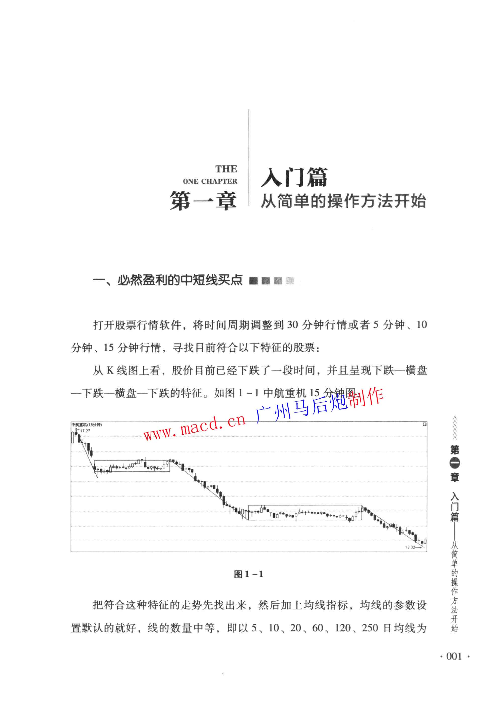

把符合这种特征的走势先找出来，然后加上均线指标，均线的参数设置默认的就好，线的数量中等，即以 5、10、20、60、120、250 日均线为准组成均线系统。如图 1-2：

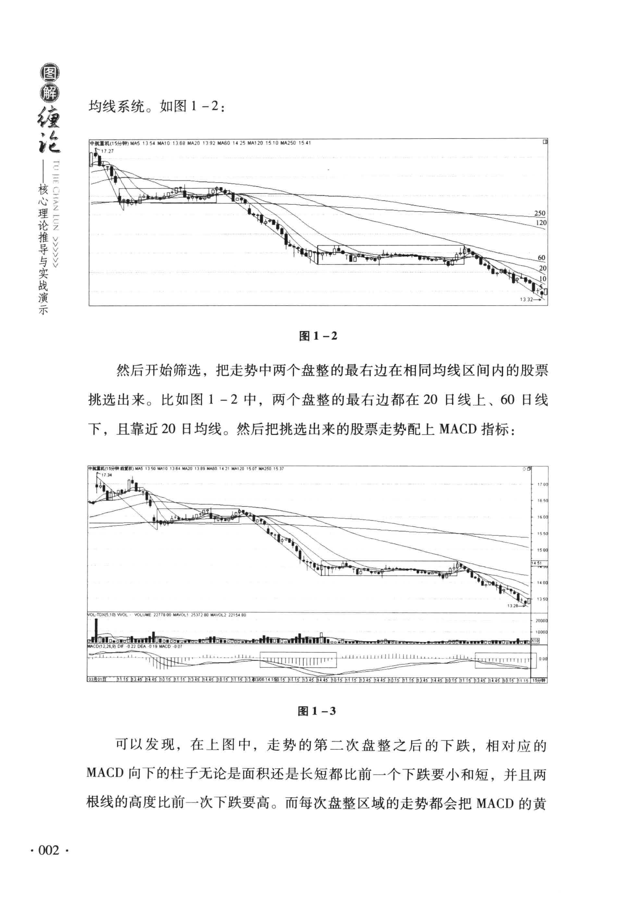

然后开始筛选，把走势中两个盘整的最右边在相同均线区间内的股票挑选出来。比如图 1-2 中，两个盘整的最右边都在 20 日线上、60 日线下，且靠近 20 日均线。然后把挑选出来的股票走势配上 MACD 指标：

可以发现，在上图中，走势的第二次盘整之后的下跌，相对应的 MACD 向下的柱子无论是面积还是长短都比前一个下跌要小和短，并且两根线的高度比前一次下跌要高。而每次盘整区域的走势都会把 MACD 的黄白线拉到零轴附近。符合以上走势特征的股票，在第二次盘整之后的下跌中，选择 5 日均线即将金叉 10 日均线时，或者 MACD 的白线向上拐头即将金叉黄线的时候买入。其后的走势百分之百会回到第二次盘整的区间内。如图 1-4：

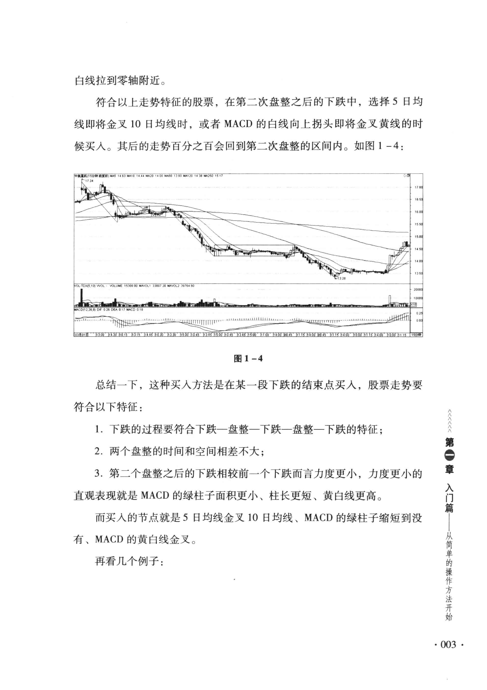

总结一下，这种买入方法是在某一段下跌的结束点买入，股票走势要符合以下特征：

1. 下跌的过程要符合下跌—盘整—下跌—盘整—下跌的特征；
2. 两个盘整的时间和空间相差不大；
3. 第二个盘整之后的下跌相较前一个下跌而言力度更小，力度更小的直观表现就是 MACD 的绿柱子面积更小、柱长更短、黄白线更高。

而买入的节点就是 5 日均线金叉 10 日均线、MACD 的绿柱子缩短到没有、MACD 的黄白线金叉。

再看几个例子：

例 1：福晶科技 15 分钟无均线

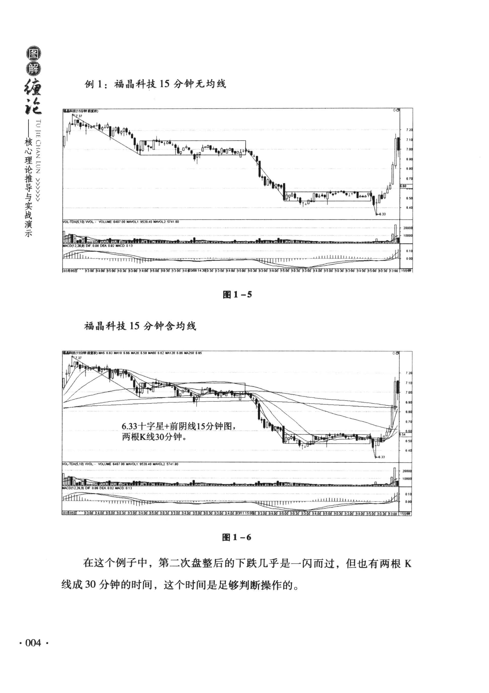

福晶科技 15 分钟含均线

在这个例子中，第二次盘整后的下跌几乎是一闪而过，但也有两根 K 线成 30 分钟的时间，这个时间是足够判断操作的。

例 2：精艺股份（002295）15 分钟

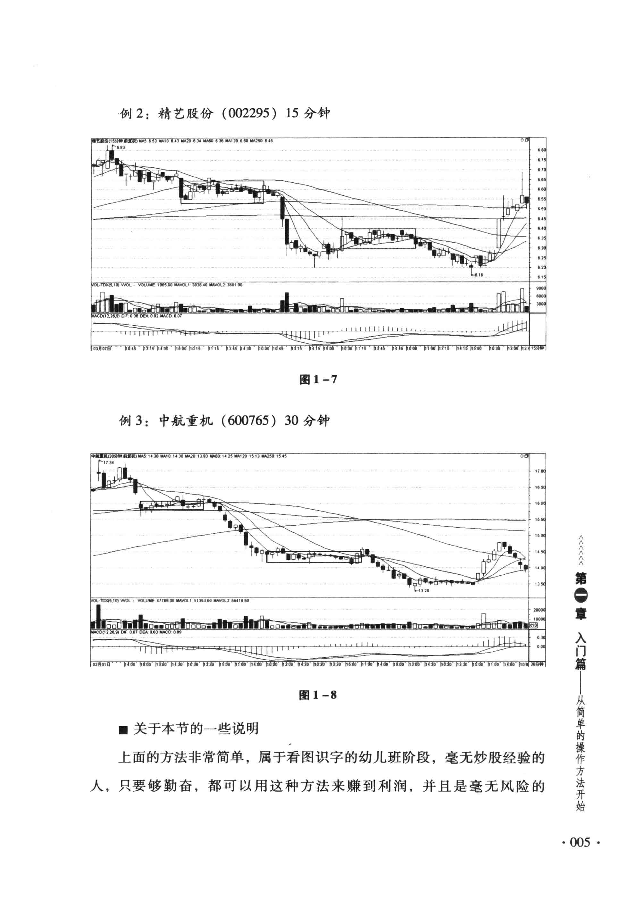

例 3：中航重机（600765）30 分钟

#### 关于本节的一些说明

上面的方法非常简单，属于看图识字的幼儿班阶段，毫无炒股经验的人，只要够勤奋，都可以用这种方法来赚到利润，并且是毫无风险的利润。

这种方法的缺陷在于符合标准的图形并不太好找，当然这种方法的变形可以解决任何买点的问题，但那需要对本书后面内容更好地理解，这里先给出最简单易行的方法，不需要动太多脑筋，但需要动手。从这种层面上面来看，在股市赚钱原来是个体力活！先干起来再说吧。上面是短线的操作，从买进到盈利一般不会超过三天。

从上面的图例也可以看出，有些股票涨得快，有些涨得慢，有的涨幅大，有的涨幅小，如何判断自然也会有相应的方法。本节只解决短线操作赚钱的问题，先把盈利确定了，至于多少、快慢，那在逻辑上是后面的事情了。

值得注意的是，周期越小，可能的盘整次数越多。比如 1 分钟的走势，可能在第三个、第四个盘整之后才出现背驰也是有的，那需要更精准的操作与更严格的判断方法。但在 10 分钟、15 分钟、30 分钟、日线上，基本不会出现两个以上的盘整，相对而言，10 到 30 分钟的比较普遍一点，日线的就较少了。

### 二、必然盈利的中长线买点

中长线的买点指的是日线、周线、月线、季线行情图上的买点，与中短线买点一样，盈利是必然的，只是时间可能更长一点而已。必然盈利的中短线买点买进后，两三天的时间可能获利不到 10%，当然运气好 30% 也说不定，而必然盈利的中长线买点进入后，盈利的空间很可能是数倍。二者的区别在于，劳动强度与盈利的快慢、多少是成正比关系的。

先从季线开始。将行情图设置成“不复权”，在一个季度为一根 K 线的图中，寻找符合以下特征的图形：

1. 之前的走势经历过上涨—下跌—上涨—下跌的过程，这样的循环可以有多个；
2. 目前的股价处于下跌中，并且这次下跌创造的低点比上一次下跌创造的低点更低；
3. 目前的下跌所对应的 MACD 绿柱子比前一次下跌要短、面积更小，对应的黄白线比前一次下跌要高。

如果找到了，那么恭喜你，翻倍的黑马就在你眼前，你要做的就是买入，然后等待。

万科 A - 000002

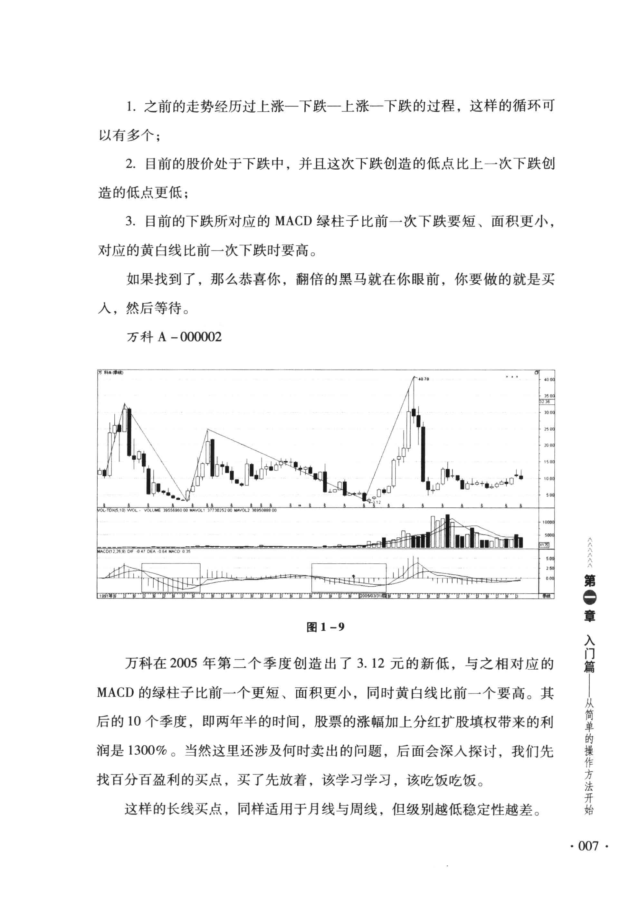

万科在 2005 年第二个季度创造出了 3.12 元的新低，与之相对应的 MACD 的绿柱子比前一个更短、面积更小，同时黄白线比前一个要高。其后的 10 个季度，即两年半的时间，股票的涨幅加上分红扩股填权带来的利润是 1300%。当然这里还涉及何时卖出的问题，后面会深入探讨，我们先找百分百盈利的买点，买了先放着，该学习学习，该吃饭吃饭。

这样的长线买点，同样适用于月线与周线，但级别越低稳定性越差。

再来几个例子：

号百控股 - 600640

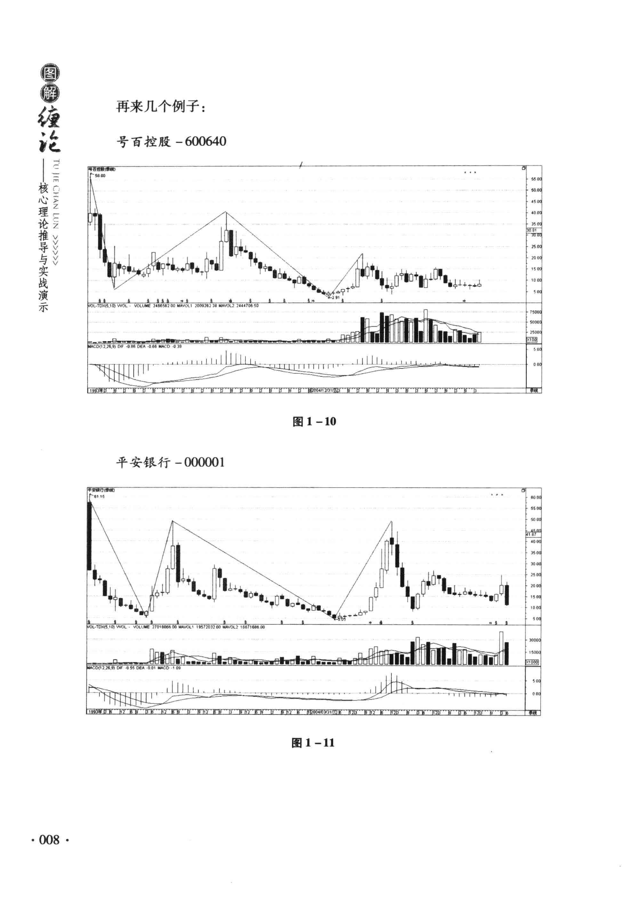

平安银行 - 000001

深振业 A - 000006

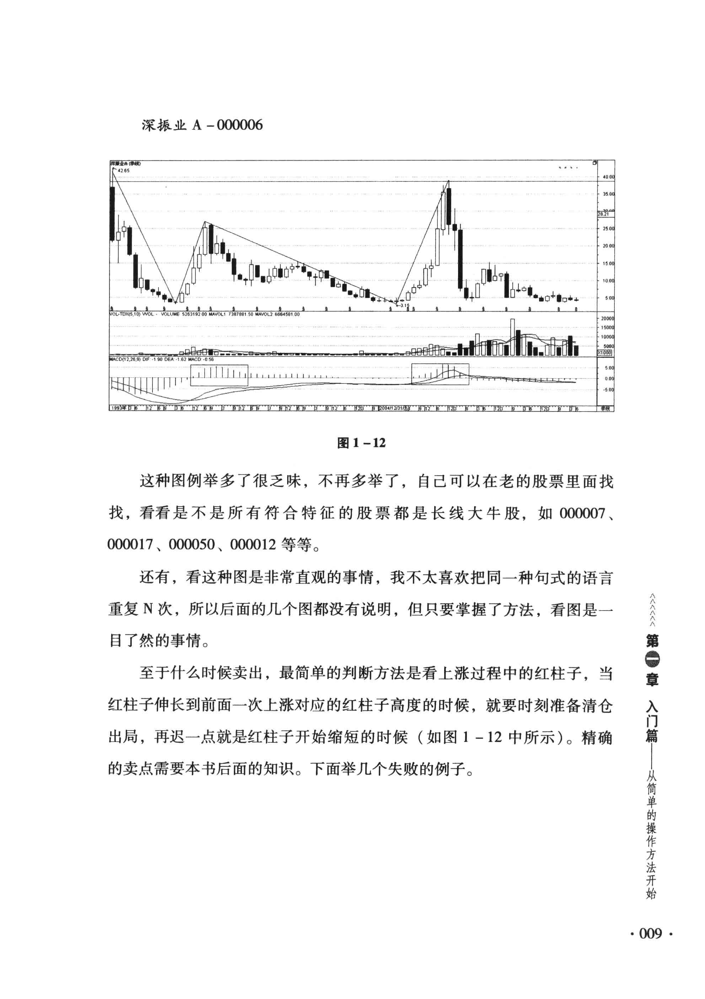

这种图例举多了很乏味，不再多举了，自己可以在老的股票里面找找，看看是不是所有符合特征的股票都是长线大牛股，如 000007、000017、000050、000012 等等。

还有，看这种图是非常直观的事情，我不太喜欢把同一种句式的语言重复 N 次，所以后面的几个图都没有说明，但只要掌握了方法，看图是一目了然的事情。

至于什么时候卖出，最简单的判断方法是看上涨过程中的红柱子，当红柱子伸长到前面一次上涨对应的红柱子高度的时候，就要时刻准备清仓出局，再迟一点就是红柱子开始缩短的时候（如图 1-12 中所示）。精确的卖点需要本书后面的知识。下面举几个失败的例子。

深圳华强 - 000062

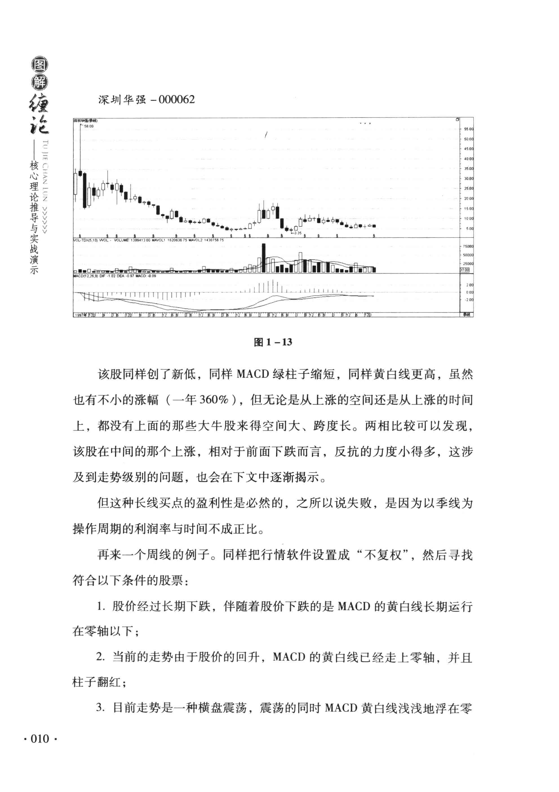

该股同样创了新低，同样 MACD 绿柱子缩短，同样黄白线更高，虽然也有不小的涨幅（一年 360%），但无论是从上涨的空间还是从上涨的时间上，都没有上面的那些大牛股来得空间大、跨度长。两相比较可以发现，该股在中间的那个上涨，相对于前面下跌而言，反抗的力度小得多，这涉及到走势级别的问题，也会在下文中逐渐揭示。

但这种长线买点的盈利性是必然的，之所以说失败，是因为以季线为操作周期的利润率与时间不成正比。

再来一个周线的例子。同样把行情软件设置成“不复权”，然后寻找符合以下条件的股票：

1. 股价经过长期下跌，伴随着股价下跌的是 MACD 的黄白线长期运行在零轴以下；
2. 当前的走势由于股价的回升，MACD 的黄白线已经走上零轴，并且柱子翻红；
3. 目前走势是一种横盘震荡，震荡的同时 MACD 黄白线浅浅地浮在零轴附近。

例 1：常山股份 - 000158

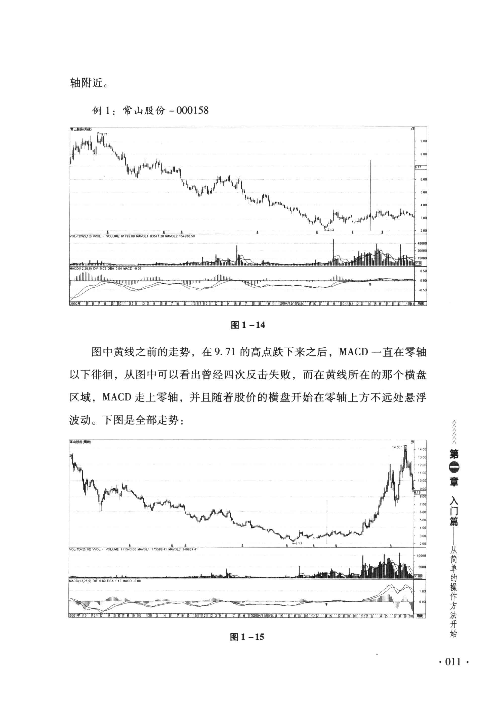

图中黄线之前的走势，在 9.71 的高点跌下来之后，MACD 一直在零轴以下徘徊，从图中可以看出曾经四次反击失败，而在黄线所在的那个横盘区域，MACD 走上零轴，并且随着股价的横盘开始在零轴上方不远处悬浮波动。下图是全部走势：

例 2：冀东水泥（000401）

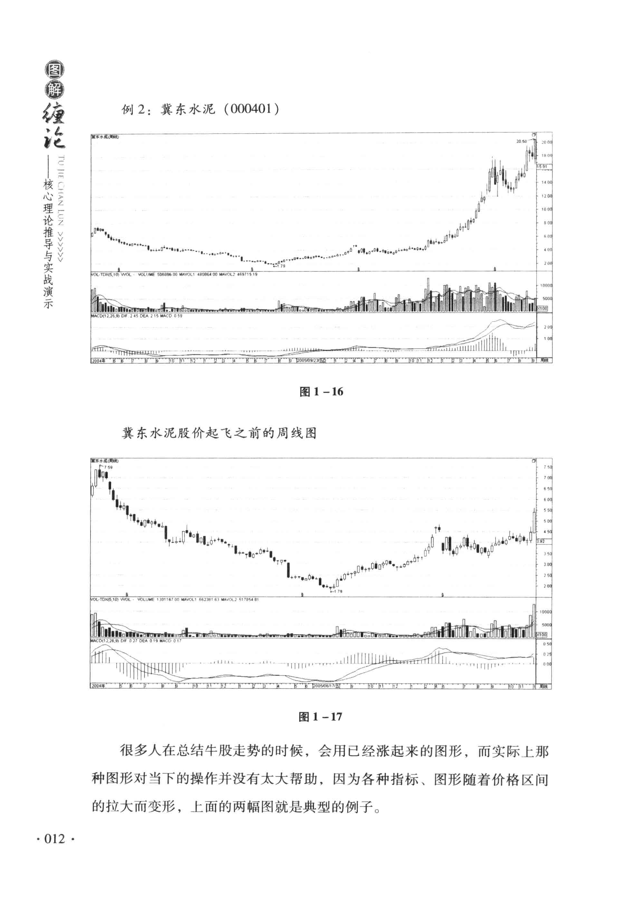

冀东水泥股价起飞之前的周线图

很多人在总结牛股走势的时候，会用已经涨起来的图形，而实际上那种图形对当下的操作并没有太大帮助，因为各种指标、图形随着价格区间的拉大而变形，上面的两幅图就是典型的例子。

这种周线级别买点买入的方法，要注意的是前期的下跌一定要是长期的，具体表现在 MACD 上，黄白线始终在零轴之下运行，并随着下跌过程中的反弹有让柱子翻红的时候。

再举几个例子，不用加文字说明了。

ST 泰复（000409）周线

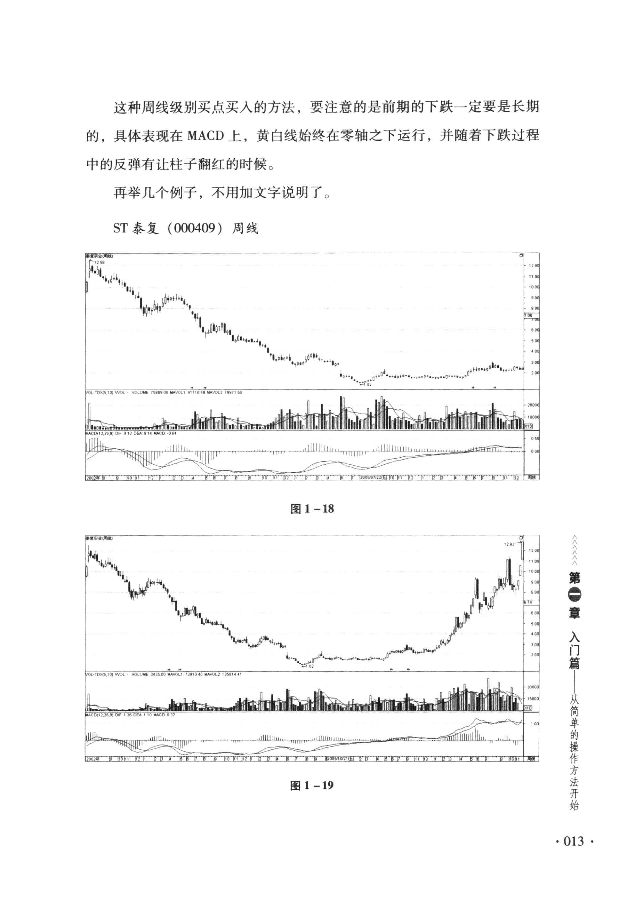

合肥百货（000417）周线

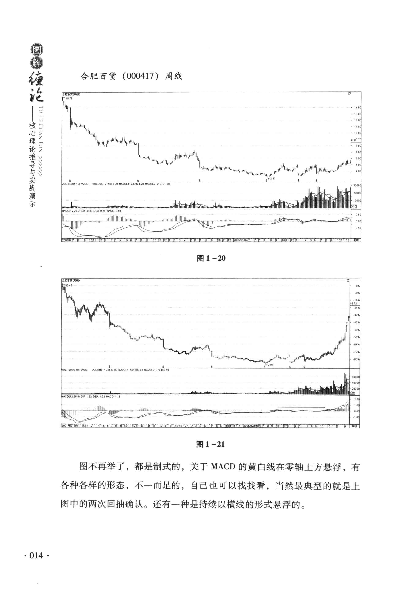

图不再举了，都是制式的，关于 MACD 的黄白线在零轴上方悬浮，有各种各样的形态，不一而足的，自己也可以找找看，当然最典型的就是上图中的两次回抽确认。还有一种是持续以横线的形式悬浮的。

### 三、盘整中的操作

股票的走势中，盘整的时间一定是占一多半的，不懂得如何在盘整中操作赚取利润，始终是不行的，总不能指望每天都在主升浪中。

盘整还有一个好处，可以让中长线的炒股降低成本。比如你可以在上面提到的季线、周线买点买入后，用一部分如 1/3 的资金在日线、30 分钟的盘整中不断来回操作，这样成本会越来越低。盘整操作好了，可以比上涨还赚钱。

照例，上图：

宝新能源（000690）日线

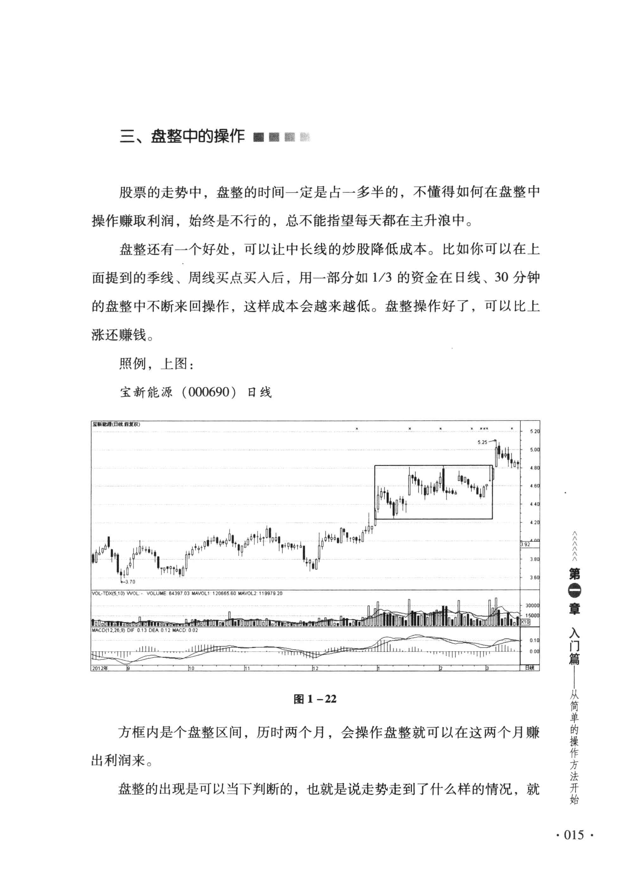

方框内是个盘整区间，历时两个月，会操作盘整就可以在这两个月赚出利润来。

盘整的出现是可以当下判断的，也就是说走势走到了什么样的情况，就应该出现盘整了，有一整套的判断程序，不在这里讨论。简单一点的判断方法是：在中长线的买点买入后，股价缓慢向上推升的过程中，遇到前期的筹码集中区就很容易发生盘整。当然这不是绝对的，比如有些股票就选择连续地涨停冲过筹码集中区。总体而言，这一阶段发生盘整的概率是比较大的。

把行情图的时间周期调整到 60 分钟或者 30 分钟，具体是什么周期根据情况来，以呈现出下图中走势与 MACD 脉冲的一一对应关系为准。

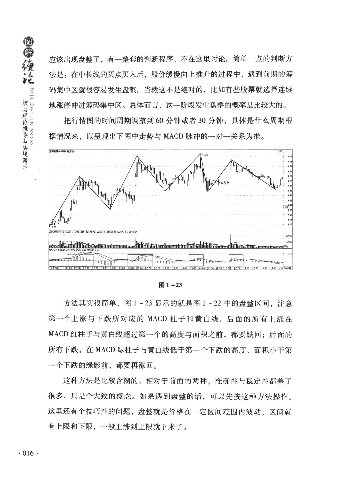

方法其实很简单，图 1-23 显示的就是图 1-22 中的盘整区间，注意第一个上涨与下跌所对应的 MACD 柱子和黄白线，后面的所有上涨在 MACD 红柱子与黄白线超过第一个的高度与面积之前，都要跌回；后面的所有下跌，在 MACD 绿柱子与黄白线低于第一个下跌的高度、面积小于第一个下跌的绿柱前，都要再涨回。

这种方法是比较含糊的，相对于前面的两种，准确性与稳定性都差了很多，只是个大致的概念。如果遇到盘整的话，可以先按这种方法操作。这里还有个技巧性的问题，盘整就是价格在一定区间范围内波动，区间就有上限和下限，一般上涨到上限就下来了。

峨眉山（000888）60 分钟

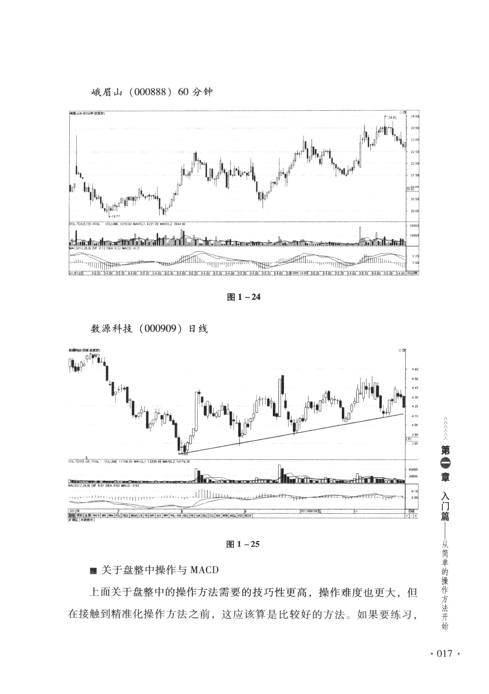

数源科技（000909）日线

#### 关于盘整中操作与 MACD

上面关于盘整中的操作方法需要的技巧性更高，操作难度也更大，但在接触到精准化操作方法之前，这应该算是比较好的方法。如果要练习，可以用少量的资金来操作，通过实践来熟练运用。

MACD 的操作是要把红绿柱和黄白线并列起来看的，比如说遇到两个下跌，第二个下跌能够买入的条件是绿柱子面积更小，并且黄白线更高。

实际上，MACD 是一种辅助判断的工具，反映的是走势的强弱，比 MACD 更准确的是均线，MACD 的各项数值是均线二次加工之后的产物了。

### 四、中小资金迅速成长法

除了以上的几种方法外，还有一种适合资金量不大（百万以下）的高效操作方法，但这种方法不是很容易掌握，因为需要的技巧性非常高，即使是常年炒股的人也会有失误，不是非常适用于刚开始炒股的人。但我相信有天赋的人总会存在的，就先把方法说了，至于其中的道理在后面会讲到。还是那句话，先把钱赚着再说，对于天赋高、运气好的人，这种方法对资产的增值是最快的。

#### 缠论中的第三买点的特征

1. 股票前期经过了长时间的下跌；
2. 目前走势已经突破前期的下跌通道，并回抽站稳；
3. 形成第二节中的走势，即股价回升一些，开始横盘；
4. 当前走势突破了横盘，并且回抽，回抽的低点在横盘上限之上。

葛洲坝（600068）周线

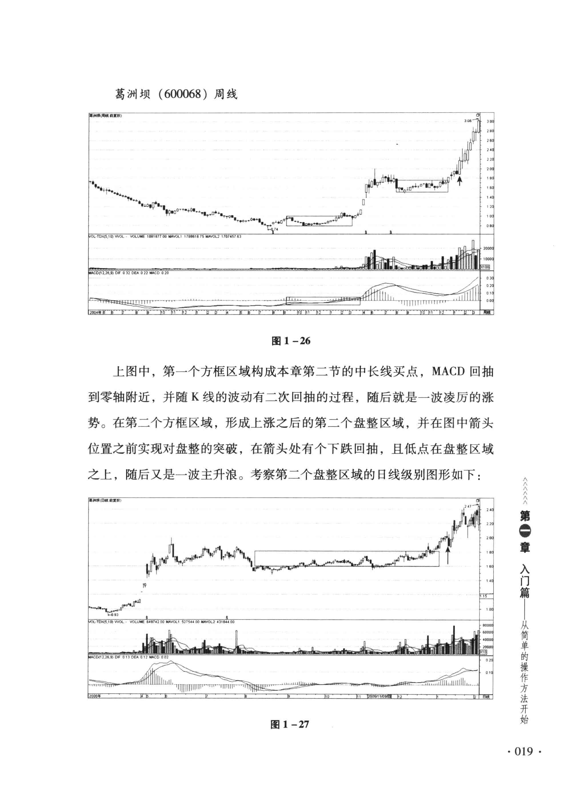

上图中，第一个方框区域构成本章第二节的中长线买点，MACD 回抽到零轴附近，并随 K 线的波动有二次回抽的过程，随后就是一波凌厉的涨势。在第二个方框区域，形成上涨之后的第二个盘整区域，并在图中箭头位置之前实现对盘整的突破，在箭头处有个下跌回抽，且低点在盘整区域之上，随后又是一波主升浪。考察第二个盘整区域的日线级别图形如下：

在日线图中，可以清楚地看到盘整的区间与箭头处的回抽，但是仅仅有以上的图形特征是不行的，因为在实际走势中，假突破的情况是非常多的，如何识别是不是假突破，就是看突破后的回抽，继续考察回抽时的力度，将图形再降一个级别。

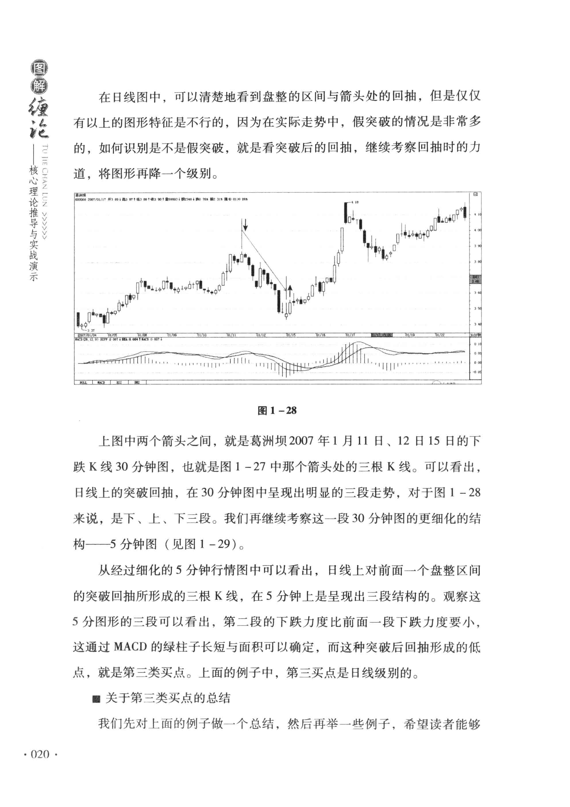

上图中两个箭头之间，就是葛洲坝 2007 年 1 月 11 日、12 日、15 日的下跌 K 线 30 分钟图，也就是图 1-27 中那个箭头处的三根 K 线。可以看出，日线上的突破回抽，在 30 分钟图中呈现出明显的三段走势，对于图 1-28 来说，是下、上、下三段。我们再继续考察这段 30 分钟图的更细化的结构——5 分钟图（见图 1-29）。

从经过细化的 5 分钟行情图中可以看出，日线上对前面一个盘整区间的突破回抽所形成的三根 K 线，在 5 分钟上是呈现出三段结构的。观察这 5 分钟图形的三段可以看出，第二段的下跌力度比前面一段下跌力度要小，这通过 MACD 的绿柱子长短与面积可以确定，而这种突破后回抽形成的低点，就是第三类买点。上面的例子中，第三买点是日线级别的。

#### 关于第三类买点的总结

我们先对上面的例子做一个总结，然后再举一些例子，希望读者能够

---

在看图的过程中加深理解。

这一类买点在传统的炒股技术中同样也是重中之重，因为这种突破回抽确认后的涨幅往往迅猛而巨大，在短期内获利丰厚。但在传统的技术中，这一类突破回抽的买入几乎无法避免假突破的情况，而越是经典的图形用来骗人就越有效，所以正常情况都需要依靠止损来被动防御。也就是说，在回抽中买入后，定下止损线，比如回跌到盘整区间内三分钱就表示这是假突破，就要作清仓处理避免更大损失等。

在上面的方法中，一个日线级别的突破回抽，通过对这回抽的不断细化，考察其更为精细的内部结构，从而把握回抽的低点，再考察这个低点的位置是否回到盘整区域之内，就可以判断出本次回抽是否有效。有效则买入，无效则放弃，是不存在需要止损的问题的。

但有一种情况必须说明，在大势较好的前提下，第三类买点后面往往有至少 20% 的利润，主升浪常常由此展开；而在大势较暧昧的情况下，往往会出现更大的一个盘整。但无论哪一种情况，盈利都是必然的。

回顾一下这种买入方法：

1. 股票经过长期的下跌后回升；

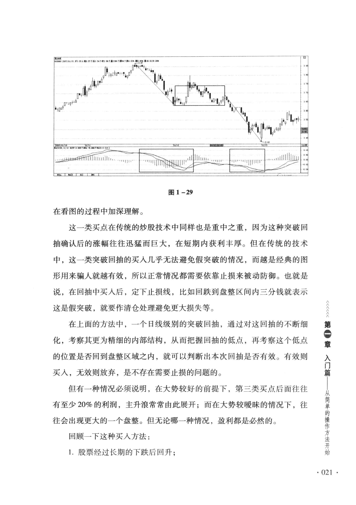

2. 在回升的过程中形成一定跨度与区间的盘整；
3. 对盘整的突破有个回抽确认的过程；
4. 这个日线上的回抽确认，表现在 30 分钟图中将有至少 a + A + b 三段走势，或者「下 + 上 + 下」，或者「下 + 平 + 下」；
5. 继续细化回抽的 30 分钟图，在 5 分钟或者 15 分钟图上对比 b 段与 a 段，通过 MACD 辅助判断，当 b 段的下跌力度小于 a 段时，根据 5 日线与 10 日线的金叉以及 MACD 黄白线的金叉买入。

关于日线、30 分钟线、5 分钟线这样的对应关系，并不是一成不变的，以看得更清楚为准。比如 5 分钟线上波动得多些，看起来就复杂一些，MACD 也不会表现得很干净；而在 15 分钟线上，MACD 非常明显地分别对应三段走势，那就根据 15 分钟的来，不影响判断结果。

可能有人会发现 a + A + b 的走势与第一节中短线买点的 a + A + b + B + c 结构相似。事实上，在回抽过程中，两种情况均有机会出现。如果是第二种情况，就根据第一节的操作方法确定买点。下面再举一些例子：

#### 例 1：维维股份（600300）日线

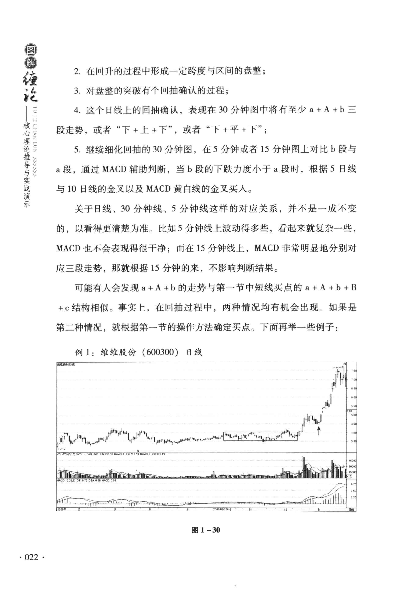

箭头前面一个高点开始的下跌过程 30 分钟图

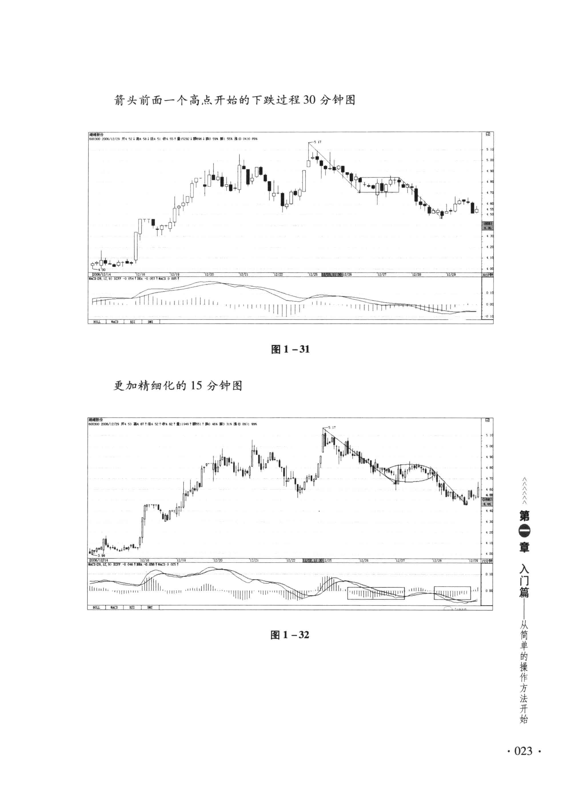

更加精细化的 15 分钟图

稍显复杂的 5 分钟图

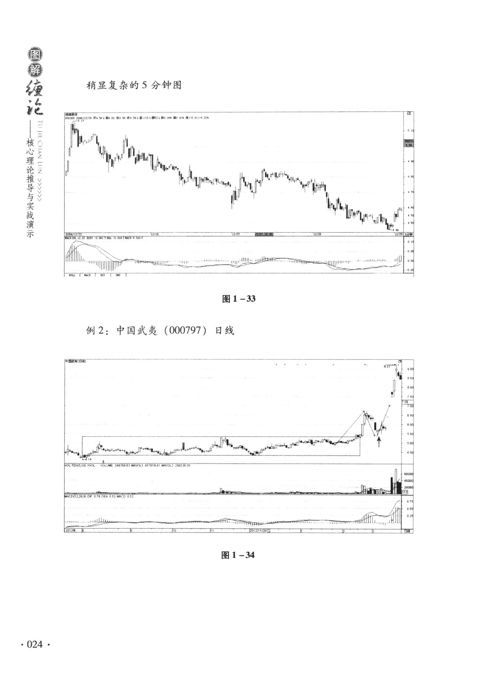

#### 例 2：中国武夷（000797）日线

回抽段 30 分钟图

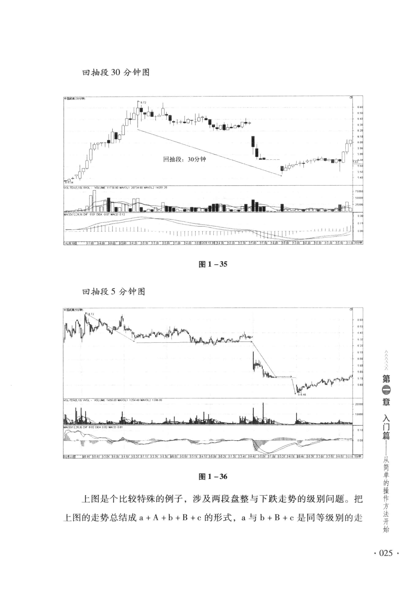

回抽段 5 分钟图

上图是个比较特殊的例子，涉及两段盘整与下跌走势的级别问题。把上图的走势总结成 a + A + b + B + c 的形式，a 与 b + B + c 是同等级别的走势，b 与 c 是同等级别的走势。与之前的例子略有不同，可以先体会其中的区别，具体的分析后面会涉及。

#### 例 3：省广股份（002400）日线

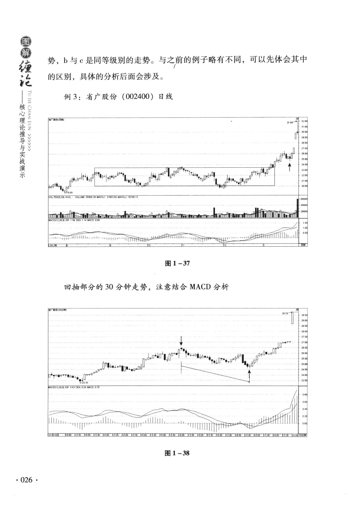

回抽部分的 30 分钟走势，注意结合 MACD 分析

回抽部分的 15 分钟走势

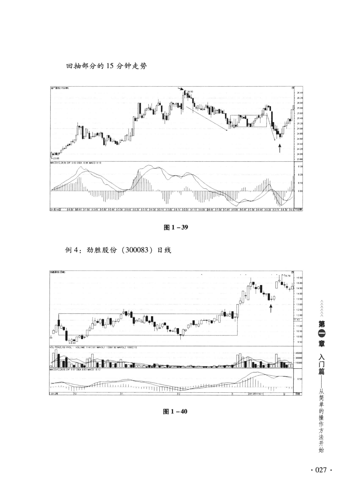

#### 例 4：劲胜股份（300083）日线

回抽部分的 30 分钟走势图

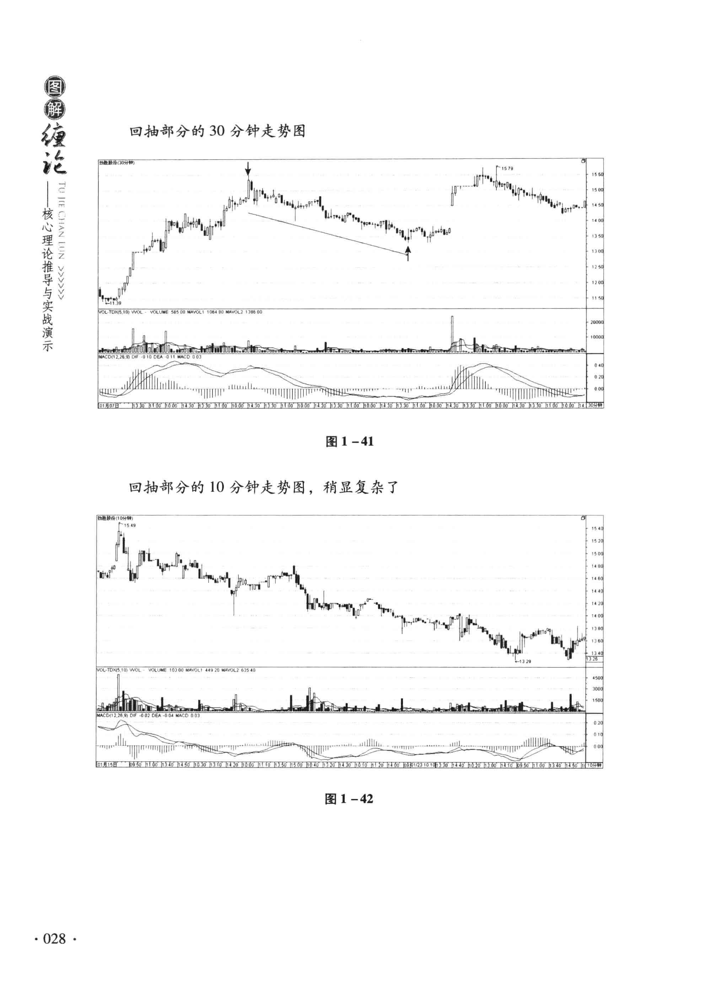

回抽部分的 10 分钟走势图，稍显复杂了

#### 例 5：首旅股份（600258）日线

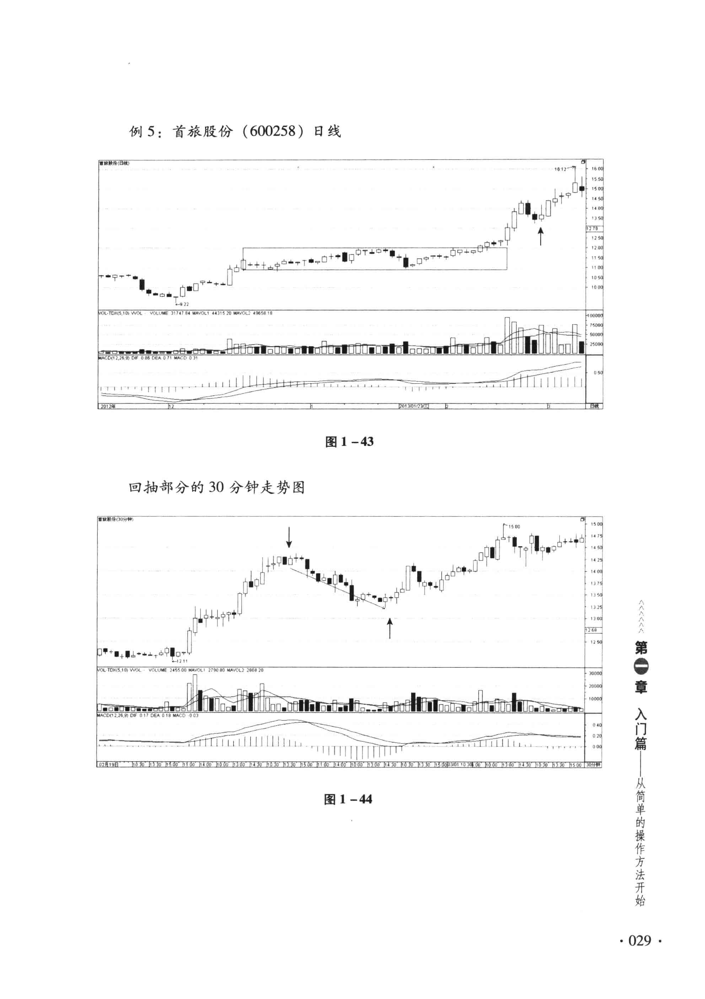

回抽部分的 30 分钟走势图

回抽部分的 5 分钟走势图

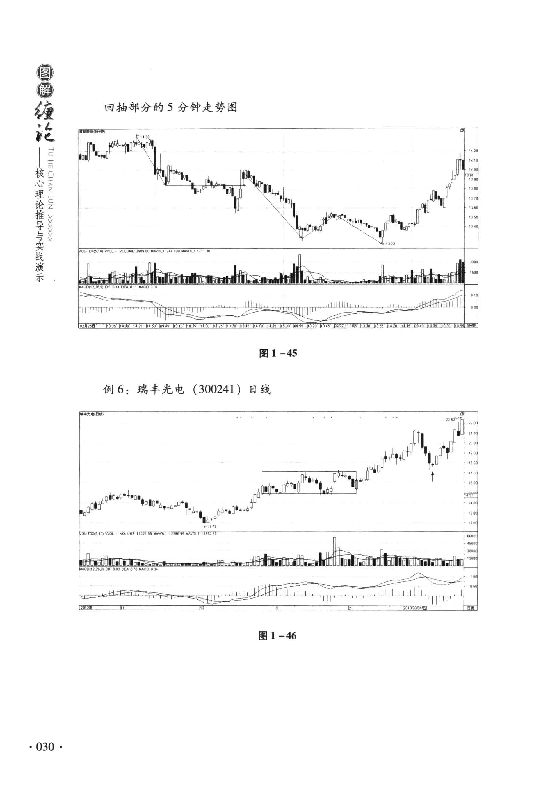

#### 例 6：瑞丰光电（300241）日线

回抽部分的 30 分钟走势图

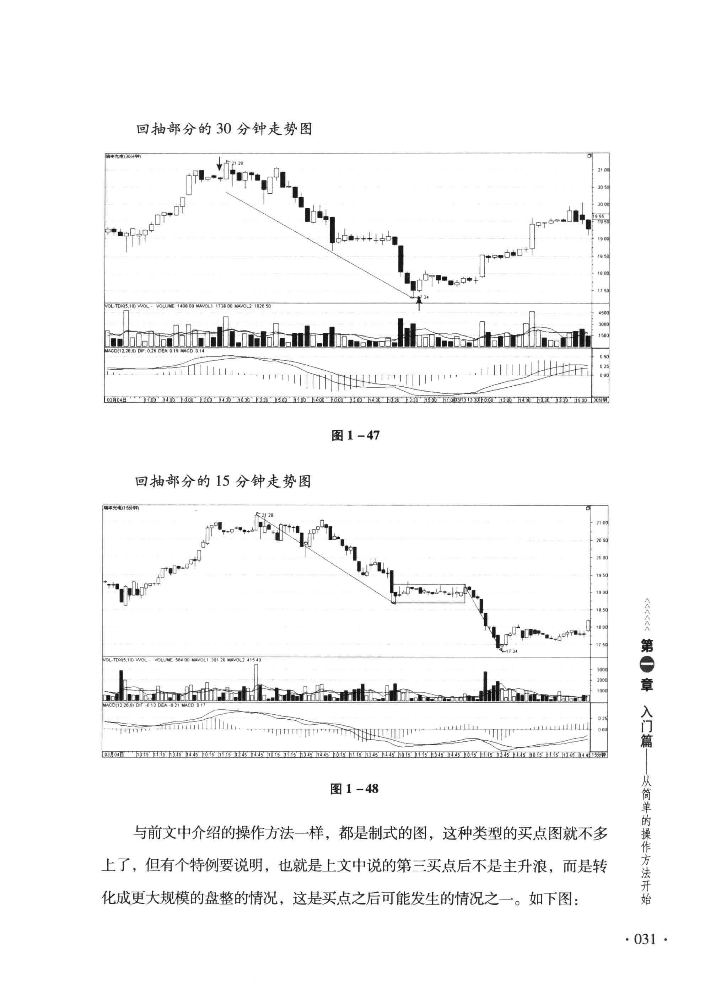

回抽部分的 15 分钟走势图

与前文中介绍的操作方法一样，都是制式的图，这种类型的买点图就不多上了，但有个特例要说明，也就是上文中说的第三买点后不是主升浪，而是转化成更大规模的盘整的情况，这是买点之后可能发生的情况之一。如下图：

#### 例 7：宝新能源（000609）日线图

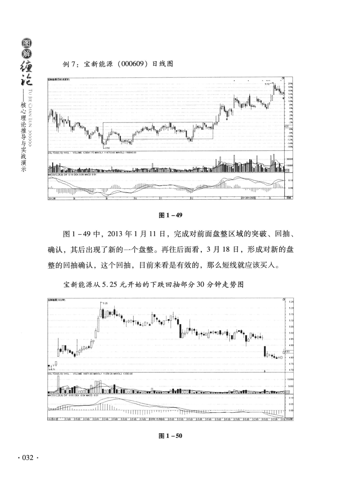

图 1-49 中，2013 年 1 月 11 日，完成对前面盘整区域的突破、回抽、确认，其后出现了新的一个盘整。再往后面看，3 月 18 日，形成对新的盘整的回抽确认，这个回抽，目前来看是有效的，那么短线就应该买入。

宝新能源从 5.25 元开始的下跌回抽部分 30 分钟走势图

### 五、本章内容的总结

本章目的是先把方法介绍了，把钱先赚起来。五种寻找买点的方法就可以应付盘中的大多数情况了，也可以满足不同操作风格的投资者。但一些突发性的情况是没有办法的，比如说印花税提高 3 倍这种事情，就可能把之前的走势破坏了，那么当下的判断也会随之改变，原来定好的操作计划也要跟着变。事实上在股市中，处理突发情况的能力是决定短线投资成绩的主要因素之一。如果想完全避免这种突发情况的风险，那就只有中长线。

2007 年那夜的特大利空对短线客来说绝对是巨大的灾难，但是对从 05 年买进一直持有的长线投资者几乎没有影响，这就是最典型的例子。

当然这种利空是小概率事件，不影响长期的短线操作结果。但如果你站得更高一点的话，第一章里面介绍的几种方法，完全可以组成一套完整的系统。

第一节实际上是缠论中的第一买点，级别越低，可容忍的盘整次数越多。周线上有两个盘整区域的情况就非常罕见了，大级别基本都是一个盘整，前后的下跌形成力度上的强弱对比，这是第一个安全的买点。

第一买点之后，第二节的周线买点操作方法中上涨时的横盘，就是第二安全的买点。这个买点的精确位置，可以通过将级别降低，用寻找第一买点的方法来确认。

盘整中的操作是第二买点形成过程中的操作方法，每次下跌的低点同样可以通过寻找第一买点的方法来定位。

第四节介绍的买点是在第二买点之后的，对第二买点前后盘整区域的突破回抽确认形成。通过第四节的内容可以看出，这里还是采用类似于第一买点的方法来寻找低点。

那么所有的买点其实都可以归结为第一买点，不过根据其出现的位置与时机而有所区别。

之所以说第一章的各种方法可以形成一个系统，是因为长线对短线的操作是可以包容的。长线买点买入之后，通过短线的操作不断降低成本，从而降低操作风险，是一种最完美的操作。要说炒股的风险问题，把成本通过不断的短线操作降低为零，就是零风险，否则风险永远存在。当然这要靠不断地学习、实践、总结，通过长时间的磨炼而实现。在这之前，先赚看得懂的股票。

---

## 第二章 基础篇——认识所有的买卖点

THE TWO CHAPTER

### 一、中枢

#### 1. 中枢的基本认识

对于股市的初学者来说，「中枢」是一个陌生的词汇；而对于学过缠论、看过原文中笔与线段相关内容的人来说，中枢与走势级别的关系会逐渐清晰起来。

中枢的作用，是用来划分和定义走势的结构。若以庖丁解牛作比：K 线的起伏如同皮肉，而上涨、下跌、横盘等走势类型的组合则如同骨骼；中枢所要识别的，正是走势中的「关节」与骨架，从而使整幅图形可以被读解。

#### 2. 中枢的定义

连续三段同级别走势类型的价格重叠区间，称为高一级别的中枢。

照例先上图，道理后面再讲。

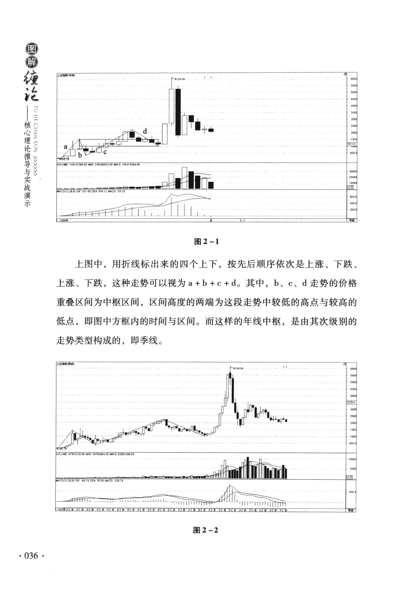

上图中，用折线标出来的四个上下，按先后顺序依次是上涨、下跌、上涨、下跌，这种走势可以视为 a + b + c + d。其中，b、c、d 走势的价格重叠区间为中枢区间，区间高度的两端为这段走势中较低的高点与较高的低点，即图中方框内的时间与区间。而这样的年线中枢，是由其次级别的走势类型构成的，即季线。

从季线图中可以看出，构成年线中枢的三个季线级别走势类型都有着明显的三段走势。当然也可以不止三段，比如五段也是有的，但在大级别的图中比较少见。看到这里就应该想起来第一章第一节的两个盘整，实际上就是某级别的中枢。而 a + b + c 那种类型的走势，实质上构成了高一级别的中枢。

第一章第四节的第三买点（见图 1-27），对盘整区域的突破与回抽，实质上是对日线中枢的突破与回抽，而构成日线中枢的是 30 分钟走势类型，那个回抽是 30 分钟级别的，在 30 分钟图中看着明显的三段走势（见图 1-28）。

中枢，是任何一个级别的走势都必然会出现的特征，也就是说任何一种走势类型的完成，都至少形成一个中枢以后才有可能，这样就对其他的买点有了指导意义。

有些人可能不太明白为什么中枢是必然形成的，这里简单地说一下，详细的道理放在本书的最后。股票的最基本特征就是波动，任何一只股票的走势都不可能一次向下后就永远向上，或者一次向上后就永远向下，由此可以反证得：在股票价格的任何一种走势中，N 形的走势是必然会出现的，这是不论时间和空间的。

由上面得出的结论，就可以对所有股票的所有走势图进行划分，整幅走势图是怎样的一个构成有了较为明晰的概念。

在图 2-2 中，如果要判断某一个走势的结束点，就再降低一个级别，去看月线的走势图，通过 MACD 来辅助，这种判断方法与第一章第一节以及第四节介绍的方法是相同的。

再来看几个中枢的实例：

#### 例 1：上证指数周线中枢，日线图

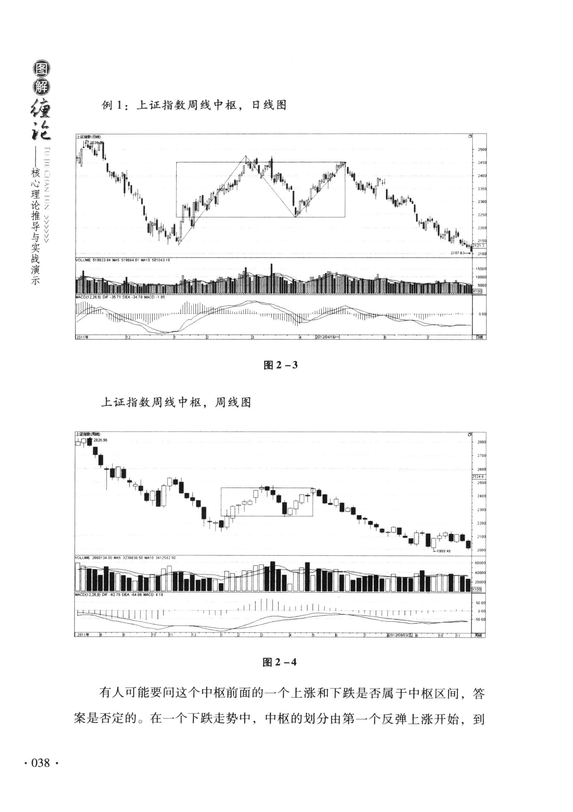

上证指数周线中枢，周线图

有人可能要问这个中枢前面的一个上涨和下跌是否属于中枢区间，答案是否定的。在一个下跌走势中，中枢的划分由第一个反弹上涨开始，到盘整中的最后一个上涨结束，并且这段走势要符合次级别走势类型这一定义。图 2-4 中的周线中枢是在一个下跌过程中形成的，所以前面一个下跌不属于中枢范围，再前面一个反弹的级别太低，不满足次级别走势类型的定义。

另外要注意的是，中枢的区间内并不一定是三个同级别走势类型的重叠，而是至少三个，而一旦达到九个，就形成了三个同级别中枢重叠的状态，这种情况下中枢的级别就上升了。因为根据中枢的定义，三个同级别走势类型的价格区间重叠，构成高一级别的中枢，那么三个日线级别的中枢相重叠，本身就构成了更高一级别的周线中枢。

#### 例 2：中国宝安（000009），日线图表，日线中枢

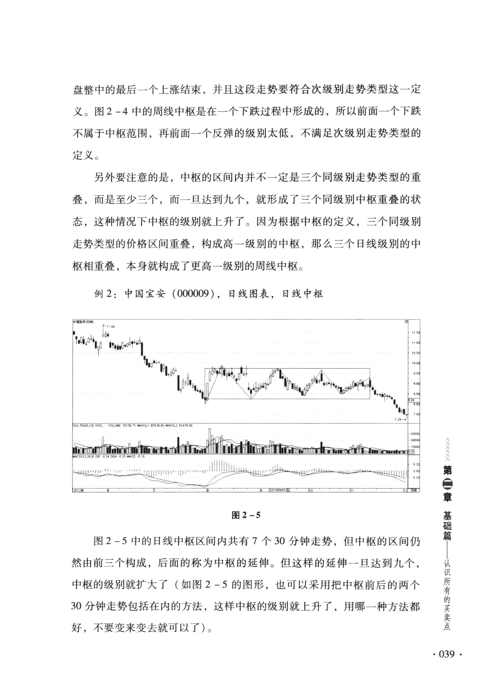

图 2-5 中的日线中枢区间内共有 7 个 30 分钟走势，但中枢的区间仍然由前三个构成，后面的称为中枢的延伸。但这样的延伸一旦达到九个，中枢的级别就扩大了（如图 2-5 的图形，也可以采用把中枢前后的两个 30 分钟走势包括在内的方法，这样中枢的级别就上升了，用哪一种方法都好，不要变来变去就可以了）。

#### 3. 中枢的演化与走势类型

在一个走势中，当第一个中枢形成之后，我们就要观察中枢之后的走势演化。对于走势而言，只有两种选择：一是在走势中不能形成新的中枢；二是在走势中形成第二个，即新的中枢。

第一种情况，称为盘整走势；第二种情况，称为趋势，其中趋势又分为上涨与下跌。

#### 盘整走势一

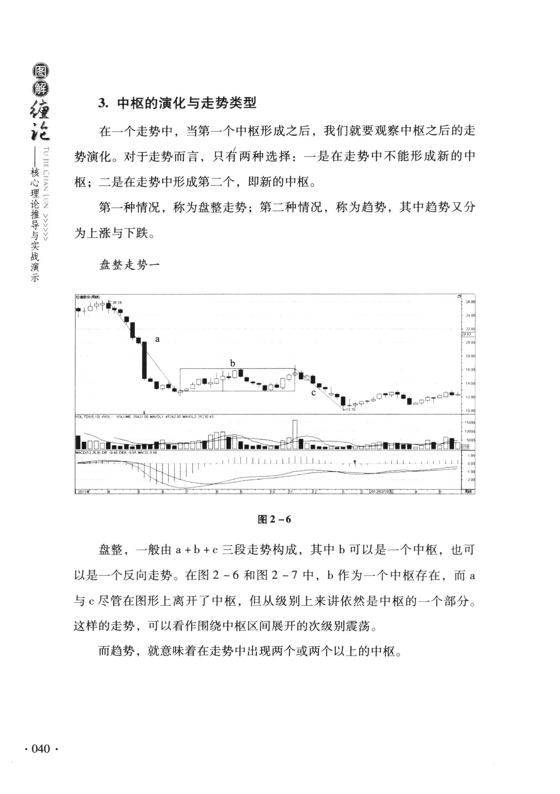

盘整，一般由 a + b + c 三段走势构成，其中 b 可以是一个中枢，也可以是一个反向走势。在图 2-6 和图 2-7 中，b 作为一个中枢存在，而 a 与 c 尽管在图形上离开了中枢，但从级别上来讲依然是中枢的一个部分。这样的走势，可以看作围绕中枢区间展开的次级别震荡。

而趋势，就意味着在走势中出现两个或两个以上的中枢。

### 盘整走势二

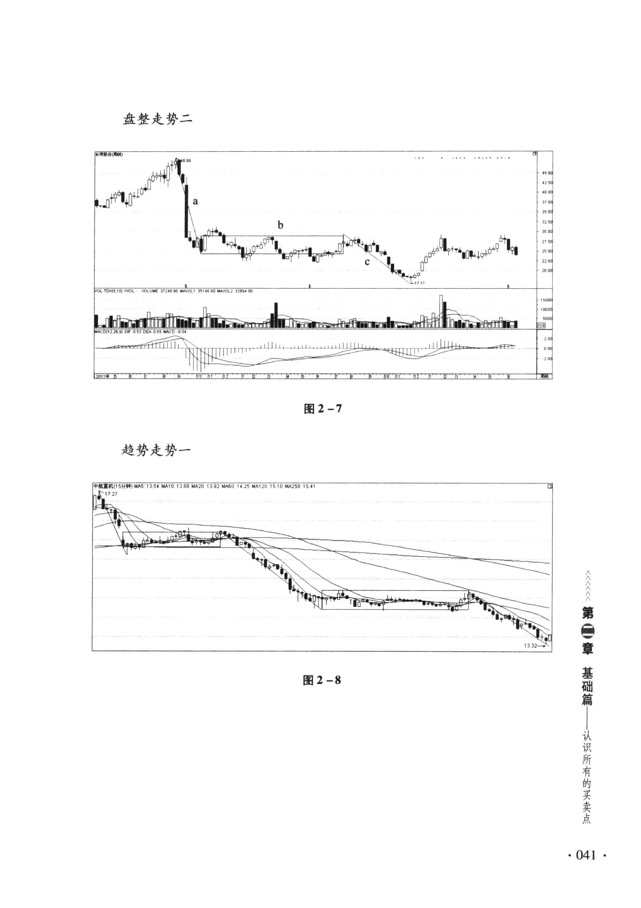

### 趋势走势一

### 趋势走势二

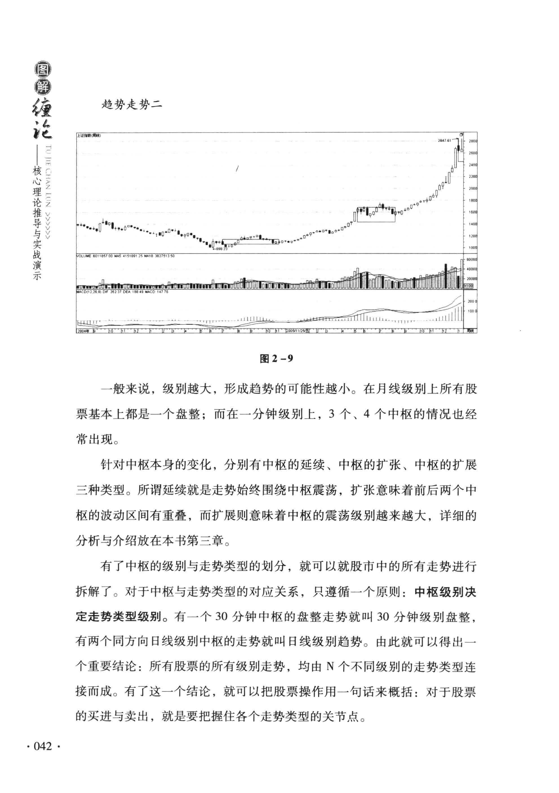

一般来说，级别越大，形成趋势的可能性越小。在月线级别上所有股票基本上都是一个盘整；而在一分钟级别上，3个、4个中枢的情况也经常出现。

针对中枢本身的变化，分别有中枢的延续、中枢的扩张、中枢的扩展三种类型。所谓延续就是走势始终围绕中枢震荡，扩张意味着前后两个中枢的波动区间有重叠，而扩展则意味着中枢的震荡级别越来越大，详细的分析与介绍放在本书第三章。

有了中枢的级别与走势类型的划分，就可以就股市中的所有走势进行拆解了。对于中枢与走势类型的对应关系，只遵循一个原则：**中枢级别决定走势类型级别**。有一个 30 分钟中枢的盘整走势就叫 30 分钟级别盘整，有两个同方向日线级别中枢的走势就叫日线级别趋势。由此就可以得出一个重要结论：所有股票的所有级别走势，均由 N 个不同级别的走势类型连接而成。有了这一个结论，就可以把股票操作用一句话来概括：对于股票的买进与卖出，就是要把握住各个走势类型的关节点。

#### 4. 中枢的形态

对于中枢形态的分类，其标准就是中枢的重心，也就是构成中枢的次级别走势的中间点的连线。

那么对于重心而言，就有平移与斜移两种。平移指的是重心基本保持一条直线，而斜移就包含顺方向和反方向两种。

先来看平移，对于中枢的重心大致保持水平线的情况下，中枢的形态有标准、收敛、扩散三种。如下图：

标准：

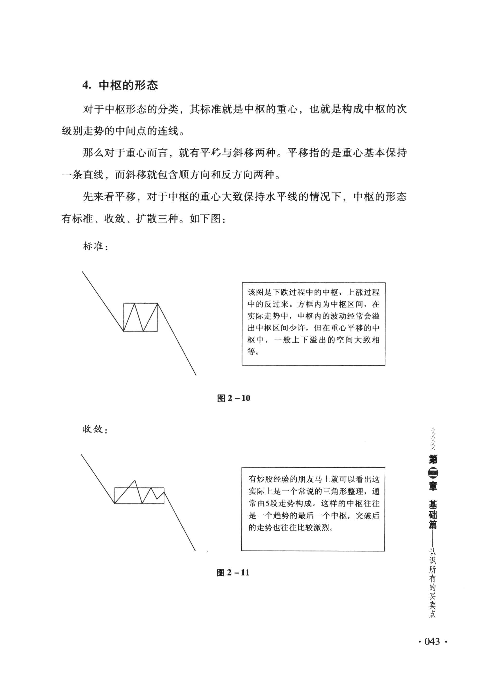

> 该图是下跌过程中的中枢，上涨过程中的反过来。方框内为中枢区间，在实际走势中，中枢内的波动经常会溢出中枢区间少许，但在重心平移的中枢中，一般上下溢出的空间大致相等。

收敛：

> 有炒股经验的朋友马上就可以看出这实际上是一个常说的三角形整理，通常由5段走势构成。这样的中枢往往是一个趋势的最后一个中枢，突破后的走势也往往比较激烈。

扩散：

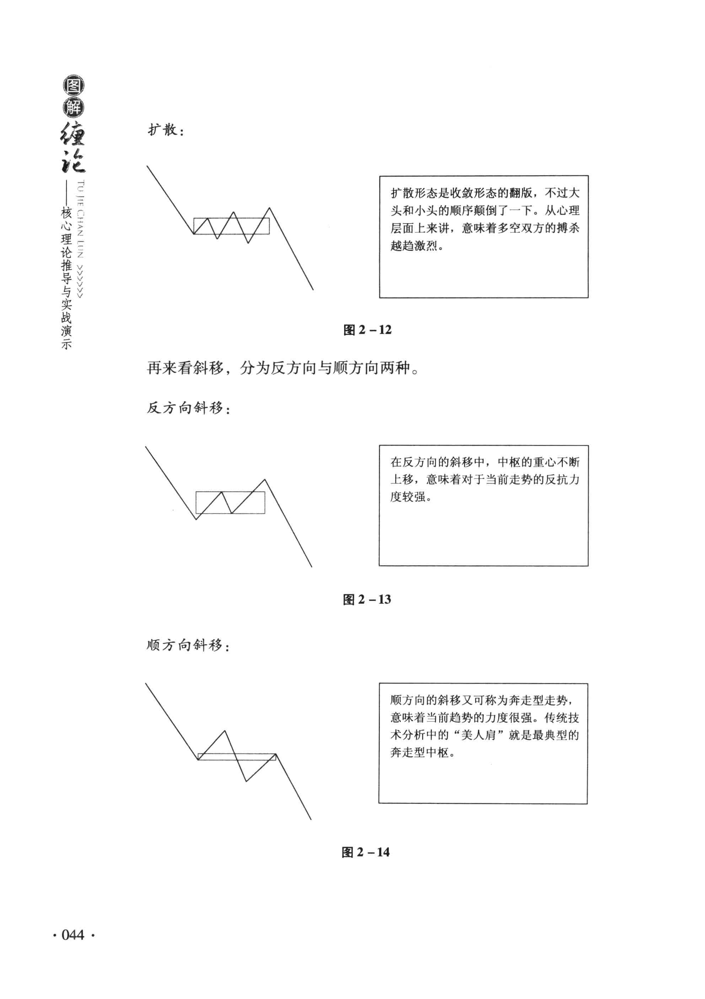

> 扩散形态是收敛形态的翻版，不过大头和小头的顺序颠倒了一下。从心理层面上来讲，意味着多空双方的搏杀越趋激烈。

再来看斜移，分为反方向与顺方向两种。

反方向斜移：

> 在反方向的斜移中，中枢的重心不断上移，意味着对于当前走势的反抗力度较强。

顺方向斜移：

> 顺方向的斜移又可称为奔走型走势，意味着当前趋势的力度很强。传统技术分析中的“美人肩”就是最典型的奔走型中枢。

上面的几个中枢形态的例子采用的是通用的介绍方式，几种类型对应到实际走势中应该是一目了然的。为了对照上面较为抽象的图例，下面按顺序给出实际走势中的例子。

### 中枢平移的标准形态

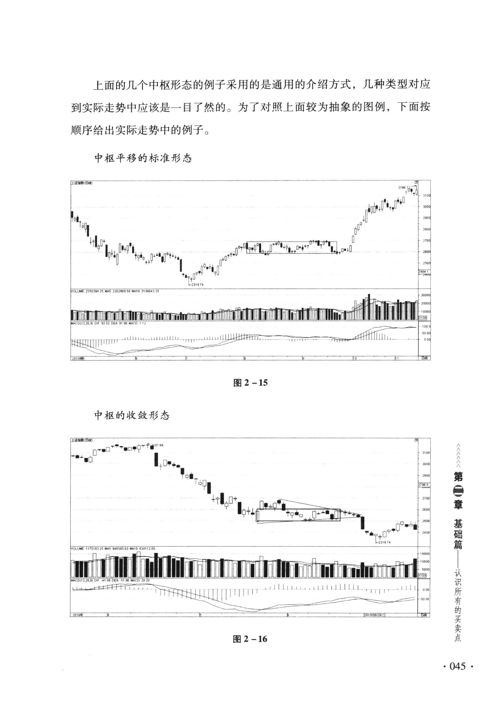

### 中枢的收敛形态

### 顺方向斜移

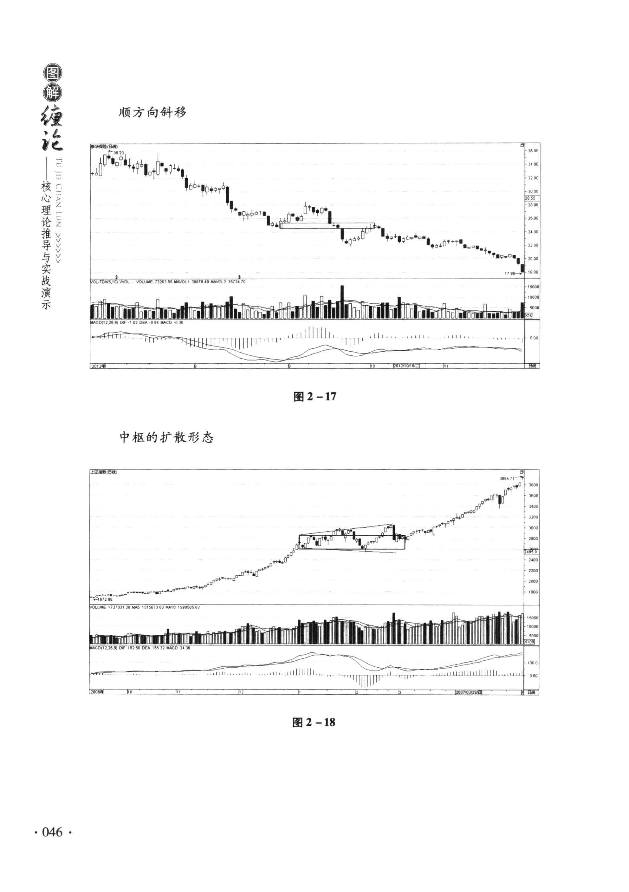

### 中枢的扩散形态

### 5. 中枢的级别

关于中枢的级别问题，其实在下文中已经介绍了一部分，但“级别”作为缠论中的重中之重，个人觉得很有必要单独列出一节来讲。

走势的级别由走势自身的中枢级别决定，而中枢的级别则由构成中枢的次级别走势的级别决定，按照这样的系统可以不断地次级别下去，直到1分钟走势。在1分钟走势图中，可以看到的最小级别的中枢是一个“十字星”K线，再高一级级别就是三根K线的重合。但在实际分析与操作中，往往不需要分析得这么细致，分析某级别的走势，往下两个级别就可以解决所有问题。

首先，任何一个走势类型的完成必定是在形成该级别中枢之后。比如说有一个30分钟级别的上涨走势，那么一个30分钟级别的中枢是必定要形成的，于是任何一个30分钟级别的走势类型如果要完成，a + B + c 式的三段走势是必需的。也就是说，任何一个走势类型要完成，至少要在K线图中呈现出三段走势特征。如上证指数中的年线级别中枢，在年线级别K线图中看就是下、上、下三段，但在次级别，即季线级别走势图中，就可以明显地看出这下、上、下三段走势所呈现出的三段走势（见图2-1和图2-2）。

其次，某级别的走势类型或者中枢，与某级别时间周期的行情图并没有必然的联系。在1分钟图中也可以通过一级一级走势的划分，将年线中枢分辨出来。但在实际应用中，30分钟的中枢在30分钟的行情图中往往看得更加清楚，但有些就可能在日线或者15分钟行情图上看得比较清楚，这个就要根据具体情况考察了。

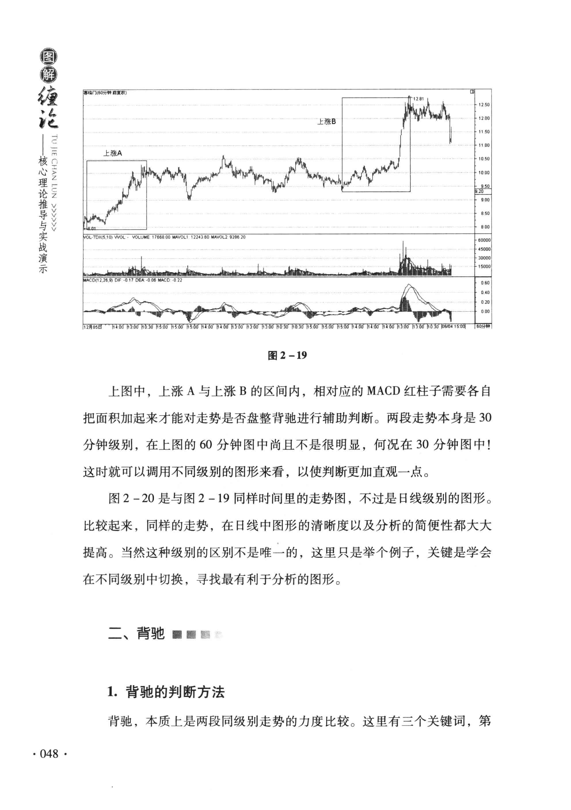

上图中，上涨 A 与上涨 B 的区间内，相对应的 MACD 红柱子需要各自把面积加起来才能对走势是否盘整背驰进行辅助判断。两段走势本身是 30 分钟级别，在上图的 60 分钟图中尚且不是很明显，何况在 30 分钟图中！这时就可以调用不同级别的图形来看，以使判断更加直观一点。

图 2-20 是与图 2-19 同样时间里的走势图，不过是日线级别的图形。比较起来，同样的走势，在日线中图形的清晰度以及分析的简便性都大大提高。当然这种级别的区别不是唯一的，这里只是举个例子，关键是学会在不同级别中切换，寻找最有利于分析的图形。

## 二、背驰

### 1. 背驰的判断方法

背驰，本质上是两段同级别走势的力度比较。这里有三个关键词，第

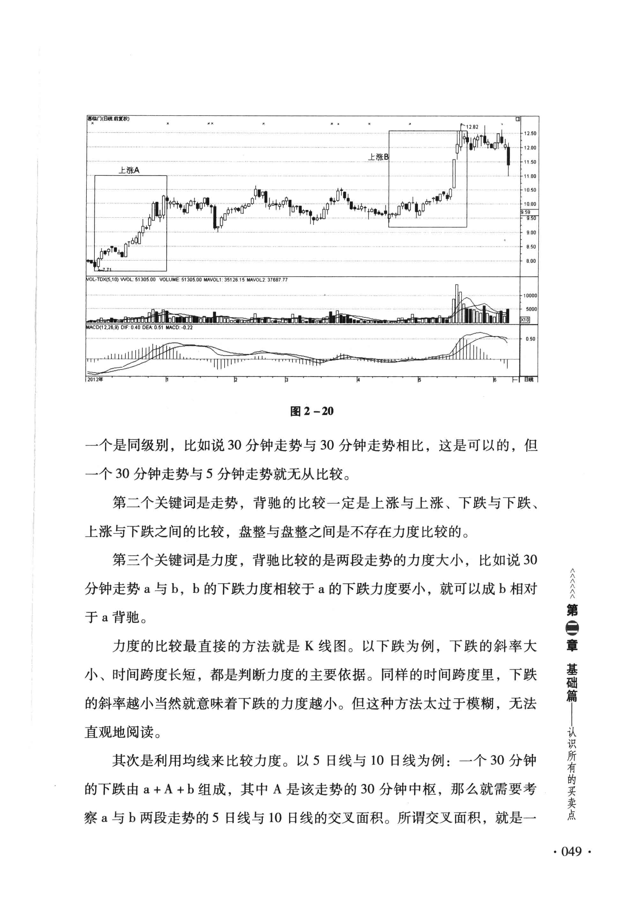

一个是同级别，比如说 30 分钟走势与 30 分钟走势相比，这是可以的，但一个 30 分钟走势与 5 分钟走势就无从比较。

第二个关键词是走势，背驰的比较一定是上涨与上涨、下跌与下跌、上涨与下跌之间的比较，盘整与盘整之间是不存在力度比较的。

第三个关键词是力度，背驰比较的是两段走势的力度大小，比如说 30 分钟走势 a 与 b，b 的下跌力度相较于 a 的下跌力度要小，就可以成 b 相对于 a 背驰。

力度的比较最直接的方法就是 K 线图。以下跌为例，下跌的斜率大小、时间跨度长短，都是判断力度的主要依据。同样的时间跨度里，下跌的斜率越小当然就意味着下跌的力度越小。但这种方法太过于模糊，无法直观地阅读。

其次是利用均线来比较力度。以 5 日线与 10 日线为例：一个 30 分钟的下跌由 a + A + b 组成，其中 A 是该走势的 30 分钟中枢，那么就需要考察 a 与 b 两段走势的 5 日线与 10 日线的交叉面积。所谓交叉面积，就是一段走势中，金叉到死叉或者死叉到金叉之间的闭合区间的面积。上图中为标准的 a + A + b 走势，a 和 b 中，5 日均线与 10 日均线的金叉到死叉的面积即为交叉面积，背驰的比较是 b 段的交叉面积与 a 段的交叉面积大小比较。

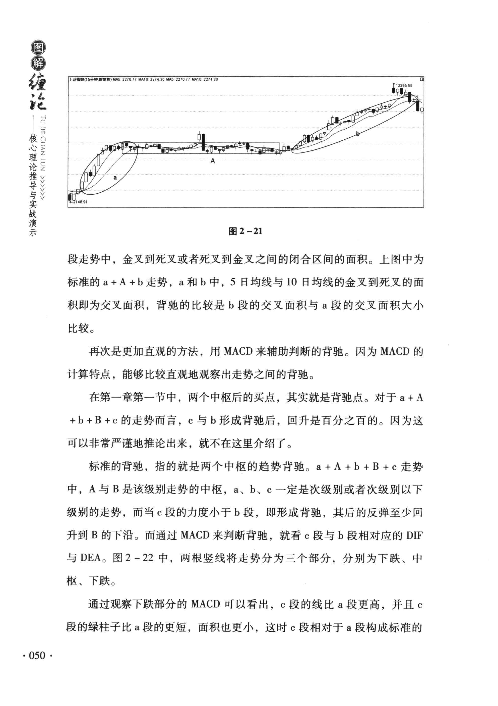

再次是更加直观的方法，用 MACD 来辅助判断的背驰。因为 MACD 的计算特点，能够比较直观地观察出走势之间的背驰。

在第一章第一节中，两个中枢后的买点，其实就是背驰点。对于 a + A + b + B + c 的走势而言，c 与 b 形成背驰后，回升是百分之百的。因为这可以非常严谨地推论出来，就不在这里介绍了。

标准的背驰，指的就是两个中枢的趋势背驰。a + A + b + B + c 走势中，A 与 B 是该级别走势的中枢，a、b、c 一定是次级别或者次级别以下级别的走势，而当 c 段的力度小于 b 段，即形成背驰，其后的反弹至少回升到 B 的下沿。而通过 MACD 来判断背驰，就看 c 段与 b 段相对应的 DIF 与 DEA。图 2-22 中，两根竖线将走势分为三个部分，分别为下跌、中枢、下跌。

通过观察下跌部分的 MACD 可以看出，c 段的线比 a 段更高，并且 c 段的绿柱子比 a 段的更短，面积也更小，这时 c 段相对于 a 段构成标准的背驰。c 段成为背驰段。在大级别走势中，尤其在月线级别以上，这样的背驰后面往往是一个时间与空间跨度都比较大的上涨。而精确的买点如何寻找，就要考察背驰段的内部结构。这可以通过次级别的走势来判断，因为次级别的走势如果要完成，就必须要有一个同级别的中枢。同样的，次级别的走势也是至少由 a₁、b₁、c₁ 三段构成，这样就可以继续考察 c₁ 段与 a₁ 段的力度，如果形成背驰，就继续向次级别考察 c₁ 段的内部结构，这样的推演可以一直持续到 1 分钟走势图中，从而定位出最为精确的转折点。卖点的判断与买点相反，也就是判断两段上涨走势的力度，判断方法与下跌中的判断是一致的。

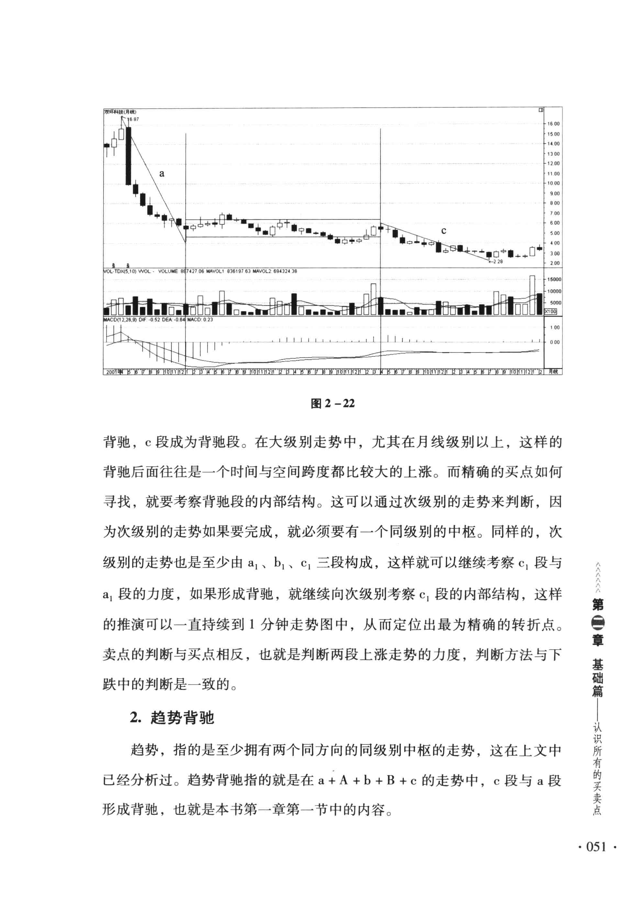

#### 2. 趋势背驰

趋势，指的是至少拥有两个同方向的同级别中枢的走势，这在正文中已经分析过。趋势背驰指的就是在 a + A + b + B + c 的走势中，c 段与 a 段形成背驰，也就是本书第一章第一节中的内容。

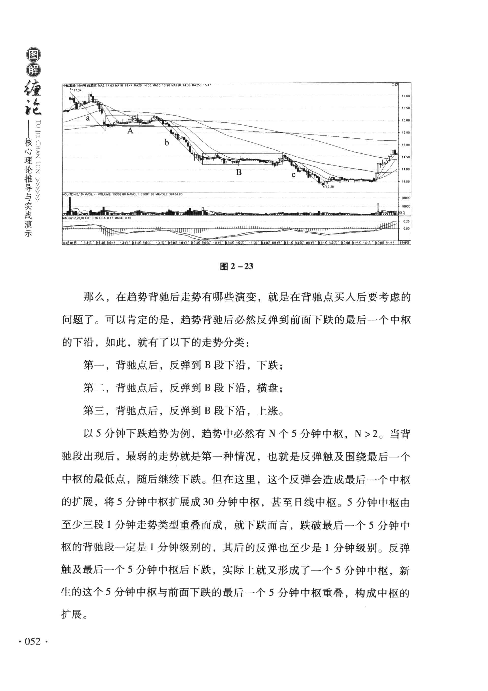

那么，在趋势背驰后走势有哪些演变，就是在背驰点买入后要考虑的问题了。可以肯定的是，趋势背驰后必然反弹到前面下跌的最后一个中枢的下沿，如此，就有了以下的走势分类：

第一，背驰点后，反弹到 B 段下沿，下跌；

第二，背驰点后，反弹到 B 段下沿，横盘；

第三，背驰点后，反弹到 B 段下沿，上涨。

以 5 分钟下跌趋势为例，趋势中必然有 N 个 5 分钟中枢，N > 2。当背驰段出现后，最弱的走势就是第一种情况，也就是反弹触及围绕最后一个中枢的最低点，随后继续下跌。但在这里，这个反弹会造成最后一个中枢的扩展，将 5 分钟中枢扩展成 30 分钟中枢，甚至日线中枢。5 分钟中枢由至少三段 1 分钟走势类型重叠而成，就下跌而言，跌破最后一个 5 分钟中枢的背驰段一定是 1 分钟级别的，其后的反弹也至少是 1 分钟级别。反弹触及最后一个 5 分钟中枢后下跌，实际上就又形成了一个 5 分钟中枢，新生的这个 5 分钟中枢与前面下跌的最后一个 5 分钟中枢重叠，构成中枢的扩展。

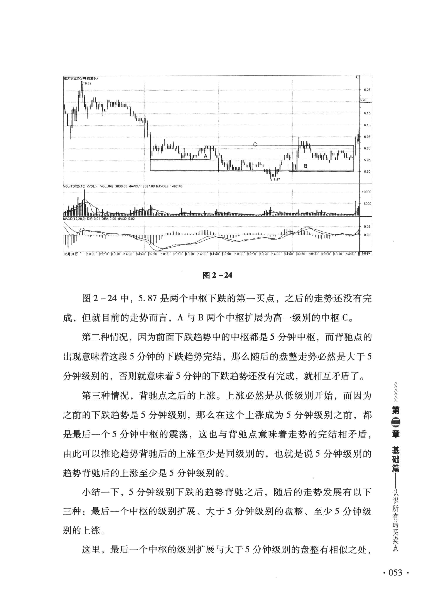

图 2-24 中，5.87 是两个中枢下跌的第一买点，之后的走势还没有完成，但就目前的走势而言，A 与 B 两个中枢扩展为高一级别的中枢 C。

第二种情况，因为前面下跌趋势中的中枢都是 5 分钟中枢，而背驰点的出现意味着这段 5 分钟的下跌趋势完结，那么随后的盘整走势必然是大于 5 分钟级别的，否则就意味着 5 分钟的下跌趋势还没有完成，就相互矛盾了。

第三种情况，背驰点之后的上涨。上涨必然是从低级别开始，而因为之前的下跌趋势是 5 分钟级别，那么在这个上涨成为 5 分钟级别之前，都是最后一个 5 分钟中枢的震荡，这也与背驰点意味着走势的完结相矛盾，由此可以推论趋势背驰后的上涨至少是同级别的，也就是说 5 分钟级别的趋势背驰后的上涨至少是 5 分钟级别的。

小结一下，5 分钟级别下跌的趋势背驰之后，随后的走势发展有以下三种：最后一个中枢的级别扩展、大于 5 分钟级别的盘整、至少 5 分钟级别的上涨。

这里，最后一个中枢的级别扩展与大于 5 分钟级别的盘整有相似之处，但绝对不同，因为级别的扩展意味着前面的 5 分钟下跌趋势是属于一个 30 分钟走势中的一部分，而这个 30 分钟级别的下跌刚刚走出第一个中枢。而第二种情况意味着一个 5 分钟级别趋势与大于 5 分钟级别盘整的连接，盘整之后的演化就有上涨与下跌两种，两种情况是截然不同的。

根据上面的推论，就知道为什么第一章第一节的双中枢后背驰的盈利是百分之百的了，因为哪怕是最弱的一种走势都有盈利的空间。至于为什么背驰意味着走势的完结，就是后面的内容了，还是一个宗旨：从易到难。

在实际操作中，一个 30 分钟的趋势背驰点出现后，就可以先行买进，然后等待上涨，这个上涨一定是从 1 分钟上涨慢慢演化到 5 分钟的。而当上涨触及到前面最后一个中枢的下沿时，判断这个上涨的级别，然后根据次级别走势判断此时是否发生上涨背驰。出现就先卖掉，因为后面至少是高于上涨级别的盘整或者直接下跌；没有出现背驰，就淌着口水等待走势继续上涨。这时的走势就只有两种变化了：一是日线级别的中枢，二是 30 分钟级别的上涨，那么就等待 30 分钟的中枢出现后再说。

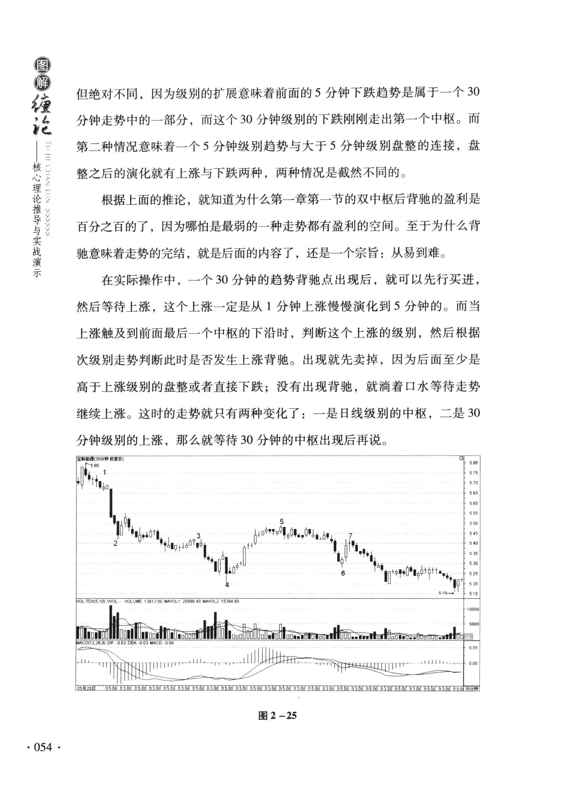

图 2-25（30 分钟）中一些重要的高低点被标注出来（不是线段），2-3 构成 5 分钟中枢，4 是盘整背驰点，所以 3-4 只是围绕 2-3 中枢的震荡，随后的上涨到 5 时，4-5 这个 1 分钟级别的上涨出现背驰。随后下跌到 6，再然后 6-7 构成次级别的第三类卖点。下图是 4-5 段的 5 分钟级别走势，对照 MACD 判断，背驰是非常明显的。

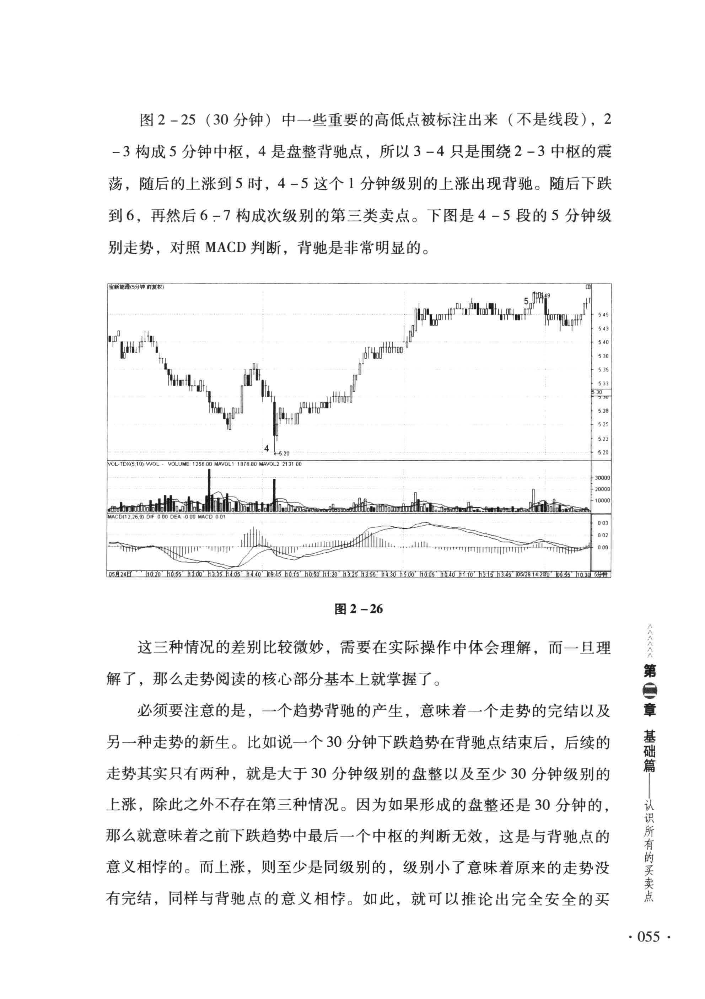

这三种情况的差别比较微妙，需要在实际操作中体会理解，而一旦理解了，那么走势阅读的核心部分基本上就掌握了。

必须要指出的是，一个趋势背驰的产生，意味着一个走势的完结以及另一种走势的新生。比如说一个 30 分钟下跌趋势在背驰点结束后，后续的走势其实只有两种，就是大于 30 分钟级别的盘整以及至少 30 分钟级别的上涨，除此之外不存在第三种情况。因为如果形成的盘整还是 30 分钟的，那么就意味着之前下跌趋势中最后一个中枢的判断无效，这是与背驰点的意义相悖的。而上涨，则至少是同级别的，级别小了意味着原来的走势没有完结，同样与背驰点的意义相悖。如此，就可以推论出完全安全的买点了。

### 3. 盘整背驰与背驰的推广运用

盘整背驰是针对盘整走势而言的，盘整走势意味着只有一个中枢，而在某级别中枢前后的走势只能是小于该中枢级别的。比如说 a + A + b 三段走势，A 是 30 分钟中枢，那么 a 与 b 最多就是 5 分钟级别的走势，最极端可能只是跳空缺口。而盘整背驰，比较的就是 a 与 b 的力度。

盘整背驰的判断方法与趋势背驰的判断方法完全一致，就不多介绍了，这里要讲的是盘整背驰后的走势演化。

以下跌为例，a + A + b 走势中，b 段与 a 段形成背驰，考察背驰段 b 的次级别走势，确定背驰点之后，反弹是必然的，但这里的反弹并不一定触及 A 中枢的下沿。假设 A 是 30 分钟中枢，b 段的背驰点出现后，首先会有小于 30 分钟级别的上涨，这个上涨可以是 5 分钟级别，也可以是 1 分钟级别，理论上都可能出现。但如果是 5 分钟级别的上涨，在这个 5 分钟级别上涨的背驰点出现后，价格还没有触及 A 中枢的下沿，这时就意味着有两种情况将要发生：一种是继续下跌，一种是形成新的 30 分钟中枢 B。

盘整背驰在实际应用中最有价值的就是上面所说的，以次级别走势突破中枢，并且次级别回抽不回到中枢内的情况。应用在上涨中，就构成第三类买点，这样的买点出现后，往往会有较为凌厉的上涨。第一章中提供的突破回抽确认买入方法就是属于这一类。

另外一种具有实际操作价值的就是在大级别走势中，如周线、月线、季线中，因为在这类级别的行情图中，出现两个中枢的趋势的时间跨度太大，而因为级别的原因，盘整背驰后的上涨体现在日线中往往非常客观。

此外，在盘整走势中，因为盘整本身就是一个中枢，通常也可以归类为盘整走势，那么就中枢的 a + b + c 而言，c 段与 a 段形成背驰也可以称

为盘整背驰。比如说下、上、下的三段走势中枢盘整，如果后一个“下”相对于前一个“下”形成背驰，那么后一段走势还会回到中枢区间内。而一旦后一个“下”的力度比前一个“下”要大，这就要注意了，因为走势很可能惯性地下跌，从而跌破中枢。关于盘整走势中的操作方法，在第一章也介绍过了，图就不再另外上了。

由于背驰是基于力度的分析而得的，所以在实际操作中，往往也可以用于不同方向走势的力度判断。比如中枢 A，在 A 前是一个下跌走势 a，在 A 后是一个上涨走势 b，那么 a 与 b 之间也是可以考察力度的强弱的。一般情况下，如果 b 的力度小于 a 的力度，b 还是会跌回到中枢 A 中的，这就属于背驰的推广运用了。

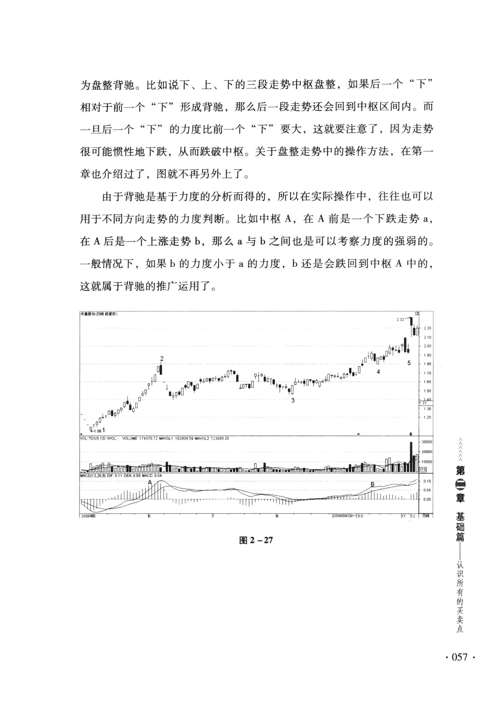

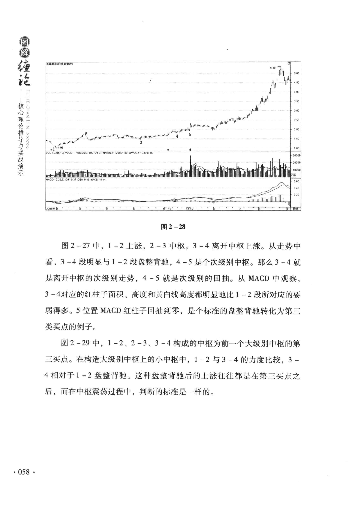

图 2-27 中，1-2 上涨，2-3 中枢，3-4 离开中枢上涨。从走势中看，3-4 段明显与 1-2 段盘整背驰，4-5 是个次级别中枢。那么 3-4 就是离开中枢的次级别走势，4-5 就是次级别的回抽。从 MACD 中观察，3-4 对应的红柱子面积、高度和黄白线高度都明显地比 1-2 段所对应的要弱得多。5 位置 MACD 红柱子回抽到零，是个标准的盘整背驰转化为第三类买点的例子。

图 2-29 中，1-2、2-3、3-4 构成的中枢为前一个大级别中枢的第三买点。在构造大级别中枢上的小中枢中，1-2 与 3-4 的力度比较，3-4 相对于 1-2 盘整背驰。这种盘整背驰后的上涨往往都是在第三买点之后，而在中枢震荡过程中，判断的标准是一样的。


## 三、三个安全的买点

#### 1. 第一买点

第一买点就是趋势背驰点。在趋势中，中枢的数量大于或者等于2。

以最经典的 a + A + b + B + c 走势为例，A 与 B 是同级别的中枢，a、b、c 为次级别或以下级别的走势，当 c 相对于 b 形成背驰，即构成第一买点。

对于 c 这一背驰段的次级别考察，可以不断地将买点的范围缩小，最终确定足够精确的买点，这个买点是绝对安全的，称为第一买点，卖点的情况与买点相反。

在“趋势背驰”那一节，我提过第一买点后的三种走势情况，从中可以发现，无论哪一种后续走势演化，都至少先有一个次级别的上涨。


银润投资（000526），2011年4月28日开始下跌，经过两个日线级别的中枢后，在5.91的价位构成标准的趋势背驰（如图2-30所示），c段的下跌力度明显比b段要小。从MACD来看，绿柱子的长度与面积均小于b段，并且黄白线的下跌幅度要小得多。而在5.91构成第一买点之后的上涨很快就回到B段的区域中。

佛山照明（000541），2011年11月7日开始的下跌延续中，同样构成明显的趋势背驰，在5.12价位构成标准的第一买点，随后的上涨回到B段范围内（如图2-31所示）。

第一买点的判断是比较简单的，符合走势特征就可以，一旦遇到必须珍惜，因为这几乎是所有操作中最安全的买点。抛开交易佣金与印花税的情况下，从1分钟级别到年线级别，第一买点后的盈利都是百分之百的，区别只在于反弹力度的大小，但在逻辑上是后面的事情了。

### 2. 第二买点

一个日线级别的趋势背驰后，可能出现三种情况：最后一个日线中枢


的扩展、至少周线级别的盘整、至少日线级别的上涨。无论哪一种情况，一个日线级别的上涨是必然的。而一个日线级别走势的完成，必须是在一个日线级别中枢形成之后。根据中枢的定义，必然要在次级别形成三段走势的重叠，那么就可以很简单地推论出：当一个日线级别的趋势背驰后，第一买点后的上涨过程中，第一次次级别下跌后必然有回升，因为中枢必然会形成。而第一次次级别下跌的低点，就是第二个安全的买点。

本书的第一章介绍了周线级别的中长线买入法，那实际上就是第二类买点的粗糙版。通常情况下，第二类买点可以通过下面的方法精确直观地掌握。

在周线或周线以下级别的下跌趋势中出现第一买点后，或者周线以上级别的盘整背驰出现类第一买点后，走势衰弱到了极点，在整个下跌过程中，MACD 的黄白线都在零轴以下运行。第一买点后的上涨将使黄白线从零轴下升到零轴上，随后一般都会有一个下跌回抽，或者下跌盘整，这个回抽或盘整会在本级别行情中将 MACD 的黄白线拉回到零轴附近。这时的黄白线可以在零轴上，也可以在零轴下，但不会离得太远。然后考察次级别走势，如果是周线级别的第一买点就考察日线级别图形，将 MACD 拉回到零轴附近的那段走势在日线图中等待趋势背驰或盘整背驰的出现，这段日线级别下跌的第一买点，就是周线级别上的第二买点。

中粮地产（000031），2004 年 4 月 9 日开始的周线级别下跌中，在 3.38 元位置构成第一买点，随后的第一波次级别上涨在 A 点处结束，并展开第一次次级别下跌，在 B 处构成第二类买点（如图 2-32 所示）。


图 2-33 中 A-B 的走势即为周线第二买点对应的日线图。显然这是一个日线级别盘整下跌，三段走势中，第三段走势与第一段走势形成盘整背驰，从而确定 B 点为下跌低点，后面的上涨继续。更多的图形可以参照第一章第二节中的几个周线行情图，分析的方法是一致的。

值得注意的是，第二买点的位置不一定就在第一买点之上。无论在理论中还是在实际操作中，第二买点都可以出现在任何位置，这也就为第一买点后的走势力度提供了参考。第二买点在第一买点以下，很可能后面是一个更大级别的盘整，力度属于最弱的一种；第二买点在前面下跌的 c 段中间，力度


中等；第二买点在前面下跌的最后一个中枢之上，这就不得了了，因为这代表着最凌厉的反弹，一般都对应着 V 字形反转，后面的上涨往往是迅猛的。

### 3. 第三买点

当某级别走势的第一个中枢出现后，对应中枢的走势只有两种：中枢的延续、中枢的破坏。

中枢的延续也就是中枢震荡。对于一个日线级别中枢而言，当前三段次级别走势完成后，中枢的区间就确定下来，随后的所有中枢震荡都是次级别或次级别以下级别的走势，并且所有的震荡都会回到中枢内。

与中枢的延续相对应的，中枢的破坏就意味着围绕中枢的震荡中，第 N 个次级别走势突破中枢区间，并且随后的回抽不回到中枢区间内。回抽是向上的，则是第三类卖点；回抽是向下的，则是第三类买点。

如何判断这第 N 个次级别走势的结束，以及随后回抽的低点，这属于第一类买卖点的分析范畴，就不再重复介绍了。

第三类买点在第一章第四节中已经较为详细地介绍过，本节重点内容是盘整背驰转化第三类买点的情况。

以上涨为例，a + A + b 式的典型三段走势中，A 为本级别中枢，a、b 为次级别走势，其中 b 相对于 a 构成背驰。之后的走势发展有两种情况：盘整背驰后的次级别下跌回到中枢区间，盘整背驰后的次级别下跌不回到中枢区间。

第一种情况属于中枢震荡，这个震荡不论空间与时间，只要是次级别或次级别以下级别走势，都属于中枢震荡的一部分。典型的例子就是上证指数从 998 点到 6124 点的走势，前面是一个年线级别中枢，而 05 年到 07 年的上涨级别只是周线级别的，6124 点之后的下跌如果回到年线中枢内的话，如此大规模的上涨与下跌也仅仅是年线中枢震荡的一部分。

第二种情况就是我们所说的第三类买点了。盘整背驰后的下跌段，下跌背驰点在中枢区间之上，由于这时次级别下跌的中枢已经形成，那么在背驰点后就必然要再次上涨，这种类型的上涨多数属于主升浪。

从形态上看，以上涨为例，第三类买点的构成有三种情况：上涨 + 下跌、上涨 + 横盘、横盘 + 下跌。

上涨 + 下跌不用多说，第一章第四节中基本都是这种走势。

上涨 + 横盘是实际操作中力度最强的一种，很多股票在长期横盘后，放量突破横盘区域，随后强势横盘整理，构成传统技术分析中“美人肩”的形态，后面的上涨往往非常迅猛，其理论根据就在于此。

第三种横盘 + 下跌走势有两种情况：一是中枢的第 N 段向上的次级别走势中枢位于原中枢的上沿中或之上，而在这个次级别中枢出现之前，次级别走势是无法完成的，这时就构成横盘 + 下跌回抽的情况；另外一种和前一种差不多，但次级别中枢前的上涨是以跳空实现的，也就是说在第 N - 1 段向下次级别走势的背驰点，随后的上涨直接是一个跳空，在中枢范围之上开盘，而次级别走势是必须完成的，这时就会因为次级别中枢的必然出现而出现横盘。但“横盘 + 横盘”的情况是不存在的，因为两个同级别的横盘相重叠，将构成更大级别的中枢，相对于前一个中枢而言，就成了两个同级别中枢的上涨趋势了。关于中枢扩张与扩展的问题，在后文中会单列一章，这里就不多介绍了（关于这部分内容，缠论的原文前后矛盾，原文中讲两个次级别走势组合有这三种，回复中讲上涨与横盘这一类中两个走势的中枢级别不同。根据实际情况的总结与分析，笔者认为原文中的盘整指的不是盘整类型走势，而是盘整形态，如此才能解释理论推导，类似的情况在缠论原文中比比皆是，这也是造成缠论难学的原因之一）。

需要注意的是，第三买点后并不一定出现次级别上涨，尤其是第三买点的位置临近前面的大型盘整区域时，往往形成更大级别的中枢震荡，第一章中的“宝新能源”图（1-49）就是属于此类。但之所以说第三买点必然盈利，就在于即使后面是更大的中枢震荡，也是由第三买点后的“构成中枢的第二个次级别上涨”为前提的，而这个次级别上涨的盈利空间是必然的。


图 2-34 方框内是一个日线级别中枢，AB 是次级别走势离开中枢后的次级别回调。从 A 点开始，展开新的一个日线中枢，这就是第三买点后中枢扩展的典型案例。


图 2-35 是光线传媒的日线图，中枢 A 之后的次级别离开，其次级别返回在 B 点结束，形成标准的第三买点，随后展开主升浪。次级别上涨与中枢扩展都是第三买点后可能出现的情况，但之所以第三买点安全，是因为即使发展为中枢扩展，也有高点可以让资金从容地带着利润离场。

图 2-36 是 2010 年的第一牛股成飞集成主升浪走势，属于标准的上涨 + 横盘的第三买点形态。严格地说，在第一个一字涨停前的五根 K 线横盘同样属于第三买点的范畴。相对而言图 2-36 更直观一点，图 2-37 是一字涨停之前的走势图。


图 2-37 中，A 点之前是个 30 分钟中枢，AB 与 BC 共同构成 5 分钟次级别上涨 + 5 分钟次级别下跌，下跌低点不破中枢的第三买点标准，这同样可以看作是第三买点。至于同样是第三买点，为什么有的涨幅大，有的涨幅小，有的中枢扩展，这在逻辑上都是后面的事情。

#### 4. 背驰与三类买卖点的再分辨

背驰与三类买卖点属于缠论理论中基础的基础、重点的重点，这两项理论对于实际操作的重要性无论如何强调都不过分，缠论所有安全零风险的操作全部建立在这两项之上，其他的同级别分解等理论不过是锦上添花，让理论与操作更完美而已。

背驰，比较的是两段同级别走势，走势分为上涨与下跌两种，注意一定是同级别走势，不同级别走势是不存在力度的比较的。在此基础上，分为趋势背驰、盘整背驰、背驰的推广运用等三类。其中趋势背驰构造的第一买点其上涨幅度是可以预计的，就是必定回到前一个中枢区间。盘整背驰后转折是必然的，也相当于盈利是必然的，但转折点后的幅度与力度无法提前预计。另外，在中枢震荡的过程中，盘整背驰的作用就是在中枢里短线操作高抛低吸。在这种情况下，要先确定中枢内当前走势与前一个同方向走势的力度，首先确定当前走势是背驰段，然后再考察次级别走势定位买点。背驰推广运用的适用范围就大得多了，但最基本的就是必须以某一个中枢为参照物，没有中枢，什么背驰都不存在。也就是说，不论是哪一种背驰的判断，必须是某个中枢的前后走势比较。

趋势的背驰点就是第一买点。如 30 分钟级别的下跌趋势背驰，第一买点后的所有变化都必须首先走出一个 30 分钟上涨，而 30 分钟的上涨走势如果要完成，则必须首先形成一个 30 分钟中枢。中枢由三段次级别走势重叠而成，所以这个 30 分钟上涨的次级别第一次下跌就成了百分百安全的第二买点，因为三段走势重叠而构成的中枢是百分之百要形成的。在第一个 30 分钟中枢形成之后，随之面临的就是中枢的延续与中枢的破坏，其中中枢的破坏对应的就是第三买点。

首先可以肯定的是，构成某级别中枢的走势都是次级别或次级别以下级别的，而中枢震荡就相当于任何一个围绕中枢震荡的次级别走势都以次级别或以下级别的走势返回中枢内。相对应的，某次次级别走势突破中枢时，只能当成中枢震荡处理，而随后的次级别返回如果不回到中枢区间内，证明原先的中枢被破坏，当回抽的次级别走势完成的时候，价位在原中枢区间之上，则第三买点成立。

第一、二、三买点如上介绍有着基本的顺序关系，第一买点是前一个走势的结束点与新走势的开始点，随后是第二买点，这两个买点是不可能重合的。但第二买点如果在前走势最后一个中枢上形成，则本段走势的第二买点与前走势最后一个中枢的第三买点同时成立，这就是第二买点与第三买点的重合，通常对应的都是 V 形反转这种凌厉的上涨。

另外要强调的就是三个级别的同步分析。缠论的应用是一个系统，如果是按日线级别操作的，那么周线、日线、30 分钟、5 分钟就构成了对日线级别的立体分析。比如当前的日线图中，一个 30 分钟走势正处于上涨背驰段中，那么这个背驰段内的 5 分钟下跌背驰就不具备操作意义，因为大势是向下的。但如果是按周线级别操作的，那么 5 分钟上的下跌背驰还是可以短线参与的，这需要不断地看图实践总结才能具备准确的立体分析的能力。

在图形特征上，第一买点通常对应着无量漫跌或者小幅的急跌后拉起；第二买点通常对应着 MACD 从零轴下拉到零轴上后的两次回抽，对应的 K 线图会有浅浅的 W 形态；而第三买点一般只会有突破后下跌、突破后横盘两种。比较三类买点的上涨幅度，第一买点通常会慢些；第二买点后有一半的几率对应主升浪，另一半几率对应缓慢推高；第三买点后的上涨是最快速的，哪怕后面演变成更大级别中枢，日线级别买点后的上涨也通常会有 20% 之多。但缺点在于辨别的难度稍大些，因为根据理论，必须是次级别上涨 + 次级别回抽才行，而在实际操作中，次级别上涨 + 次次级别回抽后上涨也时有发生，更有次次级别回抽后演化出一个次级别中枢跌回中枢的情况，但纯以收益来看的话，无疑是第三买点的威力最大。

下面是相关走势的图解。


周线级别盘整背驰，b 段由 b1 + b2 + b3 三段构成，其中 b3 相对于 b1 背驰，随后的上涨迅速超过周线中枢 A，回调构成的第二买点略低于中枢上沿，相应的 MACD 同样的是两次回抽。该图有些类似第二买点与第三买点的重合，缺点在于第二买点的低点跌破了中枢 A。实际操作中也可以将周线中枢 A 的后半段作为中枢处理，这样第二买点就与第三买点重合了，这涉及到走势多义性的知识。简单地说，就是选择最方便分析的走势划分。


日线级别下跌 a + 周线级别中枢 A + 日线级别下跌 b + 周线级别中枢 B + 日线级别下跌背驰段 c（30 分钟级别下跌 c1 + 日线级别中枢 c2 + 30 分钟背驰段 c3）+ 30 分钟上涨 d1 + 日线级别中枢 d2（第二买点）+ 日线级别第三买点 d3


> 三段走势，30 分钟上涨 + 日线中枢 + 5 分钟上涨突破中枢 + 30 分钟中枢第三买点
> 此图中 b 点为第三买点，而不是 a 点，因为当走势走到 a 的时候，上涨 + 盘整中的盘整走势还没有完成，走到 b 的时候，此级别中枢构造完成，盘整走势才算完成。

> 周线级别的趋势背驰后，上涨中的次级别回抽低点在周线中枢 B 上，构成第二买点与第三买点重合的情况，但该例中，走势 c 之后的上涨走势级别为 5 分钟，随后的回抽为日线级别。那么在 5.8 第一买点买入后，在上涨走势出现日线级别中枢之前都应该持有，因为这是趋势背驰后的最低级别必须完成的走势。

同样的，30 分钟级别趋势背驰后，构造出更大级别的中枢（盘整），最后一个日线级别盘整背驰段里的 30 分钟背驰段里的 5 分钟级别背驰段，构造出 3.25 这“类第一买点”，随后的次级别（30 分钟）上涨突破前中枢区域，并且回抽的低点在中枢区间之上，构成标准的第二买点与第三买点重合的情况。


2013 年银行股启动后，创业板的行情如火如荼，这种行情在创业板综合指数的 K 线图中完全可以提前掌握，一个极其标准的第二买点与第三买点的重合，后面的上涨是天经地义的。575.83 点开始的 30 分钟走势上去，标准的盘整背驰点后，一个标准的日线中枢下跌，在日线中枢中形成标准的盘整背驰。构成一个完美的盘整背驰转化为第三买点的实例。

### 四、本章内容的总结

本章内容是缠论重点中的重点，一切关于买卖的基础原则全部包含在内。中枢的定义使走势类型按级别分类成为可能，从而将任何级别的任何走势图拆解，进而能够借助背驰判断走势的完结，又从中枢形成的必然性与中枢定义出发，确定了第二、第三买卖点的判断方法。

所有的买点都是某级别的第一买点，标准的第一买点是趋势背驰点。实际操作中，盘整背驰构成的买点也可以归类在第一买点中，不过在小级别中，盘整背驰后的转折力度不如趋势背驰点后的转折力度来得确定。当然，转折是必然的。根据实际操作的经验，级别越大，盘整背驰可期待的力度越大。而在 1 分钟级别中，盘整背驰后往往一个小的横盘就化解了，那么在操作中，小级别的盘整背驰是否要参与，更多的就要根据大级别走势来确定。大级别是向上的，并且没有盘整背驰的情况，小级别的下跌盘整背驰就可以参与，反之就不参与。而在盘整背驰买入之后，如果后续走势是盘整，那就要在盘整中的高点先卖出；如果是上涨，就持有到次级别背驰为止，严格地按照程序来也不会有问题。

中枢，对离开中枢的走势有一种吸引的力，级别越大的中枢吸引力越大。那么在整个行情图中，N 个大大小小的中枢就构成一种立体的各种力的组合，实际走势就是顺着这股组合的力的方向发展。只不过观察的时间跨度越大，这种方向越具有长期意义；时间跨度小，这种方向就对短线的操作提供指导，本质上并没有什么不同。

对于本章内容的熟悉、理解与否，决定着实际操作的熟练度与准确度，初学者最好从分析历史走势开始，将所有的历史走势看懂，然后再进行交易，这样可以在最大程度上避免因分析不到位造成的损失。如果是在牛市初期，就可以从月线或季线的买点找起，这种大级别的买点是最好找的，买了就放着，然后该模拟操作模拟操作，该分析分析，都不耽误是最理想的。

*（p082 扫描页无正文。）*

## 第三章 进阶篇

### 看懂所有的走势变化

### 一、中枢的扩展、扩张、延续

根据定义，在次级别三次连续走势类型的重叠后，中枢就确定了。中枢的确定基于两点：第一是中枢区间的确定，第二是中枢级别的确定。当某级别中枢确定了之后，我们面对的就是中枢的演变。

中枢的演变共可分为三类：中枢的破坏、中枢的延续、小级别中枢变大级别中枢。

其中中枢的破坏也就是第三买卖点的成立条件，即原中枢以第三买卖点的形式完成，进入下一个走势类型；中枢的延续基本等同于中枢震荡，这是不用再多说的；而在实际操作中，值得注意的就是小级别中枢变大级别中枢的情况。

这种变化有两种类型：一是原中枢的震荡越来越剧烈，从而放大级别，比如说原来是 5 分钟中枢，次级别走势是 1 分钟级别的，而后震荡出两个 5 分钟走势，那么这两个 5 分钟走势就与原 5 分钟中枢发生了价格重叠，从而升级为 30 分钟中枢，前面介绍过，这是趋势背驰后的走势情况之一；另一种是两个同级别中枢之间发生交集，从而使中枢级别放大，比如在 30 分钟中枢的第三买点之后，又形成了一个 30 分钟中枢，而围绕新的 30 分钟中枢的震荡区间与围绕原 30 分钟中枢的震荡区间产生重叠，这时中枢的级别同样记为放大一级。前一种情况称为扩张，后一种情况称为扩展。当然扩张与扩展都是缠论原文中的词语，实际上就是小级别中枢演化为大级别中枢的两种情况的不同称谓，操作运用中并不一定要分得这么细。

在实际分析中，如图 3-1 的“宝新能源（000690）”，当图形的演变到中枢 B 的第一次下跌时，可以看作是相对于中枢 A 的第三买点，其后的走势出现了中枢扩张的情况。那么分析就要站在周线的角度，但在日线中，如图中当下走势，当然是把中枢 B 当作一个单独的日线中枢来处理更容易也更清晰一些，并不影响操作，这就属于走势的多义性了，其选择标准就是让走势的分解更加简单与清楚，并有利于当下的操作。


上图是海利得（002206）的日线级别走势图，中枢 A 与中枢 B 都是日线级别中枢，细致地观察图形可以发现围绕两个中枢震荡的区间有明显的重合，这时就发生了中枢扩展。中枢区间为 A 的低点与 B 的高点，构成周线中枢 C。在实际分析与操作中，中枢 A 与中枢 B 是否要做扩展处理，是根据实际走势判断的，而是否进行合并处理的原则就是利于更方便地分析后续走势，这在后面的章节会提到。

### 二、同级别分解

首先，所有大级别的走势都是从小级别走势中慢慢衍生出来的，这就意味着，任何走势图形都可以被分解为某固定级别的各种走势类型的组合。在此基础上，走势的多义性，中枢的扩张、扩展、延续都可以抛到一边。

比如说两个日线中枢扩张而成的周线中枢，在同级别分解的视角下，就被分解为日线中枢 + 日线中枢。如果选择的是 30 分钟，那就是九段 30 分钟走势的连接，不用考虑那么复杂的内容。

同级别分解的重点在于中枢级别的准确判断，而实际上在操作中稍微模糊的划分并不影响操作结果，绝对精确是构建理论架构与逻辑的必须，实际操作中买卖点转瞬即逝，又不可能去监控所有股票的所有级别的走势，这时就需要稍微模糊的判断。一般情况下，对中枢划分的练习足够多了以后，打开一张走势图，各大小级别的中枢基本能够一眼读出，这时才算有些入门。

在同级别分解时，站在盈利的角度，就只能考虑某级别上涨与某级别盘整类型的走势。比如操作级别是 30 分钟，那么面对的永远是 30 分钟级别中枢，然后比较中枢前后走势的背驰与否，背驰就买入，不背驰就继续等待背驰。以一个上涨走势为例，第一段 30 分钟上涨结束后回跌，回跌不能跌破第一段 30 分钟走势的低点，而后第三段 30 分钟走势上涨，然后再回跌。这次回跌有两种情况：一是跌破第一段的高点，二是不跌破第二段的高点。第一种情况对应的是一个日线级别中枢，而日线级别中枢需要三段 30 分钟走势重叠，这时就比较第四段 30 分钟走势下跌与第二段 30 分钟走势下跌的力度，盘整背驰则买入，不背驰等待新中枢的形成；第二种情况，四段 30 分钟走势没有发生三段走势的重叠，那么还是一个 30 分钟走势，继续持有等待日线中枢的形成，也就是发生三段 30 分钟走势重叠的情况。而在中枢内部，就可以不断用盘整背驰的方法判断买卖点，而在不背驰的情况下就保持空仓等待日线中枢的形成，并在构成日线中枢的第二个 30 分钟级别下跌不破前走势的低点或者盘整背驰时再买进。

真正的机械化操作就是上面一段内容，这种机械化操作需要的技巧并不是太高，但对人的心境、耐心的要求是非常高的。

还有一种情况，30 分钟的同级别分解遇到日线或者周线级别的第三买点的情况下，最好的操作选择当然是转换级别，按照日线或者周线来操作，以获取更大的利润。实际上在第三买点之前按照同级别分解的方式进行买卖，获得的利润也并不低，甚至在一些波动比较激烈的走势中能够获得比主升浪更多的利润，这也是常见的。

### 三、利润最大化的操作模式

与利润最大化相对的，就是风险最小化，而最小的风险就是零风险。

在熟练运用三个买卖点的基础上，加上同级别分解，就可以将自己的要求定得更高点，比如持有零风险股票。

在月线盘整背驰或者趋势背驰点买进后，将一半或者三分之一的资金用于 30 分钟操作，通过 30 分钟的操作不断地赚取短线利差，从而不断地降低成本。利差是不再重新投入到股票中的，当成本降为零后的所有短线利润全部用来买股票，这就意味着手里的零成本股票会越来越多，直到月线级别的卖点出现。成本降为零之前的所有短线利差再选择另外一只有着长线买点的股票继续复制以上的过程，毫无疑问，这样的获利将是巨大的。对比较大的资金量而言，就可以根据不同的级别设定不同的操作资金，将全部资金分解为对应各个级别的操作规模，如同抽水机般抽干目标股票的所有利润。

对于小一些的资金，最快的当然就是第三买点。首先要设定好自己的操作级别，然后只操作该级别中出现第三买点的股票，可以将日线或周线第二买点的股票、最好是符合月线背驰的股票挑选出来，不断地按第三买点的法则操作。一般而言，每次操作都会有不低于 20% 的利润，8 次翻倍，而且第三买点完全避开了盘整，操作好了买入后马上就是上涨，在最理想的情况下资金翻倍的时间是一个月左右。

就单只股票而言，当下的走势对应着操作级别的中枢，就有三种可能：

第一种，当下走势在中枢之上；

第二种，当下走势在中枢之中；

第三种，当下走势在中枢之下。

先看第一种，当前走势在中枢之上，对应两种情况：一是已经形成第三买点，二是还没有形成第三买点。第二种情况，中枢还在震荡中。第三种情况，对应已经形成第三卖点和还没有形成第三卖点。

对于当前走势在中枢之上，并且已经形成第三买点的情况，在价位离买点不远的情况下是可以介入的。但第三买点之后的上涨已经接近完成，并与前走势形成盘整背驰，那最好不介入，因为后面至少是该级别的中枢。没有形成第三买点的情况下，就等待第三买点的出现。

对于当前走势在中枢之中，意味着盘整还在延续，这时可以根据次级别的走势，结合盘整背驰的判断，在中枢内高抛低吸参与中枢震荡，这是降低成本的好时机。但站在同级别分解的角度上，该级别的中枢是没有操作意义的，那就继续等待中枢的破坏后再作判断。

对于当前走势在中枢之下，并且已经形成第三类卖点的情况来说，这时候后面必定是下跌，所以不具备操作条件，唯一要做的就是等待第三卖点之后的背驰出现。这里的背驰有两种情况：一是相对于当前中枢的背驰，二是构成第三类卖点的反弹前后的背驰，这些背驰根据走势的级别是很容易判断随后的走势分类的。对于还没有形成第三类卖点的情况，原则上是不操作的，但如果没有其他的市场机会，构成第三类卖点的反弹也可以参与短线操作。方法是将中枢前的次级别走势与当下离开中枢的下跌走势相比较，把离开中枢的这段走势当作背驰段，再在该背驰段的次级别里寻找背驰点，不断缩小买点的范围，直到次级别或次次级别的第一买点精确出现。

流程图 1：当下走势的判断与操作分类


流程图 2：第一买点后的机械化操作


## 四、均线与板块轮动指标

牛市的板块轮动遵循着一线、二线、三线的节奏，金融板块先行拉升指数做高人气，随后其他优质股启动。但每次的行情中，板块轮动的节奏并不相同，大级别的轮动规律并不能机械地套用在每一次行情里，对中短线实际操作的直接帮助有限。而将均线系统与每天的板块排行榜结合起来运用，在实战中的准确率非常高。

根据当前价位与 5 日、10 日、20 日、30 日、60 日、120 日、250 日等标准均线的位置关系，可以把股票划分为八类：最弱的是股价在所有这些均线之下，最强的是股价在所有这些均线之上，其余六类则分别对应股价处于相邻均线带之间的情形。这种分类在日线图牛市初期最为有效；随着指数走高，当市场中约有 80% 的股票股价都站上了 250 日均线之后，分类的观察宜逐步转到周线图、月线图上去。

计算板块强弱指标可以按以下步骤进行：

1. 从最弱到最强，为上述八档分别赋予强弱系数，例如由 0.1 递增到 0.8；
2. 对某一板块，统计落在每一档的股票只数，记为 a、b、c、……、h；
3. 计算加权和：0.1×a + 0.2×b + 0.3×c + … + 0.8×h；
4. 将上述和除以该板块股票总只数，得到的数值即为该板块的强弱指标。

将各板块的强弱指标从高到低排序，板块轮动的先后顺序便一目了然。有编程能力的读者，可以把上述算法写成实时指标，在一个界面里动态跟踪各板块的强弱变化。

照板块轮动指标操作，尤其对中短线的交易帮助极大。

还有一种比较简单的方法，就是将每天的板块排行榜保存下来，每天一列地陈列在表格中，追踪各个板块的排名变化，也可以大致推算出下一轮启动的是哪几个板块，但这种方法相对于“板块轮动指标”就模糊得多了。

板块轮动指标在缠论原文中联系上下文来看，讲的是很清楚，但很多人并不习惯从整体上去看一个点，所以就造成很多人对此很难理解的问题，因此特别加了这一节，把板块轮动的计算方法完全公布出来。

此外，还有均线对应中枢的问题。中枢的级别与均线并没有直接的关系，但在实际观察中，同级别的中枢往往被相同的均线压制，这在本书第一章第一节中已经介绍过。那么在实际操作中，均线系统就可以辅助性地来判断中枢的级别，对于“打开一张 K 线图，不需要分析就直接阅读出走势之间的关系”这种要求，均线与中枢的关系算是一个小技巧。

另外，120 日与 250 日均线对股价的压制、支撑作用在实际走势中是非常普遍的，长期下跌的股票在第一次上涨触碰这两根均线的时候，往往会有回调。而在突破之后的回抽，往往也在这两根均线上站稳，这个站稳一般都对应着第二买点。

### 五、小级别背驰引发的大级别反转

在实际走势中，尤其是在强烈的上涨中，往往会发现有些股票的日线级别走势并没有背驰，但随后的下跌却使价格回到前面上涨的中枢区间内。比如说日线级别的 a + A + b 走势，b 与 a 并不背驰，当 b 的次级别发生背驰的时候，按正常走势应该出现中枢 B，但随后的下跌却回到中枢 A 中。这种情况偶尔会发生在比较强烈的上涨或下跌走势中，从概率上讲非常罕见。

从背驰的级别开始，某级别走势的背驰点，其背驰级别一定不可能高于走势级别。如一个日线级别的下跌，c 中的背驰点一定不可能是周线级别的，那么背驰与级别的对应关系就有两种：

1. 背驰级别等于走势级别；
2. 背驰级别小于走势级别。

第一种情况是普遍现象，例如一个 30 分钟的下跌，两个下跌中枢后出现背驰，考察背驰段的次级别，第一买点后的回升将会回到下跌的最后一个中枢区间内。一般来说，下跌中向下突破中枢的走势可以先看成是背驰段，而背驰段是否真的背驰，就要看背驰段的次级别完成的时候是否让背驰成立，次级别走势不断延伸最终可能破坏掉这一背驰段的成立。

第二种情况，背驰级别小于走势级别。比如说日线级别的 a + A + b + B + c 上涨走势，A 与 B 是日线中枢，a、b、c 是 30 分钟上涨，c 与 b 没有背驰，但 c 的次级别发生背驰。这种情况下，后续走势的演变有两种情况：第一种是形成新的日线中枢 C；第二种是 c 的次级别背驰点后的下跌回到中枢 B 中，这种情况非常少见。

对于第一种情况形成新的日线中枢 C，分别对应 C 与 B 的波动区间不重叠与重叠两种情况，不重叠就意味着还是一个日线级别走势，重叠意味着原来的 a + A + b + B + c 并不是日线级别走势，而是周线走势中的一部分，其中 a₁ 包含 a + A + b，周线中枢 A₁ 包含 B + c + C，整体的分析就要从新的周线中枢 A₁ 的角度出发。

第二种情况就是属于小级别背驰引发的大级别翻转，分析 c 段，c 一定包含一个 30 分钟中枢，否则日线中枢 B 无法破坏。设 c 的最后一个 30 分钟中枢为 c₁，那么 c 的背驰点一定是在 c₁ 之后，而且背驰后的走势一定首先回到 c₁ 区间内，这时就可以将这个下跌当作是围绕 c₁ 的中枢震荡，而要继续下跌到 B，就一定要对 c₁ 形成第三类卖点。

要注意的是，并不是形成 c₁ 的第三类卖点就一定会下跌到 B 区间内，而是 c 的内部背驰引发的下跌回到 B 内的必要条件是 c₁ 的第三类卖点。

对于实际操作来说，c 的背驰点后的下跌如果对 c₁ 形成第三类卖点，就可以先出来，然后看是否形成下跌背驰。背驰就可以重新买入，不背驰的情况下，就继续等待。但是在任何情况下，下跌对 c 的第一个 30 分钟中枢构成第三类卖点，都必须清仓。

### 六、走势必完美

所谓走势必完美，落在分析上，就是任何级别的任何股票，都可以拆解为 N 个上涨、下跌、横盘的组合，而这些上涨、下跌、横盘又可以在次级别上被再次拆分，同时构成更高级别走势拆分的元素，并且所有的上涨、下跌、横盘可以通过中枢对其精确定义。

任何级别的任何走势必然会完结，在完结之前必然会有该级别的中枢。缠论的所有买点与卖点都是建立在这两句话的基础上。第一买点就是走势的完结点与下一个走势的开始点，第二买点就是中枢构成中的第一次反向走势的高低点，第三类买点就是中枢的破坏确认点。这在下一章的理论推导中可以精确地被证明出来。

有了走势必完美，才能对所有级别的所有走势的当下进行完全分类，并将后续的所有变化依据理论进行分解，将每一种变化对应相应的操作，看似无序的走势，在走势必完美的理论架构下被完全掌握。

比如从第一买点开始，30 分钟级别 a + A + b + B + c，a、b、c 是 5 分钟级别下跌，A、B 是 30 分钟中枢，那么当 c 与 b 形成趋势背驰的同时，c 就成了背驰段，根据理论可以百分百地肯定第一买点在 c 段下跌的结束点，然后再考察 c 段的次级别走势。可以肯定的是，c 段百分之百会包含 5 分钟中枢，否则 B 中枢就不能认定被破坏，那么在 c 的 5 分钟中枢的前后走势，就可以进行力度的比较，背驰则买入，不背驰就继续等待，直到背驰出现。因为走势必完美，c 段的次级别背驰段，也就是 c 段中最后一个 5 分钟中枢后的下跌走势，同样可以通过力度的比较来判断背驰，这个最后一个 5 分钟中枢后的下跌一定是 1 分钟或者 1 分钟以下级别的，同样必然会出现一个 1 分钟中枢后才能完结。通过这样不断缩小背驰段范围，几乎可以将买点精确在 1% 范围以内。

区间套是缠论实战的重点，买点能否当下把握，考验的就是区间套的水准，而区间套正是建立在走势必完美的基础上才能够成立。这种同构性与类似分形的各级别之间的相互结构，才是阅读走势的关键。对于熟练的操作者，任何一张图打开，眼中全部是各个级别的中枢，这些中枢相互影响，相互作用，在这整体结构的基础上，当下的走势如同掌纹般清晰。

### 七、短线、中线、长线

前文说过，所谓短线就是按 5 分钟、30 分钟操作的程度，按日线、周线操作的可以称为中线，月线以上可以称为长线。

站在买点与卖点的角度，月线级别的第一买点到第一卖点，恐怕十几年都过去了，这才是真正的长线投资。当然这种长线的选股最好结合基本面的分析来综合考量，同样的买点，不同的行业或股票，利润的相差往往非常大。

而日线，基本上两三个月甚至更长的时间才操作一次，在日线级别走势里面往往一个中枢就可以走一个月之久，周线就更长了。

短线，严格意义上是用来降低成本的，当然技术好、资金小的操作者也可以通过板块轮动来操作短线，这样的收益无疑是最大的，但对技术、心态、经验的要求就高得多。

我们粗略地将大盘走势分为牛市和熊市，而投资者的操作最好也是顺着大趋势。比如大盘的周线级别买点，哪怕是一个盘整背驰，都至少会有一个日线级别的行情，这时当然是以中长线持有为主，周线和周线以上级别的买点就更是这样了。

熊市中，理论上只操作超跌反弹与下跌中的中枢震荡，下跌反弹可以利用操作级别的背驰判断，再以均线为辅助操作。就新手而言，这样准确率会高得多。打开任何一个周期的下跌走势图，一般走势中的中枢都会被同一根均线所压制，当然这不是完全的，但大多数是这种情况。超跌反弹的买点就是某级别的第一买点，买点之后的回升往往同样会被均线压制，那么在买入后就可以对顶背驰的位置提前预判（根据均线的预判不一定准确，重要的是能够判断出反弹走势的次级别顶背驰，所以均线只是辅助）。

下跌中的中枢震荡，同样可以用背驰来把握。比如 a + A + b + B + c 下跌走势中，c 并不是背驰段，在这种情况下，提前就可以知道会有中枢 C 的出现，而 C 的出现位置，就是 c 的次级别走势的底背驰点。

本章第三节已经介绍了在大级别买点买入后，通过小级别走势来降低成本的操作。在这种操作模式中，小级别买点的选择一定要看对应的大级别走势。也就是说，这个小级别的买点处于大级别走势的哪个位置。如果是在顶背驰段中，就尽量不去参与，而在第二买点后的上涨初期，就可以大胆地买进持有。同时，这种短线理应都是在中枢震荡中操作的，在中枢移动的过程中，唯一正确的操作就是持有，等待向上移动的这个次级别走势的顶背驰出现，根据理论，后面必然会形成新的中枢，而中枢震荡的操作在前文中已经介绍得非常详细了，这里就不再展开了。

另外有一种 T+0 的操作，一般是用在当日走势波动较为强烈的时机中。T+1 的交易规则允许当日内先卖后买，那么在一个明显的 1 分钟顶背驰出现的时候，就可以先卖掉一部分，等待一分钟下跌或者一分钟中枢完成的时候再买进。这种操作的风险就在于当日的波动不强，一出一进的利差不够手续费的，或者卖出后是一个 1 分钟中枢，那就相当于给券商打工了。这里有个小技巧，就是走势中的调整往往是如同二进制般进行的。比如一个 1 分钟的上涨，随后是一个 1 分钟的下跌，再一个 1 分钟的上涨，后面的调整经常是横盘式的。把下跌式的调整记为 1，横盘式的调整记为 0，各个调整按照前后顺序就形成了 10101010 这样的规律，当然这不是必然的，但符合大多数走势。

从大级别背驰段一直递归到 1 分钟级别的买点，缠论中用显微镜来比喻这个过程，有些人不是很理解。其实显微镜的说法，就是区间套的另外一种表达方式。三段走势，第三段盘整背驰，而第三段要完成，就要形成至少一个次级别中枢，对应的中枢前后走势就有背驰与否的判断，新的背驰段就一定是包含在第三段之中的，同样的嵌套可以一直放大到 1 分钟级别中，这就是“显微镜”的所有了。

### 八、买点与卖点的再分辨

这一节的内容通过一个完整的走势来说明。还是典型的 30 分钟 a + A + b + B + c 下跌趋势，c 为背驰段，通过背驰段的区间套，最终确定第一买点，随后的变化就有日线级别或日线以上级别中枢，和至少 30 分钟上涨两种。但不管哪一种，一个 30 分钟级别的上涨是必然的，日线级别走势也是从 30 分钟发展起来的，而 30 分钟级别的上涨要完成至少一个 30 分钟中枢，这就为后面的所有操作提供了绝对的理论基础。

30 分钟之前的走势只能是 5 分钟级别或 5 分钟以下级别的，30 分钟中枢由至少三段连续的 5 分钟走势构成。上涨中枢中，这三个 5 分钟走势就至少依次为下、上、下三段。到目前为止，第一买点后的走势类型在同级别分解的基础上就成了四段 5 分钟走势的连接（这里考虑的是典型情况），第二段下跌的低点就形成了第二买点，因为根据中枢的定义与走势必完美，后面必定还有一次向上的运动，而第二买点的低点是可以通过次级别走势的分析来判断的，这不存在任何含糊的地方。30 分钟上涨走势中枢完成后，面临的就是中枢的延续或者破坏，针对延续的情况可以通过中枢震荡来掌握，而破坏就是第三类买卖点的形成条件。

这里以向上破坏为例。在 30 分钟中枢的 N 次 5 分钟级别走势震荡后，第 N+1 次走势突破了中枢区间，并在中枢区间的上方形成 5 分钟顶背驰，这时就要考察第三买点是否能形成，最终看的是 5 分钟顶背驰后的走势。最终，这个 5 分钟级别的回调在背驰或盘整背驰后，低点在 30 分钟中枢之上，这时就可以确定原中枢的破坏与第三买点的形成。根据走势必完美，后面至少有一个向上的次级别运动。随后的走势在中枢前后两端没有盘整背驰的情况下，最终把第二个 30 分钟中枢建立在第三买点上方。再后面的 5 分钟级别上涨，如果出现背驰，那么就要知道第一卖点快到了，走与不走根据操作级别与资金容量来决定，资金量小的就可以在这里清仓，因为后面只有日线或以上级别中枢、至少 30 分钟下跌两种走势。

第一卖点之后，根据理论，下跌至少会回到前 30 分钟上涨的最后一个中枢区间内。这时如果操作者比较激进，就可以再根据这个 5 分钟下跌走势的次级别判断 5 分钟下跌的第一买点，这个买点之后，回升是必然的。当这次回升的高点在第一卖点之下形成（这里同样可以次级别走势来判断这个上涨走势完成与否），就构成了第二类卖点，后面的走势必定会与前面的走势重叠出一个新的中枢。在实际走势中，这个中枢的级别通常会大于上涨中的级别。另外一种，第二卖点会高于第一卖点，这种情况下走势必然盘整背驰。有了中枢之后，一次向下的次级别运动跌破了中枢区间，并且随后的反弹高度在前中枢区间之下，这时第三类卖点就构成了。这是最后一次卖出的机会，随后空仓等待第三卖点后面的下跌出现背驰，再根据自己的要求决定是否参与。

值得注意的是，日线级别的趋势并不一定非用 30 分钟这一次级别走势来连接，而完全有可能连接日线中枢 A、B 的，全部是跳空缺口，这样整个走势就是两个孤零零的日线中枢，这种极端的情况是完全可能的。这时，对于日线级别第一买点与第一卖点，同样可以通过跳空缺口走势之间相应的力度强弱判断，如果每天都跳空一字涨停，那当然就是最强的。理想化的情况是，任何一个操作者，要想阅读股市，打开行情图的一瞬间把所有次级别走势都过滤掉，眼中只有该级别中枢，才算基本有了阅读走势的感觉。

### 九、本章内容的总结

这一章的内容主要是为第二章的内容作一些填补，使理论更加完善，同时强调了对一些难点概念的理解。中枢的变化是分析中的重点，精确分析中，对中枢级别的判定起到决定性作用，不同级别的中枢相对应的走势类型与背驰段的结束判断又相应地造成影响。虽然在对理论的熟悉程度与实际操作经验丰富的基础上，为了分析的简便性与操作的及时性，可以采用模糊分析的方法，就是不去追究中枢的内部结构走势级别，而是凭感觉判断，这也是可以的，但对于不熟悉的初学者，建议还是一步一步按照定义来分析，而理论本身也需要完整。

同级别分解属于分析难度较高、但精通了之后是最省手的操作系统，收益也不会低，不过有一点要注意，就是同级别分解最好不要完全忽略大级别趋势，小级别走势一定会受大级别趋势影响的。

均线与板块轮动指标在缠论原文中其实已经讲得比较清楚，但作者跳跃式的思维呈现出来的文字让很多学习者抓不到重点，最常见的就是把“类别数”当作一个特定名词来理解。本章把详细的计算方法给出来了，但每个交易日都实时变动的数据不可能依靠手工计算，最省事的方法就是编写一套程序，算法与流程已经有了，程序语言就不再列出了。

小转大是走势中的特殊情况，一般发生在突发性的重大利空或利好后，或者其他的一些影响正常走势的因素在作用，很多人把小转大看得复杂，其实就是中枢扩展的一种形式，分析与操作中完全可以当作中枢扩展来处理，通过中枢震荡的盘整背驰比较决定买卖点。

走势必完美是重点中的重点、核心中的核心，缠论整个体系都建立在“走势必完美”之上。简单的理解，走势必完美与中枢的必然形成可以等价，复杂一点就要从整个立体的走势系统中去理解了。任何级别的任何走势都要完成，任何级别的任何走势如果要完成就必然会形成一个中枢，所有的买卖点都从这两点而来，把这两点总结起来就是“走势必完美”。

其他如操作模式、短中长线、买卖点再分辨等小节的内容更多的是为初学者提供一些经验，机械化的操作不是设计一套交易系统那么简单的事，机械化也不是指程序的机械化，而是指人的机械化，这才是股票交易最难的所在。

## 第四章 推导篇——理解理论的完备性与必然性

### 一、背驰成立的理论基础

股票，与期货、外汇等市场最大的不同之处就在于，股票的流通股本是相对稳定的，而期货与外汇市场的流通股本在理论上是无限的。

任何一只股票，流通股本都不可能经常变化，这就为股票走势的分析提供了最坚实的基础，因为流通股本的相对固定，最终会使趋势无法延续。

比如说下跌，在下跌的起始点与下跌的终结点之间的“时间”内，参与操作的投资者人数是相对固定的，这些所有的投资者手中的股票数量是相对固定的。当所有参与下跌的资金与股票中，愿意卖出的数量大于愿意买进的数量，就会造成下跌，反之造成上涨。而无论是技术原因还是突发利空的原因，消息传达到投资者的耳朵里，使投资者实际参与的这个过程，相对于所有人来说都是不一样的，也就是有快有慢，站在下跌的角度，就会使下跌呈现逐步增强的特征。而当下跌到某个支撑位或者整数价位的时候，看空的人出现了分歧，有人认为会有反弹，有人认为还会继续跌，于是多空双方开始在这个价位纠结、缠绕，最终形成盘整，也就是中枢。随后看空的一方获得外界的消息面支持，或者看空的人最终大于看多的人的力量，价格继续下跌。

在下跌这一过程中，投资者的数量不可能无限增加，愿意卖出的股票数量不可能无限增加，而看多的一方也会随着价格的不断下降而不断增加。最终，在这下跌过程中，会出现卖无可卖的情况。也就是说，在这个时间范围内，愿意卖出的筹码基本上全部卖出。这时，下跌趋势完成，而在最后的下跌段中，一定是卖方的力量不断减少，买方的力量不断增强，造成下跌走势趋缓，表现在行情图中就是背驰。上涨中的情况反过来是同样的。

这里有个正与反的问题，就是在下跌之前是不可能知道看空筹码和看多资金的数量的，但任何一个下跌，任何一个时间段内，看空筹码和看多资金的力量是基本固定的，哪怕所有的筹码都参与到这个下跌中来，最多也不过是流通筹码的总数。相对的，对买方而言，看多的资金数量可以是无限的，但市场中可供买方购买的筹码总量是有限而固定的。这就为力度的衰竭、背驰提供了图形背后的实际基础，使卖无可卖、买无可买成为指导操作的前提。

以上就可以总结出一个结论：**在某次下跌所营造的固定时间内，由于参与筹码与资本的相对固定，在不断下跌过程中，最终会出现卖无可卖的情况，也就是背驰，随后的走势将转化为其他两种走势中的一种。**

### 二、基础定义与推导

任何一种方法、理论，如果不能完全地理解，融入到自己的思想当中去，就会一直抱着怀疑的态度，这种怀疑的态度会在很大程度上影响操作。本节的内容就是对本书前文中所介绍的所有逻辑与方法，从股市运行的本质上进行推导。

公理 1：股票的走势分为三种：上涨、下跌、横盘。

公理 2：任何一种走势完成后，必然会转化为其他两种走势中一种。

由公理 1 与公理 2 可以推断出原理 1：任何级别上的任何走势都要完成，并在完成后转化为其他两种走势中的一种。

由于任何走势不可能一次向上后就永远向下，或者一次向下后就永远向上，所以就有原理 2：任何级别的任何走势，必然包含至少一个连续三段次级别走势的重叠。

连续三段次级别走势的重叠部分，定义为中枢。于是原理 2 就成了：任何级别的任何走势，必然包含至少一个该级别的中枢。

因为任何级别的任何走势，必然包含至少一个该级别中枢，而中枢由三段连续的次级别走势构成，并且次级别走势在其本级别图形中终要完成，所以有定理 1：任何级别的任何走势，都可以分解为同级别的“盘整”、“下跌”、“上涨”三种走势类型的相互连接。同时可知定理 2：任何级别的任何走势，都至少由三段以上次级别走势构成。

由上可知：

1. 下跌走势完成后，只能转化为上涨与盘整；

2. 上涨走势完成后，只能转化为下跌与盘整；

3. 盘整走势完成后，只能转化为上涨与下跌。

由上可知，百分之百的盈利点就是下跌走势的结束点。根据背驰与筹码固定的推导，这个点就是第一买点。

### 三、扩展定义与推导

根据中枢的定义，就可以严格地给出“盘整”与“趋势”的定义。

盘整：任何级别的任何走势中，某完成的走势类型只包含一个中枢，该走势称为该级别盘整。

趋势：任何级别的任何走势中，某完成的走势类型至少包含两个以上同方向的中枢，该走势称为该级别趋势。方向向上为上涨，向下为下跌。

根据中枢的定义可证定理 3：某级别中枢前后的走势，必然是次级别或次级别以下的走势类型。

对于盘整来说，盘整前后的两段上涨或者下跌的走势级别不可能大于等于中枢级别。

对于趋势来说，两个同级别中枢之间的上涨或下跌的走势，以及第一个中枢前与第二个中枢后的走势级别，不可能大于等于中枢级别。

同时可证定理 4：任何围绕中枢的震荡走势，全部是小于中枢级别的走势。

根据定理 1 与定理 4 可证定理 5：任何围绕中枢的震荡，都可以分解为次级别走势。

根据原理 2 与定理 5 可证买点 2：第一买点后的第一次次级别下跌，为最安全的第二买点。因为中枢必然要形成，所以后面必然有一次次级别上涨，反之亦然。

同样根据原理 2 与定理 5 可证买点 3：某级别中枢的次级别走势突破中枢区间后的次级别回抽，回抽的低点或高点不返回中枢内，称为该级别中枢的破坏，为最安全的第三买点。

因为所有的次级别走势在其走势级别的图形上都要完成，所以任何次级别走势都必然包含次级别中枢。又因为根据次级别中枢判断的两段围绕次级别中枢震荡的次次级别走势的背驰点为第一买点，所以得证：任何级别的任何买点，都是某级别走势的第一买点。

因为趋势中含有至少两个同级别中枢，而中枢的破坏是因为次级别的离开并次级别返回不回到原中枢区间内。根据趋势与中枢破坏的定义，可证：**趋势中，围绕各个同级别中枢的震荡之间没有重叠。**也就是说，在趋势延伸的过程中，所有中枢都是同级别的，而要形成更大级别的中枢，只能是趋势中的某两个连续的同级别中枢的震荡区间产生重叠。于是，可得**走势延续定理 1：在更大级别的中枢形成之前，该级别走势将延续。**也就是说，在前后两个中枢的震荡区间重叠之前，只能是该级别的趋势或盘整的延续。反过来就可以证得**走势延续定理 2：更大级别走势中枢的形成，当且仅当围绕连续两个同级别中枢的震荡区间产生重叠。**

这里存在缠论中的一个模糊点，更大级别走势中枢的形成，原文前后提到两种情况：一是两个中枢之间的重叠，二是九段次级别走势的中枢延伸。严格意义上来说，两者并不是一回事，标准的三段次级别走势重叠构成的中枢之间的重叠情况，第一个中枢有 3 个次级别走势，第三买卖点的形成需要 2 个次级别走势（一个突破，一个回抽），随后形成的中枢包含回抽的那一个次级别走势是 3 个。也就是说，两个同级别中枢的震荡区间重叠共有 7 个次级别走势。而九段次级别走势的中枢延伸，相当于在第一个中枢的区间内，再形成两个同级别中枢，一共是九段。二者显然不同。但在分析中，两个同级别中枢重叠而构成的更大级别的中枢，除了上面说到的七段次级别走势外，第一个中枢前与第二个中枢后的次级别走势加进来，同样是九段次级别走势。这样的区别在实际应用中是没有影响的，但涉及中枢定义的问题，特别提出来，下一章中还会涉及中枢定义的问题。

### 四、其他定义与推导

根据背驰与三个买卖点的定义可证**背驰-买卖点定理：任何一个背驰都必然制造某级别的买卖点，任何级别的买卖点必然源自某级别走势的背驰。**

根据原理 1 与定理 2 可证大级别转折精确买点寻找程序定理：某大级别的转折点，可以通过不同级别背驰段的逐级收缩范围而确定。也就是区间套定理。

背驰-转折定理：某级别趋势的背驰将导致该趋势最后一个中枢的级别扩展、该级别更大级别的盘整或该级别以上级别的反趋势。这个定理其实前文中已经介绍过，这里再简单说明一下。某级别趋势背驰后，因为本趋势走势的完结，必然要转化成其他两种走势中的一种。首先，这个趋势肯定包含至少两个该级别中枢，而该趋势的背驰就意味着最近的那个中枢是该级别趋势中的最后一个中枢。如果随后的次级别上涨走势在这最后一个中枢下方结束，就意味着将要形成新的该级别中枢，这与前面一个中枢是前趋势的最后一个中枢相悖；而背驰点后继续下跌意味着该趋势没有完成，这与背驰的意义相悖。那么只有一种可能，就是第一买点后的次级别上涨至少会触及到前一个中枢震荡的最下端，从而使这最后一个中枢的级别扩展，成为更大级别的中枢，实质上就是更大级别的盘整。而上涨，则至少是同级别的，因为如果是次级别的就只能意味着前面的走势没有完成，或者前面的走势是更大级别走势中的一部分。所以背驰-转折定理也可以理解为：某级别趋势的背驰将导致产生更大级别的盘整或至少同级别的上涨。

无论是更大级别的盘整或至少同级别的上涨，首先要形成一个同级别的中枢是必然的。比如日线级别的趋势背驰，根据理论，后面只能是周线或以上级别的盘整与至少日线级别的上涨。而周线级别的盘整首先要有日线级别的上涨，日线级别的上涨又至少在形成日线级别中枢后才能完成。这样，包含三种情况中的第一种情况下，一个 30 分钟级别的上涨是肯定要

## 五、本章内容的总结

完成的，这就是第一买点的必然盈利性。30 分钟上涨完成后，也就是顶背驰点，这里有两种可能：一是继续 30 分钟下跌，从而形成新的日线中枢，与前趋势的最后一个日线中枢重叠而构成周线中枢；二是横盘，也就是在顶背驰的地方形成一个日线中枢，其后继续上涨。这样就把第一买点后的所有走势可能都分析清楚了，每一种可能都有明确的定义来辨别，再对应着配合各种情况的处理，是买进、卖出，还是持有就有据可循了。

缠论，本质上是一套数学理论，更精确地说是一套几何理论，其理论的核心价值就在于提供了对走势完全分类的基础。在这样的理论框架中，任何时点的任何股票，后续的发展都在可掌控的范围之内。

从最基础的股票走势分为上涨、下跌、盘整三类开始推演，一直到三个买卖点的成立，这是建立在精确、严谨的逻辑推导之上的，如果不明白这个，终究入不了缠论的大门。针对操作所建立的操作系统，如果操作者自己都深表怀疑，或者理解不透彻，是没有办法长期坚持下去的。缠论本身严谨而没有任何含糊的地方，但再好的理论也需要人来操作，而世上最复杂的无过于人了。很多人在学习缠论的过程中因为一些失败而放弃，其根本原因就在于没有真正地理解，从而对缠论的必然性有所怀疑。

学习缠论的初期，对买卖点判断得不准确是很正常的事情，尤其是习惯在传统分析方法的逻辑中操作的人，过往的操作习惯在一定程度上会干扰判断，比如习惯性的多头就会买得早了或卖得迟了，习惯性的空头就会买得迟了或卖得早了，这都很正常。正确的思想是自己去推敲理论的严密性与逻辑性，最好是自己试着去推导一遍，然后才能对理论的整体系统做到心中有数，下一步才是尝试操作，在操作过程中不断地映照理论，找到错误的原因不断调整，才有希望将操作的习惯调整到缠论的思路上来。

此外，缠论的本质是建立在人的各种情绪中的，消息、政策、利好、利空，最终都将经过人心对未来的希望落实到买与卖中来，而所有的买卖都会在走势中留下痕迹。在多头的力量从弱小到逐渐强大的过程中，空头的力量必然随之由强大逐渐弱小，因为可供交易的筹码数量是相对固定的，这样就会造成原有走势的力度从强变弱，直至衰竭。而盘整，就是在多方与空方力量大致相等的情况下而形成的拉锯。对应多方与空方的，同样可以进行完全分类，那就是空方力量大于多方、空方力量小于多方、空方力量等于多方三种，分别对应着下跌、上涨、盘整，而这种力量上的差距因为筹码相对固定的原因，是无法持续地维持某一种单边走势的，所以就有了转折。缠论所揭示出来的买卖点，就是在行情转折的拐点进行买卖。毫无疑问，这是对证券投资操作的最高要求，而要达到这种最高水准，不经过刻苦的学习、实践、总结、调整，显然是无法达成的，这与从事其他行业的成功过程是一致的。

缠论中，关于中枢方面的技术，在这里就基本告一个段落了。当然有人会对笔、线段方面的几何理论感兴趣，而这两种方向的分析，其实是可以合二为一，也可以分而为二的，这在后一章中再说。但两种方向中，关于背驰的走势动力方面的内容，与纯几何的笔、线段内容两相比较，笔、线段方面的内容可能更容易学会，因为一切都是按定义来，没有任何含糊的地方，看图说话就可以；而背驰方面的内容需要去理解，这就根据各人的天赋与勤奋程度而有了差别。几何方面的可以学会了就盈利，背驰方面哪怕理解理论了也不一定操作得好。理论上，从分型到笔，再到线段，由线段划分中枢是可以完全精确地对走势进行分析的，但实际操作中并不需要绝对精确，这就是关于背驰的动力学的优势。可能刚开始时会困难点，一旦突破瓶颈，任何级别的任何图形都可以在打开的一瞬间就判断出后续的走势分类，进而对应操作，所有的买卖点都是在出现的那个当下被掌握的。

本章的内容不多，只是一些定义的罗列与推导，笔和线段的内容并没有包括在内。当然，用笔和线段的划分来定义肯定是最精确、完整、系统的，但本书从初始就没有打算讲解笔与线段的内容，这两个分属不同方向却又辩证统一的系统，有点像佛学中“空”与“色”的关系，具体在后面的章节中介绍了。

*（p110 扫描页无正文。）*

## 第五章 心得篇 关于操作的细节与心态的培养

### 一、如何选股

关于选股的问题，完全可以再用一本书来详细地介绍，但在本书中只能提供一些选股的思路。同样的形态，不同的股票，有的上涨幅度很大，有的上涨幅度很小，这可能有多方面的原因，但在形态上是可以根据理论来选择相对较好的股票的。

中长线的选股，至少根据周线形态。最佳的当然是周线以上级别的下跌趋势背驰造成的第一买点，月线与季线的趋势形态比较少，那就可以从盘整背驰的角度来选股。A + B + C 构成盘整走势，在图形中，B 的高点在 A 的高点附近，C 的低点在 A 的低点之下。也就是说，C 的下跌幅度与 A 相差不大，但 C 的低点更低。这时如果 C 的下跌力度比 A 小，就构成了标准的盘整背驰，这与中枢震荡的操作是一样的，只不过级别大一些而已。这种形态起来的股票往往会有数倍的涨幅，不同的行业幅度有所差别，比如科技等发展性高的股票震荡的幅度会大些，而交通运输等较为稳定的股票震荡幅度会小些。

资金量比较小的、等待太长周期的涨幅资金利用率会差些，就可以根据周线形态和日线形态来选股。一般的股票在第一买点后的上涨速度会比较慢，但随着时间的推移会越涨越快。所谓主升浪，往往就是在周线或日线级别的第三买点之后，而在第三买点之前，都可以看作是底部的构造过程。

周线级别的第三买点，首先要有周线级别的中枢，一般在经过长期下跌后，第一买点后的上涨会把 MACD 的黄白线拉到零轴上面，随后周线行情图中的两次回抽会把黄白线拉到零轴附近，这两次回抽正常都对应着周线级别中枢。而当一个日线上涨突破中枢区间后，随后的日线级别下跌低点不跌回中枢内，标准的第三买点成立。这里要注意的就是日线级别的下跌至少由三段走势连接而成，在日线形态上起码要呈现下一上一下或者下—平—下的特征，其中第二个下比第一个下的力度小。如果是趋势 + 横盘类型，就要等待横盘的结束。同样的，要完成下一上一下的中枢，第二个下的低点不一定创新低。

按日线操作的，最好是选择周线或者月线形态良好的股票，尤其是新手。因为相对而言，级别越小的图形分析难度越大，周线或月线的图形普遍都很容易分析。这就要求操作者首先对大级别的趋势做到心中有数，然后再操作低级别的图形，这样即使判断错误，大级别的长期趋势也为资金的安全作了保障。

日线以下级别的操作是同样的，如果当前走势在日线的上涨背驰段中，对待 5 分钟或者 30 分钟的买点就要非常谨慎，而如果日线在不背驰的中枢移动中，那么小级别的顶背驰甚至可以不用关注。

在理论操作的前提下，对任何股票的分析都是立体的，即使是同级别分解，很多情况下也需要参照高级别走势。一般的操作中，三个级别的立体分析是最低限度的，比如周线级别的第三买点其实就是 30 分钟的第一买点，而第一卖点往往在日线级别中。

牛市中，资金量比较小的操作者就可以将已经构造出日线或者周线级别中枢、但还没有拉升的股票单独列出一个板块，在这个板块中不断地选择第三买点操作，如果没有第三买点的操作机会就操作中枢震荡。这在牛市初期，也就是第一次轮动的整个过程中可以反复更新股票池，不断地操作。

熊市中，操作的重点就是超跌反弹与中枢震荡，那么就要根据这两个重点来选股。超跌反弹就要选择趋势背驰的股票，级别最好稍微大些，在 30 分钟以上，最终选择的一定是第一买点距离前一个中枢下沿最远的股票，因为理论保证了反弹至少回到中枢下沿。而中枢震荡，就要看次级别背驰了，a + A + b 走势中，b 相对于 a 不背驰，但 b 的次级别出现背驰，这时就意味着中枢 B 要出现了，后面的操作就是中枢震荡的把握，相关的操作方法在前文中已经全部介绍了。

### 二、选择操作级别

任何一个投资者，在进入股市操作之前，最基本的就是根据自己的资金量和空闲时间来决定自己的操作级别，资金量小的可以选择 5 分钟或者 30 分钟的短线操作，资金量大的就最好选择至少日线级别的操作，因为小级别的买卖点不一定能够容纳那么多的成交量。

选择了操作级别之后，就不要轻易地变动了，否则操作的节奏很容易乱。如果一会儿按 5 分钟级别操作，一会儿按日线级别操作，那很快就把自己的操作节奏打乱了。在确定了操作级别之后，比如说 30 分钟，那么 30 分钟以下级别的走势就全部归为次级别走势段。也就是说，不管这段走势是什么级别，都按照次级别来处理，具体的处理方法就是“凡是有着明显的高低点的走势，都当作是次级别走势段”。这样就把整个 30 分钟走势划分为 N 个 5 分钟走势的连接，然后再确定中枢，选择判断背驰的两段走势，从而确定买卖点。

这里唯一需要注意的就是 T+1 的限制。短线的操作，比如 5 分钟的买点后，本来在当天就可以走出 5 分钟的卖点，结果由于 T+1 的限制而无法卖出，尾盘回跌再加上第二天低开，搞不好还会亏损。那么在操作中，就要注意交易的时间，最好是在下午尾盘进入，避开 T+1 的限制。当然如果是为了盘中的短差，同一天内先卖后买也是可以的，但前提就是大趋势上涨以及盘中震荡较大，有些股票一天的振幅甚至可以达到 20%，把握好了，当天收益是可观的。

根据实际操作的经验，1 分钟级别的走势在盘中就可以结束；5 分钟级别走势有时在盘中结束，有时隔夜结束；30 分钟级别走势，短的两三天，一般在一两周内，长了十多个月不等，如上海大盘从 6124 点下来到 1800 多点还是一个 30 分钟走势；日线的一买一卖往往时间跨度在一个月以上；周线上就更长了，一年两年都说不定。

决定操作级别的因素，除了上面提到的资金量和空闲时间，还有更重要的就是自己的操作个性。有的人就喜欢短线操作，中长线的持股缺少足够的耐性；有的人习惯中长线操作，短线不太习惯。这都不影响最终结果，关键是要有正确的理论来指导。

### 三、机械化操作

在前文中，有个 30 分钟级别的操作流程图（见图 3-4），那只是机械化操作的示例，真正的操作还是需要人来完成的。

股票是用来看的，不是用来想的。理论中的各种走势类型的划分是非常明确的，买点与卖点没有任何含糊。熟练的操作者是没有操作纪律的，因为买点与卖点的操作已经是一种感应。买点到了买入，卖点到了卖出。在操作中不受任何情绪干扰，这样的效率无疑是最高的。要达到这种心理素质，除了长期的练习之外，对心性的培养更加重要。技术永远是死的，掌握技术的人却是不定的。

市场中的股票只有三种：买点上的股票、卖点上的股票、正在构造买卖点的股票。相对应的，买点到了就买入，卖点到了就卖出，没有构造出买卖点的股票就等待买卖点的出现。根据理论，买点都是在下跌中形成的，卖点都是在上涨中形成的。在大阴线中出现的买点不敢买入就是恐惧的问题，连续的大阳线中不愿意卖出就是贪婪的问题。不把这两种情绪克服了，形成只关注买卖点的心态高度，再好的理论也是枉然。

在看盘中，尤其是在买卖点的附近，心理上普遍是有点紧张的。买点买、卖点卖，这种操作习惯长期坚持下去，按缠论原文中的说法是有一种心理感应，从而形成习惯的操作韵律。这种韵律一旦形成，对长期稳定盈利有着根本性的帮助。对于初学者，买点判断错误的情况是很正常的，笔者也是同样。这时需要做的就是坚持，坚持按照买卖点来操作，坚持分析错误原因，坚持总结，这有个学习的过程及心态培养的过程。

影响机械化操作的因素，大多是急躁，尤其是急于盈利的心态。在操作中转变操作方法追涨杀跌，这时离大幅亏损也就不远了。避免这种情况的条件就是，投资进股市的钱，一定不能影响正常生活、没有利息压力、可供长期投资的资本，并且度量好亏损的量，想好 50% 的亏损是否是可以承受的。如果不能承受，度量多大幅度的亏损是不影响正常生活而可承受的，然后再决定自己的入市资金规模。此外，因为个人性格原因造成的急躁情绪，就只能依靠自己的心性调整来慢慢培养了，这不是一朝一夕的事情。根据笔者的经验，可以用练毛笔字、打坐、专注阅读的方法来培养。如果实在无法调整过来，最好的方案就是退出市场。股票，只是一个投资手段，哪怕没有，日子还不是一样过！

相对于买卖的精度问题，买卖的节奏更加重要，而且节奏一错就容易步步犯错。上涨中是先买后卖，下跌与横盘中是先卖后买。先买后卖赚的是利润，先卖后买赚的是股票。在正确的操作中，持有的股票数量应该随着股价的不断上涨而不断增加，增加的股票就是靠先卖后买赚来的。比如周线级别刚刚开始上涨，30 分钟级别的趋势顶背驰就可以先卖出，等待下跌背驰出现后再买进。一般这样的操作可以在同等资金规模下将股票数量增加 10%，原来 50000 元买了 10000 股，跌下来后同样的 50000 元却买了 11000 股，而由于大级别的上涨还在继续，价格又回到 5 元一股。一下一上，一卖一买，股价没变，但资金总额和股票数量都增加了。

### 四、关于中枢与笔中枢

笔、线段与中枢，分别对应着股票走势的不同阅读语言，本书中没有涉及任何有关笔、线段的问题，就是基于这最基础的认知。

笔、线段，本质上是一套几何系统，中枢对应的是动力系统。不可否认的是，通过最小级别的分型，笔、线段的划分，逐级向上对应，可以划分出最完美精确的图形走势，但在实际操作中，这几乎是不可能的事情。线段只能被线段破坏，也就是说，第一买点后，只有在第二买点才可以确定前走势的结束，这样就无法把握第一买点这一战略制高点。专于笔与线段的学习者，从严谨精确的小级别划分，到操作级别走势的完全划分，或者在同级别分解角度上的严谨划分，最终都会对中枢形成一种不需划分就可以直观的水准，实际上就是仍然回到中枢理论中来。

从难易度上来讲，笔、线段理论是最明确易懂的，因为所有走势都可以根据定义进行最准确的分析，甚至任何一个初学者根据理论都可以通过笔、线段的划分找到买卖点。中枢部分的理论缺点在于不易理解，一整套逻辑与数学系统对于理科不太好的初学者几乎是场灾难，而一旦理解通彻了，就一切已过万重山。突破理解瓶颈的那一瞬间，就是能够对走势形成感应的状态。这也是学习缠论的操作者中，笔与线段的学习者比较多的原因。

从理论的整体性来看，笔构成线段，线段重叠构成中枢，这是基于理论的严谨性。两者有互通的地方，但也可以各自独立存在。就纯中枢的分析，在任何级别的走势图中，将所有有着明显高低点的走势段全部当作次级别走势来操作，实质上并不影响操作结果，反而因为中枢的易读性，让操作者在打开图形瞬间就可以把握走势状态，从而对后续的走势进行分类。熟练的话，这都是在一秒钟内就完成的事。

缠论的显性根本在于分类，分类的基础源于“走势必完美”。根据理论，在任何级别的任何图形的任何当下，都可以对后续走势进行完全的分类，这才是学习必须理解的核心。

对学习者而言，笔、线段与中枢理论全部精通，无疑是最理想的状态。而在初学时，最好根据个人特点来选择从哪个方向入手，怕的就是两者都学了，两者都不精通。

### 五、中枢的定义

以数学表达式来定义的中枢，在缠论原文中有详细的阐述，不再多介绍。从理论上来说，中枢就是为“走势必完美”提供支持。用不太严谨的说法，走势必完美 = 中枢必然形成。中枢，使所有级别的所有走势有了分类的根据；而走势必完美则为区间套，也就是不断地精确买卖点提供理论基础。从本质上来说，中枢就是为了实现走势的完全分类而设定的走势标签，这个标签是不是三段连续次级别重叠其实并不重要，Z 形的下跌同样可以将重叠部分作为中枢来处理，比如说 5 分钟下跌 + 1 分钟上涨 + 5 分钟下跌。首先，任何一个 5 分钟走势都可以拆解为 N 个 1 分钟走势的连接，这是毫无疑问的。设第一个 5 分钟走势的结构为 $a_1 + a_2 + a_3 + \cdots + a_n$，1 分钟上涨为 $f_1$，第二个 5 分钟走势的结构为 $b_1 + b_2 + b_3 + \cdots + b_n$，那么这个下跌就可以表达成：

$$(a_1 + a_2 + a_3 + \cdots + a_n) + f_1 + (b_1 + b_2 + b_3 + \cdots + b_n) = (a_1 + a_2 + a_3 + \cdots + a_{n-1}) + a_n + f_1 + b_1 + (b_2 + b_3 + \cdots + b_n) = (a_1 + a_2 + a_3 + \cdots + a_{n-1}) + (a_n + f_1 + b_1) + (b_2 + b_3 + \cdots + b_n)$$

其中，$a_n$、$b_n$、$f_1$ 都是 1 分钟走势，那么 $(a_n + f_1 + b_1)$ 就是三段 1 分钟走势重叠而成的 5 分钟中枢，对应的第三类买卖点都按照这个中枢来分析，按照理论，显然是符合中枢定义与标准分析的。这样，就把每一次走势中的反弹当作一个中枢处理，对最终的分析结果是没有任何影响的，不过分析的复杂性就比原来的大得多了。此外，将构成中枢的连续次级别走势设定为 4 个、5 个，甚至更多，本质上都是一回事，但目前采用的中枢定义，肯定是其中性价比最高的。

抑或将中枢设定为其他的形态，名称叫不叫中枢都无所谓，从而重新根据缠论的架构与逻辑推论编织出另外一套理论系统，同样具有分析的有效性与精确性。

### 六、庄家、散户、分力、合力

中国传统文化中，几乎所有的范畴都是围绕“阴阳”二字展开，最经典的就是太极图。于是，两相对立的思想就随着几千年的传承流淌在中国人的血液里，而我们缺少的就是立体的思维。

庄家、散户，无疑最符合这种思想。“跟庄”，一度被认为是在股市中赚取暴利的最佳捷径，于是围绕“跟庄”展开的各种研究与分析久盛不衰。笔者并不认为这种分析毫无可取之处，只是揣摩庄家的心理对于实际操作来说，实在是无法确定的方法，而且在熊市中几乎无法操作。试盘、吸筹、打压、吸筹、洗盘、拉升、出货是标准的坐庄程序不错，所有庄家要想完整地操作某只股票都是这些大致流程，但庄家就一定要把这只股票做到底吗？基金只能持有上市公司流通市值的 10%，能坐庄吗？如果不能，号称每一只股票都有庄家的理论中，基金是如何生存的？这里只举基金这一简单的例子，至于其他的金融机构，如保险、风投，以及通过二级市场并购等情况，全部纳入分析体系那也太复杂了。

任何股票，不论参与的机构与散户有多少，是否有庄家，是否有利空利多的影响，这所有的一切全部都反映在买与卖上，不能反映的就是无效因素，不纳入系统。而买与卖最终都要忠实地、实时地、准确地反映在走势中，这些所有的因素对走势的分力的总和就是市场的合力，最终的走势必然与合力的方向一致，这是毫无疑问的。中枢与背驰，本质上就是为了解读这种合力的工具。

庄家、机构、散户，共同组成决定走势方向的各个分力，庄家资金再雄厚也不可能在一天的走势中打光，操盘的过程本身就是一个资金分配的过程。说到底，庄家的钱就不是钱？庄家的筹码就不是筹码？不可否认的是，庄家这个分力可能大些，但理论上完全可以看作是 N 个散户的合力，并没有什么区别。而这些钱、这些筹码，反映在走势中就构成了整个行情图，相应的有上涨、下跌、盘整、中枢、背驰，而三类买卖点，就是在这些所有分力的角逐较量有了结果的时候介入。

现实地讲，任何一只股票都不可能由某个人或某个机构完全掌控，在坐庄的过程中，关键的节点一次关键的卖出就可以打翻整个坐庄计划。坐庄，从根本上坐的是心理的庄，而不是筹码和资金的庄。

### 七、学习缠论的三个阶段

“三十年前，未参禅时，见山是山、见水是水；乃至后来，亲见知识，有个入处，见山不是山、见水不是水；而今得个休歇处，见山只是山、见水只是水。”学禅的三个境界套用在任何一个行业中都是同样的。

第一阶段，见山是山、见水是水。这是指对于股票还处于不知、不解的时候，看到股票就知道是股票，知道了行情图就知道这是 K 线和均线组成的。这个阶段的操作者由于缺少对股市的理解以及实际操作的经验，最容易听风是风、听雨是雨，跟风操作、爆赚爆亏都是这个阶段经常的事情。股市还好，期货与外汇的话一次错误就基本出局了。对应在缠论中，便是从刚接触缠论到实际使用缠论来分析走势的这一中间阶段。对于初学者而言，初次用缠论来分析以往走势图时，会觉得所有的上涨下跌都是有原因的，都是可以找到理论支撑的，但最大的问题就是实际操作起来却不能很快上手。对理论的怀疑也最容易出现在这个阶段，以 a + A + b 走势为例，A 已经走出来了，并且也被划分出来，后面最大的问题就是如何确定 b 走势段完成。由于所有走势在刚开始时对应的 MACD 都好像是背驰的，于是惶惶不可终日，在紧张与恐惧中持股，或者提前卖出。实践中，这是很正常的现象，需要经过 N 次实际操作的经验与总结来弥补的。有一种操作，卖早了之后，发现走势还在涨，然后就怀疑自己是不是卖得太快了，随后就对后面的上涨有种不甘心的心态，于是又在上涨中再次买进，由于 T + 1 的限制，在当天的回调中被套，这样一来，影响了心情也影响了操作节奏。遇到这种情况，卖出后就不要买进，宁愿卖早了也不能卖迟了，赚出钱来就是正确的，如果想再买进就要耐心地等待小级别买点的出现，当然，是在大级别走势没有问题的情况下。

另外，在这个阶段，还没有对理论有完整系统的理解，更缺少实际操作的经验总结，体现在操作中就是有些图形可以看懂，有些图形看不懂。比如同样的下跌，标准的 a+A+b 走势谁都看得出来。以下跌为例，下跌 + 横盘 + 下跌表现在图形中是非常明显的，背驰同样也非常明显，但如果是盘整震荡，下跌的走势就不像上面那么明显了，分析不到位太正常了。处于这一阶段的操作者最好是选择自己能看懂的操作，分析得比较模糊的那种图形先放着，跟踪观察，也可以模拟操作，等待图形完全走出来了再总结。

第二个阶段：看山不是山、看水不是水。这个阶段的操作者对于理论已经非常熟悉了，并且经过实践有了正确操作的理念，于是每次打开一只股票都用各种定义去划分各级别走势与中枢，力求精确无误，然后再根据分解的结果进行操作。从实际操作来讲，这样是没有大问题的，唯一的缺点就是结果的输出速度较慢，尤其是对中枢的理解不透彻，比较偏好笔、线段的阶段，每一笔每一线段划分好可能半个小时都过去了，对于行情的变化反应就太滞后了。这个阶段的操作者最好选择较大级别的走势来操作，留给自己分析、分解的空间。此外，对于本阶段的操作者来说，最快的提升方法就是用大部分的资金持有长线买点的股票，用少部分资金短线操作。随着操作经验的不断增加，本阶段是很容易突破的，所需要的只是时间而已。

第三个阶段：看山还是山、看水还是水。达到这一层次的操作者，打开任何级别的任何行情图，以一秒内决定买卖、等待，还是放弃为标准。由于第二个阶段的不断实践，在本阶段中操作者已经对整体图形有了一种感应，对任何操作没有任何怀疑。这个阶段的操作者，基本上已经可以实现在股市的稳定盈利，哪怕是熊市也不会影响客观的收益，唯一需要提高的可能就是心态以及资金管理了。

第四阶段，其实是包含在第三阶段之中的，那就是不喜不悲的情绪。在股市中，操作错误几乎是无法避免的事情，问题的关键不是对错与否，而是对待错误的态度。最基本的，就是淡然处之，坦然接受错误的结果，分析原因，防止以后再犯。这与围棋、射击比赛是有些类似的，真正的围棋高手在比赛中永远是处于一种绝对冷静的状态，落错子可以，但影响了情绪是绝对不可以的。在射击比赛中，认真看比赛的体育爱好者一定可以发现，所有的运动员在发过一枪之后，等待发射第二枪的过程中，都是低着头好像在思考什么。其实那不是思考，而是调息，是稳定呼吸节奏的方法，因为呼吸得是否均匀将影响到准心的起伏是否有规律。在射击中，持枪的手是无法从根本上解决随呼吸起伏的状态的，唯一的办法就是使自己掌握这种起伏，同时在调息中使自己的心态处于绝对冷静的状态。

可以说，前三个阶段基本上所有人都可以通过不断地实际操作与经验总结来达到，按照定义不断地调整对走势图形的认知就可以，但第四种就不是所有人都能达到的了，这涉及哲学范畴的内容，不是知道道理就可以的，而是要受持。

### 八、炒股与学佛

接触过缠论的人都知道缠论与禅的关系，但由缠转禅的人相信是极少数，这本身就是一种禅，同时也是一种非禅。之所以说是一种禅，是因为这符合金字塔的规律，人更容易被眼前的东西所吸引，而不愿趋向看似虚无缥缈的海市蜃楼。对于大多数人来说，学缠论赚钱是切合自身认知的、身边所熟悉的事情，而禅在心理上与认知度上永远不会有炒股赚钱那么接地气。之所以说非禅，是因为投资水准高低的比较，到最后还是取决于整

个人的素养、心境、境界的高低，也可以说取决于对禅的“受持”程度的高低。

贪婪、冲动、怀疑，是所有股市操作者在一次次的被套、踏空中都深有体会的，而市场已经在下跌还深信不疑会上涨的“痴”，以及深信自己水平很高，可以进行当日对冲操作的“慢”也并不罕见。贪、嗔、疑、痴、慢，这五种情绪可以说在股市中表现得淋漓尽致，任何一个成熟、稳定、成功的操作者，都必然经历过这些情绪，并最终通过自己的努力克服了这些情绪。在一定意义上，这就是修禅、成佛的过程。

股票的行情图，是资金堆砌起来的，而在这些资金的背后，驱动力正是各种情绪。所以股票行情图本质上就是各种情绪的交织，最终这些情绪通过买与卖在图表中留下痕迹。就股市而言，哪怕用概率分析的方法，结合趋势、均线的分析，就长远来看也是盈利的，关键是能不能控制自己的情绪。

交易，在电脑中几秒钟就可以完成，关键是看这几秒钟是大脑指挥手，还是眼睛指挥手。相信眼睛看到的，而不是大脑分析的。很多人有一种操作习惯，就是看到某个心动的走势就去找历史中类似上涨走势，然后幻想买进后就怎样怎样。这样的习惯不改变过来，在股市中永远不会有大成就。还有一种，短线被套了，就去找各种正面的消息来抚慰自己，利好、发展前景、资本注入等，欺骗自己还会涨上来，结果一直持有到底背驰，实在不堪忍受，终于卖出了。就人的心理来说，这都是很正常的自我保护意识在起作用，但炒股，最终需要学习的就是去克服这些东西。

但以佛学的话来讲，“你本身就没有情绪，何来的控制情绪？”控制，本身的出发点就错了，最终是流于术的范畴，还在技巧里打转转。将自己看盘时的心绪调整为“无心绪”才是根本的解决之道，这就是不是文字能够说明的了。

*（p124 扫描页无正文。）*

## 附录 具体走势案例的分析

### 案例一：从月线到 1 分钟走势的“整体—细节”分析


上图是 2013 年 5 月 31 日的“远望谷 002161”月线级别走势，图中在各个高低点标明了数字。也就是说，远望谷从 72.39 的历史高点到 4.88 的历史低点之间，共由这 8 段走势组成。站在月线级别的观察角度看，高低点之间的走势全部当作次级别走势处理。当然实际上这些走势可能并不都是周线级别，也有可能是日线甚至 30 分钟级别，但在月线的观察角度中，统一看作次级别走势。

详细地分解图附 1，2-3、3-4、4-5、5-6、6-7 构成标准的月线中枢，中枢区间在 4-5 之间，7-8 与 1-2 分别代表向下离开中枢与向上离开中枢。在力度的比较上，7-8 相对于 1-2 形成标准的月线级别盘整背驰，通过 MACD 的观察更直观。这就基本上可以断定 7-8 段下跌的低点就是月线级别的类第一买点。更细致地观察 7-8 段，可以看出这段明显是 a+A+b 的经典盘整走势，那么更精细的买点就要在次级别图形中考察这三段盘整结构。

图附 2 是“远望谷”月线图中 7-8 段走势的次级别走势，即周线级别走势拆解后的结果。


如图中所示，这段由六段次级别走势构成，其中 1-2 段中间的那个中枢由于没有破坏这一段的第一次下跌的低点，被视为次级别中枢。而 2-3 段的高点，突破了前面那个次级别中枢的低点，所以计为一段。走势中的缺口是由于除权除息造成的，分析中可以复权也可以不复权，不复权的情况下，缺口就做下跌处理。

## 附录 具体走势案例的分析（续）

### 案例一：从月线到 1 分钟走势的“整体—细节”分析（续）

首先，这是月线级别背驰段 7-8 的次级别走势内部结构。周线中枢由 2-3、3-4、4-5、5-6、6-7 构成，这里也可以将 1-2 中的次级别中枢作为次级别走势纳入中枢范围内，对分析并不造成影响。从图中可以看出，周线级别的 7-8 与 1-2 段下跌相比，明显盘整背驰，与月线走势图很相似，7-8 段同样是一个 a+A+b 的经典走势。这样，周线图中的 7-8 段，就是月线图（图附 1）中 7-8 背驰段中的背驰段。这就是区间套的实际应用，通过不断缩小背驰段的范围精确买点，后面的分析会将这区间不断地套下去。

图附 2 中，6-7 那一段走势根据不同的精确度要求，可以认为是构成周线中枢的次级别走势，也可以被包含进 5-8 这个下跌走势当中。一般而言，对于原趋势的反抗力度比较小的情况，是可以不计为单独的该级别走势的，具体的精确度由自己把握，但定好了就不要经常改变。对分析结果是不会造成影响的。


图附 3 是周线级别图形中 7-8 段的次级别走势，为日线级别。根据周线的划分，将 2-3 记为单独一段次级别走势，日线级别中枢由 4-5、5-6、6-7、7-8、8-9 构成，4 之前的盘整下跌同样也可以纳入中枢，这里作不纳入计。从 3 那个高点，也就是周线图（图附 2）中的 7 开始，下跌到 10，分析的过程与月线、周线相似，就不再赘述了。9-10 这一段的次级别下跌走势与 3-4 相比有明显的盘整背驰。仔细观察，9-10 是一段下跌趋势，次级别中枢对日线中枢构成第三类卖点，因为要满足次级别离开、次级别返回到不了中枢低点的要求。而在实际操作中，最好将前一个作为第三卖点处理，宁愿卖早了也不要卖晚了。9-10 的下跌反映在 MACD 中，明显最后一段下跌对应的绿柱子面积要小于前两次下跌，这就形成了月线背驰段中的周线背驰段中的日线背驰段中的 30 分钟背驰段。随着背驰段地不断缩小，买点也随之逐渐精确，这样的区间套可以一直进行到 1 分钟图中，通过观察绿柱子的长短，最终可以确定 1 分钟以下级别的背驰段。


图附 4 是日线第一买点前与第一买点后的完整走势。在 10 的低点 4.88 价位确定了第一买点后，走势很快回到了前面下跌中枢的范围内，并在 11 点构成 30 分钟级别的趋势顶背驰。由于第一买点同时也是月线、周线、日线背驰段的低点，根据理论，第一波的上涨至少是日线级别，那么在 30 分钟顶背驰后，就应该知道随后的走势必然会形成第一个上涨中的日线中枢。事实上，11-12 之间的 30 分钟中枢与 10-11 中的第二个 30 分钟中枢重叠，构成一个日线中枢。同时，11-12 这一下跌，在 12 位置形成盘整背驰，构成标准的第二买点。反映在 MACD 中，黄白线被 10-11 这一段上涨拉上零轴后，对应在 12 前后有明显的三次回抽。而 12 的低点，同样是用区间套的方法通过不断缩小背驰段的范围而确定的。

12 之后价格继续上涨，直到 13 位置，形成第三买点（被破坏的中枢以 12 为中心）。


上图是日线级别走势图（图附 4）中，13 位置的次级别走势，图形级别为 30 分钟。走势在日线图表的 12 后展开 30 分钟级别的上涨。在上图中，1-2 段的走势通过对应的 MACD 绿柱子的长短可以看出，2 是个次级别的顶背驰点，随后展开 5 分钟级别中枢的构造。在走势波动较为剧烈时，级别的第三买点往往比该级别买点更具有操作价值。这要根据实际情况来判定，不熟练的就按理论严格地等待次级别离开与返回。

严格意义上来讲，2-3、3-4、4-5 只是 5 分钟中枢，但观察 2-3 段的下跌与 4-5 段的下跌所对应的 MACD 绿柱子，随着 3-4 的上涨被回抽到零轴附近。站在 30 分钟的视角下，完全可以将 2-3、3-4、4-5 当作次级别走势段，那么 2-3、3-4、4-5 就构成了 30 分钟中枢。其中 4-5 段的下跌比 2-3 段的下跌力度明显要小一些，这时，就可以判定第三买点成立了。

图附 5 中，一定要注意中枢破坏点与第三买点的区别：2-3 段构成对前中枢的破坏，而 4-5 段的低点不跌回前中枢内，才构成 5 位置的第三买点。因为在 2-3 段刚走出来的时候，这一段回抽走势还没有结束，而通过 4-5 与 2-3 的盘整背驰，就可以判定 5 位置之后必定要回升，且次级别回抽完成，这时第三买点才能成立。如果 4-5 的下跌力度比 2-3 大，那么就应该继续等待，在至少出现 4-5 段的次级别背驰后买入，这就属于中枢震荡的操作了。


30 分钟走势图（图附 5）中，2-5 的那个中枢的次级别走势，级别为 5 分钟。图附 6 中，3-4 是 1-2 的盘整背驰段。根据走势必完美的理论，3-4 段必定至少有三段走势。事实上，3-4 段的下跌就是标准的下跌+横盘+下跌，寻找精确的买点需要继续考察 3-4 段的内部结构，即 1 分钟走势（图附 7）。


上图是 5 分钟级别走势图中 3-4 盘整背驰段的次级别走势，级别为 1 分钟。2-7 构成 1 分钟中枢，区间为 3-4，1-2 与 7-8 为离开中枢的两段走势，其中 7-8 对 1-2 形成盘整背驰。再小级别的图形就无法继续观察了，但 8 下跌段最后一根 K 线，上影线意味着在这根 K 线内部至少有三段分笔的震荡。如果图形可以继续细分下去，是可以看到 9.51 那个第一买点的。在实际操作中，往往 1 分钟的图都不需要看，在操作级别中，前后两个级别就是所有了。比如设定的操作级别是 30 分钟，那么 5 分钟、30 分钟、日线级别图形就是可参照的所有，其他的没有必要再看了。

8 位置之后的上涨，在 30 分钟图（图附 5）中是 5-6 段，又与 30 分钟图中的 1-2 段形成盘整背驰，6 位置之后的下跌就是天经地义的了。

此外，月线级别图（图附 1）中，1-2 段的下跌低点与月线级别中枢的震荡低点都在 2 位置，那么第一买点后的上涨，就基本可以确定至少达到 2 的价位。而在周线级别行情图（图附 2）中，第一买点后所对应的前中枢低点在周线中枢的 4 位置，这就为第一买点后的操作提供了预期的必然。

### 案例二：创业板综合指数的立体分析


上面四幅图分别是创业板综合指数（399102）2013 年 4 月 8 日—5 月 31 日的 15 分钟、30 分钟、60 分钟、日线走势图。日线图（图附 11）是一个完整的盘整上涨走势，分钟图体现的全部是第二段上涨，即日线图中的 AB 段。这里之所以用创业板综合指数，是因为同期的上证与深证综指各级别走势的 K 线上下影线过多，对直观的看图造成不便。为方便读者，特选择 K 线光滑的创业板。

这几个级别与图形只作为案例进行分析，其他级别的走势分析是类似的。在第一幅 15 分钟图（图附 8）中，所有数字之间为次级别走势段，字母标示的是一些重要的位置与高低点。下面进行 15 分钟图的同级别分解分析。

从 1 位置开始 1-2 上升段，从对应的 MACD 可以看出明显的次级别背驰，红柱子有两个波峰，第二个波峰的高度略低，并且面积没有前一个大。随后震荡下行到 3，形成第二买点。2-3 之间的次级别中枢，以及 3 之前的第三卖点在图中都很明显，次级别中枢前后的下跌力度明显盘整背驰，于是在 3 位置展开上扬。

当行情从 3 刚开始上涨的时候，最重要的点位是 2。如果次级别走势在 2 位置下形成次级别背驰，那么就意味着一个更大级别的中枢要形成。事实上，走势从 3 到 A 位置时是否要走，要根据操作级别以及大级别走势来判断。如果操作级别是日线级别的，这种 5 分钟以下级别的盘整背驰就可以不考虑；但如果操作级别是 5 分钟，这时为了资本安全的考虑就要先出来。图中级别是 15 分钟，考察日线走势，正处于第二买点后的第一段上涨中，那么这个日线级别次级别的次级别的盘整背驰就不参与。按照 15 分钟同级别分解的原则，即使要走，起码也要是 5 分钟级别背驰，所以继续。A 处是个次级别中枢，后面紧接着一个小级别的第三买点，继续上涨到 4。在 4 位置盘整背驰出现。这时首先考察 3-4 段与 1-2 段的力度，这不通过 MACD 都可以看得出来，在 30 分钟与 60 分钟图中就更明显了。对 4-5 段，盘整背驰的判断方法与 1-2 段是一致的；5-6 段就更加明显了。这里要特别提出的是 5 位置：在 1-2、2-3、3-4 构成的走势基础上，次级别回抽形成第三买点。这个第三买点所针对的中枢并不符合我们之前设定的中枢，但这个中枢是符合中枢定义的，实际分析中是否要当作一个中枢来看，可以根据自己的习惯，视分析的简便性而定。这里只是理论上探讨。

扩张型的 15 分钟中枢，6-7 的盘整背驰通过 MACD 的观察同样很明显，随后从 7 开始走中枢的第四段。

7 开始的上涨到 6 位置附近，力度已经明显大于 5-6 段，同时在图形中也没有任何背驰，这时就应该继续持有，至少等待次级别背驰出现。这个次级别背驰位置在 8，随后 8-9 构成相对于 4-5、5-6、6-7 中枢的第三买点。这里的操作，站在 15 分钟同级别分解的角度上是应该先出来的，其后 8-9 段的中枢可以通过中枢震荡的操作，或者 9 之后相对于 8-9 这个次级别中枢的第三买点再进入。

9-10 段，最后一次上涨的小高点处，明显是次级别背驰，那么 10 位置就是 7-10 上涨段的背驰段的背驰段。再考察 7-10 与 3-4 段这一 15 分钟中枢区间在 4-5 之间，7-10 相对于 1-4 盘整背驰。盘整背驰后的两种情况：一是回到中枢区间，二是形成第二个同级别中枢。在上图中出现的是第二种情况，但在实际操作中，10 位置的背驰点出现后就应该先出来，等待调整结束。或者短线技术好的，就可以在 10-13 之间按照次级别走势操作中枢震荡。这个中枢震荡的操作在 13 位置重新买进后，应该在 B 点买点。C 点后的走势在 14 位置结束。比较 13-B 与 C-14，没有盘整背驰，所以继续持有到 16。这时 15-16 与 13-14 就构成了标准的盘整背驰，同时 13-16 与 7-10 形成背驰，16 位置又是 15-16 段的第一卖点。于是，13-16 是 15 分钟级别上涨趋势的背驰段，15-16 是这个背驰段里的次级别背驰段，16 位置是 15-16 的第一卖点。于是，三重的区间套确定了 16 是从 1 到 16 这一 15 分钟上涨趋势的第一卖点。后面的走势基本可以断定要回到 10-11 区间内了。16 后面的 17 高点是第二卖点，然后继续下跌到 18，次级别下跌背驰引发的次级别中枢从 18 位置开始，同时构成 14-17 这一 15 分钟中枢的第三卖点。这样就完成了一个 15 分钟级别上涨趋势的操作。

如果按照日线操作，那么在 14 位置之前就都应该持有。因为在日线图（图附 11）中，AB 的上涨反映在 MACD 中明显的有三个波峰，第三个，也就是图附 8 中 14 位置的前一根红柱子已经比前面的短，14 比它更短，这时才有图附 11 中 AB 段次级别背驰的危险。再考察日线中枢前后的两个上涨，AB 段是个在日线中看不太明显、但在周线中非常明显的盘整背驰，这就在区间套背驰段的判断中要求暂时退出了。

### 案例三：各种背驰的图形


### 案例四：第二买卖点的各种形态


W 底，通常由前走势的最后次级别下跌背驰段、第一买点后的次级别上涨、次级别顶背驰到第二买点的下跌构成。第二买点有下跌与横盘两种类型。下跌并不保证不跌破第一买点，下跌的结束点通过次级别背驰判断。

横盘式的第二买点通常对应的 MACD 有横在零轴 2～3 次的特征，允许跌破零轴，但深度较浅。

V 型反转指的是最后一段次级别走势与第一买点后的次级别走势，第二段次级别上涨的次级别在第二买点后的上涨与第一段次级别上涨不形成盘整背驰。


第二买点的构造通常是一个盘整背驰，第三段破第一段的低点。

盘整的情况，根据中枢震荡的操作方法即可。最后一次下跌一定盘整背驰，但买进的时机最好参考大盘走势。

稍微有些复杂的走势，分清楚级别很关键：次级别上涨+次级别下跌。三段下跌回调对应MACD两次回抽。


大级别（周线）盘整背驰后形成新的同级别中枢，周线以上级别图形中这种情况非常少见，属于最弱的情况。但即使遇到，第一买点与第二买点与第二买点后同样有利润。

第二买点与第三买点重合的情况，对应的中枢是前下跌走势的最后一个次级别中枢。背驰级别为周线，第二买点构造就是日线级别走势，可以通过区间套的方法逐步精确定位。


M头的构造由第一卖点与第二卖点的高点以及各自之间的次级别走势构成。第二卖点一般不会突破第一卖点的高点，并且与前次级别上涨呈盘整背驰。

小级别的第一买点与第二买点，实际的短线操作，在A点形成盘整背驰后就应该先出来了，后面的下跌背驰与涨停是后面的事，也同样可以通过盘整背驰买入，但这种盘整背驰一定要结合股价的位置与大盘的走势，上涨初期可以大胆接回，大盘弱势连震荡都没有的情况下很容易形成下跌趋势。


短线操作中，买点后的上涨在次级别顶背驰后下跌回来，再上去不能创新高，或者形成盘整背驰，一定先出来，因为后面只有两种情况：一是新的中枢，二是向下突破中枢。如果后面还有上涨，完全可以通过第三买点来把握再接回。

### 案例五：一些大级别盘整背驰的图形


日线走势")

日线走势")


## 网上的炒股高手们如何看待缠论

缠论的精华是走势必完美。
——就差钱

缠论和波浪理论一样，都是能给人造成一种确定性的现象，而人们都向往这种确定性。交易的本质就是不确定。
——jackeystar

缠论是不确定性当中找确定的东西。
——一样一样一

看山是山，看水是水，为之一；看山不是山，看水不是水，为之二；看山还是山，看水还是水，为之三。人有自己的性格，依托自己的性格总结出自己的交易方式是智者，而能磨砺自己的性格去研究交易方式是慧者。刚开始短线玩日内无非是性格没有磨砺出来，然后懂得做趋势是能静下来了，再往后懂得日内和趋势不冲突了才是随心所欲。
——翱翼飞天

正确的理解应该是：缠论给你个思路，系统自己解决。
——安腾

缠论只是一个工具，光是个顶底分型就可以操作了。当然你懂得级别、走势完美，可以做得更好。说没用的都是没读懂的。
——mrlxd

缠论是什么？缠师说过，任何的技术理论就是一种分类理论而已。但缠论是所有技术理论中最好的，他根据自己的操作经验集众家之所长，可以说是对分解市场最贴切的一种分类理论而已啊。把缠论看成神论，百分百那是错太远了。
——米提拉

上架建议：股票投资 · 个人理财

ISBN 978-7-5136-2549-4

定价：35.00元
