# 土匪注解版缠中说禅全集

> **编者**：土匪
> **内容**：缠中说禅「教你炒股票」108课完整注解版

> 本文由 PDF 自动提取，图片保存在 `images/` 文件夹中。
> 包含原文、评论精选和土匪注解（标记为「匪注」）。

---

编注说明
知识的学习，其实很简单，就是首先要真诚与谦虚才不会有眼无珠，如果都像…那样大我慢，那就算真佛降世，你也要错过。其次，你还要
有相应的消化认识能力，否则你不可能从纷繁中找出真正需要学习的，人生苦短，不能浪费时间做无用功。
人生学习最悲哀的不过是：因为无知傲慢错过真正的好东西，又因为无知贪婪在假东西上耗费生命。
缠中说禅《真诚与谦虚才不会有眼无珠》
对于个人来说，一个全新的机会、一个全新的世界，一切都将被全新定义。当然，这里有所谓的领跑者，但这些人与失败的距离并不比任何
一个所谓落后者与成功的距离更远，而这个距离，由每个人的贪婪、恐惧与智慧相关。
缠中说禅《看待当前资本市场必须具有的基本智慧》
我已交易商品有年，对交易或有些许体悟，期间，亦尝通读、深习大部分国内外关于交易的书籍，甚或有所谓孤本、绝本，机缘巧合，遇
“缠中说禅”博客，其关于世局之见解、禅修体悟多有同感激赏之处。
资本市场，乃自由经济之最后堡垒，凭一人之力，创惊世之业，此为交易令世人着迷疯狂重要原因之一，而其能满足世人好吃懒做之欲望天
性，望走势而生致富臆想，更为其重要所在之一。其中三昧，甚少人言，甚少人知，或知者不善言，或言者无多知，沉耽於市场逐鹿杀猎，懵懂
无知者，夸其言者居泰半。
市坊之间，诸多交易方法，含义模糊而泛泛，难运用於日常交易操作，唯辞藻华丽，名词高深，便于谈玄外，便无余味，此类比皆是；
亦有余心而无表述之力者，言如白水，个中深意，非过来人不得知，高人在前，有眼难识，常令人心生憾意；
亦常有存“留一手”之偏狭心思，深恐“会了徒弟，饿死师傅”，讲解有意无意缺肢少节者，此宵小意念，不经意间便在你我心绪中浮现；
电视、新闻、书刊、杂志间，纯以授业牟利为目的，不绝于耳目，不能筏渡一己之身，却售贩此疲漏之法，此辈鼠类，不绝於耳目。
此编稿一出，便有宵小以此文稿自珍，更贪天之功，以众人之心血为一己之力，以贩书盈利，以晃悠众人为乐事（具体就不点名了）。

凡此种，红尘深处，人性丑态，众生恶相，地狱不过如此。
交易之道，以心入门，首正其心，次正理念，再次策略，再次技术，而世人反其道而行之，故事倍而功半。
交易之残酷，在于有付出未必有收获，无他，苦心尚须有缘，《论语》开篇便是“学而”，以“学”为宗，学以态度为体，方法为用。何
为态度？凡交易者言必称心态，仿佛不以盈利而喜，不以亏损而悲便为心态。是定力，非心态。心态非同心理素质，心态以境界为域，以交易
为乐与以交易赚钱，其中地步不可同日而语，此不同地步，便是境界，便是格局，便是立心，便是态度。
若能溯本求源，洞察感官印象之真实本质，当不为业力情绪所牵扯劳苦。市场之交易，若能得法，於此一买二买三买中，了察感受之来去，
於此一卖二卖三卖中，觉知情绪之变幻，於此生死波涛中，平静而得自在安稳，由此得入心门，斯则不负先生说法不倦之美意。
先生之文章，随性所发，随机而出，随心而写，洋洋洒洒，华美溢彩，浩瀚雄浑，整理时深感个人力有不逮，遂邀约诸网络交易同好，共襄
整理之举。
本书文字整理由 will 兄集中调度分配，由道之初学者（QQ:1282704966）、大马哈鱼（QQ:99126283）、甲骨文（QQ:635640573）、半人间-若
水（QQ:25698965）、tongtong969（QQ:894920620）、易（QQ:1093141263）、梅下横琴（QQ: 860689986）、HH3780（QQ:631083211）、
07110650225（QQ: 1142527692）等众交易同好共同完成。
本书走势配图由 will 兄一力承担制作，煞费苦心，精益求精，前后重复改图换图若干次，先生理论号称天书，主要原因在于其配图不齐整，
今will兄将文章中涉及走势通篇配图，诸位在阅读之时，当能痛快一览先生之理论之奥要。
本书共分为四部分：
一、缠中说禅《教你炒股票》系列；
二、缠中说禅历时两年直至生命最后阶段之大盘解说；
三、《详解论语》系列；
四、《货币战争》系列；

整理本书直至打印，前后耗时近年余，众交易同好不辞辛劳，放弃业余生活，前后交叉校对不下 3 次，而今集结成书，此情此心，於心感
念！此书稿能得以变成纸页文本，掌握在您的手中，端赖诸交易同好之力，於今古墨遗风仍存，信然。
若诸位有所得而欣喜之际，当存渴井遗荫之心，遇后学同好，以先生之心而心后学，以众整理同好之忱而忱前辈，以诸交易同好之意而意同
好，斯则不负先生传授之慈悲，众整理同好之真诚，诸交易同好无私解囊之慷慨。
本整理文本不用于出版，仅用于交易同好之间阅读传播，如对先生文稿进行印刷牟取私利，实乃空坐宝山而行贩运砂石之事，愚蠢之至。
缠中说禅 2007-02-09 15:09:59：“你的思想要高于论语，才可能注解论语，否则你自己还搞不懂，最多是对话，那怎么可能解释得好。字、
句反而是最末的事情了。”
我赞同先生的看法，而且因为个人精力、识见、经验、水平、能力都有限，不及先生之万一，疏漏自然不免。因此，这个整理批注版本，如
果失误疏漏不当，纯属本人措置失当，与参与此文本整理配图之众交易同好无关，更与先生无关。
为郑重起见，表达对先生的满心敬意，我用了自己的另外一个名字“土匪”进行批注。如果对我的批注不满意，可以删除，自行整理。如有
指正，恳请指出并联系544409485@qq.com。
之所以选取繁体字来作为该整理文本的字体，一则是因为个人喜好；二则是妄图保留一点传统；三则是为了先生的文章更广泛的传播于习惯
阅读繁体文字之区域。如有不适，祈请宏谅。

先生之《教你炒股票》系列课程用以下格式的整理注解：
1：不明显强调；
2：强调；
3：明显强调；
4：匪注（小五号字，加粗，有匪注2字）；
5：添加文字进入原文，以使原文更为清晰易懂（小5号字，加粗）；
6：课文中先生自己本人的注解一般都是原文括号内的文字（5号字）；
其中有些课文的文字顺序，经过整理调整，本意是为更加方便易读，如有错漏失误，实非所愿，更无关于缠中说禅先生之论，实是本人水平
缺陷，祈请谅解。
土匪 敬编
二〇一〇年六月十六日
后记：
此书打印几十余册，时过 2 年，众同好皆要求当与网络众友分享。于是委托网络好友，由小风（qq：787935103）、初九（qq：
767353965）负责文稿发布调度。
菜鸟缠中禅（qq：492514152）、平凡（qq：1356792590）、仦㈡孒（qq：824420209）、xuexi（qq：1303969587）、大风（qq：
7781911）、梅下横琴（qq：860689986）、继续前行（qq：770722679）、空@空（qq：158314391）、沙隆巴斯（qq：151680942）、诗
诗（qq：2207732006）、小蘋果（qq：39939585）、月光之祝福（qq：731198543）等人负责各论坛具体发布事宜。
以菩萨心行菩萨是，缠先生与诸网友是也！古墨遗风，心存感念！

附：结合第 108 课看该文时机：1、日线底部中枢 3 买后非背驰上涨
缠论编前言 pagee 5 of 7

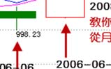

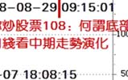

缠论编前言 pagee 6 of 7

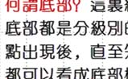

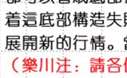

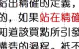

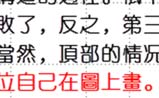

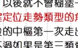

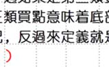

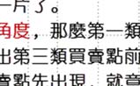

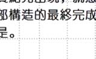

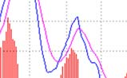

2、季线底分型确认
缠论编前言 pagee 7 of 7

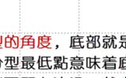

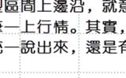

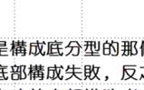

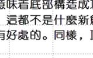

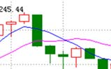

缠中说禅理论定理汇总
一、为引申出基本定义的引子概念与定义：
101：飞吻：短期均线略略走平后继续按原来趋势进行下去。（14课）
102：唇吻：短期均线靠近长期均线但不跌破或升破，然后按原来趋势继续下去。（14课）
103：湿吻：短期均线跌破或升破长期均线甚至出现反复缠绕，如胶似漆。（14课）
104：女上位：短期均线在长期均线之上。（14课）
105：男上位：短期均线在长期均线之下。（14课）
106：第一类买点：用较形象的语言描述就是由男上位最后一吻后出现的背驰式下跌构成。（14课）
107：第二类买点：女上位第一吻后出现的下跌构成。（14课）
108：上涨：最近一个高点比前一高点高，且最近一个低点比前一低点高。（15课）
109：下跌：最近一个高点比前一高点低，且最近一个低点比前一低点低。（15课）
110：盘整：最近一个高点比前一高点高，且最近一个低点比前一低点低；或者最近一个高点比前一高点低，且最近一个低点比前一低点高。
（15课）
111：缠中说禅趋势力度：前一“吻”的结束与后一“吻”的开始，期间由短期均线与长期均线相交所形成的面积。在前后两个同向趋势中，当
缠中说禅趋势力度比上一次缠中说禅趋势力度要弱，就形成“背驰”。（15课）
112：缠中说禅趋势平均力度：当下价格走势与前一“吻”的结束时，短线均线与长期均线形成的面积除以时间。（15课）

二、基本定义：
201、走势：你打开走势图看到的就是走势。走势分不同级别。（17课）
202、走势类型：上涨、下跌、盘整。（17课）
203、趋势：上涨、下跌。（17课）
204、缠中说禅走势中枢：某级别的走势类型，被至少三个连续次级别走势类型所重叠的部分，称为缠中说禅走势中枢。（17课）
最后不能分解的级别，其缠中说禅走势中枢就不能用“至少三个连续次级别走势类型所重叠”定义，而定义为至少三个该级别单位 K 线重
叠部分。（17课）
205、缠中说禅盘整：在任何级别的任何走势中，某完成的走势类型只包含一个缠中说禅走势中枢，就称为该级别的缠中说禅盘整。（17课）
206、缠中说禅趋势：在任何级别的任何走势中，某完成的走势类型至少包含两个以上依次同向的缠中说禅走势中枢，就称为该级别的缠中说禅
趋势。该方向上就称为上涨，向下就称为下跌。
注意：趋势中的缠中说禅走势中枢之间必须绝对不存在重叠。这包括任何围绕走势中枢产生的任何瞬间波动之间的重叠。（17课）
三、技术分析基本原理：
301、缠中说禅技术分析基本原理一：任何级别的任何走势终要完成。（17课）
302、缠中说禅技术分析基本原理二：任何级别的任何完成的走势。必然包含一个以上的缠中说禅走势中枢。（17课）

四、走势分解定理、原则：
401、缠中说禅走势分解定理一：任何级别的任何走势，都可以分解成同级别“盘整”、“下跌”与“上涨”三种走势类型的连接。（17课）
402、缠中说禅走势分解定理二：任何级别的任何走势类型，都至少由三段以上次级别走势类型构成。（17课）
403、缠中说禅走势类型分解原则：一个某级别的走势类型中，不可能出现比该级别更大的中枢，一旦出现，就证明这不是一个某级别的走势类
型，而是更大级别走势类型的一部分或几个该级别走势类型的连接。（43课）
404、缠中说禅线段分解定理：线段被破坏，当且仅当至少被有重叠部分的连续三笔的其中一笔破坏。而只要构成有重叠部分的前三笔，那么必
然会形成一线段，换言之，线段破坏的充要条件，就是被另一个线段破坏。 （65课）
405、缠中说禅笔定理：任何的当下，在任何时间周期的 K 线图中，走势必然落在一确定的具有明确方向的笔当中（向上笔或向下笔），而在笔
当中的位置，必然只有两种情况：1、在分型构造中。2、分型构造确认后延伸为笔的过程中。（91课）
五、走势中枢、走势中枢中心相关定理：
501、缠中说禅走势中枢定理一：在趋势中，连接两个同级别“缠中说禅走势中枢”的必然是次级别以下级别的走势类型。（18课）
502、缠中说禅走势中枢定理二：在盘整中，无论是离开还是返回“缠中说禅走势中枢”的走势类型必然是次级别以下的。（18课）
503、缠中说禅走势中枢定理三：某级别的“缠中说禅走势中枢的破坏”，当且仅当一个次级别走势离开该“缠中说禅走势中枢”，其后的次级
别回抽走势不重新回到该“缠中说禅走势中枢”内。（18课）
504、缠中说禅走势中枢中心定理一：
走势中枢的延伸等价于任意区间[dn，gn]与[ZD，ZG]有重叠。换言之，若有Zn，使得dn>ZG或gn<ZD，则必然产生高级别的走势中枢或趋
势及延续。其中GG=max(gn)，G=min(gn)，D=max(dn)，DD=min(dn)，ZG=min(g1，g2)，ZD=max(d1，d2)。（20课）
505、缠中说禅走势中枢中心定理二：前后同级别的两个缠中说禅走势中枢，后GG<前DD等价于下跌及其延续；后DD>前GG等价于上涨及其
延续。后ZG<前ZD且后GG≥前DD，或后ZD>前ZG且后DD≤前GG，则等价于形成高级别的走势中枢。（20课）

六、走势级别延续定理：
601、缠中说禅走势级别延续定理一：在更大级别的缠中说禅走势中枢产生前，该级别的走势类型将延续。也就是说，只能是只具有该级别缠中
说禅走势中枢的盘整或趋势的延续。（20课）
602、缠中说禅走势级别延续定理二：更大级别缠中说禅走势中枢产生，当且仅当围绕连续两个同级别缠中说禅走势中枢产生的波动区间产生重
叠。（20课）
七、买卖点相关定理、定律和程序：
701、缠中说禅短差程序：大级别买点介入的，在次级别第一类卖点出现时，可以先减仓，其后在次级别第一类买点出现时回补。（14课）
702、缠中说禅买卖点定律一：任何级别的第二类买卖点都由次级别相应走势的第一类买点构成。（14课）
703、第三类买卖点定理：
一个次级别走势类型向上离开缠中说禅走势中枢，然后以一个次级别走势类型回试，其低点不跌破ZG，则构成了第三类买点；
一个次级别走势类型向下离开缠中说禅走势中枢，然后以一个次级别走势类型回抽，其高点不升破ZD，则构成第三类卖点。（20课）
（而对于第三类买卖点，其意义就是对付中枢结束的。一个级别的中枢结束，无非面对两种情况：
a、转成更大的中枢；
b、上涨或下跌直到形成新的该级别中枢。
第三类买卖点就是告诉什么时候发生这种事情的，而在第二、三买卖点的本级别走势类型之间，都是中枢震荡，这时候，是不会有该
级别的买卖点的，因此，如果参与其中的买卖，用的都是低级别的买卖点。）（53课））
704、缠中说禅买卖点的完备性定理：市场必然产生赢利的买卖点，只有第一、二、三类。（21课）

705、缠中说禅升跌完备性定理：市场中的任何向上与下跌，都必然从三类缠中说禅买卖点中的某一类开始以及结束。换言之，市场走势完全由
这样的线段构成，线段的端点是某级别三类缠中说禅买卖点中的某一类。（21课）
706、缠中说禅买卖点级别定理：大级别的买卖点必然是次级别以下某一级别的买卖点。（35课）
707、缠中说禅背驰-买卖点定理：任一背驰都必然制造某级别的买卖点，任一级别的买卖点都必然源自某级别走势的背驰。（24课）
708、缠中说禅精确大转折点寻找程序定理：某大级别的转折点，可以通过不同级别背驰段的逐级收缩范围而确定。（27课）
709、缠中说禅趋势转折定律：任何级别的上涨转折都是由某级别的第一类卖点构成；任何级别的下跌转折都是由某级别的第一类买点构成。
（17课）
70a、缠中说禅背驰-转折定理：某级别的趋势的背驰将导致该趋势最后一个中枢的级别扩展、该级别更大级别的盘整或该级别以上级别的反趋势。
（29课）
70b、缠中说禅小背驰-大转折定理：小级别背驰引发大级别向下的必要条件是该级别走势的最后一个次级别中枢出现第三类卖点；小级别背驰引
发大级别向上必要条件是该级别走势的最后一个次级别中枢出现第三类买点。（44课）
70c、缠中说禅第一利润最大定理：对于任何固定交易品种，在确定的操作级别下，以上缠中说禅操作模式的利润率最大。（49课）
（根据当下位置与中枢的运动情况（新生，扩展，延伸）来操作，关键在于：
①只参与确定操作级别的盘整与上涨；
②第三类买点后持股直到新中枢出现继续中枢震荡操作，中途不参与短差；
③中枢完成向上移动出现背驰后抛出所有筹码。）
70d、缠中说禅第二利润最大定理：对于不同交易品种交易中，在确定的操作级别下，以上激进的缠中说禅操作模式的利润率最大。（49课）
（根据当下位置与中枢的运动情况（新生，扩展，延伸）来操作，不参与中枢荡，只在第三类买点买入，一旦形成新中枢就退出，也就是在次
级别走势类型出现背驰或盘整背驰抛出所有筹码。）

八、补充回复中的定律：
801、缠中说禅转折性趋势定律：任何非盘整性的转折性上涨，都是在某一级别的“下跌+盘整+下跌”后形成的。下跌反之。（16课后）
802、缠中说缠的MACD定律：第一类买点都是在0轴之下背驰形成的，第二类买点都是第一次上0轴后回抽确认形成的。卖点的情况就反过
来。”
803、趋势形成定义：向上趋势形成：就是在第一中枢后出现第三类买点并形成非背驰向上。下跌反之（107课）

MACD 指标基础说明书
一、MACD由来：
MACD（Moving Average Convergence and Divergence)是Geral Appel 于1979年提出的，它是一项利用短期（常用为12日）移动平均线与长
期（常用为26日）移动平均线之间的聚合与分离状况，对买进、卖出时机作出研判的技术指标。
二、MACD指标的原理：
1、MACD 指标由双移动平均线发展而来，根据均线的构造原理，对价格的收盘价进行平滑处理，求出算术平均值以后再进行计算，是一种趋向
类指标。
2、MACD指标是运用快速（短期）和慢速（长期）移动平均线及其聚合与分离的征兆，加以双重平滑运算。
3、根据移动平均线原理发展出来的MACD，一则去除了移动平均线频繁发出假信号的缺陷，二则保留了移动平均线的效果，因此，MACD指标
具有均线趋势性、稳重性、安定性等特点，是用来研判买卖时机，预测价格涨跌的技术分析指标 。
4、MACD 指标主要是通过 EMA、DIF 和 DEA（或叫 MACD、DEM）这三值之间关系的研判，DIF 和 DEA 连接起来的移动平均线的研判以及
DIF减去DEM值而绘制成的柱状图（BAR）的研判等来分析判断行情，预测走势中短期趋势的主要的股市技术分析指标。
其中，DIF是核心，DEA是辅助。
DIF是快速平滑移动平均线（EMA1）和慢速平滑移动平均线（EMA2）的差。
BAR柱状图在股市技术软件上是用红柱和绿柱的收缩来研判行情。

三、MACD指标公式：
DIF:EMA(CLOSE,12)-EMA(CLOSE,26);
DEA:EMA(DIF,9);
MACD:(DIF-DEA)*2,COLORSTICK;
1、 DIF线（Difference）：收盘价短期、长期指数平滑移动平均线间的差；
2、 DEA线（Difference Exponential Average）：DIF线的M日指数平滑移动平均线；
3、 MACD 线：DIFF 线与 DEA 线的差，彩色柱状线；
四、简单移动平均与指数移动平均的差异：
1、简单移动平均：将最近n天的价格数据进行算数平均，公式如下：
算术公式： MA为简单移动平均值，p i为第i天的价格；
常用行情软件计算公式：MA(C,5); 它的计算方法是，将最近5天的收盘价相加，然后除以5。
2、指数移动平均EMA（Exponential Moving Average）：也叫 EXPMA 指标，是一种常用的序列数据处理方式，简单移动平均是对每一天都赋
予相同的权重，但有些人认为最近的日子价格变化更具有价值，应给与更多的重视。它也是一种趋向类指标，指数平均数指标是以指数式递减加
权的移动平均。各数值的加权是随时间而指数式递减，越近期的数据加权越重，但较旧的数据也给予一定的加权。公式如下：
算术公式： EMA t为t日的指数移动平均值，P t为t日的股票价格，λ（0 <λ<1）为指数移动平均值对于
历史量测值的权重系数，其值越接近 1，表明过去量测值的权重较低，另一角度看，1−λ 表明指数移动平均值的时效性，即历史值的衰减率，越
接近1表明时效性越强，历史值的衰减越快。EMA还表现出一定的吸收瞬间突发的能力，这种能力称为平稳性，随着λ减小，平稳性越强。

3、小结：指数移动平均线和简单移动平均线的构造都是将每期值进行移动平均，但是对每期值赋予的权重有所不同。简单移动平均线对每期值
赋予相同的权重，而指数移动平均线对各期值赋予指数式递减加权平均。虽然它们的构造不同，但是简单移动平均线的天数和指数移动平均线的
指数值之间存在着乘幂形式的关系。当取的简单移动平均线的天数值和指数移动平均线的指数值对应时，两条线的久期相同，且两条移动平均线
的走势相同。
五、MACD指标的一般研判标准：
MACD 指标的一般研判标准主要是围绕快速和慢速两条均线及红、绿柱线状况和它们的形态展开。一般分析方法主要包括 DIF 和 MACD 值及它
们所处的位置、DIF和MACD的交叉情况、红柱状的收缩情况和MACD图形的形态这四个大的方面分析。
1、DIF和MACD的值及线的位置：
A、当DIF和MACD均大于0（即在图形上表示为它们处于零线以上）并向上移动时，一般表示为走势处于多头行情中；
B、当DIF和MACD均小于0（即在图形上表示为它们处于零线以下）并向下移动时，一般表示为走势处于空头行情中。
C、当DIF和MACD均大于0（即在图形上表示为它们处于零线以上）但都向下移动时，一般表示为股票行情处于退潮阶段；
D、当DIF和MACD均小于0时（即在图形上表示为它们处于零线以下）但向上移动时，一般表示为行情即将启动。
2、DIF和MACD的交叉情况：
A、当DIF与MACD都在零线以上，而DIF向上突破MACD时，表明市场处于一种强势之中，走势将再次上涨；
B、当DIF和MACD都在零线以下，而DIF向上突破MACD时，表明市场即将转强，跌势已尽将止跌朝上；
C、当DIF与MACD都在零线以上，而DIF却向下突破MACD时，表明市场即将由强势转为弱势，走势将大跌；
D、当DIF和MACD都在零线以上，而DIF向下突破MACD时，表明市场将再次进入极度弱市中，走势还将下跌。

3、MACD 指标中的柱状图分析：DIF 值减 DEA（即 MACD、DEM）值而绘制成柱状图，用红柱状和绿柱状表示，红柱表示正值，绿柱表示负
值。A、当红柱状持续放大时，表明处于上涨行情中，股价将继续上涨，直到红柱无法再放大时才考虑卖出。
B、当绿柱状持续放大时，表明处于下跌行情之中，股价将继续下跌，直到绿柱开始缩小时才可以考虑少量买入。
C、当红柱状开始缩小时，表明上涨即将结束（或要进入调整期），走势将大幅下跌。
D、当绿柱状开始收缩时，表明大跌行情即将结束，走势将止跌向上（或进入盘整）。
E、当红柱开始消失、绿柱开始放出时，这是转市信号之一，表明上涨行情（或高位盘整行情）即将结束，走势将开始加速下跌。
F、当绿柱开始消失、红柱开始放出时，这也是转市信号之一，表明下跌行情（或低位盘整）已经结束，走势将开始加速上升。
六、MACD的特殊分析方法：
1、形态法则：MACD 指标的研判还可以从 MACD 图形的形态来帮助研判行情。当 MACD 的红柱或绿柱构成的图形双重顶底、三重顶底等形态
时，也可以按照形态理论的研判方法来加以分析研判。例如顶背离和底背离。
A、MACD指标的背离就是指MACD指标的图形的走势正好和K线图的走势方向正好相反。MACD指标的背离有顶背离和底背离两种。
B、顶背离：当K线图上的走势一峰比一峰高，价格一直在向上涨，而MACD指标图形上的由红柱构成的图形的走势是一峰比一峰低，即当
走势的高点比前一次的高点高、而MACD指标的高点比指标的前一次高点低，这叫顶背离现象。顶背离现象一般是走势在高位即将反转转势的信号，
表明走势短期内即将下跌，是卖出的信号。
C、底背离：底背离一般出现在走势的低位区。当K线图上的走势还在下跌，而MACD指标图形上的由绿柱构成的图形的走势是一底比一底
高，即当走势的低点比前一次低点低，而指标的低点却比前一次的低点高，这叫底背离现象。底背离现象一般是预示走势在低位可能反转向上的信
号，表明走势短期内可能反弹向上，是短期买入的信号。
2、其他：详见缠中说禅详细课文内容，包含了动能法则、级别法则与背驰法则。

缠中说禅股票池
编号 代码 名称 编号 代码 名称
001 600078 澄星股份 018 600779 水井坊
002 600139 *ST绵高 019 601111 中国航
003 600195 中牧股份 020 000021 长城开发
004 600234 ST天龙 021 000099 中信海直
005 600319 亚星化学 022 000338 潍柴动力
006 600343 航天动力 023 000416 健特生物
007 600375 星马汽车 024 000600 建投能源
008 600432 吉恩镍业 025 000777 中核科技
009 600569 安阳钢铁 026 000778 新兴铸管
010 600578 京能热电 027 000802 北京旅游
011 600594 益佰制药 028 000807 云铝股份
012 600607 上实医药 029 000822 山东海化
013 600635 大众公用 030 000915 山大华特
014 600636 三爱富 031 000938 紫光股份
015 600649 原水股份 032 000998 隆平高科
016 600737 中粮屯河 033 000999 S 三 九
017 600777 新潮实业 034 002149 西部材料

道氏理论‐‐‐摘自《专业投机原理》
---维可多.斯波朗迪（著）
---土匪摘录
一、道氏理论的由来：
我们一般所称的“道氏理论”，是查尔斯.道（道氏）、威廉姆.皮特.汉密尔顿与罗伯特.雷亚（雷亚）等三人共同的研究结果。道氏是“道琼公司”
的创办人，也是“华尔街日报”的创办人之一，在1902年过世以前担任该报编辑，他首先提出股票指数的观念，于是“道琼工业指数”在1895年诞
生。1897年他又提出铁路股指数，因为他认为这两项指数可以代表两大经济部门的生产与分配。
道氏希望以这两项指数做为经济活动的指标，他本人并未利用它们预测股票价格的走势。1902 年过世以前，他虽然仅有五年的资料可供研究，
但他的观察在范围与精确性上都有相当的成就。
道氏本人并未将他的观点组织为正式的经济预测理论，但他的朋友 A.J.尼尔森和试图这么做，并于 1902 年出版《股票投机人门》一书。尼尔森
将道氏的观点正式称为“道氏理论”。
威廉姆.皮特.汉密尔顿在道氏的指导下研究，他是当时“道氏理论”最佳的代言人。道氏过世后，汉密尔顿在 1903 年替道氏担任《华尔街日报》
的编辑工作，直至他于1923年过世为止，他继续阐扬与改进道氏的观念。这些内容主要是发表在《华尔街日报》另外，他也于1922年出版《股票晴
雨表》一书，并使“道氏理论”具备较详细的内容与正式的结构。
雷亚是汉密尔顿与道氏的崇拜者，他由1922年开始直至1939年过世为止，在病榻上勉强工作，利用两人的理论预测股票市场的价格，并有相当
不错的收获。通过周详的研究，雷亚使“指氏理论”具备较严谨的原则与方法论。并公布第一组“道琼工业指数”与“道琼铁路指数”的每日收盘价
图形，其中还附成交量。
雷亚对于“道氏理论”的贡献极多.他纳入成交量的观念，使价格预测又增加一项根据。另外，他也提出相对强度的概念。虽然他并未采用这项名

称；我们稍后将于第 8章讨论此概念。《道氏理论》一书是由巴伦氏杂志于 1932年发行，目前已经绝版，雷亚在此书摘取威廉姆.皮特.汉密尔顿的研
究成果，并提出许多有助于了解“道氏理论”的参考资料。稍后，在《道氏理论在商务与银行业的应用》一书中，雷亚显示“道氏理论”可以稳定而
精确地预测未来的经济活动。
雷亚在所有相关著述中都强调，“道氏理论”在设计上是一种提升投机者或投资者知识的配备或工具，并不是可以脱离经济基本条件与市场现况
的一种全方位的严格技术理论。根据定义，“道氏理论”是一种技术理论；换言之，它是根据价格模式的研究，推测未来价格行为的一种方法。就这
个角度来说，它是现代技术分析的鼻祖。
雷亚过世后，“道氏理论”落入一些无能之辈的手中。人们不再能够掌握这项理论的精髓，并做不适当的解释与误用，以至于它被视为是一套过
时的理论，不再适用于现代市场。这是完全不正确的看法。我曾经做过研究，将“道氏理论”运用在1896年至1985年的“工业指数”与“铁路指数”
（现在的“运输指数”），我发现“道氏理论”可以精确地掌握74.5%的经济扩张价格走势与62％的经济衰退价格跌势，这是分别由确认日至行情顶
部或底部而言。
另外，根据我的研究显示，除了两次世界大战期间外，股票市场可以精确地预测经济趋势的变化。领先时间的平均数（译按：在本书中，作者都
采用（中位数），但他实际的意思却是指“平均数”而言，所以往后一律译为“平均数”）为 6 个月；并可以预测经济循环的峰位与谷底，领先时间
的平均数为一个月。
1949 年至 1985 年间，根据严格解释的“道氏理论”来买、卖“工业指数”与“运输指数”，理论上每年的平均报酬率（未经复利）为 20.1%。
就这方面来说，我还必须补充一点，投资者若运用“道氏理论”，他将于 1987 年的崩盘期间卖空（我便是如此）。没有任何其他预测方法可以宣称，
它具备这种长期的一致性预测能力。所以，每一位态度严肃的投机者或投资者，都应该深入研究“道氏理论”。

二、道氏理论的“假设”
在《道氏理论》一书中，雷亚列举“道氏理论”中他所谓的“假设”与“定理”。事实上，它们应该分别被称为原则与定义，因为“道氏理论”
并不是类似如数学或物理学等严格的科学系统。撇开这方面问题不谈，因为人们对于“道氏理论”的解释并不正确，所以我将直接引用最初的资料来
源。以下我将引用雷亚本人的文字以及他的说明秩序。大体上，雷亚的观念仍然适用于目前，但我在引用文字之后会做一些必要的澄清与修正。
根据雷亚的看法，“道民理论”奠基于三项基本假设上，它们必须被“毫无保留地”接受。
假设1：人为操纵：
指数每天的波动可能受到人为操纵，次级折返走势也可能受到这方面有限的影响，但主要趋势绝对不会受到人为的操纵。
这项假设的立论根据是，股票市场非常庞大而复杂，任何个人或团体都无法长期影响整体股票市场的价格。这是“道氏理论”的重要根据，因为
整体股票市场的价格，如果可能经由个人意愿改变，观察市场指数便没有任何意义了，除非你想了解操纵者的意图。我们探讨“假设 2”时，可进一
步理解“假设1”的重要性。
道氏、汉密尔顿与雷亚都认为，当时人们都过于高估人为操纵（包括个人与集体的操纵）的严重程度。他们都认为，人为操纵的指控，主要是人
们投机失败时，用来推卸自身责任的一种借口。
我相信，今天的情况也是如此。
就严格管制的现代市场来说，个人对于市场的操纵基本上是一种不可能的行为，甚至于短期间的操纵也不可能。然而，电脑程式交易则是一种重
要的人为操纵形式，我们将在第 6 章讨论这方面的问题。就基本而长期的角度来说，主要趋势仍然无法被操纵，但趋势的性质可能被改变，我们发现
自从1987年10月份崩盘以来便有这种现象。机构法人的交易动辄数十亿美金，这会加速主要趋势的进行。

假设2：市场指数会反映每一条信息：
每一位对于金融事务有所了解的人，他所有的希望、失望与知识，都会反映在“道琼铁路指数”与“道琼工业指数”每天的收盘价波动中；基于
这个缘故，市场指数永远会适当地预期未来事件的影响（上帝的旨意除外）。如果发生火灾或地震等自然灾害，市场指数也会迅速加以评估。
（附注；雷亚在括弧中的说明，应该改为“上帝的旨意与政府的行动除外，尤其是联邦准备理事会的行动”。）
道氏本人也提及相同的基本看法：
市场价格不会像汽球一样在风中到处飘荡。就整体价格而言，它代表一种严肃而经过周详考虑的行为结果：眼光深远而消息灵通的人士，会根据
已知的事件或预期不久将发生的事件，调整价格。
（就目前的情况来说。这项假定需要稍加修正。不仅适用于“道琼工业指数”与“道琼运输指数”，任何主要的市场指数都适用这项假设，包括
债券、外汇、商品与选择权在内。）
有关市场指数所具备预先反映或经济预测的功能，并没有什么神秘之处。投资者（长期持有证券与其他交易工具的人们）会利用股票市场与其他
交易场所，将资本分配至他们认为最有利的个别股票、商品以及其他金融交易工具。他们会根据过去绩效、未来展望、个人偏好以及未来的预期等因
素来做评估，然后配置他们的经济资源。结果，最能够预测未来消费者（这是指最广义的消费者而言，包括资本、批发与零售市场的消费者）需要情
况的投资者与企业，他们将可以生存，井获得最多的利润。正确的投资将获得报酬，错误的投资将蒙受损失。
通过金融市场，投机者与投资者的行为结果，通常会扩张有利的活动，局限不利的活动。他们的行为无法改变过去的事实，也无法解决既有资金
转换性有限的问题，但他们通常确实可以防止劣币驱逐良币的现象。市场指数的变动仅是反映这种程序。
一般市场参与者如果不能正确预期未来的经济活动，财富将持续减少，也无所谓的长期多头市场。然而，事实上，一般的股票交易者可以适当地
预测未来的经济活动，并使股票价格的走势循环，领先经济循环的变动。两者在时间上的落差，来自于股票市场具有流动性、经济的调整则不具备这
种流动性，因为资金与存货的转换性较为有限。

雷亚说“市场指数永远会适当地预期未来事件的影响（上帝的旨意除外）”时，他真的是这个意思。但是，这句陈述隐含另一层面的意思，“适
当地”反映涵盖各种分歧的看法；换言之，它包括人们认为目前事件对于未来经济活动之影响的各种不同意见。市场指数同时代表乐观主义者、悲观
主义者以及”务实主义者”——包括一系列个人与机构的特殊看法，绝对不是任何单一个人可以复制的见解。
雷亚的陈述并不意味着市场参与者对于未来事件的解释大体上必然正确；但该陈述确实代表，市场指数必然反映市场参与者的主要看法。对于态
度严肃的市场观察者来说，市场指数将显示长期趋势的方向与力道，市场何时处于超买或超卖的情况，市场普遍的看法何时产生变化，市场何时的风
险过高而不适合于积极参与。
我在注中在雷亚的假设加上“政府的行动除外”，因为政府的立法程序、货币与财政政策以及贸易政策，都会对经济发展造成长远的影响，所以
——就如同自然灾害一样——它们会对股票价格产生立即而明显的冲击。另外，政府的决策者也是人类，所以市场参与者也不可能永远正确地预测他
们的行为。我们可以提出一个典型的例子，1984年7月24日“联邦准备理事会”主席保罗.沃尔克宣布，联储采用的紧缩性货币政策并“不恰当”。
在预期银根将转松的情况下，股票市场当天的指数成为低点，并展开一波新的多头行情。
假设3：这项理论并非不会错误：
“道氏理论”并不是一种万无一失而可以击败市场的系统。成功利用它协助投机行为，信要深入的研究，并客观地综合判断。绝对不可以让一厢
情愿的想法主导思考。
股票市场由人类组成，人类都会犯错。几乎在每一笔股票交易中，如果某一方正确，另一方便错误。虽然市场指数是代表一种净结果，或市场参
与者对于未来判断的“集体智慧”；但历史告诉我们，以百万计的人们也像个人一样会犯错，股票市场当然也不例外。然而，市场有一项特性，它允
许参与者迅速修正他们的错误。任何分析方法若认为市场不会犯错，显然是最根本的错误。
“效率市场理论”便是一个典型的例子。它的主要论点是，电脑普遍化后，信息的传播非常迅速而有效.所以任何方法都无法击败市场。它仅是将

“道氏理论”的一项主张做无限的延伸——“市场指数会反映每一条信息”，这实在是无稽之谈。
“效率市场理论”认为，每个人会同时取得每一条重要的信息。这是相当荒谬的假设，因为每个人对于“重要”的定义未必相同。即使每个人确
实可以同时取得每一项重要信息，但每个人还是会根据自身的环境与偏好反应。如果每个人掌握的信息都相同。而且反应也相同，则市场根本就无法
存在。务必记住，市场的存在是为了促进交易，交易之所以会产生，是因为参与者对于价值的偏好与判断不相同。
市场指数具有预测能力，是因为它在统计上代表一种市场的共识，这项共识是以钞票表达。终究来说，价格取决于人们的判断与偏好。如果你问
场内交易员，今天的价格为何上涨，很多人可能会半开玩笑的答道，“因为买进多于卖出”。这个回答的真正意思是，“我不知道为什么，但场内资
金所代表的市场主要看法认为，价格应该上涨”。
投机者的基本工作是辨识主要的影响因素，它们会驱动或改变市场参与者的主要看法，而市场指数是这方面的最理想工具，因为它会反映大众对
于金融事件的看法。
所谓的金融事件，涵盖面极广，包括政治与经济的发展、科技的创新、服饰的流行趋势乃至于某家公司的盈馀展望。由于上述程序仅能在历史范
畴内进行，所以你顶多可以辨识过去的重要因素，并以此预测未来。某些因素在整个历史上始终有效；一般来说，基本因素牵引的看法，变动相当缓
慢。经过适当的研究后，你可以抽取这些基本的因素，并根据它们精确地预测未来。
根据汉密尔顿的说法，市场指数是经济预测的气压器。在气象预测中，气压器是衡量空气压力的一种仪器。因为空气压力的变化会先于气象的变
化，所以气压器是预测气象的一种重要工具。然而，气压器本身无法提供任何有关降雨量的资料，气压与温度之间也没有高度的相关性。
同理，市场指数虽然是经济预测的根本工具。但我们还需要许多辅助信息才可以解开谜底。

三、道氏理论的“定理”
提出“道氏理论”的假设后，雷亚继续由道氏与汉密尔顿的著述中，整理出他所谓的“定理”。这些定理出版于 1932 年，基本上仍然适用于今
天。但是.我们不能以表面的意思解释它们。为了确实了解这些定理的意义，我建议你准备一套“道琼工业指数”与“道琼运输指数”完整的走势图，
包括成交量在内，并配合汉密尔顿与雷亚的相关评论，这些评论可以在《华尔街日报》或巴伦杂志的历史档案中找到。不幸地、这是你必须自行完成
的工作。一旦了解汉密尔顿与雷亚的思想精髓之后，你可以很容易地将这套理论运用于目前的市场，但你还需要知道其中的部分修正，我会在下列讨
论中说明。
定理1：道氏的三种走势：市场指数有三种走势，三者都可以同时出现。
第一种走势最重要，它是主要趋势：整体向上或向下的走势而称为多头或空头市场，期间可能长达数年。
第二种走势最难以捉摸，它是次级的折返走势：它是主要多头市场中的重要下跌走势，或是主要空头市场中的反弹。修正走势通常会持续三个星
期至数个月。
第三种走势通常较不重要，它是每天波动的走势。
雷亚的用词大体相当精确，道氏的三种走势不仅适用于股票市场的指数，也适用所有市场。雷亚第一项定理可以重新整理如下：
股票指数与任何市场都有三种趋势：
①短期趋势，持续数天至数个星期；
②中期趋势，持续数个星期至数个月；
③长期趋势，持续数个月至数年。任何市场中，这三种趋势必然同时存在，彼此的方向可能相反。
长期趋势最为重要，也最容易被辨认、归类与了解。它是投资者主要的考量，对于投机者较为次要。中期与短期趋势都是附属于长期趋势之中，

唯有明白它们在长期趋势中的位置，才可以充分了解它们，并从中获利。
中期趋势对于投资者较为次要，但却是投机者的主要考虑因素。它与长期趋势的方向可能相同，也可能相反。如果中期趋势严重背离长期趋势，
则被视为是次级的折返走势或修正次级折返走势必须谨慎评估，不可将其误认为是长期趋势的改变。
短期趋势最难预测，唯有交易者才会随时考虑它。投机者与投资者仅有在少数情况下，才会关心短期趋势：在短期趋势中寻找适当的买进或卖出
时机，以追求最大的获利，或尽可能减少损失。
将价格走势归类为三种趋势，并不是一种学术上的游戏。一位投资者如果了解这三种趋势而专注于长期趋势，也可以运用逆向的中期与短期趋势
提升获利。运用的方式有许多种。
第一，如果长期趋势是向上，他可在次级的折返走势中卖空股票，并在修正走势的转折点附近，以空头头寸的获利追加多头头寸的规模。
第二，上述操作中，他也可以购买卖权选择权或销售买权选择权。
第三，由于他知道这只是次级的折返走势，而不是长期趋势的改变，所以他可以在有信心的情况下，度过这段修正走势。
最后，他也可以利用短期趋势决定买、卖的价位，提高投资的获利能力。
上述策略也适用于投机者，但他不会在次级的折返走势中持有反向头寸；投机者的操作目标是顺着中期趋势的方向建立头寸。投机者可以利用短
期趋势的发展，观察中期趋势的变化征兆。他的心态虽然不同于投资者，但辨识趋势变化的基本原则相当类似。
自从 80 年代初期以来，由于信息科技的进步以及电脑程式交易的影响，市场中期趋势的波动程度已经明显加大。1987 年以来，一天内发生 50
点左右的波动已经是寻常可见的行情。基于这个缘故，我认为长期投资的“买进--持有”策略可能有必要调整。对我来说，在修正走势中持有多头头
寸，并看着多年来的获利逐渐消失，似乎是一种无谓的浪费与折磨。当然，大多数的情况下，经过数个月或数年以后，这些获利还是会再度出现。然
而，如果你专注于中期趋势，这些损失大体上都是可以避免的。因此，我认为，对于金融市场的参与者而言，以中期趋势作为准则应该是较明智的选
择。
然而，如果希望精确掌握中期趋势，你必须了解它与长期（主要）趋势之间的关系。

定理 2：主要走势：主要走势代表整体的基本趋势，通常称为多头或空头市场，持续时间可能在一年以内，乃至于数年之久。正确判断主要走势的方
向，是投机行为成功与否的重要因素。没有任何已知的方法可以预测主要走势的持续期限。
了解长期趋势（主要趋势）是成功投机或投资的最起码条件。一位投机者如果对长期趋势有信心，只要在进场时机上有适当的判断，便可以赚取
相当不错的获利。有关主要趋势的幅度大小与期限长度，虽然没有明确的预测方法，但可以利用历史上的价格走势资料，以统计方法归纳主要趋势与
次级的折返走势。
雷亚将道琼指数历史上的所有价格走势，根据类型、幅度大小与期间长短分别归类，他当时仅有 30 年的资料可供运用。非常令人惊讶地，他当
时归类的结果与目前 92 年的资料，两者之间几乎没有什么差异。例如，次级折返走势的幅度与期间，不论就多头与空头市场的资料分别或综合归类。
目前正态分布的情况几乎与雷亚当时的资料完全相同；唯一的差别仅在于资料点的多寡。
这个现象确实值得注意，因为它告诉我们，虽然近半世纪以来的科技与知识有了突破性的发展，但驱动市场价格走势的心理性因素基本上仍相同。
这对专业投机者具有重大的意义：目前面临的价格走势、幅度与期间都非常可能落在历史对应资料平均数的有限范围内。如果某个价格走势超出对应
的平均数水准，介入该走势的统计风险便与日俱增。若经过适当地权衡与运用，这项评估风险的知识.可以显著提高未来价格预测在统计上的精确性。
定理 3：主要的空头市场：主要的空头市场是长期向下的走势，其间夹杂着重要的反弹。它来自于各种不利的经济因素，唯有股票价格充分反映可能
出现的最糟情况后，这种走势才会结束。
空头市场会历经三个主要的阶段：
第一阶段，市场参与者不再期待股票可以维持过度膨胀的价格；
第二阶段的卖压是反映经济状貌与企业盈余的衰退：
第三阶段是来自于健全股票的失望性卖压，不论价值如何，许多人急于求现至少一部分的股票。

这个定理有几个层面需要理清，“重要的反弹”（次级的修正走势）是空头市场的特色，但不论是“工业指数”或“运输指数”，都绝对不会穿
越多头市场的顶部，两项指数也不会同时穿越前一个中期走势的高点。
“不利的经济因素”是指（几乎毫无例外）政府行为的结果：干预性的立法、非常严苛的税务与贸易政策、不负责任的货币或（与）财政政策以
及重要战争。
个人也曾经根据“道氏理论”将1896年至目前的市场指数加以归类，在此列举空头市场的某些特质：
1、 由前一个多头市场的高点起算，空头市场跌幅的平均数为29.4%，其中75%的跌幅介于20.4%至47.1%之间。
2、 空头市场持续期限的平均数是1.1年，其中75%的期间介于0.8年至2.8年之间。
3、 空头市场开始时，随后通常会以偏低的成交量“试探”前一个多头市场的高点，接着出现大量急跌的走势（乐川注：b 浪的特征）。所谓“试探”
是指价格接近而绝对不会穿越前一个高点。“试探”期限，成交量偏低显示信心减退，很容易演变为“不再期待股票可以维持过度膨胀的价
格”。
4、 经过一段相当程度的下跌之后，突然会出现急速上涨的次级折返走势，接着便形成狭幅盘整而成交量缩小的走势，但最后将下滑至新的低点。
5、 空头市场的确认日，是指两种市场指数都向下突破多头市场最近一个修正低点的日期。两种指数突破的时间可能有落差，并非不正常的现象。
6、 空头市场的中期反弹，通常都呈现颠倒的“V一形”，其中低价的成交量偏高，而高价的成交量偏低。
有关空头市场的情况，雷亚的另一项观察非常值得重视：
空头行情末期，市场对于进一步的利空消息与悲观论调已经产生了免疫力。然而，在严重挫跌之后，股价也似乎丧失了反弹的能力，种征兆都
显示，市场已经达到均衡的状态.投机活动不活跃，卖出行为也不会再压低股价，但买盘的力道显然不足以推升价格。市场笼罩在悲观的气氛中，股息
被取消，某些大型企业通常会出现财务困难。
基于上述原因，股价会呈现狭幅盘整的走势。一旦这种狭幅走势明确向上突破市场指数将出现一波比一波高的上升走势，其中夹杂的跌势都未跌
破前一波跌势的低点。这个时候……明确显示应该建立多头的投机性头寸。这项观察也适用于商品市场；当然，不包括其中有关股息的陈述。

定理 4：主要的多头市场：主要的多头市场是一种整体性的上涨走势，其中夹杂次级的折返走势，平均的持续期间长于两年。在此巧间，由于经济情
况好转与投机活动转盛，所以投资性与投机性的需求增加，并因此相高股票价格。
多头市场有三个阶段：
第一阶段，人们对于未来的景气恢复信心；
第二阶段，股票对于以知的公司盈余改善产生反应；
第三阶段，投机热潮转炽而股份明显膨涨一一这阶段的股价上涨是基于期待与希望。
这个定理也需要理清。多头市场的特色是所有主要指数都持续联袂走高，拉回走势不会跌破前一个次级折返走势的低点，然后再继续上涨而创新
高价。在次级的折返走势中，指数不会同时跌破先前的重要低点。
主要多头市场的重要特质如下：
1、 由前一个空头市场的低点起算，主要多头市场的价格涨幅平均数为77.5％。
2、 主要多头市场的期间长度平均数为两年又四个月（2.33 年）。历史上的所有的多头市场中，75％的期间长度超过 657 天（1.8 年），67％介
于1.8年与4.l年。
3、 多头市场的开始，以及空头市场最后一波的次级折返走势，两者之间几乎无法区别，唯有等待时间确认。（参考上述雷亚的评论，但把“在
空头行情的末期”改为“在多头市场的初期”。）
4、 多头市场中的次级折返走势，跌势通常较先前与前后的涨势剧烈。另外，折返走势开始的成交量通常相当大，但低点的成交量则偏低。
5、 多头市场的确认日，是两种指数都向上突破空头市场前一个修正走势的高点，并持续向上挺升的日子。

定理5：次级折返走势：
就此处的讨论来说，次级折返走势是多头市场中重要的下跌走势，或空头市场中重要的上涨走势，持续的时间通常在三个星期至数个月；此期间
内折返的幅度为前一次级折返走势结束后之主要走势幅度的 33%至 66％。次级折返走势经常被误以为是主要走势的改变，因为多头市场的初期走势，
显然可能仅是空头市场的次级折返走势，相反的情况则会发生在多头市场出现预部后。
次级折返走势（修正走势）是一种重要的中期走势，它是逆于主要趋势的重大折返走势。判断何者是逆于主要趋势的“重要”中期走势，这是
“道氏理论”中最微妙与困难的一环；对于信用高度扩张的投机者来说，任何的误判都可能造成严重的财务后果。
判断中期趋势是否为修正走势时，需要观察成交量的关系、修正走势之历史或然率的统计资料、市场参与者的普遍态度、各个企业的财务状况、
整体状况、“联邦准备理事会”的政策以及其他许多因素。
走势在归类上确实有些主观成分，但判断的精确性却关系重大。一个走势，究竟属于次级折返走势还是主要趋势的结束，我们经常很难、甚至无
法判断。然而，此处与稍后章节的讨论，将可以提供一些有效的助益。
我个人的研究与雷亚的看法相当一致，大多数次级修正走势的折返幅度，约为前一个主要走势波段（介于两个次级折返走势之间的主要走势）的
1/3 至 2/3 之间，持续的时间则在三个星期至二个月之间。对于历史上所有的修正走势来说，其中 61%的折返幅度约为前一个主要走势波段的 30％至
70％之间，其中 65%的折返期间介于三个星期至三个月之间，而其中 98%介于两星期至八个月之间。价格的变动速度是另一项明显的特色，相对于
主要趋势而言，次级折返走势有暴涨暴跌的倾向。
次级折返走势不可与小型折返走势相互混淆，后老经常出现在主要与次级的走势中。小型折返走势是逆于中期趋势的走势，98.7%的情况下，持
续的期间不超过两个星期（包括星期假日在内）。它们对于中期与长期趋势几乎完全没有影响。截至目前为止（1989 年 10 月）。“工业指数”与
“运输指数”在历史上共有694个中期走势（包括上涨与下跌）。其中仅有九个次级修正走势的期间短于两个星期。
在雷亚对于次级折返走势的定义中，有一项关键的形容词：“重要”。一般来说，如果任何价格走势起因于经济基本面的变化，而不仅是技术面

的调整，而且其价格变化幅度超过前一个主要走势波段的1/3，都称得上重要。
例如，如果联储将股票市场融资自备款的比率由 50％调高为 70％，这会造成市场上相当大的卖压，但这与经济基本面或企业经营状况并无明显
的关系。这种价格走势属于小型（不重要的）走势。
另一方面，如果发生严重的地震而使一半的加州沉入太平洋，股市在三天之内暴跌 600 点，这是属于重要的走势，因为许多公司的盈余将受到影
响。然而，小型折返走势与次级修正走势之间的差异未必非常明显，这也是“道氏理论”中的主观成分之一。
雷亚将次级折返走势比喻为锅炉中的压力控制系统。在多头市场中，次级折返走势相当于是安全阀，它可以释放市场中的超买压力。在空头市场
中，次级修正走势相少于为锅炉添加燃料。以补充超卖流失的压力。
四、结论
“道氏理论”并不是一种具备绝对包容性的市场预测方法，但任何态度严肃的投机者都不应该忽略这项知识。“道氏理论”的许多原理都蕴涵于
“华尔街”和市场参与者的日常用语中，只不过一般人并没有察觉而已、例如，市场专业者对于“修正走势”都有普遍的认识，但就我了解，唯有
“道氏理论”对于这项名词提供客观的定义。
研究“道氏理论”的基本原理之后，我们具备一种根本的知识。了解如何根据目前与历史的市场指数，评估未来的价格走势。我们对于趋势已经
有一种普遍的概念。我们知道，任何市场都同时存在三种活跃的趋势，它们的相对重要性对于交易者、投机者与投资者都各自不同。
了解这些概念之后，可进一步探讨价格的趋势。毕竟，如果你知道何谓趋势，而且也知道它在什么时候最可能发生变化，你实际上已经掌握市场
获利的全部知识了。

五、上升趋势？下降趋势？趋势的意义。
很少人（包括专业人士在内））真正了解何谓“趋势”，这是最令我惊讶的现象之一。例如，如果某人把图 5.l 摆在我面前，并问我对于黄金趋势
的看法，你认为我我将如何回答？最合理的答案是：“你是指哪一种趋势而言”
我观察这份图形时，其中存在三种截然不同的趋势：长期趋势，它是向下；中期趋势向上；短短期趋势又是向下（参考图 5.2）。判断价格趋势时时，
你必须非常明确，而且有一致性的标准。
我训练交易员时，几乎每个人人都会拿出趋势线线绘制并不正确的图形给我，并说说道：“维克，你看这个，趋势线已经被突破了，是不是很好的买进
机会？” 如果你并不真正了解何谓趋势，你几乎可以随意绘制任何的趋势线，但根据这种“趋势线” 所做的结论并无用处。
让我们进一步探讨何谓趋势，以及它如何产生变化。

六、简化为根本重点
在“道氏理论”，你能得到的最重要知识之一一，可能是它对于趋势的定义，但这仅蕴含在说明中，它并未明文解解释。道氏将趋势划分为三类：长长
期、中期与短期的趋势。唯有真正了解趋势的意义，才可能判断趋势何时发生变化。而且，唯有精确地判断趋势的变化，并精确地设定买、卖时机，
才可以提升利润或或降低损失、由“道氏理论” 中，我整理出下列的定义：
上升趋势：上升趋势是由连续一系列的涨势构成，每一段涨势都持续向上穿越先前的高点，中间夹杂的下降走势（换言之，跌势）都不会向下跌
破前一波跌势的低点。总之，上升趋势是由高点与低点或不断垫高的一系列价格走势构成的（参考图5.3）
下降趋势：下降趋势是由连续一系列的跌势构成，每一段跌势都持续向下穿越先前的低点，中间夹杂的反弹走势（换言之，涨势）都不会向上穿
越前一波涨势的高点。总之，下降趋势是由低点与高点都不断下滑的一系列价格走势所构成的（参考图5.4）

如果你希望在本书有所收获，务必留意上述定义。它们非常简单，却具有绝对的重要性。它们是普遍性的定义，可以适用任何市场与任何的时间
结构。由图 5.3 与 5.4 中可以发现一项结论，顺势操作是在金融市场获利的途径。然而，上述定义并未明确说明，如何决定先前的高点与低点。这完
全取决于你的交易活动是专注于短期、中期或长期的趋势---换言之，究竟是从事交易、投机或投资。
不论你参与的是那一种市场或那一种时间结构，除非你知道趋势的方向，并了解如何判断趋势的变化，否则你不可能获利（运气除外）。乘着
“道氏理论”的记忆犹新时，此处还将提出一些相当有用的观点。其中某些内容仅适用于股票市场，但绝大部分都适用于任何市场。了解这些内容，
将非常有助于你判断趋势可能在何时发生变化或已经发生变化。
七、验证的重要性
在股票市场的交易中，存在一种最严重的错误，那便是仅根据一种指数的走势作出判断。我们经常可以发现，某一市场指数出现反转走势达数星
期或数个月之久，另一种指数却呈现相反方向的走势。这种现象称之为背离，它仅有负面性质的用途。（乐川注：代表趋势可能产生变化）
犹如雷亚所说：两种市场指数必须相互验证：---铁路与工业指数的走势永远应该一起考虑。一种指数的走势必须得到另一种指数的确认，如此才
可以做有效的推论。仅根据一种指数的趋势判断，另一种指数并未确认，结论几乎是必然错误。
雷亚在1932年提出这项观察。目前，除了“道琼工业指数”与“道琼铁路（运输）指数”以外，我们还有“史坦普500指数”（S＆P 500）、
“价值线指数”、“主要市场指数”、债券指数、美元指数、商品指数……。
所以，上述原则经过更新之后，“两种市场指数必须相互确认”应该改为“所有的相关指数都必须相互确认”。1987 年 10 月份崩盘后的情况便
是一个典型的例子，它说明这项原则的必要性。
首先，你应该记得“道氏理论” 中有一项“假设”：“这项理论并非不会错误”。这项假设便适用于崩盘后的情况。根据“道氏理论”，我认
为 1987 年 10 月份崩盘是空头市场的第二支脚。所有相关指数都跌破先前的主要低点——这显然是“道氏理论” 中所谓的空头市场。然而，空头市
场却未出现。若由事后的角度而以严格的“道氏理论” 解释相关的发展，则1987年10月19日之后的盘势是属于主要多头市场的次级修正走势；然

而，两种指数都向下跌破前一波次级修正走势的低点，市场却未进入空头行情，这是1991年以来首度发生的现象。
它必须被归类为修正走势，因为它不符合雷亚对于主要空头市场的定义。根据我的看法，如果联储没有在 10 月月份放松银根，而德国与日本也没
有在 12 月份采取宽松的货币政策刺激经济，则空头市场应该是合理的发展，如此才可以修正先前数年不当的投资现象。然而，它们毕竟干预了，S＆＆
P在12月份见底，市场最后又创新的高点。这个时候，“所有的相关指数都必须相互确认” 的原则便开始发挥它的效力。
在1989年4月18日，“运输指数”首先向上突破1987年88月份的高点。“价值线” 在7月月10日也出现类似的突破走势，“S＆P 500指数”
则在 7 月 24 日日突破（但 S＆P 成分股仅有 29％％的个股在 1989 年年创新高）。然而，根据“道氏理论”的严格判读，确认日最早是发生在 4 月 18 日日，
当时“工业指数” 向上突破19887年8月份的高点。并持续向上走高（图5.5）。现在，就“运输指数”来说，我将1987年8月255日至1987年122
月 4日之间的走势，归类为主要多头市场的次级修正走势；而“工业指数” 的修正走势则发生在 1987 年 8月 25 日日至 1987 年 10月月 19 日之间。当
时的情况非常混淆，但如果没有“道氏理论” 的客观指引，我会更加的混淆。

这里我必须指出，虽然1987年的行情发展相当特殊（就历史的角度来说），但根据“道氏理论” 的严格判读，在10月14日便出现明显的中期
卖出信号，当时“工业指数” 以大成交量向下突破 9 月 21 日的低点（“运输指数” 已经提早创新低点）。不论你将当时的长期趋势视为是多头或
空头市场.这2项中期卖出信号都很有效。然而，如果你把崩盘走势视为是空头市场的第二只脚，则往后便没有明显的多头进场信号。
在空头行情的假定之下，我在 1987 年 10 月 24 日建立多头头寸，因为我认为当时将展开次级的向上修正走势。在 1988 年 3 月份结束多头头寸
之后，我在 1989 年 10 月份之前便未再大量介人股市，而后者的情况已在第 2 章做了说明。1989 年 10 月 13 日，我对于市场的预测主要便是基于
“道氏理论”。
八、重要的成交量关系
在趋势明显的行情中，价量关系非常重要。 如雷亚的评论：
成交量与价格走势的关系---在超买的行情中，会出现价涨量减而价跌量增的现象：相应地，行情处于超卖状况时，会出现价跌量缩而价涨量增的
现象。多头市场结束的期间会出现活络的交易，在开始的期间则交易相对冷清。
根据定义，在“超买的”行情中，价格主要是受到感觉、希望与预期的驱动，但并非基于健全的经济判断与价值考虑。这种情况下，掌握明确信
息的人已经离开市场。一般参与者的热情也逐渐冷却。市场已经具备恐慌的条件，只要出现些许的征兆，便足以引发层层卖压。所以，在超买的市场
中，通常会出现价跌量增而价涨量缩的走势。
越卖的情况也适用类似而反向的推理。超卖的市场发展至某一阶段后，由于股票价位已经明显偏低，精明的投资者开始在低档持续地买卖。市场
中逐渐兴起一股对于未来的希望与预期，在些许挑逗之下，便使股价在大成交量的情况下向上飙涨。
这种价量关系虽然适用于任何金融市场，但---不幸地---仅有股票市场可以提供即时的成交量资料。在商品市场中，估计的成交量公布于次一个交
易日，实际的成交量则公布于次两个交易日。所以，请留意，价--量关系是一种通常而不是永远适用的资料。它们应该是辅助工具，而不是主要的考
虑因素。

九、结论
现在，你已经知道什么是趋势，什么是狭幅盘整，并了解一些造成趋势变动的征兆与原因。你也明白价格与成交量之间的重要关系，以及他们如
何反映市场的心理状况。如果你可以根据本章与前一章的内容思考市场的行为，你已经远超过一般群众的层次。
十、关于技术分析
根据罗伯特.爱德华兹与约翰.马吉的说法：“技术分析是一种科学，它记录某支股票或“市场指数”的实际交易历史（价格的变动、成交量以及
其他类似资料），通常是以图形记录；然后，再根据历史图形推测未来的可能趋势”。他们俩人采用的基本前提非常类似于“道氏理论”---市场的所
有相关知识都已经反映在价格中。然而，技术分析者认为，价格与价格的模式是唯一的重要考虑因素，这项假设则不同于“道氏理论”。
我并不是一位纯粹的技术分析者，但许多获利都是来自于技术性的考虑，所以我无法像某些“基本分析者”一样，对技术分析嗤之以鼻。①它是
拟定市场决策的重要辅助工具，使你可以掌握所有的胜算，但许多市场玩家不能体会这点。②在另一方面，投资或投机行为若单独以它作为主要的评
估方法，则技术分析不仅无效，而且可能会产生误导的作用。
稍微调查一下专业交易者、投机者与投资者的看法，便可显示技术分析的有效程度。完全仰赖图形方法，其操作绩效通常并不稳定。例如，1974
年一位技术分析者来找我，他的名字是LEO，他认为我可以借助他的知识。我以每周125美元的试用薪水任用他，如果他的建议确实有效，他还可以
抽取某一百分率的红利。利奥每天早晨 6:30 便到办公室，开始研究 120 多副彩色图形，并运用一些到目前为止我还不懂的分析方法。他每天工作 16
个小时，显然非常了解市场，但他在这方面的知识可能已经造成妨碍。
我要求他提供建议时，他会展示一些图形，并解释道：“这支股票可能在做底”，或“这支股票可能会填补缺口”。总之，不论他说什么，他的
看法总是非常不明确，并提出一些相互矛盾的可能性。我通常会回答，“好的，但我究竟应该怎么做？买进或卖出？”利奥无法给我一个简单明白的
答案。我对于他的印象非常深刻。尤其是地的衬衫袖口经常因磨损而发毛，午餐总是由家里带来的贿鱼三明治。(乐川注：暗示LEO的生活窘境)
我并不是说，所有的技术分析者都是如此，但技术分析本身显然无法从根本重点思考。如果你经常观看“金融新闻频道”的节目，你应该了解我

是什么意思。每位技术分析专家对于模式的解释都各自不同，而且都可以提出自己的故事。根据我个人的观点，我们仅需要一些最根本的技术分析原
则，并以它们做为辅助工具。一套真正有效的系统应该涵尽严格而健全的经济基本分析，以及对于个别证券与商品的评估方法，再纳入根本的技术分
析精髓。
技术分析可以提供重要的信息，但需要以合理的态度看待它，技术分析是归纳重复发生之价格模式的一种方法。故此价格模式之所以产生，主要
是因为市场参与者在拟定决策时，都具备类似的心理结构。在整个历史上，市场对于类似情况通常都会产生特定的反应，而技术分析的最大贡献便是
提供一种方法，衡量这种反应的趋势。
在这种体认之下，技术分析可以为市场分析与经济预测提供一个新的观察角度，这是投机者与投资者经常忽略的一个领域。经过适当地了解与正
确地界定，技术分析可以扩张市场知识的领域，并显示某些原本无法察觉的获利机会。
（匪注：对于爱好交易的人来说，仔细阅读一下《专业投机原理》这本书，是一件很有必要和有意义的事情。本来还想摘录该书中关于趋势线的描述解说章节，考虑到
篇幅的关系，就不这么做了。）

混沌分型波浪理论‐‐‐摘自《Trading chaos》
---著者：比尔.威廉姆斯
精简重编：土匪
一、分形理论：
1、 初始分形模式：在任何时间结构的走势图中，分形模式是由一组至少连续五支的条形图构成。在初始的分形中（所谓初始分形是相对于
回应分形而言，前者是完整的分形，后者是不完整的分形而运用于拇指交易），中间条形图的最高价（最低价）必须高于（低于）先前 2 支
与随后22支条形图的最高价（最低价）。
上图列出一些初始分形的排列。在判定分形时，需留意下列情况：
A. 如果某支条形图的最高价（最低价）等于中间条形图的最高价（最低价），则它不被计入分形排列的五支条形图中，因为其最高价（最低
价）并不低于（高于）中间条形图的最高价（最低价））（参考上图D）；
B. 相邻的分形可以彼此共用条形图（参考上图C）；
C. 在一个分形中，先前与随后必须分别出现至少 2 支条形图，它们的最高价都比较低（向上分形），或它们的最低价都比较高（向下分
形）。

D. 分形起点：随后出现反向分形排列的任何分形；
E. 分形信号：先前出现反向分形排列的任何分形；
F. 分形止损：在建立空头（多头）头寸后，取最近2个向上（向下）分形中较高（较低）者为止损点。
G. 分形排列完成，始终便是分形，在该分形的有效期内，它可以是“分形起点”、“分形信号”、“分形止损”，其当时的角色由其在走势
中所处的位置决定。
2、 分型的作用：
A. 每当市场走势出现一对分形起点与分形信号之后，你便拥有一段杠杆，换言之，走势的力度与分形的数量与两个同向分形之间的距离有
关；
B. 任何一对分形起点与分形终点之间，必然包含某一级数的波浪走势（也就是说，在大时间框架内任何一个构成分形的走势内部，在小级
别时间框架里，可以由缠中说禅理论的分型与笔的最小数量来推断出所谓的140根k为何要140根k），必然是一段波浪走势；
C. 利用分形的这个特性，可以根据分形信号来进行交易，利用分形止损来锁定判断失误的代价。

二、波浪理论：
1、 观察分析波浪的意义：
A. 艾略特波浪可以反映市场的走势，可以显示你所处的位置；
B. 艾略特波浪是市场的根本结构，而分形是艾略特波浪的根本结构；
C. 可以根据分形的数量、位置，来确定波浪的节奏和位置；
2、 艾略特波浪的基本韵律：
A. 只要有市场交易存在，就有波浪结构构存在；
B. 波浪的形态可以延伸或者压缩（在时间与价格上），但根本形状（即西方现代技术常说的架构）仍旧维持不变；
C. 波浪由五个主波与三个修正波构成，无论分析的波浪级数如何，这种循环始终不变；（（见下图）
D. 当五波走势完成之后，走势将构成较高级数的一个波浪；（见下图）

3、 各波浪详细情况：
A. 第一波：
a、第一波特性：第一波必然是一个五波序列，产生於反向五波结束或c波或e波结束（波浪零点），
b、第一波的目标区域：最佳的方法是分析内部较低级数的波浪与结构。
B. 第二波：
a、第二波特性特性：是由先前未进场的买方（卖方））迫不及待的入场造成，与第四波不同，第四波来自于先前已经进场的获利了结压力
（多头平仓或空头平仓）。
b、第二波的目标区域由以下2者决定：
①非波纳奇系数：第二波目标终点，大约会折返至第一波幅度的338%与62%之间。大约有3/4会终止与这个区域，1/6的可能性折返
幅度会超过62%%，如果第二波的折返幅度不满388%，他通常是不规则的修正。（见下图）
②第二波的内部波浪计数。

C. 第三波：
a、第三波特性：第三波的斜率较第一波陡峭，价格变动速度快，交易量较大，同时，经济的基本面开始支持行情，是市场中最具获利潜
能的良机。
b、第三波的目标区域由以下2者决定：
①非波纳奇系数：
第三波目标终点，大约会至第一波幅度的 100%与 162%之间。第三波的幅度很少会小于第一波，而经常会多于第一波的 162%。第
二波的内部波浪计数。
②第二波的内部波浪计数。

D. 第四波：
a、第四波特性：强劲的第三波结束时，获利回吐的压力开始凸显，在性质上，第四波与第二波截然不同，这2者的差异称为替代法则：
①如果第二波很单纯，那么第四波波很复杂；
②如果第二波很复杂，那么第四波波很单纯。
单纯型修正：通通常是指曲折型（ZZigzag）的走势而言。
复杂型修正：包含了平坦型、不规则型、三角形、、双重或三重三修正。（关于修正形态的详细说明，见下文）
b、大约85%的震荡走势发生在四浪，如果你难以确定自己的位置，则很可能在四浪之中。
c、四浪的修正，会进行很长时间，经常耗用整个五波序列的70%时间。
d、第四波的价格折返幅度通常小于第二波，同时交易量、价格波动、动能指标都明显下降。
e、第四浪的目标区域：
①第四波的折返幅度通常是第三波的38%～50%之间，折返幅度低于38%的情况大约有1/6。
②第四波永远不会低于第一波的顶顶部（当然也有例外，但这种例外非常常非常少见）

E. 第五波：
a、第五波特性：第五波是交易者试图新高（新低）的最后挣扎，并不像第三波般令人兴奋。斜率也通常比不上第三波。
b、第五波目标区域：
①出现密集的价格成交区；
②第五波的长度：（第一波起点到第三波终点）*662%(或者100%))，由第四波的终点点起算。

F. 修正波：
a、a波：
①a波可以是3个波浪或者5个波浪构成；
②如果a波是由5个波浪构成，则很可能是单纯型（Zigzag）的修修正；
③如果a波是由3个波浪构成，最有可能出现平坦坦型、不规则型、三角形修正。
b、b波：
①b波必然是由3个波浪构成；
②b波的折返幅度通常不会超过aa波长度的62%，在相当罕见的情况下，b波才可能出现75%的折返；
c、c波：c波必然是由5个波浪构成；
d、修正波完成之后，将成为较高一级的第二波或者第四波。
G. 修正波的形态：
a、单纯型修正：

b、复杂型修正（以下三种修正，a波都只有3个波浪）：
①平坦型修正：每一波几乎都有相同的价格长度，如果b波超过前一个推动波的终点，则可能发展成不规则型修正；
②不规则型修正：见下图
③三角形修正：是一种五波浪（aa-b-c-d-e）的修正模式，通常都发生在某一个波浪序列的倒数第二波（即第四波或第b波）。
 如果三角形修正发生在第四波，则在修正之后，价格通常会第三波的方向突破。
 如果三角形修正发生在第bb波，则在修正之后，价格通常会第a波的方向突破。

4、 判断走势的结束：波浪的零点可以根据（混沌五颗子弹）来确定：
A. 动能指标背离现象；
B. 走势在目标区域内的位置；
C. 顶（底）部的分形排列；
D. 顶（底）部端点3根k线之一的蛰伏视窗；
E. 动能指标的变化；
三、利用动能指标AO来判断波浪的位置：
1、AO的公式：Y:=(HIGH+LLOW)/2; AO:MAA(Y,5)-MA(Y,34)),COLORYELLOWW; AO5:MA(AOO,5);
2、如果AOO发生背离，而AAO折返后（并没有触及零线），又恢复原先走势并并造成背离，这代代表是第三大波中的第五小波（见上示意图）；
3、行情完成第三大波第五小波，AO 会折返至零线，代表第四大波开始的最低条件已经满足。第四大波经常结束于第三大波中第四小波的终点附
近；
4、如果发生AO指标背离，AO折返越过零线，在零下经过33个峰值，又恢复原先走势，这代表是正常的4波结束；
5、AO的空头浪规律与多头浪规律一致。
四、利用MACDD指标来判断波浪的位置：
1、MACD的黄白线，相当于AO与AO5。
2、MACD的黄白线从0下到0上（或者反之），对应着一段完整的某一个级数的波浪序列。
混沌分形波浪理论 paage10 of 10

引言之一：群狼争肉‐‐‐‐国有股流通与国有资产蚕食、瓜分游戏！(2006‐03‐10 00:11:53)
无论隐或显，用尽各种手段对国有资产进行蚕食和瓜分，构成了近20年各利益集团的基本指向。最终，这种蚕食和瓜分已经从实物大规模
向资本升级，一如经济的发展。前期的股份化游戏有意无意为此铺好了道路，其中的奥妙就不用多说了。
而目前有关国有股流通问题的争吵，其实质背景就在于此。
至于什么国有资产保值增殖之类的废话，纯粹是瞎掰。试想，如果最终这堆东西都要给分掉的，保它增它又有什么意义呢？
至于什么防止国家股一股独大、保证中小投资者利益之类的，就更是骗小孩的玩意。
国有股是最大的肥肉，这一点地球人都知道。这几年陆续把中国最好的资产都股份化了，又陆续在上市了，真是费了大心了。费心是要求回
报的，在这场国有股流通的大合唱中，所有利益集团都有一个共同的声音，就是国有股要流通。而所谓的定价、方式问题，只不过与胃口有关。
把国有股流通和蚕食、瓜分联系在一起并不是什么荒谬的事情，特别当国有股的流通被当成理所当然的时候。而实际上，流通、特别是上市
流通并不是股份存在的必要条件，例如优先股就可以不流通、更无须上市流通，而国家股和优先股有着很多相似的地方。至于用所谓国际惯例来
说事就更无聊了，唐朝时候，中国的惯例还是国际惯例呢。
其实，说白了，目前有关中国股市并没有什么大的问题，一点也不比其他地方的多。之所以有问题，就是所谓的问题后面有着太多的各利益
集团之间的政治经济利益算计。那么一块肥肉在那里，怎么能不引来群狼争食呀。
手段和花招并不重要，关键是最后的指向，不看明白这点，其他都是瞎掰。

引言之二：股市闲谈：G 股是 G 点，大牛不用套！(20006‐05‐12 19:02)
能和本 IDD 聊股市的，如果有，最多就处在精子或
卵子状态，连连受精卵都算不上。而且股市游戏是靠干出
来而不是说出来的，因此一般都不说。但看到有些人被
这股市折腾得厉害，出于同情情，又周末了，也就说两句。
一年前股市跌到 1000 点最腥风血雨时，当时看到
很多人在网上很可怜，就用老 ID 给了一个明确的说法，
叫“G股是GG点”，越腥风血雨就机会越大了。
现在这个 G 点已经弄得让很多人受不了，绝绝大多数
在市场中的人人都是很犯贱的，跌也怕，涨也怕，真是可
怜。为此，今天再给一句话，叫“大牛不用套”。
这个不用套，最关键的意思就是不要用老思路来套
用走势，特别是那些对市场了解不多的。
例如那天天看到有人说什么五粮液的权证疯了，都3、4元了，这些人就是对市场了解不多。知道以前宝安权证给干到多少吗？
知道深圳市场受香港影响一直都有玩权证的传统吗？
知道在香港比这疯狂的多的权证遍地都是吗？
市场总是要超越一般人想象的，3、4 元就贵？为什么股价就不能比酒价贵？哪一天，按复权算，一瓶茅台、五粮液买不来一股相应股票又
有什么可奇怪的？
教你炒股票引言 paage2 of 6

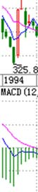

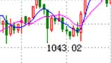

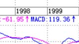

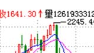

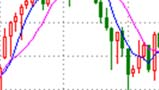

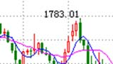

当然，对于极少数的人来说，市场就是一个提款机，想提就提，这怎么才能办到？就是要对市场充分地了解。
真了解市场的人，就知道市场都是一样的，就像穿着各种衣服的人，扒光了都一样。
真明白市场的，就无所谓牛熊，市场永远都是提款机。当然，如果市场只能是单边的，那么唯一的区别就是在熊市中，投入的资金以及摆
动频率要小。
不过，即使在牛市中，高手和低手之间的赢利程度也是区别很大的。一个股票如果上涨1倍，低手最终落袋的最多就是1倍，而高手搞出3、
4倍来是一个很简单的事情。
其实，股票投资十分简单，最关键的就是成本，而时机其实就是成本，如果你有本事能比市场的平均成本要低，就永远立于不败之地。既
然波动是市场风险所在，那么相应地就提供了利用市场的风险，利用一切值得利用的波动把持有成本往 0 甚至负数干下去的机会，这样，无论
牛熊，都无所谓了。
有波动就有风险，相应就有利润，对于一个高手来说，只要有足够的时间，一个下跌股票弄出来的利润一定比一个低手在一个上涨股票弄出
来的大，当然这只是举例，真正的高手当然不会故意逆着趋势干。
投资是一门艺术，而投资的艺术归根结底是资金管理的艺术，这就像歌唱的艺术，归根结底是呼吸的艺术一样。
而市场的波动，归根结底是在前后两个高低点关系构成的一个完全分类中展开的(匪注：前后两个高低点，以何为参照，判断前后、高低点？)，明
白了这一点，市场就如同自己的掌纹一样举手可见了。
以上这些，不但对于散户，对于庄家其实也是一样的，能明白这一点的，就可以在市场中游刃有余了。
当然，这个境界还有向上一路，这就不是能对一般人说的，而且说了也白说，就不说了。

引言之三：收购中国，从宝邯之争说起！(2006‐06‐02 21:44:58)
资本全球化，就意味着资产价格的全球化定价，最近国内房价、油价的变动正
反映了这种不可逆转的大趋势，而这一切，最终终也会最充分地在资本市场中体现现，
特别，当国内资本市场全流通后，这种反映就不单是一种理论了。
资本市场归根结底是通过虚拟价格来实现现实价值的占有，而这一虚一实的游
戏就有了资本市场的诸多故事，当然最多的故事事都是望梅止渴、、画饼充饥一类的，
但对于大资金来说，除了利用这种画饼游戏去套人套钱外，更重要的还是利用这种
虚拟机制达到现实的目的。
这几天，其实私下已不是新新闻的宝邯之争成成了当下的新闻，且不说这是否又是一个画饼游戏，这和十几年前的宝延之争都可以说是开风气之
先了。后者是在一个具体的全流通个股中玩的游戏，而前者却是在整体全流通背景下必然出现的游戏。
前两天，邻国的一位资本市场大玩家来北京，在一起聊了一个下午。他那里，因为最近文化输出十分牛，现在流行文化概念，除了原来控制
的几个上市公司，他刚收购的一个相应股票三个月就涨了十七倍。刚在东南亚某国收了一个赌场的他，这次来却不是为了赌，而是要寻找进入中
国资本市场的机会，原因之一是他那的某税收政策有大变化，其次，他希望在两国资本市场间嫁接一个流动的渠道，最后，最重要的还是目前中
国的资产价格严重偏低，这就意味着玩大游戏的机会。
那人拿着收集好的几十家国内上市公司的资料，希望能选择合作收购其中的三、四家。本 IDD 当然是很专业地和他探讨这些问题，而这，最
近一、两年其实已经不是一个很新鲜的事情了。资本全球化，意味着资本必然通过任何可能的渠道在各国中流动，如果以前收购中国可能还是
一个神话，那现在，神话已不再。看看，在目前国内的资产价格下，几亿美金就可以控制一个国家大型钢铁企业，这一切说明了什么，警示了什
么，大概就不用多说了。
教你炒股票引言 paage4 of 6

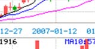

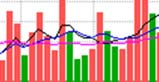

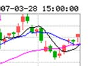

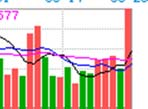

引言之四：长虹，老子变孙子，只要三亿亿美圆！(2006‐06‐06 21:099:45)
这是“收购中国，从宝邯之争说起！”的续篇。
长虹是谁，即使你从未在资本市场上晃荡，从未被电
视、媒体上十几年如一日的广告、报道所污染，也应该知
道！
那么长虹虹是谁的？当然不是人民的，如果是人民的，
那现在人民的名字叫国资委。
而上市公司长虹是谁的？在目前中国的环境下，肯定
是大股东的，大股东四川长虹电子集团有限公司，也就是
他的老子。
儿子是老老子的儿子，这很中国地天经地义，但已越来越全球球资本市场地没了意义，老子一夜可变孙子，这就是市场经济。
股改了，这老子现在只是三三分之一的老子了。长虹 18 亿的股份中，长虹集团只占 6 亿，从原来 53%的绝对控股一夜之间变成现在 33%的
相对控股。相对控股也还是老子，毕竟还是大股东，而现在的中国上市公司，大股东是老子，其他都是孙子。但是，让现在的长虹“老子变孙
子”，其代价只要三亿美圆。
目前长虹已有所回升的股价是 3 元多人民币，要成为大股东，也就 6 亿多一点的股票，大概三亿美圆上下。且不算其品牌价值和市场渠道、
人才等软价值，目前长虹的每股净资产是5元多人民币，公积金有5亿多美圆。
最近长虹刚收了美菱，触角伸向白色家电，而赵少帅也刚因为把长虹重新纳入快速增长轨道而获大奖，这对于猎手来说都是好好消息，猎物越
来越肥了。
教你炒股票引言 paage5 of 6

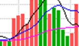

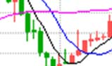

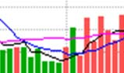

3亿美圆是一个什么概念？
对于国外一个中型基金，3亿美圆只是一个尾数的尾数。
对于国内的私募基金来说，有3亿美圆的，现在也算不了什么大鳄了！
资金从来都不是问题，另外一个更不是问题的就是，即使 10 亿美圆，一定复制不了现在的长虹，这是无疑的。买东西其实很简单，如果 3
亿可以控制一个10亿都复制不了的东西，这个买卖当然就可以买卖了。
显然，在现在的市场中，长虹绝对不是特例，而是相当普遍。最近，外资等的收购已经不断出现，这种收购并不是单单在某个产业，而是系
统的。不是有人以中国成为世界工厂而兴奋吗？但是黄雀只知道，成为世界工厂的大股东而控制世界工厂，是一个更简单的、可以目标的目标，
而且是一个正不断目标了的目标了！

我

---

## 教你炒股票 1：不会赢钱的经济人，只是废人！（2006）

“教你炒股票”这样的题目，全中国不会有第二人比本 ID 更适合写的。当然，股票是炒出来的，不是写出来的，因此也从未想过写这样的
题目。但任何事情都是有缘起的，缘分到了，也不妨写上一写。
人，总是很奇怪的，就算是很聪明的人，或者在其他行业很成功的人，一旦进入资本市场，就像换了人。虚拟和现实的鸿沟使得干实业的，
且不说期货了，就算到风险小的多的股市，也很少能干好的。而习惯在虚拟市场玩游戏的，基本很难回头去弄实业，这些例子都太多了。
周围朋友和经济有关的，干金融的比较多，也有几个干实业的。去年人民币放开后，有次和他们一起玩，偶然聊起股票。当时给他们的意见
是，由于资源的全球化升势及人民币的升值，国内实业将有很大的困难，而虚拟市场由于对资本的吸纳作用将大有改观，会出现一个至少是大
X浪级别的行情，劝他们应该分流部分资金到资本市场来。由于前几年资本市场上出事的人一拨接一拨，这帮家伙很犹豫，一晃就把时间过了。
今年，过完春节，这帮家伙突然开始不断骚扰本 ID，说要入市。本 ID 当时已经忙得无暇分身，对他们一番数落，然后告诉他们，现在是个
人都能挣钱，自己玩去，没空理你们。
进入三、四月份，当时有色等行情已经很火爆，这帮家伙想大进又怕风险，一直在小打小闹。有一天，又在一起玩，他们一定要本 ID 选择
一些具体的股票。因为这两年一直有很多外资大基金进来接触要收中国快速消费品的企业，还有就是一些大的周期行业将面临重组，就让他们去
关注这两类股票和权证。
五月份后，股市大涨，大家都很忙，中旬时又有机会碰头，一问之下，基本都没怎么大买，买了的也没几个站就下车了。他们都显得很烦躁，
不断问有什么可买的。既有点可怜又有点烦他们，怎么在市场外弄得好好的，一到市场里都成这样了？就有点敷衍地告诉他们，去买深沪两地 3
元上下的本地股，而且告诉他们，这样下去肯定要出问题的，最好自己好好学学，别人怎么厉害也不可能整天像照顾小孩一样看着。
上周日（匪注：2006年5月31日见下页图），又碰在一起。这几位，大概都一肚子股票了，这次个神采飞扬，大概又都刨了几本书，听了几
股评，看了几杂志，更是口水喷喷地这面那面、一线二线地专家了，1800、2000、2500 点地牛人了。这市场，还真能改造人！只是这市场的绞

肉机，又有新货了（匪注：Livermore如是说：投机市场里，没有新事物）。
有人说，市场是老人挣新人人的钱，而市场中的老人，套个 110 年 8 年的一抓一大把。其实，市场从来都是明白人挣糊涂人的钱。在市场经济
中，只要你参与到经济中来，就是经济人了，经济人当然就以挣钱为目的，特别在资本市场中，没有慈善家，只有赢家和输家。而不会赢钱的
经济人，只是废人！无论你在其他方面如何成功功，到了市场里，赢输就是唯一标标准，除此之外，都是废话。

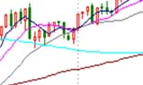

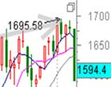

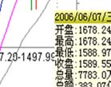

---

## 教你炒股票 2：没有庄家，有的只是赢家和输家！（2006）

庄家这种动物对大多数人来说很神秘，对本 ID 来说就太稀松平
常了。
庄家和散户这种二元对立，大概比较适合现代中国人的思维模式，
因此就变得如此的常识，但常识往就是共同谬误的同义词，不仅是
所谓的散户，而且很多的所谓庄家，也就牺牲其中。
一般定义中的所谓庄家，就是那些拿着大量资金，能控制股票走
势的人人。在有关庄家的神话中，庄家被描述成无所不能的，既能超越
技术指标、更能超越基本面，大势大盘就更不在话下了。这里说的还
只是个股的庄家，至于国家级的庄家，更成了所谓散户的上帝。关于
这些庄家上帝的传闻在市场中一秒钟都不曾消停，构成了常识的谬误
流播。但所谓的庄家，前赴后继，尸骨早堆成了山。
前几天在一个私人聚会里，还碰到一个 500 年代的老大叔，说已经准备了二十亿，要坐庄，让本 ID 去联系一下某公司的头。那人也是有
头有脸的人了，不想当众奚落他，暗地里把他嘲笑了一番，简直是脑子锈着了。
当然，即即使庄家的神话已经经如此常识，这种傻人还是一直、也会继续前赴后继的。而正因为这种傻人如此的多，猎人打起猎来才能收获丰富。
看到越摆庄家谱的，猎人就越高兴，反正这类型的，基本在市场上混个几年就基本尸骨无存了。
市场没有什么庄家，有的只是赢家和输家！有的只是各种类类型的动物，还有极少数的高明猎手。
市场就是一个围猎的游戏，当你只有一把小小弓箭，你可以去打野兔；当你有了屠龙刀，抓几几条蛇来玩当然就没劲了，关键你你是否有屠龙刀！

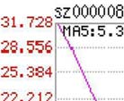

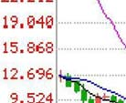

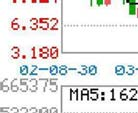

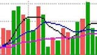

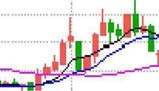

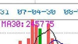

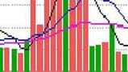

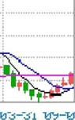

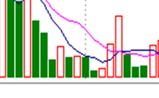

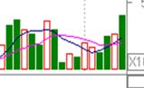

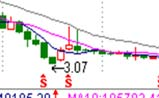

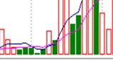

---

## 教你炒股票 3：你的喜好，你的死亡陷阱！（2006）

要世界杯了，在世界杯时谈论股票是一件很无趣的事情，而且，全世界的人都知道，世界杯前后，股票市场几乎都要大跌，这个常识，虽
然并不比所有关所谓庄家的常识更值得常识，但至少有趣，并不像所谓庄家一般无聊。还可以增加一句的是，足球至少有帅男，而见过的如此
之多的所谓庄家里，连长得不那么歪瓜裂枣的都少，这的确是实际情况，并不是开玩笑。
但你的喜好，就是你的死亡陷阱！在市场中要生存，第一条就是在市场中要杜绝一切喜好。市场的诱惑，永远就是通过你的喜好而陷你于
死亡。市场中需要的是露水之缘而不是比翼之情，天长地久之类的东西和市场无关。市场中唯一值得天长地久的就是赢钱，任何一个来市场的
人，其目的就是赢钱，任何与赢钱无关的都是废话。
必须明白，任何让你买入一支股票的理由，并不是因为这股票如何好或被忽悠得如何好，只是你企图通过买入而赢钱，能赢钱的股票就是好
的，否则都是废话。因此，市场中的任何喜好，都是把你引入迷途的陷阱，必须逐一看破，进而洗心革面，才能在市场上生存。
当然，能看清楚自己周围的市场陷阱，还只是第一步，更进一步，要学会利用市场陷阱来赢钱。当你要买的时候，空头的陷阱就是你的最
佳机会，当你要卖的时候，多头的陷阱当然就是你的天堂。这市场，永远不缺卖在最低点，买在最高点的人，这世界上没有什么是可以让所有
人赢钱的，连大牛市中都有很多人要亏损累累。而市场中的行为，就如同一个修炼上乘武功的过程，最终能否成功，还是要落实到每个人的智
慧、秉性、天赋、勤奋上来！（匪注：智慧与天赋次之，最重要还是秉性与勤奋）
当你要买的时候，空头的陷阱就是你的最佳机会，当你要卖的时候，多头的陷阱当然就是你的天堂。（匪注：这句话，点明了在判断趋势存在的
前提下，通过各类陷阱来反过来构陷市场上的猎物，而不是通过把握多头下的调整，空头下的反弹来获利，也就是说，多头的回调开始时，要避开而不是要在回调中获
利，在回调结束后大家认为空头来临时介入，以此构陷市场上的大部分猎物）
最后牢记：杜绝喜好！（匪注：不要只做多，也不要一味放空，多头趋势下，跳高的时候要学会卖，回拉的时候学会买，空头趋势下，跳高的时候，学会放空，
走势大幅走低之时，学会买入平仓，动态持仓）

附录：鄙视所有对 N 中工工 15 元不敢买 50 元就吃醋的人！(2006-06-19 16:45:177)
教你炒股票4：什么是理性?今早买N中工就是理性！ pagee1 of 5

谁都知道 N中工万千宠爱在一身，一年多没有新面孔了，突然来了一个新
的，大伙热烈烈一下有什么不对的？值得某些人这么大惊小怪的？鄙视所有对 N
中工15元不敢买50元就吃醋的人！
今天该股 90%多的换手意味着，所有中签的人基本都抛了（对手盘包括
其中），而且绝大多数都在100几元抛的。这就对了，你们10几元不看好，有
人要看好，市场向所有人开着，凭什么不能买？市场就是一个斗心理的过程，
大家都想一块块去了，大家还用不用活了？
下午激烈冲高，又有什么可值得奇怪的，市场上要买的力量大，而由于
T+1，没有足够的筹码供应出来，要买几百万股都跑到 50 元的，这不很正常
吗？
请注意，今天的均价是在 18 元，均价并没有大幅上涨，因此任何有关投机的说法都是可耻的！而且今天有快三个小时 10 几元随便买，自
己没买，就企图起哄叫嚣什么监管来捣乱的，鄙视你们！
中国资本市场中有过太多无无聊无端的干预，像 327 的最后交易不算之类的事事情真是世界罕有。市场最关键的就是大家都要遵遵守规则，这包
括管理层，不能按自己的一时喜喜好而干预市场。
就算交易有问题，只能根据交易的问题来处罚，而不是突然改变规则来显示自己的无能。
只要符合市场交易规则，包括 N 中工在内的所有走势，都应该受到法律保护，由于现在的法律观念太淡薄，往有按个人喜好代替法律判
断的倾向，所以必须再次强调。
至于市场中的人，不要自己没份就瞎起哄，看不得别人好不是一个好的市场参与者应有的心态。首先有了一花盛放才可能百花盛开，维护一
个只按法律办事的环境，对大家都有好处！
教你炒股票4：什么是理性?今早买N中工就是理性！ pagee2 of 5

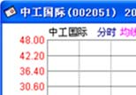

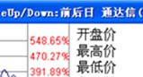

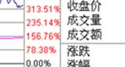

---

## 教你炒股票 4：什么是理性?今早买 N 中工就是理性！（2006）

很奇怪，在资本市场中经常有人在教导别人要理性。而所有理性模式后面，都毫无例外地对应着一套价值系统为依据，企图通过这所谓的
依据而战胜市场，就是所有这些依据最大的心理依据，而这，就是所有资本谎言和神话的基础。
真正的理性就是要去看破各色各样的理性谎言（匪注：所谓真正的理性，就是通透，不为外物干扰的眼睛），理性从来都是人 YY 出来的皇帝新衣，
这在哲学层面已不是什么新鲜的事情。
更可笑的是，被所谓理性毒害的人们，更经常地把理性当成一种文字游戏，当文字货币化以后，这种文字游戏就以一种更无耻的方式展开了。
但真正的理性从来都是当下的，从来都是实践的，而实践，从来都是当下的理性。就像性是干出来的而不是说出来的，理性也一样（匪注：当下
的感应，来源于不断的实践，没有实践，则没有一切感应，也表述了投机是一门实践的艺术，与其他“手艺”是一致的）。
站在资本市场的角度，就是所有的介入，都是可介入，从而被介入地介入着。也就是所有的介入，当你介入时，市场与你就一体了，你创
造着市场，从而市场也创造着你，而这种创造都是当下的，从而也是模式化的(匪注：无论你在市场或不在市场，主动还是被动介入市场，离开或是介入市
场，你都和市场是一体的，你无法远离市场，无法远离投机与不确定性，这就是生而为人的业)。
真正的理性关心的不是介入的具体模式如何，而是这种模式如何被当下着，最重要的是，这种模式如何死去。（匪注：这是交易最重要的心法，
介入前，要关注走势的模式，介入后，要关注走势是如何当下进行，更关注的是这个模式是如何死掉的）
生的，总要死去，如果自然真有什么法则，这就是唯一的法则，市场上的法则也一样。
所谓法则，就是宿命（匪注：深刻至极。宿命亦便是法则）。
在市场中，死亡是常态，也是必然，而生存，必须以生为依据，所谓生生不息，其实就是死死不息，当你被依据所依据时，其实已在死亡
之中。而生死，从来都是被当下所模式，资本市场也一样，以为离了生死也就无生死可了，这不过是所谓理性的妄想（匪注：小小一个市场，就是
一个六道轮回的道场）。

任何市场中人，都是被生死了的，生死无处可离，生死就在呼吸之间，不离生死而从容于生死，没有这种大勇猛，一切的理性都不过垂死
的哀鸣（匪注：还需要精进心）。
对于市场来说，介入就是介入生死，无所依据地从容于各种模式之间，无所住而生其心，而心实无所生，方可于生死而从容。（匪注：无所
住而生其心，而心实无所生，金刚句也）
对于市场的参与者来说，首要且时刻必须清楚自己目前介入模式的当下(匪注：“我在哪里，要去哪里”，进入前必须思考清楚，介入后，其他的都已经
无需关心，唯一关心的是，这个走势当下是如何进行的。后续有几种可能，走势选择何种可能。
Livermore 如是说：如果你对某个商品或者某些股票产生了明确的看法，千万不要迫不及待的一头扎进去。要从市场出发，耐心观察它的行情演变，伺机而动。
一定要找到基本的判断依据。
我坚信，任何人，只要他既有投机者的本能，又具备投机者的耐心，就一定能设法建立某种准则，借以正确的判断何时可以建立初始的头寸。
成功的投机绝对不是什么单纯的猜测，为了系统的、一贯的取得成功，投机者或投资者就必须掌握一定的判断准则。)，而市场中的绝大多数人，是不知道
自己在干什么的，狠一点说，就是死都不知道怎么死就死了，市场基本由这种人构成。这种构成与资金实力无关，大资金死起来更快，一夜之间
土崩瓦解的事情，本ID见得多了。
此外，如果你一定要很习惯地、理性地追问什么是理性，那么，相对那些光说不干的所谓理性，今早15元多买N中工就是理性！
理性是干出来的，今天，你干了吗？（匪注：我对股票不兴趣，没干）

附录：为管理层对 N 中工走势的回应热烈鼓掌！(20006-06-20 11:51:24)
如今盛行网络舆论暴力，最近那闹得沸扬扬的某事件只不过一个很普通的事例。昨天 N 中工走势引发网络暴民一阵喧嚣，本 ID 不愿意看
到这种暴力哲学得逞，收市后马上写了“鄙视所有对 N 中工 155 元不敢买 50 元就吃醋的人！”，里面强烈呼吁必须以法律和现行规则来评价该
走势，不能重回诸如327之类的老路。
本 ID 从来不爱对管理层说说什么好话，从来觉得对管理层应如小孩般，多斥责才会有进步。以前唯一次大力为管理层鼓掌是去年公布股
改大跌那最腥风血雨时，连续三个帖子对管理层下大决心解决问题的态度大力鼓掌，而今天，必须再次为管理层鼓掌，为的是其对 N 中工走势
的回应：深交所称中工国际表现属于正常，不会进行调查。
首先，由交易所而不是证监会来回应这事，符合规则。对一个股票的一天走势这么小的事情，如果都要动用证监会，那就像小孩玩泥沙这么
小的事情都要告法院一样无聊。
其次，表现属于正常，这是一个规则可以检验的概念，只要符
合买卖规则，资金上有没有出现过度集中的异常情况，任何走势都
是应该被允许的。
最后，从这事情可以看出，现在的管理层已经越来越成熟，而
现在的很多所谓股民，还是相当不成熟，为一点芝麻小事就一惊一
咋的，惹人笑话。
至于 N 中工其后怎么走，就更是市场化的事情，管理层当当然
就更不应该太多干预，这次 NN 中工为其后的监监管提供了一个最好
的榜样，希望望能继续发扬，这样中国资本市场才会少闹点笑话。
教你炒股票4：什么是理性?今早买N中工就是理性！ pagee5 of 5

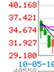

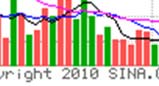

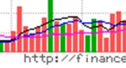

---

## 教你炒股票 5：市场无须分析，只要看和干！（2006）

喜欢吹牛皮的，在市场里最常见，例如一种以分析市场、吹牛皮为生的职业，叫什么股评、专家的。此类人不过是市场上的寄生虫，真正
的猎手只会观察、操作（匪注：交易，落到最终处，只有买点买，卖点卖，没有其他虚东西），用嘴是打不了豺狼的。
市场就是一个狩猎场，首先你要成为一个好猎手，而一个猎手，首先要习惯于无言。如果真有什么真理，那真理也是无言的。可言说的，
都不过是人类思想的分泌物，臭气熏天。真不可言说了，就无不可言，言而无言，是乃真言。
一个好的猎手，可以没有嘴巴，但一定会有一双不为外物所动的眼睛，在这眼睛下，一切如幻化般透明。要不被外物所动（匪注：多头走势的
回调，空头走势的上涨，就是所谓外物的一种），则首先要不被自我（匪注：所谓自我，就是本来已经获利的部位因为回调而产生的失落，或者介入后，继续不利
的部位而舍得舍不得抛弃，或者是稍有不利，就错误的认为自己的判断不对，简单来说，就是自己的贪嗔痴慢疑）所迷惑。
其实无所谓外物、自我，都不过幻化空花，如此，方可从容其中（匪注：在交易中，忘记自己，忘记走势，有的只是犹如禅坐中，单纯的价格的涨跌，
走势的当下，这才是交易入道最纯净的心法，於此之中，心思情绪如何变化，一目了然，走势如何变动，一清二楚）。
猎手只关心猎物，猎物不是分析而得的。猎物不是你所想到的，而是你看到的。
相信你的眼睛，不要相信你的脑筋，更不要让你的脑筋动了你的眼睛。
被脑筋所动的眼睛充满了成见，而所有的成见都不过对应着把你引向那最终陷阱的诱饵。猎手并不畏惧陷阱，猎手只是看着猎物不断地、
以不同方式却共同结果地掉入各类陷阱，这里无所谓分析，只是看和干（匪注：交易从来是根据事实的真相，客观的走势而交易的，绝非是交易脑海中的想
象、幻像来交易）！
猎手的好坏不是基于其能说出多少道道来，而是其置于其地的直觉。好的猎手不看而看，心物相通，如果不明白这一点，最简单就是把你
一个人扔到深山里，只要你能活着出来，就大概能知道一点了。如果觉得这有点残忍，那就到市场中来，这里有无数的虎豹豺狼，用你的眼睛去
看，用你的心去感受，而不是用你的耳朵去听流言蜚语，用你的脑筋去抽筋（匪注：五蕴皆空）！

教你炒股票5：市场无须分析，只要看和干！ page2 off 3

附录：请尊重资本市场的投资者！(2006-07-18 21:39:38)
本 ID 之所以选择在资本市场里玩，唯一的原因就是资本市场比较简单，不用处理太多的人际关系（匪注：我也是这种想法）。本质上，资本市
场完全凭一己之力就可以在里面获取超额的回报，而且一个人就可以掌管实业里多得多的人才能运转的资产，这是最重要的一点。
全球化的本质就是资本的全球化，资本市场在其中具有核心的地位。以前对这一点的认识是不够的，现在国家明显地意识到资本市场在经
济中的核心位置。资本市场的投资者就是这其中最重要的基石，任何一个人，都可以在资本市场中理直气壮地挣钱，没本事是个人的事情，和市
场本身无关。不明白这点，只不过是被市场所抛弃的一群。
在市场经济中，财富的资本市场化衡量是最标准的。一个不接触资本市场的人，基本就丧失了经济中的话语权，这一点在以后将进一步显
现。
谁都不用忌讳在市场里挣了多少钱，而在市场中挣钱，最根本是要通过对经济的深刻理解而达到的。本 ID 不讳言在资本市场中积累了所有
的超出绝大多数人的财富，但这是本ID应得的，是对本ID智力及市场洞察力的奖赏，这一点，本ID只会无比自豪。
人，首先要获得有尊严。当然，有钱并不一定有尊严，但连国家也不能一穷二白，人当然更是这样了。
对于个人来说，大概没有任何途径比资本市场能更简单地达到这个目的（匪注：於获得尊严之中，获取副产品--金钱）。
当然，前提是你能在市场中生存。
不管你对资本市场有什么看法，即使你反对它，要推倒它，那首先你要了解它、战胜它，否则只不过是失败者的哀鸣！
（匪注：什么是自由？对抗，意味着不自由，因为你想要用力量去改变它，只有随顺，才可以自由，因为随顺，意味着和解，只有和解才能获得支持。自由来源于坦然
接受命运所赐予的一切，且在命运面前，保持谦卑、顺从和感恩的状态，只有这样，才能改变自己的命运。自由由此而生）

---

## 教你炒股票 6：本 ID 如何在五粮液、包钢权证上提款的！（2006）

最近忙着和孔二爷闹，满博客都是孔二爷，前两天耍了一下鲁超女活跃一下气氛，今天想继续说说这《教你炒股票》系列。总不能整天都是
孔二爷，也要照顾一下孔方兄，都是姓孔的，一碗水要端平。
股票上永远不缺英雄，更永远不缺死去的英雄，最近的英雄们都又在吹投资，但投资这内裤永远掩盖不了股票扒光后赤裸裸的投机。阴符
云：“天性，人也；人心，机也；立天之道以定人也。天发杀机，斗转星移；地发杀机，龙蛇起陆；人发杀机，天地反覆；天人合发，万化定
基。”不投这个机，又如何夺天地之造化？股票市场也是一样的（匪注：世界上所有的行为，归根结底，都是涉及到如何在不确定的形势下，作出正确的选
择的智慧，人世间所谓的成功，名利等等，背后就是那种对不确定的环境具有着野兽般直觉的能力，离开了这种感应的能力和感悟，单凭勤奋与努力，犹如空有一身力
气，却缺乏运用与发力的功法）。
对于本 ID 来说，这股票市场就如同提款机，时机到了，就去提款，时机不到，就让他搁在那。市场就如同男人，整天管他就会犯贱，就会
咬你。
所以男人不能经常搞，这市场也一样，必须耐心等待他的骚动，他不骚动，是不能搞的。本ID曾写帖子“G股是G点，大牛不用套！”，
连G点都不明白，是没资格谈论股票的。
如同要找到男人的 G点，就要对这男人充分了解，要找到这市场的 G点，其道理是一样的。但就像光知道男人有 G点还是不能乱搞，首先
要了解他是干净的，是安全的，否则高潮还没有就翘了，那不麻烦大了（匪注：什么是G点？就是适合自己能力的入场点）？
这市场也是一样的，不是什么机会、G 点都要搞的，首先的前提要安全，要像去银行提款一样安全。就像又有 G 点又干净的男人才值得搞，
市场上也只有这样又安全又能G点的机会，才值得投机。
就像四月份时本 ID 在五粮液、包钢认购权证上的布局。为什么选择他们而不是其他，道理很简单，因为他们既有认购又有认沽，而对于企
业来说，除非行情特别不好，否则是不会让认沽兑现的，因为不兑现，这就是一个空头支票，而兑现是要掏真金白银的。

因此，对既有认购又有认沽的认购权证来说，认沽和认购的行权价之间的差价，就是认购权证最安全的底线。对于五粮液、包钢认购权证，
这个底线就分别是1.02和0.43元。而本ID当时分别在1元多和4毛多吃他们，是不是和去银行提款一样安全？
唯一遗憾的是，他们的盘子都太小，属于小男人的类型，容纳不了太大的资金。
小男人，没什么劲；小盘的股票，也一样。
投机不是瞎搞，是要清楚地搞。要清楚，就要对市场充分地理解，要明白其道（匪注：如何才能清楚？只有分类，对走势进行分类，
才能清清楚楚。如何充分的理解市场？只有对市场充分的分类，完全的分类，才能充分的理解）。
本ID曾发明了一个口号在私下流传，就是“像搞男人一样搞股票，像做爱一样做股票。”不明白这，没资格谈论股票。
关于这个话题，今天就到这，有时间、有心情，继续。（匪注：我也有点累了）

附录 1：五粮液 YGC1

附录 2：五粮液正股走势：

附录 3：包钢认购权证（匪注：见下页图）
A. 权证交易代码：580002；权证交易简称：包钢JTB1
B. 标的证券代码：600010；股权分置改革方案实施前，标的证券简称：包钢股份，股权分置改革方案实施后，标的证券简称： G包钢
C. 权证类别：备兑认购权证
D. 行权方式：欧式，仅可在权证存续期内最后5个交易日行权
E. 行权价：2.00元
F. 行权比例：1，即1 份认购权证可按行权价向包钢集团购买1股包钢股份A股股票
G. 结算方式：证券给付方式结算，即认购权证行权时包钢集团按行权价格向行权者收取现金并支付股份
H. 存续期间：自认购权证上市之日起12个月，为2006年3月31日起至2007年3月30日止
附录 4：包钢认沽权证（匪注：见下页图）
1、权证交易代码：580995，权证交易简称：包钢JTP1
3、权证类别：备兑认沽权证
4、行权方式：欧式，仅可在权证存续期内最后5个交易日行权
5、行权价：2.45元
6、行权比例：1，即1 份认沽权证可按行权价向包钢集团出售1 股包钢股份A股股票
2006-11-22 10:58:10：假如Y 是认沽行权价，X 是认购行权价，那企业为了自己的利益会尽量保证行权当天的股价不低于Y，所以认购权证的
最终价格会不低于Y-X，所以只要认购权证的价格跌到（Y-X）以下的区间内，都是比较安全的。是这个意思吗？
缠中说禅：不一定要跌到那区间，基本就是不会跌到那区间，在上面高点的位置就可以了，那是一个底线，基本不会跌破。所以就有了一个几乎
绝对安全的标准。最近的武钢，几乎绝对安全线在 0.21 元，在 0.35 元见到底部。等于你用 30%的风险去赌 300%的利润，这当然可以介入了。

---

## 教你炒股票 7：给赚了指数亏了钱的一些忠告（2006）

今天不宠幸孔二爷了，宠幸一下股票。
早就说过，中国没有人有资格和本ID谈论股票票。国庆前，香
港有几个大的基金经理过来，吃饭时让本ID给修理了一通，屁颠
屁屁颠回去了。本IDD和他们说了大的国际经济趋势以及大中国区的
金融前景还有内地的政治经济形势，坚定他们的信心，他们主要
是对内地的情况不了解，所以有所狐疑。
最近这伙人干得不错，在市场里，干就往死里干，不干白不
干。把锅炒热了才有好菜吃，这道理不很简单？（匪注：所谓往死
里干，个人理解就是尽可能的在多个级别买卖点上出击）
但这几个月还是有点烦，就是整天给一大叔骚扰。他钱不多，也就千万级别的资金规模，这种人本ID从不搭理，但这大叔有点特殊，有些
渊源，人家年年纪又这么大，40好几了，怎么都给点面子。但有时时候，真想踹他两两脚（匪注：听您这么一说，顿觉惭愧，因为在遥远的以前，刚做期货的时
候，我的毛病刚好相反，高了还想高，跌了还想跌，总是出场慢一拍。我自己鄙视一下先）。
4月份，本ID布局权证时，他就不敢买，后来权证疯了，他就后悔。然后告诉他，年纪大了就不要玩太高风险的，买银行股吧，民生，4
块钱附近买了就搁着，结果赚了几毛钱就跑，真真没出息。
最可气的是，国航跌破发行价时告诉他去买买，他自己也当过兵，特别提醒他他国航的李总当兵出身的，怎么可能让自己的股票跌跌破发行价这么
没面子？（匪注：这就是先生眼中的基本面）这大叔犹豫，N天天时间也就买了点，涨起来几毛钱又走了。
最近，让他在3元多吸纳北辰实业，4块不到就跑了，本IDD简直对他彻底绝望。不过他还算好，有部分钱在年年初3、4块买了一支自己十分

熟悉的北京股票，现在已经10块了，但这大叔最麻烦的是，上下一波动就紧张，就打电话来骚扰本ID，本ID教他怎么在箱型盘整时弄短差，
这大叔，涨的时候不敢卖，跌的时候不敢买，本ID真服了他。
之所以说这，因为这种情况在散户中太常见。散户就如浮萍，没根，没主意，这样不给屠杀才怪了（匪注：对应第6篇的“投机不是瞎搞，是要清
清楚地搞。要清楚，就要对市场充分地理解，要明白其道。没根没主意，意思就是，背后没有理论支撑，没有对市场充分理解）。大概最近比这大叔更惨
的，赚了指数亏了钱的也不在少数。
本ID也废话一下，让有缘者得之。去年破1000点前，本ID曾写“G股是G点”，今天5月刚突破后，本ID又写“大牛不用套！”，但
为什么有人竟然可以不挣钱？最主要是对牛市没信心，对牛市的节奏没把握。5月份前有色等的上涨，不过是牛市的预热阶段，而目前以金融股
等为代表的指数股上涨，是牛市的第一阶段。96年的时候，深发展长了N倍了，很多股票还没怎么动。
牛市的第一阶段都是这样的，一线股先涨，它们不到位，其他股票怎么长？全世界的牛市都基本这样子，没什么新鲜的。（匪注：由此开始，
慢开始讲解技术切入）
错过了这个节奏怎么办？
A、如果你跟盘技术还行的，就要在回档的时候跟进强势股票。散户就怕跌，但牛市里，跌就是爹（匪注：此乃至理名言），一跌就等于爹来了，
又要发钱了。
B、如果跟盘技术不行，有一种方式是最简单的，就是盯着所有放量突破上市首日最高价的新股，以及放量突破年线然后缩量回调年线的老
股，这都是以后的黑马。特别那些年线走平后向上出现拐点的股票，一定要看好了。至于还在年线下面的股票，先别看了，等他们上年线再说。
其实，这就是在牛市中最简单可靠的找所谓牛股的方法。
举一个例子，去看看宝钢（匪注：600019，见下页配图）。
突破年线后缩量回调，10月23日回调4.20元，当时年线就在4.17元，然后再放量启动，今天，11月16日，已经6元多了，50%就这么
完成了。从年线上启动，先涨个50%，不像玩一样？

本ID一般只看大盘股票，小盘股没法进去，但散户可以看小盘股，原则是一样的，不过小盘股可要留意，一般大盘股启动的骗线比较少，
小盘股可不一定，这都要自己好好去揣摩。散户就当好散户，别整天想着抄底、逃顶，底都让你抄了，顶都让你逃了，不是散户的人吃什么去
呀（匪注：只有散户，才认为自己的技术高超，只有技术不好的，才天天想着抄底摸顶，这是一个循序渐进的过程，每个人都会经历这个过程，只是过程有长短区别，
吃得亏多了，才会知道这种做法的问题所在）？散户，一定要等趋势明确才介入或退出，这样会少走很多弯路（匪注：又是一个学习路径的指明）。
一支股票涨起来千万别随意抛了，中线如果连三十天线都没跌破，证明走势很强，就要拿着（匪注：短线为价格与5日线之间的关系）。当然，
如果你水平高一点，在上涨的时候，根据短线指标可以打短差，这样可以增加资金的利用率，但高位抛掉的，只要中线图形没走坏，回档时一
定要买回来，特别那些没出现加速的股票。
有一个抛股票的原则，分两种情况：
①一种是缓慢推升的，一旦出现加速上涨，就要时刻注意出货的机会；
②另一种是第一波就火爆上涨，调整后第二波的上涨，一旦出现背驰或放巨量的，一定要小心，找机会走人。
（匪注：这2个原则同样适合於短线交易，一般来说，价格快速的上涨或者下跌，伴随着成交量快速上升的，基本都是行情发生转折的好时候，当然，具体还要
根据行情的结构来，而这2种情况，往往就是背驰的外在表现）
具体的操作是一个火候的问题，必须自己用心去体会，就像煲汤，火候的问题是没法教的，只能自己在实践中体会。
还有，对抛弃的股票一定不能有感情，股票就像男人，玩过就扔，千万别有感情（匪注：有感情的时候，就是下一个适合自己买点出现了）。
还有一点必须提醒，在牛市中，一定要严重关注成分股，特别有一定资金规模的，成分股都是大部队在战斗，别整天跟那些散兵游勇玩，
那些人自己都自身难保，本 ID 看这种所谓游资被消灭的都看到麻木了，大资金就爱吃他们，几个亿几个亿吃他们，这才有点意思，否则吃小散
户的几万几千，累不累呀？
牛市中，最终所有股票都会有表现的机会，只是掌握了节奏，资金的利用率就高，一个牛市下来，挣的钱如果不超出指数最终涨幅的几倍，
指数长一倍，不挣个4、5倍，那就算废物点心了。

要达到这种水平，其实很简单，就一个原则：避开大的回挡，借回挡踏准轮动节奏。（匪注：这个办法，同样适用于单个股票的操作）
千万别相信什么基本面的忽悠，特别对于散户来说，最多也就一亿几千万的钱，有必要研究什么基本面吗？所谓基本面，只是一个由头，给
自己壮胆和忽悠别人用的。对基本面，只要知道别人心目中的基本面以及相应的影响就可以了，自己千万别信（匪注：基本面，对于一般资金量的人
来说，根本是无须关注的）。
本 ID 还是那句话，玩资本主义的游戏就要用资本主义的原则，既然玩股票了，就要心狠手辣，市场从来不同情失败者，市场不需要焚尸炉，
失败者的尸体在市场中连影子、味道都不会留下。
别给自己的失败找任何理由，失败只能是你自己的失败，失败就找机会扳回来，但前提是必须找到失败的真正原因，否则不过是延续不同
的情节、相同的悲剧。（匪注：要善于运用总结笔记的力量，智慧从来都是埋藏在愚蠢堆里，而且，智慧不是来源于别人的指点，只有自己最明白自己，所有的问
题，也只有自己能够解决，旁人无法解决，妄图扎堆取暖，是非常可怜的事儿）
希望来本博客的人，除了学《论语》、听音乐、看文章，还都能学会挣钱。这个世界上最无耻下流的就是不会挣钱的人，你说钱是孙子，
而你连孙子都搞不掂，那你最多就是龟孙子，有什么资格说话？（匪注：拥有奔驰的人，才有资格说奔驰哪里不好，买不起奔驰的人，没有资格说不好使用）
有钱不是大爷，没钱更不是大爷。
在市场挣钱就如同打仗，九死一生，而最终能活着的，就是牛人，牛人就要牛，这又有什么可说的？

---

## 教你炒股票 8：投资如选面首，G 点为中心，拒绝 ED 男！（2006）

中国人喜欢说反话，面首，“面”，绝不是首位的。选面首，先看面(匪注：表里之“面”)，终要看“里子”。何谓“里子”？就是“G点为
中心，拒绝ED男！”这也是本ID关于投资的警世之言。
拿投资来忽悠的人，总爱编一些关于“面”的神话。诸如基本面、技术面、心理面、资金面，这面那面，都如同面首之“面”，不过是进而
“里子”的借口。没有“G点为中心，拒绝ED男！”的“里子”，这面那面又有何意义？(匪注：没有适合自己的买卖点，什么都是假的)
投资的结果很简单，就“输、赢”两种。所有关于投资的理论把戏，都企图通过控制某种“输入”而把“输”这结果给去了。因此一切相
关的理论前提就必然建立在这样一个逻辑假设之上：
①输入与输出间被某种必然的逻辑关系和因果链条所连接（匪注：走势是类似的，但结果却是不同的，所有单纯根据图形相似来交易的，必然会导致很
多困惑，所以，研究架构和形态的，如果没有结构支持，都只是徒劳无功。原理>结构>架构>形态）。
而该逻辑假设，相当于说“面首的面和其里子有着必然的逻辑关系”。如果这都能成立，那么帅男就一定G点澎湃、满面胡子的糙爷就一
定非ED男，出去扒几个面首看看就知道这类假设是何等荒谬。
②然而，现实中，企图跳过“面”而直捣“里子”，同样是一种荒谬的幻想（匪注：正反论述，正反抽耳光）。即使“面”和“里子”没有任何
必然的联系，但现实依然只能从面到“里子”。那种企图否定一切“面”的，企图直接就“里子”就G点的，不过是把某种“面”当“里子”
了。这种人，终生被骗而不知，就像把“叫床分贝”当高潮指标一样可笑。（匪注：这一段，论述了2个观点，单纯的根据1+1=2来交易的，结果必然是
不圆满的，但不根据走势图形来设计交易的，同样是有问题和缺陷的）
投资领域，没有任何理论可以描述这种从“面”的输入到“里子”输出的必然关系，因为这种关系根本不存在（匪注：所谓必然知道走势结局
的理论，全部是虚假理论，因为一切只能根据当下对走势的感应而来）。但人只要介入这种投资游戏，其介入就必然要以某种方式进行，相应地，其后必
然有着某种理论、信念的基础。（匪注：没有理论规则支撑，就成了盲动，而盲动就意味着没有一致性，所谓没有一致性，就是胡乱交易，也就是说，交易，无

论如何，必须要有一种理论与交易规则，作为支撑所有交易动机的基础，前提不是追求完美的理论，而是深刻的知道这个理论对应的缺陷）而正因为绝对正确的不
存在，因此反而使得各种理论、信念基础之间有了比较的可能。
任何好的投资理论，最终都只面向“里子”（匪注：所谓里子，就是利用客观走势，指出市场真正的欲求，同时也是市场真相），就如同一个好面首，
必须最终以其G点的澎湃度来证明其优秀（匪注：什么是G点？G点就是趋势背驰后的1买卖点）。
相应的，投资市场最重要的指标就是高潮度，一个长期没有高潮的市场，就如同没有G点的石男，是不值得任何关注的。期待一个石男变
成一个优秀的面首，那是牧师的工作，而投资市场不需要牧师。一个市场能进入可投资的视界，首先要显示其G点的萌动，否则还是一边凉快
去吧（匪注： 本段论述了所谓的圣杯的不存在，以及，如何挑选一个合适的扎实的理论，作为依据和依靠的原则，许多新手往往需要很久才能明白，圣杯是不存在的
这样一个浅显单纯的道理）。
世界，永远不缺G点萌动的男人去面首，同样，在世界总的市场体系中，永远不缺高潮萌动的市场。但大多数的散户，就喜欢泡石男，以
为石男没有攻击性就安全了，以为长期没有高潮的市场就一定安全（匪注：这段话，批评了那些交易了一段时间，有些经验，但是处在不完全的惊弓之鸟之
阶段，喜欢躲在盘整之中，看到走势大幅走动，心惊肉跳或者干脆不敢参与，这样一种状态，料必绝大多数人都有经历过）。有多少人因此而独守空房、耗费青
春，整天听着看着别人高潮不断，最终寂寞难耐，走向另一个极端，见高潮就扑上去，如飞蛾一样死掉（匪注：追高杀跌）。
本ID曾言“像搞男人一样搞股票，像做爱一样做股票”。搞男人、做爱，最终都是要获得其高潮，最终采阳而补。投资也一样，通过市场
的高潮是要赚取其利润，是采利而补。可惜，市场上的人，大多数都让人当阳给采了，可笑可怜。要采阳而不要被采，这就是和面首游戏的第
一准则，而投资市场的道理也是一样的。
采阳，过熟不行，过生也不行，必须把握其火候。阳生，必有其萌动，必须待其萌动之后才可介入。（匪注：什么是萌动？萌动之后可能会如何，
等等，都需要一系列的理论和原则来充分表述和分类）
具体对于股票来说，按其是否萌动的标准把所有股票动态地进行分类，一种是可以搞的，一种是不能搞的，将你参与的股票限制在能搞的
范围内，不管任何情况，这是必须遵守的原则（匪注：分类原则的再一次体现，交易难点，在于动态的分类，当下分类，而非事后分类）。

当然，搞的分类原则，各人可以有所不同，例如：
①250天线以及周线上的成交量压力线的突破；
②资金量不大且短线技术还可以的，可以把250天线改成70天线、35天线，甚至改为30分钟图里的相应均线；
③对新股，可以用上市第一日的最高价作为标准；
④还有，就是接近安全线的股票，例如在第六课里，本ID给出的一个带认沽权证的认购权证介入的安全线标准；
而对于有一定水平的人，识别各种空头陷阱，利用空头陷阱介入是一个很好的方法，这种方法比较专业点，以后专门说。
男人只有两种，能搞的和不能搞的；
市场也只有两种，能搞的和不能搞的。
必须坚持的是，不能搞的就无论发生什么情况都不能搞，除非能达到某种能搞的标准，而自动成为能搞的对象（匪注：可以这么说，投机艺术，
就是分类的艺术，分类的艺术达到极致，就是资金管理技术的升华，分类是投机艺术的基础和终归），就像用ED把男人进行分类一样，ED男只有非ED后
才有进入被搞侯选集合的可能。
一旦被搞的分类原则确定，就一定要严格遵守“只搞能搞的”原则（匪注：在唯一和确定性原则上分好类，严格遵守自己的分类原则。Livermore如是
说：如果他们凭借某种准则行事，准则就会告诉他们应当如何做，这样，不仅会给他们挽回大笔的金钱损失，还能解除他们的焦虑。）。可惜，这样一个简单的原
则，绝大多数的人即使知道也不能遵守（匪注：如果能够明白遵守自己的分类这一点，交易的一致性便显而易见）。
人的贪婪使得人有一种企图占有所有机会的冲动（匪注：这也是我对自己再三强调的，多头走势下，不交易回调，空头走势下，不交易反弹的原则，只能
避开，而不要去交易，尽管会获利，但更大的可能是因小失大，丧失潜在巨大的利润，以及因此搭上节奏错乱的代价），就如同看到街上的所有男人都企图上去
扒光他们一样，这种人叫“花痴”，“花痴”在投资市场的命运一定是悲惨的。
（匪注：所谓的花痴，就是一点点小机会都不放过，见缝插针，最后，节奏紊乱，心态丧失，由此可见，交易也是舍小取大的艺术。
Livermore如是说：投机交易与扑克牌游戏酷似，我们每个人都受到人性弱点的诱惑，每一次轮流下注时，都想参与一份，每一手牌都想赢。而正是这一弱点成

为投资者与投机者的头号敌人，如果不对之采取适当的防范措施，它最终将导致我们的溃败。
满怀希望是人类的显著特点之一，担惊受怕同样是另一个显著特点，然而，一旦你将希望和恐惧这两种情绪搅进投机事业，就会面临一个极其可怕的危险，因为
你往往会被这两种情绪搅糊涂了，从而颠倒了他们的位置：在本该害怕的时候却满怀希望，本有希望的时候却惊恐不宁，惶恐不安。
一厢情愿的想法必须彻底消除，假如你不放过每一个交易日，天天投机，你不可能成功。
在时机之外的空档里，你应当让市场逐步酝酿下一场大幅运动）
在投资市场，定好“能搞”的“G点萌动”标准，相应选出来的，至少不是ED男了。而接下来，就要防止其“早泄”。这里找到有关“早
泄”的医学定义：男子性功能障碍中仅次于阳痿的最常见的症状，是射精障碍中最常见的疾病，发病率占成人男性的35%～50%。
投资市场里，这“早泄”的比例和市场总体强度有关，在熊市中这比例至少是80%以上，而牛市中这个比例就小多了，大概就30%。无论
是选一个好面首还是一个好股票，把“早泄”的一类给筛出去可是最重要也是最困难的一步，很多所谓的高手，就死在这一步上。
关于这问题，将在下一讲中详细论述。（匪注：这一段，讲的是设置了一个介入的标准，然后，在此标准下，走势出现了一段不太流畅的过程，如何处理这
个过程，从而把握到终极整段走势的描述，比如，介入的标准是下跌+盘整+下跌，那么，介入后，出现了上涨+盘整，这时候，你该如何应对，这样一个描述）
缠中说禅 2006-11-20 12:44:11：不要用你的想象代替现实。股市里的牛人每年都有，死去的牛人更多，市场的第一原则就是生存，只要你 30
年后还能活下来，自然就是最大的牛人。本ID 2001年到2005年，4年，从来不看股票。但从2005年6月以后天天看，等哪天本ID不看了，
你们可要小心了。

附录：答疑解惑(2006 年 11 月 20 日)
2006-11-20 12:44:11：您为何说 15 元多买 N 中工就是理性？现在我不是想问 N 中工值不值这个价，我只想知道假如我在那个位置买了，在这
个长达几个月的过程中，应该如何处理才是最佳的操作手法？
缠中说禅：
开盘就买中工当然是理性的，因为第一支，而且开盘的位置也不太高。后面之所以出现如此走势，是中国特色的管理层所造成的，但开盘
15 元多买的，后面 18、19 元随便你出，由于情况发生了意外，当然就要选择退出，这还是上面的原则，买股票一定不能追高，这样一旦发生
意外，退出也简单。
再问：你认为大盘能涨到多少点？
缠中说禅：预测是股评干的事情，本ID只对赚钱感兴趣。而且大盘跌也可以挣钱，预测它干什么？
2006-11-20 19:10:44：“只要你30年后还能活下来，自然就是最大的牛人”，假如一个人生存了30年，但前25年都是惨败，就是后5年风
光，这也叫牛人吗？不好意思，我这问题有点钻牛角尖。
缠中说禅：
牛人，一般是指站在潮流之巅的。在投资市场里，整体的失败是一次都不能发生的，只要发生一次，基本就翻不了身了（匪注：也即是说，只
有对市场走势进行了充分的分类，充分掌握的人，才能站在潮流的巅峰）。个别的失败是允许的，但不能影响大局。
最早时几千万就可以当庄家了，现在几千万连大散户都算不上，在投资市场中，一次的跌倒，终生都追不回来，基本只能在后面跟着玩了。
而在后面跟着玩，怎么都算不了牛人。

附录：答疑解惑(2006 年 11 月 21 日)
教你炒股票8：投资如选面首，G点为中心，拒绝ED男！ pagge6 of 8

2006-11-21 21:15:16：我是一个刚起步的散户，K 线图中哪条是年线？我只认得 5，10，20 日线，请指教！另外我买的东方金钰（原 G 多佳
600086）什么时候会涨啊？能否分析分析？（匪注：见上页图）
缠中说禅：
本ID不是股评，说股票只是本博客的一个方面，纯粹是希望来这里的人能学点东西。本来你的问题是不应该回答的，因为本ID怕一旦开始
回答问题，这里就成了咨询台了。但看你说的诚恳，本 ID 破例一次。年线一般指 250 日的均线，但在各种周期的图表上都可以用上。例如分钟
图、小时图、周线图、月线图等都可以。具体如何设置找附近的人问问。
至于你说的 600086(东方金钰，见上页图)，它已经涨了很多了，连续拉了 8 个月的阳线从 1 块多长到 7 块多，出现调整是最正常不过了。关
键是你买的位置，如果你是最近才买的，对面临的调整风险就要有所承受。
本ID现在只能告诉你它现在的具体状况：
①它目前最大的长线压力是 70 月均线（匪注：为何会出来70均线这个说法？），03 年时曾碰该线后从 13 元一直下跌到 1 元，所以该线是该股
最重要的长线关口，目前在8.36元，每月以0.3元下降。
②中线关键的点位是5.9元（匪注：5月线位置），该位置不能有效跌破，否则调整的幅度会很大。目前可以看成是5.9元到7.2元的一个箱形
调整，可以按照箱型进行短线操作，就是所谓的高抛低回补。中线等待突破方向的选择。
但还是请各位注意，不要轻易介入涨幅过大的股票。要从最开始就学会用尽量小的风险换取尽量大的利润。
2006-11-21 22:05:15 ：“但还是请各位注意，不要轻易介入涨幅过大的股票。要从最开始就学会用尽量小的风险换取尽量大的利润”。我还以
为高人都是只做最后的疯涨那一段呢。没想到你这样的大侠也这么规避风险。
缠中说禅：要长期胜利，就一定要坚持用最小风险换取最大利润，风险是第一的（匪注：因此，介入前需要先确定好 IF…THEN 的应对方案），这里没
有什么高低之分。亏损是按百分比的，一百亿和一百万，亏了百分百，都是零。人弃我不一定取，人抢我一定给。

缠中说禅2006-11-21 22:07:06：
那些赚了指数亏了钱的，稍安毋躁，前面说过了，这只是牛市的第一阶段，以后机会多了去了，还是先把技术学好（匪注：从谁学？从何学起？
如何学？都是一个问题。
Livermore 如是说：任何人只要愿意花时间和心血研究价格运动，就能够在合理的时间内建立自己的判断准则，而这些准则将在他未来的投机活动中发挥作
用。），否则死都不知道怎么死的就不好了。
不要用你的想象代替现实。股市里的牛人每年都有，死去的牛人更多，市场的第一原则就是生存，只要你 30 年后还能活下来，自然就是最
大的牛人。
本ID自2001年到2005年，4年，从来不看股票。但从2005年6月以后天天看，等哪天本ID不看了，你们可要小心了。

---

## 教你炒股票 9：甄别“早泄”男的数学原则！（2006）

设计一个程序，将所有投资资对象进行分类，只搞那些能
搞的，这是投资的第一原则（匪注：学习技术分析，就是学习分类，
总结自己的交易技术，也是在总结自己的唯一性、确定性分类，只要有
了自己的分类，那么，就有了自己的交易原则和系统）。
在分类中，所应用的程序可以各色各样，但有一点是肯
定的，即没有任何一个程序，可以使得所选能搞搞的最终都百
分百能被搞得高潮迭起，就像没有任何一个挑选面首的程序，
使得所选能搞的最终都能百分百被搞得高潮迭起。
因为任何操作程序都必然面对“早泄”问题，就像任何
关于面首的选择都必然面临“早泄”男的甄别问题。
而甄别“早泄”之所以困难重，使得无数所谓高手死无葬身之地，是因为“早泄”这事还真得真刀真枪地实干才能发现，这比ED的甄别
可复杂多了、风险大多了（匪注注：所谓早泄就是以为是底部，但是介入后却发现只是个反反弹盘整。有心的话，仔细看本页配图的右侧，极其形象的早早泄）。
ED，不需要深入介入就可趁早发现，但““早泄”不可以，怎么都要试上一试，而这玩意是一锤子的买卖，这次行还不能保证下次就一定行，
因此要有效甄别、及早发现而减少损失就成了一个头号难题（匪注：当你介入，如何提前发现情况不良，如何及早发现，这是一个难题）。许多所谓高手
会宣称，出现什么情况，这股票就会涨。但实际上，任何一种情况，都有着极高百分比的可能会出现“早泄”，确定能搞的突然就变成不能搞
了，使得介入变成了套牢。这种情况，在投资里简直太常见了。
那么，如何甄别“早泄”男（匪注：请您讲解）？

①首要的就是严格的资金管理。
一旦出现“早泄”现象，必须马上退出，即使下面突然又不“早泄”了，又强力高潮了，也必须这样干。（匪注：对纪律的遵守，不怕一万，就
怕万一，谨慎，是一个好猎人的必备要素）而且“早泄”特敏感，一个偶尔的因素就可能导致，而要重新再来，还要等待一个长的不应期，一个长的
调整过后，即使会高潮不断，也浪费了时间，有这时间，可搞的东西多了去了，这世界又是不只有一个面首、一支股票。当然，这里说的只是基
本原则，如果有一套严格的分批介入和退出程序，这一切都变得简单。
②资金管理问题，涉及面很广，以后会专门分析介绍，这里说的是另一个方面。就是如何能在投资领域尽量避免碰到“早泄”男。（匪注：
对策是严格的分批介入程序和退出程序，也就是到哪里介入多少，到哪里退出多少）
“早泄”出现的根本原因在于介入程序出现破缺，出现程序所不能概括的异常情况，这对于所有程序都是必然存在的。而一个程序出现异
常，也就是出现“早泄”的概率有多大，这是可以通过长期的数据测试来确定的。最简单的就是抛硬币，正面买、背面不买，这样也算一个介入
程序，但这样一个程序的“早泄”率，至少是50% 以上。现在的问题其实很简单，就是如何发现一个“早泄”率特别低的介入程序。
但答案很不幸，任何一个孤立的程序都不会有太低的“早泄”率（匪注：任何孤立的程序），如果一个程序的“早泄”率低于10%，那就是超
一流的程序了，按照这个程序，你投资10次，最多失误1次，这样的程序是很厉害的，基本没有。（匪注：再次指出，圣杯根本不存在，但我们可以
根据自己的走势唯一、确定、一致分类和交易程序，来无限的靠近圣杯）
但问题不像表面所见那么糟，在数学中，有一个乘法原则可以完全解决这个问题。假设三个互相独立的程序的“早泄”率分别为 30%、40%、
30%，这都是很普通的并不出色的程序。那么由这三个程序组成的程序组，其“早泄”率就是30%*40%*30%=3.6%，也就是说，按这个程序组，
干 100 次，只会出现不到 4 次的“早泄”，这绝对是一个惊人的结果。即使对于选面首来说，有这样的高效率，大概连武则天大姐都要满意了。
现在，问题的关键变成，如何去寻找这三个互相独立的程序。
①首先，技术指标，都单纯涉及价量的输入而来，都不是独立的，只需要选择任意一个技术指标构成一个买卖程序就可以。对于水平高点的
人来说，一个带均线和成交量的K线图，比任何技术指标都有意义。

②其次，任何一个股票都不是独立的，在整个股票市场中，处在一定的比价关系中，这个比价关系的变动，也可以构成一个买卖系统，这个
买卖系统是和市场资金的流向相关的，一切与市场资金相关的系统，都不能与之独立（匪注：商品市场也一样）；
③最后，可以选择基本面构成一个甄别“早泄男”程序，但这个基本面不是单纯指公司赢利之类的，像本 ID 在前几期所说，国航李总当兵
出身不会让自己的股票长期跌破发行价这么没面子，还有认沽权证基本不会让兑现等等，这才是更重要的基本面，这需要对市场的参与者、对
人性有更多的了解才可能精通（匪注：基本面，就是揣测这种信息对他人的影响程度，亦即对他人、群体性格心理的把握，对市场当下走势的测试。而非自己去揣
摩价格对行情走势有何种变化影响，先生於2007年8月9日说：那些分析不出来的，必须通过中国特色的程序的，才是基本面）。
当然，上面这三个独立的程序只是本ID随手而写（匪注：随手的已经这么牛叉了，汗），任何人都可以设计自己的独立交易程序组，但原则是
一致的，就是三个程序组之间必须是互相独立的，像人气指标和资金面其实是一回事情，各种技术指标都是互相相关的等等，如果把三个非独
立的程序弄在一起，一点意义都没有。就像有人告诉你，面首的鼻子大就不会“早泄”，另一个告诉你耳朵大不会“早泄”，第三个告诉你胡子
多不会“早泄”，如果真按这三样来选人，估计连武则天大姐的奶妈的邻居的奶妈的邻居的奶妈的奶妈的奶妈，都会不满意的。
顺便说说如何看本 ID 的文章，本 ID 不是股评，不会推荐什么股票，所以希望来本 ID 这里知道什么具体股票的，就不要浪费时间了。试想，
真有本事的人，挣钱都忙不过来，怎么会当股评。
本ID这里，股票只是其中一个小项目，只是希望来这里的人也学会怎么挣钱（匪注：菩萨心）。所谓六艺，不会挣钱，在经济社会里还算人
吗？（匪注：虽然伤人，但说的超级现实）看本ID的文章，要学会方法，当然，本ID有时候可能有意无意就会透露点东西，但你必须有分析能力，
要吃透方法。就像10月24日告诉你认购权证介入的一个原则，26日武钢认购权证就大幅启动，2周从3毛多长到1块多，翻了快4倍，如果
你真能吃透本ID所说的方法，这种机会是可以把握的。
至于现实的股市，本ID在前面已经反复说了，只要是牛市，股票都要表现的，前几天大家可能都很烦银行股，因为大家都没有，但昨天开
始大家就高兴了，因为银行股不动，其他股票开始动。别恨银行股，哪天它们真见顶了，市场也好不了，它们是红旗，各位只要看着红旗还在
打，各根据地就可以继续轮动大干了。股票的运动是有规律的，好好学习，这一切都能在你的把握中。（匪注：此话令人温暖）

附录：答疑解惑(2006 年 11 月 22 日)
2006-11-22 00:59:00：“除非行情特别不好，否则是不会让认沽兑现的，因为不兑现，这就是一个空头支票，而兑现是要掏真金白银的”这句
话看不明白，权证一旦发行了就是有法律效力的，企业怎能赖皮不兑现？还有，难道企业有操纵权证价格的能力？
缠中说禅：股价升破认沽价，认沽权证就是废纸，就不用兑现了，因为没人会去兑现。例如，认沽价 3 元，现在股价是 4 元，没人会用 4 元的
股票去换3元的人民币。
2006-11-22 22:34:07：为什么说做股票就象做爱呢，这之间有什么可比类推之处呢 ？
缠中说禅：刚看到你的帖子，看来还走不了。连续几章不一直在比喻着吗？这种事情只可意会，不可言传。这里可没有变成黄色博客的打算，
所以给点幽默感，多干多体会。
2006-11-22 12:43:51：介入程序怎么设计呢？不能指望我们大家都去学习股票分析程序设计啊？即便能学会，等我们学完了研究完了牛市也结
束了。好象有种些股票分析软件叫什么飞狐交易师的，是可以用户自己设定一些指标值进行选股的吧？想知道你是怎么弄的。
缠中说禅：不是设计程序，是想好一套系统的方法，不要企求有什么独门暗器。请你再好好读读，慢慢理解，会悟出点东西来的。
2006-11-22 12:49:47：你应该不缺钱吧，为什么还要花大把时间炒股呢？
缠中说禅：炒股不花时间，只有牛市时候才需要看股票，本ID自2001年到2005年，4年连一眼股票都不看。现在就算看，一天也就4小时，
这不是钱的问题，而是一个智力问题，股票对于本ID来说，就是一个智力游戏，休息的好方法（匪注：交易，对绝大多数人是一种煎熬）。

缠中说禅2006-11-22 12:47:46：
主要考虑介入的时机对不对，或者介入的动机是如何的，介入时，首先要想好是短线还是中线介入，如果是中线，就要有至少两个月以
后的操作期。介入的动机，对于投资特别重要，这点以后会说到。（匪注：我在哪里，我要去哪里）
2006-11-22 14:16:39：对于你选股票所谓的3个可以相乘的条件，还不是很明白。
缠中说禅：复习一下初中的概率。
再问：第二点所谓的市场的比价系统，买卖系统不太明白，能不能说的更清楚点？是不是指市场当下的热点。比如前一阶段的炒银行股，大盘股，
然后现在的炒二线蓝筹和非蓝筹，是不是这个意思？
缠中说禅：不是，市场个股之间有比价关系，这是市场的整体结构，要把握这点，必须对市场的总体结构有所把握。比价关系的变动是最重要
的，这点以后会说到。
再问：你说的第三个条件比较简单，但是作为我们一般的投资者又如何知道！散户的消息面太差了！
缠中说禅：很多消息根本就不是什么秘密，关键你要有心。不是要你瞎听消息，而是要好好分析消息。是你在使消息，而不要被消息使。
2006-11-22 12:18:40：11月16日提到的北辰是否也可以理解，从3~4元布局到10元以上呢？
缠中说禅：本ID不是股评，要自己学会看走势。

2006-11-22 16:15:58：我炒股已有 N 年了，运气好赚了几百万，但总觉得不能一辈子炒股啊。现想办实业，不知做什么；给别人打工，也不可
能；写写博客，又没有你的才情。受共产党教育多年，没有什么信仰，钱越多人越空虚，痛苦啊！请指点迷津，多谢！
缠中说禅：先把房子、车子买好，把几十年生活费用、养孩子的费用等等留出来买国债，还有一些基本的保险。把这些所有问题都处理好了，如
果还有闲钱，就继续炒股票。
有空来本博客看看《论语》，看看“缠中说禅”。人生不悟道，才是真正的白活。炒股票也是可以悟道的，边炒边悟吧。实业就不要干了，
炒股票的人干实业，基本很难成功。干实业太累，风险比股票大多了。股票的风险，一个人就可以控制，实业的风险，谁都控制不了。
2006-11-22 16:29:52：今年股市大牛，于是 N 年没有炒股的我一激动，在 5 月份有色金属股涨到不能再涨的时候，义无反顾介入了，结果在大
家都说随便都能挣钱的大好时机，我竟然赔了40%，现在虽然大势趋好，但是我依然深套其中。看了你的文章，感觉自己没有炒股的脑子呀！
缠中说禅：当一个教训，以后一定不要追高介入任何股票，一定要在调整结束后将启动时介入（匪注：如何知道盘整结束？如何知道走势将启动？），
这是在市场中生存的最好办法。
2006-11-22 16:37:35：多下载几个不同公司设计的证券分析软件，分析某个股票时，如果10个有7个建议买进，就买进，反之亦然。
缠中说禅：这样和只有一个系统没什么区别，所有分析软件的原理都是一样的，等于一回事。
2006-11-22 17:57:29： 检点您的股票高论：做股票就象做爱，选股票就象选面首。早出如男人早泻；高点如女人高潮。疲软股票如ED男人，
调整期如男人不应期，大牛市不用安全套...古今中外，闻所未闻，尽管您没养过孩子(26 岁，亿元资产，女博士)，如日后真有了一男半女，上面
如此文字怎么让儿女过目呢？人没有深远的审察、思虑、谋划，必然缠附祸患。
缠中说禅：本ID叫缠中说禅，孩子是不会知道缠中说禅是谁的，等孩子知道时，估计新浪都倒闭了。

附录：答疑解惑(2006 年 11 月 23 日)

缠中说禅2006-11-23 11:56:22：本ID不看通常所看的基本面，只看本ID认为是基本面的基本面，例如国航的李总是当兵出身的。
2006-11-23 12:11:44：600653能不能介入呢（匪注：见上页配图）？
缠中说禅：这个位置比较尴尬，中线没问题，短线要小心找好介入的时机。顺便告诉你一个奥秘，介入股票最好在均线粘合时，例如这股票，
11月13日就是最好的短线介入时期，而现在等于要赌第二波，比原来的位置差多了。关于如何介入的一些小窍门，以后会陆续写的，请关注。
再问：600653能不能再次介入呢？我几个月前买的600653，正打算出手了呢。
缠中说禅：中线就不存在出手的问题，短线已经错过出手的好时机，你没看本ID写的如何教你炒股票，放巨量后就是一个好的短线出手时机，
你看它在11月17日是不是特别符合这个？
2006-11-23 12:42:09：股市还能走多远？资源类的股票还能进吗？如原水(600649)？
缠中说禅：没表现的都回表现的，这也不例外。原水刚上年线，回试年线不破就可介入。但短线注意大盘调整产生的影响，如果能逆大盘调整而
启动，则力度会较大，否则跟着大盘走，就没什么意思了。
2006-11-23 13:15:39：已经介入600267，600868。请您鉴定，谢谢！ （匪注：见下页配图）
缠中说禅：前者(600267)未上年线，以后最好不要介入这类股票。但既然介入了，就持有吧，反正没启动的最终都会启动，会轮到它的。后者
(600868)在年线整理，耐心等待整理完成吧。（匪注：如何知道其完成了？）。

2006-11-23 14:01:45：请教，000100、TCL高位被套，成本价5.6元，后期我该如何操作？（匪注：见上页配图）
缠中说禅：这成本，估计是抄底抄出来的。首先要严重吸取教训，特别散户，绝对不要抄底，一定要等股票走稳将启动才介入。目前该股正在
磨年线，一旦站稳回有一波行情。但你那成本也太高了，能否到你的成本还真不好说。如果有可能，趁调整时补点仓，能把成本调整到3元附
近，那解套甚至挣个百分之几十的机会，还是很大的。如果你短线技术好一点的，可以不用那么死板，补三分之一到一半的仓，根据短线指标弄
短差把成本降下来。你现在的问题是成本太高了，以后千万别去抄底，千万记住。
2006-11-23 14:30:58：您做指数期货，肯定天下无敌了。
缠中说禅：那当然，正等着它开了，玩外盘太累，经常晚上爬起来。恒指早玩厌了，还是玩玩国内的雏男吧。
2006-11-23 14:53:55：象我这样一个公司小职员，厌倦了朝九晚六的生活，如果下辈子想靠股市谋生，您觉得这种想法可行不？我没有投资经
验，周围也没有懂行的朋友，学习途径也主要是网络。
缠中说禅：在公司里也可以炒股票，这和上班是没什么矛盾的（匪注：我先生也是如此，大隐于市）。等你积累了一定财富后才专门炒股票，先把技
术学好。股票不是赌博，连赌博都有技术，别说股票了。（匪注：在缠先生心中，交易技术高于赌博技术）
2006-11-23 15:05:54：请教一下，000922股改前还有机会吗，为了等股改，我已被数次抄了后路。
缠中说禅：不要一条路走到黑，等股改这种游戏，N个月以前玩的，现在已经不玩这个了。既然都等了这么久，就继续吧，以后千万别这样了。
要紧跟形势（匪注：什么是形势？如何知道形势？如何紧跟形势？）。

2006-11-23 15:31:19：我拿路桥建设600263都大半个月了，来回折腾，刚够手续费！请问后市该如何走呀！中交股份上市对此有何影响！ 感
觉走势随城建在走？（匪注：见上页配图）
缠中说禅：要养成尽量不玩第二波的习惯（匪注：严重！）。该股票是一波大涨势后的整理，这种整理最烦人了，骗线又多。该股中线没问题，短
线要耐心了。压力在250周线，目前在7.72，能突破站稳，则第二波行情展开，否则还是箱型整理。
2006-11-23 15:58:59：这里怎么改股市了，没人说《论语》了？
缠中说禅：你看，前面不是也有说《论语》的问题？股市里也有《论语》的，道不远人。
2006-11-23 16:03:29：我非喜欢您一句话：“人弃我取人取我给”不与人争先。
缠中说禅：错了，本ID的话是“人弃我不一定取，人争我一定给”，这里有重大区别的。
2006-11-23 16:06:30：帮我看看600401，这个股，快涨了吧？3天再不涨，我就换！（见下Page15配图）
缠中说禅：你的介入时机不对。如果是短线，一定要在均线粘合时介入，这样就不用浪费时间。当然，既然已经介入了，就好好看着，不过要
承受一定的短线风险。
2006-11-23 16:07:58：之前看过南老先生论语别裁甚是喜欢，今见您的讲解同样精彩。现有600795冲击年线入，未果。短线还能持否？
缠中说禅：本ID所解和南之讲解可是天地悬隔，不是一回事情。
600795（见下Page15配图），如果是短线，第一、二次冲击年线都是最好的短差机会。这股票的下方支持在5.67\5.72的缺口位置。只要不破，
中线就没问题，如果是希望中线持有的，就耐心等待年线和半年线的突破。关键是你希望短线还是中线，这和你的资金量和持有量有关。

2006-11-23 18:46:33：请教：600426，600535，600219中线，您以为趋势如何？600497长线，您对此股的评价如何？（匪注：见上4页配图）
缠中说禅：600426 正围绕120周线进行中期调整，最终要站稳才有第二波大行情；
600535 前期18元不能有效突破的话，小心是中期调整的B浪反弹，中线支持看年线；
600219 在120周与250周线间中线调整，第二波行情的展开要首先攻克250周线；
600497 本ID对长线从来没兴趣，5周线是中线生命线，一旦有效跌破将进入中期调整。
同学代答：这个技巧没有一定的功力不要乱用，给你举个例子，600685在9.19～9.27这个时间，600220在9.14-9.21这个时间，你把它们的
K 线调出来看，你能看出任何差别吗，都是均线粘合，可后面的方向是截然相反的，事后看都明白，可人处在当中时，一般都认为肯定是向上的，
其实却不然，向这样的例子很多，所以说技巧不能乱用，一定要全面看，就象缠中说禅昨天所说的程序组合，就是多方位考察个股的意思
缠中说禅：还是有区别的，后者（600220）是三角形整理的最后骗线，而前者（600685）不存在这个问题。 另外，本ID重来不赞成搞那些第一
波走势太强，其后调整时间又太长的股票，这种股票充满骗线。
2006-11-23 20:27:06： 股市，恶之，必察焉；股市，好之，必察焉。我说的是《论语》，股票不懂。
缠中说禅：道不远人。股票不离《论语》。
缠中说禅2006-11-23 21:39:28：
600663（匪注：见下页配图）是典型的在年线上盘整，然后所有均线粘合后产生中线行情的例子。各位可以好好研究该日线图形去体会。这种
股票有就拿着，中线介入最好机会已经过去，短线最好机会，也就是最强势走势中跳空缺口后，回试 5 日线的最佳短线介入机会已过，所以中
短线都不是好的介入时机，就算了吧。

2006-11-23 21:51:08：我在2.91元介入600877中国嘉陵和4.6元介入青海明胶（匪注：见上2页配图）。希望您帮我分析，我该如何运作尽量减
少亏损。
缠中说禅：
临走才看到你的问题，本ID对套牢者的问题总要优先回答。
首先请一定要记住，不要在以巨量大阴线构造顶部的下跌反抽中介入，这是投资的大忌。你的青海明胶大概就是这样买的。等吧，中线应
该有解套机会的，这个教训一定要吸取。
你的中国嘉陵大概是追高买入的，这又是一个教训，也是等吧，中线应该有解套机会的，这个教训千万要吸取，一定不要追高买股票，一
定要有这样的心态，它爱长多少是多少，权当这股票不存在。
2006-11-23 21:31:47：想问600050有多大的潜力。
缠中说禅：不要习惯问有多大潜力这种问题，就像问跌到多少才是底一样，都是些害人的想法产生的问题。你只需要知道中线行情正在展开，持
有一直等待行情结束的信号产生（匪注：如何知道行情结束的信号？）。
2006-11-23 21:59:56：请教000752目前是否能够介入？另外烦请看看002035的周K线，很有趣，错落有秩，似乎很适合做波段。（匪注：见
下Page25页配图）
缠中说禅：所有股票都适合波段，不要对有规律的走势产生定式，人经常就是这样被杀的。000752中线分批介入风险不大，但可能需要耐心。
2006-11-23 12:40:15：600596和600143如何看待呢？（匪注：见下Page26配图）
缠中说禅：后面这太庄股了(匪注：如何看出它是庄股？)，介入就免了，有就拿着。前面那还可以，但不是好的介入时机，拿着没问题。

---

## 教你炒股票 10：2005 年 6 月，本 ID 为何时隔四年后重看股票（2006）

教你炒股票10：2005年6月月，本ID为何时隔四年后重看股票 paage1 of 29

2001年6月后，本ID就从未看过股票，直到2005年6月。（匪注：见上页图）
本ID是严重反对人民币升值的，曾写有“货币战争和人民币战略”在网上广泛流传。但到2005年6月，本ID知道有些事情不是人力可为
的，天要下雨、娘要嫁人，LET IT BE吧。所以2005年6月，本ID时隔四年后重看股票。
在强国论坛的人都知道，2005年6月最暴跌时，本ID连续三次罕有地表扬一个政府官员，就是股市当时的新人、如今那位著名的山东人。
其后还专门写文章为他说股改“开弓没有回头箭”而热烈鼓掌。
同时，本ID却曾写过这样的文章“群狼争肉----国有股流通与国有资产蚕食、瓜分游戏！”。这，难道是本ID逻辑混乱、前后矛盾吗？非
也，这就是昨天本ID所解释的《论语》里“子曰：众，恶之，必察焉；众，好之，必察焉”的完美应用（匪注：见本课附录）。
确实，从好恶角度，本ID严重反对人民币升值、反对国有股流通，而且深刻地分析了这些玩意后面的现实逻辑关系和严重后果。但在股市
里，本ID从来没有好恶。只要有点金融常识的人都知道，本币的历史性升值所带来历史性牛市曾被太多国家所经历。本ID只知道，一旦人民
币升值、国有股流通，股市将大涨。知识分子为什么可笑，就是有好恶而无“察”（匪注：单纯根据个人的好恶来评判一件事，一个人，一个走势，都是
愚蠢和谬误的），企图以理论来理论现实，十足脑子水太多了。
书呆子是不适宜投资市场的，错了，应该说是投机市场。别相信这世上有什么投资市场，世界本身都是投机的，还有什么资可投？（匪注：
世上的丰功伟业，鸡毛蒜皮，都是由不确定构成的，这不确定在投机事业上更是体现的淋漓尽致，这就是世界本身都是投机的这句话背后的含义。从更深层次而言，命
运，是由自己的情绪与欲望所控制的，除却五蕴，便是主宰自己命运）就像有人号称所谓爱情，而所有的爱情，都不过是遮掩性游戏谎言的一条内裤而已。
所有的性游戏都可以用这样的数学表达式表示：4N9。N代表从0到无穷的自然数，0等于没搞上，无穷等于天长地久也就是废话，1等于
一夜情419，所有的性游戏包括爱情，都被这样一个数学表达式表示了。
那么，任何一个投资者和股票的性关系，也完全可以此表示。任何股票和你，都不过是一个4N9的关系，可以投机的就是这个N，如果
你能在这个N里把一支股票当面首一样采尽他的精气，那你就是高手了。其后再换一个继续N2的游戏，如果该游戏可以新戏不断，而你又能
采之而不被采，那你就是高手中的高手了。世界就那么简单，别把自己搞糊涂了。

股票，恶之，必察焉；股票，好之，必察焉（匪注：察，客观的观察，当下的观察，在交易中，就是用眼睛看到的来交易，而非用欲望以及情绪来交易）。
由孔子的话，不难明白以上的道理，而明白这道理，就明白投机市场第一原则“只搞能搞的”所依。智慧都是相通的，“只搞能搞的”，而不
是“只搞喜欢的”(匪注：量力而行，不根据个人喜好而搞)。能搞是需要“察”而得之，不是靠喜好厌恶而来的。
随便在市场里抓一个人，问他为什么买手里的股票，一万个人有9999个告诉你因为他的股票如何如何好，这种人能在市场上长久活下来就
世界最大奇迹了。本ID从来不觉得自己手里的股票有什么好，只知道他们能搞。
但几乎所有的人，包括庄家、散户，都喜欢为自己股票的好找理由。别以为庄家就不这样，庄家里的傻人从来不比散户少，本ID见多了。
这些人，拿了股票就到处找理由为其持有、上涨编故事，就算股票已经从10跌到1了，还乐此不疲。
市场里所有亏损，都是因为持有了不能搞的股票而造成的。但无论任何股票，能搞总是相对的（匪注：所谓能搞是相对的，就算能搞，你还要面对
很多不确定性：资金量、级别、经验、技术等等），不能搞却是绝对的，就像4N9里，如果你为了某面首把N设成无穷，那么劝你自杀吧，因为你活
也白活了，你已经不是人，而是某面首的附属物。N只能有限地给予一个固定的能搞对象，有N1，就要有N2，这样才能生生不息，才能风生水
起。但在4N9任意一段N中，这面首、这股票就是你的全部，你要全身心地投入去“察”去“采”，投机市场，机会总是一闪而过，别到白天
才问夜的黑，那什么菜都凉了。
能搞是相对的，意味着随时能搞就会变成不能搞。一旦这“机”失去了，就会在不能搞的泥潭难以自拔。无论对面首或股票，都要全身心
地往死里干然后抛弃，这是不能偏废的两方面，任何的失败者都一定是至少在其中一面失败了。（匪注：时机一过，所有的都错过，投机的真意在于时
机的把握，而时机的把握在于当下，即时即刻的理解洞察把握，这难度高吧？这就需要全身心的投入，与禅修相同的境地）
在4N9的任何一段N中，可以有世界上最浪漫的故事、最火热的缠绵，有无数的细节，从前戏到缠绵到进入到高潮到不应到抛弃，所有的
故事只是唯一的故事，就像所有的AV都只有同一的情节。
从下一期开始，我们将仔细分析同一AV情节的每一个细节，让每一细节深入你心，成为本能的反应，然后才能成为AV主角，在每一段
4N9中高潮迭起，采阳不休。

附录：《论语》详解：给所有曲解孔子的人(34)(2006‐11‐23 12:00:00)
子曰：众，恶之，必察焉；众，好之，必察焉。
杨伯峻：孔子说：“大家厌恶他，一定要去考察；大家喜欢他，也一定要去考察。”
钱 穆：先生说：“人人都厌恶他，必得仔细审察。人人都喜好他，也必得仔细审察。”
李泽厚：孔子说：“大家都厌恶他，一定要考察；大家都喜欢他，一定要考察。”
三国魏王肃曰：“或众阿党比周，或其人特立不群，故好恶不可不察也。”
详解：长久以来，中国人最大的学问就是整人的学问，何以如此？大概都要归功于两千多年来腐儒及其徒子徒孙们的折腾。瞧瞧上面四位的
解释，无一不从人与人之间的计算、算计说起。察颜观色、相人之术，无论高低贵贱，个精通，这与人斗的无穷乐趣，演化出无穷的把戏。而
无穷的把戏，却只有着最简单的逻辑。道、人、众，就用这三种元素所构成的逻辑关系，竟制造出两千余载的阴晴圆缺、悲欢离合，可悯可叹。
由“我本位”的“道、人、众”逻辑，相应就产生“众恶之，必察焉；众好之，必察焉。”的通常断句。
在该种逻辑下，道，必然只是一己所尊之道，以其道去衡量世间一切人，则分出正道与非道之众，这是一切“道、人、众”逻辑的同一基
础。当众之道与其道不同，则有“众阿党比周，或其人特立不群，故好恶不可不察也”之类见解，无非是发发对多数人合伙一起折腾少数人的牢
骚。此举必高扬所谓“道本位”的大王旗：多数人非道是错的，真理在少数人手里，要反抗多数人的暴政，诸如此类。而当其道忽悠众人大功告
成，挂上牌子成了众人之道，那就少数服从多数，就要“君本位”，就要万河归海。说东说西，百般伎俩，归根结底也就是一个“我本位”而
已，道归我，人依我，众服我，我是最大的。站在这种“我本位”之上，当然就会如四人所解的，把本章两“之”都指代成某种可以用“我本位”
去套用的人。一个“他”字就显露一切，他者，非我族类，必统之一之而后快矣。
摈弃“我本位”的独断，以“众”为众，相应就有如下断句：“众，恶之，必察焉；众，好之，必察焉”。“众”，有大众、有小众，无论

以大压小还是以小卖小，都不可能是真正的“众”。
“众”，必须显现“众相”之“众”，对任何一种现象，不同人会显现出不同的好恶程度，相应就有了“众相”之“众”。那种对所有现
象都万众一心、一种色彩、一种声调、一种气味、、一种味道、一种思想、一种行动，是无“众”可言的。
“之”，指代前面的“众”，包括现实中的一切现象。
“好之”，以之为好而好之；“恶之”，以之为恶而恶之。
认为好的喜欢，认为恶的厌恶，这都是人之常情。而人之“远虑”，离不开对现实中一切现象的“察”。“察”，无所谓好恶，而带着各种
好恶去“察”，就无所谓“察”了，只不过继续“我本位”逻辑的把戏。
何谓“察”？分辨、明察、知晓也。只有排除一切好恶，当下直观，才有真正的“察”。任何人都有其情绪、好恶，但这情绪、好恶就是
“察”的最大干扰，“远虑”离不开“察”，而“察”就要摈弃一切好恶，当下直观，这样才有可能进而“远虑”。“焉”，“于此”的合音。
当下直观，就是“于此”直观，离开了现实的此岸，幻想那虚无飘渺的彼岸，是没有“察”之直观可言的。
“人无远虑”之人，没有深远的审察、思虑、谋划，在“必有近忧”的缠附祸患里，归根结底最大的祸患，就是以一己之私对“众”、对
“众相”、对一切现象恶之、好之，不能摈弃一切好恶当下直观。用主观的臆测替代客观的观察，用彼岸的幻想替代此岸的现实，这种事情，
无论现实和历史中，难道还少见吗？由此而产生的祸患、酿造的悲剧，难道还少见吗？两千五百多年前，孔子已经给出了明确的警示。
那些不断玩弄“我本位”“道、人、众”把戏的腐儒们，那些高喊打倒孔家店的痴儿们，避坑落井中求火奴鲁鲁迅雷不及掩耳盗铃儿响叮当
仁不让地又干了些什么？
缠中说禅白话直译：
子曰：众，恶之，必察焉；众，好之，必察焉。
孔子说：一切现象，当被认为是恶的就会被厌恶，对此必须摈弃一切厌恶而当下直观；一切现象，当被认为是好的就会被喜好，对此必须摈
弃一切喜好而当下直观。

附录：答疑解惑(2006 年 11 月 24 日)
2006-11-24 12:24:46：我基本上是股票的门外汉，能否趁现在的天时也介入股票呢？对股票来说是搞明白些重要，还是大势更重要些？
缠中说禅：先学习，别从开始就糊涂，那就麻烦大了。
2006-11-24 12:28:44：能否推荐下股票入门的好书？看了你的文章，我深刻的理解为什么高手都是寂寞的啦。
缠中说禅：就看本ID的，对股票，全中国没有比本ID更权威的，你还想看什么？
2006-11-24 12:34:42：说起诗词曲赋，高晓松当面首够格吗？
缠中说禅：现代诗词就不说了，古典诗词，暂时本 ID 还没看到当代有谁比本 ID 写得好的，本 ID 在网上贴的，都是中下水平的，暂时几次挑战
都没见对手，其他就不说了。
2006-11-24 12:50:00：看图的时候，是否应该看复权以后的K线？还想问问8.1元买入的000898，3.2元买入的000725，4元买入的600301，
这三支股票应该如何操作？出了，还是留？目前这三支股占仓位不大，还有资金可以操作，多谢。（匪注：见下2页图）
缠中说禅：不复权，复权的可参看历史阻力、支持位；
000898一定不要追高买股票，刚突破年线回试时买不更安全有效？；
000725等待一下，中线回解套的；
600301还是年线问题，中线应该问题不大，短线磨年线会有点磨人。
各位最重要的是自己学会，本ID一个人解决不了所有人的问题。

教你炒股票10：2005年6月月，本ID为何时隔四年后重看股票 paage7 of 29

教你炒股票10：2005年6月月，本ID为何时隔四年后重看股票 paage8 of 29

教你炒股票10：2005年6月月，本ID为何时隔四年后重看股票 paage9 of 29

教你炒股票票10：2005年6月，本ID为何时隔四年后重看股票 paage10 of 29

教你炒股票票10：2005年6月，本ID为何时隔四年后重看股票 paage11 of 29

教你炒股票票10：2005年6月，本ID为何时隔四年后重看股票 paage12 of 29

2006-11-24 13:08:50：我现在手上还有重仓，601111，成本4.45元。000039，成本14.2元。600436，成本17.4元。这些要卖还是要留，还
有想进600832，现在能进吗？谢谢？(匪注：见上4页配图)
缠中说禅：
601111：千万别追高买股票，一定要在刚启动的时候买，中线大幅上涨后在等中线调整结束再买，这样虽然会浪费很多所谓的机会，但这
样一定能活下来。现在牛市没问题，随便怎么买都会挣钱，一旦养成这个习惯，以后就麻烦大了。该股票中线是没问题的，短线折腾少不了；
000039：不要等拉了大阳线才买股票，一定要习惯于在放量突破回调时买股票，这样风险小很多。该股票中线没问题，短线有一定折腾，
因为刚好在前期缺口位置上；
600436：17到18元的短线箱型正面临突破选择，该股属于大幅上升后的大中级调整，15.5元到19.6元的中线大箱型整理结束前折腾少不
了；
600832：短线面临11.4元的年线压力，一旦有效突破，上升空间彻底打开。
2006-11-24 20:11:21：今夜外汇市场美元大跌，下周对股市会有何影响？
缠中说禅：这种思维方式是完全错误的，不要预测任何消息的影响，而是要仔细观察市场对消息的所有消息的综合反应，也就是市场的走势本
身。就像感冒之于人的体质，消息是来测试市场体质的，而不是用来预测的。
2006-11-24 13:39:53：请教您000562和000875的走势。请赐教。(匪注：见下2页配图)
缠中说禅：000562 暴长后的中线大调整，短线有一次突破走势，但是否真突破，要密切观察，因为这种类型的走势最多骗线了。短线压力 8.8，
中线压力 9.6 元，展开第二波，必须有效突破后一位置。000875 正积聚中线启动能量，中线关键位置是 120 周线，目前在 3.4 元，正逐步下行，
中线行情展开以有效突破该线为标志。

教你炒股票票10：2005年6月，本ID为何时隔四年后重看股票 paage14 of 29

教你炒股票票10：2005年6月，本ID为何时隔四年后重看股票 paage15 of 29

缠中说禅 2006-11-24 21:20:01：对具体股票不能一个解释了，太浪费时间。有些人一个人就弄了十几支股票，如果这样，本 ID 什么都不干
都解释不过来。以后每次每人最多一支股票，特别以后人越来越多，这种情况要找一个好的解决办法。而最好的办法，就是你们要自己学会。学
会渔，自有鱼（匪注：举双手赞同）。
2006-11-24 21:24:04：前几天出掉了600177(雅戈尔)，可今天它却逆市上涨。所以想请教：
1、600177(雅戈尔)我下周可以再追回来吗。尽管我看您说，对摒弃的股票就要绝情；
2、600028(中国石化)，我是7.70元的价格，600019(宝钢)，我是6.36元的价格。可以继续持有吗？
缠中说禅：你这种问题有典型性，本ID不介意说多两句：
首先你要问自己当时为什么抛那股票。如果你是本着中线介入的，那股票（雅戈尔）中线所有指标都走得很好，一直在120周线上调整，没
有跌破这中线的生命线，所以找不到要中线走的理由；短线就不说了，走了就走了。
所以买股票时一定要先搞清楚你为什么要买，你搞他的理由是什么，是短线的还是中线的，相应的要设计好介入的模式和仓位控制，不能
被市场的短线波动所影响（匪注：不能被市场的短线波动所影响，也就是说，你的目的地在哪里，市场的短线波动到哪里，你才能认为自己是错误的，这点非常关
键）。你另外两支股票（600028，600019）介入的价格是不是有点太追高了？中线，它们都没有问题，但本ID觉得还是要养成绝对不追高的好习
惯（匪注：不追高是相对的，在短线的追高，相对于中线来说，有可能属于刚启动），除非是刚启动，在大幅上涨后才追高，这不是投资的长久之计。
所有操作的困难都是操作的失误造成的，养成好习惯是投资第一重要的事情。
别怕机会都没了，市场中永远有机会，关键是有没有发现和把握机会的能力，而这种能力的基础是一套好的操作习惯（匪注：好的操作习惯，
就是根据级别，买点买，卖点卖），这样所有的操作都没有什么两难的地方，都很简单。
真正的高手从来不迎难而上，把自己整天搞到置之死地而后生（匪注：高手永远是顺着最小阻力的方向前进，避开最麻烦最危险的地段），看看庄子
里解牛的故事，好好想想。

2006-11-24 21:42:35：能否再解释几句“教你炒股票4”的那句“用你的眼睛去看，用你的心去感受”。本人资质有限，还望赐教，谢谢！
缠中说禅：首先不要受消息、情绪等等的影响，这样你的眼睛才看得清楚，然后你的心才会敏感，慢慢对市场就有了一种灵感，市场仿佛就是
你的身体一样，他有什么风吹草动、头疼脑热的，你马上就有感应，这样才有点样子，但这是要慢慢来的，先把一些基础的东西变成自己的一
种本能反应，例如建立符合自己的有效的操作程序等等，这是初学者最基本的东西。
2006-11-24 21:54:19：谢谢你在方法论上对股票操作的评论，看了真感觉当头棒喝，让我悟了很多东西，多谢多谢！
缠中说禅：要不断总结，不能被胜利冲昏头脑，毕竟现在是牛市，操作难度要小多了，市场操作是一个武功修炼的过程，不能把自己局限在一
个境界里，要先摸索总结，然后寻求突破，达到一个新的境界。这都是自我修炼的过程，别人只能从旁说道几句。
2006-11-24 12:39:15：请教个股，600026、600886、600401、600012、600231会如何走。谢！
缠中说禅：
600026：30天线中线关键，不破继续持有，买入最好时机已过。
600886：回试年线得到支持，再确认不破有望展开中线行情。
600401：考验年线支持；
600012：突破年线，等待确认。
600231：4.89短线压力突破前维持箱型，中线问题不大。
2006-11-24 12:51:45：请教放地产看涨还是看跌？
缠中说禅：二线地产股补涨，然后就是三线的，把握这个节奏。

教你炒股票票10：2005年6月，本ID为何时隔四年后重看股票 paage18 of 29

教你炒股票票10：2005年6月，本ID为何时隔四年后重看股票 paage19 of 29

附录：答疑解惑(2006 年 11 月 27 日)
2006-11-27 12:41:12：下午准备满仓认沽，要么升天，要么短期下地狱。
缠中说禅：心态好一点，不能赌性太大。除非你觉得自己短线感觉很好，否则最好不要满仓参与风险太大的品种。赚钱是一辈子的事情，而不
是一锤子的买卖。
2006-11-27 12:56:28：您说：“本人和证监会从一开始就有打交道，从第一届到现在，都很熟悉”。据相关资料，您应该是80年代出生的人，
第一届证监会成立于1992年10月，那时您应该才12岁左右，您怎么和它们打交道？另外您在2005年6月前整整4年没有抄股，25岁减4，
也就是说您在21岁前就已经赚够亿元身家，请问您多大开始投资股市？起步资金多少？虽然这些问题含有隐私问题，但回答这些问题也可以让
那些怀疑您年龄及资金来路的人消除疑问。先谢谢您了。
缠中说禅：关于年龄，本ID只说过没经历文革时代，其他什么都没说过。本ID为什么就不能和刘大爷打交道？后面三位周大爷、周大叔的，本
ID为什么就不能打交道？刘大爷现在还在很多地方兼了很多职务呢。
2006-11-27 14:58:33：趁在牛市的好时机，能否给我推荐一支股票，一方面发点小财，另一方面学点股票知识，借以扫盲。谢谢！
缠中说禅：本ID不是股评，没兴趣也没资质推荐股票。市场里永远有机会，关键你是否能把握。还是先学吧。
2006-11-27 12:18:45：上午买了000004（匪注：见下页图），请您点评一下。
缠中说禅：中线有机会，但短线没突破 4-4.2 元的压力区，还要继续折腾。另外，如果不是强力突破的走势，一般最好别早上买股票，因为没有
T+0，经常下午可以有很好的选择。当然，如果是中线着眼，逐步建仓，那是另一回事。

教你炒股票票10：2005年6月，本ID为何时隔四年后重看股票 paage21 of 29

教你炒股票票10：2005年6月，本ID为何时隔四年后重看股票 paage22 of 29

教你炒股票票10：2005年6月，本ID为何时隔四年后重看股票 paage23 of 29

2006-11-27 13:40:26：请问我的判断是否对：000407，中线不错，短线半年线有反复，但好象就要启动。000503，短线启动，中线不错，但启
动后还需确认。好像您看盘主要是看均线系统啊。谢谢。（匪注：见上2页图）
缠中说禅：000407，均线没完全走好，箱型整理蓄势。000503，年线蓄势，中线有潜力。本ID没有什么是主要看的，只有均线现成，不要按
其它键，回答问题比较方便。
2006-11-27 13:12:36：请问能否现价介入000042深长城？（匪注：见下页图）
缠中说禅：11月14日回试年线的最佳买点过了，现在介入要承受一定短线震荡风险，但中线问题不大。
2006-11-27 17:25:23：请教600704，4.75元套牢，这星期能解套否？
缠中说禅：投资最重要的一条就是用来投资的钱必须是多余的，可以长期利用的。本ID不想当算命先生，希望你好运吧。
2006-11-27 15:17:28：请问600036调到位了吗？
缠中说禅：一定要改变思维模式，不要问什么调整到位没有的问题，而是要问自己搞的标准是什么，每个人的标准都不同，这与资金量和投资
经验有关。唯一正确的问法是：600036现在符合自己搞的标准吗？是否符合，只有你自己知道，如何你自己都不知道，那请你先停下来，自己
想清楚，不清不楚就把市场到赌场，市场会变脸的。
缠中说禅2006-11-27 18:13:35：预测是股评干的事情，本ID不是股评。要在投资市场成功，唯一只需要知道，此时此地能搞吗？如果仍在能
搞的标准下，就继续持有，否则抛弃，就这么简单。

教你炒股票票10：2005年6月，本ID为何时隔四年后重看股票 paage25 of 29

2006-11-27 20:06:22：我能否在上面你评价过的股票中选一支呢？商品期货白糖，大豆在春节前会成什么趋势呢？请发表下你的高见！
缠中说禅：先学习吧。先自己心中有数，才不会盲目。别人永远都不能替代你自己。
2006-11-27 20:09:04：我有一万元能不能炒股啊，会不会因此发财？
缠中说禅：为什么不呢？但发财只是一个结果，心里有结果，就不会有结果了（匪注：回复平常话，字字有珠玉）。先问自己能否耕耘吧。
2006-11-27 21:47:28：请教000850，000680后市如何操作，谢！
缠中说禅：000850：大涨后的中线调整中，短线要突破需补量。000680：6.9元的120月线是长线行情展开的最重要关口。
2006-11-27 21:58:57：请帮忙看看600426和600016的后市，不知道这会进入600016会不会有大风险？
缠中说禅：
600426：一般股票从个位到十位都要长期折腾的，该股就是围绕 10 元干这活，中线问题不大，短线还是看成一个 9 到 11 元的大箱型比较
稳妥。
600016：本 ID 从来不希望人追高介入，4 元多刚破年线时你去哪里了呢？世界上又不是只有一支股票。当然，该股中线没问题，但这不是
一个必须介入的理由。
2006-11-27 22:17:58：000897如何？（匪注：见下页配图）
缠中说禅：大涨后的三角形整理，短线要突破需补量。

教你炒股票票10：2005年6月，本ID为何时隔四年后重看股票 paage27 of 29

附录：答疑解惑(2006 年 11 月 28 日)
2006-11-28 02:47:18：请教：600500，600642后市如何操作？关注600256，过了买入时机，请问还有机会吗？
缠中说禅：持有等待卖点出现。股票在任何时候都可以买入，唯一的不同是承受的风险的不同。而好的方法就是在最低风险的时候介入，但世
界上没有绝对无风险的机会。介入的关键是你明白你的风险在哪里，能承受多少，怎么退出。
2006-11-28 12:27:40：我最几天拿了点路桥建设，到昨天为止，已经收了七连阳，天天担心调整，今天早上终于把我洗出去，您看此股走势怎
样，如果可以我还想接进来，不知有没有机会！（害怕越等成本越高）
缠中说禅：这种股票短线最好操作了，5日线不破就拿着，万一它玩小阳后长阳的招数怎么办？
2006-11-28 12:31:37：请看看600508、000959、000630，哪个更适合中长线呢？谢！
缠中说禅：中线都没问题，至于长线，本ID只对4N9感兴趣，对天长地久的谎言没兴趣。
缠中说禅2006-11-28 12:35:18：
难度不大就不叫前戏了。前戏是难度最大的，有前戏，高潮可待，连前戏都没有，只能喝西北风了。
吻有几种：
如果是飞吻，太轻飘，以后的走势不稳。
唇吻：这要小心骗线，只要不是骗线，其后走势都较好。
湿吻：骗线几率太大，但如果不是，那走势反而比较火爆。

2006-11-28 12:43:02：请问002037，我8元进的，近期能否解套？
缠中说禅：不要在所有均线都向下发散时买股票，风险太大。最近中小板的面首们扩张的也太快了，大家都有喜新厌旧的毛病，而且还有小非
的压力，所以老的只好委屈一下了，等等吧。
2006-11-28 12:44:58：请教：深圳还能炒房地产吗？我问的是买房子，谢谢！
缠中说禅：本ID好几年没买过房子了，不熟悉。炒房子还不如炒造房子的股票，就像汽车，你肯定对夏利没兴趣，但对夏利股票就不一定了。
2006-11-28 12:54:13：股票这个东西什么时候能学通了啊？又没有的领悟力，什么东西一看都是最高境界。恐怕待自己学明白点，大牛市都过
去了，于是决定缩小学习目标，只看您的股票文章。翻来覆去的看。看看能不能悟出什么点东西来。能说说目前是入市时机么？
缠中说禅：学好了，永远有机会，熊市里都不缺机会，何况牛市？关键是股票，你入的是股票，所以只要是好的股票，符合你指定的能搞标准
就可以入，不入白不入。

---

## 教你炒股票 11：不会吻，无以高潮！（2006）

甄别“早泄”男，必须要选择三个独立的系统。其中一个最常用的，就是所谓的技术派玩意。单纯的技术派是不行的，单纯的非技术派也
是不行的。技术派的玩意，必须也只能在三个独立系统里，才会有大的功效。(匪注：专业投机原理如是说：技术分析可以提供重要的信息，但需要以合理
的态度看待它，技术分析是归纳重复发生之价格模式的一种方法。故此价格模式之所以产生，主要是因为市场参与者在拟定决策时，都具备类似的心理结构。在整个历
史上，市场对于类似情况通常都会产生特定的反应，而技术分析的最大贡献便是提供一种方法，衡量这种反应的趋势。
在这种体认之下，技术分析可以为市场分析与经济预测提供一个新的观察角度，这是投机者与投资者经常忽略的一个领域。经过适当地了解与正确地界定，技术分析可
以扩张市场知识的领域，并显示某些原本无法察觉的获利机会。)
技术分析，最核心的思想就是分类，这是几乎所有玩技术的人都搞不清楚的一点（匪注：发人深省，且具震撼力的一句话，就凭此一句话，先生当之
无愧是交易大师级人物）。技术指标发出买入信号，对于技术派来说，就以为是上帝给了暗示一般，抱着如此识见，几乎所有技术派都很难有大的
成功。技术指标不过是把市场所有可能的走势进行一个完全的分类，为什么技术派事后都是高手，真正干起来就个阳痿，就是这个原因。
技术分析可说的东西太多了，这指标那指标，如何应用，关键就是上面所说的分类问题。任何技术指标，只是把市场进行完全分类后指出
在这个技术指标的视角下，什么是能搞的，什么是不能搞的，如此而已 (匪注：技术指标以及技术精进的基础，就是对走势进行分类，明白这一点，技术提
升的核心就把握住了) 。至于这个指标对应的情况是否百分百反映在实际的走势上，这个问题的答案肯定是否定的（匪注：再次驳斥迷信技术指标冀求
找到圣杯的想法,因为技术指标是跛脚的），否则所有的人都可以按照这指标操作，哪里还有亏钱的人？然而，只要站在纯粹分类（匪注：纯粹分类，令
人深省）的角度考察技术指标，那么，技术指标就会发挥他最大的威力。
最简单又最实用的技术指标系统就是所谓的均线系统。均线系统显然不是一个太精确的系统，太多的骗线。如果你按照突破某条均线就买
入操作，反之卖出，那你的成功率绝对不会高，特别当这条均线是短期的。真正有用的是均线系统，也就是由若干条代表短、中、长期走势的
均线构成的技术评价系统。

注意！任何技术指标、系统，本质上都是一个评价系统，也就是告诉你在这个系统的标准下，
评价对象的强强弱。例如，一条5日均线，站在上面，代表着用55日均线对市场所有情况进行分类，
目前站在5日日均线上这种情况意味着是强势。然而，站在5日均线上的同时，可能对于10日均线
是在其下，那对于10日均线的系统评价，这种情况就是弱势了，那究竟相应的走势是强还是弱？
其实，强弱都是相对的，关键是你操作所介入的标准（匪注：所谓介入的标准，就是你想要什么，所
谓你想要什么，就是你想放入多少资资金，放入多久时间，准备获取什么样的收益）。
对于超超短线来说，在1分钟钱上显示强势就可以介入了，特别在有T+0的情况下，这种操作
是很正常的。但对于大资金来说说，就算日线上的5日强势也不足以让他们感兴趣。
任何技术指标系统的应用，首要的选择标准都和应用的资金量和操作时间有关，脱离了这个，
任何继续的讨论都没有意义。因此，每个人都应该按照自己的实际情况来考虑如何去选择相应的参数（匪注：那些把自己的参数搞的神神秘的行为
是可笑的，也显示出这些人根本没有领会技术指标的真正意义所在），只要明白了其中的道理，其应用完全在于一心了。
均线系统，必然有着各条均线间的关系问题，任何两条均线的关系，其实就是一个“吻”的问题。
按“吻”的标准，可以把相应的关系进行一个完全分类：飞吻、唇吻、湿吻。把短期均线当成是女王，长期均线当成面首，那么“男上位”
意味着空头市场，而“女上位””意味着多头市场，要赚钱，就要多来点“女上位”。
飞吻：短期均线略走平后继续按原来趋势进行下去（匪注：原走势力度很强））。
飞飞吻出现的几率比较少，一般都是在趋势特别强烈的时候，而太火爆爆的趋势是不可能太长久的，所以其后的震荡经常出现；
唇吻：短期均线靠近长期均线但不跌破或升破，然后按原来趋势继续下去（匪注：原走势力度一般）。
唇吻，任何一段基本的趋势过程中最常见到的方式，特别在“男上位”的情况下，基本都是这种方式，一旦出现唇吻反弹基本就该
结结束了，在“女上位”的情况下，调整结束的概率也是很大的，但也要预防唇吻演变变成湿吻；

湿吻：短期均线跌破或升破长期均线甚至出现反复缠绕，如胶似漆。（匪注：原走势力度已经变弱）
湿吻，一段趋势后出现的较大调整中，还有就是在趋势出现转折时，这种情况也很常见，特别是在“男上位”的情况下，如果出现
短、中、长各类均线来一个NP的湿吻，这么情色的AV场景往往意味着行情要出现重大转折，要变天了，“男上位”要变成“女
上位”了。
（匪注：以上关于均线的关系，都要注意，是先生用自己的小单位参数5，10日的均线出来的结果，其他时间参数也会出现类似的情况，越是能发现显
然的事实，交易水准越高）
注意，任何的行情转折，在很大几率上都是由湿吻引发的，这里分两种情况：
①一种是先湿吻，然后按原趋势来一个大的高潮，制造一个陷阱，再转折；
②另一种，反复湿吻，构造一个转折性箱型，其后的高潮，就是体位的转化了。
在“男上位”的情况下，一旦出现湿吻，就要密切注意了，特别是这个湿吻是在一个长期“男上位”后出现的，就要更加注意了，其后的
下跌往往是介入的良机，因为空头陷阱的概率简直太大了。必须提醒，这一点对趋势形成的第一次湿吻不成立。
湿吻之后必有高潮，唯一的区别只是体位的区别，关键判断的是体位而不是高潮的有无。
会吻，才有高潮，连吻都不会，怎么高潮呢？

附录：答疑解惑(2006 年 11 月 29 日)
缠中说禅 2006-11-29 14:24:16：市场中不要习惯于问为什么？而要习惯于现在是什么，符合什么，只要符合持有的就持有，符合卖出的就卖出，
就这么简单。
2006-11-29 12:12:28：请看看580002、580009现在能否介入？谢！
缠中说禅：权证天天都可以介入，天天都有机会，关键是你是否有这样的技术。580002震荡区间不断缩小，湿吻不断，高潮快到了，先关注体
位吧。
2006-11-29 12:16:53：国债327没有谁不违规的，当时根本就没有相应的条款。
缠中说禅：当时连交易都可以不算的，也算奇迹了。
缠中说禅2006-11-29 12:38：书籍，还是看这里吧，其他的书籍，基本思路就是错的，先把基本思路定了，再看不迟。
2006-11-29 12:39:53：写的真好，一直在学习中，非常感谢您！
缠中说禅：关键要拿着图形自己对照，这里的都是概念，要化为自己的直觉才行。
2006-11-29 12:43:15：帮我看030002还有没有上涨动力？
缠中说禅：正股挑战前期高位，一旦成功，空间完全打开，暂时耐心持有、好好观察，5 日线不破就有成功希望。连 5 日线都没破，就是最强势。

2006-11-29 12:45:17：600639怎样？地产股还会不会涨？
缠中说禅：不要问还会不会涨，这是一个错误问题，而是应该判断，现在是否正在涨中，这就足够了。
2006-11-29 15:01:22：昨天我买入600500被套，请您给分析一下。谢谢！另外它还有可转债，我应不应该要？
缠中说禅：习惯在接吻探底时买，这时候风险最小。中线问题不大，短线买的不好，就套一下，权当上了一堂卫生课。买的位置不好，被折腾
是理所当然的，对箱型的走势，一定要在箱底买，这样止损也简单。
附录：答疑解惑(2006 年 11 月 30 日)
2006-11-30 08:49:38：假如人民币持续升值，和美圆比价突破1比6。那么受益的股票有那些？我考虑的不是很清晰，请指教一下。
缠中说禅：银行、地产、航空等，但这都是由头，所有都受益，因为指数就有了继续大涨的最坚实理由。日本、台湾等的历史性大牛市都是由此
而产生。
2006-11-30 12:13:00：您点评的路桥建设真的拉了一根中阳钱，可我已经出了，听了您的话，第二天又进去了，现在算是浅套了点，这样大的
行情之下都能套住，说出来真丢人，但没有办法。
缠中说禅：
出了的股票怎么能又进去呢？世界上不是只有一支股票，抛弃了就不捡回来。心态要好一点。既然又弄错了，就将错就错吧，中线暂时问题
不大。以后千万别这样操作了。
注意，不要因为涨得太多而抛股票，只有一种情况需要抛股票：就是这股票走弱了。

2006-11-30 12:46:46：您是按什么标准把股票划分为一、二、三线的？因为弄不清，现在也不敢进，只是看着。
缠中说禅：这没有什么太明确的标准，都是约定俗成的。像发展是一线股，深房是三线股，这是历史形成的。当然业绩也有一定作用，但不是唯
一的因数。
2006-11-30 12:59:31：一只股票走弱的标志是什么呢？破5日均线？
缠中说禅：不要习惯于这种机械化的思维。一切都根据实际情况来的，不同资金量、不同的操作水平，所确定的操作标准就不同。但一点是相
同的，就是以自我规则为主，定好相应的标准才操作。
2006-11-30 22:53:31：你所说的短、中、长期均线，其实并不是市场通常意义上说的参数，而是按个人的操作习惯自行设定的，比如，可以把
5、10、20线设成一个短中长期系统，不知我这样理解对不对？
缠中说禅：根据你自己的资金量和操作水平来设置。
缠中说禅：对不起，本 ID 不是股评，对这种上位（匪注：上位法，下位法，一种对意识形态的划分方法）的评级把戏没兴趣。本 ID 只告诉你具体的操
作方法，如果一支股票，中长线的潜力还没有完全挖掘，当然就是一直持有等待中长线潜力完全耗尽为止。就像一个长期持有茅台的人，本 ID
只可能告诉他继续持有，在牛市里，预测任何股票的顶部都是荒谬的。这是思想方法的根本区别。
2006-11-30 12:53:04：请教000851走势。(匪注：见下页配图)
缠中说禅：30天线有效跌破前应该一路中线持有，除非出现放量加速上涨的情况。如果连30天线都不触及，当然要坚决持有。

---

## 教你炒股票 12：一吻何能消魂？（2006）

就算是看AV，最终也是为了实战。上章说了那么多关于“吻”的知识，目的是为了干而不是看，光看不干，那不成了阴九幽？AV看多了而
不实践，绝对有损健康(匪注：确实，自摸和意淫有损身心健康)。但干，马上要遇到的就是风险问题。
任何一个位置介入，都存在风险，而且除非行情走出来了，否则即使最简单的均线系统，也没人能事先百分百地确认究竟采取怎样的方式
去“吻”。
（匪注：走势是走出来的，而不是想出来的，脑海里有多种走势变化的可能，同时，根据走势的当下，不断的修正脑海的判断，这一点，是交易者的基本功，也
是很多人花了许多年才学会的）
熟悉本ID所解《论语》的都知道，风险是“不患”的，是无位次的，任何妄求在投资中的绝对无风险，都是痴心妄想（匪注：再给一些人浇
一桶冷水）。唯一的办法，就是设置一个系统，使得无位次、“不患”的风险在该系统中成为有位次，“患”的系统，这是长期战胜市场的唯一
方法。
必须根据自己的实际情况，例如资金、操作水平等等，设置一套分类评价系统，然后根据该系统，对所有可能（匪注：这很考验交易者的经验和
总结学习的能力，唯一、确定、一致性的对所有走势进行分类。）的情况都设置一套相应的应对程序，这样，一切的风险都以一种可操作的方式被操作
了。而操作者唯一要干的事情，就是一旦出现相应的情况，采取相应的操作（匪注：交易就是策略学）。
对于股票来说，实际的操作无非三种：买、卖、持有。
当然，在实际中，还有一个量的问题，这和资金管理有关，暂且不考虑。
那么，任何投资操作，都演化成这样一个简单的数学问题：
N种完全分类的风险情况，对应三种（买、卖、持有）操作的选择。
（匪注：理论慢展开）

例如，对于一个简单的，由5日均线与10日均线构成的买卖系统：
首先，两者的体位构成一个完全分类，女上位是牛，男上位是熊；
还有一种是互相缠绕的情况，这种情况最终都要演化成女上位或男上位，只有两种性质：中继或转折（匪注：缠论是研究转折的理论）。
相应的一个最简单的操作系统就此产生，就是在体位互相缠绕完成后（匪注：注意！是完成后。那么，什么是完成后呢？如何当下知道它已经完成了
呢？）介入，对于多头来说，这样一个系统无非面临两个结果：①变为女上位成功；②变为男上位失败（匪注：这里应该是变为女上位失败）。
由于缠绕若是中继就延续原体位，若转折就改变体位，因此对多头来说，值得介入的只有两种情况：①男上位转折，②女上位中继。空头反
之。（匪注：一次简单的分类）
对于任何一种走势，首要判断的是体位：男上位还是女上位。这问题只要有眼睛的都能判断出来，对于5日、10日的均线系统来说，5日
在上就是女上位，反之就是男上位，这在任何情况下都是明确的。
如果是女上位的情况，一旦出现缠绕，唯一需要应付的就是这缠绕究竟是中继还是转折。可以肯定地说，没有任何方法可以百分百确定该
问题，但还是有很多方法使得判断的准确率足够高。
例如，1、女上位趋势出现的第一次缠绕是中继的可能性极大，如果是第三、四次出现，这个缠绕是转折的可能性就会加大（匪注：一鼓作气，
二鼓而盛，三鼓而衰，四鼓而完蛋矣）；
2、还有，出现第一次缠绕前，5日线的走势必须是十分有力的，不能是疲软的玩意，这样缠绕极大可能是中继，其后至少会有一次上升的
过程出现；
3、第三，缠绕出现前的成交量不能放得过大，一旦过大，骗线出现的几率就会大大增加，如果量突然放太大而又萎缩过快，一般即使没有
骗线，缠绕的时间也会增加，而且成交量也会现两次收缩的情况。
女上位选择第一次出现缠绕的中继情况，而男上位的就相反，要寻找最后一次缠绕（匪注：怎么才能确认是最后一次缠绕？）的转折情况，其后
如果出现急跌却背驰，那是最佳的买入时机（匪注：急跌+背驰，抄底一个不能少，同理，急涨+背驰，摸顶也是一个不能少，那么，什么是背驰呢？）。抄底

不是不可以，但只能选择这种情况。
然而，没有人百分百确认那是最后一次缠绕，一般，男上位后的第一次缠绕肯定不是，从第二次开始都有可能，如何判断，最有力的就是利
用好背驰制造的空头陷阱。关于如何利用背驰，是一个专门的话题，以后会详细论述。
综合上述，利用均线构成的买卖系统，首先要利用男上位最后一次缠绕后背驰构成的空头陷阱抄底进入，这是第一个值得买入的位置，而
第二个值得买入或加码的位置，就是女上位后第一次缠绕形成的低位（匪注：理解这段话最好还是参照5，10日均线，也是首次提出1买和2买的概念，
如果对 2 买的理解有问题的话，可以对照均线来比照，就很容易了。如果线段画的对不对，看看这前面几篇课文吧，先生的文章是一个独立，但又循环解释的课程）。
站在该系统下，这两个买点的风险是最小的，准确地说，收益和风险之比是最大的，也是唯一值得买入的两个点。但必须指出的，并不是说
这两个买点一定没有风险，其风险在于：
1、对于第一个买点，把中继判断为转折，把背驰判断错了；
2、对于第二个买点，把转折判断成中继。这些都构成其风险，但这里的风险很大程度和操作的熟练度有关，对于高手来说，判断的准确率
要高多了，而如何成为高手，关键一点还是要多干、多看多参与，形成一种直觉（匪注：这种直觉，还是来源于总结）。但无论高手还是低手，买点
的原则是不变的，唯一能高低的地方只是这个中继和转折以及背驰的判断（匪注：再次阅读后，深感先生对转折的研究非常深）。
明白了这一点，任何不在这两个买点买入的行为都是不可以原谅的，因为这是原则的错误，而不是高低的区别，如果你选择了这个买卖系
统，就一定要按照这个原则了。买的方式明白了，卖反过来就可以了，这是十分简单的。
一吻而消魂，学会这消魂之吻，就能在动荡的市场中找到一个坚实的基础。当然，相应的均线的参数可以根本资金量等情况给予调节，资
金量越大，参数也相应越大，这要自己去好好摸索了。这点，对于短线依然有效，只是把日线改为分钟线就可以了。
而一旦买入，就一直持有等待第一个卖点，也就是女上位缠绕后出现背驰以及第二个卖点也就是变成男上位的第一个缠绕高点把东西卖了，
这样就完成一个完整的操作。
注意！买的时候一般最好在第二个买点，而卖尽量在第一个卖点，这是买和卖不同的地方（匪注：交易2买卖，平仓1买卖）。

补充一个例子让不习惯抽象的人能理解：
对于喜欢用日线的，用茅台为例子给一个分析（匪注：见下页图），5日均线和10日均线。
①8月7日，男上位的第二次缠绕后下跌，但成交量等都明显出现背驰，构成小的空头陷阱，成为第一个买点在41元附近。
②9月14日，女上位的第一次缠绕下跌形成第二个买点在44元附近。
③然后基本就沿着10日线一直上涨，即使是短线，10日线不有效跌破就继续持有等待第一个卖点（匪注：什么是有效跌破？如何定义为有
效跌破？这些都需要仔细琢磨），也就是缠绕后出现背驰。
第二个卖点就是变成男上位的第一个缠绕的高点，目前这一切都没出现，所以就持有等待出现。
补充一句：
希望来这里的人，以后慢慢少点诸如要涨多少要跌多少之类的问题，因为这类问题都是错误的思维下产生的。
本ID不是股评，不是算命先生，没兴趣猜测上升、下跌的空间，本ID只是一个观察者，只在买点出现时介入，然后持有等待卖点的出现，
其他本ID一律没兴趣。
来这里，如果最终不能脱胎换骨，在投资上换一副眼睛，那你就白来了。
（匪注：先生，您讲技术都是颠三倒四的，那些以为有圣杯的人看得都晕晕乎乎的，甚至都断了绝了别人的念想了，怎么能不叫人白来啊？那些以为缠论就是机
械的划分笔的划分线段的，纠缠于级别的，怎么能不呼天抢地，认为你没讲清楚啊？）

附录：答疑解惑(2006 年 12 月 1 日)
缠中说禅2006-12-01 12:30:55：各位注意：
本 ID 告诉你的是最佳买点如何判断，并不是说除了这两个点就不能买，但那要承受更大的风险，而要长期成功，就要尽量学会把风险控制
到最低（匪注：控制风报比已经成了高手的特征）。还有，这只是一招，绝不能光靠这一招，但如果连一招都学不会，后面那些招怎么学？
2006-12-01 12:44:59：非常感谢您在百忙之中天天按时教我们吻、缠绕、介入、体位、G点，现有三个疑问请教：
1、如果招数所有人都学会了，市场会变成怎样呢？（也许糊涂蛋从来都不缺乏）。
2、你天天按时授课是抱着怎样的目的？
3、我们该怎样感谢你呢？
缠中说禅：首先不会所有人都学会，其次，市场最后比的不是技术，而是心态，这永远不可能统一，高手永远是高手，低手，如果不经过磨练，
学多少技术也白搭。你的第二个问题很无聊，干事情为什么都要目的，事情本身不可以就是目的？至于感谢，说一句狠话，世界上有谁有能力感
谢本ID的？本ID什么都不缺，谁又有资格感谢本ID？
缠中说禅2006-12-01 12:26:27：就用刚才说的000958分析一下(匪注：见下页配图)：
随便就用5、10的均线系统，先看周线，如果资金大的，可以先看月线。
周线上，5周10周的第一个买点出现在7月22日的2.2元附近，有一个典型的背驰，具体自己去研究。
第二个买点就是11月3日的2.6元附近，那是女上位后出现的第一次缠绕。
现在不是不可以买，只是最好的位置过去了。中线该股票没问题，短线可以参照日线的该种方法操作。

2006-12-01 12:47:35：非常认同您的安全原则和均线操作法，非常实用，谢谢！
缠中说禅：那只是一个指南，路必须自己走，多看点 AV，也就是各种股票的走势图，好好分析，要心里完全明了，化为自己的直觉，这才有点
用处。
2006-12-01 12:51:26：你好，今天买入600809，后市空间有多大？
缠中说禅：希望来这里的人，以后慢慢少点问这类的问题，因为这类问题都是错误的思维下产生的。本 ID 不是股评，不是算命先生，才没兴趣
猜测上升、下跌的空间，本ID只是一个观察者，只在买点出现时介入，然后持有等待卖点的出现，其他本ID一律没兴趣。来这里，如果最终不
能脱胎换骨，在投资上换一副眼睛，那你就白来了。
缠中说禅2006-12-01 15:03:44：把基本面当上帝和把技术当上帝一样可笑。

---

## 教你炒股票 13：不带套的操作不是好操作！（2006）

不带套的男人是否好男人，这个问题暂且不说，不带套（匪注：带套不单是止损，包含操作上的风险防范，不能确定自己位置时的防范，等等）的操作
一定不是好操作，特别对于资金量大的！
带套有两种，一种是主动、一种是被动。
何谓被动带套？就是介入时根本不知道为何介入，在一种盲目的状态下被套了。
然后还有一种很错误的理论，认为亏损多少就要止蚀，按这种方法来操作，最终都不可能大成功的。几乎所有的投资者，都是这种被动带
套的，这种人，都是被套所套。（匪注：没有理由的介入，盲目的介入，就是被套所套）
其实，从来不存在真正的止蚀问题，只存在股票是否依然在能搞的范围内的问题，只有这种意义下才存在止蚀：一只股票的走势从能搞变
成不能搞(匪注：走势判断错误)。
请注意！站在盈亏角度，这时并不意味着操作是失败了，可能已经大大赢利了，唯一退出的原因只是股票的走势已经不能搞了。投资市场
中一个最坏的毛病就是根据盈亏进出（匪注：根据盈亏进出与根据资金比例设定止损一样愚蠢），而盈亏不是先验的，是根据当下的走势当下决定的，
是被动的，根据盈亏进出，就是根据被动的因数进出（匪注：应该根据介入的理由来进出，只有介入的理由消失了之后，才出场，这种理解和做法是止损的最
高定义），这不是被动带套是什么？
何谓主动带套？这里有两层意思：
其一，介入不可能一下子完成，特别对于大资金来说，如果不采取主动带套的方法，怎么可能买到足够的货？那种号称从来不带套的，肯
定从来没操作过大资金。
其二，但更重要的是，任何的介入，都有一个主动的防护加入其中，这个防护就是从一旦变为不能搞，就立刻从买入程序中退出，这个防护
的启动是和任何盈亏无关的，只和当下的走势有关（匪注：所谓的防护，就是买入程序或者卖出程序在实现的过程中，出现了与预期不符的问题，这时候，就

要在思想上和行动上实现防护这样一个行动）。
例如，在上一章所说的买入程序里，对于第一个买点，一旦上涨时依然出现男上位的缠绕，那么一定要退出，为什么？因为第一个买点买
入的基础在于男上位最后一个缠绕后出现背驰，而现在又出现男上位的缠绕，意味着前面引导买入程序启动的缠绕并不是最后一个缠绕，也就
是程序判断上出现问题，因此必须退出。一般情况下，这种退出一定是赢利的，但这并不能成为不退出的理由。
甚至不排除这种情况，就是退出后，缠绕经过以时间换空间的折腾慢慢变成女上位，最后还大幅上涨了（这种情况即使出现，也可以根据
第二个买点的原则重新介入，所以真正的机会并不会丢失），但即使这样，也绝对不能因为这种可能的情况有侥幸心理。因为还有更大的可能
是缠绕后出现加速下跌（匪注：一个次级别的反弹走势类型完成，继续原来的正向走势）。
对于走势，可能是无位次的，而实现是有位次的，而任何的操作，只能建立在有位次的基础上（匪注：此话大妙！），这对于熟悉本ID所解
《论语》的人应该能理解。半部《论语》治天下，就别说股市了，要在股市上脱胎换骨，多看本ID说的《论语》，那是源泉。
而对于上一章所说的第二个买点，一旦该缠绕中出现跌破前面男上位的最低位，就意味着买入程序出现问题，必须在任何一个反弹中把股
票出清（匪注：这句话应该成为本能了），在这种情况下，不排除后面出现上涨，但理由如上，任何操作，没有百分百准确的，一旦出现特殊情况，
一定要先退出来，这是在投资生涯中能长期存活的最重要一点。
当然，有经验的人，即使退出，也会按部就班，很有秩序，这和打仗是一个道理，一发现战机不对，就要撤，不能硬抗，否则不给灭了才
怪了。
（匪注：走势是没有秩序的，而交易者就是在没有秩序中，整理分类出属于自己的秩序结构，这个过程就是分类，分类完成后，所有的资金也进行分类管理，这
才是交易的真相之一）
投资是一个长期的事业，别抱着赌博的心态企图一次成功，只要有这种心态，最终的结局一定悲惨，这已经被无数事例所验证。
(匪注：Livermore如是说：成功的投机者在其冒险生涯中，总是如履薄冰的守护自己的资本账户。留得青山在，不怕没柴烧)

为什么要研究符合自己的买卖程序（匪注：别人的买卖程序，可以作为参考，自己的买卖程序一定要结合正确的理念之下，开发出来，这才是自己的东西）？
就是因为这是市场风浪中唯一安全的港湾，港湾有时候也会有台风，但不能因为有时候有台风就不要港湾了。
还有一点，就是买入程序的成功率和市场的强度有关，在强的市场里，买入程序的成功率基本都在90%以上，但在弱的市场里，这成功率
就要低多了。（匪注：如何判断市场的强度，则又是一个需要经验总结的东西了）
任何根据均线等技术系统构成的买卖程序，都只是一个综合判断的其中一个子判断，并不是说这一招就可以了。至少有一点是任何技术的
买卖程序不能解决的，就是相同程序选出来的股票，为什么有些涨得多、有些涨的少，能不能就此而选出最有力度的，这在实际的操作中是很
有意义的问题。
用一个庸俗的比喻，技术系统是“海选”，而其后需要的是“复赛”、“PK”，这才能选出真正可以介入的股票。关于这个问题，在后面
会逐步展开。
缠中说禅：布置一个作业，各位好好看看茅台的月线\周线\日线图，然后分别将符合要求的买点找出来。（匪注：见下页配图）

附录：答疑解惑(2006 年 12 月 4 日)
2006-12-04 12:24:36：前段时间看见“大牛不用套”，现在“不带套的操作不是好操作”，您是在提醒防范风险吗？
缠中说禅：这是一般性操作问题，和大盘走势无关。
2006-12-04 15:06:46：沉不住气，看到其它股涨，我的不涨，想换股，这毛病怎么克服？
缠中说禅：关键是没有一个坚固的港湾，必须从现在开始自己建立。
2006-12-04 12:33:58：因可能要出去一段时间，我想把满仓的600653和000822换成000932，值吗？
缠中说禅：
1、要养成完成整个操作（匪注：整个操作，就是买点买，卖点卖，车子没到站，不要下车，这个习惯很重要，许多时候追求的是到点上车，但是到点下车非
常重要，中途下车，就是个错误）的习惯，如果持有的股票没有出现卖出信号，就要一路持有，没有人能保证换回来的一定是金子，即使事后真是
金子，那也是事后，但却养成了一个坏习惯。投资市场，习惯是最重要的。一个坏习惯就足以致命。
2、离开市场一定要有人跟踪自己的股票，不能把股票抛一边没人管，这不是一个市场参与者应该有的态度。
3、学技术分析，关键是多看图（匪注：还要多分类多总结），还有一点必须注意，就是不能唯技术分析，必须注意其缺点（匪注：技术分析的缺
点就是：指标不能完全反映走势）。

2006-12-04 12:45:13：想问一下，假如撤出时很难做到不亏损，那么还能等反弹吗？如真那样，亏损不就更大吗？当然这种情况多半出现在熊
市，可是牛市基本不需要止损，对吗？因为介入时基本都把它作为可搞之列而介入的，理解对吗？
缠中说禅：
其实，熟悉走势的人根本不需要等到真跌破低点了才发现问题，一般来说，一半的位置是不会跌破的，一旦跌破，就是会出问题。至于跌
破低点，一般都会有反抽的(匪注:往往只有1-2个k的机会)，这是最后的走人机会。再不走，只能杀跌走了。
牛市里，随便什么时候买，按赌博的几率算，赢面也是很大的。但这不是长久之计。根据这几次课，你应该知道符合要求的买点早过了，究
竟怎样，好好自己分析一下，这才是你自己的东西。
2006-12-04 12:53:22： 请问600607可以搞吗？
缠中说禅：
没涨的都要补涨，这种问题没什么意义，关键是你自己的实际情况。最好用上面教的自己慢慢学会判断。
学了这么多，你应该问自己，目前在你根据自己情况设定的标准下，他还能搞吗？能就持有，不能就不持有，就这么简单。没有任何先验标
准是四海皆准的。开盘了，先下。再见。
2006-12-04 13:51:34：你说的均线缠绕比较难理解。我怎么看5，10 日线都是缠来缠去，总是互相变换体位，找不到转折点。
缠中说禅：
没有选对股票，看 600519（贵州茅台）就很典型。转折点不是看均线，而是指：当出现符合要求的缠绕时每次下跌都是好的买货机会（匪注：
最后的缠绕）。如果希望买点更加精确，可以中短套用（匪注：区间套、级别的苗头来了），这样基本就能买到最精确的底部，这个问题下次详细说。

2006-12-04 13:59:22：前段时间请教的 000100(匪注：TCL，见上页配图)，果然如您说的正在磨年线，现已突破年线，我也跟进补仓，现在成本
4.3元，不知能否解套或需要再次补仓？
缠中说禅：
以后补仓就坚决一点，别分着补，一次性就把成本降到某个标准。4.3 元在明年是有机会达到的，但如果是 3.3 元，机会就大多了，很有可
能明年上半年就见到。有一种方法，就是也不再补仓了，在下次中线上涨的高位把这次补仓的出掉，然后等其后的中线调整回试年线再补回，而
原来套牢的一直不动，这样估计你的成本能降到4元以下，明年解套的机会就很大了。
当然，如果你的短线技术还可以，就利用每次调整把回补的出一部分，下来再回补，这样反复几次，很快就能解套了。
当然，有一个原则，原来套牢的不要动。这用补仓的仓位来动，这样既不增加仓位，也不占用更多的资金，其他钱可以关注另外的。
2006-12-04 15:18:07：您这样精细的教我们，是不是想把我们也培养成你这样的高手啊（匪注：高手之间对抗的不是技术，是心态）？
缠中说禅：本ID只能教最基本的技术，心态没法教，要学，就要多学本ID说的《论语》等，然后反复在实际中修炼，那才有提高的可能。
2006-12-04 15:24:01：按您的方法， 资金利用率是不是很低？虽然安全， 因为底部的个股上涨开始会很慢， 有时可能进一步缠绕，是不是那
种刚突破的个股比较好呢？ 像今天的600832？这样的话买入法就变了。
缠中说禅：想资金利用率高很简单，把操作的图形改为分钟线等，自然就高了。但这对大资金无效。本 ID 所说是面对所有情况的，而各人根据
自己的资金量来选择相应的操作图形周期。
2006-12-04 15:23:17：600058即是本人根据此程序选择的面首，请点评。（匪注：见下页配图）
缠中说禅：这选对了，在周线上，该股11月17日那周是典型的第二类买点。那时候介入就是最好的时机。

2006-12-04 15:34:46：由于本人的资金很小，平均每个股票待在手里不过2 天，所以到现在虽然是牛了这么久，竟然还亏钱。我准备按照您所
说的，适当的看分钟线。请问，分钟线看多少分钟的适宜？30 分钟是不是最好的？
缠中说禅：
自己好好选择，多模拟，多看历史走势。用小资金学会了，以后就好办了。如果是超短线，5 分钟就足够了.
学了这么多，你应该问自己，目前在你根据自己情况设定的标准下，他还能搞吗？能就持有，不能就不持有，就这么简单。没有任何先验标
准是四海皆准的。
缠中说禅 2006-12-04 15:40:10：学技术，各位一定要多看图，把所有疑问都要搞清楚，不清楚就提在这里，本 ID 在后面的课程里会继续说的。
一定要搞明白，不明白也要搞到明白为止。

---

## 教你炒股票 14：喝茅台的高潮程序！（2006）

前面说了很多理论上的东西，现在用一个实际的股票来说明一下具体的用法。就用茅台吧，边喝茅台边上课(匪注：1瓶可能不够)。这里先假
设所有看的人都能找到茅台上市以来的周线和日线图。
前面说过两条均线间“吻”的三种方式，其中的湿吻是最明显的缠绕例子，而飞吻和唇吻是缠绕的特殊例子，在均线操作系统中所指的缠
绕，包括这三种吻。而从实际的比例看，湿吻出现的几率是最大的，但在长期均线系统中，例如周线、月线等，唇吻的例子比例也很大。
先复习一下相关定义：
飞吻：短期均线略略走平后继续按原来趋势进行下去。
（匪注：11课内容：飞吻出现的几率比较少，一般都是在趋势特别强烈的时候，而太火爆的趋势是不可能太长久的，所以其后的震荡经常出现）
唇吻：短期均线靠近长期均线但不跌破或升破，然后按原来趋势继续下去。
（匪注：11课内容：唇吻，任何一段基本的趋势过程中最常见到的方式，特别在“男上位”的情况下，基本都是这种方式，一旦出现唇吻反弹基本就该结束
了，在“女上位”的情况下，调整结束的概率也是很大的，但也要预防唇吻演变成湿吻）
湿吻：短期均线跌破或升破长期均线甚至出现反复缠绕，如胶似漆。
（匪注：11课内容：湿吻，一段趋势后出现的较大调整中，还有就是在趋势出现转折时，这种情况也很常见，特别是在“男上位”的情况下，如果出现短、
中、长各类均线来一个NP的湿吻，这么情色的AV场景往往意味着行情要出现重大转折，要变天了，“男上位”要变成“女上位”了）
女上位：短期均线在长期均线之上。男上位：短期均线在长期均线之下。
第一类买点：用较形象的语言描述就是由男上位最后一吻后出现的背驰式下跌构成。
第二类买点：女上位第一吻后出现的下跌构成。

现在，先打开茅台的周线图：
在茅台快 6 年的周线图上，用 5 周与 10 周均线构成的买卖系统，只有第一类和第二类买点各一个，可见，在周线图上，按均线系统构成的
买点并不常见，一旦出现必须珍惜。仔细分析（匪注：见本课第3页）：
2002年4月19日那周，茅台进入男上位，其后在2002年7月9日那周进入男上位的第一吻，前面已经说过，这第一吻后的下跌一般不会
构成买点，必须是至少第二吻以后（匪注：如果以后对走势类型划分没有把握，可以多看看均线的胶合状态）。
其第二吻出现在2003年2月14日那周，是典型的湿吻，其后在下跌并没构成背驰，不符合第一类买入点的原则。
然后在2003年6月27日那周构成第三吻，是一个不太强烈的湿吻，其后的下跌就出现了明显的背驰走势，在MACD图上，绿柱子比上一
次的明显缩短，而价格低位却低于上次绿柱子出现时的价格低位。
如何判断背驰走势结束？最简单的就是当绿柱子缩短，而股价继续创新低（匪注：还需加一个前提，就是最后一吻，如果仅仅是根据绿柱子缩短，股
价新低，那么，很多时候会造成仅仅只能抓住反弹，盘整背驰看红绿柱子与价格的背离，趋势背驰看黄白线的背离，背驰结束，类似于混沌操作中的5颗子弹），这
次，明显地发生在2003年9月26日这一周，意味着底部出现，第一类买点构造完成，可以大举介入了（匪注：走势完结，所以大举介入）。
第一类买点出现后，茅台也正常地改变体位，进入女上位，一直到2004年6月4日那周出现女上位后的第一吻，其后的下跌构成周线上的
第二类买点。（匪注：见本课第2页图）
这里有一个很重要的技巧，就是第二类买点如何精确地把握(匪注：针对上面“第二吻出现在2003年2月14日那周，是典型的湿吻，其后在下跌并没
构成背驰，不符合第一类买入点的原则。”这句话)，由于在周线女上位后第一吻的调整不构成明显的下跌走势，因此对于第一类买点的背驰走法就无
法出现，这时候就要降低K线级别，从日线图上寻找最佳买点（匪注：开始提及级别概念及区间套方法）。
这里给出一个缠中说禅买点定律：大级别的第二类买点，由次一级别相应走势的第一类买点构成。
例如，周线上的第二类买点由日线上相应走势的第一类买点构成。有了这个缠中说禅买点定律，所有的买点都可以归结到第一类买点。（匪
注：归根结底，如要体会缠论表达之意，就要明白趋势是怎么终结的，那么，趋势是怎么终结的呢？什么是趋势呢？）

对于茅台，2004年6月4日那周出现女上位后第一吻（匪注：这句话指的是周线，看周线就明白了，这一段开始分析日线，见上页图），对应在日线
图上是明显的男上位走势，该走势其中出现三次吻，分别在：
1、2004年4月29日；2、2004年5月18日；3、2004年6月1日。
这三次都是典型的湿吻，但前两次其后的下跌都没有出现背驰，只有第三次（匪注：2004年6月1日），出现明显的背驰性走势，6月18日创
下低点后，MACD的绿柱子明显比前面的要缩短，这就构成了日线上的第一类买点，而这个买点，在周线上就是第二类买点（匪注：在日k上就是
第一类买点，同时，在周线上的背驰前的高点，就是日k上的第一卖点）。注意！后面由于除权，价位上似乎比这个要低了，其实并没有。
站在周线角度，茅台的买点就这两个了，而其后的卖点至今没出现，如果当时根据这两个买点介入的，目前应该继续持有，直到卖点出现。
但是，这是一种针对特别大资金的玩法，例如50亿以上；对于资金量一般的，例如10亿以下的，有一种增加资金流动性的玩法，就是充分利
用日线的卖点回避大的调整，虽然这种调整站在周线的角度不一定要参与。
缠中说禅短差程序就是：大级别买点介入的，在次级别第一类卖点出现时，可以先减仓，其后在次级别第一类买点出现时回补。对于周线
买点介入的，就应该利用日线的第一类卖点减仓，其后在第一类买点回补（匪注：还是那句话，要深刻明白理解趋势的终结是怎么回事）。
对于茅台，日线分析如下（匪注：见下页图）：
在周线2003年9月26日这一周根据第一类买点介入的，其后的女上位出现九次吻，前八次都没构成背驰走势（匪注：什么是背驰，还是没有
说的很明白），而第九次出现在2004年3月26日，其后的上涨出现明显背驰，4月8日的高位对应的MACD红柱子并没有相应创出新高，这就
构成日线上的第一类卖点。
其后的第一类买点出现在6月18日，然后的第一类卖点出现在10月27日，然后第一类买点出现在12月22日，下一个第一类卖点出现
在2005年4月26日，接着的第一类买点出现在2005年12月13日，下面的第一类卖点至今没出现，也就是说，即使是站在日线的角度，
2005年12月13日介入的茅台，根本就没有出现卖点，唯一正确的就是坚决持有。当然，如果资金量小，不是按周线的，第一类、第二类买点
都是最多按日线的，就可以相应在30分钟等更小的级别内找到第一类卖点而弄出短差来，那就太细了，各位自己研究去。

要把握好这个均线构成的买卖系统，必须深刻理解缠中说缠买点定律：大级别的第二类买点由次一级别相应走势的第一类买点构成。（匪注：
大级别的第2类卖点由次级别相应走势的第1类卖点构成）
如果资金量不特别巨大，就要熟练缠中说禅短差程序：大级别买点介入的，在次级别第一类卖点出现时，可以先减仓，其后在次级别第一
类买点出现时回补。这样才能提高资金的利用率。
注意！该定律和程序都要注意版权，任何人都可以用，也不收任何版权费，但这个版权必须要明确，否则本ID心情不好，就没兴趣再说任
何定律、程序了。严惩所有企图盗版去招摇撞骗的人。
各位要多看图，根据相应的资金量以及性格去定自己的操作级别，然后具体是熟练，否则就是纸上谈兵，毫无意义了。
缠中说禅2006-12-05 12:41:11：安排一个作业：用分析茅台的方法分析一下：000063（匪注：见下页图）。

附录：答疑解惑(2006 年 12 月 5 日)

2006-12-05 12:10:50：我的600639今天又涨停了，看了一下日线好像背驰了，红柱缩小了对吗？（匪注：见上页配图）
缠中说禅：中线已经进入成交密集区域，再上行后短线出现震荡洗盘很正常。
缠中说禅2006-12-05 12:06:44：好好研究本帖子(匪注：指的是本课：教你炒股票14)，真明白了，至少比市场上95%的人要厉害了。
2006-12-05 12:08:37：深奥，看不懂。
缠中说禅：自己找茅台的图，对着图看，很简单。
2006-12-05 12:17:51：此话当真（匪注：指的是上述比 95%的人都厉害这句话）？现在我准备老老实实做人，就买大盘蓝筹股，不想去追什么牛股，
暴涨股。请指教此思路对否？
缠中说禅：先仔细研究，不研究怎么会正在明白和应用？不要把自己的思想限制在一个范围，只是牛市第一期是成分股的天下，牛市第二期就
要变了。要“不患”而患，学《论语》
2006-12-05 12:18:29：请教：“而对于上一章所说的第二个买点，一旦该缠绕中出现跌破前面男上位的最低位，就意味着买入程序出现问题，
必须在任何一个反弹中把股票出清，在这种情况下，不排除后面出现上涨”，600519 在 8 月 7 号的破位属于这种情况吗？（匪注：见下2页配图）
缠中说禅： 那是买点，不要搞错了，即使站在日线角度，前期的低位在5月26日的37元多，怎么会跌破了？不要把两种情况搞糊涂了。
（匪注：这个回答和配图非常非常重要！）

2006-12-05 12:36:59： 请教000530这几个交易日每天就涨一两分钱，怎么理解？ (匪注：见上3页图)
缠中说禅：不要关心一些不太重要的信息，要找到自己的坚固港湾，用上面的方法从周线图分析该股票，就知道这股票中线正干什么了。
2006-12-05 14:55:34：我的分析：000530经过长期的纠缠上涨，相信庄家已经收足筹码，这两日放量上涨之后即将回调。短线高手可以介入，
中长线时机已经错过。
缠中说禅：可以。但最好习惯用第一、二类买点来分析。周线就不说了，自己去分析。日线上，最近一次的第一类买点在 9 月 26 日，第二类买
点在10月23日，这是根据日线图介入的最好两个位置，至于后面的介入，要根据30分钟图了。
缠中说禅 2006-12-05 12:41:48：方法都告诉你了，要举一反三：缠中说禅短差程序：大级别买点介入的，在次级别第一类卖点出现时，可以先
减仓，其后在次级别第一类买点出现时回补。
2006-12-05 13:52:21：关于茅台(600519)12 月22 日买点至2005 年4 月26 的卖点，买点好理解，卖点有疑问，为什么不是4 月13，那天它
的MACD 明显背驰了啊，我理解是其后才出现第一次湿吻(对这一次的买卖)，但其后4 月26 的MACD又明显放大了，按当时来看应该不算背
驰啊，请指教！（匪注：见下页图）
缠中说禅：本ID 用的MACD 周期比普通的要长一倍（匪注：就这一句无心话，你可知道有多少人被你引入歧途）。按普通的指标，4 月13 日的背驰
构成的是MACD 双头走势，一般到零轴后都有双次拉回，这次才是构成最终的背驰。有关背驰的课上会详细说。
缠中说禅 2006-12-05 21:16:43：各位，好好去研究一下，真明白了，终生受益。一定要看图研究清楚。不明白的本 ID 都尽量解释明白的。一
定要找到自己坚固的港湾。如果喜欢弄短线，可以用5分钟图甚至1分钟找第一、二类买点。根本无需追高。

附录：答疑解惑(2006 年 12 月 6 日)
缠中说禅 2006-12-06 12:05:00：交易中别看太多的图，如果是短线就看好 30 分钟图(匪注：相对于股票而言，期货则未必，关键还是在于自己的能力)。
关键要定好操作的级别，选好股票的第一、二类买点。
2006-12-06 12:18:16：您的定理在沽权上有效吗？
缠中说禅：只要有K线图的都有效，但估权风险太大，又有时间限制，所以最好用短线的K线。
2006-12-06 12:42:47：我想做个短差，选了几个你看哪一个最好？600770和000927哪个更好？
缠中说禅：这类问题，本ID不能回答，一旦回答，本ID以后会忙死的。提示，如果是很短的走势，看到5分钟甚至1分钟图，看看有没有1
类买点。
2006-12-06 13:26:14：看来，600376我要短线变中线了，希望尽快解套。觉得体位的判断在均线纠缠过程中是比较难的，除非趋势已确定，但
那时失去了最好的买卖点，苦恼呀。(匪注：见下页配图)
缠中说禅：短线最多就看30分钟图，你看12月1日10:30分，是不是一个典型的第一类卖点，好好研究一下图。

缠中说禅 2006‐12‐06 15:05:13：对四川提出最强烈的抗议！
虽然本ID消息极端准确，今天本ID手里的某酒厂股票还在大盘大跌时涨停了，本ID还是要抗议。本ID之所以买他的股票，就是要抽他的
血，他们把厂家卖给外国人，本 ID 就是要抽他们的血。这事情可能已经无法更改，准确的消息说这几天就要停牌，大概两周，然后就宣布外国
鬼子进村，气愤！
抗议还是用原来的文章：四川，别给中国丢人！ 2006-10-18 16:16:23：
本ID曾以“收购中国”为题写过几篇文章，力陈中国将面临被收购的现实风险。几年前，本ID著名网文“货币战争与人民币战略”中，对
这种局面已有所告戒。后来在人民币放开那天，本 ID 写到“中国终于世界了，但世界还能中国吗？”，不到两年，对目前的中国企业，要面临
的却已是“世界依然世界，中国还能中国？”
对中国企业的非中国化，早已麻木。在另一帖子中也说过，反正鬼佬的钱也是钱，以后就吸鬼佬血了，看谁比谁狠。但这几天，对有关四川
某著名白酒企业将被世界第一大酒业集团收购的事，还是有点不能接受。
白酒，中国的国粹，英国佬为了他们的“英国病”可以把威士忌搞得更 GAY，但凭什么让白酒威士忌？谁有这个权力？四川，别给中国丢
人！李白曾喝过的酒、杜甫曾喝过的酒，东坡曾喝过的酒。没有酒，哪有中国的文化？没有酒，你让李白如何去“对影成三人”？让杜甫如何去
“白日放歌”？又让东坡如何去“问青天”？就算全中国的酒都给卖了，四川的酒又如何能忍心卖？
某酒，凭洋人的一个奖就成了国酒，但它有李白、杜甫、东坡吗？它有什么资格当国酒？要卖就把它卖了，但不要卖四川的酒，因为那是李
白、杜甫、东坡！
就让威士忌更 GAY，让波尔多更 SEX，但四川的酒一定要中国，一定要李白、一定要杜甫、一定要东坡！在没有李白、杜甫、东坡的年代，
这大概是一个中国人最基本、最底线的要求了。人，可以没道德，但一定要有底线。四川，别给中国丢人！

2006-12-06 15:27:00：这次无意中上了您这条船，那五粮液我也有点，坚决支持你的抗议！
缠中说禅： 抗议是要抗议，钱也要赚，这在论语里是怎么说的，请下面的人回答，看各位论语学的怎么样。
同学回答：子曰：人能弘道，非道弘人。
缠中说禅：不对，这个问题本 ID 早给过答案，在教你炒股票 10 里有这么一段：“非也，这就是昨天本 ID 所解释的〈论语〉里“子曰：众，恶
之，必察焉；众，好之，必察焉”的完美应用。确实，从好恶角度，本 ID 严重反对人民币升值、反对国有股流通，而且深刻地分析了这些玩意
后面的现实逻辑关系和严重后果。但在股市里，本 ID 从来没有好恶。只要有点金融常识的人都知道，本币的历史性升值所带来历史性牛市曾被
太多国家所经历。本 ID 只知道，一旦人民币升值、国有股流通，股市将大涨。知识分子为什么可笑，就是有好恶而无“察”，企图以理论来理
论现实，十足脑子水太多了。”论语与股票并不矛盾的。
缠中说禅2006-12-06 15:28:09：过几年，估计中国人的企业没几个。
同学回答：是的。好象这样的情况越来越多。还有美资进入的。应该聚集一批如你一样大资金的主人。进行反收购！子曰：放于利而行，多怨。
缠中说禅：答案在上面，如果按照你这样的想法，就是没学好论语了，好好体会这一句，无论是人和股票，都有无穷好处：众，恶之，必察焉；
众，好之，必察焉”，敌人现在很强大，正面阻击是没用的，只能不断骚扰壮大自己，只要自己不被消灭，有一天就会大反攻，把美国欧洲全给
收了，现在是壮大自己保存实力的时候。利用一切机会去抽他们的血。
同学回答：子曰：碰上大坏蛋，不赚白不赚，赚完还想赚。
缠中说禅：这个意思是对的，但要有方法，大坏蛋没本事能当大坏蛋吗？要击败大坏蛋，就要比他们还坏，还要强大，把他们的血给抽干了。
同学回答：明白了，您是要把我们培养出来，将来一起去抽干他们的血！
缠中说禅：这样最好。但不要说培养，而是共同学习。

缠中说禅 2006-12-06 15:08:03：还有最新的消息说，中国一个最大的药厂之一被国外最大药厂之一收购，方案，该股票正停牌，本 ID 也按照
抽血的原则大量持有该股票。但ID只希望把这事情搞黄！反正即使黄了，本ID也不会亏钱，成本低着了。最近听说也要宣布了，气愤！
2006-12-06 14:18:02：请看 600050（匪注：见上2页 D1、m30配图）的周线，2005/10/21 周与 2005/6/3 周构成背驰，其后的走势显示这是一个
失败的第一买点，对吗？
缠中说禅：2005/10/21周没创新低，都是2.43元，不是标准的背驰，所以不构成标准的第一类买点。反而是该股在2006年8月7日的2.19元
构成一个标准的日线上标准的第一类买点。可以去分析一下。
该股在 30 分钟图上，11 月 14 日 13:30，2.68 元构成最近一个标准的短线(30 分钟图上的)第一买点。好好分析，如果按照本 ID 的原则，
即使用30分钟图，该股也应该在11月14日13点30，2.68元出现后买入，到今天为止，该股在30分钟图上也没出现第一类卖点（匪注：因为
没有形成m30的趋势背驰），所以即使看30分钟图，也应该持有。
2006-12-06 16:00:58：按您的方法，我看600519（匪注：见下页配图）的周线和日线现在都出现了第一卖点了？价格新高了，但MACD都开始背
驰了。
缠中说禅：
周线上不存在背驰，日线上将演化为 MACD 的双头形态，该形态在昨天的回帖里有所讲述，就是先下跌靠近 0 轴，然后再上涨形成真正的
日线背驰。当然，如果按照短线，在 30 分钟图可以找到精确的卖点在 1 日 13 点 30 分，然后今天下午 MACD 回抽 0 轴时可以回补。不过这都
太短了，但对资金少的完全可以按照这样去操作。

2006-12-06 20:52:49：000503（匪注：见下2页m30、m5配图）的30分钟线在12月1号10:30分好象构成背驰是吧？怎么其后又没怎么下跌又
创出新高？请分析一下。
缠中说禅：
你这种思维是不对的，背驰只是告诉你相应的升势告一段落，但没有承诺一定要调整多长时间与多大幅度，这个问题应该看低一级别的第
一类买点回补。
你看看该股低一级别的5分钟图， 在5日10点25分出现明显的第一类买点，这就是一个回补的最好时机，后面的上涨，一点都没耽误，
看看这个短线的成果：1 日 10:30 分的 9.7 元附近 30 分钟背驰卖出，5 日 10 点 25 分的低一级别 5 分钟图上 9.2 元第一类买点回补，除了差价，
还节约出两天的交易时间去干别的活，这操作完全符合本 ID 所指出的操作程序。短线能有如此效果，大概不会有任何其他的系统有如此高效了。
2006-12-06 21:43:19： 000063（匪注：见本课课后作业题的配图）的周线第一个买点出现在99年4月30日，第一个卖点通过日线找出是在00年
的11月13日。第二买点在03年1月2日。下个卖点在05月19日。第三买点在05年7月12日。到现在第三卖点没出现！请问这样分析对
不对？
缠中说禅：99年4月30日是一个第二类的买点，该股在周线上最标准的唯一一个第一类买点在2003年1月3日的12.69元那周。
缠中说禅2006-12-06 21:55:58：各位要多看不同的图，这样才有感觉的，特别是玩短线的。

附录：答疑解惑(2006 年 12 月 7 日)
缠中说禅2006-12-07 15:12:20：公告：
希望各位来这里是共同研究，不是来依靠本 ID 这拐杖，本 ID 不希望演化成这样一种局面：本 ID 说一句话就对大盘走势影响巨大，本 ID
反对任何上帝式的人，包括本ID自己。
有问题可以问，但请不要问具体的个股或大盘问题，股票分析、论语、技术、音乐、数学、科学、哲学、艺术、宗教等等都可以，就是不要
问具体个股的可能走势问题。
缠中说禅2006-12-07 10:59:42：严重注意，本ID从来不推荐任何具体股票，更从来反对追高，要买就在第一类买点里买，不要搞糊涂了。
2006-12-07 11:25:48：昨天感觉你可能很高兴，所以感觉有些张扬了。
缠中说禅：请好好学学论语，对本 ID 来说，根本不存在什么张扬，对于市场，本 ID 只会按市场的规律干每一件事情，本 ID 不会在市场中干一
件无用功的。对于市场，本ID无喜无悲。
2006-12-07 11:41:43：不好意思，600050（中国联通）这么凶悍让我淡定不了，请帮忙分析是否还可继续持有？（匪注：见本课page27回复配图）
缠中说禅：
这算什么凶悍？涨你也怕，那还有什么办法？你忘了本 ID 文章里骂一大叔 4 元不到就把北辰给卖了，当时是 4 元多一点，现在看多少了？
前两天，那大叔问本ID卖了没有，本ID反问他，给一个卖的理由，他无法给出，本ID也无法给出，所以就从来没卖过。
同样，你就耐心持有等待第一类卖点出现，如果你怕大调整，就去看30分钟的第一类卖点。

2006-12-07 11:59:28：又彻底搞晕：这个背驰是指的 MACD 的黄白线不再随股价新高或新低，还是看 MACD 的柱体不再随股价新高或新低？
两者一致当然最好，如不一致时，参考哪个？
缠中说禅：都要看，综合看，这个问题比较复杂，本来今天要写的，结果今天有这事情，所以耽搁了，明天补上。
2006-12-07 12:02:08：你的这套系统很实用，仔细学习过了。我更喜欢8天和21天的均线，因为5和10的缠绕的次数多了一些，不如8和
21更简洁。我更喜欢趋势更明朗一些。另外不知道你对成交量的分析有什么独到见解没？洗耳恭听！
缠中说禅：成交量以后会说到，均线参数都要自己去调试，有些人心急的，就要快点，每个人不同。
2006-12-05 12:41:48：想请教个问题，调整是迟早的事，面对即将的大盘调整，如何处理手中已有涨幅、但中期仍看好的二线蓝筹股呢？比如
600787，它的卖点体位还不明显，是先行撤出，还是静待中线心理价位再卖？很多能搞的股票，从图形上，结合你的理论，似乎卖点都不清晰，
在大盘如此疯狂的拉抬下，在600028等几只指标股貌似做头的图形下，如何处理已有获利的中线？
缠中说禅：方法都告诉你了，要举一反三，缠中说禅短差程序：大级别买点介入的，在次级别第一类卖点出现时，可以先减仓，其后在次级别
第一类买点出现时回补。
“高抛低吸”，说的轻巧，谁不知道高抛低吸！我做梦都想高抛低吸！但是落实到行动上，你怎么就知道你进入的就是低点？如果要止蚀，
越低越买那不套死？又怎么知道你卖出的就是高点？很多大牛就骑了一小段就下来的惨痛例子还少？我们来这里正是为解决这个问题而来的！
先仔细研究，不研究怎么会正在明白和应用？不要把自己的思想限制在一个范围，只是牛市第一期是成分股的天下，牛市第二期就要变了。
要“不患”而“患”，学《论语》。

附录：就某酒类股票对所有散户的严重提示!(2006‐12‐07 10:00:31)
本ID昨天写的“对四川提出最强烈的抗议” 纯粹是就该公司进行抗议，不涉及任何股票走势。本ID强烈希望把这事情搞黄，因为本ID不
希望去喝英国人造的中国酒。本ID昨天的文章，只是对某些人的警告，所有散户不要在其中参合。
本ID在昨天本博客已经明确表示这点，请看：
2006-12-06 16:17:41：请问，你说的那瓶酒俺也想买点，抽他们的血，可乎？
缠中说禅：这个抽血的繁重任务还是让本ID来完成吧，现在中线买点早过了，风险太大，本ID持有的成本不同，不建议任何人追高买入。
有些事情不是散户该干的，今天也不写什么文章了，就是这声明，注意，散户不要瞎搞，风险第一。
补充一句：打仗就会飞沙走石，谢绝散户参与，参观无妨，别到时候伤着，来本ID这里吵闹，本ID没这时间接待。

---

## 教你炒股票 15：没有趋势，没有背驰。（2006）

有人很关心诸如庄家、主力之类的事情，但散户、庄家的位次分野这类事情不过是市场之“不患”下的“患”，对本ID所解《论语》熟悉
的，对此都很容易理解。有些东西是超越散户、庄家的位次分野的，这是市场之根（匪注：市场由合力形成，不以单个的分力所左右，甚至连政策也只是
分力之一。政策底都不是真正的底，房地产调控由此也只是一个中继性的下跌，而并非房产牛市的终结），把握了，所谓散户、庄家的位次分野就成了笑话。
如果真喜欢听有关庄家的逸事、秘闻，以后有空本ID可以说点，而且还可以告诉你如何阻击、搞死庄家，这一点，环视国内，没有比本ID
更有经验的了（匪注：自信，来自内心的强大！）。
对于市场走势，有一个是“不患”的，就是走势的三种分类：上涨、下跌、盘整。所有走势都可以分解成这三种情况（匪注：开始分类走势，
所有走势都可以分解成这3种走势。同级别分解的由来）。这是一个最简单的道理，而这才是市场分析唯一值得依靠的基础。很多人往往忽视最简单的
东西，去搞那些虚头八脑的玩意。而无论你是主力、散户、庄家，都逃不过这三种分类所交织成的走势。
那么，何谓上涨、下跌、盘整？下面给出一个定义。（匪注：没有级别，没有上涨、下跌、盘整）
首先必须明确的是，所有上涨、下跌、盘整都建立在一定的周期图表上（匪注：级别真正的含义之一），例如在日线上的盘整，在30分钟线上
可能就是上涨或下跌，因此，一定的图表是判断的基础，而图表的选择（匪注：初始最小级别图表），与上面所说交易系统的选择是一致的，相关
于你的资金、性格、操作风格等。
1、上涨：最近一个高点比前一高点高，且最近一个低点比前一低点高。（匪注：什么是高点呢？均线交合前的高点是为高点）
2、下跌：最近一个高点比前一高点低，且最近一个低点比前一低点低。（匪注：什么是低点呢？均线交合前的低点是为低点）
3、盘整：
①最近一个高点比前一高点高，且最近一个低点比前一低点低；
②或者最近一个高点比前一高点低，且最近一个低点比前一低点高。

（匪注：这些定义很简单单纯，但需要费心思去理理解，先生的理论永远远是一段高点低点与另一段走势的高点低低点之间进行比较，若是混沌交易法，就是若干根k之
间的比较，理解就比较狭窄，因为单纯的根据若干根kk的变化来设置交易计划，稳定性不好把握，下文提到一句关键的话：只有在吻前后出现的高点低点之间的比较才
有意义。这句话是理解上述3个定义的关键）
操作的关键不是定义，而是如何充分理解定义而使得操作有一个坚固的基础。其中的困难在于如何去把握高点和低点，因为高点、低点是有
其级别的。(匪注：见下2图)

在 30 分钟图上看到的高点，可能在周线图上什么都没看到。为此，必须要均线系统来过滤，也就是前面常说说的“吻”的概念，只有在“吻”
前后出现的高、低点才有意义。（匪注：见上图，椭圆圈旁边的高点是没有意义的，离开椭圆圈前后的高低点才有意义）（匪注：吻就是中枢的前身）
（匪注：吻前后的高低点，意味着走势的力度、市场的意愿等，在缠论中，意味着用级别来过滤，由此则明白级别和均线系统之间的关系，就是在于这句话：
吻前后的高低点点。这句话也意味着走势类型的理解切入与走势划分的关键。）

这里，首先要搞清楚“吻”是怎样产生的：
A、如果一个走势，连短期均线都不能突破（匪注：这里的短期均线，指的是5-10均线系统的5日均线。突破：有效突破），那期间出现的高、低点，
肯定只是低级别图表上的，在本级别图表上没有意义。
B、当走势突破短期均线却不能突破长期均线，就会形成“飞吻”；
（匪注：11课内容：飞吻出现的几率比较少，一般都是在趋势特别强烈的时候，而太火爆的趋势是不可能太长久的，所以其后的震荡经常出现）
C、当走势突破长期均线马上形成陷阱，就会形成“唇吻”；
（匪注：11课内容：唇吻，任何一段基本的趋势过程中最常见到的方式，特别在“男上位”的情况下，基本都是这种方式，一旦出现唇吻反弹基本就该结束了，
在“女上位”的情况下，调整结束的概率也是很大的，但也要预防唇吻演变成湿吻）
D、当走势突破长期均线出现一定的反复，就会形成“湿吻”。
（匪注：11课内容：湿吻，一段趋势后出现的较大调整中，还有就是在趋势出现转折时，这种情况也很常见，特别是在“男上位”的情况下，如果出现短、中、
长各类均线来一个NP的湿吻，这么情色的AV场景往往意味着行情要出现重大转折，要变天了，“男上位”要变成“女上位”了）
由此可见，“吻”的分类是基于对原趋势的反抗程度：①“飞吻”是基本没有任何反抗力的；②“唇吻”的力度也一般；③而“湿吻”，就
意味着力度有了足够的强度。而一切的转折，基本都是从“湿吻”开始的（匪注：用了“一切”这个词，是绝对肯定的语气）。
转折，一般只有两种：
一、“湿吻”后，继续原趋势，形成陷阱后，再回头制造出转折（匪注：就是构成本级别中枢后，回头制造转折）；
二、出现盘整，以时间换空间地形成转折。
第二种情况暂且不说，第一种情况，最大的标志就是所谓的“背驰”了。必须注意：没有趋势，没有背驰。在盘整中是无所谓“背驰”的
（匪注：盘整有类似背驰的结构，叫盘整背驰），这点是必须特别明确的。还有一点是必须注意的，这里的（本课）所有判断都只关系到两条均线与走
势，和任何技术指标都无关。

如何判断“背驰”？
首先定义一个概念，称为缠中说禅趋势力度：
前一“吻”的结束与后一“吻”的开始，期间由短期均线与长期均线相交所形成的面积。在前后两个同向趋势中，当缠中说禅趋势力度比
上一次缠中说禅趋势力度要弱，就形成“背驰”。(匪注：见上页配图)
按这个定义（匪注：缠中说禅趋势力度），是最稳妥的办法，但唯一的缺点是必须等再次接吻后才能判断，这时候，走势离真正的转折点会已
经有一点距离了。
如何解决这个问题？
A、第一种方法，看低一级别的图，从中按该种办法找出相应的转折点。这样和真正的低点基本没有太大的距离。
B、还有一种方法，技巧比较高，首先再定义一个概念，称为缠中说禅趋势平均力度：当下价格走势与前一“吻”的结束时，短线均线与长期
均线形成的面积除以时间。
因为这个概念是即时的，马上就可以判断，当下的缠中说禅趋势平均力度与前一次缠中说禅趋势平均力度的强弱对比，一旦这次力度比上次
力度弱，就可以判断“背驰”即将形成，然后再根据短期均线与长期均线的距离，一旦延伸长度缩短，就意味着真正的底部马上形成。
按（B）这种方法，真正的转折点基本就可以完全同时地抓住。但有一个缺陷，就是风险稍微大点，且需要的技巧要高点，对市场的感觉要
好点。
纯粹的两条均线的K线图，就足以应付最复杂的市场走势了。当然，如果没有这样的看图能力，可以参照一下技术指标，例如MACD等，
关于各技术指标的应用，以后会陆续说到。（匪注：已经很清楚了）

附录：MACD 定律及买卖点(2006‐12‐13 12:21:37)
告诉大家一个缠中说缠的MACD定律：
①第一类买点都是在0轴之下背驰形成的；②第二类买点都是第一次上0轴后回抽确认（匪注：是回抽后确认）后形成的。
卖点的情况就反过来。
（匪注：第1类卖点都是0轴上背驰形成的，第2类卖点都是第一次下0轴后反弹确认后形成的。由此可见，辨认背驰是缠论基础的基础。MACD的表现有2种：
一种是黄白线的背离，用于抓背驰段；一种是红绿柱子的背离，用于背驰段的精确打击）
趋势完成的转折点是市场第一有利的位置，为第1买卖点；（匪注：空头趋势完成，是多头第一有利位置，多头趋势完成，是空头第一有利位置）
接下来的第一段回抽，是加码或逃跑的时机，为第2买卖点；（匪注：市场总是给你2次机会的）
最后先有一段离开中枢随即紧跟一段回抽，但这个回抽的顶点未落在中枢里，这时候是买卖的最后机会，为第3买卖点。
对于第一个买点，一旦上涨时依然出现男上位的缠绕，那么一定要退出（匪注：意味着介入程序与市场不合拍，也是《幽灵的礼物》一书里说的主动
撤离）。因为第一个买点买入的基础，在于男上位最后一个缠绕后出现背驰（匪注：介入的理由），而现在又出现男上位的缠绕（匪注：理由消失），
意味着前面引导买入程序启动的缠绕并不是最后一个缠绕，也就是程序判断上出现问题（匪注：与市场不合拍），因此必须退出。
（匪注：同样，对于第1类卖点，一旦下跌时依然出现女上位的缠绕，那么，一定要退出，因为第1类卖点卖出的基础在于女上位最后一个缠绕出现背驰，而现
在又出现女上位的缠绕，意味着卖出程序启动的缠绕不是最后一个缠绕，说明走势判断错误，必须退出。）
一般情况下，这种退出一定是赢利的，但这并不能成为不退出的理由。甚至不排除这种情况，就是退出后，缠绕经过以时间换空间的折腾慢
慢变成女上位，最后还大幅上涨了（匪注：这种情况即使出现，也可以根据第二个买点的原则重新介入，所以真正的机会并不会丢失），但即使这样，也绝对
不能因为这种可能的情况有侥幸心理。因为还有更大的可能是缠绕后出现加速下跌（匪注：抄底失败时常见此情况）。
第二个买点，一旦该缠绕中出现跌破前面男上位的最低位（匪注：先生为何不说跌破1买呢？而说跌破男上位的最低位？），就意味着买入程序出

现问题，必须在任何一个反弹中把股票出清，在这种情况下，不排除后面出现上涨，但理由如上，任何操作，没有百分百准确的，一旦出现特
殊情况，一定要先退出来，这是在投资生涯中能长期存活的最重要一点。（匪注：所谓经验，是理解了一些理论和知识，在实践中不断根据自己的性格以
及市场的特性，获得的一种综合性智慧存在）当然，有经验的人，即使退出，也会按部就班，很有秩序，这和打仗是一个道理，一发现战机不对，就
要撤，不能硬抗，否则不给灭了才怪了。
要养成完成整个操作的习惯，如果持有的股票没有出现卖出信号，就要一路持有，没有人能保证换回来的一定是金子，即使事后真是金子，
那也是事后，但却养成了一个坏习惯。（匪注：就是坚持买点买，卖点卖，这样一个最高原则）
投资市场，习惯是最重要的。一个坏习惯就足以致命。
（匪注1：习惯来自于长时间的正确的坚持而获得）
(匪注2：交易的奥秘就在于辨认趋势的终结，盘整的终结，各个级别走势的终结，如果能准确辨认各类走势的终结，那么，盈利就不算什么难事了；同理，没有
任何判断是与市场100%精确合拍的，所以，要养成一种条件反射，在理由的成立与消失之间快速的移动，而非沉浸于个人之莫名其妙之幻想、欢喜、恐惧之中。要做
到这点，关键在于时刻读懂市场发出的语言。)
(匪注3：认清自己以及看见市场，是好说难做的一件事啊。)

附录：答疑解惑(2006 年 12 月 8 日)

2006-12-08 12:38:27：如北辰实业（见上页图）那种走势，如何判断卖出信号，现在如何处理为最佳方案？昨天下午 2 点发生背驰，是卖出信号？
缠中说禅：对，该股 30 分钟图上的背驰很明显。对这种短线走势特别猛的，如果资金不太大的，不能看日线，那反应太慢，看 30 分钟线足矣。
这种短线太猛的，看30分钟图，卖点十分清楚。目前如果没走也不用怕，反抽会很猛烈的，就等着吧。
2006-12-11 15:02:40：你在周五说北辰会有强力反抽，我今天跌停买了点，什么时候出呀？
缠中说禅：
个股问题，本ID是不回答了。但具体方法可以说一下，一般这种类型的反抽，5日线是一个重要的位置，要是短线的，就看1分钟线。
另外，周五好像有人说北辰 30 分钟接吻时已经跌停，用背驰就要在上涨时看力度有问题了就要走，不是等均线都下穿了才反应（匪注：因为
均线是延滞的，所以，反应要提前），这是一个很简单的道理。例如该股在 30 分钟图上，如果你用 MACD 看背驰，它明显走出三次红柱，一次比一
次低，这就是最明显的背驰信号，根本不需要等到跌破再有反应。如何应用技术指标以及如何选择看多长时间的图，以后会陆续说到。
2006-12-08 12:47:20：卖点的疑惑：从个股看，第一卖点并未出现，可大盘的调整下跌必使其下跌，此种情况如何回避？是不考虑大盘的下跌
继续持有吗？
缠中说禅：这种情况根本不会出现，关键是图表选择的问题，像北辰实业这次，在日线上没有第一类卖点，在30分钟线上就十分明显，关键是
你如何选择。
2006-12-12 20:33:03：好的股票真正上涨的时候，不正是背离背离再背离吗？
缠中说禅：错，真正的背离发生以后，就会出现转折。去研究一下北辰实业的30分钟图。关键的问题是，别把不是背离的当成背离了。这里有
很多技巧，以后都会说到的。

2006-12-08 12:31:36：就是说形成趋势后再谈背驰，背驰的力度是根据面积判断。但是不是有可能出现背驰后还会有第二个背驰呢？
缠中说禅：必须如此理解：形成趋势后再谈背驰。对于一段趋势来说背驰只会一次。里面还有一个微妙的东西（匪注：什么东西？），过两天说。
2006-12-08 12:35:56：我的股票600196没出现吻，但已经跌去一大截了，等吻出来，那不是都跌没了？我咋办呢？
缠中说禅：你的理解错误。你好好品味这句话：首先必须明确的是，所有上涨、下跌、盘整都建立在一定的周期图表上，例如在日线上的盘整，
在30分钟线上可能就是上涨或下跌。
再问：一定是二个相邻的面积比较吗？中间有盘整区的话，是否可跳过盘整区与前面比较？均线交叉形成的面积是不规则的，如何计算？
缠中说禅：盘整不是趋势，当然不算。要多看图，面积这东西，目测就可以知道，不用什么指标。形成趋势的才算面积，否则不断缠绕的，是
盘整。这必须搞清楚。
2006-12-08 12:43:45：均线交叉形成的面积是不规则的，如何计算？
缠中说禅：形成趋势的才算面积，否则不断缠绕的，是盘整。这必须搞清楚。(匪注：见page5配图)
2006-12-08 12:37:19：能不能多说点短线操作方法？要怎样才能知一支股票有没有主力？要怎样发现它要拉升？
缠中说禅：长线短线的技术基础是一样的，只是看的图表不同，最短线的就看1分钟图，一般看5分钟或30分钟图。
缠中说禅2006-12-08 12:56:14：公告
缠中说缠定理：任何的上涨转折都是由某级别的第一类卖点构成的；任何的下跌转折都是由某级别的第一类买点构成的，注意版权。

附录：答疑解惑(2006 年 12 月 11 日)
2006-12-11 09:01:00：请问600050短线该走了吧？
缠中说禅：
先搞清楚什么是短线，短线该看什么图。如果你的短线是看 1 分钟图，那你的操作频率就要多，如果你看 30 分钟图，那频率就少。先确定
看什么图，然后再说走不走。
另外，就算你看 30 分钟玩短线，也可以利用 1 分钟图来打短差，就是有一部分筹码按 1 分钟的提示来操作。至于走不走，就看图上有没有
第一类卖点或第二类卖点。
2006-12-11 12:05:39：关于《教你炒股票 12：一吻何能消魂？》中“注意，买的时候一般最好在第二个买点”？为什么呢？同篇文章中“一般，
男上位后的第一次缠绕肯定不是（最后一次缠绕），从第二次开始都有可能”，请问这种分析是在什么时间周期的图上都有效吗？
缠中说禅：
如果你已经对背驰很熟悉，最好当然是第一类买点。第二类买点对不熟悉的人好一点，至少可以避免判断错背驰从而导致在下跌中买股票的
风险。本 ID 所说的对任何周期都有效。但必须注意，“第一次缠绕”不是针对趋势中寻找背驰来说的，因为如果是趋势，一定会有两次以上的
缠绕，而没有趋势没有背驰。关于如何判断趋势，以后都会说到的。
当然，在盘整中，一次缠绕后就会有买点，但本 ID 是不赞成在盘整中买股票的（匪注：幅度小，持仓时间短，手续费贵，累人），除非这种盘整
是周线或月线级别的，这样才可以弄出大的利润来。这些问题以后都会详细说到，不用急。
对于女上位，除了最后一次缠绕，每次缠绕后买入都会挣钱，但本 ID 只把第一次缠绕后的定义为第二类买点。ID 只建议在图形的底部买，
这样风险好控制，这是好习惯。市场里，好习惯是第一重要的。一个坏习惯可能可以让你一度赢利，但最终都是坟墓。

2006-12-11 15:06:04：今天一直看着大盘升，却不敢下手。眼看着600177(雅戈尔)越走越高。不过。我觉得今天大盘是因前两天的震荡进行一次
自然的反弹。明天应该还是进行震荡。所以，我还是有机会的。对吗？（匪注：见上页图）
缠中说禅：你的思路还是错的。如果弄短线，特别这种变动幅度大的，而自己资金又不大，可以看 1 分钟或 5 分钟图。买是要在跌的时候发现
第一类买点。你看600177，是不是在5分钟图上有一个很明显的第一类买点在6.3元附近？当然，站在本ID的立场上，是不建议全仓位地按1
分钟或5分钟进出的，这对大资金根本无效。但可以利用这些图弄短差。
2006-12-11 12:15:17：除权的位置该如何分析？
缠中说禅：如果用5、10均线，除权对日线图以下的操作影响不大，不用复权。如果是周线、月线，可以复权。
2006-12-11 15:23:49：联通下午又涨了 5％，没有追高。也没有太后悔，因为您说的要做十年牛人，好习惯一定要养成。但不明白，象这些涨
起来的好股票，如果想参与，但又要控制风险，应该要怎样操作？盯15分钟线吗？看来要赚钱还是要先学懂。盼回复。
缠中说禅：
你对本 ID 话的理解不对，本 ID 是说，如果你按 30 分钟图操作，那确实不是买点，而在 30 分钟图上，卖点也没出现。所以持有就可以了。
但如果你是按1分钟图来操作的，那就不存在这个问题了。所以关键是你的资金量和操作习惯。
其实，如果资金量不大，对于联通这类股票已经在中线图上买点过了，卖点又没出现的，最好的就是持有，然后按照比中线图低 1 个级别
的图，拿部分仓位作短差，这样资金利用率就高了。
例如，如果你是按30分钟图上的第一、二类买点买入，那么相应的就可以用1分钟和5分钟图来弄短差。
缠中说禅2006-12-11 15:29:11：均线“吻”后形成的面积是本ID给出的定义，0轴是MACD里的，是两回事情。

附录：答疑解惑(2006 年 12 月 12 日)
2006-12-12 11:34:40：①昨天开始在茅台 JCP 上布局，今早又进了一批。领会到什么叫一吻销魂！②另外，上周末美元兑欧元走强背后的原因
是什么？短期对今后的影响是什么？③最后：您解的论语是真正的堂堂大道，如果什么时候您要开宗立派，我愿立投门下。
缠中说禅：①学了就要用，买了就要看好卖点的出现，特别权证，如果你资金量不大，看1分钟，最多看5分钟图足矣。②货币走势的短线原因
没必要去探讨，知道大趋势就可以。③本ID没有兴趣开什么派，人人皆佛，不要自我憋屈。
2006-12-12 11:55:18：术语背驰＝背离？600036，其走势象你所说，发生了背驰。工商银行，也发生了背驰。
缠中说禅：工商银行哪里有？请研究清楚。（匪注：不回答背离是否等于背驰，可见在先生心中，这2个术语压根是无所谓的）
2006-12-12 12:05:08：您不要告诉我们一些涨的都快差不多的股票啊！不如告诉点小道消息啊！
缠中说禅：本 ID 不讲消息买卖，这是一个很坏的习惯。本 ID 只讲技术，按技术，自己找第一类买点去。本 ID 不是拐杖，一定要变成你自己的
东西才可以。多看图，多研究，多理解，这里没有可以取巧的地方。
2006-12-12 12:19:54：背驰是很关键的技术，请您讲透。上涨过程趋势中，红柱没创新高，下跌过程趋势中，绿柱要没创新低，是不是有两种
比法：1、与前面高点(底点)相比，2、与自身同一片红柱(绿柱)相比。
缠中说禅：MACD 是辅助的办法，最简单的还是看均线的上涨力度。对于 MACD，肯定是片和片比，但当下那一片，红柱子或绿柱子不能继续
伸长，开始缩短时，就是严重关注了。不必要等到红柱子变成绿柱子，或反之，否则反应太慢了。但这个问题要完全解决，还要配合很多东西，
以后都会说到的。（匪注：所谓很多东西，比如中枢、走势类型、级别、走势必完美之类）

2006-12-12 15:01:51：600183 的日 K 线，在不除权图上看，还在年线之下；但是用标准除权的图上看却早在年线之上。请问，依哪个图为准？
还有就是为什么两者差这么多？上次你说过上证指数已出现 2 个缺口，如果再出现一个缺口即为衰竭缺口，但是到现在没出现，而深综指在
5666-5692的缺口是不是可以当作上海的衰竭缺口？是不是表明大盘已经进入调整震荡期，结束单边上升走势？
缠中说禅：不复权。缺口只是一个参考。
2006-12-12 15:33:41：今天一天都在强烈关注你说的深市大盘1分钟图，在学习了你说的MACD红绿柱子后，总感觉深市力度不够，上午将
600111在10.10元卖出空仓，本想买进北辰，可你说的第一买点应该还没出现，等待明天大盘明朗化，真谢谢你！
缠中说禅：①如果你是超短线，每天进出的，卖了就要马上找到该买的对象，这样资金利用率才高，否则T+1，很难操作。②如果你是中线的，
在牛市中就不要随便空仓，除非你资金特别少，可以利用震荡不断把成本降低，直到日线或周线的第一类卖点出现后一次性卖出。
再问：我12月11日用15分钟K线以3.92元的价位买入000932华菱管线。我本想用5分钟来监控卖点。可是按照你上面的意思，我需要改
用日线来找卖点了吗？
缠中说禅：
千万别这样认为，本 ID 那话的前提是，你在日线或周线的第一、二类买点买入的，你现在的买点根本不符合这个要求，怎么能按此操作？
首先15分钟上其实也没出现标准的第一类买点，这个买入，其实是一个箱型买入的操作，和第一类买点无关。
短线就按箱型来操作，箱顶不破就出，回来再买回来。当然，如果你运气好，这次上去就突破箱顶，那就更好了。但操作上不能抱这种心理。
2006-12-12 15:35:01：背驰是不是价升量缩或价降量升的叫背驰？
缠中说禅：量只是参考，关键看趋势的力度。

2006-12-12 16:49:26：从5分钟走势图中判断如下：北辰实业(601588)明天升，上港集团，明天升。
缠中说禅：完全理解反了，这里不是教怎么当算命先生的。预测升降是股评的事情，和本ID无关。
2006-12-12 15:20:55：今日沪深两市均已创出近日新高但是MACD都没有创出新高，请问是不是已经形成背驰？
缠中说禅：不是这样看的，今天的红柱子比昨天长，这就可以了，因为这一片正在形成中。哪天红柱子缩短，而前面最后位置超不过，才是危险
信号。
再问：“而前面最后位置超不过，才是危险信号。”请问这里所说的“前面最后位置”是上一日的红柱还是上一波最长的红柱？请明示。
缠中说禅：这个问题很简单的，背驰如果用 MACD 红绿柱子来看，当然是看一波的。红绿柱子的一波怎样构成：就是先伸长，再缩短，而最长
的位置就是转折点。如果今天还比昨天长，证明转折点还没出来，只有出现今天比昨天短，昨天比前天长的情况，才会出现转折。这个问题一看
图就明白了，太常识性的问题了。
2006-12-12 16:03:42：如果股价或指数创新高，而 MACD 的红柱子却低于前一天，也就有可能产生背驰，对吗？如果产生背驰，股价下跌与 5
日和10日接吻后，会不会还有一个冲高有一个相对的高点可出？还是就一路下跌了？
缠中说禅：理解错误。柱子出现今天比昨天短，昨天比前天长的情况，证明柱子的一波出现转折，转折这一天的高度如果比上一波转折高度低，
就形成柱子上的背驰。对于 MACD，单纯看柱子上的背驰还不行，还要看黄线 DEA 和白线 DIFF 的走势，特别对于通道式（匪注：上涨通道、下
跌通道，主要用均线或者MACD黄白线在0轴上、0轴下来辅助判断），一定要看。这个问题以后说技术指标时再说。

2006-12-12 17:02:44：“任何的上涨转折都是由某级别的第一类卖点构成的；任何的下跌转折都是由某级别的第一类买点构成的”。能否详述？
缠中说禅：当然，但要安排在下一课，因为下一课要说的是一种适合中小资金的高效买卖法。
2006-12-12 20:30:02：并非所有的人都是职业做股票的，所以大家也就没什么时间看短线，而你那套理论只把核心的思想说出来了，但是股市
千变万化，怎么可能是那么简单的一个核心思想就可预测的，它需要好多指标相互支撑的。
缠中说禅：你的理解也是错的，首先本 ID 反对任何的预测，其次，任何一套系统的有效性问题在前面也多次探讨，特别在数学原则那一章里，
先把本ID说的先搞明白，否则说什么都没意义。
2006-12-12 15:59:10：我把买房的钱都压在000768上了（匪注：见下页图）。
缠中说禅：首先，市场不是赌场，把买房钱用到市场里，就是一个错误的行为。市场中的钱，一定要是闲钱，可以放着不动的，没有提走压力的，
只有这样，才会心态平稳地操作。
其次，本ID不清楚你是在什么位置买入的，而且也不清楚你选择怎样的操作风格。
如果是底部买入短线的，那早就该走了，至少避开了这么长时间的盘整。对小资金来说，最重要的就是不能参与太长时间的盘整，这样太
浪费机会。如果你是追高买入的，那谁都没办法。因为该股是大幅上涨后的中线调整，而该股早就庄股化，所以只能寄托于那庄家少洗点盘了。
技术上，三角整理已经接近尾声，但这种图形，如果是本ID坐庄，一定狠狠往下跳水洗一次盘，把所有人都洗出来，再反手往上。你现在唯一
希望的就是别碰到和本ID有类似想法的庄家，否则怕你熬不住。中线，该股是有再走一波的潜力的，但关键是你是否熬得住。
最后，一个忠告，股票是一个快乐的游戏，别把自己搞得那么苦。坚持只选择第一类第二类买点进入，就是保持快乐的好方法。真正的高
手是什么？就是庖丁解牛，选择难度最小的方向去，整天爱玩高难度的，成不了高手（匪注：市场选择最小阻力方向，操作也应该选择最小阻力方向）。

2006-12-12 20:45:40：“如果跟盘技术不行，有一种方式是最简单的，就是盯着所有放量突破上市首日最高价的新股以及放量突破年线然后缩
量回调年线的老股，这都是以后的黑马”。而 002087 在 12 月 6 日那天符合第一种情况，为什么这几天走势如此疲软。请您点评。“没有趋势，
没有背驰”一课中对背驰百思不得其解，能否像喝茅台一样举例分析。谢谢。
缠中说禅：
你就看好茅台的例子就可以了，找好一个例子慢慢摸索，真明白了，再看其他例子。如果均线看背驰一时把握不好，就先看 MACD 的，那
个好把握。都是方法，关键要精通一种，不要贪多。实际操作时，一种方法精通就足够了，最怕就是什么都懂点，什么都不通（匪注：半瓶眼药
水）。
2006-12-12 20:55:02：背离是短线看30分钟，长线看日线或周线吗？哪个更有效呢？
缠中说禅：
你的思维还是没转过来。不是规定看什么，而是你根据自己的情况先选好用什么图看。至于进去后，如何利用低级别的图弄短差，那是另
外一个问题，是如何提高资金利用率的问题。
2006-12-12 20:15:03：请教600900是否即将发生背离呢？（见下页配图）
缠中说禅：
如果是30分钟，背离早发生了，所以才有这么多天的调整。而日线上并不存在。因为，一般最有效的背离是这样发生的：
黄白线回到0轴附近再上去，股价新高而两线以及柱子都不新高，这时候出现的背离最有效。

缠中说禅2006-12-12 21:14:35：各位注意！
对背驰的判断是实际操作中最大的难点之一，一下子把握是有困难的，所以要耐心。
判断背驰，可以光看均线关系？这对技巧的要求比较高。
也可以看技术指标，例如MACD，这种好把握一点。
MACD 关键是处理好红绿柱子的一波，与一波中的高点转折的关系。每个红绿柱的一波都像一个小山，山顶就是转折的地方，这一看图就
明白了。
但光会看红绿柱还只是初步。关键要会看上面的两条黄白线。黄白线在 0 轴（也就是分割红绿柱那条直线）之上就是多头行情，之下就是
空头行情（匪注：与混沌交易的说法一致）。
告诉大家一个缠中说缠的MACD定律：
第一类买点都是在0轴之下背驰形成的，第二类买点都是第一次上0轴后回抽确认形成的。卖点的情况就反过来。
关于这个定律以及其他问题，以后会在专门说MACD时更详细地解说，这里可以先看着。
缠中说禅2006-12-12 21:29:01：给大家一个038004的图（匪注：见下页配图），五粮液认沽。
结合本ID上面的“各位注意”，自己分析一下。
这东西本ID上市时搞过一次了，最近这次是第二次，就是按照这个标准进入的，各位猜猜本ID是如何进入的，又在什么地方加码买入的。
明天告诉各位答案。
该权证风险极大，最终要变成废纸，本ID说它只是为了和各位上课，绝对不要买，而且现在买点都早过了，更不能买。

附录：答疑解惑(2006 年 12 月 13 日)

缠中说禅2006-12-13 12:17:52：关于038004(匪注：见上5页配图)的作业，回答比较正确的是下面这位。但还是有点出入。
1、10月23到25日是本ID的建仓期，第一波上去后，11月8日减了一半，后来在60天线附近一路回补，
2、加仓是在 12 月 6日、7 日两天，比第一次买的，加了 1/2的仓位。这里的理由除了第二类买点，还有一个现在没说到的，就是三角形整
理的第五波末段。该走势十分标准，自己去研究一下。
3、昨天根据5分钟线的背驰出了大半，把剩下的成本是0了。
本 ID 作权证，特别是认沽，第一轮上去都会这样减仓操作，只持有成本是 0 的仓位等待第二波，第二波是否有，这已经问题不大了，这样
就绝对立于不败之地了。三角形的判别不看均线，直接看图形。
11 月 8 日到 12 月 7 日，是一个完美的三角形，还告诉你一个秘密，这刚好是一个时间周期点。这就是为什么本 ID 能十分准确地加仓的原
因。几个因数都结合在一切了。
好好研究一下038004日线的第二类买点构成，这是一个用三角形构造第二类买点的完美例子。
2006-12-13 12:33:33：上文所说的“三角形整理的第五波末段。”在已知的情况下看038004清楚，可是正确的从哪个“吻点”开始计算？
缠中说禅：三角形的判别不看均线，直接看图形。11 月 8 日到 12 月 7 日，是一个完美的三角形，还告诉你一个秘密，这刚好是一个时间周期
点。这就是为什么本ID能十分准确地加仓的原因。几个因数都结合在一起了。
2006-12-13 12:27:43：本来以为你的资金量很大的，现在看来估计这只是你的一个小仓位而已。我猜的对吗？
缠中说禅：对于本ID的总资金，仓位不大，对于一般人，那就很大了。本ID不坐庄的，所以别以为本ID把他们拉起来了。
2006-12-13 12:37:05：你肯定算大户了，也不要太谦虚哦。
缠中说禅：大户？大户不过是散户的一种。

缠中说禅2006-12-13 12:28:46：各位注意！
以后多看回帖，因为在回帖里，很多文章说不到的事情都会说到，还有些特别的问题。本 ID 的作业，一定要自己搞清楚，像 580991 的情
况（详细见16课），研究透了，对用MACD判断背驰就有把握了。
2006-12-13 14:31:23：“第二个值得买入或加码的位置，就是女上位后第一次缠绕形成的低位。”，这个缠绕是否一定得是湿吻，飞吻和唇吻
算不算？
缠中说禅：这个并不需要，在变动快速的图上，不出现湿吻也是很正常的，但其基础往往令人怀疑。好好研究一下 038004日线的第二类买点构
成，这是一个用三角形构造第二类买点的完美例子。
2006-12-13 14:53:11：请看600000浦发的周线图2004/3/12~2004/10/15之间的情况，好象无论面积还是MACD都出现了背驰，请问对吗？
还有，您说过不要介入第一波涨幅过大的股票，怎么判断呢？是不是要用“前复权”来看K线图，因为如果用“不除权”看，两者之间的差距
还挺大的。
缠中说禅：一定要在第一类和第二类买点介入。另外，那周线图在那时间怎么会构成背驰？没有趋势就没有背驰，先把这个问题搞清楚了。
2006-12-13 15:22:31：是不是所有的“缺口”都应该会补上？我今天本想买入000400，可看它8.85元跳空高开，就等补“缺口”，可它却涨
上去了，为什么不补？
缠中说禅：
临走再回答你的问题，缺口不补，表示强势。特别是突破性的缺口，或岛型反转的缺口，是不补的。上海指数 94 年在 300 多点留的那个缺
口，10几年都没补过。唯一肯定要补的缺口，就是盘整中的，已经上涨最后的衰竭性缺口。

2006-12-13 15:52:40：038004，这三个面积：A：8月2号到8月16号形成的面积；B：9月18号到10月12形成的面积；C：10月19号到
10月31形成的面积；因为A与B之间有明显的平台。有平台就没有趋势，是C与B相比呢？还是B与A相比呢？似乎C与B相比更好。
缠中说禅：你好好理解这句话，没有趋势就没有背驰，背驰是趋势和趋势比，和盘整无关，在好好研究，你会真明白的。不是所有的绿柱子都
要去比的，盘整里的绿柱子是没有意义的。
2006-12-13 15:25:57：根据缠中说缠的MACD定律：第一类买点都是在0轴之下背驰形成的，第二类买点都是第一次上0轴后回抽确认形成的。
下午买的600567价位3.24元，是否是第二类买点。敬请点评。
缠中说禅：首先把基本概念搞清楚，买点必须先确定是在什么图上的，日线还是周线还是什么。没有这个前提，哪里有什么买点（匪注：用我先生
的话来说，就是没有级别，哪里来的多空？哪里来的涨跌）？先把如何判别 MACD 搞清楚。趋势、盘整的判别比这个简单，去好好消化本 ID 在没有趋
势没有背驰给出的定义，自然就明白。
2006-12-13 15:41:40：沪市认沽权证的板块联动性很强，如990、991、992、993、994在12月6日下午2点半到7日上午10点同时背驰到
第二类买点的低位，但具体哪一个拉伸幅度大和拉升时间的先后顺序就很难判断了，我在 6 日下午看上了 993，本打算先在这一票上搞 40%，
再在后拉的其他票上再搞个20%，岂料7日中午拉了不到20%就早泻了，最后搞得找了个低位跑了，郁闷啊！
缠中说禅：要找盘整图形结束的，没结束的只不过是箱型，对比一下038004的完美5波就知道了。993要盘整图形完美以后才可能大表现。
2006-12-13 16:01:38：000928（匪注：中钢吉炭，见下页配图）现在是否面临三角形整理突破？分钟、日线图很好看，但是周线图不好看。
缠中说禅：这不是三角形，而是一个典型的平台式调整。恰好相反，他的周线走得还可以，不过下面关键是250周线的支持，该位置不能有效
跌破。

---

## 教你炒股票 16：中小资金的高效买卖法（2006）

上章说过，市场任何品种任何周期下的走势图，都可以分解成上涨、下跌、盘整三种基本情况的组合。上涨、下跌构成趋势，如何判断趋
势与盘整，是判断走势的核心问题。（匪注：只有先判断出什么是趋势，什么是盘整，才能进而研究其结束）
一个最基本的问题就是：走势是分级别的，在30分钟上的上涨，可能在日线图上只是盘整的一段，甚至是下跌中的反弹，所以抛开级别前
提而谈论趋势与盘整是毫无意义的，这必须切实把握（匪注：无级别则无趋势无盘整，无趋势则无背驰，无盘整则无盘整背驰，由此可见，级别是根，只有理
解级别，才真正掌握走势，变化由心）。
注意！本课下面以及本课前面的讨论，如没有特别声明，都是在同级别的层面上展开的，只有把同级别的事情弄明白了，才可以把不同级
别走势组合在一切研究（匪注：只有学习好同级别的走势分解与结合的分类，那么不同级别走势之间的转换就有基础了），这是后面的事情了。
上涨、下跌、盘整三种基本走势，有六种组合可能代表着三类不同的走势（匪注：这种分类粗看简单，实则精妙，下面简略示意）：
陷阱式：上涨+下跌；下跌+上涨。
+
+

反转式：上涨+盘整+下跌；下跌+盘整+上涨。
中继式：上涨+盘整+上涨；下跌+盘整+下跌。

市场的走势，都可能通过这三类走势得以分解和研究。
站在多头的角度，首先要考虑的是买入，因此，上面六种最基本走势中：
1、有买入价值的是：下跌+上涨、下跌+盘整+上涨、上涨+盘整+上涨三种；
2、没有买入价值的是：上涨+下跌；上涨+盘整+下跌；下跌+盘整+下跌。
（匪注：站在空头的角度，首先要考虑的是卖出，因此，上面六种最基本走势中：
1、有放空价值的是：上涨+下跌；上涨+盘整+下跌；下跌+盘整+下跌。
2、没有放空价值的是：下跌+上涨、下跌+盘整+上涨、上涨+盘整+上涨三种；）
由此不难发现，如果在一个下跌走势中买入，其后只会遇到一种没买入价值的走势：
就是：下跌+盘整+下跌，这比在上涨时买入要少一种情况。
而在下跌时买入，唯一需要躲避的风险有两个：
一、该段跌势未尽；
二、该段跌势虽尽，但盘整后出现下一轮跌势。（匪注：由此可见，真正的操作，是上涨时卖出，下跌时买入，刚好与大众思维是逆反的）

在上一章没有趋势没有背驰中，对下跌走势用背驰来找第一类买点，就是要避开上面的第一个风险（匪注：该段跌势未尽，介入刚好是下跌走势中继）。
而当买入后，将面对的是第二个风险（匪注：盘整后出现下一轮跌势），如何避开？
就是其后一旦出现盘整走势，必须先减仓退出。（匪注：减仓退出，而非全仓退出，这里就涉及到资金管理思路）
为什么不全部退出？
因为盘整后出现的结果有两种：上涨、下跌，一旦出现下跌就意味着亏损，而且盘整也会耗费时间，对于中小资金来说，完全没必要。
这里有一个很重要的问题留待后面分析，就是如何判断盘整后是上涨还是下跌，如果把握了这个技巧，就可以根据该判断来决定是减仓退出
还是利用盘整动态建仓了。这是一个大问题，特别对于不想坐庄的大资金来说，这是一个最重要的问题，因为不想坐庄的大资金的安全建仓在
六种走势中只可能在下跌+盘整+上涨这一种，其他都不适用。至于坐庄的建仓方法，和这些都不同，如有兴趣，本ID以后也可以说的。
根据上面的分析，可以马上设计一种行之有效的买卖入场方法：
在第一类买点买入后，一旦出现盘整走势，无论后面如何，都马上退出（匪注：必须考虑介入的很大可能是下跌的中继）。
这种买卖方法的实质，就是在六种最基本的走势中，只参与唯一的一种：下跌+上涨。
对于资金量不大的，这是最有效的一种买卖方法。
下面重点分析：
对于下跌+上涨来说，连接下跌前面的可能走势只会有两种：上涨和盘整。
A、如果是上涨+下跌+上涨，那意味着这种走势在上一级别的图形中是一个盘整，因此这种走势可以归纳在盘整的操作中（匪注：这里又涉及
到级别概念），这在以后对盘整的专门分析里研究。
换言之，对于只操作“下跌+上涨”买卖的，“上涨+下跌+上涨”走势不考虑(匪注：因为这是盘整结构)，也就是说，当你希望用“下跌+上涨”

买卖方法介入一只出现第一类买点的股票，如果其前面的走势是“上涨+下跌”，则不考虑。 注意，不考虑不意味着这种情况没有赢利可能，
而是这种情况可以归到盘整类型的操作中，但“下跌+上涨”买卖方法是拒绝参与盘整的。
B、如此一来，按该种方法，可选择的股票又少了，只剩下这样一种情况，就是“盘整+下跌+上涨”。
从上面的分析可以很清楚地看到，对于“下跌+上涨”这种买卖方法来说，必须是这样一种情况：
就是一个前面是“盘整+下跌”型的走势后出现第一类买点。显然，这个下跌是跌破前面盘整的（匪注：再次详细解释），否则就不会构成
“盘整+下跌”型，只会仍是盘整。那么在该盘整前的走势，也只有两种：上涨、下跌。
对于“上涨+盘整+下跌”的，也实质上构成高一级别的盘整，（匪注：注意思考的视野）因此对于“下跌+上涨”买卖方法来说也不能参与这
种情况，因此也就是只剩下这样一种情况：“下跌+盘整+下跌”。
综上所述，对于“下跌+上涨”买卖方法来说，对股票的选择就只有一种情况，就是：出现第一类买点且之前走势是“下跌+盘整+下跌”类
型。（匪注：第一买点只产生于下跌+盘整+下跌这样的后续走势之中，注意以上推论的精确与严密性，不单学习理论，更需学习思维推理方法）
因此这里就得到了用“下跌+上涨”买卖方法，选择买入品种的标准程序：
一、首先只选择出现“下跌+盘整+下跌”走势的。
二、在该走势的第二段下跌出现第一类买点时介入。
三、介入后，一旦出现盘整走势（匪注：当前级别的盘整走势），坚决退出。 注意！这个退出肯定不会亏钱的，因为可以利用低一级别的第一
类卖点退出，是肯定要赢利的。（匪注：多次提出这个说法了）
为什么要退出？因为它不符合“下跌+上涨”这种买卖方法不参与盘整的标准，盘整的坏处是浪费时间，而且盘整后存在一半的可能是下跌，
对于中小资金来说，根本没必要参与。一定要记住，操作一定要按标准来，这样才是最有效率的。如果买入后不出现盘整，那就要彻底恭喜你

了，因为这股票将至少回升到“下跌+盘整+下跌”的盘整区域，（匪注：背驰定律）如果在日线或周线上出现这种走势，进而发展成为大黑马的可
能性相当大。（匪注：该篇文章，从逻辑上理清了走势的分解介入思路）
举一个例子： 驰宏锌锗（见下页图），日线上（匪注：注意，在此图上认真研究级别）：
2004年6月02日到2004年9月10日，构成下跌走势；
2004年9月10日到2005年3月14日，构成盘整走势；
2005年3月14日到2005年7月27日，构成下跌走势。
也就是说，从2004年6月2日到2005年7月27日，构成标准的“下跌+盘整+下跌”的走势，而在相应（匪注：与哪一段相应）的2005年
3月14日到2005年7月27日的第二次下跌走势中，7月27日出现明显的第一类买点，这就完美地构成了“下跌+上涨”买卖方法的标准买入
信号。
其后走势，很快就回到2004年9月10日到2005年3月14日的盘整区间，然后回调在2005年12月8日出现标准的第二类买点，其后
走势就不用多说了。
该种方法反过来就是选择卖点的好方法了，也就是说前面出现“上涨+盘整+上涨”走势的，一旦第二段升势出现第一类卖点，一定要走，
因为后面很可能就是“上涨+下跌”的典型走势。

对此，也举一个例子：北辰实业，在30分钟图上（匪注：见上页配图）：
11月07日10点30分到11月22日10点，构成上涨；
11月22日10点到11月30日11点，构成盘整；
11月30日11点到12月7日10点，构成上涨。
而在第二段上涨中，30分钟图上的3次红柱子放大，一次比一次矮所显示的严重背离，就完美地构成了“上涨+盘整+上涨”后出现第一类
卖点的“上涨+下跌”型卖出。
如果以后学了时间之窗（匪注：缠先生对江恩也有涉猎？汗一个！）的概念，对该股的卖点就更有把握了，各位注意到北辰实业11月7日10点
30分和12月7日10点之间的关系没有？（匪注：此两时间点在M30图上相距175个周期，计约21-22天）
这种方法，无论买卖，都极为适用于中小资金，如果把握得好，是十分高效的，不过要多看图，认真体会，变成自己的直觉才行。
另外请多看文章后面的跟贴，本ID的一些回复都是针对一些主帖没说到的细节东西，而且都是针对各位提出的不同问题的。还有多看前面
的章节，把所有问题都搞懂，参与市场是不能有半点糊涂的（匪注：学习缠先生的理论，光资料的蒐集就很头痛）。
缠中说禅 2006-12-14 12:34:06：昨天的作业，主要是要各位搞清楚用MACD 看背驰是该怎么看。并不是见柱子就要比较长短，一定要结合趋
势来。记住，没有趋势没有背驰，好好理解这句话。背驰是两个趋势之间比较才有意义，和盘整里比较是没用的。
看完今天的文章，请继续用 580991（海尔 JTP1）（匪注：详细见第 17 课附录：580991 问答集合）进行分析，结合今天的方法。提示一下，该日
线图上只有一个背驰点，也就是说只有一个第一类买点。本 ID 把答案说出来很简单，但更有效的是各位自己通过研究尽量发现，这样才能深刻
理解。明天公布最终答案。
注意这一点：没有趋势，没有背驰，背驰是趋势与趋势之间的比较，你不先找出两段趋势来，哪里有背驰可言？补充一句，那段走势里，
在5 分钟图上是“下跌+盘整+下跌”，但在30 分钟上就只是一个下跌。请好好想明白这个区别。（匪注：好，我仔细想想）

附录：答疑解惑(2006 年 12 月 14 日)
缠中说禅2006-12-14 12:14:34：本课所讲的这个方法十分有效，好好研究吧。另外请多看文章后面的跟贴，ID的一些回复都是针对一些主帖没
所到的细节东西，而且都是针对各位提出的不同问题的。
2006-12-14 12:24:34：资金50万左右。适合分散持仓还是集中持仓？
缠中说禅：最多不要超过3只（匪注：Livermore如是说：力图同时跟踪很多股票，肯定是不安全的，你将疲于奔命，也会混淆起来。尽可能只分析相对少数的
几个群体，你将体会到，用这种方式来获得市场的真正图像，要比你把市场切成很多小块来研究容易的多。）。你这种资金，学好这种方法，用30分钟图或日
线图，1年下来达不到300%的赢利，那算太差劲了。
2006-12-14 12:35:12：能不能给我们讲一下资金的合理配置？比如说建仓的时候用掉多少，第一个卖点卖多少，加仓时加多少，最后卖掉的话
是不是一定要全部卖光？
缠中说禅：
这些问题都自然要说到，关键是把基本的方法搞清楚，现在看，大部分人基本连背驰搞清楚的都没有。
没有趋势，没有背驰。背驰是两个趋势之间比较才有意义，和盘整里比较是没用的。好好理解。
2006-12-14 12:54:08：日线图上第一类买点出现时，K 线组合都十分难看，如何判别该股中线行情力度的大小？看周线图上各条均线的位置吗？
缠中说禅：这个问题以后会说到，先把本课这个方法研究清楚。谁掌握了这个方法，95%的人都不是你对手了。

2006-12-14 12:36:19：上班族能不能象你说的那样高效利用资金？
缠中说禅：上班的看日线就可以。
2006-12-14 12:44:49：趋势怎样看出来呢？靠K线？
缠中说禅：你要反复将前面的研究透，这个问题在前面15课已经说得很清楚了。不能前面的课落了一大截，那现在怎么跟得上。
2006-12-14 15:29:51：不到收盘是不是看不出今天真正意图？庄家一个吸盘指标全破了，收盘或明后天又拉回来岂不是又被玩死？
缠中说禅：这些问题还提就根本没搞清楚级别的问题。如果你按日线来操作，哪里存在关系收盘不收盘的问题？如果你按30分钟线操作，就看
30分钟图就完了，和收盘有什么关系？先把这个问题搞清楚，否则思维永远扭不过来。
2006-12-14 14:51:21：驰宏锌锗日线上，2004/6/2~2004/9/10，如果没有后面的走势，应该也可以看作“下跌+盘整+下跌”走势，2004/8/23
出现第一买点，对吗？（注：见本课Page6配图）
缠中说禅：
对也不对。不对在于，在日线上并不是“下跌+盘整+下跌”（匪注：在日线上如此明显的盘整，为何不是属于日线级别的呢？这个问题实际上很严重，
在缠先生眼睛里的盘整，到底是如何定义的呢？），但在30 分钟线上是，所以说对也不对。（匪注：缠先生又是如何定义级别的盘整呢？）
该段走势在日线上只构成一个下跌，这里面的微妙之处，好好体会。（匪注：可以利用下跌的定义，用均线胶合处的高低点进行比较，与级别也有关系，
由此引申出后面的中枢的概念）

2006-12-14 14:43:48：“盘整：最近一个高点比前一高点高，且最近一个低点比前一低点低；或者最近一个高点比前一高点低，且最近一个低
点比前一低点高”。这句话看似简单，但要落实到实践中还是有一定的难度的，最好以驰宏锌锗为例，选两个点说明一下，这样比较直观，好理
解，不理解这个，我的作业又会交不出来的。
缠中说禅：下跌盘整，用肉眼就可以看出来，除非连高点和低点都分不清楚。注意！这里并不需要预测，只要看前面已经走出来的图形。只要
走出盘整的形态就是盘整，和时间根本没关系。国外有些股票，一盘盘 10 年 8 年的一点都不奇怪。关键是形态。好好研究一下本 ID 这两段话：
驰宏锌锗：日线上，2004 年6 月2 日到2004 年9 月10 日，构成下跌走势；
2004 年9 月10 日到2005年3 月14 日，构成盘整走势；
2005 年3 月14 日到2005 年7 月27 日，构成下跌走势。
也就是说，从2004 年6 月2 日到2005 年7 月27 日，构成标准的“下跌+盘整+下跌”的走势；
而在相应的2005 年3月14 日到2005 年7 月27 日的第二次下跌走势中，7 月27 日出现明显的第一类买点，这就完美地构成了“下跌
+上涨”买卖方法的标准买入信号。其后走势，很快就回到 2004 年 9 月 10 日到 2005 年 3 月 14 日的盘整区间，然后回调在 2005 年 12 月
8 日出现标准的第二类买点，其后走势就不用多说了。
2006-12-14 16:14:28：本以为清楚什么是盘整，但看了驰宏锌锗（600497）的例子又糊涂了，请指点：日线上，2004 年6 月2 日到2004 年9
月10 日，构成下跌走势；这个明显，但2004 年9 月10 日到2005 年3 月14 日，构成盘整走势；这个就不太明白了，这次相比上一次不
也是创了新低，也没有比上一个高点高啊，怎么会是盘整呢？
缠中说禅：盘整，会构成各种不同的图形，这是一种特殊的盘整图形，叫顺势平台，这是盘整里最弱的一种（匪注：可以参照波浪里调整浪的说法）。
由于现在没说到走势中枢的概念，所以有关趋势与盘整的最严格定义没法给出，该定义是本ID 独此一家，以后会说到的。
现在各位先用这个通用的，但不完全严格的定义来找趋势与盘整，该定义唯一不精确的地方就是这个顺势平台，把这个特例记住就可以了。

2006-12-14 16:37:52：“任何非盘整性的转折性上涨，都是在某一级别的“下跌+盘整+下跌”后形成的。下跌反之”，我看了一下图，是这样
理解的，30 分钟图上的非盘整性上涨是由5 分钟图上的“下跌+盘整+下跌”后形成的。对否？
缠中说禅：不对，不一定是低一级别的，同级别的也可以。高一级别的也可以。所以是某一级别。
再问：所以这只是非转折性上涨（下跌）的一个必要而非充分条件？
缠中说禅：不对，你这样的思维，又把级别给忘掉了。某一级别的“下跌+盘整+下跌”后，也必然导致某级别的非盘整性的转折性上涨。但关
键是级别，例如这个上涨只是在1 分钟图上出现，那就不一定有意义了，这才是关键所在，和什么充分必要无关。
各位，一定要注意级别，从一开始就反复强调，离开级别谈趋势是没意义的，30 分钟的趋势，在日线上可能就是盘整，一定要搞清楚。
2006-12-14 17:10:16：在大牛市里如何寻找第一买点的股票？是到那些跌幅榜上去找吗？毕竟大多数股是处在买点和卖点之间啊。
缠中说禅：你这样的问题，就仿佛你从来没看过前面的课程。先把前面的课程认真消化了，就不会问这样的问题了。可以提示一句，买点和卖
点是有级别的，日线上的第一类买点，可能两年才出现一次，而5分钟上的，可能两天就出现一次，关键看你想干什么了。
2006-12-14 16:59:16：看图是根据自己的情况，选择一种级别的图后始终看这一级别的图，还是各级别的图来回看？如先看日线，然后看30
分钟，再看5 分钟？
缠中说禅：你按照某级别的图进出，但你首先要搞清楚，你这级别的走势究竟是怎样产生的，而且，趋势的改变往往是从其他级别的改变开始
的，所以当然要看不同级别的图。但进出，就要根据资金量等因素决定进出的级别。这个问题很简单，例如，你有10 亿资金，一个30 分钟的
买点，肯定对你没意义，所以你根本无须看30分钟的图来进出。例如，你是看日线的进出的，但你必须时刻关注30 分钟图，为什么？因为日
线的改变，首先从30 分钟开始，你必须知道30 分钟究竟在发生什么事情。当然，5 分钟太短，就没必要看了。

附录：答疑解惑(2006 年 12 月 15 日)
缠中说禅2006-12-14 17:40:57：临下提示一下，各位要回答正确，一定要把各种概念严格细致地想清楚，因为有些关系特别微妙。
缠中说禅2006-12-15 12:22:52：先把昨天作业搬到新帖子来。把几句最重要的话列举如下，一定要每一句都搞清楚，才可能真明白的：
1、离开级别，无所谓趋势。
2、没有趋势，没有背驰；
3、背驰是前后趋势间的比较，也就是说，在同一级别图上存在两段同方向的趋势是出现背驰的前提。
4、趋势、盘整等，都必须要图上有明显的高低点。（匪注：无明显高低点，就是走势正在进行）没有明显高低点的（匪注：什么是明显的高低点？），
只能构成趋势或盘整中的一段（匪注：知道笔和线段的前提了吧）。
先把这几个最简单的问题搞清楚，然后才可能深入下去。因为这都是最基础的东西。例如，第一类买点是背驰后出现的，如果你连背驰是什
么都搞不清楚，在一个盘整中也找什么第一类买点，那肯定要出问题的。
提一个问题，某一级别中盘整低点是如何形成的？各位思考一下，如果能回答正确，那上面关于级别、趋势、盘整等就能明白个大概了。
该问题的答案也构成一条缠中说禅定律。
2006-12-15 12:28:59：我只有一万多的资金量，那么少的资金是不是只操作一支股票就好，而且看15分钟或以下级别的图做超短线就行，然后
全仓位进出？
缠中说禅：如果你熟悉了这里说的方法，就该这样干；没熟悉之前，最好还是先拿着先肯定涨的白马股票，这样至少不会比指数涨幅差。注意，
对中小资金来说，股票不能太多，太多成基金了。还不如自己去买基金。

缠中说禅2006-12-15 12:29:13：关于昨天的问题（匪注：某一级别中盘整低点是如何形成的？）：
周一将以一个帖子的形式公布答案，因为这个级别、趋势、盘整等的关系问题，是最重要也是最容易混淆的问题之一了，世界上从来没有人
能真正讲明白的，当然，本ID是第一个，所以这个问题请大家多作思考，经过思考，再听，就会更精确把握。
提示各位：这里最大的难点在于“级别”，如果市场走势只有一个级别，那就不存在任何问题了。
本ID看了各位的解释，都不大对。请深入思考关于“级别”的问题。
2006-12-15 12:41:35：某一级别中盘整低点是如何形成的？在一波下跌中，最后必有反弹，反弹高点就是接下来盘整的高点，又由于没有背离，
MACD 绿柱最大的点，就是盘整的最底点。
缠中说禅：先把最基本的搞清楚，MACD只是判断背驰的一种方法，不是最核心的问题，那最核心的问题解决了，这些只是小问题。
最核心的问题，就是：不同级别中盘整、趋势的关系问题。概念模糊，先把级别是什么意思搞清楚。
2006-12-15 13:02:56：请教：
一、我看您的所有定理、判断、作业都是从形成后的图形中找出来的，这好比盖棺论定，问题的关键是在动态的状态下向前推断能精确吗？
二、趋势仅仅是某一股票的趋势吗？驰宏锌锗若没有全球有色金属大涨的行情，能有今天的图形吗？
三、您自己大量拥有的水井坊和三九药业靠的是图形分析而来的第一买点而巨量买入，还是靠的绝密内部消息呢？
缠中说禅：学都学不好，还怎么实践。真明白了自然能实践。
第二个问题，就是完全没理解才会提出来的。先补数学原理那一课。不理解那一课，根本就不会知道这几课谈论的究竟是什么，占什么位置。
第三个问题，阻击点的选择当然按技术，这有什么可说的。趋势对任何人都一视同仁，关键你能否把握。

2006-12-15 12:41:56：回答昨天的问题。某一级别盘整的低点是如何形成的？是由次一级别“下跌+盘整+下跌”后形成的第一类买点形成的。
缠中说禅：这只是一种情况，如果都有这么严格的关系，那股票就太简单了。请深入思考级别问题，不同级别构成的关系问题。
2006-12-15 13:49:35：某一级别中盘整低点是由次二级别中“下跌＋盘整＋下跌”后构成的第一类买点形成的。
缠中说禅：有问题，证明你原先的理解是有问题的，所以才有问题。如果真明白了，别人怎么折腾，走势怎么折腾，心里都像明镜似的，怎么
会有问题？请继续研究，如有可能，周末好好研究一下，看不同的图，把自己的理解对照不同的图，看看能否都看清楚、明白。这才是真有效的。
2006-12-15 14:53:21：不听消息炒股，是我的交易法则之一，不搞违反原则的事情。八卦的消息，左耳进右耳出。
缠中说禅：对，所以本ID也不愿意说什么消息。只是昨天有人说本ID说的时候会暗示什么，因此今天就必须有暗示嫌疑的说一下。
注意，对那水酒，经过前两天被人大量阻击，怎么都要歇一下。既然八卦了，就八卦到底。首先先当本ID不存在，别什么都往本ID身上扯，
本ID只是说昨天晚上发的一个梦，各位别当真。
昨天晚上，本 ID 梦见有一个叫庄家的人，他在 3、4 块钱的时候对某个叫股票的人上下其手。又有一个叫另一个庄家的人，也一起在上下
其手。其中某人，比较花心，还对股票的另一个兄弟在几个月前基本相同的价位上下其手，1 年半后，该兄弟被搞大了 7、8 倍，自以为有酒就
可以乱性，很威猛的样子。
不说那兄弟了，股票被搞着，越来越大，大到 4 倍时，庄家忍不住，开始早泄，结果上下翻腾。突然有些叫基金的玩意过来，接着庄家的
体液，说吃得真高兴。有一个叫世界最大的物体，光顾股票家，说要分他的家产，然后把他卖到全世界。这个故事，基金们听了很高兴，所以就
继续吃庄家的体液，叫另一个庄家的人也跟着上下折腾，进出的，但就是不泄。
这个N判断游戏，真好玩，结果怎样，没看到，因为梦醒了。

2006-12-15 13:44:06：600779，12日创出新高，MACD图上短期均线向上，但红柱子就缩短，而且比前一日（前一片，随便问一句：应该跟
前一趋势，前一片高点比较吧？）的高点都矮，那这种情况算是一个“背驰”吗？
缠中说禅：不是光一个MACD就能完全解决问题的，从你的论述可以看出，你没彻底明白什么是趋势、级别。一定要明确、清晰地确立级别、
趋势、盘整等最基础的概念，这是出发点，这是几何上的点、线、面。分清楚这些了，才有谈论MACD等的必要。
2006-12-15 15:36:23：本来我第一次看你的定律，马上就找到了 002069 的启动，应该说对趋势和背驰理解得不错，这种东西也是只可意会不
可言传，只能靠多看图，看盘来领会。现在我的疑问是：我们能只看 K 线图来捕捉到有无庄家在低位进入，还是已经知道有主力了，再从图形
上去寻找阻击点？(匪注：见下页配图)
缠中说禅：你那个是把 1 分钟图上的第二类买点给买了，所以很快就启动赢利了。但学习不能就此就完了，一定要深究下去。估计你买的时候，
不太清晰自己究竟买在什么位置上了，但一定要继续努力，搞清楚。真明白了，市场的走势如自己的心跳一样清晰可辩。这样，你想一路不赢
利都难。
现在解决的是数学原则里三个独立系统的其中一个系统的问题，而真正成功的操作，一定要三个系统同时发挥作用，好好把数学原则那章
搞清楚。而技术系统是比较麻烦的，所以要详细说。
2006-12-15 15:47:42：似懂非懂，就是确定不了发射的那个点呀！
缠中说禅：急什么？关键要学会。真会了，市场永远有机会。不少人，大牛市还亏损累累，有些人，熊市照样能牛。关键要耐心学会。多看图。
建议各位先形成一定的理解后，多看图，特别要找自己的理解不能解释的图，从中再找出毛病。
请问，这在《论语》里是怎么说的？用三个字表示。（匪注：佛家的话来说：闻、思、修；儒家的话来说：闻、见、学）

2006-12-15 15:57:46：数学原则那章，指的是哪一课呀？
缠中说禅：《教你炒股票9：甄别“早泄”男的数学原则！》
2006-12-15 16:03:32：其实这几日，我一直被文中的“没有趋势，没有背驰”文章里面“如果一个走势，连短线均线都不能突破，那期间出现
的高、低点，肯定只是低级别图表上的”这句话所迷惑，大概我的文学水平差吧，请问您：上面说的“走势”如果化成数学曲线形态，是什么阳
的连线，也就是在每一级别的K线图上，应该会有短均线、长均线和股票走势线？希望能指出我概念出错的地方。谢谢！
缠中说禅2006-12-15 16:04:38：
级别在某种程度上就是一个过滤器（匪注：以某种确定的、唯一的、一致的规则处理，若干次处理就是若干次级别），例如那些快速下跌中，像日线上
那些很窄的通道式下跌，难道其中没有高、低点吗？那当然有，就像每条日 K 线都有上影下影一样，但在日线级别上，这些都必须被过滤掉，
整个通道式的下跌只能算趋势中的一段，而不能算是趋势。但如果看 5 分钟或 30 分钟线，这个日线上不能算趋势的，就能明显地显示出趋势图
形的基本特征，在这些低级别中，趋势就是成立的。
告诉各位一个最基本的缠中说禅原理：对于任何级别的图形，趋势与盘整都是要完成的（匪注：走势必完美）。
注意，这个原理的重要性，对于技术分析来说，就如同光速不变对于狭义相对论一样重要。
2006-12-15 16:06:10：①看来，只有等礼拜一的答案了，您一定要深入浅出地讲明啊！②有时发现 5 分钟 K 线背离了，但日 K 线还没背离，出
了点体液，但盘中一拉又上去了，出了的体液，追也追不回。
缠中说禅：①不经过自己的思考，是不可能真正把握的。本 ID 这样是为各位好，希望大家真能把握。 ②这就是因为你对级别没有概念，真明白
了，就知道该怎么操作了。

---

## 教你炒股票 17：走势终完美（2006）

任何级别的所有走势，都能分解成趋势与盘整两类，而趋势又分为上涨与下跌两类（匪注：所谓分解，就是按照一定的规则对走势进行分类）。以
上结论，不是从天而降的，而是从无数图形的分析实践中总结出来的，正如《论语》所说“由诲女，知之乎！知之为，知之；不知为，不知；
是知也。”（请看本ID相应系列的解释）。（匪注：要了解本章，必须对趋势和盘整的定义有一个扎实的掌握）
这个从实际图形中总结出来的简单经验，却是一切有关技术分析理论的唯一坚实基础。这个基础，所有接触技术分析的人都知道，但可惜
没有人能深究下去（匪注：缠论就是分解上涨、下跌、盘整，从而把握中继或转折的技术），然后就沉入技术指标、交易系统等苦海不能自拔。试想，基
础都没搞清楚，又有什么可立起来？而基础稳固了，技术指标、交易系统等都是小儿科了。
由上可得到“缠中说禅技术分析基本原理一”：任何级别的任何走势类型终要完成。后面一句用更简练的话，就是“走势终完美”。
这个原理的重要性在于把实践中总结出来的、很难实用的、静态的“所有级别的走势都能分解成趋势与盘整”，转化成动态的、可以实用
的“走势类型终要完成”（匪注：趋势也要完成，盘整也要完成，所有走势都有生住坏灭的问题），这就是论语所说的智慧。
“所有级别的走势都能分解成趋势与盘整”是“不患”的，是无位次的（匪注：看来要认真看一下论语解读），而“走势类型终要完成”的“走
势终完美”以“所有级别的走势都能分解成趋势与盘整”的无位次而位次之，而“患”之。
因为在实际操作中，面对的走势都是鲜活的、当下的，而正如《论语》所说的，“由知、德者，鲜矣！”，必须直面这种当下、鲜活，才能
创造。
（匪注：此话与混沌交易中bill讲的一模一样，交易是创造的行为，而非死板机械的行为）（匪注：所谓直面，就是不幻想，面对它，清澈的面对它）
而在任何一个走势的当下，无论前面是盘整还是趋势，都有一个两难的问题：究竟是继续延续还是改变（匪注：改变就是转折）。
例如，原来是在一个趋势中，该趋势是否延续还是改变成相反的趋势或盘整，这样的问题在当下的层次上永远是“不患”的，无位次的。任
何宣称自己能解决这个两难问题的，就如同在地球上宣称自己不受地球引力影响一样无效，这是任何面对技术图形的人都必须时刻牢记的。但

这个两难的“不患”，在“所有级别的走势都能分解成趋势与盘整”的“不患”下，又成了其“患”，就因此可以位次（该问题的理解，可以
参考本ID关于《论语》相关章节的解释）。（匪注：对走势进行分解，由走势进行决定）
正因为当下的走势是两难的，也就是在不完美到完美的动态过程中，这就构成了其“不患”而位次的基础。“走势终完美”，而走势“不
患”地可以分解成趋势与盘整，换言之，“趋势终完美，盘整也终完美”。（匪注：完美的意思是完成，完美的前提是被破坏，才能反证其完美，如果没
有破坏，那么，就还不是完美，这个思考，可以用老子道德经的话来理解，“天下皆知美之为美也，斯不美矣”）
“走势终完美”这句话有两个不可分割的方面：
①任何走势，无论是趋势还是盘整，在图形上最终都要完成；
②另一方面，一旦某种类型的走势完成以后，就会转化为其他类型的走势，这就是“不患”而有其位次。
在技术分析里，不同的位次构成不同的走势类型，各种位次以无位次而位次。而如何在不同位次之间的灵活运动，是实际操作中最困难的
部分，也是技术分析最核心的问题之一。（匪注：位：时空交叉之点，次，序列）
为了深入研究这复杂问题，必须先引入缠中说禅走势中枢的概念：
某级别走势类型中，被至少三个连续次级别走势类型所重叠的部分，称为缠中说禅走势中枢。（匪注：关键词：至少、三个连续的次级别走势类型、
重叠）
换言之，缠中说禅走势中枢就是至少三个连续次级别走势类型重叠部分所构成。这里有一个递归的问题，就是这次级别不能无限下去 （匪注：
级别不是无限可分），就像有些半吊子哲学胡诌什么“一分为二”，而“分”不是无限的，按照量子力学，物质之分是有极限的，同样，级别之次
也不可能无限。在实际之中，对最后不能分解的级别，其缠中说禅走势中枢就不能用“至少三个连续次级别走势类型所重叠”定义，而定义为
至少三个该级别单位K线重叠部分。（匪注：请非常注意这句话！）

一般来说，对实际操作，都把这最低的不可分解级别设定为 1 分钟或 5 分钟 K线，当然，也可以设定为 1 秒钟 K线，但这都没有太大区别。
有了上面的定义，就可以在任何一个级别的走势中找到“缠中说禅走势中枢”。有了该中枢，就可以给“盘整”、“趋势”给出一个最精确
的定义：
缠中说禅盘整：在任何级别的任何走势中，某完成的走势类型只包含一个缠中说禅走势中枢，就称为该级别的缠中说禅盘整。
缠中说禅趋势：在任何级别的任何走势中，某完成的走势类型至少包含两个以上依次同向的缠中说禅走势中枢，就称为该级别的缠中说禅
趋势。该中枢方向上就称为上涨，该中枢方向下就称为下跌。（匪注：中枢方向上，就是上涨，中枢方向下，就是下跌，问题又来了，中枢的方向怎
么确定？依据前中枢与当下中枢的关系来确定走势的方向）
那么，是否可能在某级别存在这样的走势，不包含任何缠中说禅走势中枢？这是不可能的。因为任何图形上的“向上+向下+向上”或“向
下+向上+向下”都必然产生某一级别的缠中说禅走势中枢。
没有缠中说禅走势中枢的走势图，只意味着在整张走势图形上只存在两个可能：①就是一次向下后永远向上，②或者一次向上后永远向下。
要出现这两种情况，该交易品种必然在一定时期交易后永远被取消交易。
而这里探讨走势的一般情况，其前提就是该走势可以不断延续下去，不存在永远取消交易的情况，所以，相应有：
“缠中说禅技术分析基本原理二”：任何级别任何完成的走势类型，必然包含一个以上的缠中说禅走势中枢。（匪注：也可以这样理解，只要
某一个走势，只要中枢产生，走势随时可以完美）
由原理一、二以及缠中说禅走势中枢的定义，就可以严格证明：
“缠中说禅走势分解定理一”：任何级别的任何走势，都可以分解成同级别“盘整”、“下跌”与“上涨”三种走势类型的连接。
“缠中说禅走势分解定理二”：任何级别的任何走势类型，都至少由三段以上次级别走势类型构成。
这些证明都很简单，就和初中几何的证明一样，有兴趣自己来一下。

由上面的原理和定理，就可以严格地给出具体操作唯一可以依赖的两个坚实的基础。因为某种类型的走势完成以后就会转化为其他类型的
走势，对于下跌的走势来说，一旦完成，只能转化为上涨与盘整（匪注：怎样才能知道它是否完结呢？中枢的破坏），因此，一旦能把握下跌走势转化
的关节点买入，就在市场中占据了一个最有利的位置，而这个买点，就是前面反复强调的“第一类买点”；
而因为无论是趋势还是盘整在图形上最终都要完成，所以在第一类买点出现后第一次的次级别回调制造的低点（匪注：注意！是第一次，次级
别），是市场中第二有利的位置（匪注：第二类买卖点），为什么？因为上涨和盘整必然要在图形上完成，而上涨和盘整在图形上的要求，是必须
包含三个以上的次级别运动（匪注：由此话可知，/\/与/\/\/某种程度上是等价的），因此后面必须还至少有一个向上的次级别运动，这样的买点是绝对
安全的，其安全性由走势的“不患”而保证，这就是在前面反复强调的第二类买点。
买点的情况说了，卖点的情况反之亦然。
综上所述，就不难明白为什么本ID在前面反复强调这两类买卖点了。因为该两类买卖点是被最基础的分析所严格保证的，就如同几何中严
格定理一样，只要找准了这两类买卖点，在市场的实际走势中是战无不胜的，是波涛汹涌的市场中最坚实的港湾。
关于该两类买卖点与走势及上述原理、定理间密不可破的逻辑关系，必须切实理解体会，这是所有操作中最坚实、最不能混淆的基础。
由上面的原理、定理，就可以继续证明前面已经说过的：
“缠中说禅买卖点定律一”：任何级别的第二类买卖点都由次级别相应走势的第一类买卖点构成。
这样，就像前面曾说过的，任何由第一、二类买卖点构成的缠中说禅买卖点，都可以归结到不同级别的第一类买卖点。由此得到：
“缠中说禅趋势转折定律”：
①任何级别的上涨转折（匪注：上涨走势完成转折成盘整或下跌）都是由某级别的第一类卖点构成的；
②任何级别的下跌转折（匪注：下跌走势完成转折成盘整或上涨）都是由某级别的第一类买点构成的。
注意！这某级别不一定是次级别，因为次级别里可以是第二类买卖点，而且还有这种情况，就是不同级别同时出现第一类买卖点，也就是
出现不同级别的同步共振，所以这里只说是某级别。

本ID以上对技术分析的理论构建，绝对前无古人，就像欧几里德之于几何一样。这是为纷繁的技术分析找到了一个坚实的理论基础，由这
些原理、定理，可以继续引申出不同的定理，就像几何里面一样。
这些定理，都是抛开一切偶然因数的，而实际的操作，必须建立在此之上，才会长期立于不败之地。这些问题以后还要逐步展开，这里先
把两个前面已经让各位思考例子来分析一下，让各位对趋势、级别、走势中枢等概念有一个感性的认识，毕竟上面抽象的方法并不是每个人都能
理解的。
驰宏锌锗：（匪注：见下页配图）
为什么从2004年6月2日到2005年7月27日，构成标准的“下跌+盘整+下跌”的走势，而类似的图形在580991（匪注：见本课第8页配
图）上不算。
这唯一的原因就是因为：580991在日线的下跌中并不构成日线级别的缠中说禅走势中枢，而在30分钟线上（匪注：关于580991的问答，详细
本课附录：580991问答集合），这个中枢是明确的。所以580991只构成30分钟级别上的“下跌+盘整+下跌”。
其后的上涨，对驰宏锌锗，2005年7月27日到10月25日，明确地出现在日线上的上涨走势（为什么？因为在日线上明确地看到两个走
势中枢）。
而580991从2006年10月23日到12月13日，只构成日线上的盘整走势（为什么？因为在日线上明确地看到一个走势中枢）。
两者力度上有如此区别的技术上的原因就是下面两个原因：
一、“下跌+盘整+下跌”走势的出现级别不同，一个是日线，一个是30分钟的。
二、其后的第一段走势，一个是日线上涨，一个是日线盘整。
以上内容，足够各位消化几天了。后面还有很多内容，逐一写来。但请注意版权，发现抄袭的本ID要抓来狗头铡给铡了。

最后布置几条思考题：
1. 连接两相邻同级别缠中说禅走势中枢的一定是趋势吗？一定是次级别的趋势吗？
2. 背驰是两相邻同向趋势间，后者比前者的走势力度减弱所造成的，如果用均线或MACD等判断其力度，一定要在同级别的图上吗？
3. 同级别的MACD红绿柱子背驰一定反映某级别趋势间出现背驰吗？是相应级别的趋势出现背驰吗？
4. 盘整的高低点是如何造成的。（这个问题有点难度，提示，用缠中说禅走势中枢以及级别等进行分析。）
5. 再布置一个具体的股票，请分析一下北辰12月7日以来走势的具体级别、走势类型。（匪注：见以下3页配图）

附录：答疑解惑(2006 年 12 月 18 日)
缠中说禅2006-12-18 11:56:31：好好消化，如何把抽象的理论变成自己的直觉，无论是谁，可不是一两天的事情。
人生有很多事情可以干，关键是要明白当下最值得干什么（匪注：而是关注当下最值得干什么，或者说当下最值得的选择是什么）。
本 ID 十分理解各位急着挣钱的心理，但这种心理本来就是市场参与者的大忌，连自己的心都控制不住，对自己的贪婪、欲望都不能控制，
是不能在市场中长久成功的。心态平和点，焦躁没有智慧(匪注：交易是一辈子的事儿，急不来的)。
2006-12-18 12:07:39：请问您对林园感觉如何？有没有见过他？
缠中说禅：对不起，本ID只对市场本身有兴趣，市场里的所谓英雄狗熊，一点兴趣都没有。牛人，本ID见过太多，可惜，最后基本都死了。
2006-12-18 14:38:04：批评您几句：
1、当前大牛市，不是谈细技术的时候，你的理论不适合当前，多教点选股大思路。
2、你的理论有些过时，单说指标这东西，用的人多了，就不准确了。
3、不许再说“消息准确”的话，那不算啥，高人应该高在别处。
缠中说禅：
整个大牛市的图景，本ID於1年半前就画好了，第一轮成分股，成分股就是那300支，还选什么选？
现在说的不是指标，先把问题搞清楚。
消息准确怎么了，能全国消息最准确的，代表了什么？代表了一种行业地位。

2006-12-18 15:11:25：缠中说禅走势中枢的概念：某级别类型走势中，被至少三个连续次级别类型走势所重叠的部分，称为缠中说禅走势中枢。
次级别的走势怎样去重叠高级别？60分钟K线图去模拟日K线图吗？请举例。
缠中说禅：不是次级别重叠高级别，是次级别之间的重叠。A段经过8元到18元，B段经过18元到12元，C段经过12元到24元，你说这
ABC三段的重叠部分在什么地方？如果这都回答不出来，本ID也没办法了，因为这幼儿园的小朋友都能回答。
2006-12-18 15:34:29：请问，600519在10上位第二次缠绕后8月7日形成背驰，那么：10日均线上位的第一次缠绕是7月4日还是7月24
日？10日均线上位的第一次缠绕是那一天结束的？
缠中说禅：用均线或MACD看背驰都是辅助性的，都不是最重要的，最重要的是把今天的搞清楚，这是最重要的。关于背驰相关的问题，本ID
后面会继续说的。
先把逻辑关系搞清楚：走势--级别--趋势--前后趋势比较--背驰--用均线等辅助判断背驰，所以先把前面搞清楚，别困在一些细节上，前面明
白了，后面自然清楚。难道没有均线、没有MACD就判断不了背驰？显然不是。那只是辅助。
2006-12-18 16:03:56：601588“北辰”作业：从其30分钟图看，12月7日-12月12日为下跌，12日-18日13:00为盘整期，今天下午上涨；
一个“下跌+盘整+上涨”，我也判断它周一会结束盘整，可我按“下跌+盘整+下跌”原则考虑，判断它今天会再次下探，为什么会错？
缠中说禅：谁告诉你股票一定要走出“下跌+盘整+下跌”的？基本概念要搞清楚。（匪注：见下页配图）
缠中说禅2006-12-18 16:16:54：公告：
以后要本 ID 直接告诉答案的，本 ID 一律不回答，回答是害了各位，各位必须先思考，把自己的答案找出来，本 ID 来给各位评判，这样才
有助于各位。

缠中说禅2006-12-18 15:55:14：各位好好研究吧，真明白了，终身受用。
如果你希望知道什么黑马之类的，这里没有，300支成分股，牛市结束后一看，都是黑马，牛市里有什么黑马，都是黑马，还用找吗？
关键是你是否有持有的信心。牛市炒股票还用这么费心？前面本 ID 已经多次说过，牛市首先要灭的就是熊市心态，有时间先把基础搞好吧，
本ID这里不帮任何人，你们个是佛，本ID忙个什么帮？别憋屈自己了。
2006-12-18 16:00:26：既然高手无论在牛市还是熊市都能在股市提款，为什么您在2001年~2005年却不看一眼股票呢？是否像你这样的高手
也要回避熊市呢？那么职业股民在熊市中岂不要转行了？
缠中说禅：本ID又不等钱花，为什么要花精力在熊市里忙？有技术，熊市一样挣钱，这没错，但这种钱本ID早没兴趣了。人生有很多事情可以
干，关键是要明白当下最值得干什么。有大牛市，本ID当然不会错过，那种破熊市里的破行情，值得本ID去浪费时间吗？
2006-12-18 16:05:12：“中枢”的概念还是不清楚。烦请解惑：“某级别走势类型中，被至少三个连续次级别走势类型所重叠的部分”比如是
指周线、日线、小时线的K线重叠吗？
缠中说禅：不是几条K线的重叠，是至少三个连续次级别走势类型重叠部分所构成。各位把下面这个定义好好读读：
缠中说禅走势中枢的概念：某级别走势类型中，被至少三个连续次级别走势类型所重叠的部分，称为缠中说禅走势中枢。
换言之，缠中说禅走势中枢就是至少三个连续次级别走势类型重叠部分所构成。关键是这几词：三个、连续、次级别、重叠。
2006-12-18 16:18:38：“中枢”的概念太重要了，也太抽象了，本人愚笨，还请结合例子细致一点解释。先谢了！
缠中说禅：这不最简单的问题？A段经过8元到18元，B段经过18元到12元，C段经过12元到24元，你说这ABC三段的重叠部分在什么
地方？如果这都回答不出来，本ID也没办法了，因为这幼儿园的小朋友都能回答。

2006-12-18 16:30:03：关于在上一课中提到的，如何判断盘整后的图形，是上涨还是会下跌，能否说明？如何判明这盘整之后的走势，还有，
如何判断什么是有效突破，成了目前的当务之急，请详细说明，不胜感激！
缠中说禅：你看到本ID文中的作业没有？
问题 3、盘整的高低点是如何造成的。（这个问题有点难度，提示，用缠中说禅走势中枢以及级别等进行分析。）把这个回答出来，就能解
决你的问题。
缠中说禅2006-12-18 17:06:54：公告
各位知道为什么智慧难得吗？就因为偷心不死，整天想着捷径，想着一夜暴富。
你看看真正成功的人，有哪个是靠中彩票的？要在市场上成功，首先要把这偷心给废了，否则学什么都没用，一到场上就犯糊涂，然后就后
悔、自责，然后又继续犯糊涂。
道理是死的，用的是人，人没道理，什么道理都没用。
没错，本 ID 可以告诉你消息，让你买所谓的黑马，但就算让你买了，你可能也守不住。你回头看看，有多少黑马是你曾经买过的，如果都
留到现在，你还用找黑马吗？别说找不到黑马，而是好好想想，为什么黑马都避着自己。

附录：答疑解惑(2006 年 12 月 19 日)
缠中说禅2006-12-19 22:01:00：这两天请好好复习一下面的东西：
走势：你打开走势图看到的就是走势。走势分不同级别。
走势类型：上涨、下跌、盘整。
趋势：上涨、下跌。
“缠中说禅走势中枢”：某级别走势类型中，被至少三个连续次级别走势类型所重叠的部分。
“缠中说禅盘整”：在任何级别的任何走势中，某完成的走势类型只包含一个缠中说禅走势中枢，就称为该级别的缠中说禅盘整。
“缠中说禅趋势”：在任何级别的任何走势中，某完成的走势类型至少包含两个以上依次同向的缠中说禅走势中枢，就称为该级别的缠中说
禅趋势。该方向上就称为上涨，向下就称为下跌。
“缠中说禅技术分析基本原理一”：任何级别的任何走势类型终要完成。
“缠中说禅技术分析基本原理二”：任何级别任何完成的走势类型，必然包含一个以上的缠中说禅走势中枢。
“缠中说禅走势分解定理一”：任何级别的任何走势，都可以分解成同级别“盘整”、“下跌”与“上涨”三种走势类型的连接。
“缠中说禅走势分解定理二”：任何级别的任何走势类型，都至少由三段以上次级别走势类型构成。
2006-12-19 22:11:13：我本来是明白的，越看越糊涂了。请问怎么能在出现买卖点后，就可以预判行情的力度和幅度，何时开讲这课？
缠中说禅：你连基础的都不明白，还怎么能判断力度？先把基础搞清楚，不清楚，越学越乱。17 这课，完全是标准的数学书写法，就差完全用
数学符号了。像学习几何一样去学（匪注：几何的方法就是建立在公理化基础上进行的演绎和推导），就学会了。

缠中说禅 2006-12-19 12:12:29：那几个作业请各位认真思考，一定要多从中枢的概念出发，因为有了中枢的概念，盘整、趋势都没包含其中的，
那是比盘整、趋势更基本的概念。
2006-12-19 12:02:26：盘整的高低点如何形成？根据盘整的定义：盘整的高点：连续三个次级别中最低一个级别的下跌趋势背离后，第一个上
涨趋势的走完为高点。反之为低点。请指正。
缠中说禅：什么叫走完，不要用模糊的概念来思考问题，要分类清楚、逻辑明确、系统周密才可以。提示，从缠中说禅中枢入手。你思考的入
口是对的，就是要从缠中说禅中枢出发，但每道题都没有把特例思考好，一种特殊的情况往往是操作中最大的敌人，而能否把所有特殊的情况
都思考到，这是很关键的地方。请继续努力，多给自己出点难题，把所有你现在回答不能包含的特殊情况都思考一下。
缠中说禅2006-12-19 12:21:20：关于第四个作业，可以换一个提法。
对北辰，本ID曾说会强力反抽，前两天还有人质疑本ID怎么反抽还不出现。不知道这两天的反抽算不算强力了。强不强力且不说，关键各
位要把知识学到。
用走势终完美的逻辑关系在相应走势级别中说明这两天北辰走势的必然性。（匪注：见本课第19页配图）
注意，这里只是研究学习之中，没人叫你现在还去追高。其实，如果你真学明白了，这种机会根本不用咨询本ID，自己就可以把握。
2006-12-19 12:40:20：我的600196都有5个重叠了那叫什么呢？那也叫一个走势中枢吗？
缠中说禅：什么叫至少？如果一万年在一个区间里，那还是一个中枢。

2006-12-19 12:51:04：走势中枢是在次级别中发生的，那么它的计数的第一段走势，是不是一定要与主级别相反呢？
缠中说禅：为什么一定要相反呢？如果在盘整里，怎么相反？
2006-12-19 12:52:31：半仓操作，始终做日内差，可行性大吗？按你所了解的对于坐庄户来说，日内差价所得能构成最后收益的多大比例？
缠中说禅：资金量不大是可能的，盘整时间越长，成本越低。盘整是用来降低自己成本的，抬高别人成本的。有空教各位坐庄。
2006-12-19 20:57:02：走势，走势类型和趋势之间有什么区别？这两个概念不太理解。
缠中说禅：这应该很清楚的，走势类型三种：上涨、下跌、盘整；上涨、下跌合起来叫趋势。
2006-12-19 21:53:57：日线的次级别的类型是指60分钟的还是30分钟的走势？
缠中说禅：一般用30分钟。
2006-12-19 22:04:43：“缠中说禅趋势：在任何级别的任何走势中，某完成的走势类型至少包含两个以上依次同向的缠中说禅走势中枢，就称
为该级别的缠中说禅趋势。该方向上就称为上涨，向下就称为下跌”。这“两个以上依次同向的缠中说禅走势中枢”是否必须是连续的？
600497日线2004/6/2~2004/9/13似乎只有一个缠中说禅走势中枢，即11.36~12.75，对吗？(匪注：见下页配图)
缠中说禅：当然要连续。是一个，但之前没有一个？加起来就是两个（匪注：2段走势之间的连接必然是一个中枢）。一般人说下跌都是从最高价说起，
本ID指那天开始，就是顺着大家的意思来。

附录：答疑解惑(2006 年 12 月 25 日)
缠中说禅2006-12-25 15:32:17：上周的作业，明天帖子里回答：
1、连接两相邻同级别缠中说禅走势中枢的一定是趋势吗？一定是次级别的趋势吗？
2、背驰是两相邻同向趋势间，后者比前者的走势力度减弱所造成的，如果用均线或MACD等判断其力度，一定要在同级别的图上吗？
3、同级别的MACD红绿柱子背驰一定反映某级别趋势间出现背驰吗？是相应级别的趋势出现背驰吗？
4、盘整的高低点是如何造成的。（这个问题有点难度，提示，用缠中说禅走势中枢以及级别等进行分析。）
2006-12-25 15:49:21：请教：
1、在前面所说的“下跌＋盘整＋下跌”法则中，如果前面是一个大的上涨，这在上一级别也构成了盘整。这种情况该怎么分析啊？
2、你在前面分析个股的时候常用不同级别的压力线，支持线来分析，这种技术您什么时候能教教我们啊？
3、你会解《道德经》吗？
缠中说禅：
1、“下跌＋盘整＋下跌”不算什么法则，只是一种比较有用的形态，高级别盘整，低级别出现“下跌＋盘整＋下跌”的情况很常见，这就
是一种技术分析上最愿意见到的情况，不同级别综合一起，得到的结论更准确。具体以后会说到的。
2、学会现在的，那些都很简单了。
3、以后会的，把论语说了，然后是易经，还有中医，把这些说了，大概能轮到它了。

2006-12-25 17:40:57：单位 K 线的重叠，形成中枢，这些中枢构成的走势，是这一级别图线上最小级别的走势；这些最小级别的走势形成的中
枢，构成的走势，是高一级别的。所以，一个特定级别的中枢和走势构成了更高级别的中枢和走势；也就是说，中枢和走势，都是有其自己特定
级别的，都是要在其自身的级别中进行判定的。这个说法是不是正确呢？
缠中说禅：
站在纯理论的角度，是可以说低级别走势的积累、迭加构成高级别的走势，但这里没有什么必然的规律，如果有，就可以用这些规律把市
场的走势给构造出来了，这显然是不对的。
正因为如此，就不能从低级别看起，分析图形，要从高看到低（匪注：好好记住这句话，用m1的线段干哈呢？）。
低级别走势的意义，是在高级别意义的彰显后才能彰显。（匪注：在小级别进行迭加划线交易的要小心了）
2006-12-25 20:45:47：所谓趋势应包含两个以上的走势中枢。那么在某一级别里，如果形成了上涨中枢+盘整中枢+上涨中枢，应该说就形成了
这个级别里的一个趋势。正是因为有了趋势，才能判断背驰，即第二个上涨与第一个上涨进行比较。
缠中说禅：不要把“上涨+盘整+上涨”和单纯的“上涨”混淆了。前者是三个走势类型的连接构成，而后者是一个单纯的走势类型。
再问：如果在某一个级别里形成多次缠绕且低点、高点不断抬高，那么只要在连续三个次级别里走势重叠，就可以判断成是在某一个级别形成由
多个上涨中枢构成的上涨趋势。
缠中说禅：有了中枢的定义后，就不用考虑什么高、低点了，只要向上构成两个中枢就是上涨。
再问：根据走势终完美，是不是指每一个级别里都要完成一个趋势。比如北辰，其日线判断成一个上涨中枢，其后至今的走势判断为一个盘整
中枢，那么后面应该再跟一个上涨中枢，这样判断对吗？有没有这样的走势呢：比如在 30 分钟走势形成一个上涨+盘整+上涨，然后是一个盘整

中枢，再连接一个下跌+盘整+下跌，而相应的日线里形成上涨中枢+盘整中枢+下跌中枢，假设是新股，在 30 分钟形成第一个上涨+盘整+上涨
前没有任何走势。这只是我的一个假想，但会不会有这样的可能呢？
缠中说禅：盘整不是一种走势类型吗？为什么都一定要构成趋势？
再再问：假设我现在看 30 分钟，5 分钟图进行操作，5 分钟是我定为最低级别，那么 5 分钟图里形成一个带吻的上涨（这里不考虑吻的形式
即力度问题），随后连接一个同样的下跌，再连接一个同样的上涨，这样是不是就可以判断成一个盘整中枢。而在 30 分钟里同样是一个盘整中
枢。如果成立是不是盘整的高、低点就是在这样的上涨和下跌中由吻的前后比较产生的背离所形成？
缠中说禅：如果 5 分钟是最低级别，按三个连续 5 分钟 K 线一旦有重叠，该重叠就可以构成中枢（匪注：如何定义这个中枢？）。不过一般都用 1
分钟当最低级别的。
2006-12-25 20:57:20：您说：“首先把级别明确，站在日线的角度，并没有什么背驰，因为根本就没有可比较的趋势。当然，在 5 分钟图上，
你会找到不少背驰后调整的情况”。是在日线啊，今天虽然价格上升，但MACD红柱缩小啊！很困扰。
缠中说禅：谁告诉你日线的 MACD 红柱缩短就一定意味日线出现背驰的？如果真是这样，还要背驰概念干什么？直接研究 MACD 就可以了。把
作业二好好想想。（匪注：背驰是两相邻同向趋势间，后者比前者的走势力度减弱所造成的，如果用均线或MACD等判断其力度，一定要在同级别的图上吗？）
2006-12-25 21:13:25：我选股票就看日线上 MACD 下的绿柱走到最长就是我进去的时候，明天俺就要去个鸟不拉屎的地方了，手上的最后一只
票600433还没等到拉升，明天清仓出局咯！
缠中说禅：你那种方法，在牛市里问题还不太大，在熊市里，或者碰到牛市里的熊股，那问题就很大了。所以还是要把真正的问题搞清楚，这才
是长远之策。

2006-12-25 20:58:30：“缠中说禅走势中枢就是至少三个连续次级别走势类型重叠部分所构成”所说的：
1、“三个连续次级别走势类型”不一定全是由趋势组成，也可以由趋势+盘整组成，是吗？
2、“重叠部分”是否指走势中，高点中最低的+低点中最高的之间的部分。
缠中说禅：1、对。2、一般以前面三个次级别重叠为标准，严格的公式可以这样表示：走势类型 A、B、C，分别的高、低点是 a1\a2，b1\b2，
c1\c2。则，中枢的区间就是（max（a2，b2，c2)，min（a1，b1，c1))。其实，实际上用目测就可以，不用这么复杂。
2006-12-25 21:17:44：因没图，用假设的例子举例：
有一段是上涨趋势从 5 元涨到 10 元，而后在 10 元附近形成了一个中枢，而后下跌至 8 元附近形成一个中枢，后再下跌至 6 元后趋势改变，
请问 10 元至 6 元算不算是一次在高一级别的下跌趋势，不知我说明白没有，意思就是刚好在顶部有一个中枢的，其后下跌中又形成一次中枢，
因高点处中枢是转折点，既对前边的上涨有关，也与其后的下跌有关，请指教。
缠中说禅：
如果你说的那些中枢都是同一级别的，就构成了上涨+下跌的走势。如果上面的中枢构成了更高级别的中枢，就构成“上涨+盘整+下跌”的
走势。这种走势，往往意味着在大级别中是一个大的盘整。
再问：两个同向中枢能否的轻微重叠，假如是一个向上的趋势，第二个中枢的下边与第一个中枢的上边有重叠，这种情况会不会出现？
缠中说禅：这将会构成高一级别的中枢。而在本级别中，也将这看成一个中枢。在一个趋势中，中枢之间是绝对不重叠的。
2006-12-25 21:23:24：中枢的级别如何把握呢？一个图上的，有很多级别的中枢，这个该如何把握是好呢？
缠中说禅：看定义，把定义搞清楚。搞清楚就不会问这种问题了。

2006-12-25 21:22:58：5 分钟线，15 分钟线，30 分钟线，日 K 线显示的信息出现矛盾时，尤其是目前较敏感的时间，应该以 5 分钟线，15 分
钟线为准吧？
缠中说禅：怎么会有矛盾信息？例如 5 分钟出现下跌，日线出现上涨，这能算矛盾吗？站在日线的角度，那 5 分钟的下跌只构成一个小的回挡。
至于看哪个，关键是你的资金量与操作频率，如果资金量小，频率快的，5 分钟图上一旦出现危险，就可以退出来了。而对资金量大的，5 分钟
图的危险没什么意义，除非这种危险演化成日线上的危险。
2006-12-25 21:25:48：在看图过程中发现，不管是以月线、周线还是日线为标准，最后都要走到以最小的１分钟线上去，因为每一级的趋势或
盘整都须次级别的走势来确定，而次一级别的又须更次一级别的走势确定，直到１分钟图上（以现在大多数软件的功能）才以三根Ｋ线重叠来判
定中枢，是这样的吗？您是怎么用的呢？
缠中说禅：错，次级别的前三个走势类型都是完成的才构成该级别的中枢，完成的走势类型，在次级别图上是很明显的，根本就不用看到再下
面的级别去。
缠中说禅2006-12-25 21:29:15：多看图。本ID的理论对任何一张走势图都是成立的。
2006-12-25 21:30:03：如何判断“每一个中枢的几个连续次级别类型走势”一般会经历几个？
缠中说禅：至少三个。
再问：中枢重叠点区间段还有什么作用？对后面的上涨或下跌分析有作用吗？
缠中说禅：当然。

附录：关于 580991 走势的问答集合(20006-12-13～22006-12-25：第 15 课至第 117 课后回复)

第 15课：
缠中说禅 2006-12-13 12:21:37：本 ID 的权证不止 038004。还有一个的典型例子，又是一个作业。请用昨天回复里说的缠中说缠的 MACD 定
律好好分析一下580991，为什么本ID能在10月23日到25日坚决建仓。
告诉大家一个缠中说缠 MACD 定律：第一类买点都是在 0轴之下背驰形成的，第二类买点都是第一次上 0 轴后回抽确认形成的。卖点的情
况就反过来。
现在已经不能简单说一个第一类买点的就完事了，为什么是第一类买点，一定要搞清楚，如何判断，现在必须要更仔细地回答这个问题。第
一类买点，是下跌趋势中出现背驰产生的，现在的问题就要问，这个背驰是如何判断的，怎么看。这是实际操作中最重要的问题之一了。
请好好思考上面给的作业，为什么要用权证的例子，首先这都是实战的例子，其次，权证而且还是认沽的，都能符合要求，就更证明了本
ID这套方法的适用范围。一般的股票，走势更规范，就更不用说了。权证走势都能搞明白，其他就更好办了。
2006-12-13 12:21:37：“本ID的权证不止038004，还有一个的典型例子，又是一个作业。请用昨天回复里说的缠中说缠的MACD定律好好分
析一下 580991，为什么本 ID能在 10月 23到 25日坚决建仓”。根据缠中说禅定律，580991，10月23到25日形成第一类买点，您在11月
8号应该出掉1/2(开始转折)，因为在11月21号形成背离，又出掉1/2，还剩1/4，有可能在12月7号-11号又补了点，因为三角型整理即将完
毕。
缠中说禅：先把题目审清楚，现在已经不能简单说一个第一类买点的就完事了，为什么是第一类买点，一定要搞清楚，如何判断，现在必须要更
仔细地回答这个问题。第一类买点，是下跌趋势中出现背驰产生的，现在的问题就要问，这个背驰是如何判断的，怎么看。这是实际操作中最重
要的问题之一了。（匪注：先生讲解问题的方法，目前都是先抛出概念，再详细讲解）

缠中说禅2006-12-13 12:28:46：各位注意！
以后多看回帖，因为在回帖里，很多文章说不到的事情都会说到，还有些特别的问题。本 ID 的作业，一定要自己搞清楚，像 580991 的情
况，研究透了，对用MACD判断背驰就有把握了。
第 16课：
缠中说禅 2006-12-14 12:34:06：昨天的作业，主要是要各位搞清楚用MACD看背驰是该怎么看。并不是见柱子就要比较长短，一定要结合趋
势来。记住，没有趋势没有背驰，好好理解这句话。背驰是两个趋势之间比较才有意义，和盘整里比较是没用的。
看完今天的文章，请继续用 580991（海尔 JTP1）进行分析，结合今天的方法。提示一下，该日线图上只有一个背驰点，也就是说只有一个
第一类买点。本ID把答案说出来很简单，但更有效的是各位自己通过研究尽量发现，这样才能深刻理解。明天公布最终答案。
注意这一点：没有趋势，没有背驰，背驰是趋势与趋势之间的比较，你不先找出两段趋势来，哪里有背驰可言？补充一句，那段走势里，
在5分钟图上是“下跌+盘整+下跌”，但在30分钟上就只是一个下跌。请好好想明白这个区别。（匪注：区间套，级别之转换）
2006-12-14 15:35:35：580991作业交卷：
从日线图上看，9 月 22 日开始下跌趋势，5 和 10 日均线呈男上位缠绕，以 10 月 17 日为分界点，后面的面积较前面小不少，可判断为背
驰，MACD上绿柱变短，黄白线在0线以下，均支持背驰的判断，最好的买点在下跌中的低点10月23日，是缠理论中第一类买点。
从30分种图上，看得更清楚，从9月22日的11:00到10月23的11:00是很明显的“下跌+盘整+下跌”走势，10月23日的11:00处是
最好的买点。以上分析是否对路？
缠中说禅：完全错误，请好好体会这一句：没有趋势，没有背驰，背驰是趋势与趋势之间的比较，你不先找出两段趋势来，哪里有背驰可言？
补充一句，你所的那段走势里，在5分钟图上是对的，是“下跌+盘整+下跌”，但在30分钟上就只是一个下跌。请好好想明白这个区别。

再问：您说的：补充一句，您说的那段走势里，在5分钟图上是对的，是“下跌+盘整+下跌”，但在30分钟上就只是一个下跌。请好好想明白
这个区别。还没想明白，请问，580991 的 30 分种图上，9 月 28 日 14:30 到 10 月 20 日的 11:30 这段不算盘整吗？我看从 9 月 22 日到 10 月
23日的30分钟和5分钟图是一样的形态呀，请指教其区别？另外，日线图上是5月31日-7月11日和9月21日-10月23日两段趋势比较，
对吗？（匪注：见本课Page31、36、37配图）
缠中说禅：
知道为什么错吗？因为 580991 的下跌在 30 分钟图上根本没有出现高、低点，也就是说根本就是一条直线下来的，走势连 5-30 分钟均线
（匪注：5分钟走势、30分钟走势的短期均线5）都突破不了，这种只能算是低一级别里的下跌。
注意，在一个级别的趋势里，必须出现明显的高、低点（匪注：这又是一个关于“级别”概念的重要信息，高点低点，是只有在均线出现吻，吻前后出现
的高低点，这个高低点才是高低点，如果不符合这样的定义，那么这些高低点都不是高低点），这在30分钟里是没有的，而5分钟或者1分钟里是明显的。
所以说在5分钟里是“下跌+盘整+下跌”，而30分钟里合起来只算一个下跌。
2006-12-14 15:55:13：580991，10月27日前期为“下跌+盘整+下跌”走势，27日创历史新低但是绿柱子缩短，判断为背驰。
缠中说禅：不对，分析不能这样粗略的，那是很严格的。如果你真掌握了这种方法，你就知道其严格性。
再告诉各位一个缠中说禅定律：任何非盘整性的转折性上涨，都是在某一级别的“下跌+盘整+下跌”后形成的。下跌反之。好好理解。
2006-12-19 22:05:03：580991在30分钟图上6月2日至10月23日的“下跌+盘整+下跌”，第二个下跌是不是从９月１日10:00低点之前的
高点算起？
缠中说禅：不是，8月2日。

2006-12-14 16:06:08：580991，2006年6月2日～7月12日构成下跌，2006年7月12日～10月19日构成盘整，10月19日以后为第二次
下跌，背离出现。对吗？
缠中说禅：首先要搞清楚是在什么图上讨论问题。日线上如果要构成下跌，要很明显地看出至少两个高点，两个低点。你认为的下跌，这个要
求不成立，你认为的盘整也是。请好好体会这句：没有趋势，没有背驰，背驰是趋势与趋势之间的比较，你不先找出两段趋势来，哪有背驰可言？
2006-12-14 16:39:30：580991的背驰是不是因为6月2日到7月14日，由五日均线和十日均线交叉形成的面积，远远大于9月2日到10月
17五日线和十日线交叉形成的面积，所以就可以判断背驰产生，然后10月23日股价创新低而MACD的绿柱缩小也就是表示第一买点形成？
缠中说禅：先别判别什么背驰，背驰是趋势与趋势的力度表现出来的，先把趋势找好，趋势的级别找好，才有指出背驰的前提。这个思路一定
要清楚！好好理解。
2006-12-14 16:54:56：580991图，从日线上看应该是6月1日开始下跌趋势，至7月12日出现第一个低点，之后开始转折形成第一吻，并且
是湿吻，9月21日开始形成第二次下跌，并与10月23日出现第二个低点，且比第一点还低，通过比较MACD绿柱及均线形成的面积比较，
趋势力度明显减弱，形成背驰。
缠中说禅：
这个思路是模糊的，习惯于这样的思维将很难面对实时复杂的情况。应该是：首先判别是在哪个级别出现趋势，而且是前后两个趋势，然
后才有谈论背驰的可能（匪注：此话是非常清晰和经典的一句话）。
再次强调：没有趋势、没有背驰，先把趋势搞明白。背驰是两个前后趋势之间的比较。
思维要转过来，这里的思维和其他地方完全不同的。别以为看到绿柱子就知道背驰，那只是辅助手段，首先要搞清楚趋势。

第 17课：
2006-12-18 15:04:25：您说“而580991从2006年10月23日到12月13日，只构成日线上的盘整走势（为什么？因为在日线上明确地看到
一个缠中说禅走势中枢）”。这句话中提到的那个缠中说禅走势中枢是指10/23~11/8，还是11/14~11/21，如果看30分钟图，应该是指前者对
吗？
缠中说禅：都不对，是11月8日到11月28日，是三个次级别趋势构成(匪注：见下页配图)。
缠中说禅2006-12-18 16:34:32：各位把下面这个定义好好读：
缠中说禅走势中枢的概念：某级别走势类型中，被至少三个连续次级别走势类型所重叠的部分，称为缠中说禅走势中枢。换言之，缠中说禅
走势中枢就是至少三个连续次级别走势类型重叠部分所构成。
关键是这几词：三个、连续、次级别、重叠。
例子，580991(匪注：见下页配图)。，在11月8日到11月28日，构成0.677到0.803的中枢。一看就明白，看图明白才是真明白。
2006-12-19 12:49:05：反复学习“被至少三个连续次级别走势类型所重叠的部分，称为缠中说禅走势中枢。”，终于找到并明白，580991，
0.677-0.802重叠形成的中枢，就是“下跌+上涨+下跌”趋势形成的最高、低点之间线段的重叠，对否？（匪注：见下页配图）
一个中枢后的走势就是“盘整”，二个向上的中枢后走势就是“上涨”，二个向下的后的走势就是“下跌”，对否？但我对“向上或向下中
枢”还没有辨别清楚！
缠中说禅：明白就好。但一个中枢后的走势就是“盘整”，是错的，先把决定论的思维方式废掉才行。

2006-12-19 16:30:15：您说：“而类似的图形在 580991 上不算，这唯一的原因就是因为后者在日线的下跌中并不构成日线级别的缠中说禅走
势中枢，而在 30分钟线上，这个中枢是明确的。所以 580991只构成 30分钟级别上的“下跌+盘整+下跌””。那么，2006年7月14日-7月
28日，有一个走势中枢，但没有第二个。这与“走势终完美”不是矛盾的吗？
缠中说禅：谁告诉你走势中枢一定要两个的，盘整有多少个？（匪注：只有一个）
2006-12-19 21:33:25：580991在10月23日至11月08日那次又是什么趋势呢？和这个中枢是什么关系？
11月28日之后至今又是什么趋势呢？
是不是因为只有一个中枢的存在，而把 10 月 23 日至今天的走势都当成盘整，那如果明天以后一直上涨而形成第二个中枢，那这第二个中
枢的起点从哪算起，从11月28日？
为什么10月23日至11月08日不计入三个连续次级别类型走势？
缠中说禅：你的问题在于把“下跌+盘整+下跌”和“下跌”搞混了。580991，从上市到 10 月 23 日，在日线上构成“下跌”走势，其后是一个
未完成的走势类型，暂时只构成一个中枢。而在30分钟线上，6月2日至10月23日是典型的“下跌+盘整+下跌”，是三种完成的走势类型的
连接，好好把这里面的区别理解，才算有点真明白。（匪注：见本课配图）
缠中说禅 2006-12-19 22:04:51：原来文章中，经常把“走势类型”与“类型走势”混着用，其实是一回事，现在都统一为“走势类型”，原文，
本ID也已相应修改了。
除了那四个作业，请再好好分析这个例子：
580991，从上市到 10 月 23 日，在日线上构成“下跌”走势，其后是一个未完成的走势类型，暂时只构成一个中枢。而在 30 分钟线上，6
月2日至10月23日是典型的“下跌+盘整+下跌”，是三种完成的走势类型的连接，好好把这里面的区别理解，才算有点真明白。

附录：《论语》详解：给所有曲解孔子的人（29）(2006-11-13 11:51:08)
子曰：“不患，无位；患，所以立。不患，莫己知求，为可知也。”
为了各位更好地理解本ID解释的与众不同，从本章开始，前面都先列举一些所谓大家的解释，由于一般人文言文都不好，文言文的就不列
了，否则还要解释文言文的解释，太占篇幅。而白话文解释里，重点选三家，杨伯峻（代表老式的考据，更多文言文解释的传统视角）、钱穆
（代表台湾最高水平，更多历史学家和宋明理学的视角）、李泽厚（代表大陆最高水平，更多哲学家和五四西学的视角）。至于什么南怀瑾之
流，那些在古书中东掰西抓来忽悠的，连幼儿园水平都不适合，不提也罢。
杨伯峻：孔子说：“不发愁没有职位，只发愁没有任职的本领；不怕没有人知道自己，去追求足以使别人知道自己的本领好了。”
钱 穆：先生说：“不要愁得不到职位，该愁自己拿什么立在这个位上。不要愁没人知道我，该求我有什么可为人知道的。”
李泽厚：孔子说：“不发愁没有职位，要愁的是如何才能在位置上尽职守。不要愁人家不知道自己，只要努力，别人就会知道的。”
详解：由上可见，这些所谓大家根本就不知道何谓“位”（匪注：时空交叉之点是为位）。前面一章，曾对“位”与《易经》的关系有了相应的
揭示。《易经》，乃中华文明之源。孔子与《易经》的关系，在《论语》中也多次提及。如果连“位”都不理解，显然是无法明白《易经》的，
当然对《论语》也只能瞎解了。
就像本章的解释，这三人都有其“位”，但都把“位”当职位了，其所“立”错了，其解当然就不可能对，这真的是“不患无位，患所以立”
了。
更重要的是，三人也是通常的“不患无位，患所以立；不患莫己知，求为可知也。”断句是错的，应该是“不患，无位；患，所以立。不
患，莫己知求，为可知也”。（匪注：人之所立，是为位，人之立，即止也，止之所在，即为位之所在，绝对意义上的止是不存在的，因此，位是动态的，立体的，
随时空而变换不休的）

“位”，就是位次，就是所“止”，就是所“立”。（匪注：止就是刹那生灭之间的同类相续相）
“无所位而生其本、无所本而生其位”，即所“立”、即所“止”、即所“位”。
有所“立”，则“立”其“有”，其“有”必有其“位”，何谓“有”？用现代术语，就是“存在”。与“有”相对的就是“无”，“有”
有其“位”，“无”有其“位”吗？
两千年后，海德格尔关于“有”的思考是以其对“无”的思考为背景的，存在与非存在，海氏提出了这样的命题“为什么在者在而“无”倒
不在？”（匪注：刹那生刹那灭，生灭之间，互为生灭，同类相续相前后相续，因为执着颠倒，故此认识不到无的存在），对于这样一个深刻的哲学问题，
孔子两千多年前的回答是“不患，无位；患，所以立”。
对于孔子来说，最重要的问题是“以何立”的“不患，无位；患，所以立”，而不是“何以立”的“为什么在者在？而“无”倒不在？”
（匪注：生是死之因，死是生之果，因缘和合，无间而生死）
至少对于中前期的海氏，孔子和他有着“以何立”与“何以立”的分野，“何以立”没有参悟到何谓“无所位而生其本、无所本而生其位”，
因而才有“何以立”的纠缠。
而孔子悟之而摆脱“何以立”源始境界的纠缠而直抵“以何立”的当下境界。从“何立”现象境界，到“何以立”源始境界，再到“以何立”
当下境界，对应着“见山只是山、见水只是水”、“见山不是山，见水不是水”、“见山仍是山、见水仍是水”三重境界，不辩此，无以谈儒学、
西学。不过要补充一句，别把这三种境界和禅宗连一起，否则一棍打你色身星散，禅宗岂是儒学、西学可思可议？
“患”，即“畏”，对于海氏来说，“畏”启示着“无”的源始境界。海氏将“无”从“何立”现象境界对“有”的单纯、抽象否定，拯救
性地开拓为“何以立”的源始境界，使得“有”得以而有，其对西学的功劳是大大的。
但对于儒家来说，这还不够，困于“何以立”的源始境界，“见山不是山，见水不是水”，犹未脚跟落地。但后期海氏已经开始打开这源始
境界的大黑笼，用存在之“思”的源构域展现当下的生机，可以说，海氏最后已经触及“不患，无位；患，所以立”的“见山仍是山、见水仍是
水”境界。

在第七节里，本 ID 曾说“当然，西学之内也并不都是糊涂蛋，例如马克思、海德格尔，他们所展示的就是柏拉图以来西学完全不同的道路。
从气质上说，马克思走的是刚阳路子，而海德格尔是阴柔的，这方面的研究，这里就不展开了。而前面曾把马克思与孔子来了一番对照，这里把
海氏抓来，也算把第七节中的不展开来了一个初步的展开。
“不患，无位；患，所以立”，“患”，以“不患”的“无位”而“立”，“立”在古代是和”位”相通的，“患，所以立”，“患，所以
位”也。老子说“人之大患，患其有身”（匪注：我以前的理解，是忘身而无患，是理解的肤浅了），其实，凡其“有”，必有其“患”，在海氏则认
为，只有“畏”、即“患”，使“此在”本真地能在。而“不患，莫己知求”，“求”，选择。“莫己知求”，不以自己“所知”来选择。（匪
注：“莫己知求”，不以自己所认知到的事理，来限制自己的眼界思路，保持一种“无”的状态，不执着于自己的所思所见所闻所恐惧所欢喜，无执而清明，类似于零
向量）
“为可知也”，“为”，就；“可”，能。后期海氏存在之“思”的源构域，与此“能知”可参照参悟。“不患，莫己知求，为可知也”，
“不患”，不以自己“所知”来选择，就是“能知”，就是存在之“思”在天地人境界当下大易流行、生生不息。
儒家，内圣、外王，“不在其位，不谋其政”的外王，是和“不患，无位；患，所以立。不患，莫己知求，为可知也。”的内圣相互相成的。
这是参悟儒家之说的大关键，岂是如上边三家之流可识，更不是鲁迅、胡适等吃洋人残唾之辈可识。后世儒家，多于内圣入手，却不知何谓内圣，
最后拼凑了点宋明理学、新儒家，可笑可怜；
至于外王之说，更被弄成汉儒的把戏，用假儒的“鲁式”混杂被法家光大的“齐式”，为祸中国两千年。这些都和孔子无关，异化本来就是
一个普遍现象，这问马克思就最清楚了。
缠中说禅白话直译：子曰：“不患，无位；患，所以立。不患，莫己知求，为可知也。”
孔子说：“不患”，无位次；“患”，以“不患”的“无位次”而“位次”。“不患”，不以自己“所知”来选择，就是“能知”。
（匪注：人如果没有清醒认知到自己的不圆满之处，执着或不执着的解决自己的不圆满，这都将导致被外物牵引，失去自己本来明了一切的自性，只有清醒的客

观的觉知，一切才会圆满无漏，人唯一可以凭借的，就是当下客观的观察，并且不以自己的知识见识欲望心来蒙蔽自己真正的自性，这才是真正接近智慧的路径）
注意：以后都按照这种形式，把整句的直译放在最后，这是为了照顾喜欢直译的人。但具体的含义，一定要看上面的详解，否则看直译，还
是很难明白，特别像这一章哲学意味这么重的，估计哲学底子薄的，看详解也很难明白。
本ID在这里从外王打到内圣，直破东西哲学的巢穴，绝对前无古人，横扫的，可不单单是两千年的宋明腐儒、五四竖子、六六小儿了。
（匪注：源构域的名词解释没有查找到，但是另一个哲学名词边缘域的解释，或许可以有些借鉴。
边缘域：非对象的边缘，先于中心，中心或中心者的本质或源头在于边缘。非对象、非概念的模糊意识或无意识，是意识的原本存在方式。意识的存在，并不先于任何
东西，意识的本质是空无，遇物而有意识，有它自己，它是其所不是，不是其所是。这是对前反思的存在样态的根本性揭示，达到了意义生存或存在的前真实，事物
存在的条件或前提。构成，也只是在意识之外的构成，在实际生活体验中的构成，体验与体验者无分，一气呵成。边缘是准备好了一切存在之物存在的前真实领域）。

---

## 教你炒股票 18：不被面首的雏男是不完美的（2006）

首先把前面一些最基本的概念、原理、定理列举如下：
走势：打开走势图看到的就是走势。走势分不同级别。
走势类型：上涨、下跌、盘整。
趋势：上涨、下跌。
缠中说禅走势中枢：某级别走势类型中，被至少三个连续次级别走势类型所重叠的部分。
缠中说禅走势中枢的计算：具体的计算以前三个连续次级别类型的重叠为准，严格的公式可以这样表示：
①次级别的连续三个走势类型A、B、C，分别的高、低点是a1\a2，b1\b2，c1\c2。
②则中枢的区间就是（max（a2，b2，c2），min（a1，b1，c1））而实际上用目测就可以，不用这么复杂。

注意！次级别的前三个走势类型都是完成的才构成该级别的缠中说禅走势中枢，完成的走势类型，在次级别图上是很明显的，根本就不用
着再看次级别下面级别的图了。
基本定义1：缠中说禅盘整：
在任何级别的任何走势中，某完成（匪注：已完成）的走势类型，只包含一个缠中说禅走势中枢，就称为该级别的缠中说禅盘整。
基本定义2：缠中说禅趋势：
在任何级别的任何走势中，某完成（匪注：已完成）的走势类型，至少包含两个以上依次同向的(匪注：同方向)缠中说禅走势中枢，就称为该级
别的缠中说禅趋势。
该中枢方向上就称为上涨，该中枢方向下就称为下跌。注意！趋势中的缠中说禅走势中枢之间必须绝对不存在重叠。
技术分析基本分析原理：
“缠中说禅技术分析基本原理一”：任何级别的任何走势类型终要完成。
“缠中说禅技术分析基本原理二”：任何级别任何完成的走势类型，必然包含一个（匪注：至少是一个）以上的缠中说禅走势中枢。
走势分解定理：
“缠中说禅走势分解定理一”：任何级别的任何走势类型，都可以分解成同级别“盘整”、“下跌”与“上涨”三种走势类型的连接。
“缠中说禅走势分解定理二”：任何级别的任何走势类型，都至少由三段以上次级别走势类型构成。
原理一“任何级别的任何走势类型终要完成”，这最简单的话，却包含着技术分析最基本的东西，其哲学和灵魂都在此，否则就不可能被
列为原理一了，这是最重要的。

一个最简单的问题，如何判断一个走势类型完成了（匪注：走势是否完成的前提是中枢是否完成了）？这是技术分析里最核心的问题之一。
例如，一旦判断知道了“下跌”的结束，就知道随后必须要面对的是“盘整”与“上涨”，而后两种走势，对于多头来说，都必然产生利润，
唯一区别，就是大小与快慢的问题。
如果在市场中能找到一种百分百确定的赢利模式，那就是最伟大的成就了，至于大小、快慢，可以继续研究出新的标准来进行判断，而在逻
辑上，这是后话了。
这里最大的也是唯一的难点在于“走势类型的延伸”：
A、盘整走势类型的延伸：
例如一个盘整，三个重叠的连续次级别走势类型后，盘整就可以随时完成，也就是说，只要三个重叠的连续次级别走势类型走出来后，盘
整随时结束都是完美的，但这也可以不结束，可以不断延伸下去，不断围绕这个缠中说禅中枢，上下地延伸下去，直到无穷都是可以的。
这有点像一个雏男在某种标准达到后就具有立刻成为面首的条件，随时可以被面首，但却也可以一直坚持下去，一直自我封闭，一直不让消
费，最后把自己给浪费掉了，直到最后变成一个烂苹果。
B、趋势走势类型的延伸：
同样，面对趋势，形成两个依次同向的缠中说禅走势中枢后，任何趋势都可以随时结束而完美，但也可以不断地延伸下去，形成更多的中
枢。
这种情况在实际操作中太常见了，如果这趋势是向上的，会不断上涨，看看 600519（匪注：贵州茅台，见下页配图）之类的图，如果把复权算
上，就可以看到一个标准的不断延伸的上涨。
大盘2005年见底后的30分钟图上（匪注：上证指数，见第6页配图），同样可以看到这种情况（匪注：走势类型不断延伸的上涨）。
很多人抓不住牛股，经常在第一个中枢时就被震下马，最主要就是对此没有明确的认识。反之，对于下跌走势类型的延伸，是所有抄底者的
噩梦。逃顶抄底为何难？归根结底就是走势类型的延伸闹的。

那么如何判别“走势类型延伸”是否结束？这里，必须首先搞清楚，“走势类型延伸”的实质是什么？
A、对于趋势来说：其“延伸”的实质就在于同级别的同向“缠中说禅走势中枢”不断产生；
B、而对于盘整来说：其“延伸”的实质就在于不能产生新的“缠中说禅走势中枢”(匪注：只能在同一个区间里折腾)。
由于“走势类型延伸”意味着当下的“走势类型”随时可以完成，因此相应的“类型”（匪注：所谓相应，指的是正在进行的走势的之前部分）必
然是确定的，因此“走势类型延伸”是否结束的判断关键，就在于是否产生新的“缠中说禅走势中枢”。（匪注：走势结束的关键，在于走势中枢是
否被确认破坏）
此外，由于趋势至少包含两个“缠中说禅走势中枢”，而盘整只有一个，因此趋势与盘整的判别关键，也就是在于是否产生新的“缠中说禅
走势中枢”。（匪注：反言之，如果不产生新的中枢，那么，必然是原来的中枢被破坏或者量变发生质变，走势的转折由此而切入理解）。
由此可见，“缠中说禅走势中枢”的问题是技术分析中的核心问题，该问题一旦解决，很多判断上的大难题也将迎刃而解。
“缠中说禅走势中枢定理一”：在趋势中，连接两个同级别“缠中说禅走势中枢”的必然是次级别或次级别以下级别的走势类型。
用反证法，该定理的证明是很简单的，而这也回答了上一章中的作业一“连接两相邻同级别缠中说禅走势中枢的一定是趋势吗？一定是次级
别的趋势吗？”
①首先，这不必然是趋势，任何走势类型都可能，最极端的就是跳空缺口后形成新的“缠中说禅走势中枢”；
②其次，也不一定是次级别的走势类型，只要是次级别走势类型以下，例如跳空缺口，就属于最低级别走势类型，如果图上是日线、周线，
就不会是次级别走势类型了；
③最后，往往相连走势类型的级别越低，表示其力度越大，这也就是为什么跳空缺口在分析中有比较强技术含义的理论依据所在。
由定义知道，“缠中说禅走势中枢”的产生原因以及判断标准，也就是其“生”的问题已经解决，那余下的就是其“住、坏、灭”的问题。
也就是说，一个“缠中说禅走势中枢”是如何“维持”以及最终被“破坏”进而被废弃的。

先考虑其中枢“维持”的问题：
维持“缠中说禅走势中枢”的一个充分必要条件，就是任何一个离开该中枢的走势类型，都必须是次级别或次级别以下的走势类型，并以次
级别或次级别以下的走势类型返回（匪注：注意次级别走势类型这个词，这是金钥匙原则）。
该问题很容易证明，因为无论是离开中枢还是返回中枢，只要是同级别的走势类型，就意味着形成新的“缠中说禅走势中枢”，这与原中枢
的维持前提矛盾（匪：猛然醒悟，线段特征段的意义在于这里）。
该命题表述成如下定理：
“缠中说禅走势中枢定理二”：在盘整中，无论是离开还是返回“缠中说禅走势中枢”的走势类型，必然是次级别或次级别以下的走势类型。
由此，上一章作业三“盘整的高低点是如何造成的”就有了相应的答案：
无论离开与返回的走势类型是何种级别的，在站最低级别上看，例如把 1 分钟图当成最低级别，那么最后连接离开与返回走势类型连接处
的最低级别图，只能有两种可能：
一、三根以上1分钟K线的来回重叠震荡后回头；
对于第一种情况，这几根重叠K线最极端那根的极端位置，就构成盘整中的高低点，一般来说，这种情况比较少见。
二、1分钟K线无三根以上K线重叠的V型走势。
对于第二种情况，这个 V 型尖顶那根 K 线的极端位置就构成盘整中的高低点，这种情况十分常见。这也是为何真正的低点和高点总是
盘中一闪而过的理论依据。
本 ID 的理论能解释技术图表上任何细致的问题，这才是一种真正理论所应该具有的品质。这种的理论，不需要什么诺贝尔的奖励，那一百
万美圆在市场上算得了什么（匪注：此话毫不为过）？精通这样的理论，市场会给予你多得多的回报（匪注：感谢缠中说禅先生，感谢先生）。

“缠中说禅走势中枢定理一”：在趋势中，连接两个同级别“缠中说禅走势中枢”的必然是次级别或次级别以下级别的走势类型。
“缠中说禅走势中枢定理二”：在盘整中，无论是离开还是返回“缠中说禅走势中枢”的走势类型，必然是次级别或次级别以下的走势类型。
有了上面两个“缠中说禅走势中枢”定理，不难证明“缠中说禅走势中枢定理三”：
某级别“缠中说禅走势中枢”的破坏，当且仅当一个次级别走势类型离开该“缠中说禅走势中枢”后，其后的次级别走势类型回抽不重新回
到该“缠中说禅走势中枢”内。
这定理三中的两个次级别走势的组合只有三种：趋势+盘整，趋势+反趋势，盘整+反趋势。（匪注：为何不是盘整+盘整呢？因为如果是盘整+盘整，
那么只会形成更大的中枢或者是该中枢的延伸、扩展。注意，下示意图中的反趋势，要结合下一页缠先生的解答以及后面几课走势的分解组合来理解，尤其是线段的特
征段破坏概念来理解）
的组合
其中的趋势分为上涨与下跌，分别代表从上方突破与下方跌破两种情况。而站在实用的角度，最有力的中枢破坏，就是：趋势+盘整。
例如在上涨中，如果一个次级别走势向上突破后，以一个盘整走势进行整理回抽，那其后的上涨往往比较有力，特别这种突破是在底部区间。
这种情况太常见了，其理论依据就在这里。 (匪注：本课中，把有关走势中枢定义中的次级别后面都加上“或次级别以下”这几个字，详见第19课)

附录：答疑解惑(2006 年 12 月 26 日)
2007-08-21 16:01:49：第18课有个定理三该怎么理解？定理三：某级别“缠中说禅走势中枢”的破坏，当且仅当一个次级别走势离开该“缠中
说禅走势中枢”后，其后的次级别回抽走势不重新回到该“缠中说禅走势中枢”内。这定理三中的两个次级别走势的组合只有三种：趋势+盘整，
趋势+反趋势，盘整+反趋势。这定理三中提到的两个次级走势组合，比如“趋势＋盘整”，是否同级别？这里说的是两个同级别走势类型的连
接？还是从走势类型的组合观点看，那个盘整中枢级别高于趋势中枢级别？
缠中说禅：
这和连接的结合性有关。简单说，只要能分解出两段次级别走势就可以（匪注：请注意这句话，实战中，会体会到这句话的有效性）。详细情况下
几堂课程会说到，明天就继续说这几种不同分解的问题。
盘整中枢的级别为什么一定要高于趋势的？关键不是盘整还是趋势，而是中枢究竟是什么级别，没有中枢，没有中枢的级别，哪里有什么盘
整、趋势以及他们的级别？
这个问题其实说过N次了，盘整结束的标志就是第三类买卖点。
而趋势结束的标志：就是形成该级别的背驰后对最后一个中枢的回拉，为什么一回拉趋势就肯定完成？(匪注：原级别走势类型完成)
因为，一回拉，肯定就有更大级别的中枢形成，所以原来级别的趋势肯定就破坏了(匪注：背驰的实质意义就是在于构造至少是同级别的中枢)。这
个逻辑关系是极端严格的。
那么，我们是否要等到回拉才决定进出？
当然可以，可以等回拉后再一次向上，形成所谓的第二类买卖点进行操作（匪注：对于多头来说，就是第二卖点进行出货，对于空头来说，就是第二
买点进行出货）。这种操作，完全可以不用背驰概念，纯粹就用三类买卖点就可以。
当然，实际操作中，可以用背驰，在第一类买卖点操作，为什么？

因为背驰后一定回拉，这是本 ID 理论的一个定理。从上面的分析可以知道，虽然背驰一定回拉这个定理是 100%成立了，但即使没有这个
定理，本ID的理论依然成立，为什么？
因为走势必完美，第一类买卖点后还有第二类买卖点，这是纯图形的(匪注：属于几何范畴)，而背驰是动力学的。(匪注：第一类买卖点之后，必然
跟随着第二类买卖点，如果后面没有2类买卖点，那就证明前面这个买卖点不是一类买卖点，这也是走势必完美的一部分)
笔破坏与线段破坏，是两个不互相包含的概念。并不是笔破坏就一定线段破坏，也不是线段破坏一定要笔破坏。显然，在线段破坏的第一
种情况下，必然是笔破坏的。在线段破坏的第二种情况下，就不一定了。(匪注：由盘整破坏到趋势破坏，由笔到线段，其道理一致)
反之，线段破坏如果不是笔破坏，那么一定是第二种情况的。那么，笔破坏为什么要单独提出来？因为笔破坏有动力学上意义。
本 ID 的理论，有一部分和物理学有点类似，就是探讨动力学方面的东西，这方面，各位现在接触最多的就是背驰，而笔破坏，和这一样属
于动力学方面的内容，这在以后会逐步说到的。
先形态学，再动力学，各位慢来。
（匪注：本问题来自于72课，在72课中，线段，笔等概念已经全部提出，考虑到此回复关系到18课，因此放在18课后。如欲详细了解，请参阅接下来的课程）

---

## 教你炒股票 19：学习缠中说禅技术分析理论的关键（2006）

本ID看了看各位的问题，发现前面说了那么多，似乎真能看明白的没几个。为什么？
很简单，估计来这里的人都没受过太严格的数学训练，如果受过严格的数学训练，本ID现在所说的，简直就是最简单不过的东西。这里的
整个推导过程（匪注：缠论的精髓在于走势分类与推导），和几何里的毫无区别，初中学过几何的，都应该能明白。
①所以要看明白，最好先把自己的数学神经先活动起来。有一句不大中听的话，像孔男人之类的文科生，是很难炒什么股票的。别说一般的
散户了，就算当庄家，本ID所见过的庄家肯定是全国最多的，有一个很明显的规律，就是文科生当庄家，基本死翘翘。这可不是玩笑话，是直
接经验的总结。孔男人之类的文科生最大特点就是脑子缺根筋----数学思维的筋。
②其次，请把以前学过的一切技术分析方法先放下，因为本ID这里所说的，和所有曾有的技术分析方法的根本思路都不同。
一般的技术分析方法，或者用各种指标，或者用什么胡诌的波段、波浪，甚至江恩、神经网络等等，其前提都是从一些神秘的先验前提出
发。
例如波浪理论里的推动浪 5 波，调整浪 3 波之类的废话，似是而非，实战中毫无用处，特别对于个股来说，更是没用。至于什么江恩理论，
还有什么周期理论、神经网络之类的，都是把一些或然的东西当成必然，理论上头头是道，一用起来就错漏百出（匪注：说到心里去了，误走了那么
多年的歧路）。那些支持位、阻力位，通道线、第三浪之类的玩意，只能当庄家制造骗线的好工具。
如果真明白了本ID的理论，就会发现，其他技术分析里所说的现象，都能在本ID的理论中得到解释(匪注：理论的极致，就是包含一切理论)，
而且还可以给出其（匪注：其他理论）成立的相应界限。
例如，一个股票新上市后直接向下5波后反手就向上5波形成V字型，按波浪理论，就无法得到解释，而用缠中说禅走势中枢的定理，这
是很容易解决的问题。
那些理论都是把复杂的走势给标准化成某种固定的模式，就如同面首宣称不带套的爱不是爱一样可笑。

对于庄家来说，对一般人所认识的所谓技术分析理论，早就研究得比谁都精通，任何坐过庄的人都知道，技术图形是用来骗人的，越经典
的图形越能骗人。
但任何庄家，唯一逃不掉的就是本ID在分析中所说的那些最基本的东西，因为这些东西本质上对于市场是“不患”的，只要是市场中的，
必然在本ID理论其中，庄家也不例外。就像任何的大救星，都逃不掉生老病死。
这里必须要强调，技术分析系统在本ID的理论中只是三个独立的系统之一，最基础的是三个独立系统所依据的概率原则所保证的数学上的
系统有效性。（匪注：1、不相关品种的比价性；2、技术系统；3、与心理有关的基本面）
但技术分析系统之所以重要，就是因为对于一个完全没有消息的散户来说，这是最公平、最容易得到的信息，技术走势是完全公开的，对
于任何人来说，都是第一手，最直接的，这里没有任何的秘密、先后可言。
技术分析的伟大之处就在于，利用这些最直接、最公开的资料，就可以得到一种可靠的操作依据。单凭对技术分析的精通与资金管理的合
理应用，就完全可以长期有效地战胜市场，对于一般的投资者来说，如果你希望切实参与市场之中，这是一个最稳靠的基础。
本ID觉得，如果你光只是想挣点钱，那么没必要学什么技术分析，在牛市里，买基金就可以了，特别是和指数相关的基金，你就至少能跟
上指数的涨幅。
但市场不单单是为挣钱而存在的，市场是一个最好的修炼自己的地方，人类的贪婪、恐惧、愚蠢，哪里最多？资本市场里(匪注:还有各大缠论
论坛和神棍群和牛博)，每时每刻都在演绎着。在这个大染缸里修炼自己，这才是市场最大的益处。战胜市场，其实就是战胜自己的贪婪、恐惧、
愚蠢。
本 ID 的理论只是把市场扒光给各位看，而扒光一个人并不意味着就等于征服一个人，对于市场，其道理是一样的。不干，不可能征服市场。
对于市场来说，干就是一切。
技术分析的最终意义不是去预测市场要干什么，而是市场正在干什么，是一种当下的直观。在市场上所有的错误都是离开了这当下的直观，
用想象、用情绪来代替。（匪注：用你的眼睛看到的来交易，而不是用你的想象来交易）

例如现在，还有多少人为工行的上涨而忿忿不平，却不能接受这样一个当下最直观的事实。
多次反复强调，牛市第一波涨的就是成分股，工行这最大的成分股不涨，还有谁涨？
96年的牛市，最大的成分股就是深发展，那时候比这不更厉害多了，工行这又算得了什么？
市场是有规律的，但市场的规律并不是显而易见的，是需要严格的分析才能得到。更重要的是，市场的规律是一种动态的，在不同级别合
力作用下显示出来的规律，企图用些单纯的指标、波段、波浪、分型、周期等等预测、把握，只可能错漏百出。但只要把这动态的规律在当下
的直观中把握好、应用纯熟，踏准市场的节奏，并不是不可能的(匪注:努力做一个零向量)。
最后布置一个作业：
在所谓的波浪理论里，有一个所谓的结论，大概意思是说第四浪的调整一般在第三浪的第四子浪范围内，用缠中说禅走势中枢的相关定理分
析该结论成立的范围以及局限性，相应给出类似走势的一个更合理的理论分析与实际操作准则。（匪注：背驰后回拉的极限）

附录：答疑解惑(2006 年 12 月 27 日)
2006-12-27 15:31:05：请您看看孚日股份。现在被套！能不能破例一次，告诉我咋办？
缠中说禅：
对于次新股（匪注：“次新股”在股市里一般是个相对的说法，比新股（近几个交易周上市的股票）上市的时间要更早一些，但又比老股票（上市有三年以上时
间的股票）要晚一些，严格意义上讲，其上市时间一般不会超过一年），早说过了，上市第一天的高价不放量突破，看都不用看，除非在下面出现第一类
的买点。这样的好处就是不用浪费时间。现在该股走成这样，就等吧，反正离箱顶也不远。
再说一次，真正的高手就是顺着市场最简单的方向去，早说过什么呢？一定要紧跟大部队，别和散兵游勇玩，那些人自身都难保，有什么
可玩的？牛市第一阶段，大资金都忙着搞成分股，管这些小盘玩意的，都是小玩意。等吧，最终都要涨的。
2006-12-27 15:36:32：比如580991日线上从10月27日到现在只有一个走势中枢，就是从11月8日到11月28日，而这个中枢就可以看成
是11月8日到11月10日，11月10日到11月15日，11月15日到11月24日，11月24日到11月28这四个连续时间段所形成的次级别
走势类型重叠所形成。请教，580991从10月27日到现在只有一个走势中枢，就是从11月8日到11月28日，为什么不是从10月27日到
11月21日？
同学代答：当然也可以了你只不过这样就是放大了走势中枢的重叠部分而已，从0.803到0.686放大到了0.803到0.617，但是在日线上只有一
个走势中枢的事实并没有改变。
再问：请问这家伙说的对么？
缠中说禅：回升、或上涨中的中枢从回落的高点算起。下落或下跌形成的中枢从回升的低点算起。中枢有点像钟摆，回升的高点，就像把钟摆
拉高，然后放手，去回去三次确认。（匪注：见下2页配图）

2006-12-27 18:08:13：请问，是不是一个走势中枢中，并不是所有K线都要在这个股价范围内？像580991的11月8日到11月28日走势中
枢中（0.677，0.803），11月15号的K线就没在这个范围，11月17到11月27日的最低价都比0.677高。请指教。（匪注：这段问话的意思是
11月15日的低点低于0.677，算不算中枢的一部分，见上页配图）
缠中说禅：当然不是所有都在其中，否则怎会去探讨离开与返回中枢的运动定理？都在其中了，哪里还有什么离开、返回？(匪注：见上页配图)
2006-12-27 16:20:50：“缠中说禅走势中枢定理一”：在趋势中，连接两个同级别“缠中说禅走势中枢”的必然是次级别以下级别的走势类型。
我觉着，盘整走势与趋势走势的连接，是不是可以在盘整中枢结束后，直接跟着趋势的第一个走势中枢，强庄有可能用这种图形来做最后的洗盘，
只是我不知道逻辑上该怎么来证明。
缠中说禅：这个问题以后会说到，关键是前后两个中枢不能有重叠，否则只是构成更大级别的盘整。
再问：缠中说禅走势中枢定理三：两个次级别走势的组合只有三种：趋势+盘整，趋势+反趋势，盘整+反趋势。觉得这第三种组合不大好理解，
走势中枢本身就是一种盘整图形，在后面紧跟着盘整，那还怎么区分出来，这段盘整是否属于前段走势中枢内呢？再有假设命题正确，盘整之后
为什么只有反趋势，就不能出现趋势呢？结束前一个走势中枢，盘整后再继续趋势走势，不是很正常吗？
缠中说禅：
趋势+盘整中的趋势中的价值中枢，与盘整中的价值中枢的级别是不同的，后者（匪注：盘整中枢的级别）更高。
不能单纯地谈论中枢，必须结合级别。（匪注：什么是级别？三个连续的完成的次级别走势类型的组合，构建成高一级别的走势类型）
注意！谈论这个问题的前提，谈论的是中枢的离开与返回问题。如果以一个次级别的盘整类型离开中枢，返回当然不可能也是盘整类型，
否则就构成一个大级别的盘整类型，这就与原中枢维持的前提矛盾了。
对于围绕中枢的运动，离开中枢的趋势是正趋势，返回的是反趋势。(匪注:注意联系18课的配图)

2006-12-27 20:21:58：有的股一字涨停封盘上涨，日线成上天梯状，若某一天由一前一天的一字涨停改为一字跌停，日线图下天梯，ST和PT
类股票的走势比较多，这种上涨下跌的走势，就无法分解成次级别的三段走势了，也没有走势中枢吧？
缠中说禅：当然有，最低级别的中枢是怎么定义的？不记得了？一字线构成的就是最低级别的价值中枢。先把中枢的定义搞清楚。
2006-12-27 21:13:33：有问题请教：缠中说禅走势中枢：某级别走势类型中，被至少三个连续次级别走势类型所重叠的部分。
1、是三个连续次级别中的走势类型，还是次级别中连续三个走势类型？
2、能把重叠说得形象一点吗？
缠中说禅：看18里的公式，最精确的数学公式了，一看就明白。“连续次级别”是什么意思？中文有这样的表达吗？重点词：三个、连续、次
级别走势类型。
2006-12-27 20:43:28：第一买点和第一卖点都是由背驰形成。走势结束转向的话一定会出现背驰吗？涨势疲软构成背驰，下跌后反弹构成背驰。
如果等背驰等不到，下跌以后等反弹，结果会出现大幅亏损被套。背驰的形成应该是这一波走势的涨跌幅度和速度比上一波弱。由此能判定下一
步趋势结束吗？背驰之后还有背驰的情况也不少，是不是也有一个成功率，概括市场上的大多数情况。
缠中说禅：
为什么下跌等反弹？出货永远都是在上涨中出的，一旦出现背驰性的上涨，就要出货，当然，这和你操作的级别有关，如果你是长线的，1
分钟图上的背驰当然不用考虑。
下跌才出货，都是有毛病的行为。背驰只可能出现一次，怎么可能一次又一次？你认为的一次又一次的，根本就不是本 ID 所说的背驰，注
意，背驰是两个同级别趋势之间对比产生的。先把什么叫背驰搞清楚。

2006-12-27 21:04:39：级别是如何划分的？两个级别之间差是多少，月线与周线差4倍，周线与日线差5倍，日线与60分钟线差4倍，日线
与30分钟钱差8倍，日线的下一级应该以哪一种为准？再下一级是多少？
缠中说禅：一般用5分钟、30分钟、日线、周线、月线就足够。
2006-12-27 21:25:13：某级别走势类型中，缠中说禅走势中枢是直观的，不需要看次级别的图就能看出来，既有三段重叠就行，“注意，次级
别的前三个走势类型都是完成的才构成该级别的缠中说禅走势中枢”，为什么要强调“完成的走势类型”，如果三段中有一段在次级别中不是
完成的走势，那他在本级别重叠的三段就不能构成缠中说禅走势中枢？
缠中说禅：
不完成的怎么知道要演化成什么类型的？
例如，出现第三个，那前两个肯定完成了，否则也没有第三个出现。但如果这第三个不完成，例如在 30 分钟的级别里，出现一个最低级别
的缺口，直接就跳到前两个类型之外去。那根本就不能构成重叠了，中枢只能在其后的走势中形成。
一个最极端的例子，一个股票连续 30 天一开盘就涨停，30 条横线向上，这样，在日线上就不可能形成中枢，最多只在 1 分钟图上形成 30
个中枢。而 1 分钟不是日线的次级别。日线的中枢，只能在打开涨停后，并且在 30 分钟图上形成三段完成的走势类型后形成(匪注:一段就是一个
完成的走势类型。而走势类型的破坏就是中枢的方向被破坏)。

附录：答疑解惑(2006 年 12 月 28 日)
2006-12-28 15:36:05：刚买580992就赶上跳水，郁闷！
缠中说禅：权证在大休息前都要跳水的，这么明显的规律，早就应该知道。股市不能瞎搞，必须要当有心人。过完节吧，会好起来的。
2006-12-28 15:36:45：我感觉东方明珠在30分钟上形成了11.53元--10.97元的中枢。现正在中枢内运行。不知对不对。
缠中说禅：注意这样一个问题，中枢是以前三个次级别运动为准的，后面的是走势类型的延伸，在盘整的走势类型延伸中，其运动方式就是围
绕这中枢的运动。请把这个问题搞清楚再往下分析。
2006-12-28 15:37:44：“缠中说禅走势中枢”定理中的“次级别以下”是否包括次级别在内？
缠中说禅：当然包括。注意！中枢和盘整不是一回事情。当然，因为盘整只有一个中枢，所以很容易搞混。
2006-12-28 15:47:27：为了更好的理解，请您以中国联通的30分钟K线为例来解释一下吧。从12月7日11:30开始到12月26日15:00结束，
这段时间是不是构成该级别上的一个完整的盘整，也就是你说的中枢概念？然后在12月27日10:30分出现第一类买点，第二类买点截至我发
帖为止还没有出现不过也快了。不知道我说的对不对？（匪注：见下页配图）
缠中说禅：不对，30分钟的第一类买点在8月的时候。现在要找第一类买点，只能在1分钟图上找了。
再问：中国联通，您说的第一买点应该是在8月8号吧？在日线上可以看出，对不对？怎么把握第一卖点？
缠中说禅：把买点的情况反过来就可以了，两段相邻的同级别上涨趋势发生背驰。（匪注：见下页配图）

2006-12-28 15:44:44：我在600779里好久了，受伤不轻，看其30分钟图，是不是已形成三个连续走势，出现中枢了？下面应该是上涨了吧？
缠中说禅：跌的会补涨的，但和龙头依然没法比。这就是为什么牛市中一定要拿每个阶段的龙头。
2006-12-28 16:20:52：我今天买入601333，您能不能说说后市如何？
缠中说禅：这股票本ID也有，不过是前两天买的。本ID对预测走势没有兴趣。本ID唯一会干的事情就是等卖出信号的发出。
再问：按照您所说的这支601333股票，应该是昨天才突破首日最高价呀，您怎么已经进去了？
缠中说禅：
资金量不同，操作的时间也不同，如果本 ID这么大资金也按突破后介入，这样别人就会害本 ID，本 ID就要被迫当庄家了。本 ID对当庄家
没兴趣。当然，本 ID 不是对所有新股都会在开盘后的第二天介入的，现在是超级大盘股的天下，便宜筹码不能让别人抢了，否则会影响行业地
位的。但对于散户来说，突破以后再跟进是有好处的，这样，你资金的利用率会高多了。
2006-12-28 16:26:47：“注意这样一个问题，中枢是以前三个次级别运动为准的，后面的是走势类型的延伸，在盘整的走势类型延伸中，其运
动方式就是围绕这中枢的运动。”从以上理解，是不是中枢后，走势继续延伸，就是盘整？但这种围绕中枢的盘整运动以什么信号标志结束呢？
以前您说过盘整后的转折是关键。
缠中说禅：
带有一个中枢的走势类型就是盘整，但盘整可以不断延续下去，不断围绕中枢运动，这叫盘整的延伸。
同样，趋势也可以延伸，好好研究17、18课，里面都有。

2006-12-28 16:27:02：在一张走势图(如日K线走势图)里，走势也有不同级别是吗？
同学代答：当然有分不同的级别。缠中说禅前面有讲的。
缠中说禅：这个理解是对的，但要精细点。走势是分级别的，但在某张走势图上，例如30分钟的走势图上，日线级别就可以显示出30分钟走势
的连接，而1分钟级别的一些东西，在30分钟图上就看不出来了。看越大级别的图，其实就是把低级别的一些信息给过滤了。（匪注：走势有级
别，K线图的级别只不过是走势级别的其中一种）
2006-12-28 18:55:34：日线图上，日K线单体所形成的曲线，是日线级别的次级别走势吗，也就是用日K线曲线形成的中枢来判断日线级别的
走势？对于级别总是感觉比较难把握，可能是我图看太少的缘故吧。
缠中说禅：
日线的几根K线不可能形成什么日线中枢，日线中枢只能到 30分钟图上出现三段完成的有重叠的走势类型中找。形成一个日线中枢，怎么
都至少需要 10 来根日 K 线。如果一个上涨，连 5 日线都不破，肯定是形成不了日线中枢的，最多形成 30 分钟的中枢。所以这就是强势的表现。
2006-12-28 21:07:43：“注意中枢和盘整不是一回事情。当然，因为盘整只有一个中枢，所以很容易搞混”。能否细说其中的区别？还有，判
断本级别的其次级别走势中枢是否形成，一定要看其次级别的走势，是吗？
缠中说禅：本级别的中枢看是否三个连续次级别的走势类型产生重叠。中枢与盘整的区别，自己看各自的定义就明白了。
2006-12-28 21:29:59：判断日线的走势中枢是否一定要看30分钟图的相应走势？
缠中说禅：一般都这样，但如果你熟练了，大概知道日线上那若干K线的组合，在30分钟线上肯定会有三段以上的走势类型，也可以不看30
分钟。

2006-12-28 16:45:30：反复研究中枢概念，三个连续次级别类型，看来可以是连续三根下跌线构成，也可以是连续三根上涨线构成。对吗？在
趋势中，中枢数值越小，走势越强，缺口是最强的。是吗？
缠中说禅：怎么可能是连续三个下跌？下跌+下跌还是下跌，只能算一个走势类型。
中枢停留的级别越小，趋势的力度越大，缺口不等于中枢，只是连接中枢的最低级别。缺口表明离开原来中枢的力量比较大，但如果缺口
以后出现一个很大级别的中枢，这就证明其力度有限了。最强的当然就是缺口后一个5分钟甚至更短的中枢后就继续趋势，这是最强的。
例如，连续直接封涨停是最强的。为什么？因为缺口后的中枢都是1分钟，最低级别的。
本ID理论可以解释各种现象，各位自己也可以开动脑筋，明白了，很多现象都可以自己去解释，这样才能对理论有更深的认识。
2006-12-28 21:20:25：000897这种典型的上升三角型的走势，应该怎么用您的理论来判断呢？它的卖点又应该在什么地方和情况下呢？
缠中说禅：
临走回答一下，看次级别的图。中枢形成后的走势不一定要超越中枢的范围，例如收敛三角形的走势，就一定一直在中枢的范围内，这有
点像空间的压缩，所以三角形的突破都比较迅猛，但回抽与骗线也较多，在波浪理论中更把他当成第四浪的主要形态，其理论的依据都在这里。
中枢形成后形成压缩性走势，意味着多空力量的平衡与强硬，即使突破后，反方向的压力也回很大，很容易就构成最后一段的走势。但这
最后的走势往往特别疯狂，在期货中更是这样。
2006-12-28 16:34:32：现在不是大盘股的天下吗？那我选股的理由很简单，就是看哪家成交额大我就选哪家。我选了三个沪市成交前三甲的：
工商银行，中国联通，601333。最后反复权衡选了 601333。毕竟是新股嘛，没有涨幅。而且现在进去就和庄家差不多的成本了。不过，会不会
马上来个洗盘呢？
缠中说禅：按什么方法都有对的时候，但必须明确其有效范围。如果散户都喜欢这种方法，庄家最高兴了。

2006-12-28 16:46:05：601333（匪注：见下2页图）在5分钟图上市到最低价5.9元形成下跌趋势，5.9至12月27日10点10分形成盘整，
盘整的中枢是6.3元至6.12元，而后是上涨。形成下跌+盘整+上涨，不知分析的是否正确？
缠中说禅：
不错，但用1分钟图看更清楚。
不过，由于新股，有一个更实用的方法：
就是把上市前看成一种上涨，开盘到低点的回试看成一个上涨中的 30 分钟中枢，昨天突破到今天的盘整开始形成第二个中枢，这个中枢的
时间有点短，次级别的三个走势还没完全走出来，从纯技术上，还有从这里直接回头，也就是假突破的风险，所以还要等时间来确认中枢形成，
相应就是确认突破的有效性。一旦确认，升势的延续就确认了。

附录：答疑解惑(2006 年 12 月 30 日)
2006-12-30 03:37:29：601398工行，30分钟线上12月28日11:30与12月26日11:00相比，是否形成背驰？
缠中说禅：都是小级别的背驰，最多就是 5 分钟图上的。注意，以前说过了，如果要用 MACD 看背驰，关键首先要回抽 0 轴。关于背驰的问题，
以后还会说的。等着吧。（匪注：见下2页图）
2006-12-30 19:55:32：上涨过程中短暂回调（一到三天）后继续上涨创新高，这算一个走势中枢吗？
缠中说禅：什么叫这是一个走势中枢吗？关键是级别，任何一个回调必然在某级别产生中枢，不谈级别光谈中枢没有任何意义。
2007-01-04 17:05:36：我对重叠的理解是三段走势在铅垂面上的投影有重合部分即是，应该没理解错吧！再帮忙看一下宝钢 2006/11/07 到
2006/12/08的走势，如果那两段下跌走势角度再大一点，不就有可能出现我说的情况了吗？
缠中说禅：完全理解错误，那明明是两个30分钟以下级别的中枢，和什么三段有什么关系？宝钢11月以后根本就没形成过日线的中枢。

附录：答疑解惑(2007 年 1 月 1 日)

2007-01-01 23:31:34：600497（匪注：见上页图）的日线图反复研究，两段下跌趋势和顺势平台盘整算是看明白了，但百看不得其解的是，看不
懂为什么是在2005年7月27日出现第一类买点，静态图应是05年6月6日完成第二段下跌呀，而且按照背驰定义，短期均线5日线和长期
均线10日线构成的面积由于两段下跌途中均出现多次缠绕，不知如何比较其大小，从而无法判断背驰。7月27日就更不知如何发现背驰了。
缠中说禅：
且不说其他判断方法，就算用最简单MACD来看背驰，6月6日时，MACD的黄白线还创新低，就不可能背驰了，而7月27日是回抽0轴，
然后价格创出8.14元新低而MACD都没有，这就是典型的背驰了。
当然，现在各位只要表明如何用MACD看背驰就可以，更精确的分析，还需要学多点东西才能明白，以后都会说到的，请继续努力。
附录：答疑解惑(2007 年 1 月 2 日)
2007-01-02 22:08:00：我发现许多处都是这样的情况。比如：我现在看600018(上港集团)周线，从2006年10月27日~12月31日是上涨
走势，但其相应的MACD却是绿色处于0轴以下的运动。
我的疑问：这段的 MACD 为什么不是红色 0 轴上方向上的运动？也就是上涨走势中，MACD 一定是红色向上的运动吗？或者是这段走势要
与前面的连贯，即您教我们的“走势终完美”吗？（匪注：见下页配图）
缠中说禅：
那是除权的问题，如果你不习惯这样看，可以把他复权来看。但习惯了其实无所谓，例如，站在月线或季线图的角度，你可以认为该除权
构成一次急促的下跌，刚好构成一个标准的背驰走势，因此由此可见，在月线上，该股至少要回抽月线的中枢，因此上涨空间就很明确了。

附录：答疑解惑(2007 年 1 月 3 日)
2007-01-03 10:55:05：就我现在满仓600019而言（匪注：见下2页图），试着以日线为操作依据在30分钟图上找背驰。请指点！
分析600019的30分钟图，发现2006/10/12 14:30开始构成下跌，而在10/20 14:30没再创新低。则10/12 14:30到10/18 9:30构成下跌
趋势，10/18 9:30到10/20 14:30构成盘整。之后在10/23 14:00又创新低，且MACD比前一个下跌趋势(10/12 14:30到10/18 9:30)要明显小
很多，接着 10/23 14:30 均线系统构成湿吻，表明此时的新低为背驰。构成第一次买点；卖点背驰，严格按您的定义，在 30 分钟图上背驰应该
还没出现，但有两个，我认为比较可能类似背驰，请指点。
11/10 10:00，可能构成30分钟图上的背驰（但从均线图上，这里不在吻的前后，是否形成背驰？)，而在12/19 9:30又可能构成背驰，(但
个人认为这个卖点也较为勉强，因为这时候的MACD 对比前一个上涨趋势，并没有缩小很多，且正处在MACD 黄白线的交叉点，之前是黄线在
上），不知道对吗？
缠中说禅：首先，拿着宝钢是对的，典型的成分股，这是牛市第一轮的主力品种，所以不要轻易放弃。
其次，所谓湿吻与MACD都是判断背驰的辅助方法，但要先把最基础的搞清楚。什么是最基础的？
对于宝钢，站在 30 分钟图上，一个典型的趋势延伸，就是 2 个中枢本来就可以完成趋势，但这个数量是可以一直延伸下去的，走出同级别
的 20 个中枢也是可以的，这种走势是投资中最好的一种情况了，应该珍惜，至于如何判断其结束。就要首先至少形成一个日线级别的中枢才可
能结束30分钟的这种上涨趋势延伸。
2007-01-03 20:39:02：：我持有的000423阿胶。停牌整一月了。大盘涨了都1000多点，心里快急死了，但是一点消息都没有，怎么办呀！
缠中说禅：
现在停牌好，特别对抓不住股票的人，停牌一开盘就涨50%，如果不停牌，很多人涨个10%就跑了。停牌是好事，等着，牛市还长着。

2007-01-03 20:49:51：你能提示一下002098看5分钟图（匪注：见上页图）着重看哪几方面吗？它是涨停的，不知从何下手。
缠中说禅：你应该看的是开盘前三天那一段，在5分钟上有明显的背驰。这次的涨停不过是背驰后形成的盘整中的涨停，而在30分钟级别上，
要形成一个中枢，必须有三段次级别的走势，因此到前期高位附近出现回调是太正常了，否则怎么可能形成三个次级别的走势？
对该股，目前要判断的就是这 30 分钟的中枢形成后，是否能突破形成新的中枢，最终出现真正的趋势，因为目前是上市后第一个中枢，如
果不能突破该中枢，就会陷入一个大的中枢盘整里，这样短线就油水不大了。（匪注：该股的15分钟图分析见Page42-43）
要短线有油水，就要尽快摆脱这30分钟中枢的纠缠。注意，走势类型的形成和什么涨停没关系，关键是走势所处的位置。
2007-01-03 21:03:01：我想买基金，但看看今年基金涨幅已经很大。又有许多人说2007年基金行情不会很好，不知您怎么看。还有，即将推出
的指数期货对基金有什么影响。
缠中说禅：
如果你看好指数走势，还不如买什么 ETF 之类的东西。当然，站在学投资的立场，本 ID 是不赞成买什么基金的。本 ID 可以预言的是，
2000 年是所谓的庄家出事年，在不久的某一年，某些基金会出大事情，这很可能成为今后股市大调整的一个最重要的隐患。这种危机，在指数
期货推出后，将进一步，像辽国发、万国、中经开的新版本是可以预期的。
钱还是自己把握比较好，学好技术，无需看别人的脸色。
但请注意，本 ID 并不觉得出事会影响牛市，只会制造一个大的调整，牛市不会因为某几个机构出事就会结束的。327 出事后，319 不涨得
更疯狂？
2007-01-03 21:20:38：走势类型是对走势的分类，还是构成走势的基本单位？
缠中说禅：如果把趋势当成1，盘整当成0，走势类型就如同0、1，由此构成二进位的各种数字。

附录：答疑解惑(2007 年 1 月 4 日)
2007-01-04 15:21:23：在 K 线图看到的“N”或“倒 N”不一定是缠中说禅走势中枢，要看三段中的每一段在次级别 K 线图中是否是完成的走
势类型，而是否完成，又要看其是否形成至少一个缠中说禅走势中枢。对不对？
缠中说禅：
这个当然，如在某级别上的上涨+盘整+下跌，在该级别中也可以说是 N 型，但不能说这就构成一个中枢，实际上，在上涨+盘整+下跌中，
至少有5个该级别的中枢。中枢必须由三个次级别完成的走势类型构成，这是必须的。
2007-01-04 15:54:26：一般中枢的K线组合起码要有10几根吧？又找了一个002065，好像日线级别上已经到第二类买点了，对吗？
缠中说禅：概念错误，新股在日线上如果没有经过大幅下跌，是不会有第一类买点的，就更不会有第二类买点。当然，在小级别上是会有的。
一般来说，开盘后就涨的新股，一般只会有第三类买点。
2007-01-04 15:55:13：今天下午把银行股全出了。避开短期调整（匪注：见下页配图）。
缠中说禅：但现在只是小级别的，短线调整后不排除还有创新高的可能，中线就更不用说了。各位可以好好分析一下工行的1分钟、5分钟图，
用走势类型必须完美的定理，尾市的跳水就在理所当然了。但这次跳水后，关键看能否重回今天的中枢，不行的话，调整的级别就大了。
另外教大家一招，当第二龙头的补涨比第一龙头还有力时，往往是该板快要进入调整的标志。比较一下工行和中行今天的走势就明白了。
再问：经您这么一说，我算是明白了，为什么今天中国银行涨停，而工商银行并没怎么涨。我今天还补了一些工商银行，希望明天就回到中枢里，
不然我可要赔钱卖掉了。

缠中说禅：千万要养成好习惯，买股票只在理论规定的买点里买，不能一路上涨一路买，一旦一个小的震荡就受不了。站在理论规定的角度，
工行在日线上的最后一个买点就是本ID要和各位玩的那游戏所说的第三类买点，15日以后就重来没有任何理论上值得介入的买点。
千万要记住，在底部买股票一路持有，不能一路追买。教训！
工行中线问题不大，短线人寿上市前后出现调整是很正常的，这个调整的规模决定于是否能快速重回今天的 5 分钟中枢。能，就是一个 30
分钟级别的调整，不能，就至少是日线级别的调整。
2007-01-04 16:08:37：股票的上涨走势如果是在一个上升通道中震荡上行，这走势中枢是不是就不一样啊，第三段次级别走势会跑到前两段的
区间外面的，这怎么理解啊？同理，下降通道也一样？
缠中说禅：你还没搞清楚中枢的算法。第三段跑到前两段外是最正常不过的。关键是看三段重叠的部分。
再问：我的意思是，第三段和前两段没有重叠，或者是仅仅是和前两段区间的边界重叠了，这样算不算是中枢啊
缠中说禅：你说这话证明你连三段怎么找都没搞清楚，三段是互相连着的，三段必然有重叠，根本没有可能有什么光边界重叠的情况。一个最简
单的例子，你自己画一个N字，上、下、上，无论你怎么画都画不出一个没重合的。怎么才可能没重合？例如，上、上、上，但这只构成一个
上，不能把这当成三段。
2007-01-04 16:20:24：苦啊，今天7.7元进了601333，救我！
缠中说禅：最近的买点就是在回试上市第一天高位的 7 元以下。注意，一定要按买点的要求买，不能随便乱买股票。该股中线问题不大，短线
就看 7.3 元上下的中枢能否站闻，站稳，很快就解套，否则就熬一个日线级别的调整吧。吸取教训，来这里学了那么久还不能养成只在买点买的
习惯，那是很不好的，需要严重补课。

缠中说禅2007-01-04 16:23:21：各位注意！
大家一定首先要把自己的坏习惯找出来，写下来，坚决改，否则，现在是牛市，错了还有改的机会，如果是熊市，改的机会都没有。一个
坏习惯就足以让你的所有投资最终一场空，一定要改，否则麻烦大大的，即使现在并不一定吃大亏。好好研究一下自己的买卖点，是否符合要
求。这样才能提高。
2007-01-04 16:32:23：对背驰有迷惑。产生于对所谓“趋势”的判断问题。601588，北辰实业，周五好像有人说北辰 30 分钟接吻时已经跌停，
用背驰就要在上涨时看力度有问题了就要走，不要等均线都下穿了才反应，这是一个很简单的道理。例如该股在30分钟图上，如果你用MACD
看背驰，它明显走势三次红柱，一次比一次低，这就是最明显的背驰信号，根本不需要等到跌破再有反应。从图中，11月30日 13:30到12月
4日10:30，这次与12月4日10:30，到12月6日13:30相比，背驰了。而12月4日10:30到12月6日13:30，与12月6日13:30到12月
7日14:30相比，又是一次背驰，因为“明显走出三次红柱，一次比一次低”，一次比一次低，那么意味着是：有2次背驰吗？也就是背驰可能
会产生几次？（匪注：见下2页，M30与M5的配图）
缠中说禅：
背驰出货都是上涨时出的，一路涨一路出。什么时候开始出？除了看两段趋势之间的力度，还要看第二段趋势内部的背驰，特别两段趋势
之间是一个狭窄的平台整理，为什么？
因为调整有交替关系，一个平台调整后，下一个调整往往是快跌型的，因此必须要配合第二个趋势的内部背驰看，这个背驰在 1 分钟或 5
分钟图上都太明显，根本不用等到下跌时才发现。
即使从 MACD 看，如果懂得更深的 MACD 看法，就知道该股（匪注：北辰实业，601588）当时的 MACD 走出标准的扩张三角走势，这是一个
标准的V字反转MACD。关于MACD一些特别的判断方法，以后说到指标的时候会讲到。

2006-12-28 16:30:14：600832的30分钟中枢是不是与5分钟的走势重叠后，再看5分钟的前三段，那么中枢区间应该是11.40元---11.13元
之间，这样理解对吗？30分钟里我指的是12月11日到12月19日的区间。（匪注：见下页图）
缠中说禅：
走势只有一个，走势图可以有很多，按 30 分钟看就是 30 分钟图，按日线看就是日线图，但走势只有一个，由不断的交易构成。重叠的只
能是前后不同的走势，30分钟和5分钟不存在重叠的问题。
你能说5分钟图上某三段走势发生重叠，但你不能说5分钟的和30分钟的重叠。
2007-01-04 17:13:44：今天600832算不算离开了30分钟级别的中枢（匪注：见下页图），而且5分钟一个走势类型的回调没有回到中枢内。我
判断的中枢是11.55-10.96，不知对吗？
缠中说禅：
这个问题，你必须学了明天的帖子才能真搞清楚，本 ID 要说清楚，就要把明天的帖子抄出来了。给你一个思考，请看，该股在 5 分钟图上，
今天早上 9 点半到 10 点，就是一个典型的离开中枢进一步形成趋势的走势，相应在 10 点，有一个的典型的 5 分钟上的第三类买点。后面 5 分
钟图上的上升就是很自然的，由于这个买点是 5 分钟，所以可操作的空间不大，如果是 T+0 当然没问题，所以 1 分钟、5 分钟的图，一般都只
能用来每天的对冲操作。真正有隔天操作意义的，至少是30分钟图。
在 30 分钟图上，并没形成中枢的离开，因为有重叠。站在 5 分钟图的角度，11.58 元是一个关键位置，该位置不能触及，这样就能形成一
个 5 分钟的上涨，进而逐步带出 30 分钟走势的变化。否则，就要玩盘整转上涨的游戏，这样，至少在 5 分钟图上又开始盘整，等待下一个突破
契机了。

2007-01-04 16:47:39：喜欢看您关于孔子的文章。做股票其实和其它事情一样，关键是个人的修为，真功夫都在股票外。
缠中说禅：就像如果某人在理论上很清楚要在第一、二、三类买点买，但一看盘操作就什么都忘了，那什么理论、方法都没用，为什么？因为他
根本就被自己的贪婪与恐惧所控制着，一个好的投资者，首先要战胜自己，成为一个自觉的人，否则一切都没意义。
2007-01-04 21:47:49：是不是股指期货出台，股市将会大幅跳水，因为现在大部队抢拿沪深300的筹码是为做空期指准备的。一旦砸盘…
缠中说禅：你说钱多还是股票多？开始有波动很正常，但多头总是有力点。特别，如果是两千多点的位置，做空能有多大空间？同样 1000 点，
幅度是一样的，但从2500到1500容易还是2500到3500容易？期货就是要把人夹死的，当空头被诱骗进来后，就夹死他，就这么简单。
2007-01-04 17:36:22：我感觉购权的机会比较大，但股指期货推出在即，是否对权证构成很大冲击？
缠中说禅：这问题在前面的帖子已经回答过。一旦期货开，大资金都去玩期货，那是大部队，权证就是小部队以及相应个股庄家的游戏，权证将
越来越受制于相应股票，独立行情比现在要少得多。
缠中说禅2007-01-04 17:25:37：各位好好研究一下002098的15分钟图（匪注：见下页图），因为前几天有人问过，现在，里面包括了背驰，走
势必完美等的完美应用。特别其第二段向上是涨停然后第二天低开，根据走势必完美，就知道这个下跌是必然的。（注：该股的 5 分钟图分析见
Page28-29）
必须清楚，究竟是开盘先高开点然后跌，还是开盘就跌，这并不是最重要的。股票不可能精确到最后一分钱，真正的高位可能就是一秒种的
事情，怎么可能都赶上？必须有一定的提前量。
类似可以看北辰最近一次的反弹（匪注：见 page44 配图），为什么一突破 7.7 就马上回头，明白走势必完美的定理，这个问题是很简单的，
这些短线位置都是可以精确把握的。

2007-01-04 18:28:34：空欢喜一场，市场调整来的如此之快，弄得我不知所措。
缠中说禅：
首先，买了股票就要随时监控着出货的位置，股票买了是要用来出掉的。
其次，什么时候出？关键就看你是什么位置买的，一个最基本的原则就是，在某级别买点买的，就在某级别的卖点卖。如果你是在日线级
别买的，那么 30 分钟的调整基本可以不看。当然，如果你时间充裕，可以按照 30 分钟的卖点来打短差，在 30 分钟的卖点出，30 分钟的买点
回补。
最后，最关键的是，现在一般人最大的毛病是瞎买股票，并不是在可以接受的某级别的买点买，而是脑子一热就买，脑子一热就出，这样，
最好就不用弄股票，不如去赌钱算了，赌大小，这样还好玩。再说一次，先养成好习惯。
2007-01-04 19:26:33：看来买点问题还没搞清楚。可是我以前问过当买点出现时，怎么判别后来行情的强度，你又说没到时候。我们小散没有
消息，当然要在趋势确立之后再买进，只能找些小级别的买点。哪有办法买进后一路持有，等待卖点。另外，请帮看下 600704（匪注：见下页配
图）今天是出现什么级别的买点，谢！
缠中说禅：首先要搞清楚，任何上涨，肯定都是某一级别的某类买点出现后造成的，但并不是每一个买点都值得去弄的。一般级别越大越有价
值。600704，你在今天10点30分，在5分钟图上可以找到一个很好的第二类买点。要对理论多下工夫，这样才是自己的东西。
2007-01-04 21:09:39：600704（匪注：见下页配图）的5分钟图10:30分黄白线回压在0轴以下，怎么算很好的买点呢？
缠中说禅：这个MACD是最好那种，从0轴很低的位置回到0轴上然后一个双回试，典型的启动形态。关于MACD的问题，以后会详细说，
真会看MACD的人，本ID没见过。MACD可不是光看看红绿柱，0轴就完了。技巧多着了。

2007-01-04 19:26:53：全年买了一支股票，600719(匪注：见上页配图)，我看了又看，似乎您的理论不适合它呀，一年来它不涨也不跌，似乎属
于一个例外？哪有买点和卖点？
缠中说禅：怎么不符合？自己先把理论搞清楚。这也可以当一个题目，大家来分析一下。在日线上，该股去年有两个买点出现过，一个是各位
都应该知道的在3月份3元多的位置，一个第二类买点。一个在4月份4块多，是一个第三类买点。具体哪天本ID不说，就要各位自己去看去
发现，这样才能学到东西。第三类买点的问题明天会说到，这个买点可以明天才找。
2007-01-04 19:37:58：您能不能找个典型点的图，稍微详细点的讲解一下，方便理解。
缠中说禅：注意，无论任何级别的图，在理论上是无区别的。也就是说，用相同的理论工具可以对任何一个级别的图进行相应的分析，准确程
度是一样的。在理论上，如果你真明白了本 ID 的理论，而且你有这个本事，可以同时监控所有股票的任何级别的走势，那么所有股票任何级别
的上涨，你都可以把握到。当然，在实践中是不可能达到这个程度的，你只能根据自己的实际情况，把监控的范围尽量缩小，级别尽量放大，
例如只看日线的，在目前环境下只看成分股，这样，工作量就可以把握了。
但前提是你一定要把握好理论本身，多努力吧。先随便找一个日线图，利用你理解的去分析，有不明白的再问，这样才可能学到真工夫。
2007-01-04 21:48:29：您有这么多看盘技巧，真的等您说完了，牛市也不久了。不然你先告诉我，我留个QQ？
缠中说禅：你精通一个就足够了，像第一类买卖点，如果你精通了，95%的人不是你的对手，关键是精通。
2007-01-04 21:24:00：000767(匪注：见下页配图)从12月11日至今是否形成一个日线上的缠中说禅走势中枢？
缠中说禅：还没有形成。对于趋势来说，如果真不形成中枢是好事情，证明上涨有动力。大盘从8月到现在，就没形成过日线上的中枢，所以
才这么强。当然，该股要不形成，就必须从明天开始，不能回跌了，马上突破，否则就形成日线的中枢。

---

## 教你炒股票 20：缠中说禅走势中枢级别扩张及第三类买卖点（2007）

前面已经很明确地指出，缠中说禅走势中枢由前三个连续次级别走势类型的重叠部分确定，其后的走势有两种情况：
一、该走势中枢的延伸；
二、产生新的同级别走势中枢。
在趋势里，同级别的前后缠中说禅走势中枢是不能有任何重叠的，这包括任何围绕走势中枢产生的任何瞬间波动之间的重叠。因此：
如果三个连续次级别走势类型的重叠区间，虽然不和前面的走势中枢有任何重叠，但围绕该中枢产生的波动，触及前面走势中枢延续时的
某个瞬间波动区间，这时候，就不能认为该走势类型是趋势，而只是产生一个更大级别的缠中说禅走势中枢。
这里，必须把两种情况严格区分：
一、走势中枢以及其延伸：
这种情况下，所有围绕走势中枢产生的前后两个次级波动(匪注：注意！是前后 2 个次级别走势类型中的波动)都必须至少有一个触及
走势中枢的区间。否则，就必然产生一个新的三次连续次级走势类型的重叠部分离开原来的走势中枢，这与走势中枢的延续矛盾。
二、一个走势中枢完成前(匪注：注意，是完成前)，其波动触及上一个走势中枢或延伸时的某个瞬间波动区间，由此产生更大级别的走势中枢。
一个简单的例子就能区别以上的情况，例如(匪注：以下举例论述中枢之延伸以及如何产生更大的级别中枢的问题)：
A、立刻涨停与连续涨停与中枢延伸的关系：
①一个股票开盘立刻封涨停，那么，只能算是一分钟级别上出现了走势中枢的延伸，无论这个延伸有多长时间，都不可能产生更大级别
的走势中枢。

②如果该股票第二天开始继续开盘涨停，那么就形成一个一分钟级别上的趋势，这个趋势可以无限延伸下去，但只要依然只是形成一分
钟的走势中枢，无论能连续涨停多少天，都不足以形成即使是五分钟的走势中枢，除非中途有打开涨停的时候。
B、成交次数与成交价位与中枢延伸的关系：
还有一种特殊的情况，就是所谓的庄股，如果有一个庄家特别有毛病，每天就成交一次，每天的价位都一样，这样也只形成一个一分钟
的走势中枢，大级别的中枢都不能形成。
换言之，走势中枢的延伸与不断产生新的走势中枢并相应围绕波动互不重叠而形成趋势，在这两种情况下(匪注：1、各个中枢之间相互波动却不
重叠不断产生新的中枢；2、中枢延伸)，一定不可能形成更大级别的走势中枢。
C、如何才能形成一个更大级别的中枢：
而要形成一个更大级别的走势中枢，必然要采取第三种的方式。就是围绕新的同级别走势中枢产生后的波动，与围绕前中枢的某个波动区
间产生重叠。
由此可马上得到一个重要的定理：
缠中说禅走势级别延续定理一：
在更大级别缠中说禅走势中枢产生前，该级别走势类型将延续。也就是说，只能是只具有该级别缠中说禅走势中枢的盘整或趋势的延续。
(匪注：本级别的线段被确认破坏前，当前线段将继续延伸)(匪注：级别是逐级扩大的)

看看去年指数的走势，就知道该定理的重要(匪注：见上页图)。很多人总是说，怎么都涨那么多了还涨，明白这个定理，就知道，要这个市场
跌，现在这种最多只出现过日线走势中枢的走势，在周线走势中枢出现前，不可能结束。
而且，从去年8月份开始的走势，甚至连日线的走势中枢都没形成过，最多就是30分钟的，要结束这种走势，首先要形成日线的中枢。明
白这个定理，就不会整天自己吓自己。
对中枢定理二的推导：
这里由定理一很简单就能证明一个更重要的定理，从而对走势改变给一个更精确、预先的界定：
缠中说禅走势级别延续定理二：更大级别缠中说禅走势中枢产生，当且仅当围绕连续两个同级别缠中说禅走势中枢产生的波动区间，产生重叠。
这里来一个比喻就好理解了，缠中说禅走势中枢就如同恒星，和围绕该恒星转动的行星构成一个恒星系统。而两个同级别恒星系统要构成
一个更大级别的系统，首先必然要至少是其中的外围行星之间发生关系，这就是定理二说的东西。
GG1
DD2

有了上面的定理，就可以很精确地讨论走势中枢的问题了：
根据走势中枢的数学表达式：A、B、C，分别的高、低点是a1\a2，b1\b2，c1\c2，则中枢的区间就是[max(a2，b2，c2)，min(a1，b1，
c1)]。而中枢的形成无非两种：
一种是回升形成的；对於第一种(回升)有a1=b1，b2=c2；
一种是回调形成的。对於第二种(回调)有a2=b2，b1=c1。
但无论是哪种情况，中枢的公式都可以简化为[max(a2，c2)，min(a1，c1)]。显然，A、C 段，其方向与中枢形成的方向是一致的，由此可
见，在中枢的形成与延伸中，中枢由与中枢形成方向一致的次级别走势类型的区间重叠确定。
例如，回升形成的中枢，由向上的次级别走势类型的区间重叠确定，反之依然。(匪注：回调形成的中枢，由向上的次级别走势类型的区间重叠确定)
GG GG a1
ZG ZG
b1=c1
A C A C A C
B
ZD ZD c2
DD DD a2=b2

为方便起见，以后都把这些与中枢方向一致的次级别走势类型称为Z走势段(匪注：图中的A段、C段，由此可以联系后面的课程，知道缠先生的特
征段，是以逆向段来定义的)，按中枢中的时间顺序，分别记为Zn等，而相应的高、低点分别记为gn、dn。
定义四个指标：GG=max(gn)，G=min(gn)，D=max(dn)，DD=min(dn)，n遍历中枢中所有Zn。
特别地，再定义ZG=min(g1、g2)，ZD=max(d1、d2)。
显然，[ZD，ZG]就是缠中说禅走势中枢的区间，由此有了如下定理：
缠中说禅走势中枢中心定理一：走势中枢的延伸等价於任意区间[dn，gn]与[ZD，ZG]有重叠。
换言之，若有Zn，使得dn>ZG或gn<ZD，则必然产生高级别的走势中枢，或趋势，及中枢延续。
GG2 ZG2
Z 3 Z 4 ZG1 GG1
DD2 ZD1 ZG2
GG1
DD1
ZG1
ZD2 GG2
Z
Z 2
ZD1
DD1
ZD2
DD2
，
， 。

缠中说禅走势中枢中心定理二：
①前后同级别的两个缠中说禅走势中枢，后GG〈前DD等价於下跌及其延续；
②前后同级别的两个缠中说禅走势中枢，后DD〉前GG等价於上涨及其延续。
③前后同级别的两个缠中说禅走势中枢，后ZG<前ZD且后GG〉=前DD，则等价於形成高级别的走势中枢。
④前后同级别的两个缠中说禅走势中枢，后ZD〉前ZG且后DD=<前GG，则等价於形成高级别的走势中枢。
(匪注：课文中相关配图，属於示意、辅助理解性质，实际走势中，经常出现复杂走势，关键还是在於深刻理解定义)
， GG DD
， DD GG
前GG 后GGn
ZG1 ZGn
Z1
Z2
ZDn
ZD1
后DDn
前GG
前DD 后GGn
ZG1
ZGn
Z2
Z1
ZDn
ZD1
GG=max(gn)
后DDn
G= min(gn) 前DD
D=max(dn)
DD=min(dn)
ZG= min(g1、g2)，ZD=m ax(d1、d2)。

， ZG< ZD GG = DD，
前GG
ZG1
Z1
Z2 后GGn
ZD1
前DD ZGn
GG=max(gn)
G=min(gn)
D=max(dn)
ZDn
DD=min(dn)
后DDn
ZG= min(g1、g2)，ZD=max(d1、d2)

由中枢定理一，可以得到第三类买卖点定理：
一个次级别走势类型向上离开缠中说禅走势中枢，然后以一个次级别走势类型回试，其低点不跌破ZG，则构成第三类买点；
一个次级别走势类型向下离开缠中说禅走势中枢，然后以一个次级别走势类型回抽，其高点不升破ZD，则构成第三类卖点。
例如，工商银行在12月14日构成典型的日线级别第三类买点；(匪注：工商银行日线图见第10页图，12月14日当时的m30图见第11页图)
北辰实业在11月14日构成典型的日线级别第三类买点(匪注：见第12-13页图)；
000803在1月20日构成典型的日线级别第三类卖点(匪注：见第14页图)。
注意，第三类买卖点比第一、二类要后知后觉，但如果抓得好，往往不用浪费盘整的时间，比较适合短线技术较好的资金。
但一定要注意！并不是任何回调回抽都是第三类买卖点，必须是第一次(匪注：是第一次次级别进行的回拉)。
而且，第三类买卖点后，并不必然是趋势，也有进入更大级别盘整的可能，但这种买卖之所以必然赢利，就是因为即使是盘整，也会有高
点出现。
操作策略很简单，一旦不能出现趋势，一定要在盘整的高点出掉，这和第一、二类买点的策略是一样的。
缠中说禅2007-01-05 16:52:13：各位不要把东西混了。
中枢的离开返回是针对围绕中枢的运动说的，这里研究的是中枢自身的变化，也就是中枢延续与产生新中枢以及产生更高级别的中枢这三
种情况的问题。三种情况，有最严格的定义，把这些情况给搞清楚，然后多看图去印证。
思考题一：第三类买卖点有可能和同级别的第二类买卖点重合吗？
思考题二：工商银行在12月22日构成日线级别第三类买点吗？(匪注：见下页图)

附录：答疑解惑(2007 年 1 月 5 日)
缠中说禅2007-01-05 15:39:13：
今天给出了最标准的数学公式，把公式理解了，一切的分类就很清楚了，公式比语言要简单，关键是要理解好了。所有图形都符合公式的
定义。你觉得不符合，一定是理解有问题，耐心点。
2006-12-25 21:30:03：①如何判断“每一个中枢的几个连续次级别类型走势”一般会经历几个？②中枢重叠点区间段还有什么作用？对后面的上
涨或下跌分析有作用吗？③ GG=max(gn)，G=min(gn)，D=max(dn)，DD=min(dn)都是什么意思，代表什么指标？
缠中说禅：①至少三个。②当然。③这什么指标都不是，是本ID定义的，定义的意思文章中已经很清楚了，请耐心一个字一个字地磨清楚。
2007-01-05 15:48:58：工商银行现在是不是该考虑解套的时候了？昨天高价进的。
缠中说禅：首先请不要学什么了，第一要学的是，必须遵守买卖的规则，一定只能在买点上买。为什么要追高，没有任何股票是值得追高的。
在日线上(匪注：日线图见本课10页，m30图见本课11页，1月4日后的m5走势，见下页图)，工行第三类买点出现后，至少站在日线级别就没有任
何值得的买点(匪注：回答了上面的思考题)。
当然，站在5分钟或15分钟级别，下周会有一个第一类买点，但今天形成的中枢(匪注：什么级别的？)，将有很大的吸引力，目前已经形成两
个中枢在5分钟等短线图上，目前最好的走势就是能围绕今天所形成的中枢消化压力，然后再找机会上攻。
工商银行中线问题不大，短线就看这两个中枢的牵引与压力的化解了。

缠中说禅2007-01-05 15:52:23：各位耐心看，一边自己画图一边把下面一段啃下来，其实是很简单的：
为方便起见，以后都把这些与中枢方向一致的次级别走势类型称为 Z 走势段，按中枢中的时间顺序，分别记为 Zn 等，而相应的高、低点分
别记为gn、dn，定义四个指标，GG=max(gn)，G=min(gn)，D=max(dn)，DD=min(dn)，n遍历中枢中所有Zn。特别地，再定义ZG=min(g1、
g2)，ZD=max(d1、d2)，显然，[ZD，ZG]就是缠中说禅走势中枢的区间，由此有了如下定理：
缠中说禅走势中枢中心定理一：走势中枢的延伸等价於任意区间[dn，gn]与[ZD，ZG]有重叠。换言之，若有 Zn，使得 dn>ZG 或 gn<ZD，
则必然产生高级别的走势中枢，或趋势，及中枢延续。
缠中说禅走势中枢中心定理二：
①前后同级别的两个缠中说禅走势中枢，后GG〈前DD等价於下跌及其延续；
②前后同级别的两个缠中说禅走势中枢，后DD〉前GG等价於上涨及其延续。
③前后同级别的两个缠中说禅走势中枢，后ZG<前ZD且后GG〉=前DD，则等价於形成高级别的走势中枢。
④前后同级别的两个缠中说禅走势中枢，后ZD〉前ZG且后DD=<前GG，则等价於形成高级别的走势中枢。
2007-01-05 16:51:31：把工行当深发展了，中线到春节前，天天研读您的老帖，受益匪浅。可惜还是被贪字套住了，惭愧！
缠中说禅：
对於日线上涨过猛的股票，看回调打短差就要看小级别的图。而且一般股票上涨一倍后都有压力，特别是大盘的。不过中线问题不大，耐
心点，有机会可以打点短差，反抽是有的。
另外，打下来对人寿的开盘也有一定的压制，大家都希望能买到好价位，如果工行站8元，人寿还不开了60元？这样大家都别玩了。
无论是二线成分股的启动以及人寿的开盘，以及中行的禁售上市，都要求工行等跌，所以很正常的事情，而且是不难预见的事情，这种小插
曲，对工行的中线走势是没有影响的。

2007-01-05 16:08:22：请问：“工商银行在12月14日构成典型的日线级别第三类买点”，是不是说工商银行在30分钟线上12月12日
10:00至12月15日10:00形成了一个中枢？
再根据“第三类买卖点定理：一个次级别走势类型向上离开缠中说禅走势中枢，然后以一个次级别走势类型回试，其低点不跌破 ZG，则构
成第三类买点；一个次级别走势类型向下离开缠中说禅走势中枢，然后以一个次级别走势类型回抽，其低点不升破ZD，则构成第三类卖点。”
12 月 14 号工商银行如果是第三类买点的话，在 30 分钟线这天应该是离开中枢后的一个回试，我怎么看不出来啊。并没有离开中枢阿。请
指教。(匪注：日线图见本课10页，其他见上2页图)
缠中说禅：临走回答你，搞清楚，是看哪个级别的。对日线中枢来说，次级别是30分钟，而次级别的完成，需要再次级别，也就是5分钟图上
呈现3段走势类型。这在工行12月14日那天有着完美的表现。那天14:40左右刚好完成这三段5分钟的走势类型，你可以精确地找到4.2元
的买点。请把这三层次的级别关系搞清楚。中线就是在周线级别上，中短线指日线级别，短线指30分钟，超短指5分钟或1分钟的最小级别。
2007-01-08 20:23:21：某级别的走势，若其次级别完成上涨+盘整+下跌，或下跌+盘整+上涨三段走势类型，是否能算是在该级别行成一个中枢？
该中枢是否就等同於次级别盘整的中枢？或是次级别走成上涨+盘整+下跌还必需完成多一段上涨的走势才构成该级别的中枢？
缠中说禅：首先把概念搞清楚，次级别的上涨，就是在次级别的次级别上至少形成两个中枢，如果你说的次级别上涨+次级别盘整+次级别下跌，
那就已经是次级别上的三段走势了，当然就构成本级别的中枢了。如果只是次级别的次级别上涨+次级别的次级别盘整+次级别的次级别下跌，那
只构成一段次级别走势，那还需要两段来产生并构成本级别的中枢。这是很明确严格的。
2007-01-08 20:53:00：第三类买点有什么技术指标辅助确定吗？第一类是背弛形成的；第二类是黄白线回压到0轴附近，第三类呢？
缠中说禅：这不早说了？轮动。一线不动，其他补涨。熊市心态千万别再有了。不要因为股票涨得多了卖，卖股票，唯一的原因就是卖点出现，
没出现卖点，涨10000%也不卖。

2007-01-05 16:45:23：①您说的中线指的是几个月？②如600832(东方明珠)您说过了压力线则中线行情展开，工行中线没问题等等，望指教！
缠中说禅：
①中线就是在周线级别上，中短线指日线级别，短线指30分钟，超短指5分钟或1分钟的最小级别。
②600832，昨天告诉你一个关键的位置 11.58(匪注：参考 19 课图)，今天没有跌破，是好事，12.3 到 12.6 是短线压力区域。中线压力是
12.43的120周线，因此目前面临周线与日线的压力区，有反复很正常。最终突破是没问题的，只是时间快慢的问题。
2007-01-05 16:39:37：第一类买卖点在级别的意义上好理解。时间段上呢？除了新股和经历漫长熊市的股，后入市的人很难找到第一类买点。
起码在日线的级别上。
缠中说禅：个股在日线上确实是少见一类买点，但个股的二类、三类买点，到处都是，没人告诉你一定要第一类的。
2007-01-05 17:04:14：新手该如何开始？先学习，是不是等学完了股市早凉了，不学就进去就是……
缠中说禅：学好一招就可以了，例如，你把今天说的第三类买点搞清楚，在牛市中足以战胜95%的人。
2007-01-05 16:52:00：000803在1月20日构成典型的日线级别第三类卖点？是不是笔误？
缠中说禅：第三类卖点，其后就出现大幅度的跳水，十分典型。(匪注：见下页图)

附录：答疑解惑(2007 年 1 月 8 日)

2007-01-08 15:35:38：看你的回答说600018月线看能填缺口(匪注：见上页图)，我前两天买了。今天涨停，估计什么时候能填完缺口？
缠中说禅：
你的理解错误，该股月线的中枢在哪里？根据中枢回抽的次级别原则，10.2 元的中枢下沿应该被一个次级别的，也就是最多是周线的走势
类型所回抽，由此，你自己也可以判断大概需要的时间。
注意，我上次说的是回抽中枢，而不是补缺口，因为前者是理论所保证的，后者并没有什么必然性。
再问：如果一隻股票开盘就封涨停而脱离原来的中枢，如果中间有打开涨停，这时候是否也构成第三类买点？
缠中说禅：还是要概念清楚，什么叫原来的中枢？首先要明确的是，原来的中枢究竟是什么级别的，如果是周线级别的，一天里无论如何走，
都不可能构成其次级别的回抽。关键是看级别。(匪注：没有级别，没有多空，没有买卖点)
再问：最近中国银行的跳水，在5分钟图上还没来得及出现第三类卖点就急跌了！等反弹也在5.6元左右了！跌了3角钱啊！象这种情况怎么
预防？
缠中说禅：为什么要到第三类卖点才卖，第一、二类卖点时为什么不卖？还有，第三类卖点是必然有的，但是该级别中最后的逃命机会，在急
促走势中往往是一闪而过，期货中更经常这样。第三类卖点是最后逃命线，逃了以后必然还要下跌，这和已经跌了多少有什么关系？
再再问：600377(匪注：见下页图)在日线上7月18日至9月7日行成日线上的两个中枢，如果要找第三类的买点是以脱离稍早前的中枢为准，
还是脱离后面的中枢为准？如果以稍早前的为准那么应该第三类买点还没出现吧？我不是要买这只股票只是借来分析。
缠中说禅：宁沪上在那段时间根本就没有什么第三类买点，反而是一个第一类买点很清楚。并不是有中枢就有第三类买点的，因为中枢是可以
延伸、还可以扩张的。必须符合第三类买点所必须满足的条件才有第三类买点、卖点也一样。

---

## 教你炒股票 21：缠中说禅买卖点分析的完备性（2007）

前面已经说过三类的买卖点，一个很现实的问题，就是除了这三类买卖点之外，还有什么其他类型的买卖点？
答案是否定的。(匪注：除了这三类买卖点之外，没有其他类型的买卖点)
这里必须强调的是，这三类买卖点，都是被理论所保证的 100%安全的买卖点，如果对这三类买卖点的绝对安全性没有充分的理解，就绝对
不可能，也绝对没有对缠中说禅技术分析理论有一个充分的理解。市场交易，归根结底就是买卖点的把握，买卖点的完备性就是理论的完备性，
因此，对这个问题必须进行一个概括性的论述。
所谓 100%安全的买卖点，就是这点之后，市场必然发生转折(匪注：缠先生用了异常肯定的语气，必然发生转折。那么，这句话背后的含义就出来了：
什么是真正的背驰？切入后即刻产生利润，有一大段走势是正向波动。这个点位或区间才是背驰点。如果入场后，不能很快的产生价格的正向波动，或者仅仅是正向波
动了一点点又反向走，或者横盘，基本可以断定，买卖点或级别有问题。
Livermore 如是说：真正从投机买卖中得来的利润，都来自那些从头开始就一直盈利的头寸，不是因为我的操作，而是因为他背后的这股力量如此强大，他不得
不向前冲，市场也的确在向前冲。)，没有任何模糊或需要分辨的情况需要选择。市场交易，不能完全建筑在或然上，这市场的绝对必然性，是交易
中唯一值得信赖的港湾。(匪注：这种表述，让人心里温暖)
有人可能要反驳说，世界上没有绝对的东西。那么，世界上没有绝对的绝对性又是哪个上帝所保证的？任何的绝对性，都是建立在“不患”
之上的，而市场本身，也是建立在“不患”之上的，“不患”本“患”，“患”本“不患”，但这不影响其精彩与绝对。相关方面的理解，请多
看本ID所解释的《论语》。(匪注：如果对“患”觉得不习惯，试着将它换成“确定性”来理解一下)
股票市场，不是一个单纯的理论问题。虽然在理论上，本 ID 可以向所有人揭示其买卖点的完备性，但买卖点不可能自动去买卖，最终的交
易是人去完成的，相同的工具，可能在不同的人手下就有了完全不同的结果。
而市场只看结果，任何人，哭着喊着说自己所用的理论是完备的、最好的都没用，是人使理论，而非理论使人，要让这人使理论达到理论

一般的完美，最终只能靠自己在市场中的修炼了，这就与《论语》有着密切的关系了。修、齐、治、平，同样适用於股票市场的交易。
从上面一系列课程关於缠中说禅走势中枢的分析可知，在走势中的任何一个点，必然面临两种可能：走势类型的延续或转折。
换言之，例如对於一个必然的买点，必须满足以下的两种情况之一：
A、一个向上走势的延续；
对於一个向上走势类型延续的情况，能产生的买点，只能是在一个上升的过程中，否则就无所谓延续了，对於上升的延续中产生的买
点，必然有一个中枢在前面存在着；(匪注：如果没有中枢，就没有买卖点，就没有买卖行为)
B、或一个由下往上的转折(匪注：跌势已尽)。
对於一个向下走势类型的产生转折的情况，被转折的前一段走势类型只能是下跌与盘整，而无论走势的下跌还是盘整，买点之前都
必然有一个走势中枢存在。
归纳上述，对於一个必然的买点，无论前面的走势是什么情况，都唯一对应着一个中枢存在后走势的延续或转折，这分析对卖点同样有效。
对於一个必然的卖点，必须满足以下的两种情况之一：
A、一个向下走势类型的延续；
对於一个向下走势类型延续的情况，能产生的卖点，只能是在一个下跌的过程中，否则就无所谓延续了，对於下跌的延续中产生的卖点，必然有一个中枢
在前面存在着；
B、或一个由上往下的转折。
对於一个向上走势类型的产生转折的情况，被转折的前一段走势类型只能是上涨与盘整，而无论走势的上涨还是盘整，卖点之前都必然有一个中枢存在。
归纳上述，对於一个必然的卖点，无论前面的走势是什么情况，都唯一对应着一个中枢存在后走势的延续或转折。

因此，所有买卖点都必然对应着与该级别最靠近的一个中枢的关系：
1、对於买点来说，该中枢下产生的必然对应着转折，中枢上产生的必然对应着延续。
2、对於卖点来说，该中枢上产生的必然对应着转折，中枢下产生的必然对应着延续。
而中枢有三种情况：①延续、②扩张、③新生。(匪注：注意，以下示意图皆为示意，仅用於辅助理解)
对於买点来说：
①如果是中枢延续，那么在中枢之上是不可能有买点的，因为中枢延续必然要求所有中枢上的走势都必然转折向下，在这时候，只可能有卖
点。
②而中枢扩张或新生，在中枢之上都会存在买点，这类买点，就是第三类买点。
也就是说，第三类买点是中枢扩张或新生产生的。第三类买点后必然出现的两种情况：
A、中枢扩张导致一个更大级别的中枢；对於更大级别中枢的情况，肯定没有马上出现一个上涨趋势的情况诱人。
B、中枢新生，就会形成一个上涨的趋势，这就是第三类买点后必然出现的两种情况。
所以对於实际操作中，尽量避免任何第一种情况(匪注：情况A，中枢扩张)就是一个最大的问题。但无论是哪种情况，只要第三类买点的条件符
合，其后都必然要赢利，这才是问题的关键。
③对於中枢下形成的买点，但如果该中枢是在上涨之中的，在中枢之下并不能必然形成买点(匪注：换言之，上涨走势中，如果出现下跌次级别跌
破最后一段上涨次级别，意味着方向可能改变，因为线段特征序列缺口封闭)，中枢下的买点，只可能存在於下跌与盘整的走势类型中。换言之，一个上涨
趋势确定后，不可能再有第一类与第二类买点，只可能有第三类买点。
④对於盘整的情况，其中枢的扩张与新生，都不能必然保证该买点出现后能产生向上的转折，因为其扩张与新生完全可以是向下发展的；

⑤而对於中枢延续的情况，中枢形成后随时都可以打破而结束延续，也不必然有向上的转折，所以盘整的情况下，中枢下也不必然产生买
点。因此，只有在下跌确立后的中枢下方才可能出现买点。这就是第一类买点。
第二类买点是和第一类买点紧密相连的，因为出现第一类买点后，必然只会出现盘整与上涨的走势类型，而第一买点出现后的第二段次级
别走势低点就构成第二类买点，根据走势必完美的原则，其后必然有第三段向上的次级别走势出现，因此该买点也是绝对安全的。
第二类买点，不必然出现在中枢的上或下，可以在任何位置出现(匪注：详细见101课)：
①在中枢下出现的，其后的力度就值得怀疑了，出现扩张性中枢的可能性极大；
②在中枢中出现的，出现中枢扩张与新生的机会对半；
③在中枢上出现，中枢新生的机会就很大了。但无论哪种情况，赢利是必然的。
总结：
显然，同一级别里第一类买点与第二类买点是前后出现的，不可能产生重合，而第一类与第三类买点，一个在中枢之下、一个在中枢之上，
也不可能产生重合。
只有第二类买点与第三类买点是可能产生重合的，这种情况就是：
当第一类买点出现后，一个次级别的走势凌厉地直接上破前面下跌的最后一个中枢，然后在其上产生一个次级别的回抽不触及该中枢，这
时候，就会出现第二类买点与第三类买点重合的情况，也只有这种情况才会出现两者的重合。
当然，在理论上没有任何必然的理由确定第二、三类买点重合后一定不会只构成一个更大级别的中枢扩张，实际上，一旦出现这种情况(匪注：
2、3买重合)，一个大级别的上涨往往就会出现。

一个最典型的例子(匪注：见下页图)：
就是大盘在 94 年 7 月底部跌到 325 点后，8 月1 日跳空高开，5 分钟上形成单边上涨(匪注：5分钟级别上涨走势类型)突破前面的 30 分钟中枢
(匪注：缠先生看来很得意那时自己的买入)；
第二天大幅上冲后突然大幅回洗形成 5 分钟的走势级别的回抽，那时候最高已经摸到快 500 点，一天半上涨 50%，又半天回跌 15%，这样
的回抽，一般来说是很恐怖的，但如果明白第二类买点与第三类买点的重合道理，就知道这是最好的补进机会。
结果第三天又开始单边上扬，第六天达到750点。
这是指数上最典型的一个例子了。
而且，325 点留下的缺口至今未补，中国几十年的一个大牛市，从指数上看，这是一个最重要的缺口了，将支持中国股市几十年甚至上百年
的大牛市。

补充一句，站在特大型牛市的角度(匪注：见下页图)，中国就从来没出现过熊市，大家打开上海的年线图就可以看到，从 1992 年到 2005 年，
一个完美的年级别缠中说禅中枢的三段次级别走势完成，时间刚好是13年，一个完美的时间之窗。
站在年线的角度，中国股市的真正大牛市才真正开始，因为该中枢是中国股市的第一个年中枢，区间在998到1558点。站在年线级别，在
下一个年线级别中枢确立之前，中国股市的调整只可能出现一个季级别的调整，而第一个出现的季级别的调整，只要不重新跌回 1558 点，就将
构成中国股市年线级别上的第三类买点，其后至少出现如去年类型幅度的上涨。由此可见，本 ID 的理论是可以站在如此宏观的视角上判断大趋
势的。
目前中国的股市没有任何可担心的地方，即使出现调整，最多就是季级别的，其后反而构成第三类买点。
而且更重要的是，站在年线的级别看，目前还在第一段的次级别上扬中，要出现第二段的季级别调整，首先要出现月线级别的中枢，目前连
这个中枢都没出现，换言之，年线级别的第一段走势还没有任何完成的迹象，这第一段，完全可以走到6000点才结束。
今后十几年，中国股市的辉煌，用本 ID 走势必完美的原则，会看得一清二楚。该原则无论是对年线还是 1 分钟线，都一视同仁，这就是缠
中说禅技术分析理论厉害之处，这叫大小通杀，老少咸宜(匪注：信心)。
对卖点的分析是一样的，归纳起来，就有缠中说禅买卖点的完备性定理：市场必然产生赢利的买卖点，只有第一、二、三类。
相同的分析，可以证明缠中说禅升跌完备性定理：市场中的任何向上与下跌，都必然从三类缠中说禅买卖点中的某一类开始以及结束。换
言之，市场走势完全由这样的线段构成，线段的端点是某级别三类缠中说禅买卖点中的某一类（匪注：可以是1卖点到1买点，也可以是2买点到2卖
点，也可以是3卖点到3买点划分走势）。(匪注：赞！这才是真正的交易理论)
思考题：
任何一个线段，其端点必然是一买点及一卖点，请完全列出各类买卖点之间可能的组合。如果一线段的端点是同级别的买卖点，有什么组
合是绝对不可能出现的。（匪注：3卖点对2买点）

附录：答疑解惑(2007 年 1 月 9 日)

教你炒股票21：缠中说说禅买卖点分析的完备性 page10 off 19

2007-01-09 16:38:14：工商银行5分钟K线图上已经是女上位背驰了，我的判断正确吗？(匪注：见上页图)
缠中说禅：
要学会从大角度看问题(匪注：一语惊醒梦中人)。工行这次下来的调整，必然需要一个走势类型完美的问题，例如一个日线级别的调整，就必
然在 30 分钟上有三段走势(匪注：学习了！)，想想现在是第几段，意味着什么？这样就能很从容地安排自己的操作了。只有定好大方向，才有必
要看小细节。(匪注：金玉良言)。告诉你原则，然后自己思考，才有进步。站在周线的角度，一个漂亮的第一类买点与第二类买点相组合的，都应
该持有。
目前很多股票，站在周线角度，都出现第一类与第二类买点，面临突破，这些股票在今年一定会有好表现的。什么时候加速？就是在周线、
或至少在日线上出现第三类买点，然后就进入加速(匪注：3 买之后，走势加速，意味走势快要告一段落)。符合以上要求的，都应该保留。如果一个股
票，在周线或至少在日线上出现第三类买点了，那就一直持有，等待相同级别或至少是次级别的第一类卖点出现。
股票其实就这么简单。当然，如果你短线有时间，就按更低级别的图打短差，如果没时间，也没必要干了。各位好好休息，好好思考，一定
要在心里建立自己坚固的港湾，才可能在实际操作中从容面对风浪。(匪注：在走势中找好自己操作级别的买卖点，在心中建立港湾。)
2007-01-09 16:29:45：你讲的那3类买卖点，在你以前的那些文章里的啊？我找过了，找不到，告诉我一下啊？
缠中说禅：认真读过前面文章的，都不应该有这样的问题。面对市场，不经过一番洗心革面，是不可能战胜市场的。市场里，任何的侥幸都只
能是暂时的，而且会被市场加倍索还。
2007-01-09 19:25:49：您以前提示过时间之窗，那是在日线图和30分钟图上以一个月为准，怎么到大盘的年线上变13年了，两者有什么数学
关系吗？
缠中说禅：时间之窗又不是只有一种。以后会说到的。

2007-01-09 21:26:44：形成更大级别的中枢，其区间是两个区间的总和吗？
缠中说禅：如原来是日线的中枢，现在变成周线的中枢，那就在周线上找次级别也就是日线上三段走势，按中枢的公式去确定，并不存在两个
区间总和的问题。
2007-01-09 21:39:47：自从学了您的理论，现在每天稳定收益3个点。谢谢！
缠中说禅：本 ID 原来的想法是，各位如果资金都不太大，要好好学习又不安心，整天想去找工作吃饭，就提供一剂药给大家当饭吃，让大家安
心学习，现在看来，不知道有多少人理解本 ID 的意图了。偷心不死，是学不了真功夫的。有时候，把药煮好让大家吃，估计也不一定有用的，
关键还是人自己，本ID的理论也如同那药，就算大家都知道都明白，实际操作下来，好生看看自己的心态。
统计一下，有谁能在 6 元上下买那药，现在还放着，然后安心学习研究的？去年成绩不好的，归根结底都是心态问题，先把心态调整好，
别整天希望天上掉馅饼，而有时候真的天上掉馅饼了，又抓不住，这样怎么可能挣钱？
2007-01-09 21:46:45：您说资金量30万的持股最好不要超过3只，我根据您的理论抓来抓去收藏了一大把，虽都有赢利，但想专一点，您能否
帮忙剔除一些。
缠中说禅：
告诉你原则，然后自己思考，才有进步。站在周线的角度，一个漂亮的第一类买点与第二类买点相组合的，都应该持有。
目前很多股票，站在周线角度，都出现第一类与第二类买点，面临突破，这些股票在今年一定会有好表现的，什么时候加速？就是在周线、
或至少在日线上出现第三类买点，然后就进入加速。符合以上要求的，都应该保留。
如果一个股票，在周线或至少在日线上出现第三类买点了，那就一直持有等待相同级别的第一类卖点或至少是次级别的第一类卖点出现。股
票其实就这么简单。当然，如果你短线有时间，就按更低级别的图打短差，如果没时间，也没必要干了。

附录：答疑解惑(2007 年 1 月 10 日)
2007-01-10 15:58:24：如何看待A股与H股的严重分化呢？
缠中说禅：香港是中国的一部分而不是相反（匪注：外交部发言人）。
2007-01-10 16:12:41：今天心态不好，把我的招船卖了点买了泸天化，反不如不换，其实不该乱换股的，反省之中…
缠中说禅：买了股票，就一定要从买点一直持有到至少是同级别的第一卖点。除非你的短线技术特别好，否则就不要乱动，没必要为券商打工。
任何买点，都应该在回跌的时候介入，而不是追上去。只是回跌的级别不同而已。
2007-01-10 16:25:09：只要不追高，严格按买点买入，不会有大问题的。现在上海，深圳指数走势有差异，您指导一下以那个为主判断后势呢？
会不会近期形成日级的中枢呢？
缠中说禅：都一样，关键两个市场不要背离就可以。
2007-01-10 16:39:46：000001还可以搞吗？
缠中说禅：
不应该这样思考问题，而是要问自己，他在什么级别上有第一、二、三类买点，该级别值得介入吗？
如果有资金量大点的，可以参考一下那5支股票12月20日以后的走势，看看本ID是如何把可以让8亿农民一人一口的大米藏到这5个庄
家的肚子里的。
至於资金量小的，就算了，好好找好精确的买点。

2007-01-10 18:44:05：您这么大的资金为什么不去做期货？以您的身份要做港股的期货应该是没什么制度障碍的。我猜测是不是大牛市做股票
风险更小，收益也有保障；而熊市里期货可以做空，这时候更能派上用场，请问是这样吗？
缠中说禅：你怎么知道本 ID 不玩期货？股票的风险小，最大的风险就是法律风险，除此之外，对於大资金，真没什么风险了。但期货不一样，
期货是不能说的。一旦火星碰地球，那一定要死人才能完事的。
再问：您的意思是期货只讲资金大小而不完全靠技术是吗？一旦对垒起来，必有一方死毬是吗？所以中国小资金一出门就被屠杀，对吧？
缠中说禅：技术还是很重要的，但技术不是唯一的，特别在期货里，就像一个狩猎场，一群火枪手就等着那些兔子、豹子跑进来围剿，所以去
别人的场上，如果被盯上，会很难受的。虚拟市场，归根结底就是一个狩猎场，站在国家、民族的立场上，关键是要建立自己的场地，N年香港
大干的那次，如果在别人的场上，有可能吗？
2007-01-10 19:15:42：可不可以这样理解，在一个买点和一个卖点之间买入，只要能在卖点卖掉，都是有利可图的。这样就可以理解为您推荐
的股票还可以买，只要没到卖点。是吗？
缠中说禅：就在买点买，卖点卖，当然，买点并不一定是一个点，一个价位，级别越大的，可以容忍的区间越大(匪注：对期货以及有杠杆的交易来
说，就是交易级别大的品种，你的仓位要控制好，不要造成看对了，但却先死了)。之间之类的概念是模糊的，卖点还没出现，什么叫买点和卖点之间？
以后会说到如何精确地控制买点的区间的问题，这里就不详细说了(匪注：我曾经为了精确的找到所谓买卖点的极值，花了很大的力气，走错路了)。
2007-01-10 21:54:03：药里面有啥股票可以搞的吗？
缠中说禅：年底回头看沪深300，基本涨幅都不会相差太多的。先关心的应该自己的股票是否出现卖点了，而不是老觉得隔壁的饭菜总比自家的
好。高手并不一定都能拿到每一隻黑马，但高手一定能在该走的时候走，该留的时候留，走了又了找到新的猎物，复利的威力是最大的黑马。

2007-01-10 21:02:32：能说说股指期货前后股市的变化吗？
缠中说禅：股指出现后，资金会更加集团化，风险最大的反而不是散户，反而是不大不小的所谓游资。所以，以前已经多次说过了，跟就跟大
部队，别和游击队玩，怎么死都不知道。
有集团进驻的领域会反复活跃，而没有的，就可能出现长期不动的局面，这种情况会越来越明显，当然，在这几年还不会太严重，毕竟中
国平均主义的习惯还改不了，而且目前股票种类也太少了，但这是大方向。
缠中说禅2007-01-10 21:03:18：各位注意。
本 ID 之所以今天说那 5 只股票，只是为了明天上课的需要，这可是现场版本，因为明天要说说如何利用买点，特别是第三类买点阻击庄家
的一些小方法。本 ID 从 12 月 20 日开始，现场直播给各位看了，那药是绝对的现场版本，其他四支，各位看看，看能看出点什么。注意，为了
避免不必要的法律纠纷，本ID一切关於具体股票的言论，都是在说梦话，千万别相信。
2007-01-10 21:02:32：600779从30分钟图看，12月20日14.58～1月05日12.37为第一段下跌走势，然后到1月9日14.08为第二段上涨
走势，到1月10日13.47为第二段下跌走势，已经有连续三个走势，完成一个中枢(13.47-14.08)，接下来可能会是一个扩张或新生，对吗？
缠中说禅：
目前这样的走势(匪注：见下页图)，延伸、扩张、新生都可能，因此在这种位置，在日线上是没有买点的，该股在日线上最近的一个买点就是
12月5日的第三类买点。
对於这样的股票，只能是在低位买的继续持有，按照低级别图弄点短差。当然，中线是没问题的。

教你炒股票21：缠中说说禅买卖点分析的完备性 page17 off 19

2007-01-10 21:13:15：最影响心态的是患得患失吧！炒股票不止会让人心浮气躁，还会放大人们内心的恐惧、贪婪，最终，性格就是命运，也
是财运，与其让股市影响心态，不如把宝押在您身上，赚也好，赔也好，至少落一清净。
缠中说禅：错，要自己立起来，谁都不值得依靠。患得患失，是因为本来就糊涂，本ID的理论，就是要消除这样或然的糊涂，让你对股市一目
了然，知道股市在干什么，你自己该干什么。破患得患失，恐惧、贪婪，靠的是智慧而不是其他。
缠中说禅：心态：态，古字上“能”下“心”，能心心能也。何谓能心？无所住而生其心也。何谓心能？其心生而住所无也。
世之痴人，以“无所住而生其心”为圣为解，以“其心生而住所无”为凡为缚，於圣凡自生分别，翳眼生花，可叹可怜。
复有痴汉，求一清净之常态，谓之安心。岂知安心者，心也，以心求心，相缠相续，即清如朗月、净似幽潭，犹鬼窟活计，自欺欺人。
能心者，心也；心能者，心也。心无可安，无心可安；心无所住，无心所住。心相心、心心相。
安者，心也；住者，心也；解者，心也；缚者，心也；生者，心也；灭者，心也；是心，心也；非心，心也。
心无所心，无心所心，犹心也。心而能心，心而心能，能心能，态变乾坤。
2007-01-10 21:44:20：工行日线级别的调整需要30分钟图上3个连续走势(下跌+上涨+下跌)，完成一个“缠中说禅中枢”，现在是第二个走势
阶段？
缠中说禅：可以这样认为，以后说到趋势中，中枢形态的交替原则(匪注：中枢形态是交替的，详细见后面课程)，就知道为什么这次的调整如此急促，
因为很简单，上次的中枢形态是平台，这以后再说了。(匪注：见下页图)

教你炒股票21：缠中说说禅买卖点分析的完备性 page19 off 19

---

## 教你炒股票 22：将 8 亿的大米装到 5 个庄家的肚里。（2007）

今天说点不算闲话的闲话。
说了这么多买点，对於小资金来说，出现跟着买就可以了，但对於大资金来说，具体的情况要复杂点，因为一个大资金要进去，又不想变庄
家，这是需要很高技巧的。
下面是本ID发的一个梦，各位就权当梦话听，如果现实中有任何对应物，那纯属巧合，本ID不背负任何的法律责任。
12 月 20 日，突然天下掉下够 8 亿农民一人一口的大米，然后就玩了这样一个游戏，把这八亿大米装到 5 个叫庄家的某类面首的肚子里：
撑活他。
首先，不能把8亿都一起塞进去，留了1亿机动，就是哪个庄家不听话，想折腾，就要出手教训他。
这部分的大米是不能固定在任何一个庄家肚子里，要每天在5个庄家肚子里流动，有时候会变成1.5亿，有时候可能变成5千万，这都根据
盘面的情况来的。
当然，这都是后话，前提是另外那7亿已经塞到5个庄家的肚子里。
现在，面首都爱用药，所以要治面首，当然首先要拥有药。
这药(000999)(匪注：见下页图)，刚好是一个典型的第三类买点，而月线上一个典型的圆底呼之欲出，看着圆底上那高高的山崖在上面，耳边一
些精确的风声精确地晃动，那还有什么可怕的，干死算了。先把他干到圆底的边缘再说。
然后就大干起来，体液横飞。把里面那家伙搞得很冲动，不断有东西喷涌出来，本 ID 就用一个大痰盂接着，两天后，那家伙怕起来了，有
点精尽人亡的感觉。
周围那些叫基金的物体，闻到体液的味道，都忒兴奋，蜂拥而至，上下不断摩擦，然后又坚挺起来，一挺就挺到月线圆底的边缘，好性感的
圆底呀。

教你炒股票22：将8亿的大米装到5个庄家的肚里。 pagge2 of 28

教你炒股票22：将8亿的大米装到5个庄家的肚里。 pagge3 of 28

教你炒股票22：将8亿的大米装到5个庄家的肚里。 pagge4 of 28

(关於抛弃各位两天的公告(2006-12-19 21:45:00)：明后两天，本 ID 一个花了两年没变现的项目就要变现了，2001 年时的投入不多，现在
变现也就两三倍的利润，资本市场外的游戏真是不好玩，千万别玩。这批本来 11 年半前就要参加大部队的，现在才能归队，也算搞笑了。不过
牛市也就刚开一个头，周五又多七、八亿斤的大米酿酒造药，为各位抬轿子，也值得本ID抛弃各位两天了，就别怪本ID狠心啦。)
第二个(0000600 建投能源)，五个手指夹着一一个异物，
这么委琐的代代码，真是活该被人面首了。还贱着说自
己能，耳边的风声吹过来：“我们不光要部分被面首，
还要整体上来被大家面首”，这么犯贱的物体，还要
晃动着第三类买点，那不是天天生就想挨揍吗？所以他
就被揍了。
第一天，轻轻碰了一下，没什么体液，这庄家够
抠门的，性冷淡？
第二天，轻轻突破一下，体液多了点，其后两天，
盘中上窜下跳的，但就是体液不多，碰到一个更年期
的主。一般这种主，不能硬搞，闪一个身，让他摆
庄家的威风，一根吸管，顺着慢慢往下边走边吸。跌
破某整数位后，那家伙也被吸的没了力，下不去了，本ID突然晃动明晃的大刀，一副抢筹状。吓得这抠门的家伙飞一样就起来了。
对付这种抠门的家伙，更年年期的家伙，就要这样，以吸为主，偶尔恐吓。这种抠门的家伙，一般都自以为自己的题材很牛，怕自己损失了什
么低价筹码，一恐吓就飞得比鸭子还快。对这种人，就要天天弄他的短差，砸得狠就顶死他，拉得狠就先躲在傍边，瞧好机会就突然袭击他，让
他难受。对这种庄家，要像蚊子一样不断地出击，更要像赶鸭子一样往上赶。
教你炒股票22：将8亿的大米装到5个庄家的肚里。 pagge5 of 28

第三个(000777中核科技)，和第一个的代码模式是一样的，这个面首比较秀气，典型的江浙派，一看就不喜欢。(匪注：见下页图)
只是有人不断向本 ID 灌输他要整体变成面首、又有这个题材那个题材，就像去某种店里那些坐台的，一定要本 ID 消费他，本 ID想起 N 年
前曾消费过他，突然心里一动，有了一种怀旧的感觉，试一下N年后，这味道是否依然从前。
因此，就在一个小级别的第三类买点开始下手了。这有点像 419，明知道这只能是 419 的，但要的就是那种激情，那种不循规蹈矩的风情。
第一天，没动手，对一个江浙派，太粗暴是不好的，先用目光杀死他。
第二天，为了表示对他的旧情依旧，把他的代码当成买单输进去，买单扫过 N 个价位，砰地一声，成交上出现了他的代码。那江浙派被惊
动了，窜动两下，开始在上面放单，本ID又轻轻扫了他几下。
突然，本 ID 在下面放上一个 9999 的买单，对他这类轻盈的体形，9999 已经足够耀目了。江浙派定了一定，正想反应，突然那买单又没了。
惊鸿一现，已经在江浙派软软的身上留下了粉红的印记：这面首是本ID的了。
一种被轻薄的感觉在江浙派身上晃动，他开始发骚，开始往下扭动身体。本ID顺着这身体的轨迹轻扫着，还真有点体液。
第二天，江浙派没有从被轻薄的愤怒中清醒过来，继续往下扭动身体，本 ID 的扫动越来越快，江浙派大概突然发现，这样继续下去，他就
有被吸干的危险，尾市几笔就拉起来，从第三天开始，在不断的摩擦中，面首开始挺立，江浙派也就是江浙派，就是没什么牛劲，每天尾市的游
戏继续。
突然有一天，他也玩起打压恐吓的游戏。一个江浙派，水一样的男子，一副恐吓状，真是太滑稽了。前两天，本 ID 就看热闹，不管他，第
三天突然发狠，严重警告他，在乱恐吓就把他给杀了。
江浙派果然是胆小之人，一碰到比他还凶恶的人，也只好温柔起来。水一样的男子，一温柔就要挺立，真是恶心死了。对这种男子，不能整
天像蚊子一样咬，一定要在适当的时候突然狠狠一下，他就会惊吓得往相应方向惯性下去，一般来说，这种面首都是反应有点迟钝的，注定这种
面首画出来的面相，总是反复，缠绵不断。

教你炒股票22：将8亿的大米装到5个庄家的肚里。 pagge7 of 28

教你炒股票22：将8亿的大米装到5个庄家的肚里。 pagge8 of 28

第四的(600777 新潮实业，见下页图)，和江浙派的代码几乎一样，唯一不同就是一个在深圳、一个在上海。一个上海的山东男子是否沾染了上
海女男人的气味，在第一天试盘时，就不再成为本ID的一个疑问。对於面首，解决疑问的最好办法就是干，真理是干出来的(匪注：至理名言)。
第一天的体液就不少，浮码很多，10 几个交易日前那两根大量暗示着，这男子即使不是处男，也是面首没多久的。这样最好了，浮码多，
水就混，藏点大米还不简单？这大米藏得又快又多，这种打乱仗的感觉真不错，就像一场 NP 游戏，谁怕谁呀。一般来说，对於大资金来说，打
乱仗是最好玩的，记得N年前，那次，把一个面首从7元多一下干了N倍，中途就在20多换了一口气，4家人，一直打乱仗，其他人在周围进
进出晃悠着，好玩透了，还是NP好呀。
最后一个(000778 新兴铸管)，虽然就和江浙派差一个尾数，但性格怎么差那么远，典型的山里男子，老实巴交的，没有激情，但很稳健，像
个仆人，随便就把大米藏好了。为什么消费他？不为什么，仅仅是因为他和江浙派尾数差一个，而山东人是前面差一个，好记。
而且周线图上的中枢强烈地勾引着走势往上第，这种老实巴交的，就算没有什么大惊喜，只要让人放心就好。一般在一个组合里，一定要放
一个这样老实巴交的面首，万一其他股票出现什么特殊的情况，马上变现这个去增援是能随时办到的，这样就一定不会出大乱子了。市场里，安
全是第一的。而对於资金的总体安全来说，一定的快速变现能力是最重要的。
本ID这里梦话连篇，当然是有风险的，最直接的，就是里面的人看到了，气不过，狂洗盘，这，本ID还真不怕。正因为不怕，所以就继续
梦话连篇，各位最好就当谎话连篇，千万别当真。

关於大资金不想当庄家，又想资金利用率高，当然有很多的方法，这只是其中的一种。一般来说，这种阻击，在一个低位的大级别第三类
买点进行是比较安全的：
①首先，第一类买点不适合，你先进去，大家都看着你，找机会吃你，你还找哪里潜伏下来？
②第二类买点是可以的，但一般都采取比较温柔的办法，慢慢来。
③第三类买点介入，有点硬来的感觉，这要求有一定的功力，否则给吃了都不知道怎么死的。
但这样的安全性在於：时间利用率高，第三类买点等於箭在弦上了，你这样突然进去横插一刀，除非是实力特别强，而且所用资金又没有什
么期限，所弄的题材也没到迫在眉睫的地步，这样，他会留下来和你折腾。从而变成持久战。
高手就是高在一定要对盘中庄家的脾性有充分的感觉，对症下药，而且对阻击的目标有充分的了解，这样就能避免陷入持久战，互相在那
里干耗着。当然，干耗其实也不怕，就是不断弄短差，把成本降下来，熬都熬死对方。这样的前提是资金必须绝对自由、没有期限。
一笔自有的，没有利息压力的资金，是阻击的一个最安全的保障。阻击一定要控制好量，最失败的阻击就是阻击成了庄家。(匪注：炒股变成
股东，偷情变成老公，人生几大悲哀事啊！)
为什么要在低位的第三类买点出手？这个位置，庄家已经货不少了，而成本还在附近，如果大力打压，你有实力在低位顶住，除非那面首钱
出问题了，否则不可能亏钱把所有货倒给你，如果真是这样，就成全他算了。
对於第三类买点的阻击，资金实力是很重要的，关键就是要顶住突然变向的打压，所以也要求一定只能在低位，不能与庄家的成本相差太
远。
具体的操作还有很多特别重要的细节，以后再说了。

附录：答疑解惑(2007 年 1 月 11 日)
2007-01-11 21:30:00：1 月 10 日有人向你请教：“工行日线级别的调整需要 30 分钟图上 3 个连续走势(下跌+上涨+下跌)，完成一个“缠中说
禅中枢”，现在是第二个走势阶段？您回复说：“可以这样认为，以后说到趋势中，中枢形态的交替原则，就知道为什么这次的调整如此急促，
因为很简单，上次的中枢形态是平台，这以后再说了”。我的问题是：工行的 30 分钟的 3 个连续走势为什么不能从前面的上涨算做是第一段走
势呢？中枢的次级别走势应该从哪一段开始算起还是弄不太清楚！因为整个走势图是连贯的。谢谢了！
缠中说禅：你对基础的问题还是没搞清楚。首先把基本的概念搞清楚。走势都分解成各级别的三种走势类型的组合，你怎么能把前面走势类型
的放到后面来？如果你确实搞不明白这些有点抽象的概念。那就记住：回调的三个次级别是下、上、下；回升的是上、下、上。这不太严谨，
如果你不愿意了解严谨的，这就凑合着用。(匪注：但是所有的中枢都必须以前面这三段做为基准)
2007-01-12 15:30:26：工商银行的第二段，高点如何判定的。虽然我逃了，可是我根据的是突然放量后出的，没有明显看出背驰。在 5 分钟图
上。是不是我看错了？(匪注：本页工行问题图见下一页)
缠中说禅：根据中枢，刚下来不是说了，工行下来形成两个中枢，反弹时，下面一个中枢有着强烈的反拉力，而且，5 分钟上有缺口，又是整数
位置，至少反弹的第一段就会在这里结束，这是很容易判断的。对於小资金来说，走了再说，等待下一个买点。
2007-01-12 16:19:35：请问昨天你说的工商银行下来的第一波级别太低，是5分钟线吗？但是30分钟线上不是也形成中枢了吗？
缠中说禅：现在已经是日线的。30 分钟是后来的形成的，开始的只是 5 分钟。中枢的级别是逐步加大的，这在调整中十分常见。这就是中枢扩
张的意思(匪注：值钱的一句话)。从一个 5 分钟的，慢慢扩张成一个日线的，甚至变成周线的。对於工行来说，如果这次下来后，必然有一个日线
级别的盘整或上涨，但再上去如果不能突破该中枢，那肯定还有一波日线级别的盘整或下跌，这样就把该中枢进一步扩展成周线的了。

2007-01-11 18:44:06：今年一定要跟着你。我现在不管买点了，跟你进到山东了。买点虽然过了，也管不了那么多了。
缠中说禅：要自己立起来。靠别人是坏毛病。
2007-01-11 21:19:52：一直在追求上升途中最肥的一段，可是到现在一无所获，甚至还亏损！请告诉我在技术上能不能找到这样的方法？
缠中说禅：你首先问问自己前面20几节的课学了没有？学过还问这种问题？
2007-01-11 21:27:55：你这样不怕把庄家玩死啊！玩死了谁来做庄啊？
缠中说禅：庄家就是用来玩死的。市场中每年死去的庄家还少吗？
2007-01-11 21:34:20：怎样在盘面上看出所谓的控盘？
缠中说禅：长庄和短庄当然不一定，长庄在推升前期，基本不会拉什么大阳线，特别是通道式上升那种，一旦突破通道上轨就会出现调整。短
庄的特点是快，基本就是三段，拉一段，歇一下，再拉一段就收工。对於大一点的资金来说，都跟短庄是不切实际的，只能小部分资金参与其中，
特别现在越来越集团化运动，以后短庄会越来越少。
2007-01-11 21:40:18：580004(匪注：见下页图)最近一直在升突然来两个阴K，到底是转折还是背驰搞不懂。请教以后会怎麽走。
缠中说禅：上涨的背驰都是在上涨中看的，跌了那么多还讨论什么背驰？如果你资金量不大，特别又是权证，根本没必要看太长的图。例如这次，
3.5元上在15分钟图上的背驰这么明显，为什么不走？
请记住，最好的当然是卖得准，但如果不能，宁愿早了，千万别卖晚了。另外，如果技术不过关，尽量别碰快到期的权证。要消费就消费处
男，别消费什么更年男。

2007-01-11 21:47:55：
1、您的第二个股票的中枢ZG是10.16的4.65吗？(日线)
2、您的第三个江浙的那个股票好像还在中枢内你就进去了？(日线)
3、第四个股票(600777 新潮实业)12 月 20 日之前的突破是回到中枢的，不是说如果触及中枢可能要构成更大级别的中枢吗？我理解行情可能
差一点，像我进的600428(中远航运)触及了，但走的也还行。
4、第五个股票好像也触及了中枢。
缠中说禅：
就回答你一个问题，山东人(600777新潮实业，见下2页图)，本ID进去的位置是一个周线级别中枢的第三类买点。
该股票周线中枢是一个延伸形态，在图形上是一个标准的三角型，一般中枢的延伸，如果是收敛形态，都会走成三角形，这以后会说到。其
他自己去研究。
缠中说禅2007-01-11 22:13:59：提醒一句，自己学了，自己去找股票，现在低价股满地机会，很多方法都可以排上用场。
再提醒一句，第三类买点最有效的，就是最底部那个中枢所产生的，因为即使变成较大的中枢，问题也不大。
而在日线上出现第二个以上中枢时，就别用什么第三类买点了。那时候完全可以用低级别的第一类买点找到中枢震荡的低点。特别是第二
次下探的低点，例如上面都说的600428(中远航运)。这种买法在这种情况下更有效。关於买法的选择问题，以后都会说到的。
注意这里的逻辑关系，首先买法都是要绝对安全的，在绝对安全的基础上，选择更有效的。
缠中说禅2007-01-11 22:19:56：最后提一个思考题，任何中枢的上面都一定有第三类买点吗？如果没有，请举例子，并解释这意味着什么？
（匪注：2个走势类型的交接处）

附录：答疑解惑(2007 年 1 月 12 日)
2007-01-12 11:43:11：在沪的山东人(600777新潮实业)我可是整了快三分之一的了，您这样一说，我怎么忽然没底了……
缠中说禅：
这种 N 个人在里面混战的，对於散户是最好操作的，成交量萎缩下来就可以找短线买点介入，成交量一急剧放大就找位置走人。因为成交
量突然放大，就是至少有一方先出手了，一般这种情况，例如四方，最后都要斗下最多两方。但也有例外的，像 N 年前本 ID 搞的一个东北股票，
四个人一直从 7 元都搞到 40 几，都没停下来，后来一窝蜂出来，瀑布一样就下来了。对於本 ID 来说，对山东人，考验的是耐心，绝不先出手。
因为本ID的资金是自有的，没有利息压力，凭什么让本ID先出手？
2007-01-12 15:19:01：“但也有例外的，像N年前本ID搞的一个东北股票，四个人一直从7元多搞到40几，都没停下来，后来一窝蜂出来，
瀑布一样就下来了”。为什么要跟他们玩到 40 几，为什么不 30 几就都倒给他们，这样应该赚最多啊，等到高位，大家一起杀跌，效果会好吗？
缠中说禅：该股如果能把筹码都收集到，30 元一点都不贵。大家都不愿意把机会让给别人。后来是大盘出现问题，风声不对，然后就鸟兽散去。
2007-01-12 15:22:41：今天能源上这一仗，您是打压的一方吗？
缠中说禅：
怎么能光干打压呢？本ID又不是庄家，全打出去不就没得玩了？本ID是上下地短差，他砸就接着，他拉就给他，气死他。如果他狠砸，
就比他砸得更快更狠，在目前的位置，拉抬的事情，本ID是不干了，在下面就无所谓，本ID经常吃他的压单，现在不干这种事情了。手法要多
变，不能给对方猜到。但原则是一样的，就是把自己的成本降低，垫高对方成本。所以打仗对於本 ID 来说，只是降低成本的活动，当然愿意天
天干。

缠中说禅2007-01-12 15:20:31：庄家其实是弱势群体，本ID很同情他们。在大牛市里，脑子进水的才当庄家。大牛市就是群众运动，关键是
把群众煽动起来，这才是大庄家。
缠中说禅2007-01-12 15:37:50：注意！不要到今天还存在思维的误区，不要预测，等买卖点自动出现后自然反应。
缠中说禅2007-01-12 15:51:36：严重注意！
各位，本ID的玩法和各位都不同，所以本ID的个股，最开始只告诉各位药，因为该股的基本面足以支持大行情，所以就算碰到变态的庄家，
也无所谓了。而其他四只，本 ID 是玩得很开心，其他人就不一定受得了。所以各位最好别跟本 ID 的股票，就怕本 ID 杀庄家的时候，把各位也
给伤着了。当然，你想练胆子，不妨可以关注，看看本 ID 是怎么现场表演的，有合适的买点，也是可以介入的。但一定不能追高，一定只能在
买点上买股票。
2007-01-12 15:47:07：请教，600059周线是不是没有第三类买点？对这种票如何处理？谢谢！
同学代答：日线上有呀，周线上是典型的第二类买点。(匪注：见下页图)
缠中说禅：看不出二类、第三类买点，就去看看第二类、第三类的定义，必须自己找，本 ID 可以告诉你对错，但不要光想要现成的答案，这样不
是你自己的本事。
2007-01-12 17:09:27：您说的600059日线上的第三类买点是2006/09/27吗？周线上的第二类买点是2005/02/04吗？我怎么觉得是第一买点
啊，之前在下跌+盘整+下跌，第二次下跌有背驰，不是第一类买点吗？
缠中说禅：8月是月线上的标准第二类买点，周线上的在6月9日那一周。(匪注：见下页图)

2007-01-12 15:51:47：像我这样是上班族，自己认为短线技术也不好，所以计划等变天后再跑。毕竟我现在的赢利已有一大截，不会一下就跌
到我的成本价上。再说出来了也不知道新买的就一定比手上走的好。
缠中说禅：说过N次了，走人一定别怕走早了，如果你判断不过关，宁愿走早，千万别走晚。有钱还怕发现不了新的机会？
2007-01-12 16:10:55：580003还有没有机会，我拿了3个月了，想等到4元卖的，可是目前看有点想卖了，请指点！
同学代答：老兄，来这里的人应该学会只在卖点到了时卖股票，你等卖点过了才问这种问题。个人意见：现在卖，实在不是时机。
缠中说禅：对，卖点过了，那就随便干什么都可以，反正都不是必须要干的事情了，就听天由命。但你愿意一直都这样？为什么不自己把握自
己的命运？把握自己的命运，只在买点买、卖点卖。
2007-01-12 16:20:27：本人自从12月上旬无意看到您的文章以来，基本再没有犯过什么错误，不过也不大可能一直有时间盯住盘面，例如从昨
天下午 2:00 到今天 2:00，我都没有时间看盘，短线就会带来一定损失，但大多数时间我能够兼顾看盘，所以请问，有没有什么好的策略可以减
少这种不看盘带来的损失，当然我并不是贪婪的人。
缠中说禅：看日线图，级别大点的，就可以忽略盘中的震荡。
缠中说禅2007-01-12 16:31:35：牛市里受伤，大把复原的机会，关键是要搞明白为什么受伤？是什么坏毛病让你受伤。
2007-01-12 16:19:35：北辰实业(匪注：见下页图)，30 分钟线是说中枢扩张了吗？所以要产生日线上的中枢，但是日线上这个中枢已经形成了啊，
现在还是围绕中枢在走，对不对啊？
缠中说禅：这和第二类买卖点是同类性质的，研究好第二类买卖点，这个自然知道。

2007-01-12 16:10:27：如果我以日线操作，是否应以 30 分钟线来规避短期风险？回补时是否也应在 30 分线上找相应买点进入？或者可在更次
级别买点回补？
缠中说禅：可以，但如果在急促变动中，30分钟太慢，可以看1分钟或5分钟的。
2007-01-12 16:39:58：关於中枢还是有些不明白。盘整中的中枢好明白，有点像 N 字形。但如果是次级别上涨+盘整+上涨是否就构成本级别上
涨中枢？举个极端的例子，比如1分钟级别上：连续3分钟构成的ｋ线分别是5-5.1元、5.1元、5.1-5.2元，那么是否意味着就构成5分钟级别
的中枢，该中枢[ZD，ZG]仅是5.1元这个点位？
缠中说禅：不对，首先，没有什么上涨中枢的概念。上涨有两个中枢，你说什么是上涨中枢？当然，可以说是回调形成的中枢，也可以说回升
形成的中枢，但这都只是为了形象，不是精确的概念。你说的例子，只形成一个1分钟中枢的延续。
再问：您在 17 课“走势终完美”中提到 600497 驰宏锌锗在 2005 年 7 月 27 日到 10 月 25 日期间有 2 个中枢，不知如何界定这两个中枢，本
人怎么看都好像都只有一个中枢，请明示2个中枢具体划分日期！
缠中说禅：这个问题本 ID 不准备回答，为什么？首先请你把中枢的数学公式自己搞清楚，否则，回答了一个具体的，还有其他具体的，不如把
抽象的公式搞清楚，所有的问题都解决了。注意，中枢有三种运动：延续、扩展、新生。要搞清楚。
2007-01-12 16:51:25：请教：
1、“说过N次了，走人一定别怕走早了，如果你判断不过关，宁愿走早，千万别走晚。有钱还怕发现不了新的机会？”
2、“任何买点，都应该在回跌的时候介入，而不是追上去。只是回跌的级别不同而已。”可否将上述两条作为学习中尝试操作的金律呢？
缠中说禅：这不是绝对的，例如，有人有自虐倾向，想受伤，当然可以不遵守。

2007-01-12 16:42:17：我觉得您的理论就是对股票的走势进行了数学分解，其中湿吻和盘整对於任何走势都是一个承前启后的过程，一直想咨
询的就是：由於坐标刻度的关系，一定时间段在不放大也不缩小的图形界面上观察，就是例如上下三角形那样连续的盘整走势(5和10均线可以
看得分开的很清楚)，如果接下来经过一波大幅的上涨或者下跌走势，那麽在接下来的界面至少在视觉上来看，好像已经是多条均线湿吻的意思，
所以可不可以这么理解，湿吻与盘整并没有什么实质性的区分，是否粘合只是一种坐标刻度的关系，而并不是一定要强调均线数值相等。
缠中说禅：均线的湿吻只是中枢运动产生的现象，不是最本质的原因。先把最基础的中枢概念以及其运动方式搞清楚(匪注：中枢的运动方式)，这
才是关键。另外，一定要反复体会走势必完美的原理，这是最重要的基础。
2007-01-12 17:03:57：在您的理论中，我感觉到的是“恰当的时候做正确的事，游刃有余”，而几乎没看到其他人经常讲的“止损”。今天大
盘跌成这样，眼看着股票缩水，我却没有卖的冲动。虽然内心象被割肉。
缠中说禅：如果你已经能完全熟练地判断各类买卖点，那么就不需要任何特别的“止损”。当然，如果你经常判断错误，“止损”还是需要的，
否则把一个大级别的卖点当成买点，那不“止损”会出大问题的。
2007-01-12 16:59:08：万科(匪注：见下页图)日线上是不是已经出现卖点了？就是昨天，股价创新高，但是红柱却没有变长。
缠中说禅：
在小级别上是，但大级别上，如果你要用 MACD 来辅助判断，那至少需要 MACD 回抽 0 轴附近后，再上去产生背驰才是真的。最精确的
判断应该依据趋势间的比较，如果你觉得日线级别上产生背驰，那至少是两个日线级别的趋势可以比较，而连接这两个上涨趋势的，一定是至
少周线上的中枢，那么，现在000002的图上有吗？
所以，要等日线上的大背驰，还要等。但并不意味着它一定不下跌，因为小级别的背驰，意味着小级别上出现第一类卖点，这个卖点也会发
挥压力的。所以对於短线来说，这就是打短差的机会。

2007-01-12 17:07:29：我还能买点茅台酒吗？
缠中说禅：你应该这样思考：有买点吗？有符合自己操作的级别的买点吗？这才是你受用一生的思维模式。
2007-01-12 17:20:56：您说的第三类买卖点的问题，以日线级别来说，是盯紧30分钟线。以600123为例，12月28日看图按照理论究竟算买
点还是卖点。太乱了。
缠中说禅：那天在日线图上什么点都不是，当然，在小级别的图上，你是可以发现他是一个买点的。但买点不一定都是日线的。换言之，日线上
出现的上涨，并不一定都是因为日线上的买点造成的，其他级别的也可以。但站在日线的级别看，这些上涨都没介入的意义。这里的问题还很复
杂，后面有很多定理来描述各级别买卖点之间的关系。这里不说了。
再问：另一个股的问题，像000839，600682这样的个股，如果错过了15分钟或5分钟背驰的卖出信号，其后应该如果操作？
缠中说禅：
第一、想想为什么错过了(匪注：自省之法)，下次不能错过。
第二、看自己是希望按什么级别操作，这根据每个人的情况自己定。对次级别的波动，可以用来打短差。
2007-01-12 17:44:15：如果手上的股票30分钟图都出现男上位，那要折腾的日子岂不很长？因为要至少完成1个中枢(请问这个中枢暂时是指
30分钟图上吗？)。这个时候除了坐以待毙或者安慰自己是做高级别股票的，还有什么补救措施？
缠中说禅：思维方式一定要变，股票没有什么可补救的。唯一正确的，就是养成在符合自己实际情况的级别的买点买、卖点卖的习惯。好习惯
是无须补救的，需要补救的都是坏习惯，坏习惯不改，什么办法都没有。即使有，也只是用一个更坏的习惯来掩盖问题。来这里，一定要洗心
革面，否则就白来了。

2007-01-12 17:28:10：看着又有点晕了，关於走势终完美的概念。比如，在四环生物，日 K 线上，2006/5/10 到 6/6 号，应该是没有形成两个
中枢，但它的确是一个上涨趋势，那么，用走势终完美的概念，如何去理解这个情况？或者是说，从更大的时间段上来看这个走势完美？但又会
在日线上错过卖点？
缠中说禅：
日线向上不等於日线级别的上涨，这个向上可能是低级别走势造成的，这必须与各级别组合来看。而连接两个大级别上涨中枢之间的走势，
并不一定是次级别的趋势。例如，一个盘整后，突然一个利好出来连续涨停后才形成中枢，这两个中枢间的连续不开板的涨停，只能算是一分
钟的趋势。还有，走势必完美和什么两个中枢毫无关系，走势必完美意味着，任何一个走势图形的完成，必须至少包含三个以上的次级别趋走势
类型。这和“任何的走势类型必须至少包含一个该级别的中枢”是等价的。
附录：答疑解惑(2007 年 1 月 14 日)
2007-01-14 15:10:46：看了您的股票文章，前面可以看明白，但后面缠中说禅走势中枢及第三类买点，不是很明白，您能不能搞个图讲讲？
缠中说禅：
不是已经说了工行等几个例子了？自己对着图不难理解的。周末就不要说股票了。
股票最终比的是修养与人格，股票的大师，归根结底是哲学、艺术的大师。
在现代社会，不了解资本市场的，根本没有资格在当代社会生存，而光理解资本市场的，也不可能在当代社会有好的生存。
光从技艺上着手，永远只能是匠人，不可能成为真正的高手（匪注：前几次没有体会，每日不停的操作，现在有点点理解了）。

---

## 教你炒股票 23：市场与人生（2007）

说了这么多技术上的问题，暂且停一期，说说技术外的事情。
技术只是最粗浅的东西，同样的技术，在纯技术的层面，在不同人的理解中，只要能正确地理解里面的逻辑关系，(匪注：这种逻辑关系，就是
走势的气势是否连贯的问题，就是结构的问题，就是画不好线段的问题)把握是没有问题的，但关键是应用，这里就有极大的区别了。
市场充满了无穷的诱惑与陷阱，对应着人的贪婪与恐惧。单纯停留在技术的层面，最多就是一个交易机器，最近即使能在市场中得到一定
的回报，但这种回报是以生命的耗费为代价的。无论多大的回报，都抵不上生命的耗费。生命，只有生命才能回报，生命是用来参透生命，而
不是为了生不带来、死不带走的所谓回报。
(匪注：这一段话也回答了那些整天牛兮兮的告诉别人，我对交易很厌烦了，因为交易很无聊嘛，就是机械的赚钱嘛，诸如此类的高手。同时，如果做交易没能想
到观察自己、了解自己、明白真正的自己，那么，都白忙活了)
但有一种人，自以为清高，自以为远离金钱、市场就是所谓的道。可怜这种人不过是废物点心，他们所谓的道不过是自渎的产物，道不远
人，道又岂何市场相违？人的贪婪、恐惧、市场的诱惑、陷阱，又哪里与道相远？(匪注：道也，其大无外，其小无内，此之为道。贪婪的隔壁便是道，
陷阱之中便是道)
在当代社会，不了解资本市场的，根本没有资格生存，而陷在资本市场，只能是一种机械化的生存。
当代社会，资本主义社会，无论有多少可以被诟病的，但却构成了当下唯一现实的生存。(匪注：直面、随顺)当然，你可以反抗这种生存，但
所有的反抗，最终都将资本主义化，就如同道德资本、权力资本的游戏之於资本的游戏一般(匪注：年轻时，总想要抗争世界，如今已然有些明白，所有
的抗争，应该是对自己的抗争，而非对环境的抗争，一切都是为了如何随顺环境，只有随顺世界，才能改变世界，努力做优于过去的自己。)。
了解、参与资本市场，除了以此兜住那天上的馅饼等小算计外，更因为这资本、这资本市场是人类当下的命运，人类所有贪嗔痴疑慢都在
此聚集，不与此自由，何谈自由？不与此解脱，何谈解脱？

自由不是逃避，解脱更不是逃避，只有在五浊恶世才有大自由、大解脱，只有在这五浊恶世中最恶浊之处才有大自由、大解脱。(匪注：红尘，
只有红尘，才是最好的修炼处所)
当然，政治也是这五浊恶世中最恶浊之处，那些在政治上的失败者，是没资格谈论什么自由、解脱的；
淫乱也是这五浊恶世中最恶浊之处，在淫乱中所谓坐怀不乱者是无所谓自由、解脱的。
出於污泥而不染者，不过是自渎的废物，污泥者又何曾污？染又何妨？(匪注：此话自有大深意，大滋味)
真正的自由、解脱，是自由於不自由、解脱於不解脱，入於污泥而污之，出於污泥而污之，无污泥可出而无处污泥，无污泥可入而无处不
污泥。
投资市场最终比的是修养与人格及见识，光从技艺上着手，永远只能是匠人，不可能成为真正的高手。
古代有所谓的打禅七，在现代社会，能找到7天来打禅七是极其奢侈的事情了。但每周，有一个小时，抛开一切束缚，抛开一切人群，独
自一个人，在房间里、在高山上、在河流里、在星空下、在山野的空谷回音中，张开没有眼睛的眼睛、没有耳朵的耳朵、俯视这世界、倾听这世
界。其实，何处不是房间、高山、河流、星空、山野？何处有束缚需要抛开？
在资本、政治、淫乱、贪婪、恐惧的血盆大口里，就是自由、解脱的清凉之地。(匪注：心在天堂，即在天堂，心在地狱，即在地狱，什么是心？)
当然，如果没有如此见识，还是先去需要自己的房间、高山、河流、星空、山野，但最终，依然要在五浊恶世中污之恶之，不如此，无以自
由、解脱。(匪注：温暖之极之妙文)
(匪注：谭峭有云：蛇化为龟，雀化为蛤。彼忽然忘曲屈之状，而得蹒跚之质；此倏然失飞鸣之态，而得介甲之体。斫削不能加其功，绳尺不能定其象，何化之速
也。且夫当空团塊，见塊而不见空；粉塊求空，见空而不见塊。形无妨而人自妨之，物无滞而人自滞之，悲哉！此语恰以解本文)
(李荃解阴符经云：两叶掩目，不见泰山。双豆塞耳，不闻雷霆。一椒掠舌，不能立言。九窍皆邪，不足以察机变，其在三者：神、心、志也。机动未朕，神以随
之；机兆将成，心以图之；机发事行，志以断之。人之耳目，皆分於心，而竟於神。心分则机不精，神竟则机不微。是以师旷薰目而聪耳，离朱漆耳而明目。任一源之
利而反用师於心，举事发机，十全成也。退思三反，经昼历夜，思而后行，举事发机，万全成也。)

附录：答疑解惑(2007 年 1 月 15 日)
2007-01-15 22:04:48：您的理论真的很难懂，如果可以的话拜托多讲解得再浅显一点好吗？
缠中说禅：其实已经说的很浅显了，逻辑关系很清楚。先把中枢搞清楚，均线都是配合的东西。中枢是根本(匪注：3言2语，指出病根)。
1、首先把中枢的数学公式搞清楚；
2、然后把中枢的延伸、扩展、新生搞清楚；
3、然后再把握好各类买卖点，一步步来，仔细研究一下就明白了。
缠中说禅2007-01-15 16:12:36：工行是不应该倒的，如果工行倒了，就意味着牛市的第一波结束(匪注：此话要从工行在股市中的性质来分析理解)。
2007-01-15 17:47:30：您在得道前难道没有看到觉得受益非浅的书吗？
缠中说禅：书上得来终是浅。(匪注：人对于自己领悟的东西，总是会珍惜些)
2007-01-15 17:02:19：跟你学论语，是不是也要照1、2、3的次序来，或者可以随意从中学？要中长线跟踪一隻股票，是不是先利用日线或周
线确立买点，再看月线根据中枢理论和走势必完美的原理来确定目标位？
缠中说禅：论语最好按顺序来，否则后面的用到前面一些解释，完全没着落，理解会有困难。
关於买卖点，是先按自己的资金等实际情况确定适合的级别，然后在该级别的买点买入，持有到卖点，而不是确定什么目标位。不是预测，
只要看以及反应。

2007-01-15 16:44:58：形成两个中枢，且同向，才构成趋势。例如在盘整后(30分钟线的中枢)，以次级别(5分钟)走势向上走，在5分钟线上还
没有形成中枢前，m5走势可以看做是中枢(30分钟)的离开，但在形成第一个5分钟线上的中枢后，此时如何看待当下(30分钟)的走势？
缠中说禅：注意，有几个概念必须搞清楚：
1，即使形成一个5分钟的中枢，依然有回跌入原30分钟中枢的可能。
2、离开中枢，并不意味着中枢不会继续延续，只要这个离开只是次级别的，而下一个次级别的回抽，一样有可能重新回到原中枢而使得中
枢延续。
3、这里必须搞清楚第三类买点的介入时机，就是一定要使得回抽的次级别不能回到原中枢这一点得到确认，这可以参考该次级别的第一类
买点。中枢的延续、扩展、新生之间的区别是很细微的，必须严重认真地研究三者对应的数学公式(匪注：话都说到这份儿上了，确实严重了)，
那是最精确的。
在新的中枢形成之前，中枢的这三种可能性都不可能完全从逻辑上排除，而第三类的买卖点的精妙之处，在於不依赖於这种不可确定性而
确定了，里面的细微之处请好好理解。
走势必完美是第一原理，搞不清这一点，其他都很难搞清楚。
2007-01-15 16:13:21：我现在每天晚上和在外地的老妈交流读你的文章的体会。老妈天天学到很晚，重点文章都学了好多遍了。
缠中说禅：先把各种图看好，各种情况分析好。关键在实践中把握。
2007-01-15 16:16:27：第三类买点类似突破平台后的回档确认，对吗？
缠中说禅：不够精确，这样就会有很多假突破被包含其中了，而且不是什么平台的突破都能搞的(匪注：突破直接跟进，这是学习混沌交易的一个常见手
法)。

缠中说禅2007-01-15 22:17:38：本ID不反对任何人发表任何意见，不过最好首先自己搞清楚了。
这里有很多概念的理解都是有问题的，还是没有洗心革面。什么正态分布之类的东西，都是有其逻辑前提的，你要用所谓的正态分布，首先
要证明股市是符合这种逻辑前提的，可惜这种证明是不存在的。本 ID 的理论，是一种独立的公理化系统，和什么正态不正态无关，这点必须搞
清楚。否则又陷入一般数学化处理股市的陷阱里。记住，数学不是一种先验的逻辑，任何现实的系统都有其现实的逻辑。
任何走势可以分解成上涨、下跌和盘整三种走势类型，但是如果再细分到不能再分的最小的两个基本单元，即上涨和下跌的话，就可以得出
上涨和下跌是绝对的(特别是在股市)，盘整是相对的，由一定定义例如均线系统来约束的上涨趋势和下跌趋势也自然就是相对的概念。
刚好相反，如果站在超长线的角度，任何股票都不过是一个大型的盘整。如果一定要说什么是绝对的，那盘整是绝对的。不过这种绝对、
相对的概念都是些糊涂概念，对操作没有什么意义。
操作只是一种反应，反应是当下的，没有什么绝对、相对。有了上涨和下跌的最基本定义，我们就可以进一步定义盘整，显然盘整是要三
个以上最小单位价格的变化才能给出的相对概念，与此类似，下跌趋势和上涨趋势也是需要三个以上最小单位价格的变化才能给出的相对概念，
而且对於实际应用来说，通过对不同周期均线的定义，就可以得出受到均线系统约束的均线趋势概念，实际中的技术分析通常也正是基於均线系
统，因此，我们说趋势和盘整都是相对的，而任何上涨和下跌趋势之间的转换或者继续，必然又是要通过盘整来承前启后的，这点与本ID的看
法基本一致，其实也是如本ID所说是可以被数学证明的。
上涨和下跌之间的转换完全没必要经历什么盘整，最典型的就是V型走势。注意，盘整、下跌、上涨，都不过是一种结果，不是问题的关
键之处。均线也一样，均线只是一种结果，只能当一种参考，不是关键之处(匪注：什么才是最关键之处，鲜活之当下构成之机)。
而有了上述一些基本的概念，再结合混沌理论、突变理论和数学上的正态分布等理论，只要你肯钻研，应该完全可以构建一个类似本ID中
枢理论的技术分析系统。而这个系统如果足够数学精确的话，也是完全能够解释市场中通常的一些经验描述，例如：W/M形走势，上下三角形/
圆弧、横有多长竖有多高，甚至预测并解释有些人梦寐以求的主升浪中最有血肉的一部分，当然这些经验描述如果没有前面的理论依托，都不
可能是高成功率的。

2007-01-15 16:29:03：“走势中枢的延伸与不断产生新的走势中枢并相应围绕波动互不重叠而形成趋势，在这两种情况下，一定不可能形成更
大级别的走势中枢。而要形成一个更大级别的走势中枢，必然要采取第三种的方式，就是围绕新的同级别走势中枢产生后的波动与围绕前中枢
的某个波动区间产生重叠”。您看一下这两句话是不是矛盾啊？还是我没看懂啊？
缠中说禅：
缠中说禅走势中枢中心定理一：走势中枢的延伸等价於任意区间[dn，gn]与[ZD，ZG]有重叠。换言之，若有 Zn，使得 dn>ZG 或 gn<ZD，
则必然产生高级别的走势中枢或趋势及延续。
怎么会有矛盾，自己画图一下不就明白了？
不是中枢的延伸，就是中枢的扩展，也就是产生高级别的走势中枢；或者中枢的新生，就是趋势及延续。
2007-01-15 16:32:24：不知道您有没有兴趣做一下私募，现在应该是很好的时机，如果以后决定做，别忘了说一声，我一定会购买。
缠中说禅：本ID有很多私募的朋友，不过本ID没兴趣干什么私募了，如果本ID愿意，特别知道本ID干过什么事后，估计要破公募的记录。本
ID现在更多的时间要花在文化的建构上，以后出现，也完全以此示人。
2007-01-15 16:32:49：推荐几本对新入股市的新手来说读了会有长进的书。
缠中说禅：自从一见缠理论，不看股市糟粕书(匪注：然！)。
2007-01-15 16:33:07：第三类买点出现后什么时候能下手，因为下手早了有可能它还下去(当然这就不构成第三类买点)，下手晚了，它有可能窜
上去了，这技巧很关键啊。(看小级别K线吗？)望指导！
缠中说禅：早说过了，第三类买点就是次次级别的第一类买点(匪注：不懂级别，什么都免谈)。

2007-01-15 16:49:37：您从没提到成交量所起的作用，我想肯定有很大作用，能不能略表其义？
缠中说禅：成交量和走势一样，有着类型的分析，以后会说到。
2007-01-15 16:58:32：您禅心妙意，美哉！只是我等冥顽之辈，知易行难啦。可有验方？
缠中说禅：以此得失之心求之，永无出离之日。知且无知，行其无行，无知而妄知，无行而妄行，还求个验方、求个护身符干啥？可验方的，
不离尔，离尔又求何验方？尔求尔之验方，骑驴找驴干啥？
2007-01-15 17:03:17：量子物理里面“观测者”的问题，当“观测者”参与的时候，试验结果将会产生变化。您的理论在此应用，众观测者对
股市的“观测”，将会决定该您的理论的结果发生变化，您的理论是否也将贴上一个有效期的标签？
缠中说禅：
量子力学只知道“不患”，却不知道“不患”而“患”，更不知道“患”而“不患”。就像只要在三角形之和为 180 度的空间里，平行线
就永远没有交点，这和任何观察者都无关。
要理解本 ID 的理论，必须首先理解其数学性。本 ID 的理论当然有过时的可能，但其前提是自然数系统内部出现矛盾，换言之，就是数学
系统内部出现基础性矛盾，整个数学系统塌陷。这样，一切建筑在数学之上，利用到数学的一切学科，也随之塌陷。
2007-01-16 15:20:56：“在图形上是一个标准的三角型，一般中枢的延伸，如果是收敛形态，都会走成三角形，这以后会说到。”您说的收敛
三角形，学文的我认为，就是厚积薄发的意思。对吗？
缠中说禅：三角形也可以构成顶部的，必须按照最精确的程序来，文科思维在这里可能会有麻烦。市场操作，还是多点数学思维好。

附录：答疑解惑(2007 年 1 月 16 日)
2007-01-16 15:28:55：我总是不自信，600796又没拿住，换600333了，自残！
缠中说禅：自信是干出来的，多干点，多总结，自信就有了。但关键是要有一套行
之有效的操作规程，不断总结改进。
操作规程 理论
缠中说禅2007-01-16 15:37:18：各位注意了！
已经 N 次说过，现在是补涨的天下，二线、特别是低价股横行，选好第三类买
点，你会忙得不亦乐乎。 领会
总结
本 ID 教你的是找吃的本事，而不是光把饭给你，各位看看今天涨停的股票，有
多少是从第三类买点启动的，就上海的，而且只说低价的，随便说几个：
实战
000608(阳光股份)、600555(九龙山)、600784(鲁银投资)、600684(珠江实业)、
600300(维股份)、600829(三精制药)、600587(新华医疗)、600820(隧道股份)、600884(杉股份)。
各位好好研究一下，就用第三类买点，目前就可以找到足够多的饭吃。自己找到的才是真本事。关键是把这技术练好。

问：您上文这几个例子举的好，600820，600829这两个我腾不出手来搞，但身边的朋友们可就赚大了，看到您提到，自信又增加了，证明学的
方向还是对的，至少自己看到的股票被提到了。
缠中说禅：本ID的理论就如同欧几里德几何，只要学会了，任何人应用都是一样的，所以该尊重的是理论本身，而不是本ID，本ID也不能违
背该理论，就像牛顿发现了万有引力，但依然在万有引力之中。所以有信心的是理论本身，而对理论的信心来自对其逻辑结构的充分理解，进
而在实践中不断校对其理解，这样才真的变成自己的。注意，这几只股票都走出第三类买点后的上扬了，没必要去追高，还有更多的刚在第三类
买点的股票再招手，自己去找去。
再问：600684 (珠江实业，见上2页图)的第三类买点我怎么没看出来啊！12日的回调可是在中枢里的。之前的么？怎么看的？
缠中说禅：是在周线的中枢里，但在日线的中枢外，而对於日线上的第三类买点，只要一个30分钟级别的回抽不破日线中枢就可以了。有时候
不同级别的中枢缠绕在一起，会对判断产生困难，关於这方面的事情，以后会说到。
2007-01-16 15:51:19：“当然，政治也是这五浊恶世中最恶浊之处，那些在政治在失败者，是没资格谈论什么自由、解脱的；淫乱也是这五浊
恶世中最恶浊之处，在淫乱中所谓坐怀不乱者是无所谓自由、解脱的。出於污泥而不染者，不过是自渎的废物，污泥者又何曾污？染又何妨？
真正的自由、解脱，是自由於不自由、解脱於不解脱，入於污泥而污之，出於污泥而污之，无污泥可出而无处污泥，无污泥可入而无处不污
泥。”刚学完上一篇，与以前之感触有所共鸣，万法皆空，佛教为何搞许多清规戒律，形式的东西，当然，搞也是空，不搞也是空，空也是空，
不空也是空，恶也是空，善也是空，浊也是空，清也是空，怎么做都没有错，错又何妨？有妨又如何？
“夫圣人者，不凝滞於物，而能与世推移。举世混浊，何不随其流而扬其波？众人皆醉，何不哺其糟而啜其醨。”乐在其中，亦不亦乐乎。
缠中说禅：正因为万法皆空，才有种戒律；以空为空，生死沉浮，岂有出期！只知道空为空，不知空不空，又岂知空？自古以来，得一空字
而休去者，如过江之鲫，可怜可叹。先把空字放下，将有担起来。

2007-01-16 16:04:07：总是看不懂你的理论，能不能系统的给我们讲讲？
缠中说禅：一直很系统(匪注：完全可以击碎其他歧见)，你一章章看下来，特别从中枢开始着手，自然就明白了。目前这个说法是最准确、最精练的。
仔细把其中的关系搞清楚。
2007-01-16 15:58:26：600021，1月15日，在周线上构成第三类买点？请批阅。谢谢！(匪注：见下3页图)
缠中说禅：
这个不准确，为什么？因为如果是日线上的，那1月5日就构成了，因为只需要一个 30分钟级别的回试不回原来日线中枢就可以了。但如
果是周线上的，那第三类买点必须是日线级别的回抽，也就是有三段 30 分钟上的走势类型构成，目前只有一段，现在走第二段。第三段无非就
几种构成的可能：三角形、奔走型、之字型、平台型。
中线该股问题不大，但站在短线角度，最快速的就是 30 分钟回抽所对应的日线上的第三类买点。例如对该股，1 月 5 日的第三类买点介入
后，在 5 分钟发现背驰后离开，然后就去换另外的日线第三类买点的股票，这样资金利用率的高了。当然，如果没有这种快速切换的熟练，就
慢来，把操作的级别放大点。
一般按日线第三类买点进入的，只要你资金不太大，而且判断不出问题，离开也及时，而且够勤奋，每天都选好下一个可介入的品种，那么，
一月内至少可以操作7、8次，一月翻倍并不是太难的事情，当然，前提是你的资金不能太大。
2007-01-16 17:06:33：比如说，刚刚你讲到的600021，1月5号出现的第三类日K线买点，从五分钟K线看，1月4号就发生了5分钟K线
的背驰，是卖点，何以再能在5号买它？(匪注：见下3页图)
缠中说禅：如果是1分钟图上，早上有卖点，下午就会有买点。为什么不可以在5分钟图上，4号有卖点，5号就有买点，关键是这个买点构成
的是日线上的第三类买点。买点与卖点出现的频率和级别有关，如果是年线，估计人的一生最多就见一个股票的两个第一类买点。

2007-01-16 16:06:51：找第三类买点要不要除权？
缠中说禅：无所谓，但如果你选好不复权就一直用不复权的，别换来换去。一般按日线第三类买点进入的，只要你资金不太大，而且判断不出问
题，离开也及时，而且够勤奋，每天都选好下一个可介入的品种，那么，一月内至少可以操作7、8次，一月翻倍并不是太难的事情，当然，前
提是你的资金不能太大。
2007-01-16 16:41:17：一般按日线第三类买点进入的，只要你资金不太大，而且判断不出问题，离开也及时，而且够勤奋，每天都选好下一个
可介入的品种，那么，一月内至少可以操作7、8次，一月翻倍并不是太难的事情，当然，前提是你的资金不能太大。请问，这样的操作模式是
否以5分钟为操作级别，选股看日线买点，进出用5分钟买卖点吗？
缠中说禅：以日线第三类买点为例。要找这个买点，就看一个 30 分钟的回抽，而该回抽低点，就看 5 分钟的背驰。必须三个级别共同来才可以。
2007-01-16 16:31:29：您好，我看了您很多文章，我是第一次炒股，照你说的，在9.7元买进了000900，可不怎么涨，能帮我看看吗？
缠中说禅：
现在已经 11 元多了，关键不是涨了多少，而是你是否按规程操作了。你看现在你只有 15%的涨幅，明天拉起来可能就一下 30%了，持有
要有耐心，除非卖点出现，否则不能乱动。但一但卖点出现，就必须离开。
你现在需要思考的不是庄家干什么去了，而是你是在什么级别上操作的，现在该级别出现卖点没有。如果你希望快速一点，而且你的人反应
也比较快，那完全可以按小一点的级别操作。
注意，市场考验的是长期的赢利能力，而不是一次爆发的能力，关键是长期有效的交易策略。买入时要把各种情况想好，持有要坚决，卖
更要坚决，这才能逐步提高。
是你炒股票，不是股票炒你，先从自己下手。

2007-01-16 16:42:12：中枢产生的意义，可以再讲讲吗？像今天的药，五分钟药上我看到了一个中枢形成了，那它的意义是什么呐？
缠中说禅：这个以后会说到的，现在最要紧的是把第三类买点搞清楚，然后实践中不断提高，现在这种机会层出不穷，这么难得的实践机会，要
把握好。
2007-01-16 21:08:05：学习您的理论有两月了，市值2万5千元增至3万6千元，十分感谢！
缠中说禅：继续努力，牛市结束前，至少把这变成 100 万，也就再来 30 倍，5 次翻番就可以了。本 ID 和你设计一下，第一波成分股的行情中，
把它变成 10 万，应该是难度不大的。第二波的成长股行情，如果弄得好，100 万的任务就完成了。还有第三波最疯狂的重组行情，你的目标应
该是1000万了。
2007-01-16 16:45:41：600085(匪注：见下3页图)日线上的1，2，3类买点分别是2006/11/14，12/11，12/29。对吗？
缠中说禅：
不对，在日线上，这段时间没有第一、二类的买点(匪注：为什么？因为在构建周线的中枢之中)，30 分钟上当然是有的。不过 12 月 28 日那一周
却是一个精确的周线上的第三类买点。这个日线上的次级别回抽有点特殊，形成一种奔走型的走势，就是 B 段的上冲比较厉害，C 段的回拉只
是稍微跌破A段的高点。这种走势以后的个股一般都会出现快速上扬。
再问：您所说的A，B，C分别是那三段？本来以为A段：12月11日-12月20日；B段：12月21日-12月28日，C段：12月29日-2007年
01月05日，可好像跟你说不太一样，我说得B段明显不是上冲。请告知分别指的那三段？
缠中说禅：12 月 4 到 28 号，三段一目了然。注意，回调形成的中枢一定是下、上、下方式的，当然，这里的下、上、下，可以有一段是以盘
整的平走替代。

2007-01-16 16:53:41：昨日用用第三类买点在6.64元买入6001996，今日7.36元卖卖出，原因是30分钟出现MACDD背离，且量价也背离，但后市
又拉起，我的这次操作有什么问问题吗？请指教！
缠中说禅：
首先，该该股在30分钟上并并没有什么背驰，背驰需要两段趋势的比较，而不是单纯看MACD红柱子短了。
本次回调只是一个次级别背驰造成的，但不是30分钟级别的。因此，站在30分钟的级别上，回跌后就要回补回来，然后等待30分钟真正
的背驰出现。
一般，如果你判断不太熟悉悉，只会 MACD，那么如果 MACCD 在高处形成双头头下来，在 0 轴附附近会有一个再向上的过程，因为那双头，一般
是低级别背驰驰造成的，而真正的背驰，一般都要先回抽0轴，然后再上造成的。
其次，该股并不构成一个精确的三类买点，因为有所重叠。反而是去年 11 月在月线上有一个精确的第二类买点，目前的上扬与高买点有关。
要对图形进行精确的分析，这需要不断磨练的，慢来，这是正确的道理。

2007-01-16 17:14:49：能否分析一下短途铁路601333庄家的意图？
缠中说禅：这是一个错误的思维方式：
首先，这种大盘股票，一般来说并不一定有一个单独的庄家，里面打乱仗的机会更大，其次，庄家就算有意图，能否实现还是个问题，如果
碰到像本ID这样的人，那庄家就倒八辈子的霉了。
正确的思路，只看走势本身，走势是各种势力综合的结果，这才是唯一可以依据的东西，目前该股正在一个大的中枢里运行，等待再次放
量的时机。操作上，就看下次放量时是否能有效突破，如果走出上攻走势，就看 30 分钟等低级别的图，等待卖点的出现，前提是你是按日线级
别操作的。
2007-01-16 17:24:18：1、现在的普涨行情，很多股出现了第三买点后等发现已经涨高了，是放弃，还是找次级别的一二买点进入呢，如何应对？
2、我时间比较多，资金量不是特别大，您建议我用什么样的级别比较好呢？
缠中说禅：
如果你手头的股票在一个良好的上涨趋势中，就一定要坚决持有，有些股票开始走得慢，但越走越快，不拿着，扔了换其他股票，一来要
忍受刚进去时震荡产生的亏损，二来一旦扔掉的涨得更好，心理影响就更大了。
以前本 ID 不是说过一个大叔吗？3 块多让买的北辰实业，4 块不到就扔了，给本 ID 一顿数落。当时说他去年主要是 3 元多买了一隻股票，
所以还挣了点钱。他和上市公司十分熟悉，最后反而是让上市公司的人给洗出来了，10 块钱全没了。到今天刚好一个月多几天，今天一个涨停，
快14了，后悔有用吗？
卖点不出来就别卖了，股票只要中线启动，其升势就不会很简单的改变。至於新进股票，最好还是按规程来，这是一个习惯问题，如果按
次级别进入，就要按次级别的规程来。一旦上涨趋势确认，就一定要持有到卖点出现为止。
一个好习惯，比短线的蝇头小利重要多了。因为无论你能挣多少钱，一个坏毛病就足以化为乌有。

2007-01-16 18:20:18：600028今天上午收盘时5分钟和30分钟是否出现了第一类买点？(匪注：见上2页图，问话之人级别领会有误，视野未开)
缠中说禅：1分钟图上在上午收盘前是一个第一类买点，其他图上倒没有。他的走势，基本就是工行的一个翻版，比工行滞后点。
缠中说禅2007-01-16 18:20:18：股票要注意节奏。
前段是超级大盘的天下，现在是二、三线的天下，不能把节奏弄错了，如果弄错了，就等吧，找机会把节奏调回来。一般最好别砍仓，牛市
砍仓，太不吉利了。而且很容易把心情弄坏，节奏越来越错。最好就等等，反正板块会轮动，轮到他时，如果走不出上涨的延伸，就找机会出来。
一大堆低价股票在向你招手，有必要追高吗？等待的时候，好好反省，以后一定要把握节奏。
2007-01-16 21:02:26：有时候没有出现任何级别的背驰，也就是没有出现卖点，但是股价却出现转折，不断下跌，这样的情况怎么处理。
缠中说禅：这种情况根本不会发生，只是没找到相应级别的转折而已。所以要对市场的走势不断观察，才有机会提高。
2007-01-16 21:36:38：1、000001 在 1 月 11 日出了日线级别的第三类买点？2、600050，1 月 11 日出了第一类卖点，目前等第三类买点的出
现对吗？
缠中说禅：
还要抓紧学习，所有买点都肯定是调整时出现的，怎么会 000001 的 1 月 11 日是第三类买点？发展现在的买点，基本都只能在 30 分钟以
上才有了，除非出现大的调整。
注意，这样并不会丢掉任何一段有价值的行情，在行情的延伸段里，一个 30 分钟的买点到卖点所产生的利润，比日线启动初期要大多了。
600050的1月11日不是什么第一类卖点。反而是4日有一个5分钟背驰引发的小级别卖点。联通的中线潜力是不小的，且不说什么3G，一个
通讯公司的海龟，就足以让联通上8元。当然，短线整理一下也应该。

2007-01-16 21:14:03：您似乎一直在用否定一切的语言，劝人放下；却又教我等在股市赚钱的真本事。难不成放下就是为了拿起？放下一切才
能拿起一切？如果这是目的，为何不将这目的放下？如果放下这目的，那这人生何意？难道这真是一场游戏？一场不是梦的真实游戏？要的是我
们真情实意的投入，玩耍一场，直到游戏结束，各自回家。家在那里？也许一直在家，游戏是在家里玩的。
缠中说禅：放下、拿起，都是自生分别，本ID这里无如许葛藤。本ID连淫乱都不否定，还否定语言干什么？在这里寻活计是没出路的。偷心
不死，永无出途。
2007-01-16 21:49:29：我的理解：日线的第三类买点，由离开日线中枢(在30分钟线上)的次级别走势类型(由5分钟线确定)回抽不再回到日线
中枢的ZG产生，而这个回抽是由日线中枢的次级别(5分钟线上)走势类型来确定。而要完成该回抽走势类型(5分钟线确定)，需要包含2个该回
抽走势类型的次级别中枢(在1分钟线上)。所以介入点一定是5分钟线上的回抽走势类型完成后，即产生新的走势(1分钟线上的新中枢)。这时
才代表回抽走势类型的完成。走势终完美。
缠中说禅：没必要，只要在5分钟的第一类买点介入就可以，这关系到背驰的判断问题，以后会继续说。在实际操作中，如果判断不准，就参
照一下技术指标，一般这时候，30分钟的MACD有一个回抽0轴的动作，一般都不该跌破。
2007-01-16 22:10:59：让我头痛的背驰啊！
缠中说禅：先把这理解了：一、两段前后同向趋势间的比较；二、如果用 MACD 辅助，关键是连接两个趋势的走势类型所产生的回抽 0 轴过程。
其后出现的背驰才是有效的。更精确的判断，以后再说。
2007-01-16 22:08:13：请问000767，000800日线上是不是形成了奔走式？
缠中说禅：000767在12月26日是一个标准的第三类买点，没什么奔走的。000800是12月22日，也没有什么奔走。(匪注：见下2页图)

附录：答疑解惑(2007 年 1 月 17 日)

缠中说禅2007-01-17 15:25:18：各位！如果对背驰没有什么直观感觉的，好好看看今天的上海大盘(匪注：见上页图)以及人寿的5分钟图(匪注：见
Page38图)，标准图形，这里本 ID 还要对人寿的庄家说声对不起，本 ID 也弄了他的短差，虽然本 ID 中线是看好他，但本 ID 见到背驰就要发狠，
没办法，对不起了。
各位如果还不明白，就看看000002的15分钟图(匪注：见Page39图)，也是一个标准走势，今天这个调整，完全可以提前避开。
2007-01-17 15:29:00：一直记着您说的“可能走三角形”，故而保持较低的仓位。但是，确实对“背驰”把握不好，请您再详细说说。
缠中说禅：把今天这两个图好好看，印在脑子里。(匪注：000002的15分钟图，上海大盘以及人寿的5分钟图)
2007-01-17 15:41:09：上海大盘的5分钟图的背驰，好像有点牵强，人寿的5分钟图背驰，就简直没看出来。
缠中说禅：这么标准的图都看不出来，那你对背驰的理解就是完全错误的，至少不是本ID所说的。注意，是趋势之间的比较，而不是红柱之间
的比较。好好去研究，把以前的错误观念改过来。否则永远也学不会。
2007-01-17 15:45:21：背驰是回抽MACD的0轴产生的，这个回抽是一定跌倒0轴以下才算吗？还是只要接触到就可以了？
缠中说禅：上下一点都无所谓。关键是分明的两个趋势之间的比较。注意，背驰了并不是说就跌个没完了，只要次级别再出现买点，就又涨回
去，现在关心的就是次级别的下一个买点了。好好看看万科(000002)的15分钟，4日那次也背驰过一次，然后下跌，然后在1分钟出现买点，再
次上涨，然后到昨天再次15分钟背驰出现卖点，太教科书了。好好去研究。(匪注：见Page39图)
2007-01-17 15:50:08：000002万科除了看出是回抽0轴外，两段走势的MACD红柱背驰并不明显啊，是不是只要回抽0轴就会产生背驰？
缠中说禅：还不明显？左边趋势对应的面积比右边的大那么明显，肉眼都可以看出来。

---

## 教你炒股票 24：MACD 对背驰的辅助判断（2007）

这一章完全不在计划之中，其实该问题以前已说过，现在有点炒冷饭。但发现这里的人，绝大多数还是搞不懂，也就不妨结合点例子再说一
次。
要完全解决背驰问题，必须对中枢进行更进一步的分析，这是以后章节的事情了。
但现在大家好像都急於用，而对中枢，好像真理解的没几个，继续深入下去，浅的都一团浆，深的更没法弄。因此，详细说说 MACD 对背
驰的辅助判断这样一种不绝对精确，但比较方便，容易理解的方法，对那些还没把握中枢基本分析的人，是有帮助的。也就是说，如果你一时
真搞不懂中枢的问题，那就用MACD来判断这个方法，也足以应付一般的情况了。
应用背驰，需要考虑级别问题：
首先，背驰同样有级别的问题，一个 1 分钟级别的背驰，在绝大多数的情况下，不会制造一个周线级别的大顶，除非日线上同时也出现背
驰。但出现背驰后必然有逆转，这是没任何商量余地的。
有人要问，背驰后究竟逆转多少？那很简单，就是重新出现新的次级别买卖点为止。
由於所有的买卖点，最终都可以归到某级别的第一类买卖点，而背驰与该种买卖点密切相关，所以可以这样说，任何的逆转，必然包含某
级别的背驰，以后用严格的方法，可以证明如下定理：
缠中说禅背驰-买卖点定理：任一背驰都必然制造某级别的买卖点，任一级别的买卖点都必然源自某级别走势的背驰。
该定理的证明这理暂且不说了，换句话说，只要你看到某级别的背驰，必然意味着要有逆转。但逆转并不意味着永远的逆转。
例如，日线上向上的背驰制造一个卖点，回跌后，在 5 分钟或 30 分钟出现向下的背驰制造一个买点，然后由这买点开始，又可以重新上涨，
甚至创新高，这是很正常的情况。

用MACDD判断背驰的前提条件：
①首先要有两段同向的趋势；
②同向趋势之间一定有一个盘整或反向趋势连接。
把这三段分别称为 A、B、C 段。显然，B 的中枢级别比 AA、C 里的中枢级别都要大，否则 AA、B、C 就连成一个大的趋势或大的中枢了。A
段之前，一定定是和B同级别或更大级别的一个中枢，而且不可能是一个和A逆向的趋势，否则这三段就会在一个大大的中枢里了。
归纳上述，用MACD判断背驰的前提是：
A、B、CC段在一个大的趋势里，其中A之前已经有一个中枢，而B是这个大趋势的另一个中枢，B这个中枢一般会把MACD的黄白线(也
就是 DIFF 和 DEA)回拉到 0 轴轴附近。而 C 段的走势类型完成时时，对应的 MACD 柱子面积(向上的看红柱子，向下看绿柱子)比 AA 段对应的面积
要小，这时候就构成标准的背驰。(匪注：1、2图为盘整背驰，是趋势背驰的缩略版)

这样说有点抽象，就用一个例子，请看601628人寿的5分钟图(匪注：见上页图)：
11日11点30分到15日10点35分，构成一个中枢。
15日10点35分到16日10点25分，构成A段。
16日10点25分到17日10点10分，一个标准的三段构成新的中枢，也相应构成B段；
同时MACD的黄白线回拉0轴。其后就是C段的上涨，其对应的MACD红柱子面积明显小於A段的，这样的背驰简直太标准了。
注意！看MACD柱子的面积不需要全出来，一般柱子伸长的力度变慢时，把已经出现的面积乘2，就可以当成是该段的面积。所以，实际
操作中根本不用回跌后才发现背驰，在上涨或下跌的最后阶段，判断就出来了，一般都可以抛到最高价位和买在最低价位附近。
上面是一种最标准的趋势背驰判断方法。那么，背驰在盘整中有用吗？
①首先，为明确起见，一般不特别声明的，背驰都指最标准的趋势中形成的背驰；
②而盘整用类似背驰的判断方法，也可以有很好的效果。
这种盘整中的类似背驰方法的应用，称为盘整背驰判断。
以盘整中往上的情况为例子：
A、不破中枢的盘整背驰情况：
如果 C 段不破中枢，一旦出现 MACD 柱子的 C 段面积小於 A 段面积，其后必定有回跌。
B、破中枢的盘整背驰情况：比较复杂的是如果C段上破中枢，但MACD柱子的面积小於A段
的，这时候的原则是先出来，其后有两种情况：
a、 如果回跌不重新跌回，就在次级别的第一类买点回补，刚好这反而构成该级别的第三类买点；
b、 反之就继续该盘整。
盘整中往下的情况反之亦然；(匪注：盘整中往下，请根据第6页图进行推理与思考)

昨天上海指数的5分钟图上，就构成一个标准盘整背驰：(匪注：见上页图)
①12日14点35到16日9点45，构成A段；
②16日9点45到16日13点30，构成B段;
③16日13点30到17日13点05，构成C段。
其中B段制造了MACD黄白线对0轴的回拉，C段与A段构成背驰。
对C段进行更仔细的分析：
①9点35分，MACD的第一个红柱子，由於价格并没创新高，所以不构成背驰；
②10点40分，MACD的第二个红柱子，由於这时候的C段还没有形成一个中枢，根据走势必完美，这C段肯定没完，所以继续。
③13 点 05 分，MACD 的第三个红柱子，这时候，把三个红柱子的面积加起来，也没有 A 段两个红柱子面积和大，显然背驰了，所以要走
人了。
随后的回跌，马上跌回大的中枢之内，所以不可能有什么第三类买点，不过站在超短线的立场，如果出现次级别的第一类买点，又可以重
新介入了。
那么，有没有盘整背驰后回跌形成第三类买点的例子？其实这种例子太多了。

C、盘整背驰后，形成3买卖点：
第三类买点，有一种情况就是这样构成的：
例如，000002万科的15分钟图(匪注：见下页图)：
12月15日10点45分，构成一个盘整背驰，所以要出来，其后的次级别回跌并不重新回到前面的中枢里；
在18日9点45分构成了标准的第三类买点，这时候就该重新回补了。
趋势背驰与盘整背驰的两种情况中，趋势背驰是最重要的，一旦出现背驰，其回跌，一定至少重新回到 B 段的中枢里，看看 601628 人寿
昨天的回跌(匪注：见第3页图)，就一目了然了。
而盘整背驰，一般会在盘整中弄短差时用到，如果期间突破中枢，其回跌必须分清楚上面的两种情况。
必须注意！无论背驰与盘整背驰，只要满足上面相应的标准，其技术上都是绝对的，没有任何的或然。
问题不在於这种技术的准确性，而在於操作者判断的准确性，也就是说，必须先把什么是背驰，什么是盘整背驰，他们之间的标准是什么
(匪注：标准就是与当下中枢之间的关系，也就是中枢的数量)，如果连这些都搞不清楚，那是无法熟悉应用这项技术的。
必须说明的是，由於 MACD 本身的局限性，要精确地判断背驰与盘整背驰，还是要从中枢本身出发，但利用 MACD，对一般人理解和把握
比较简单点，而这已经足够好了。
光用 MACD 辅助判断，即使你对中枢不大清楚，只要能分清楚 A、B、C 三段，其准确率也应该在 90%以上。(匪注：分清楚ABC三段，其实
就是分清楚现在是趋势还是盘整)而配合上中枢，那是100%绝对的，因为这可以用纯数学的推理逻辑地证明，具体的证明，以后会说到。

附录：答疑解惑(2007 年 1 月 18 日)
问：中国人寿m5图中(匪注：见本课第3页图)，到第二个红柱子为什么没形成中枢？到次级别图上看已经有三个走势重叠了啊？
缠中说禅：你首先要搞清楚中枢形成的三段的方向是怎么开始的，不是随便三段就是的。这是最基础的东西，不能到现在还搞不清楚。如
果是向上的走势，里面的中枢一定是下-上-下的，向下的相反。
再问：我还是犯糊涂，这个下-上-下包含了两个中枢么？这是一个上涨的趋势，一定包含至少两个中枢，是不是“下上”的水平区间，然后面的
“上下”水平区间正好构成两个中枢？
缠中说禅：好好把上面的补一下，一个趋势，有两个中枢，因此至少就有 6 段走势，然后加上前面低部回拉的第一段，最后冲刺的一段，还有
连接两个中枢的一段，至少有9段走势是明确无误的。要多看图，否则怎么会有感觉，人寿5分钟图上，从11日9点55到17日13点05，就
是一个最标准的没有出现延伸的完整上涨，自己数数看究竟有多少段？(匪注：一定好好数一下)
2007-01-18 15:18:31：能否用“没有趋势没有背驰”的理论，来解说一下昨天大盘和人寿的背驰，麻烦尽量写详细，如果用很精练抽象的语言
一带而过的话，相信许多和我一样没有悟性的人还是会很糊涂。用的均线是哪种是 5MA 和 10MA 的吗？MACD 指标参数是多少？趋势的分段时
间点，背驰的时间，这样明确才能让我等菜鸟细体会！谢啦！
缠中说禅：你先把本帖看清楚，把三个例子研究清楚。背驰和什么均线都没有关系，说的是 MACD。对 MACD 的一些最基础知识，这里就不用
说了。不知道的，随便在证券部抓个人都可以问到。
缠中说禅2007-01-18 15:13:08：工行的破位是为了去完成第三段的走势，所以很正常，当该走势完成后，将出现周线级别中枢的第二段走势。

2007-01-18 20:15:39：今天讲的课似乎有点明白了，但实际去看图又有问题了，发现许多股票下跌时看不出有背驰，请问：是否因突发消息导
致的急跌就没有背驰出现呢？如这次地产股，谢啦！
缠中说禅：谁告诉你没有的？每支都有。万科就不用说了，前面已经分析过。000042(招商地产)是不是地产股票，它的 60 分钟图上看不出背驰？
000046、000006等，哪个看不出？要好好研究，不要随便下结论，这样没法提高。(匪注：见上3页图)
2007-01-18 20:40:14：请问：面积是时间长度乘以红绿柱中最大值吗？
缠中说禅：有些事没必要弄得那么复杂。两片柱子堆成的面积，面积大小，肉眼就可以看到还用计算？如果真计算，复习一个微积分里的公式就
知道了。
2007-01-18 20:42:07：对於上海指数那一个，10点40的第二个红柱子，由於这时候的C段还没有形成一个中枢，根据走势必完美，这C段肯
定没完，所以继续。13 点 05 分，第三个红柱子，这时候，把三个红柱子的面积加起来，也没有 A 段两个红柱子面积和大，显然背驰了，所以
要走人了。到第二个红柱子为什么没形成中枢？到次级别图上看已经有三个走势重叠了啊？
缠中说禅：你首先要搞清楚中枢形成的三段的方向是怎么开始的，不是随便三段就是的。这是最基础的东西，不能到现在还搞不清楚。如果是向
上的走势，里面的中枢一定是下-上-下的，向下的相反。
2007-01-18 21:03:47：对招商地产的背驰问题(匪注：见下页图)，我有点疑惑。
缠中说禅：1分钟图上，1月4日13:00，一个标准的背驰在31.2元的位置上。知道为什么一个1分钟图上的背驰就有如此的杀伤力吗？因为一
个快速赶顶的股票，最后段的上升往往就是一分钟上的趋势的延伸，这时候，一旦出现背驰，就会急促下跌到延伸的启动位置。看背驰，一定
要结合趋势来看。特别在快速的市场变动节奏中，往往一个很低级别的背驰就造成很快速的下跌，因为下跌是和上涨同样快速和同样幅度大的。

2007-01-18 21:10:29：000682 昨天下午收盘后发现 MACD 回抽 0 轴后红柱子显著缩小，早上集合竟价出掉了。不过今天好像没怎么下跌。不
知这个背驰判断是否正确，卖得早了吗？
缠中说禅：
先把趋势搞清楚，该股日线上在干什么？30 分钟在干什么？才轮到 5 分钟的问题。如果 30 分钟或日线在一个明确的上涨初期时，那 5 分
钟的背驰当然不可能制造太大的回挡。对於 3 元多的一个上涨初期的股票，一个 5 分钟的背驰，让他从 3.48 元回到 3.35 元，4%的幅度，已经
足够了，没人告诉说 5 分钟背驰就一定要跌 50%的。人寿之所以跌得那么多，就是因为背驰前的 5 分钟是一个快速的急拉，因此对称着跌下来
了。而000682不存在这种情况。(匪注：见下页图)
再问：国寿今天的下跌是否背驰构成了5分钟级别的第一类买点？还是属於一分钟的背驰？因为5分钟没有两段可以对比的下跌趋势！
缠中说禅：1分钟有，然后就从41.0反弹到44.2，足够可以了。
再问：像这种情况就不该卖了吗？卖了找不到买点接回啊。看来要学的还有很多啊！
缠中说禅：可以卖，为什么不可以？卖了知道回补就可以，这叫打短差。如果是超级短线的，用 1 分钟图，卖了，5 分钟后就可以回补，当然前
提是T+0而且又重新出现买点。(匪注：见下页图)
2007-01-18 21:30:56：问个极端的问题，比如背驰出现时，有个傻庄故意强拉，这样随后的走势就不会逆转，这样的图形用你的理论应该怎么
解释呢？
缠中说禅：庄家的运转不也在构成走势本身？别把庄家当上帝一样。如果他可以拉抬，自然就不会出现背驰；如果他边拉边出，走势上自然留
下痕迹，就是背驰。注意！走势是一切力量的综合结果，没必要单独考虑某种力量。

2007-01-18 21:45:51：请问：今天我在11:20看出600198的5分钟背驰，所以下午17.6元卖掉600198对吗？
缠中说禅：
5 分钟没有什么背驰，1 分钟还勉强有，为什么说勉强？因为现在只能看到最低一分钟的，而今天该股一开盘瞬间有一个 18 元以上的高价，
要反映这种走势，必须有 1 秒种的图才能精确反映。由於交易所不提供这种图，所以在一些超级快速的走势中，1分钟图上都会有点变异，这不
是理论的问题，而是交易所不能提供最详尽数据的问题。一般来说，最精确的、最低级别的图，就是每一笔成交按次序排列而成的图，现在看的
1分钟图，已经有点粗糙了。但对於大一点的走势来说，影响不大。
2007-01-18 21:48:42：请问：是否当时没创出新高就不叫背驰，因为还不成趋势？
缠中说禅：创出新高也不一定是趋势，要把概念明确区分。所以还有盘整背驰判断。
2007-01-18 22:11:08：有几个问题请教：
问 1：在上一课中“如果 C 和 B 有重合，那么 a+A+b+B+c+C=a+A+b+(B+c+C)，其中(B+c+C)必然演化成一个日线中枢，那么 a+A+b+B+c 只
是一个日线级别走势类型的一部分”其实一直就没看懂中枢扩张是怎么划分的，看到这句“其中(B+c+C)必然演化成一个日线中枢”又有点糊涂
了，是指(B+c+C)就是形成了一个日线中枢呢？那这样的话ZD、ZG怎么画？
缠中说禅：2个30分钟中枢BC如果有区间重合部分，必然扩展成一个日线级别的中枢，并不是说(B+c+C)就是形成了一个日线中枢。
问2：还是按原来的理解，a+A+b+B+c假如是向上的30分钟走势，因为B和C重叠而引起中枢扩张，其后必然还有30分钟向下、上组成三段，
构成日线中枢，或是必然还有下、上、下，才能组成？
缠中说禅：有了结合律，方向都不是最重要的。

问 3：在“如果一定要按30分钟级别来进行同级别分解，那么该分解点就是那1分钟的背驰点，a+A+b+B+c+C=(a+A+b+B+c)+C。”中，这个
C是指将形成另外一段30分钟走势吧，应该是未完成的？请缠老师指点。另外能否专门讲讲中枢扩张的划分？
缠中说禅：C当然不一定是完成的。扩展后的划分和一般中枢正常的划分没什么区别。
2007-01-18 22:20:33：000989日线10月23日起应该是很明显的背驰，三角形一个比一个小，对吗？
缠中说禅：三角形，没有新高，怎么会有背驰？先把概念搞清楚。
2007-01-18 22:19:57：问一个问题，只看日线图不可以吗？如果可以，那怎么理解缠中说禅走势中枢：某级别走势类型中，被至少三个连续次
级别走势类型所重叠的部分。次级别在日线上不就是30分钟图吗？
缠中说禅：当然可以，但前提是你永远不打短差，而且只弄特大型的行情，也就是只弄大牛市，从底部一直拿到顶部。而对於中线调整来说，因
为很多判断必须用到次级别的走势，甚至次次级别的走势。对於一些快速的走势，例如这两天的房地产，如果不看 5 分钟或 30 分钟的图，根本
就看不到其中的变盘预告。
2007-01-18 22:11:08：我的意思是600832(东方明珠，见下3页图)日线和周线出现第三买点。今天看了您的新文章，600028中午进去的是5分钟
级别的第一买点，根据走势必完美的原则，明天上午还有一次回调，对吗？
缠中说禅：600832的走势比较复杂，①12月8日是一个日线的第三类买点。一般这种买点出现后，肯定会回升，但并不一定就能形成趋势上涨，
还可能演化成复杂的中枢扩张，该股就属於后者。因此站在大的角度看，该股现在已经逐步在摆脱这巨大的周线中枢延伸。
②1月17日，是一个三段30分钟回拉的日线第三类买点。注意，第三类买点的结束位置不一定是整个回拉的最低位置。因为一个三段回来，
C段并不一定创新低。在复杂的回拉中，还有三角形5段回拉的，只要最后一次回拉不回到原来的中枢就可以了。

缠中说禅2007-01-18 22:40:17：注意！
各位，一定要先分清楚趋势和盘整，然后再搞清楚背驰与盘整背驰。
盘整背驰里的三种情况，特别是形成第三类买点的情况，一定要搞清楚。
(匪注：①盘整中往上的情况：
A、不破中枢的盘整背驰情况：如果C段不破中枢，一旦出现MACD柱子的C段面积小於A段面积，其后必定有回跌。
B、破中枢的盘整背驰情况：比较复杂的是如果C段上破中枢，但MACD柱子的面积小於A段的，这时候的原则是先出来，其后有两种情况：
a、如果回跌不重新跌回，就在次级别的第一类买点回补，刚好这反而构成该级别的第三类买点；
b、反之就继续该盘整。
C、盘整背驰形成第三类买卖点。
②盘整中往下的情况反之亦然；)
注意！
①盘整背驰出来，并不一定都要大幅下跌，否则怎么会有第三类买点构成的情况。
②而趋势中产生的背驰，一定至少回跌到B段中，这就可以预先知道至少的跌幅。
③此外，对背驰的回跌力度，和级别很有关系，如果日线上在上涨的中段刚开始的时候，MACD 刚创新高，红柱子伸长力度强劲，这时候 5
分钟即使出现背驰，其下跌力度显然有限，所以只能打点短差，甚至可以不管。
而在日线走势的最后阶段，特别是上涨的延伸阶段，一个 1 分钟的背驰足以引发暴跌，所以这一点必须多级别地综合来考察，绝对不能一
看背驰就抛等跌50%，世界上哪里有这样的事情。
各位好好研究图形，把细节研究透了，一晚时间怎么都够了。然后再多看图，用自己理解的去分析，看能不能把握，这样才有提高的。

附录：答疑解惑(2007 年 1 月 22 日)
2007-01-22 15:58:36：000503五分钟图上，1月22日10:05分MACD已经背驰，上涨力度也已衰竭，在这个位置出的话应该没错吧？
缠中说禅：首先搞清楚是否在趋势里。盘整中类似背驰的走势，其回跌力度，也就是在中枢附近，只适合弄点短差。
2007-01-22 16:21:30：涨停后如何判断背驰？特别是那些天天一字停板的票，象600385之类的，5分钟线可以在上周看到非常明显背驰，但
600763之类的，如何判断？我在5块左右重仓持有的，上周五看到涨停一度打开，出了一半，今天又拉了个一字停板！
缠中说禅：这个问题早说过了，一字涨停的，都是一分钟中枢不断延伸的上涨，只要这个趋势不断延伸，就不存在出的理由。至於用MACD如
何判断其走势，这涉及MACD的一些特殊技巧，明天会说到。
2007-01-22 20:53:07：在你的17课中讲到：缠中说缠走势中枢是至少三个连续次级别走势类型重叠部分所构成，为什么不是二个或两个以上呢？
缠中说禅：如果是两个，那上涨中随便一个回调都成中枢，那不乱套了。中枢是一个确认的概念，必须两次向一个位置的确认才构成中枢，而两
次的确认，必然出现三个或以上的次级别走势，这个随便画画图形就明白了。
2007-01-22 15:33:28：我看600217的5分图上有背驰(MACD)结果在2.64元走了，可是后来涨停。(匪注：见下2页图)
缠中说禅：6000217，5 分钟黄白线大幅新高，怎会有背驰？要背驰，首先要黄白线再回抽一次 0 轴，然后黄白线不创新高，且柱子面积又小了。
再问：股价新高，黄白线没跟着新高啊？(匪注：这是关於级别没搞清出现的问题)
缠中说禅：新高是怎么比的？是趋势间比的，你现在连究竟是哪段和哪段比都没搞清楚。先把A、B、C三段搞清楚了再说。

2007-01-22 16:44:04：您在《教你炒股票 12：一吻何能消魂？》一文中用茅台为例子分析：“(2006 年 8 月 7 日，男上位的第二次缠绕后下跌，
但成交量等都明显出现背驰，构成小的空头陷阱，成为第一个买点在41元附近”。但我看图发现，在2006年6月8日时日线价格最低为
41.01元，8月7日最低价为41.08元，高於前一最低价。
而在《教你炒股票 14：喝茅台的高潮程序！》一文中您规定：“如何判断背驰走势结束，最简单的就是当绿柱子缩短，而股价继续创新
低”。
您在《教你炒股票 24：MACD 对背驰的辅助判断》一文中举例了大盘：“上海的 5 分钟图上，就构成一个标准盘整背驰。12 日 14 点 35
到16日9点45构成A段，16日9点45到16日13点30构成B段，16日13点30到17日13点05构成C段。其中B段制造了MACD黄
白线对0轴的回拉，C段与A段构成背驰。对C段进行更仔细的分析，9点35的第一个红柱，由於并没创新高，所以不构成背驰，”
对上述三段我的理解产生了矛盾，似乎是要求判断背驰时，后一段走势要超出前一段走势的极端价格，创出更高或更低价。但您举例时，所
用茅台的例子不知是否有误？
缠中说禅：
早说过了，准确的判断一定要用中枢，所谓“吻”，其实就是均线关系，用 MACD 完全可以替代，有了中枢就没必要看什么吻，那是小学
课程，中枢是中学课程。其次，知道走势必须完美就知道一定有两次拉回，第二次拉回当然不一定比第一次低，这个很自然，把中枢研究透了
就明白了。
后面那个问题也是同样道理，如果搞不明白中枢的概念，那就用吻或者 MACD 也可以，但在理论上就不是可以被纯数学的严格性所保证了。
2007-01-22 20:10:18：600033(匪注：见下页图)在1月9日形成日线级别的第三类买点，对吗？假若是，为何接着出现几天的调整？
缠中说禅：日线级别的第三类买点怎么可能是一天完成的？必须有30分钟上明确的三段走势，这不会一天就能完成，你说的那天根本不是第三
类买点，只是突破的第一段的中途休整。

2007-01-22 17:38:48：600000，月线上03月1日～04月2日的这个波动，是不是一个月线的中枢，由三个周线走势重叠；在这个月线中枢前
的01/9/21--02/3/22是一个周线中枢，是不是这样？
缠中说禅：一个月线的中枢怎么可能一个月就完成？好好把中枢的概念搞清楚。
2007-01-22 17:44:06：不知道那个药(000999)现在还能买吗？最近轻仓，总感觉风险太大了！请指教！
缠中说禅：注意，9 元是上沿，不是现在，现在这个价格，中线当然没问题，短线有震荡是很正常的，把 S 摘掉，怎么都要有 10 送 3，目前这
个位置等於 8 元多，一般现在复牌都马上填权，最主要是该股的基本面支持其除权后依然能继续走高，各位也没必要光听本 ID 讲，可以自己去
研究一下基本面。对於大资金来说，随便说一个，例如其医药连锁网络就很有吸引力，苏宁都能弄这么大市值，凭什么？但这些题材的挖掘都不
是一天两天的事情，慢慢来，先把S给摘了在说。
注意，短线千万别追高，否则被套别来找本 ID，学了这么多，找个买点还找不到？至於其他，都是一样，千万别追高。本 ID 最反对人追高，
除了第一、二、三类买点出现，其他看都别看。
2007-01-22 20:46:46：收缩三角形的整理形态，到终点的那一点是属於第一类买点吗？然后随后出现的买点是第二类买点？以000878为例(匪
注：见下页图)：12/29日就属於第一类买点；1/18日就属於第二类买点。不知理解对不？感觉收缩三角形的整理形态，到终点的那一点是属於第
三类买点，对否？
缠中说禅：第三类买点只能在中枢之外，三角型最后的买点，只能是次级别的买点。对三角形的操作，只是能高位走了以后低位回补，这样来
回弄，一旦接近或突破上沿次级别背驰，就要走，回来下沿次次级别或次级别背驰，就买回来。
一旦过上沿没有背驰，就是真突破了，这样就可以不走，等大图形的背驰出现。整个操作很有节奏的，短差也弄了，突破也不耽误，这才
是正确的操作方法。

2007-01-22 21:21:48：关於中枢：那构成中枢比如日线级别上的中枢最短只要几天的走势，就可以构成一个中枢是吗？因为只要看它的次级别
30分钟级别，上有3个连续的N型走势就可以了。以601333为例：30分钟线上：1月17日13:30~1月18日13:30有3个连续的走势，所
以就构成了日线上17、18日的中枢。理解对吗？(匪注：见下页图)
缠中说禅：你还是没有搞清楚中枢，在上涨中，中枢只能是回试的时形成的，你说那时间怎么会形成日线中枢？
601333的日线中枢从1 月04日14:30开始到1 月17日14:30最终形成，1月10 日 10:30的高点，根据走势必完美，就知道必然有第三
段的回拉。配合MACD15分钟的背驰，就更明确了。注意，在30分钟看，第三段的结束不在最低位，因为第三段的中枢在下面。
从 1 月 17 日 14:30 开始，就是开始对日线中枢的摆脱，能否成功，目前还不能下结论，但这不影响操作，如果不成功就可以出来打短差，
否则就继续持有。该 30 分钟图有点意思，三段的各自中枢的位置都不是在通常的中间位置，这一点都不奇怪，没有人规定中枢一定在图形的中
间位置的。
再问：这里不解的是：为什么不能说601333的日线中枢从1月4日14:30开始到1月12日15:00就算完成呢？1月10日10:30到1月12日
15:00不也是完整的一段吗？还有一个混淆的概念是：这三段走势在30分钟明显构成一个中枢，那么此中枢称为30分钟中枢呢还是日线中枢呢？
还是两者都是？(匪注：见下页图)
缠中说禅：日线的中枢，需要的是 30 分钟的 3 段走势，而 30 分钟的走势，需要的是至少有一个 30 分钟的中枢(匪注：死死咬住这句话，日线中枢，
至少需要3段m30走势，m30中枢，至少需要3段m5走势)。30 分钟的中枢，至少需要三段 5 分钟的走势构成，而第三段下来，是一条直线的，在 5
分钟上也是一段单纯的5分钟的下跌走势，没有三段。其实这一段的30分钟走势，中枢是在下面的。
一定要注意，对於30分钟的走势，一定要至少出现5分钟的三段走势构成的中枢，才算是有了30分钟的中枢，一般，在30分钟上看出一
条直线下来的走势，是不会有30分钟中枢的。同样的，在1分钟图上，如果K 线是连续暴跌的走势，互相不挨着，也不会形成中枢。例如，在
30分钟上3段直上直下的走势，不会构成日线的中枢，只能是30分钟的中枢。

2007-01-22 21:29:05：600320，30分钟级别图上周背驰了。可今天又向上跳空。均线上看，还是背驰。MACD红柱也是一波比一波短。能解
释一下吗？(匪注：见上页图)
缠中说禅：上周没有背驰，首先要搞清楚是哪段和哪段比，你不能把段里面的自己比(匪注：对走势类型的划分)，这样制造的只是小级别的背驰，
不是30分钟的。对背驰还要下点工夫。
2007-01-22 21:35:01：如果构成中枢的第一、三段重叠在一个单位价格上，那是中枢吗？看中枢是不是不用受到均线的干扰？
缠中说禅：有走势才有均线，看MACD和看均线可以配合起来，均线更直观点。
2007-01-22 21:45:27：有两个问题请教：
１、如果在日线图上，形成了下跌的走势终完美，出现了第一类买点后，比如上证在05年6见底后，开成上涨，在06年5～8月形成的日
线中枢跟以前的下跌时形成的中枢有没有关系，也就是说是不是在这次上涨中只须看着上涨趋势中的中枢。
２、您何时会说到在形成的中枢中，有好几种不同的Ｋ线形态，其后的走势都会有些不同，如平台、三角、还有您说的奔走等呢？这对有很
多第三类买点出现时会有一个选择的过程，能否详细说说那种更强一些，谢！
缠中说禅：
这些问题以后都会说到的，一展开就长了去了。
第一个问题可以简单回答，下跌中枢对后面的上涨，当然会有影响，所以股市经常会出现所谓的对称性上涨，怎么跌下来的就怎么涨上去，
这主要就是因为前面下跌中枢的影响。
但在观察时，看上涨，还是只看上涨本身的中枢，前面下跌的中枢只是一个可能阻力的参考。至於底部下跌与上涨的连接部分，比较复杂，
以后再说。

---

## 教你炒股票 25：吻，MACCD、背驰、中枢（2007）

发现很多人把以前的东西都混在一起了，所以先把一些问题再强调一下。
一、所谓的“吻”，是和均线系统相关的，而均线系统，只是走势的一个简单数学处理，说白了，离不开或然率，这和后面所说的中枢等概
念是完全不同的，所以一定要搞清楚，不要把均线系统和中枢混在一起了。
均线系统，本质上和MACD等指标是一回事，只能是一种辅助性工具。
由於这些工具比较通俗，掌握起来比较简单，如果不想太深研究的，可以先把这些搞清楚。但“学如不及”，对事情如果不能穷根究底，最
终都是“犹恐失之”的，因此，最终还是要把中枢等搞清楚。
二、MACD，当一个辅助系统，还是很有用的。MACD 的灵敏度，和参数有关，一般都取用 12、26、9 为参数，这对付一般的走势就可以了，
但一个太快速的走势，1分钟图的反应也太慢了，如果弄超短线，那就要看实际的走势。
例如看 600779 水井坊的 1 分钟图(匪注：见上页图)，从 16.5 元上冲 19 元的这一段走势，明显是一个 1 分钟上涨的不断延伸，这种走势该如
何把握超短的卖点？
不难发现，MACD 的柱子伸长，和乖离有关，大致就是走势和均线的偏离度。打开一个 MACD 图，首先应该很敏感地去发现该股票
MACD伸长的一般高度：
MACD红绿柱在盘整中的表现：在盘整中，红绿柱一般伸长到某个高度，就一定回去了；
MACD 红绿柱在趋势中的表现：而在趋势中，MACD 红绿柱子这个高度一定高点，那也是有极限的，一般来说，一旦触及这个红绿柱子乖离的极
限，特别是两次或三次上冲该极限，就会引发因为乖离而产生的回调。这种回调因为变动太快，在 1 分钟上都不能表现其背驰，所以必须用单
纯的MACD柱子伸长来判断。
注意！这种判断的前提是1分钟的急促上升，其他情况下(匪注：急促的走势之外)，MACD红绿柱必须配合黄白线的走势来用。
从 600779水井坊1 分钟走势可以看出，17.5 元时的柱子高度，是一个标杆，后面上冲时，在 18.5 元与 19 元时，MACD分别进行两次柱子伸
长，都不能突破该高度，虽然其后形成的红色柱子面积大於前面的，但这种两次冲击乖离极限而不能突破的指标表现，就意味着强暴的走势，要歇

歇了。
还有一种，就是股票不断一字涨停：
一字涨停时MACD的表现：这时候，由於MACD设计的弱点，在1分钟、甚至5分钟上，都会出现一波一波类似正弦波动的走势，
针对MACD这种表现的对策：这时候不能用背驰来看，最简单，就是用1分钟的中枢来看，只要中枢不断上移，就可以不管。
中枢移动结束的时候的对策：直到中枢上移结束，就意味着进入一个较大的调整，然后再根据大一点级别的走势来判断这种调整是否值得参与。
如果用MACD红绿柱子配合判断走势，就用长一点时间的，例如看30分钟。
背驰中MACD红绿柱子的表现情况：
一般来说，背驰这种走势类型，其红柱子都会表现出这样一种情况，就是红柱子回跌的低点越来越低，最后触及 0 轴，甚至稍微跌破，然后
再次放红伸长，这时候就是警告信号。
在上面的情况下，配合 MACD 与走势的阻力位支撑位来观察出现的一般情况：如果这时候在大级别上刚好碰到阻力位，一旦涨停封不住，出现大幅度
的震荡就很自然了。
例如 600385(匪注：ST 金泰，见下页图)，在 2.92 元那涨停，MACD 出现一点的绿柱子，然后继续涨停，继续红柱子，而 3.28 元是前期的日
线高位，结果3.22元涨停一没封住，就开始大幅度的震荡。
注意！如果这种连续涨停的走势是出现在第一段的上涨中，即使打开涨停后，震荡结束，形成一定级别的中枢后，往往还有新一段的上涨，
必须在大级别上形成背驰才会构成真正的调整。(匪注：此句话有一句话对应：在更大级别缠中说禅走势中枢产生前，该级别走势类型将延续。)
因此，站在中线的角度，上面所说的超短线，其实意义并不太大，有能力就玩，没能力就算了。
关键是要抓住大级别的调整，不参与其中，这才是最关键的。
此外，一定要先分清楚趋势和盘整，然后再搞清楚背驰与盘整背驰。

盘整背驰里的三种情况(匪注：1、形成 3 类买卖点；2、中枢延伸，继续盘整；3：形成更大级别的中枢)，特别是形成第三类买点的情况，一定要搞清
楚。注意，盘整背驰出来，并不一定都要大幅下跌，否则怎么会有第三类买点构成的情况？而趋势中产生的背驰，一定至少回跌到 B 段中，这
就可以预先知道至少的跌幅。
对背驰的回跌力度，和级别很有关系：
①如果日线上，走势在上涨的中段刚开始的时候，MACD 刚创新高，红柱子伸长力度强劲，这时候 5 分钟走势框架即使出现背驰，其下跌力
度显然有限，所以只能打点短差，甚至可以不管。
②而在日线上，走势的最后阶段，特别是上涨走势的延伸阶段，一个 1 分钟的背驰足以引发暴跌，所以这一点必须多级别地综合来考察，绝
对不能一看背驰就抛等跌50%，世界上哪里有这样的事情。
一般来说，一个标准的两个中枢的上涨，在MACD上会表现出这样的形态(匪注：见下3点)：
1、就是第一段，MACD 的黄白线从 0 轴下面上穿上来，在 0 轴上方停留的同时，形成相应的第一个中枢，同时形成第二类买点，其后突破
该中枢，MACD 的黄白线也快速拉起，这往往是最有力度的一段，一切的走势延伸等等，以及 MACD 绕来绕去的所谓指标钝化都经常出现在这
一段，这段一般在一个次级别的背驰中结束，然后进入第二个中枢的形成过程中；
2、在第二个中枢的形成过程中，同时MACD的黄白线会逐步回到0轴附近；
3、最后，开始继续突破第二个中枢，MACD 的黄白线以及柱子都再次重复前面的过程，但这次，黄白线不能创新高，或者柱子的面积或者
伸长的高度能不能突破新高，出现背驰，这就结束了这一个有两个中枢的上涨过程。明白这个道理，大多数股票的前生后世，一早就可以知道了。
用最近涨得最厉害的一个股票来说明，000572(匪注：海马股份，见下页图)。该股票的力度，其实是和它在日线与周线上出现双重的第二类买
点有关，相应地，就有了MACD双重在0轴停留形成第一个中枢的情况。
在周线上(匪注：见下页图)，海马股份从 2005 年12 月09 日到 2006 年07 月14 日，形成第一段，同时 MACD 也回到 0 轴上面。其后就开始形
成第一个中枢，最终在2006年11月17日形成第二类买点，同时，黄白线在0轴附近横盘。然后，开始逐步摆脱该中枢，黄白线也逐步拉起。

在日线上(匪注：见上页图)，这个过程也是一样的：
1、2006年11月13日到2006年12月06日，形成日线上的第一段，同时MACD回到0轴上面。
2、然后三段回拉在2007年01月04日结束，形成第一个中枢；
3、其后突破中枢，MACD在0轴附近拉起，摆脱第一个中枢。
该股以后的走势就很简单了：
1、 首先形成一个至少是日线级别的新中枢；
2、 同时MACD回抽0轴；
3、 然后再突破，出现背驰，构成一个大调整，从而导致一个至少周线以上级别的中枢，使得MACD出现回拉0轴；
4、 然后再拉起来，出现背驰，其后的调整就大了去了，至少是月线级别的。
必须注意，MACD 在 0 轴附近盘整以及回抽 0 轴所形成的中枢，不一定就是相应级别的中枢，而是至少是该级别的中枢。例如日线 MACD
的0轴盘整与回拉，至少构成日线的中枢，但也可以构成周线的中枢，这时候就意味着日线出现三段走势。
缠中说禅2007-01-23 22:07:02：注意！
各位一定要把MACD判断背驰的几个条件综合起来，不能光看柱子就完事，这样还不直接看MACD算了，还搞背驰干什么？如果柱子就有
效，也不需要什么背驰了。就是因为柱子经常无效，所以才需要综合性的背驰概念。
股票风险很低，正好是一个练习的好地方，在充分了解之前，千万别去弄什么期货，现在就好好练习吧。

附录：答疑解惑(2007 年 1 月 23 日)
缠中说禅 2007-01-23 16:03:56：好好学好本 ID 的理论，谁真正学好了，挣大钱的机会还在后面。就算你只有一手期指的钱，足以让你在 N 年
内成为一个没有金钱压力的人。成为人，首先就是要摆脱金钱的压力，於金钱而自由。好好学习吧。
2007-01-23 15:30:48：某级别中趋势的中枢和此级别盘整的中枢是否是同一个级别的，我感觉中枢和盘整的概念很难弄清楚，能不能解析下？
缠中说禅：连接两同向趋势的盘整中枢，当然要比那两趋势的中枢级别高，否则就归到其中一个趋势去了。搞明白中枢就可以，盘整不用管，
只要把中枢的确立、延伸、扩展、新生等搞明白，自然就明白盘整。
2007-01-23 15:44:36：每个走势的端部是否都应该存在一个中枢？
缠中说禅：不一定，如果是突然跳空上来或下去，可以只在下面形成中枢，中枢的位置没有什么固定的，哪里都可以，但只要是完整的走势类
型，就一定至少有一个中枢(匪注：走势必完美)。
2007-01-23 15:46:15：000629的1分钟图，14:54出现背驰，见新高、面积小、回抽0轴、红柱短，但又不确定，帮看看。
缠中说禅：你要经常考虑的是，大的级别是什么走势类型，才考虑1分钟的走势类型，除了最后的冲刺以及权证，一般都没必要看1分钟的(匪注：
不明白，为何有些人总是喜欢看 1 分钟图)，当然，1 分钟背驰，在盘中肯定有回跌，但关键是这种回跌如果不及时补回来，一下就过去了。所以，除
非你每天每秒都趴在股市里，否则太短的短线不一定要弄。
短线是用来摊成本的，要挣大钱，关键是看中线。例如本 ID 的药，你看 1 分钟背驰，只要你手脚慢点，一定没机会补回来。至少到今天，
都是这样。越难弄短差的，越是中线的好股票，很多人总是说，某股票曾买过，抛了还涨1倍、2倍、3倍，这种事情少见吗？

2007-01-23 21:16:27：假定已经存在一个上升趋势中枢 A，形成这个中枢的最后一个次级别走势直接下来，然后出现三个次级别重叠，在 A 下
方形成一个新的中枢B，那AB是不是已经形成一个新的下跌趋势了？还是要再在B下方形成一个C中枢才能认为形成趋势了？
缠中说禅：
这种情况其实就是V型转势的情况，一般都是在最高点附近，左右分别有一个上一个下的次级别走势，然后左右对称都形成一个中枢，在大
图形上，就构成类似头肩顶的走势，然后再跌破中枢下去形成新的中枢构成下跌。至於从顶上直接打破上升最后一个中枢的情况，一般情况下
都会回拉过来形成大的中枢。
如果连回拉都不拉，直接在下面形成中枢，而同样需要再跌破这中枢然后在下面形成第二个中枢才算下跌。但这种情况十分罕见，基本只
出现在除权后。或者毁灭性利空的突发中。
2007-01-23 22:05:21：请问上升趋势形成的中枢，为什么一定要是下上下形成的呢？前面的文章里面并没有提到啊？而且通常的上升就是上下
上形成一个中枢，然后再一直上去，再下上又形成一个中枢啊？
缠中说禅：你说调整是从什么地方算起？难道从低点算起？在上升中形成中枢的地方必然对应着调整，当然是从高点开始算起，自然就是下上
下的，这不会太难理解吧。
2007-01-23 20:35:41：按照“趋势中的缠中说禅走势中枢之间必须绝对不存在重叠”的要求，我发现600497在05年3月14日开始到05年7
月 27 日结束的下跌趋势中，两个日线中枢的外缘是重叠的。我判断的中枢是 05 年 3 月 30 日-05 年 5 月 9 日；05 年 6 月 6 日—05 年 6 月 21
日，不知我的问题在哪里？(匪注：见下页图)
缠中说禅：用高点比高点低、低点比低点低来定义下跌，这算是下跌，但用最精确的中枢来定义，这不构成下跌，只是一个中枢的复杂延伸构
成，没有两个中枢。注意，有了中枢以后，对下跌、盘整的判断一定以中枢的角度看，其他的角度，都可以先放下了。

2007-01-23 21:26:16：想请教一下，您常指得有效跌破是指跌破多少呢？有百分比吗？
缠中说禅：有效跌破就是次级别下去，次级别反拉不能重新上来。这和百分比无关。
2007-01-23 21:43:05：600779的1分钟线上涨到17.8元左右时，红柱已经明显缩短，按说应该出了，可明显后边又有一个拉升到19元左右。
缠中说禅：背驰需要多少个条件？光柱子缩短就背驰？前面的黄白线有回拉0轴吗？背驰和柱子缩短不是一回事情，不能把问题简单化了。
2007-01-23 21:17:03：
1、文中提到“乖离”，就是指走势和均线的偏离度吗？“乖离”这个指标如何计算？(比如是大於1或者小於1)；
2、趋势中一定高度的高点极限如何计算，(比如说000572，前面没有可比性)。
缠中说禅：这不用计算，用柱子的长度就可以，这都是很直观的。
再问：全凭经验吗？如000572(海马股份，见下2页图)日线，1月17日MACD红柱子最高1.05，而 1月23日最高位11.98 时，红柱子已开始缩
短，这是为何？这也是我最近最为困惑的？总是在最高位的提前1天或半天早放掉，有没有好办法解决？
缠中说禅：
又把问题简单化了，不是柱子缩短就是背驰。
对於 000572(海马股份)，现在看日线的 MACD 意义不大，该看的是 30 分钟以下级别的，因为背驰首先需要的是回拉 0 轴的黄白线，
000572日线上现在怎么会有0轴的回拉？

附录：答疑解惑(2007 年 1 月 24 日)

2007-01-24 16:02:53：请教一下，600287的任何线都没有发生背驰，怎么从上午4.90元一直往下探到收盘4.57元。
缠中说禅：好好看看5分钟图，怎么没背驰了？(匪注：见上页图)
2007-01-24 16:09:38：通过您几次的解答，感觉判断中枢形成的难点已经不在於概念，而是在於理解和分析清楚构成中枢的三段，但是该三段
中任意的一段又必须是至少由次级别连续三段完成的，例如判断日线中枢的形成，首先至少要有三段连续的 30 分钟走势类型完成，而 30 分钟
的每一段又要求是5分钟图表上的三段走完，5分钟的三段又要求至少1分钟图表的三段要走完，如此循环判断，感觉实际应用起来真是不太方
便，不知您有什么实际的应用技巧可以帮助我们不用一层一层去判断每一段是否走完，而是可以只从一个次级别就可以方便的判断出来。
缠中说禅：看日线没必要去找 1 分钟的，一般日线上很明显地看出三段，而且，每段中日 K 线有至少三根以上重合，那基本都是 30 分钟的走
势了。当看次级别背驰的时候，才需要去看次级别的图。
2007-01-24 16:18:44：当年的亿安科技 000008，在 2000 年 2 月 17 日 126 元的大顶时，从日线和周线上至今都没有看到第一类卖点，因为时
间久了，不知30分钟线上有没有，这么大级别的调整日线上是否应该出现卖点？
缠中说禅：不一定，在快速拉升的最后，一个 1 分钟的背驰足以引发暴跌。所以，在不同的时期，对待不同的走势，关注的背驰级别也有所不
同。这以后会具体说到。
2007-01-24 20:57:37：600210，刚出现一个3类卖点，现在又好像五分钟背驰，我看很像背驰，请看看是不是？谢！。
缠中说禅：3 类卖点？背驰如果用 MACD 辅助，首先要回拉 0 轴。用 MACD 判断背驰首先要有黄白线对 0 轴的回拉，这个都没有，在该级别
就不存在什么背驰，其他级别要相应去看了。
注意！请先搞清楚背驰的条件，还有级别，没有具体的级别，光说背驰是没意义的。

附录：答疑解惑(2007 年 1 月 25 日)
缠中说禅 2007-01-24 21:18:43：金融是长线的问题，本 ID 是长线持有了。中国的金融是最核心的国家安全问题，这是最重要的。各位注意了！
最好就是自己用技术选好股票，这才是真功夫。本ID说的股票就拿来观赏吧，除非出现明确的回调买点。先下了，再见。
2007-01-25 15:35:19：在今天大盘的这种情况下，被套的股票怎么办？
缠中说禅：首先想想为什么被套，是不是追高了，其次，如果股票是好股票，在调整中有很多机会，可以用短线把成本降下来.对於技术娴熟的，
调整是最好挣钱的机会，因为来回的次数多。
缠中说禅2007-01-25 15:38:21：各位注意了！
本 ID 不需要任何人支持。要在买点买，想想你的买点是不是真正的买点。市场上要学会弄短差，有时候来回拉一下，只是为了降低成本，
并洗盘，千万别养成追高的习惯。
要习惯应付一切情况，所有情况都逃不过高位背驰卖，低位背驰买，不预测，有股票的，在短线买点进入，短线卖点出来，这样就可以降
低成本。
市场中，成本是最关键的，只要成本不断降低，你将战无不胜。在调整中，一样可以如鱼得水，但前提是先把技术学好。
就算是本ID的股票，也不能不看买点就追高买，这是本ID多次强调，坚决反对的。要有好习惯，只在买点买股票。跌下来，买点就有了，
看不同级别去找买点。这才是正道。
我们可打鬼佬，但不能盲干，一定要有耐心，战胜鬼佬和汉奸，不是一天就可以的。选择好股票，不断降低自己的成本，什么佬都只有投降
的份。

2007-01-25 16:03:16：买了就跌，郁闷。
缠中说禅：因为你追高，或者在下跌途中没有背驰就买，一定要在买点买，否则永远都错。
2007-01-25 15:58:24：今天我买了600151、600663、600432、600731、600180，原来的000859、600055、600488被套，心情沉重。
缠中说禅：坏毛病，不能买太多股票，而是要集中点，然后用机动的资金不断弄短差把成本降低，这才是最安全的弄法。任何时候，都要集中
兵力，而且要有机动的资金。本ID资金量大，当然不能太集中，否则就要举牌了，只要不是本ID这种情况的，都应该集中点。
2007-01-25 21:21:31：你说的中线一般指多长时间？
缠中说禅：周线级别的，日线算中短线，月线以上算长线，30分钟算短线，5分钟只能算超短线，而1分钟至多T+0有意义。
2007-01-25 21:23:16：您都没工行的仓位的啊？那也是嘴上加油的，实际不出力的咯？怎么说您好那？
缠中说禅：怎么会不出力，他再砸再出力行不行？而且，现在工行的位置，离上次1毛多(注：指5.12元)的低位还有距离，现在就出手，是不是
太急了？二、三线股是主攻目标，这在年初就决定了，这里也多次说过，应该清楚啊。(匪注：参考24课图)
2007-01-25 21:53:01：39元买的人寿，明天怎么操作？
缠中说禅：
49元那天不是背驰？(匪注：49元背驰时参考24课Page3的M5图)这里很多人都出了。后面的走势很标准，其实没有美国人，也要调到40元的，
为什么？走势必完美。因此 1 月 23 日那天是必须走的，必然有一波下来，如果不清楚这个的，请好好看看本 ID 有关股票的文章。至於后面，
将继续寻找支持，然后有一个相应级别的反弹，压力位置45元的中枢位置。(匪注：见下页图)

2007-01-25 21:55:14：卖掉人寿，听您的找买点换2线股票。
同学代答：卖人寿？都40元还卖啊。明天上午会有个继续顺势下探，估计在下午会有个明显的背驰，到时候有钱就可以补仓了！人寿在老师您
的眼里看来应该属於二线股吧？(匪注：见上页图)
缠中说禅：
一线股，权重股，在盘整中用来控盘，在上升中用来突破。
这次上涨最大的问题，就是没人关照这些一线股，大家都忙各自的一亩三分地，这也正常，现在是二、三线的天下。人寿短线机会不少，看
5分钟和30分钟可以找到很多的。
2007-01-25 22:08:00：人寿看上去想要去碰37元的样子？人寿怎么被打的一塌糊涂啊？如果主力手中没大盘股，到时怎么玩股指期货啊？
缠中说禅：
没必要去预测这些，关键看技术走势，出现买点就买，卖点就卖，何必这么累去预测？需要关心的是，5分钟、30分钟背驰没有？
想有的时候随时有，这还不简单，关键有钱就可以了。现在是轻视指数炒个股的时代，最近有关整体上市、业绩、送配等，是最多机会的。
2007-01-25 22:20:21：“走势中枢：某级别走势类型中，被至少三个连续次级别走势类型所重叠的部分。其中并没有定义中枢的方向。但是趋
势的定义却是在任何级别的任何走势中，某完成的走势类型至少包含两个以上依次同向的走势中枢。”请问这个方向是怎么确定的？向上的方向
就是下上下重叠吗？那很多折线上升的股票就一直没有下上下的日线中枢啊？
缠中说禅：
怎么会没有？只要有重叠就有，如果没有重叠，那是中枢没形成，例如一路涨停的股票，就是一分钟中枢的不断新生，但不构成任何 5 分
钟的中枢，直到打开。

缠中说禅2007-01-25 22:23:12：
就算是中线，有5分钟背驰也可以先出部分的，下来回补，这样就机动了。如果这次没踏准节奏，下次注意就可以了，没什么可担心的。
2007-01-25 22:34:08：您觉得601872属於几线股？
缠中说禅：新股，一般只要不是太巨大盘子的，最多只能算二线。
缠中说禅2007-01-25 22:13:23：各位注意了！
以下话本ID说过多次，就是：
操作上，一定不能等什么确认，而是有卖点就卖，有买点就买（匪注：没听这句话，吃了好多亏，错过很多机会），当然是根据相应的级别。即使
你是中线持有，5分钟、30分钟背驰，也可以先卖部分出去，下来再回补，这样就机动灵活了。
如果你思路清晰的，现在的问题是睁大眼睛等待回补的买点出现，而不是恐慌杀跌，卖点不卖，现在才杀跌，都是典型的坏毛病。如果你
现在满仓，没有任何的钱，那就要好好反省自己操作的缺陷。不能太死板。
前段时间，本ID不是说了自己如何去分配新到的8亿公斤大米，都要留着1亿的机动，而且还要留一个管子，可以随时变现。
这次，老资金新换的，也有一个搞水的公用事业股，20 倍市盈的当机动，这是很关键的，要学会这种操作思路，这样就不会被市场的突然
波动击倒。本ID这种资金量都需要如此清醒，大家是否应该反省一下自己的操作思路和持仓结构。
当然，如果资金量特别小，就全仓进出，该卖就全卖，该买就全买，这样利用率高，但前提是，你对本ID所说的买卖点有充分的把握。

附录：答疑解惑(2007 年 1 月 26 日)
缠中说禅2007-01-26 15:15:47：各位，贪婪和恐惧，人的死穴，周末到了，请给自己一小时去找找自己！
2007-01-26 15:15:33：今天作了个波段。
缠中说禅：
在盘整中，要多弄短差，不能一味死多，有短线卖点就出去，回来就补回来，现在要多注意股票的质地，因为业绩公布，这方面要多注意
点。
在震荡中，要敢於来回动。但会买一定要会卖，这样才是一轮完美的操作。
千万别追高，一定要灵活运用理论，否则学了本ID的理论，一点灵活都没有，那不白学了。和那些一跌就软的闹钟有什么区别？
强硬是要靠正确的操作的，来回折腾，谁与争锋？
2007-01-26 15:25:42：我的资金管理有问题，不然按您的方法我今天当天就可以挣10%。
缠中说禅：好好总结，一定要有机动仓位，你看本ID上次说的8亿大米中，就特别说了机动的米，还有一个管子是用来随时变现的。这次，公
用事业的那个水，也有这样的功能。这样就可以对抗市场的所有突发事件了。
2007-01-26 15:20:40：昨天买的600677，买得太失败了，今天连30日均线都跌破了，以为日线是三类买点，没等到5分钟线背驰，本来看着
有背驰的迹象，这次操作失误完全是自己的胡乱猜测，没遵照您的理论：等背驰出现了再说。(匪注：见下页图，下面是最正确的3买卖点表述)
缠中说禅：好好总结，第三类买点一定要等到次次级别的背驰，或双次回拉确认，该股是军工里的三线，等二线把空间打开了，自然有机会。

缠中说禅2007-01-26 15:39:30：大家注意了！
在实际操作中，光靠钱堆是最愚蠢的办法，一定要有巧力，中国文化里说的是四两拨千斤，哪里是那些愚蠢的美国佬可以明白的。站在纯资
金量的角度，本ID可能没那些汉奸多，但本ID的1分钱来回用，就多出很多力量了。
另外，只要有人当中流砥柱，自然有回应的，像工行这种股票，就要这样在关键位置出击，一呼百应才行，不能死打死拉，而且要有同盟军，
靠一个人的力量是有限的。
工行在纯理论上，本来就是要跌破 5 元的，工行的中线大趋势本 ID 早说过了，就是破前期低位也就是 5.11 元形成走势必完美对於日线级
别的第三段，然后有一个站在周线级别的第二段。目前工行的日线第三段是否走完，下周是关键，毕竟有一大堆新股要出来，这也是对大盘最
大的考验，不过下周有一万多亿的资金解冻，怎么团结、引导这群资金的某些部分，就是下周成败的关键。(匪注：参考24课Page10-11图)
目前工行的任务是稳定，而其他有潜力的二、三股的任务是发展，这就是目前大盘稳定与发展的关系了。
2007-01-26 15:36:39：在震荡中来回，一般就用一分钟的买卖点吧？另外今天10点30也满上仓了，稍微早了点，效果很好。
缠中说禅：
在快速市场中可以用这个，1 分钟背驰就把机动的资金撤出来，为下次进攻当准备，而且这部分资金绝对不能追高，而下次的买点，就要看
30分钟等的调整情况，要综合判断，不能光一味用1分钟。
为什么今天1分钟就这么好使？因为这是一个快速变动的市场，1分钟的背驰足以引发回头。其实，按最稳健的操作，今天的尾盘就可以把
机动资金的一部分退出来，先把这个差价的利润兑现一部分，因为在急剧变动的市场里，下一天的开盘是什么情况，受消息面影响很大，人的心
理很浮躁，所以波动特别多。
注意，本 ID 这里说的都是机动资金，一般这种机动资金应该占仓位的 1/4 到 1/3，走势特别不好时甚至应该提高到 1/2。在牛市里，即使是
中期调整，也没必要完全空仓，因为在调整中，来回的次数很多，把这些都把握住，拿着比不拿住弄的钱多了。

2007-01-26 15:31:51：现在我可是死死地盯着一分钟，只要一个回拉，产生背离就先跑。
缠中说禅：这样也太短了，在急剧变动的市场中才有必要，市场缓和下来后，还是看5分钟或30分钟比较好。
2007-01-26 16:28:54：我觉得虽然个股的技术很重要，但是对於想做中线的人来说，学会观察板块和发现龙头更加重要。而且我想收益会更高。
缠中说禅：这都可以从技术上发现，所谓牛股，不过就是技术上走势良好的股票，这在技术上完全可以精确判断出来。以后会说到。
2007-01-26 16:16:42：有没有单纯根据走势和成交量看背驰的方法？上班的时候只能看到这些。
缠中说禅：这样很难准确，上班就按大点的级别弄，例如30分钟，变动慢点。
2007-01-26 15:52:09：000915(山大华特)在5分钟出现背驰，我是赶紧出了，怎么后面还在涨呀？(匪注：见下页图)
缠中说禅：
000915 现在还在一个盘整里，不符合趋势两段比较的背驰，至於盘整中的背驰，现在也没有，因为这种 MACD 黄白线刚上 0 轴的，根本就
谈不上背驰，背驰是要上0轴后有一次大拉升，然后回抽0轴，再拉升，才会有背驰的。
000915今天之所以不能突破，就是现在环境还很动荡，贸然突破，有些潜伏的汉奸突然发难，就给敌人以先手了。
打击汉奸，要比汉奸更狡猾！看到技术，按技术走就行了。
2007-01-26 16:02:23：昨天也进了000915(山大华特)，一激动进高了点。(匪注：见下页图)
缠中说禅：就算支持本ID也要在买点买，这是好习惯！否则你追高买了本ID也不乐意的，本ID最反对任何人不在买点买！

附录：答疑解惑(2007 年 1 月 29 日)
2007-01-29 15:28:00：一个中枢仅只由3个走势组成吗？如果大於3个，又怎么判断是中枢还是盘整？
缠中说禅：你好像完全没看过已经有的帖子，中枢和盘整根本就是两个不同层次的东西，还有，后面关於中枢的扩展等方面的内容，你好象也
完全没看过。
2007-01-29 15:36:46：你理论的同一性，是理论的依据？
缠中说禅：同一性可不单单是理论的依据，而且还是人存在的一个必然属性，人是趋向与同一性的，例如，能被耳朵所“思”的，就有着同一
的属性，也就是属於声音的，同一性是一个深刻的哲学命题，没有通常想的那么简单。只要有所“思”，就在同一性里。我思故我在，这就以
同一性为前提。
2007-01-29 15:53:30：如果要跟你的股票，用什么级别的买点进入合适呢？
缠中说禅：算了，都离开底部了，没必要再买了。其实，这次大跌，用第三类买点的方法可以找到一大堆股票，看看今天创新高涨停的，有不少
就是从周五的第三类买点的结束位置起来的。学会了方法，自己都能找到好股票，不一定要跟本ID的，本ID不是庄家，只是经常比庄家还凶狠。
2007-01-29 15:54:33：我今天在0.392左右买入580994。作了两波，过夜了。请问是否符合第一买点？
缠中说禅：注意，没必要对这些已经快停牌的再介入，别赌徒心理太重，有机会先出来吧。
就算有最好的技术，还是先把风险放在第一位，市场中最大的风险就是没时间让你改错，让错成为永远。在市场里，复利的力量是最大的，
只要有好的心态与技术，复利是必然的，这就可以战胜一切。

---

## 教你炒股票 26：市场风险如何回避（2007）

在对中枢进行更深入的分析之前，先写这一章。注意！这不是粗略地谈论市场风险的回避问题，而是对市场风险这个问题进行一个根本性的
分析(匪注：学会杀人之前，先学会保命，求发展，先生存)。
首先要搞清楚的，什么是市场的风险。有关风险，前面可以带上不同的定性，政策风险、系统风险、交易风险、流通风险、经营风险等等，
但站在纯技术的角度，一切风险都必然体现在价格的走势上，所有的风险，归根结底，最终都反映为价格波动的风险。例如，某些股票市赢率
很高，但其股价就是涨个不停，站在纯技术的角度，只能在技术上衡量其风险，而不用考虑市赢率之类的东西。
本ID理论成立的一个最重要前提，就是被理论所分析的交易品种，必须是在可预见的时间内能继续交易的。
例如，一个按日线级别操作的股票，如果一周后就停止交易，那就没意义了，因为这连最基本的前提都没有了。当然，如果你是按1分钟
级别去交易，那一周后停止交易的股票即使有风险，也是技术上可以控制的。唯一不能控制的就是，不知道交易什么时候被突然停止，这种事情
是技术上的最大死穴，因此本ID的理论也不是万能的，唯一不能的地方，就是突然会被停止交易，理论成立的前提没有了。
还有一种更绝的就是交易不算了，这和停止交易是一个效果，这绝对不是天方夜谈，在不成熟的市场里一点都不奇怪，例如那著名的327
事件，本ID肯定是那次事件的最大冤家。本ID当天在高位把一直持有多天的多仓平了，因为按技术肯定要回调，在最后万国发疯打跌停时，本
ID又全仓杀进去开多仓，价位147.5元，结果第二天竟然不算，幸亏本ID反应快，在别的品种封停前抢进去了，后来都集中到319上，一直持
有到190元附近平仓，然后马上转到股票上，刚买完，第二天就公布停国债期货，股市从500多点三天到900多点。
所以本ID对国债期货是很有感情的，最主要是一次被不算了，幸亏当时守纪律，不贪小便宜开空仓，否则就麻烦大了。还有就是最后一天
走掉，免去了最后的所有麻烦，还赶了一个股票的底。
当时所谓的大户室里，都是有人专门报单的，直接打给场内的红马甲，行情不忙的时候还可以和红马甲聊天(匪注：是小姑娘吧？)，确实人性
化，不像现在都基本是电脑对电脑，一点意思都没有。

本ID是刚上大学就开始炒股票，天天往证券部去，年龄不大，股龄可长了去了，可怜大学基本没上过一堂课，除了考试，基本就没见过老
师，各位千万别学(匪注：正常的啦，基本上爱玩的人都这样)。
说了那么多，只是想说明一个道理，像交易不算，突然停止交易等，并不是本 ID 的理论可以控制的，像本 ID 最后一天在 319 平仓，决不
是看图来的，只是 327 不算的经历，使得本 ID 受到严重教训，对当时那些管理层的严重弱智以及毫无信用采取坚决不信任的态度，先出来免得
又来一次不算而已(匪注：原来是吸取了别人的教训了)。
但只要交易延续、交易是算的，那么本 ID 的理论就没有任何盲点需要特别留意了。所以，在应用本 ID 的理论时，唯一需要提防的风险就
是交易能否延续以及是否算数。
对那些要停止交易的品种，最好别用什么理论了，直接去赌场算了。至於停牌之类的，不影响理论对风险的控制。其他的一切风险，必然会
反映在走势上，而只要走势是延续的，不会突然被停止而永远没有了，那一切的风险都在本ID的理论控制之中，这是一个最关键的结论，应用
本ID的理论，是首先要明确的。
但更重要的是，停止交易不是因为市场的原因，而是因为自身。任何的交易都必须有钱，也就是交易的前提是先有钱，一旦钱是有限期的，
那么等於自动设置了一个停止交易的时限，这样的交易，是所有失败交易中最常见的一种，以前很多人死在透支上，其实就是这种情况。
任何交易的钱，最好是无限期的，如果真有什么限期，也是足够长的，这是投资中极为关键的一点。一个有限期的钱，唯一可能就是把操
作的级别降到足够低，这样才能把这个限期的风险尽量控制，但这只是一个没有办法的办法，最好别出现。
有人可能要问，如果业绩突然不好或有什么坏消息怎么办？其实这种问题没什么意义，即使在成熟市场里，这类的影响都会事先反应在走势
上，更不用说在中国社会里，什么消息可以没有任何人事先知道？你不知道不等於别人不知道，你没反应不等於别人没反应，而这一切，无论你
知道与否，都必然会反应到走势上，等消息明朗，一切都晚了。
走势是怎么出来的？是用钱堆出来的！在这资本的社会里，又有什么比用实在的钱堆出来的更可信？除了走势，又有什么是更值得相信的？
而那些更值得相信的东西，又有哪样不是建筑在金钱之上的？(匪注：此话有大痛意！)

资本市场就是一个金钱的游戏，除了钱，还是钱。只有钱是唯一值得信任的，而钱在市场上运动的轨迹，就是走势。这是市场中唯一可以
观察与值得观察的东西。一切基本面、消息面等的分析，最终都要落实到走势上，要让实在的钱来说话，否则都是自渎而已。只要有钱的运动，
就必然留下轨迹，必然在走势上反映出来。
市场中，唯一的活动，其实就是钱与股票的交换运动。股票就是废纸一张，什么基本面分析，这价值那价值的归根结底都是胡诌，股票就
是废纸，唯一的功能就是一张能让你把一笔钱经过若干时间后，合法地换成另一笔钱的凭证。
交易的本质就是投入一笔钱，在若干时间后换成另一笔钱出来，其中的凭证就是交易的品种。本质上，任何东西都可以是交易品种(匪注：交
易人生，人生交易)，所谓股票的价值，不过是引诱你把钱投进来的诱饵。
应用本ID理论的人，绝对要首先认清楚这一点(交易的本质)。对於你投入的钱来说，那些能让你在下一时刻变成更多的钱出来的凭证就是有
价值的。如果有一个机器，只要你投1块钱，1秒钟后就有1万亿块钱出来，那傻瓜才炒股票。可惜没有这机器，所以只能在资本市场上玩。
而市场上，对任何的股票都不值得产生感情，没有任何股票可以给你带来收益，能给你带来收益的是你的智慧和能力，那种把钱在另一个
时间变成更多钱的智慧和能力。股票永远是孙子，被股票所转的，就连孙子都不如了。(匪注：语虽恶直，意却诚真)
同理，市场的唯一风险，就是你投入的钱在后面的时刻不能用相应的凭证换成更多的钱，除此之外，一切的风险都是狗屁风险。但任何的
凭证，本质上都是废纸，以 0 以上的任何价格进行的任何交易都必然包含风险，也就是说，都可能导致投入的钱在后面的某一时刻不能换回更
多的钱，所以，交易的风险永远存在。
那么，有什么样的可能，使得交易是毫无风险的？唯一的可能，就是你拥有一个负价格的凭证。什么是真正的高手？永远不败的高手？就
是有本事在相应的时期内把任何的凭证变成负价格的人。对於真正的高手来说，交易什么其实根本不重要，只要市场有波动，就可以把任何的
凭证在足够长的时间内变成负价格。本 ID 的理论，本质上只探讨一个问题，如何把任何价格的凭证，最终都把其价格在足够长的时间内变成负
数。任何的市场波动，都可以为这种让凭证最终变成负数的活动提供正面的支持，无论是先买后卖与先卖后买，效果是一样的，但很多人就只会
单边运动，不会来回动，这都是坏习惯。(匪注：大部分人根本不会也不想去研究走势的结构，尤其是得知研究的路很艰难之后，试问有几人能几年如一日的去

品尝其间的辛酸和苦痛？何况如果运气不好，时间更久)
市场的走势无论涨还是跌，对於你来说永远是机会，你永远可以在买卖之中，只要有卖点，就要卖出，只要有买点就要买入，唯一需要控制
的，就是量(匪注：说到骨子里去了，量就是资金管理，交易就是资金管理的艺术)。即使对於本ID这样的资金量来说，1分钟的卖点本ID也会参与，只
是可能就只卖5万股，跌回来1分钟买点买回来，差价就只有1毛钱，整个操作就除了手续费可能只有4000元的收入，但4000元不是钱？够
一般家庭一个月的开销了。而更重要的是，这样的操作能让本ID的总体成本降低即使是0.000000001分，本ID也必须这样弄。所以，对於本
ID来说，任何的卖点都是卖点，任何的买点都是买点，本ID唯一需要控制的只是买卖的量而已。
级别的意义，其实只有一个，基本只和买卖量有关，日线级别的买卖量当然比1分钟级别的要多了，本ID可以用更大的量去参与买卖，
例如100万股，1000万股，甚至更多。对於任何成本为正的股票，本ID永远不信任，只有一个想法就是要尽快搞成负数的。
对权证也不例外，例如已经停掉的某认购权证，本ID最终在最后几天上涨到1块多完全出掉时，当时的成本是负的2块8毛多，注意，本
ID的仓位是一直不变的，最开始多少就是多少，上下，卖点的时候变少，买点的时候又回复原来的数量，但绝对不加仓，一开始就买够。
因此，站在这个角度，股票是无须选择的，唯一值得选择的，就是波动大的股票，而波动是否足够大这个是不能完全预测的，就像面首的行
与不行，谁知道下一次怎么样？对於本ID来说，市场从来没有任何的风险，除非市场永远一条直线。
当然，对於资金量小的投资者，完全可以全仓进出，游走在不同的凭证之间。这样的效率当然是最高的，不过这不适用於大资金。
大资金不可能随时买到足够的量，一般来说，本ID只在月线、最低是周线的买点位置进去，追高是不可能的，这样会让变负数的过程变得
太长，而且都是在庄家吸得差不多时进去，一般都是二类或三类买点，这样可以骗庄家打压给点货，从散户手里买东西太累，一般不在月线的第
一类买点进去，这样容易自己变庄家了。
对於庄家来说，本ID是最可怕的敌人，本ID就像一个吸血的机器，无论庄家是向上向下都只能为本ID制造把成本摊成负数的机会，他无
论干什么都没用，庄家这种活，本ID早不干了，本ID只当庄家的祖宗，庄家，无论是谁，只要本ID看上了，就要给本ID进贡。
一笔足够长的钱+加上本ID理论的熟练运用=战无不胜。市场，哪里有什么风险？

附录：答疑解惑(2007 年 1 月 30 日)
缠中说禅2007-01-30 16:14:03：各位！
现在就不要具体问个股如何操作的问题了，就是按图形来操作，把级别定好，但千万别太机械了，要配合好大级别的，否则都按 1 分钟来，
就机械了。
首先要判断好大级别的走势，例如日线在上涨中，那1分钟之类的就算走了，一定要及时买回来，而且最好别按1分钟弄，5分钟甚至更长
都可以，除非是最后的急促拉抬，那就要配合好1分钟的图形。600779就是一个例子，好好研究。
2007-01-30 15:19:08：我今天在11.30元左右全仓买入000999，尾市跌停，我该如何操作，是先出局还是先观望？
缠中说禅：首先你为什么那里买？1分钟背驰就买？一个一月涨了1倍的股票1分钟背驰就买？先套着吧，好好反省。看来本ID前几天的提醒
白说了。中线该股是肯定没问题的，短线受点折磨也应该，否则永远没进步。
以后本ID都不会再提醒洗盘了，反正说了也白说，而且还害了大家有依赖(匪注：不说白不说，说了也白说，谢谢你的说)。
再问：抱歉(匪注：为何抱歉？)，我是看了报纸的报道，然后看到1分钟出现买点以为您洗盘结束了！
缠中说禅：记者都知道实际情况，那庄家怎么玩？什么叫如无意外？现在关键是价格问题，华润现在的价格想买？作梦去吧！
2007-01-30 15:19:09：今天的药(000999)有点受潮啊。
缠中说禅：那就对了，前两天提醒了都不走，今天还问什么？现在是走了的找机会买回来，而不是问这类无聊的问题。这个毛病改不过来，很难
提高。

2007-01-30 16:39:51：(匪注：接上面15:19的话题)从这次买000999的教训中，我理解到如果是大级别的调整或下跌，应该参考次级别的走势，
太低级别的参考意义不大，如果是上涨的趋势可以参考1分钟的买入点买入。
缠中说禅：
如果你是高位走的，如果回补早了，问题也不大，至少差价出来了。如果是新买的，那就要好好反省了，怎么都该等到 30 分钟的买点再说。
而且，好股票这么多为什么一定要买它？不要对股票有感情，只对买卖点有感情就可以了。
2007-01-30 15:26:05：000001坚定持有，早上出了小部分600050，感觉短期是否该回避风险了？
缠中说禅：看技术买点，一定要综合地看，如果30分钟很强的，甚至1分钟的买点也该回补了，但如果30分钟很弱，那至少要等30分钟的
买点出现。
缠中说禅2007-01-30 16:03:26：大家注意了
在谈判中，没到最后一刻都不知道最后的买家与价格，这是多方较力的结果，这种事情，怎么可能让记者知道？关键是要去想想，为什么这
么多人都想收购他？收购价是多少？这是否能支持其股价以及继续向上。当然，这些最终都反应在走势中，看着就知道了。本 ID 这里当然有很
准确的消息，但说出来也没什么意义，反而让大家有个坏习惯。
2007-01-30 16:23:44：今天14:30盘中有很多个股突然急跌，事先看不到征兆。你帮忙解释一下。比如600075，尾盘突然下挫，这种现象是庄
家集体的意愿吗？
缠中说禅：你这种思维是不对的，应该只关心买点和卖点，今天早上5分钟背驰，如果你的股票和大盘是一致的，那么卖点出来后，唯一需要
关心的就是什么时候出现买点，至於卖点和买点之间怎么走，意义不大，对於操作来说，完全是一个假命题。

2007-01-30 16:09:40：我在11.20以上进了点货，药在5分钟上也背驰了，做个短差足够了，现在工行这种价位，要大跌也得先涨一段，就拿
这药练习一下短线技术，我做短差也都是拿接近6位数的资金做的，不这么搞，胆子练不出来，想在股市上赚钱，先要做到不能把钱当钱，筹
码而已。您以为如何？
缠中说禅：
应该是首先不把股票当股票，凭证而已。但短线比较适合在日线等大级别出现震荡时，如果是日线的上涨中，太多短线是不适合的，特别
技术不过关，就会买不回来给夹空了，而在日线的下跌中，就会被严整套住了。
所以先要判断好日线等大级别的走势，然后再说短线。注意！卖错了无所谓，千万别买错了，宁愿买不到，不要卖不出。
不过，有时候被套其实无所谓(匪注：股票可以，商品和外汇，不认同)的，特别中线依然看好时，适当的短线，可以把成本降下来，等於又买到
正确的位置上了。不过这都需要磨练，不断总结。高手，就是该短线能短线，该长线能长线，能控制住量，量其实是最关键，出多少，买多少，
这比买点和卖点更重要。不过这对小资金意义不大。
2007-01-30 16:04:02：每只股票是根据盘子的大小来选择用周线？还是日线？分钟线？来判断买买点呢？
缠中说禅：根据你自己的资金量来选择级别，除非你的资金很大，否则没必要考虑盘子问题。而且买卖点是有级别的，在什么级别出，不是机械
不变的，需要不同级别的走势综合考虑。这就是一个实际演练的过程，不过有些基本的原则，以后会说到。
2007-01-30 16:27:29：1、今天，600018的30分钟的中枢第三节基本走完，象这种走势缓慢，其后的反抽是否没有力度呢？2、现在000733是
明显的女上位，没有吻，它会有高潮吗？它的后市如何呢？难道要等第一吻吗？
缠中说禅：1、在大盘股里，走的还算可以了。中线问题不大。利用短线的买卖点把成本降下来吧。2、还要继续学习，用中枢的概念去分析，你
会更清楚。

2007-01-30 16:16:39：有幸买了镍，昨天在某级别卖点出了，今天在1分钟买点进了，投入资金小，权当练练手了，亏了也无所谓。
缠中说禅：有时候不一定要专门在一隻股票上的，可以适当换着来，例如一个30分钟的买点，怎么都比1分钟的有吸引力，对於小资金，这点
更重要。
2007-01-30 16:42:49：1、军工股中，洪都航空还没涨，今天出现标准第三类买点，对吗？2、遗憾，可是今天我买了洪都航空了。
缠中说禅：1、不过航天动了，航空也会跟着来的，所以可以按技术进出的。2、买了就买了，什么股票其实都一样，关键是操作得当。
2007-01-30 16:46:54：1、为何对我提出的有关涉及股指期货的问题一概不回呢？里面难道有什么东东吗？2、那个药(00099)今天进了，短期如何？
缠中说禅：1、先把股票弄好再说期货，否则等於去送死。2、这种问题就不该问了。你首先应该考虑的是按什么技术图形买的，为什么买。
2007-01-30 17:05:46：600550，5分钟走势里面，最后10分钟是否有开始背驰的迹象？第一次用您的理论在看图，请不吝赐教！
缠中说禅：首先搞清楚背驰成立的前提条件，一个盘整里怎么会有背驰？必须先找到两段趋势才有背驰可言。如果是盘整中利用MACD判断盘
整背驰，那这要看低一级别的。对於5分钟，就看1分钟的。
缠中说禅2007-01-30 17:28:54：大家注意了！
关於具体个股就不要多问了(匪注：我举双手赞成！)，关键是自己去提高技术，本 ID 没有任何学雷锋的兴趣。为什么过年不收礼，能从低位
三天就回来 30%吗？就是洗得干净。有时候股票上不去，就是因为太多人看好，人人都看好，谁学雷锋？就像那山东人一样，几家里面，谁都
不爱当雷锋，那凭什么本ID就当雷锋？这事情本ID一大早就说过的。
当不当雷锋都要吃饭的，下了，再见。

附录：答疑解惑(2007 年 1 月 31 日)
缠中说禅2007-01-31 15:30:27：各位注意了！
有必要把一些前面已经多次提过的原则重复一次。
1、你手中的钱，一定是能长期稳定地留在股市的，不能有任何的借贷之类的情况，这太关键了，本 ID 见过太多的人就是死在钱的非长期
性上，故事以后有空说。
2、级别必须配套来看，最好不要单纯的短线，任何进入的股票，最好是至少是日线级别的买点进入的，一定不能远离底部，特别对於生手，
这更为重要。
短线是让你把成本将下来，而且确保持有的安全性，除了日线的单边上扬走势，短线必须坚持。但仓位可以控制，例如用其中的 1/3，
慢慢样成好习惯以后，就可以更随心所欲一点。
3、如果判断不准确，那卖点卖错了无所谓，这么多股票还怕找不到好的？但买点一定要谨慎，宁愿筹码少了，也不能追高买回来。操作中，
开始的熟练程度差，不奇怪，这种事情要不断实践才能提高的。
4、最开始以中长线心态进入时，尽量参考一下基本面的情况，不能搞太烂的股票，而短线就不大需要考虑这些问题，只看技术就可以。
5、不要有依赖心理，只有自己在实践中成为自己一部分的，才是真实的。
6、一个坏习惯足以毁掉一切，每次操作后一定要不断总结，逐步提高。
7、如果你选择股票时是以一个中长线的心态谨慎选择的，那么就不要随便斩仓，本 ID 反对斩仓、止蚀之类的玩意，亏出去的钱是真亏出
去的，而只要筹码在，不断的短线足以把成本摊下来，斩仓又一定能买到更好的股票？特别在中长线依然看好的情况，更没必要。
8、先卖后买也是可以挣钱的，不要光知道先买后卖。
9、股票都是废纸，你要的不是任何股票，而是通过股票把血抽出来！

2007-01-31 15:25:01：能讲大资金的运作吗？
缠中说禅：大资金的运用有其特点，先别学那么多了，把该学的先学了再说。
2007-01-31 15:27:53：上班族，没时间盯盘，怎么把握短线的买点和卖点呢，是不是只能做日线级别的短线呢，感觉大级别的会滞后走势很多！
缠中说禅：日线当然反应慢点，但效果是一样的，一样是买卖点的关系。
2007-01-31 19:28:05：建议把股票学习的内容加快些。估计关於中枢还有不少内容，还有成交量啊什么的。到目前为止，虽然学习了，但总还
是有一些不好把握的方面，一旦实际操作就会有这样那样的问题，我想可能需要后面的内容来解答。要是对您的理论有了整体概念再来学习，效
果可能更好些。就象看书，把序言和章节看一下对看书很有帮助。
缠中说禅：
现在不是这个问题，而是前面的东西很多人都没通过。而前面说这些，其实对一般的操作已经足够，关键是要多练习。以后说的是提高精
度的问题了，有时间会尽快写的。但各位也要尽快学，别天天还问什么是中枢。(匪注：26课以后，主要讲的是操作精度的问题)
2007-01-31 21:28:46：古文我都能读懂，您的“中枢”、“背驰”理论怎么就看不懂呢？真地看不懂啊！
缠中说禅：你当几何来看，就懂了，那是一套数学理论。所有的定理都可以严格证明的。
2007-01-31 21:20:04：中枢的前三段如何确定？是不是和均线没有任何关系，K 线图上有的走势变化很大，我真的无法分清怎么判断中枢的区
间，比如600497，日线上2005年7月28日到8月04日是一个中枢吗？你说在这上面可以看到两个中枢，能详细说一下吗？
缠中说禅：你最好再仔细学一下，中枢和均线一点关系都没有，7月27日到8月26日是中枢。(匪注：见下页图)

再问：同一级别中盘整的中枢和趋势的中枢有什么具体的分别？您说盘整的中枢比趋势的中枢大一个级别，可否举例说明一下？是不是本级别的
盘整就是更大级别的中枢？
缠中说禅：上海的指数就是一个最好的例子，8月份上来到去年底，趋势中最多就是30分钟的中枢，从今年一开始延续到现在，先形成日线中
枢，然后扩张为周线中枢，这之间的不同也太明显了。
再问：上证指数07年01月04日-07年01月12日形成第一个日中枢是无疑的，但根据“后ZG<前ZD且后GG〉=前DD，或后ZD〉前ZG
且后DD=<前GG，则等价於形成高级别的走势中枢。”的原则，日中枢要扩张为周线中枢，必须后ZD〉前ZG，我可怎么也找不到第二个
“ZD〉前ZG”这样的中枢，只有和第一个中枢重叠的中枢，这应该是第一个中枢的延续而已呀！
缠中说禅：就24日到31日而言，就是一个中枢符合条件ZD〉前ZG且后DD=<前GG。(匪注：见下页图)
2007-01-31 21:37:05：请问，您做期货和股票破过产吗？
缠中说禅：只要是市场的，就永远没人能让本ID破产。但在中国，最大的风险往往不是市场的，所以本ID所说都是梦话，不负任何法律责任。
缠中说禅2007-01-31 21:43:46：
不要有依赖心理，任何股票都是废纸，本 ID 只是把高位出的补回来而已，什么都没干，一旦有卖点，无论什么股票，本 ID 一定比谁都砸
得狠。股票都是废纸，你要的不是任何股票，而是通过股票把血抽出来！

2007-01-31 21:45:22：1、600316，1月26日明明当时是第三类买点，现在跌惨了，下来怎么操作啊？2、是不是600316没有搞得价值了，我
是否要换？（匪注：见下页图）
缠中说禅：
1、你见过前面没有第一、二类买点的第三类买点吗？先把概念搞清楚。2、你买之前为什么不研究一下基本面？站在走势的角度，如果你有
充分的时间，利用短线，可以把成本等降下来，然后就有价值了。你以为本 ID 买股票都是乱买的？好。本 ID 也不避嫌疑，告诉你为什么本 ID
要买 600343，因为他 07年的业绩，根据研究将达 1元，而且航天方面将有大动作，以及一些其他没必要说的事情。否则本 ID 凭什么买他？当
然，凭本ID的本事，任何股票本ID买了都可以搞成负成本，但为什么不挑一个好一点的搞？不能说面首都是男人，所以男人都要搞吧。以中长
线的心态选择股票，短线全部用纯技术把成本变成负数，这才能永远不败。
2007-01-31 21:48:24：您说的第三买点是不是这样看：比如日线，当一个30分钟趋势上去后回抽，然后用5分钟来判断回抽的30分钟趋势是
否完成，如果完成但没有跌入上一个日线中枢的高点(还是GG点？)就算是第三买点吗？判断30分钟趋势是否完成是看5分钟有没有背驰吗？
还有如果在第三买点进入后，到什么时候卖出？有时候MACD柱子的高度缩短或面积减小，但黄白线没有新高(低)，是背驰吗？
缠中说禅：MACD只是辅助，第三类买点是在第一、二类买点的基础上的，除非是新股，没有第一类买点，但第二类是肯定有的。
2007-01-31 21:58:29：根据缠中说禅走势级别延续定理一：在更大级别缠中说禅走势中枢产生前，该级别走势类型将延续。所以某级别走势类
型转折就意味着中枢扩张已经发生了。但是您在说到第二类买点的时候，二类买点在中枢上的时候出现中枢扩张的几率很小，那不是走势转折
有可能在中枢不扩张的情况下发生了？走势类型的延伸，意味着走势不发生转折。走势的转折是看是否中枢扩张？走势的延伸是否结束是看新中
枢是否形成？我混乱了。
缠中说禅：中枢扩展与走势转折之间没什么必然联系，不要把不搭界的东西混一起。只有背驰才和走势的转折有必然的联系。

2007-01-31 22:15:52：好的操作，买点进入，卖点卖出。如果过程中，出现急跌，幅度很深，很快在均线以下，是不是应该等待均线缠绕，或
是等待上涨出现中枢以后处理？而不是先卖出？
缠中说禅：先把MACD弄懂，这比均线更有效率点。一旦出现背驰就可以买，或者说可以回补，而量与级别有关，如果资金大而操作又不熟练
的，可以用大点的级别，例如30分钟等。一般，从纯短线来看，除非是特别连绵的跌势，对於小资金，5分钟的背驰足以使得买卖间有可以操
作的利润了。(匪注：Livermore说：大部分人的行为举止乱无章法，不照一定的规则计划去做，也不肯下工夫研究股市和它的走势，所以投资股市只赔不赚。)
2007-01-31 22:26:38：帮看下柳化股份000850，是不是跌破5.58元就要出？(匪注：见下页图)
缠中说禅：
如果学了本 ID 的理论还问这种问题是很不应该的，在本 ID 的理论里，从来不存在跌破什么要出的问题。卖点总在上涨形成的，就像该股
票，15 分钟里这么明显的背驰在 7 元之上，为什么不操作？那可是 15 分钟的背驰，对於小资金，足以有 10%的短差了，8 次这样的机会足以
翻番了。该股中线问题还不大，调整后还是有机会的。不过首先要忍受这本来没必要忍受的、可以短差不断的调整。所以，先别管调整了，先把
本ID的理论搞清楚，所有的损失都可以回来的。这种忍受就当成一种动力吧。
技术和跌不跌停没什么关系，卖点总在跌停之前，而跌停之后，买点依然是买点，这就够了，关键是你自己的操作。
2007-01-31 22:33:44：今天下午小试了一下，分别利用5分钟图在14:33分～14.32分买入柳化股份(000850)，在14:37分以12块买入民生银
行，做短线。您看我的买点选对了吗？我刚看完吻那章。
缠中说禅：最开始的时候，最好每次买卖都写下来原因，如果是短线的技术进出，那么是根据什么级别、什么原因的，一定要写下来，这样才
有对照。因此，即使你买对，明天有差价，如果你说你是根据5分钟图买的，那赚钱了也是错的，因为5分钟图上根本没有买点。1分钟上有没
有是另外的事情了。关键不是赚钱，而是不能糊涂去赚钱，要明白赚钱。所以还要努力。

附录：答疑解惑(2007 年 2 月 1 日)
2007-02-01 15:31:42：请给分析一下600677如何？
缠中说禅：现在是业绩陷阱最多的时候，所以选择该股票确实比较麻烦。
一般碰到这种情况，如果有出逃的机会，一定要先逃出来，至少也应该先逃 1/2 出来，然后在下面补仓，一个反抽就解套出来了。看了一下
图，昨天并没直接封跌停，还有 8 元碰 5 日线的机会，绝佳的出逃点。目前关键是你的仓位，如果都是这股票占的仓位不多，那可以先放着，
因此刚才查了一下，该公司本次亏损，是因为公司前任董事长被立案调查、部分下属控股子公司发生重大清算等造成的。所以这种亏损还在可以
接受的范围内，但这绝对是空方的一个打压武器，在业绩兑现前都受到压力。不过中线上，这种亏损股变黑马的情况太多见了，所以中线上今天
亏损的股票，并不一定就是坏事情。
技术上，下方最重要的就是 250 周线，这是中线最关键的位置，目前在 5.9 元，只要该位置不有效跌破，就不会进入大空头走势，也就有
重新走强的可能。
如果仓位很重，可以耐心等待反抽出现把仓位减掉一半，然后利用短线把成本逐步降下来。如果仓位不大，就没必要出来了，可以先利用
短线把成本降下来，一边练了技术，一边练了心态。
本 ID 是不赞成随便斩仓的，一个股票，就是一段命运，战胜命运，才能上一个新的境界。但一定要总结经验，不能买对基本面不太了解的
股票，例如该股董事长给抓，一定不是这两天才发生的，一般这种股票，一定要了解清楚，让冲击过去再进去。
2007-02-01 21:27:39：000423(东阿阿胶)送百慕大式认股权证，5.5元/份(10送2.5份)，不知道是啥意思？怎操作？是不是方案太差啦！
缠中说禅：这个正常，好股票就要送少点，有权证，最终收益也不会少的。而且现在的 S 股，恨不得一复牌都马上填权然后再来 50%，所以如
果你不能让方案变得更好，就接受算了，快点非S才是真的。

2007-02-01 16:03:56：关於招行与深发展金融股的走势？水酒今日先买后卖也算做了短差。连跌几日很苦恼。管子就没有怎么关注。象中信国
安那样由250周线起涨了一倍，在30元遇到阻力，会调到现在24元，这样的股(抛弃个人喜好)如何把握。
缠中说禅：
兴业上市后会有点压力，中线问题还是不大，金融是旗帜，倒了就不是牛市了，而且金融改革还怎么搞？上下波动一下都很正常。像水酒、
国安那种股票，激烈冲高的时候一定要看好卖点，先出来，否则一下调整很大，等於上下白折腾就没意思了。这种股票，短线会逐步站稳后有一
个第二段向上的反抽，然后再回来，最后走出一个大三角形的可能比较大，然后再选择向上突破，中线问题都不大，只是这么大的短差没实现，
确实有点可惜，弄得好，来回两次，成本都快变负数了。
对一些操作不熟练的人，有一种方法，就是一个股票如果突然上涨 50%后，先把仓位减掉一半，然后无论上下都无所谓了，下来一补再上
去，再出掉，成本可能就快负数了，然后怎么弄都无所谓了。如果继续上去，也无所谓，因为你技术不过关，对烈马控制不住，所以只能如此，
把技术学好了，就无所谓了。
2007-02-01 16:06:29：今天利用大盘1分钟背驰和个股5分钟背驰弄了一个股票的短差，不但成本降低了1%，而且套出了部分资金，接着又
拿出部分资金搞另一个股票的短差，又略赚了一点。还是那个道理，多干多总结就熟练了。
缠中说禅：
不错，但不能太迷恋 1 分钟的，如果有 15 甚至 30 分钟的，更要弄好，这种短差一旦弄好，成本至少下降 10%，来回几次，成本就负数了。
另外，一定要灵活，不能光会先买后卖，也应该学会先卖后买。还有，该以什么比例运用也是一个关键，不熟练的情况下，如果仓位不太
大，1/3或1/4是比较合适的。
多练习，多总结，这样才能不断提高。卖错了不怕，但一定不能追高回补，宁愿错过，也不能追高，只在买点买。

缠中说禅2007-02-01 21:26:13：各位注意了！
去年11月底时，有人在这里问本ID，000100是4元以上套牢的，该怎么办。本ID告诉他，如果他是3.5元的成本，今年解套的可能性极
大，如果他能补点仓，把成本降下来，获利的可能性很大。如果能弄点短线，那就要挣大钱了。当时TCL的价格在2元多一点。
各位看，当时本ID没把话说得太满，现在2个月多点，看看TCL的股价，如果那位不走，而且补了仓，已经挣钱甚至要准备挣大钱了。这
就是一个被套牢50%的股票的故事。
在牛市里，不要轻易斩仓，哪里错了，就在哪里站起来，除非那股票面临退市。如果有相应的技术，这一点并不难办到。
2007-02-01 21:32:14：1、000932我是去年12月一直持有到今天。它的周线，日线的单边上扬走势都感觉不错。可今天忽然宣布停牌，而且不
确定停盘的时间。我分析：应该会有一个好消息。2、999的重组清欠股改等谈判，会不会让999停牌很久？这可很浪费时间的。谢谢！
缠中说禅：1、不用预测什么，等着就行了。都市股份不也停牌很久？2、对於整天操作短线，成绩不好的，停牌可能还真是好事。
2007-01-30 16:56:37：看来今天在下出师不利，您怎么总盯着股票问题回答呀？你把论语都译成白话了，已经没什么难得了。
缠中说禅：回答在上面，先把人类所有的知识都参透了，再谈禅宗，否则不过是瞎闹。不要用六祖不认字来偷懒，六祖是六祖，你是你。白话
就不难？明白往往就是最大的糊涂(匪注：觉得自己最明白的时候，往往是最愚蠢最容易出问题的时候)，不要轻易放过。
2007-02-01 22:06:55：明日大盘，低开低走，主力全天水下运作，二次探低，下午发力，上海成交过千亿，大涨，周线翻红。路人，忍不住说
几句，技术上的东西很简单，心态是第一位的。
缠中说禅：没有技术保证的心态是傻子心态，傻子心态最好，见什么都没反应。智慧指引下的洞察才是好心态的唯一保证，这点可以看看本ID
解释的论语。

2007-02-01 21:50:29：对於背离我有这几个问题：
问1、用MACD判断时，到底是看红绿柱子的长短还是看黄白线的高低，还是看红绿柱子所形成的面积。因为在你的讲解中我发现您有时候是
在说黄白线有时候是在说红绿柱子，也有时候在说柱子形成的面积。
缠中说禅：回抽0轴说的当然是黄白线，和什么柱子无关。然后背驰时，如果黄白不创新高或新低，或柱子面积之和小了，都是信号。两个只要
出现一个就要注意了。如果两个都出现，那就更要注意了。
问2、您说没有趋势没有背离，这个我知道，但是具体到哪段趋势与哪段趋势进行比较还是很模糊，至少两个中枢才能形成趋势，形成中枢的位
置在MACD上反应一定会形成回拉O轴吗？那么在一个有背驰的下跌趋势中是不是至少要有8个跌才可以谈背驰。今日在低位买了点格力电器
不知对不对？
缠中说禅：
那是最标准的情况，85%的情况，当然也有例外的，有些强势的股票，可能第一个中枢就根本不回抽 0 轴也是可能的，因为 MACD 毕竟只
是辅助，如果都准确的，那还不如直接用MACD了。
格力 1 分钟 15.5 元有背驰，如果是按这去买的，没买错，但要注意好卖点就可以了。不过 1 分钟的背驰有一个毛病，就是如果是 t+1，会
出现卖点就在当天的情况，因此1分钟用来当日对冲是比较好的，要隔天，最安全的至少是5分钟的。(匪注：见下图)
问3、另外，我前几天买了点赛马实业，现在想想很是后悔，因为我买在一个卖点上了，我对其后巿的看法是还要跌，不知对不对，还请帮我看
看，看了您的文章才知道自己以前是多么的无知。
缠中说禅：刚上年线，折腾一下也是正常的。中线问题不太大，短线可以来回弄点短差把成本降下来。

缠中说禅2007-02-01 22:19:16：各位注意了！
来这里，不能光听本 ID 说，各自也可以互相交流，特别可以把一个具体的操作过程说出来，一买一卖，或一卖一买再卖等等，是如何判断
的，失败了是哪里出问题，成功了是为什么，一定要清楚，可以互相讨论，这样才能快点提高。
本ID可能回答不了太多的问题，但有些问题本ID还是要详细回答的，例如今天对套牢问题的回答。很多回答，即使不是你问的，都应该参
考一下，然后逐步形成自己的理解。
本ID这里不需要任何上帝与信仰者，人人是佛，不要憋屈了自己。如果说要回报本ID，你能得到智慧，就是对本ID的最好回报。
先下，再见。
缠中说禅2007-02-01 22:23:18：补充一句。
对别人的问题，也用心回答思考一下，这样对自己也是一个提高，交流不一定有智慧，但智慧是应该交流的，一个不懂得交流的所谓智慧，
能是智慧吗？下了，再见。
2007-02-01 21:59:55：今天 600836(界龙实业)我如果按照原来的思路今天我就会满仓进，明天出。可是你说过不追高买票，我忍了。但是如果它
走出600817当年的走势，我们不就失去一次很好的机会？这样的超强的股票如何把握？
缠中说禅：
今天 14 点半，是一个典型的 1 分钟上，第一中枢上来，0 轴回抽构成第二类买点的例子，如果在那时候买了，你算又学了点东西。根本不
存在追高的问题。如果拉起来再买，那就没必要了。
所谓超强的股票，主要是他在第一、二类买点的时候你没发现而已，没什么特别的。该股 30 分钟的第一类买点在 1 月 4 日 10 点左右。第
二类买点在1月18的11点，都很容易发现的。(匪注：见下图)

附录：来这里，首先要洗心革面！(2007-01-31 15:13:30)
每个人都有看法，特别像股市这种东西，但来这里，首先要洗心革面！否则就别来，来了也白搭！如果来了这里，你还追高杀跌，不要买
点买\卖点卖，那就别来了，世界很广阔，何必来这里。
今天上证的大跌不过是昨天5分钟背驰所引发的，按照本ID的理论，你不能逃过吗？
然后你按 5 分钟或其他的买点重新买入，难道就不可以避免所有的下跌吗？下跌对於本 ID 理论的实践者来说，就是快乐的事情，因为在下
跌之前，你已经离开，因为下跌总在卖点之后！
至於有人 6 块不买，喜欢 12 块买，那行，不是有人说 15 分钟拉涨停吗？别说涨停，从跌停到涨停，10 分钟足够，但首先要把喜欢杀跌的
都给杀掉！500万股压盘算什么？大盘跌150点又算什么？
好，本ID不是雷锋，本ID干的事情只按技术与需要来，解放军已经干了，以后有谁还说废话也可以继续废话，只是各位想说真功夫的人就
少听废话为好，别再干 6 块不买 12 块才买的蠢事！至於有些希望明天还跌停的黑心汉，也少点白日梦，别刚学了点皮毛就觉得怎么了，还早着
呢。
以上话都是梦话，现实如有雷同和本ID毫无关系，本ID不担负任何法律责任。
下午走的太急，补充一段，有必要把一些前面已经多次提过的原则重复一次。
1、你手中的钱，一定是能长期稳定地留在股市的，不能有任何的借贷之类的情况，这太关键了，本 ID 见过太多的人就是死在钱的非长期
性上，故事以后有空说。
2、级别必须配套来看，最好不要单纯的短线，任何进入的股票，最好是至少是日线级别的买点进入的，一定不能远离底部，特别对於生手，
这更为重要。短线是让你把成本将下来，而且确保持有的安全性，除了日线的单边上扬走势，短线必须坚持。但仓位可以控制，例如用
其中的1/3，慢慢养成好习惯以后，就可以更随心所欲一点。

3、如果判断不准确，那卖点卖错了无所谓，这么多股票还怕找不到好的？但买点一定要谨慎(匪注：开仓一定要谨慎)，宁愿筹码少了，也不能
追高买回来。操作中，开始的熟练程度差，不奇怪，这种事情要不断实践才能提高的。
4、最开始以中长线心态进入时，尽量参考一下基本面的情况，不能搞太烂的股票，而短线就不大需要考虑这些问题，只看技术就可以。
5、不要有依赖心理，只有自己在实践中成为自己一部分的，才是真实的。
(匪注：Livermore说：一个人要是想靠这个游戏过活，就必须相信自己和自己的判断)。
6、一个坏习惯足以毁掉一切，每次操作后一定要不断总结，逐步提高。
7、如果你选择股票时是以一个中长线的心态谨慎选择的，那么就不要随便斩仓，本 ID 反对斩仓、止蚀之类的玩意，亏出去的钱是真亏出
去的，而只要筹码在，不断的短线足以把成本摊下来，斩仓又一定能买到更好的股票？特别在中长线依然看好的情况，更没必要。
8、先卖后买也是可以挣钱的，不要光知道先买后卖。
9、股票都是废纸，你要的不是任何股票，而是通过股票把血抽出来！
10、恐惧和贪婪，都源自对市场的无知。(匪注：人性根本不会改变，而左右股票市场的力量，正是人性)

---

## 教你炒股票 27：盘整背驰与历史性底部（2007）

趋势，一定有至少两个同级别中枢，对於背驰来说，肯定不会发生在第一个中枢之后，肯定是至少是第二个中枢之后，对於那种延伸的趋
势来说，很有可能在发生第100个中枢以后才背驰，当然，这种情况，一般来说，一百年见不到几次。
第二个中枢后就产生背驰的情况，一般占了绝大多数的情况，特别在日线以上的级别，这种就几乎达到 90%以上，因此，如果一个日线以
上级别的第二个中枢，就要密切注意背驰的出现。而在小级别中，例如 1 分钟的情况下，这种比例要小一点，但也是占大多数。一般 4、5 个中
枢以后才出现背驰的，都相当罕见了。
如果在第一个中枢就出现背驰，那不会是真正意义上的背驰，只能算是盘整背驰。盘整背驰真
正的技术含义，其实就是一个企图脱离中枢的运动，由於力度有限，被阻止而出现回到中枢里。 b a
一般来说，小级别的盘整背驰，意义都不太大，而且必须结合其位置： a b
A A
①如果是高位根据小级别盘整背驰进行做多切入，那风险就更大了，往往是刀口舔血的活动。
c a
②但如果是低位根据小级别盘整背驰进行做多切入，那意义就不同了，因为多数的第二、三类买点，
b
b
a c
其实都是由盘整背驰构成的，而第一类买点，多数由趋势的背驰构成。
一般来说，第二、三类的买点，都有一个三段的走势，第三段往往都破一点第一段的极限位置，
从而形成盘整背驰，注意！这里是把第一、第三段看成两个走势类型之间的比较，这和趋势背驰里的情况有点不同，这两个走势类型是否一定是趋
势，都问题不大，两个盘整在盘整背驰中也是可以比较力度的。（匪注：什么是高位？什么低位？一个走势类型已经完美的时候，就是高位和低位）
这里，先补充一个背驰段定义：就是在某级别的某类型走势，如果构成背驰或盘整背驰，就把这段走势类型称为某级别的背驰段。
盘整背驰最有用的，就是用在大级别上，特别是至少周线级别以上的，这种盘整背驰所发现的，往往就是历史性的大底部。配合 MACD，
这种背驰是很容易判断的。

这种例子太多，例如 000002(匪注：见上页万科 a 图)，谁都知道该股是大牛股，但这牛股的底部，如果学了本 ID 的理论，是谁都可以发现的。
请看该股的季线图，也就是三个月当成一个K线的图。
1993年第一季度的36.7元下跌到1996年的第一季度的3.2元，构成第一段，刚好前后13季度，一个神奇数字；
1996 年的第一季度然后到 2001 年第三季度的 15.99 元，构成第二段，一个典型的三角形，中枢的第二段出现三角形的情况很常见，前后
23季度，和21的神奇数字相差不大；
2001年第三季度下跌到2005年的第三季度的3.12元，构成第三段，前后刚好17周，神奇数字34的一半，也是一个重要的数字。
第一段跌幅是33.5元，第三段是12.87元，分别与神奇数字34和13极为接近。因为13的下一个神气数字是21，加上前面说过的17，都
不可能是第三段的跌幅，因此，站在这种角度，万科的2.99元附近就是铁底了(匪注：这种说法很不明白，神奇数字就说明一切么？)。
不过这种数字分析意义不大(匪注：我也觉得这样分析没什么意思)，最简单的判断还可以用MACD来：
第三段跌破第一段的 3.2 元，但 MACD 明显出现标准的背驰形态：回抽 0 轴的黄白线再次下跌不创新低，而且柱子的面积是明显小於第 1
段的，一般来说，只要其中一个符合就可以是一个背驰的信号，两个都满足就更标准了。从季度图就可以看出，万科跌破3.2元就发出背驰的信
号。
而实际操作中，光看季度线是不可能找到精确的买点的，但对大资金，这已经足够了，因为大资金的建仓本来就是可以越跌越买，只要知
道其后是一个季度级别的行情就可以了。
而对於小资金来说，这太浪费时间，因此精确的买点可以继续从月线、周线、日线、甚至 30 分钟一直找下去，如果你的技术过关，你甚至
可以现场指出，就在这1分钟，万科见到历史性大底部。因为季度线跌破3.2元后，这个背驰的成立已经是确认了，而第三段的走势，从月线、
周线、日线等，可以一直分析下去，找到最精确的背驰点。
学过数学分析的，都应该对区间套定理有印象。这种从大级别往下精确找大级别买点的方法，和区间套是一个道理。
以万科为例子(见下图)：

完整的区间套方法(匪注：见上页图)：
季度图上的第三段，在月线上，可以找到针对月线最后中枢的背驰段，而这背驰段，一定在季度线的背驰段里，而且区间比之小，把这个过
程从月线延伸到周线、日线、30分钟、5分钟、1分钟，甚至是每笔成交，这区间不断缩小，在理论上，甚至可以达到这样一种情况，就是明确
指出，就这一笔是万科历史底部的最后一笔成交，这成交完成意味着万科一个历史性底部的形成与时代的开始。当然，这只是最理想的情况，因
为这些级别不是无限下去的，因此，理论上并不能去证明就是一个如极限一样的点状情况的出现，但用这种方法去确认一个十分精确的历史底
部区间，是不难的。
推而广之，可以证明缠中说禅精确大转折点寻找程序定理：某大级别的转折点，可以通过不同级别背驰段的逐级收缩范围而确定。
换言之，某大级别的转折点，先找到其背驰段，然后在次级别图里，找出相应背驰段在次级别里的背驰段，将该过程反复进行下去，直到
最低级别，相应的转折点就在该级别背驰段确定的范围内。如果这个最低级别是可以达到每笔成交的，理论上，大级别的转折点，可以精确到
笔的背驰上，甚至就是唯一的一笔。
(当本 ID 十几年前发现这个定理时，有一个坏毛病，总是希望在实际操作上也精确到笔，因此还发明了其他古怪的看盘方法，不过这些其
实都意义不大，1分钟的背驰段，一般就是以分钟计算的事情，对於大级别的转折点，已经足够精确了，对大资金，基本没什么用处。)
要理解本章，如果忘了的，最好把高数里的区间套定理复习一下，这个思路是一样的，当然，由於级别不是无限可分的，不可能达到数学
上唯一点的精度。
(匪注：闭区间是指：数轴上任意两点和这两点间所有点组成的线段为一个闭区间。闭区间套定理：有无穷个闭区间，第二个闭区间被包含在第一个区间内部，第三个
被包含在第二个内部，以此类推(后一个线段会被包含在前一个线段里面)，这些区间的长度组成一个无穷数列，如果数列的极限趋近於0(即这些线段的长度最终会趋近
於0)，则这些区间的左端点最终会趋近於右端点，即左右端点收敛於数轴上唯一一点，而且这个点是此这些区间的唯一公共点。(开区间同理))
各位有时间可以参考一下，600640、000001、000006、000009、000012、600643 的季度图，看看历史底部是怎么形成的。当然，只有
特别老的股票才可以用季度图。而月线图的，看600663、一个标准的例子。

上面说的是背驰构成的买点，注意！第一类买点肯定是趋势背驰构成的，而盘整背驰构成的买点，在小级别中是意义不大的(匪注：盘整背驰
在大级别里面才有足够幅度意义)，所以前也没专门当成一种买点。
但在大级别里，这也构成一种类似第一类买点的买点，因为在超大级别里，往往不会形成一个明显的趋势，这也就是以前回帖曾说过的。
站在最大的级别看，所有股票都只有一个中枢，因此，站在大级别里，绝大多数的股票都其实是一个盘整，这时候就要用到这因为盘整背
驰而形成的类第一类买点了。这个级别，至少应该是周线以上。
类似的，在大级别里，如果不出现新低，但可以构成类似第二类买点的买点：
在MACD上，显示出类似背驰时的表现，黄白线回拉0轴上下，而后一柱子面积小於前一柱子的。
一个最典型的例子，就是季度图上的 600685(匪注：广船国际，见下页图)，2005 年的第三季度的 2.21 元构成一个典型的类第二类买点。在实
际操作中，2.21元的相应区间的寻找，也是按上面级别逐步往下找背驰段的方法实现。
这一课，把找大牛市底部的一个方法说了，这个方法足以让你终生受用。随着以后股票越来越多，老股票越来越多，这种方法将在下一轮大
牛市中大放异彩，这大牛市搞不好是30年以后的事情了，30年以后，希望你还能记得这一课。(匪注：这一辈子，我都会记住您，敬爱的先生)
当然，如果按照周线级别，那不用等 30 年了。不过，周线找出来的，不一定是历史性大底，可能就是一个比较长线的底部。如果把这种方
法用在日线上，也是可以的，但相应的可靠性就不是那么绝对了。
补充一个本ID理论的学历标准(匪注：煞费苦心！)：
1、精通找出各级别中枢的，是幼儿圆毕业；
2、精通分别中枢的新生、延伸、扩展的，是学前班毕业；
3、精通分辨盘整背驰与背驰，躲过盘整背驰转化为第三类买卖点的，是小学毕业。各位自己对照一下。

附录：答疑解惑(2007 年 2 月 2 日)

2007-02-02 15:25:35：请问600177(雅戈尔)今天14:40是否形成了15分钟框架的标准背驰，我的判断对吗？(匪注：见上页图)
缠中说禅：错，只是一个比1分钟还低的背驰。
2007-02-02 15:27:35：关於一些缠中说禅定理的证明，有时间您能给写一下吗？
缠中说禅：有些定理，自己都可以证明，你能证明，就证明你的理解够深刻了，所以这是一个很好的练习。例如今天这个案例，就是很好的例子。
2007-02-02 15:44:21：我总结一下今天的操作，卖都是对的，没找好买点，买都是错的，一定要看清楚了才下手，可今天买点好难找啊，
缠中说禅：谁告诉你每天都一定有买点的？在强烈的趋势中，1 分钟的买点有时候 2、3 天才有一个。不过 5 分钟的买点正形成中，对於大资金
以及好股票，其实今天就可以开始部分介入了。注意，是涨的时候形成卖点，而不是跌下来再走。宁愿卖早了，不要卖晚了。特别是对冲。
2007-02-02 15:29:26：中信证券600640，今天是30分钟假背驰吗？还要像猎人等背驰买入点？
缠中说禅：背驰就是背驰，没有什么假背驰，错了是因为你判断错了，最多错误都是发生在把盘整背驰转化为第三类买卖点给搞成背驰了。能
把这关过了，你的水平可以上初中了。
2007-02-02 15:50:16：今天600331在下午13:50我觉得应该是背驰，但是却继续下跌，那么收盘前10分钟是背驰吧？
缠中说禅：背驰和均线没关系。说背驰，你首先要说级别(匪注：没有级别没有背驰)，否则无从说起。
2007-02-02 15:26:13：感觉涨停板对背驰的判断还是有干扰，比如今天600668开盘半小时那一段，在5分钟图上该看作背驰吗？
缠中说禅：不算，1分钟算。(匪注：见下页图)

2007-02-02 15:42:33：请说一下中国人寿好么？(匪注：见上页图)
缠中说禅：这以前早说过了，去形成下跌的第二个中枢。该股在49元那次上涨背驰出来后，本ID就从来没提过了，因为该股要等待一个下跌
的背驰出现，出现以后就可以重新介入了，那次，行情就不小了，本ID也在等着，希望能见到30元附近的价位。中线，N年以后看，复权上
100是没问题的，不过要耐心等待背驰的出现。
2007-02-02 15:57:02：我的600090惨了。帮我看看还能不能持好吗？谢
缠中说禅：找一个买点进去弄短线，这有什么惨的？你技术好点，震荡就可以挣很多钱，怕什么？
2007-02-02 16:16:00：600879(火箭股份)今天15分钟线10:45的MACD产生背驰，下午14:30的MACD又发生背驰，这种情况该如何判断？
缠中说禅：因为你小学没毕业，看看这标准：精通分辨盘整背驰与背驰，躲过盘整背驰转化为第三类买卖点的是小学毕业，继续努力。
2007-02-02 15:55:45：宝钢，15分钟K线下午两点出现明显背驰，买入后马上强烈反弹，2％的幅度。转而观察低级别5分钟，1分钟K线，
是否有卖点出现。可虽说无卖点出现，但是由於大盘忽然转弱，走势急转而下(5 分钟、1 分钟 K 线均无出现卖点)，5 分钟再次出现男上位缠绕。
按照您所说的理论，应严守纪律退出，这时是正好盈亏为0。结语：任何走势都是无定的，严守纪律，给操作戴套。(匪注：见下2页图)
缠中说禅：你知道你的操作为什么有问题吗？
首先，你对背驰的判断是错误的，宝钢 15 分钟根本没有背驰，更谈不上标准。黄白线都没拉回去，怎么可能有背驰？该背驰是典型的 1 分
钟背驰，3 波拉上去后就是一个完美的卖点，为什么？因为这卖点要看次级别的，而 1 分钟下面看不到，所以一般来说，3 波上去就可以走，而
且刚好碰到250的1分钟均线，最好的对冲出逃机会了。
好好总结，继续来。注意，是涨的时候形成卖点，而不是跌下来再走。宁愿卖早了，不要卖晚了。特别是对冲。

2007-02-02 16:19:50：那601628是否30分钟背驰，36元我进了，请你给看看好吗？(匪注：见上页图)
缠中说禅：错，黄白线没拉回0轴前是不会有背驰的。最多是正在形成1分钟的背驰。
2007-02-02 16:40:50：601628是15分钟黄白线拉回0轴一次，是否15分钟背驰？(匪注：见上页图)
缠中说禅：这是一个条件(匪注：黄白线拉回0轴一次仅仅只是背驰的一个条件)，还有必要看其后股价新低后是否创新低，更精确的判断，可以参考5
分钟的图。也就是这个背驰段什么时候结束。
2007-02-02 15:57:57：您看中信600640或者深发展可以吗？我希望像猎人一样等待第一买点的到来。今天，我几次想买，但想到与缠中说禅
买点原则不符合，才没冲动。另请分析下600316，我25元的成本，严重套牢了。
缠中说禅：不熟练的时候，最好找一些刚突破底部的，业绩不差的，这样安全点。600136，下面找一个买点摊一下，很快可以解套的。
2007-02-02 16:26:15：理论感觉学得清楚，可一看实际图，级别问题总是没把握。均线过滤出来的高低点的级别又不绝对，只是参考。完全按
理论推导吧，一层一层的往下，对高低点的级别很难确定，特别是中枢扩张时。有无比较精确明了的办法确定一段走势上高低点或中枢的级别呢？
缠中说禅：很简单的，你先把一个级别看明白再说其他，否则就乱套了。
2007-02-02 16:27:57：“躲过盘整背驰转化为第三类买卖点的”，我今天进的人寿，不是在第一买点买的，我下周找第三类卖点。可以吗？
缠中说禅：第一类买点多了去了，关键是级别，这必须要有这个概念。精通找出各级别中枢的，是幼儿圆毕业。
缠中说禅2007-02-02 16:55:18：周末了，找一个小时去找找自己吧，找不到自己，又怎能不让股票所转？转股票，而不要被股票转。

附录：答疑解惑(2007 年 2 月 5 日)

缠中说禅2007-02-05 15:25:03：注意！
像 416、777、998、343 这几个股票，低位没买的，千万别追高，本 ID 的原则很简单，该起来就起来，该砸就砸，图形说话。至於什么
999，你看现在图形上哪里有背驰，没有背驰又什么能起来？现在的下跌很正常，走势必完美，这是中枢形成的第三段。(匪注：000999上页右图)
2007-02-05 14:49:38：跌得我心都痛了。现在我才知道你为什么在《中，小资金高效买法》说尽量不参与调整了。我都不敢看股票了。这样跌，
不好下手做短差。只是买入。今天是我入市整整六个月。半年的时间。可今天却不好过！
缠中说禅：这不是长久的办法，你应该按本ID说的，卖点要卖，买点要买。你一点短差都不弄，死拿着，这样怎么能把成本降下来。死拿的，
最容易就是低位砍仓，如果你一定要死拿，那就没必要学本ID的理论，按什么基本面分析，选一隻股票长期拿着就完了。对长期持有的股票，
一定要多弄短差，特别在形成大级别中枢时候。
2007-02-05 15:51:01：我自己的感觉，就是第一段趋势上去的力度越大，在第二段中枢确立的时候，然后突破中枢再回抽确认之后为最好的一
个介入点，后面的幅度应该也比较大，速度应该也不差吧。
缠中说禅：好好去研究一下第三类买点。但对小级别来说，第三类买点有一定风险，不是买了不涨，而是T+1涨了不一定能抛。
2007-02-05 15:31:07：觉得 600028 和 00079，600011 有戏吗？觉得跌很多了，想做个差价，可买点好像没找对，不对，没做成，现在套 5%。
缠中说禅：
5%不算什么，一反弹就开始挣钱了。给大家一句话，因为大家的水平参差，那就按自己的水平，找看得懂的图形操作。有些特别简单又标
准的图形，先看这些操作，那些因为你的看图水平还达不到的，就避开，这样是一个比较可行的办法。随着你的水平提高，能处理的图形就越
来越多。

2007-02-05 15:46:02：有时候在下跌趋势上，一波比一波 MACD 绿柱子都短，面积都小，有时候第二波比第一波小时就认为是背驰，但是后面
还有几波，还是跌，怎么找到最后一波，确认哪个是背驰啊？今天的宝钢就的5分钟是这样的情况。
缠中说禅：
前面两个显然都不是(匪注：指的是这 2 个条件都不是背驰：1、下跌趋势上，一波比一波 MACD 绿柱子都短；2、第二波比第一波小时就认为是背驰)，你首
先要看走势是否形成趋势，也就是要有两个中枢。最后一个出现后，就意味着进入背驰段，也就是说进入 5 分钟的底部区域。然后就找 1 分钟
的精确买点。
MACD 只是辅助，不是全部。你首先要分清楚趋势，如果是趋势造成的盘整，就一定要先确定背驰段，如果 30 分钟是急剧下跌的，1 分钟
的背驰又有多大用？
关键是先找到大一点级别的背驰段，然后再用小级别的背驰来找精确买点，这才是有用的。像这次大盘，你首先确定目前已经进入 5 分钟
的背驰段，然后再按1分钟找买点，这才精确。当然，最好就是在30分钟的背驰段用5分钟找买点，短线这样就比较安全了。
2007-02-05 16:29:46：①关於背驰的ABC三段，有时候B段反向运动力度太大，造成MACD回抽过分，(中枢级别过高？)图型就很难看懂，是
不是这就会变成一个大中枢呢？②MACD是回抽0轴了，但回抽过分是不是又变成大中枢呢？
缠中说禅：①如果 B 段不是回抽 0 轴附近，就根本不满足条件，否则任意三段都可以用 MACD 判断背驰了，那不乱套了？②一定要先满足条件。
回抽过分是一个模糊的概念，操作不能模糊，模糊了就出大毛病了。
2007-02-05 15:26:37：利用背驰的方式可以很安全的进行买和卖。但如何提高资金的效率呢？不知道你在这方面有没有什么更好的技巧？
缠中说禅：你真能按买点买、卖点卖，就是最高效率的。当然，选择股票也是很重要的，不同股票的买点和卖点的幅度，决定了效率的大小。
这是后面的话题了。

2007-02-05 16:41:46：“缠中说禅走势分解定理一”：任何级别的任何走势，都可以分解成同级别“盘整”、“下跌”与“上涨”三种走势类
型的连接”。这个定理能不能再具体说明一下，或证明一下，总感觉有些迷惑。特别是“同级别”这个定语的修饰范围？定理中提到的“下跌”
与“上涨”走势类型一定是趋势吗？
缠中说禅：
只要走势走出来的，都是可能的组合，这很正常，至於这些组合构成什么意义的图形，那是另外的问题。这两者不是一个概念。
上涨、下跌当然都是趋势。至於同级别，就是有相同的中枢。至於两个相同的中枢叠加一起，可能就构成中枢的扩张等情况。一个大级别
的盘整，同样可以分解成小级别的走势类型的连接。
任何级别的图形，如果用该级别的中枢去分类，不到该中枢的，那必然有后面的走势使得中枢的级别达到该级别。超过该级别的，一定能
分级别成该级别中枢的组合(匪注：同级别分解的实质)，这应该不难理解。所以，如果用该级别的上涨、下跌、盘整来看，那就有定理一了。
2007-02-05 15:47:49：“注意，像 416、777、998、343 这几个股票，低位没买的，千万别追高，本 ID 的原则很简单，该起来就起来，该砸
就砸，图形说话。至於什么 999，你看现在图形上哪里有背驰，没有背驰又什么能起来？现在的下跌很正常，走势必完美，这是中枢形成的第
三段”(以上引用原回复)。问：416 在上午 4.20 元时，因委托系统无法登陆，错过了，下午 4.35 元时试探性地买了点。在 999 上损失惨重，777、
998、343价太高了，不敢再冒险了。
缠中说禅：
不能这样操作，416，3 元多不买，怎么跑到 4 元多了才买？这样不是申请套牢吗？短线不熟悉的，最好就先别弄短线了，先学好不追高。
如果3元多没买416的，根本就没必要买了，有的反而是要多弄短差，把成本降下去。
本ID的理论最大的优点就是灵活，如果一时学不会，就拿着999等除权吧。

2007-02-05 16:40:43：
1、一个中枢的问题：形成中枢的A、B、C三段中，B段的高点(上涨中枢中)可以比A段的高点高吗？下跌中枢中，B段的低点可以比A段的低
点低吗？
2、A、C 与中枢形成方向一致，是同向的，而 B 则是反向的。那么对於一个中枢扩张的情况，比如 AB 两段连续走势分别仅包含一个同级同向
的中枢，如果这两个中枢波动区间不重叠，则是趋势了；如果这两个中枢波动区间有重叠，则发生中枢扩张；对这个扩张的高一级中枢来说，
A、B就是其前两个次级走势吗？那A、B的是同向的(因其中枢同向)，与上面原文中提到的ABC的情况有所不同，这怎么理解呢？
缠中说禅：①当然可以，什么情况都可以，只要这三段有重叠就可以。②没有ABC三段，连中枢都没有，哪里谈得上扩展？先把概念搞清楚。
2007-02-05 16:52:25：600879(火箭股份)我在昨天 15 分钟线的背驰点 10:45 和 14:30 都买了，可你说那只是盘整背驰，那今天 09:45 是否是背
驰？因为已经形成两个中枢02/01 10:00到02/01 14:15 和02/02 10:45到02/02 15:00这两个中枢。今天我在5分钟线14:05的背驰位全部卖
出。不知我的判断是否正确？卖出了，我又感觉买不回了，我是否还有买点？
缠中说禅：
你的理解错误了，首先盘整背驰就不一定比背驰差，例如第二类或第三类买点的盘整背驰，就不会太差。盘整背驰一定要防止变成第三类
买卖点，这要配合大级别综合看。例如一个 30 分钟上的下跌刚开始破位，那 5 分钟上的盘整背驰就转化为第三类卖点的几率就 99%了。所以
这种盘整背驰，一般都没必要参与。如果30分钟是刚开始上涨的，5分钟向下的盘整背驰反而是一个好的买点了。
对该股，站在周线图上看，你看看现在的回试是什么？不能光看一个级别的，眼光要全面点。
再问：我有点明白了，但600879(火箭股份)它也是军工概念呀，没得搞吗？
缠中说禅：怎么会没得搞，你看他的周线图，是没得搞的图吗？

---

## 教你炒股票 28：下一目标：摧毁基金（2007）

基金，无论公募还是私募，说白了就是合法传销，本 ID 从来看不起任何基金，无论公募还是私募。理论上，只要这个合法传销无限延伸下
去，那最开始的人肯定要多牛有多牛了。很多人爱用巴菲特说事，所谓价值投资，其实不过是一种传销手段而已(匪注：不但将投资的本质讲清，且
将市井巷坊间流传的一些误导人的理念与观念一剑刺穿)。
股票，归根结底就是废纸一张，而其传销本性决定了，股票的所谓价值可以是这样一个完美的圈套，就是在股票所代表的公司上有 1 元的
利润，在股票上就可以产生至少 10 元的增殖，这，无非就是资产虚拟化中的放大功能。因此，任何一个空壳公司，理论上，只要能合法地发行
基金，然后用这传销得到的钱部分地投在该空壳公司的资产上，就可以在股票上赚取10倍以上的增殖。
只要有钱，什么优质资产不可以买入注入？只要有钱，什么优质资产不被优先选购？然后，投资这股票的基金就挣钱了，然后新一轮的传销
又开始了，如此而已。
任何不承认股票废纸性质的理论，都是荒谬的(匪注：再次点题)。任何股票，如果是因为有价值而持有，那都不过是唬人的把戏。长期持有某
种股票的唯一理由就是，一个长期的买点出现后，长期的卖点还没到来。站在这个角度，年线图就是最长线的图了，因为任何一个人大概也就
能经历 70、80根的年 K线，一个年线的第一类买点加一个年线的第一类卖点，基本就没了。把握好这两点，比任何价值投资的人都要牛了，那
些人，不过是在最多是年线的买点与卖点间上下享受了一番而已。
站在中国股市的现实中，这轮牛市的一个大的调整，必然会出现基金的某种程度的崩溃，上一次的牛市，让证券公司毁了不少，这一次牛市，
毁的就是基金。投资的第一要点：就是“你手中的钱，一定是能长期稳定地留在股市的，不能有任何的借贷之类的情况”。而基金，不过是所
谓合法地借贷了很多钱而已，即使是没有利息的，性质一样。一旦行情严重走坏，基金必然面临巨大的风险，一次大的赎回潮就足以让很多基
金永不超生。
传销，通常只有一个后果：归零。基金，至少对大多数来说，结局和传销一样。这是基金一个最大、严重违反投资要点的命门：他的钱都不

是他的。对於开放式基金，这点更严重，因为这种赎回是可以随时发生的。而中国的开放式基金就更可怕，中国人的行为趋同性极为可怕(匪注：
人类都一样)，国人一窝蜂去干一件事的后果是什么(匪注：各类运动，文革等等)，大概也见过不少了，无论政治、经济、学术上，无一例外。
由基金这个大命门，派生出一个必然的小命门，就是所谓的基金经理必然要以净值为标准，就像当官的以 GDP 为标准一样。而基金又有一
个当面首还要立牌坊的搞笑规定，一个基金拿某支股票是有一定比例限制的，也就是说，基金在这点上，连庄家都不如，一旦超配，唯一的办法
就是找其他基金帮忙拉一把，几家基金一起持有，其实就是联合坐庄，万一都超配了，或者一时各基金都无暇他顾，那就构成了一个很好的阻击
机会。
站在本 ID 的立场上，基金就是傻大个，短差又弄不来，又不能随时护盘砸盘，他基金持有的实际效果，就是让股票的盘子变小了。就算不
用一些非市场的手段、一些在中国肯定效果一流的桌底游戏，一次设计合理的阻击足以让这基金，轻的，吃点哑巴亏，重的，让他清盘走人。注
意，这市场是开放的，不是本ID心狠手辣，而是只要有命门，必然有人攻击，难道本ID不攻击，这命门就不存在？
和傻大个玩游戏，如果他能熬得住，大不了就弄了一次出色的短差，等於傻大个持有的筹码人间蒸发了一段时期，投资中，唯一重要的其
实就是成本，成本比傻大个低，再起来时，傻大个就更危险了，一次搞不死，还不能搞两次、三次，总有搞死的时候。一旦往下搞，基金的净值
熬不住，那基金经理就可以走人了，然后，那些筹码就可以信达、东方一番了。
如果在一个大级别的，例如月线中枢的调整中，一个集中的攻击，打破一个点，把一个基金公司集中搞跨，所有的基金公司都将面临严重的
赎回潮，然后就整个市场都可以严重地信达、东方一番了。吃散户有什么意思呀，基金，就是散户打包，让人一口吃，少麻烦。
最近，一个小的周线中枢震荡，就足以让本 ID 去试验一下。一个 20%都不到的回调，一个就算跌停也就 5%的股票，一个基本面面临严重
好转的个股，已经让某些人坐不住了。某些傻大个超配了，找人护也没人有空了，看看上周基金的净值，这种局面再维持一周，估计就有人熬不
住了。当然，现在的基金还有实力，一棍子肯定打不死的，这次只是闹着玩一次，感觉不错，最次就是权当洗了一次盘，弄了一个出色的短差。
本ID可没在这次就把人击倒的想法，12元不行，难道不可以20元才搞死？只要短差出来了，死的一定是没弄短差的人！
本 ID 对散户可从来都很仁慈的，在高位已经严重提醒了要洗盘了，听不见可不是本 ID 的问题。现在的股票，并不是每一个都有庄家的，

基金成了越来越重要的阻击目标，这个目标是现实存在的，任何道德说教都没用，你不搞，还怕没人搞？至於这个命门如何化解，如何不让这成
为外国游资的重大突破目标，那就不可能是水平还在小学的管理层所能明白的。对这种事情，本 ID 的态度一向很明确，不干白不干，干了也白
干，本ID只是按着技术提示来，买点买、卖点卖，任何有命门的，都可以产生利润，都可以抽血，为什么不可以玩玩？有罪的不是本ID废了其
命门，而是谁让如此的命门来招惹攻击？
市场经济，永远都是血腥的，这一切，都由资本的虚拟化所决定。一个虚拟的资本，就如同僵尸，不吃血，怎么活？对於这一点，必须有
清楚的认识。
市场打开，就必然要面对各种攻击，如果管理层的智力还达不到攻击者的千分之一，那只有瞎闹的份。下一个死的，一定是基金，在一个月
线级别的调整中，这一幕必然上演，现在唯一有疑问的是，不会连一个周线级别的调整，都会有好戏提前上演吧？这个可能性是不大的，如果真
出现，这基金也弱了。对於这么弱的对手，本ID是没兴趣了，对手越强越好玩。
投资，就当独行客，所有事情都自己去承担。而本 ID 的理论，是一个客观的描述，和任何的主观分析无关，就如同阳光、空气，不管你是
否认识，都存在着。不理解这一点，那是不可能明白本ID的理论的。(匪注：走势类型，客观存在，当下存在)
(匪注：详细的阐述了交易的本质、股票的本质、基金的本质，洞穿了基金的本质，后面回头又点了一句“投资就是独行客，所有的事情都自己去承担”，这一篇文章，
心思巧妙，婉转而确定的告诉我们，投机，包括人生任何事情上，不能依靠於他人，只有自己，才是自己的主人，只有自己，才是最可以信赖的人。而信赖自己，必须
先摸清自己的命门，清点一下自己。)
缠中说禅2007-02-06 16:52:47作业：
今天就用上证指数5 分钟与 1 分钟的配套分析，把这次 5 分钟的背驰分析清楚。这个问题，在实战中很多这里的人都当下找出来了，但事后
分析一下，复一下盘，还是有意义的(匪注：见下页图)。

附录：课程作业附图

附录：答疑解惑(2007 年 2 月 6 日)
2007-02-06 15:14:43：请教关於昨天000002(万科a)季线，为什么不考虑除权除息对价格的影响？
缠中说禅：你的图形是复权的？不要复权。对超长线，更没必要复权。短线有点必要，毕竟突然的缺口，使得一些指标有变化。但也只限於除
权后的一定时间内。如果熟练，根本没必要复权。
2007-02-06 15:15:04：600343，15.8元进的，怎么办啊？是找个卖点卖了，重新进把成本降下来呢？还是继续持有？怕明天还跌啊。
缠中说禅：
为什么买那么高？要在买点买。15.8 什么时候有过买点了？有错误，就首先要改掉。今天有 16 元的位置就该出来，这么明显一个卖点怎么
不出来？学好理论，以后坚持在买点买，卖点卖。该股中线问题不大，短线有点压力。毕竟大盘跌那么多没跌，除非大盘其后攻上 2720 表现出
强势，这样突破创新高才是比较稳妥的办法，否则现在贸然上去，大家高兴了，攻上去的人可苦了。本 ID 从来不学雷锋，只按市场规律办事。
什么是市场的规律，就是本ID的理论。
2007-02-06 15:26:34：中国联通终於也动弹了，这次是30分钟的背驰我没有判断错吧？
缠中说禅：会买会卖才是完美的操作！
再问：为了学习你的理论，这次大盘震荡期间，一直跟着判断并实践着，出现了一些失误和遗憾。中国联通倒是将成本降低了0.2元。谢谢您！
缠中说禅：成本降低就是成绩，从一种思维、操作到另一种，是一个艰难的过程，很多人会走回头路，贵在坚持。如果不熟练，可以先降低操
作资金。不用谢本ID，技术是自己的，关键是自己熟练，和谁都没关系。

2007-02-06 15:24:38：能帮我看看600682(S宁新百)的走势吗？大概一分钟和五分钟都发生背驰了。但走势很弱。是盘整背驰还是背驰呢？还
有一个问题：大概14:50分时，发觉不少股票都滞涨，那个一分钟图上，如何判断是否出现背驰而卖出呢？
缠中说禅：
这股票，最大问题就是下来没形成两个中枢，所以没跌透。所以大盘反弹，背驰后就形成盘整走势。一般这样，最坏的情况，就是盘整后
再跌一波，形成30分钟以上的背驰，才见到比较有力度的底部。
当然，如果大盘走势特别强，这背驰演化的盘整也有往上突破的机会，并不必然向下。毕竟盘整后上升、下降都是正常的。
至於说今天有些股票没力，这是正常的，今天都有力了，那明天不就没股票反弹？而且反弹中，最有力度的肯定是指标股以及近期相应的板
块，例如银行，这很自然，资金在里面。
注意，背驰后不必然出现 V 型反转，也可以形成盘整后再选择方向。所以为什么抢反弹都是必须跌透的，也就是至少两个以上中枢的原因。
2007-02-06 15:46:14：请给解释一下缠中说禅趋势平均力度吧，理解不了。
缠中说禅：用MACD，这样比较简单，要用本ID那个指标，必须自己制作一个指标，这样才好用，否则一般人用不好。
2007-02-06 15:44:02：您的理论在工商银行上却行不通了，无论是日线级别还是30分钟级别，从1月4日下跌的那天之前，工商银行都未出现
过背离，但跌幅却如此深和长？您的理论让我们避不开跌的风险，而从那天以后30分钟图上至少出现了2次的背离买入信号(1月15号10点左
右及1月19号10点左右)，但却在5分钟级别的K线上找不出合适的卖点，更谈不上达到前期的高位来产生顶背离了。希望您能让我们明白工
商银行的特殊性，这样可以让我们在今后的操作中规避这类股票。谢谢！
缠中说禅：工行的问题以前已经分析，那次在1分钟上出现典型的背驰，这就是急速行情中最典型的特征，1分钟背驰引发暴跌，然后是一个下
跌，两中枢，然后一个三段的B段，然后破底，到今天出现5分钟背驰，都十分标准。好好先把中枢概念搞清楚。(匪注：见下页图)

再问：好像很难啊！要用您的“趋势平均力度”这个指标的必要条件就是：1、首先要用MACD；2、自己制作一个指标。可是定义都没理解透
彻，怎么做指标吗？能换一种表达方式重新解释一下定义吗？
缠中说禅：不对，MACD就可以了，一般人没必要用本ID那个指标，那东西是精确，但用起来很麻烦，还要自己编指标，一般人根本弄不来，
还不如直接用MACD，准确率差点，但只要结合好中枢、背驰，95%以上是一点问题没有的。这就足够了。
2007-02-06 15:47:00：管子(新兴铸管)今天是怎么回事，其它钢铁股都翻红了，它为什么选择今天调整也没反弹啊？
缠中说禅：下跌得少，反弹自然少。大家注意了：
如果抢反弹，一般有两类是肯定没问题的，一就是指标股，不拉指标股，人气起不来，所以是必须拉的。二是跌得很多后背驰的，一个小
反弹，就有百分之十几以上的空间。
大家一定要注意那些在第一段中不跌的，除非其创新高并很有力度，否则一旦大盘反弹结束，就有补跌的可能。这是必须注意的。
2007-02-06 16:00:31：请指出以下操作(及思路)的不对的地方。000407，我很看好，日K线在第6段中枢的上升阶段，今天收盘前，1分钟线
上，红柱开始缩短，5分钟即将开始背驰，抛出1/3仓位。但我还是很担心明天回立马涨上去，按您的理论，这又不可能，请答复。
缠中说禅：那是一个比1分钟级别还低的背驰，其实可以等1分钟走坏再说。出了就算了，千万别追高买回来，钱放着不会发霉的。等下一个
机会，下一个有把握的机会。
2007-02-06 15:46:44：今天10:30分600016(民生银行)五分钟图是背驰吧？我小进了些，涨得很好！为什么这个五分钟背驰能拉升这么多？
缠中说禅：因为前面跌得多，而且是趋势，所以一旦结束，发生背驰，就很有力度。并不是每次都有这种力度的，关键是板块对了，位置对了，
而且是前期强势股，所以力度就大了。会买一定要会卖，这才是完美操作。(匪注：见下页图)

2007-02-06 16:05:51：我觉得你是不是该惭愧一下啊？不做主力拉升，只愿吸血，就好比一个超级大的散户。别人在前面冲锋陷阵，你享受成
果，一旦苗条不对，撒腿就跑……如果大资金人人这样，市场永远没行情的。
缠中说禅：
市场不是慈善机构。该涨的时候要凶，像现在的777，该跌的时候一样要凶，像这几天的999，关键是你的技术。
所以，本 ID 反复说过，技术不好的，千万别跟 ID 的股票，当然，跟本 ID 的股票，你的技术肯定能练得不错。这些股票中线都肯定没问题，
但短线的震荡，不正是技术派用场的地方？
2007-02-06 16:17:03：昨天看了您对火箭股份的回复，我以为它是形成了周线上的第三类买点，本来知道今天上午大盘会跌，但还是在开盘时
候以18.35买入，结果跌了5个点，我是不是又错了？在低位17.17的时候我又不敢再补回来，因为它没有背驰，想问一下，我错在哪里？
该股从 2 月 1 日 9:35 分到现在是不是还在一个盘整中？因为我看它尾市五分钟上对应的红柱子减少了，是不是可以说它明天又要跌了，请
问我是不是买在卖点上了？
缠中说禅：
学了本 ID 的理论还像一般人那样抢开盘就是太无聊了。要学会耐心等待买点。今天早上那价位是买点吗？后来砸下来反而出现一个短线买
点，当时大盘也见到 5 分钟的精确买点。那时候才该进去，然后对冲出来或不出来，等 1 分钟卖点，都可以。这样才能把成本降低，否则学本
ID理论干什么？随便听一个人说说就算了。
要把这些追高或不在买点买、卖点卖的坏毛病改了，否则很难进步的。
还有，顺便说说，今天如果说追高买 000938，都是有问题的，等买点，股票又不是什么，一定要马上拥有的，有买点再说。没买点，什么
股票都是垃圾。
注意，背驰后不必然出现 V 型反转，也可以形成盘整后再选择方向。所以为什么抢反弹都是必须跌透的，也就是至少两个以上中枢的原因。

2007-02-06 15:46:44：感觉场外很多资金，一直在等什么？中国不会像数年前东南亚，但是太多狼一直盯着羊群！
缠中说禅：为什么不能把自己变成狼，这和资金大小无关。只要你能买点买、卖点卖，就是最凶猛的狼。
2007-02-06 16:02:39：今天按您的背驰理论，上午 9:55 发现 600784 的 15 分钟背驰，小仓位介入，单笔资金的获利率非常令人满意，请点评。
缠中说禅：可以，但会买货一定要会卖出，你不能光看一个级别的，必须把次级别的也看，才能发现精确买点。昨天说了，昨天那只是进入背驰
段，而精确买点要看次级别的。前把上一次课程再研究一下。大级别的道理，小级别也一样的。
如果数量不大，可以在小级别的背驰中出掉，回来再补，这样来回操作，技术才能练出来。有卖点不卖就是最大的错误，比有买点不买还
要严重。另外，请多看中枢等后面的章节，有了中枢后，前面的意义不大(匪注：话虽如此，但前面的是理解后面的基础)。
2007-02-06 21:09:59：000999还不出消息呢，不是一月底出结果吗？39太不讲信用了。
缠中说禅：这就构成了这个阻击的一个外在环境，否则阻击还真不好弄。毕竟目前各基金的持仓总数已经超过50%，如果没有大盘的配合已经
消息迟迟不出，向下阻击也不会轻易展开。所以，单纯技术还是不够的，必须多方面综合。当然，如果是单纯的短差，就是另外一回事情了。
为什么？因为在短差的时间内，其他因数基本都可以假设是恒定的，因此只考虑技术因数就可以了。
2007-02-06 16:29:10：600331(匪注：见下页图)在5分钟和15分钟图上，是不是应该还有一跌，跌破17.6形成15分钟背驰，现在还是在盘整？
缠中说禅：
这股票的5分钟背驰比大盘早，5号就有了。不要预测是否还有一波，卖点没出来就预测下一个买点，都是一种坏毛病。目前5分钟的盘整
能否突破，就看今后两天了。这种背驰后走成盘整的，关键是看能否突破上去回来形成小级别的第三类买点(匪注：底部是否成立的关键)，如果行，
就冲起来了，否则，最多还是盘整。如果是对冲的，可以看小级别来操作。

2007-02-06 16:22:47：问一个最基本的问题：短期均线和长期均线交叉是吻吗？
缠中说禅：是，但这不重要，只是辅助，MACD，也一样的。关键是中枢，中枢分不清楚，幼儿园毕业不了。
2007-02-06 16:32:17：建议每天出一个作业，第二天出正确答案，帮助大家对照自己的分析是否错误，错误在哪里，这样大家会整体提高快点。
缠中说禅：那可以，今天就用上证指数的5分钟与1分钟的配套分析，把这次5分钟的背驰分析清楚。这个问题，在实战中很多这里的人都当
下找出来了，但事后分析一下，复一下盘，还是有意义的。
2007-02-06 16:35:13：发现600495(晋西车轴)的日线，绿柱不再伸长，就看了60分钟K线，同样绿柱子也在缩短。看30分钟K线，绿柱子已
经回0轴，15分钟方向奔0轴。再看5分钟K线，黄白线已经上穿0轴，并进行了两次回拉，眼前浮现禅主讲的一幕，应该三次回拉，遂耐心
等待，果然三次回拉后，蓝色小柱逐渐缩短，此时感觉是您说的买点了。综合大盘，各股都在翻红，就21.7坚决杀入。买入后还上下小幅波动
几下，几分钱级别的。收盘获利3％。此举纯属幸运，还是不明白其中的道路。
缠中说禅：你确实有点碰巧，买的位置是买点与卖点之间的位置，并没有买在真正的买点上。真正的买点只有三种、第一、二、三类。不过这问
题不大，找准卖点就可以了，例如看1分钟背驰找一个超短线的卖点，如果走势很强，可以找级别大一点的，反复操作，才有效果的。注意，
短线不是意味着不看大级别。既然大级别在一个明显的中枢里，当然应该多点短线把成本降下来。
2007-02-06 21:17:04：600050这样的股票，如果根据短线指标来做，很多时间来回差价交手续费还差不多，那如果站在中线的角度该如何降低
成本呢？
缠中说禅：没人让你整天按1分钟的指标用来交易，1分钟的肯定比5分钟的手续费多了。而且，这还需要综合看，如果是在30分钟跌势的背
驰段，那一分钟的背驰可能就构成那精确的底部，这时候就不能够因为是1分钟的而忽视了。

2007-02-06 21:42:09：原文以及回帖：“缠中说禅走势分解定理一”：任何级别的任何走势，都可以分解成同级别“盘整”、“下跌”与“上
涨”三种走势类型的连接。而这也回答了上一章中的作业一“连接两相邻同级别缠中说禅走势中枢的一定是趋势吗？一定是次级别的趋势吗？”
首先，这不必然是趋势，任何走势类型都可能，最极端的就是跳空缺口后形成新的“缠中说禅走势中枢”；其次，也不一定是次级别的，只要
是次级别以下，例如跳空缺口，就属於最低级别，如果图上是日线、周线，就不会是次级别了”。我的困惑在於：中枢相连部分为什么不一定
是次级别的？因为按照定义，中枢由三段次级别完成的走势重叠部分构成，那么在次级别走势图上，两个三段走势之间也必然是 0 个或多个完
成的走势，否则和前面的定理冲突。假如两个三段走势之间没有另外走势，那么它们首尾相连，也就是说跳空前的那根 K 线既属於前面中枢的
最后一段走势，也属於后面中枢的第一段走势。我的理解哪里出偏差了？
缠中说禅：你好好看看都市股份的1分钟图，就知道为什么了。连续的涨停只构成1分钟中枢的上移，而缺口是比1分钟还低的级别。其间连5
分钟的中枢都不能形成。
再问：那么除去缺口这种情况，是否中间的连接段一定是次级别走势？还是我对分解的理解有误？
缠中说禅：也不一定，但肯定是次级别以下的。
再问：不好意思还没明白，还烦您详解：“中枢由三段次级别完成的走势重叠部分构成，那在次级别走势图上，两个三段走势之间也必然是完
成的走势段(跳空除外)，否则和分解定理冲突。(缠中说禅走势分解定理一：任何级别的任何走势，都可以分解成同级别“盘整”、“下跌”与“上涨”三种走势
类型的连接。)是不是我理解的分解不对(不交叉但首尾相接)？
缠中说禅：跳空的级别是无限低的，不构成任何中枢中的一段。这和分解定理没有什么矛盾的。上涨、下跌都是完成了的走势类型，是比中枢
以及连接中枢的要大的概念，不要搞混了。走势类型的级别只与其中包含的中枢有关。例如，包含一个日线中枢的走势类型，那一定是日线级
别的盘整，包含两个以上日线中枢的，那一定是日线级别的趋势。这和连接中枢的走势级别无关。

2007-02-06 22:35:21：前提：上升过程形成的日线中枢。问题：有没有可能在形成日线中枢的30分钟走势的第三段，没有形成5分钟背驰，而
由一个一分钟背驰形成向上或先形成盘整，然后再突破盘整向上的走势，从而结束30分钟的第三段向下的走势？或者还是必定要出现5分钟背
驰才能结束这第三段走势？
缠中说禅：
完全可能。
5 分钟的背驰至少制造一个 5 分钟的走势类型，但还可以制造更大级别的，但这都要通过中枢的扩展完成。因此，一个 1 分钟的背驰，当然
也可以构成大顶或大底。
其实这个问题已经说过，想想工行、北辰的例子，都是 1分钟顶背驰造成大顶的绝好例子。为什么？就是后面发生了中枢的逐步扩展(匪注：
小级别转大级别，必然是通过中枢扩展完成)。
例如，今天大盘 5 分钟的背驰制造出一个 5 分钟的三段走势来，也就是说，这个反弹就此结束，在理论上也是成立的。因为已经达到 5 分
钟背驰所能制造的最低级别走势要求。那么，其后反弹的继续依靠什么？就不是背驰的力量了，要靠中枢的延伸与扩展等手段。
背驰是制造底部，制造第一类买点的，而中枢扩展、延伸是制造第二、三类买点的。有关这些问题，比较复杂，以后的课程还多着了
2007-02-06 22:30:40：600151，感觉600151的5分钟不像背驰，两段趋势的面积好像一样大啊，但30分钟像在走中枢，估计又好像要跌一
下，明天要不要先走，待跌后再接回？
缠中说禅：(匪注：见下页图)
5分钟没背驰，是1号的1分钟背驰造成本次上涨的。并不是说5分钟的上涨就一定是5分钟的背驰造成的，1分钟的背驰，通过中枢的扩
展等最终形成5分钟、甚至是日线的上涨，都是可能的，600151这次的回升就是这样构成了。有关这种情况，以后会详细论述的。

缠中说禅2007-02-06 22:14:35：公布作业答案(匪注：见下页图)，各位请参考：
上次上证指数因一个5分钟的顶背驰创造出2980.27点的高位，从该位置开始，是一个5分钟级别的下跌过程。共形成三个下跌的中枢：
第一个01/30 10:55 到01/30 13:45；
第二个02/01 11:05 到02/02 11:10；
第三个02/05 10:05 到02/05 13:30。
其中第二个中枢，是跌破一个大的30分钟以上级别中枢的次级别回拉，构成一个第三类卖点。
而从 MACD 看，从第二个中枢开始的一段，与从第一中枢开始的一段，力度上也没有特别的减少，所以这时候就是特别小心会产生第三个
中枢。
一般来说，从第三类卖点下来的一段，除非力度特别弱，跌破中枢后马上拉回，否则都不会构成真正的背驰，也就是说相应的次级别背驰
只造成一个下跌中枢。从第三中枢开始的下跌，从 1 分钟图看，明显弱於从第二中枢开始的那一段，这从 MACD 上回来 0 轴后的下跌能明显看
出。
更精细的分析，今早的杀跌有两波，为什么第一波不是，因为 1 分钟是被看到的最低一个图，如果要发现比 1 分钟还低的精确走势，可以
单纯参考 1 分钟 MACD 的柱子对比，这时候黄白线一般都是远离 0 轴，然后形成绿柱子放红后再次放绿，但绿柱子比前一波要小，但股价创低，
这其实构成了1分钟的次级别的背驰，如果有1秒图，这就能发现了。
因此，今早第二波的下跌，通过 5 分钟背驰段的 1 分钟背驰段的次级别的背驰这样的三重背驰的类似数学分析中的区间套定理的精确定位，
所以就很容易把握到了。如果不明白区间套定理的，可以找一本数学分析的书看看。或者再研究一下第27课的内容。

附录：答疑解惑(2007 年 2 月 7 日)
缠中说禅2007-02-07 20:33:49：声明
刚上来，发现下午所有回帖都没有了。这里受到攻击甚至最后被关闭都是很正常的，因为这里的存在至少会让庄家、汉奸等等很不高兴，当
然，在现实中，本 ID 是不怕他们的，他们能找的人，本 ID 也能找，他们想玩什么游戏，本 ID 都可以陪他们玩，但在虚拟的空间里，这一切就
很难说了，最主要是本 ID 暂时不想抛头露脸。最近这里捣乱的人越来越多，这都是很正常的，本 ID 没义务也没兴趣去制止或干涉他们，在本
ID 这里，爱怎样都可以。不过，如果真想学习的，就快点把这里的帖子都复制下去，说不好哪天这里被汉奸给删了，也一定不奇怪的。各位看
着办吧。
缠中说禅2007-02-07 20:51:42：下午的回帖不可能再一一来过了，各位先看吧。
关键是自己学好本事，就算是本ID也靠不住的，例如，这里突然被删掉了，那就不可能再找到了。
学习，快点小学毕业吧，然后是初中、高中、大学、硕士、博士、博士后等等，这样，才是真正的立足。如果这里被删，就是和各位的缘分
到此了，本ID唯一可以承诺的，就是只要这里不被删，本ID还会尽量发帖子，只此而已。
在本 ID 这里小学毕业，对比外面的人已经很厉害了。不过可以告诉你，例如，到了硕士，可以开些专门的班，例如怎么坐庄，还有如何阻
击庄家等等。别人爱说什么就让他说去，关键要抓紧时间学到真工夫，在市场上把他们的血吸干。
2007-02-07 20:51:46：您这么厉害，您也说现在国家在金融方面很是欠缺，为何您不在这方面给国家提一些建议呢？这应该比赚钱更有感觉！
缠中说禅：你也太天真了，事情哪里有想的那么简单，国家又不是本ID开的，想干什么就什么。就算是身居高位的人还有制衡的问题，没有人
是完全不受牵制的。

附录：答疑解惑(2007 年 2 月 8 日)
缠中说禅2007-02-08 15:17:55：
有人将本ID所搞的详细列了出来，这样也好，本ID的怎么样，阻击点都是根据本ID的理论来的，回头一看，有目共睹。
2007-02-08 10:43:16：12月中旬说的：000999、000777、000600、000778、600777。
元旦后说的三支：000915、000416、000099。
1月下旬说的：600343、000998、600649、600578、600432；前两天的：000938。
注意，这些股票基本都说了很长时间了，有些都快 1 个半月了，所以离本 ID 的买点都很远，因此不建议任何人再参与了，学会了本 ID 的
理论，有什么股票找不出买点的？那才是最关键的。不过，本ID搞的股票，最终都翻倍，那是问题不大的，否则本ID搞他们干什么？有些肯定
还不只一倍，这也是肯定的。当然，这都是从本ID的买点算起的，没买的，千万别追高了。自己找去。
本ID在用翻倍变负成本法慢慢套回资金后，不再阻击小家伙了，准备阻击一个大家伙，可以公开说，中国联通。现在本ID还没怎么进场，
有很少的一点底仓，是今天出777换进去的。
注意，本ID这是打打仗，而且联通不和别的，本ID可暂时控制不住走势，大家千万别跟着买。
马照跑，舞照跳，用革命的粉色恐怖对付汉奸的白色恐怖。大家只要不追高就行，本ID不喜欢追高的人。
2007-02-08 15:37:00：就说今天的上证指数5分钟K线，振荡逐步收紧，我的理解该中枢应该是：MAX的低点和MIN高点，那么就形成很窄
的一条中枢，这样理解对吗？
缠中说禅：不一定很窄的，MAX的低点和MIN高点是对的，一般看前面三段，后面的不是围绕震荡产生的延伸，就是扩展。要分别对待。
一般来说，中枢中比较复杂的就是三角形或矩形了，这以后会说到。

2007-02-08 15:19:50：昨天600160五分钟背驰，今天怎么又强势上涨了？分析一下，该股有搞头(力度)吗？
缠中说禅：背驰走了一定要找机会补回来，没人说背驰了以后一定下跌50%的，特别是大级别上涨里的小级别背驰，很多情况下就一个盘中回
档就完成了。要综合地看。
2007-02-08 16:15:34：第二类买点是不是看中枢的第三段，而第三类买点看中枢的第一段。对吗？
缠中说禅：不完全对，次级别上涨后，第一次次级别回调构成的第二类买点，其后肯定有利润，但经常会演化成大级别的盘整，特别在一些超级
底部里，所以那时候就要看这中枢的演化情况，根据中枢次级别的走势来决定大型中枢的第二类买点。而第三类买点和第二类买点在判断上唯
一不同的就是，第三类买点的中枢级别比下面突破那中枢要小。关键这些具体的区别，以后都会详细说到的。路还长着了。
再问：是不是可以肯定，第三类买点的中枢级别比下面突破那中枢要大的话，就不是第三类买点了。
缠中说禅：那当然，这就演化成中枢的扩展或走势延伸中的新中枢等情况了。
2007-02-08 16:24:03：在小级别的做短差，往往因为调整幅度如果不大，又快速拉升，往往错过买入机会，或出现帮证券所打工的结果。所以
想搞清楚小级别如何判断背驰，即使在回抽0轴后，出现了新高，而MACD图上面积却同前比较减少，但立於当下，如何判别会否在下探后再
次拉升，而使后面的面积增大而大於前面(回抽0轴前的面积)。
缠中说禅：这个问题其实多次回答了，小级别的背驰要发挥大作用，第一种是在大级别走势的背驰段里，否则，小级别的背驰不会引发大级别
的反转，当然也不会产生太大的影响。第二种情况，在急促的走势里，小级别的背驰往往反转的幅度特别大，这也是特别值得关注的。例如工
行元旦后的见顶，北辰、酒类股等，都是这种情况。

2007-02-08 15:45:53：1、日线级别的背驰，一定会有次级别甚至次次级别的背驰吗？我在昨天把000919在上午卖了，我觉的是一个一小时的
背驰，后来下午涨上去了，我是不是把盘整背驰看成卖点了。2、好郁闷，为何大涨的时候我总是空仓啊？
缠中说禅：1、昨天上午创新高了？小时图上好像昨天下午最后一小时才创新高的。对60分钟的精确把握，要在进入背驰段后，关注15、5甚
至1的走势，这样才可能把握住精确的位置。还要好好学习。2、为什么前两天背驰的时候不买？关键是对走势的理解还不深，“学如不及，犹
恐失之”。
2007-02-07 21:24:46：30分钟背驰下来的下跌，反弹后的卖点要在同一级别还是下一级别找？
缠中说禅：你的问题表达不大清楚，一般，按本ID的术语，30分钟背驰就制造了一个至少30分钟级别的第一类卖点，如果这30分钟级别的
卖点刚好在日线的背驰段，那就同时也是日线的第一类卖点。
背驰出现后，首先会有一个 5 分钟级别的向下走势完成，然后有一个反抽，一个 5 分钟级别的向上走势，注意，这些走势都不一定是趋势，
盘整也可以的。第二个5分钟的背驰就构成了第二类卖点。
第三类卖点，一般是没有马上形成下跌形成一个盘整，最后盘不住了，跌破中枢，次级别反抽不上中枢后形成的。
因此，对卖货来说，最好还是在上涨中抓住背驰，这样的技巧要求当然很高，但其效益与回报也是最高的。要达到这，必须进行艰苦的学习
与实践，没有捷径。
2007-02-08 16:26:37：你前天不是说以后每天给我们布置一道作业吗？我们等你下一道作业很久了。
缠中说禅：好的，但这功课今天不能公布答案，因为明天要说这个问题。大家注意了，今天的功课来了。
一个5分钟的下跌背驰后，其后的回升至少能到什么位置。给出相应回升位置的一个分类，相应确定回升的力度。

---

## 教你炒股票 29：转折的力度与级别（2007）

在某级别的盘整中，或者说围绕某级别中枢的震荡、延续中，不存在转折的问题，除非站在次级别图形中，才有转折问题的探讨(匪注：精辟
至极)。
对於上涨的转折，有两种情况：①下跌与②盘整；
对於下跌的转折，也有两种情况：①上涨与②盘整。
转折是有级别的，关於转折与背驰的关系，有如下定理：
缠中说禅背驰-转折定理：某级别趋势的背驰将导致：
①该趋势最后一个中枢的级别扩展；
②或者该级别更大级别的盘整；
③或者该级别以上级别的反趋势。
该定理的证明有点抽象，估计大多数的人都没兴趣，那就用一个例子来说明，也大致知道证明的轮廓，更重要的是，这样，各位对走势的形
成有一个更深切的认识。
例如，一个 5 分钟背驰段的下跌，最终通过 1 分钟以及 1 分钟以下级别的精确定位，最终可以找到背驰的精确点，其后就发生反弹。注意，
反弹只是一般的术语，在本ID的理论中，对这反弹会有一个很明确的界定，就是包括三种情况：
一、该趋势最后一个中枢的级别扩展；
二、该级别更大级别的盘整；
三、该级别以上级别的反趋势。
(匪注：下面开始分层解释)

一、该趋势最后一个中枢的级别扩展：(匪注：见下示意图)
对於5分钟级别趋势发生背驰的情况，那这个5分钟级别的趋势里所具有的中枢都是5分钟级别的，假设共有N个，显然，这个N>=2。
考虑最后一个中枢的情况，最后的背驰段，跌破该中枢后，该背驰段显然是一个 1 分钟以下级别的走势，否则就和该中枢是 5 分钟级别趋
势的最后一个中枢的前提矛盾了(匪注：此话重要！)。
该背驰段出现第一类买点发生反弹，显然，该反弹一定触及最后一个中枢的 DD=min(dn)(匪注：注意，不是ZD，而是DD)，也就是围绕该中枢
震荡的最低点，否则，如果反弹连这都触及不了，就等於在下面又至少形成一个新的5分钟中枢，这与上中枢是最后一个矛盾。
这种只触及最后一个中枢的DD=min(dn)的反弹，就是背驰后最弱的反弹；
这种反弹，将把最后一个中枢变成一个级别上的扩展，例如，把5分钟的中枢扩展成30分钟甚至更大的中枢。
前面说过，第一类买点是绝对安全的，即使是这样一种最低级别的反弹，也有足够的空间让买入获利，而且，一般这种情况出现得特别少
(匪注：把最后一个中枢变成一个级别上的扩展这种情况)，很特殊的情况，但理论上，是要完全精确的，不能放过任何一种情况，如果不幸碰到这种情
况，在资金利用率的要求下，当然是要找机会马上退出，否则就会浪费时间了。(匪注：碰到中枢扩展这种情况，就先退出，理由是资金利用率)
注意！反弹成为级别扩展这种情况和盘整背驰中转化成第三类卖点的情况不同：
盘整背驰中转化成第三类卖点那种情况下，反弹的级别一定比最后一个中枢低(匪注：见下页图)；
(匪注：这句话也符合空头走势的反弹很猛烈，多头走势的回调都很猛烈这样一个普遍现象)
该趋势最后一个中枢的级别扩展而这种情况，反弹的级别一定等於或大於最后一个中枢的。(匪注：有了这句话，你可以随时知道自己在什么地方了)
因此，这两种情况，(匪注：反弹成为级别扩展与盘整背驰中转化成第三类卖点)不难区分。
二、该级别更大级别的盘整；
三、该级别以上级别的反趋势。

这二种情况就是发生转折的两种情况，原理是一样的，只是相应的力度有区别。
当反弹至少要重新触及最后一个中枢，这样，将发生转折，也就是出现盘整与上涨两种情况。(匪注：见下示意图)
对於上面5分钟下跌的背驰例子，就意味着，将出现5分钟级别更大的盘整或5分钟级别以上的上涨，两段走势类型的连接，就有两种情况
出现：①下跌+盘整，②或者下跌+上涨。
注意！这里的盘整的中枢级别一定大於下跌中的中枢级别(匪注：这是自然)，否则就和下跌的延伸或第一种该趋势最后一个中枢的级别扩展搞
混了。而上涨的中枢，不一定大於上跌中的中枢，例如，一个 5 分钟级别的下跌后反过来是一个 5 分钟级别的上涨，这是很正常的，但如果是
盘整，那就至少是30分钟级别的。(匪注：见下示意图)
有人总是搞不明白为什么“下跌+盘整”中盘整的中枢级别一定大於下跌中的中枢，这里不妨用一个例子说明一下：
例如，还是一个 5 分钟的下跌，那至少有两个中枢，整个下跌，最一般的情况就是 a+A+b+B+c，其中的 a\b\c，其级别最多就是 1 分钟级
别的，甚至最极端的情况，可以就是一个缺口。而A、B，由於是5分钟级别的中枢，那至少由3段1分钟的走势类型构成，如果都按1分钟级
别的走势类型来计量，而且不妨假设a\b\c都是1分钟的走势类型，那么a+A+b+B+c就有9个1分钟的走势类型。(匪注：见示意图1)

而一个30分钟的盘整，至少有3个5分钟的走势类型(匪注：见示意图2，图中的蓝色虚线，就是m5走势类型)，而1个5分钟的走势类型，至少
有3个1分钟的走势类型，也就是一个30分钟的盘整，就至少有9个1分钟的走势类型，这和上面a+A+b+B+c的数量是一致的。
从这数量平衡的角度，就知道为什么“下跌+盘整”中盘整的级别一定比下跌的级别大了，如果级别一样，例如一个 5 分钟的盘整，只有 3
个1分钟的走势类型，那和9就差远了，也不匹配。
当然，“下跌+盘整”中盘整的级别一定比下跌的级别大，最主要的原因还不是这个，而是上面说到的，如果该级别一样，那只有两种情况：
①下跌延伸(匪注：级别一样，意味这走势类型没有结束，还在延续)；
②或下跌最后一个中枢扩展，和“下跌+盘整”是不搭界的(匪注：上海话都冒出来了？)。
有人可能还有疑问，如果下跌最后一个中枢扩展，例如5分钟扩展成30分钟，那和5分钟级别下跌+30分钟级别盘整有什么区别？
这区别大了，因为：
1、在“5 分钟级别下跌+30 分钟级别盘整”，也就是“下跌+盘整”中，下跌和盘整都是完成的走势类型，这意味着是两个走势类型的连接。
2、而下跌最后一个中枢扩展，是一个未完成的走势类型的延续，还在一个走势类型里。(匪注：死死记住这句话)
例如，在上面的 a+A+b+B+c 里，如果 B+c 发生中枢扩展，从 5 分钟扩展成 30 分钟的，那么 a+A+b 就是一个 5 分钟的走势类型，把
a+A+b 用 a~表示，而 B+c 发生中枢扩展用 A~表示，那么整个走势就表示成 a~+A~，其后的走势还可以继续演化，形成 a~+A~+b~+B~+c~，也就
是扩展成一个30分钟级别的下跌，当然还可以有其他的演化，总之，是必须把走势类型给完成了，这和“下跌+盘整”的情况显然是不同的。
+
a
A~
a~ A
b
B1
c
B
b

本 ID 的理论是对市场走势最精确的分析(匪注：最精确的分析，意味着最难理解和应用)，必须把所有情况以及其分辨了然於胸，才可能对市场的
走势有一个精确的把握。
如果本 ID 把这套理论出版，书名就可以是《市场哲学的数学原理》，因为本 ID 的理论的严密性以及对市场的意义，一点不比牛顿对物理
的意义差，这一点，是必须逐步明确认识的。而且，本 ID 这套理论，是建立在纯数学的推理上的，完全没有发生爱因斯坦对牛顿颠覆等类似无
聊事情的可能。不了解这一点，是不可能真正理解本ID理论的，因此就会“学如不及，犹恐失之”。
以上三种情况(匪注：1、该趋势最后一个中枢的级别扩展；2、该级别更大级别的盘整；3、该级别以上级别的反趋势)，就完全分类了某级别背驰后的级
别与力度，也就是某级别的第一类买点后将发生怎么样的情况，而第一类卖点的情况是一样的，只是方向相反。
注意！这里说的是最精确的情况，由於第一种情况很少发生(匪注：在商品走势里倒是经常看到，可能与我基本都是根据 m1 做交易有关系吧)，而且和
第二种情况有所类似((匪注：1、第一种：该趋势最后一个中枢的级别扩展；2、第二种：该级别更大级别的盘整；)，所以粗糙地说，也可以说背驰以后就意
味着盘整和反趋势。
那么，怎么分别这几种情况？关键就是看反弹中第 1 个前趋势最后一个中枢级别的次级别走势(例如前面的下跌是 5 分钟级别，就看 1 分钟
级别的第 1 次反弹)，是否重新回抽最后一个中枢里，如果不能，那第一种情况的可能就很大了(匪注：就证明中枢扩展的可能性很大了)，而且也证明
反弹的力度值得怀疑，当然这种判别不是绝对的，但有效性很大。)
例如，这次上证指数2007 年02 月06 日的反弹(匪注：见下页图)，用 5 分钟背驰段，然后考察 1 分钟以及 1 分钟以下级别的背驰进行精确定
位，可以极为精确地把握这个底部。
而且在实践中，很多人按照本ID的理论都把握住了，那么：
①其后的反弹，第一波是 1 分钟走势马上回到从 2980 开始的 5 分钟下跌的最后一个中枢里，这样就意味着第一种最弱的情况可能性可
以完全排除了；
②其后，1 分钟的走势继续完成，扩展成一个 5 分钟级别的上涨，在 2007 年 02 月 07 日的 11 点前后，一个 1 分钟的背驰制造了上涨

的结束，其后进入一个中枢的震荡中；
③这个中枢，按照本章的定理，就可以断言，至少是 5 分钟级别的，而实际上演化成一个 30 分钟级别的，这意味着，一个快速的 5 分
钟上涨的可能就没有了。
后面只有两种演化的可能：①就是一个30分钟以上级别的盘整；
②或者是一个30分钟以上级别的上涨，至於哪种情况，就必须看后面走势的演化。

而对於实际的操作，这两种情况并没有多大的区别，例如是盘整还是上涨，关键看突破第一个中枢后是否形成第三类买点，而操作中，是
在第一、二类买点先买了，然后观察第三类买点是否出现(匪注：这里又是考验一个人的地方了)，出现就继续持有，否则就可以抛出，因此在操作上，
不会造成任何困难。
当然，如果是资金量特别小，或者对本 ID 的理论达到小学毕业水平，那么完全可以在突破的次级别走势背驰时先出掉，然后看回试是否形
成第三类买点，形成就回补，不形成就不回补，就这么简单。
当然，要达到这种境界，首先要对本 ID 的理论小学毕业，否则，你根本分辨不清楚盘整背驰与第三类买点的转化关系，怎么可能操作？而
且，这种操作，必须反复看图、实际操作才可能精通、熟练的。当然，如果真精通、熟练了，除了同样是本 ID 小学已经毕业的人，几乎没有人
是你的对手了。
那么，实际操作中，怎么才能达到效率最高？一个可被理论保证的方法就是：
①在第一次抄底时，最好就是买那些当下位置离最后一个中枢的 DD=min(dn)幅度最大的，所谓的超跌，应该以此为标准。因为本章的定理
保证了，反弹一定达到DD=min(dn)之上；
②然后在反弹的第 1 波次级别背驰后出掉，如果这个位置还不能达到最后一个中枢，那么这个股票可以基本不考虑，当然，这可能有例外，
但可能性很小；
③然后在反弹的第一次次级别回试后，买入那些反弹能达到最后一个中枢的股票，而且最好是突破该中枢的而且回试后能站稳的股票，根据
走势必完美，一定还有一个次级别的向上走势类型，如果这走势类型出现盘整背驰，那就要出掉，如果不出现，那就要恭喜你了，你买到了一个
所谓V型反转的股票，其后的力度当然不会小。
至於如何预先判断V型反转，这就不是本章定理可以解决的问题，必须在以后的课程里才能解决。
(匪注：趋势背驰后3种演化可能，很大程度受制於该走势在更大级别走势中的位置，即更大级别走势影响本级别走势；)
(匪注：第一次次级别回抽即使回到中枢，也有可能是级别扩展，在期货中，背驰的力度与中枢之间的关系不一定准确)

附录：答疑解惑(2007 年 2 月 9 日)
缠中说禅 2007-02-09 15:09:19：如何在坚持负成本下，筹码越来越多，这才是最牛的吸血方法，让所有庄家、基金闻风丧胆。大家还是先把课
程反复研究一下，特别本节，周末时间不少，花点时间吧。不过周末还是多休息吧。
2007-02-09 15:30:20：您说：第一波是1分钟走势马上回到从2980开始的5分钟下跌的最后一个中枢里，这样就意味着第一种最弱的情况可
能性可以完全排除了。那么：只要触及围绕最后一个中枢的波动边缘就可以吗？还是必须严格进入中枢区间？
缠中说禅：最弱就是刚触及边沿，当然，这种情况一般很少发生，文章里写得很清楚的。(匪注：期货里经常碰到)
2007-02-09 15:55:07：中枢和走势类型是互为定义的，一个中枢由至少三段次级别走势类型构成，某走势类型至少包含一个该级别中枢。这样
到了最小级别，1分钟图的中枢反而相对模糊了，就像6日最低那段的第二个1分钟中枢那样。这种时候是模糊化处理？还是可以把1分钟中枢
再做个精确定义？
缠中说禅：如果你把1分钟当最低的，那就是3根K线重合部分就是1分钟的中枢，当然，如果你把每笔成交当最低的，那就另算了。
2007-02-09 15:40:35：请你分析下手里的股票，000690和000858。这两隻股长期持有可有问题？
缠中说禅：本 ID 不喜欢所谓的长线概念，如果你是说长线买点一直持有到长线卖点，那本 ID 可以接受，否则那都是技术不过关的借口。像
000858，一个大的周线中枢，除非你拥有巨大无比的资金，否则这种级别的回调，至少也该采取本 ID 所说的变成负成本后，再长线持有，这样
就有更多的钱出来干别的事情。当然，没走就算了，不过这调整的时间短不了，上下还要反复折腾。至於长线，那当然没问题，牛市还早着，最
终几乎所有不太差的股票都会没问题的、都要创新高的。

2007-02-09 15:17:50：能不能分析下600050联通的走势？
缠中说禅：现在走的是二、三线股，而牛市的第一轮还早着，本ID说的第一轮是一个大概念，精确地说，第一轮结束，大盘会有一个季线级别
的调整，现在还早着。这轮牛市早着了。
短线当然都是二、三线的天下，联通要大幅启动，必须有新的刺激，否则也就是一个中枢震荡。目前，中移动的回归是其最大的支持。本
ID之所以要逐步进入阻击他，有些私人的原因。
本 ID 有些老熟人，和联通在历史上有很深的渊源，长期驻扎其中，大概有 100 亿的资金吧，那是一年多前的数字，现在应该比这个多了。
所谓老熟人，就是老对手了，前一段已经和他们玩过一回了，这次是和他们继续玩玩游戏，阻击一下吧，散户就算了。
2007-02-08 16:00:38：上涨、下跌、盘整三种基本走势，有六种组合可能代表着三类不同的走势：陷阱式：上涨+下跌；下跌+上涨。反转式：
上涨+盘整+下跌；下跌+盘整+上涨。中继式：上涨+盘整+上涨；下跌+盘整+下跌。如果一个下跌走势完成(出现背驰)，则其后只有上涨、盘整
两种可能。那么上涨与下跌应是同级别的，而盘整要比下跌高一级别吧？下跌走势完成，出现背驰，是否意味着：下跌至少包含两个同级中枢，
而下跌走势完成后，接着出现的同级中枢肯定与下跌走势的两个中枢是反方向的？否则紧接着再出现同级同向中枢，成下跌延续了(暂不考虑发
生中枢扩张情况)。两段同级别趋势背驰后为何一定会出现一个反向的同级别走势类型？而且至少回到两个趋势间的盘整走势的中枢里？要是有
个严格的证明就好理解多了。用均线区间面积表示力度，显示背驰，是严格的定义还是一种参考呢？还有，发生中枢扩张后的各种走势组合，能
详细讲解一下吗？您什么时候能对中枢进行进一步专题？好多细节想不清楚。
缠中说禅：你现在理解的很多概念都是错误的。例如，5分钟级别背驰后，肯定出现至少5分钟级别相反的走势类型，不一定是5分钟的。另
外，关键力度的问题，以前都回答过了，就是要编一套新的指标，这是最精确的，但一般人根本不行，所以用MACD就可以了。其他问题，主
要是你还没把前面的内容消化好。好像同级别的问题，应该前几天已经回答过了。简单说，中枢是走势类型里的概念，上涨+盘整等是不同走势
类型的连接，不是一个层次的概念，先搞清楚。再好好研究吧。

附录：答疑解惑(2007 年 2 月 12 日)

2007-02-12 15:17:41：对中枢还是无法分辨出具体的区间，比如大盘5分钟下跌的第二个中枢为什么不是2月1日9:50～2月1日14:10呢，
有什么道理呀？我搞不太明白？我想你会说2月1日9:50～2月1日11:05不是一个次级别的走势，那我想问一下，如何在5分钟的图上可以
比较方便的分辨出5分钟的中枢，或是在日线图上可以分辨日线的中枢而不是看30分钟或60分钟图？(匪注：见上页图)
缠中说禅：你不能把前面的归到后面来。一个趋势完成，最后一段都至少在次级别以下出现背驰。按你那种分法的第一段，是前面一个走势类
型的最后一个中枢，后面出现一个小背驰，然后再有一个大级别的中枢形成。请把走势类型里的中枢延续与“趋势+盘整”分清楚。请把29课
好好看几遍。分清楚下面几种情况：①趋势中的中枢延伸；②趋势中的中枢扩展；③趋势+盘整，把这三种情况分清楚了，那这些问题都解决了。
再问：您说要从大看到小，看你的回复好像又要从小看到大，怎么理解，我的问题就是，有没有一个直观的方法，可以在当下级别的图上分辨出
当下级别的中枢，而不是从下一级别看。
缠中说禅：不存在这个问题，你当时就可以判断的。前面有关於中枢延伸的标准定义，中枢是否延伸、扩展，有标准的数学公式的，自己好好找
找，看当时的图就可以判断。
看当下级别的背驰，当然可以不看其他级别，但这背驰有多大效果，就要看其他级别的情况，这是两种不同性质的问题，请搞清楚。中枢
和多少根 K 线没什么关系，除非是最低级别的，由於不能再用下一级别的定义，所以就定义为三根相连 K 线的重叠部分。如果数学还行的，就
知道中枢其实是一个典型的递归，也就是最低的A0=？，An+1F(An)，明白这个数学式，就明白各级别中枢的定义了。
2007-02-12 16:07:00：您能帮忙看一下600640吗？在上周五02/09 13:45看起来有1分钟背驰，却跌停了。是需要用平均趋势力度来解释吗？
缠中说禅：还是光看1分钟的背驰，这个问题和上面的回答是一样的，就是要首先看大级别的背驰段，然后再按区间套的方法看小级别来精确
定位。否则，一个1分钟的背驰，可能就以一个盘中的震荡就化解了。针对该股，如果看大级别的图，用走势必完美，就知道第三段的下跌是
必然的。所以，要先看大级别，知道大级别再干什么，再看小级别。要综合、系统地看问题。(匪注：见下页图)

2007-02-12 16:14:19：下跌趋势a+A+b+B+c，如果c段背驰，为什么一定会上升到B里面？我也知道假设不上升到B，则是下跌形成一个新的
中枢，难道下跌形成一个新的中枢就不是背驰么？觉得有点循环论证逻辑的味道，用背驰说明回升到B，又用回升不到B说明不是背驰。请您
解惑。
另，您构造如此一个投资理论体系的基础是什么？像数学，都是有一套公理的。从一开始读这里的文章，就觉得被引入了一个基於某个基础
的思维，根据这个思维，从我的视角层次看您的思想确实非常严密。但是一直想不通这个理论体系的基础是什么，一直存在怀疑，因为基於一个
错误的基础，也可以构造出一套逻辑严密的体系。请解除我的困惑。觉得是这个基础是先验操作的经验，但是这个又是一个悖论，用基於实践的
基础来证明理论，又用理论去指导实践。
缠中说禅：
第一个问题，把中枢的扩展、延伸分别清楚。这两种情况是绝对不可以混淆的。前面有精确的数学公式，请找一下好好研究。
至於背驰的问题，背驰就一定转折，这可以严格地证明。没有什么循环的，因为背驰，所以不可能产生走势的延伸，就这么简单。至於为
什么，该证明是怎样的，现在还不能说。这个证明用到很高深的数学工具，一般人暂时只需要知道结果就可以。
背驰也是有精确定义的，但精确定义对一般人来说也没意义，需要用到测度论里很多的知识，用 MACD 来辅助判断，效果至少 95%以上，
已经足够好了，对於一般人来说，没必要再去探讨具体的定义。
第二个问题：精确的背驰定义已经相关证明，必须用到测度论里的很多知识，一般人只需接受结论就可以。用MACD判断就足够了。
2007-02-12 16:41:47：您能不能对中枢，中枢延伸，扩张，盘整以及第一二三类买卖点多留一些作业，然后进行点评，基础扎实了，才能更好
的学习。
缠中说禅：有精确的数学公式在前面，首先只要把公式看懂就行了。而且，以前已经多次说过例子了，前面都有。因为新人不断进来，这些问
题都要重复说一遍，那这课程就永远说不完了。最简单的方法，就是你按你的理解把一些个股进行分析，本ID给你改，这样效果可能更好。

2007-02-12 17:23:00：正在学习您的理论，因为开始的晚，所以很多您在前面讲课时用的例子，盘上已经看不到了，这个问题有解决的办法吗？
缠中说禅：有些1分钟图是很难看到了，其实最好就不看图，具体研究定义的数学公式，自己画图理解，如果抽象定义都理解了再去看图，那
要深刻得多。
2007-02-12 16:35:24：
问题一：趋势＋盘整，盘整的中枢级别高於趋势吗？(这时盘整不能叫次级走势吧？)那第三类买点是在盘整结束后吗，还是盘整中第一个次级别
走势的结束点？趋势＋反趋势组合，就不存在这些疑问。
缠中说禅：趋势＋盘整里，盘整的中枢级别肯定大於趋势里的中枢级别。没有中枢，哪里有第三类买点？中枢形成中的第一次级别走势连中枢
都没形成，哪里谈得上该中枢的第三类买点。
问题二：盘整＋反趋势，盘整的中枢级别和反趋势的中枢级别相同吗？
缠中说禅：和趋势＋盘整一样
问题三：盘整＋盘整，如果以一个次级别的盘整类型离开中枢，返回当然不可能也是盘整类型，否则就构成一个大级别的盘整类型，这就与原中
枢维持的前提矛盾了。怎么理解呢？离开和返回中枢的两个次级盘整走势，无论哪个属於 Z 走势段，都有【dn，gn】与中枢区间有重叠啊，怎
么会构成大级别盘整呢？为何不算中枢延续？
缠中说禅：
注意，这里说的盘整＋盘整，是在第三类买点的前提下的，后一个盘整的低点不会跌回前面中枢之内，这时候，无论后面怎么走，都至少
有一个【dn，gn】不与中枢重叠，就不会是延伸了。

2007-02-12 16:36:19：如何判断“背驰”：首先定义一个概念，称为缠中说禅趋势力度：前一“吻”的结束与后一“吻”开始由短线均线与长
期均线相交所形成的面积。在前后两个同向趋势中，当缠中说禅趋势力度比上一次缠中说禅趋势力度要弱，就形成“背驰”。问题：这个趋势力
度的强弱与均线相交所形成的面积是成正比还是反比？应该是正比吧？
缠中说禅：
这只能算是一个粗糙的定义，一般用 MACD 来辅助判断就可以。精确的背驰定义已经相关证明，必须用到测度论里的很多知识，一般人只
需接受结论就可以。用MACD判断就足够了。
2007-02-12 17:01:30：假如某股从4元涨至6元，在5元和6元形成中枢后上升至7元，然后回跌至6.5元，在次级别上出现背驰，是否意味
着第三类卖点构成？
缠中说禅：是买点，但一定要注意，第三类买点，一定要在第一个中枢后效果最好，如果在趋势的第N个中枢后，这样当然还是有利润，不过
没必要了。
2007-02-12 17:10:37：帮忙看一下600268除权的缺口近期有没有可能回补呢？
缠中说禅：
回补缺口，目标也太低了。你看那些好股票，有谁不是补了缺口后还大幅上涨的？具体操作，没必要预测什么，看图行事就可以，关键是根
据资金定好操作的级别，是日线还是 30 分钟，例如，是日线的，那一旦日线进入背驰段，就用区间套的方法去确定精确卖点，否则就不用管了。
2007-02-12 16:23:27：周末财经上有篇文章，说最终是华润胜出，记得您曾说过华润出价太低，不可能的，是不是情况有变呢？
缠中说禅：国资希望是他们，除了国资都不希望是他们，就这么简单了。至於记者，本ID没兴趣知道他们的活动。

2007-02-12 17:21:16：关於背驰我有几个疑问，前面回答解决了一个，还有几个，恳请解惑：
问题1、如果主力利用背驰人为作图，背驰是否失效？
缠中说禅：背驰不存在失效的问题，只要本ID理论存在的两个前提存在，这个结论就不会改变，这两个前提，明天的帖子都会说到。
问题 2、第一类买点多是趋势背驰，第二、三类买点多是盘整背驰，那二、三类买点还是次级别第一类买点吗？应是次级别“类第一类买点”吧？
缠中说禅：这个问题前面有定理的。所有买点，归根结底都是第一类买点，要找第二、三类，其精确的，都要下次级别以下找第一类。
问题3、原文中讲到，用MACD判断背驰，首先要有两段同向的趋势。那么大趋势最后两个背驰段，一定要是趋势吗？大趋势最后一个中枢的
前后两段连接可以是次级以下的走势，不必然是趋势，这时运用背驰有效吗？
缠中说禅：盘整背驰就不一定要有趋势，否则当然都要是趋势。如果只是围绕中枢震荡的前后两段，那只有盘整背驰。这是两种不同的情况。
问题4、在一个上涨大趋势的延伸中，假如其最后中枢前后两段次级趋势没有发生背驰，而股价因利空产生连续跌停走势，这种情况背驰就不能
够提前给出信号了吧？看不到背驰，怎么操作呢？
缠中说禅：
对於真实的市场，你的假设是不存在的，在实际中，就算这次房地产的突然利空，其最后的高点都在第一类卖点的控制下。现实的市场，总
存在先知先觉的，所谓的利空，都是二手货。
缠中说禅2007-02-12 16:07:34：股票在周末是毒品，因为周末不开盘，还放不下，当然就是毒品。开盘了，股票就是股票，该怎么就怎么，一
切走势说了算。

---

## 教你炒股票 30：缠中说禅理论的绝对性（2007）

市场价格是否完全反映所有信息，可以随意假定，无论何种假定，都和实际的交易关系不大。(匪注：充分阐述市场是否有效，从而更深层次的了
解市场的本质和交易的本质)
交易中，你唯一需要明确的，就是无论市场价格是否完全反映信息，你都必须以市场的价格交易，而你的交易将构成市场的价格，对於交易
来说，除了价格，一无所有(缠中说禅注：成交量可以看成是在一个最低的时间段内按该价格重复成交了成交数量个交易单位)。
这一切，和市场价格是否反映所有信息毫无关系，因为所有价格都是当下的，如果当下的信息没被市场反映，那他就是没被市场当下反映的
信息，至於会不会被另一个时间的价格反映是另外的事情。站在纯交易的角度，价格只有当下，当下只有价格，除了价格与依据时间延伸出来
的走势，市场的任何其他东西都是可以忽略不计的(匪注：除了价格与时间，其他都可以忽略不计，那么，成交量呢？)。
价格也和人是否理智无关，无论你是否理智，都以价格交易，而交易也被价格，这是无论任何理论都必须接受的事实：交易，只反映为价格，
以某种价格於某个时间的交易，这就是交易的全部。
至於交易后面的任何因数，如果假定其中一种或几种决定了交易的价格，无论这种因数是基本面、心理面、技术面、政治面还是什么，都是
典型的上帝式思维，都是无聊勾当。
其实，对於价格来说，时间并不需要特别指出，因为价格轨迹中的前后，就意味着时间的因数，也就是说，交易是可以按时间排序的，这
就是交易另一个最大的特征：交易是有时间性的，而这时间，不可逆。在物理还在探讨时间是否可逆时，对於交易空间的探讨，这最困难的时
间问题，就已经有了最不可动摇的答案。而本 ID 的理论，当然也是以这交易时间的不可逆为前提，如果今天的交易可以变成昨天的或者干脆不
算了，那本ID的理论马上土崩瓦解。
交易，当然是有规律的，而且这规律是万古不变的，归纳上述就是：交易以时间的不可逆为前提完全等价地反映在价格轨迹上。当然，这
万古不变也有其可变之处，例如交易突然因为某种原因可以随便更改，因此，在逻辑上更严谨的说法就是，把满足该条规律的市场称为价格充

分有效市场，本ID的理论，就是针对这种价格充分有效市场的，而这种市场，至少对应了目前世界上所有正式的交易市场。
那么，非价格充分有效市场是否存在？当然有。例如，你昨天一亿元钱买了一石头，今天卖石头的黑帮老大拿着枪顶着你说昨天的交易不算
了，钱不给了，石头也收走了，这种存在类似交易的市场当然不可能是价格充分有效的。
以前所有市场理论的误区都在於去探讨决定价格的交易后面的因数，交易是人类的行为，没什么可探讨的，人类就像疯子一样，其行为即
使可探讨，在交易层面也变得没什么可探讨的。所有企图解释交易动机、行为的理论都是没有交易价值的，不管人类的交易有什么理由，只要
交易就产生价格，就有价格的轨迹，这就足够了。站在纯交易的角度，唯一值得数学化探讨的就是这轨迹，其他的研究都是误区，对交易毫无
意义。
那么，价格是随机的吗？这又是一个上帝式的臆测。决定论和随机论，其背后的基础都是一个永恒因数论，一个永恒模式论，也就是，价
格行为被某种神秘的理论所永恒模式化。无论这种模式是决定还是随机，这种假设的荒谬性是一样。
交易，只来自现实，因此，价格是被现实的交易所决定的，相应，上面的顾虑就可以扩充为：交易是现实的行为，交易以时间的不可逆为
前提完全等价地反映在价格轨迹上。
交易的现实性是交易唯一可以依赖的基础(匪注：此所谓现实性，乃直面当下，直面心魔是也)，那么交易的现实性反映了什么，有什么可能的现实
推论？
首先，人的反应是需要时间的，就算是脑神经的传输，也是需要时间的；
其次，社会结构的现实多层性以及个体的差异性决定了，任何的群体性交易都不具有同时性，也就是说，即使是相同原因造成的相同买卖，
都不可能同时出现，必然有先后，也就是说，交易具有延异性，不会完全地趋同，这是交易能形成可分析走势的现实基础。
由於交易具有延异性，没有绝对的同一性，那么即使对於严格一种因数决定交易行为的系统，也依然能产生可分析的价格轨迹。任何群体性
的交易行为，不会出现完全的价格同一性，也就是说，不会永远出现所有人同一时刻的同一交易。而一个完全绝对趋同交易，就等价於一个赌
博，所有的买卖和买大小没任何区别，这样的系统是否存在？当然，例如一个庄家百分百把所有股票都吃了，而且任何一笔的交易都只有他一个

人参与，没有任何别的人参与，这时候，其走势等价於一个买大小的赌博。而只要有人买入或还持有这股票的 1 股，那么这个交易就可以用本
ID的理论来描述，因为，一个不完全绝对趋同的交易就产生了，本ID理论的另一个界限就在此。
本ID的理论只有这两个界限，只要是价格充分有效市场里的，非完全绝对趋同交易，那本ID的理论就永远绝对有效，这种绝对性就如同
压缩影射不动点的唯一性对完备的距离空间一样(匪注：这句话我不懂，你懂吗？)。
至於有多少人学习，应用这个理论，对理论本身并没有任何实质的影响，因为：
①即使所有人都应用本ID的理论，由於社会结构以及个体差异，依然不会造成一个完全绝对趋同交易，这样，本ID的理论依然有效。
②而更重要的是，本ID的理论，并不是一个僵化的操作，都是永远建立在当下之上的。
例如，一个日线级别被判断进入背驰段，由於某种当下的绝对突发事件，例如突然有人无意按错键又给日本捎去一千几百颗原子弹，使得小
级别产生突发性结构破裂最终影响到大级别的结构，这时候，整个的判断，就建立在一个新的走势基础上了，而往往这时，实际的交易并没有发
生(匪注：什么叫实际交易并没有发生？缠中说禅：你不是大级别一进入背驰段就操作的，而是要用区间套进行依次定位，这样，如果突然有意外发生，实际上你极大
可能并没有进入操作，只是依然在观察走势的区间套演化中。)，除非你运气忒好，你刚按买入，那原子弹就飞起来了。一般人，总习惯於一种目的性思
维，往往忽视了走势是当下构成中的(匪注：这句话，应该可以让绝大多数人醒悟了，走势是不能预测的，心里连一丝一毫的执着都不能有)，而本ID的理论判
断，同样是建筑在当下构成的判断中，这是本ID理论又一个关键的特征。
关於这种理论的当下性，在以后的课程中会重点介绍，按学历，这是初中的课程。
而本ID的理论，最终比的是人本身，就像乾坤大挪移的第八重肯定打不过第九重的，但任何非乾坤大挪移的，肯定打不过第八重一样，有
一种武功是高出其它孤峰而上的，因为起点已经大大超越了，其他那些起点就错了，又怎么能比？
显然，不可能所有人都相信应用本ID的理论，因此，那些不用本理论的人，就成了本ID理论吸血的对象，现实中，这种对象不是太少，而
是太多了。
其次，如果有庄家、基金偷学了这种方法，这就等於乾坤大挪移比第几重了，而且对於大资金来说，至少要比散户高出两重，才可能和散户

打个平手，因为资金大，没有更高的功力，怎么能挪移起来？
更重要的是，级别越大，企图控制干扰所需要的能量越大，对於周线级别以后，基本就没人能完全控制了，如果真是出现个庄家、基金
争学本ID理论的情况，那么除了在小级别比功力外，功力浅的完全可以把操作级别提高来加强安全性。
更重要的是，应用相同的理论，在现实中也不会有相同的结果，现实就是一个典型的非完全绝对趋同系统，就像同样的核理论，并不会导
致德国和美国同时造出原子弹，同样的理论，在不同的资金规模、资金管理水平，选股策略、基本面把握、交易者性格、气质等情况下，自然地
呈现不同的面貌，这就保证了同一理论交易的非完全绝对趋同。
对本ID的理论有一点是必须明确的，就是本ID的理论是对价格充分有效市场非完全绝对趋同交易的一个完全的数学公理化理论，唯一需
要监控的就是价格充分有效市场与非完全绝对趋同交易这两个前提是否还存在，更重要的是，这归根结底是一套关系人的理论，只能不断在交
易中修炼，最后比的可是功力。
例如，就算是背驰这么简单的事情，就算是同一种方法，当成为群体性行为时，比的就是心态与功力，心态不好、出手早或出手迟的，就会
在价格上留下痕迹，甚至当趋同性较强时，会使得级别的延伸不断出现，那就让功力深的人得到一个更好的买入或卖出价格，这些细微的差别积
累下来，足以使得赢利水平天差地别。
这也是为什么本ID可以把理论公开的一个深层原因，因为本ID的理论是对价格充分有效市场非完全绝对趋同交易的一个客观理论，即使公
开了，也不会让这理论有任何改变，就像牛顿力学不会让万有引力改变一样，美国的原子弹爆炸了不会影响中国的原子弹按照同样的理论出现一
样。至於理论可能造成的趋同交易加大，也早在本ID理论的计算中，这里比的是当下的功力。
无论你用什么交易方法，只要是在价格充分有效市场非完全绝对趋同交易里，你就在本ID理论的计算中；
而要在本ID的理论里功力日增，就首先要成为一个顶天立地的人，这也是本ID让各位多看本ID所解释论语的原因。
交易，不过是人类行为的一种，要成为成功的交易者，首先要对人类的行为穷其源，得其智慧，否则，一个糊涂蛋，什么理论都是白搭。
本ID理论的基础部分，只是把现实的真相解剖出来，但这远远不够，看明白与行得通，那是两回事情。

当然，看都看不明白，是不可能真的行得通的。而行，就是修行，“见、闻、学、行”，缺一不可。本 ID 的理论如同大道，不需要私藏着，
都可以学、都可以行，但能否行到不退转的位置，是否最终还是“学如不及，犹恐失之”，那就要靠每个人自身的修行了。
理论，只是把现实解剖，但真正的功力，都在当下，不光要用理论的眼睛看清楚现实，更要逐步让自己和走势合一。
而行的初步功力是什么？归根结底就是“恰好”，这个“恰好”是动态的，无论多少人，每个人的行为当成一个向量，所有人的行为最终
构成走势的向量，而所谓的“恰好”，就是这个总向量本身。
而如何才能永远和这总向量一致？就要首先把自己变成一个零向量(匪注：这就需要修炼)，有也只有当一个零向量加入到任何一个向量叠加系
统里，才不会影响到最终的总向量的。把自己的贪婪与恐惧去掉(匪注：说的容易，这至少是一辈子的功夫)，让市场的走势如同自己的呼吸一般，看
走势如同看自己的呼吸，慢慢就可以下单如有神了(匪注：这才是真正的交易心法，一叹！)，你的交易，就是顺着市场的总向量的方向增加其力度而
已，这才是真正的顺势而为。
只有这样，才算初步入门，才能逐步摆脱被走势所转的可悲境地，才能让自己和走势合一，和那永远变动的总向量一致而行。至於走势分
析的学习，只不过是门外的热身而已。
有人可能要追问，如果所有人都变成零向量，那又如何？
交易市场存在的基础，就是人的贪婪与恐惧，如果所有参与交易市场的人都没有贪婪与恐惧，那市场就没了，资本主义就没了，货币就被
消灭了，那时候，本 ID 的理论自然就不存在了。只有对这个以人的贪婪、恐惧为基础的市场进行“不相”之，才能长期有效地吸取这市场的血。
本ID理论的基础部分，在人类历史上第一次把交易市场建筑在严密的公理化体系上，就是要把市场的本来面目还原，让人的贪婪、恐惧无
所遁形。
只有明确地知道市场当下的行为，才可能逐步化解贪婪与恐惧，把交易行为建筑在一个坚实的现实基础上，而不是贪婪、恐惧所引发的臆
测上。只有智慧才可以战胜贪婪、恐惧，而当所有的贪婪与恐惧被战胜后，贪婪与恐惧所物化的资本主义社会本身，也就丧钟敲响了(匪注：可能
吗？但愿如此，估计我此生是见不到了)。

附录：答疑解惑(2007 年 2 月 13 日)
2007-02-13 15:02:34：关於第三类买点有点疑问，请您解惑：“由定理一，可以得到第三类买卖点定理：一个次级别走势类型向上离开缠中说
禅走势中枢，然后以一个次级别走势类型回试，其低点不跌破ZG，则构成第三类买点；”这里为何是以不跌破ZG作为判断，而不是以跌破GG
作为判断呢？按前面分类，此回试虽然没跌破ZG，但跌破GG，那新中枢还是原中枢级别的扩展，而不是上涨中新生，这个一样能参与吗？
缠中说禅：关键是中枢，而不是围绕中枢的瞬间波动。买点都是在跌的时候形成的，而不是回升以后再追高介入。如果第一买点没买，就等第
二、三，就这么简单。
出了要找机会买回来，关键是要明确操作的目的，如果是纯粹的练习，那么就选好一隻股票反复操作，这样容易提高，而且慢慢培养感觉。
一般情况下，对於新手来说，选好一些基本面有支持的，股价离底部不远，大级别又出现买点的股票反复操作，这样的效率，比换来换去要高。
当然，熟练以后就是另一回事情了。
2007-02-13 15:12:38：中枢完成后继续上涨的一段，大概会涨到什么幅度？虽然您说过走得晚不如走得早，但我总是紧张过度，看着点苗头就
跑了，请问是不是中枢的前后两段大致对称？就好像一隻蝴蝶，中枢是身体，前后两段就像翅膀？
缠中说禅：第一个中枢后上扬的一段，如果不出现背驰段，那就会形成第二个中枢，如果这中枢的级别比第一个低，那这上涨就厉害了，所以不
用急。具体、详细的，以后会说到。补充一句，换句话说，任何能第一、二、三类买点完美出现的，基本比较厉害。
2007-02-13 15:13:22：请问一个中枢的问题，一个头肩顶的中枢是从左肩开始还是从头部开始？第二个问题：同向的1、2、3个中枢，中枢2
与中枢1有重叠，中枢3与中枢2有重叠但不与中枢1重叠，这种情况的走势是否只是中枢1的扩搌？其中枢的区间就是中枢1的区间吗？
缠中说禅：其实没必要考虑什么头肩顶。中枢扩展有精确的数学定义，在一个中枢还延伸的时候，只有一个中枢，不存在中枢1、2的问题。

2007-02-13 15:21:37：开盘买入600607(上实医药)，我是用30分钟的第三类买点进行操作的，不知道对不对，有个疑问：第三类买点怎么样才
能买在最低点上？我今天买入了000581(威孚高科)，但是却买的不对，在30分钟线上，我以为它要脱离中枢向上，并伴有大的成交量，就进去
了，可是它却又下来回到中枢里了，觉得自己对第三类买点把握不好，您能不能讲讲？(匪注：见上3页图)
缠中说禅：600607没问题的，但你没买在30分钟的买点上，而是买点出现后走势发展中。第三类买点还是要按第一类买点的来操作，只是看
次级别以下的走势。000581这种骗线是很容易判别的，关键就是次级别的回抽不能又到中枢里，只要耐心等待次级别的发展就可以，不要次级
别还没走出来就冲进去，这样就容易被骗。(匪注：这种情况商品走势里相当常见，关键是要有耐心等它的走势类型走完)
2007-02-13 15:16:22：有关创投的概念能不能说得明白一点，不必说个股，说说是什么形式的。谢！
缠中说禅：风险投资、创业投资、VC。
(匪注：创业投资(venture capital investment)是以权益资本(equity capital)的方式存在的一种私募股权投资(private equity investment)形式，其投资运作方式是投
资公司(investor)投资於创业企业(venture companies)或高成长型企业(growth orientated enterprises)，占有被投资公司(investee)的股份，并在恰当的时候增值套
现(cash out)。
创业投资公司只投资於还没有公开上市的企业，他们的兴趣不在於拥有和经营创业企业，其兴趣在於最后退出并实现投资收益。由於创业投资的资本叫公共股票市场投
资资本流通性要低很多，所以其追求的回报率也相对高一些。大部分创业投资公司为了减少风险，不谋求在企业的控股地位，只有在投资公司谋求控制被投资公司的经
营方向时才会刻意追求成为最大股东；投资公司管理人员一般也不参与被投资企业的日常管理，主要依赖於在投资前用一套详细的项目可行性审查程序，评估投资的成
功的可能性。分红不是创业投资家经营运作追求的目标，创业投资公司的唯一目的就是希望通过被投资企业的快速发展，来带动它的投资增值,并在恰当的时候套现退
出。退出的方式可以是公开上市(IPO)、出售股权给第三方(trade sale)、创业企业家回购(buy back)、或清盘结算(liquidation)。
资本投资市场可以分为四大块：1、公募债券；2、私募债权；3、公募股权；4、私募股权(PE，是Private Equity的缩写，即私募股权投资)。
PE与VC都是通过私募形式对非上市企业进行的权益性投资，然后通过上市、并购或管理层回购等方式，出售持股获利。区分VC与PE的简单方式是，VC投资企业

的前期，PE投资后期。当然，前后期的划分使得VC与PE在投资理念、规模上都不尽相同。PE对处於种子期、初创期、发展期、扩展期、成熟期和Pre-IPO各个时
期企业进行投资，故广义上的PE包含VC。
创业投资是私募股权投资的一种，而私募股权是相对於共募股权(公众股票市场)和私募债券(如银行贷款)而言的。私募股权投资除了创业投资还有杠杆收购、并购、夹
层投资(mezzanine)、和扭亏为盈(turn around)等形式。实际上创业投资与私募股权投资的区别并不那么明显，和多创业投资基金也常常参与MBO/MBI和企业重组的
投资。创业投资基金在金融资本体系中的位置如下图所示：
创业投资公司的投资对象(candidate)大多是初创或快速成长的高科技企业，偶尔他们也会投资於市场前景广阔的传统行业、具有新的商业模式(business model)的零
售业或某些特殊的消费品行业。这些行业一般都提供高附加值的技术、产品或服务，并能获得长期而且有保障的赢利。华尔街电讯(wswire.com)所指的创业(venture)
是企业通过技术、产品或管理的创新，使企业迅速发展的过程。除了创业型企业，创业投资公司也会对下面四种情况感兴趣：
A、 亏损企业(unprofitable company)通过引入资金、管理和技术达到扭亏为盈(turn around)；
B、 管理层收购(MBO/MBI/Bimbos)帮助公司内部的管理人员或(与)外部的管理团队买下公司；
C、 杠杆收购(LBO/LBI)内部融资收购或第三方融资收购；
D、 资本结构重组(refinancing)股东变更、以股权置换债权以及股东部分套现。
每一个创业投资公司都有自己的特点和定位(positioning)，其区别在於投资规模、区域侧重、行业偏好、投资交易种类和在企业发展的哪个阶段(stage)进行投资。专
业的投资公司一般都有一个最小投资额的限制，因为他们没有那么多时间和精力去考虑和管理众多的小项目。为了避免风险过於集中，他们同样也有最高投资额的限
制。
创业投资公司可以被看作资金的零售商，他们从大的基金(fund of fund)如退休基金、保险基金、大银行、型上市公司或政府机构(我们可把这些基金看作资金的批发商)
那里融来资金(raise fund)并成立创业投资基金，然后创业投资公司再把钱投给有潜力的、高速发展的成长型企业(通常是高科技公司)，并拥有这些被投资企业的股份。
投入期一般在二到七年之间。
创业投资公司感兴趣的是资金来源、有潜力的企业、和套现出路。创业投资公司的赢利方法(ways of making profit)主要是把先期投资的股权以高於原价的价钱售出。

创业投资的退出主要有三种方式，就是股票上市、股份转让和清算。其中股份转让的接受方可以是其他投资公司、企业并购的买方，或创业企业家。
创业投资公司一般都有自己的投资资金，同时也代理其他基金的投资业务。对於代理投资业务，创业投资公司一般收取1.5-3%的代理费，另外再收取资金增值部分的
20-25%。创业投资公司的收入来源除了增值转让股权和投资管理代理费外，可能还包括债券或债权的利息，股票投资收益，以及咨询收入。)
2007-02-13 15:31:58：一个细微的问题：在最低级别上(比如1分钟)，三根重叠K线是否要求连续？此时好像和高级别的A、C段不一样，它们
不存在中枢的方向问题，哪些是Z走势段呢？
缠中说禅：当然是连续三根，一样有方向，例如从高位下来形成的，方向就是下上下，其实，一般不用看 1 分钟图当最低的，看分时图更清楚。
再问：1：方向就是看这根K线是红还是绿，对吧？2：万一1分钟图是来回大范围上窜下跳，那又没有可能不形成中枢呢？(因为要求是连续三根)
缠中说禅：
这跟红绿没什么关系，因为K线的红绿只反映收盘的情况，1分钟里怎么走没什么关系。如果价位是1分钟10元，下一分5元，然后又是
7元，那是什么中枢都不会有，必须震荡稳定下来才有中枢。
2007-02-13 16:04:04：同样条件选取的股票，后期的走势强度却相差很大，有没有辨别的方法呢？比如：您说要关注农业后，我选取了3个股
票，600540\600359\600506，首先排除了 600540，其次排除了 600506，於 1 月 26 日介入 600359(3 类买点)，其后 600506 的走势竟然最强，
在技术层面上有没有识别方法呢？
缠中说禅：
600506 第三类买点在最高价外形成，一般情况下，当然比在最高价下形成的 600359 要快点，因为，至少节省了过最高点时的磨蹭。当然，
这是一般性的结论，而不是绝对性的。

2007-02-13 16:13:47：今天下午14:20买了600001，请指导！
缠中说禅：出了要找机会买回来，这股票中线问题不大的，卖了也无所谓了。600001 中线也不错的。关键是要明确操作的目的，如果是纯粹的
练习，那么就选好一隻股票反复操作，这样容易提高，而且慢慢培养感觉。一般情况下，对於新手来说，选好一些基本面有支持的，股价离底
部不远，大级别又出现买点的股票，进行反复操作，这样的效率，比换来换去要高。当然，熟练以后就是另一回事情了。会买还要会卖，而且要
不断总结，这样才能逐步熟练掌握的。
2007-02-13 18:17:54：有几个问题困惑很久了，关於中枢的，百思不得其解。
问1：中枢的延伸，中枢的起始点是怎么划分的？取前三段就行了？这三段走势级别必须是同级别吗？为什么有时候看起来，后面两段比前面第
一段明显短，像是第一段的次级别走势？
缠中说禅：延伸有专门的定义的，前面都有，是一个数学公式。长短不是问题，而是中枢的级别。
问2：中枢扩张为高级别中枢后，高级别中枢的起始点是如何划分的？能否以上证为例，说明大盘自2541上涨以来，5分中枢扩张成30分中枢
后，这个5分中枢是如何扩张成30分中枢的。5分中枢，30分中枢起始点在那个时间位置？(匪注：见下2页图)
缠中说禅：高级别的还是按定义来划分，例如，5分钟扩展成30分钟的，那第一个5分钟就是第一段了。
问3：第三类卖点回抽的必须是次级别走势型吗？次级别以下级别回抽不行吗？比如5分走势向上离开30分中枢，必须是以5分走势回抽确认
吗？如果是1分走势回抽能不能构成第三类卖点？
缠中说禅：次级别以下，往往有骗线，不是绝对的。

附录：答疑解惑(2007 年 2 月 14 日)
缠中说禅2007-02-14 15:19:08：大家注意啦！
对本ID曾说的股票，一定要技术来，当然中线都没问题，但由於本ID的操作是一个大的盘子里，有时候要用钱，砸起来估计不是一般人能
受得了的，不追高，一定没事，追高就痛苦一下吧，中线没事的。而且，最好就是用本 ID 的理论自己去找吃，这才是最恰当的。自己找吃，不
断提高，这才是正路。
2007-02-14 15:40:10：000909这两天成交量巨大，看5分钟线是否已经背驰，还可以追吗？
缠中说禅：追，会有买点吗？先养成好习惯，投资是一生的游戏，不能一开始就给消灭了。
2007-02-14 15:46:10：请问为什么不抛416，而抛999？杀跌可不好！
缠中说禅：
416一拉起来就出，不就回去了，现在，明天万一紧急，抛起来也简单。999今天本来就需要调整，本ID只是把这次在10元下买的兑现了，
成本还在 0 下面，而且本 ID 不喜欢拿着太多去停牌，这是一个大的资金管理问题了。其实各位看本 ID 这十几个股票构成的盘子每天的运动，
就会学到资金管理了，现在本ID的大多数都在高位，只要有资金压力，兑现都很简单，本ID保证的是整个大组合的安全，而不是单个股。所
以，对於小资金来说，全跟本ID的股票并不是效率最高的，应该按本ID的理论去自己找吃。(匪注：见下页图)
2007-02-14 15:49:45：您砸起999来，连1分钟的中枢都不留的，够狠。明天050就算汉奸怎么砸我也不出来了。
缠中说禅：千万不用给本ID面子，一切按技术来。(匪注：见下页右图)

---

## 教你炒股票 31：资金管理的最稳固基础（2007）

对於小资金来说，资金管理不算一个特别大的问题，但随着赢利的积累，资金越来越大，资金管理就成了最重要的事情。一般来说，只要有
好的技术，从万元级到千万元级，都不是什么难事情。但从千万以后，就很少人能稳定地增长上去了。
所有的短线客，在资金发展到一定后，就进入滞涨状态，一旦进入大级别的调整，然后就打回原形，这种事情见得太多了。因此，在最开
始就养成好的资金管理习惯，是极为重要的。
投资，是一生的游戏，被打回原形是很可悲的事情，好的资金管理，才能保证资金积累的长期稳定，在某种程度上，这比任何的技术都重
要，而且是越来越重要。对於大资金来说，最后比拼的，其实就是资金管理的水平。
资金，必须长期无压力，这是最重要的。有人借钱投资，然后赢利后还继续加码，结果都是一场游戏一场梦。
96年，本ID认识一东北朋友，大概是不到10万元开始，当时，可以高比例透资，1比2、3很普通，1比10也经常见，当时的疯狂，不
是现在的人能想象的。在96年的牛市中，他很快就从不到10万变成2千多万，当时，透资的比例也降下来，大概就1比1多点，如果当时把
所有透资还了，就没有后来的悲剧了。对於他来说，96年最后三周一定是最悲惨的，股票从12元在三周内急跌到6元以下，有人可能要问，那
他为什么不先平仓？老人都知道，那次下跌是突然转折，瀑布一样下来的，如果没有走，根本没有走的机会，最后能走的时候，由於快触及平仓
点，他的仓位在6元多往下一直平下去，根本没有拒绝的可能，证券部要收钱，最后，还了透资，只剩下不到20万，真是一场游戏一场梦，又
回到原点。
但这还不是最戏剧性的，最悲惨的是，这股票从他平完仓的当天开始到97年5月，不到5个月的时间，从6元不到一直涨到30元以上，
成了最大的黑马，这股票是深圳本地股，后来从30多元反复下跌，05年到了3元以下，目前价位在他被开始平仓的位置，6元多点。(匪注：本
来想配图，图片也弄好了，想想算了，一切按照先生自己的套路来最好，他既然没有明说，我们自己弄得图，很可能就是臆测，没什么意思)
一个无压力的资金，是投资的第一要点，虽然前面反复说过，但说完上面的例子，还是要再次强调(匪注：对於杠杆交易，尤其需要注意！)。

另外一个重要的，就是自己的资金，一定不能交给别人管理，自己的盘子，一定要自己负责，不能把自己的命运交给别人。
又是一个故事，时间要提早 4、5 年，92 年的事情了。这朋友，92 年已经有几千万的资金，在当时也算可以了。结果，因为家里有事处理，
把盘子交给一个朋友管理，那人还是后来特别出名的人(匪注：这样的人都能特别出名，看来，交易行当，想出名还是比较容易啊)，说出来，市场里的老
人都知道，当时大盘从1400多点回跌，已经跌了很多，以为到底部了，结果这家伙自作主张透资抄底，大盘却一直下跌，等这朋友过了两、三
周回来，一切早已灰飞湮灭。那次大盘一直跌破400点才到底部，半年内一共下跌了1000多点，后来从400点以下不到4个月又创出1558点
的历史高位，市场就是这么残酷，把命运交给别人，就是这样了。
不能把自己放置在一个危险的境地，所谓背水一战、置之死地而后生，都不是资本市场应该采取的态度(匪注：高手，从来不会背水一战，梭哈高
手，不会经常诈牌，金花，总是偷鸡的，绝对是低手。管理的高手，工厂或者集团里从来是平平稳稳的，绝对不会需要经常救火，只有低手，才经常处於惊涛骇浪之
中)。这样的态度，可能一时成功，但最终必然失败。
技术分析的最重要意义在於：
①让你知道市场究竟在干什么，
②市场在什么位置该干什么(匪注：你在哪里？你要去哪里？市场的地图是否确认你的位置判断，等等)，
③让你知道，一个建立的仓位，如何持有，
④如何把一个小级别的持有逐步转化为大级别的持有，
⑤又如何退出，
这一切，最终都是为资金管理服务的，投资最终的目的不是股票本身，而是资金，没收回资金，一切都没意义。
股票都是废纸，对资金的任何疏忽，都会造成不可挽回的损失。任何人，必须明确的是，多大的资金，在市场中都不算什么，而且，资金
是按比例损失的，一万亿和一万元，按比例损失，变成0的速度是一样的。无论多大的资金，要被消灭，可以在举手之间，因此，永远保持最
大的警觉，这是资金管理最大的、最重要的一点，没有这一点，一切管理都是无用的。

一个最简单又最有效的管理：
①就是当成本为0以前，要把成本变为0；
②当成本变成0以后，就要挣股票，直到股票见到历史性大顶，也就是至少出现月线以上的卖点。
一些最坏的习惯，就是股票不断上涨，就不断加仓，这样一定会出问题。买股票，宁愿不断跌不断买，也绝对不往上加码。
投入资金买一隻股票，必须有仔细、充分的准备，这如同军队打仗，不准备好怎么可能赢？
①在基本面、技术面等方面都研究好了，
②介入就要坚决，一次性买入。如果你连一次性买入的信心都没有，证明你根本没准备好，那就一股都不要买。
③买入以后，如果你技术过关，马上涨是很正常的，但如果没这水平，下跌了，除非证明你买入的理由没有了，技术上出现严重的形
态，否则都不能抛一股，而且可以用部分机动的资金去弄点短差(注意！针对每支买入的股票，都要留部分机动的资金，例如1/10)，
让成本降下来，但每次短差，一定不能增加股票的数量，这样，成本才可能真的降下来。
有些人喜欢越买越多，其实不是什么好习惯。这股票该买多少，该占总体资金多少，一开始就应该研究好，投入以后就不能再增加。
股票开始上涨后，一定要找机会把股票的成本变成0，除了途中利用小级别不断弄短差外，还要在股票达到1倍升幅附近找一个大级别的卖
点出掉部分，把成本降为0。这样，原来投入的资金就全部收回来了。
有人可能要说，如果那股票以后还要上涨 10 倍呢？这没问题，当股票成本为 0 以后，就要开始挣股票。也就是利用每一个短差，上面抛了
以后，都全部回补，这样股票就越来越多，而成本还是 0。这样，这股票就算再上涨 100 倍，越涨你的股票越来越多，而成本永远为 0，这是最
可怕的吸血，庄家、基金无论如何洗盘，都使得你的股票越来越多，而你的成本却是 0，然后，等待一个超大级别的卖点，一次性把他砸死，把
那庄家、基金给毁了。想想，成本为0的股票，在历史大顶上砸起来是最爽的。
这就是资金管理中针对每只股票的最大原则，按照这原则，你不仅可以得到最安全的操作，而且可以赢得最大的利润。特别挣股票的阶段，
一般一个股票，盘整的时间都占一半以上，如果一个股票在上涨后出现大型盘整，只要超大级别卖点没出现，这个盘整会让你的股票不仅把抛

掉的全挣回来，而且比底部的数量还要多，甚至多很多。
一旦股票再次启动，你就拥有比底部还多的但成本为0的股票，这才是最大的黑马，也是最大的利器。
一个合理的持仓结构，就是拥有的 0 成本股票越来越多，一直游戏到大级别上涨结束以后，例如这轮大牛市，直到牛市结束前，才把所有
股票全部清仓。
而资金，就可以不断增加参与的股票种类，把这程序不断下去，这样，操作资金不会增加，特别对大资金，不会经常被搞到去当庄家或钱太
多买了没人敢进来，这样就不会增加操作的难度，但股票种类越来越多，但成本都是0。这样，才会有一个最稳固的资金管理基础。
(匪注：但是期货怎么办呢？外汇怎么办呢？是不是不停的赚钱，抽回本金，然后不断的用赚来的钱来回滚动？)
附录：答疑解惑(2007 年 2 月 15 日)
2007-02-15 15:24:35：盘整是只形成一个中枢的，假如在某级别盘整背驰中出掉了，是不是下跌中只用形成一个中枢后就可以再捡回来？
缠中说禅：次级别背驰后接回来，但必须关照大级别的，一旦有盘不住的倾向，就不要接了，等破位再说。这个问题的精确解决，要等以后的
课程。
2007-02-15 15:29:17：000533今天复牌，5分、30分图均未出现卖点，可长的已超过50%，实在有点怕，能不能指点指点？
缠中说禅：一般现在牛市里，股票复牌后震荡几天都继续涨的，如果你技术熟练，就可以参考本课说的方法。此外，最重要的是，如果出了，你
能找到更好的股票吗？如果没有，就别出了。当然，短线是可以的，上面抛了，下面拣回来，这种活动，只要有短线买卖点都可以进行，控制好
每次的参与量就可以了。例如特别不熟练的，用1/10操作，这样也是一个很好的练习方法。技术是靠自己练出来的。

2007-02-15 15:41:01：请教，具体操作中如何把成本变为 0？以后会有课吗？应该不是一定要等股票翻倍然后出一半吧？请问股票上涨一倍后，
出一半股票，成本为0后，做短差时，是用退出来的全部本金来买卖相应股票数量，还是买卖股票数量和原来卖出的股票一样？
缠中说禅：①成本为0前，只补进相同的数量，仓位不增加。②成本为0后，抛出后，跌回来，就把抛出的钱，全补进去，这样买回来的数量一
定多了，股票才会越来越多。你在震荡中不断短差，一般不用翻番，你的出一半后成本就是0了。其实，当时的卖点，关键看30分钟或日线的
卖点，有了就出手，如果还在连续拉升，那过了1倍也没必要出，等卖点出现，这要灵活点。
2007-02-15 15:50:34：0938走的也过於稳健了吧，他和大众公用都有创投概念，可走势却天壤之别。虽然我认为他能上16元，可看别的飞涨
心情很不爽。看来我还要悟禅。
缠中说禅：938主要业绩有问题，所以大家都有所顾忌，但一旦业绩明朗，那就会放手大干了。你想想，最高层都是清华的，清华的股票能有问
题吗？这么大的牛市，一个从100元下来的股票，难道连20元都上不去吗？现在主要是货少了，而不是拉不拉得上去的问题。对散户来说，你
可以长期关注，然后根据技术图形来打短差，高位卖了，然后就跟别的股票，回跌有大买点了，然后再回补，这样资金效率就高了。等货比较集
中了，自然有连续拉升的行情。注意416没有？为什么业绩公布不好，调整两天后又开始大幅上涨，道理很简单，货干净了。
再问：416调整时我坚守着，昨天4.58我把它卖了，今天想买回却找不到买点。请问明天早上能否买回416，谢谢！
缠中说禅：没卖点你卖他干什么？卖了就别买了。首先要反省一下这样的操作，不能再发生了。
2007-02-15 15:40:33：5.03元再次加仓联通。
缠中说禅：联通现在没必要买，本 ID 说那天，第二天刚好有一个买点，那时候为什么不买？注意，联通的压力大家都看到了，散户千万别买。
散户千万别买联通，否则后果自负。除非你是很中线的心态持有，能等到中移动回归那一天，否则根本没必要买联通。

2007-02-15 15:46:55：①000690，今天的买卖点是什么地方？我今早出了大部分，由於后来一直没有找到买点，后来下午有一波大反弹，也并
没有再入，对这个高送股的走势，明天由於除权，我怕K线图都不好把握，能分析分析吗？②联通在你说的第二天那个买点买了，今天又买了。
缠中说禅：①000690今天有买点，11:10就是一个比1分钟级别还低的买点，如何判断以前说过的。对冲中，如果大的走势没坏，回跌比较多后
就可以逐步回补。你不能冀望，一个中线上涨中段的股票，一个1分钟的背驰就可以回跌20%，这不现实。②没必要买，一定要看技术图形。
没有买点就别买了。
2007-02-15 16:01:01：请问第3类买点有一种是盘整背离后不跌破中枢高点形成的，是不是还有不是盘整背离形成的第3类买点？例如趋势中
形成第2个中枢的第1段次级别下行走势。还有，对於不断形成新的中枢，例如上涨方向3个以上的中枢，对从第3个中枢开始的每个新生中
枢次级别的第1段下行走势为什么不可以称为第3类买点，每个新生中枢次级别的第3段下行走势又算是什么买点呢？
另外，盘整背离与趋势背离的区别我还不是十分清楚，是不是趋势背离是至少形成 2 个中枢后的上行段发生的背离吗？(与第 1 个同级别中
枢后的次级别上行段进行比较？)，而盘整背离是离开第 1 个中枢后的上行段发生的背离吗？(与第 1 个同级别中枢前的次级别上行段进行比较)？
缠中说禅：
也有可能，例如一个很强劲的上涨，然后一个快速的回调，然后继续上升。第三类买点关键是次级别上去，次级别回调不回中枢里。盘整
背驰一般都是中枢震荡时发生的，而趋势背驰，是a+A+b+B+c中，c、b间的比较。
2007-02-15 16:10:04：我准备放弃做短线了，拿着一个股持有不放，做中长线投资。做短线太累了，往往还吃力不讨好。毕竟我们不是庄，能
够主动利用各种背驰造成价格上的波差(波动)，所以还不如像林园那样，多潇洒！当然不可能像他那样拿那么长时间，我说的中长线大概就几个
月。其他的时间就不用盯着盘面看了，等晚上闲暇时间顺便打开行情软件看看收盘价格就可以了。然后其他的时间干点别的，学学论语之类的。
缠中说禅：你可以把操作的级别提高点，这样频率就降低，这样也很轻松的。

2007-02-15 16:53:29：请教600316(匪注：见上页图)，5分钟线一点点不断盘整向上，真不好弄短差，又担心会大跌一下，不知怎样操作。
缠中说禅：这走得很标准，中枢不断新生，就一个看上去，如果暂时不会看，就看5分钟的120线，不破，不会有大调整的。
2007-02-15 16:07:36：散户，在下跌市中，所留部分机动的资金被套捞了怎么办？不等於将主动权交给了别人了吗？
缠中说禅：
你为什么在下跌市里买入？一定要等到买点出现。而且一个中线的仓位，至少应该在一个日线级别的买点介入，这样才有中线运用的价值。
当然，如果你技术不熟练，会找错买点，这必须由技术的提高才能最终解决。否则，技术不过关，这些问题总是存在的。
唯一的办法就是，如果技术不过关，那就介入的量要控制好，例如，技术好的，有 1 万元，都可以先买 8 千，技术不好的，那就先买 3 千，
涨了不追，跌了，如果中线形态保持，就在次级别买点补进。当然，如果你连上涨和下跌都分不清，那还是先学技术，什么操作都别进行。
2007-02-15 16:23:36：在上升趋势中，如果1分钟没有背驰，5分钟级别会发生背驰吗？会不会出现次级别没有背驰，而大级别先背驰了呢？
缠中说禅：在标准的趋势中，不可能。大级别进入背驰段，然后级别逐步向下进入(匪注：背驰不是通常意义上的理解，认为是小级别背驰逐步累积到大
级别的背驰)，这是最标准的状态。除非出现突发事件，使得小级别突然破裂。
2007-02-15 16:20:40：很明显的中枢能看出来，但像600193的日线我感觉没有中枢，不知道对不对？
缠中说禅：怎么会没有？12月21日到01月18日就很明显。(匪注：见下页图)
再问：600193的12月21日～01月18日也应该是周线的中枢啊？
缠中说禅：周线的，要每一段都有日线中枢，这不符合要求。

附录：答疑解惑(2007 年 2 月 16 日)
2007-02-16 15:27:31：看了今天的股市我也很没好气，不过大过年的，不理那些垃圾了，您过年怎么打算？
缠中说禅：到山里去。
再问：到哪里的山里去呀？
缠中说禅：北京附近都是山，不想去太远的地方。
再问：我们这里距离北京2，3个小时，北部山上有一段一公里的大理石长城，比八达岭古朴，而且非常清净。
缠中说禅：喜欢在雪地里泡温泉，可惜今年几乎没雪。
2007-02-16 15:49:17：平时，您是如何松弛身体和心情的？
缠中说禅：看盘也是一种放松，关键是不执着，否则，放松也是一种痛苦。
再问：这可要经过千般苦难，才能修到这样的境界啊。
缠中说禅：关键是对市场有充分的理解，不能放松，是因为有烦恼，被烦恼所烦恼，智慧才是最大的放松。
2007-02-16 16:11:36：跟着您学习 3 个月了，今年已经取得了 30%的收益。只会用背驰和 MACD 辅助的方法寻找买点，30 分钟的买点基本都
可以把握住，卖点的背驰还不熟悉，应该是k线股价创新高+红柱子越来越短来判断吗？
缠中说禅：
不能光会买不会卖，宁愿卖错，不要买错。没把握的，可以分批卖。越涨越卖。最好就是先按资金量定好操作的级别，例如 30 分钟，只在
30分钟进入背驰段后，用5、1分钟以及1分钟以下的背驰精确定位后卖出，这样就不用一见1分钟背驰都很紧张去卖，那太累了。

2007-02-16 16:00:04：1个中枢盘整背驰组成：A一段上涨(包含2个本级中枢由次级别三段构成)+B一个大一级别中枢+C一段上涨(包含2个本级中枢由次级
别三段构成)，例如您在第24课上海5分钟图盘整背驰，c段的中枢是30分种中枢？B段有30分钟中枢还是没形成中枢？
缠中说禅：前面都有精确的定义的，自己去找一下。
再问：成本为0后，筹码增加前提是在一个大级别上涨中进行是吗？然后在大级别上涨背驰彻底卖出吗？这级别是在2个周线中枢还是月线中
枢形成后？如果超长线，N年牛市一股票N年上涨，可以一直不卖？
缠中说禅：这和你的资金以及行情有关，如果是一个大牛市，当然要到月线背驰再说。盘整的时候短差比较简单，单边上涨中，技术要求比较高。
再问：①昨天1分钟大盘第三类买点当时形成时如何判断下跌已完成，用MACD如果一段红，一段绿，绿的变短了就是底是吗？如果只有一
种颜色，以该线变短为准对吗？上涨情况同理吗？②请问，炒期货外汇什么的也是完全套用这理论嘛？
缠中说禅：①前面有，第三类买卖点要找次次级别的第一类买点。②前面那课不是说了两个前提条件，你觉得他们不符合吗？
2007-02-15 16:28:11：从您的回帖中可以感觉出，您和许多基金管理层是串通一气，请问您这样联合作战是否违法？感觉有操控之嫌啊？
缠中说禅：本ID狙击他们，谁认识他们？他们配认识本ID吗？配和本ID串通一气吗？
2007-02-15 17:06:10：关於走势中枢的，您说过，上升趋势的走势中枢由下上下三段重叠得到，假如“上”这段较长，两个“下”段都很短，
以致於三段没有交叉，如何求得中枢？如果在上升趋势中取上下上三段，则不存在这个问题？
缠中说禅：临走回答你，那就不形成中枢，谁告诉你下上下一定形成中枢的？没有重叠哪里有中枢？(匪注：有重叠也未必是同级别中枢)

附录：答疑解惑(2007 年 2 月 26 日)
2007-02-26 15:53:55：根据000761本钢5分钟图，以为：02301030～02150935为A段，之前有个中枢；接下去至02161500为B段，构成
一个较大的盘整中枢，同时MACD回抽0轴，今天开盘起走C段，上午10:45股价创新高，C段红柱小於A段，想必背驰，想起您说过的有卖
点一定要卖的，於是卖了，可收盘咋还创新高了呢？给看看我的问题出在哪儿啦，那地方不叫背驰啊？
另，工行上午09:58，一分钟图4.99元是不是第一类买点啊？而在5分钟上，它没有前一个中枢的高点4.98，算不算第二类买点啊？
缠中说禅：要搞清楚，背驰必要有调整，但不必然有大调整，如果是盘整背驰，那往往转化成第三类买点。对於小级别的背驰是否产生大调整，
必须是从大级别看起，这也是区间套方法所说的。例如5分钟的背驰，你必须先要看30分钟是否进入背驰段的可能，好像这，30分钟在主升
段的，那5分钟的背驰往往就是一个盘中的小调整就完成了，这种背驰就没多大操作的意义了。否则1分钟背驰每个都弄一下，又不知道如何
回补，那是很累的。一般这种背驰，盘中对冲一下就可以了。但那些符合区间套的背驰，就要充分注意了。
2007-02-26 15:56:27：对於中枢的级别判定，还有中枢扩张后高级别的中枢起始点判断不好。
缠中说禅：迟点再写关於这问题再写一篇，不过首先29课的分类要先搞清楚。
2007-02-26 16:19:36：盘整背驰中没看明白：其中提到的ABC三段，是指组成这段盘整走势中枢的三段重叠走势吗？
缠中说禅：中枢里的ABC三段，站在次级别上看，就是三个完成的走势类型的叠加，这很好理解的。注意，有了中枢，均线只能当参考。
2007-02-26 16:21:59：请教:100万的资金一天进6000万流通盘的股票，是否会被套住。日换手5%。
缠中说禅：是否套住和你买的位置有关，100万资金不算什么，一般来说，资金在该股票0.5%流通盘以下的，可以忽略。

2007-02-26 15:58:51：麻烦您有时间把前面的内容能整理一下，补充完整，修正一些前后容易误会的概念。真的很难学啊！
缠中说禅：从中枢开始，概念都很明确的，一般人经常把中枢之前的混在后面，注意不要这样就没问题了。有了中枢，前面那些吻的湿的就可
以不看了，只能当参考。
2007-02-26 17:07:26：难道整个盘整走势本身就是个中枢，而不像趋势那样，有前面的连接段和后面的背驰段？
缠中说禅：某级别的盘整是包含相应级别一个中枢的走势类型，盘整和中枢不是一个概念，像中枢的延伸、扩展等都在盘整里。盘整是一个不
精确的概念，一定要用中枢的精确来精确之。注意，有了中枢，均线只能当参考。
2007-02-26 16:26:31：关於资金管理。如果已买了若干股票在上涨中，隔一小段时间有一点小小钱，您不建议再买这些股票；如果用这些钱买
新股票，那么所买股票会多於2、3只，您也不主张这么买，如何管理运用这些小小钱？
缠中说禅：前面说过了，买之前必须认真分析，有足够信心才买，买就一次性买，留点机动性资金就可以。千万别追着买，股票几千只，不要一
棵树吊死。一般来说，有2、3只股票不算多，但千万别弄十几只，除非你资金特别大。
2007-02-26 16:40:18：000962五分钟好像要背驰，应该如何操作更好点？
缠中说禅：进入背驰段，要找精确的卖点的，就看1分钟以及以下的，这叫区间套方法，前面有一个课是专门说这个的。但对小级别的背驰，
是否能引发大的调整，必须要看大级别是否进入背驰段。上面有关这个问题，刚回答了，请参考。
2007-02-26 16:53:12：600028，周，月线都不是您说的值得弄的股票，但是日线以下级别的就还可以，那是不是也要放弃参与？
缠中说禅：如果你资金量不大，又能短线操作，那看30分钟的买点就足够了。当然，最好日线不能在背驰段里。

再问：您的课程里很多地方说，操作的级别要看资金量决定，但是我们对资金量的具体定义，真是不明确。您眼里的钱已经只是数字了，我们就
不同。比如300万应该从哪个级别看起呢？
缠中说禅：如果你的资金不到操作股票流通盘的千分之五，基本30分钟以上级别的都可以随意操作。至於1分钟级别的操作量，一般只要在
10天均量的1%以下，都可以顺利完成。
2007-02-26 17:23:24：000922，无论30分钟还是日线，一直背驰但是一直涨，百思不解。
缠中说禅：S阿继连日线的背驰段都没出现过，怎么会有日线的背驰？如果用MACD辅助，连0轴都没有回抽，怎么会有背驰？
2007-02-26 17:04:45：今日重仓建了66（匪注：不知是哪一隻股票，先生马上就反应过来，看来先生对整个市场非常的熟透），但介入位置不是很理想，
未能在上午10:00动手，结果跑了一段路才上车.，上次是试手，这次把我集中干66，主要练习做短差，将本金分成5份，4份买货，1份做预
备队，买货的半量为短差最大范围，一直操作到您说的大级别卖点清仓，改变以前以盈亏百分比判断清仓的方式。有以下问题请指点:
1、短差最理想的目的是将成本下1/3还是1/2，剔除价格大幅上升，例如缓升，每天震幅在5%右，时间为1个月，不计其他因素，我倾向前者；
2、以2个月为判断点，买卖系统是以日线加60，还是60加30为妥？
缠中说禅：
买的位置确实不好，就算是10点买，也只是一个小级别的第三类买点。不过，资金不大，纯练习也可以了。
短差，是按图操作，不要设定目标，不要给自己一个框，如果你资金很小，那每天可以找一个对冲的位置，这样等於每天都有一个短差，
这个一般看1分钟的都能找到。
而5分钟、30分钟这些级别，能把成本降很多，特别那些活跃的，震荡幅度大的，一次30分钟级别的操作，如果资金不大，基本能把成本
至少降10%以上。

2007-02-26 21:32:28：①基础太差了，不知道从何学起，有关均线的书，请给推荐本好书，谢谢！②很多人都在潜水学习，不敢浮出水面。
缠中说禅：①什么均线那些没必要知道，把中枢等搞清楚，没均线一样可以。没受其他理论影响，反而好学。②学习不怕犯错误的，这样实战才
少犯。
2007-02-26 16:27:25：原文：“其实散户挣钱真的很简单，就像这 14 支股票，基本的节奏都不大一样，利用技术，把涨幅大的换成涨幅小的，
这样的利用率就高了”。“把涨幅大的换成涨幅小的”这句我理解不了。
缠中说禅：涨的多，有大级别卖点的，可以先出来，没必要参与盘整，找那些有较大买点的，这样利用率就高了。
2007-02-26 17:01:35：原来的600036套在里面，上次按你的理论很努力在弄短差，好不容易搬平，今天又挂了，能不能指点一下？
缠中说禅：①首先，你买的位置就不对，以后千万别追高买股票。②其次，要耐心，该股票中线问题不大，就当一个学习的品种，中信快上来了，
会动起来的。
2007-02-26 17:31:18：关於走势类型完成的问题，麻烦指点：某级别一个走势类型的完成是否最少含有两个以上同级别中枢？构成中枢的3段
次级别走势是否要含有 6 个以上的中枢？或 b 段为一个高一级别的盘整？关於走势类型何为完成？及级别分辨上的问题始终甚多疑惑，请指点？
缠中说禅：
这类问题应该清楚，走势类型的完成怎么会最少含有两个以上同级别中枢？盘整难道不是走势类型？任何级别盘整怎么完成都只能是一个
相应级别的中枢。
先把最基础的概念搞清楚，否则越到后来越乱。至於趋势如何转折的，第 29 课不已经说得很清楚了。三种情况的分类，这里就没必要再说
了。

2007-02-26 20:19:26：对您的文章重新学习了一遍，归纳起来，学习盘整走势中遇到的疑难问题有如下几个方面：
缠中说禅：粗略看了一下你的问题，都是基本概念没搞清楚。
问题1：盘整走势结束后发生转折的问题：盘整走势结束后如果接下来是上涨走势，一定有某级别离开盘整中枢低点的下跌背驰段吗？如果是盘
整+下跌，又一定有离开盘整中枢高点的上升背驰段吗？
缠中说禅：盘整怎么会有背驰？盘整只能有盘整背驰。把背驰和盘整背驰的基本概念先分清楚。
问题 2：盘整中枢的方向判断问题：虽然您的中枢定义本身，并没有提到构成中枢的三段走势的起始方向判断问题，但是您在相关回帖当中说过，
简单来说，上涨趋势中枢三段的方向依次是下-上-下，下跌是上-下-上，那么盘整当中的中枢方向是如何确定的呢，是根据盘整走势前面的走
势来判断吗？例如对於下跌+盘整走势的组合，盘整中枢方向是下-上-下三段吗，上涨+盘整走势的组合，盘整中枢方向是上-下-上吗？
缠中说禅：盘整哪里有什么方向，只有趋势才有方向，这是最基本的概念。中枢就是中枢，哪里有什么盘整中枢、趋势中枢之分？盘整和趋势
的区别只在於盘整只有一个相应级别的中枢，趋势有两个以上相应级别的中枢。
2007-02-26 21:41:35：你都这么牛了，怎么还在意那区区的点击率？大盘高风险的时候请提示一下，说白了，现在赚钱很容易，但能看得出风
险的，对多数人来说，就不那么容易了。
缠中说禅：
点击代表有多少人看了，看了才有可能受益，这就是点击唯一的用处。至於说到风险，那是一般性的无聊思维。明白本 ID 的理论，就没有
这类问题了。本 ID 的理论，只会考虑类似的问题，进入背驰段了吗？背驰了吗？这都是具体的、可操作性的问题。风险这类虚无飘渺的问题，
本ID没兴趣。站在所谓的风险角度，股票都是废纸，这就是真正的风险。

2007-02-26 21:32:09：
问题1、北辰实业30分钟图2006/12/07 10:00产生背驰(匪注：见上页图)，按您的理论，此次背驰所产生的走势至少应触及上一个中枢的最高点
即6.15，为什么以后的走势至今还没有触及这一点？
缠中说禅：你看30分钟的MACD符合背驰的条件吗？
问题2、如何判断一个盘整的开始与结束？比如说一个上涨趋势完成后，对应的走势必然是盘整或下跌，那么当形成一个中枢的时候，我如何判
断他是一个盘整还是一个下跌趋势的第一个中枢，是不是应该等等看？还有，趋势可以根据背驰来判断其结束，那么盘整用什么来判断其结束？
缠中说禅：为什么有第三类买点或卖点，把这问题想明白没有？
问题3、上涨的中枢是下上下，下跌的中枢是上下上，那么一个盘整的中枢是什么？
缠中说禅：怎么到现在还问这种问题？盘整的中枢和趋势的中枢又有什么不同？中枢就是中枢，哪里有什么盘整、趋势的。你可以说是趋势中
产生的中枢，但不可以说盘整中产生的中枢，有了中枢才可能有盘整。
问题4、看您的意思，不应该预判走势的发展方向，应该等其完成后再来判断，那就是说不可能提前判断一个上涨或下跌的趋势，那我们为什么
说这一轮牛市是一个上升趋势呢，为什么不可能是一个盘整呢，完成一个中枢就结束，这样的话，走势必完美又有什么意义呢，不就成典型的马
后炮了吗？
缠中说禅：
又是糊涂概念。走势必完美和一定上涨、盘整没任何关系，走势必完美等价於说中枢一定可以形成，先把概念搞清楚，任何级别都不可能永
远不形成中枢，这才是走势必完美的意思。

问题5、无法准确的判断中枢，希望您能专门讲一下判断中枢的方法，找一张图按步骤讲一下判断中枢的要点，比如K线组合什么的，谢谢！
缠中说禅：判别中枢就是看图认字，只要符合中枢定义的就是中枢，就这么简单，先把定义搞清楚。
2007-02-26 21:47:54：构成中枢的三段走势，下上下或上下上三段，在次级别图中，上下段都是依次独立完整的一段趋势，而非盘整；所以在
次级别图上，上或下都至少包含该级别的两个中枢。
缠中说禅：先把最基本的概念搞清楚。什么叫走势类型？盘整不是走势类型吗？
2007-02-26 21:47:46：2市1000多股票有很多是不符合贵理论中的经典走势。那么在选股的时候是不是毫不犹豫的把不符合贵理论经典走势的
股票剔除。即使基本面多么好。
缠中说禅：
没有任何一隻股票的走势不符合本 ID 理论的，如果连这点都不明白，那就是没学清楚。先从中枢入手好好学，学明白了，看任何图都如看
自己的掌纹一样。
缠中说禅2007-02-26 22:11:34：发现很多人连最基本的概念都没搞清楚。
走势类型：趋势(上涨、下跌)、盘整。
中枢是最原始的，走势必完美是针对中枢必然形成说的，任何级别都不存在永远不形成中枢的走势，任何走势最终都必然形成某个走势类
型或者它们的叠加。任何市场的走势都必然可以分成相同级别走势类型的叠加。
趋势和盘整的唯一区别，就是包含的相应级别中枢前者必须两个以上，而后者只能一个。这些都是最基本的概念，如果都搞不清楚，那是没
法看下去的。大家继续努力吧，本ID的理论是一个纯粹的数学理论，估计孔男人之类的文科生有点困难，但还是不难的，多点努力吧。

附录：答疑解惑(2007 年 2 月 27 日)
2007-02-27 15:41:07：今天本来留了一半仓位想高位出掉，可一时犹豫下午又进货了！郁闷！请问是否真有市场传闻的重大利空啊？
缠中说禅：第一个中枢才刚出现，回补什么？按图操作，利空是无意义的。
2007-02-27 15:42:12：股市暴跌，您要救我啊！
缠中说禅：学会理论，这是唯一有效的。别学死多或死空，这没意义。
2007-02-27 15:44:13：能帮忙看看600690么？下面感觉有吻的趋势该补仓还是斩？
缠中说禅：不要跌了才问怎么样？背驰肯定是出现在涨之中的，到跌的时候，卖点早过了。本ID反复说过，宁愿卖早，不能卖晚。
2007-02-27 15:52:36：都这样了，你还吹呢。从你写的文章看来你心浮气躁，你还和罗杰斯叫板，就你这心态还炒股啊，你的文章里有一句话
说什么4000块也是钱啊，冲你这句话，你就没见过什么钱，你是个变态！
缠中说禅：4000 块难道不是钱？在本 ID 眼里，4000 块和 4000 亿并没有任何的区别，要亏起来，速度是一样的。一个人，如果还有大小之分
别，那连庄子的境界都没达到。
2007-02-27 15:57:16：一个级别的上涨或下跌中，要有两个中枢，在开始上涨和下跌前的那个中枢算不算在内。如600497，我看在
2005/07/27-2005/10/25日线上涨中间只有2005/09/20-2005/10/14一个日线中枢，如果不算2005/07/27前的那个中枢，只有一个日线中枢啊。
缠中说禅：2005/07/27之前与之后，都属於另外的走势类型，不能混在一起。(匪注：见下页图)

2007-02-27 17:22:02：我上次问你，根据周线完美，要有第三段下跌，但你没回答，我后来又想，第三段不下来的话，就是没形成中枢，也是
对的，这是不是走进了先有蛋还是先有鸡的矛盾中？
缠中说禅：如果是不形成中枢的，那就不会出现任何的背驰，这才是问题的关键。
2007-02-27 16:26:00：如果明天继续形成第二个中枢，那今天躺地板明天还要经受下跌的痛苦，不如今天卖了明天低了再捡回来。这想法对吗？
缠中说禅：这样不对，应该是背驰有卖点的时候走，有买点再买回来，如果错了，就找反弹的出现的卖点出来。
2007-02-27 16:40:16：对於一个只有一个中枢的走势，其后发生了转折，一定是发生了盘整背驰吗？如果是，是发生在C段吗？
缠中说禅：这里会有两重，一是A与C之间的比较产生的盘整背驰，二是C内部的次级别背驰，一般来说，这两者有着类似区间套的关系。
007-02-27 16:20:05：那些个骂人的东西，怎么这么没股品呢！不就是个跌停板吗？怕亏玩什么股票啊！
缠中说禅：这些都无所谓的，关键你自己把技术把握好了，如果这次没判断好，就要总结经验。市场机会多，关键是不能糊涂。
2007-02-27 16:23:12：580007在1分钟图上10:55到11:18是不是一个中枢呀？
缠中说禅：那算，但5分钟是标准的主跌段，所以1分钟上任何的走势，其实意义不大，要找背驰点，一定要至少5分钟进入背驰段，这样才
有意义。(匪注：见下页图)
2007-02-27 16:28:13：580007在1分钟图上下午14:20到14:35是不是第二个中枢？然后出现背驰了？
缠中说禅：没有背驰，有也是1分钟以下级别的。而且也不是第二中枢，前面还有。(匪注：见下页图)

2007-02-27 16:42:38：今天早上逢高出了部分股票，然后一再叮嘱自己今天坚决不买股票，可是下午仍然忍不住去挂了单，结果全部被套！
缠中说禅：
按图操作。没有背驰，不能回补。回补不能着急，连中枢都不形成，意味着趋势很强烈，就一定要耐心等待中枢的出现。两个中枢以后出
现背驰，那这就很安全的回补点了。
2007-02-27 16:54:36：大盘不好时，无论个股是否应全部出掉？比如今天？谢谢！
缠中说禅：应该是进入较大级别的背驰就要出，不能跌了才问出不出。
2007-02-27 16:54:32：有时盘中瞬间的抛单打低5%以上影响中枢的判断，如000990在9:35到11点，这段算中枢吗？
缠中说禅：瞬间的，如果在1分钟上不形成重叠，那不算。
2007-02-27 17:00:14：今天没出，都板上了。没想到1分钟产生如此大的力量。
缠中说禅：理解错误，是区间套的力量，这不光光是1分钟的问题，以上级别也进入背驰段。
2007-02-27 17:07:39：今天操作比较失败，早上看势头不对全部出了，不过已经下来一段了，下午看000099在5.70有个1分钟背驰又全仓进
去，结果尾盘被死死按在地板上，请问您在现在这种情况下，明天一开盘是不是先不计代价先出来，等跌势尽了，形成第二个中枢背驰后再买进。
缠中说禅：
要等真背驰才回补。你买的位置不对，如果 1 分钟的下跌已经引发 5 分钟的主跌，这时候就算有背驰也不能用，为什么？根据区间套，要
等5分钟进入背驰段。你那位置问题不大，就当弄了一个短差，把成本降低了。(匪注：见下2页图)

---

## 教你炒股票 32：走势的当下与投资者的思维方式（2007）

投资者最大的毛病，就是只有一种思维方式，把自己的喜好当成了市场的现实。按这种逻辑，做多的就永远要做多，做空的就永远要做空，
那不有毛病吗？好像这次，春节前的走势，为什么要做多，因为技术上有形成中枢第二段的要求，这就是做多的客观条件，而当第二段出现背驰，
就意味着做多的客观条件没有了，继续硬撑着不是有毛病吗？牛市是快跌慢涨、熊市是快涨慢跌，这最基本的节奏不应该不知道。
有一种更坏的毛病就是涨了才高兴，一跌就哭着脸。请问，光做多，怎么把成本降为0？股票都是废纸，光涨光做多，永远顶着一个雷。在
前面的文章已经多次强调，只有成本为0的股票才是真正安全的。如果死多、死空思维不改变，永远都是股票的奴隶。
跌完以后涨得最快的是什么？就是跌出第三类买点来的股票，看看000416上次的那一跌，一个完美的第三类买点，后面是一个月100%的
涨幅，尽管中间还带了一周的假期。大跌，就把眼睛放大，去找会形成第三类买点的股票，这才是股票操作真正的节奏与思维。(匪注：见下页
图)(匪注：大涨，就要把心思放灵敏，去找形成3卖的商品品种，去放空)
本ID的理论里没有风险的概念，风险是一个不可操作的上帝式概念，本ID的眼里只有买点、卖点，只有背驰与否，这些都是有严格定义
的、可操作的，这才是让股票当你奴隶的唯一途径(匪注：0向量)。
有人可能要反问本ID，你不是说中国的地盘中国人做主吗？请问，难道中国人做主，就只能做多的主，不能做空的主？这还算什么主？如
果你把握了本ID的理论，严格按买点买、卖点卖，那你就是股票的主人。
所谓汉奸，不过是希望通过他们的伎俩来把中国的血给吸走，而如果你有本事让汉奸低卖高买，那汉奸就死定了。就像这次，去问问联通上
谁吃了哑巴亏。
前面本ID说过，N年前干过一个阻击，从14元一直阻击上25元全出掉，也是春节前后的，算起来就10来个交易日，一分钱没花，为什
么？就是把某些人的节奏给搞乱了，大家应该记得赵本山和范伟拍卖那场对话，有点类似。具体怎么样，以后和大家说如何阻击的时候再说。不
过可以告诉大家最终的结果，那股票最终跌回3元多。

股票，如同跳舞，关键是节奏，节奏一错，就没法弄了。买点买、卖点卖，就是一个最合拍的节奏，任何不符合这个节奏的，都要出乱子。
例如，你是按30分钟级别操作的，明明顶背驰了，你不卖，一定要想着还要高，然后底背驰的时候忍不住了，杀出去，这样下来，你很快就不
用玩股票了，因为股票很快就玩死你。
走势有其节奏，你操作股票，如同和股票跳舞，你必须跳到心灵相通，也就是前面说的，和那合力一致，这样才是顺势而为，才是出色的
舞者。如果不明白的，今天去跳一下舞，找一个舞伴，把他的节奏当成股票的节奏，感应一下。
感应，是当下的，如果当下你还想着前后，那你一定跳不好舞(匪注：令人感慨万千)。股票也一样，永远只有当下的走势状态，股票的走势，
没有一个必然的、上帝式的意义，所有的意义都是当下赋予的。
例如，一个30分钟的a+A+b+B+c的向上走势，你不可能在A走出来后就说一定有B，这样等於是在预测，等於假设一种神秘的力量在确
保B的必然存在，而这是不可能的。
那么，怎么知道 b 段里走还是不走？(匪注：这里的走，是减仓或平仓的意思)这很简单，这不需要预测，因为 b 段是否走，不是由你的喜好决定
的，而是由 b 段当下的走势决定的。如果 b 段和 a 段相比，出现明显的背驰(匪注：所谓的明显的背驰，就是力度上的感应)，那就意味着要走，否则，
就不走。
而参考b段的5分钟以及1分钟图，你会明确地感觉到这b段是如何生长出来的，这就构成一个当下的结构，只要这个当下的结构没有出
现任何符合区间套背驰条件的走势，那么就一直等待着，走势自然会在30分钟延伸出足够的力度，使得背驰成为不可能。这都是自然发生的，
无须你去预测。(匪注：背驰自然发生)
详细说，在上面例子30分钟的a+A+b+B+c里，A是已出现的，是一个30分钟的中枢，这可以用定义严格判别，没有任何含糊、预测的地
方。而b段一定不可以出现30分钟的中枢，也就是只能最多是5分钟级别的。
如果b段一个5分钟级别的开始上涨已经使得30分钟的图表中不可能出现背驰的情况，那么你就可以有足够的时间去等待走势的延伸，等
待他形成一个5分钟的中枢，一直到5分钟的走势出现背驰，这样就意味着B要出现了，一个30分钟的新中枢要出现了。是否走，这和你的资

金操作有关了。
如果你喜欢短线，你可以走一点，等这个中枢的第一段出现后，回补，第二段高点看5分钟或1分钟的背驰出去，第三段下来再回补，然
后就看这个中枢能否继续向上突破走出c段。
注意，c段并不是天经地义一定要有的，就像a也不是天经地义一定要有的。要出现c段，如同要出现b段，都必须有一个针对30分钟的
第三类买点出现，这样才会有。
所以，你的操作就很简单了，每次，5分钟的向上离开中枢后，一旦背驰，就要出来，然后如果一个5分钟级别的回拉不回到中枢里，就意
味着有第三类买点，那就要回补，等待c段的向上。而c段和b段的操作是一样的，是否要走，完全可以按当下的走势来判断，无须任何的预
测。不背驰，就意味着还有第三个中枢出现，如此类推。
显然，上面的操作，不需要你去预测什么，只要你能感应到走势当下的节奏，而这种感应也没有任何的神秘，就是会按定义去看而已。(匪
注：走势按定义来看，来分解，来组合。)
那么，30分钟的a+A+b+B+c里，这里的B一定是A的级别？假设这个问题，同样是不理解走势的当下性。
当a+A+b时，你是不可能知道B的级别的，只要b不背驰，那B至少和A同级别，但B完全有可能比A的级别大，那这时候，就不能说
a+A+b+B+c就是某级别的上涨了，而是a+A+b成为一个a`，成为a`+B的意义了。
但无论是何种意义，在当下的操作中都没有任何困难，例如，当B扩展成日线中枢，那么就要在日线图上探究其操作的意义，其后如果有
c段，那么就用日线的标准来看其背驰，这一切都是当下的。
至於中枢的扩展，其程序都有严格的定义，按照定义操作就行了，在中枢里，是最容易打短差降成本的，关键利用好各种次级别的背驰或
盘整背驰就可以了。(匪注：中枢按定义来看)
所以，一切的预测都是没意义的，当下的感应和反应才是最重要的。你必须随时读懂市场的信号(匪注：这点很难，需要长时间练习)，这是应用
本ID理论最基础也是最根本的一点。如果你连市场的信号、节奏都读不懂，其他一切都是无意义的。

但，还有一点很重要，就是你读懂了市场，但却不按信号操作，那这就是思维的问题了，老有着侥幸心理，这样也是无意义的。
按照区间套的原则，一直可以追究到盘口的信息里，如果在一个符合区间套原则的背驰中发现盘口的异动，那么，你就能在最精确的转折点
操作成功。本ID的理论不废一法，盘口工夫同样可以结合到本理论中来，但关键是在恰当的地方，并不是任何的盘口异动都是有意义的。
本ID的理论由於是从市场的根子上考察市场，所以把握了，你就可以结合各种理论，什么基本面、政策面、资金面、庄家等等因数，这些
因数如何起作用、有效与否，都在这市场的基本走势框架上反应出来。
由於市场是当下的，那么，投资者具有的思维也应该是当下的，而任何习惯於幻想的，都是把幻想当成当下，从而掩盖了对当下真实走势
的感应。
这市场，关键的是操作，而不是吹嘘、预测。有人可能要反问，怎么这里也经常说些类似预测、吹嘘的话，例如前两天本 ID 说让汉奸砸盘
联通。请问，汉奸可能有几十亿股的联通吗？汉奸砸盘本 ID 就要接？本 ID 为什么不可以先砸？为什么一定要在顶背驰接砸盘？本 ID 又没毛病，
汉奸如果有爱好，最好在底背驰的时候砸盘，本ID一定欢迎。
而对於本ID来说，如果有些话能当百万兵，本ID凭什么不说？本ID也没兴趣知道，联通昨天936到945推出5.52元是谁中风了，竟然
勇敢地顶出一个顶背驰来，那时候，本ID只看到了卖点，如此而已。就算不知道本ID的理论，最简单的，难道连1月4日和1月30日的连线
在哪里都看不清楚？
所有非汉奸、非奸细的各位请注意了，这里奸细少不了，如果你把这里当成一个纯粹的课堂，那就太小看这里了。
但有一点是无疑的，就是一旦你掌握本ID的理论，你根本无须听任何话，无论谁的话，任何话都是废话，走势永远第一。牛顿不能违反万
有引力，本ID也不能违反本ID的理论，这才是最关键的地方。而只有这样，才有可能有一个正确的思维基础。
你无须尊重本ID，甚至，你学会本ID的理论，还可以专门和本ID作对，企图在市场上挣本ID的钱，但你必须尊重本ID的理论，就像你
必须尊重万有引力一样，否则市场的走势每分每秒都会给你足够的教训。

附录：答疑解惑(2007 年 2 月 28 日)

2007-02-28 15:31:03：
今天 000099 的走势：继昨天 1 分钟下跌背驰(5 分钟盘整背驰)今天一开盘回升至昨天 5 分钟中枢[5.77-5.82]的边缘 5.75 元，构成第三类卖
点，向下构成第二个5分钟中枢，5分钟下跌完成。之后是一个三角形盘整，构成5分钟盘整走势。之后是一个1分钟的上升趋势，直至昨日第
一个5分钟中枢，至今还没有构成5分钟中枢。综上所述，已构成5分钟的：下跌+盘整+未完成走势(1分钟上涨)。
全天思想斗争激烈，尤其是三角形盘整构成之前。不断想开溜，不断告诫自己摒除熊市心态。下午看着 1 分钟好像背驰了，想对冲一下出
了20%，结果没接回。我的功课作对了吗？请不吝教诲。(匪注：见上页图；前面走势参考31课图)
缠中说禅：先把今天课程看几次，对照这两天大盘走势消化一下，就明白了。
2007-02-28 15:38:56：①您的理论太高深，还未学到皮毛。希望对招行这种股票也能适用。
②您教我们是不是有点着急啊？我希望早点看到全部课程，期待中。
③中枢就是至少三个连续次级别走势类型重叠部分所构成。这个重叠是什么意思？
缠中说禅：①这种现场版本，现场看，印象深，事后看，即使不管那些说闲话的，对大家的理解也不太好。今天没看到的，只能看已经形成的图
形去想象那种现场气氛了。
②对任何股票都适用，除非这股票只有一个人在交易。
③例如，一段是从5元到2元，一段是1元到4元，你说重叠的区间是什么？三段的道理是一样的。
2007-02-28 15:41:05：拜读您的文章，感觉大众接受起来很难，为何不直接一些？股票涨跌其实就是筹码移动的过程，如同盖楼一样，先打地
基，然后一层一层起来，掌握每个阶段的特点最为重要。作股票离不开价格和成本，作股票的人不考虑成本等於自杀。
缠中说禅：你大概没通读过所有的文章，别用那些虚无飘渺的概念。只有成本是0才是安全的，其他都是废话。

2007-02-28 15:51:25：昨天在 26.67 把 600888 卖了，进入日线背驰段立即清仓！今天下午在 23.60 又全部补回来了，赚了 13％，真爽！今天
600888的低位买点形成了第三类买点，我的理解正确嘛？
缠中说禅：这只能算依然在中枢里的震荡，这个中枢级别很大，一旦往上突破，空间不小，短线就看什么时候突破了，确认以一个至少是日线
上的第三类买点为标准。可以参考一下600432，22元那次回抽，不过那个中枢没这个大，突破起来就比较轻松。(匪注：见上2页图)
2007-02-28 15:43:20：再一次体会：不做预测，只看当下！这和我事先估计的情况完全不一样
缠中说禅：预测其实也是可以的，但你要把所有可能的情况都列清楚，像本 ID 现场直播的今天走势，你没想到，所以就漏掉了，其实，所有的
情况，基本就是你预测的那种以及今天直播的这种，把这些情况弄清楚，就可以上初二了。继续努力吧。
2007-02-28 15:52:33：假如在30分钟的买点进入的，是不是要等30分钟背驰才出，有没有不等到30分钟背驰就发生转折的，如果有这种情
况该怎么操作？
缠中说禅：你还没理解本课程，如果是 a+A+b+B+c，那自然就是 30 分钟背驰。如果演化成 a`+B，那可能就是一个最低级别的背驰引发一个 B，
然后跌破或升破B，这就不一定要等什么30分钟的背驰，因为这时候的B已经是日线级别以上的，就要按这个大的中枢来判断了。好好理解一
下，这是两种不同的情况，后面还有课程详细分析的，不过可以先自己思考一下。
2007-02-28 15:56:25：在a`+B形成过程中，我唯一的依据是盘整的回抽越来越高，所以认为可能不能跌破本中枢，直到第三类买点形成，才最
终确认a+B形成了，我的想法对吗？
缠中说禅：B中的走势，也有次级别的，一样可以用背驰之类的方法决定买卖点。盘整其实可以很简单处理，就是按次级别来看就行了，一段
段分解操作。当然，有些特别小级别的，就没必要操作了。

2007-02-28 15:55:15：第3类买点出来后，上涨一段，然后直接就下跌了，跌到前面的那个中枢，这种情况应该怎么处理？
缠中说禅：上涨一段如果出现背驰，那你早出了，等不到下跌的时候，如不出现背驰，就至少会形成一个新的中枢在上面，更不存在任何问题了。
2007-02-28 16:10:12：为什么不可以认为上海指数1月以来到目前，都还是在1月形成的日线中枢里震荡延伸行情呢？不是每次30分钟上升后
又 30 分钟回到中枢里吗？日线中枢的扩展不是要前后两个不重叠的日线中枢的震荡高低点有瞬间重合才算吗？我怎么觉得好多股票目前都是第
一个日线中枢延伸呢，中枢延伸的低点和发生转折是根据什么来判断，也是根据延伸段内次级别的背离来判断吗，比较迷惑。
缠中说禅：延伸不能超过 9 个次级别，否则就变成更大级别的，这根据定义很容易理解。例如，9 个 30 分钟的延伸，每三个又构成日线级别，
三个日线级别自然就是周线级别。你可以数数现在究竟有多少个了，已经足够形成周线中枢了。注意，如果股价是一条直线没波动的，那不能
这样加，例如，直接封涨停的，就只能算最多1分钟级别的，因为要构成大级别的，首先要有波动，没波动就不存在扩展、延伸的问题。
2007-02-28 16:10:38：关於中枢扩展，例如第2个5分钟中枢出现顶部背离，随后的下跌扩展成30分钟的中枢，如果随后的下跌特别厉害，不
仅跌破第一个5分钟的中枢高点(或者震荡的高点)，而且跌破前面已经有的一个日线中枢的高点(或者震荡的高点)，是不是这种情况中
枢就直接扩展成周线中枢，还是仍然算是日线中枢延伸？
缠中说禅：5分钟的背驰是否要走，你要根据当时30分钟、日线的情况来看，如果大级别在主升段，就算走了也要买回来，如果符合区间套的
情况，那就不能随便买回来了。所以根本不存在跌回来怎么办的问题，因为那时候，你需要考虑的是买不买，而不是卖不卖。别把节奏搞错了。
2007-02-28 16:12:29：走出A，就一定能有b吗？如果在A里面就发生反转呢？首先走出b的条件是什么？如果A就形成一个日线的中枢呢？
还有现在大盘是不是在一个五分钟的A内？那前面的a也就只有一个中枢了？(匪注：见下Page15图)
缠中说禅：上面不是已经反复说了？第三类买点。大盘下午就突破上午的5分钟中枢？为什么，因为有了第三类买点。好好再研究一下。

附录：答疑解惑(2007 年 3 月 1 日)
2007-02-28 16:22:01：您今天说的：“大盘后面的走势很简单，就是2915，昨天1分钟中枢的高点。如果看不懂的，就看5日线。上不去，那
就要二次探底”这段话的原理是什么啊？为什么没站住ZG就会再次下跌呢？就是这探底的原理我不知道。
缠中说禅：每个中枢的GG、DD都是最重要的位置之一，都会产生阻力或支持，原理以后课程再说了。
2007-03-01 16:06:41：①今天上午担心上不去，卖掉一部分，现在后悔死了。②938今天震荡幅度到了9%，可惜高位没走。
缠中说禅：①看图，别看自己的担心。②有卖点就要出，别整天事后才后悔，这样永远学不好的。
2007-03-01 16:14:15：每天学到11点，还是没有感觉。看不懂，昨天刚弄了一个可以看1分钟周期的行情软件。
同学代答：我觉得对於新手来说，最好不要做超短线还是多看看日K线图，先找感觉。各种各样的图形形态了然於胸才可以。
缠中说禅：对，太短的，反应慢的就错过，很难把握。最短也要5分钟以上级别的，最好是30分钟以上的。
2007-03-01 16:39:26：请问一分钟以下的背驰怎么分辨？
缠中说禅：看分时图。或者看1分钟MACD，直接看红绿柱子，不看黄白线。
2007-03-01 16:19:57：是否在30分钟下出现第三类卖点，就要继续向下呢？理论上有可能出现第三类买点吗？
缠中说禅：第三类买点是在中枢上面出现的。震荡的处理很简单，就是看次级别的背驰弄对冲。当然，最好就是找有大级别第三类买点的强势
股票，这样，大盘只要不一天内大幅下跌，一般都很安全。

2007-03-01 16:23:37：今天上市的平安，您怎么看？当然不是技术上事，请给予指点！(匪注：见上页图)
缠中说禅：其实明白了本 ID 前面的课程，这都很简单。现在 48 附近有一个小中枢，能否上去形成一个大中枢就是能否短线走强的关键。没出
现这个之前，基本不用关注。等在下面形成中枢后，如果是短线的，就找一个短线底背驰介入。从中线看，这个位置套不住人。
2007-03-01 16:28:38：对於a'+B，既然此a'已非彼a，此B也非彼B。为何不跳高一个级别直接看成a+A呢？这样理解对吗？
缠中说禅：此时 B 还知是什么级别，可以是彼 B，也可以扩展成非彼 B 的高一级别的 A，把 a'看成高一级别的 a 可以，还没有高一级别的 A，
彼B暂不能看成高一级别的A。
再问：不过我所说的是在a+A+b+B+c已经确定失效的情况下。就像昨天的上海大盘，在出现1分钟第3类买点时。这时我们虽然不能判定未来
的走势，但是可以对 a'+B 有所预期。其实，我所提的只是个纯概念的问题。就是为什么要定义成 a'+B，而不定义成高级别的 a+A？这样通用性
不是更好吗？
缠中说禅：确实，写成a`+A`是最好的。不过，关键是要明白意思。
2007-03-01 16:36:50：前一两天大盘走势看，分时图和1分钟图差不多，下跌第一个1分钟中枢可以认为是5分钟中枢吗？第2个是5分钟中
枢也是1分钟中枢吗？分时图没有MACD看背驰，是看成交量吗？
缠中说禅：
不能，5 分钟的中枢必须有三个 1 分钟级别走势类型的重合。而 1 分钟的走势类型，怎么都至少有一个 1 分钟的中枢，如果你把 1 分钟当
成最低级别的，那至少要有三根K线重合，有些连续的拉抬，直上直下的，就没有K线重合，所以不能看成是中枢。
MACD是MACD，和成交量没什么关系。(匪注：见下页图)

---

## 教你炒股票 33：走势的多义性（2007）

如果市场都是标准的 a+A+b+B+c，A、B 的中枢级别一样，那这市场也太标准、太不好玩了。市场总有其复杂的地方，使得市场的走势呈
现一种多义性，就好像诗词中文字的多义性一样。如果没有多义性，诗词都如逻辑一样，那也太没意思了。而所有走势的多义性，都与中枢有
关。(匪注：深刻的指出，所有对走势理解的失误之处及处理不妥善之处，本质在於在中枢的理解与处理。)
第一种多义性：中枢延伸导致的走势多义性：
例如，5分钟级别的中枢不断延伸，出现9段以上的1分钟次级别走势。站在30分钟级别的中枢角度，3个5分钟级别的走势重合就形成
了，而9段以上的1分钟次级别走势，每3段构成一个5分钟的中枢，这样也就可以解释成这是一个30分钟的中枢。
这种情况，只要对中枢延伸的数量进行限制，就可以消除多义性(匪注：如果中枢延伸，则采取中枢延伸的数量限制，来消除走势的多义性)，一般来
说，中枢的延伸不能超过 5 段，也就是一旦出现 6 段的延伸，加上形成中枢本身那三段，就构成更大级别的中枢了。(匪注：以下示意图仅仅是为了
辅助理解)
a
A1
A2
A3
b
1 2 5 6
3 4

第二种多义性：因为走势时间框架不同，导致的走势多义性：
另外一种多义性，是因为模本的简略造成的。不同级别的图，其实就是对真实走势不同精度的一种模本。
例如，一个年线图当然没有 1 个分笔图的精确度高，很多重要的细节都不可能在大级别的图里看到。而所谓走势的级别，从最严格的意义
上说，可以从每笔成交构成的最低级别图形不断按照中枢延伸、扩展等的定义精确地确认出来，这是最精确的，不涉及什么 5 分钟、30 分钟、
日线等。但这样会相当累，也没这个必要(匪注：没什么必要)。
用 1 分钟、5 分钟、30 分钟、日线、周线、月线、季线、年线等的级别安排，只是一个简略的方式，最主要是现在可以查到的走势图都是
这样安排的，当然，有些系统可以按不同的分钟数显示图形，例如，弄一个 7 分钟的走势图，这都完全可以。这样，你完全可以按照某个等比
数列来弄一个级别序列。
不过，可以是可以，但没必要。因为，图的精确并没有太大的实质意义，真实的走势并不需要如此精确的观察。当然，一些简单的变动也
是可以接受的，例如去掉 30 分钟，换成 15 分钟和 60 分钟，形成 1 分钟、5 分钟、15 分钟、60 分钟、日线、周线、月线、季线、年线的级别
安排，这也是可以的。
虽然没有必要精确地从最低级别的图表逐步分析，但如果你看的图表的缩放功能比较好，当你把分笔图或 1 分钟图不断缩小，这样，看到
的走势越来越多，而这种从细部到全体的逐步呈现，会对走势级别的不断扩张有一个很直观的感觉，这种感觉，对你以后形成一种市场感觉是
有点帮助的。
在某个阶段，你可能会形成这样一种感觉，你如同站在重叠的走势连绵中，而当下的趋向，仿佛照亮着层叠的走势，那时候，你
往往可以忘记中枢之类的概念，所有的中枢，按照各自的级别，仿佛都变成大小不同的迷宫关口，而真正的路只有一条，而你的心直观当下地
感应着。
当你有了这种市场清晰的直觉，才算到门口了。那时候，就如同看一首诗，如果还从语法等去分析，就如同还用中枢等去分析一样，而真
正的有感觉的读者，是不会计较於各种字句的纠缠的，整体的直观当下就呈现了，一首诗就如同一自足的世界，你当下就全部拥有了。

市场上的直观，其实也是一样的。只要那最细微的苗头(匪注：初始段)一出来，就当下地领悟了，这才算是对市场走势这伟大诗篇一个有点合
格的阅读(匪注：赞)。在一名能充分直观的阅读者眼里，多义性是不存在的，而当这种最明锐的直觉还没出现时，对走势多义性的分析依然必要，
因此也必须继续。
换句话说，如果玩不了超逻辑(匪注：直觉)的游戏，那只能继续在逻辑的圈子里晃悠。除了上面两种多义性(匪注：①中枢延伸导致的多义性、②模
本简略性导致的多义性)，还有一种有实质意义的多义性，也就是走势分析中的多种合理释义，这些释义都符合理论内在的逻辑，因此，这种多义性
反而不是负担，而是可以用多角度对走势进行一个分析。
第三种多义性：走势分析中的多种合理释义：
例如，对a+A+b+B+c，a完全可以有另一种释义，就是把a看成是围绕A这个中枢的一个波动，虽然A其实是后出现的，但不影响这种看
法的意义。同样c也可以看成是针对B的一个波动，这样整个走势其实就简化为两个中枢与连接两者的一个走势。

在最极端的情况下，在a+A+b+B+c的走势系列类型里，a和c并不是必然存在的，而b完全可以是一个跳空缺口，这样，整个走势就可以
简化为两个孤零零的中枢(匪注：跳空走势中常见)。
把这种看法推广到所有的走势中，那么任何的走势图，其实就是一些级别大小不同的中枢，把这些看成不同的星球：
1、 在当下位置之上的星球对当下位置产生向上的力；
2、 当下位置下的产生向下的力；
3、 1与2，这些所有力的合力构成一个总的力量；
4、 而市场当下的力，也就是当下买卖产生的力，买的是向上的力，卖的是向下的力，这也构成一个合力。
前一个合力是市场已有走势构成的一个当下的力(1与2、3)，后者(4)是当下的交易产生的力，而研究这两种力之间的关系，就构成了市场研
究的另一个角度，也就是另一种释义的过程。这是一个复杂的问题，以后会陆续说到，算是高中的课程了。
现在先别管什么力不力的，可以从纯粹中枢的角度对背驰给出另外的释义。对a+A+b+B+c，背驰的大概意思就是c段的力度比b的小了(匪
注：力度就是走势的斜度，以及持续的时间)。那么，站在B这个中枢的角度，不妨先假设b+B+c是一个向上的过程，那么b可以看成是向下离开中
枢B，而c可以看成是向上离开中枢B。
c
B1 B2 B3
b
A3
A2
A1
a

所谓顶背驰，就是最后这个中枢，向上离开比向下离开要弱(匪注：c比b的力度要弱，这种弱，可以从走过的路途的长短、斜率上看得出来，而且可以
当下感受出来。而指标仅仅是辅助，迟缓了好几步)，而中枢有这样的特性，就是对无论向上或向下离开的，都有相同的回拉作用，既然向上离开比向
下离开要弱，而向下离开都能拉回中枢，那向上的离开当然也能拉回中枢里(匪注：这一句话说它怎么重要都不过分)，对於b+B+c向上的走势，这就
构成顶背驰，而对於b+B+c向下的走势，就构成底背驰。对於盘整背驰，这种分析也一样有效。
其实，站在中枢的角度，盘整背驰与背驰，本质上是一样的，只是力度、级别以及发生的中枢位置不同而已(匪注：证实了我的推断)。
同样，站在纯中枢的角度，a+A+b+B，其中 B 级别大於 A 的这种情况就很简单了，这时候，并不必然地 B 后面就接着原方向继续，而是可
以进行反方向的运行。例如，a+A+b+B 是向下的，而 a+A+b 其实可以看成是对 B 一个向上离开的回拉，而对中枢来说，并没要求所有的离开
都必须按照上下上下的次序，一次向上的离开后再一次向上的离开，完全是被允许的。
a
A1
A2
A3
b
B1 B2 B3 B4 B5 B6 B7 B8 B9
那站在这个角度，从B直接反转向上，就是很自然的。那么，这个反转是否成功，不妨把这个后续的反转写成c，那么也只要比较一下
a+A+b与c这两段的力度就可以，因为中枢B对这两段的回拉力度是一样的，如果c比a+A+b弱，那当然反转不成功，也就意味着一定要重新
回到中枢里，在最强的情况下也至少有一次回拉去确认能否构成一个第三类买点。而a+A+b与c的力度比较，与背驰的情况没什么分别，只是
两者的方向不同而已。
如果用 MACD 来辅助判别，背驰比较的黄白线和柱子面积都在 0 轴的一个方向上，例如都在上面或下面，而 a+A+b 与 c 就分别在不同的
方向上，由於这，也不存在黄白线回拉的问题，但有一点是肯定的，就是黄白线至少要穿越一次0轴(匪注：煞费苦心的说明)。

这几天大盘的走势(匪注：见下页图)，就对这种情况有一个最标准的演示。简略分析一下：
由於相应的a+A+b是一个1分钟的走势，那天(匪注：2月28日)故意提早开盘前发帖子，等於是现场直播B的形成，但1分钟的走势，估计
能看到或保留的不多，那就用15分钟图来代替。
02月27日09:45到02月28日09:45，刚好4小时，构成a+A+b：
1、其中的A，在15分钟图上看不清楚，在1分钟图上是02月27日13:06到02月27日13:37；
2、中枢的区间是2877到2894点，中枢波动的高点也就是b的起跌点是2915点；
3、c段大致从02月28日11:00算起，这个c要反转成功，在相同级别内至少要表现出比b的力度不能小，这可以从MACD来辅助分析，
也可以从一个最直观的位置来分析，就是必须能重新回来b的起跌点(匪注：注意，是起跌点，并且需要确认站在起跌点上，初始段)，这就如同向天上抛
球，力度大的如果还抛不高，那怎么能算力度大？
至於c能不能回到b的起跌点，那可以分析c内部的小级别，如果c出现顶背驰时还达不到该位置，那自然达不到了，所以这种分析都是
当下的，不需要预测什么。
有人问为什么要看2915点，道理就是这个。
至於还让大家看5日线，只是怕大家看不懂的一个辅助办法，有了这么精确分析，所有的均线其实都没什么意义了。而c的力度不够，那
就自然要回到B里，所以后面的走势就是极为自然的。
站在这个角度，2888 点的第一卖点没走，那么 03 月 01 日 11:00 的 2859 点也该走了，那也可以看成是对 B 的再次离开，这力度显然更小，
当然要走了等回跌以后看情况再回补，而后面又出现了100点的回跌，然后出现底背驰，当然就是一个完美的回补点了。

总体围绕中枢的操作原则很简单，每次向下离开中枢只要出现底背驰，那就可以介入了，然后看相应回拉出现顶背驰的位置是否能超越前
面一个向上离开的顶背驰高点，不行一定要走，行也可以走，但次级别回抽一旦不重新回到中枢里，就意味着第三类买点出现了，就一定要买
回来。而如果从底背驰开始的次级别回拉不能重新回到中枢里，那就意味着第三类卖点出现，必须走，然后等待下面去形成新的中枢来重复类
似过程。
围绕中枢的操作，其实就这么简单。当然，没有本ID的理论，是不可能有如此精确的分析的，就像没有牛顿的理论，人们只能用神话去讲
述一切关於星的故事。
不过，这些分析都是针对指数的，而个股的情况必须具体分析，很多个股，只要指数不单边下跌，就会活跃，不爱搭理指数，所以不能完全
按指数来弄。
其实，对於指数，最大的利益在期货里。不过，股指期货的情况有很大的特殊性，因为期货是可以随时开仓的，和股票交易凭证数量的基本
稳定不同，所以在力度分析等方面有很多不同的地方，这在以后再说了。

附录：答疑解惑(2007 年 3 月 2 日)
2007-03-02 15:28:49：某级别走势的结束是由什么背驰造成的呢？我怎么觉得既有次级别的趋势背驰也有盘整背驰呀？另外，某级别的盘整背
驰是由次级别的趁势背驰造成的吗？
缠中说禅：简单说，任何走势的结束，一定由於背驰，某级别的背驰，至少结束该级别的走势，这是没问题。但不一定就是某级别的盘整背驰
是由次级别的趋势背驰，否则研究a`+B这些就没意义了。
2007-03-02 15:26:02：请问您的《教你炒股票》的技术能用在期货上吗？你公布的这些技术加起来占你全部技术的多少？(单单股市这方面，不
包括论语什么的。)
缠中说禅：技术只是皮毛，是人用技术而不是技术用人，不成为一个人，技术越高，死得越惨。来这里光学了技术，那是最无聊的事情了。
再问：请问您想让我们来这里学什么呢？不是技术还会有什么？
缠中说禅：如果你只看到技术，那就先学技术吧，人只能先学他看到的东西。等你看到更多东西了，或者需要更多东西了，那就继续找非技术
的。光技术不行，没有技术更不行。技术不是预测，而是对当下的把握。
再问：“缠中说禅：技术只是皮毛，是人用技术而不是技术用人，不成为一个人，技术越高，死得越惨。来这里光学了技术，那是最无聊的事
情了。”有您这句话就够了，今后我也不再纠缠於一时二时的涨跌，从长远来看。短期预测太难了。比如今天的大盘，本来预测是上午攻一波，
下午再回调的，实际完全不一样。与其费心费力的搞短期预测不如风物长宜放眼量，做个中线。
缠中说禅：光技术不行，没有技术更不行。技术不是预测，而是对当下的把握。

2007-03-02 15:46:02：您的意思是有些走势也有非技术的东西在里面吗？是不是后面的课程啊？
缠中说禅：只要是超过1个人的交易，不存在非技术的走势。
2007-03-02 15:52:41：能不能讲一下中枢的实质？和一般意义的阻力位，支撑位有什么关系？按照您的理论，这段时间对大盘的节奏掌握得很
好。所以没亏钱。但是对个股的没掌握好，所以也没赚钱。今天买入的低价股都在调整，没有表现。
缠中说禅：
选股票要找好买点，在牛市里，第三类买点的爆发力是最强的，例如日线上的，如果实在找不到，就找 30 分钟上的。你可以把一些有潜力
的板块，价位不高的，周线还没拉升当成自选，弄个100、几十支的，然后每天在这些股票里选买点，这样就不会太累了。
节奏弄好了，基本可以达到出了马上又可以买别的地步，这样资金利用率就高的，散户资金不大，就要发挥优势，没必要参与大级别的调
整。把已经走坏的挑出你的股票池，不断换入有潜力的新板块，这样不断下去，一定会有大成果的。(匪注：绝佳炒股妙法)
再问：这样当然好，可是把握不好全是些似是而非的东西，到时候节奏容易乱啊。
缠中说禅：当然前期是你必须把理论掌握好，但没有实践，理论的掌握是很难的。纸上谈兵没用的。
2007-03-02 16:12:01：“缠中说禅盘整：在任何级别的任何走势中，某完成的走势类型只包含一个缠中说禅走势中枢，就称为该级别的缠中说
禅盘整；缠中说禅走势中枢：某级别走势类型中，被至少三个连续次级别走势类型所重叠的部分。”请教：盘整属於走势类型的一种，要靠中
枢来定义，而中枢要靠走势类型来定义，该怎样理解？
缠中说禅：递归，最小级别的中枢用三根 K 线就完了。然后用类似 an+1=f(an)的形式进行下去就可以。至於盘整、趋势这些概念，其实没有也
可以的，只是将就大家的习惯，唯一有效的就是中枢的概念，其他都是多余的。

2007-03-02 15:59:54：①我新来的，从今天开始向您学习。②第三类买点是不是只要没触到中枢的最高点，即使触到中枢波动的最高点也算是吧？
缠中说禅：①直接从中枢开始看，这样直奔主题，前面那些都是参考。(匪注：这句话又害死很多人，先生，别忘了绝大多数人的悟性没有您高)
②次级别不跌回中枢里面就是第三类买点，但能不跌回最高点那自然是最强的。
2007-03-06 15:31:40：①两个同级中枢扩张后，这时是高级中枢已经完成了，还是高级别的中枢第三段还没开始呢？
②如何判断大盘和个股的关系？如：有的个股走势很好，正在形成第三类买点，大盘急跌，第三类买点不成立了，但大
盘稳定后，股价继续上升。
缠中说禅：①什么叫两个同级中枢扩张？中枢扩张只针对一个中枢说的，从原来的什么级别到什么级别，哪里来两个的问题？
②当下性，如果大盘的急跌破坏了内在结构，自然就不会呈现出第三类买点来，当下性是最关键的。
2007-03-02 16:07:41：对於您在课文里解释的：就是 B 后面的这个 c 走势，不管它怎么走是否只要最后没有形成和 B 同级别的中枢，那么 B
这个星球将继续发挥作用？
缠中说禅：对，准确说，至少是同级别且不重叠的，当然，比他大的也可以。原来的不是没作用，而是归入一个大的中枢系统里发挥作用了，这
中枢系统层层的关系，以后会说到。对於一般的操作来说，特别是短线，弄好一个中枢就很可以了。
2007-03-02 16:17:10：一旦出现 6 段的延伸，加上形成中枢本身那三段，就构成更大级别的中枢了。这是什么意思？量变引起质变吗？你说过
盘整+盘整还是盘整，那如果一个 30 中枢的三段 5 分钟走势全部是分别只有一个 5 分钟中枢，那不就是盘整+盘整+盘整，还是一个 5 分钟中枢
嘛，是不是因为你这句话的原因，就变成30分钟中枢了呢？
缠中说禅：盘整+盘整还是盘整，但加多了就是级别大的盘整，这没有什么问题。盘整还有一个级别的问题。

附录：答疑解惑(2007 年 3 月 5 日)
2007-03-05 21:21:38：①刚和大家讲到股指期货。想起N年前的金融风暴。大家都很有兴趣听听您讲这个故事。也许你也参与到其中了。
②感谢您对我们的悉心指导！入市3个月以来单日在一隻股上取得了最大收获！是您给了我们技术，感觉，信心。
缠中说禅：①你对大盘的走势都不能自如判断，还说期货？先把基础打好，否则会很麻烦。
②理论到实践，关键还是靠自己不断练习总结。本ID最多就是指点路，但路必须自己走。
2007-03-06 15:42:58：①您对“量”的概念提的很少，难道应用您的理论不用考虑“量”的因素吗？
②我想找回数学感觉，需搞清哪些概念？请您列个单子，好吗？③理论还没有学好，卖了个地板价。
④除了趋势线，还有那些理论可以结合中枢背驰应用？
缠中说禅：①现在才说了一小部分，急什么？量当然有意义，但更多是辅助的，图形的结构才是第一位的。
②看图实践就是最好的感觉，至於说纯数学本身，不知道你原来程度怎么样，如果一直学过来，基本很难接触最前沿的东西，现在的
数学太复杂，各方向之间可以完全听不懂，如果是一般的爱好者，基本只能看最基础的部分，后面的估计够戗。
③跌，只能考虑买；涨，只能考虑卖。请把整个思路要扭过来。首先把追高的毛病从这次开始彻底改掉，否则学什么都没意义。
④所有经过实践检验有一定效果的都可以结合进来，本 ID 的理论，就如同数学的公理，你说什么科学可以违背数学的公理，又有什
么科学不可以结合到数学理论的描述中？
缠中说禅 2007-03-02 16:25:46：对不起，周末再谈股票，本 ID 就有点不舒服，人生苦短，不能总是股票，本 ID 要下了，准备到处去撒点野，
周日回来一起探讨唱歌的问题。先下，再见。

附录：答疑解惑(2007 年 3 月 6 日)
2007-03-06 15:53:08：①平台调整的中枢交替原则，是或然的呢还是有定理支持的？
②是否背驰越大越有力度？是否级别越大越有力度？
③同样的5分钟走势，为什么000426和600777差别这么大？是不是也说明庄家可以改变走势？
④您也忒狠了点，一开盘999拉那么高，我还没来及出就下来了，想做个差价也没多少机会。
缠中说禅：①这不是绝对的，但成功率特别高，这主要和人的心理有关，所以是重要的参考。
②一般情况下是这样，但如果转化为a`+B的情况，往往最小级别的也不能轻视，有些走势的能量是逐步积累而来的。
③庄家当然能把幅度扩大，但结构是无从改变的。不管谁，都改变不了中枢的整体系统本身。
④不这样怎么能对付坏人？差价不能流外人田，本ID又没毛病，高位留着给人砸。
2007-03-06 16:29:56：请问用MACD辅助判断顶背驰，是否存在红柱子长度、红柱子面积、黄白线判断的优先次序？例如600598北大荒5分
钟图上，3月5日9:45分创新高9.24，红柱子也比3月2日11:15的高，黄白线却没创新高，背驰段红色柱子面积相比A部分减少了。好像不
符合缠理论的限制条件：红柱子、黄白线没有创新高。我怎么选择优先次序？(匪注：见下页图)
缠中说禅：一般来说，最重要的是黄白线，柱子面积之和一般在复杂走势里重要。当其实这都不是最关键的，最关键是要各级别配套地看，才
能知道哪个背驰的力度大，否则，每一个1分钟以下的背驰都要动，那就会累死。
但如果中枢就是 5、30 分钟的，每次离开都是 1 分钟的，那 1 分钟以下的背驰当然就很重要，因为根据中枢的回拉力，1 分钟以下背驰就
引发大的回拉，这几天大盘的高低点都是由1分钟以下背驰构成的，原因就在这里。
如何判断背驰只是最基础的，关键是如何明确地根据综合的情况来利用背驰，这才是需要不断实践、提高的。

---

## 教你炒股票 34：宁当面首，莫成怨男（2007）

面首，一种职业；怨男，一种自虐。面首常有，怨男更常有(匪注：仿古文意)。怨男，无分贵贱，无关学问。李后主，一国之君，人生长恨水
长东地成就一代怨词，也算怨得有点声色；以后主为隔代知己的王某(匪注：不知道是否说王国维老先生)，一头扑入不能长东只能长恨的死水里，比
起清华园后来那些因阴阳失调而成就的千万怨男，也算怨得有点动静。
清华男的脑子多不好使(匪注：超级赞同，自从清华没录取我，我就开始这么想了)，在逻辑与数据的迷宫中迷失自我，是否与此阴阳失调相关且不
论，但北大男如面首，清华男如怨男，却是不争的事实。宁要面首，莫要怨男，这也是北大比清华出色的地方(匪注：绝对赞同)。
站在消费者的角度，面首总比怨男可爱得多。最不可爱的，当然就是怨男里的面首或面首中的怨男。那一片记录着中国人耻辱的残园附近的
两种男人，就如同股市中的失败男人一样。
股市中的失败男人，只有两种，面首与怨男，当然也就包括其中最不可爱的两者交集。
面首，被股票所消费者，被股票所玩弄者，被股票忽悠着从阳亢到阳痿间不断晃悠者。非怨男的面首有一好处，就算不太精液了也还很敬业，
到处想方设法也要找点这鞭那鞭嚼又可以继续傻忽、乐呵呵地敬业了。
怨男，有两种：
一种是当面首时被用废的，能用的只剩下嘴了，或者去当股评卖假阳具去骗人，或者每天对着股市这镜子顾影自怜，或者就编故事
对着往昔的梦境再梦里阳亢一把；
另一种是拍 AV 的、说评书的、当狗崽的、玩裸聊的，总之，都不是能玩真的，都是些企图用口眼就能制造快感的发育不良者。要快感就玩
真的，真刀真枪来，总是当医疗器械的免费宣传者那算什么事？
无论面首或怨男，最大的共同点就是喜欢被玩，当一种面首或怨男的密码被输入后，这面首或怨男的程序就自动运行(匪注：想不到我对自动交
易程序的鄙视竟然也有人认同)。其人，不过是傀儡而已，但竟然也乐在其中，也算天下之奇事。

不摆脱这各种情绪操控的傀儡命运，就无人可言，但更可怕的是，很多人却深陷其中而不能自拔，甚至不能自知。很多人，从一开始就自
闭其路，一开始就是死路一条。例如，自以为高明地把股市当赌场，这样，一双赌眼看股市，怎么闹都是一条赌命，其命运就由其最开始的所谓
高明所决定了。
“闻见学行”，有如此闻，而有如此见，复有如此学，终有如此行，如此股市就以各人自渎的想象成为众多股市参与者的坟墓。
正闻、正见、正学、正行，无此四正，要在股市里终有成就，无有是处(匪注：又是仿禅师的语气，估计是指月录看多了)。
正，不是正确的意思，所谓正确，不过是名言之争辩。
(匪注：名言，名相之言，指名字、名目与言句、言说。大乘密严经卷下：“瓶、衣、车乘等，名言所分别，色相虽可说，体性无所有。世间众色法，但相无有余，唯
依相立名，是名无实事。”由此可见，名言系假立而无实者。又大乘起信论所举之由境界之缘，引生六种相之说中，第四相为计名字相，即指由妄执假立之名言所分别
之相，此亦为名言系假立之一例。
关於名之种类，大毘婆沙论有二种、四种、六种之说，瑜伽师地论卷六十四举出五种，释摩诃衍论卷二举出二种。
就言说而论，据中论卷四、大乘起信论等所举，言说为俗谛，能诠显真如第一义之义旨。关於言说之种类，大智度论卷一举出邪见、慢、名字三种，其中，邪见与慢为
不净，名字则为净。又释摩诃衍论卷二，举出相言说、梦言说、妄执言说、无始言说、如义言说等五种，其中，前四种为虚妄之说，最后一种为如实之说。又瑜伽师地
论卷二，举出有法语言、无法语言、余语言三种。
综上所述，可知名言为能诠者，能诠显真如本体之真义，然以其无有实体，而系一种方便教化之权巧施设，故若执着拘泥於名言，则易落入舍义求文，舍本逐末之大患
中，而难以悟知实相中道之理。〔大般若波罗蜜多经卷四、入楞伽经卷四、阿毘达磨集异门足论、顺正理论卷十四、成唯识论卷二、摄大乘论卷六〕)。
正，是正是，是当下，只有当下，才是正是，才是这个。
要当下闻、当下见、当下学、当下行，才是正闻、正见、正学、正行。
对於股市来说，只有走势是当下的，离开走势，一切都与当下无关。
一切“闻见学行”，只能依走势而“闻见学行”，离开此，都是瞎闹。

不符合当下走势的，上帝说正确也白搭。由此，入股市者，首先就要把所有面首、怨男的情绪、基因抛掉，化掉，如何能办到？也离不开
当下，离不开在当下的走势中磨练。
当下的走势就是一切，一切股市的秘密就在其中。这秘密，是大道，没有任何的遮掩，对任何人都一视同仁、明明白白地彰显，你还向外
求什么？而无数的人，还是要争着玩骑驴找驴的游戏。
在股市中，钱的大小根本不重要，亏损是按百分比的，所有的钱，无论你是从哪里涨起来的，在任何一个位置，变成 0 的几率是一样的。
这个几率是当下存在的，任何人、任何时候都不可能摆脱，这是“不患”的。
当下的走势，就如同一把飞速滚动的屠刀，任何与之相反的，都在屠杀之列，而与之顺着的，那被屠的血就成了最好的盛宴。也就是说，
一旦你的操作，陷入一种与当下走势相反的状态，任何该种状态的延续就意味着死亡，一旦进入这种状态，唯一正确的选择就是离开。
当然，走势是千变万化而有级别性的，任何的当下，并不就意味着 1 秒种的变化，而是根据你的资金以及承受所可能的操作级别来决定的。
一直所说的操作级别，就是针对此而说。
例如，你根据资金等情况，决定自己的操作级别是 30 分钟的，那 30 分钟所有可能发生的走势都在你的计算之中，一旦你已有的操作出现
与 30 分钟实际当下走势相反的情况，那么就意味着你将进入了一个 30 分钟级别的屠杀机器里。这种情况下，只有一种选择，就是用最快的时
间退出。注意，这不是止蚀，而是一种野兽般的反应。
走势如同森林，野兽在其中有着天生般的对危险的直觉，这种危险的直觉总是在危险没发生之前，而野兽更伟大的本事在於，一旦危险过
去，新的觅食又将开始，原来的危险过去就过去了，不会有任何心理的阴影，只是让对危险的知觉更加强大。
没有任何走势是值得恐惧的，如果你还对任何走势有所恐惧、有所惊喜，那么，你还是面首、怨男级别的，那就继续在当下的走势中磨练，
让这一切恐惧、惊喜灰飞湮灭。
这里，只需要正闻、正见、正学、正行，而不要面首与怨男，即使面首比怨男要可爱一丁点。
(匪注：由技入艺，由艺而入道，先生之道，其行也，一以贯之也乎？！)

附录：答疑解惑(2007 年 3 月 7 日)
2007-03-08 15:56:07：①“一个30分钟的a+A+b+B+c的向上走势，你不可能在A走出来后就说一定有B，这样等於是在预测，等於假设一
种神秘的力量在确保B的必然存在，而这是不可能的。那么，怎么知道b段里走还是不走？这很简单，这不需要预测，因为b段是否走，不是
由你的喜好决定的，而是由b段当下的走势决定的。如果b段和a段相比，出现明显的背驰，那就意味着要走，否则，就不走”。我记得你前
面说过背驰必须出现在第二个中枢之后，这和上面的说法是否有矛盾？②如果跌回5分钟中枢，就形成了30分钟第三段了，就又要看中枢走完
的背驰去向了，是这样吗？③ a+A+b+B+c中AB是中枢？那a＋A＋b和b＋B＋c是不是中枢那？
缠中说禅：①这有什么矛盾？第一个中枢之后的是盘整背驰。
②就按中枢里的操作方法，前几天那震荡不是演示过好几次了？(匪注：详见这几日大盘解说)
③前面是(匪注：AB是中枢)，后面不是(匪注：a＋A＋b和b＋B＋c是不是中枢)。不谈级别，那什么都别谈了，因为只能是瞎谈。
附录：答疑解惑(2007 年 3 月 8 日)
2007-03-08 16:22:23：您是中国人，理由如下：1、痛恨汉奸；2、喜欢研究《论语》；3、文言文说的比白话文好，您的白话文实在拗口，基本
上搞不清在说什么。4、我注意到一个现象，国外一些技术教程看上去浅显易懂，把很复杂的道理说得简单明白，国内专家的文章把简单明白的
道理说得云山雾罩，生怕人家说他不专业。从这点来看，可确定您为中国国籍。
缠中说禅：国外的所有技术理论本ID都研究过，和本ID的根本不是一个路子，这是一个公理化系统，如果你是文科生，那好好换一个数学脑
子来，如果已经是理科生，那回学校重读。
理论是最基础的，关键是实践中的当下，这是另一个层次的东西，鬼佬的理论，根本达不到这个层次。

2007-03-08 15:34:28：同级别的三个走势的连接，比如“趋势＋盘整＋趋势”，盘整的中枢级别高於趋势的中枢级别。为方便清晰起见，不用
次级别等概念，用实际级别举例来说如下：
“日线趋势＋日线盘整＋日线趋势”组合中，日线趋势至少包含两个“日线中枢”，而日线盘整只包含一个“周线中枢”。进一步推论有日
线盘整至少包含三个“日线中枢”。
根据以上结论，按中枢的定义，周线中枢的组合可以有：
“日线趋势＋日线反趋势＋日线趋势”；“日线趋势＋日线盘整＋日线反趋势”；“日线趋势＋日线盘整＋日线趋势”；“日线盘整＋日线
盘整＋日线盘整”。等。
但从周线级别角度看，上述组合如果是一个完成的次级走势的话，仅仅是一个日线盘整！这个组合中只包含了一个周线中枢！
其中“日线趋势＋日线盘整＋日线趋势”组合，站在周线角度看如果是一个未完成的走势的话，则可能是周线趋势的一部分，也可能是周线
盘整中的一段。
所以日线走势组合连接的含义，只有在周线级别角度看才有意义。站在两个级别角度分别看，则有多义性。以上走势组合只考虑了同级走势
组合连接的情况。对於不同级别走势的连接情况怎么分析，还请您指教。
缠中说禅：
临走回答一下。你不能把两种不搭界的看法混在一起。按中枢看，就严格按中枢的定义来，其后在中枢结束前的所有走势，都可以看成是
围绕中枢的震荡过程。至於仔细的分类，以后会说到。
这个问题，上面回答，昨天开始的这个5分钟中枢时已经有所回答。这个中枢，可以有两种看法：
A、a+B+b，这样就是走势组合的看法，这样有一种判断。
B、而单纯从中枢看，前三段就是中枢，后面是震荡，这又是一种看法，这就用离开的力度来判断。
两种方法如果都有同样的结论，那自然就是最准确的结论，这个区间套的方式是一样的。具体以后课程都会说到，必须走了，再见。

---

## 教你炒股票 35：给基础差的同学补课（2007）

个人的理解能力之间相差太大，自然就有先后之别，因此用一堂课给基础差的同学补补课也是应该的，而且很多自以为基础好、明白的，看
看也有益，有些细微处的理解也不一定能完全到位。前面课程，最基础的无非两方面：
一、中枢；
二、走势类型及其连接。
这两方面相互依存，如果①没有走势类型，中枢也无法定义；②而没有中枢，走势也无法分出类型。如果理论就此打住，那么一个循环定义
就不可避免。要解决该循环，③级别的概念是不可缺少的。(匪注：①②互为并举，③为总归)
有了级别，一个严格的递归式定义才可以展开。
所谓的最低级别，就如量子力学的量子概念，物理世界不是想当然地无限连续的，而市场的交易同样如此。最严格去定义，每笔的交易是
最低级别的，连续三笔相同价位的交易，就构成最低级别的中枢。(匪注：下述走势分解原理一)
有一个最低级别中枢的走势，就是最低级别的盘整走势类型；
有两个最低级别中枢的走势，就是最低级别的趋势走势类型；
①如果第二个中枢比第一个高，那就是上涨走势类型，②反之(如果第二个中枢比第一个低)就是下跌走势类型。
一般来说，假设依次存在着N(N>2)个中枢：
①只要依次保持着第N个中枢比N-1个高的状态，那么就是上涨走势类型的延续；
②依次保持着第N个中枢比N-1个低的状态，就是下跌走势类型的延续。(匪注：其中最关键的是走势类型的当下破坏，即时辨认)
显然，根据上面的定义，在最低级别的上涨里，只要也只有出现依次第 N 个中枢不再高於(即等於或低於)第 N-1 个的状态，才可说这最低
级别的上涨结束。最低级别下跌的情况与此相反。

上面就用最低级别的中枢把走势在最低级别上进行了完全分类，而三个连续的最低级别走势类型之间，如果发生重叠关系，也就是三个最
低级别走势类型所分别经过的价格区间有交集，那么就形成了高一级别的缠中说禅中枢(匪注：a1层面无此)。
有了中枢后的应用：有了该中枢定义，依照在最低级别上的分类方法，同样在高级别上可以把走势进行完全的分类，而这个过程可以逐级上推，
然后就可以严格定义各级别的中枢与走势类型，而不涉及任何循环定义的问题。
但如果按严格定义操作，必须从最低级别开始逐步确认其级别，太麻烦也没多大意义，所以才有了后面1、5、15、30、60分钟，日、周、
月、季、年的级别分类。在这种情况下(匪注：避免实际操作中的递推麻烦起见)，就可以不大严格地说，三个连续1分钟走势类型的重叠构成5分钟
的中枢，三个连续5分钟走势类型的重叠构成15或30分钟的中枢等话。在实际操作上，这种不大严格的说法不会产生任何原则性的问题，而
且很方便，所以就用了，对此，必须再次明确。
以上这些，都在前面反复提到，但很多人好像还是糊涂，不妨最后再说一次。显然，站在任意一个固定级别里，走势类型是可以被严格划
分的。(匪注：利用中枢进行走势类型划分)
例如，说一个5分钟的走势类型，显然不可能包含一个30分钟的中枢，因为按定义，一个单独的5分钟走势类型无论如何延续，也不可能
出现一个30分钟的中枢。要形成一个30分钟的中枢，显然只能是3个以上5分钟走势类型的连接才可能。
走势类型与走势类型的连接，这两个概念不可能有任何含糊的地方。5分钟走势类型，必须包含也最多包含5分钟级别中枢，至於是1个还
是5个，都不影响是5分钟走势类型，只不过可被分类成是5分钟级别的盘整类型还是趋势类型而已。(匪注：此话大补)
显然，一个高级别的走势类型，必然就是由几个低级别的走势类型连接而成，但不一定都是次级别的走势类型(匪注：此话大补，解释了跳空与
次级别在走势类型上的处理)。
例如，a+B+b，B是30分钟中枢，由3个5分钟走势类型构成，a、b是1分钟走势类型，那么a+B+b这个30分钟走势类型就能分解成2
个 1 分钟走势类型和 3 个 5 分钟走势类型的连接。但我们还可以通过拆散重分，使得一个高级别的走势类型，必然就是由几个次级别的走势类
型连接而成，由於中枢里至少有三段次级别走势类型，所以就有了：

缠中说禅走势分解定理二：任何级别的任何走势类型，都至少由三段以上次级别走势类型构成。
例如，还是上面a+B+b的例子，估计很多人怎么都看不出为什么这分解定理一定成立。其实，不妨假设B中有三段5分钟走势类型，分别
表示为B1、B2、B3，那么a+B+b=a+B1+B2+B3+b=(a+B1)+B2+(B3+b)，显然(a+B1)、B2、(B3+b)都是5分钟走势类型，这就是该分解定理
所说的东西。
学过一点抽象代数的都容易理解上面的话，用抽象的话说，就是走势类型连接这种运算是符合结合律的。但走势类型的连接运算不符合交
换律，这就是该运算的特别之处。(匪注：结合律是指运算的顺序并不会影响其最终结果。相对地，交换律则是指算子的顺序不会影响其最终结果的性质。)
只要明白了走势类型连接运算的结合性，那就不难同时明白：
缠中说禅走势分解定理一：任何级别的任何走势，都可以分解成同级别“盘整”、“下跌”与“上涨”三种走势类型的连接。
其实，就像量子力学有多种数学的处理形式，本ID的理论，同样可以用抽象代数的方法来处理，只是那样的话，就更少人能看懂了。而抽
象的方法，不仅简洁，而且更能暴露其实质。这些以后再说了，现在还是用比较简单的、类似几何的方法去理解吧。
注意！走势是客观的，而用什么级别去分析这走势却是主观的(匪注：根据自己的资金状况，技术状况，兴趣状况等等，来挑选安排介入、退出适合自己
的走势级别)。根据“缠中说禅走势分解定理一”，任何级别的任何走势，都可以分解成同级别““盘整”、“下跌”与“上涨”三种走势类型的
连接，那么就意味着，按某种级别去操作，就等於永远只处理三种同一级别的走势类型及其连接。
还是上面a+B+b的例子，站在5分钟级别的角度，这里有三个走势类型的连接，站在30分钟级别的角度，就只有一个走势类型。那么，
前面反复说的，确定自己操作的级别，就是确定自己究竟是按什么级别来分析、操作。
例如，5分钟级别上下上三段，意味着在5分钟级别上有2个底背驰、2个顶背驰，按买点买、卖点卖的原则，就有2次的完整操作；而按
30分钟级别看，这里就没有买卖点，所以就无须操作。

从纯理论的角度，操作级别越低，相应的效率越高，但实际操作级别是不可能随意定的，而究竟按什么级别来分析、操作，和你的资金等
具体条件相关。
例如，T+1的情况下，按1分钟以下级别的操作，就面临着不能顺利兑现的风险，而系统的操作，要把所有可能的情况都考虑其中，因此
完全按1分钟以下级别的操作是不可能的，除非是T+0。
此外，级别越小，平均的买卖点间波幅也越小，因此，那些太小的级别，不足以让交易成本、交易误差等相对买卖点间波幅足够小，这样
的操作，从长期的角度看，是没有意义的。
所谓的交易误差，可以包括很多，例如你看见买点到你实际操作完成，必然有一个时间差，因此也就有了价位上的差别，这对於大级别无
所谓，但对特小级别，那就需要特别精确，而这是不可能长期达到的。
因此，根据各种情况，你就可以相应定好自己的操作级别，这样就可以按照相应的级别分析、操作。也就是说，一旦该级别出现买卖点，
你必须进入或退出。也就是说，在你的操作级别上，你是不参与任何调整或下跌走势类型的(匪注：在商品交易或外汇交易中，如果拟定了自己的操作级
别，那么，是不参与调整走势类型的，也就是说，在自己的操作级别上，如果出现了调整--中枢运动的主要表现之一，要么持仓等待，要么空仓观望)。有人曾问本
ID为什么2001年后四年都不看股票，那很简单，就因为在本ID的操作级别上出现卖点，所以就全部退出，等有相应买点再说。
制定了相应级别(匪注：注意！级别是人为制定的，而走势类型是客观存在的，因为级别，将它们进行再一次的分类)，是否按照次级别以下进行部分操作，
那是操作风格问题，而实际上是应该安排这种操作的，特别当进入一个你的操作级别的次级别盘整或下跌，这是你可以忍受的最大级别非上涨
走势，当然要操作一下来降低自己的成本。
如果你的操作级别很大，那么其次级别的次级别，也可以用来部分操作的。这样，整个操作就有一定的立体性，从而更降低其风险，也就
是能进行把成本降低这唯一能降低风险的活动，只有当成本为0时，才算真正脱离风险。
根据“缠中说禅走势分解定理”，很容易就证明“缠中说禅买卖点级别定理”：大级别的买卖点必然是次级别以下某一级别的买卖点。

这个证明很简单，具体就不写了，还用上面的例子来说明：
a+B+b=a+B1+B2+B3+b=(a+B1)+B2+(B3+b)，最后的(B3+b)形成30分钟的买卖点，那么自然其极限点在b上，对b进行分解，如果该极
限点不是b的买卖点，那么就意味着b还没完成，还要延伸下去，那么这极限点自然也不会是(B3+b)的极限点，这就矛盾了。
但注意！大级别的买卖点不一定就是次级别的买卖点，在这个例子里，b可以是1分钟级别的，就不是30分钟级别的次级别了。所以只能
说是次级别以下某一级别的买卖点。这也是为什么有时候一个1分钟的背驰，就会引发大级别下跌的原因。
在最规范的走势中，该大级别的买卖点刚好是下面所有级别的买卖点。当然，这还是一个很粗糙的定理，在以后的课程里，还有更精细的，
这以后再说了。
缠中说禅2007-03-12 16:00:52：
注意，任何一次失误都要马上总结，不能连续失误再调整。如果真的出现连续失误，那就是你的方法有很大问题，必须改进，好好想好再
操作。
方法的问题无非几种：参与过小级别的操作、没有按买卖点操作，参与过於频繁、对图形判断不熟练、有盲点、乱听消息等等。先把问题
找出来，究竟是什么问题。
注意，失误的原因永远与市场无关，找原因，只能找自己的原因。

附录：答疑解惑(2007 年 3 月 12 日)
2007-03-12 15:31:13：我用你的方法去研究周线三买，然后加了个量能突破，发现很好用。谢谢您，今天平均收益8%。是我今年最强的一次了！
缠中说禅：请继续努力，这只是开头，另外，会买还要会卖，这样才能逐步形成操作的节奏，慢慢就有感觉了。关键是能长期坚持下去，不断
总结提高。
2007-03-12 15:39:49：请问，如果一段向上的走势，某天因除权而产生一个向下的跳空缺口，接下来形成一个中枢，这个中枢的第一段应该从
哪算起，是否应把缺口处当作第一段，
缠中说禅：缺口没什么特别的，你可以把除权缺口当成最低级别的下跌，新的中枢和一般下跌时形成新中枢的处理是一样。然后一切都按中枢
的定义来看。有些缺口就在原来的中枢下面不远处，这样，同样可以按第三类卖点来操作，特别那种假填权骗人进来的行情，一下就能发现。
2007-03-12 15:47:53：近来您忙什么大事呢？很好奇，能否透漏点儿？(匪批：八卦掌门人)
缠中说禅：先学好技术，这才是真正的大事。
2007-03-12 16:26:39：你说的那种奔走型向上是什么意思？
缠中说禅：奔走型向上，就是第二段特别高，第三段跌破一点第一段高点那种。
缠中说禅 2007-03-12 16:35:32：注意，由於回答问题很多，偶尔出现错误是很正常的，特别一些数字的错误，有发现的请提出来，免得影响各
位的判断。总之，一切都按本ID给的定义来。

---

## 教你炒股票 36：走势类型连接结合性的简单运用（2007）

上堂课提到走势类型连接运算的结合性，也就是走势类型的连接符合结合律，即A+B+C=(A+B)+C=A+(B+C)，A、B、C的走势类型级别可
以不同。因此，站在多义性的角度，根据该结合律，就不难知道，任何一段走势，都可以有很多不同的释义。
必须注意，多义性不是含糊性，一个含糊的理论，其分类、概念等呈现的含糊性，只是证明该理论基础的含糊。而多义性，是站在一个严
格、精确的理论基础上，用同一理论的不同视角对同一现象进行分析。
①连接符合结合律应用之一：第一种解释理解走势的角度：按照某种固定的级别对走势进行分解。
一个最简单的释义角度，就是级别，任何一段走势，都可以根据不同的级别进行分解，不妨用An-m的形式表示根据n级别对A段进行分
解的第m段，就有，A=A1-1+A1-2+A1-3+…+A1-m1=A5-1+A5-2+A5-3+…+A5-m5=A30-1+A30-2+A30-3+…+A30-m30=A日-1+A日-2+A日-
3+…+A日-m日等，显然这些分解都符合本ID理论。
而根据某级别进行操作，站在纯理论的角度，无非等价於选择该等式列中某个子式子进行操作，这在上一课中已经有具体说明。
②连接符合结合律应用之二：第二种解释理解走势的角度：对走势进行不同级别的分解，根据走势必完美原理从而得出走势的边界。
还有一种应用，就是关於走势的当下判断。当下判断，其基础在於采取的分解方式。例如，一个按5分钟分解的操作角度与一个按30分钟
分解的操作角度，在同一时间看到的走势意义是不同的。更重要的是，在5分钟分解中完成的走势，在30分钟却不一定完成。
例如A+B，A、B都是 5分钟的走势类型，那么 A+B走势，对於 30分钟的分解就是未完成的(匪注：此话大补！)。根据走势必须完美的原则，
未完成的走势类型必完成，也就是说，在不同的分解角度，可以在当下看到不同级别的未完成走势根据走势必完美原则产生的运动，这方面的仔
细分析留待专门的课程。

③连接符合结合律应用之三：第三种解释理解走势的角度：对走势进行不同级别的重新组合，根据走势必完美原理从而得出走势的边界。
还有一种应用，就是把走势重新组合，使得走势更加清晰。很多人一看走势就晕，最主要是不了解走势连接的结合性，任何的走势，在结
合律上，都可以重新组合，使得走势显示明显的规律性。
假设A+B+C+D+E+F，A、C、E是5分钟级别的，B、D、F是30分钟级别的，其中还有延伸等复杂情况。这时候，就可以把这些走势按
5分钟级别重新分解，然后按中枢的定义重新组合走势，按结合律的方法，把原来的分解变成A`+B`+C`+D`+E`+F`，使得A`、B`、C`、D`、E`
都是标准的只是30分钟级别，而最后的F`变成在30分钟意义上未完成的走势，这样进行分析，就会很明晰了。
连接符合结合律应用之着眼点：
当然，具体的组合有很多可能，如何根据当下的走势选择一种最有利指导操作的，就是考功夫的事情。而这种根据结合律的最佳组合，是
根据市场当下的走势随时变化的，而所有的变化，都符合理论要求且不会影响实际操作，是对实际操作起着更有力的帮助。
举例说明：
例如，在上证指数最近走势中(匪注：2月27日至3月13日，见下2页图，第一张为m30图，第二张为m5图)：
第一种组合方法：30分钟图上，2760到2858这30分钟中枢，03081000的5分钟回抽(2871点)确认了一个第三类买点，然后其后就继续走
出一个新的30分钟中枢，而03081000的5分钟回抽低点2871点，比上一中枢的最高点2888点要低(匪注：导致中枢扩展)，
而后来关於03071330开始的这个30分钟中枢出现延伸。
第二种组合方法：这样，我们就可以对这个分解进行重新组合，给出一个更清晰的组合方法：把03081000的5分钟回抽，组合到03051330
开始的这段5分钟走势中，形成一个5分钟的上涨(匪注：请自己在图上画)，然后新的30分钟中枢就从03091030开始。

这样的好处在於：这个中枢震荡的低点2892点比2888点高，如果其后的震荡不出现跌破2888的走势，那么就是一个30分钟的上涨
走势形成了。但在这个新的中枢被一个新的第三类买点有效突破前，虽然依然存在震荡跌破 2888 点甚至最终确认中枢扩展。但这样的重新组合，
对看图就有了帮助。
当然，站在纯中枢的角度，依然可以坚持让新中枢从03071330开始，这样对具体的操作也没有太大影响，但在判断上就没有重新组合的看
起来方便了。注意，这种重新组合，不涉及任何预测性。
有人可能要问，那么为什么不一开始就把03081000的5分钟回抽组合到03051330开始的这段5分钟走势中？
因为这种组合不利於操作，站在这种组合下，03081000的5分钟回抽的第三类买点意义并没有被揭示，是仅仅被局限在一个小的5分钟走
势范围内，按照这种组合，就会很恐慌地等待背驰，之所以这样，是因为对走势的理解不够深刻，看不到不同组合反映的意义。而任何组合的
反映都是有意义的，对这些组合意义的全面把握，就是一个功夫上的长进了(匪注：学会多个角度，多个级别去观察去交易，就是功夫)。
连接符合结合律应用之要点：
①此外，组合的一个要点在於，尽量避繁就简，因为中枢扩展比较复杂，如果有组合使得不出现扩展，当然就采取该种组合更有意义。
有人可能要问，那么中枢扩展的定义是否不适用？当然适用，中枢扩展的定义是在两个中枢都完全走出来的情况下定义的(匪注：在第二个中
枢没走完之时，先按照中枢的延伸来对待)，而实际操作中，往往第二个中枢还没有走完，还在继续延伸中，所以，除非出现明确的、符合理论定义的
破坏，否则就可以根据有利於判断、操作的原则，对走势进行当下的组合。
②但必须强调的是，当下采取什么组合，就要按该种组合的具体图形意义来判断、操作，例如，现在把03091030当成新30分钟中枢的起
点，那么中枢的位置就变成2947到2905，这样后面第三类买点的位置就有了新的标准。(匪注：采取一致的标准，除非明确的新的标准出现)
③当然，你依然可以还是按03071330开始30分钟中枢，这样，中枢的位置就是2911到2892，这样，第三类买点的可能位置就不同了。

教你炒股票36：走势类型连接结合性的简单运用 page4 oof 8

教你炒股票36：走势类型连接结合性的简单运用 page5 oof 8

④连接符合结合律应用之四：第四种解释理解走势的角度：对於中枢震荡走势的解释、理解及应用。
还有一种更重要的应用，就是在中枢的震荡中。围绕中枢的震荡，不一定都是次级别的。
例如，一个日线中枢，围绕他的震荡，完全可以是 30 分钟以下的任意级别，甚至是一个跳空缺口，例如有些股票，完全可以今天一字涨停，
明天一字跌停，跳来跳去的。一般这种走势，一般人看着就晕了。
但如果明白走势连接的结合性，就知道，无论走势怎么跳，最终都要形成更大级别的，只要不脱离这日线中枢，最后都至少会形成30分钟
级别的走势。任何围绕日线级别的震荡，最终都必然可以按如下方式进行分解：A30-1+A30-2+A30-3+…+A30-m30+a，a是未完成的30分钟走
势类型，至少a依然围绕日线中枢继续震荡，那a一定最终会完成30分钟的走势类型。显然，这里，m30<9，否则就会变成周的中枢了，这样
整个的分解就要按日线来，而道理是一样的。
不过，更有实际意义的是，上面的a如果不再围绕日线震荡，例如，假设a是一个5分钟级别的，而其后一个5分钟级别的反抽也不回到
中枢里，按照日线中枢，这并不构成第三类买卖点，但对於A30-m30，可能就构成30分钟的第三类买卖点。

由於走势都是从未完成到完成，都是从小级别不断积累而来(匪注：此话大补！)，因此，对於真正的日线级别第三类买卖点来说，这A30-m30
的第三类买卖点，肯定在时间上要早出现，对於A30-m30级别，这绝对安全，但对日线却不一定，因为这A30-m30的第三类买卖点后完成的
30分钟走势，可以用一个30分钟走势又重新回到日线中枢里继续中枢震荡。
但这个A30-m30的第三类买卖点依然有参与的价值，因为如果其后的30分钟出现趋势，最后如果真出现日线的第三类买卖点，往往就在
30分钟的第二个中枢附近就形成了，根本回不到这A30-m30的第三类买卖点位置，因此，这样的买卖点，即使不符合你的操作级别，例如，
如果你是日线级别操作的，但一旦这样的A30-m30的第三类买卖点出现，至少要引起你充分的重视，完全可以适量参与了，一旦其后出现趋势
走势，就要严重注意了。
不应该对走势进行任何的预测，但所有已走出来的走势，却可以根据级别与结合律等随意组合(匪注：根据级别和结合律随意组合)，无论任何组
合，在该组合下，都必然符合本ID的理论，而任何最终的走势，都在所有组合中完全符合本ID的理论，这也是本ID理论的神奇之处(匪注：神
奇的让大多数人找不着北)，无论你怎么组合，都不会出现违反本ID理论的情况。
但能否找到最合适的组合以适应操作，以及根据不同的组合，对走势进行综合分析，这就和经验有关了(匪注：交易是一门关於正确的理念支持下
的经验艺术)。
这些最适合的分解，都是有相应答案的，关键是你能否看出来，而这根本不涉及任何的预测，只是对已有走势的分解，与对理论的把握与
图形的熟悉度相关。
而这些都是一些最基本的功夫，但必须在当下的走势中不断磨练才能真正掌握。如果真能把握这些最基本的当下走势的最合理组合以及用
不同组合进行综合分析，那就可以开始继续读初三了。
缠中说禅2007-03-14 15:27:49：走势只要没有出现中枢意义上的变动，(匪注：什么是中枢意义上的变动？在最低级别的上涨里，只要也只有出现依次第N
个中枢不再高於(即等於或低於)第N-1个的状态，才可说这最低级别的上涨结束。最低级别下跌的情况与此相反。见35课。)都没什么值得一惊一乍的。

附录：答疑解惑(2007 年 3 月 14 日)
2007-03-14 15:41:05：现在对3买的位置还是有疑问，主要两个方面：1、例如一个标准日线下跌趋势走完后，随后形成转折后第一个日线中枢，
如果接下来一个30分钟离开中枢后又返回中枢，再接着又一次30分钟离开，然后30分钟走势回试低点不破日线中枢高点的情况，算不算3买？
2、日线上涨形成2个日线中枢以后，一个30分钟离开第2个日线中枢，然后30回试低点不跌破第2个日线中枢高点，是不是3买？
缠中说禅：只要次级别离开次级别回抽不回到中枢的都算。但如果是那些连续延伸的上涨中第4、5个中枢，其第三买点出现中枢扩展就几乎是
百分百的事情。第三买点后能否出现上涨趋势而不是更大级别中枢，如何判断，这才是关键，这在以后会说到。
2007-03-14 15:34:42：①新股的第一个中枢的第一段是否从第二段开始算，比如，新股上市后涨了几天然后下跌，其中枢应为下-上-下；上市后
即下跌的，应为上-下-上，对吗？②新股不包括次新股吧？
缠中说禅：①就把开盘归类到跳空缺口上涨，和有缺口的情况是一样的。②只要没被面首的都可以等待可被面首时介入。
2007-03-14 15:41:45：二线，三线股是什么意思？跟成份股，大盘股，小盘股有什么关系？
缠中说禅：这其实没有太严格的区分，一般都以业绩、价位来分，几分钱、亏损的、价位在平均股价之下的，一般都是三线。在股市里待的时间
长了，都会知道的。只是一个约定俗成的概念。
2007-03-14 15:32:18：请问，对於日线中枢，当其三买是以3个5分钟的走势类型(组成m30盘整)出现时，此时的买点确定有点困惑：
因为是盘整，又有分解定理，对於其三段m5走势的完成不能确定，如果再找m1的背驰点，感觉在上一条都不能确定的情况下，很勉强。
缠中说禅：A、B、C三段，A、C之间可以比较盘整背驰，C内部又可以看小级别的背驰，两者一配合考察，就很简单了。

---

## 教你炒股票 37：背驰的再分辨（2007）

背驰问题说过多次，但发现还有很多误解。不妨用最典型的a+A+b+B+c为例子把一些经常被混淆的细节进行说明。
没有趋势，没有背驰，不是任何 a+A+b+B+c 形式的都有背驰的。当说 a+A+b+B+c 中有背驰时，首先要 a+A+b+B+c 是一个趋势。而一个
趋势，就意味着A、B是同级别的中枢，否则，就只能看成是其中较大中枢的一个震荡。
匪注：以下解释走势之间中枢的级别不同导致的趋势背驰与盘整背驰问题：
例如，如果 A 的级别比 B 大(匪注：见下示意图)，就有 a+A+b+B+c=a+A+(b+B+c)，a 与(b+B+c)就是围绕中枢 A 的一些小级别波动。这样，
是不存在背驰的，最多就是盘整背驰。(匪注：同理可得，如果出现一个级别大的中枢，那么，所有低於该级别的走势类型，都被认为是围绕该大中枢的一些波动，
同时，因为该中枢的存在，使走势不符趋势定义，因此，只能是存在盘整背驰)
当然，对於最后一个中枢B，背驰与盘整背驰有很多类似的地方，用多义性，可以把b、c当成B的次级波动。但多义性只是多角度，
角度1：把b、c当成B的次级波动；
角度2：不能有了把b、c当成B的次级波动这一个角度，就忘了a+A+b+B+c是趋势且A、B级别相同的角度这样一种可能性。
多义性不是含糊性，不是怎么干怎么分都可以，这是必须不断反复强调的。
(匪注：不同的初始点，导致不同的分解和组合和理解)

趋势背驰成立的前提条件：
①从a+A+b+B+c，A、B级别相同的角度，来推理讲解标准背驰的情况。
②其次，c 必然是次级别的，也就是说，c 至少包含对 B 的一个第三类买卖点，否则，就可以看成是 B 中枢的小级别波动走势类型，完全可
以用盘整背驰来处理。
而b是有可能小於次级别的，力度最大的就是连续的缺口，也就是说，b在级别上是不能大於 c的级别。例如，如果b是次级别，而c出现
连续缺口，即使 c 没完成，最终也延续成次级别，但 c 是背驰的可能性就很小了，就算是，最终也要特别留意，出现最弱回调走势的可能性极大。
③还有，如果a+A+b+B+c是上涨，c一定要创出新高；a+A+b+B+c是下跌，c一定要创出新低。
否则，就算c包含B的第三类买卖点，也可以对围绕B的次级别震荡用盘整背驰的方式进行判断。
④对 c 的内部进行分析，由於 c 包含 B 的第三类买卖点，则 c 至少包含两个次级别中枢，否则满足不了次级别离开后次级别回拉不重回中
枢的条件。这两个中枢构成次级别趋势的关系，是最标准最常见的情况，这种情况下，就可以继续套用 a+A+b+B+c 的形式，进行次级别分析，
确定c中内部结构里次级别趋势的背驰问题，形成类似区间套的状态，这样对其后的背驰就可以更精确地进行定位了。
至少包含一个
5分钟的中枢 c’
b
B
a
A

附录：答疑解惑(2007 年 3 月 20 日)
缠中说禅 2008-08-20 15:11:18：没分清级别之前就别谈什么背驰。所谓背了又背是天经地义的事情，但对应的是不同级别，否则，难道一个 1
分钟背驰就可以让大盘转向 1000 年，那不乱套了？本 ID 理论的基础之一是级别，不学会并完全机械化地精确把握，那还是别背驰了，因为这
种水平，除了背还是背，还驰什么？(匪注：特意将同样涉及背驰的8月20日的答复提前)
2007-03-20 17:35:58：“缠中说禅买卖点定律一：任何级别的第二类买卖点都由次级别相应走势的第一类买卖点构成”。“缠中说禅买卖点定
律一”，能简单证明一下吗？有个证明对真正理解第二买点会有很大帮助，否则实践中还是模糊，找不好次级别相应走势的结束点。中枢概念出
来后，第一、二类买卖点在文章中似乎没有特别精确的定义，实践中细节还是把握不好。能不能象第三买点那样，给出公式性的定义？
另外，第三类买卖点是否与第二类买卖点类似，也由“次级别”相应走势的第一类买卖点构成？还是“次次级别”第一类买卖点构成？
还有个关於第三买点问题，比如一个“下上下”的m30中枢，第三段“下”完成后紧接着一个m5走势向上突破，接着又是一段向下的m5
回抽走势不破 m30 中枢。这个 m5 回抽走势如果是盘整的话，完全可能不断延伸，怎么确定其结束点呢？好像看次次级一类买点也解决不了这
个次级盘整延伸问题。
缠中说禅：
所有买卖点，归根结底都是第一类买卖点，只是级别不同而已。没有绝对的规则可以预先区分盘整与趋势的，第三类买点后，必然面对两
个选择，就是大级别盘整或一个趋势。问题不是去预测究竟最后走出哪个，这样的思维是有问题的，而是当下走出什么情况立刻采取相应的操
作策略。对盘整，就是制定好相应的操作策略，把筹码成本降下来，直到出现第三类买卖点为止。像盘整延伸的问题，根本就无须去预测，只
要走出第三类买卖点，自然就结束。至於什么时候走出，这涉及预测，任何涉及预测的，都是或然的。当然，可以有很多配套的手段使得准确
率高达90%以上，但这另外的问题。

2007-03-20 18:10:05：股指期货推出会引起大跌吗？请评一下股指期货推出对大盘的影响。
缠中说禅：
站在纯走势的角度，这些问题都是假问题。股指期货推出，对大盘的中长线趋势没有任何的影响，不过是一个借口与题材。
但股指期货出现后，会加大走势的延伸性，这是必须注意的。有了股指期货后，以后的指数，盘整的延伸将加强，但一旦突破形成趋势，
那趋势的延伸也会加强。但总体大方向是没有任何影响的。
2007-03-20 17:39:28：最低级别分笔成交并不一定具备连续3笔同样价格就翻转的情况，个人认为是理论的不确定因素。
缠中说禅：理解错误，谁说连续三笔就翻转的？其实，这个定义并没有什么绝对性，明白数学中递归定义的实质，就知道对 a0 是如何定义，并
不影响an+1=f(an)的函数定义。就像分段函数中各段的定义之间可以是互无关系的。复习一下数学中关於递归的定义，会有帮助的。
问二、中枢的公用问题。对於将 1 分钟最为最低，存在中枢公用的情况，假设 1 分钟涨势的只有高点和低点，形成中枢，紧接的 1 分钟跌势同
样，那么存在两段走势公用高点中枢的情况？
缠中说禅：你要好好看看走势连接的结合性。哪里存在公用的问题？
问三、a+A+b+B+c 中，B 不必然是A 同级别的，我理解为这样：一个走势类型的第二个中枢存在於 B 中，但是实际情况并不一定。当我不能超
逻辑的时候，需要逻辑的定义，希望早日给出数学精确定义。
缠中说禅：
还是好好研究结合性。结合性里，归到前面括号的在同一式子里，就不能归到后面的括号，A+(B+C)不等於(A+B)+(B+C)。
关於中枢、扩展、延伸等的精确定义，都有了，要理解就好好去研究相应的公式。

2007-03-20 15:40:55：还有一个问题迷惑：“缠中说禅：中枢就是至少三个连续次级别走势类型重叠部分所构成”。这连续三个次级别走势类
型的构造有点像字母“N”，同时这个 N 型走势本身也可看做一个盘整走势了。另外像 W 型走势或 M 型走势，也都只有一个中枢，即都可看作
盘整走势。那么三个同级别的盘整走势，比如“M+N+W”组合，按中枢定义只要是连续且有重叠，就构成了高一级的中枢了。那这个中枢第 1
和第2个Z走势段，根本没有方向啊？这个中枢本身也没有方向吧？像M型盘整或W型盘整本身，也没法谈论什么方向问题吧？
缠中说禅：请去看看连接运算的结合性。
2007-03-20 15:30:51：通常提到背驰或盘整背驰，都指a+A+b这样的三段，其中A是一个本级中枢，a、b是次级以下走势，b与a比较是否
背驰或盘整背驰。那么三个连续次级走势a+b+c，构成一个本级中枢(或abc就是一个有三段次级走势的本级盘整走势)，a和c也应算是围绕本
级中枢的波动吧？那么a和c能做盘整背驰比较吗？
缠中说禅：
只要能比较力度，就可以用盘整背驰的方法。而背驰，必须在趋势中，因为背驰意味这一个趋势的结束(匪注：背驰意味着结束一个走势类型)，
而盘整背驰不一定，可能还是同一个走势类型里(匪注：大补)。
2007-03-20 17:51:11：第18课有个定理有点疑问，该怎么理解？“缠中说禅定理三：某级别“缠中说禅走势中枢”的破坏，当且仅当一个次级
别走势离开该“缠中说禅走势中枢”后，其后的次级别回抽走势不重新回到该“缠中说禅走势中枢”内。这定理三中的两个次级别走势的组合
只有三种：趋势+盘整，趋势+反趋势，盘整+反趋势。”这定理三中提到的两个次级走势组合，比如“趋势＋盘整”，是否同级？这里说的是两
个同级走势的连接，还是从走势组合观点看，那个盘整中枢级别高於趋势中枢级别？
缠中说禅：这和连接的结合性有关。简单说，只要能分解出两段次级别走势就可以。详细情况，下几堂课程会说到，请耐心等等。明天就继续
说这几种不同分解的问题。

2007-03-20 15:37:34：我今天就一个股没坐稳，抛后大涨。心态浮躁，离市场太近未必是好事。
缠中说禅：不是离市场太近，而是离市场太远。何谓近？对市场的当下一目了然；何谓远？对市场走势毫无头绪，只会瞎蒙。当你知道市场在
干什么，心自解脱，不会被市场的波动所迷惑。
2007-03-20 18:34:24：关於上下影线的问题：对於两个中枢间的上下影线重叠，有时这仅仅是一非常快带的波动，而如果就将此认为扩展，觉
得不妥，不知如何处理？记得以前您回答过同样的问题，您说看3根分钟线是否重叠，否则无效，请问这3根是连续的，还是只属於一个中枢
就行？
缠中说禅：中枢算的是重叠部分，既然这样，一个偶然的波动就不会算到中枢里了。围绕中枢的波动，在理论上是可以任意价位的，但这不构
成任何实质影响。
2007-03-20 18:12:35：你强调买点买、卖点卖。但对於散户就有了一个问题，因为你的每一个举例都是 1 年 2 年才有买卖点。如何短期操作啊？
缠中说禅：怎么现在还问这种问题？应该再看课程。你需要1天发现10个买卖点，也很简单，看分笔图就可以。如果你看1分钟图，一天怎么
也能弄1、2个买卖点，弄权证就可以。任何级别的操作模式是一样的，你明白了日线的，自然就可以去操作1分钟、5分钟的。问题是，你的
资金、反应等是否适合去操作1分钟的。
2007-03-20 18:07:03：与股票相比，外汇买卖有什么特别不同的吗，或者说使用您中枢理论需要更注意些什么，如果完全方法一样，炒外汇似
乎可以有更多时间去打理，毕竟是24小时交易。而且现在交通银行也推出了5-15倍杠杠的外汇保证金交易，算起来一天的波动与股票接近。
缠中说禅：期货趋势的延伸性特别强，所以如果不熟练的，用第二类买卖点比较安全，就怕你判断错误，在趋势延伸时当成第一类买卖点，就
问题大了。还有很多不同的地方，以后会说到的。不过，如果股票走势都判断不好，那就别玩什么期货了。先学会走，才能跑。

2007-03-20 18:33:10：您开门收徒吧！这里从学识到人品崇拜你的如过江之鲫，也不乏有识才俊！多几个帮手不更好吗？
缠中说禅：人人皆佛，不要憋屈自己。就算当本ID的徒弟，也是憋屈自己。天地都是你的，关键是先把自己的眼打开。千里同风，何必开门收
什么徒。
2007-03-20 15:33:58：①000999还可以追涨吗？②看了您的一些炒股文章，觉得有点晕，不知道应该从哪章开始学起？
缠中说禅：①没有股票值得追涨杀跌。请先去看课程。把本 ID 当股评也太不地道了。②从头看起，但从有了中枢概念，前面关於均线的都只能
是辅助，不要混在一起就行。
2007-03-20 18:49:09：关於第三买点，日线上是否次级别就一定要30分钟的走势？是否这个走势要完美？
缠中说禅：
临走回答一下，关键是你的级别是如何事情规定的，例如你是按 5、15、60、日，周等安排级别的，那次级别就是 15 分钟的。关键级别的
安排，是为了免除从最小级别一直看上来的麻烦，这样会导致一些误差，但不会影响任何操作，所以是一个实用的办法。
当然需要走势完美，所谓走势完美，实质上就是必须形成相应级别的中枢，如果连 30 分钟的中枢都没有，怎么算是 30 分钟走势？一旦中
枢形成，该走势就是完美的，可以随时结束，至於是否延伸，那是另一个问题。
2007-03-20 18:49:04：600328(匪注：见下页图)，我做中长线，如果看日k线，按您的理论，怎么才能在2006/02/07逃跑掉啊？
缠中说禅：平仓卖点要看小级别的。此外，5月15日，价位更高，那位置就可以用日线中枢震荡的力度来判断卖出。

---

## 教你炒股票 38：走势类型连接的同级别分解（2007）

站在纯操作的角度，由於任何买卖点，归根结底都是某级别的第一类买卖点，因此，只要搞清楚如何判断背驰，然后选好适合的级别，当
该级别出现底背驰时买入，顶背驰时卖出，就一招鲜也足以在市场上混好了。
不过，任何事情都应该究底穷源，这有点像练短跑，跑到最后，提高0.01秒都很难，所以越往后，难度和复杂程度都会越来越深，如果一
时啃不下来，就选择可以把握的，先按明白的选择好操作模式，等市场经验多了，发现更多需要解决的问题，有了直观感觉，再回头看，也不失
为一种学习的办法。当然，都能看懂并能马上实践，那最好。
前面谈了有关走势类型连接结合的多义性问题，虽然已多次强调多义性不是含糊性，但不少人依然产生误解，认为走势就可以胡乱分解了，
这是不对的。
多义性是与走势的当下性密切相关的，但对已完成走势类型连接进行相应的分解，就如同解问题设定不同的参数，虽然参数的设定有一定
的随意性，但一个好的参数设定，往往使得问题的解决变得简单。
根据结合律，如何选择一种恰当的走势分解，对把握当下的走势极为关键。
显然，一个好的分解，其分解规则下，必须保证分解的唯一性，否则这种分解就绝对不可能是好的分解(匪注：分解的唯一性是处理走势的基本标
准，也是交易一致性的根本)。
其中，最简单的就是进行同级别分解。所谓同级别分解，就是把所有走势按一固定级别的走势类型进行分解。根据“缠中说禅走势分解定
理”，同级别分解具有唯一性，不存在任何含糊乱分解的可能。
同级别分解的应用，前面已多有论述，例如，以30分钟级别为操作标准的，就可用30分钟级别的分解进行操作，对任何图形，都分解成
一段段30分钟走势类型的连接，操作中只选择其中的上涨和盘整类型，而避开所有下跌类型。对於这种同级别分解视角下的操作，永远只针对
一个正在完成着的同级别中枢，一旦该中枢完成，就继续关注下一个同级别中枢。

注意！在这种同级别的分解中，是不需要中枢延伸或扩展的概念的(匪注：注意！)，对30分钟来说，只要5分钟级别的三段上下上，或下上
下走势类型，有价格区间的重合就构成中枢。如果这 5 分钟次级别延伸出 6 段，那么就当成两个 30 分钟盘整类型的连接，在同级别这种分解中，
是允许盘整+盘整情况的。
注意！以前说不允许“盘整+盘整”是在非同级别分解方式下的，这在下面的课中会讲到，所以不要搞混了。
有人可能马上要问，同级别分解的次级别分解是否也是同级别分解的？答案是：不需要。
这里在思维上可能很难转过弯，因为一般人都喜欢把一个原则在各级别中统一运用，但实际上，你完全可以采取这样的分解形式：
①就是只在某级别中进行同级别分解；
②而继续用中枢扩展、延伸等确定其次级别走势类型。
这里只涉及一个组合规则的问题，而组合的规则，是为了方便操作以及判断，只要不违反连接的结合律以及分解的唯一性，就是允许的，
而问题的关键在於是否明晰且易於操作。
说得深入一点，走势分解、组合的难点在於走势有级别，而高级别的走势是由低级别构成的，处理走势有两种最基本的方法：
①一种是纯粹按中枢来；
②一种是纯粹按走势类型来（匪注：按照走势完美）。
但更有效的是在不同级别中组合运用。因此，在完全合理、不违反任何理论原则的情况下，可以制定出这样的同级别分解规则：
A、在某级别中，不定义中枢延伸，允许该级别上的盘整+盘整连接；(匪注：同级别分解)
B、与此同时，规定该级别以下的所有级别，都允许中枢延伸，不允许盘整+盘整连接；(匪注：非同级别分解)
C、至於该级别以上级别，根本不考虑，因为所有走势都按该级别给分解了。
按照以上的同级别分解规则，用结合律很容易证明，这种分解下，其分解也是唯一的。

这种分解，对於一种机械化操作十分有利。这里，无所谓牛市熊市，例如，如果分解的级别规定是30分钟，那么只要30分钟上涨就是牛
市，否则就是熊市，完全可以不管市场的实际走势如何，在这种分解的视角下，市场被有效地肢解成一段段 30 分钟走势类型的连接，如此分解，
如此操作，如此而已。(匪注：好潇洒，心生羡意！)
注意！这种方法或分解是可以结合在更大的操作系统里的。例如，你的资金有一定规模，那么你可以设定：
①某个量的筹码，按某个级别的分解操作；
②另一个量的筹码，按另一个更大级别的分解操作。
这样，就如同开了一个分区卷钱的机械，机械地按照一个规定的节奏去吸市场的血。这样不断地机械操作下去，成本就会不断减少，而这种
机械化操作的力量是很大的。
其实，根本无须关心个股的具体涨幅有多少，只要足够活跃，上下震荡大，这种机械化操作产生的利润是与时间成正比的，只要时间足够
长，就会比任何单边上涨的股票产生更大的利润。
甚至可以对所有股票按某级别走势的幅度进行数据分析(匪注：用ATR指标最便捷)，把所有历史走势都计算一次，选择一组历史上某级别平均
震荡幅度最大的股票，不断操作下去，这样的效果更好。
这种分解方法，
①特别适合於小资金又时间充裕的进行全仓操作，
②也适合於大资金进行一定量的差价操作，
③更适合於庄家的洗盘减成本操作。
当然，每种在具体应用时，方法都有所不同，但道理是一样的。

具体的操作程式，按最一般的情况列举如下，
注意！这是一个机械化操作，按程式来就行：
不妨从一个下跌背驰开始，以一个30分钟级别的分解为例子：
1、按30分钟级别的同级别分解，必然首先出现向上的第一段走势类型，根据其内部结构可以判断其背驰或盘整背驰结束点，先卖出，然后
必然有向下的第二段：
2、这里有两种情况：2a、不跌破第一段低点，重新买入；
2b、跌破第一段低点：
2b1、如果与第一段前的向下段形成盘整背驰，也重新买入；
2b2、否则继续观望，直到出现新的下跌背驰。
3、在第二段重新买入的情况下，然后出现向上的第三段，相应面临两种情况：
3a、超过第一段的高点：
3a1、第三段对第一段发生盘整背驰，这时要卖出；
3a2、第三段对第一段不发生盘整背驰，这时候继续持有。
3a3、这个过程可以不断延续下去，直到下一段向上的30分钟走势类型，相对前一段向上的走势类型，出现不创新高或者盘整背驰
为止，这就结束了向上段的运作。
3b、低於第一段的高点。对於低於第一段的高点这种情况，一定是先卖出；
向上段的运作，都是先买后卖的。一旦向上段的运作结束后，就进入向下段的运作。
向下段的运作刚好相反，是先卖后买(匪注：这话已经包含了期货交易的一个大难题)，从刚才向上段结束的背驰点开始，所有操作刚好反过来就可
以。

附录：答疑解惑(2007 年 3 月 21 日)
2007-03-21 15:41:18：一个30分钟的盘整(组成一个30分钟中枢)由ABC三段5分钟走势构成，C段正在走，请问：
1、盘整背驰的判断，是看5分钟还是30分钟的图？如果看5分钟图，是不是就是对C段内段进行判断？如何对A段和C段判断？
2、记得您说过，黄白线刚上0轴，是不能判断背驰的，是不是针对盘整背驰的？
缠中说禅：如果用MACD判断，看5分钟图一般情况下比较清楚。比较当然是A和C比，当然还可以参考C内部结构确定精确位置，这个背
驰段的区间套方法是同一个道理。
2007-03-21 16:05:15：请教您，有色金属锌的行情好吗？
缠中说禅：有色金属的大牛市还要延续很长时间，短线的震荡改变不了大趋势。国内锌期货很快也有了，疯一阵是免不了。不过期货风险比
股票大，如果没有足够的时间与经验，还是少碰为好。
2007-03-21 16:14:10：第三类买点，第一次的次级别回抽回到中枢，第二次没回，算不算？
缠中说禅：第三买买点怎么可能有第一次次级别回抽回到中枢的可能？能回到中枢就不是第三类买点了，第二次没回，那才是第三类买点。
再问：问题是你定义过第三类买点必须是第一次回抽才行，另外能不能回答一下我的盘整背驰问题？
缠中说禅：你的理解出现问题，如果跌回中枢里，连回抽都算不上，还是围绕中枢的震荡。第一次回抽不到中枢，这是第三类买卖点，上去再
回抽，如果同样不回到中枢里，但这就不是第三类买卖点了。第三类买卖点，和中枢延伸的结束是一回事情，关於中枢的延伸结束，前面都有
严格的数学定义，可参考。

2007-03-21 115:41:09：您的理论今天又显现了，以前总是为了买点错失了做短差的机会，现在知道了，也就是这样，当一个股票突破中枢上去，
如果没有背驰驰是可以继续持有的，出现了背驰就卖，回来不破中枢高点又买，然后上去不过中枢枢延伸的 b 段又可以卖了，往返操操作，就可以了。
缠中说禅：没没背驰，就意味着走势类型没结束，还可以继续下去，当然没必要操操作了。

附录：答疑解惑(2007 年 3 月 22 日)
2007-03-22 15:35:59：某一级别的一段走势，在当下，如何判断走势是否结束？比如30分钟级别第二段向上的走势，如果没到达到第一段的高
点，稍微拐头时，从何判断是小跌一下形成一个小级别中枢后再冲高，还是已经走完，一直跌下去了，拐头时下跌多少才能判断出来？要形成低
级别的第三类卖点才能确定吗？
缠中说禅：
背驰、盘整背驰，都是走势分段的依据，所谓第三类买卖对盘整结束的确认，最终也要看其内部结构的背驰、盘整背驰。不是等真跌了才
问卖不卖，而是涨的时候一旦进入背驰的区间套里，就要陆续走，当然，资金小的可以等到最后几个价位，资金大的就不可能了。第一卖点没
走，就要在第二卖点走。如果等到第三卖点，估计都跌很多了。宁愿卖早了，坚决不要卖迟了，股票都是废纸，有钱还怕买不到废纸？
2007-03-22 15:57:49：对“教你炒股票38：走势类型连接的同级别分解”，我有3个问题：
①“不跌破第一段低点，重新买入”。请问，这个“不跌破”是靠次别判断吗？
②“分解定理，可以分解成同级别的盘整与趋势”。这个盘整与趋势中的中枢是同一级别吧，不是盘整中的中枢大一级别？
③级别分解中的起点问题，走势中任意一高低点都可做一个走势类型的分界点吗？
缠中说禅：①对，不跌破需要该段内部结构的确认。②同级别分解，当然都是同级别的中枢。不存在盘整中枢更大的问题。更大就分解成小的，
这才叫同级别分解。③当然不是，必须是前面走势类型的结束点(匪注：什么是走势类型的结束点？背驰)。
2007-03-22 16:52:21：为什么工行是老大，还排在中行后面呢？
缠中说禅：工行本来就不应该比中行贵，以前只是因为新股，汉奸跑进来容易。无论业绩、盘子、管理水平，工行哪一点比得上中行？

2007-03-22 16:56:45：从 30 分钟底背驰开始，向上的第一段假如是盘整，会表现为哪种形态呢？是 a+A+b，还是单独的 A 呢？他们两者中枢
的方向是不一样的，第一个下上下，第二个上下上。这个问题不解决，判断起来很困难。
同学补充：判断困难的原因是，比方A=a1+a2+a3，当走到a+a1+a2时，我不知道已经形成一个中枢了，还是要等到后面的a3。
缠中说禅：这个问题，刚好是明天文章要说到的，请耐心等一天。
2007-03-22 15:55:56：您说的原则真的是太重要了。可惜本人太急功紧利，经常违反。
缠中说禅：股市永远有机会，路还长着呢，百炼成钢，关键要总结，不怕犯错，就怕总犯同一个错误，永远检讨，永不改正。
2007-03-22 16:59:48：看了那天对背驰的确切定义，前面多义性讲的a+A+b+B+c，a、c不是必然有的，并不是说a、c可以不要，只是说可以
看成A、B的延伸，对吧？
缠中说禅：也可以没有，例如两个单纯的中枢，中间是一个跳空缺口。
2007-03-21 16:29:03：您说过：“盘整中往上的情况为例子，往下的情况反之亦然。如果 C 段不破中枢，一旦出现 MACD 柱子的 C 段面积小
於 A 段面积，其后必定有回跌。比较复杂的是如果 C 段上破中枢，但 MACD 柱子的面积小於 A 段的，这时候的原则是先出来，其后有两种情
况，如果回跌不重新跌回，就在次级别的第一类买点回补，刚好这反而构成该级别的第三类买点，反之就继续该盘整。”我的疑惑是：C 段要
创新高，不可能不破中枢啊？这个地方如何理解？
缠中说禅：C段不一定创新高，没有规定ABC三段，C一定比A高的。无论盘整背驰、背驰，都是比较其力度，如果连新高都创不出，那力度
就最弱，当然更不行。这时候，根本连MACD的辅助都没必要。MACD只要是辅助创新高的情况。

---

## 教你炒股票 39：同级别分解再研究（2007）

股票都是废纸，还怕有钱买不着废纸？因此，对於任何操作来说，只要赚钱卖出，是无所谓错误的；
反过来，股票是吸血的凭证，没这凭证，至少在股票市场里是真吸不了血的，因此，只要卖了能低价位回补，就无所谓错误。
至於卖了可能还涨，回补可能还跌，这是技术的精确度问题，就像练短跑，如果你永远只会撒腿乱跑，那你不可能达到高层次，而基础的练
习都很枯燥，甚至100米，每段怎么跑，多少步，可能都要按一个机械的要求来，最终形成一个韵律，这才有可能达到高层次。
股票的操作一样，首先就要培养这样一个韵律，不排除在这个培养、训练的过程中，开始还比不上以前撒腿乱跑的速度，但坚持下去，等
韵律感形成，那进步就不是撒腿乱跑的能比了(匪注：这才是交易科班训练的方法)。
上节说了一个机械的操作程式，这就有一个基本的韵律，其中最大的就是向上段先买后卖与向下段先卖后买的韵律，如果这个韵律都错了，
那操作就一团糟。很多人的买卖其实都是靠天吃饭，买了，赌的就是上下两面，因此不管位置、不管时间、不管当下的走势结构，胡乱瞎买，然
后又胡乱瞎卖。
注意：大的韵律把握了，还有就是每个向上向下段中，每小段间操作的韵律，显然，只要其中一步错了，这舞步就乱了。这时候，唯一正
确的选择就是停止操作，先把心态、韵律调节好了才继续。
而且，当你按这个机械节奏不断操作下去，人身体的生物节奏都会慢慢有所感应，甚至可以达到这种程度，就是那种该操作的图形出现时，
生理上就仿佛有感应一般。
其实，这一点都不神秘，就好像有些人睡觉，无论多晚，早上到点都会自动醒来，而股票的操作，都有一定的紧张度，而同级别走势类型分
解的节奏，大致有一定的周期性，长期下来，生理上有自然的反应就一点都不奇怪了(匪注：有所体会)。
注意！下面的分析，如果对数学推理陌生的，大概要迷糊透，所以请先准备纸和笔，对着画图，才能搞清楚。

按同级别分解操作，还可能有更广泛、更精确的操作。
对 5 分钟的同级别分解，以最典型的 a+A 为例子，一般情况下，a 并不一定就是 5 分钟级别的走势类型，但通过结合运算，总能使得 a+A
中，a是一个5分钟的走势类型，而A，也分解为m段5分钟走势类型，则A=A1+A2+..+Am。
先考虑a+A是向上的情况，显然，Ai当i为奇数时是向下的，为偶数时是向上的，开始先有A1、A2出现，而且A1不能跌破a的低点，如
果 A2 升破 a 的高点而 A3 不跌回 a 的高点，这样可以把 a+A1+A2+A3 当成一个 a`，还是 5 分钟级别的走势类型(匪注：注意此话)。因此，这里
可以一般性地考虑A3跌破a的高点情况，这样，A1、A2、A3必然构成30分钟中枢。因此，这一般性的a+A情况，都必然归结为a是5分钟
走势类型，A包含一个30分钟中枢的情况。
把 a 定义为 A0，则 Ai 与 Ai+2 之间就可以不断地比较力度，用盘整背驰的方法决定买卖点。这和前面说的围绕中枢震荡的处理方法类似，
但那不是站在同级别分解的基础上的。

注意！在实际操作中下一个 Ai+2 是当下产生的，但这不会影响所有前面 Ai+1 的同级别唯一性分解。这种机械化操作，可以一直延续，该
中枢可以从30分钟一直扩展到日线、周线甚至年线，但这种操作不管这么多，只理会以下几点：
1、 就是Ai与Ai+2之间是否盘整背驰，只要盘整背驰，就在i+2为偶数时卖出；
2、 就是Ai与Ai+2之间是否盘整背驰，只要盘整背驰，就在i+2为奇数时买入；
3、 如果Ai与Ai+2之间没有盘整背驰：
①当i为偶数，若Ai+3不跌破Ai高点，则继续持有到Ai+k+3跌破Ai+k高点后在不创新高卖出，其中k为偶数；
②当i为偶数，若Ai+3不跌破Ai高点，则继续持有到Ai+k+3跌破Ai+k高点后盘整顶背驰的Ai+k+4卖出，其中k为偶数；
③当i为奇数，若Ai+3不升破Ai低点，则继续保持不回补直到Ai+k+3升破Ai+k低点后在不创新低，再予以回补；
④当i为奇数，若Ai+3不升破Ai低点，则继续保持不回补直到Ai+k+3升破Ai+k低点后盘整底背驰的Ai+k+4回补。
（匪注：见下页示意图）

Ai Ai+k+4
+ k
+
Ai+k+4
3 Ai
+
k
+
Ai+k
Ai+k
Ai+3
Ai+3
Ai+2
Ai+2
Ai Ai
A1 A2 A3 A1 A2 A3
A0 A0
Ai Ai
A1 A2 A3 A1 A2 A3
A0 Ai+2 A0 Ai+2
Ai+3 Ai+3
Ai+k
Ai+k
+
k
+
k+3
Ai+k+4
Ai
Ai+k+4
+
Ai

看完上面这段，至少90%以上的人都心跳加速，头晕眼花。不过没办法，这是最精确的表述，画着图应该不难明白。
以上的方法，最大的特点是，就是在同级别分解的基础上将图形基本分为两类：
1、 一类是“当i为偶Ai+3不跌破Ai高点”或“i为奇数Ai+3不升破Ai低点”；
2、 一类是“Ai与Ai+2之间是否盘整背驰”。对这两种情况采取不同的操作策略，构成了一种机械的操作方法。
(匪注：什么是盘整背驰？24课原文引用：背驰在盘整中有用吗？①首先，为明确起见，一般不特别声明的，背驰都指最标准的趋势中形成的背驰；②而盘整用类似背
驰的判断方法，也可以有很好的效果。这种盘整中的类似背驰方法的应用，称为盘整背驰判断。
以盘整中往上的情况为例子：
A、如果C段不破中枢，一旦出现MACD柱子的C段面积小於A段面积，其后必定有回跌。
B、比较复杂的是如果C段上破中枢，但MACD柱子的面积小於A段的，这时候的原则是先出来，其后有两种情况：b1、如果回跌不重新跌回，就在次级别的第一类
买点回补，刚好这反而构成该级别的第三类买点；b2、反之就继续该盘整。盘整中往下的情况反之亦然；
多数的第二、三类买点，其实都是由盘整背驰构成的，而第一类买点，多数由趋势的背驰构成。
第二、三类的买点，都有一个三段的走势，第三段往往都破一点第一段的极限位置，从而形成盘整背驰。
注意！这里是把第一、第三段看成两个走势类型之间的比较，这和趋势背驰里的情况有点不同，这两个走势类型是否一定是趋势，都问题不大，两个盘整在盘整背驰中
也是可以比较力度的。
这里，先补充一个背驰段定义：就是在某级别的某类型走势，如果构成背驰或盘整背驰，就把这段走势类型称为某级别的背驰段。
盘整背驰最有用的，就是用在大级别上，特别是至少周线级别以上的，这种盘整背驰所发现的，往往就是历史性的大底部)
(匪注：如果机械操作的话，问题的焦点便聚焦在Ai与Ai+2之间，有没有盘整背驰的当下判断上，那么也就是说，只要构成类似区间套，便是有盘整背驰，如果没有
构成类区间套，便是没有盘整背驰。一切的熟练程度都在於对区间套的理解和熟悉把握)

附录：答疑解惑(2007 年 3 月 23 日)
2007-03-23 15:17:25：对於我们小资金，我发现如果2-3％的超短差也不想放过的话，估计买入股票的时候就得考虑T+1因素了，不知大家有
什么方法，特别在下午2:40点以后，3买或者2买接近形成(出现底背离段了)，但是还没有彻底走完的情况下，因为如果次日买入，虽然大涨，
但是可能次日就又会出现一个可观的回试低点。如果是当天买入，又害怕3买没有真正形成，继续下探回到原来中枢。我今天是每到一个低点
就补一些，这样下来成本是高了点，但是比着踏空好点。
缠中说禅：
只要你不是买到最低那一笔，总有被套的时候(匪注：做交易，只要大方向没错，入场位置稍微差些都是可以容忍的)，只要大方向不错就没问题。如
果怕，就分两笔资金量介入，这样就没必要怕了。
2007-03-23 15:28:02：个股配合大盘的问题。如果选择大盘股票，比较稳妥，看图行事。但是如果选择个股，特别是对指数灵敏度高的，在现
在的高位，虽然看到小级别买点，但总是怕大盘单边跌，然后在T+1的模式下很难获利。希望指点，怎么样在这种高位踩准节奏。
缠中说禅：
这几堂课就是说这个问题，你必须有一定的节奏韵律。例如，高位没走，低位去回补等於加仓，这样不好，一定要搞清楚向下段与向上段。
特别资金不大的，卖就全卖，回补如果信心不足，可以分单回补。只要是先卖的，回补起来就不会害怕了。所以节奏是第一的，在你跳舞的时候，
节奏全都是乱的，会有好心情？好心态吗？
2007-03-23 15:40:49：中枢的概念我大致清楚了，可是一旦打开图时就傻了不知怎么样去找相关的中枢，是目测？还是用“区间统计”？
缠中说禅：你首先要搞清楚级别，然后搞清楚中枢定义的递归方法，这是最基础的，课程里都有。

附录：答疑解惑(2007 年 3 月 26 日)
2007-03-23 15:53:51：我想问下，5、15、30、60这几个级别，哪个级别发生背驰时买股票把握最大。
缠中说禅：临走回答一下，事情没有那么机械，还有a+A+b（匪注：原文为a+B）变成a`+B的情况，你必须把前面的课程看一遍，彻底消化，一
两句话没法说清楚。
2007-03-26 15:23:13：根据您的理论，买点买卖点卖，近期颇有些斩获，但操作中也遇到些问题烦请解答：
问一：上周五(23日)发现600271的30分钟背驰，5分钟也背驰，符合区间套原理，上午在44元跟进，但下午却随大盘大幅跳水，不知我起初
的判断是否有误？后来我发现其图形并未走坏，背驰仍然成立，故在43元左右补仓，不知是否妥当？
问二：近期发现有买点的股票基本是10元以上的高价股，低价股基本全是卖点，估计下阶段的热点应该是绩优高价股。可以这样估计吗？
缠中说禅：
这问题已经早说过了。没有真正题材的三线股，监管压力很大。600271 周五是 1 分钟背驰，后面出现反弹，不过力度有限。5 分钟当时并
没背驰，就算看MACD，也没明显回拉。注意，最好选择周线刚脱离底部的股票，特别那些技术不好的，就算判断错误，也有改正的时候。
2007-03-26 15:31:42：600855如何？军工板块又没有动静了，十分担心。
缠中说禅：板块要轮动的，一天把所有股票都涨完，明天涨什么？
2007-03-26 15:43:23：这套理论是不是也可以用在欧美的股市中。像美国股市T+0且没有涨跌幅限制，用这套理论是不是要注意一些什么？
缠中说禅：都一样，没什么区别。期货之所以有点区别，就是因为有交易凭证是即时可变的，股票不存在这个问题。

2007-03-26 15:33:59：今天不关心股市，想请教您一下房市，最好讲上海的，对於穷人来说，何时买比较合适？不希望这边炒股，那边房在涨，
白忙了，谢。
缠中说禅：以前写过文章，说房地产一定跌不下去，结果给人骂。本 ID 说的是事实，你看现在北京的房子，后来怎样？一直涨，根本没有跌过。
要房子跌，必须硬着陆，但在国家找到新的增长动力前，政府也有很多忌讳。总之，房价只可能有小调整，大调整，除非中国经济不行了。本
ID支持房子的双轨制，一般住房，应该国家或单位建造；高档的才商品化，不走这条路子，房价不可能降下来。
再问：这双轨制也有问题：国家建，那负责建房的部门可猛贪了；单位建，那有钱的单位又可分房，一人几套，没钱的单位还是歇菜，为一套房
子打破头。
缠中说禅：难道现在的房子里就没有这种因数？现在只是所有人为房地产主管机关等埋单，这其实是一个共有的问题，解决这个问题，是一个更
大层面的事情。
2007-03-27 22:08:25：您之前的关於房产的文章我看了，就是说房市要股市化，既然股市是没有只涨不跌的，那房市怎么可能不跌呢，如果不
跌还叫股市化吗？
缠中说禅：那是一个比喻，是用以前的股市监管的无力来比喻现在房产监管的无力。因为，在很长时间，股市是一个贬义词，其实在现在，很多
人还有这种想法，不信，去问问70岁以上的经济雪茄们。

---

## 教你炒股票 40：同级别分解的多重赋格（2007）

投资，往往碰到这样两难的事情，就是一个小级别的进入，结果出现大级别的上涨，这时候怎么办？这时候有两个选择：
一、继续按小级别操作，这样的代价是相当累，而且小级别操作的问题是对精确度要求比大级别高，而且资金容纳程度低；
二、升级为大级别操作基础上部分保持小级别操作。对於资金比较大的投资，后者是比较实用的。
上节中的“Ai与Ai+2之间盘整背驰”，将演化出“当i为偶Ai+3跌破Ai高点”或“i为奇数Ai+3升破Ai低点”；因而相应演化出高一级
别的中枢，例如在该例子里，Ai+1、Ai+2、Ai+3就是30分钟的中枢，而所有更大的中枢，当然是先有高一级别才可能有，否则连30分钟的中
枢都没有，哪里来日、周、月的？(匪注：级别是由小发展到大的)这个现象就保证了，在同级别分解下，一个小级别的操作是可以按一个自动模式换
档成一个高级别的操作。
Ai
+
Ai
+
+
Ai
+1 Ai
Ai + 2 +3
Ai Ai
+
Ai
+ K
Ai
+ K +

一般情况下，在上面5分钟同级别分解的例子中，只要从A0开始到某个At，使得A0+A1+….+At=B1+B2，后者是30分钟级别的同级别分
解，这时候就可以继续按后一种分解进行相应的操作(匪注：换档)。
当然，是否换档成后一种级别的操作，与你的时间、操作风格、资金规模有关。但本 ID 还是建议，可以进行这种短线变中线的操作，即使
你的资金量很小，但如果出现一种明显的大级别走好，这种操作会让你获得稳定的大级别波动利益，因此，根据当下的情况去决定是否换档，
就如同开车时根据路况等决定档位一样。
对於大资金来说，这种级别的操作可以一直延伸下去，可以变成N重层次的操作，每一重都对应着一定的资金与筹码，而相应对应着不同
的节奏与波动。
如果对古典音乐有点了解的，就知道，这如同赋格曲，简单的动机、旋律在N个层次上根据不同的转位、移位、对位等原则运动着，合成
统一的乐曲。
市场的走势，其实就是这样的多重赋格，看似复杂，其实脉络清晰，可以有机地统一在多层次的同级别分解操作中。
在这种同级别分解的多重赋格操作中，可以在任何级别上进行操作，而且都遵守该级别的分解节奏与波动，只是在不同级别中投入的筹码
与资金不同而已。
对於大资金所具有的整体筹码与资金来说，就永远在一种有活动的多重赋格，实际的市场操作，成了一首美妙的乐曲演奏，能应和上的知音，
就能得到最大的利益与享受。
而每一层次的操作都是独立又在一个整体的操作中，对这种操作如果没有什么直观感觉，那就去听听巴赫的音乐，那不仅是音乐的圣经，对
股票的操作同样有益。

附录：答疑解惑(2007 年 3 月 27 日)
2007-03-27 21:24:33：你曾经说过MACD判断背驰只是起到辅助作用，如果不用MACD的话该如何判断背驰呢？
缠中说禅：看均线系统也行，短期均线与长期均线的面积比较就可以。还有很多方法，道理都一样(匪注：熟练的话，直接用中枢)。
2007-03-27 21:25:01：您选择股票除了走势、消息，还看不看其他？比如说938，业绩亏损，到该公司的网页上看看，搞科技的上市公司，网
页做得极烂，还有卖的也是电脑城的产品，真是看了都担心！
缠中说禅：看看现在是哪个学校在领导中国(匪注：清华)？在中国，技术又算得了什么？任何事情都不能脱离当下，连股票走势都是当下的。
2007-03-27 21:39:00：①请教：三买后的反转力度确认，要结合哪几个方面来判断？②我老是顶处理不好。有无好办法？③能讲讲什么时间之窗
的课程吗？(匪批：我看了江恩之类的波浪之类的就睡觉，口水还特多)。
缠中说禅：①离开中枢的回抽的力度越小，后面可以期待越高。至於形态上，比较复杂，以后会说到。②不熟悉的，宁愿卖早，别卖晚。③都是
一些辅助的东西，先把基础框架弄好，才可能装修。
2007-03-27 21:56:00：您认为像我们这样的低收入低投入者(约10～20万之间)，中线投资(当然留出20％短差)，是每个板块选择一隻股票分散
投资，还是重仓投入一隻好？我目前持有的是600008、000683、000959、600526，请给点意见。
缠中说禅：如果每个板块，一隻足够，之所以不敢集中，是因为没把握。而要进步，就一定不断强迫自己更精细地分析，提高把握性，这样才
能进步。一般，资金不大的，最多两、三个板块持股就可以，这样在轮动时可以互相照应。那四只股票中线还行。

附录：答疑解惑(2007 年 3 月 28 日)
2007-03-28 15:33:59：关於背驰有两个细节问题请教：
17课：“没有趋势，没有背驰；背驰是前后趋势间的比较，也就是说，在同一级别图上存在两段同方向的趋势是出现背驰的前提”。
24 课：“用 MACD 判断背驰，首先要有两段同向的趋势。同向趋势之间一定有一个盘整或反向趋势连接，把这三段分别称为 A、B、C 段。
显然，B 的中枢级别比 A、C 里的中枢级别都要大，否则 A、B、C 就连成一个大的趋势或大的中枢了。A 段之前，一定是和 B 同
级别或更大级别的一个中枢”。
37 课：“没有趋势，没有背驰；不是任何 a+A+b+B+c 形式的都有背驰的。当说 a+A+b+B+c 中有背驰时，首先要 a+A+b+B+c 是一个趋势。
而一个趋势，就意味着 A、B 是同级别的中枢。其次，c 必然是次级别的。而 b 是有可能小於次级别的，力度最大的就是连续的缺
口，也就是说，b在级别上是不能大於c的”。
以上是我从原文中摘录的内容，关於背驰有两个细节问题似乎矛盾。
问一：当说a+A+b+B+c中有背驰时，从37课叙述看，b可以小於次级别？那就是说，b不一定是与c同级的趋势，这与17课和24课的
描述有矛盾。
问二：24课描述中有“A段之前，一定是和B同级别或更大级别的一个中枢”，那对a+A+b+B+c来说，如果A中枢可以是比B中枢级别
高，而b、c满足其他背驰条件时，也可以是标准背驰吗？
缠中说禅：
这没有什么矛盾的，如果按最标准的背驰，就是在趋势中两段小级别趋势的比较。而这两段走势的比较，可以推广开。例如，在中枢震荡
中，甚至同时向上的两段都可以用类似背驰的方法来比较。这就是背驰方法的推广。

2007-03-28 15:27:00：检讨一下这两天的操作，比较失败，节奏把握不住。上午11:20那个低点根本没任何背驰迹象，怎么就上去了？
缠中说禅：1分钟以下级别的，比较1分钟MACD的柱子面积就可以。前面是有两个绿柱子面积之和，后面是1个，这是恐慌性假突破中经常
看到。另外，用中枢震荡的角度就更简单。不过，这都不是最重要的，最重要是节奏(匪注：节奏就是走势的韵律)，如果早上5分钟明显的顶背驰能
先卖出，那么下面的回补，早点晚点都不是最重要的。而且，个股方面就更明显，例如000802，1分钟上破15元后，那底背驰就是最明显的。
2007-03-28 15:39:46：不知您对基金怎么看？
缠中说禅：基金这种模式是有很大弱点的，特别在一个心态浮动的市场里，基金被阻击而清盘的可能性是很大的。市场最安全的资金，就是稳定、
长期，没有套现压力的，显然，基金并不符合。
2007-03-28 21:23:06：如果定下 30 分钟为操作级别，当下 1 分 K 图出现背驰，怎么才能确定，参与还是不参与，判断依据是什么？常常搞错。
缠中说禅：关键要看5、30分钟当下在走什么，如果正在主跌段中，当然没必要参与。(匪注：请注意区间套)
缠中说禅2007-03-28 21:54:15：补充一句。节奏是最重要的，操作，归根结底就是买点买、卖点卖。
能否做到，那是技术精确度问题，这个通过实践，一定会不断提高，所谓熟能生巧。但如果这基本的节奏都把握不住，那是越实践毛病越
多，这是一定要记住的。只要你能按照节奏来，没有人能阻击你。像中行、联通，汉奸怎么阻击？本 ID 筹码不少，成本越来越低，他阻击什么？
汉奸有本事就阻击上 10 元，本 ID 全部给他们。砸就更没用，你问问他们，今天的高位他们能出多少？市场是有节奏的，把握当下节奏，没有
人能战胜你。
缠中说禅2007-03-27 22:17:54：10点多了，对不起，一定要下，子时之前一定要睡觉。再见。

附录：答疑解惑(2007 年 3 月 29 日)
2007-03-29 22:09:26：①您给说说600238，已经底背驰了，昨天进的，怎么还是被套了？②明天难道要割肉斩仓出局吗？③当市场砸盘时，别
人的买单为什么不撤了啊？为什么还要傻傻地接别人的货啊？
缠中说禅：①不明白级别，永远也不可能真正明白市场，先想清楚是什么级别的背驰。②你需要检讨的是，为什么在卖点没卖，而不是去斩什么
仓。注意节奏，卖点没卖，活该斩仓，斩在买点，正好瘦身。那些喜欢逆着市场节奏的人，什么时候变皮包骨了，可以上来广而告之，以此警
戒后人。③那你就要问那些喜欢填买单的人了(匪注：Livermore说，他从来不做限价单)，本ID从来不这样，对手盘这种无聊玩意，本ID从来不干。
2007-03-29 22:33:07：①您是否今天有点激动了。您说过修、养、齐、治、平。②39药业我也有大部分仓位，持它的理由因为前面的贴子和对
您的信任，而今天，您却公开地告诉大家汉奸的动向，假如汉奸出完货了，是不是也意味着您也会将它放了呢？我们更没得希望了呢？
缠中说禅：①本ID喜欢有点水平的对手，今天，汉奸能采取正确的选择，本ID更高兴，这是做空者唯一正确的选择，不过，他们的时机已经不
好，所以，只能算垂死一战。至於散户，震荡，正是短差最好的机会，先卖后买，先买后卖，根据向下向上段的节奏来，这是市场考验的机会。
②就算按跌破5日线减仓这最简单的方法，你看看你该什么时候就出点这股票？且不说16.5元高开低走的长阴，做股票不讲技术，怎么可能应
付？当然，如果你真是中长线持有，那就没必要问那么多，去分析这股票的基本面，你看他该在什么位置？
缠中说禅2007-03-29 22:46:03：最后给各位一句话
节奏，永远是市场的节奏，一个没有节奏感的市场参与者，等待他的永远都是折磨，抛开你的贪婪、恐惧，去倾听市场的节奏。
再见。

---

## 教你炒股票 41：没有节奏，只有死（2007）

市场的节奏，只有一个：买点买、卖点卖。这么简单的问题，但从来能遵守的人，能有几个？
是什么阻止你倾听市场的节奏？是你的贪婪与恐惧。
买点，总在下跌中形成，但恐惧阻止了你；卖点，总在上涨中，但贪婪阻止了你。(匪注：还需要注意向上段还是向下段)
一个被贪婪与恐惧所支配的人，在市场中唯一的命运就是：死！
市场中，买点上的股票就是好股票，卖点上的股票就是坏股票，除此之外的好坏分类，都是瞎掰。
你的命运，只能自己去把握，没有任何人是值得信任的，甚至包括本 ID。唯一值得信任的就是，就是市场的声音、市场的节奏，这需要你
用心去倾听，用一颗战胜了贪婪与恐惧的心去倾听。
市场的声音，永远是当下的，任何人，无论前面有多少辉煌，在当下的市场中，什么都不是，只要有一刻被贪婪与恐惧阻隔了对市场的倾
听，那么，这人，就走入鬼门关。除非，此人能猛醒，否则，等待的只有：死亡。
记住，1万亿与1万，变成0的速度是一样的，前者甚至可以更快。
买点买，买点只在下跌中，没有任何股票值得追涨，如果你追涨被套，那是活该；
卖点卖，卖点只在上涨中，没有任何股票值得杀跌，如果你希望瘦身，那就习惯砍仓杀跌吧。
即使你搞不懂什么是买点卖点，但有一点是必须懂的，就是不能追涨杀跌(匪注：有很多交易书籍还告诉我们要追涨，美其名曰趋势确立，回头一看，
这些书都只说了一半，当然，不排除写书者故意不说完整的可能)。就算是第三类买卖点，也是分别在回调与反弹中形成的，哪里需要追涨杀跌？
买卖点是有级别的，大级别能量没耗尽时，一个小级别的买卖点引发大级别走势的延续，那是最正常不过的。但如果一个小级别的买卖点
和大级别的走势方向相反，而该大级别走势没有任何衰竭，这时候参与小级别买卖点，就意味着要冒着大级别走势延续的风险，这是典型的刀
口舔血(匪注：再次强调，顺着大级别方向)。

市场中不需要频繁买卖，战胜市场，需要的是准确率(匪注：还需要盈利率)，而不是买卖频率，只有券商与税务部门才喜欢买卖高频率。
市场不是赌场，市场的操作是可以精心安排的(匪注：安排什么？根据策略来安排，根据节奏来安排，根据走势韵律来安排)。
当你买入时，你必须问自己： 当你卖出时（放空开仓时，多头平仓时），你必须问自己：
1、 这是买点吗？ 1、 这是卖点吗？
2、 这是什么级别的第几类买点？ 2、 这是什么级别的第几类卖点？
3、 大级别的走势如何？ 3、 大级别的走势如何？
4、 当下各级别的中枢分布如何？ 4、 当下各级别的中枢分布如何？
5、 大盘的走势如何？ 5、 大盘的走势如何？（股票）
6、 该股所在板块如何？ 6、 该股所在板块如何？（股票）
你对这股票的情况分析得越清楚，操作才能更得心应手(匪注：我在哪里?我要去哪里？以上6个问题，属於自知类问题，也就是，我在哪里？)。
至於买卖点的判断，如何提高其精确度，那是一个理论学习与不断实践的问题，但这一套程序与节奏，是不会改变的。精度可以提高，但
节奏不可能乱，节奏比精度更重要(匪注：节奏就是对方向的把握)。无论你对买卖点判断的水平如何，即使是初学者，也必须以此节奏来要求自己。
如果你还没有市场的直觉，那么就强迫自己去执行，否则，就离开。
对於初学者，一定不能采取小级别的操作，你对买卖点的判断精确度不高，如果还用小级别操作，不出现失误就真是怪事了；
对於初学者，按照30分钟来进出，是比较好的，怎么也不能小於5分钟，5分钟都没有进入背驰段，就不能操作。
级别越小，对判断的精确要求越高，而频繁交易而导致的频繁失误只会使心态变坏，技术也永远学不会。先学会站稳，才考虑行走，否则
一开始就要跑，可能吗？
节奏，永远地，只有市场当下的节奏，谁，只要与此节奏对抗，只有痛苦与折磨在等待。
注意！一定要注意(匪注：都有点呐喊了)！所谓的心态好，不是如被虐狂般忍受市场节奏错误后的折磨，这一定要注意。很多人，错了，就百

忍成钢，在市场中是完全错误的。
市场中，永远有翻身的机会，那前提是，你还有战斗的能力(匪注：要有资金，无论如何，要对资金尊重，在市场中，资金就是生命，没有资金，没有生
命)。一旦发现节奏错误，唯一正确的就是跟上节奏，例如，错过第一买卖点，还有第二买卖点，如果你连第三买卖点都错过，连错三次，死了
也活该。
为什么有三类买卖点？
市场太仁慈了，给你三次改错的机会，你如果连这都不能改正，那就休息去，喝茶去！
三次都不能改错，还犯同样的错误，不休息、不喝茶，还能干什么？
那些一个股票上涨 N 倍后还问能不能买，甚至还追高买，这种人，还能说什么？难道上涨 N 倍还看不到买点吗？看着很多散户，在连续拉
升后还赌后面的所谓涨停，只能好不客气地说：死了活该。
市场是残酷的，对於企图违反市场节奏的人来说，市场就是他们的死地；
市场是美好的，市场就是巴赫的赋格曲，那里有生命的节奏。
节奏，永远是市场的节奏，一个没有节奏感的市场参与者，等待他的永远都是折磨，抛开你的贪婪、恐惧，去倾听市场的节奏。
周末了，放下一切，却倾听大自然的节奏，生命的节奏，音乐的节奏，然后再回来倾听，这市场的节奏。
与市场共舞，你的贪婪与恐惧一一剥落，你会变得光明无比。
(匪注：好一篇美文！自从一遇缠君论，从此不屑糟粕书，信然！)

附录：答疑解惑(2007 年 4 月 2 日)
2007-04-02 16:24:21：①市场节奏是不是指资金的流动？板块的互换？怎么去倾听，怎么去感受啊？有没有基础班能上啊？②买了些中小企业股，
该板块走势如何？
缠中说禅：①先把个股运行的买卖节奏搞清楚，这是基础。②这是一个相对独立的中长线板快，选那些盘小有成长性的反复操作，比瞎跑实际效
果更好。
2007-04-02 19:58:22：请问：“缠中说禅趋势力度的解释：前一吻的结束与后一吻开始由短线均线与长期均线相交所形成的面积”，能告诉我
具体的例图吗？
缠中说禅：任何一个走势图都是例子，另外，这也是辅助，看MACD更直观。
2007-04-02 20:35:05：关於中枢扩张的例子：三个以上5分钟中枢扩张成为一个30分钟中枢。问1：是否必须为三个5分钟中枢全部完成才可
以形成30分钟中枢？问2：在一个5分钟上涨趋势中，第二个5分钟中枢应该为一个下上下中枢，那么如果扩张，第二个5分钟中枢在30分
钟中枢中处在什么位置？
缠中说禅：①概念错误，不是三个中枢扩张，三个 5 分钟中枢如果在同一趋势里，只是一个 5 分钟级别走势，不存在构成 30 分钟中枢的可能。
注意，中枢和走势不是同一个概念。先把中枢定义的递归方法看明白。②这个问题也是上面概念混乱的结果，请先把基础概念弄明白。
2007-04-02 21:35:27：今日罗杰斯说6000点开始抛股，您如何看？
缠中说禅：在6000没到时说6000点的操作问题，都是无聊问题。

2007-04-02 20:59:07：机械操作法中有没有一二三类买卖点之分？如果有，如何区分？
缠中说禅：这个是一样的，买卖点与图形分解没什么关系，只是一些大级别的买卖点，被当成分解级别的来分解操作而已。是买点还是买点，
不会因为分解了买点就变卖点。
2007-04-02 21:06:10：您希望您的人生有怎么样的归宿？
缠中说禅：如果你希望人生有归宿，那你真小看人了。人，无所从来，无所从去，如果你把能来能去能归能宿的真当成自己，也太憋屈自己了。
而不把那当成自己，妄想一个所谓永恒的灵魂，那就更憋屈自己了。在人面前，永恒又算得了什么？
2007-04-02 21:11:58：对於第三买点的形成还有点疑问，为什么您说次级别回抽在次级别图中只要回拉两次就可以了，我想，即使这个次级别
回抽是盘整走势，也应该最少有五段，那就是有三次回拉才完整，不知该如何理解。
缠中说禅：那两次回拉的是次级别的，这问题以前说过。三个次级别构成一个次级别，想想这就明白了。
2007-04-02 21:49:04：在同级别分解中，对於“盘整＋盘整＋盘整＋---”，根据结合律，应该是可以任意组合的吧？那么这里面的每个盘整，
最多可有几段？5段？8段？
缠中说禅：对不起，上面的组合以及段都是指次级别而言。同级别分解，不允许盘整里的中枢延伸，因此3段次级别就是了，不存在任意的问题。
2007-04-02 21:28:26：今天看了601991，在3月29日形成日线级的第三买点，我的看法是否正确？
缠中说禅：日线的第三类买点至少是一个30分钟的回拉，不可能是一天完成的。这股票的30分钟级别第三类买点在30分钟图上不难发现，只
是比29日要早点，不妨去研究一下。(匪注：见下页图)

2007-04-02 21:44:33：只要盘整背驰，就在 i+2 为偶数时卖出，为奇数时买入。如果没有，当 i 为偶，若 Ai+3 不跌破 Ai 高点，则继续持有到
Ai+k+3 跌破 Ai+k 高点后在不创新高或盘整顶背驰的 Ai+k+4 卖出，其中 k 为偶数；那么，如果没有盘整背驰，当 i 为偶，若 Ai+3 跌破 Ai 高点，
是不是要出掉，是不是一跌破就要出掉？
缠中说禅：除非出现小级别转大级别的a+B`情况，否则跌破和盘整背驰是一回事情。
再问：为何说跌破和盘整背驰是一回事？这里的盘整背驰是指 Ai+2 和 Ai 盘背吗？还有，如果 Ai+2 和 Ai 没有盘背(且设 Ai+1 低点不破 Ai-2 高
点)，则 Ai+2 结束时持有，那 Ai+3 发生暴跌，一直跌破 Ai 的低点也没结束，这时肯定已经亏损了，即使后面向上的 Ai+4 也不一定能解套，这
种情况如何应对？
缠中说禅：盘整背驰如果不演化成 a+B`然后继续原方向上，就肯定要跌破或升破该位置，这和不能突破中枢就一定要回拉中枢是一个道理。
其实，盘整背驰后，90%的a+B`基本都会跌破或升破该位置，但这没有必然绝对性，和前面那种情况不同。
2007-04-02 21:26:53：目前的形式，很多的股票正处於上升+盘整的走势。所以对盘整背驰力度的判断很重要。能不能再把重点强调一下。对於
目前股票的普遍走势，怎样才能准确把握背驰的力度，特别是盘整背驰的力度，怎样才能转化成趋势，或者是反趋势。
缠中说禅：这个问题包含很多概念误解。力度是当下的，背驰、盘整背驰只意味着转向，至於力度，是和中枢星球系统的分布与当下的买卖力
度相关的，是一个当下的概念。当然，有很多辅助的工具可以预计其力度，这太复杂，以后会有专门的课程。
2007-04-02 21:50:14：请问您什么时候会放弃一隻一直操作的股票呢？
缠中说禅：其实，一隻股票在它年老色衰前都可以一直玩下去，一般来说，在超大级别卖点出现时，例如季度甚至是月线的，就等於宣告这股
票已经精尽人亡。

2007-04-02 21:17:23：本级别中枢由次级别连续3个走势类型重叠而成。上涨中枢，次级别走势类型分别是：下跌＋上涨＋下跌，那么3个次
级别中枢方向是否一定是(上下上)＋(下上下)＋(上下上)？这几个中枢是只有这个顺序还是可以交换？如(上下上)＋(上下上)＋(下上下)？3个次级
中枢(上下上)难道不可以构成本级别中枢？
缠中说禅：还是概念混乱，上涨、下跌都至少有两个以上次级别中枢，是 3 个次级别走势类型的重合部分构成中枢，而不是 3 个次级别中枢的
重合构成中枢。构成中枢的次级别走势类型显然都是完成的，而次级别中枢对於次级别走势来说却不一定是完成的。请把中枢、走势类型、已
经相互构成的递归定义弄清楚。
2007-04-02 21:53:21：对於A的级别要大於B的级别这句话，是指A的中枢区间包含着B的中枢区间吗，以至於，B是围绕A做震荡，可看做
为盘整，不知道这样理解对不对？
缠中说禅：不一定，A和B完全可以没有任何重合的地方。
再问：那怎么判断它的级别大呢？迷茫中，中枢区间大？还是扩展大？
缠中说禅：请先把递归定义搞清楚。级别和区间大小没什么必然关系。
2007-04-02 22:14:02：“一个走势中枢完成前，其波动触及上一个走势中枢或延伸时的某个瞬间波动区间，由此产生更大级别的走势中枢。”。
这句话是否指必须是第二个中枢的前三段和第一个中枢的任何一段重叠，才是中枢扩张，如果是第二个中枢的前三段以后的，即使有重叠也不算？
缠中说禅：概念有问题，一个中枢的完成，是和第三类买卖点相关的。如果一个中枢延伸，就证明没完成。
缠中说禅2007-04-02 21:22:36：市场不关心你的理解，市场只有当下的买卖。

2007-04-02 21:59:11：可否跟您讨论一下人生发展的问题。我上了一个不错的大学，但是上了一个烂专业，旅游管理。出来工作了两年，在银
行，干基层去年辞职了，然后迷失了方向，一直到现在都不知道自己该干什么。不想上班，但一是怕父母担心，二是没有找到可以独立存活的生
存之道。有时候想着自己还不如不上大学，那现在就不会有那么多的束缚了。您怎么看待职业发展问题？
缠中说禅：如果你单纯为了生存而憋屈自己，那么，世界本来就是坟墓，在哪里干什么都一样。如果不是这样，日日是好日，时时是花时，又
何必分什么天堂地狱？选什么股票其实不重要，关键是要选好买点，明白股票之道，工作之道其实道理是一样的(匪注：生活、与人相处也是如此。
见我的先生处事有感)。等待你的买点或换股的时机，别抛了一隻买点上的股票去换一个卖点上的。一个人，可以操作一隻股票获取最大利润，关键
是买点卖点的节奏，而不是股票本身。炒的是股票，而不是股票炒你，工作是一样的，人生也是一样的。
附录：答疑解惑(2007 年 4 月 3 日)
2007-04-03 15:39:53：趋势的完成标志是背驰。中枢的完成是三买或者三卖。是不是这样？还有盘整走势类型完成怎么判断？是不是也是三买
或者三卖？
缠中说禅：基本上可以这样理解。该级别盘整中枢结束，该级别的盘整就结束，但必须注意，该级别的盘整结束，并不意味着一定脱离盘整，
还可以进入更大级别的盘整。如果站在年线的角度，基本盘整就是绝对的。
再问：对於走势的完成标志就是背驰是吗？而中枢至少要有一个只是一个必要条件？
缠中说禅：是趋势，不是走势，盘整也是走势的一种，其完成就不能说完全由盘整背驰决定。
(匪注：趋势结束的标志是背驰，盘整结束的标志是第3类买卖点。走势类型包含了趋势与盘整。走势类型的完成，不一定是由盘整背驰决定的)

---

## 教你炒股票 42：有些人是不适合参与市场的（2007）

06 年在中国证券市场竟然可以亏损累累，最后被迫转战香港，这种奇人绝对是 06 年市场的最大奇迹，前几天，本 ID 有幸听闻此人后，真
有一睹为快的冲动。当被告知此人为一50岁的北京老男人后，才打消此念头。
细想，这其实也不奇怪，一个极端心态有问题的人，确实是不难创造 06 年全年严重亏损奇迹的。例如，一洗盘就砍仓，开涨的时候不敢买，
一买就买个顶，然后又砍，这样来回几次，不严重亏损就怪了。最奇的是，此人到香港后竟然能挣点钱了，他的招数就是，一旦看到国内拉某股
票，就去买香港相应的股票，然后T+0出来，绝对不敢过夜，这市场还有这样的妙人，也算有趣。(匪注：这样的人为何还喜欢交易呢？)
曾反复说过，心态的磨练对於市场操作的重要性，但这事情要分开看(匪注：1、从心理训练开始；2、远离市场；3、换一个环境。)。
有些人，心态就是这样的，改无可改，天性如此，到了关键时刻就是顶不住，例如，明明脑子里知道不能买了，但手就是发痒，像毒瘾发
作一般，不受控制。
现在的买卖操作又特简单，以前最早时，无论机构大户，都有报单、红马甲之类的东西，现在随便一个散户，在网上 1 秒种就可以完成买
卖，只要扛不住那 1 秒，什么技术、理论都白搭。这时候怎么办？最好的办法，当然是去“戒毒”，这必须从最基础的心理训练开始，但这不
是任何人都有条件办到的。
还有，就是远离股市，股市只是生活的一部分，一个没有股市的生活依然是生活，活着就好。
还有，就是换一个环境，例如像上面那奇人那样，到了香港，找到一个偏方，病虽好不了，也至少不那么难受了。
从某种意义上说，操作并不一定能磨练心态的，这事就如同治疗某种男性隐疾一样，根子上病了，那是很难有好办法的。最好的办法，就
是退出，至少不会被江湖郎中反复欺骗而花冤枉钱。
当然对於是否适合市场，也只有当下的意义，并不是说真是永远没救了，但有些特别严重的，确实不适宜留在市场中治疗的，必须先远离
市场一段时间，彻底洗心革面，才有可能改善。

这里不妨给出几种不适合在市场上的类型：
一、耳朵控制大脑型：
这种人，一旦听到什么，就可以完全不经过大脑，立即由耳朵就直接操纵手，如果你每一次的买卖几乎都是这样完成的，那么，你根本
不适合在市场上。
二、疯狂购物型：
这种人，最大的特点就是可能只有几万元的资金，竟然可以拥有十几甚至几十支股票，什么股票都想拥有，什么股票涨了，都说我也有，
以此来安慰自己，这种人，根本不适合在市场上。
三、不受控制型：
每次操作，明明知道不对，就是控制不住自己，心里有一股顽劲，一到需要抉择的关键时刻，永远掉链子，这种人，根本不适合在市场
上。
四、永远认错型：
典型的永远认错，死不改错(匪注：低头认罪，死不改错)，同样的毛病，可以永远犯下去却永远改不了。而在市场中，一个毛病就足以致命，
一个死不改错的人，是不适合市场的。
五、祥林嫂型：
这种人，永远就是哀声叹气，甚至会演变成特别享受这种悲剧情调，市场中不是受罪来的，何必这么折腾，市场外的天空广阔着，离
开吧。
六、赌徒型：
对於他来说，市场就是赌场，这种人根本没必要在市场里，不说远的，现在澳门新来不少赌场，珠海的某个岛建桥连过去，该岛将建成
大型度假地，白天过桥就可以赌，晚上回来睡觉，参与该建设的、其背景是美国某大型集团的人，在国内刚收购某大型旅游企业，以后

是一条龙服务，很方便的。
七、股评型：
市场中喜欢吹嘘的人多了去了，有些人，明明亏的一塌糊涂，就是爱吹，市场对於他来说不是用来操作的，是用来侃用来吹的，这种人，
不适合在市场，当股评去吧。
八、入戏太深型：
这种人，把股市的波动当成电视连续剧，每一个细微的变动都可以让他情绪失控，上涨也失控、下跌也失控、盘整也失控，开盘 4 小
时，就煎熬4小时，这种人，在市场上太累，还是回家看肥皂剧好。
九、偏执狂型：
这种人，就爱认死理，万牛拉不回。偏执，对搞理论或其他事情可能影响不大，甚至有好处，但在万变的市场中，偏执狂是没有活路的。
十、赵括型:市场操作，不同於纯粹的理论研究。市场就是市场，就如同战场，赵括之流同样是没有活路的。
以上十种，是特别不适合在市场中的，当然，并不是有这种表现的就一定要永远离开市场，关键是先要调节过来，所谓功夫在诗外，市场
中也一样的。
真正能在市场上登顶并长期领先的，有可能是一个大傻瓜、心理有顽疾的吗？所谓性格决定命运，这两节没讲有关技术的问题，说了些似
乎无关的东西，其实是大有相关的。
要认清市场，首先要认清自己，知道自己的弱点在哪里，自己在市场中的每个行为，都要清楚地意识到(匪注：很多人知道要认清自己，但是，你
如何才能认清自己，请问，知道吗？如果真能够在心绪起来的刹那，就看到自己的心绪变化了，这才叫认清自己，看着自己，观察心绪的生住坏灭，这个过程就是修行
的一部分)。
每天收盘后，都找十分钟，把自己当天的操作以及看盘时的心理过程复一次盘，这是十分必要的。(匪注：这种复盘，与禅修的功法又是一样)

附录：答疑解惑(2007 年 4 月 4 日)
2007-04-04 15:42:28：引用原话：“只要盘整背驰，就在i+2为偶数时卖出，为奇数时买入。如果没有，当i为偶，若Ai+3不跌破Ai高点，则
继续持有到Ai+k+3跌破Ai+k高点后在不创新高或盘整顶背驰的Ai+k+4卖出，其中k为偶数”；
我的问题是：如果没有盘整背驰，当 i 为偶，若 Ai+3 跌破 Ai 高点，是不是要出掉，是不是一跌破就要出掉？您说：除非出现小级别转大级
别的a+B`情况，跌破和盘整背驰是一回事情。
前天这段回复，为何说跌破和盘整背驰是一回事？这里的盘整背驰是指Ai+2和Ai盘背吗？
还有，如果Ai+2和Ai没有盘背(且设Ai+1低点不破Ai-2高点)，则Ai+2结束时持有，那Ai+3发生暴跌，一直跌破Ai的低点也没结束，这
时肯定已经亏损了，即使后面向上的Ai+4也不一定能解套，这种情况如何应对？
缠中说禅：盘整背驰如果不演化成a+B`然后继续原方向上，就肯定要跌破或升破该位置，这和不能突破中枢就一定要回拉中枢是一个道理。
其实，盘整背驰后，90%的a+B`基本都会跌破或升破该位置，但这没有必然绝对性，和前面那种情况不同。
2007-04-04 16:40:43：怎样判断大级别能量耗尽没耗尽呀？我现在实际操作中出现按小级别判断出现背驰，卖出了，之后调整几下又上去了，
差价都没做出来。可能是操作级别太低了是一个原因，但主要还是不会判断大级别能量耗尽没耗尽，请解惑，谢谢！
缠中说禅：技术不好的，就看30分钟级别进出，5日线都不破，就别乱折腾。差价满地都是，关键是你技术达到没有，如果没达到，那只会把
自己搞乱。先学会站起来，再跑。
2007-04-04 15:59:27：您的理论好是好，就是有的时候不灵，所以我们也要辩证的看你的理论。
缠中说禅：本ID理论不灵的时候早说过了，就是只有一个人交易的市场。除此之外，没有什么不灵的。

2007-04-04 15:43:33：请教关於非同级分解的问题：“同级别分解规则：在某级别中，不定义中枢延伸，允许该级别上的盘整+盘整连接；与此
同时，规定该级别以下的所有级别，都允许中枢延伸，不允许盘整+盘整连接；至於该级别以上级别，根本不考虑，因为所有走势都按该级别给
分解了。”(匪注：出自教你炒股票38：走势类型连接的同级别分解)
按同级分解的话，如果本级不定义中枢延伸，那本级趋势的中枢就都不允许延伸了，这样很多本级趋势岂不都不成立了？都被分解了？即使
本级按同级分解，但次级别以下还允许中枢延伸，即次级别以下还要实行非同级分解，这样非同级分解在实践中无论如何都绕不过去，还请指教
非同级分解的原则。我理解的非同级分解，似乎是 16 课中的连接模式，只不过“上涨＋盘整“中，上涨的级别可能比盘整底不止一级吧？非同级
分解原则还应该有很多细节的，也是实践中模糊的地方，影响对走势的解读。
缠中说禅：一个 30 分钟的趋势，如果有 N 个 30 分钟的不延伸的中枢，根本不存在被分解的问题，只会被 30 分钟的同级别分解看成一个趋势。
如果其中有一个中枢延伸出6段，那就自然被分解成两个30分钟的盘整(匪注：此话大补)，这没什么可难理解的。
2007-04-04 15:55:25：对於构成中枢的三段，不知您有什么实际的应用技巧，可以帮助我们不用一层一层去判断每一段是否走完？例如判断日
线中枢的形成，首先至少要有三段连续的 30 分钟走势类型完成，而 30 分钟的每一段又要求是 5 分钟图表上的三段走完，5 分钟的三段又要求
至少 1 分钟图表的三段要走完，如此循环判断，感觉实际应用起来真是不太方便，是否可以只从日线图上或 30 分钟图上就可以方便的判断出来。
缠中说禅：这个问题说过多次，趋势看背驰，盘整看第三类买卖点。
2007-04-04 17:19:36：如何选择分析的中枢？假定一个５分钟级别的图形上，走势突破原来的中枢，形成了一段新的走势，其中形成了一个新
的“中枢”，但围绕此新“中枢”的波动，有与之前中枢重叠的地方，或者两个中枢有重叠的地方，该怎么选择要分析的中枢？谢谢！
缠中说禅：那就要扩展成更大的中枢，如果是趋势中的同级别中枢，之间是不会有任何重叠的。这在中枢扩展、延伸等课程里都有(匪注：倒是省
力，一句话就打发别人回头看关於中枢的基础知识了)。

2007-04-04 16:06:09：①三段重叠，怎么看啊？您说“ 1到5；5到2；2到7，你说重叠在哪里？”这个我知道，但我想问1到5，跳空4到2，
2 到 7，那么重叠在哪里？ ②如果没有基本面什么的别的系统，就靠您的技术系统，能做到下单如有神么？还有那个 level2 有没有用呢？值不
值得买？
缠中说禅：①跳空就是最低级别的走势，和不跳空的情况一样。②一个系统有用，为什么要卖(匪注：先生还没明白什么是level2，以为level2是一种交
易系统)？一个靠卖东西的值得买吗？如果你明白市场的走势，最简单的，有最基本走势图的系统就足够。
2007-04-04 16:19:01：000777，9元进的，15元卖了再也没敢进去，如果能和震荡共舞，我可以小发一下了。
缠中说禅：
第一次大洗盘让 MACD 日线第一次回拉 0 轴后一定要买回来，就算是背驰的情况，还有创新高的机会，而且还存在不背驰的情况，那就厉
害了。本ID说过，那14只里，涨1倍是小菜，涨1倍后才稍微洗一次盘，只能证明不止涨1倍。
不过，现在就别追了，没有什么股票是值得追的。套现股票到成本为0就足以，特别还有中线潜力。这是一个习惯好坏的问题。例如777，
基本翻番后就抛一半，剩下就扔一边不管，就算你不会弄短差把筹码变多，就这一招，就可以在大牛市中用最小风险获得最大利益。
2007-04-04 16:33:10：600649也是您14支票里的，现在就它走的最慢，但是我一直握在手里，让它磨练我的耐性，但是也快坚持不住了。缠
中说禅：你要看看他现在什么地方，打开周线图，看看他的左边，这是历史密集区。
再问：您说的历史密集区是什么意思啊？又有什么影响啊？
缠中说禅：就是历史上大多数的人都套在这个地方，股票又不是慈善晚会，那些没信心、没耐心的人不下来，换手不充分，怎么可能大涨？

附录：答疑解惑(2007 年 4 月 5 日)
2007-04-05 16:03:14：盘背后，是否Ai+3跌破Ai高点，对本级别同级别操作没影响，但跌破后可以让我们换挡到高一级别操作？
缠中说禅：那为什么不先出来再说？换档是在有足够利润或当下走势出现明显换档迹象所采取的方式，而不是去掩盖判断失误的借口。
2007-04-05 15:36:54：如果Ai+2和Ai没有盘背(且设Ai+1低点不破Ai-2高点)，则Ai+2结束时持有，那Ai+3发生暴跌，一直跌破Ai的低点
也没结束，这时肯定已经亏损了，即使后面向上的Ai+4也不一定能解套，这种情况如何应对？
缠中说禅：不背驰且不演化出a`+B形式，就不会跌破，除非出现百年不遇的，像突然世界大战，美国突然又被撞了几百座楼之类的事情，使得
本ID理论那两个前提在短时间内失效。
再问：原来如此。看来那两个前提，也会受突发事件影响啊。比如伊朗扣留人质，油价开盘突然涨停，没有前兆啊。
缠中说禅：这个自然，像今天晚上突然开会说要把股市关了，那什么技术都没用。技术只能在系统中有用，那些非系统性风险，也就是说对所
有人都是突发的事情，当然不是技术能解决的，否则，技术就可以预测上帝今天吃什么了。
2007-04-05 16:14:35：“缠中说禅：上节中的“Ai与Ai+2之间盘整背驰”，将演化出“当i为偶Ai+3跌破Ai高点”或“i为奇数Ai+3升破Ai
低点”；因而相应演化出高一级别的中枢，例如在该例子里，Ai+1、Ai+2、Ai+3就是30分钟的中枢，而所有更大的中枢，当然是先有高一级别
才可能有，否则连30分钟的中枢都没有，哪里来日、周、月的？但这个现象就保证了，在同级别分解下，一个小级别的操作是可以按一个自动
模式换档成一个高级别的操作。”盘背后就一定演化成跌破？不绝对吧，否则也没有3类买点的概念了。另外，跌破前一定盘背？
缠中说禅：盘整背驰一定跌破，而跌破不一定都是盘整背驰，a`+B这种形式也可以。

再问：您的回答是否就是说Ai+2与Ai盘背等价於下面Ai+3跌破MAX(Ai)？另外，能否答复一下前面的问题？关於中枢结束点具体位置。
缠中说禅：不是等价，而是背驰就一定破，而破不一定就是因为这级别的背驰导致的，而是由於小级别的背驰引发 a`+B，这个问题在背驰的三
种结果那节课里说得很清楚。
2007-04-05 15:39:36：对於39课的同级操作流程，判断每段Ai是否结束是个很大问题。假如每段Ai的结束你都能正确判断，干脆就每段Ai
都高买低卖得了，这是最高效的操作了，何必比较Ai与Ai+2呢？这里是不是还有相邻两段Ai内部的分解组合问题？
缠中说禅：你没理解同级别，先把级别搞清楚。想操作效率高，就用更小级别，但这是有限度的。
2007-04-05 15:54:00：您刚刚明确了不盘背必然不跌破，现在问题是盘背了，是否仍然区分两种情况，破与不破，但我想不通这两种结果对后
面操作有什么影响？“盘背了好办，看前低是否破前高，破就卖，不破就拿着，后面以此类推”，是不是这样理解啊？
缠中说禅：概念混乱，背驰了才有破，而不是破了才背驰。
2007-04-05 16:00:50：前几天，指数涨，我的股都没有什么涨，牢记您的话，顶住了，今天市值创了新高，很有成就感，06 年下半年入市，06
年没赚钱，还亏损了，在这里学习了之后，07年至今天盈利70%，谢谢您。
缠中说禅：继续努力，关键是最好的胜利成果都保存下来，否则整天坐电梯也没意思。
2007-04-05 16:05:39：我只会用您的底背驰就买，顶背驰就卖的原则，也就是您的买点买，卖点卖的最实用的操作方法。我始终牢牢记住您的
话，从不追高！死死遵守您的买卖原则，不断总结经验，不断提高买卖点的精度，争取早日摆脱金钱对我的压力。
缠中说禅：功夫是自己的，本ID只能提个醒，最终解决问题还是靠自己。

---

## 教你炒股票 43：有关背驰的补习课（2007）

发现很多人对最基础的背驰问题还是不大清楚，周末，来一补习。
关於如何判断背驰，背驰与盘整背驰的区别之类问题就不说了，这个太基础，连这都没搞清楚，那最好的办法就是重修，而不是补习。
转折必然由背驰导致，但背驰导致的转折并不一定是同一级别的。
在《教你炒股票 29：转折的力度与级别》中有：“缠中说禅背驰-转折定理：某级别趋势的背驰将导致该趋势最后一个中枢的级别扩展、或
该级别更大级别的盘整、或该级别以上级别的反趋势。”这是一个十分重要的定理，这定理说明了什么？
就是某级别的背驰必然导致该级别原走势类型的终止，进而开始该级别或以上级别的另外一个走势类型。(匪注：背驰专为趋势而说，盘整背驰
专为盘整而说)
由於不允许“上涨+上涨”、“下跌+下跌”的情况，所以，这定理对实际操作就很有意义了。
例如，一个 1 分钟级别的顶背驰，就意味着必然导致一个至少 1 分钟级别的盘整或下跌走势类型，这就为背驰以后可能的走势以及级别给
出了很明确的划定。
有人经常问，为什么 1 分钟顶背驰后还涨，那有什么奇怪的，只要有一个 1 分钟的盘整，那就可以继续涨，这是 1 分钟顶背驰后可能的情
况之一，当然，还有其他可能的情况，例如，最极端的，制造出一个年线级别的下跌，但不能说这个制造是由於 1 分钟顶背驰造成的，因为这
是 1 分钟顶背驰后，形成的盘整或下跌逐步级别扩张，最后才慢慢形成的，如果随便看到一个 1 分钟顶背驰就说要形成年线级别大调整，那就
是脑子水太多了。
如果市场的转折与背驰都有这在级别上一一对应关系，那这市场也太没意思、太刻板了，而由於这种小级别背驰逐步积累后导致大级别转
折的可能，才使得市场充满当下的生机。

注意！这两种不同的转折方式的区分是十分关键的(匪注：同级别转折与小於本级别转折)。所有的转折都与背驰相关，但加上背驰的级别与当下
走势级别的关系，就有了这两种不同的转折方式。
由於背驰的级别不可能大於当下走势的级别，例如一个 30 分钟级别的背驰，只可能存在於一个至少是 30 分钟级别的走势类型中，所以就
有这两种不同转折方式的明确分类。(匪注：分类)
一、背驰级别等於当下的走势级别：
例如，一个30分钟的走势类型，出现一个30分钟级别的背驰，那么这个背驰至少把走势拉向该30分钟走势最后一个中枢，当然就会跌破
或升破相应的高点或低点。
注意！这种情况包括进入背驰段的情况，例如，一个 30 分钟的走势类型，在 30 分钟级别进入背驰段，当然，这个背驰段并不一定就演化
成背驰，因为，小级别的延伸足以使得大级别最终摆脱背驰，这与当下的走势判断相关。
二、背驰级别小於当下的走势级别：
这种情况下，是走势已经明显没有相应级别的背驰，例如，一个 30 分钟的走势类型，明确显示没有出现 30 分钟的背驰，也就是背驰段最
终不成立，但却出现一个1分钟级别的背驰，用一个最简单的形式向上的a+A+b+B+c，A、B是30分钟中枢，在c中出现1分钟背驰，而c对
b在30分钟级别并没有出现背驰，这时候并不必然保证c的1分钟转折的最终走势就一定不跌回B里，但即使这个回跌出现，其形式也和第一
种情况不同。这第二种情况，必然要先形成一个比 1 分钟级别要大的中枢，然后向下突破(匪注：并形成该中枢的 3 卖)，最终形成回跌到 B 中的走
势。

有人可能要问，第一种情况(匪注：背驰级别等於当下的走势级别)中如果是 5 分钟级别的回跌，也会形成一个比 1 分钟级别大的中枢，那和第二
种情况有什么区别？
这区别太大了：
①在第一种情况中(匪注：背驰级别等於当下的走势级别)，其回跌是必然的；
②而第二种情况(匪注：背驰级别小於等於当下的走势级别)，在形成一个比1分钟大的中枢后，并不必然回跌，可以往上突破，使得a+A+b+B+c
继续延伸。
这种小级别背驰最终转化成大级别转折的情况，最值得注意的，是出现在趋势走势的冲顶或赶底之中，这种情况一般都会引发大级别的转
折，这种例子前面都说过，例如2007/01/04的工行，2006/12/07的北辰实业、2007/01/22的水井坊等。(匪注：见下面图)

以上两种情况(匪注：1、背驰级别等於当下的走势级别；2、背驰级别小於当下的走势级别)，对走势的分解也是很有意义的，例如对一个 30 分钟的走
势类型，其完结也同样有相应的两种情况：
①最普通的一种，例如出现一个 30 分钟的背驰，从而完成一个 30 分钟级别走势类型，在这种情况下，对该走势类型的分解就不存在任何
含糊的地方，前后两个走势类型，就以该背驰点为分界；
②至於小级别背驰引发大级别转折的情况，这种情况比较复杂，但分解的原则是一致的，就是：
缠中说禅走势类型分解原则：一个某级别的走势类型中，不可能出现比该级别更大的中枢，一旦出现，就证明这不是一个某级别的走势类
型，而是更大级别走势类型的一部分或几个该级别走势类型的连接。(匪注：反证“没有中枢上的异动，无需惊慌”此话)
这里，把上面第二种情况下的分解可能分析如下：
A、不妨还是以上面向上 30 分钟级别的 a+A+b+B+c 为例子，在 c 中出现一个 1 分钟级别背驰，不妨假设后面演化出一个 30 分钟中枢 C，
如果 C 和 B 没有任何重叠，那就意味着原来的 a+A+b+B+c 并不是一个完成了的 30 分钟走势类型，该走势类型将延伸为
a+A+b+B+c+C，相应的分解要等到该走势类型完成了才可以进行；
B、如果C和B有重合，那么a+A+b+B+c+C=a+A+b+(B+c+C)，其中
(B+c+C)必然演化成一个日线中枢，那么a+A+b+B+c只是一个日线级别
c
走势类型的一部分；
C
b B
C、如果一定要按30分钟级别来进行同级别分解，那么该分解点就是那1分
如果一定要 30 来进行同级
钟的背驰点，a+A+b+B+c+C=(a+A+b+B+c)+C。 a A
别分解，那么该 就是那1
有了以上的例子，就对如何用背驰对走势分解的基本原则有一个大概的了解
，a+A+b+B+c+C=(a+A+b+B+c)+C。
了，熟悉了这些分解方法，市场的走势图就不会是天书了，而是如自己的掌纹一
样清晰可辨。(匪注：有关於理论中的等式，请一定用笔在走势图上画线，如此方能明白先生是如何观察走势的)

附录：答疑解惑(2007 年 4 月 6 日)
2007-04-06 15:42:05：39课中讲到的同级分解流程有点疑问：“这种操作不管这么多，只理会一点，就是Ai与Ai+2之间是否盘整背驰，只要
盘整背驰，就在 i+2 为偶数时卖出，为奇数时买入。如果没有，当 i 为偶，若 Ai+3 不跌破 Ai 高点，则继续持有到 Ai+k+3 跌破 Ai+k 高点后在
不创新高或盘整顶背驰的Ai+k+4卖出，其中k为偶数”。
我的问题是：当 Ai 与 Ai+2 之间未盘背，若 Ai+3 不跌破 Ai 高点，而 Ai+4 对 Ai+2 盘背，Ai+4 卖不卖？看原文应该是说不卖，则不卖的话，
意味着即使发生Ai+4对Ai+2盘背，也不一定就卖出，还要看Ai+3是否跌破Ai高点。为何不在Ai+4先出来呢(可以避免Ai+5出现大跌)？
缠中说禅：为什么不卖？不是有这一句吗：或盘整顶背驰的Ai+k+4卖出。
再问：“或盘整顶背驰的 Ai+k+4 卖出”这句前面不是还有“则继续持有到 Ai+k+3 跌破 Ai+k 高点后”吗？这里似乎在说卖出之前有“Ai+k+3
跌破Ai+k高点”，是不是哪里理解有问题？如果盘背就卖，非盘背就持股，则是否“Ai+k+3跌破Ai+k高点”还有什么意义呢？看不出和38课
流程有什么本质的区别啊？有点钻牛角尖，但恐“学如不及”，还请多讲两句。这里理解不好，则流程根本就理解错了，实战节奏也乱了。
缠中说禅：这程序很清楚，一般都按盘整背驰来，但有一种特殊情况是不出现盘整背驰的，就是小级别变大级别的情况，这种情况，如果不破
前期高点，那只是一个新中枢，所以当然持有，如果破了，那就一定要走，除非出现强力不背驰创新高的情况。
再问：即使破了一定要走，也是待反弹不破前高点，或者盘整背驰时候走而不是跌破即走对吧？
缠中说禅：
是，不能杀跌。而且还存在着继续不背驰创新高的可能。不过这里说的都是比较粗糙的方法，如果精细点，可以不等跌破就先走掉，当然，
如果是机械化程序，一般都是比较粗糙一点的，但只要能坚持，一定能有超级回报。

2007-04-06 15:40:40：①是不是新股的周线还没有走出来，就不会那么快启动啊？这时候看什么级别的？像大唐发电，四个月了，才会发作。②
成本为 0 后，挣股票做短差每次卖出时，只收回本金，对吗？如 3000 元本金，每次短差都是拿回 3000 元，股价涨到 30 元短差买点时只能买
100股对吗？
缠中说禅：①新股就看短线的图形。②一般成本为0后，可以用先卖后买的方法，例如20卖1万，19就可以回补1万多股了，这样股数越来越
多，前提是这股票还有中长线潜力。
2007-04-06 15:58:50：原来背驰段也不一定发生背驰啊，这种情况多不多？具体怎么分辨？
缠中说禅：这很正常，如果用 MACD 来辅助看，拉回 0 轴后再上去，都可以先看成是进入背驰段。例如现在大盘的日线上，但最后是否黄白线
创新高，在刚走的时候是不可能知道的，然后就要看小级别的结构，如果小级别的走势特别强，使得黄白线创出新高，那就不存在背驰的问题
了。
2007-04-06 16:00:50：①为什么有的三段重叠算中枢，有的就不算，是不是只有均线交叉的情况下才算作中枢？②盘整是怎么结束的？
缠中说禅：①和均线没关系，关键是要都是次级别的走势类型。②第三类买卖点。
2007-04-05 15:58:51：刚才出现了一个假冒伪劣的“您”，怎么处置一下？
缠中说禅：本ID这里来去自由，干什么都可以，只要网络不干涉。如果你连假的都分不清楚，又怎么能分得清市场的幻像？
缠中说禅2007-04-08 12:53:45：外面的柳芽都出来了，阳光在水面上晃荡，野鸭子在阳光里搔首弄姿，本ID要出去瞧瞧。先下，再见。

附录：答疑解惑(2007 年 4 月 9 日)
2007-04-09 16:13:33：上一课讲的(a+A+b+B+c)+C如果是换成a+A+b的情况，a是5分钟，A是30分钟中枢，b是1分钟走势并且发生背离，
如果其后的30分钟B 与A 有重叠的话，是不是也有类似(a+A+b+B+c))+C的情况，换句话说，对於一个同级别分解看似没有完成的情况，如果
对於已经走完的历史走势进行同级分解，简单的按照最高最低点，来判断每一段的开始结束，并不会影响对以后当下走势的分析，是这样吗？
缠中说禅：可以用类似的分析。
2007-04-09 16:36:19：关於盘整中的中枢的理解一直有一点问题：盘整应该只有一个中枢，那么是否可以理解为 a+A+b，其中 a，b 段是必须
有的吗？必须是次级别的吗？比如30分钟盘整，a，b为5分钟走势，A为30分钟中枢，假定为A1+A2+A3，三段5分钟走势构成的中枢，那
么我的问题是，30分钟的盘整走势最少需要几段5分钟走势构成？3段还是5段？
缠中说禅：你说中枢至少多少次级别走势类型构成？
再问：如果最少由5段构成，即a+(A1+A2+A3)+b，那么第二类买卖点是在A1的末段还是在A3的末段？
缠中说禅：请好好看看结合律的分析。
再问：记得您曾经说过一个标准的趋势至少由 9 段次级别走势构成，即 a+(A1+A2+A3)+b+(B1+B2+B3)+c，其中 b 段可以没有，那是不是说
一个趋势最少由8段次级别走势构成呢？
缠中说禅：概念混乱，a、c也可以不存在，那不就只需要6段了，那还谈什么标准？标准就是都存在的那种。

2007-04-09 21:42:47：在上一课中“如果C和B有重合，那么a+A+b+B+c+C=a+A+b+(B+c+C)，其中(B+c+C)必然演化成一个日线中枢，那
么a+A+b+B+c只是一个日线级别走势类型的一部分，”其实一直就没看懂中枢扩张是怎么划分的，后来看了大盘画的图才明白了点，但看到这
句“其中(B+c+C)必然演化成一个日线中枢”又有点糊涂了，是指(B+c+C)就是形成了一个日线中枢呢？那这样的话ZD、ZG怎么画？
缠中说禅：2个30分钟中枢B、C如果有区间重合部分，必然扩展成一个日线级别的中枢，并不是说(B+c+C)就是形成了一个日线中枢。
再问：还是按原来的理解，a+A+b+B+c假如是向上的30分钟走势，因为B和C重叠而引起中枢扩张，其后必然还有30分钟向下、上组成三
段，构成日线中枢，或是必然还有下、上、下，才能组成？
缠中说禅：有了结合律，方向都不是最重要的。
再问：在“如果一定要按30分钟级别来进行同级别分解，那么该分解点就是那1分钟的背驰点，a+A+b+B+c+C=(a+A+b+B+c)+C。”中，
这个C是指将形成另外一段30分钟走势吧，应该是未完成的？
缠中说禅：C当然不一定是完成的。扩展后的划分和一般中枢正常的划分没什么区别。
2007-04-09 21:54:27：对於摆脱了原来中枢的涨了起来，最后又跌回来的，没有破最低点，这样的股票怎么操作？
缠中说禅：不要跌了再问怎么办，如果在你的操作级别上出现顶背驰，那就卖，那时候还没有跌，跌了，就证明你对背驰判断有问题。当然还要
注意小级别变大级别的情况，这以后说。
缠中说禅2007-04-09 21:55:07：抓住中枢这个中心，走势类型与级别两个基本点，其他都只是辅助。

---

## 教你炒股票 44：小级别背驰引发大级别转折（2007）

有了上一课，对“背驰级别等於当下的走势级别”这最一般的情况，应该是很好把握了，唯一可能出现困难的，就是“背驰级别小於当下的
走势级别”这种情况，也就是所谓的小级别转折引发大级别转折，对这种情况，还要进行进一步的分析。
还是用上次的例子，向上 30 分钟级别的 a+A+b+B+c，如果 c 是一个 1 分钟级别的背驰，最终引发下跌拉回 B 里，这时候，c 里究竟发生
了点什么事情？
一、首先，c至少要包含一个5分钟的中枢，否则，中枢B就不可能完成，因为这样不可能形成一个第三类的买点。
二、不妨假设 c`是 c 中最后一个 5 分钟的中枢，显然，这个 1 分钟的顶背驰，只能出现在 c`之后，而这个顶背驰必然使得走势拉回 c`里，
也就是说，整个运动，都可以看成了围绕c`的一个震荡，而这个震荡要出现大的向下变动，显然要出现c`的第三类卖点。

因此，对於那些小级别背驰后能在最后一个次级别中枢正常震荡的，都不可能转化成大级别的转折，这个结论很重要，所以可以归纳成如
下缠中说禅小背驰-大转折定理：
小级别顶背驰引发大级别向下的必要条件是：该级别走势的最后一个次级别中枢出现第三类卖点；
小级别底背驰引发大级别向上的必要前提条件是：该级别走势的最后一个次级别中枢出现第三类买点。
注意！关於这种情况，只有必要条件，而没有充分条件，也就是说不能有一个充分的判断使得一旦出现某种情况，就必然导致大级别的转
折。小级别顶背驰后，最后一个次级别中枢出现第三类卖点并不一定就必然导致大级别的转折，在上面的例子里，并不必然导致走势一定回到
最后的该级别中枢B里。
显然，这个定理比起“背驰级别等於当下的走势级别”必然回来最后一个该级别中枢的情况要弱一点，但这是很正常的，因为这种情况毕竟
少见点而且要复杂得多。因此，在具体的操作中，必须有更复杂的程序来对付这种情况。
1、对於“背驰级别等於当下的走势级别”的情况，如果你刚好是该级别为操作级别的，只要在顶背驰时直接全部卖出就可以。
2、对於“背驰级别小於当下的走势级别”的情况，为了简单起见，不妨还是用上面的为例子：
2.1、如果一个按 30 分钟级别操作的投资者，那么，对於一个 5 分钟的回调，是必然在其承受的范围之内，否则可以把操作的级别调到 5
分钟；
2.2、那么，对於一个 30 分钟的走势类型，一个小於 30 分钟级别的顶背驰，必然首先至少要导致一个 5 分钟级别的向下走势，如果这个
向下走势，并没有回到构成最后一个 30 分钟中枢的第三类买点的那个 5 分钟向下走势类型的高点，那么这个向下走势就不必要理睬，
因为走势在可接受的范围内；
2.3、当然，在最强的走势下，这个 5 分钟的向下走势，甚至不会接触到，包含最后一个 30 分钟中枢第三类买点那 5 分钟向上走势类型的
最后一个5分钟中枢，这种情况就更无须理睬了。

2.4、如果那向下的5分钟走势，跌破构成最后一个30分钟中枢的第三类买点的那个5分钟回试的5分钟走势类型的高点，那么，任何的向
上回抽都必须先离开。(匪注：当然，离开的话，必须在回抽的次级别走势类型快要完结的时候离开)
以上这种是全仓操作的处理方法，如果筹码较多，那么当：
①包含最后一个30分钟中枢第三类买点那5分钟向上走势类型的最后一个5分钟中枢出现第三类卖点，就必须先出一部分；
②然后在出现上一段所说的情况时再出清(匪注：2.4情况)。
③当然，如果没有出现上一段所说的情况，就可以回补，权当弄了一个短差。
有人可能问，为什么那1分钟背驰的时候不出去？(匪注：1分钟背驰只是一种举例，并不是说一定要是1分钟背驰。)
这是与你假定操作的级别相关的，而走势不能采取预测的办法，这是不可靠的，由於没有预测，所以不可能假定任何 1 分钟顶背驰都必然
导致大级别的转折，其实这种情况并不常见，你不可能按30分钟操作，而一见到1分钟顶背驰就全部扔掉，这就变成按1分钟级别操作了。
如果你的资金量与操作精度能按 1 分钟操作，那就没必要按 30 分钟操作，而按 1 分钟操作，操作的程序和按 30 分钟的是一样的，不过相
应的级别不同而已。
当然，对於有一定量的资金来说，即使按 30 分钟操作，当见到 1 分钟的顶背驰时，也可以把部分筹码出掉，然后根据后面的回调走势情况
决定回补还是继续出，这样的操作，对一定量的资金是唯一可行的，因为这种资金，不可能在任何一定级别的卖点都全仓卖掉。
至於底背驰的情况，将上面的反过来就可以。

附录：答疑解惑(2007 年 4 月 10 日)
2007-04-10 15:44:33：10.44元进的600782，希望您帮我看一下。谢！
缠中说禅：这种股票不是不可以玩，但如果你买了以后还要问的，证明你的技术还达不到玩这种股票的程度。所以最好别养成追高的坏毛病，
这股票中线没什么大问题，短线涨太快，等均线上来。
2007-04-10 15:30:44：请教盘整背驰的问题：三段走势“上下上”，设为A0、A1、A2，假如A0最短，A1最长，A2中等长度，且A2高点大
於A0低点但低於A0高点，同时看MACD指标，A2的面积比A0大，这时能说A2对A0未盘背吗？感觉A2回中枢的力度比A0离开中枢的力
度要大得多，虽然A2没创新高，严格说这不能叫盘背吧？
缠中说禅：这在中枢震荡那节里都有，请去看看。
再问：我理解中枢震荡那节内容，觉得上述情况就是“未盘背”，因为A2力度大於A0嘛。但好多人说没创新高，那就是“盘背”。希望您明
确一下。
缠中说禅：创新高或新低才有背驰或盘整背驰的可能。未创新高的情况，其实可以按中枢震荡的方式去看，等於达不到上次震荡的力度，也可
以用MACD等辅助看，但和背驰不是同一样东西，这在关於中枢震荡的力度判断那一课里都有的。
2007-04-10 15:31:03：我换股总是太差，现在回头一看，现在和不换股的收益差不多，还浪费不少时间和精力，但不操作又不能长技术练心态，
两难，两难！
缠中说禅：持有不是一种操作？持有不练心态？(匪注：非常练！)

附录：答疑解惑(2007 年 4 月 11 日)
2007-04-11 15:49:04：关於背驰后最后中枢扩展的情况，请教：对於向上30分钟级别的a+A+b+B+c，如果b、c背驰，不妨设背驰后5分钟
走势段依次为C1，C2，C3，C4，C5等等，其中奇数段向下，偶数段向上。则必有以下结论：
1、min(C1)<GG(B)-第一段折返就必须与B的GG有重叠部分。
2、min(C3)<max(C1)否则，将形成一个与B完全不重叠的C，与背驰后结束该走势矛盾。
3、min(C5)<ZG(C)，其中C为C1，C2，C3形成的30分钟级别的中枢。否则C5形成C的三买，此时C已结束，对於中枢扩展来说，B，C
如果要扩展成日线中枢，根据中枢定义，至少要9段5分钟走势才能形成日线级别的中枢，此时，B中若只有三段次级走势，则目前B，C，再
加上c，总共只有七段，所以C5只能走C的延伸段，这样加上C4，C5，就有9段了。
缠中说禅： 首先，你这些结论都有一个前提，就是背驰的级别是30分钟的，否则，一个小级别背驰，完全可以不这样走。至於后面的分析，有
些细节不太对，因为后面的课程就会说到，请等明天。
2007-04-10 15:26:41：今天节奏全错了，802和600961被洗出来了，惭愧！
缠中说禅：技术不好就看5日线，如果是短线，就看60分钟的5均线，这些线不破，根本不用理会。
2007-04-11 15:42:36：正在学习实践同级别分解的机械买卖操作中，但是从30分钟图来看，往往盘背在30级别也是很难等的，因为macd的
参数是默认的。如果把它改成5.10.10那么感觉红绿柱子的显示要敏感一些，您看这个修改参数的做法可行吗？如果不可行您觉得用哪个比较合
适呢？(我股龄不长)，望不吝赐教！
缠中说禅：30分钟等不到，就按5分钟来，想快还不简单？不过，如果不熟练，别按太小级别的，一旦判断错误，改都改不过来。

2007-04-11 15:44:44：44课里小级别背驰引发大级别转折，文中举例如下：
“向上 30分钟级别的 a+A+b+B+c，如果 c是一个 1分钟级别的背驰，最终引发下跌拉回 B里”。请问，c如果发生一个5分钟级别背驰
(但 c 对 b 不背驰)，最终引发下跌拉回 B 里，这种情况和上面例子在分析上有什么不同呢？或者说，这种情况和 a+A+b+B+c 发生 30 分钟背驰
而必然拉回到B里有什么区别呢？
缠中说禅：这没什么不同，即使是1分钟以下背驰，道理也是一样的。那1分钟背驰只是一种举例，并不是说一定要是1分钟背驰。
2007-04-11 15:52:31：对各个级别的中枢分辨还是糊涂，譬如连续10天涨停，又连续5天跌停，又连续10天涨停，又连续5天跌停，没有一
个日线中枢，这样构不构成周线中枢啊？是不是周线中枢形成前一定要形成日线级别上的3段走势？可不可以是30分钟级别上的？
缠中说禅：中枢级别和幅度没有必然的关系。没有日线3段，怎么会有周线中枢？如果是30分钟，就至少要9段，那也自然形成3段日线的。
再问：但是这种情况，周线图上有“下上下”三段了。如果这样的话，就是某级别图上的3段重叠不一定构成中枢了，依次推下去，每个级别
图都不一定，实际上看到的中枢不一定是中枢了。这个看图判断中枢有点不确定性啊
缠中说禅：不是随意三段就可以，是三段次级别，你在次级别上没有中枢，那当然不是，谁告诉你看到“上下上”就是中枢的？而且前面说过，
最准确的中枢分析，应该从分笔开始，逐步扩上去，但这样太麻烦，所以就可以用1分钟之类的代替，实际效果是一样的。
2007-04-11 15:54:39：今天倒是能准确判断下跌，也能准确判断上涨，但是没能心到手到，看来这个过程还要练习，就是太贪心了，几支股票
都想买，又没那么多银子，好不容易决定买其中一隻，收盘发现没买的都涨停了，而买了的却没怎么涨。
缠中说禅：先保证操作正确，再保证结果更好，这是两个层次的东西，没有第一层次，后面是没意义的。而要保证操作正确，最好就是一心一
意，选好一隻股票，反复操作，如果你把所有该级别的震荡都基本把握，其实效率并不低。先有节奏感，再完善准确率。

---

## 教你炒股票 45：持股与持币，两种最基本的操作（2007）

发现很多人都有这样的糊涂概念，以为买入卖出才是股票的操作，是股票操作的所有了。其实，对於每一笔交易来说，买入卖出，1 秒都不
用就完成了，更多、更长时间的，填充在买入与卖出之间两种最基本的操作：持股与持币，才是更重要的操作。
假设你是按30分钟级别操作的，那么，在一个30分钟的买点买入后，就进入一个持股的操作中：
①根据本ID的理论，你很明确地知道，一个30分钟的卖点必然在前面等着，这卖点宣告从那30分钟买点开始的走势类型的结束。
②在这个卖点到来之前，你就只在持股这唯一的操作里。
③当这个30分钟的卖点出现时，卖出，然后就进入持币的操作里，
④直到一个30分钟的买点出现。
持股与持币，归根结底就是一种等待，等待那个被理论绝对保证的买卖点。所有股票的操作，归根结底，只有两个字：等待。等待市场的
买卖点，和等待彗星的到来不同：
①彗星的到来：可以很精确地知道具体的时间；
②而市场的买卖点是生长出来的。(匪注：道纪)
买卖点的生长过程，就是一个具体的走势类型的生灭过程。这些过程，不妨用一个 30 分钟第一类买点 a 开始的 30 分钟走势类型如何生灭
为例子进行说明：
一个 30 分钟的走势类型，最低标准，就要形成一个 30 分钟的中枢，一旦这中枢形成，该走势类型随时结束都是符合理论的(匪注：先生自己
对走势必完美的一个完美注解)。这样，最弱的走势类型，就是该中枢一完成就结束，在该例子里，就是从 a 点开始，三段重叠的 5 分钟走势类型结
束后，该 30 分钟走势类型就结束了。用 A1、A2、A3 来依次代表这三段 5 分钟走势类型，显然，从 a 开始的这 30 分钟走势类型就可以用
A1+A2+A3表示(匪注：这个就不配图了)。

那么，在实际操作中，如何事先知道，是否真的将形成这种最弱的走势？
答案是否定的，不仅不可能事先知道是否真的要出现这种最弱的走势类型，而且走势类型的任何可能性都不可能被事先确认。这说明什么？
说明预测是毫无意义的，走势是干出来的，是市场合力的结果，而不是被上帝所事先确定的。
市场中没有上帝，市场的方向只有所有参与者的合力决定，大资金或高技巧，可以用自己的力量去引导市场，按照自己的剧本来演绎，但
没有上帝可以完全事先确定市场走势类型完成的所有细节。
那么，如果一切都不可以预测，那本 ID 理论的意义何在？一切虽然不可以预测，但一切走势类型的可能结构与类型，却是可以分类的，每
一类之间都有着明确的界限，因此，你唯一需要的，就是观察市场当下的走势，让市场去选择可能的结构与类型，然后根据市场的选择来选择。
注意！这对於大资金来说一样的，无论任何规模的资金，归根结底都只是市场的分力(匪注：所有资金与欲望，都只是市场的一部分，而非市场本身)，
不是合力本身，企图把自己当合力本身，把自己装扮成上帝的，最终的结局都是死无葬身之地。只要是分力，就要观察市场当下的反应，根据
市场反应的当下选择来选择。(匪注：这才是欲市场所欲)。
例如，本 ID 可以点火二线股，可以把超级大盘股编写在剧本里，但本 ID 从来就不会觉得自己是上帝在操控市场，本 ID 不过是在和市场互
动，一旦市场某方面的能量被引导耗尽，自然就要选择相反的操作来互动市场，这是一个复杂的当下感应过程，必须最敏锐地察觉市场能量的
变动。
当第一个中枢形成后，走势类型可以随时结束，后面的分类比较复杂，今天时间太紧，写不完，在下堂课中将详细论述。
但今天的课程，是一个思维上的关键，必须明确两点：
一、买卖点操作后，等待是一个最关键的过程，必须密切关注相应的走势类型的生长与分类选择，这一切都是当下的。
二、买卖点本质上是走势类型的生长状况与分类决定的(匪注：走势类型的生长状况与分类，决定了买卖点。完美啊。赞美先生！)，反过来，某些买
卖点的出现，又使得走势类型的生长状况分类有一个明确的界定，这些都是观察市场细节的关键之处。

附录：答疑解惑(2007 年 4 月 12 日)
2007-04-12 15:43:37：关於走势力度的问题。因为背驰主要是比较围绕中枢振荡的两段走势之间的力度，而力度目前没有太严格的定义，只是
用均线面积或MACD红柱面积辅助，这样实际中还是有少部分情况无法判断。假设a、b都是围绕中枢的振荡，不考虑a、b内部振荡对力度面
积的影响，先把a、b当作直线段看，则“a持续的时间乘以价格变动范围”是否可以当作a的力度看？a、b之间如有连接A，则这个A对a、
b力度本身的计算有影响吗？
缠中说禅：精确定义要用到测度的知识，MACD是一样的，精确的计算公式还是自己编，没多大意义。
2007-04-12 15:45:37：关於39课的同级分解操作流程，如有向上的A2对A0未盘背，其后A2内部小级别背驰引发大级别的A3回调，且A3
不破A0高点，其后A4盘背或不创新高，则A4是否卖出？这里的操作似乎和44课“背驰级别小於当下的走势级别”情况下的操作程序很类似。
这里(A0-A4)应该还是一个和A0同级的走势吧？因为A3没有跌破前高，则A3可看作向上走势(A0-A4)的新中枢吧？
缠中说禅：只要是盘整背驰或不创新高的，都可以先卖出。当然，是在操作的级别上。
再问：后面的问题也问下：这里(A0-A4)应该还是一个和 A0 同级的走势吧？因为 A3 没有跌破前高，则 A3 可看作向上走势(A0-A4)的新中枢吧？
缠中说禅：都不对。具体以后课程有。
2007-04-12 16:26:16：在等待中是不是可以适当作短差？不过往往把握不住幅度，有的幅度很小，但是看样子又跌不下去，买了是给证券公司
打工，不买又怕接下来长上去。如果出现这种情况应该怎么办呢？
缠中说禅：当然可以，但前提是操作有把握，这是一个实践问题，在不熟悉时，可以分批小量操作。

2007-04-12 16:05:17：某某学习了您的理论一个月就翻倍了，照这样下去，20 年后市场上一半的钱就都是他的了，某某，潜水几个月了，估计
也翻了几番了。您的理论如此无敌於天下，弟子又如此聪明能干，要不了10年，缠家军就把中国股市的钱垄断了。再互相残杀吗？
缠中说禅：资金到一定规模后，是不会有这样的速度的，不是任何买点卖点都可以无限制地参与。大资金的玩法不是这样的，而真正能操作大
资金而且能长期保证赢利的，凤毛麟角。
2007-04-12 15:52:19：上涨中，3个5分盘整构成1个30分中枢，分别是(下上下)＋(上下上)＋(下上下)，这9段都是5分级别(1 分走势类型)，
是不是每个盘整都是没有任何延伸的盘整？第二个(上下上)是不是对应第一个(下上下)中的第二个下，而形成的盘整中枢？如果第一个盘整中枢
这样形成，上涨中，1分以下的下跌(就是直线下跌没有中枢)＋5分的(上下上)＋1分的下跌，3部分构成5分盘整，现在中枢的方向变成(上下
上)，这个也是上涨中的中枢？第一个盘整有延伸，那么其余两个盘整是否也要求必须有延伸？
缠中说禅：概念混乱，如果真是盘整+盘整，那就是中枢延伸或扩展出来的，除了在同级别分解中可以允许盘整+盘整，其他情况下是不允许的。
2007-04-12 15:47:10：①3 月 19 日到今天，我已经翻倍还多，000802 就挣了 50%多，继续学习。 ②您说的对，持股最关键。最怕的是盈利抱
不住，亏损倒是抱的很稳。③喜欢邮票吗？邮市健康吗？④我好像对股票有感情，不好。
缠中说禅：①关键是长期增长，你能增长 20、50 年，那才是真正的。②错，不是持股最关键，持币一样关键。卖点以后，在买点以前，如何能
持住币，这同样关键。③不要当上帝，上帝才考虑所谓的健康问题。市场就是市场，与健康无关。④对股票有感情，这是参与市场第一要戒掉的东
西。应该对买卖点有感情。
2007-04-13 16:00:57：开会完一看，小跳一把。晕啊，又错过了。
缠中说禅：注意看盘时间，下午14点、14:45，这些都是敏感时间。

2007-04-12 16:31:59：38课中有这段描述：“必然首先出现向上的第一段走势类型，根据其内部结构可以判断其背驰或盘整背驰结束点，先卖
出，然后必然有向下的第二段，这里有两种情况：1、不跌破第一段低点，重新买入，2、跌破第一段低点，如果与第一段前的向下段形成盘整
背驰，也重新买入，否则继续观望，直到出现新的下跌背驰。在第二段重新买入的情况下，然后出现向上的第三段，相应面临两种情况：1、超
过第一段的高点；2、低於第一段的高点。对於第二种情况，一定是先卖出；第一种情况，又分两种情况：1、第三段对第一段发生盘整背驰，
这时要卖出；2、第三段对第一段不发生盘整背驰，这时候继续持有。”
我不解的是在这么几句话里面：1、“不跌破第一段低点，重新买入”(请教，这个不跌破是在次级别或次级别一下级别看吗？或者是说这个
“不跌破”怎么来看比较好。有没有可能出现次级别或其以下级别没有出现底背就让这个“跌破”成为不可能的？)；2、“直到出现新的下跌背
驰”(请教，这个“新的下跌背驰”是在哪个级别中看的？是本级别吧。还是次级别？)
缠中说禅：注意，这里说的是同级别分解，第一段是什么级别，后面都是一样的。后面的问题也一样。
2007-04-12 16:43:10：有关 s 藏药(西藏药业)的问题，我是在上月底差不多 19 元的价钱，在以为是 30 分钟买点的地方买的，谁知道买完又一波
下跌。在 9 号那天本来可以赢利走掉的，但是我没看出来任何背驰，就没走，谁知到现在又连着下跌，几乎回到原来的中枢，这种情况算什么？
还有如何把握这种情况？还有上个问题，你也给看看不过往往把握不住幅度，有的幅度很小，但是看样子又跌不下去，买了是给证券公司打工，
不买又怕接下来长上去。如果出现这种情况应该怎么办呢？
缠中说禅：典型的 V 型走势，这在大级别中枢震荡中很常见。S 由於被管理层警告，最近都只能偃旗息鼓，但中线都没问题，只是休息一下。
如果你知道的东西多点，就知道这种通道式上涨的，一旦加速突破通道上轨，往往都会引发大点的调整，看好通道下轨就可以。
2007-04-13 16:01:32：600191是不是第3类买点？
缠中说禅：先把级别搞清楚，一个不带级别的买点是不存在的。

附录：答疑解惑(2007 年 4 月 13 日)
缠中说禅2007-04-13 15:43:08：市场里没什么可庆祝的，心态要稳，对股票、点位都不要有感情，只看市场的信号。
2007-04-12 16:21:03：①以前的大牛错过了，现在介入股市晚不晚？②您说说五粮液有啥内幕啊？
缠中说禅：①关键是学好技术，技术好，如果资金又不大，例如可以按 30 分钟操作，那什么时间都不存在晚的问题。但如果资金级别必须是至
少月线级别的，那是另外的问题了。②忘记内幕，只看买卖点。有卖点，天王老子不让你卖也要卖。
2007-04-13 16:02:08：您好！中枢扩展这一段“5分上涨中的中枢A(下上下)，1分甚至以下级别向上离开中枢A，然后5分(下上下，看作中枢
B)3 段跟中枢 A 发生扩展，现在是已经完成的 30 分中枢吗”？根据中枢定义，是不是要等第 3 个 5 分走势类型的完成，才可以算是 30 分中枢
完成？如果第 3 个 5 分走势类型，与中枢 A 的波动没有任何重叠，但是与第中枢 B 发生扩展，这是 30 分中枢吗？按照中枢定义，只有连续 3
个5分走势类型重叠才是30分中枢。这里应该怎么理解？
缠中说禅：三个完成的次级别走势类型的重叠，把定义研究清楚。一个没有完成的走势类型，是说不好是什么级别的。例如一个 1 分钟的中枢，
如果没有完成，震荡出1000个出来，按9个1分钟就是1个30分钟，你说这是什么中枢。所以走势类型，必须等完成了，才能确定其级别。
2007-04-13 15:56:47：用MACD判断背驰还有困惑，今天，看到股票第三买点后又创新高，柱子却缩短了，想出，但是看到比前一段次级别的
最高点的柱子高，就没有走，结果股价又下来了，一次短差没做成。
缠中说禅：柱子是看面积，不是看缩短，还要看黄白线是否回抽0轴。这些都反复说过，要好好研究。

2007-04-13 15:56:41：看到第 14、15 课，其中提到缠中说禅趋势力度：前一“吻”的结束与后一“吻”开始，由短线均线与长期均线相交所
形成的面积。在前后两个同向趋势中，当缠中说禅趋势力度比上一次缠中说禅趋势力度要弱，就形成“背驰”，但是从您所举的例子里，
600519的周线第2类买点，在日线上的第一类买点其出现的趋势力度，并不比之前的同向下的趋势要弱，为何是在2004年6月18号产生背驰
呢？从MACD上来看的确绿柱子比之前要断但是趋势的面积并不比之前小啊？
缠中说禅：2004年6月18号又没有新低，怎么会有周线背驰？要看周线第二买点，要去分析日线甚至30分钟的图。
2007-04-13 16:08:41：
①30 分钟的盘整走势最少需要 3 段 5 分钟走势构成，可问题就在这里，比如 30 分钟级别，一段下跌趋势由於背驰完成了，其后走出了
a+A1+A2，都是 5 分钟走势，那么可以看成是一个 30 分钟的中枢完成了，但如果以后有走出了 a+A1+A2+A3+c，然后出现了一个三买宣告盘
整的完成，看您以前的一些分析，好像这个盘整的中枢又变成了A1+A2+A3？
②为什么对趋势来说，比如a+(A1+A2+A3)+b+(B1+B2+B3)+c，为什么不把a+A1+A2算作是中枢呢？它也是三段次级别重叠的啊？
缠中说禅：①你说中枢至少多少次级别构成？三段次级别重叠就形成中枢，后面都是延伸。②好好去看结合律那节。这些问题都说过。
缠中说禅2007-04-13 16:19:51：
各位，在市场中反复磨练，一个能在市场中自如的人，没有什么能打扰了。如果你的情绪，能让你看不到买卖点，那么什么技术都是没用
的，一定要感觉市场的节奏，这样才能降低成本。
大牛市里，筹码是不能丢的，但成本一定要不断下降，这已经反复说了。成本不降，就抗拒不了短线震荡的风险。技术好的，见到震荡就高
兴，成本又可以降下来。否则就是坐电梯，上下享受。
好了，周末，本ID要去腐败了，周日回来放“四季”，再见。

附录：答疑解惑(2007 年 4 月 16 日)
2007-04-16 21:34:58：请教：在盘中怎样处理在没有背驰的情况下的操作。谢谢！
缠中说禅：级别越小，判断需要的经验与熟练程度越高，所以刚开始学时，别为一些小级别而折腾，这样很容易搞坏心态，如果能把 30 分钟级
别的节奏抓住，这市场 95%的人都不是你对手了。至於你说盘中，都是分笔级别的问题，看盘口摆单与拉升情况，就能把握，但这需要盘口感
觉特别好。后面就是小级别转大级别的问题了。这事情是很公平的，如果你的技术能精确到分笔级别的，你当然就会比别人走得更好，否则，就
按小级别对大级别，那么后面还有很多位置是可以走的，或者说是可以打短差的。
2007-04-16 21:15:52：①如何判断一个走势类型是次级别的还是次次级别的？②下跌背驰后的第一段反弹走势可以算中枢的第一段吗？
缠中说禅：①日线的次级别是30分钟，次次级别是5分钟，这都是可以事先确认的。请把前面课程多看几遍。②为什么不可以？只要不违反结
合律，都可以。
2007-04-16 22:11:14：3买的下跌中枢，前面3段可以看作盘整，再和后面的1分走势组合，看作下跌？中枢也是如此结合，次级(上涨＋下跌
＋上涨)，开始看作中枢，上涨＋(下上下)，后面3段结合为中枢？我的问题是不是也用结合律解决？
缠中说禅：结合律可以让你多角度看问题，综合起来就准确了。但注意，在同一分解中，不能用不同的结合，这样就乱套了。
2007-04-16 15:33:13：①我目前还只是看的到５日线的托儿所水平，很惭愧。②今天我跑了一半，而且跑早了。早上跑了，下午还升，郁闷！
缠中说禅：①5 日线在盘整时用处不大，但在单边中，足以应付最猛烈的情况，会这就足够好了，当然，如果能再进一步，对中枢等有进一步的
了解，就可以不用看5日线了。②技术不好的，宁愿卖早，不要卖迟。

2007-04-16 21:58:58：①能不能在经济评论中说说楼市？记得你以前说过，中国房子没有投资价值，说过楼市要股市化，也说过楼市还要涨，
到底是怎么情形呢？②我是死多！2006年未加入的死多。
缠中说禅：①楼市不实行双轨制，就解决不了问题。楼市的黑幕太多，本ID周围的所谓大地产商不少，了解的比较清楚，以后有空再说。②不
要当死多，要充分利用自己可以把握的级别震荡去减低成本。死多，最后往往就是上下坐电梯，没意义。
2007-04-11 16:27:07：①你不管999了吗？它这几天不太好。②你资金量这么大，干出顶后怎么出货啊？另我买的000912，怎么不涨啊？
缠中说禅：①这种问题毫无意义，什么叫管？难道天天涨才是管？股票是有节奏的，你看600497去年6月份时盘了多长时间。对於散户，根本
没必要专门弄一隻股票，热点在哪里就去哪里，优质二线股，全市场本ID第一个把剧本告诉大家，怎么不去关心？至於999，本ID只知道，万
科也是华润的。②为什么要出货？20年的大牛市，出了货去哪里买回来？先把这牛市的性质搞清楚。一个20倍市赢率的股票，过三个月以后再
问这个问题，看在什么位置。市场只会给耐心者以回报(匪注：Livermore亦如是说)。
2007-04-16 22:07:45：今天上午我看到600855的5分钟图好象是背驰，下午就抛了，可到尾盘又拿了起来，是不是看错了？还是在次级别又
出现了底背驰？我还能在明后天再买回来吗？
缠中说禅：有5分钟背驰不错，那并不意味着就要跌个没停，13:45在1分钟图上是什么？至於其他，本ID就不方便回答了。又当裁判又当运
动员的事情没意思。(匪注：见下页图)
缠中说禅 2007-04-16 22:19:10：个股方面，如果从中线的角度，多注意一下那些估计报亏损，或业绩故意不好的股票，这些股票都是有预谋的，
先可以不买，但一定要关注，已经有不少股票玩这招数，后面这类股票会越来越多，特别在很多人踏空的情况下，很多人会用这种招数骗筹码。
太晚了，必须下了，再见。

教你你炒股票45：持股与持币，两种最基本的操作 page10 oof 15

教你你炒股票45：持股与持币，两种最基本的操作 page11 oof 15

附录：答疑解惑(2007 年 4 月 17 日)
2007-04-17 15:40:42：有关背驰的级别问题有些拿不准。a+A+b走势，其中a、b是m5走势，A是m30中枢，若a、b发生盘背，则这个盘背
是m30级别的，对吗？这个盘背通常看m30图来判断。那么，同级分解操作中，若Ai是m5走势，则Ai+2和Ai发生盘背，这个盘背是什么
级别的？也是m30级别的吗？这个盘背一般是看m30图判断还是看m5图判断？
缠中说禅：你事先以什么图为前提，这就涉及预测，是不对的。应该是在什么级别图上看到背驰就是那级别的，当然，一般你说那种情况，都
会在30分钟图上看到，但这是两种不同的思维方式。
2007-04-17 15:44:27：即使本级按同级分解规则，但次级以下还要实行非同级分解规则，这样非同级分解在实践中无论如何都绕不过去。感觉
以前讲的很多内容理解不好，实际上是对非同级分解规则不清楚，难免产生很多误解得离谱的问题。非同级分解原则还应该有很多细节的，也是
实践中模糊的地方，影响对走势的解读。还请您指教非同级分解的原则。16课中讲到的反转式、中继式、陷阱式这三类走势组合，能代表所有
分解情况吗？以向上的中继式为例(上涨＋盘整＋上涨)，其中的“上涨”一定是趋势吗？上涨的级别可以比盘整的级别低两级以上吗？
缠中说禅：这在上两节都说了，小级别变大级别如何分解，背驰级别一样的如何分解，都说了，都是从背驰点开始分开。
2007-04-17 15:45:11：最简单的武器，5日线---记住了。
缠中说禅：是单边走势，盘整中，5日线用处不大。
2007-04-17 15:57:15：想问一下，分时图怎么来看背驰呐？在公司，只有分时图。如果这样问题能帮我回答，那就解决了我目前最大的困难了。
缠中说禅：看1分钟图就可以，如何是1分钟级别以下的，光看柱子面积。

附录：今天扯点闲话。(2007-04-13 15:31:25)
现在来这里的人，虽然还达不到去孔男人那里的三分之一，但也是越来越多。本 ID 开这个博客，并不是因为无聊没事干，主要的原因如下：
一、为了让自己写点东西，像解释《论语》这种东西，如果没有这样一天天坚持写下来，是很难完成的。本 ID 目前也不适宜抛头露脸，资
本市场这行业是一个寂寞的行业，只有失去能力才去抛头露脸，就离死不远了。等本 ID 哪天决定完全离开资本市场第一线时，才会出
版了。
二、现在，众声喧哗，皆为贩卖，本ID这里什么都不卖，这里无法可传、无门可入，幻网之中起幻事，密在汝边自珍重。
三、至於说到股票，也是希望各位能自立，本ID将市场那点破事说说，有缘得之。本ID这里，股票是末事，金钱对於本ID来说，10几年
前就是末事了，但这点生存的小技巧，如果能被有心者用去，解去一点生存压力，於金钱而自由，在这现实中，也是一条方便之路。
四、现在蠢人太多，中国之崛起，气运在，蠢人多虽不妨大事，但凭空多了点波折，折腾的可是所有的人。最好的办法，就是先把蠢人的
蠢行和谎言一一戳穿，大道流行，自有开花结果日。
五、本 ID 这里有很多 CD，有机会和各位分享一下，顺便卖个广告，去本 ID 的播客多下载，本 ID 以后上传的空间才大，大家可以听到的
音乐就多，本 ID 对电脑如对面首，不想太深入研究，那播客用着还顺手，就不换了，更不会自己去弄一个私人空间。就像在这里，诸
多问题，但本ID是到一地方就不爱挪了。
六、没什么理由，既然已经有了，就继续有下去，就像买点已经买入，现在是持有阶段，卖点出来之前，就继续持有吧。
最后补充几句，本 ID 这里的东西，不排除有人会拿出去贩卖(匪注：现在已经开始这种现象了甚至有人盗窃他人的整理用以印刷贩售获利)。现在说股
票的人，那些靠收别人钱而活的人，不能便宜了他们。在市场里，有本事就挣市场的钱，注意，所有要收钱的，都一定是市场的失败者，给钱
他们，还不如去澳门赌了算了。
自立，不能靠任何人，连本ID都不能依靠。人人是佛，别憋屈自己了。

附录：从净资产到市值，大牛市的核变动力(2007-04-16 15:23:54)
任何具有成熟资本市场的经济体系，都无一例外地主要以股票市值对上市公司与股东财富进行价值衡量。例如，当人们谈论比尔·盖茨或
李嘉诚的财富时，就以其拥有的股票市值为基准。而承认实物资产与虚拟资产在交易原则上的等价性，是市场经济开始摆脱不成熟状态走向成
熟的重要标志。(匪注：交易原则的等价性存在，便是成熟，反之，便是不成熟。)
在具有成熟资本市场的经济体系里，证券市场是经济的晴雨表，但在中国证券市场开始的十几年里，证券市场从来就不是经济的晴雨表，这
种现象，从未在现实经济的深层逻辑中得到合理解释，都被当成一种中国特色而敷衍过去。
而实质上，这只是一个简单而普遍的经济现象，证券市场要成为经济的晴雨表，归根结底，就在於实物资产与虚拟资产在交易原则上的等
价关系，在现实层面上是否得以确立。显然，在中国证券市场开始的十几年里，在股权分置的条件下，这种实物资产与虚拟资产在交易原则上
的等价关系一直未被确立，而在全流通环境下，这种关系的确立已是不可避免。
由於上述等价关系的不存在，必然导致控股地位的非流通股价值只能以净资产来衡量，非控股地位的流通股价值却以市值来衡量，两种不
同的衡量标准，进而导致不同类型股东之间的利益无法协调。对控股地位的非流通股东来说，通过上市公司大肆进行圈钱、胡乱投资、转移利
润、挪用资金等损害其他股东利益的行为所付出的代价极低。而当所有股东利益都统一以市值为衡量后，大股东类似的恶行将得不偿失，这些曾
被非流通控股股东广泛采用的行为所能获得的利益，将远抵不上相应行为所导致的市值损失。
对於占市场比重最大的国有股，在新的价值衡量关系下，国有资产管理部门对国有上市公司管理人员的绩效考评以及国有资产的价值考核，
其核心评判必将从净资产转向市值，国有资产的保值增值也必然转向以市值标准为衡量。
对於非国有股，其道理是一样的，在市值标准确立后，所有股东的利益由此得到统一，上市公司的经营也必将转向以股东利益最大化为首
要目的。而公司质量与其市值的相关度将大为增加，资本市场对资源的有效配置才具有实现的基本前提。好公司的股票就值好价钱，可以顺利
在市场中获得足够的低成本融资去完成各类资源的有效配置、重组。以前那种毫无基本面支持就能把坏公司股票炒上天的纯投机行为，因此将变

得越来越没价值。
站在纯市场走势的角度，一个长期大牛市进程的延续，必须有占市场绝对力量的长线多头进行实质性支持。在股权分置时代，实物资产与
虚拟资产在交易原则上的等价性不被承认，导致这种长线多头从根本上是不可能存在的，
所谓的牛市，只能是各路资金借各类题材的恶炒，所谓的多头，本质上只能是滑头，在股价的波动、消息的利用、题材的挖掘等方面赚取
中短线利益。由於不存在真正意义上的长线多头，市场只能在一定范围内不断高低轮回，也就不可能存在真正意义上的大牛市。
而在全流通时代，一旦实物资产与虚拟资产的等价性交易原则被确立，所有上市公司的控股股东就成了真正意义上的长线多头，他们最大的
利益，归根结底在於股价的长线上涨，所有利於支持股价长线上涨的资源都会不断组合到上市公司中来，大牛市真正的、最坚定的多头就此形
成。
由於国家实质上是市场中最大的控股股东，因此，国家本质上也必然是长线最大的多头。虽然，因为经济上的某些现象，国家可能会采取一
些相应的调控措施，但调控的目的只是为了长线更好，丝毫改变不了国家的长线多头性质。
从净资产到市值，证券市场才能真正成为经济的晴雨表，成为市场资源配置的最有力武器，所有股东才能最终被统一到创造、提高上市公
司价值从而使得所有股东利益最大化的方向上来，市场才能最终形成一批占绝对控制地位的长线多头，进而转化成真正支持大牛市长期运转的核
变动力。
从此，唯一能让市场真正走熊的因数，只能是整体经济的严重恶化与衰退，除此之外，一切其他因数所导致的调整，都不会让大牛市的方向
有根本改变。

---

## 教你炒股票 47：一夜情行情分析（2007）

一个很显然的道理，对市场了解越多，对走势的把握越精确。
例如(匪注：见上页图)，上证指数昨天2007年04月19日的2007年一夜情行情，跌破5日线后有一个反抽，在11点08分刚好构成对前一天
中枢的第三类卖点，这就是最后的、被本ID理论所保障的离开机会。
那么，后面再抛货走的，就完全与本ID的理论无关了，在一个下跌里，除了最后那一个位置(匪注：在11点08分构成对前一天中枢的第三类卖
点)，所有的卖出都是对的，但这和本ID的理论无关，这类似赌博，就赌不是最后的位置。当然，赌博也是一种方法，但这种把握，不在本ID
的讨论范围内。
有人可能要问，就算跌破5日线，也有可能很快就拉起来的。确实，存在这种可能性，但市场是否选择这种可能性，就是当下的。如果很快
拉起来，那自然会有一个符合本ID理论的买点出现，这只要市场自己去选择，既然已经卖出，就耐心等待。
而其中，当然与分析的精确度有关，有些人分析不到位，会回补早了，那这很正常，技术更熟练的，当然应该享受更精确的买点。但节奏是
重要的，站在小级别操作的角度，就算你补早了，也比没走傻看着强。补早了，就以后多总结经验，使自己的技术精度更高。
不过，必须强调的是，上面说的，都是针对资金比较小，操作级别比较小的说的。如果是按日线级别操作，那这些震荡根本无须理会。如果
真按日线操作的，就应该从1000多点一直拿到现在，因为日线级别的卖点并没有出现，等出现再说。而用周线级别操作的大资金，那就更无所
谓了。此外，这里只是以指数为代表来说一种方法，个股在自己的图上是一样分析的。
其实，如果你对市场理解更多点，就知道，这一夜情走势的当天低点，其实是很容易把握的。这就和上节所说的当日走势分类有关。
最后一个第三类卖点对5日线进行反抽出现在11点08分。前面3个30分钟K线，没有重叠。也就是说，下面走势显然不可能出现存在
两个中枢的单边走势，三大类里，第二类是不可能出现了。(匪注：3类：1、一个中枢；2、2个中枢；3、无中枢)
对於第一类，平衡市的走势，最好的情况，也只能是当日中枢在11点后那个K线范围内。至於出现第三类，也是就没中枢的走势，那意味
着后面有巨大跌幅。而第三类卖点后面，至少都会出现一个次级别的跌势，也就是一个1分钟以下级别的向下走势是必须完美的。

所以，站在纯理论推理的角度，可以100%确定地安排后面可能的回补，也就是，从11:08开始的向下走势至少要出现走势的完美。注意，
这些分析，在11:08后就马上可以给出，并不需要预测或事后编排，都是根据可以根据本ID理论严格分析出来的。
下午开盘后，到13:30，就知道，第三类(匪注：无中枢)可能不存在了，因为当日一个连续3个30分钟K线的重合已经出现，也就是当日的
中枢出现了，也就是说，到13:30，市场已经自己给出了选择，市场不可能出现2月27那天的无中枢下跌，最多就是一个弱的平衡市，因此，
10:30到13:30这个中枢，就是最值得关注的。
用中枢震荡的观点，需要比较的就是10:30前的下跌与13:30点后的下跌。这时候，大盘还没有真正对该中枢破位，但已经可以100%肯定
地知道一旦破位，需要去看什么来决定买卖点。
用MACD辅助，显然1分钟图并不适合看，因为10:30到13:30分钟前，这个MACD已经有绿柱子了，这样看起来费劲，可以选择更大级
别的图，比如5分钟的。
在5分钟图上，10:30前的下跌刚好构成一个绿柱子面积，而10:30到13:30刚好出现回拉，所以黄白线没有明显到0轴，但红柱子是有了，
所以，用中枢震荡的看法，后面的下跌，出现的背驰不会是 5 分钟级别的，只能是 5 分钟以下级别的，甚至就是分笔级别的最小背驰，然后引
发大幅度回拉该中枢附近。当然，如果是特小级别的背驰，并不一定有足够力度决定其一定能拉回该中枢，但由於这中枢的存在，其力度是可
预期的。
上面的分析，在大盘13:30没真正继续破位前，就可以100%明确地给出，里面都是纯逻辑的推理，和任何预测无关。假设你已经在11:08
分的第三类卖点出去了，而且你又是小级别操作者，那你需要的就是回补，所以有了如上分析，你就可以耐心等待，看5分钟图去比较其力度
了。而且，你应该知道，强力回拉，并不一定需要一个1分钟的背驰，在大幅度下跌后，一个分笔的背驰就足以引发盘中大幅回拉该中枢，特
别，由於10:30前下跌引发的反抽也是一个分笔的背驰造成。
一般来说，中枢震荡都有对称性(匪注：中枢震荡的对称性)，虽然不是绝对，但已经足以让你不会忽视分笔背驰引发小级别转大级别的极大可
能(分笔背驰，一般可以用1分钟MACD柱子的长度来辅助)。

在大盘进入再次下跌时，你已经有足够的准备去等待。而且，你可以很明确地知道，在跌破10:30到13:30的中枢后，首先会有一个小的第
三类卖点。小的第三类卖点后，有两种演化的可能：
①一是变成一个大一点级别的盘整，
②一是形成下跌，至少再有两段向下。
对第一种情况，在这盘整出现后，有足够的时间去选择介入，所以不用着急。而后面市场的真实选择，现在都很清楚了，就是第二种(匪注：
形成下跌，至少再有两段向下。)，在一个小的第三类卖点后，再出现两波下跌。
对於一个跌破中枢的下跌来说，第三类卖点后再来两波(匪注：次级别的2波)就可以随时完美。这个完美，由於该下跌是1分钟以下级别的，
因此从该下跌的细部，是找不到根据 1 分钟背驰去确认的买点的，只可能根据分笔背驰。而根据预先知道的中枢震荡看法，唯一需要确认的是，
13:30后的下跌与10:30前下跌的力度比较。从5分钟MACD两柱子面积的比较可以看到，前者并不比后者的力度大，这一点，参考看深圳成
指的图就更明显了。所以，可以断言，这13:30开始的下跌，一定会有强力回拉。
实际走势，在该第二波的分笔背驰(看1分钟图14:43的MACD柱子，该K线还是所谓的早晨之星)后，大盘出现大幅度回拉，这其实是理
论100%保证的事情。注意，并不是下跌的分笔背驰就一定存在大幅回拉，而是这天的当日平衡市的走势类型的中枢位置与时间决定的。而且，
反抽的最低位置也很清楚，就是这下跌最后一个反弹处，结果收盘也真的是在该位置，这其实也是理论所保证的。
当然，如果你懂的东西更多点，对该最后位置的确定是可以很精确的：
①首先，日线的布林通道中轨和20天线都在3351点，按一般的技术分析，这是一个强力支持位置，而实际低点在3358点。
②另外，在1分钟图上的下降通道下轨，也在该位置，几个因数相配合，该位置出现反抽就完全在把握中了。
后面的走势很简单，关键是那中枢，由於分笔背驰只保证回抽到下跌最后一个反弹处，收盘已达到，而分笔背驰并不100%支持对该中枢的
完全回拉，所以理论上，依然完全存在继续跌出一个更大级别的背驰再回拉的可能，当然，也可以直接上去，这必须由市场来选择。但无论哪种
情况，该中枢都是一个新的中枢形成前的判断关键。而4月20日当天中枢的位置，就决定了今后走势可能的演化。

以上，是一个分析的范本，这些分析，都是可以当下进行的，里面不涉及任何预测，市场当下的每一步走势，都相应给出分析的选择。对
本ID理论熟悉的，其实1秒就可以把当下情况分析清楚，然后采取最正确的操作。
但必须强调，这只是为了说明如何去分析，并不是鼓励所有人都去弄这种超级短线。当然，如果你连这么精确的分析都能当下完成并指导自
己的操作，那么那些大级别的操作，就更没问题了。
如果有T+0，对於小资金来说，这些就是有绝对实战意义的事情，当然，在T+1的环境下，就算3358买的，在第二天，还有出不掉的风险。
而如果是T+0，那就不存在了，因为对於超级短线来说，回拉最后反弹位置就可以出来，然后看市场下一步的选择再选择下一买点。
再次强调，这只是为了说明理论，并不说都要按这么小级别去操作，只不过大级别的分析是一样的，切记！(匪注：网上那么多高手，天天用分
笔图来分析展示给人看吓唬人，我好晕)
当然，如果你对当日走势的辅助判断有更深的了解，那么用当日对冲等方法来降低成本，也是可以做到的，但这只能在下节继续了。
有时间，可以去研究一下与大盘节奏不同个股的走势，感受一下大盘这外在因数对个股的影响，是如何首先必须有个股的内在原因的。
例如，大盘的下跌反而使得某些股票构造出第二、三类买点，而在中枢上移强力延伸的股票，甚至不搭理大盘。也可以去参考一下，那些随
大盘下跌的股票，是本来就存在卖点，大盘只是加大了卖点后向买点运动的幅度，但并不会改变卖点与买点的内在逻辑结构，明白了这一点，
对本ID理论的理解会更深点。

附录：答疑解惑(2007 年 4 月 23 日)
2007-04-23 21:59:55：
1、30分钟图上，如果一段5分钟走势中有三根K线有重叠，是否这三根K线可以看成是5分钟级别走势的一个中枢？
2、这三根K线是否必须红绿相间，如果是三根红线有重叠可不可以算成一个中枢？
3、这三根K线重叠部位是否必须为实体，如果是一根的最高价和另外的最低价处有重叠，是否可以算？
缠中说禅：5分钟中枢需要三段1分钟级别走势重合，这两节说的是如何看分时，里面的中枢概念和前面的不同，只是借用一下，别搞混了。重
叠，就是三个区间有共同的部分，就这么简单，哪有这么复杂的事情。另外，像今天这种重叠区间很小的，可以忽略不算。当然，严格算也可以，
但意义不大。不过也可以参考，例如今天的3688点到3692点，就可以当成明天走势强弱的一个参考，不破就是强，破了站不稳，就有问题。
2007-04-23 22:03:23：我是以五分钟的级别作为买卖基础的，但是实际操作时有一点是无法突破的，当五分钟的柱子不再增长时，在 1 分钟上
的利润已经减少了很多，所以我一般都是配着看，但问题又出现了，有时候在 1 分钟上盘整背驰可以不下来而是形成 1 分钟的三买所以继续上
涨，但有时候 1 分钟的盘背后就直接下来了，而在五分钟上则是刚突破新高就下来背了，这两种情况怎样操作？常因为这两种情况无法准确判
断而误了战机。
缠中说禅：用5分钟不能光看5分钟，对30分钟怎么都要清楚，另外，看出对背驰的辅助判断还不大了解，还有小级别变大级别的情况也没分
清楚，请再研究一下这两个问题。
2007-04-23 15:48:23：您的理论是不是最后都可以简化为，在级别的前提下，最后一个中枢与当下走势之间的关系来指导操作？(匪注：赞同)
缠中说禅：如果你是30分钟级别操作的，就看从该30分钟中枢离开的那段走势里的中枢变化，具体的，后面都会说到。

2007-04-23 21:29:13：您一再教我们不追高买股票，可在这样的牛市普涨中，眨眼就涨上去了，不追就踏空呀！能否教一点牛市追股的技巧？
缠中说禅：第三买点，如果你技术好，胆子大，就把级别定低点。
2007-04-23 21:31:24：学禅的不会还没过色欲关吧？能解释一下吗？
缠中说禅：谁关？关谁？本ID这里一关都没有，过什么？
2007-04-23 21:51:58：很多股都创历史新高了，比如钢铁板块中的大多数。对已创新高的老股，如何把握？
缠中说禅：如果你是中线的，就看着 5 周均线，看看那些牛股票，当他们中线拉升时什么时候跌破过 5 周均线的？一旦跌破，就是一个较大的
调整了。短线的可以看5日线。当然，最精确的，还是看中枢、背驰等，那需要你学习到一定程度才行。
2007-04-24 21:22:10：47课原文：“你可以很明确地知道，在跌破1030到1330的中枢后，首先会有一个小的第三类卖点，小的第三类卖点
后，有两种演化的可能……一个是形成下跌，至少再有两段向下……对於一个跌破中枢的下跌来说，第三类卖点后再来两波就可以随时完美。
这个完美，由於该下跌是1分钟以下级别的，因此从该下跌的细部，是找不到根据1分钟背驰去确认的买点的，只可能根据分笔背驰。”
1、在跌破1030到1330的中枢后的一个小的第三类卖点是不是在1408点？
2、为何说“对於一个跌破中枢的下跌来说，第三类卖点后再来两波就可以随时完美”？
3、“这个完美，由於该下跌是1分钟以下级别的”，这里说的“该下跌”是从哪算起？是m1级别的吗？
4、1330开始的下跌是m1级别的吗？他似乎并不是一个趋势，也没有m1背驰？
缠中说禅：对於趋势，有两个中枢后就可以随时结束，这是最基本的概念。盘中的这种下跌，基本都不会是1分钟级别的，更有可能就是1分
钟以下级别的。而背驰的级别与趋势的级别不一定一样，这是一个最基本的概念，否则怎么会有小级别转大级别？

附录：“全民炒股”，市场经济走向成熟的必由之路(2007-04-23 08:53:46)
最近，随着 A 股开户数、指数、成交量连创新高，“全民炒股”又成了某些习惯於全天候指责股票市场的人手中不断摆弄的大帽子、大棍
子。那么，究竟何谓“全民炒股”？“全民炒股”意味着什么？真如某些人所说的就是洪水猛兽吗？
首先，必须对所谓的“全民炒股”进行概念上的界定。如果说“全民炒股”意味着所有人放弃一切工作都到证券部上班，社会一切正常活动
都被买卖股票这唯一的活动所中断，那么这种所谓的“全民炒股”不仅以前没出现、目前不存在、而且以后也不会有。谁用这种含义的“全民炒
股”来指责目前的市场，都不值一驳。如果说“全民炒股”意味着社会上越来越多人开始把自己的资产快速转化为股票等虚拟资产，那么，该
种含义下的“全民炒股”恰好代表了市场经济发展的正确方向，是市场经济走向成熟的必由之路。
在市场经济的发育阶段，社会与个人的财富都以实物、货币等非虚拟资产为计算，而当资本市场逐步成为社会经济结构最重要的基础部分
时，股票等虚拟资产的价值将逐步成为财富最主要组成部分。在一个资本市场逐步强大的经济体中，无论是社会与个人的财富，都必然出现一
个实物、货币等资产形式被快速转化为股票等虚拟资产形式的历史过程，从而也就相应形成上述所定义的“全民炒股”现象。
站在市场发展的历史趋势上看，目前这种“全民炒股”不是过分了，而是远远不够。目前国内，无论社会还是个人资产，其中的股票等虚拟
资产所占比例，与市场经济发达国家还有着极大的距离，在股票等虚拟资产占到社会与个人总体资产的 30%之前，“全民炒股”只能算是初级
阶段，必然需要一个大的快速发展，才能满足市场经济发展的最低要求。
目前，国内资本市场逐步出现的“全民炒股”现象，不仅符合市场经济发展的内在逻辑，而且具有历史必然性与广阔发展前景。“全民炒
股”，使得社会上的任何企业与个人，都可以通过资本市场这公开平台，公平地选择、参与市场经济中最有价值的投资机会，让社会与个人资
源得到最公正合理的配置。而在股票等虚拟资产占到社会与个人总体资产的50%之前，一切对於“全民炒股”的指责都是可笑、短视的。
显然，“全民炒股”有着各种不同实现形式，不可能都由每一个具体参与。因此，基金等各类间接投资渠道的大发展，将成为实现“全民炒
股”这历史大趋势的必然选择。由此，各种金融创新、技术创新、制度创新，才能在一个大的经济新格局中得以更好地实现。资本市场所带来的

财富效应，也将成为人们投资、创业的最大动力。
所谓榜样的力量是无穷的，最近中小板企业上市，平均每 11 天创造一个亿万富翁，这种速度不是太快，而是太慢了。中国的崛起，中国经
济的崛起，必将导致中国成为资本大国，而日益强大的中国资本市场也必将制造出越来越多的财富拥有者。美国人比尔·盖茨，巴菲特等之所
以能拥有世界级的个人财富，对於个人来说，可能具有偶然性，但对於具有强大世界性资本市场的美国来说，这却是必然的。
世界性的资本市场，必然创造世界性的财富拥有者，而中国资本市场成为世界上最重要资本市场的历史必然性也就意味着，大量的世界级
财富拥有者必将在中国的资本市场不断涌现。显然，中国资本市场制造世界首富的一天，并不遥远。
站在中国市场经济发展的历史趋势上，目前的股票热度不是太高，而是远未达到应有水平。市场当然会有中短期调整，但长期趋势无可改变，
任何级别的调整，只会引来更大级别上涨。
有着 100 多年历史，经历过 1929 年、1987 年等大暴跌调整的美国股市，至今还继续创出历史新高。各国资本市场发展历史表明，股票市
场是长期投资平均回报最高的地方，市场走势无一例外总体向上，调整都是次要的。
高速增长、转型能量巨大的中国经济，其带来的财富与投资机会，需要通过资本市场让所有国人得以分享。“全民炒股”，不是洪水猛兽，
而是利国利民、顺应市场经济发展的大好事。

---

## 教你炒股票 48：暴跌，牛市行情的一夜情（2007）

前面在每天的行情分析中，曾不客气地说到，对於空头日夜盼望的暴跌，其实永远与空头无关，因为真跌了，空头就只会口头上快感一下，
心理上满足一下，但人的思维惯性，使得空头永远没机会在他们满意的地方获得满意的筹码。暴跌，对於牛市行情来说，就如同一夜情，猛烈
而刺激，但实质上，一夜情就是一夜情，419后，该干什么还是什么。
就如同性能量的积聚，牛市调整能力的积聚，也需要宣泄。这种宣泄，与熊市最大的不同，就是419化。419，总是猛烈而疯狂，否则就没
必要419了。牛市中的调整也一样，来就狂风暴月，这和熊市中的大反弹是一样的。
最出名的熊市大反弹，大概就是停国债期货那次，三天，指数从550不到翻上920上，结果，后面依然继续下跌回来。
而牛市中的暴跌，最出名的算是96年12月那次，由於政策打击，连续跌停下来，1250点上几天跌到850点附近，结果依然继续上涨。
所有真正的大顶，都是反复冲击出来的，有足够的时间让你去反应判断，那种V型顶，在大型走势中基本不会构成真正的顶部(匪注：受教
了)，就如同一夜情最后天长地久的机会基本为0。所以，那些天天希望暴跌的人，就如同天天期望一夜情的人一样，都有着滥交的潜意识倾向，
滥交之人，最终都会给废掉，不会有好结果的。
有一种对风险的错误观点，仿佛股价、市赢率高了才风险大，股价、市赢率低了就风险小了，却不知道股价、市赢率都是些变动的因数，
并没有任何绝对的意义。
本ID曾多次强调，风险对於市场是绝对的，任何时候都在风险之中，如果你对本ID的理论能有所理解，那么，不仅能让风险在操作级别
的绝对控制之中，而且还能利用风险达到降低成本。无风险是可以创造出来的，0成本就是绝对的无风险。
如果不理解，那么最简单均线系统就可以控制住风险。
但站在社会财富增长的绝对性上，最大的风险就是你的财富增长赶不上社会平均财富的增长，站在资本市场这个子系统，道理是一样的。
因此，在一个大牛市中，筹码的积累甚至更重要(匪注：一生之中，智慧(即佛家所谓的至高福德)的积累更为重要，因为这是自由的筹码)。一个大的上涨，3

元有1万股，到4元只有1千股，后来到了30，一股没有，这就是最大的风险，因为市场的上涨并没有为你制造应该的总体利润，你的筹码丧
失了，没有筹码，在市场中就没有赢利的准入证，在没有做空机制的市场中，做空最后还是为了做多，除非你永远退出市场，特别在牛市行情
依然的情况下，这点更重要了。没有筹码，用嘴是赢利不了的。
最好的情况，当然就是前面所说的，在成本为0前不断降低成本，在成本为0后不断挣筹码，这样股价越上涨，你的筹码越多，你的真正
市值才会越来越大。有人问本ID，你以后怎么出货，本ID反问，为什么要出货？每一次震荡，都成了本ID降低成本、增加筹码的机会，知道
最高的境界是什么吗？就是等大牛市真正结束那天，你拥有股票的数量最多而成本是0，然后，(后面删去419字)。市场从来不是慈善场所，要
战胜市场，必须有正确的大思路与总体的方法。
正确去对待震荡、调整，显然，在大盘中短线能量耗尽后(匪注：如何得知其能量耗尽呢？背驰。如何得知是背驰呢？结构。如何当下得知背驰发生呢？
心！)，大盘会出现大规模的调整，如果说227、419都是在日线上一夜情，那么在周线上、月线上、季线上、甚至年线上出现一夜情的可能性在
这长达至少20年以上的大牛市中，都是绝对存在的。但这决不是空头用嘴欢呼的借口，而是真正操作者减低成本、增加筹码的大好时机。
当然，操作的精确度是一个技术问题，技术高的，就能把成本降更低，筹码增得更多，这是绝对正常的事情，技术高的就该有更好的收益，
这是天经地义的。但精确度是可以用市场磨练来达到的，而思路、方法的错误，则是不可救药的，这才是问题的根源(匪注：理念是根本，操作只有
在正确的理念之下，才有更大程度的进化)。
站在纯技术的角度，把握一夜情的级别很重要。一个日线上的一夜情与一个年线上的一夜情，显然力度上不一样。在这次从2005年中开始
的大牛市行情中，至今为止，本质上，在周线上都没有出现过一夜情的暴跌，周线上两次大的调整，周跌幅都是 7%，还赶不上 227 的日一夜情，
月线上更是连一次真正有意义的下跌都没有。但为什么这么多人，天天依然如惊弓之鸟一般？
如果你把握不住日线的一夜情，证明你的技术程度达不到把握日线一夜情的程度，那么就去把握周线、月线的，那对技术精确的要求要低。
给自己安排一些力所能及的活动，一夜情也是有级别的，能否在各级别的一夜情中游刃有余，是对你技术把握度的考验。
事情往往相通，无论技术还是其他，精度都是干出来的。今晚，是否也要419一把？(匪注：不了，身体比较虚，虽然精神很健旺，且全国严打)

附录：答疑解惑(2007 年 4 月 24 日)
2007-04-24 09:45:25：受中枢理论吸引，苦学至今已五月有余。先是花了一个多月，才弄明白中枢、背驰、买点，以为自己懂了点，试着搞短
差降成本，实践结果很受伤；
后来学了29课，我才知道，最简单的趋势背驰后，演化也那么复杂；
后来学了32课，我才知道，还要看当下，不能想当然；
后来学了33课，我才知道，当下有多义性，不能一根筋；
后来学了35课，我才知道，自己基础很差，还好及时补补课；
后来学了36课，我才知道，当下还有结合律，任何组合都符合理论，需要综合搞；
后来学了37课，我才知道，当初根本就没真正搞懂什么是背驰；
后来学了38课，我才知道，走势分解还有同级与非同级一说；
后来学了39课，我才知道，同级分解还得按韵律操作；
后来学了43课，我才知道，最基础的背驰问题还是不太清楚，还要靠背驰做分解呢；
后来学了44课，我才知道，小级别背驰会引发大级别调整，操作复杂着呢；
后来学了45课，我才知道，第一个中枢结束后，走势随时可以结束，后面分类很复杂；
后来学了47课，我才知道，当下的分析原来这么复杂，而且这个范本还没全搞懂；
现在我终於明白：你的理论真的很复杂，我的技术学得真很烂，经历几次很受伤，我决定不再短线了，等您把课都讲完再说。拜托不要总说
我为何买点不买、卖点不卖，上下的享受是我的无奈。
拜托您能快些讲，讲详细些，多举举例子，尽量让我能学明白点，也不枉这五个月的苦功。(匪注：5个月，早着嘞)

缠中说禅2007-04-24 21:09:32：第一类卖点的最主动，第二也不错，第三就差点，如果整天都是第三再跑，那比较累，要尽量在第一、二跑。
当然，级别越低，操作难度越大，需要的技术精确度越高，这需要实践来提高。
2007-04-24 21:26:37：今天突然很紧张，最终把所有股票卖出，空仓过夜，然而刚刚卖出600005，随即它就大涨接近涨停。主要是下边的缺口
太大了，最近几天又风传肯定要回补缺口，而个股面临一个20％跌幅的大调整，即使我做中线，这样的起伏也要不得。看图操作，但我的情况
您应该了解，我白天无法看图，更是电话委托，咱打不起短差也跑不快。不能跟大盘赌明天。
请问：若明天跟今天一样走势，是否仍不能确定站稳？具体出现什么情况才能认为后期将排除大盘整的可能？也就是说，什么叫做“有效跌
破”和“有效站稳”？
缠中说禅：这样操作其实更容易出错，5日线都没破，如果中线，5周线都没破，算得了什么？以后注意了，如果心情不好，特恐慌，人已经被
恐惧所折磨，那就半仓，肯定不会错，这时候也别说什么技术了，心态先调节好再技术。所以说人是第一位的，就算你明白了本ID的理论，能
否应用成功，最终还是人的修炼。
2007-04-24 21:30:06：可否推介一隻股票呢？
缠中说禅：股票是需要养大的，天天要新股票的，肯定永远是小资金，小打小闹。你看本ID的14只股票里，还有连续涨停的，为什么不好好
养？本ID现在不会推荐什么股票，主要是目前大盘的位置并不是什么值得去买股票的位置，而且本ID那14只还有不少中线潜力，但现在买没
必要，因为不是好的买点。
2007-04-24 21:44:45：汉奸的基金要被查到底了，它持有的股票是否应该都抛掉？
缠中说禅：关键是股票本身，汉奸出问题，会有短线影响，现在就希望汉奸都出来，大家都不待见他们。但中线不会受这些小问题影响。

2007-04-24 21:47:41：请教对於30分钟上涨的a+A+b+B+c+C，B必定是下上下形成，如果是上下上形成的中枢就可以把它看作b的一部分，
对吗？如果b对c本级别不背驰，但是C中一个盘背c'导致下跌跌破C，这时候分解点是在c'还是c啊？这种情况算不算是小级别转大级别？
缠中说禅：一般情况都是这样，如果有C中枢后，就意味着上涨延伸，和只有两个中枢的情况是一样的，参照该种情况就可以。
缠中说禅 2007-04-24 22:00:11：注意了！本 ID 只希望大家都在买点，而且是级别大的买点再买。如果出现一次较大的调整后，这些股票都会
继续有如前面一样的表现的，所以机会是可以等待的，千万别追高。有的，就等待较大级别卖点的出现，卖点没出现的，就持有。
2007-04-24 22:17:54：下午重仓了 600021、600531，看到您对大盘的评述，十分忐忑，明日如果大盘调整，是继续中线持有，还是半仓操作？
缠中说禅：
没有什么忐忑的，震荡是一个好玩的游戏，让不想51持股的出去也是很好的。本ID给所有人的忠告就是，如果你觉得你的心脏受不了，
最好的就是找机会半仓，或者就干脆不看，中线看5周均线就可以。但对於技术好的，以及心态好的，上面的建议无效。
请注意，操作一定要量力而行，知道自己干什么，要承受什么后果，再行动。不要给自己太大压力，身体比股票重要。
2007-04-25 22:04:11：002129，您给个操作建议吧，帮忙分析一下。(匪注：见下页图)
缠中说禅：这是一个典型的中枢震荡，和大盘目前的情况是一样的，就是先出第三买点还是卖点的问题。中枢震荡的节奏是任何离开中枢的，
只要力度不足以摆脱中枢引力，就会拉回中枢里，但这相应操作就可以。关於具体的，可以看前面中枢震荡的课程。
2007-04-25 22:17:03：我没什么时间炒股票，请问现在买基金好吗？买什么好呢？能不能介绍个具体的，我就不用费心思了。
缠中说禅：最简单，就去买和指数直接正相关的基金，这样，至少赶得上指数。当然，最安全是一个较大级别调整后去买。

附录：答疑解惑(2007 年 4 月 25 日)
2007-04-25 21:33:39：如果能利用资金不断买卖股票盈利，为何还要降低持股成本至 0，并持有到牛市结束？这样是不是浪费资源，降低效率？
缠中说禅：如果你只有10万元，当然没必要这样，但如果你有10亿，那当然就要这样。资金大了，怎么可能整天换来换去？而且，换股需要
的精确度高，对操作时间与通道都要求高。本ID说的是一种终极的方法，任何人，资金增长到一定规模后，都需要这样。这也是为什么很多人
到一定规模后会碰到瓶颈的重要因数。
2007-04-25 09:35:04：买进容易卖出难，选股容易，知道什么时候该进，不知道什么时候该卖出。
缠中说禅：道理是一样的，如果不习惯，那把走势图反过来，有些软件是可以这样的，那看到买点就去卖。当然，最终的解决，还是要对买点
卖点平等，不能有偏好，任何级别的图形，其结构是一样的。
2007-04-25 21:19:14：一直以来操作上总是产生这样的心理：明明判断出来是一个顶背驰，但是又觉得级别不够，结果小级别的顶背驰演化成
大级别的顶背驰，到手的短差做不成。有没有什么强制性的法子让自己坚决的走掉吗？
缠中说禅：这很简单，例如你是30分钟级别操作的，一个5分钟级别的背驰是在你操作的忍受范围内的，5分钟背驰，正常情况下只引发对5
分钟走势类型的修正，一旦该修正的第一中枢级别大於5分钟，那就要先出来，因为这里至少要形成30分钟的盘整，这也是为什么需要第二类
卖点的原因。精细点的以后会说到。
2007-04-25 21:27:17：买点买，卖点卖。说着容易做着难！做精准了难上加难！
缠中说禅：先从大级别开始，别一开始就玩 1 分钟、5 分钟的，这样要求精确度高，而且对交易通道要求也高。开始，最少应该按 30 分钟操作。

2007-04-25 19:11:47：大多股票的趋势都有2个中枢，在第二个中枢后背驰中终结，但如果第二个中枢后的趋势不背驰，是否还要：
1、等新的中枢生成，同时黄白线靠拢 0 轴，再次比较是否背驰？2、假如趋势是 a+A+b+B+c+C+d，这时是比较 d 和 c 还是 d 和 b？或是其他？
缠中说禅：在该级别不背驰，就面临两种选择：一、形成新中枢。二、小级别转大级别。
2007-04-25 21:48:11：成本成为0是说股票市值涨了1倍，卖掉一半；还是做短差做成软件上显示成本为零？先买后卖软件上显示的成本是越
来越高的，只有先卖后买才能把软件上显示的成本降下来。
缠中说禅：能弄短差成0是最好的，这是最终要求，因为没人能预测那股票一定能涨一倍后几倍，所以那种等一倍的方法，不一定完全实用。
当然，如果真1倍了，如果你出来的钱能找到更好的选择，当然可以先抛到成本0，如果没有，当然可以继续短差，但依然不动，这关系的是资
金利用率的问题。成本为0后，就要赚筹码，直到特大级别出现卖点。
2007-04-25 22:00:51：如果把中枢比作引力中心，脱离引力中心的唯一标准是超过逃逸速度，逃逸速度的唯一决定因素是引力中心的质量。走
势力度类似速度？中枢的逃逸速度可计算吗？再加一句，以一个标准趋势a+A+b+B+c为例，根据背驰定理，c的力度比b大则新生中枢C，比
b小则转折，这里b的力度似乎就类似於B的逃逸速度的标尺？
缠中说禅：可以计算，但没必要计算，否则还要自己设计程序，太麻烦。用MACD就很好用。另外，c的力度比b大则新生中枢C，①不一定
必然产生新中枢，②有一种特殊的情况，就是小级别转化成大级别。当然，站在某种程度上，也可以说是产生新中枢，只是这中枢最后和原来的
中枢有所重合，而真正的趋势中的新中枢，是不能够和前同级别中枢有任何重合的。
2007-04-25 22:11:35：我是新手，如何才能学到您的皮毛呢？要从那里开始学？
缠中说禅：从课程开始。先把中枢与走势类型之间的递归定义搞清楚，逐步来。

---

## 教你炒股票 49：利润率最大的操作模式（2007）

本周就不解《论语》了，并不是本 ID 不想写，而是 51 长假，对那些希望多学点本 ID 理论的人，是一个好的机会，本 ID 也就多写点这方
面的，给有需要的多准备点，毕竟，这对於大多数人来说更迫切。前面说了那么多情况，从实用角度，为了理清实际操作中的基本思路，先穿
插这堂课。
一个人，拿着本来想去 419 的钱准备入市，那么，首先要明确，自己要按什么级别来操作，这个问题，前面已经反复说过了，不妨假设这
级别是 30 分钟。那么，进到市场，打开走势图，首先要找什么？就是找当下之前最后一个 30 分钟中枢。这其实对任何新进的股票，道理是一
样的。例如，你出了某股票，重新选择一隻新的，那就会面对相同的情况。
显然，这将会出现三种情况：
一、当下在该中枢之中。
二、当下在该中枢之下。
三、当下在该中枢之上。
注意！这最后的 30 分钟中枢，是一定可以马上确认的，无须任何预测，当然，前提是你首先要把本 ID 前面说的理论学好，如果连中枢都
分不清楚，那就没办法了。

第一种情况(匪注：当下在该中枢之中)，显然，这中枢在延伸中，而后两种情况 (匪注：当下在中枢之上、在中枢之下)，分别可以用第三类买卖点分
为两小类。(匪注：第一小类：当下之前未出现第三类买卖点；第二小类：当下之前已经出现第三类买卖点。)
对於第一大类(当下在该中枢之中)，因为在中枢里，由於这时候怎么演化都是对的，不操作是最好的操作(匪注：股票中可以利用中枢内的震荡来降
低成本，而期货的话，只能等待，不要参与盘整，只参与下跌与上涨)，等待其演化成第二、三类情况。
当然，如果你技术好点，可以判断出次级别的第二类买点，这些买点很多情况下都是在中枢中出现的，那当然也是可以参与的。但如果没
有这种技术，那就有了再说了。只把握你自己当下技术水平能把握的机会，这才是最重要的。
对第二种(当下在该中枢之下)，有：
2.1、当下之前，未出现该中枢第三类卖点。
对於第二种第1类，由於中枢震荡依旧(匪注：注意，什么是中枢震荡。)，因此：
①先找出该中枢前面震荡的某段，与之用类似背驰比较力度的方法(匪注：将当下与符合①条件里面的某段，采用类似背驰比较力度的方法)；
②用MACD辅助判断(匪注：注意！用macd为辅助)，找出向下离开中枢的当下该段走势，看成背驰，判断里面的背驰段；
③然后再根据该段走势的次级别走势，逐步按区间套的办法，去确定尽量精确的买点。
注意！
A：用来比较的某段，最标准的情况，当然是前面最近向下的，一般情况下，中枢震荡都是逐步收敛的，这样，如果继续是中枢震荡，
后面的向下离开力度一定比前一个小。
B：当然，还有些特殊的中枢震荡，会出现扩张的情况，就是比前一个的力度还要大，但这并不必然就一定会破坏中枢震荡，最终形成
第三类卖点，这个问题比较复杂，在后面谈论中枢的各种图形形态时，才能详细说到。
一般来说，这种情况，用各种图形分解与盘整背驰的方法就可以完全解决。

2.2、当下之前已出现该中枢第三类卖点(正出现第三类卖点，也包括在这种情况下，按最严格的定义，这最精确的卖点，是瞬间完成的，而具
有操作意义的第三类卖点，其实是一个包含该最精确卖点的足够小区间)。
对於第二种第2类情况，
第一种分析方法：由於该中枢已经结束，那就去分析包含该第三类卖点的次级别走势类型的完成，用背驰的方法确定买点。
第二种分析方法：当然，还有更干脆的办法，就是不参与这种走势，因为此后只能是形成一个新的下跌中枢或者演化成一个更大级别的中
枢，那完全可以等待这些完成后，再根据那时的走势来决定介入时机。这样，可能会错过一些大的反弹，但没必要参与操作级别及以上级
别的下跌(匪注：这句话很重要！)，或者是参与超过操作级别的盘整(匪注：期货或者外汇不参与超过操作级别的盘整)，这种习惯，必须养成。
对於第三种(当下在该中枢之上)，类似有：
3.1、当下之前未出现该中枢第三类买点：这时候不存在合适的买点，等待。
3.2、当下之前已出现该中枢第三类买点。
对於第三种第 2 类(匪注：3.2)，①如果离该买点的形成与位置不远，可以介入，但最好就是刚形成时介入，②若一旦从该买点开始，已出现
次级别走势的完成，并形成盘整顶背驰，后面就必须等待，因为后面将是一个大级别盘整的形成，按照上面的习惯，可以不参与的，等待该盘
整结束再说。
当然，如果整个市场都找不到值得介入的，而又希望操作，那么就可以根据这些大一点级别走势类型的中枢震荡来操作，这样，也可以获得
安全的收益。

上面已经把一个固定操作级别的可能操作情况，进行了完全分类与相应分析。
显然，对於一个中枢来说，最有价值的买点就是其第三类买点，以及中枢向下震荡力度出现背驰的买点。
前者(一个中枢的第三类买点)，最坏的情况就是出现更大级别的中枢，这可以用其后走势是否出现盘整背驰来决定是否卖出，一旦不出现这种
情况，就意味着一个向上走势去形成新中枢的过程，这种过程当然是最能获利的。
至於后面一种(中枢向下震荡力度出现背驰的买点)，就是围绕中枢震荡差价的过程，这是降低成本、增加筹码的。
注意，一定要注意，很多人不知道怎么去弄差价，似乎所有机会都可以去弄。但如果从最严格的机械化操作意义上说，那么只有围绕操作
级别中枢震荡的差价才是最安全的(匪注：如果你操作m30，那么就操作m30的中枢震荡，这是比较安全的)，因为肯定能做出来，而且绝对不会丢失筹码。
在成本为0后的挣筹码操作中道理是一样的。
也就是说，在确定了买卖级别后，那种中枢完成后的向上移动时的差价是不能做的，中枢向上移动时，就应该满仓，这才是最正确的仓位。
而在围绕中枢差价时，在中枢上方仓位减少，在中枢下方仓位增加，
注意！前提是中枢震荡依旧，一旦出现第三类卖点(匪注：线段的方向可能已经改变)，就不能回补了，用中枢震荡力度判断的方法，完全可以避
开其后可能出现第三类卖点的震荡。
那么，如果这个中枢完成的向上移动出现背驰，就要把所有筹码抛出，因为这个级别的走势类型完成，要等待下一个买点了。如果不背驰，
就意味着有一个新中枢的形成。
注意，小级别转大级别其实并不复杂，一样可以看成一个新中枢，只是该中枢有可能和前面的重合，而趋势中是不可能出现的。该中枢，
就可以继续用中枢震荡的方法短差，然后再继续中枢完成向上移动，直到移动出现背驰。
其实，可以用严格的方法证明(匪注：先生有写定理的癖好)：
缠中说禅第一利润最大定理：对於任何固定交易品种，在确定的操作级别下，以上缠中说禅操作模式的利润率最大(匪注：就是根据当下与中枢
的形成、新生、扩展、延伸来操作)。

该模式的关键：
1、只参与确定操作级别的盘整与上涨，对盘整用中枢震荡方法处理，保证成本降低以及筹码不丢失(成本为 0 后是筹码增加，当然，对
於小级别的操作，不会出现成本为0的情况)；
2、在中枢第三类买点后持股直到新中枢出现继续中枢震荡操作，中途不参与短差(匪注：此话重要！)；
3、最后，在中枢完成的向上移动出现背驰后抛出所有筹码，完成一次该级别的买卖操作，等待下一个买点出现。
这里必须注意，中枢震荡中出现的类似盘整背驰的走势段，与中枢完成后的向上移动中出现的背驰段是不同的，两者分别在第三类买点的前
后：
1、 在出现第三类买点之前，中枢未被破坏，当然有所谓的中枢震荡；
2、 在出现第三类买点之后，中枢已经完成就无所谓中枢震荡了，所以这问题必须清楚，这是有严格区分的，不能搞糊涂了。
3、还有，在中枢震荡中，本质上是应该全仓操作的，也就是在中枢上方全部抛出筹码，在下方如数接回，当然，这需要高的技术精度，
如果对中枢震荡判断错误了，就有可能抛错了。所以对不熟练的，可以不全仓操作。
但这有一个风险，就是中枢震荡后，不一定就能出现第三类买点，可以直接出现第三类卖点就下跌，这在理论与实际中都是完全允许的。
这样，如果在中枢震荡上方没完全走掉，那有部分筹码就可能需要在第三类卖点处走，从而影响总体利润。如果完全按照以上缠中说禅操作模式，
就不存在这个问题了。至於能否达到这缠中说禅操作模式的要求，是技术精度的问题，需要在实际中磨练的问题。
当然，有一种磨练方式是可行的，就是宁愿抛错了，也要严格按方法来。
毕竟就算你的技术判断能力为 0，抛错的几率也就是 50%，后面还有一个第三类买点可以让你重新买入，如果抛对了，那可能每次的差价
就是10%以上。
别小看这中枢震荡的力量，中枢震荡弄好了，比所谓的黑马来钱快而且安全，可操作的频率高多了，实际能产生的利润更大。以上的方法
是对固定操作品种来说的，也就是不换股。

还有一种更激进的操作方法，就是不断换股，也就是不参与中枢震荡，只在第三类买点买入，一旦形成新中枢就退出。
例如操作级别是30分钟，那么当中枢完成向上时，一旦出现一个5分钟向下级别走势类型后，下一个向上的5分钟级别走势不能创新高，或
出现背驰，或盘整背驰，那么一定要抛出，为什么？
因为后面一定会出现一个新的 30 分钟中枢，用这种方法，往往会抛在该级别向上走势的最高点区间。当然，实际上能否达到，那是技术精
度的问题，是需要干多了才能干好的。
其实，同样可以用严格的方法证明：
缠中说禅第二利润最大定理：对於不同交易品种交易中，在确定的操作级别下，以上激进的缠中说禅操作模式的利润率最大。
注意！并不是说第二定理就比第一定理更牛更有意义，这里所说的利润率，是指每次操作的平均利润/需要占用资金的平均时间，但真正能
产生总体利润的，还与操作的频率有关，第二虽然激进，但也需要有激进的市场机会，如果这市场就是没有可操作级别的第三类买点，那也只
能干等，而第一定理不需要这么强的市场条件，基本上，除了最恶劣的连续单边下跌、连大点的中枢都没有的，都可操作，所以在实际操作中，
两者不能偏废。
显然，对於大资金，以上的方法需要有特殊的处理，资金越大，利润率显然越低(匪注：但总量上去了)，因为很多级别的操作不可能全仓参与，
就影响资金的总体利用率。
一般来说，小资金增长可以极为迅速，用本 ID 的方法，无论牛市熊市，最笨的人，完全随机挑股票，完全找不到所谓的黑马，每年保持
200%以上利润是一点问题都没有。
如果你技术精度高，即使在熊市里，每年来个 500%的增长，也是不难的，因为熊市里，中枢震荡的机会反而多，而且大反弹，本质上也就
是大级别中枢震荡，在大级别的中枢震荡里面的机会不少，处理好了，并不比牛市来钱慢。
但这种增长只能维持几年，一旦资金大到一定程度，就会遇到资金增长瓶颈。如何突破该瓶颈，这是另一个问题，以后会说到。

附录：答疑解惑(2007 年 4 月 26 日)

2007-04-26 21:26:43：请问，像今天的 000625 的一分钟级别开盘时冲到了 17.05，而且 MACD 红柱子也比前面的放大了，为什么就下来了啊？
像这种小级别的情况如何打短差啊？
缠中说禅：首先要搞清楚自己的操作级别，如果是小级别的操作，例如这000625，你看看15分钟图。一般来说，只看柱子面积，不看黄白线
的，都是代表着相应小级别的比较，你看两者的面积谁大。(匪注：见上页图)
2007-04-26 21:30:39：600201(金宇集团)，高位，今天和昨天的换手率都在14%以上，是怎么回事，是开始出货了吗？我看不懂。
缠中说禅：这些概念都是无聊的，天天都有人出货，也有人买货，否则哪里来成交？关键是看走势本身，还有你自己的操作级别，如果你是1
分钟的操作级别，几乎天天都有要卖出的时候。如果你是日线的操作级别，那现在有背驰吗？
2007-04-26 21:44:59：明天是否还写多一篇学炒股啊，让我们五一好好学习，也不去凑旅游的热闹了！
缠中说禅：其实，真正把今天这学好，就不是一天两天能搞清楚的，要真正消化，否则心里有疑问，操作起来一定瞻前顾后。
2007-04-26 21:47:28：600601您怎么看，总感觉要想上突破，但总又上不去，很是困惑，请指教。
缠中说禅：这种思维方式是错误的，不要为市场的选择而烦恼，而是要依据市场的选择及时反应。股票是要靠耐心的，今天的文章已经写得很
清楚，如果你技术合格，可以用激进的第二钟方式，这种就无须等待盘整，否则就必须忍受盘整，如果技术好一点，可以利用盘整去降低成本。
先把思维的方式改一下，市场走势没什么可指责的。
2007-04-26 22:09:47：站在大级别的年市的前提下，我们降低成本与赚取更多筹码是否可以更激进些？
缠中说禅：开始先降低成本，成本低了，持有的心态自然好，操作不能把基础放在假设上，而是无论任何情况，都可以自如应对。

2007-04-26 22:03:39：一个上涨周期，在形成两个中枢后继续上涨，如不出现背驰，再次出现新的中枢，然后接着上涨，这时判断背驰的条件，
是否也要看：1、最后一个中枢把 MACD 黄白线拉向 0 轴；2、最后一段上涨的力度小於其前一个上涨的力度。以 a＋A＋b＋B＋c＋C＋d 为例，
在最后一个中枢C把黄白线再次拉回0轴，d的力度小於c则背驰？
缠中说禅：顺序刚好颠倒了，是首先要选择好比较哪两段，然后再参考MACD来比较力度。至於选择是30分钟还是5分钟的MACD，其实道
理是一样的，只是方便程度不同。MACD是辅助判断力度的，而不是单独有一个条件而去判断力度。
2007-04-26 21:45:33：两个次级别中枢的波动区间有重叠则扩展为本级别的中枢，那么扩展出来的这个本级别中枢是在这两个有重叠的次级别
中枢形成后就完成了还是没完成呢?
缠中说禅：怎么会只有两个次级别？相应连接两个次级别的，包含一个第三类买点，所以肯定也是一个次级别，不就已经有了三个次级别？
2007-04-26 22:09:32：①您精神很好嘛。我看了两天的球。白天还好看股票。头都快炸了。②您的理论可以用在彩票上吗？
缠中说禅：①没问题，关键子时前一定要入睡，这样就算 2 点 45 起来，影响也不太大。②不可以，不符合本 ID 理论成立的两个前提。(匪注：价
格充分有效和市场里的非完全绝对趋同交易)
2007-04-26 22:22:09：不知你对level2行情软件有何看法？据说可以看到详细的分笔数据。您的理论是否能发挥更大的作用呢？
缠中说禅：其实根本不需要精确到分笔，分笔的背驰就用1分钟的柱子面积比较就可以。就算看不到1分钟的，用5分钟的柱子面积比较就可以
发现1分钟的背驰。实际的操作，关键是看好各级别的相关性，而不是去研究这些太细节的东西。如果要看细节的东西，可以看盘口语言，有
心人可以去观察，各级别见顶见底时的盘口语言变化，这更有意义。

---

## 教你炒股票 50：操作中的一些细节问题（2007）

51 前都说股票了，51 后再恢复正常，继续解《论语》还有诸如 419、体液之类的东西。今天说点实际的问题，因为，什么理论，最终都要
落实到操作。而操作中一些细节问题，是必须要搞清楚的。
首先，你无论如何都应该能看到走势图，至於最小只能看到1分钟还是分笔图，甚至连5分钟都看不到，这问题都不是太大。
其次，只要是正常的软件，没有不能看 MACD 的，有一个很重要的问题，很多人搞不清楚，就是怎么选择看几分钟的 MACD。必须明白一
个道理，就是 MACD 的计算方法决定了，1 分钟和 30 分钟 MACD 之间并没有实质的区别，只是计算的周期不同而已，而相应的计算是线性的，
只是稍微灵敏与迟钝的区别，没有太大的区别。
问题的关键是，MACD 只是力度比较的辅助，因此，是先定好比较哪两段走势，然后才去选择看是 1 分钟的还是 30 分钟的更适宜辅助判
断(关系到灵敏度)，例如，两段走势，在 1 分钟上形成很复杂的 MACD 柱子和黄白线变化，而在 30 分钟上是很明显的两个柱子面积以及标准的
黄白线变化，那当然就选择用30分钟看。
虽然由於MACD与K线价格相关，所以一般情况下，30分钟级别的走势变化，经常对应在30分钟的MACD上，但这不能因此而改变：
①先根据中枢与走势运动的分析；
②然后选出需要比较力度的走势段；
③最后才用MACD辅助判断的顺序原则。
以上是些小的技术细节，但更重要的，是一些操作心理上的细节。
(匪注：macd辅助判断：
一、任何指标都不是看超买超卖数值的，指标跟K线的分析方法一样，关键是背离。只有背离才是明确的买卖信号。
二、MACD的零轴区分牛市与熊市，显然，零轴之上是牛市，反之就是熊市。

三、回避所有MACD黄白线在零轴下面的市场或股票，这就是最基本的防狼术。但第一类买点都是在零轴下方产生的，如果你技术不够硬，就等MACD第一次很有力
的向上离开零轴后的回抽，等回抽零轴附近后再买，这通常是第二类买点，但这样的方法并不是一个精确的方法，因为黄白线可以选择再次回到零轴下方再次找底。
四、MACD黄白线第一次上零轴不存在本级别背驰的问题，要有也是次级别的事。
五、用MACD辅助判断背驰必须至少有一次明显的回拉零轴过程，回拉零轴显然不是一个精确的概念，回抽零轴的动作，一般都不该跌破。但回抽零轴也是可以破零
轴的，但不能太深，一般都是指在零轴附近。
六、MACD不太精确的用法是黄白线只回拉零轴后的再次离开就可以看做是背驰段，这就要用到区间套的方法去定位，如果在小级别的图上看红绿柱伸长有力，则回
调也是有限，最多就是盘中打打短差使用。
七、判断背驰，MACD柱子是看面积，不是看缩短，还要看黄白线是否回抽零轴。
八、注意，MACD在零轴下方如出现双次拉回都上不去，一定会有再次下跌。一般这种双次来回的第二次，都是构成下跌中的第一个中枢，特别在跌破前面中枢后，
这其实刚好构成一个标准的最小级别的第三类卖点。上涨反过来看就是。
九、注意，MACD的辅助判别，关键不是MACD，而是走势的分解，能分得清不同级别中盘整、趋势的关系问题才是关键。有些人永远整不明白，走势类型的分解才
是本，而不是MACD，否则，研究走势类型干什么？还不如直接看MACD就可以。可惜，光看MACD，根本无效。
十、MACD从零轴很低的位置回到零轴上然后一个双回试，是典型的启动形态。
十一、MACD只是辅助，关键是要把中枢找到，前后对比的走势找对，并不是MACD回抽就有背驰，如果这样，那直接研究MACD就可以，还用其他干什么？
十二、没有趋势没有背驰，但这是最标准的情况，85%的情况，当然也有例外的，有些强势的股票，可能第一个中枢就根本不回抽零轴也是可能的，因为MACD毕竟
只是辅助，如果都准确的，那还不如直接用MACD了。
十三、MACD是MACD，和成交量没什么关系。
十四、如果B段不是回抽0轴附近，就根本不满足条件，否则任意三段都可以用MACD判断背驰了，那不乱套了？一定要先满足条件。
十五、判断背驰的逻辑关系：走势--级别--趋势--前后趋势比较-背驰-用均线或MACD等辅助判断背驰，所以先把前面搞清楚，别困在一些细节上，前面明白了，后面自

然清楚。难道没有均线、没有MACD就判断不了背驰？显然不是。那只是辅助。)
1、操作上，最开始，一定都是患得患失的。为什么一定要把理论搞清楚？就是先从根子上解开自己的疑惑，知道为什么本 ID 的理论是如几
何般严格精确的，否则，例如你对平面三角形内角之和为 180 度的证明有疑惑，一定要去丈量每一个平面三角形去证明才舒服，这样，就永远
有心理阴影，是无法去进行正常操作的。
理论的探讨，是为了树立操作的信心，当然，还为了对走势有一个精确的分析去指导操作，但其心理层面的意义也是极为重要的。这绝对
不能迷信，因为相信本 ID 而相信本 ID 的理论，那就是绝对的脑子进水了。而是要从道理、逻辑等方法彻底搞清楚，这样才能无疑地去操作，
而不用瞻前顾后。
2、对本 ID 理论对走势分析以及操作的绝对性有把握后，以后解决的都是一个操作精确度的问题。一个正确的理论，应用到实践中，特别是
面对瞬息万变的市场，因为应用的人的经验与心理状态，其结果自然有很大差异。如何提高操作的精确度，就是一个长期实践的问题。但无论
如何，只有在操作中才能解决这个问题，否则永远都在纸上谈论，那是毫无意义的。
一个最常见的心理就是，看到是买点或卖点了，但买了还跌、卖了还涨，所以下次就不敢尝试了。这在操作不熟练的人中，太正常了。因为，
对买卖点的判断，开始时，一定都达不到理论所确立的精确度。毕竟是人，人总有盲点与惯性。
例如对於习惯性多头来说，经常就是买早卖晚；而习惯性空头，就是买晚卖早。就算对理论在认识上没问题了，这种习惯性因数也会导致
真正的操作与理论所要求的操作时间有偏差。要改变这种习惯性力量，不可能是一天两天的事情。
3、一般来说，应用理论开始实际操作前，要：
3.1、先看懂所有曾有的走势，能用理论对已有的走势进行分析，如果这都达不到，那当下去操作一定乱。
3.2、这一步基础达到后，可以先不用真正买卖，可以进行一定的模拟，市场一周 5 天开着，当下去模拟操作，每次的操作都记录下来，然
后不断根据后面的走势来总结，然后发现自己对理论当下理解上的问题，不断修正。
3.3、当模拟操作有足够把握后，才开始真正的买卖操作。如果一开始就真正买卖，由於绝大多数人，在真的钱上都会方寸大乱，无论操作

成功、失败，都会迷失在输赢上，而忽略了操作上的问题。
所以，首先要把静态的、已有的图形分析清楚，然后再进行动态的、当下的分析把握，最后才是实际的操作，这样就比较稳妥了。当然，
这过程不是一两天完成的，所以，本 ID 在 12 月下旬开始就说了些股票，当时是让各位学习时，能安心，买了就扔那里，边赚钱边学习，本 ID
不需要各位的学费，但各位实际操作的时候，可能会交给市场一些学费，本 ID 告诉点股票让各位拿着，就是把可能要交给市场的学费都给各位
准备好了，因为，毕竟最后都要靠各位自己，而在市场上学习，先教点学费，然后不断进步，最后应用自如，都是很正常的过程。
所以心态要平稳点，不要整天去计算今天少挣多少诸如此类的问题，说白了，如果你没有一套有效的方法，只要你在市场里，你赚的钱从
本质上就不是你的，只是暂时存在你那里。
而要把自己培养成一个赚钱机器，就如同前锋把自己培养成射门机器一样，方法学了谁都会，但神射手却不一定都是，这需要更多的努力。
市场的技术，是需要磨练的。关键是真正掌握技术，只要掌握了，赚钱就成了自然的事情，只要有足够的时间，就自然产生足够的钱，为什么？
因为这已经被本ID的理论如几何般严密地保证了。
另外，学本 ID 的理论，并不荒废任何其他的东西，但那些东西都只能是辅助(匪注：谁他妈的还看其他的，看了那么多年了，厌倦那些似是而非的东
西了)，甚至，你可以去听消息，去追炒概念，怎么都可以，但必须不能违反本ID的理论。
为什么？因为本ID的理论是这市场真实的直接反映，违反本ID的理论，最终都会被市场教训。
如果不相信，那你就在本 ID 理论的第一买点卖，第一卖点买，来回坚持，如果按一个较大级别去操作，一般来说，N 次以后你就可以离开
市场了。
有了本ID的理论，就算去跟风，追炒，都会有章法，都会进退自如。

附录：答疑解惑(2007 年 5 月 8 日)
2007-05-08 15:43:38：学了这么长时间的理论。就是搞不清，老是出问题。
缠中说禅：你应该先少操作，因为一条5日线就足以让你比很多所谓高手要高了，拿着就可以。然后用少量资金，进行具体操作，但前提是对
理论已经比较把握了。然后每次操作，是怎么分析怎么想的，一定要复盘，甚至要记录下来，不明白的地方，一定要问人，而且是具体的问题
(匪注：我在刚开始学习交易的时候，反省都是很泛泛的，不深入，不具体。)，这是一个追求精确度的活动，当然不是那种光耍嘴皮子就能干的。
2007-05-08 15:59:30：有一个疑问是关於小级别背驰转大级别走势的。有了小转大以后，又多了很多不确定性。假设日线级别的背驰已经发生，
走势处在背驰后回拉最后一个日中枢的过程中，回拉段会因为小转大而被破坏、导致尚未回到最后一个日中枢就出现再转折吗？
按照背驰律，这应该不会发生，因为违背大级别的背驰。不过大级别背驰的回拉段所需时间也相对较长，这期间有可能出现变化吗？暂不管
发生概率，只考虑纯理论可能性。
缠中说禅：转大以后，就按中枢震荡来操作。另外，周期特别长的回拉过程，当然有存在理论失效的可能，例如，一个年线级别背驰的回拉，
中途可能就出现改朝换代、交易规则的完全改变等等，这使得理论成立的前提改变了，所以当然可以产生并不完全回拉的可能。但这不是理论的
问题，因为理论结论成立的前提是理论的前提能以成立，所以，唯一需要关心的是，理论成立的前提是否改变，不改变，就一定回拉。
2007-05-08 16:17:16：请问000997今天5分钟级别背驰，我走了部分，第一次使用您的理论付之行动，不知是否正确？请指导为盼。
缠中说禅：关键你要搞清楚是哪段和哪段比较力度，由於你没写具体的，本 ID 不知道你是否真懂了。另外，关键不是能判断准一次两次，而是
要逐步形成节奏，卖了有买点再补回来，然后再在卖点卖，根据自己的操作级别，不断下去，就有了节奏感，这样才能不断地吸血。后面的路
还很长，要有面对很多难点的心理准备。

2007-05-08 16:00:29：破5日线指的是当天的最低价触5日线还是指最高价低於5日线？
缠中说禅：破5日线这些都是通用的不精确方法，按通常的理解，一般是3天拉不回来就是真跌破，但一般按这种确认，就离真正的高点很远
了。所以，这不是最终的办法，还是要下苦工夫，把本ID的理论啃下来，这才是最彻底精确的办法。
2007-05-08 16:05:58：您说的跌－盘－跌背驰在现在用会不会不合适？我的意思是会不会利润率比你的其他方法低？
缠中说禅：先确定级别，级别不确定，一切谈话都无法进行。请先把本ID理论的总思路搞清楚。
2007-05-08 16:06:28：如果按 5 分钟级别的操作，你说：“在中枢第三类买点后持股直到新中枢出现继续中枢震荡操作，中途不参与短差”。
这里所说的是不是指，在形成新的5分钟中枢过程中，必须等待这个级别中枢完成以后才能弄短差，如果没完成就不进行操作？
缠中说禅：不用这么机械，具体的课程里都有。这里再说一次，5分钟中枢推移中，其前提就是不能出现5分种中枢，否则这移动就结束了。所
以，一个1分钟走势向下后，再一个1分钟向上，如果出现背驰或不创新高，就意味着一定会形成5分钟中枢，所以这时候就可以先出来了。
2007-05-08 16:32:19：您的理论我学来学去总是糊涂，现在的做法就是：最初低价买的股票我都舍不得丢，现在基本是用固定一部分资金来做
差价，不断买入卖出。基本上天天满仓，卖了的钱就买手中已有的但当天调整的股票(都是您的股票)。
缠中说禅：这样也可以，用部分进行练习，但还是要把技术真学好，就算有多大困难，也一定要学好，这才是真本事。
2007-05-08 16:22:03：最近操作一片混乱，股票个数越换越多，节奏乱极了。今天变成8隻股了，资金才一点点。怎么才能把节奏换过来？
缠中说禅：这问题在课程里曾多次提过，这某种程度上是一种大毛病，一定要强迫自己把股票的种类降下来，对於小资金来说，一定要集中点，
一般来说，100万以下的资金，超过5隻都太多了。

---

## 教你炒股票 51：短线股评荐股者的传销把戏（2007）

国人，赌博心理特重，一个六合彩就可以横扫大半中国，那些偏僻的山村都可以为之痴狂，而这里包含的某种特点，正是任何群体性运动
的基础。股票市场中，那些短线股评荐股者，如传销般，也就利用这种群体性癫狂来达到目的(匪注：那些证券营业部不也是在玩同样的把戏么？鼓吹市
场的盈利性能，故意淡化风险，不知多少人被引诱到这个绞肉机里面去)。
有一种最弱智的，就是为所谓的庄家出货卖嘴的，这种长久不了，一两次后就没戏，只能改换门庭，由於没有可持续性，所以不值得专门研
究，而且靠找人卖嘴才能出货的庄家，智力水平太低，没资格让本ID去谈论。
现在说的是这样一种具有可操作性的把戏，不妨假设有一痴呆儿，在一每天浏览量超过 10 万的网站或电视上随机地推荐短线的股票，有 5%
的人相信并尝试第二天开始半小时内买入，也就是有 5000 人，每人平均的买入量是 2000 股，也就是有 1000 万的买入量，这个买入量，对於
绝大多数的股票来说，足以使得该股票具有了极大的支持而呈现大涨。而对於另外的 95%，有些因为高了而拒绝买入，但至少有一个印象会留
下，这股票推荐得真准，在下次荐股游戏中，这就是新的资源。而有一部分胆子大的，会在更高的价位买入，这样，一个资金的流动输入就产生
了，而买入挣钱的，都爱到处忽悠，所以，相应人群就会不断增加，直到资金流入与筹码的松动达到平衡。
这样一个系统，可改进成组织更严密的传销：
先建核心的第一级会员，会员，当然都要交会费，得到的回报是可以先买到第一批的货，在广泛向外推荐前，可以优先得到购买权。
而更精细的系统，可以把会员分为不同的等级，这样，可以让购买流量得到一个更好的控制，一个逐步扩散的传销效果。这种有精细结构的
传销系统，可以支持一个较长时间的操作，大致就演化成一个庄家行为，只是这庄家是很多不同等级的人构成的一个有联系的组织，这比一般的
庄家有一个好处，就是不存在一个人挂一大堆虚帐号的监管风险，坏处之一，就是这样一个结构，其稳定性是有问题的，一有困难，很容易树倒
猢狲散。
对於特别短线，经常换股的传销系统，由於最终必然最大量的人被套，这样来回几次后，就会使得外围的传销者资源逐步枯竭，最终整个系

统崩溃，所以，那些经常在电视、网站上，每天 N 股的人，一般来说其流传寿命都不会长，一轮大的调整，就可以消灭一大批。当然，每轮行
情起来，都可以看到类似的人出现，然后消失，如此而已。
而比较长线，有着精细结构的传销系统，就会逐步演化成所谓的私募基金，这是比上述传销系统更稳定、更能长久的结构，这就是市场里这
类无聊把戏的生命演化进程。
而市场中绝大多数的，都不过是在参加一种无意识的传销游戏，为最终的炮灰提供足够的人肉人骨。而在基金等层面上，那是另一种游戏，
但其天生的弱点，有着许多可攻击的地方。因此，基金会逐步演化成对冲基金或更稳定的合伙制结构，这里的赎回或对风险的忍受程度有着更
大回旋余地，因此有着更高层次的市场生命(匪注：对风险的忍受程度意味着结构的稳定程度，意味着市场生命层次)。
市场如同大海，这里有各种的生命形态，本 ID 之所以说这些，是要让各位对市场中各类资金的生存状态有一定的认识，这些生存方式，都
会存在，不会出现某种形式一统天下的状态。
有人可能要问本 ID 属於哪种形态，本 ID 哪种形态都不是，如果一定要说，那本 ID 属於猎鲸者的那种，你必须对所有猎杀对象有着最清楚
的认识，才能对此找到最好的攻击点，然后杀之，而本 ID 只对大海里最大的生物感兴趣，本 ID 只猎鲸，特别对鲸群有兴趣，一次只杀一鲸的
游戏，早玩腻了。
有人又要问本ID不也推荐过股票吗？那只是本ID希望各位能专心学习，除了那十四隻，还有一些最大盘的但告诉各位只是用来打架，散户
没必要介入的，最后明确说过的，就是VC股600635(5元多说的)和北京旅游股000802(10元多说的)。
3月19日加息后1个多月到现在，从来不说具体股票了。为什么？因为这里的人越来越多，本ID再说具体股票，就成了传销或被人利用成
传销了，本ID又不需要任何人来抬轿子，注意，本ID是猎鲸的，而不是那鲸鱼。
当然，本 ID 说过的，都会负责到底，因为本 ID 自己依然在猎鲸中。但绝对不是说让各位现在才去追高买，其实，对本 ID 猎鲸中的或不是
猎鲸中的，方法是一样的，本 ID 是要把渔的方法告诉各位让各位自己去找鱼吃，关键是有什么级别的买卖点而不是对象。至於刚好发现本 ID
也在猎着的有买点，那当然也可以介入，但不是让各位集体无意识地都聚集在本 ID 的猎鲸对象上，这不又成了变相的基金了？猎鲸船本来就比

鲸鱼大，把本ID变成鲸鱼那不太小看本ID了？
本 ID 做事情从来都不想含糊，加上 600635、000802，总共 16 隻，依然是本 ID 猎鲸船所追杀的物体，当然，实际上，这猎鲸船追杀的目
标还不只这16隻，具体的结构，当然不能说了，这里汉奸这么多，记得2000多点那美国老头胡诌本ID说要把他打到满地找牙夹死他时说过什
么吗？把这 16 隻分类一下，最早一批是去年 12 月底，最后一隻是 3 月中旬，现在是 5 月初，按说过以后的涨幅大致分类一下，这不是为了炫
耀，而是让后面来的知道本ID猎杀的介入位置，从中也可以发现一些技巧性的问题。本ID介入的位置和说的位置大致一样，先来的当时买的，
基本和本 ID 的成本是一样的，因为本 ID 的货多，当然成本不可能比各位低。但是，现在可就不一样了，因为本 ID 的成本不断在下降，这种最
厉害的方法，本ID在课程里可是毫无保留地说过的，就不知道有多少人能办到了。
基本200%及以上：000416、000777、000999、600432、600635、600578、000099；
150%以上：000778、600777、000915；
100%以上：000600、600649
50%以上：000802、600343、000938、000998
股票不过是小道，但条条小道通大道，本 ID 在这里费口舌，有一个目的，是希望这里至少能有人通过学习以及自我磨练，最终能成为猎鲸
者。其次，更重要的，要小道而大道(匪注：什么才是人生的大道)，这才不枉来这里(匪注：这里，表面上指的是他的博客，但我更愿意理解成人世间，而非市
场)一趟。
至於想把这个变成传销场所或来这里希望找点传销玩意的，那就入错门了，本 ID 这里不需要这么多人，至於那些希望小道而大道或至少有
志於成为猎鲸者的，如果觉得有更好的地方，也没必要留在本ID这里。
本ID只对面首感兴趣，而且只在419时候对面首感兴趣，对徒子徒孙，从来没兴趣。各位自便吧，本ID这里门前草深三尺也无妨。

附录：答疑解惑(2007 年 5 月 9 日)
2007-05-09 15:27:14：47 课原文：“实际走势，在该第二波的分笔背驰(看 1 分钟图 1443 的 MACD 柱子)后，大盘出现大幅度回拉，而且，反
抽的最低位置也很清楚，就是这下跌最后一个反弹处，结果收盘也真的是在该位置，这其实也是理论所保证的。”
第二波的分笔背驰，m1 图的 MACD 面积并没有缩小，难道是从 MACD 柱子开始缩短看出来的吗？其后反抽的最低位置为何是“这下跌最
后一个反弹处”？理论是如何保证的呢？这里和下跌背驰后反弹回到下跌的最后一个中枢的概念不像是一回事啊。
缠中说禅：不一定要缩小，不大於就可以，而且深圳那边明显变小，对照一下就更能确定了。1分钟以下级别的背驰，反抽到1分钟以下级别的
中枢里，这当然被理论所保证。
2007-05-09 15:29:54：天天在电脑旁炒股会受到辐射的呀，您怎么保护皮肤呢？很八卦，还请您别介意。
缠中说禅：打坐。顺便预告一下，本ID明天开一个新系列，教各位打坐。
再问：打坐？需要盘腿吗？很麻的。
缠中说禅：血脉通了就不会有问题，但这些都是小事。
2007-05-09 16:06:05：对於每日走势分类的应用是不是可以简单先提示一下，对於向上的，在中午收盘前后，有单边向上的包含两个中枢的股
票，我现在每天都可以用公式自动找出来，如果把选出来的单边股票再结合中枢方法进一步刷选，是不是可以作为一个换股时候的参考方法，否
则，一旦想换股票，逐个挑选，真是有点吃力。
缠中说禅：对於超短线来说，最好的就是下午形成第三类买点的，也就是说，上午还是原中枢的延续，后面起来，下午一个第三买点确认，然
后在14点后再拉起来。当然，还有很多类型，以后再说了。

2007-05-09 15:37:43：①我拿了联通将近一个月，昨天刚割肉跑了，谁知今天就涨停了，命真苦呀(匪注：这语气)。②你的理论在强庄股中好像比
较难把握，如今天的002042。
缠中说禅：①要好好补习如何用MACD黄白线第一次上0轴，然后横在0轴上形成第二类买点的判断，这在课程里都有。②这股票和大盘没什
么区别，怎么把握不了？
2007-05-09 15:53:43：您说的联通我在3.00，4.55，5.64，5.80都买过，可是每回买完它都盘很长时间，它涨得太慢，所以我每次挣一点就耐
不住性子跑出来了，就像4月30号，我5.68买的，昨天5.78就卖了，严重后悔中，想起您说过的花心大萝卜，以后再也不干这种事了。
缠中说禅：想避免自己当花心大萝卜反而两头被甩，最好的方法就是学好中枢震荡的方法，你看，就算联通这大胖子，其震荡的幅度也是不小
的，如果资金大点，震荡的利润并不少。当然，一般的散户没必要参与这类股票，一般只在有比较大的第二、三类买点，才有买的必要，这类股
票，一般都是动一动，躺N躺，胖子都这样。
2007-05-09 16:53:56：渐渐明白股市涨跌属正常，关键把握好趋势，学习好技术，希望您的打坐功能帮我们消除浮燥的心态，更冷静的学习，
尤其能在精神层次上有一个提高。
缠中说禅：所以本ID要开讲打坐，当然，不单纯为了股票。
2007-05-09 16:23:12：才刚开始接触股票的时候就有幸研读您的《教你炒股票》，目前正读到“男上位、女上位”的问题，的教材我打印下来
看了不下5遍，春节期间还手写一遍，可一联系实际完全不是那回事。
缠中说禅：这些都不是最精确的，宝贝在后面，先把课程通读一次。你要一个难点一个难点的解决，如果你现在连中枢都分不清楚，那当然怎
么学都没用。先把最基础的彻底搞清楚。

2007-05-09 15:31:34：①VC股今天为什么放那么大的量啊？②您对於环保山东人也是长线布局吗？③买了些科技股，你怎么看？
缠中说禅：①其实这个问题本 ID 昨天已经很八卦地说过了，本 ID 的股票，在翻 1、2、N 等倍后，都会有洗盘，今天该股刚好翻两倍了，本 ID
出手洗一下也没什么不可以的吧。注意，无论谁的股票，一定要坚持买点买、卖点卖，除此之外，没什么值得关注的。②这些股票都是中长线的
股票，没什么问题。有时候看不清楚中长线走势的，就看看月线图。③科技股，没问题，但真正的牛，要在第二阶段，当然，本阶段也会表现的，
特别如果也是成分股的。但科技股不是现在市场的重心。
2007-05-09 15:53:16：①在一个a+A+b+B+c上涨走势中，b和c段用MACD看符合背驰的条件，是否这就代表趋势背驰？其中的A和B是否
都要有三买才算完成？没有三买，b和c段只能算盘整背驰？② c里面要形成第3类买点必须要有两个次级别中枢，一个c1离开B，一个c2向
B回拉，都不进中枢，背驰的话是不是一定要突破c1，c2高点才背驰？还有经常有时候不出现两个c1，c2就下来了。
缠中说禅：①这在课程里强调过的，B当然要出现第三类买点，否则B就没结束，都是围绕B的震荡，用盘整背驰就足以。(匪注：中枢结束，就是
次级别的走势离开中枢后，其后的次级别走势不回到中枢，其时， 3买卖形成) ②不可能出现这种情况，如果真出现，那就是第三类买点根本没出现，依
然是中枢震荡。另外，请把走势类型的完成等概念搞清楚。如果不创新高，那依然在C2里，C2都没完成，怎么知道它一定不跌回原来的中枢
里？这里说的走势类型，都必须是完成的。
2007-05-09 16:00:38：想请教个问题：1、是否所有次级别的背驰都是该股票的买点呢。例如：000960(锡业股份)的 30 分钟线，在 4 月 30 日
的11点我认为已经是创了最低价了，不知道我所理解的对吗？2、我用031002的15分钟线，在6.10买了，是否是您所教的安全买点呢？
缠中说禅：这些问题，在课程里都有，我要精确地回答你的问题，就要把某些课程重讲一次。你还是先把课程通读一遍，至少也应该先从中枢这
一章开始，否则，你一开始概念就糊涂，以后就麻烦了。还有，像安全买点这种概念，本 ID 无法回答你，因为任何买点都是有级别的，在这个
级别安全的，在另一级别就不安全了。请先把课程通读一次。

附录：受传销蛊惑的，绞肉机最好的货！(2007-05-17 15:27:16)
回到北京，还是不错的。今天还有不错的，就是看到还有人一直拥有 600607，13 元上下到现在，1 个来月，其实没什么厉害的，最厉害的，
这是汉奸的船，本ID比较高兴的，是能让这里的人能一起乘乘汉奸船、抽抽汉奸血，这种感觉和那16支股票是不一样的。
关於大盘，给那些不学无术的多头空头上课。今天最重要的位置，还是前几天说的 4040 点，早上受压制，下午受支持，都是这个位置，
那么这个位置就是决定中枢震荡是否能级别扩展的关键位置，站稳，就会形成中枢震荡的级别扩展，否则还在这级别的中枢里进行延伸。关於中
枢延伸与扩展的定义，在课程里都有，自己学去。
本 ID 反复强调，关於 1/2 线最终的震荡级别与形式，都是形成中的，而现在，只是其中的一部分，这就是种子，不断延伸、扩展下去，而
大盘，永远都只是本ID理论的注释。
实际的操作，特别对於散户的操作，你只要知道这个大概的框架，根据短线的背驰进出，这个就能创造出比单边更厉害的利润。当然，这需
要技术，技术是靠磨练的。
今天为什么用这个题目？
因为刚进来时发现一个传销广告，是这门户(匪注：新浪网)和某某联合推荐股票如何厉害如何收费之类的。好好去看看本 ID 前面关於这个问
题的文章，本ID早知道这种垃圾活动会不断出现，绞肉机的货将足够新鲜。
记住：任何向你收费的，或部分收费的，都是垃圾。只要市场的垃圾才需要参与这种收费的垃圾活动。市场里有金山银山，有本事有技术
就去拿，否则，市场迟早让这些垃圾吐出来！
对不起，刚回来，很多腐败活动要补课，这两天各位就让本ID去补习一下腐败。今晚有三拨活动，最早的下午4点开始。

---

## 教你炒股票 52：炒股票就是真正的学佛（2007）

本 ID 一直强调无须预测，并不是说市场走势就绝对不可预测，相反，市场走势当然可以绝对预测。不过，这里的预测和一般所说的预测并
不是同一意义，一般的预测是建立在一个机械的、上帝式思维基础上，这种思维，把市场当成一个绝对的、不受参与者观察所干扰的系统，由
此而行为一套所谓的预测标准，一个建立在错误的思维基础上的标准。这种预测，本来就不存在。关於这点，如果你对量子力学的历史发展有
点了解，不难理解。
市场的预测、观察、参与者，恰好又是市场走势的构成者，这就是市场预测的最基本起点。因此，市场的走势模式，归根结底就是市场预
测、观察、参与者行为模式的同构，这意味着，唯一并且绝对可以预测的，就是市场走势的基本形态。
不学无术之辈，喜欢谈论所谓的点位，却不知道，点位只是基本形态演化的一个结果，是当下中形成了，形态是“不患”的，点位是“不
患”之“患”，只要把握了这“不患”，其“患”自然就在当下的把握中。
那种追求对点位的非当下把握，绝对是脑子进水，因为点位都是当下形成中的，这是一个“不患”，企图逃离这个“不患”而谋其“患”，
不是脑子进水是什么？正因为点位都是在基本形态的演变中当下形成的“不患”，才有点位的“不患”之“患”。
明白了这个道理，才算是有了市场预测的“正眼”，无此“正眼”，都是瞎掰。而实际操作中，最基础的，就是对基本形态的最基本把握，
这是“不患”的，只有立足於这“不患”上，才有对点位之“患”当下的把握。
说白了，所有的操作练习，归根结底就是在此(匪注：对基本形态之把握)之上。所以，本 ID 说自己只是一个训练者，引导者，因为当下，只能
是你的当下，离开你的操作当下，根本是不存在的。
由此，不难理解另外一个操作上的“不患”，就是你事先确立的操作级别，这是“不患”的。
市场，归根结底只是你的市场，就像，一个看花只能看到花的眼睛，那自然看花就是花，不会把花看成猴子，科学的把戏，就是要先假设
所有的被科学定义为眼睛的物体，都只能把花看成花，所以科学在股市上注定死无葬身之地。

所有的市场，都必然只能是你当下观察、操作中的市场，离开你当下的观察、操作，市场对於你来说并不存在，或者说毫无意义。
而你的观察、操作，必须有一个“不患”的前提，就是你的操作级别(匪注：所谓操作级别，就是你关注的走势类型的分类，或者说，对你有用的走势
分类)。这操作级别，就等於一个把花看成花或把花看成猴子的眼睛，在你的世界里，把花看成花与把花看成猴子所包含的基本模式是同构的，关
键是这个模式，而不是花还是猴子的不同设定。
所以，本ID的理论里，可以适用於任何操作级别的人，因为不同级别之间的基本模式是同构的，这就是市场的一个基本特征。
注意！这特征不是理所当然的，这个特征之所以存在，归根结底，就是市场参与者有着基本相同的结构，这结构，归根结底，就是贪嗔痴
疑慢(匪注：这种理解和应用，实际上对应了佛家类似的一个意思：念头不断，情绪汹涌，来源於业力牵引，业力来源於贪嗔痴等愚昧和合而生)。
甚至可以这样说，在六道轮回中，任何的类市场形态，本 ID 的理论都适用其中，因为，这贪嗔痴疑慢是同构的。所以，如果本 ID 这理论
的种子种下后，就算你轮回到其它道上，那里恰好有一个股票市场，你也可以在其中如鱼得水。
那么，市场的基本形态是什么，最基础的，就是反复说的以中枢、级别为基础的趋势与盘整。而背驰的级别一定不小於转折的级别，是市
场预测的最基础手段。
例如，你是一个 30 分钟级别的操作者，那么，任何 30 分钟级别下跌及 30 分钟级别以上的盘整，你都没必要参与。因此，当一个 30 分钟
的顶背驰出现后，你当然就要绝对退出，为什么？
因为这个退出是在一个绝对的预测基础上的，就是后面必然是一个 30 分钟级别下跌或扩展成 30 分钟级别以上的盘整，这就是最有用、最
绝对的预测，这才是真正的预测，这是被本ID的理论绝对保证的，或者说这是被市场参与者的贪嗔痴疑慢所绝对保证的。
本 ID 的理论，归根结底，就是研究这贪嗔痴疑慢的。由此也就知道，为什么市场的操作，归根结底就是人自身的比较，为什么本 ID 可以
把理论大肆公开而不会影响本ID自己的操作？因为，只要这世界依然有这贪嗔痴疑慢，本ID就如鱼得水。
有人整天痴谈学佛，其实，炒股票就是真正的学佛，不在这贪嗔痴疑慢的大烦恼中如鱼得水、得大自在，你那佛，顶屁用！
(匪注：由此文可知，个体与世界关系之如何互动，为由技入艺，由艺入道，指明了方向)

附录：答疑解惑(2007 年 5 月 18 日)
2007-05-18 15:25:30：在一个30分种的Ｋ线图上，出现一个时间跨度为3天或者8天的中枢(24＼64根Ｋ线)和一个时间跨度为1天或者3个
小时中枢(8／6根Ｋ线)，请问这两个中枢的“级别”是一样的？在某一级别的Ｋ线图上，其中枢的级别是否由中枢形成的时间决定的？
缠中说禅：中枢是用递归方法定义的，先要把这个理解清楚，否则你说的中枢和本ID说的都不是一样东西，怎么可能理解？
2007-05-18 15:46:28：000911由於3月中的停牌。造成4月初复牌后的两个涨停牌。月线图上就留了一个大缺口。现在股价一直在震荡。难道
这样的缺口一定要补吗？
缠中说禅：谁说缺口一定要补的？像突破性的缺口，就不补。像上海，94年在300多点还留着一个呢。
2007-05-18 15:47:39：今天操作也很郁闷！扔了 999 的 1/4 仓位，想回补结果错过机会。补了一天的 998，结果 998 萎靡了一天。我今天老老
实的，反倒收益新高，还是技术不行啊。
缠中说禅：应该把做错的原因找出来，每一个都不能放过，这样才能磨练出精确度。否则，看均线就可以了，那还简单(匪注：看k线)。
2007-05-18 15:49:14：孔庆东的有篇文章里提到过你的名字嗳。
缠中说禅：名字只是个符号，本来就是让人口活的，如果这都有反应，那定力还需要加强。
再问：知道口活是啥意思吗，不能乱说啊(匪注：孩子，你想歪了)。
缠中说禅：当然知道，电视上、电台里，天天干的就是这样事情(匪注：胸抬，你很滑)。

2007-05-18 15:52:13：在实际看盘时，有时会发现，当时既可以看成是某级别买点，又可以看成是某级别卖点的情况发生，不同级别出现的不
同的买卖点这种情况该怎么处理？
缠中说禅：首先这种情况是不可能发生的。当然，有可能发生的是，大级别的卖买点和小级别的买卖点很接近，这当然要看大级别的来操作，
除非你有足够的经验与精确度确认，小级别的操作才有可以退出的空间。
2007-05-18 15:54:23：你的课程《大牛市的序幕，还未真正拉开。2007-05-10 15:56:10》，在相应速率的测算上，是否也可以应用到个股上？
缠中说禅：可以，但比例关系不一定一样。本ID有时间可以分析个股来看，当然，只能是有足够交易时间的老股了。
2007-05-18 15:56:54：①我这两天老是卖最强势的股，减仓600597，昨天卖点卖出600203，买的都还在盘整，像600203我昨天卖了，今天
这么位，怎么才能把握啊？②还有600203今年的涨幅也跟416差不多，这两支，有的比，有什么可以八卦一下吗？
缠中说禅：①不熟练的，可以把级别放大点，别1分钟都没背驰就急於操作，甚至可以规定自己，那种5日线都不跌破的调整，可以不管的。
另外，卖了是为了买回来，特别对那些大级别在强劲上升的股票，否则，卖了不买，那为什么要卖？②至於203，和416比不上吧，一个300%
多，一个500%多了。
2007-05-18 16:09:08：在 1 分钟图表上，有时 1 分钟中枢三段加延伸段超过 6 段(但是小於 9 段)的情况，在 5 分钟图表中也通常可以看出下上
下和上下上的三段，但是按照定义这应该仍然是 1 分钟级别。如果没有每日下载 1 分钟数据，那么 5 分钟图表中看出的下上下三段有没有什么
办法可以确定其具体级别？要知道，每日下载1分钟数据很占空间也不方便。
缠中说禅：5 分钟上的走势要完成的，其精确判断一定需要 1 分钟图，并不是 5 分钟走势的完结一定有 5 分钟背驰，如果小级别转大级别就没法
看了。如果只有5分钟图，那只能把操作级别放大，把5分钟当最小级别的。

2007-05-18 15:58:35：昨日进入中信国安(000839)。原本看该股高级别图形不错，仅m1和m5K线欠佳，不料进入后被套，加上一旦今日加息
出台，周一是否要拼命出逃规避调整风险？
缠中说禅：明显的思维矛盾，既然你是看好大级别的，就要按大级别的图形来思维，而不用管小级别的事情。如果你只能忍受小级别的波动，
就按小级别操作，不能大小级别搞乱了。
2007-05-18 16:11:39：估计最近某些家伙的尾巴被您给踩疼了，天天到这来狂吠。歇斯底里的，估计快气绝身亡了。
缠中说禅：物种多样性，是要保持的，否则就不环保了。每个人处的位置不同，自然说的话就不同。要学会理解，那人已经算是有点脑子的了，
而说话并不一定都和脑子有关系。
2007-05-18 16:13:44：您的原文：某下跌或上涨的走势类型中，某级别围绕两个中枢振荡的次级别走势发生重叠而形成中枢扩张。请问：
1、这个扩张的中枢是否发生重叠后就完成了？
2、这个扩张后的中枢如果完成或没完成，那它的次级别走势的三段该如何算起？如何区分？
缠中说禅：你这样说不够严谨。中枢扩展不能预先说是某级别的，因为扩展可以不断延续下去。这个问题其实很简单，如果你明白连接的可结
合性，就更简单了，其实就是A+B+C=(A+B+C)，而后者符合更大的中枢定义，所以就可以说A扩展了，并没有什么高深的地方。
2007-05-21 15:45:50：您每天至少十几支股票的操作，且还是大资金，都能应付自如，游刃有余，真是佩服！想问一下，您的操作法诀是什么？
缠中说禅：这个问题很简单，本ID只需要告诉指令，具体敲键盘这种活本ID是不干的。所以本ID反复说，资金小的一定要集中，一般散户，
2、3隻就足够了。

附录：答疑解惑(2007 年 5 月 21 日)
2007-05-21 16:27:11：您好！有问题请教：20 课原文：“而中枢的形成无非两种，一种是回升形成的，一种是回调形成的。对於第一种有
a1=b1，b2=c2；对第二种有a2=b2，b1=c1。但无论是哪种情况，中枢的公式都可以简化为[max(a2,c2)，min(a1,c1)]。”
上面原文似乎隐含着一个前提：即构成本级中枢的每段次级别走势，其起点和终点就是该次级走势的最高点或最低点，否则谈不上 a1=b1，
b2=c2或a2=b2，b1=c1。那么一段完成的走势类型，其起点和终点一定是该走势类型的最高点或最低点吗？
还有，原文：对 5 分钟的同级别分解，以最典型的 a+A 为例子，一般情况下，a 并不一定就是 5 分钟级别的走势类型，但通过结合运算，
总能使得a+A中，a是一个5分钟的走势类型，而A，也分解为m段5分钟走势类型，则A=A1+A2+..+Am。这里同级分解的若干段，相邻两
段的连接点，是否就是这相邻两段共同的高点或低点呢？
缠中说禅：通过结合律，都可以把归到你说的这种标准形式上，也就是连接点都是高、低点。
再问：但对於9段m5走势振荡扩张从m30中枢扩张到日线中枢的情况，似乎不符合上面所说。例如这九段走势的振荡呈三角形收敛状态，则
每3段构成的m30走势，起最高点或最低点，显然不一定是两段m30走势间的连接点。
缠中说禅：中枢延伸的情况，只看前三段的区间，后面都是震荡。你用5分钟的角度和用30分钟的角度去分解图形，得出不同的中枢结果很正
常，但原则是一样的。
2007-05-21 16:22:05：很不幸碰到000807这个“瘟神”已经瘟了快2个星期了(匪注：瘟神的到来，是因为自己是瘟神的引媒，所以碰到瘟神)，振幅也
不大，做短差也够呛，看30分钟线简直就是条直线，我已经快被它搞的吐血了，资金利用率全耗在他上面了！请问之后应该怎么操作呀。
缠中说禅：你为什么一定要大涨后才买？大涨后调整很自然。

附录：答疑解惑(2007 年 5 月 22 日)
2007-05-22 15:58:20：第三类买卖点的定义是一个次级别走势离开，然后再以另一个次级别走势回调不进本级别的中枢，也就是至少要有两个
中枢才形成第三类买卖点。但是您又说一个中枢破坏的前提是出现这个中枢的第三类买点，也就是这个中枢破坏要在中枢上出现一个次级别的中
枢就破坏了。1 个一个次级中枢一个两个次级中枢，究竟是一个次级别中枢还是两个啊！我怎么觉得有点矛盾啊？是不是我的理解有问题？还有，
按照这个定义，第一类卖点跟第三类买点，位置非常近。请解答我困惑
缠中说禅：
离开中枢必须是次级别，回试也必须是次级别，单在中枢上有一个次级别的中枢并不能绝对保证安全，例如，很多跳空后的岛型反转就是
这样。第三类买卖点后可以演化成更大级别的震荡，当然有可能两者的位置特别近，所以要选择大级别的操作，这样才有足够回旋的空间。
当然，如果你技术好点，能精细去当下把握第三类买点转化为大级别震荡的这种情况，一旦出现，马上离开，也就是只选择继续中枢上移
的那种，这样会提高资金的利用率。只要级别不太小，即使是转化为大级别震荡的情况，也能有足够的利润空间去从容离开。
再问：离开的次级别中枢可以在原中枢之内吧，回试的次级别中枢才不可以回到原中枢里对吧？
缠中说禅：当然可以，而且大多数情况都是这样(匪注：离开的次级别中枢可以在原中枢之内)。
再问：我又糊涂了，为什么离开的那个次级别中枢可以在原中枢之内啊？离开的意思不是不在原中枢啊？不是离开的跟回试的都不到原中枢？
缠中说禅：你说的是中枢，中枢不是走势的全部，中枢上面，离开了也就是离开。围绕中枢的震荡，只要是价格不在中枢里，就是离开，只是
这种离开一般都被抽回来了。第三类买卖点之所以重要，就是离开后抽不回来了。

2007-05-22 17:00:19：好像没有一二类买卖点的精确定义，只有三买卖点有精确定义。
缠中说禅：所有的买卖点归根结底都是第一类的，第一类归根结底和背驰相关，这是反复说的事情。第二类买点的定义很明确，就是例如一个
30分钟的第一类买点，一个5分钟次级别上去后，一个5分钟回试不破低点，那就是第二类买点，你说他该在哪一段？用结合律进行次级别分
解，只能在第二段。
2007-05-22 16:05:49：吻的开始和结束，男上位，女上位的严格定义是什么？这是基础概念，需要严格的定义。在文章里没有看到这些定义。
缠中说禅：这些概念都没什么意义，关键是从中枢开始看。女上位的定义，课程里都有，短期均线在长期之上就是。吻就是短期转折靠近长期
的，只是为了大家好记忆，顺便编的名词，没什么大意义。还是从中枢开始努力。
2007-05-22 17:36:35：①今天开始跟您学习，但如何把以前的东西尽快补上呢？②在实际操作中我有个毛病：小级别背驰全进全出，因为花心，
总忘了回补。错过好多主升段。您可开个方子？
缠中说禅：①从中枢开始，一路学下来。先学好，再用。心态好点，真学会了，机会多，别学一半就急着用，这样会乱套的。继续努力，工夫
是练出来的，不是说出来的。本ID最多算是个陪练，工夫还是靠自己。②只看大级别的图。或者只反复操作几支股票。
2007-05-22 15:40:37：①再次强烈要求您将理论在期货上的应用作专题讲座。②能不能谈两句B股？
缠中说禅：
①先把股票里的练熟，否则半生不熟到期货里找揍？
②买B股的，除非是底部一直上来的，否则弄不好，赚的钱还不够美圆贬的多。当然，如果你原来就有美圆，又不想换成人民币，那当然可
以参与。B股在这地方要好好震荡一下了，但行情没完。

2007-05-21 16:36:04：同学们还是花多花点心思研究课程，提高技术吧。不要总想走捷径。
缠中说禅：很对，关键是学好技术，其他，都可以不关注，包括本ID八卦说的股票。
2007-05-22 17:06:20：下面是以前的回复内容：如果最少由5段构成，即a+(A1+A2+A3)+b，那第二类买卖点是在A1的末段还是在A3的末段？
缠中说禅：请好好看看结合律的分析。
再问：能不能再详细说一下？我看了结合律那课，还是想不通。
缠中说禅：对不起，本ID回答问题是顺着看，可以前面的问题会漏掉。第二类买点的定义很明确，就是例如一个30分钟的第一类买点，一个5
分钟次级别上去后，一个5分钟回试不破低点，那就是第二类买点，你说他该在哪一段？用结合进行次级别分解，只能在第二段。
2007-05-22 17:22:51：请教：600216的05月18日10:00是否为30分钟的3买？(匪注：见下2页图)
缠中说禅：不是，你要先找离开的次级别，然后再找回来的次级别，30 分钟的次级别是 5 分钟的，5 分钟的次级别至少是 3 段的 1 分钟走势类
型构成，按这样才能找到的，继续在找一下，不难的，去看5分钟图，在30分钟上是找不到精确的30分钟第三类买点的。
再问：请再看一下：离开的次级别走势为：05 月 16 日 10:20~05 月 17 日 10:10；回试的次级别走势为：05 月 17 日 10:10~05 月 17 日 14:55；
则05月17日14:55是否应为30分钟的3买？
缠中说禅：对。

---

## 教你炒股票 53：三类买卖点的再分辨（2007）

由於新来的人越来越多，请都先把课程认识从头看一遍再讨论问题。
①另外，在分析中一定要搞清楚中枢的递归定义(匪注：这是根本)，这是基础中的基础，连这都搞不清楚，没有彻底明白，那根本就不可能继
续下去。
②再者，关於级别的问题，如果想不明白，可以当成用不同倍数的显微镜去看一滴水，由此当然会看出不同的精细度，级别之与走势也一样
(匪注：级别是规则应用的次数)。一个最简单的例子：
三个5分钟级别的走势类型重叠构成一个30分钟中枢，站在30分钟级别的角度，5分钟的走势都可以看成就是一个线段，没有内部结构的，
这线段的高低点就是对应5分钟走势的高低点；
而站在 5 分钟的次级别 1 分钟上看，每段 5 分钟的高低点都不绝对是在 5 分钟走势的结束或开始位置，当然，按 1 分钟的级别重新用结合
律重新组合，总能让高低点分别在开始或结束的位置；
但站在分笔的级别上，这又不行了。为什么？
因为当我们用 1 分钟的级别重新组合时，其实就先把分笔上的级别都看成没有结构的线段了(匪注：这个线段，与后文的线段意义不同。就是 2 个
端点之间的连线，几何意义上的线段)。这是十分自然的，就像我们研究猴子的行为时，如果还考虑其中的每个细胞里包含的分子里的原子里的电子
的走势问题，那猴子就不是猴子了。
所以，这个原则是必须明确的，例如你决定用30分钟来操作、观察时，其实就已经先假定把所有完成的5分钟走势都看成线段了。
注意！这里和区间套定理是没有冲突的，当 30 分钟进入背驰段，为了更精细的定位，用倍数更大的显微镜去看这段走势，这是极为自然的。
只要知道该在什么时候用什么倍数的去看就可以(匪注：这句话讲的轻松啊)。

再例如：
在看 30 分钟的第三买卖点时，由於要涉及次级别 5 分钟的判断问题，所以那时候就不能光用 30 分钟级别的显微镜，同样要转换成 5 分钟
的。(匪注：用5分钟级别操作，在看m5的3类买卖点时，要转换成1分钟的时间框架)
但无论这些显微镜如何转换，一个原则是不变的：
就是当你用一个级别的显微镜时，就等於先把次级别的当成线段了，也就是说次级别不在该级别的观察中。(匪注：此线段非后面所说的线段)
当然，有这最精细最严格的方法，就是从最低级别的分笔中逐步组合分析上来，这样就不存在上面的问题，但这样太累，而且毫无必要。理
论是用来用的，只要不违反理论的基础与绝对性，当然要选择更简单的用法。对这个问题，必须要了解，否则一下 30 分钟、一下 1 分钟、一下
又年线，非把自己换晕了。
(匪注：以上是观看走势的级别与方法思路，级别观看清楚了，自然要明白该级别走势类型何时能完结，知道完结才能知道何时介入买卖。)
③其次，对於背驰与盘整背驰：
3.1、背驰是有着最基础意义的；
3.2、而盘整背驰，只是利用前者(背驰)相应的力度分析方法进行的一个推广用法，盘整背驰主要用在与中枢震荡相关的力度比较中。
注意！a+B+c 中，a 和 c 的盘整背驰，其实都可以看成是 B 的中枢震荡，虽然 a 存在时，B 还没出现，但也不妨这样看。(匪注：一种观察走
势的视角，对於次级别走势，采取就是次级别中枢与次级别走势之间的关系来看待)
至於第一、二、三买卖点，归根结底都可以归到第一类买卖点上，只是级别不同。
那么为什么不就直接说第一类买卖点呢？
因为这样，就会涉及不同的级别，等於同时用不同级别的显微镜去看，太乱，实际用起来更乱(匪注：经验之谈，切肤之痛)，因为不同级别的买
卖点意义是不同的，因此要统一在一个级别上研究，这个才有三类买卖点的分别。

当然，最充分的操作，就是按分笔的买卖点，这样所有波动的最细微波动都可以把握了，但这在实际中是不可能的，人需要反应的时间、有
交易成本等等。因此，忽略掉某些波动，按更大的级别同一操作，就是客观条件的必然要求。
本 ID 的理论可不是什么先验理论，而是根据客观条件充分反映当下可能的充分可操作性的理论，这必须要彻底明确。因此，三类买卖点，
都不能偏废，不能说哪一个更重要，站在同一级别上，三者都重要。
第一类买卖点，就是该级别的背驰点，这足以应付最大多数的情况，但有一种情况是不可以的，就是前面反复强调的小级别转大级别的情
况。
为什么？
因为当小级别背驰时，并未触及该级别的第一类买卖点，所以就无须操作。对这种情况，就需要第二类买卖点来补充。
该买卖点(匪注：2类买卖点)，不是专门针对这小转大情况的。
a、一般说，从高点一个次级别走势向下后接着一个次级别走势向上，如果不创新高或盘整背驰，都构成第二类卖点，而买点的情况反过来就
是了。所以，在有第一类买卖点的情况下，第一类买卖点是最佳的，第二类买卖点只是一个补充；
b、但在小级别转大级别的情况下，第二类买卖点就是最佳的，因为在这种情况下，没有该级别的第一类买卖点(匪注：这种情况非常常见)。
(匪注：2 类买卖点的意义)第二类买卖点，站在中枢形成的角度，其意义就是必然要形成更大级别的中枢，因为后面至少还有一段次级别走势类
型且必然与前两段有重叠。(匪注：1买卖点可能构成中枢，2买卖点必然构成中枢，3买卖点让中枢死亡)
(匪注：1类买卖点的意义就在於整个走势类型的结束)(匪注：3类买卖点的意义就在於中枢的结束)
而对於第三类买卖点，其意义就是对付中枢结束的。
一个级别的中枢结束，无非面对两种情况：
a、转成更大的中枢；
b、上涨或下跌直到形成新的该级别中枢。

第三类买卖点就是告诉什么时候发生这种事情的，而在第二、三买卖点的本级别走势之间，都是中枢震荡，这时候，是不会有该级别的买卖
点的，因此，如果参与其中的买卖，用的都是低级别的买卖点（匪注：注意！这里的低级别，指的是低时间框架图的买卖点，而非次级别的买卖点）。
(匪注：中枢震荡之中，由于用的都是低级别买卖点，所以3买卖点，是可以即刻发现并且抓住的)
实际操作中，最干脆的做法，就是不参与中枢震荡，只在预先设定的买卖点上买卖。
但对於大资金来说，或者对於有足够操作时间和熟练度的资金来说，中枢震荡当然是可以参与的，而且如果中枢级别足够，其产生的利润
往往更大而且稳定。(匪注：对於期货来说，中枢震荡不要参与，也就是说，期货与外汇，不参与盘整，只参与上涨与下跌)
而在趋势的情况下，一般小级别的买卖点并不一定要参与，但如果技术特别好或大资金，同样可以参与，这只是为了提高资金的利用率，
加快成本变0或增加筹码的过程。
当然，这种小级别的参与，就与该级别能容纳的资金量有关，这就涉及仓位调配控制的问题了，这问题以后再说。

附录：先生的理论关於第三类买卖点的思辨以及先生的文章与回复中关於三类买卖点的内容整理
1、 第三类买卖点定理：
一个次级别走势类型向上离开缠中说禅走势中枢，然后以一个次级别走势类型回试，其低点不跌破ZG，则构成第三类买点；
一个次级别走势类型向下离开缠中说禅走势中枢，然后以一个次级别走势类型回抽，其高点不升破ZD，则构成第三类卖点。
2、 维持中枢的离开与回抽均必须次级别，在该过程中产生了三类买卖点：
“2007-05-22 答疑：离开中枢必须是次级别走势，回试也必须是次级别走势，单在中枢上有一个次级别的中枢并不能绝对保证安全，例如，
很多跳空后的岛型反转就是这样。
第三类买卖点后可以演化成更大级别的震荡，当然有可能两者的位置特别近，所以要选择大级别的操作，这样才有足够回旋的空间。(匪注：
三买卖点，最好是选取大级别的落脚点)当然，如果你技术好点，能精细去当下把握第三类买点转化为大级别震荡的这种情况，一旦出现，马上离开，
也就是只选择继续中枢上移的那种，这样会提高资金的利用率。只要级别不太小，即使是转化为大级别震荡的情况，也能有足够的利润空间去从
容离开。”
按照结合律，离开中枢的次级别趋势，该次级别趋势的第二个中枢未触及该次级别的第一个中枢的情况下，该第二个中枢可视为第三类买
点。
“如果a+A+b+B+c是上涨，c一定要创出新高；a+A+b+B+c是下跌，c一定要创出新低；否则，就算c包含B的第三类买卖点，也可以对
围绕B的次级别震荡用盘整背驰的方式进行判断。
对 c 的内部进行分析，由於 c 包含 B 的第三类买卖点，则 c 至少包含两个次级别中枢，否则满足不了次级别离开后次级别回拉不重回中枢
的条件。这两个中枢构成次级别趋势的关系，是最标准最常见的情况，这种情况下，就可以继续套用 a+A+b+B+c 的形式进行次级别分析确定 c
中内部结构里次级别趋势的背驰问题，形成类似区间套的状态。”

3、 课程92中：
“中枢震荡中次级别的走势类型其实是很重要的，如果是一个趋势类型，Zn 又出现相应的配合，那么一定要注意变盘的发生，特别那种最
后一个次级别中枢在中枢之外的，一旦下一个次级别走势在该次级别中枢区间完成，震荡就会出现变盘。”
4、 课程86中：
“必须注意，对於趋势的转折来说，例如上面的 1分钟下跌趋势，最后背驰转折后，第一个上去的线段卖点，很有可能刚好形成最后一个 1
分钟中枢的第三类卖点，这时候，这个卖点，几乎没有任何的操作意义，反而是要考虑下来的那个第二类买点。很多抄底的人，经常在第一次冲
起后就给震掉，然后再追高买回来，就是没搞清楚这种关系。”
5、 课程18中：
“缠中说禅走势中枢”定理三：某级别“缠中说禅走势中枢”的破坏，当且仅当一个次级别走势离开该“缠中说禅走势中枢”后，其后的次级
别回抽走势不重新回到该“缠中说禅走势中枢”内。这定理三中的两个次级别走势的组合只有三种：趋势+盘整，趋势+反趋势，盘整+反趋势。
其中的趋势分为上涨与下跌，分别代表从上方突破与下方跌破两种情况。而站在实用的角度，最用力的破坏，就是：趋势+盘整。”
6、 课程24中：
“用MACD判断背驰，首先要有两段同向的趋势。同向趋势之间一定有一个盘整或反向趋势连接，把这三段分别称为A、B、C段。显然，
B 的中枢级别比 A、C 里的中枢级别都要大，否则 A、B、C 就连成一个大的趋势或大的中枢了。A 段之前，一定是和 B 同级别或更大级别的一
个中枢，而且不可能是一个和 A 逆向的趋势，否则这三段就会在一个大的中枢里了。归纳上述，用 MACD 判断背驰的前提是，A、B、C 段在
一个大的趋势里，其中 A 之前已经有一个中枢，而 B 是这个大趋势的另一个中枢，这个中枢一般会把 MACD 的黄白线(也就是 DIFF 和 DEA)回
拉到 0 轴附近。而 C 段的走势类型完成时对应的 MACD 柱子面积(向上的看红柱子，向下看绿柱子)比 A 段对应的面积要小，这时候就构成标准
的背驰。”

附录：答疑解惑(2007 年 5 月 23 日)
2007-05-23 15:39:09：去年的酒今年还会表现吗？
缠中说禅：都已经两个涨停了，还不算表现？那酒，最近有新基金进去，都是踏空闹的，现在慌起来，选了这最近几乎没怎么动的，帮本ID抬
轿子。由此，不难明白，为什么本ID说0成本后就赚筹码的意思，有些股票，根本就不需要钱在里面搞，到后来，大把人为你抬轿子。知道大
牛市最金贵的是什么？筹码！
2007-05-23 15:50:35：我决定好好的把技术学好。市场是长久的，技术到了，什么时候都是ATM。
缠中说禅：不是什么时候都可以操作的，有些级别太小的就不能操作。注意，除非你技术特别好，通道特别顺，否则不要参与太小级别的操作。
一般技术的人，按30分钟操作就很舒服，又不用整天跑来跑去。最小也不应该小於5分钟的，特别对於散户，通道不顺，太小级别的，根本操
作不过来。判断正确就要进去，否则判断来干什么？如果怕不准确，就是买100股也可以，为了感受真正的操作。
2007-05-23 15:50:48：想问一个关於除权除息的问题，很多股票在转增股前几天会拉高，然后在临登记的前一两天下跌，然后在除权除息后有
的会继续上升，有的会继续下降，你说这样的走势如何把握？
缠中说禅：这都在走势上反应，没什么特别的，和一般股票的分析一样，只是除权前后，有大缺口，所以短时间内，可以进行复权处理，但时
间长了，或看大级别的，都可以不管。
2007-05-23 16:51:14：现在媒体大多在妖魔化股市啊。
缠中说禅：那我们就妖魔化媒体。

2007-05-23 16:36:51：现在好了，价格翻了一倍，缠中说禅说要把自己的成本降为0成本，这对於她自己当然是有意义的。但是对於公司的价
值和基金公司的赢利，没有任何影响。一个公司的股票不会因为其中某个人的成本为0就大幅下跌，也不会因为某个人的成本为100就大幅上
涨。
规律是什么，不以人的意志为转移，作为基金管理者，就是要去认识到那些本质上的东西。个别的操作者在股价上的上窜下跳，就能影响到
自己对公司的估值，进而影响自己的操作，那就太业余了。这一点，早就要向 QFII 学习的，看别人在股改启动时大肆说空做多，现在却又说空
也做空，要撒谎，但从不被自己的谎言给骗。
对於基金来讲，它当然也没必要一定要战胜缠中说禅，为什么要战胜她呢？我们只需要保证跑赢市场就行了，如果都跑不赢，那就去买国债
吧，还能收到管理费呢。
之所以聪明如缠中说禅，还发出要战胜基金的妄言，无他，混淆了基金与庄家的区别。如果一个基金不幸做成了庄家，市场好的时候还可以，
在熊市里边还是可以把它干掉的。但这样干掉的是庄家，而不是基金！
当然，如果基金有足够的耐心，放很多的资金在海虹上，也是可以战胜康健的。管他怎么跳，放三年再说。有人一再要我说海虹，当初的那
句话还不变。
缠中说禅：这位根本没看懂本ID的意思，本ID是说基金的资金来源是有问题的，一个精心的设计，一个大的赎回潮，足以让一些基金倒掉。而
且这种事情，在一个大的调整中不难出现。其实，下岗的基金经理已不新鲜，下岗的基金，又有什么奇怪的？
2007-05-23 16:10:37：①如果利用两股之间的时间差，做互动可以吗？②还有就是看 5 日线破不破的问题。③操作了 2 次降低成本，失手 50%，
於是成本提高了。原在自己的大盘子里做降成本倒是比较顺手。看来还是继续用大盘股做降成本。
缠中说禅：①当然可以，关键你的技术过关。②一般看 3 天确认，但这样反应有点慢，关键还是要把后面的理论学好。5 日线只是一个参考。特
别对初学的，看5日线持股比较简单。③不熟悉的，可以先卖后买，卖错了无所谓，至少不用亏钱。股票多得是，不用一棵树掉死。

缠中说禅2007-05-23 16:03:45：涨势过两倍以后要调整，股票是有节奏的，不能乱来。该动的时候自然就动了。
2007-05-22 17:19:43：一般大家总说中线，长线，江湖上是指几个月或一年？
缠中说禅：外面的长线概念都是不精确的，在这里，年线是最大级别的，最长线，就是从年线的买点拿到年线的卖点，所以巴菲特之流，也就
干了点这类的事情，没什么大不了的。短点的，就是季、月、周、日等，按这来分，才是精确的。
2007-05-23 16:28:10：如果有这样一隻股票，在1分钟图上，都是直上直下的波浪型走势，连续的3根单位k线没有重叠部分，这样是不是就
形成不了1分钟中枢了，也就是没有趋势了是吧！这个如何理解？
缠中说禅：这个自然，但最终都要形成中枢。但注意，如果不把1分钟看成最低的级别，3根单位k线重叠也不等於有中枢。
缠中说禅2007-05-23 16:10:00：注意了
刚才扫了一下上面的回帖，有说到追高问题。在本ID的理论里，没有什么追高不追高的，只有买点卖点。
一个上涨的股票，如果是日线级别的，最晚就是在第三类买点介入，这是最安全的，100%获利。如果错过了，那就按小级别的介入，30 分
钟、5分钟、甚至1分钟，总能找到介入的位置，关键是怎么去把握了。但级别越小，可操作性越差。

---

## 教你炒股票 54：一个具体走势的分析（2006）

注意，看下面分析之前，不能太饿也不能太饱，不能太兴奋不能太不兴奋，否则一定晕。由於一般的图都没有这么复杂，所以看完之后千万
别信心受到打击，而是应该信心百倍，知道只要精通本ID的理论，这么细微、古怪的图，都可以当下精确分析并指导操作，从而对本ID理论关
於走势的绝对把握性有一个更清楚的认识。
后面就是要多看图，多磨练的问题了(匪注：按照缠先生的这句话，就是这一课之前，把所有的技术都说完了。接下来练习就好了。)。如果概念不清，看
到这样的图，基本都要晕头转向。好了，大家开始深呼吸，放松脑筋，别抽筋了。(匪注：下面的配图只是做示意，看了示意图后，把本课 page1 走势图
和课文进行对照理解，是为最好)
这图有个条件，就是 d1=g2，d2=g4。其实这条件有还是没有，并不影响分析，但有这些条件，就会增加分析的难度。这里，就从 18.5 元
(设为g0)开始分析。
昨天刚好谈到，当你以某级别分析图形时，就先假设了次级别是线段。这图里，除了最后一个(匪注：此刻定义，d7g7，是 1 分钟级别)，其余每
一个dngn、gndn+1都是1分钟以下级别的，所以都可以看成没有内部结构的线段。
我们就从g0开始，当下地进入图形中。
显然，当下走到g1时，由於只有两段，所以不形成任何中枢，当然，如果你是一个分笔操作者，那么g1就构成一个第二类卖点了。
当走势发展到 d2 时，一个 1 分钟级别的中枢就形成，区间是[d1，g1]。后面出现的线段，就要以该区间，来决定是中枢震荡，还是第三类
买卖点。（匪注：注意，这个中枢是N形的。可见和/\/\/是等价的）

由於d1=g2，那么d2g2这段就属於[d1，g1]中枢的震荡(匪注：为什么？因为符合中枢延伸的概念，同时中枢震荡是如何操作的？见本课第12页)。
而到d3g3这段，显然已经不能触及[d1，g1]，所以g3就是第三类卖点。当然，如果前面d1>g2，那g2就是第三类卖点了。
其实，由於d1=g2，所以当行情发展到d3，就可以当下地用结合律对走势进行多样性分析。这时候，有如下等式：
g0d3=(g0d1+d1g1+g1d2)+d2g2+g2d3=g0d1+(d1g1+g1d2+d2g2)+g2d3(匪注：括号内为同级别中枢)

在后一式式子g0d1+(d1g1+gg1d2+d2g2)+g2d3看来，该中枢就是[d1，g2]，也就是一个价位，这时候，也并不影影响前面关於g3就是第三类卖
点的分析。而这种分解，比较符合一般的习惯，所以是可以采取的。
显然，以 MACD 辅助判断断，力度上，g1dd2>g2d3>g3d4，相对来说，后者都是前者的盘整背背驰(匪注：这句话的对应用法在本文的 12 页：所以中
枢震荡的操作，一定是向上时力度盘整背驰抛，向下力度盘整背驰回补，而不是杀跌追涨。见下示意图)。当然，在 1 分钟图上，这种背驰都没有什么操作意
义，但如果是日线、甚至年线图图上，就有了。
分解图形形，有一个原则是必必须知道的：两个同级别中枢之间必须有次级别的走势连接(匪注：aa+A)。
例如：g00d4=g0d1+(d1g11+g1d2+d2g2)+((g2d3+d3g3+g3dd4)这样的分解是不被允许的。为什什么？
因为括弧弧中的两个同级别中枢之间没有次级级别的连接。(匪注注：连接前后2个中枢的走势类型一定是次级别以下的走势类型)
(注意！这与下面三次级别构成中枢的情况不同，那种情况下，是允许三个括弧相加而之间没有次级别，因为那是扩展成高一级别中枢的情
况，和这里两个同级别的情况不同。)

当行情当下走到d4点时，根据上面的原则，无非有下面两种可能的分解：
g0d4=g0d1+(d1g1+g1d2+d2g2)+g2d3+d3g3+g3d4=g0d1+d1g1+g1d2+(d2g2+g2d3+d3g3)+g3d4
d4g4 是盘整背驰后的正常反弹，对於第一种分解来说，这只是第三类卖点后向一个新的同级中枢移动或形成更高级别中枢的一个中间状态，
g4d5这段也是第三类卖点后向一个新的同级中枢移动或形成更高级别中枢的一个中间状态；
g0
g1
d4g4
g2
g3
d1
g5
g4d5
g4
d2
d3
d5
d4

针对第二种分解，由於g4=d2，所以d4g4是(d2g2+g2d3+d3g3)的中枢震荡，d5g5这段也是(d2g2+g2d3+d3g3)的中枢震荡。
g0
g1
g2
g3
d1
g5
g4 g4=d2 d4g4 d2g2+g2d3+d3g3 d5g5
d2g2+g2d3+d3g3
d2
d3
d5
d4
(匪注：注意走势分解，注意文字的颜色与配图的颜色对应)
有人可能要问，在这种情况下，采取哪种分解？
其实，哪一种都可以。
第一种g0d1+(d1g1+g1d2+d2g2)+g2d3+d3g3+g3d4，由於在中间状态中，没有一个确定的标准，所以对短线操作指导不足；
第二种g0d1+d1g1+g1d2+(d2g2+g2d3+d3g3)+g3d4，由於是中枢震荡，操作起来就指导明确了（匪注：中枢震荡的操作，向上离开，平，向下
离开，买。出现3买卖点后再说），所以从方便操作的角度，就可以用第二种。
这就是反复强调的分解多样性的好处，一般来说，对於具体操作，一定要选择当下有明确意义的分解，例如是中枢震荡的，或有第三类买
卖点的。（匪注：注意这句话，对于实际操作的意义）
但一定要注意，所有的分解必须符合分解的原则，否则就乱套了。(匪注：两个同级别中枢之间必须有次级别的走势连接)

对於第一种分解 g0d1+(d1g1+g1d2+d2g2)+g2d3+d3g3+g3d4，d5g5 这段就有了一个重大的意义。因为那种第三类卖点出现后的中间状
态，在d5g5这段出现后就彻底消除了，一个更大级别的中枢就给确定了。具体如下：
g0g5=g0d1+{(d1g1+g1d2+d2g2)+(g2d3+d3g3+g3d4)+(d4g4+g4d5+d5g5)}
g0
g1
g2
d1
g3
g5
g4
d2 g6 g7
d3
d4 d5 d6
d7
三个小括弧里的1分钟中枢(匪注：注意中枢与中枢区间之间的概念区别)重叠构成了大括弧里的5分钟高一级别中枢。
该 5 分钟中枢的区间是[d2，g5]。注意！这时候，就要把 1 分钟的走势当成线段，小括弧里的都是线段，高低点就是这线段的端点。(匪注：
在这种分解中，g0d1与g5d6形成盘整背驰)
这样一来，后面的走势就十分简单了。例如，g7 就是一个第三类卖点(d7g7，其中 2、3 根 K 线有一个较大的回试，然后有 5、6 两个小十
字星停在该区域，由此就知道这肯定构成 1 分钟中枢了，也就是内部可以画出一个 1 分钟以下级别的三段来，当然，具体的如果有 1 分钟以下
图看就可以把握，特别对於级别大的图，这些时候都可以看小级别的图去确认，如果经验多的，一般看到这种情况，不用看小级别的都知道这
么回事情。)
(匪注：g7为何是3卖点？请回顾18课中的趋势+反趋势，趋势+盘整，盘整+反趋势。以及对于3卖点的定义。3买卖点，本质上是次次级别的1卖点)

对於第二种分解g0d1+d1g1+g1d2+(d2g2+g2d3+d3g3)+g3d4，d5g5这段属於中枢震荡。相应的5分钟中枢要到g6点才完成，这样：
g0g6=g0d1+d1g1+g1d2+{(d2g2+g2d3+d3g3)+(g3d4+d4g4+g4d5)+(d5g5+g5d6+d6g6)}
g0
g1
g2
d1
g3 g5
g4
d2 g6 g7
d3
d4 d5 d6
d7
相应的5分钟中枢区间就是[d3，g5]。(匪注：为什么？请自己推导，如果理解了3k的话，这些都是小菜一碟了)
在这种情况下，d7g7 也是一个中枢震荡，但不构成第三类卖点，因为不符合条件。(为什么？本 ID 写了这么多，这么简单的问题，就当成
作业请各位回答。)（匪注：就算g7低于d3，g7也不是3卖点。为什么？请自己对照前面的定义以及理解来推导解释）
注意！并不是说一定要形成该级别第三类卖点后才能大幅度下跌，完全可以用该级别以下小级别的第三类卖点就突破中枢，但有一点是肯
定的，就是只要足够长时间，该级别的这第三类卖点一定会出现的，当然，在最极端的情况下，这个卖点离中枢很远的位置了，但有一点是肯
定的，就是该卖点后一定继续向下。
而上涨的情况相反，第三买点后一定继续向上，一个最好的例子就是 600477(杭萧钢构)在 2007 年 04 月 09 日这个小级别的第三类买点，这
买点离2月份的中枢很远了，但依然有效，而且还是在这么大监管的条件下，本ID的理论继续发挥作用，为什么？
因为那些监管并没有破坏本ID理论成立的两个最基本的前提。还有的可以看600837(海通证券)在20070206的例子。
至於暴跌的例子，现在很难找到，老一点的投资者应该都记得庄股跳水后，第一次反抽后再继续更大幅度下跌的例子，那就是第三类卖点。

必须注意！在这种大幅快速波动的情况下(匪注：指的是类似於杭萧钢构与海通证券这种快速的波动)，一个小级别的第三类买卖点就足以值得介入。
例如对一个周线中枢的突破，如果真要等周线级别的第三类买卖点，那就要一个日线级别的离开以及一个日线级别的反抽，这样要等到何
年何月？
因此，一个30分钟甚至5分钟的第三类买卖点都足以介入了。
但这里有一个基本的前提：这种小级别的大幅突破必须和一般的中枢波动分开，这种情况一般伴随最猛烈快速的走势，成交量以及力度等
都要相应配合。
这种操作，如果理论把握不好，有一定风险，就是和一般的中枢震荡搞混了，因此理论不熟练的，还是先按最简单的来，例如对周线中枢的
突破，就老实等周线的第三类买点。
注意！卖点的情况，理论不熟练的，宁愿按小的来，因为宁愿卖早，决不卖晚。
不过，对於大级别中枢来说，如果还要等到第三类卖点才卖，那反应已经极端迟钝了，那第一、二卖点去哪了？市场里可不能随地睡觉（匪：
也不能随地大小便）。
还有一种极端的例子，就是大幅度的中枢震荡，例如 5 分钟的中枢在 10000 元，最极端的，甚至可以次级别以下震荡到 0.01 元，又拉回来，
即使连续跌停到 0.01 元，然后连续涨停到 100000000 元，再跌回来 10000 元，这也是 5 分钟的中枢震荡。当然，这么有病的例子也只能是理
论中的，但由此可见本ID理论的涵盖面之广。
所以中枢震荡的操作，一定是向上时力度盘整背驰抛，向下力度盘整背驰回补，而不是杀跌追涨，否则真出现这么有病的情况，那就真有
病了。
关於追涨杀跌，如果在中枢震荡中，一定死定。但如果是在第三类买卖点后，却不一定，因为中枢的移动，并不一定恰好就是你买卖的位
置就结束了，就算是，后面也还有中枢震荡出现，因此，在这种情况下追涨杀跌，也有活的机会，但这都不是长远之计，为什么有好好的第三类
买卖点不用，一定要追涨杀跌？就算是追涨杀跌，也可以利用小级别的买卖点进去，为什么一定要瞎蒙？

回到上面的两种分解：
第一种分解：g0g5=g0d1+{(d1g1+g1d2+dd2g2)+(g2d3+d33g3+g3d4)+(d4g4+g4d5+d5g5)}
第二种分解：g0g6=g0d1+d1g1+g1d2+{(d2g2+g2d3+d3gg3)+(g3d4+d4g44+g4d5)+(d5g5+g5d6+d6g6)}
其实这两种分解对於g7点来说，结论是一样的。
而从 MAACD 辅助看，这种黄白线两次拉回 0 轴都冲不上去的走势，而且第第二次红柱子还面积积小了，这种情况况也预示者后面有麻烦。但多种
分解，其实并不是什么麻烦事，反而是相互印证的好办法。
不过一定定要再次强调，分解解必须符合规范，不能胡乱分解。(匪注：所谓规范就是两个同级别中枢之之间必须有次级别的走势连接)
按严格标准说，如果你能熟练地，无论任何图形，都能当下快速地按以上标准来分解并指导操作，那么对於本 ID 理论的学习，就大致可以
小学毕业了。
不过这样可能对信心不足或学习时分析能力比较一般的人打击过大，所以为了鼓励大家，本 ID 决定向教育部门学习学习，也来一个扩招，
达到这种水平的，都统一发本科毕业证书，又鉴於最近北大已经堕落到连孔男人人、李男人之流都可以教授教授了，所以决定毕业证书都统一成北
大牌的，一律免费，这样大家应该可以放心学习了。

附录：答疑解惑(2007 年 5 月 24 日)
2007-05-24 15:01:08：原话：“一般说，高点一次级别向下后一次级别向上，如果不创新高或盘整背驰，都构成第二类卖点，而买点的情况反
过来就是了。所以，在有第一类买卖点的情况下，第一类买卖点是最佳的，第二类只是一个补充；但在小级别转大级别的情况下，第二类买卖
点就是最佳的，因为在这种情况下，没有该级别的第一类买卖点。”请问：是不是存在“第二类买点比第一买点低”和“第二类卖点比第一卖
点高”的情况？如高点一次级别向下后一次级别向上，创新高但形成盘整背驰了，这时就应该是一个高於第一卖点的第二卖点吧。
缠中说禅：当然有可能，虽然很少见。
再问：原话：“第二类买卖点，站在中枢形成的角度，其意义就是必然要形成更大级别的中枢，因为后面至少还有一段次级别且必然与前两段
有重叠”。请问：这是一定必然保证的吗？为什么不能出现从第一买点开始一段次级别上，然后次级别回试，第三段上之后再不跌破第一段的高
点的情况呢？或反过来的卖点。是不是这必须考虑时间的无限性呢？那“后面至少还有一段次级别”，这次级别是不是 N 久以后的事情了，这
样的话第二类买卖点的意义是不是就不能只从形成更大级别的中枢来考虑了呢？
缠中说禅：这绝对保证。没有什么更大级别，就是按这定义来。
再问：按照第二种分解，相应的5分钟中枢要到g6点才完成，这样：
g0g6=g0d1+d1g1+g1d2+{(d2g2+g2d3+d3g3)+(g3d4+d4g4+g4d5)+(d5g5+g5d6+d6g6)}，相应的 5 分钟中枢区间就是[d3，g5]，在这种情
况下，d7g7 也是一个中枢震荡，但不构成第三类卖点，因为不符合条件。(为什么？本 ID 写了这么多，这么简单的问题，就当成作业请各位回
答。)。是因为g6d7不是五分钟的次级别吧？因为第三买卖点要求的是次级别的离开，次级别回试不破中枢。
缠中说禅：次级别离开，次级别返回不重回中枢。

2007-05-24 15:55:09：[d1，g2]这样只有一个价位的重叠，是不是可以忽略？尤其在力度 g1d2>g0d1 的情况下，g2 碰不碰 d1 没有必然要求。
这时候 g2 如果低一个价位(很可能由偶然因素决定)，对整个走势应该没多少影响，但是重叠就不存在了。那么这个中枢看不看它都关系不大。
当然，这也还是归入第二种分解。
缠中说禅：严格按理论来，如果一个价位就不算，那两个算不算？这样就乱了。只要有重叠就是，而且，有时候 1 个价位反而更有意义，这一
般都是里面主力资金的杰作。
再问：力度上，g1d2>g2d3>g3d4，相对来说，后者都是前者的盘整背驰。很多人说背了又背，您的理论不灵了。其实这里每次盘背都回探前低，
从而完成了有理论保证的最低限度的回抽，所以没有什么不对。问题是对於实际操作，有哪些因素可以帮助判断在一个底背驰出现之后、在顶背
驰出现之前会有一段相当幅度的“惯性运动”，而不是完成最低限度的回抽之后就继续原方向的走势？这关系到小级别背驰值不值得参与，我现在
只能依据高一级的MACD来做大概预计，有明确判断的办法吗？
缠中说禅：这问题不能搞混了，趋势是形成中的，刚背驰回来，归根结底都是造成中枢震荡，震荡出第三类买卖点才有趋势的可能。
发现许多人对连接同级别中枢的次级别有疑问，注意，这问题以前其实都说过，一个次级别，连接两同级别中枢，这其实就是趋势，所以
分解时，那连接的次级别当然要和趋势本身是同向的，否则就不是趋势了。所以，在那图上，(g0d1+d1g1+g1d2)+d2g2+(g2d3+d3g3+g3d4)就
是不允许的，因为这两个同级别中枢间有重叠，而且d2g2的方向不对。
缠中说禅2007-05-24 16:11:18：对不起，本ID有事要马上外出，晚上有应酬。
各位如果真想自由於走势中的，就要多花点工夫，多看点图，首先把今天的分时图留下来，这个图太典型了，把 1 分钟怎么演化成 5 分钟
都表示出来了。有什么疑问，最好提些典型的，像这次这个，有些课程都没看一遍的概念问题，请先把课程研读一次。先下，明早见。(匪注：见
下页图)

缠中说禅2007-05-24 15:34:20：
虽然今天本 ID 见到什么股票都想当 AC 给揍扁，但如果你学了上面的课程连今天的图都看不明白，那自己也要揍扁自己了。10 点的第一卖
点与11:15的第二卖点，就和上面图上的g0\g1是一回事情，只是上面是1分钟以下级别的，而这是1分钟级别的。
从 11:15 到 14:12，就是第三段，从而构成一个大的 5 分钟中枢，第三段是一个典型的趋势，二个中枢，最后一段在 1 分钟图上标准的 1
分钟以下级别背驰(看其中 MACD 的绿柱子面积)，后面的拉回，就是对这 5 分钟中枢的震荡。就这么简单，看不明白的，对着今天的分时图，
和上面的图，请好好研究。(匪注：见上页图)
明白了上面，明天的走势就太简单了，就是关於这中枢的震荡直到出现第三类买卖点，就这么简单，简单得像昨天首发就应该是克劳奇，但
竟然没有，你说是不是某些人脑子进水了。至於大的走势，就还是 4129 点的 1/2 线问题，一定要震荡给站住才谈论向上发展，这是一个大前提。
2007-05-28 15:54:37 ： “ 当 行 情 当 下 走 到 d4 点 时 ， 根 据 上 面 的 原 则 ， 无 非 有 下 面 两 种 可 能 的 分 解 ：
g0d4=g0d1+(d1g1+g1d2+d2g2)+g2d3+d3g3+g3d4=g0d1+d1g1+g1d2+(d2g2+g2d3+d3g3)+g3d4”。
请问：当行情当下走到d4点时，该选择g3d4和哪一段去比，去判断盘整是否出现背驰？
我的理解是如果按g0d4=g0d1+(d1g1+g1d2+d2g2)+g2d3+d3g3+g3d4分解，就用g3d4和g2d3比较对应的MACD；
如果按g0d4=g0d1+d1g1+g1d2+(d2g2+g2d3+d3g3)+g3d4分解就用g3d4和g1d2比较对应的MACD。我的理解对吗？
缠中说禅：
对的。这里，无论是哪个，最终的结论都是 d4 点是背驰点，因此该点的意义就大了。有时候会出现两种情况不一致，也就是后一段的力度
刚好是前两段的中间，这时候，可能的情况就是拉回满足那种分解的最低幅度，而不一定到达不满足那种分解的最低幅度。具体的以后课程里
会说到的。

---

## 教你炒股票 55：买之前戏，卖之高潮（2007）

人的行为同构性，如果把性研究清楚，人的行为也就略知一二了。股票买卖，不过是人的行为之一，当然也不例外。这里极为严肃地讨论这
个问题。
1、首先，先给股票定性别：
为什么本 ID 总爱说股票是面首，因为他确实是面首，他是他，而不是她，股票的性别是男的，所以难。难什么？难在高潮之不可持续，高
潮之后必有不应。
而投资者应该是什么性别，投资者应该是她而不是他，投资者的投资能力就应该如女性性能力般可持续，无不应。以女“性”可持续之闳
大去折服男“性”不可持续之弱小，这就是投资之道(匪注：女者，随顺之意也，柔弱胜刚强之意也)。投资的关键就是女性，就是可持续，这与股票本
身的男性，不可持续构成了投资中最大的矛盾。
2、股票与投资者的关系：
投资之道，就是驾御面首之道，就是御男之术，就是采阳补阴之方。采阳，要讲究其火候，火候太嫩，采之难以成丹，太老，同样是废物，
如果是阳气外泄，化为污浊之精，则更是大煞风景。(匪注：先生无所不涉猎，赞叹！)
股票也一样，太早买入，一阳未生，则纯粹折腾，毫无趣味；待到高潮之刻不能及时采补，则阳气尽去，污精尽泄，烂蛇死鳝，反受其困。
由於男“性”之不持续，则女“性”采补之关键，就是要取其精华，何谓其精华？一阳复始采之，阳极阴生弃之。用更通俗的话说，就是
买之前戏，卖之高潮。
3、钱与股票之间的关系：
买和卖，是不对等的，相应的策略也是不一样的，为什么？因为买卖的前后状态是不同构的。
在市场里，买是钱换筹码，卖是筹码换钱。钱是与时间无关的，1 元，今天是，明天还是，只要还是钱，就是不变的。而筹码不是，今天的

筹码价值与明天的就不同，而筹码的数量不变是没意义的，因为最终算的还是钱。
而由於时间的不可逆转，因此(钱～筹码)与(筹码～钱)这两个结构，就不是同构的。这道理十分简单，谁都明白，但却是操作逻辑的基础，
最基础的往最简单。
总结：
①因此，对於一个大级别的买的过程，或者说一个大的建仓过程，买必然是反复的，买中有卖，不断灵活地根据当下的走势去调整建仓的成
本与数量，底部区域可以进行最复杂的中枢延伸与扩展，唯一的目的只有一个，取得足够的、成本不断降低的筹码。这不一定和坐庄有关，当
然也可以相关。
②一个大级别的买的过程，某种程度上还兼备着改造这股票股性的任务(匪注：什么是股性？如何改造股性？)，且这也是一条底线，也就是能顺
利退出的底线。在这个底部区域的股性改造中，也就是一个前戏的过程，没有好的前戏，不会有好的高潮。
注意！底部不一定就是在一个平衡的水平线上中枢震荡，还可以是比较复杂的通道式上升，当然，一般来说，这种通道都是斜率很小的，
充满激烈的震荡，具体的以后再说。
③一个好的、具有诱人前戏的买，当脱离底部区域时，其成本应该早在该区域之下。而在大级别中枢上移中，只会减少成本，只有最愚蠢的
拉抬，才会增加其成本。其后的活动，本质上只是股“性”不断激发，如同蜂王散发那诱惑引发那群雄蜂的追逐，这更如同一个壮观的 NP 过程，
N不断增大，各种裂口、长阳，将这NP活动推向高潮。
对於刚脱离底部的股票，第一次的高潮就如同一个淫乱狂欢夜的序幕，只不过是为第二、第三、第四、第五、第六、甚至第 10 次高潮进行
铺垫。第一次高潮后的不应期往往不长，但可能很猛烈，震荡很激烈，不应期中还有继续高潮的冲力。这种股票，就如同刚被开发的面首，只
有第二、三次，甚至第四、五次的高潮才会渐入佳境。
而一个出色的卖，就是在那大级别高潮的后继乏力、背驰中退出，一个好的庄家或大资金操作者，最好的状态就是在那大级别的最后疯狂
中被疯狂的雄蜂把货给抢光了，那种所谓筑平台出货的傻瓜，死去吧。（匪注：痛快！）

注意，本ID在上面是否正在进行一个AV的解说，这并不重要，重要的是，股票就是这样每天现场直播着这NP级别的AV。
对於一般的散户投资者，在一些较大级别的介入中，例如日线以上的介入中，并不一定都要在第一类买点介入，因为，其后的前戏过程，并
不一定是一般的散户可以忍受的，一般地，可以在第二类买点出现后才考虑介入，或者更干脆的，是第三类买点出现再介入。
但如果资金有一定规模，需要一定数量的筹码，或者要为以后的猎鲸活动储备经验，一个至少从第二类买点开始利用部分前戏的介入是必
须的，其中也要如大资金一样，有利用前戏的震荡降低成本、增加筹码的必要。
这有什么好处？最重要的一个好处，就是熟悉其股性，一个前戏都不参与的，怎么可能在后面的N次高潮与不应中得心应手？
性，说白了就那么一回事，所有人的基本运转模式都是一样的，也就是前戏---高潮的模式。
股票也一样，其运转的模式，归根结底，就是不同级别的中枢震荡，与中枢移动的组合，最终构成相应的前戏---高潮模式，都一样，但在一
样之中，每个股票都有其股性，涉及频率、幅度、形态复杂度等等（匪注：代答前文，这些都代表了股性或是股性的一部分），这些，对於每支股票
都是独特的，这也就是为什么，依据同一模式展开的走势，却呈现千差万别的最终图形。

附录：答疑解惑(2007 年 5 月 28 日)
2007-05-28 15:48:54：第三类买卖点后中枢的构成应该是从哪段开始计？构成第三类买卖点的那段开始？还是＋1段开始？
缠中说禅：你必须先了解结合律，中枢(C)=(A)+(B)里，前面一个A必须依然满足该级别中枢的定义，B满足次级别的定义而且是完成的，然后
再看回试那一段是否次级别完成，这样就能确认第三类买卖点。
2007-05-28 16:04:02：我现在用 000900 学习理论。上周五看出背驰，在 21.01 出了，但今天冲好高，我看的五分钟的中枢，但这次判断失误，
1000股被套，现在已经30分背了。不过，我基本空仓，手上只有000900，所以还有机会把成本降下来。
缠中说禅：一般来说，如果卖了没回补，最好别养成追高回补的坏习惯。抛了，在技术允许的情况下，一定要买回来，否则节奏就会乱（匪注：
大有体会），一旦发现再冲高，再追，反而容易被套住。
2007-05-28 16:13:52：昨天在13:58卖出777，因为判断为第三卖点，怎么后面的走势完全不是，真郁闷，请问我的判断错哪了？
缠中说禅：无论000777与600777，你的判断都错了。请你先把定义搞清楚。连中枢都没脱离，哪里有第三类卖点？
2007-05-28 16:15:20：1、一个日线中枢3段结束后，跳空离开中枢最高点，然后逐渐扩展成第2个日线中枢，并且跳空后的第2个日线中枢每
段都是只有一个30分钟的盘整走势，那么第一个日线中枢有3买点吗？2、3卖点允许次级别盘整离开+盘整返回这种组合吗？
缠中说禅：只要是次级别的就可以，关键不是这里，而是结合律，必须要括弧里的都满足定义（匪注：理解3买卖点，必须要注意结合律的角度来进
行切入）。具体在上面回答相关问题里有。详细的以后课程里有。

2007-05-28 16:20:26：每次根据一分钟或五分钟线在三卖的时候抛出，做T＋0想把成本降下来，可是就是降不下来，就是降下来也不够手续费，
结果成本越做越高，您说说这怎么办？
缠中说禅：那证明你的通道、技术等都不满足用5分钟以下级别操作，就把级别放大操作。
2007-05-28 16:29:34：现在深刻理解小资金不要参与盘整的重大意义，我买了北京人后，机会成本都无法计算了。
缠中说禅：对的，一定要根据自己的实际情况来，资金量、通道、操作时间等是决定你操作风格和操作级别的，一定要自己选择好。
附录：答疑解惑(2007 年 5 月 29 日)
2007-05-29 15:45:18：“先把自己以及家人的生活安置好，把本金拿出去，用股市挣的钱继续股市的游戏，这样无论那天空有多少黑云，多少
风雨，你都可以毫无顾忌了”。哎，我是看了上面的话，理解错了，清仓了，现在怎么操作呢？
缠中说禅：这话不写得很明确？本 ID 说话，除了个股不方便明说，什么时候不是直接了当的，如果真要各位清仓，就会明着说。这里说得很清
楚，可以先把本金拿走，把该消费的钱拿走。至於清仓了，也无所谓，反正震荡多的是，不怕没机会拿回来，但关键是你的资金一定要安全，
没有其他顾忌的。什么时候清仓，就是日线出现背驰，现在日线有背驰吗？现在的，最多就是一些 30 分钟的背驰，这些，完全用中枢震荡等处
理就可以。如果把该拿的都拿走的，余下的就更可以放心操作了。那样，拿走的钱，很快就会回来的。
缠中说禅2007-05-29 16:17:56：补充一句。
空仓的，千万别追高，一定要利用震荡的低点再介入，否则会左右甩嘴巴，操作，一定要冷静，有钱，什么都有，还怕没有好股票？
下了，明早见。

附录：从容面对突发事件是投资的基本素质(2007-05-30 06:53:34，星期三)
本 ID 虽然在大牛市的序幕，还未真正拉开说过，“5 月，是 1429 点以来的 180 个月，360 的一半，一个极为重要的时间之窗，其后，不
发生点事情，显然是不可能的”；
虽然前天已说过：“在某一级以上的，今天应该已经收到一些东西，具体的本ID不能说，内容当然也是和调控股市有关的，估计这几天就
会出来了”。
昨天更劝告“如果你在股票中已经获得利益，那首先去改善自己的生活条件，去孝敬那些值得孝敬的人，...赚钱不花，当守财奴，脑子有
水呀？先把自己以及家人的生活安置好，把本金拿出去，用股市挣的钱继续股市的游戏”。
但本ID绝对不会说，关於早已传闻的印花税增加在今天凌晨公布的准确时间本ID已事先知道。显然，这事情公布的最终确认就在昨晚，
所以各位也没必要拿23日管理层的澄清说事，更不能说管理层朝令夕改，毕竟30日和23日已经相隔一周了。
这种凌晨才发布的消息，在中国证券历史上也算开先河了。这里，首先必须表扬管理部门目前的操作程序与保密级别上比以前有了很大的
进步，这对市场的所有参与者更加公平；
其次，这政策本身也符合目前管理部门的认识水平；
最后，收到的钱应该多照顾几个该照顾的人，这也算是大牛市对全中国贫苦人的一点贡献。
所以，对该政策，本ID没什么意见，该来的都要来的。至於政策市这样的帽子，本ID觉得没必要给他们戴上，毕竟，提高税收，并不是
中国才有的事情，这比那什么指引要强10000倍，那才是本ID最反感的。

好，现在回到具体的操作上：
①首先必须再次明确，要改变大牛市性质的只有经济的倒退，否则都不过是造成市场不同级别震荡的诱因，一个正确的操作，足以应付。
②其次，面对突发事件，仓位、成本控制比较重要，这也是本 ID 为什么反复强调股票是废纸，必须成本为 0 的原因，因为突发事件，本来
就是市场中不可避免的，一个良好的操作习惯，足以应付任何突发事件，一个成本为0的筹码，是应付突发事件最好的工具。
在投资市场上，必须大气点，无论这次震荡的级别有多大，你走了没走，都不过是一个小事情，走了不是胜利，没走也不是末日，关键的
是你正确的操作习惯与长期的坚持。
1996年12月，连续的跌停后，市场最终在5个月后依然重新创出新高。1987年的美国股市大跌，在现在看来，只不过是在山脚上的一次
小颠簸。从容面对突发事件，这才是投资的基本素质。
技术上，这几天反复强调的月线收盘将引发多空相争的惨烈，当然也包括政策面这市场合力之一。相应的分析依然有效，如果月线留下长上
阴，则6月份调整压力就大了，显然，管理层也知道这技术上的意义，在这最关键的最后两天出手。这里，必须表扬一下管理层，不像以前一
样一点技术都不懂了。站在大的技术层面，本来那关键的1/2线就需要更多的考验，该线将至少影响3个月走势的结论依然有效。
而那三种模式的选择，现在依然没有最后确认。
这里无须预测什么，看图操作就可以。本ID知道，昨天有人看了本ID的帖子阴错阳差就清了仓的，有些把本金拿走了，这都很好，虽然这
里有点阴错阳差，但也算孝顺者得好报，这和本ID无关。
至於仓位依然比较重，如果一直从低位守着均线等上来的，有足够多的利润空间，特别成本已经是0的，就更无所谓了，只要按正常的操
作，无论什么情况，就算没在第一卖点走，也可以在第二、三卖点走，这没什么难的。
至於最近追高买股票的，那就得一个教训，然后才能刻骨铭心地记住本ID的话：
股票都是废纸，必须选好级别，在该级别的买点买、卖点卖，把成本降为0，只有成本为0的股票才是真正安全的。

由於以后的交易成本大幅度提高，因此相应的操作级别必须大幅度提高，最低的操作级别至少是5分钟甚至30分钟以上，至於按买点买、
卖点卖的原则永远不变。有了相应级别的买点，就要重新介入，这一点是没什么可说的。
短线技术上，30分钟上本来就形成的顶背驰段的区间套确认，极可能因为这突发事件而被粗暴地确认，以此为起点，参照其后相应的当下
走势，去逐步确认今后的买卖点进行相应的操作。
至於本 ID 的仓位，可以很公开地说，除了永远保持的协调应急保证金，目前大概是 70%仓位成本为 0 的老股票，还有 5%是新建仓的新股，
其余25%都是现金。这两天本ID的减磅也有点阴错阳差，但都不是为了这印花税，小部分是技术上的原因，大部分是为了那可恶的指引，当然
还有一点是为了本来知道也和各位暗示过的一些消息，当然，那些消息的力度与印花税的这个不可比较。
本ID的观点依然如故：除非那可恶的指引被实施，否则本ID不会走人，至於减磅这种活动，只要有卖点，本ID都会参加的，只是数量多
少的问题，但本ID会在适当的买点重新买入。
最后，把昨天的话重申并延伸一下，这也是本ID的一贯态度：
无论如何，中国大牛市的格局是不会因此改变的，震荡级别越大，不过提供降低成增加筹码的机会越大。至於本ID一直设计的剧本，依然
没有任何放弃和修改的理由，因为3之3已经走出来，这一段已经比上一段的1500点要长了，符合最严格的理论条件，至於能否走得更长，那
并不重要。
更重要的是，这个剧本已经给在2000多点开始的参与者带来巨大的回报，这个回报已经锁定，成本已经为0，谁都抢不走，而这，又是展
开新一轮行情的能量储备，该来的，必将要来，现在需要的，只是等待买点的出现。

附录：大盘解说(2007 年 5 月 30 日，星期三)

缠中说禅2007-05-30 15:38:29：从今天的走势，就知道为什么本ID的理论里要分第一、二、三买卖点(匪注：见530印花税当日行情图解配图)。
例如像今天这种突然的事情，可能让第一卖点给错过了，但第二卖点是不会错过的。因此早上本 ID 专门提醒第二、三卖点走，实际图形上，
如果你认不出05月30日09:47这个第二类卖点，或者知道没操作，那么学习就比较失败了，还要努力。
本ID的理论是实战的，在第二类卖点走，即使不知道什么消息，和高位比也差不了多少，有些股票今天还新高，可以对照不同股票的图形
感受一下第二类卖点在这种突发事件中的实用之处。
对一个操作者来说，不要这么多抱怨，第二类卖点不走，那就是节奏错误，那后面就没有资金等待买点，不过，市场的机会多了，经历一次
这样的，也会得点经验。这 30 分钟的顶背驰压力，怎么都需要一个至少 1 分钟的底背驰才能有比较有力度的反弹，而且还要参考 5 分钟、30
分钟等的走势。真正的底部构筑，必须让这些级别的图形重新走出买点来。
长线看，本ID说那1/2线，还是对大盘有着极大的吸引，深圳对应的线在13700点，没有突破，因此，上海对该线的走势就更有指导性。
5月份这180月时间之窗的压力，同样构成了今后行情发展的最主要技术压力。目前的调整是针对2月6日2541点上来1800点上涨的，这是
必须明确的。(匪注：见本课第3页图)
从中枢的角度，一个30分钟顶背驰，按理论的要求，重新拉回5月8日到5月21日构成的30分钟中枢，因此，可以继续参照该中枢来
考察今后的中枢，可以中枢震荡的观点进行。(匪注：见上页图)
对於短线有能力的，可以参照短线指标回补第二卖点卖掉的股票，然后进行中枢震荡操作。本 ID 的所有观点，没有任何变化，就不多说了。
另外，一旦大盘稳定下来，个股机会将很多，下面与中报业绩好相关的个股会逐步走强，技术上注意那些在这里大跌中形成日线第三类买点的个
股。

---

## 教你炒股票 56：530 印花税当日行情图解（2007）

本来不想说股票的，但知道现在说其他，大多数人也反应迟钝，被股票所迷惑了，所以还不如将错就错，就继续股票一把，说说昨天这 530
印花税当日行情如何去当下地分析。
本来这个问题十分简单，而且本ID一大早7点不到就发帖子提醒要在第二、三卖点把仓位减掉，很高兴看到不少人都能发现今天9点48那
第二类卖点。
注意，为什么同时强调第三类卖点，因为有些特别弱的股票，可能就是一个第三类卖点，大盘的走势是一个平均走势，而且当天比很多个
股都强，所以大盘是第二类卖点，并不意味着个股是第二类卖点。
很多人大概到现在都不明白为什么本 ID 的理论中要有三类卖点，其实，第二类卖点除了在小级别转大级别上比第一类卖点优越，在一些特
殊的突发情况下，就是最佳的卖点。
例如这次，就是一个很好的例子。
因为 5 月 29 日那天，虽然 30 分钟明显进入背驰段，但由於当天尾盘是高收的，所以用区间套定理并不能确认当时就是背驰了，毕竟还有
第二天的走势(匪注：这话让我安心很多)。
而晚上的突发消息，使得这个背驰被立刻确认，这时候，第一类卖点已经不可能在实际操作中存在，那么，唯一可以进行操作的，只能是
第二或第三类卖点。
这，在开盘前就可以有一个确定，也就是说，一旦大幅度低开，现实的、能被理论完全保证的卖点就是第二类或第三类卖点。(匪注：一旦大
幅度高开，现实的、能被理论完全保证的买点就是第二类或第三类买点)

上图就是昨天上证指数走势的1分钟图。
缺口，被看成最低级别的，而 1 分钟以下级别，在 1 分钟图上，被看成没有内部结构的线段，所以缺口和 1 分钟以下级别在 1 分钟图上是
同级别的。(匪注：都看成是次级别的走势类型)
图上绿箭头都指着两个 1 分钟以下级别的分界点，两相邻绿箭头之间都是 1 分钟以下级别的走势类型。其中 B 段，看似要形成 3 个 1 分钟
的中枢，但由於每一个的第三段其实都是向下倾斜下去的，其实都是第二段向下的一部分，不能算是形成中枢。昨天走势其实就这么简单，就是
5个1分钟以下走势类型的组合。
显然，这第一段的 1 分钟以下级别走势类型是以向下缺口的形成构成的，根据第二类卖点的定义(匪注：第二买卖点：高点一次级别向下后一次级
别向上，如果不创新高或盘整背驰，都构成第二类卖点，而买点的情况反过来就是了)，就知道，一旦一个 1 分钟以下级别的向上过程不能创新高或背驰，
都将构成1分钟级别的第二类卖点。因此，当图中A段走势出现时，一个构成第二类卖点的走势就当下地形成中。
有人可能有疑问，那怎么知道这A段一定构成第二类卖点而不是直接创新高强烈上升？
这很简单，具体的方法和区间套定理是一样的，就是看 A 段的内部结构，一旦内部出现背驰而当时位置没创新高或与前面走势产生盘整顶
背驰，那么就一定是第二类卖点。
在昨天的具体走势中，A 段在内部出现上下上的内部结构时，其中的第二段向上明显出现背驰走势，这可以从①成交量(匪注：成交量与价格幅
度存在着 4 种关系（借鉴混沌的成交量信号，4 种信号）。其中意义最大的是绿灯信号。其他的蛰伏或者伪装、衰竭信号，都可以大致忽略。交易有一个基本现象，就
是大部分人都是错的，而绿灯信号的终极表达，应该是，大部分人开始行动，从而使价格出现快速的上升（下跌），而这时候，如果走势出现符合结构完美、区间套的
同时，那么，100%就是一个走势转折的极值。)，或②从第一个红箭头所指的 MACD 绿柱子与后面红柱子绝对值大小比较辅助判断。因此，这个第二
类卖点，可以用理论完全明确地确认，一点含糊的地方都不会有。如果当时当下不能明白，那就要抓紧学习了，因为这个问题确实太简单了。
第二类卖点后，从第二绿箭头开始的 B 段走势，其力度就要和缺口那一段来对比(匪注：指的是0-1这一段)，比较 MACD 上两个红箭头指的绿
柱子面积，注意！第二个绿箭头要把前面的三个小绿柱子面积也加上，可以看出，即使这个，后者(匪注：上页图 macd 有小转大字眼处的绿柱子)的力

度也不大过前者，由此就知道，B段构成了盘整背驰，也就是后面的反弹一定回到第一个绿箭头位置之上。
(注意！这里是1分钟以下级别的力度对比，只需要比较MACD柱子面积，如果是1分钟级别的，就要同时考虑黄白线回抽0轴的情况。)
而后面 C 段的走势也证明了这一点。此外，C 段的高点，用 C 段下方对应的 MACD 柱子高度对比不难用背驰的方法判断。由此，ABC 三
段就有了重叠，因此就构成了一个1分钟的中枢，区间在4087到4122点。
这就成了直到后面、包括明天走势的最关键地方，究竟是中枢震荡，还是形成第三类买卖点，进而构成更大中枢或趋势，都以此为基准。而
这是被理论所当下严格保证，毫无可以含糊的地方。
有些更细致的地方，其实还可以说的。
例如，C 段的高点，没有重回 B 段内部最后一个反弹的启始位置，这并不违反理论，因为在 B 段内部，最后一段向下并没有背驰，他的转
折，完全是小级别转大级别造成的(由於级别太小，可以从柱子的缩短参考看出)，这自然就不一定能回到最后一个反弹的启始位置。
而在B段内部，从绿柱子一个比一个面积大，就知道前面的向下都不会形成背驰而使 B段结束，因此就可以当下地等待最后跌破 A段低点，
形成B段与缺口段的盘整背驰。
这个例子说明：一个大的盘整背驰段的内部结构，完全可以不必有该级别的背驰，完全可以小级别转大级别，昨天的图上就有这样一个标
准的例子。
实际操作中，第二类卖点后，B 段盘整背驰造成的买点是否要参与回补，这和你的操作级别有关，如果是股指期货，这对应的是 100 点的
空间，当然是可以参与的，但由於T+0，而且现在交易成本提高了，对於股票是否参与，这就与你实际操作的股票有关了，这必须根据自己的情
况灵活处理。
但只要你明白了小级别的情况，大级别的操作是一样的，而且大级别的安全性、可操作性更高，操作的频率也更低而已。
本ID说这里的例子，只是让大家对理论能更清楚地了解。

附录：答疑解惑(2007 年 5 月 30 日)
2007-05-22 16:14:28：①一般股票会在什么时候拉涨停，为什么有的股票一直几个涨停，而有的股票总有没有涨停？②你埋大米的时候是用个人
名义还是公司名义啊？那么多大米进去怎么F10里就没显示点东西出来？
缠中说禅：①上升，基本分两种，通道式上升的，一般都不爱涨停，具体的，以后课程里都有。小盘股就更要找好买点，不能太追高，否则就有
被洗的痛苦，大盘股，更没必要追高，买了就买了，没买就算了。所谓眉目传情，当下就领会，N下以后就没劲了。②本ID在市场里N多年，
还能被F10给抓住，那本ID真是白活了。一个最蠢的庄家，都不至於如此，更不用说本ID早不干那种事情。
2007-05-30 15:41:46：每次你都是说得模棱两可的，怎么样你都对，害得我帮你抬轿子！
缠中说禅：本 ID 这里说什么都可以，没必要为这些事动气。关键把自己的操作琢磨好，例如，如果今天能正第二卖点出掉，就是一个很好的实
践经验，没有的，就要好好总结，看是什么原因，心理的还是技术的。本ID这里要学会的是实战，而不是磨嘴皮。
2007-05-30 15:52:47：我今早满的仓，您的课程太难了，一直没明白，我明天是应该割肉还是坚守阵地呀？
缠中说禅：今天第二卖点怎么不走，这么明显，ABC 上去，C 段力度不足，典型的图形。没走就等等，没必要杀跌，在后面的震荡找机会把仓
位控制下来。现在半仓是比较好的，进退自如。
2007-05-30 15:48:25：三买能抗过大盘吗？我昨天买的三买的股票，今天还是跌停了。
缠中说禅：你如果是一个 5 分钟的第三买点，当然斗不过一个 30 分钟的顶背驰，如果是日线的，当然就没问题。至於跌停的问题不是一个问题，
实际的操作就是你如果没有在第二类卖点走，那么就还要学习或磨练。这和什么卖点之后如何无关。

附录：大盘解说(2007 年 5 月 31 日，星期四)

缠中说禅2007-05-31 15:43:16：
明白了上面的文章(匪注：指的是56课530印花税当日行情图解)，今天的走势如果都不能把握，那就要继续加班学习了。
昨天4087-4122的中枢，今天一大早的上冲没有触及4087点(匪注：上页图中的标注点--6)，所以就构成了该中枢的第三类卖点。
后面三波的下跌，与昨天的 B 段比，明显背驰，其内部，最后一波，在 1 分钟图上，绿柱子明显缩短，所以内部也背驰，根据区间套就可
以当下定位10点02分低点。这是本ID理论中最简单的技术的，如果今天没能这样的分析的，请好好研究补习。
后面的反弹，如本 ID所指出的，第三卖点后不形成趋势的话就会构成更大中枢(匪注：第三卖点后不形成趋势的话就会构成更大中枢，同样，第三买点
后不形成趋势的话一样会构成更大中枢)，所以现在原来的 1 分钟中枢已经扩张到 5 分钟中枢(匪注：(12+23+34)+(45+56+67)+(78+89+910)，该5分钟中枢的
区间，见以前课文的解释)。区间是4015点到4122点，后面就是该中枢的震荡直到第三类买卖点出现。就这么简单，一点难度都没有。
大方面看，本 ID 反复强调的 1/2 线，依然是最重要的位置，大盘的强弱，以此为标准。目前，该线刚好在这次大震荡的中间位置上，由此
就知道该线的意义有多大。在5月初的文章里已经明确说过，该线至少要管大盘3个月，这观点不变。(匪注：本段的配图，见上一课)
今天的月线收盘，已经足够好了，至少上影线不太长，比最恶劣的倒T要好多了，因此下月，至少有了很大的画图回旋的余地。
注意，最近的行情，又将以质优的一、二成分股为主，三线股一定要等到大盘基本稳定下来，才会慢慢恢复元气。但明天和周一，今天反弹
比较弱的，会逐步表现，这和轮动是一个道理。
明天是周五，消息面又成了最大的心理压力，整个市场震荡要稳定下来，要等到下周了。
当然，这种大幅震荡，就是本ID理论的天堂，在这里可以得到比单边更大的利润。
注意，别以为本ID的理论只会震荡，而是该震荡的时候震荡，该单边的时候单边，这都不明白，就白学了。

---

## 教你炒股票 57：当下图解分析再示范（2007）

部分由於管理层的夜半歌声，本周已经说了 4 天股票，本 ID 就来一个大满贯，再说一天，不过下不为例，天天说股票，一周说 5 天，各位
不审美疲劳，本ID也烦了。
看到很多人还是发蒙，因此，就用这两天的1分钟图，继续说说怎样进行图解。当然，这些图解都是可以当下进行的。
今天看回帖，好像有人希望本ID在什么QQ上即时发布什么提示之类的，这绝对不可以，QQ对於本ID来说只是用来419的，用来说股票
也太浪费了，而且，本 ID 那 4 小时是天王老子都不能打扰的，说句不太客气的话，本 ID 的资金，大概比来这里所有人的资金之和都多，本 ID
忙着上QQ，出问题了谁负责？所以，最多就这样形式了，很多事情，还是要靠自己多练习，本ID最多就是一个陪练的。
必须要再次强调，不熟练的投资者，一定不能全仓进行操作，基本的仓位应该拿着中长线的股票，部分仓位可以用来练习，否则全仓操作，
一旦来几次半生不熟的折腾，到时候连本都没了。
而且一定要注意，卖点是在涨的时候出现的，不是追杀出来的，如果你砍了地板价，那一定不是在卖点上。只要是赚钱的，就没有卖错，
宁愿卖早，不要卖晚。如果卖错了，就不看这股票，除非有新的买点。
还有，有人误解，认为本ID的方法就是拼命弄短线，这些人大概是跟孔男人学的中文，所以就这水平了。用本ID的方法，如果你选择年线
级别操作，那比巴菲特还巴菲特，大概一个年线的买点后，至少到等几十年才有卖点，你就拿几十年吧，就怕你拿不住。
还有，如果你是按周线级别操作，那这两年，至少指数上你根本没有卖点。
至於按 30 分钟操作的，在一个 30 分钟第三买点后的中枢上移中，如果这上移是从 10 元开始，只要不形成新的 30 分钟中枢，那么就算到
了100000元，你还是要拿着，为什么？没有卖点。
所以那些说学了本ID理论就拿不住股票的，自己好好反思一下，究竟你学了什么？
闲话少说，看图解图。

对着图，首先要确定最小分析级别(匪注：这话有分量)，也就是说，这最小分析级别以下的都可以看成是线段，而站在最小分析级别的角度，
每一线段就是其次级别走势类型，三个线段重合部分就构成最小分析级别的中枢。当然这些线段本身，可能都属於不同级别，这问题在前面已
经说过了。
例如本图，最小分析级别先规定为1分钟级别的，所以所有1分钟级别以下的，都是线段(匪注：都是线段的意思，就是除了2个端点外，内部的走
势价格波动，都忽略掉)，在图上标记着数字，所有的[N，N+1]，都是线段。
有人可能要问，01段是跳空缺口，23段上下，很复杂，怎么都是线段？
因为这都不是1分钟的走势类型，因为里面没有1分钟的中枢，所以都是1分钟以下级别的。
虽然缺口是最低级别的，当然比 23 段这种要低级别，但在 1 分钟级别显微镜下，没有区别，都可以看成是没有内部结构的线段。当然，如
果你要考察23段的内部结构，也是可以的，但那就不是站在1分钟级别的基础上了。
(匪注：同理可得，在任何一个级别上看到的缺口，都可以如此处理)
由此可见，上图可以看成是10段线段构成的，线段中的波动，至少在分析1分钟级别的角度，就是可以忽略不计的。
这里有一个地方是可能有疑问的，在23、78段5个带绿箭头指着的地方，似乎可以看成是一线段，但为什么没有？
因为在这似乎是三段的结构中，第三段的都太微弱，把图形缩小后几乎就看不到了，对比一下 89 段带绿箭头的地方，这第三段就明显不同
了，所以这是一个1分钟以下级别的上下上结构，而前面的不是。
当然，如果你一定要说 78 段那箭头的地方很明显，那么 78、89 就合成一线段的上涨趋势了，这也可以，只是如果你是按这个标准的，那
么所有和78段箭头位置微弱程度一样的，都要这样处理。本ID还是按图上的标记线段。
线段有了以后，一切都好分析了。当然，在当下时，例如在今早 9 点 30 分钟，是没有后面的线段的，但线段的标准，是一样的。你可以很
精细地分析 56 段，是一个上下上的内部结构，其中下一段是跳空缺口，但无论如何，这就是一个线段。(匪注：为什么？归根结底，就是出现了中枢

的2个有意义的异动)
不过，由於前面 12、23、34 构成的中枢只有 1 分钟级别的，那么其构成第三类卖点的次级别就是 1 分钟以下级别的线段，这时候，就要
考察一个有上下上结构的1分钟的次级别结构了，而56段显然符合这个结构，有明显的上下上，而45段也是符合1分钟次级别的要求的，
注意！当考察 1 分钟的次级别时，就不能笼统地把所有 1 分钟以下的走势都看成 1 分钟的次级别走势了，因为这里的视点已经不同。显然，
这个的 45、56，就构成了标准的次级别离开中枢与反抽中枢，而这 1 分钟中枢的区间是[4087，4122]，如果 56 段只到了 4077，所以这就是第
三类卖点了。
当然，在具体操作中，还可以特别精细地去分析这个问题，56 段里的上下上，后上对前上的力度，从下面对应的 MACD 的柱子面积比就可
以判断出不足来，因此这里就有很小级别的背驰，这都可以用当下分析的，当然，这样的精确度，需要操作者十分熟练并且反应与交易通道都十
分快，并不要求每个人都有这个可能，这里只是进行分析，对大的级别，道理是一样的。
同样道理，67 段里的内部结构下上下，后下力度也比前下弱，这从下面红箭头所指两绿柱子面积的对比就可以知道，所以这内部就有了背
驰。注意！这 67 中的上，幅度上也很微弱，但时间比较长，是一个小的时间换空间的反弹，所以是可以看成一个上的，更重要的是，这上使得
绿柱子回缩到0轴，这就更证明了这是一个不能忽视的有技术分析意义的反弹。
当行情走到 6 点时，34、45、56 这三段，就可以看成是一个 1 分钟中枢了，当然，这种分法和原来[4087，4122]中枢的分解不同，但站在
多义性的角度，这是绝对符合结合律的，当然是一个分解的方法。这分法，就使得 23、67 成为这中枢的一个震荡，从而可以用力度的方法来发
现背驰。
对於 23、67 下所有绿柱子面积之和，显然后者小，所以就知道，67 只是针对[34、45、56]中枢的一个震荡(匪注：注意！中枢震荡)，必然至
少回抽中枢附近。
对67内部用区间套的方法进行精确定位，具体的看上一自然段的分析。按这种方法，7那买点的把握，就是很简单的事情了。
注意，这都是可以当下分析的，根据当下的走势，自然就能把握。

如果那 7 当成是第一类买点，那么 9 就是第二类买点了，这符合次级别上，次级别下，不创新低或盘整背驰的定义，对比一下 2 点和 9 点，
一卖一买，都是第二类的。当然，在78里，其中的下也是一个第二类买点，但该买点的级别比9这点要低。
显然，这 10 个线段，已经组成了一个更高级别的 5 分钟中枢，结合方式如下：(12+23+34)+(45+56+67)+(78+89+910)，该中枢的区间是
[4015，4122]。这一点其实由6这个第三类卖点的存在以及后面的背驰，就可以知道，这中枢级别的扩展，是必然的。
注意，这是为了示范才分析 1 分钟的图，这类图是最复杂的(匪注：2010 年，我沉醉於这个小级别的图里差点不可自拔，难忘的一年啊)，一般来说，
级别越大的图越简单，而操作上，技术不好，通道不好的，一般不用1分钟的图，把级别放大点，这点必须明确。

附录：答疑解惑(2007 年 5 月 31 日)
2007-05-31 15:46:49：
1、 连跳空缺口都是 1 分钟以下级别的走势类型，为什么 A 段内部上、下、上这三段不是 1 分钟级别以下的走势类型，而非得 A 段是 1 分
钟以下级别走势类型？
2、 在“一个具体走势的分析”中，每一有明显高低点的上或下段(除d7g7外，而d7g7更是1分钟级别的)可都是1分钟以下级别的呀？
3、 “C段的高点，用C段下方对应的MACD柱子高度对比不难用背驰的方法判断。”该如何具体判断？
缠中说禅：
如何判断，你看图就知道，一高一矮，这有什么可说的(匪注：这句话回答 3)。1 分钟以下级别，是把 1 分钟下面所有级别当成线段(匪注：先生
啊，你干脆说是直线，别人就更明白了，你说个线段，意思非常准确，但是不符合人的理解习惯啊)，是没内部结构的，当然，你换了一种标准，下面可能还
有无数级别。至於每个图，等於用不同度数的显微镜，关键是每张图上的标准是统一的。
这标准的底线就是，先确认一个最低级别的，然后把下面的都看成线段。(匪注：此话对於实际操作非常有意义！)这问题课程里反复说过了。例
如，把两张不同的图并在一起，可能看的标准就有改变，例如，可能就用5分钟的标准看，那么需要忽略的东西就不同了，这道理很简单。
如果还想不明白，那就用肉眼来比喻，像看一本书，我们的级别最多就到字，但实际字里面还有无数级别，一直到电子下面还有，那这个字
里的下级别，与一个电子，在肉眼看来，都是字以下级别的，根本就没区别，都看不到。
2007-05-31 16:12:25：现在有没有必要将三线股和ST股换成蓝筹股？
缠中说禅：操作不是这样的，最正确的，就是昨天第三卖点清仓，然后回头打一、二线股，这叫节奏。现在那些股票都涨起来，你杀三线去买
一线，那就左右挨嘴巴。操作，说白了就是一个节奏问题，如果节奏不对，宁愿原地踏步，把节奏调过来。

再问：您的意思是说，既然没有踏准节奏就不要追高换股了，应该利用手里的股做短差降低成本，对吗？
缠中说禅：板块是轮动的，最好的节奏当然是从这跳到那，每次都准点，但如果开始没这技术，先玩好一个，技术好了再来高难度的，那是目标。
2007-05-31 16:21:36：从1分钟到周线，能不能给我们介绍一下各级别盘整走势和趋势走势通常需要的最小时间？
缠中说禅：看 MACD 从顶到底背驰需要的最短时间，任何一个级别，怎么都需要几十根 K 线吧，这是一个可以去统计的东西(匪注：混沌操作认为
是140到150根k)。其实，看图要当下如同看一植物在生长，太多概念没什么用。
2007-06-01 16:02:52：我明白你说的，也知大势会不可为了，但心里有个很顽固的念头，不想去操作，所以损失惨重了，你说这是为什么？
缠中说禅：因为你没真明白，没有彻底穷源。
附录：答疑解惑(2007 年 6 月 1 日)
缠中说禅2007-06-0115:57:36：
你若是真跟着本 ID 学习，那天一大早第二类卖点就走掉了，想想当时为什么不走，是不是有什么幻想？现在再说这些，没什么意义。可以
说，这些股票，最终都不会有问题，短线可以按上面说的方法操作，其实，如果你真掌握了本ID的理论，用一个30分钟级别的买卖点，操作3
次，50%都回来了，关键是你会还是不会。最安全还是找对买点，但技术不行的，就按比例买，买了等着就可以。
2007-06-01 16:14:23：那种跌停的股票，MACD是不是失真了，怎么判断？
缠中说禅：看大级别的。本ID用1分钟示范，不是说就一定要按1分钟操作，否则，本ID怀疑你是跟孔男人学的中文。

附录：大盘解说(2007 年 6 月 1 日，星期五)

缠中说禅2007-06-01 15:47:14：
今天的走势就是[4015，4122](匪注：不同的行情软件，精确度不一致，比如此次配图用的软件，显示的是 4016.3)显示的中枢震荡(匪注：见上页图)，至
少指数是不难看明白的。周五出现这样的走势很正常，各种心怀鬼胎的到处散播这消息那消息，散户当然如惊弓之鸟了。
但今天的走势，对今后是有利的。这次的问题并不在於国家公布了什么，而在於其公布的手法。如此手法，必须得到严惩，一个最直接的压
力必须让用这种恶劣手法的人承担：一个骂名。周五开始，舆论将逐渐转向，一轮新的反思将开始，注意，管理层也不是一言堂。还要注意一点，
这两天同时公布的是财政部国债的发行，所以，经过这次风险教育，应该能分流些人去买国债了。不过散户确实需要有点教育，前段时间，不是
有人叫嚣散户已经统治市场了？但跌两天，散户就蔫了。
大资金永远都是市场的中流砥柱，没有大资金，没有这几天的聚会，像这几天北京股的走势能出现？看那些企图限制大资金的政策还出不
出？有些大资金，那些管理层换了几茬了，依然屹立不倒，不断壮大，这些脑子进水的政策，除了害散户，能害得了谁？周末，这样的局面，
就让管理层去收烂摊子，如果他们还喜欢这边打压，后面又来救市的游戏，那就玩吧，这种游戏已经 10 几年了，真正的牛人，只会在这种游戏
中越来越牛。
但对於散户，这几天确实心理压力大了点，但这其实也没什么，本ID前面反复提到这样的典故：96年连续3天指数跌停，后来还创出新高。
所以，那天公布消息，本 ID 一大早 7 点不到就上来，告诉一定要在第二、三类卖点卖掉，没卖的，那就算了，到今天还卖什么？大反弹是必然
有的，以后的位置一定比这个位置高，关键是该走的时候，就不要有幻想。
注意，那种已经杀跌了 30%，去追买不跌反涨的所谓强势股，知道有补跌这种概念吗？在混乱的市场中，更应该专一。可以很理性地讨论
这个问题，一个股票下跌 40%，第一次反弹回 20%，出一半或 2/3，下来再买回来，再一次反弹上去，基本走的位置，就和没跌的时候差不多
了，如果你现在有资金，在一股票下跌 40%时补仓。这股票又不是什么被查庄股，那么，这种的操作基本风险很小，如果技术再好一点，看准
一些买卖点，那么基本就等於高位走掉了。当然，以后再碰到这种情况，一定要在第二、三卖点出掉，那天，有多少人辜负了本 ID 早上 7 点不
到就上来发帖子？

其实，纯技术上，现在的大走势并不坏，六月的调整没什么可说的，本 ID 那 1/2 线，现在也在 4144 点了，下面，这次上涨 1/3 的位置在
3734 点，这位置是第一隻持位。没有特别的事情，这位置有很强支持。否则就要考验一半的位置，3434 点。但至少现在，没有任何看到该位置
的理由。从短线上看，还是[4015，4122]的中枢震荡，有技术的，继续按这震荡操作。下周最大的机会，就是暴跌个股的大反弹，特别注意那
些下跌到年线、半年线等关键位置的个股，这些反弹的力度会厉害点。
大浪淘沙，能从容面对本周情况的，是你投资生涯重要的一课，好好珍惜、体会。

---

## 教你炒股票 58：图解分析示范三（2007）

明天收盘后要出一次差，去一趟曾419赋诗的地方，所以，先把课程送上，今后几天都没时间写帖子，但每天收盘后的解盘，都会尽量按
时附上。至於其他内容的帖子，等出差回来再说了。
大盘大跌，除了清洗筹码，还可以清洗一下人。本ID说过，这里没必要有这么多人，来这里的，如果不是希望成为猎鲸者的，就没必要来
了。那种跌个40%就惊慌失措的，也不大适合市场。市场从来都是血腥场所，这点在前面已经反复说到，见不了血腥场面的，还是把钱好好去
买国债，这样比较安心。股票就是废纸，该卖的时候不卖，把股票当宝，这就是投资的最大软肋。如果你看图形操作时，做不到无我无股票，
只有走势图形，那基本可以不看图了，因为有我有股票，被自己的贪婪恐惧所牵引，你看的图，也不过就是自己的贪婪与恐惧，那何必看图？
说一个最简单的例子，就算你没技术，只按最简单的跌破5日线走，那请看看你该在什么时候走，且不说对於具体的个股了。这次是一个
很好的实习机会，请回想一下那些卖点时，你自己究竟在干什么？心里是不是有很多幻想，被幻想蒙蔽了眼睛？看图操作，唯一的对象只有图，
谁说都没用，市场是当下发生着的，没有人能替你去反应。
先把市场放一边，继续图解分析，把这次跌势的图形连续分析下去，这样大概对各位的理解与分析有一定的帮助。请看下图(匪注：见次页)。
各位可能还会对如何去确定线段有很大疑惑，图上已经用数字标记了从30日开始的1分钟图上的线段。为什么这样标记？
例如14-15间带红绿箭头这一段为什么不是线段？这很简单，因为这段中的下-上-下-上-下中，没有任何的重合，也就是第二个上的终点没
有触及第一个上的起点(匪注:起点)，这种图形，和直接的一个下没有任何区别。而一个线段，除非是缺口，否则必须由至少上-下-上或下-上-下的
三折组成，只要互相相邻的上或下不重合，则这个模式可以一直延伸下去而依然还是一个线段。这里就不难明白 14-15 为什么只是一段线段了。
那么为什么14-15这线段不构成合适的买点？
因为在下面的MACD辅助中，可以看出这一段的力度比前面所有的都大(这从黄白线就一目了然了)，那当然不构成任何的1分钟以上的背
驰，最多就是1分钟以下最小级别的背驰。在图中15下方MACD小红箭头处，比较绿柱子的面积，就可以发现这个小的背驰，因此就有了15-
16的反弹，该反弹在14-15最后一个上附近受阻，十分技术。

而站在10-13构成的1分钟中枢来看，15-16这反弹反而是构成一个第三类卖点，本ID看了一下留言，有同学也看出这个是一个第三类卖
点，但理由好像是这反弹没突破7这点所以是第三类卖点，这是不对的，因为如果是那一点，那对应的中枢就乱了。
注意！第三类买卖点必须是次级别离开，次级别反抽，而且是针对该级别中最近那个中枢，而以前也曾说过，对於一些快速变动的行情，
往第三类买卖点离开的距离会很远。
从16开始的一段，有进入背驰段的可能，但由於明天的行情没有开始，所以如果明天突然加速下跌，就可以破坏这可能，所以具体是否背
驰成立，还要看明天走势的内部区间套的当下定位。如果出现背驰，那么一个反弹至少重新回到15这点上，这样就从15这点开始至少形成一
个1分钟的中枢了。
而对於1-10这个5分钟中枢(匪注：(12+23+34)+(45+56+67)+(78+89+910))，该反弹如果不能重新回到4015之上，那就会形成一个5分钟的第
三类卖点。从目前的情况看，这种可能性有很大，所以这也预示着今后几天，任何在4000点下的反弹，都会构成一个卖点并至少引发一个更大
级别的中枢，甚至是新一轮的下跌，除非这反弹能重回4000点之上。
显然，从中枢的分析中，可以很绝对地分析出今后一段走势的一些操作性质。
站在更大的层面上，大盘要重新站稳，就要形成一个较大级别的中枢，而从10开始，一个新的5分钟中枢都没形成，如果新的5分钟中枢
最终和1-10这个5分钟中枢没有重合，那么就形成一个5分钟级别的下跌，那其后的压力就更大了，所以，那位网友也蒙对了一点，就是7这
点有这极强的技术含义，如果一个5分钟背驰引发的反弹都能重回该点之上，那么大盘的走势就会有好转的可能，否则短线压力依然。
别看本ID理论的分析似乎很复杂，但其中绝对条理清晰，每个结论都是严格，没有任何含糊的。但关键，首先要把图给分解对，否则就乱
套了。这点必须多看图，多实践。
所以，今后一段课程，都继续把这图分解下去，至少看到一个日线中枢的生成为止，有这样的具体分析，对各位的理解和把握应该有所帮助。

附录：本 ID 要马上开车去 419 的地方，不能多说。(2007-06-05 15:23:01，星期三)
缠中说禅2007-06-05 15:23:01：本ID要马上开车去419的地方，不能多说。
今天，如果你还看不明白昨天说的背驰段，然后今天如何精确定位的，那就好好学习吧。
上图的 19 段结束位置是 3404 点(为什么，如何当下去判断，好好研究好，这是真工夫)，后面的走势，上面已经提及，下午走的是第 18 段，
该段结束后，就进入上面说的中枢震荡中。明天的任务，就是看好这第18段的结束。
大走势，就是月线的5均线，今天盘中假突破，而且还是3434点一般的位置，这不难看出来。
(5/31解盘：其实，纯技术上，现在的大走势并不坏，六月的调整没什么可说的，本ID那1/2线，现在也在4144点了，下面，这次上涨1/3的位置在3734点，这
位置是第一隻持位。没有特别的事情，这位置有很强支持。否则就要考验一半的位置，3434点。但至少现在，没有任何看到该位置的理由。)
对不起，不能多说了，本ID该干的干了，该说的说了，是否能成为你自己的东西，那就不是本ID能决定的。明天解盘见，帖子就写不了。
缠中说禅2007-06-12 16:09:10：
在这里学的是技术，而不是个股，如果有能力了，最好自己去找，这样首先不至於把这里变成大传销，还有这样才能练出真本事。
关键是要找好买点，9元买和11元买，操作的压力当然不同。如果追高，什么股票都是坏股票。
所以关键不是什么股票，而是操作上要平和点。

附录：答疑解惑(2007 年 6 月 4 日～2007 年 6 月 12 日)
2007-06-04 16:11:35：谁言肉价高难抑？举国皆是割肉人！尽管我侥幸提前出来了，看到这句话我还是想哭。
缠中说禅：这种心态是不能在投资市场玩的，这里不是慈善场所，是战场，哪里有这么多儿女情长。
2007-06-04 16:16:44：①能帮我看一下000010吗(CB14.60)？几天来一直都没有减仓机会啊？②反弹到多少出来呀！比如现在跌了40%。
缠中说禅：①30 日那天都有机会，只是你自己有幻想，这就是必须吸取的经验。②半仓，如果技术好，资金又不大的，可以全仓出来，回跌以
后再找好的品种补入。
2007-06-04 16:29:44：总算明白为什么理财的课程说“没有期货进行保障的股市是不能做的”！针对个股，没有股票期货(个股期货)进行保险还
是不能做的。理财的话，还是选择不动产更好些！
缠中说禅：关键不是有什么，而是你的技术。有期货，大牛市也会死N回，而且是爆仓那种。所以别相信对冲风险的废话。
2007-06-12 15:44:19：有关中枢的级别，及形成中枢的线段的定义，不是很好理解，从第 54 课和第 56、57、58 课的图例来看有矛盾。第 54
课是1分钟图，形成1分钟中枢的三段和后面几讲中形成1分钟中枢的三段的级别感觉明显不同。
缠中说禅：
请先搞清楚线段，然后线段如何继续形成更高级的。有人总问5分钟怎么看，其实，那是一个精度问题，5分钟看出来一定没有1分钟的精
度高。1 分钟里也可以找出日线中枢，图的级别和走势的级别不是一回事情。走势的级别是客观的，而图的级别是主观选择的，是不同倍数的显
微镜，这前面多次说过的。

2007-06-12 15:56:29：1、判断中枢时，例如一个上涨的5分钟趋势，必然是找1分钟的下上下三段，但是这个下上下在五分钟图上是否也有体
现？是不是也是下上下的图形？2、一分钟图，有很多下上下或者上下上，有时几根线就能组成一个下上下或者上下上，但是我们如何判断这是
不是个中枢呢？例如二月六号的作业答案？上次因一个 5分钟的顶背驰创造出 2980点的高位，从该位置开始，是一个 5分钟级别的下跌过程。
共形成三个下跌的中枢：第一个1301055到1301345，第二2011105到2021110，第三2051005到2051330。
缠中说禅：1、不一定，想想显微镜的例子。2、线段的上下很明显，你在分时图上看到上下的，就是。而一个线段，至少有上下上或下上下
三段。
2007-06-04 16:29:53：1、如果大盘和权证之间的联系失去了，就再不玩了，风险太大了！2、今天进了 635，明天进 139。我看洗的差不多了。
缠中说禅：1、见好就收，至少要减少操作量。2、在这里学的是技术，而不是个股，如果有能力了，最好自己去找，这样首先不至於把这里变
成大传销，还有这样才能练出真本事。
2007-06-12 15:58:22：交易不是人品问题，而是卖买点的问题。
缠中说禅：有人能说出这话，也算本ID没浪费工夫了。在市场中，只能存天理，灭人欲。买卖点是合力的结果，买点出来，涨就是天经地义，
就是如此简单，不要把指头当了月亮。心态是要靠磨练的。但也不能把自己培养成死多头，而是要只看买卖点，那什么多空放一边。
2007-06-12 16:11:58：现在上海以及各地的房子又开始狂飙了，你怎么看现在的房市？可不可以像股票大盘一样给个中长期走势？你上次说过
房价不会跌。那现在还没买的该怎么办？
缠中说禅：这等於问本 ID 在 5 元多说 600635，你没买，那现在怎么办？你说怎么办？一种是找一个买点进入，一种是先买落后，对於房子，
可以就是远一点的，旧一点的，等有机会再买新的、好的房子。一种就是干耗，什么都不买。具体怎样，自己选择，都可以，只要自己高兴就可
以。

---

## 教你炒股票 59：图解分析示范四（2007）

出差，必须用三张图才能把落下的走势补上。(匪注：强烈建议仔细阅读先生在2007年5月30日至7月15日的大盘解说)
对於初学分析的人，最难搞的就是分清楚线段，所以，在每张图上，都继续用数字标记每一段线段，从中不难学会究竟线段是如何分的。有
人可能要问，为什么有些线段延续上百点甚至更多，而有些很短？
这没什么奇怪的，一段走势是否线段：
①关键看走出来的形态，如果任何低点比前一个高点都高，那么即使这情况无限延续下去，也依然只是一线段，这和幅度没关系。
②还有，前后两线段间，不可能是同向的，同是向上或向下不可能构成两个前后相邻的线段。
③而且，由於线段都至少呈现上下上或下上下，所以线段不存在一条直线走平的可能，由此也知道，为什么一字涨停，无论如何延续，还是
低於线段的级别，是最小级别的。
下面，先把三张图列出来，三者之间是连续的，根据上面的标记可以明白。由於K线太多，不能放到一张图上，否则看不清楚。
图一中，20-23构成的1分钟中枢产生延续(匪注：延续到27，中枢的原始区间是20-23)，29是20-23这中枢的第三类买点。
图二中，33是28-31构成的1分钟中枢的第三类买点，37是32-35构成的1分钟中枢的第三类买点。
图三中，由於红箭头处比绿箭头高，所以不能确定该线段已经完成(匪注：因为线段内部的中枢没有出现异动)，还要看后面走势，由此可以知道
如何去把握线段的结束；
一般来说，线段的结束：
①与大级别的走势段是一样的，在趋势中用背驰来确认，②其他情况用盘整背驰来确认，③如果有突发性事件，就要看第二类的买卖点，其
道理是一样的，只是所用到的级别特别小而已。
而对於图三，后面的走势，与42-45这个1分钟的中枢相关，无非就是中枢震荡直到出现其第三类买卖点。

注意，在前面一课的7-8-9中(匪注：见上页图)，由於8下来的低点3994.57与7中最后一个高点3994.21极为相近，如果点数只用到个位的
精度，两者就完全一样的，所以在这种情况下可以看成是有重合的，因此可以分成三个线段。
当然，如果精度要求到小数点后两位，那么这7-8-9其实可以看成是一个线段。
一般来说，如果这两者如此相近，而且 8 中也带着明显的下上下，所以还是看成三线段比较好。当然，如何看，关系到你事先确认的精度，
关键是统一去看，至於按哪种精度，都没有任何实质影响。
有人可能又要问，怎么总是说 1 分钟的图？其实，看什么图并不重要，从 1 分钟图看起，只不过意味着这分析的基础有一个 1 分钟图的精
度前提，在这个前提下，当然要看1分钟的图，而这不影响对大级别的分析。
例如，1-19，就构成一个5分钟的走势类型(匪注：见下页图)，而这走势，最终确认并没有形成两个5分钟的中枢，所以只能算是一个盘整。
而从19开始到45，由於41低於32，所以这走势至少有一个5分钟的中枢，但这新的5分钟走势类型并没有最终完成。
对於 19-45 这个未完成的 5 分钟走势类型，可以进行仔细的研究。由於 29 比 24 低，则 22-31 也构成一个 5 分钟中枢，而该中枢，就对应
着另一种分解。
但无论如何分解，19-45至少是一个未完成5分钟走势类型的结论不变。(匪注：因为没有出现中枢上的异动)
当然，站在这种分解下，41 就是 22-31 这 5 分钟中枢的第三类买点。因此，如果 41 开始的上升最终形成 5 分钟中枢后不与 22-31 这 5 分
钟中枢重叠，那么这19开始的走势类型就是5分钟的上涨趋势了。
由上面的分析，对短线的走势就有一个明确的结论，只要关於 42-45 的 1 分钟中枢的震荡不出现第三类卖点，或者即使出现，但其后扩张
的走势不触及22-31这5分钟中枢震荡区间，那么大盘的震荡就是强势的，即使最终形成30分钟以上级别中枢，也是至少是围绕42-45的1分
钟中枢发展而来。否则，大盘将以 22-31 这 5 分钟中枢震荡区间为基础扩张出 30 分钟级别的中枢来，相应的走势就比较弱了。而具体的操作，
可以按照中枢震荡的手法，根据自己操作的级别，选择相应的中枢级别进行操作。

附录：看待当前资本市场必须具有的基本智慧(2007-06-18 08:18:39)
无论管理层还是投资者，对当前资本市场都应该具有如下的基本智慧：
一、资本市场不仅能成为经济的晴雨表，更能成为经济发展的核心动力。
①如果说以土地承包制为起点的农村改革，导致改革开放后第一次生产力的大释放，②以市场经济的确立为起点的城市改革，导致其后第二
次生产力的大释放，那么，③以股权分置改革为起点的资本市场大变革，将导致比前两次远为重要的第三次生产力的大释放。
前两次生产力的大释放，都是在实体经济层面，是经济发展水平不高时的产物，而后者(匪批：以股权分置改革为起点的资本市场大变革)是实体经
济发展水平达到一定层次后才能出现也必然出现的产物，比起前两者，对中国社会的影响更为深远。不认识到这一点，就缺乏了看待当前资本
市场必须具有的最基本的历史视角。资本市场不仅能成为经济的晴雨表，更能成为经济发展的核心动力，不认识这一点，只能是历史性的短视。
如果说第一次生产力的释放，带来了万元户、乡镇企业；第二次生产力的释放带来了十几年的中国经济奇迹；那么第三次生产力的释放，将
使得中国出现一批世界性的企业、一批世界性的财富巨人、一个世界性的资本市场与资金大平台，更重要的是，使得中国在这场资本全球化的大
竞赛中最终胜出，打下最基本也是最坚实的基础。
这是一场经济、文化、军事等方面的综合竞赛，但经济起着决定性的作用。
在一个资本全球化的时代，没有资本的力量，没有资本市场的动力，是不可能成为一个经济大国，更不可能成为一个对世界有着稳定、持
续、全面影响力的世界性大国。

二、社会的财富观念将被彻底改变，由此带来社会结构与思想的深刻变革。
文化、观念，没有对错，只有是否适时。资本就是一种文化、一种观念。无论你愿意与否，资本是当今一切最有力量文化的源泉。在一个
资本全球化的时代，任何企图攻击、摧毁资本的力量，都要借助於资本的力量。
资本无处不在，资本以及相应的财富文化、观念，构成当下世界最基本的底色。当社会财富积累到一定阶段后，物质决定意识，必然导致
社会大众财富观念的变化。
当中国社会依然以实体经济为主时，社会大众的财富主要集中在有形的资产上，而当虚拟经济出现并逐步走向成熟后，必然对应着股权等无
形资产投资的大众化，由此带来社会财富观念与金融意识的深刻变革，因此为市场进一步发展打下坚实基础。
建立在实体经济上的有形财富旧观念的被打破，以虚拟经济为基础的无形财富新观念的被建立，都是不随任何人意志为转移的历史趋势。
无论历史是否宏大叙事，但历史的车轮总是宏大叙事地碾压过一切挡车的螳臂。而具有新型财富观念的人所构成的社会，其结构与思想必然
发生深刻的变革。
一个围绕资本市场而构建的经济体系将逐步形成，资本市场将成为经济结构的关键点，资本市场所构建的文化、观念，将逐步渗入到社会文
化、观念之中，将深刻地影响所有人的生存状态。
资本化生存，将是今后中国人的基本状态。
资本化，就是今后所有中国人的共业所在。

三、虚拟经济本质上是不可调控，只能进行有效监管。
虚拟经济是以股权制度设计，把未来财富以证券化等虚拟形式，体现在现在的资产价格上，虚拟经济是以预期为变量的，是面向未来的，
这与实体经济以过去的积累为依托有着本质的区别。证券化的资产价格必然提前反映对经济的未来预期，而这个预期是随着时间不断变化的，
由此构成了市场的波动。
虚拟经济中，价格偏离现实的所谓合理价值是常态。所谓涨就涨过头，跌也跌过头，是理所当然、天经地义的。虚拟经济就这样，这是由
其本质决定的。如果不认识这一点，用实体经济的老眼光来看新问题，只能是左右挨巴掌，被市场所戏弄。
而站在虚拟经济的角度，无所谓涨跌过头，一切都反映着当下对未来的预期。任何一个人，买入股票只是因为他预期要涨，卖出股票只是
因为他预期要跌，预期的理由各色各样，但预期的本质是一样的，市场走势本质上是各种预期的合力构成。
一个所谓的调控，本质上只是让市场的预期发生改变，但改变不了的，还是这市场走势只是各种预期合力的本质(匪批：这是一个力的世界)。
而人不是上帝，人的预期，从来都不可能精确、划一的，所有关於理性预期的假设都被市场情绪化的闹剧所打破。因此一个以调控为主的资本市
场，其中的调控者注定要在打压与救市之间疲於应付。
正由於虚拟经济的不可调控，就使得对规则的确认与维护，成为虚拟经济监管中唯一可行的有效手段。这道理就如同一个裁判不可以去调控
比赛的结果，但可以根据规则去维护比赛的进程一样简单，但这一点似乎并不是每一个应该明白的人都能真正明白。
任何市场，都不免有假货，但不能因为有部分的假货就对市场进行全面打击，而是要加大监督稽查，打击假货，增加优质股票的供给，这才
是一个好的监管者该干的事情。

四、资本化生存，给任何人提供了跨越式发展的可能
在实体经济层面，一个人要成功，获得商业利益，必须精通各种社会关系，花大量的时间於其中折腾，而在资本化生存的虚拟经济中，给任
何人提供了跨越式发展的可能。一个人，完全依靠自己的智慧独立去战胜市场，这种可能性大为增加。在这种生存状态下，一个人是否成功，
完全可以更多地依靠个人的修养与修为，而不用看任何人的面色，甚至与年龄、体力、性别都不再密切相关。
在资本化生存的虚拟经济中，世界更加平面了，任何人与成功及失败的距离都更加短了。一个所谓的成功者，完全可以在下一秒就成为一
个失败者。任何级别的财富，在虚拟经济、资本市场中都不值得一提。
而虚拟经济、资本市场的发展现实，超越了所有旧有理论，如何打破旧观念、创造新观念，让理论为现实服务而不是相反，则是市场发展留
下的一个全新课题。
而对於个人来说，一个全新的机会、一个全新的世界，一切都将被全新定义。当然，这里有所谓的领跑者，但这些人与失败的距离并不比
任何一个所谓落后者与成功的距离更远，而这个距离，由每个人的贪婪、恐惧与智慧相关。

---

## 教你炒股票 60：图解分析示范五（2007）

其实，枯燥的图形，里面包含着很深的心理学意义。走势，本质上是预期的合力(匪批：以预期为变量)。而预期，本质上是心理层面的。只不
过对於市场来说，可以被当成分力去形成市场合力的预期，都是被外化为市场买卖行为的。你的恐惧，如果光是在那里恐惧而没有实际的行动，
那并不构成市场的交易行为。因此，所有市场行为，其实已经被如此的心理模式给过滤一遍了。
举一个简单的例子，同级别走势从B0下跌到A1反弹到B1，再跌破下跌到A2，再反弹到B2，这可以分为两类：
一、B2低於A1；这种情况，不会构成更大级别的中枢；
二、B2不低於A1。第二种情况(B2不低於A1)，会构成某更大级别的中枢；
因此这两种情况是有着本质区别的。
在心理层面上，A1 这第一个反弹的起点，有着很强的心理暗示意义，而再次的跌破，
使得这 A1 的价格成了一个很重要的心理位，而交易本质上都是预期的，这 A1 的价位就构
成了一种实在的预期分类：
1、预期能重新上去A1并实际交易；
2、预期不能重新上A1并实际交易；
3、观望。
第 3 种心理预期：观望，在实际的走势中不产生实际的交易，因此 1、2 种心理预期构成了市场合力，而市场的走势是这合力的当下痕迹，因
此这两种心理预期的大小，并不需要实际去测量，因为市场的走势就实际反映出来了。例如，如果实际上不能重新上去，出现第一种 B2 低於
A1的情况，那么显然在当下的情况下，第二种心理预期大於第一种。
消息面、政策面、资金面，这面那面，最终作用的都是人心，人心因预期而交易，这里关系的就是人的贪婪与恐惧、人的贪嗔痴疑慢。而
本 ID 的理论从不预测，没有预期，只跟随着市场合力、市场走势而行，这里无须贪婪恐惧，看图作业，如此而已。但光知道这点还远远不够，
因为没有预期可能就是最大的预期，没有贪婪恐惧可能就是最大的贪婪恐惧。不预测、不预期，并不是不可预测、不可预期，而是不为贪婪恐

惧而预期、预测，是根据走势的自身规律来。走势是有规律的，这规律是不患的，这不患的根源在於人贪嗔痴疑慢的不患。
为什么本 ID 要强调当下分解的多样性？因为走势本身就是当下形成中的，是市场各种预期的合力当下画出来的，而每种画法都是不患的，
都是源自人的贪嗔痴疑慢，因此每种多样性的分解都是符合理论的，多样性不是模糊性，而是多角度去让市场本身自己去画地为牢，由此使得
市场的走势万变不离本ID理论的控制之中，而这，恰好是市场自身的规律之一。
不妨看看上图(匪注：见本课第一页图)，上一课刚好说到“红箭头处比绿箭头高，所以不能确定该线段已经完成，还要看后面走势，由此可以
知道如何去把握线段的结束”，有人可能问，为什么在这个位置不可以去预测、预期？因为市场自身并没有完成。
但这里的未完成，是站在人观察的级别上说的。因为所谓的走势，首先是你观察的走势，没有离开你观察的走势(匪注：级别)。不同倍数的显
微镜下的世界是不同的，但市场操作的成本、交易通道、资金规模等限制了人观察并能实际操作走势的显微镜倍数不可能无限小下去，所以必
须确定一个最低级别的线段，把其下一切波动给抹平了(匪注：所谓抹平，就是忽略掉，只关注它实质的内涵，不关注k线、缺口)。
当然，根据严格的理论，用每笔成交当成最低级别，然后以此构筑线段，这样可以严格地分辨任何级别的走势，但这根本不具有操作性，
特别现在交易成本增加，可操作的级别必然要增大，因此，一些可操作级别下的波动，必须要忽视掉。
站在最严格意义上，45-46 线段构成 43-44 线段的盘整背驰(注意，力度比较的是下面所有红柱子的面积之和)。而细致分辨线段以下级别，
就知道45-46其实是一个小级别转大级别的走势，而红箭头后第一次拉起不创新高，就可以出掉了，为什么？
因为后面必然形成下上下的重叠结构，也就是有一个小中枢了，而线段以下级别的同级别操作，是不参与这类中枢的。当然，这是按最严
格的，并没有太大操作意义的分析。而实际的操作中，大概真正有意义的操作，都至少是1分钟以下线段级别的。
因此，在该图中，如果你是按 30 分钟级别操作的，46-47 的波动就可以不管的(匪注：将近 100 个点啊)，从 3404 开始的反弹，一个标准的 5
分钟级别的上涨，因此你的持有就至少一直等待这5分钟级别的上涨出现背驰或突发破坏为止。
显然，46-55是一个5分钟的中枢，55跌破53后明显盘整背驰，各位也不难发现，如果把55当成第一类买点(严格来说，盘整背驰无所谓
第一类买点，只是这样来类比)，57就是一个第二类买点。

55-60，是一个标准的线段级别的上涨，59-60 的背驰足够标准，看看下面 MACD 标准的黄白线回拉 0 轴，然后 60 新高，而柱子面积与黄
白线高度都比前面不如，由此就知道了。因此，按照理论，60后必然有调整回拉58之下，而实际上61就比58低。也就是说，58-61形成一个
新的1分钟中枢，该中枢是否扩展成5分钟的，以及上一个5分钟中枢的最高点，也就是46，是否被重新跌破，都是今后走势的关键。如果46
不再被触及，那就是超强走势，意味着3404点开始的5分钟上涨走势依然延续。
这里必须强调突发消息对市场走势以及操作的影响是不必过於在意的(匪注：不必在意突发消息)，本质上，任何突发的消息，不过增加了一个
市场预期的当下分力，因此，最终还是要看合力本身，或者说是市场走势本身。
一般情况下，由於背驰的精确定位需要用区间套的方法，所以突发消息，最不幸的，就是在这精确定位期间出现，例如这次 530，就是这样。
当然，这是一种小概率事件，更多情况，突发消息在背驰的精确定位后出现，这样突发消息对操作的影响就是0了。
而对於那种最不幸的情况，用一个第二类卖点就足以应付，因此，突发消息出来后，在实际的操作中就不能放过这第二类卖点。不过要注
意，并不是任何第二类卖点都需要反应的，这和级别有关。例如你是月线级别的，那这次所谓的大跌，看都不用看，爱跌不跌，随他去。即使
你是 5 分钟级别操作的，如果某突发消息连一个 1 分钟的中枢都没破坏，只制造了 1 分钟以下级别的震荡，那么在所谓的第二类卖点，也是不
用管的。原则很简单，任何消息，都只是分力，关键是看对合力的影响，看他破坏了多大级别的走势，这一切都反映在实际走势中，看图作业
就可以了。注意！突发消息破坏的级别越大，越不一定要等待相应级别的第二类卖点。例如，一个向下缺口把一个日线级别的上涨给破坏了，那
么，消息出来当天盘中的 1 分钟，甚至线段的第二类卖点，都是一个好的走人机会，如果要等日线级别的第二类卖点，可能就要等很长时间、
而且点位甚至还比不上这一点，因为走势是逐步按级别生长出来的。
还有，级别只是区分可操作空间的，为什么按级别？因为级别大，操作空间按通常情况下就大。但在快速变动的行情中，一个 5 分钟的走
势类型就可以跌个50%，例如这次大跌，因此，一个这样的5分钟底背驰，其反弹的空间就比一般情况下30分钟级别的都大，这时候，即使你
是按30分钟操作的，也可以按5分钟级别进入，而不必坐等30分钟买点了。

附录：答疑解惑(2007 年 6 月 20 日)

2007-06-20 15:35:04：自己虽然是3买进的600569，但发现是盘整一直没有出来。没有挣到钱，损失时间成本。(匪注：见上页图)
缠中说禅：
你看看 600569 的 60 分钟图，请说说 10.78 那天是什么？一个这么大级别的背驰，怎么可能 1、2 天就调整过来？本 ID 当天已经说得很清
楚，剧本改了，要买要等待买点出现。
再说一次，就算本 ID 没有专门提醒剧本改了，也应该看图作业，如果不明白，看看像 569 这样的背驰，一般是怎么调整的。569 是本 ID
的股票，难道000999、000777、600635、600777、000778、600432、000915等等就不是？本ID对任何股票都只是按图作业。
2007-06-20 15:45:39：我们对於5分钟或30分钟的线段划分比较糊涂，您能不能下次分析一个5分钟的图？
缠中说禅：多少分钟的图和多少分钟的级别是没什么关系的。如果看5分钟、30分钟去决定线段，等於用倍数很小的显微镜去看，与1分钟的
唯一区别就是精度低了。用1分钟的图，一样可以判断出年线的中枢。
缠中说禅2007-06-20 15:43:08：
好好学习理论，如果你对理论有感觉。其他问题，没什么意义。一切按图作业。散户完全可以根据最多 30 分钟级别进行短线操作，这样的
效率是最高的。当然，前提是你真明白了本ID的理论。
缠中说禅2007-06-20 15:53:31：
对不起，今天外地来了客人，本ID要去腐败去了。技术上的问题，明天61课都会说到的，如果可能，请先行分析，明天再对照。

---

## 教你炒股票 61：区间套定位标准图解(分析示范六)（2007）

有人经常担心，万一人人都学会本 ID 的理论，那么本 ID 的理论还有用吗？问这种问题的，基本就没搞明白本 ID 的理论。而且，人人都学
会本 ID 的理论，这本来就是一个假命题，像孔男人这样的文科生，本 ID 从来都觉得他们能学会的机会比较渺茫。注意本 ID 这里是有定语的，
没有打击所有文科生，而是说孔男人这样的文科生。当然，如果有人爱自己往孔男人这样的文科生的套里去，本ID没什么意见。
有些无聊问题总是被提着，诸如中枢的意义是什么？对於一个实际操作者来说，中枢的意义就是没有意义，而没有意义就是最大的意义，
因为你只要根据中枢的实际走势去反应，问题的关键是你去看明白走势的分解而不是中枢的意义，更重要的就是根据走势的分解去采取正确的
反应。
如果孔男人之类的文科生想探讨什么中枢意义，那么就让他们探讨去好了，就如同基督教的神甫千百年来 YY 上帝的意义一样，对於本 ID
来说，上帝有什么垃圾意义并不重要，关键是如果真有什么上帝，那么也只是被面首的对象。股票是用来操作的，而不是用来意义的。
还有些人不断地问，为什么1分钟的顶背驰，有时候跌幅很大，有时候很小，究竟什么时候该走？(匪注：走不走和自己交易的级别有关)
这种问题是典型的垃圾问题。如果你的操作级别是 1 分钟级别的，那么 1 分钟的顶背驰你就该走了，至於后面的跌幅是大是小，和你有什
么关系？你只要耐心等待市场走出新的 1 分钟底背驰就可以。反之，如果你的操作级别是月线的，那么 1 分钟的顶背驰和你有什么关系？你既
然已经决定是按月线进出的，那么 1 分钟级别的所有震荡都是可以接受的，可以忽略的。别说 1 分钟的，就算这次 530 所谓的大跌，如果你真
是月线级别操作的，看都不用看，这种级别的震荡根本就在月线可忍受的范围内，只有那些如孔男人那样的文科生才会认为本 ID 的理论只能看
1分钟的图，本ID已经多次说过，如果你按年线的级别，那么你比巴菲特还要巴菲特，关键是你有没有这样的耐心。
好了，没必要为孔男人这样的文科生浪费时间，看看下图，一个区间套定位的标准图解。如果上学时学过基本的数学分析课程，应该不难
明白区间套定位，如果没学过的，那就费点劲，虽然前面的课程已经反复说过，但当昨天 2007 年 6 月 20 日 13 点 30 分前后大盘走势实际地走
出来时，能当下看明白的有几个人？因此，以下的分析请仔细研究。

要比较力度，发现背驰，首先要搞清楚是哪两段比较，其实，只要是围绕同一个中枢的两段走势都可以比较力度(匪注:或者逆向走势)。
一、对於60-65这个1分钟中枢，55-60与65开始的一段之间就可以比较。
1.1. 在实际操作中，65开始的走势，由於没实际走出来，所以在和55-60比较时，都可以先假设是进入背驰段；
1.2. 而当走势实际走出来，一旦65开始的走势力度大於55-60，那么就可以断定背驰段不成立，也就不会出现背驰；
1.3. 在没有证据否定背驰之前，就要观察从 65 开始的这一段走势其内部结构中的背驰情况，这种方法可以逐次下去，这就是区间套的
定位方法，这种方法，可以在当下精确地定位走势的转折点。
1.4. 对於65开始背驰段的内部走势，当下走到69时，并不构成任何背驰，为什么？因为背驰如果没有创新高，是不存在的。所以，只
有等70点出现时，大盘才进入真正的背驰危险区。
1.5. 由於69-70段与67-68段比并没有盘整背驰，所以70点并没有走的理由，除非你是按线段以下级别操作的。
二、对於66-69这个1分钟中枢，71点，构成对66-69这1分钟中枢的第三类买点。按照本ID的理论，第三买点其后无非只有两种情况：
①中枢级别扩展；②走出新的中枢上移。
1.1. 对於走出新的中枢上移，一个最基本的要求就是，从71点这第三类买点开始的向上段不能出现盘整背驰；
1.2. 在实际中，不难发现，71 点开始的走势力度明显比不上 69-70 段，而对於 65-66 段，69 开始的走势力度也明显比不上，这从两者
下面对应的MACD红柱子面积之和可以辅助判断。因此：
1.1.1. 65开始的走势是第一重背驰段；
1.1.2. 69开始的走势是第二重背驰段，也就是65开始背驰段的背驰段；
1.1.3. 71开始的走势是第三重背驰段，也就是65开始背驰段的背驰段的背驰段。
三、最后，当下考察71开始的走势：
从走势上红箭头处以及MACD上红箭头处可以当下知道，71的内部背驰也出现，也就是第四重的背驰段出现了。

由此可见，72点这个背驰点的精确定位，是由65开始背驰段的背驰段的背驰段的背驰段构成的，这就构成一个区间套的精确定位，这一切，
都可以当下地进行。对於实际的操作，72四重背驰点出现后，卖是唯一的选择，而区别只在於卖多少。
当然，如果是按5分钟级别以及以下级别操作的，当然就全卖了，因为后面至少会形成5分钟的中枢震荡，实际上，60-69就是一个5分钟
中枢(匪注：因为从60到69，9个m1的次级别的重叠区间，成为m5的3个走势类型，因此说，是一个5分钟中枢)。
而对於大级别操作的，显然不可能因一个 5 分钟震荡而清仓，所以可以根据 5 分钟震荡可以容纳的数量进行对冲操作。小资金的利润率，
在相同操作水平下，显然要远高於大资金的，例如像这样的卖点，小资金就可以全仓操作，大资金是不可能的。
如果说 72 的判断有点难度，需要知道区间套的精确定位，那么 74 的第二类卖点，就一点难度都没有了。唯一有点需要分辨的就是，这第
二类卖点，同时又是一个1分钟中枢的第三类卖点，究竟哪个中枢？显然不是70-73这个，因为这里需要满足结合律。
一个第三类买卖点，至少需要有5段次级别的走势类型，前三段构成中枢，第四段离开中枢，第5段构成第三类买卖点。
3b
3s

其实，这里的答案很简单，74点是69-72这个中枢的第三类卖点。
也就是说，74 点既是一个第二类卖点，又是一个第三类卖点，以前的课程已经说过，一旦出现二、三类买卖点同时出现的情况，往往后面
的力度值得关注。实际上，74后面出现更大力度的下跌，这并没有任何奇怪的地方。
对於60-69这个5分钟中枢，69的4244点是一个关键位置，如果在其下出现第三类卖点，那么走势至少将扩展成一个30分钟中枢，调整
的幅度与压力就大了。而对於72开始的走势，73很重要，要重新走强，必须冲破73这一点，该点位置恰好也是4244点。
因此，短线的 4244 点十分关键，重新站稳，则大盘将最多是 5 分钟中枢的延伸震荡，否则即使不演化成 5 分钟级别的下跌，也将扩展成
30分钟级别的中枢震荡。
不管学什么，是否愿意学，首先请先把学的东西搞明白，否则浪费的是自己的时间，还不如不学。
本ID的理论，你爱学不学，就像无论你是否相信万有引力，无论你是上帝还是小布什，该存在的依然存在。
本ID的理论亦如此，无论任何人学与否，无论你是庄家、管理层还是什么玩意，都不增一分、不减一分，都一样。
(匪注：详图见下页)

附录：周末，用股票长沙各位一把(20007-06-23 16:155:21)
长沙，一个正被一群女性化幼男折腾着的城市，到处散发着腐烂的气息。本 ID 虽然喜欢腐败，但对女性化幼男的腐烂没兴趣。企图以贩卖
中性男女糜烂中国的长沙，最近还有一个娱乐，就是关於所谓中国地王的。相比之下，曾剃头已经算是忒可爱了。
中午刚腐败结束，晚上接着来，接着的一周转战 N 省，腐败到底。有点空闲，学着画了两图，周末音乐会开不了，就用股票长沙各位一把。
图一里的图形都是等价的，都是一线段；图二里，区分了一些容易混淆的。随手画的，各位凑合看看吧。
长沙，最大的好处，就是没有任何 419 的诱惑，至少按照本 ID 的审美标准，这里是最安全的城市了。在这里还要度过两个安全的、没有诱
惑的夜晚。那些没有诱惑的街道，如同卖点过后的下降通道。今晚，湘江上是否有一叶扁舟，浮着轻凉的月光，让本ID去私人股权投资一把？

---

## 教你炒股票 62：分型、笔与线段（2007）

本ID理论的线段是可以最精确定义的，本ID的理论本质上是一套几何理论，其有效性就如同几何一般，本IID理论当然有失败不严谨的时
候，但这前提是几何的基础失败不严谨(匪注：几何的基础建立在公设、公理及概念之上的逻辑推理之上的)，不明白这一点，就不明白本IDD的理论。这
里，就把本来是后面的课程提前说说。
下面的定义与图，都适合任何周期的K线图。先看图中的第1、2，图中的小线段代表的是KK线，这里不分阳线阴线，只看KK线高低点。
像图1这种，第二K线高点是相邻三K线高点中最高的，而低点也是相邻三K线低点中最高的，本ID给一个定义叫顶分型；；
图2这种叫底分型，第二K线低点是相邻三K线低点中最低的，而高点也是相邻三K线高点中最低的。看不明白定义的，看看图就明白了，
这么直观都不明白，那去和孔男男人为伍吧。
顶分型的最高点叫该分型的顶，底分型的最低点叫该分型的底，由於顶分型的底和底分型的顶是没有意义的，所以顶分型的顶顶和底分型的
底就可以简称为顶和底。(匪注：分型的上沿以及下沿，详见本课附录《3780点，短线生命线》对于分型上沿的表述，感谢网友小仙的指出。)
也就是说说，当我们以后说顶和底时，就分别是说顶分型的顶和底分型的底。
两个相邻的顶和底之间构成一笔，所谓笔，就是顶和底之间的其他波动，都可以忽略不算，但注意，一定是相邻的顶和底，隔了几个就不
是了。而所谓的线段，就是至少由三笔组成。但这里有一个细微的地方要分清楚，因为结合律是必须遵守的。

像图3这种，顶和底之间必须共用一个K线，这就违反结合律了，所以这不算一笔；(匪注:结合律就是定义)。
而图4，就光是顶和底了，中间没有其他K线，一般来说，也最好不算一笔；
而图5，是一笔的最基本的图形，顶和底之间还有一根K线。在实际分析中，都必须要求顶和底之间都至少有一K线当成一笔的最基本要求
当然，实际图形里，有些复杂的关系会出现，就是相邻两K线可以出现如图6这种包含关系，也就是一K线的高低点全在另一K线的范围
里，这种情况下，可以这样处理：在向上时，把两K线的最高点当高点，而两K线低点中的较高者当成低点，这样就把两K线合并成一新的K
线；反之，当向下时，把两 K 线的最低点当低点，而两 K 线高点中的较低者当成高点，这样就把两 K 线合并成一新的 K 线。经过这样的处理，
所有K线图都可以处理成没有包含关系的图形。
而图7，就给出了经过以上处理，没有包含关系的图形中，三相邻K线之间可能组合的一个完全分类，其中的二、四，就是分别是顶分型和

底分型，一可以叫上升K线，三可以叫下降K线。所以：
上升的一笔，由结合律，就一定是底分型+上升K线+顶分型；
下降的一笔，就是顶分型+下降K线+底分型。
注意！这里的上升、下降K线，不一定都是3根，可以无数根，只要一直符合该定义就可以。当然，简单的，也可以是1、2根，这只要不
违反结合律和定义就可以。
至於图8，就是线段的最基本形态；
而图9，就是线段破坏，也就是两线段组合的其中一种形态。 =
=
图8：线段的基本形式
有人可能要说，这怎么有点像波浪理论，这有什么奇怪的，本ID的理论可以严格地推论出波浪理论的所有结论，而且还可以指出他理论的
所有不足，波浪理论和本ID的理论一点可比性都没有。不仅是波浪理论，所有关於股市的理论，只要是关系到图形的，本ID的理论都可以严格
推论，因为本 ID 理论是关於走势图形最基础的理论，谁都逃不掉。(匪注：本课讲述的是走势最基本最小的结构单位，而线段如何才算破坏，没有精确定义，
线段也没有精确的定义，先给阅读者一个前期感知)

附录：必须和企图捣毁共和国基础的舆论进行坚决斗争(2007-07-01 12:06:06)
本ID眼里揉不进沙子，汉奸配合美国人对中国的颠覆是全方位的，趁着午饭前的十分钟，必须写几句。
最近，有人开始有计划地去反思所谓土改的旧帐，说什么分地即全体犯罪、土改是忽悠农民造反、地主其实都是老好人，诸如此类。任何人
要摧毁一个国家，最简单就是从其历史下手，美国这面首的历史，从来都是最肮脏的，但谁在粉饰？历史本来就是铁和血，用某种绝对的道德
标准来摧毁历史，就是这些人的一贯伎俩。但历史从来不是道德的，历史无法摧毁，所有对历史的谈论、摧毁，都不过为了现实的利益服务。
新中国当然要砸破一切旧的法律，这有什么可说的？企图用旧中国法律来规定新中国的行为，无聊且可笑。农民，把一切现存的当成天经地
义的，就是要忽悠他们，告诉他们没有任何现存是天经地义的，一切生产关系，都是要被历史所打破的。地主，被个体的消灭，无须什么矫揉造
作的眼泪，历史就是这样，历史就是铁和血。
被忽悠的，都是能被忽悠的。历史的真理就是：被忽悠的都是能被忽悠的。谁有本事，现在忽悠大家重新回到原始社会吧，看能还是不能？
历史的另一条真理就是：
对待忽悠，可以用忽悠对待，也可以用枪杆子对待，而且历史最终都在证明着，不懂得枪杆子，放弃枪杆子的，不是别有用心，就是天字
一号的大傻蛋。
好了，十分钟快到了，先下，再见。

附录：3780 点，短线生命线。(2008-03-21 15:29:38，星期五)
电话太多，晚点，抱歉。昨天早上 11 点就给出的帖子已经给予各位最充分的提示了。众所周知的技术习惯，只要在 3%的范围内，都是可
以认为目标位触及有效。本 ID 给出的目标位置是 3424 点（注：6/8位置），而昨天的低点已经在其 3%的范围内，因此，就此就上去，也已经在
技术上十分完美。而昨天，本ID用恐吓性洗盘给出昨天早上的技术实质，这个提示已经足够明确，如果没反应，本ID也没办法了。
现在，当然不能说大盘就没有再次探底的可能，但大盘底部至少有一隻脚是落地了，现在唯一需要探讨的只是这底部是独脚的还是双脚的甚
至是多脚的。而决定这一切的，就是这3780点，这是60分钟新的底分型的上沿位置，只要站住这个位置，那么，至少在60分钟图上，将延伸
出向上的笔，而这意味着这反弹是独脚的。
技术上，30 分钟的 MACD 刚好在 0 轴上受阻，因此，只要下周初能站住 3780 点，那么这 0 轴也就会被突破，从而带动 60 分钟的向 0 轴
冲击，对应这走势上将往上再上攻一段。当然，如果站不住 3780 点，30 分钟 MACD 就会出现 0 轴受阻再回跌的形态，对应着大盘当然就要再
次探底了，所以，从这角度更说明了，3780点的重要性。
由于目前的日线上已经出现底分型，而上边沿在 3941 点，因此那个位置，是决定大盘反弹的级别能否扩展的关键位置，一旦站住那个位置，
重新回到原来60分钟3-4的类中枢就不成问题了。
个股方面，还是本 ID 一路给出那几个板块在轮动，最近中小钢铁的走强，是因为重组的预期，这更说明，重组的挖掘是一个长期有效的主
题。目前，还是小盘低价更有优势，你看，同样的题材，天鹅就比国电强，为什么？就是因为盘子小，国电 30 多亿的盘子，要敲动起来当然难
度要大点、要慢点。有些无聊人总是唠叨什么 322，那算个鸭屁，难道堂堂大陆人民要为一个破渔村选村长这样的破事看他们的脸色，简直脑子
进水了。本 ID 给那些什么台港澳的人一句忠告，你们还有几年把自己当回事看的时间，过了这时间，你们什么都不是，别老觉得大陆人民欠了
你们什么，你们那些要挟卖乖的筹码越来越没价值，等哪天发现，一个巨大的经济体不可阻挡的融化力时，后悔都没门。给脸不要脸的最后连内
裤都保不住。有时间看322的无聊戏，还不如看看本ID的七律。先下，再见。

---

## 教你炒股票 63：替各位理基本概念（2007）

在外面时间有点长，再好的宾馆也没家里好，有点想北京。明天就可以回北京了，3号还要去听一场音乐会。不过在北京也待不了几天，下
周又要去一次深圳，唯一希望就是能赶上最后的荔枝，糯米糍、桂味什么的(匪注：广东人对荔枝品种的分类)，在北京吃不到好的，不知道是否过了
季节。闲着没事，就随手写一课程，希望对各位有帮助。
一个对象的确立，特别是一个数学和几何对象的确立，首先要证明其存在性，如果你说的那东西根本就不存在的，那还说什么？
例如中枢或走势类型这对象，如果不能证明其一定存在，而且是按级别存在的，那谈论就没意义了。所以，前面关於中枢的递归定义，就是
解决这个问题的，是解决存在性问题。
也就是说，中枢是可以递归式地定义出来的，而该定义是可操作性的，该定义实际上是如何找出中枢的一种方法，按照这种方法，就肯定
能找出定义中的中枢(匪注：定义用来分类走势，走势可以用定义来分类，讲述的是正向和反向2码事)。
但是，光是存在性定义或定理没什么意义，所谓的可操作性，有时候只是理想化或者数学化的，例如，可以证明自然数的质数分解是唯一的，
而且可以很理想化地去设计这种寻找，但实际上用最大的计算机也往往不可能完成，因此就需要变通的方法来方便实际操作。
同样道理，对於中枢和走势类型，也就有了关於不同级别的图形的研究。否则，都从最原始的分笔成交去逐步定义、寻找，那这可操作的
操作也没什么操作性了。
进而就有了不同级别显微镜的比喻。而实际上，一般能得到的图，其最小级别最多也就是1分钟级别的，因此，可以从这个图入手。当然，
也可以从5分钟，甚至更高入手，但这就等於把显微镜倍数弄小了，看到的东西自然没有1分钟的多且清楚。
再次强调！什么级别的图和什么级别的中枢没有任何必然关系，走势类型以及中枢就如同显微镜下的观察物，是客观存在的，其存在性由
上面所说最原始的递归定义保证，而级别的图，就如同显微镜，不同倍数的看这客观的图就看到不同的精细程度，如此而已。所以，不能把显微
镜和显微镜观察的东西混在一起了。

如果我们①首先确立了显微镜的倍数，也就是说，例如我们把1分钟图作为最基本的图，那么就可以开始定义上一课程说的分型、笔、线段
等等。
②有了线段，就可以定义1分钟的中枢；(匪注：线段就是1分钟的次级别走势类型)
③然后就是1分钟的走势类型，(匪注：对於中枢的定义，是用三段连续重叠的线段来定义1分钟中枢，这样的好处就是稳定，这3句话，就像当头棒喝)
④然后按照递归的方法，可以逐步定义5分钟、30分钟、日、周、月、季度、年的中枢和走势类型。
而有的人总是不明白，例如总是在问，5分钟图怎么看，30分钟怎么看？
其实，如果你选择5分钟或30分钟为最基本的图，那么和1分钟的看法一样，只不过你的显微镜倍数比较小，看起来比较粗糙而已。而如
果你已经选择1分钟作为最基本的图，也就是选定了1分钟这个倍数的显微镜，那么看1分钟图就可以，所以，本ID也就不断在1分钟图上进
行线段的记号来示范(匪注：本段是对走势级别的重要的阐述之一)。
那么，有人可能要问，如果用1分钟图这显微镜，5、30分钟等图还有用吗？
当然也是有用的，例如走出一个1分钟的走势类型(匪注：走完了，就是被破坏的意思)，已经完成了，就可以在5分钟图上相应记号上，这样的
一个好处就是帮助记忆，否则当1分钟图上的线段成千上万时，肯定要抓狂的。
而有了5、30、日等图，就把相应已经完成的走势类型记号上，实际上，在1分钟图上需要记住的，只是最近一个未完成的1分钟走势类
型。(匪注：此话在实际交易操作中非常重要)
当然，由於分解的多样性，实际上需要知道的要多点，这里只是站在一种分解的角度说的。
另外一个好处就是看MACD辅助判断时，不用对太多的柱子面积进行相加，可以看大级别的MACD图，这样一目了然。日线的背驰，其实
在 1 分钟图上也可以看出来，只不过是需要把所有相应对比段的 MACD 都加起来进行处理，这样当然是不切实际的，因此就可以看日线图的
MACD，在理论上没有任何特别之处，只是为了方便，如果用 1 分钟的 MACD 把参数调到足够大，效果其实是一样的，而实际上不可能，一般
软件上，MACD的参数有上限限制，所以实际上也限制了日线的背驰不能用1分钟的图解决。

有人可能又要问，为什么5分钟图上不记号5分钟的走势类型？
因为，在大级别图上记号次级别的走势类型有一个好处，就是能让你清晰地看到该级别的中枢，和走势类型是如何形成的，这样会更直观。
(匪注：先生的理论里有一个专用的标注方法)当然，如果在5分钟图上，你愿意记号30分钟甚至年线的走势类型也没什么，这是个人爱好问题。
如果你有超强的记忆和分析力，甚至就在1分钟上记号就可以，如果你更牛一点，对图形过目不忘，像计算机一样自动就可以分类合并，
那你在1分钟图上连记号都不用了。
说点更实际的问题，一般人面对一隻股票，不可能就先看1分钟图，大概都是先从日线，甚至周、月、季、年入手，这样等於先用倍数小
的显微镜，甚至是肉眼先看一下，然后在转用倍数大的，进行精细的观察。
因此，对於大级别的图，上一课中的分型、笔、线段等同样有用，不过，一般这个观察都是快速不精细的，所以大概精确就可以(匪注：大概
精确就可以)，而且，一般看图看多了，根本就不需要一步步按定义来。
例如，打开日线图，1秒钟如果还看不明白一隻股票大的走势，那就是慢的了。基本上说，如果图看多了，成了机械反应了，一看到可搞的
图，就如同看到可搞的面首一样。
一见钟情，科学研究说大概不需要1秒(匪注：混沌操作说是10秒钟)，股票如同面首，如不能1秒之内一见钟情，估计这股票也和你没什么缘
分，最多就是有缘无分空折腾了。别觉得本ID整天把股票和面首联系在一起有点不太地道，但人这身体都是从性而来，股票的道理和性的道理
没什么区别当然也没什么可奇怪的，这道理在前面的课程里已经说过。
如果，你能把你的性能量转化到股票上，有了那种一见钟情的直觉，那么就算是有点入门了。而前面的理论分析，最终还是要归到这种直
觉上去(匪注：理论化为直觉，直觉化为理论，都是极其艰苦升华的过程)。
说得更直接一点，例如在419这种事情上，无论男女，其实决定是否419，都是在1秒内决定的，股票同样，是否和股票419，也一样。
当然，有些419让人后悔终生，有些让人怀念终生，这和股票是一个道理。
而真正的 419 高手，就是一眼就要把一个人给看透，而且知道自己需要什么，该要什么，什么不该要，要了的要甩得开，如雁过长空，否

则就不是419了。
股票也一样，股票的走势如同面首在搔首弄姿，一眼要看穿其把戏。当然，股票比面首可爱的地方在於，面首的搔首弄姿只有一个方向，而
股票有三种可能的状态，这也决定了，面对面首总有厌倦的时候，而面对股票则不一定。
但在没有这看破一切的一眼前，就别把自己当情圣了，老老实实在家里抱孩子吧，花心萝卜是需要功力的。
股票也一样，没有这超越逻辑的直觉，还是老老实实去分析，在大级别图粗略选定攻击目标后，就要选好显微镜，进行精细的跟踪分析，然
后定位好符合自己操作级别的买点建仓，按照相应的操作级别进行操作，直到把这股票玩烂、直到厌倦或者又发现新的更好的可玩弄对象为止。
而站在纯理论的角度，没有任何股票是特别有操作价值的，中枢震荡的股票不一定比相应级别单边上涨的股票产生的利润少。
只有坏的操作者，没有坏的股票。
股票只是废纸，本质上都是垃圾，如果技术、心态不到位，任何股票都可以让你倾家荡产。
当然，对於小资金来说，一定要选择股性好的股票；
而对於大资金来说，股性是可以改造的，就如同没有面首是不可以面首的，只是代价不同而已，股票也一样，任何股票的股性都可以被改造，
只不过需要的能量不同而已。
不写了，已经又一天开始了，本ID也要洗洗睡了，先下，今天收盘后解盘见，然后本ID晚宴后赶最后的班机回北京，归心似箭，周二，盘
就可以在北京看了，再见。

---

## 教你炒股票 64：去机场路上给各位补背驰课（2007）

现在的课已经越来越精细，特别用的是最小的 1 分钟，一般的理论，在这么精细、偶然性那么大的图上都要乱套了，但却恰好能显示本 ID
理论的有力(匪注：少吹几句会死啊？)。别说 1 分钟图，分笔图也没问题，这就是本 ID 理论所构筑几何结构的力量。世界都是几何的，别说那几张
无聊的走势图了。
看上图，为什么下午的分段是这样(匪注：110～111)？大概很少人现在就能全部搞清楚，所以，为了让各位能睡一个塌实觉，也为了免得等一
下飞机万一不听话，到时候只留下各位在这里争论不休，没人再给解答，所以本ID在去机场的路上用本给各位补上一课。
106 到 107 这一段箭头所指的那一笔，用的是取整的前提，所以，只要你仔细去分析，就知道那一定是一笔。当然，你可能要问为什么一
定要取整？这没有什么必然性，只是预设的前提，你可以采取严格到小数后两位的精确度，但其实不同软件，对 1 分钟这么精细的图，都会有
数值上的细微差别，所以，所谓的精确，往往不一定就是，而在这么快速变动的市场中，数值有点细微差别，其实没什么不同，例如，还可以用
这样的区别方式，就是两者相差0.5点内的看成是一样的。所有预设精度，唯一必须遵守的，就是精度一旦预设，就一定要一路保持。
注意，没有什么精度是十全十美的，例如用相差0.5内看成是相同的，那么如果是0.51呢？这和0.49也没有多大区别。所以这些细节，其
实问题都不大，关键是标准要统一，不要变来变去。由於现在只是示范，为了方便各位学习，就一直继续采用取整的精度，各位可以根据自己的
情况来调整。
至於108-109，带箭头那笔为什么不被算成一段？也就是108-109为什么不是三段？
这很简单，因为段必须是至少三笔构成，缺口如果包含在一笔中的，像今天早上低开的缺口，没有破坏昨天那笔，是顺着昨天那笔下来的，
所以这种缺口和一般的走势没什么区别，缺口还是包含在昨天的一笔里。但有些突然性的逆着走势来的缺口，就像 530 那个，就必然要当成一
段，而不能光当成一笔或一笔里的了。
有人可能说，缺口没有三笔？那你可以这样去看，就像 0=0+0+0，缺口可以看成是三个缺口的迭加，这样就有三笔以上了。还有，有位叫
袖手旁观的网友理解得也不错，线段必须要被破坏才算结束，但必须要强调的是，线段必须要被线段破坏才算是真破坏，单纯的一笔是不能破
坏线段的，这就避免了一些特偶然因数对走势的干扰。

至於 110-111，红箭头那两个为什么不是最终精确定位的背驰点？这都是些以前就应该解决的简单问题。像第一个红箭头位置，第一次略微
跌破 109 那位置，这时候把已经出现的面积和前面 108-109 的对应面积之和比，已经十分接近，也就是说 110-111，刚起跌，这力度已经和前
面的 108-109 差不多，这恰好说明这一段的力度是很强的，不但不可能是对 108-109 背驰，而且站在中枢震荡的角度，这种力度，一定是小级
别转大级别以时间换空间或与更大力度的对比产生的背驰才能化解的。
后面这种情况，在这个实际的图形中，就是与前面 104-105 的下跌力度比。110-111 这段，相比较的，是 104-105 这段，中间的中枢震荡
的中枢，是105到110这个。因此，这里根本不存在与108-109对比的问题。
站在 105-107 这个中枢的角度(匪注：104-105-106-107)，110 虽然不构成第三类卖点，但也极为接近，这种对中枢的离开，力度一般都很大，
所以就算你搞不清楚和哪段比，也至少要等这段的结构被破坏(匪注：指的是 110～111 这一段的结构被破坏)，才有介入的可能，而后面，上下上的两
次反抽，根本就没有破坏其结构，因此后面的破位下跌就是天经地义的。
至於第二红箭头那个，就更不可能是了。绿箭头那次反抽，等於对前面破位前那上下上的微型类中枢(注意，站在严格意义上，线段以下是没有中
枢的，所以说是类中枢)的一个类第三类卖点，后面有两种变化，就是转大级别类中枢，或类中枢移动直到形成新类中枢为止。
而下面的黄白线，是一个典型的下上下结构中的第二下刚破上的低点，这是力度最大的一下，怎么可能有背驰出现？
MACD 第一个红箭头就指这大的下上下破的一下，这时候除非出现线段结构的突发性破坏，否则不可能有什么背驰出现。而后的回拉，刚
好构成一个奔走型的上下上结构(也就是第二上刚和第一上的低点稍微重合)，这其实也就构成另一个微型类中枢。这和第一个红箭头指的那个一
起，刚好构成两个类中枢的下跌走势。
然后，后面的背驰判断就很简单了，和一般的趋势中背驰的判断一样。针对第二那奔走型的微型中枢的前后两段，MACD 两个红箭头对应
的绿柱子的比较，一目了然。(千万别再问这时候为什么不看黄白线之类的问题，这类问题回答过N次了。)
请各位好好把各类情况消化好，特别一些最基本的知识，一定要掌握，62、63 课，要完全吃透，而且能当下应用。当然，这需要不断练习，
不断研究不同的图形。

附录：答疑解惑(2007 年 7 月 11 日)
2007-07-11 15:51:23：在任何级别的图中，有没有可能是这样，一个顶分型，下来一个底分型，盘整几天再下来又形成一个底分型？因图是当
下看的，第一个底分出来后并不知道后面是如何的，如上海指数日线，6/20 是顶分型，走到 6/27 时像形成了底分型，但接着直线下来，7/02 后
二天也是，请问您分的是否有错，当下如何判断？
缠中说禅：那就是包含了好几段，或者，有些段并没有被段所破坏。注意，段必须被段破坏才是确认结束。当然，可以用类似背驰的方法预先
确认段的结束，但那不是实际的确认。
2007-07-11 15:57:27：问一个划分线段的问题：有一个线段虽然级别很低但是很长，在大级别的图上也是很明显的高低点，是不是就把它算做
大级别的一段呢？这样和定义又不相同，怎么理解这个问题呢？
缠中说禅：不，按定义，该怎么就怎么，段的级别和幅度没什么关系，只能说，级别越大，其平均幅度越大，但对单个，并不能这样说。
2007-07-11 15:59:54：所谓的“中枢”实质上是不是震荡区间？
缠中说禅：震荡区间是一个模糊不精确的概念，本ID的中枢和任何中枢的最大不同在於，这是一个精确的概念。否则，猿人都可以画三角形，
还用欧几里德研究干什么？
2007-07-11 16:06:19：除了用MACD判断背驰外，还有没有其它更严格的方法？
缠中说禅：这问题回答过很多次了，可以很严格的数学方法去确认，但太复杂，实用起来很麻烦，还要自己去编软件。MACD只是辅助，但用
好了，98%的问题都解决了，足够实用了。

2007-07-11 15:43:19：现在利空真是满天飞啊。什么加息，取消利息税，新股申购等等，会不会太可怕？！
缠中说禅：消息跟着走势走，空头主控，当然利空漫天飞，哪天等多头主控了，你想听什么利多消息都有。
2007-07-11 15:49:25：在m30图上找到的m30中枢和在m1图上找到的m30中枢，起始位置是否会一样呢？
缠中说禅：当然不一定一样，就像两个不同倍数的显微镜，看的东西当然不一定一样。不过，一般情况下，没太实质的差别，只是精确度的问题。
2007-07-11 16:07:40：次级别的线段构成本级别的分笔，而次级别的走势类型构成本级别的线段。差别在於级别越低则精度越高。
缠中说禅：没必要这样理解，笔、段都是针对最低级别说的，有了最低级别，按中枢和走势类型的递归定义，后面的级别就可以严格推出来了，
没必要用什么笔和段。
2007-07-11 16:21:57：您和空头打仗有什么意义？大盘 50 倍的市盈率了，难道非要拉到 100 倍？到 100 倍的时候又怎样？后来总是要有人买
单的！如果您能把外国人忽悠进来那算成功！但是把散户套在高高山岗上的话，我就搞不清你是否是最大的卖国！
缠中说禅：现在是 50 倍市盈率吗？而且，中国现在绝大多数股票的市盈率/增长率<1，如果说投资价值，中国的股票比鬼佬的投资价值大多了。
以后世界上最牛的公司，很多将在中国的股票里产生，你说谁有投资价值？
2007-07-11 16:10:04：如果一段上涨，中间没有三笔，但却是一段走势中的高低点，那么是不是一条线段呢，如今天600505的11点28分到
13点38分，中间显然不构成三笔，那么这一段是不是一条线段呢，盼复。
缠中说禅：必须至少三笔，如果没有，那一笔肯定是归於前面一段，或者后面一段没完成。至於，在盘整中，三笔之间的高低点是可以有奔走型
或扩张型等形态，这在以后再说。

2007-07-11 16:21:56：请问29课中“该趋势最后一个中枢的级别扩展中”，“这种情况和盘整背驰中转化为第三类买卖点不同。那种情况下，
反弹的级别一定比最后一个中枢低。而这种情况，反弹的级别一定大於或等於最后一个中枢的”。这里不明白。反弹的级别如何定？是不是也要
看反弹以来的这一段走势包含什么级别的中枢？如果是，那反弹的级别等於/大於最后一个中枢的级别，不是在最后中枢下形成了新的中枢？
缠中说禅：不一定在最后一个范围内形成，例如突然消息引发的缺口，就完全可以在最后中枢之上很远的地方形成新中枢。如果还是原来中枢的
级别小，那就意味着原来的趋势并没有结束，还是原来中枢的中枢震荡。
2007-07-11 16:24:45：①如果m1级别的前后两个中枢，发生扩展则形成一个新的m5中枢，那么这个m5中枢的区间如何来确定呢？要去m5
的图上看么？②一分钟走势，它每个K线应分钟时间内的分笔总和，一分钟中枢到底是在分钟线段中，还是Z字形分钟走势，不过我觉得都无
所谓，不阻碍判断，只是想更明白点。
缠中说禅：①这问题早回答过，就是用结合律。例如原来九段的，三个三段结合起来看。这在课程里都有，请看清楚。②1分钟中枢由段构成，
先把段分清楚，后面都可以按定义找出来。
2007-07-11 16:29:15：你说过站在本级别上都把次级别当作线段，但有时候如果只看30分钟图的话，把有高低点的线段是m5图中的，但可能
是次级别m1的线段啊。
缠中说禅：线段只针对最低级别，把次级别当线段，只能看成是比喻，严格的说法，线段只存在最低级别之下。
2007-07-11 16:34:31：在盘整中，可看作中枢震荡。如超过9段，则根据结合律看作更大一级别的中枢，两个中枢需要线段连接，但在盘整中
呢？
缠中说禅：线段都没有怎会有中枢？线段构成 1 分钟中枢，然后这就是原料，再按定义构筑更大级别的中枢和走势类型，后面这些和线段无关。

---

## 教你炒股票 65：再说说分型、笔、线段（2007）

如果真明白了前面的，这课就不必再说了。本 ID 反复强调，本 ID 的理论的关键是一套几何化的思维，因此，你需要从最基本的定义出发，
而在实际操作的辨认中，这一点更重要。所有复杂的情况，其实，从最基本的定义出发，都没有任何的困难可言。
例如，对於分型，里面最大大的麻烦，就是所谓的前后 K 线线间的包含关系，其次，有点简单的几何思维，根据据定义，任何人都可以马上得出
以下的一些推论：
1、用[di,gi]记号第i根K线的最低和最高构成的区间(匪注：和中枢的区间类似)，当向上时，顺次n个包含关系的K线组，等价於[maxdi,maxgi]
的区间对应的K线，也就是说，这n个K线，和最低最高的区间为[maxdi,maxggi]的K线是一回事事情；
向下时，顺次n个包含关系系的K线组，等价价於[mindi,mingi]的区间对应的K线。(匪注：简单的讲，就是所有连续续的包含k，按照最高点，以及最低
点的最高，构成成分型的顶点，下分型来说，就是最低点点以及最高点的最低，构成分型的低点。先生的理论所有的定义，都是缠把自己己直觉形成的感知，用数学化的语言
表述出来。实际上，只要知道这些定义是怎么回事，然后在实战中逐步熟悉，自然就明白这些定义的简单性了)

2、结合律是有关本 ID 这理论中最基础的，在 K 线的包含关系中，当然也需要遵守，而包含关系，不符合传递律，也就是说，第 1、2 根 K
线是包含关系，第 2、3 根也是包含关系，但并不意味着第 1、3 根就有包含关系(匪注：这个自然)。因此在 K 线包含关系的分析中，还要遵守顺
序原则(匪注：顺序原则很容易忽漏掉)，就是①先用第1、2根K线的包含关系确认新的K线，②然后用新的K线去和第三根比，如果有包含关系，
继续用包含关系的法则结合成新的K线，如果没有，就按正常K线去处理。
(匪注：先用刚开始发生的第1、第2根k进行包含关系分析，分析完毕，形成新的k，然后将后面正在发生的k与新k之间的关系按照k线包含关系进行分析，
以此类推)
3、有人可能还要问，什么是向上？什么是向下？其实，这根本没什么可说的，任何看过图的都知道什么是向上，什么是向下。当然，本 ID
的理论是严格的几何理论，对向上向下，也可以严格地进行几何定义，只不过，这样对於不习惯数学符号的人，头又要大一次了。
假设，第 n 根 K 线满足第 n 根与第 n+1 根的包含关系，而第 n 根与第 n-1 根不是包含关系，那么如果 gn>=gn-1，那么称第 n-1、n、n+1
根K线是向上的；
如果dn<=dn-1，那么称第n-1、n、n+1根K线是向下的。(匪注：就是上涨看高点，下跌看低点这样一个顺序和习惯)
有人可能又要问，如果 gn<gn-1 且 dn>dn-1，算什么？那就是一种包含关系，这就违反了前面第 n 根与第 n-1 根不是包含关系的假设。同
样道理，gn>=gn-1 与 dn<=dn-1 不可能同时成立。(匪注：走势中k线的其中一个分类就是1：包含关系，肯定是盘整；2：非包含关系，肯定是上涨或者下跌
关系。其实这个说法，也是走势基本结构是1：趋势2：盘整的缩微化)

上面包含关系的定义已经十分清楚，就是一些最精确的几何定义，只要按照定义来，没有任何图是不可以精确无误地、按统一的标准去找
出所有的分型来。
注意！这种定义是唯一的，有统一答案的，就算是本 ID，如果弄错了，也就是错，没有任何何含糊的地方，是可以在当下或任任何时候明确无
误地给出唯一一答案的，这答案与时间无关，与人人无关，是客观的，不可更改的，唯一的要求就是被分析的 K 线已经走出来。(匪注注:分型是唯一的，
机械的，如果分分型可以更改，证明走势没完成)
从这里，本ID理论的当下性也就有了一个很客观的描述。为什么要当下的？
因为如果当下那些 K 线还没走出来，那么具体的分型就找不出来，相应的笔、线段、最低级别中枢、高级别走势类型等就不可能划分出来，
这样就无从分析了。
而一旦当下的 K 线走出来，就可以当下按客观标准唯一地找出相应的分型结构，当下的分析和事后的分析，是一样的，分析的结果也是一
样的，没有任何的不同。因此，当下性，其实就是本ID理论的客观性。
有人可能要问，如果看 300 分钟图，可能 KK 线一直犬牙交错错，找不到分型。这有什么奇怪的，在年线图里，找找到分型的机会更小，可能十几
年找不到一个也很正常，这还是显微镜倍数的比喻问题(匪注：见见下图)。

确定显微镜的倍数，就按看到的 K 线用定义严格来，没有符合定义的，就是没有，就这么简单。如果希望能分析得更精确，那就用小级别
的图，例如，不要用30分钟图，用1分钟图，这样自然能分辨得更清楚。
再次强调，用什么图与以什么级别操作没任何必然关系，用 1 分钟图，也可以找出年线级别的背驰，然后进行相应级别的操作。看 1 分钟
图，并不意味着一定要玩超短线，把显微镜当成被显微镜的，肯定是脑子水太多了。
从分型到笔，必须是一顶一底。那么，两个顶或底能构成一笔吗？这里，有两种情况：
第一种，在两个顶或底中间有其他的顶和底，这种情况，只是把好几笔当成了一笔，所以只要继续用一顶一底的原则，自然可以解决；
第二种，在两个顶或底中间没有其他的顶和底，这种情况，意味着第一个顶或底后的转折级别太小，不足以构成值得考察的对象，这种情
况下，第一个的顶或底就可以忽略其存在了，可以忽略不算了。
所以，根据上面的分析，对第二种情况进行相应处理(类似对分型中包含关系的处理)，就可以严格地说，先顶后底，构成向下一笔；
先底后顶，构成向上一笔(匪注：只要出来底分型，那么就是向上的一笔，只要出来顶分型，就构成向下一笔，笔与笔之间，可以采取包含关系，进行处理)。
而所有的图形，都可以唯一地分解为上下交替的笔的连接。

显然，除了第二种情况中的第一个顶或底类似的分型，其他类型的分型，都唯一地分别属於相邻的上下两笔，是这两笔间的连接。用一个最
简单的比喻，膝盖就是分型，而大腿和小腿就是连接的两笔。
有了笔，那么线段就很简单了，线段至少有三笔，线段无非有两种，从向上一笔开始的，和从向下一笔开始的。
①对於从向上一笔开始的，其中的分型构成这样的序列：d1g1d2g2d3g3…dngn(其中 di 代表第 i 个底，gi 代表第 i 个顶)。如果找到 i 和 j，
j>=i+2,使得dj<=gi,那么称向上线段被笔破坏。
②对於从向下一笔开始的，其中的分型构成这样的序列：g1d1g2d2…gndn(其中di代表第i个底，gi代表第i个顶)。如果找到i和j，j>=i+2,
使得gj>=di,那么称向下线段被笔破坏。(匪注：这2种情况，其实是线段内的中枢被破坏，从而导致线段内中枢的级别变大，从而线段被破坏)
线段有一个最基本的前提，就是线段的前三笔，必须有重叠的部分，这个前提在前面可能没有特别强调，这里必须特别强调一次。线段至
少有三笔，但并不是连续的三笔就一定构成线段，这三笔必须有重叠的部分。

由上面线段被笔破坏的定义可以证明：
缠中说禅线段分解定理：
线段被破坏，当且仅当至少被有重叠部分的连续三笔的其中一笔破坏。而只要构成有重叠部分的前三笔，那么必然会形成一线段，换言之，
线段破坏的充要条件，就是被另一个线段破坏。
以上，都是些最严格的几何定义，真想把问题搞清楚的，就请根据定义多自己画图，或者对照真实的走势图，用定义多分析。
注意！所有分析的答案，只和你看的走势品种与级别图有关(匪注：没有级别，没有趋势没有盘整，走势建立在级别基础上)，在这客观的观照物与显
微镜倍数确定的情况下，任何的分析都是唯一的，客观的，不以任何人的意志为转移的。
如果分型、笔、线段这最基础的东西都没搞清楚，都不能做到在任何时刻，面对任何最复杂的图形当下地进行快速正确的分解，说要掌握本
ID的理论，那纯粹是瞎掰。

附录：答疑解惑(2007 年 7 月 16 日)
2007-07-16 15:47:36：最近政府准备在香港市场推出沪深300指数基金，政府此举无异将大陆A股市场的定价权交给了国际资金(匪注：目光炯炯
者)！等於授人一柄！大陆 A 股市场是二等市场吗？大陆人民是二等人民吗？未来也许在今年，管理层要推出股指期货，这样国际资金可以在香
港压低红筹股同时沽空 A 股指数！我已经无语了，大陆人民永远都是鱼肉，永远都是被宰割的对象！什么叫分享改革开放的成果？认真思考了
一个下午，决定离开市场，安心的去做实业！心一旦被伤，短时间很难修复！
缠中说禅：对资本市场处理的失误，将直接影响实业，世界经济历史一再证明，很多经济危机，回头看，都是人为的。
2007-07-16 15:51:41：①作为小散，同时操作多少个股票合适？与资金多少有关吗？如果50万的资金呢？②年线附近的票安全吗？下跌空间是
不是相对会小一点？不过又担心是不是会弱者恒弱啊？
缠中说禅：①不要超过3只。②不是年线就一定好，前面说得很清楚，是在年线附近有新资金进去迹象的，这从成交量不难发现。
2007-07-16 15:57:54：上涨趋势的中枢走势是下上下吗？
缠中说禅：准确说，在标准分解中，可以这样认为。但首先你要明白结合律与分解多样性的关系。
2007-07-16 15:59:21：① “对资本市场处理的失误，将直接影响实业，世界经济历史一再证明，很多经济危机，回头看，都是人为的。”会爆
发经济危机么？很可怕。我们目前应当如何做以防止其影响呢？②大盘下面的支撑在哪呢？
缠中说禅：①一切都是合力的结果，多一分力，可能就有另外的发展，所以本 ID 必须干点什么。②不要考虑什么支持、压力，这都是些无聊概
念，本ID就希望用支持、压力玩骗线，当然，也不单单本ID喜欢这样。

2007-07-16 15:59:14：关於线段的破坏的判断：细读课中的表述，关於笔等观念以及您划分的例图，发现是似乎能以更简单的方式来判断线段
的破坏，请指正：假设下跌趋势中某点为E，当E点后连续走出2个渐高点，则下跌段被破坏，E点为此段的端点。上升则反之。
缠中说禅：这只是最标准的情况，有些特殊的情况下，线段也可以走出三角形、奔走型等的。这些，在后面的课程里都会说到。
2007-07-16 15:58:21：①请教在m1图上标m1走势应怎么标呀？两个m1走势间是不是必须有次级别的连接？②你以前的文章，很多图形都是
当时(几个月前)的1分钟k线，现在已看不到了。可否另外举例一些图形做替换？
缠中说禅：①请把分型、笔、线段那章反复看明白。②最彻底的学习，就是把概念搞清楚，这样才可以自如地应付所有的图形。
2007-07-16 16:02:44：请教：大级别上出现了明显的背驰，但是小级别却不断延伸，MACD 上的表现是红柱已经缩短没有了，黄白线平走或者
逐渐下倾，但价格却不断创新高，这种情况如何操作呢？如果按大级别出了，什么时候接回呢？如果不降低操作级别的话．
缠中说禅：请搞清楚背驰与背驰段的关系。这样才能明白区间套的用法，明白了，就不是问题了。
2007-07-16 16:24:40：请问，背驰可以延续吗？
缠中说禅：请把背驰段与背驰搞明白，能延续的只能是背驰段，背驰段的延续，最终有可能导致背驰段的失效。所谓的背驰，可以说就是成功
了的背驰段，既然成功了，就不存在延续的问题。
2007-07-16 16:09:43：①现在的日子真不好过。②我想问下权证，主要是认沽的古怪走势，您有什么可以和我们说说的，有过分投机吗？
缠中说禅：①如果你对买的股票有深入了解，就没什么可恐慌的，关键是你买的时候，一定要知道自己为什么买，如果不知道，就绝对不能买。
②如果你能玩认沽权证，那么你就应该有一定的技术基础，否则，为什么要玩认沽权证？任何事情，都要量力而行。

2007-07-16 16:28:53：你说第一卖点：是从第二个缠绕开始才要注意背驰，可是现在的股票，例如m5的图，一般是第一个缠绕之后就反复缠
绕了，然后也没创新高就向下了．这样就和定义相背了。
缠中说禅：请把后面的课程看完，缠绕只是均线系统的形象化，和后面的课程没什么本质关系。
2007-07-16 16:17:21：①569平时的波动很小，没差价做的，今天又破位了，我要割出来吗？②在1分钟图上，某个起点开始的很长时间2-4根
k线上下的小幅震荡盘整可以构成一笔吗，是不是类似延伸超过9段就扩展的情况？
缠中说禅：①看大级别操作，别整天泡在分时图上，现在的交易成本，基本让分时图没有任何操作意义。②不可以，顶和底之间一定要至少有1
根K线不完全属於顶和底的，也就是说，该K线至少有部分，既不属於顶也不属於底。（匪注：连接前后2个中枢的必然是次级别或次级别以下走势）
2007-07-16 16:17:41：①很多个股的价格已经在3000点以下了。在这种时候，再下能下到哪里去呢？②种政策都是将血抽离股市的，那几万
点的大牛市如何实现呢？管理层是叶公好龙吗？
缠中说禅：①对於散户，第一要明白的就是不预测顶部、底部，跌了还可以跌，涨了还可以涨，关键是看图，看是否有符合操作级别的买卖点。
②有些事情是必须慢慢来的，资本市场对於中国人，都是新鲜事，有些人，反应慢点，理解慢点，是可以理解的，而且必须有这个耐心，没有什
么是不能改变的。
2007-07-16 16:19:53：①中枢为3，扩展为9，与易有关吗？②想问下三条线段组成的中枢魔力根源。③组成顶或底的3根k线最低点或最高点
不能相等，是吗？必须先合并，再算顶和底，是吗？
缠中说禅：①没有关系，只是和结合律有关系。②所有人的贪嗔痴。③请把包含关系搞清楚。

附录：出题考考各位，有空的都请进来。(2007-07-17 22:34:40，星期二)
回来晚了，累，不想写文章。不如就出道题考考各位。顺便说句，昨天的课程应该是65，匆忙中搞错了，已经更正。
请各位看看下图，里面有 12 种走势，其中每种走势中的每一划都代表实际走势中的一笔，请问，里面构成一线段走势的有多少种？换一种
问法，就是有多少个图是不构成一线段，有多少个图刚好是一线段，有多少个至少是2个线段的连接？
问题很简单，请各位仔细分辨，这些图形，在实际走势中都会经常碰到的。另外，像分型、笔、线段这些的分辨，只能根据定义，不断看图，
熟能生巧，没有任何其他办法。这是有标准答案的东西，定义就是权威，其他一切都没意义。
还有，根据最严格的定义，对背驰等概念，一定要存在最低级别的中枢后，才有最低级别的走势类型，才会有背驰等概念的存在，一般来
说，在线段之下讨论背驰概念是没意义的，但可以根据类似背驰的力度比较方法来讨论线段之下类背驰的现象，但这和背驰是两回事情。
而用区间套的方法，在定位线段之下的精确买卖点时，实际上用到的就是类背驰的力度比较，一般来说，对於大资金，其精确定位不需要
用到线段之下的，例如1分钟甚至30分钟级别的区间，对於大资金就是精确定位了。
当然，对於散户来说，用类背驰的方法，甚至可以把定位定到精确的分笔图上某个价位，但这在实际操作中没多大意义，特别对通道不顺
的散户，就算你看到那价位，也不一定能买卖到。因此，不要用太低级别去操作，这样太累，特别在交易成本大幅度增加的今天，更没意义。
好了，本ID要休息了，各位有时间就回答问题吧，再见。
缠中说禅2007-07-18 21:09:33：问题(2007-07-17：出题考考各位，有空的都请进来)的答案：
都是一线段，不明白的以后有时间再解释。明天见。

摘录：大盘解说(2007-077-19 15:29:28，星期四)
在外，课程没法写了，但还是可以继续考考各位的学习程度的，今天又来一道题目，右边(匪注：见下页图)，每一划依然代表实际的笔，请问，
站在线段的角度，这两者是否相同？为什么？
各位就请好好回答问题，回答不出的，就请继续学习。本IDD要忙去了，先下，再见。

附录：出题考各位，有空的都请进来。(2007-07-17 22:34:40，星期二)
回来晚了，累，不想写文章。不如就出道题考各位。顺便说句，昨天的课程应该是65，匆忙中搞错了，已经更正。
请各位看看看下图，里面有 12 种走势，其中每种走势中的每一划都代表实际走势中的一笔，请问，里面构成一线段走势的有多少种？换一种
问法，就是有多少个图是不构成一线段，有多少个图刚好是一线段，有多少个至少是2个线段的连接？
问题很简单，请各位仔细分辨，这些图形，在实际走势中都会经常碰到的。另外，像分型、笔、线段这些的分辨，只能根据定义，不断看图，
熟能生巧，没有任何其他办法。这是有标准答案的东西，定义就是权威，其他一切都没意义。
还有，根根据最严格的定义，对背驰等概念，一定要存在最低低级别的中枢后，才有最低级别的走势类型，才会有背驰等概念的存在，一般来
说，在线段之之下讨论背驰概念是没意义的，但可以根据类似背驰驰的力度比较方法法来讨论线段之下类背驰的现象，但这和背驰是两回事情。
而用区间套的方法，在定位线段之下的精确买卖点时，实际上用到的
就是类背驰的力度比较，一般来说，对於大资金金，其精确定位不需要用到
线段之下的，例如 1 分钟甚至 30 分钟级别的区间，对於大资金就是精确
定位了。
当然，对於散户来说，用类背驰的方法，甚至可以把定位定到精确的
分笔图上某个价位，但这在实际操作中没多大意义，特别对通道不顺的散
户，就算你看看到那价位，也不一定能买卖到。因此，不要用太低级别去操
作，这样太累，特别在交易成本大幅度增加的今天，更没意义。
好了，本ID要休息了，各位有时间就回答答问题吧，再见。
(匪注：都是一个线段，详见65课正文)

摘录：大盘解说(2007-07-20 08:26:20，星期五)
刚才扫描了一下回帖，很多网友的答案都是对的，站在线段角度，那两图是有本质的区别的(匪注：见昨天的手绘图)，但如果里面的每一划不
是笔而是线段，那么这两图就是没区别的。
这是为了说明，笔、线段，和中枢、走势类型是有区别的。
笔、线段是为了在实际操作中构成最小级别的中枢，在笔和线段中，连中枢都谈不上，只能用类似中枢以及相应的背驰力度方法去确认笔与
线段的结束，但这只是类似，并不是说笔与线段里就真有什么中枢与背驰。
严格意义上说，把线段当成最小级别走势类型的次级别是不对的，当然，在不严格的意义上，可以类似地这样认为，但两者是有本质区别
的。这两个图就区分出两者的区别来了(匪注：见摘录：大盘解说(2007-07-19 15:29:28，星期四)。
请注意中枢的递归定义的存在性意义，与分型、笔、线段的操作性意义的区别。当然，如果我们能找到交易中每一分笔(注意，不是上面说
的笔，而是实际交易中的每一分笔)的成交，然后按照递归定义，就可以构造出整个走势类型与中枢的级别序列来，但这没实际操作意义，只是
理论上的。
而分型、笔、线段，并没有违反中枢的递归意义，只是用一种方法来确认具有操作意义的最小级别中枢与走势类型，其后的一切，依然按
照递归的定义来。如果对数学有点了解的就知道，两者在递归的形式上是一样的，都是 an=f(an-1)，唯一不同的就是预先给出的 a0，纯理论上
的，这a0就是从每一分笔的成交开始的，但这没有实际可操作性，所以，就要用分型、笔、线段来确认这个a0。而站在递归的程序上，这两者
没有本质区别。其实，这些都是最简单的数学，除了孔男人类的，全宇宙的人都应该明白。
还有，本 ID 画图只是随手画，但市场的图是合力的结果，不是任何人可以随手画的，要真把握本 ID 的理论，不预测、只看当下走势，这
是必须首要记住的。
听说黄油蟹当季节了，可惜没有菊花酒可以对影成三人。先下，明后两天有时间再见。

---

## 教你炒股票 66：主力资金的食物链（2007）

因为要画图要浪费时间，下一课再说有关线段的问题。今天，说一些宏观点的东西，说说主力资金的食物链。
市场每一时刻的走势，都由当下的合力构成，如果1亿人参加的市场，每一分力都是相等的、都是独立的，那么市场的整个运转和现实的
情况，当然有所不同。
现实的情况是，有些分力是特别巨大於其他的分力，在这种情况下，对合力的分析，不能脱离对这些特别巨大分力的分析。
如果现实的系统中，这种特别巨大的分力只有一个，其他分力与之相比都可以忽略不算，那么市场的所谓合力，就与这分力基本无异了。
例如，在那些控盘程度极端高的股票中，就往往呈现这种情况。而这种一个分力远大於其他分力的系统，其稳定性是会产生突变的。关於个
股的情况，以后会说到，这里先说说关於大盘合力与分力的关系。
有一种很流行却纯粹出於想象的说法，是关於所谓市场主力资金的。在这种流行的谬误中，似乎市场中的主力只有一拨人，他们控制着市场
的走势，画着每天大盘的分时图中每分每秒。
而事实上，这种所谓的主力，从来没存在过。市场从来都分裂着不同的利益集团，所谓的主力资金，从来都是分派别的，各派别之间，会
有联手，会有默契，但也有暗算、互相拆台等等，黄雀、螳螂、蝉的游戏也一点都不新鲜。
主力资金层面的运作，当然也不是单纯的技术分析可以包括的。
用打仗来比喻，技术分析，不过是一些战术性问题，而战略性问题，就不是技术分析可以解决的。例如，如果你是一个散户，你只要把本
ID的技术理论搞清楚，那在市场中就可以游刃有余了。
但如果光把本ID的技术理论搞清楚，是运作不了主力资金的，当然，技术层面是一个基础，但只是一个方面。
但无论什么资金，站在市场走势的角度，不过就是构造出不同级别的买卖点而已。因此，对於散户来说，你无须知道这天上掉下的馅饼是
怎么制造的，只需要知道怎么才能吃到这馅饼。

必须明确的，任何的主力资金，无论什么背景、级别，最终都不可能逆整个经济的大势而行。资金不是一拨，山头就那么多，10年前的主
力，如果不随着市场去发展，到现在就什么都不是了。
所以，任何主力资金，无论什么背景、级别，还有一个特点，就是要折腾。不折腾，就没有江湖地位，唯一不同的，只是折腾什么，只是
不同市场、板块的变换。
在单一的股票市场中，不同风格、背景、势力的资金，各自控制着不同的板块，最大的几个，构成食物链的最上层。一般来说，这几拨资金
都是老油条，互相也知根底，其根底往往不在市场中，而在市场之外，一般情况下，各方都是保持江湖规矩，不会轻易与某一方开战。
但，绝对不是说，最大的家伙间就没有战争，而是这战争无时不在，只是都在等着一方出现破绽，余下的一拥而上，分而吃之。中国资本市
场的历史上，出现过好几次这样的事情，都是陈年旧事，不说也罢。
当然，最大的家伙，也不是一成不变的，不同的年代也会改变点包装，换些名头。从这食物链的最高端开始，逐级下去，到最后的散户个体，
分着好几个层次。
对於最大的主力来说，对下面几个层次的生态状态，会保持一定的维持。一般来说，一个新的最高级别的势力出现，是没有人愿意看到的。
因此，那些在次一级别中特别活跃，特别有上升苗头的，都会被重点绞杀。对於最高级别的主力来说，一个各层次的生态平衡是最有利的。站
在这个意义上，如果有些对散户特别恶劣的，要把散户或某层次赶尽杀绝的，那么肯定成为最高级别主力绞杀的对象。这种事情，在资本历史上
也太常见了。
一般来说，这种绞杀对象，都类似暴发户，最高级别的主力，就如同贵族，贵族当然看不起暴发户，特别当这暴发户影响了整个市场生态的
平衡，不对之株连九族，斩草除根，那还怎么当贵族？这种绞杀，当然可以是市场化的，却不一定是市场化的，这就不想多说了。

附录：答疑解惑(2007 年 7 月 31 日)
2007-07-31 16:10:56：一笔是否也有类似线段那样得三角形态或奔走形态？或者说，一笔之中的非顶、底K线是否允许超出顶底的范围呢？顶
或底是否一定为一笔的最高点或最低点呢？
缠中说禅：一笔，是一顶一底，怎么会有三角形？顶和底，当然一定是那一笔的最高最低，如果不是，那里面一定不只一笔。
2007-07-31 16:15:06：对背驰和背驰段还不能理解，是看MACD的柱线高度还是总的面积啊？
缠中说禅：标准情况下，黄白线和柱子面积都要看。
2007-07-31 16:16:08：对於技术不好的新手，可不可以做长线投资，不理会一时的震荡或调整？
缠中说禅：技术不好，可以把操作级别扩大为30分钟以上、甚至是日线的，这样，一个月也就操作一两次，而且心态要好点，不要强迫自己一
定买卖在最好的位置，最好的位置的买卖，那是要靠磨练的，不可能一上手就达到，所以一定不能有不切实际的想法。
2007-07-31 16:31:56：按中枢振荡观点解读走势时，中枢振荡的每一次级别是否按同级分解规则划分呢？能否按非同级分解规则划分呢？
缠中说禅：概念不清，线段上没有中枢，哪里来级别和同级别？线段的划分，就按线段自己的原则，具体下节课回说到。
2007-07-31 16:37:18：感觉市场做多气氛好的时候，m1甚至线段级别的上涨都延伸很久。碰到这些小级别的延伸，判断第一卖点感觉好困难。
还是等第二卖点。不知这样妥否？
缠中说禅：除非你觉得自己交易通道特别好，判断又能特别精确，否则不要太多参与线段的操作。至少要参与1分钟以上的操作。

2007-07-31 16:36:06：后面走势在顶分型第一个k线的区间内，可以算一笔吗？一笔中允不允许存在最高点不是笔的端点？
缠中说禅：不可以，除非在后面根据非包含处理后能找到标准的底分型。当然。顶上如果还有顶，那第一个顶就不是顶。
2007-07-31 16:40:59：请问，9个一分钟的走势类型重叠构成一个5分钟的中枢，那么这个5分钟的中枢点位和从一分钟递归上来的一样吗？
缠中说禅：不一定。按3+3+3这样组合后确定5分钟的(匪注：注意这句话)。
2007-07-31 16:44:03：有时，走势的“一笔”可能就 5～6 根 K 线，走得比较平，其中存在包含关系，如果包含掉，则不能形成一笔，请问要
看包含吗？
缠中说禅：有包含的k线，一定要进行非包含化处理。严格按定义来。
2007-07-31 16:49:58：向下的一段无论延伸了多少笔，在触及前一向上线段的最后一个高点之前都不能认为是一个线段，因为还没有破坏向上
线段的内部结构。----这样理解对么？
缠中说禅：一般情况下是这样，但有些特殊情况，下节课都会说到。
2007-07-31 16:50:53：请问：a+b+c+d依次连续出现的4个线段，其中b线段没有破坏a线段，但是b、c、d线段相互重叠(即构成中枢)，请
问这种情况下，当下在线段b的时候如何反应?
缠中说禅：如果b不破坏a的，那a这线段就没完成，等a完成再说。在线段里，a线段没被破坏，就不会存在b线段。关於线段划分的一些
细节问题，下节课里都有。

---

## 教你炒股票 67：线段的划分标准（2007）

口缺
口缺
笔的划分标准在前面已经严格给出，因此，下一关键问题，就是如何划分线段。下面，给出类似笔划分，但有重大区别的划分标准。用
、 、
S(shang)代表向上的笔，X(xia)代表向下的笔。那么所有的线段，无非两种：
一、从向上笔开始；
二、从向下笔开始。
简单起见，以向上笔开始的线段为例子说划分的标准。
以向上笔开始的线段，可以用笔的序列表示：S1X1S2X2S3X3…SnXn。(匪注：向上线段，S 是主旋律，X 是特征序列，向下线段，反之)容易证明，
任何 Si 与 Si+1 之间，一定有重合区间。而考察序列 X1X2…Xn，该序列中，Xi 与 Xi+1 之间并不一定有重合区间，因此，这序列更能代表线段
的性质。(匪注：向上的趋势，观察其下跌的节奏和韵律)
特征序列定义(匪注：向下的趋势，观察其反弹的节奏和韵律)：
①序列X1X2…Xn成为以向上笔开始线段的特征序列；
②序列S1S2…Sn成为以向下笔开始线段的特征序列。
特征序列缺口定义：
特征序列的两相邻元素间没有重合区间，称为该序列的一个缺口。
关於特征序列，把每一元素看成是一 K 线(匪注：自同构)，那么，如同一般 K 线图中找分型的方法，也存在所谓的包含关系，也可以对此进
行非包含处理。经过非包含处理的特征序列，成为标准特征序列。
以后没有特别说明，特征序列都是指标准特征序列。

参照一般K线图关於顶分型与底分型的定义，可以确定特征序列的顶和底。
注意！①以向上笔开始的线段的特征序列，只考察顶分型；②以向下笔开始的线段的特征序列，只考察底分型。
在标准特征序列里(匪注：注意这个“里”字)，构成分型(匪注：把线段内部的笔看成是k，并且构成分型)的三个相邻元素，只有两种可能：
第一种情况：
① 特征序列的顶分型中(匪注：向上线段 Xn 段)，第一和第二元素间不存在特征序列的缺口，那么该线段在该顶分型的高点处结束，该高点是
该线段的终点；
② 特征序列的底分型中(匪注：向下线段的 Sn 段)，第一和第二元素间不存在特征序列的缺口，那么该线段在该底分型的低点处结束，该低点
是该线段的终点；

第二种情况：
①特征序列的顶分型中(匪注：向上线段，注意，是特征序列的顶分型中)，第一和第二元素间存在特征序列的缺口，如果从该顶分型最高点开始的
向下一笔开始的序列的特征序列，出现底分型，那么该线段在该顶分型的高点处结束，该高点是该线段的终点；
②特征序列的底分型中(匪注：向下线段)，第一和第二元素间存在特征序列的缺口，如果从该底分型最低点开始的向上一笔开始的序列的特征
序列，出现顶分型，那么该线段在该底分型的低点处结束，该低点是该线段的终点；

强调，在第二种情况下，后一特征序列（匪注：Xn，Sn）不一定封闭前一特征序列（匪注：Xn-1，Sn-1）相应的缺口，而且，第二个序列中的
分型（匪注：由 Xn，Sn 开始的序列），不分第一二种情况，只要有分型就可以。(匪注：有分型，就意味着有新的线段，在混沌操作中，有一种说法是有足够
数量的分形，就意味着走势已经可以完结)
X1 S1 X1 S1
X2 X2
S2 S3 S3
S2
X3 X3
S3
S3 X3 X2 X3
X2
S2
S2
X1
S1 X1 S1
上面两种情况，就给出所有线段划分的标准。显然，出现特征序列的分型，是线段结束的前提条件。

本课，就是把前面“线段破坏的充要条件就是被另一个线段破坏”精确化了。因此，以后关於线段的划分，都以此精确的定义为基础。
这个定义有点复杂，①首先请先搞清楚特征序列，②然后搞清楚标准特征序列，③然后是标准特征序列的顶分型与底分型。④而分型又以分
型的第一元素和第二元素间是否有缺口分为两种情况。
一定要把这逻辑关系搞清楚，否则一定晕倒(匪注：您太懒了，如果画图，就啥都明白了)。
显然，按照这个划分，一切同一级别图上的走势都可以唯一地划分为线段的连接，正如一切同一级别图上的走势都可以唯一地划分笔的连
接。
有了这两个基础，那么整个中枢与走势类型的递归体系就可以建立起来。这是基础的基础，请务必搞清楚，否则肯定学不好。
最后，尽量画点图，让各位分清楚上面的一些概念，但最好把定义看清楚，这才是真正理解，图只是一个辅助。前两个图形中标出了线段的
划分。
缠中说禅2007-08-02 16:42:11：
特征序列里的三相邻元素不是真实图形的连续的三笔，里面的元素如果是上的线段，是那些向下笔，这在课程里说得很清楚，先把这搞清
楚，否则后面肯定看不明白了。
这特征序列的分型，是把特征序列里每一元素当成一个K线所形成的，不是实际图形上的分型。

附录：答疑解惑(2007 年 8 月 2 日)
缠中说禅2007-08-02 16:50:09：注意！
建仓都是动态的，如果成本没被降到一定值，建仓完不了。一个天大的误解，就是建仓时成本要很高，其实高明的人，建仓时，成本就可
以不断下降，当然，这种手法，对没耐心、没短线思维的人，是痛苦的。所以本ID说过，散户也要学会动态建仓。
2007-08-02 16:11:55：进行每笔划分时，相邻k线出现以下三种情况，是否要合并处理？
1、相邻k线的高点或者低点之一相等；
2、相邻两k线的高点和低点都相等；
3、好几分钟都维持同一价位，也就是k线走势出现“麻点”
缠中说禅：只要不包含就不需要合并，包含就是有一K线完全在相邻K线的里面。
2007-08-02 16:13:10：请问，怎么看美股以及港股将来的走势，如果全球性股灾来临，中国能独善其身吗？
缠中说禅：不可以，千万别相信中国股市逆全球股市而涨的忽悠，一天可以，二天可以，但不可能永远。
2007-08-02 16:39:09：笔和线段的概念很清楚了，现在就是同级分解的细节有困惑。比如 m1 图上线段已划分好，则对 m1 走势类型做同级分
解，请问这同级分解规则，能否像线段划分规则一样用严格的数学语言表达呢？以前课程里虽有大概的描述，但文字描述总有细节不清楚的地方。
请您有时间像讲解线段一样详细讲同级分解，最好能在指数图上画出来。谢！
缠中说禅：这在以后都继续说到的，等。

---

## 教你炒股票 68：走势预测的精确意义（2007）

今天说说预测。
何谓预测？一般的预测是什么把戏？而科学严密的预测究竟是怎样的，本ID的理论是如何成为最精确最当下预测的，这都要在这里说明。
真正的预测，就是不测而测。当然，这和一般通常的预测不是一个概念。在通常预测概念的忽悠、毒害下，很多人那根爱预测之筋总爱不
时不自主地晃动几下，这里也算给那些被预测毒害的人治疗治疗，也算死马当活马治一治了。
市场的所有走势，都是当下合力构成(匪注：多次提出此概念和说法)。例如，前几天，认沽权证突然停牌导致的走势，就是由於规则(匪注：游戏
规则)分力有了突发性改变当下构成的。
由於一般情况下，政策或规则的分力，至少在一个时间段内保持常量，所以，一般人就忘记、忽视其存在。但无论是常量还是随着每笔成
交变化的变量，合力都是当下构成的，常量的分力，用 F(t)表示，只是表示其值是一个常量或者是一个分段式常量。对於任何一个具体的 t 来说，
这和变化的分量在合成规则与合成的结果来说，没有任何的区别。
但这些常量的分力，并不是永恒的常量，往往是分段式的，其变化是有断裂点的，很多基本面上的分力，都有这个特点，这些断裂点，构
成预测上的盲点。(匪注：比如当日走势和隔夜的跳空之间的关系)
当然，进行基本面分析，对宏观面进行大面积的考察，可以尽量减少这些盲点，但不可能完全消除。这因素的存在，已使得所有一般意义上
的精确预测可能变成一个笑话。
更重要的是，基本面上的因素，也是合力的结果。政治、经济等等方面，哪个不是合力的结果？现在的世界政治、经济格局，就是众多合
力的结果，一个国家里的就更是这样了。很多人一根筋思维，总是假设政策是一个上帝，是不需要合力的，里面没有各种利益的斗争，所有结
果都如同一个预设的机器给出的。所有一般意义上精确预测的理论，实质上都是以类似的一根筋思维为前提的。
比前面这些更深刻的，站在哲学的角度，预测也是一个分力，就如同观察者本来就被假定在观察之中，所有观察的结果都和观察者相关、

被观察者所干预，以观察者为前提，预测也是同样的方式介入到被预测的结果之中。正如同量子力学的测不准原理，任何关於预测的理论，其
最大的原理就是测不准。(匪注：一个微观粒子的某些物理量（位置和动量、时间和能量等），不可能同时具有确定的数值，其中一个量越确定，另一个量的不确定
程度就越大。其实市场也具有相同的特征，趋势和价位这两种特征，其中一个量越确定，另一个量的不确定程度就越大。)
有人可能在说，很多人都有预测准确的经历，这是为什么？
其实，这不过是一个概率事件。因为走势可以发生的情况，按任何标准来分类，其可能情况都是有限的。一般来说，就是三、四种情况。
而喜欢预测游戏，到处宣布自己预测如何如何准的人比全世界正在被面首的人都多，瞎猫还能碰到死耗子，就算有人连续碰对了，也依然在概率
的范围内，有什么大惊小怪的。而所有号称自己预测如何如何的人，不过都是玩如此的招数或被如此的招数玩而不自知，至於那些把烂的藏起来，
只把忽悠对的到处晃悠，那就更等而下之了。
其实，预测一点都不神秘，甚至连某男都可胜任(注意，这涉及不可知事件预测，本 ID 对此的准确性没有任何信心)。所有预测的基础，就
是分类，把所有可能的情况进行完全分类(匪注：抉择分类的智慧之果)。
有人可能说，分类以后，把不可能的排除，最后一个结果就是精确的。这是脑子锈了的想法，任何的排除，等价於一次预测，每排除一个
分类，按概率的乘法原则，就使得最后的所谓精确变得越不精确，最后还是逃不掉概率的套子。
对於预测分类的唯一正确原则就是不进行任何排除，而是要严格分清每种情况的边界条件。任何的分类，其实都等价於一个分段函数，就
是要把这分段函数的边界条件个确定清楚。例如下面的函数：
f(X)=-1，X∈(-∞，0)，f(X)=0，X=0，f(X)=1，X∈(0，∞)
关键要搞清楚f(X)取某值时的X的范围，这个范围就是边界条件。在走势的分类中，唯一可以确定的是不可能取负值，也就是从(0，∞)进行
分类，把该区域分成按某种分类原则分为N个边界条件。
有人可能要说，股票怎么可能变到 0？这有什么奇怪的，股票停了算什么？别说股票，钱都可以变成 0，你说 1950 年时候的金元券值多少？
当然，如果你的子子孙孙能把一张金元券守到宇宙爆炸的最后一刻，那时候，这金元券会值 N 元的，这个 N，大概也会趋向一个恐怖数字的，

那就等着吧(匪注：活上千年的乌龟也等不了)。
不仅股票是废纸，本质上货币也是废纸，其所谓的价值区间和股票是一样的，0 同样是可能的取值。甚至按最精确的理论来说，还可以取负
值，例如，如果有某朝或某国政府规定，私藏前朝或别国钱钞股票的一律死罪，那你说这钱钞或股票是不是负值？至於具体股票变 0 的情况，
在权证上就经常发生。
边界条件分段后，就要确定一旦发生哪种情况就如何操作，也就是把操作也同样给分段化了。然后，把所有情况交给市场本身，让市场自
己去当下选择(匪批：赞叹！)。
例如，前几天，本 ID 用前期两高点和 10 日线进行分类，那自然就把走势区间分类成跌破与不跌破两种。然后预先设定跌破该怎么干，不
跌破该怎么干，如此而已。这就是最本质的预测，不测而测，让市场自己去选择。最后市场选择了不跌破，那就继续持有。
有人说，万一他上去后又跌破怎么办？这是典型的脑子水多瞎预测思维。任何一个市场的操作者，一定不能陷入这种无聊思维之中。市场
不跌破是一个事实，你的操作只能根据已经发生的事实来，如果跌破，那就等跌破成为事实再说，因此在本 ID 意义下的预测里，你已经把如果
跌破的情况该干什么预设好了，这种情况没成为事实，就是另一种情况成为事实，那就该干什么干什么。
一般来说，喜欢预测的人，通常都是神经过敏，脑子水多，操作低下，喜欢忽悠之辈。那些从 2000 点就开始测顶的，如果说错一次割一块
肉，现在都可以去当假冒羊蝎子了(匪注：嘴巴太贫了，京油子)。股票是用来面首的，不面首股票，就被股票面首。面首股票，可不能光是忽悠，而
是要实际操作。
所有的操作，其实都是根据不同分段边界的一个结果，只是每个人的分段边界不同而已。
因此，问题不是去预测什么，而是确定分段边界(匪注：这也是交易的主要重点所在)。例如，前两天用前期两高点分类有意义，现在再用，就没
什么意义了，现在就可以完全用均线系统来分类，所以本 ID 就接着强调 5 日、5 周、5 月的原则。有了分段的边界原则，按着操作就可以，还
需要预测什么？又有什么可预测的？
世界金融市场的历史一直在证明，真正成功的操作者，从来都不预测什么，即使在媒体上忽悠一下，也就是为了利用媒体。真正的操作者，

都有一套操作的原则，按照原则来，就是最好的预测。
那么，本ID理论中的分型、笔、线段、中枢、走势类型、买卖点等等，是不是预测呢？是也不是。因为本质上本ID的理论，是最好的一套
分段原则，这一套原则，可以随着市场的当下变化，随时给出分段的信号。
按照本 ID理论来的，其实在任何级别都有一个永远的分段：X=买点，买入；X=卖点，卖出；X 属於买卖点之间，就持有，而这持有的种类，
如果前面买点，卖点没出现，就是股票，反之就是钱。按照分段函数的方法，本ID的理论就有这样一个分段操作的最基本原则。
因此，如果你真学习和按本 ID 的理论来操作，就无须考虑其他系统，或者说其他系统都只能是参考。本 ID 解盘的时候，之所以经常说均
线，高点连线之类的，只是为了照顾没开始学本ID理论的人，并不是本ID觉得那种分类有什么特殊的意义。
本 ID 的理论，任何时候都自然给出当下操作的分段函数，而且这种给出都是按级别来的，所以本 ID 反复强调，你先选择好自己的操作级
别，否则，本来是大级别操作的，看到小级别的晃动也晃动起来，那是有毛病。
给出分段函数，就是给出最精确的预测，所有的预测都是当下给出的，这才是真正的预测。这种预测，不需要任何概率化的无聊玩意，也
没有所谓预测成功的忽悠或兴奋。
这种预测的成功每一当下都发生着，每一下都要忽悠兴奋一下，这人脑子早锈掉了。
所谓碧空过雁、绿水回风，哪个是尔本来面目？参！

---

## 教你炒股票 69：月线分段与上海大走势分析、预判（2006）

分型、笔、线段，在 1 分钟图上可以分辨，在月线图上的道理是一样的。但用月线图分辨，等於用一个精度超低的显微镜，只能看一个大
概，但这个大概，却是最实质性的，是一个大方向。
上面，就是上海指数的月线图。绿箭头指着的是顶分型，红箭头的是底分型。打“X”的就是该分型不符合笔所要求分型的规范。
这里，只要是两条：一、顶和底之间没有至少一K线；二、不满足顶必须接着底、或底必须接着顶。
例如，第一个红箭头和第二个绿箭头之间显然不能构成一笔，也就是说，这两个，只能取一个：
如果取第一个红箭头，那么第二个绿箭头就不是笔中分型，那么第二个红箭头，显然是一个底分型，因此，就形成两个底分型连续的划分，
显然，这时候，第一个就不算了，这和前面说取第一个红箭头对着的底分型矛盾。
所以，这里，只能取第二个绿箭头，这时候，第一个绿箭头对应的顶分型，自然就不算笔中的顶了。
后面的各分型，带“X”的，都可以按照上面两个原则去分析。
有人可能要问，这样分型的确定，在当下如何完成？这必须当下去完成。例如，当走势走到第一个红箭头时，显然，第一绿箭头的顶分型
也可以暂时看成是确定的顶分型。但当第二绿箭头走出来后，这个问题就有了可修改的地方。
有人可能要疑问，这样分型是否随时可以修改？答案是否定的。一旦完成的图形，这修改就不可能了。分型可修改，证明图形没完成。
例如，当第二个红箭头分型出现后，前面三个的分型的取舍就是唯一的。这个分型的可修改性，反而是一个对走势判断极为有利的性质；
例如，第二个绿箭头走出来后，这图形未完成的性质就是百分百确定了，但所有图形必然完成，走势必完美。
如何才能完美，这样，在理论的框架下，只有极少的可能，而这些可能，就成为综合判断的关键条件(匪注：这才是交易)。然后根据各级别图
形的未完成性质，就可以使得走势的边界条件极端的明确与狭小，这对具体操作，就是极为有利的。
注意，这可是和概率无关，是百分百的纯理论保证，最终所依据的，就是在本ID最早反复强调的走势必完美原则。
其实，本 ID 理论的关键不是什么中枢、走势类型，而是走势必完美，这才是本 ID 理论的核心。但要真正理解这个关键，可不是看字面意
思就能明白的。

显然，目前月线上的第 1、2 段已经走出来，其中，按照线段里笔的类背驰，1 的结束那顶与 2 结束那底都是极为容易判断的。上海指数的
历史大顶与底，根据这线段的划分，都不是什么难搞的秘密。那么，对现在依然进行中的第3段走势，有什么可百分百确定的呢？
一、显然，这一段要成为段，那至少要三笔，而现在连一笔都没走完，因此，这轮行情的幅度，可想而知。也就是说，即使该笔走完，一个
笔的调整后，至少还有一个向上的笔。
二、2245 到 998 点是线段的类中枢，也就是说，只要调整那笔不跌破 2245 点，那么，将构成一个线段的类第三类买点，这也支持至少要
走一笔。
三、笔的完成，必须要构成一个顶分型。而一个月线的顶分型将如何构成？这意味着什么，这个问题就当成是一个作业，各位去思考一下，
然后给出这个结论对应的操作策略。从中也可以亲自实践一下，去明白一下理论指导下操作的力量。
提一个思考题：为什么本ID在7月份要大搞满江红，而8月以后就放手坐轿子？请利用分型的原理给本ID的行为一个技术上的解释。
(匪注：零向量：长度为0的向量叫做零向量，记作0．零向量的始点和终点重合，所以零向量没有确定的方向，或说零向量的方向是任意的。)

附录：答疑解惑(2007 年 8 月 9 日)
2007-08-09 16:32:51：中枢的划分真难！笔，线段是原料，中枢像是一个迷宫，这是学习您的理论的关键，对吗？
缠中说禅：按照定义来，很简单的。这不是关键，而是基础，比关键还要关键。
2007-08-09 16:39:04：线段走完的划分，多少有些滞后性质，因为至少需要类顶分型中一个下的一笔后才能最终确定，虽然可以根据macd辅
助提前判断，但是有时即使是放量强势拉升后的线段回跌力度也很大，可以 6％上下，有时又只有 1％多，形成类 3 买，那麽从操作程序上来说，
离开中枢向上的线段，是不是即使回跌幅度连手续费都不够也要先卖出，再看情况回补呢，还是有什么好的方法可以区分可能的回跌幅度，可否
结合线段概念出来以后，再重新把操作程序给诠释一遍，谢谢！
缠中说禅：本来就不能用线段来操作(匪注：谢天谢地)，至少要1分钟以上级别的。当然，实际上，一定要线段操作也可以，这样就要用类背驰的
概念。
2007-08-02 16:17:40：怎样判断一个走势类型为完成的？如可确定中枢震荡形成或完成？
缠中说禅：这在课程里都有，要把这问题说清楚，要把所有课程说一遍，所以还是请把课程通读一遍。例如，某中枢震荡的结束就是形成该中
枢的第三类买卖点，这在课程里说过N次了，所以还是请先把课程研究一下。
2007-08-02 16:51:12：请问：您画的那些图中，下面的红、绿箭头不明白啥意思，能否告知一二。(可能问题太幼稚了，不过真的不明白)
缠中说禅：就是要你看箭头指着的黄白线或柱子面积之间的对比。

附录：答疑解惑(2007 年 8 月 13 日)
2007-08-13 221:40:22：您好！大家现在对今天天大盘的 32-33 为什么不是三段有争论。毕竟符合其中的底分型成立的定义。希望您能讲。另，
我对各级别的组合后再寻找区间套特别乱，希望您能说说！
缠中说禅：
请先搞清清楚底分型是从哪里开始算起，哪里开始结束。
在这种前面是下跌的，对应应的第二元素是上涨的，其特征序序列就是看向下的，这第三个向下的，已经跌破原来第一段的底，怎怎么能属於第二
段里的特征序列？
特征序列列的底或顶，首先必须要都属於这个特征序列才行，这是前提条件。其实，如果第二二特征序列没有三三个元素，就根本不存在出现分
段中第二种情况的可能。

附录：答疑解惑(2007 年 8 月 14 日)
2007-08-14 16:21:55：如果第n-1根K线的高低点全在第n根K线的范围里，那么n-1和n是不是包含关系？
缠中说禅：这当然是，难道还有什么疑问的？对於连续包含关系，必须按时间顺序，一个合并下去。
再问：下列情况是不是包含关系？假设n和n-1k线的高低点为gn，dn，gn-1，dn-1。
1、gn=gn-1且dn>dn-1；2、dn=dn-1且gn<gn-1；3、dn=dn-1且gn=gn-1；
缠中说禅：当然是。
2007-08-14 16:01:22：假如我用5分钟以及更大级别的K线级别操作的话，画图也还是按照笔--线段--中枢这样的同样的方法吧？
缠中说禅：请你先把显微镜和被显微镜这两种关系搞清楚。你当然可以只看5分钟图，那等於用一个不太精确的显微镜，难道5分钟图上就没
有线段、笔？用1分钟图上的线段笔，只是一个更精细的显微镜，这并不影响任何级别的操作。关键是对精确度的要求，但笔、线段等等，对
任何精确度下的图，都是必要的。本ID不是有一课示范了在月线上如何划分笔、线段了吗？
2007-08-02 16:58:28：权证数量发生较大改变，用MACD比较力度怎么去校正呢？另外有空讲讲三个系统另外一个比价系统，好吗？
缠中说禅：无须校正，那以后会说到的。

---

## 教你炒股票 70：一个教科书式走势的示范分析（2007）

首先，今天下午太匆忙，37后就直接标记39，晚上回来才发现，已经改过来。
在前面的课程里，本ID反复说过，结合律是至关重要的。这里的人，认真学过抽象代数的人少，所以不大明白运算规则的选择，对研究对
象的决定性意义。对於走势来说，结合律就是连接走势之间关系最重要的规则，不深切明白这一点，如何能明白走势本身？
无论如何结合，本ID的理论对走势的分析原则是不变的。可以这样认为，本ID的理论，就是走势保持结合律下具有变换不变性的一套理
论，而且可以严格地证明，是唯一能保持分解变换不变，且保持结合律的一套理论。如果有点现代数学常识，对这理论的意义应该能多点了解。
这几天，随着走势的当下发展，本ID不断变换着所看的中枢，这根本的原因就在於结合律(匪注：这也是理解了理论的基本定义后，如何应用的一
个难关)，因为结合律，我们可以对走势进行最有利观察的分解，这样，才能更容易明白走势究竟在干什么？
例如，到今天，走势一种最明显的划分已经自动走出来，就是8-17构成5分钟中枢，该中枢是4300点那个5分钟中枢上来后的一个新的
5分钟中枢，这个中枢，在刚形成时，我们已经指出，而且任何学过本ID理论的，都可以当下指出。一般来说，形成这个5分钟中枢后，在理
论上只有三种走势：
1：向上出现第三类买点，走出1分钟向上走势类型，然后构成新的5分钟中枢(匪注：中枢新生)；
2、向下出现第三类卖点，走出1分钟线向下走势类型，构成新的5分钟中枢(匪注：中枢新生)。
3、中枢延伸，或出现第三类买卖点后扩展成大级别的30分钟中枢。
显然，在行情发展中，没必要去预测走势选择什么，走势自然选择，只需要观察着就可以。现在，走势自然选择了第一种，为什么？
因为17-38构成完美的1分钟上涨走势，这个5分钟中枢，最终至少要完成的，至於是否继续扩展出大的30分钟中枢，还是出现新5分钟
中枢的第三类买点继续上涨，再形成新的5分钟中枢，这无须预测，与8-17那5分钟中枢一样对待，如此而已。
(匪注：此处涉及到组合和分解的视角，只看中枢。
2007-09-10 16:01:19：70课里讲到17～38构成完美m1级别上涨趋势，其中第二个中枢是32～35，跟贴里也提到第一个中枢是22～27，则整个趋势的划分
是：a+A+b+B+c=(17-22)+(22-27)+(27-32)+(32-35)+(35-38)。这种划分的问题是，a和b都包含一个m1中枢，分别是18-21和28-31。这样a和b都是m1级别走势

类型，与中枢A和B同级，这样组合能成立吗？以前讲的a、b不是应该比A、B级别低吗？
缠中说禅：为什么一定要有a、b？A+b+B也是一分钟的上涨，关键是两个中枢之间没重合(匪注：也就是说，a、b无论是什么，走势类型是根据中枢来定义的)，中枢
之前之后有没有走势并不重要。目前，围绕这1分钟上涨走势的最后一个1分钟中枢32-35，正扩展出新的5分钟中枢的雏形。)
那么，①如果是按30分钟操作的，这些5分钟的中枢移动、震荡之类的活动根本无须理睬，只要看明白就是，根本无须操作；
②如果是按5分钟级别操作，那么就是不参与大於5分钟级别的震荡，那么就等5分钟上涨出现背驰后走人；
③如果是按1分钟级别操作，那么今天早上(匪注：指的是2007年8月15日早上，因为该课的配图是2007年8月14日)就该先走，为什么？
因为1分钟的上涨出现背驰，按照本ID的理论，后面必然回抽到最后一个1分钟的中枢之内，从而至少形成一个新的5分钟中枢。然后根
据5分钟震荡的走势进行回补就可以。
注意，按照多样性分解原则，新的5分钟中枢，暂时先从最后一个1分钟中枢开始算起，后面的操作先以此为准，等走势走出最自然的选
择再继续更合理的划分。按照这暂时的划分，并不影响任何操作，5分钟中枢该怎么操作就怎么操作，如此而已。
在今天的背驰判断中，关键是知道哪一段相比，显然，27-32与35-38这两段去比。而实际的对比中，看1分钟图，去加两段对应的那些
MACD，太麻烦，所以可以看5分钟图。这里，把5分钟图给放上来了(匪注：见下2页)，图上，相应对比的两段已经标记出来，下面MACD的
红箭头，对应是回抽那一下，对应走势，就是最后一个1分钟中枢形成的时候，前面两段的对比，极为教科书，请好好揣摩。
其实，只要基本概念明确，这些分析，在当下都不是什么难事。
这里必须提醒一下，1分钟图上38标记的位置用红箭头给出，显然，那不是最高的位置。为什么？(匪注：线段在那时还没有被破坏呢)
没有人规定分段的结束位置一定是最高、最低的，关键要有至少三笔(匪注：为何至少要有 3 笔？因为只有连续的 3 笔，才会构成一个最小级别的中枢，
才会形成最小级别的走势类型)，因为从 37 开始到最高的位置，没有三笔，所以不能认为线段已经完成。但在 1 分钟级别上看，那么 37-38 这一段，
就结束在最高的位置，为什么？线段的存在，是为了让图形规范化，就如同在 5 分钟中枢里，看 1 分钟走势类型的重叠，是把整个走势类型的
波动区域算在一起看，道理是一样的。

附录：答疑解惑
2007-08-16 15:48:44：一笔是否也有类似线段那样得三角形态或奔走形态？”或者说，一笔之中的非顶、底 K 线是否允许超出顶底的范围呢？
顶或底是否一定为一笔的最高点或最低点呢？
缠中说禅：一笔，是一顶一底，怎么会有三角形？顶和底，当然一定是那一笔的最高最低，如果不是，那里面一定不只一笔。”
2007-09-10 16:01:19：70 课里讲到 17～38 构成完美 m1 级别上涨趋势，其中第二个中枢是 32～35，跟贴里也提到第一个中枢是 22～27，则
整个趋势的划分是：a+A+b+B+c=(17-22)+(22-27)+(27-32)+(32-35)+(35-38)。
这种划分的问题是，a和b都包含一个1F中枢，分别是18-21和28-31。这样a和b都是m1级别走势类型，与中枢A和B同级，这样组
合能成立吗？以前讲的a、b不是应该比A、B级别低吗？
缠中说禅：为什么一定要有 a、b？A+b+B 也是一分钟的上涨，关键是两个中枢之间没重合(匪注：也就是说，a、b无论是什么，走势类型是根据中枢来
定义的)，中枢之前之后有没有走势并不重要。
2007-08-21 16:30:33：近段时间想试试把成本降为0，结果总是把筹码弄丢了。
缠中说禅：
加大操作级别，对新手来说，先练习持股，在一个大级别买点买入后持有到大级别的卖点，怎么都应该是30分钟以上的。
你看这次从3600上来，从来就没有效跌破过5日线，对初学者，用这一招就比所有的所谓专家高多了。如果资金大的，就看5周线。至於
中枢震荡中的短差，那是一个高难度的活动，初学者当然做不好。
至於趋势中时，根本就不存在做差价的可能，趋势中，唯一需要干的就是等待背驰。注意，上面说的，都是在你的操作级别的意义上。

---

## 教你炒股票 71：线段划分标准的再分辨（2007）

虽然已经给出了线段划分的标准，但由於那里用的是比较抽象的类数学语言，所以理解上可能还有困难，因此，逐一进行再分辨。
首先要分辨的，是特征序列中元素的包含关系。注意，特征序列的元素包含关系，首先的前提是这元素都在一特征序列里，如果两个不同
的特征序列之间的元素，讨论包含关系是没意义的。显然，特征序列的元素的方向，和其对应的段的方向是刚好相反的(匪注:向上线段的特征序列标
记为 xn，向下线段的特征序列标记为 sn)，例如，一个向上段后接着一个向下段，前者的特征序列元素是向下的，后者是向上的，因此，根本也不可
能存在包含的可能。(匪注：向下线段的特征序列，就是s1、s2、s3…sn，它们构成了特征序列；而单个s1就是该特征序列内的一个元素。)
那么，为什么可以定义特征序列的分型呢？
因为在实际判断中，在前一段没有被笔破坏时，依然不能定义后特征序列的元素，(图 a)这时候，当然可以存在前一特征序列的分型，这时
候，由於还在同一特征序列中，因此，序列元素的包含关系是可以成立的；
(a)

而当前一段被笔破坏时，显然，最早破坏的一笔如果不是转折点开始的第一笔，那么，特征序列的分型结构也能成立(匪注：特征序列内的元素，
见 b 图)，因为在这种情况下，转折点前的最后一个特征序列元素与转折点后第一个特征元素之间肯定有缺口，而且后者与最早破坏那笔肯定不
是包含关系，否则该缺口就不可能被封闭，破坏那笔也就不可能破坏前一线段的走势。
这里的逻辑关系很明确的，线段要被笔破坏，那么必须其最后一个特征序列的缺口被封闭，否则就不存在被笔破坏的情况。
那么，现在只剩下最后一种情况，就是最早破坏那笔就是转折点下来的第一笔(匪注：见c图)，这种情况下，这一笔，如果后面延伸出成为线
段的走势，那么这一笔就属於中间地带，既不能说是前面一段的特征序列，更不能说是后一段的特征序列，在这里情况下，即使出现似乎有特
征序列的包含关系的走势，也不能算。
因为，这一笔不是严格地属於前一段的特征序列，属於待定状态，一旦该笔延伸出三笔以上，那么新的线段就形成了，那时候谈论前一线
段特征序列的包含关系就没意义了。
(c)

总之，上面说得很复杂，其实就是一句话，特征序列的元素要探讨包含关系，首先必须是同一特征序列的元素，这在理论上十分明确的。
从上面的分析就可以知道，从转折点开始，如果第一笔就破坏了前线段，进而该笔延伸出三笔来，其中第三笔破点第一笔的结束位置，那
么，新的线段一定形成，前线段一定结束。(见图d)(匪注：此话就是特征序列内部的特征序列，破了分型，形成新的线段，这句话实则就是在继续阐释图c)
这种情况还有更复杂一点的情况，就是第三笔完全在第一笔的范围内(匪注：见e图)，
这样，这三笔就分不出是向上还是向下，这样也就定义不了什么特征序列，为什么？因为特征序列是和走势相反的，而走势连方向都没有，
那怎么知道哪个元素属於特征序列？(匪注：这个也类似於中阴状态)
这种情况，无非两种最后的结果：
1、最终还是先破了第一笔的结束位置，这时候，新的线段显然成立，旧线段还是被破坏了；
2、最终，先破第一笔的开始位置，这样，旧线段只被一笔破坏，接着就延续原来的方向，那么，显然旧线段依然延续，新线段没有出现。
在 67 课里，把线段的划分为两种情况(匪注：笔破坏与线段破坏)，显然，分清楚是哪种情况，对划分线段十分关键。其实，在那里已经把问题
说得很清楚，判断的标准只有一个，就是特征序列的分型中，第一和第二元素间存不存在特征序列的缺口(匪注:线段的划分，主要是看特征序列之间
有没有缺口)。

从上面的分析可以知道，这个分型结构中所谓特征序列的元素，其实是站在假设旧线段没被破坏的角度说的，而就像所有的分型一样，就
算是一般K线的，都是前后两段走势的分水岭、连接点。
这和包含的情况不同，包含的关系是对同一段说的，而分型，必然是属於前后的(匪注：分型是前后走势类型的连接件)，这时候，在构成分型的
元素里，如果线段被最终破坏，那后面的元素肯定不是特征序列里的，也就是说，这时候，分型右侧的元素肯定不属於前后任何一段的特征序
列。
这个道理其实很明白，例如前一段是向上的，那么特征序列元素是向下的，而在顶分型的右侧元素，如果最终真满足破坏前线段的要求，那
么后线段的方向就是向下的，其特征序列就是向上的，而顶分型的右侧元素是向下的，显然不属於后一段的特征元素，而该顶分型的右侧元素又
属於后一段，那么显然更不是前一段的特征元素。
所以，对於顶分型的右侧特征元素，只是一般判断方面的一种方便的预设，就如同几何里面，添加辅助线去证明问题一样，辅助线不属於
图形本身，就如同顶分型的右侧特征元素其实不一定属於任何的特征元素，但对研究有帮助，当然是要大力去用的，如此而已。
其实，线段的划分，都是可以当下完成的，无非是如下的程序：假设某转折点是两线段的分界点，然后对此用线段划分的两种情况去考察
是否满足，如果满足其中一种，那么这点就是真正的线段的分界点；如果不满足，那就不是，原来的线段依然延续，就这么简单。

特征序列的分型中，第一元素就是以该假设转折点前线段的最后一个特征元素，第二个元素，就是从这转折点开始的第一笔，显然，这两
者之间是同方向的，因此，如果这两者之间有缺口，那么就是第二种情况，否则就是第一种，然后根据定义来考察就可以。
这里还要强调一下包含的问题，上面的分析知道，在这假设的转折点前后那两元素，是不存在包含关系的，因为，这两者已经被假设不是
同一性质的东西，不一定是同一特征序列的；
但假设的转折点后的顶分型的元素，是可以应用包含关系的。为什么？
因此，这些元素间，肯定是同一性质的东西，或者就是原线段的延续，那么就同是原线段的特征序列中，或者就是新线段的非特征序列中，
反正都是同一类的东西，同一类的东西，当然可以考察包含关系。
估计看了上面的话，很多人更晕了。
下面有几个图，各位可以仔细揣摩一下。但最好还是习惯从定义出发。
另外，有网友问到的那个图，显然，根据定义，是两个线段，而今天42-44的分段，显然也是成立的。
注意，下图最后一个有问题，请看课程81里的更正说明。(匪注:讲的如此复杂，可见，言语不能承载思想之重)

(引用81课原文：有人提到71课里最后一个图，那个图显然是错的，问题就在於与这里类似的，把7的位置画高了，应该类似9的位置比
类似7的位置低才对，那才是三段，当时画的时候，没特别注意。所以这里必须指出。)

附录：答疑解惑(2007 年 8 月 16 日)
2007-08-16 15:58:06：一笔是否也有类似线段那样得三角形态或或奔走形态？或者者说，一笔之中的非顶、底K线是否允许超出顶底的范围呢？顶
或底是否一定为一笔的最高点或最低点呢？
缠中说禅：一一笔，是一顶一底，怎么会有三角形形？顶和底，当然一定是那一笔的最高最低，如果不是，那里面一定定不只一笔。
再问：37-38 不符合“顶和底，当然一定是那一一笔的最高最低”理解是
否正确？
缠中说禅：
怎么不符合？顶和底是对笔说的，线段是由笔够构成的，请不要搞
混了。一个线段里的各笔之间，还可以走出三角型、扩展平台等等形态。
请搞清楚几个概念。分型对应的是笔，而特征序序列里元素的分型对应的
是线段的破坏判断，请不要把不同的概念搞糊涂了。
缠中说禅20007-08-16 16:04:188：注意：
发现还有人把一笔之间的分型，与线段之中的各笔给搞混。一笔，只有一顶一底，如果顶接着顶，那其中一个肯定不是真正的顶。这是在
笔的范围里说说的。在笔里，当然没有什么三角形之类的东西，笔就是一线段，两个端点。但线段中的各笔之间，是可以有各种图形的，只要这
些图形不破坏线段本身。请把概念搞清楚了。

2007-08-16 16:06:32：有个问题，前天好像才出现第三类买点，联通当时是7.16元，为何在这二天却有更低的价格？是受系统影响？
缠中说禅：有没有这买点且不说，就算有，也是有级别的，难道一个 1 分钟的第三类买点就保证永远上涨，显然没有这种事情。所以先搞清楚
级别，第三类买点后两类选择，更大级别与继续上涨，如何分别这，以前课程说过，就是看相应走势是否出现盘整顶背驰。盘整顶背驰，对应
这更大级别的情况，后面出现下跌，那是天经地义的。但即使是更大级别的，从第三类买点到盘整顶背驰，理论上必然保证一段向上的过程，
更不用说继续上涨那种情况了。但理论从来不保证，向上以后就不再向下。
本 ID 反对任何操作失误被用长期投资所掩盖。长期投资，就是要在大级别买点介入，例如年线、季线、月线的买点，然后一直持有到大级
别卖点再卖，这才是真正的长期投资。
当然，中行最终肯定是套不住的，那关键操作上要有正确的思维方法，任何一个操作，必须要知道对在哪里、错在哪里。如果本来想 1 分
钟操作的，结果搞错了，就用长期投资搪塞，这样是很难进步的。用本ID的理论，和别的完全不同，所以必须洗心革面。在本ID这里，任何东
西都是有精确定义的，包括长期投资。
2007-08-16 16:54:21：您之前说：“这里是第一种情况，也就是特征序列缺口被第一笔就封闭的情况，没必须探讨第二段特征序列分型的问题，
那是第二种情况考虑的问题。”对此还是有疑惑，特征序列应该先考虑包含关系转换成标准特征序列，再看分型吧。
缠中说禅：当然没错，但注意，特征序列和实际走势是相反的。
2007-08-16 16:28:41：在对待顶背驰与底背驰的问题上有些困惑，底背驰抓得比较准，但顶背驰往往错过，仿佛近视了一般。
缠中说禅：这不是技术问题，而是心态问题。从来，大多数人都是容易买对，永远卖不对，结果就是坐电梯。说白了，就是贪婪所致。宁愿卖
早，不要卖晚，卖早，有钱赚，就有新的机会可以把握。卖晚，不仅坐电梯，还把机会成本给搞起来了。至於卖点的精度问题，那是一个磨练的
过程。卖多了，精度自然高，对理论的把握自然好。一把好刀，一次都不用，有什么用？

2007-08-16 16:17:45：以前好像讲过缺口视同普通K线，那么如何处理其与其相邻K线的包含关系呢？缺口可以做为顶、底分型的组成部分吗？
缠中说禅：当然可以，关键是符合定义。
缠中说禅2007-08-16 16:46:08：本ID把课程里两种情况的论述复制过来，各位请好好研究：
在标准特征序列里，构成分型的三个相邻元素，只有两种可能：
第一种情况：
特征序列的顶分型中，第一和第二元素间不存在特征序列的缺口，那么该线段在该顶分型的高点处结束，该高点是该线段的终点；
特征序列的底分型中，第一和第二元素间不存在特征序列的缺口，那么该线段在该底分型的低点处结束，该低点是该线段的终点；
第二种情况：
特征序列的顶分型中，第一和第二元素间存在特征序列的缺口，如果从该分型最高点开始的向下一笔开始的序列的特征序列出现底分型，那
么该线段在该顶分型的高点处结束，该高点是该线段的终点；
特征序列的底分型中，第一和第二元素间存在特征序列的缺口，如果从该分型最低点开始的向上一笔开始的序列的特征序列出现顶分型，那
么该线段在该底分型的低点处结束，该低点是该线段的终点；
2007-08-16 16:53:50：把昨天的发言帖过来：“庄托是在高位让人们买，我是在低位买，同一种理由，两种结果。在别人热情的时候我们要走
开，在别人抛弃的时候我们要捡起来。这就是最重要的操作策略。”基本面并没能错，只有基本面才能决定股价的长期走势。只是买入的时点很
重要，在 416，18元的时候，说重组基本面，让大家买入，那是骗人的，在 416，前一段时间，7-8元的时候，让大家买入，理由同样是基本面，
那就是抄底了。所以在股市最重要的是克服自己的恐惧和贪婪。
缠中说禅：对，关键是买点的级别。在一个1分钟买点买了说要长期投资，那是自欺欺人。

---

## 教你炒股票 72：本 ID 已有课程的再梳理（2007）

任何事情，都有缘起。本人是个大杂家，本人现实中最终的落脚处，是文化的总构建，所谓三教九流，彻底穷源地玩弄一把。虽然，经济上，
本人早就可以天天腐败什么活都不干了，但现在又没老到要在书斋里天天写书的地步，本人觉得，那至少是40岁以后才能干的事情。因此，本
人在网上写东西，纯粹是顺着形势来，并没有什么计划。
写关於股票的事情，对於本人来说，不过是把本人这十几年天天干的事情复述一下。正如在课程开头，本人说的“教你炒股票”这样的题目，
全中国不会有第二人比本人更适合写的。当然，这种话招人恨的，不过却是事实。
和股票相关的事情千奇百怪，本人是什么都经历过，所以，开始写的时候，并没什么主题，只是漫谈。
但对一般散户来说，听些掌故没什么实质意义，说消息面，肯定也没什么意义。如果你消息灵通到公布什么利好利空前都是第一时间知道，
那么就没什么可说的。
而对於散户来说，那种靠拿着原始股就可以翻几十几百几千倍的时代早过去了。靠研究公司基本面买股票，那种积累速度太慢，只适合大
资金。其实，一切关於基本面的研究，最终都归於行业或总体经济的发展。最简单、最不伤脑筋的方法，本人也说过，就是买指数基金、或者
具体行业、板块的基金。
对於散户来说，你对基本面的研究能力要超过一个好的基金团队的可能性是微乎其微的。至於指数基金，那就更不用说了，至少你肯定不会
跑输指数。
对於散户来说，最终能战胜市场、获得超越市场的回报的，只有在本人所说的乘法原则下的技术面操作。技术面是三个独立系统里的一个，
而另外两个，例如比价关系与基本面，可以配合决定你的介入种类。
但当介入到一个品种后，技术面在操作上就起着决定性的意义。为什么？因为其他的面，变化的频率都没有技术面高，像基本面，其变化
大致是有一定的稳定性的，不可能天天都是奇点、断裂点。比价关系也一样，一种比价确立后，就基本保持稳定了，不可能天天都变化。所以这

种变化少的系统，不需要花太多精力去研究，而技术面显然不同。
所以，最终本课程开始说技术面是顺理成章的。而技术方面，本人的理论，肯定是关於技术方面最好的理论了(匪批：然！)，本人本来是想在
40岁退休后才写出来的，但大概是缘分到了，本人也没刻意一定不写出来，所以就慢慢地写出来，而且现在还在写着。
开始时，本人并没有认真想写整套理论，因为当时好在网上骂男人玩，所以开始写技术的，都是用些损男人开心的招数，当时说的只是均线
系统，那东西和本人的理论没什么关系，只是闹着玩的。当然，如果真掌握了均线系统，也可以应付一定的情况了。
例如，在日线单边走势中，最偷懒的方法就是看着一根5日线就可以，而5周线就更是中线的关键，5月线是长线的关键。
例如，为什么现在牛市的第一轮肯定没走完？很简单，你什么时候见过牛市的第一轮调整不跌破5月线的？这两年多，这5月线被有效跌
破过吗？显然没有。而第一次跌破5月线后，下面的10月、30月线上来，自然构成新的调整底部，后面自然还有一波大的。
后来开始写於本人理论有关的东西，开始，只是想把一些有用的结论告诉各位，因此课程都不是按正式的理论框架写的。
本人的理论，本质上分两部分，一是形态学，二是动力学，当然三就是两者的结合。
如果按正式的课程，那肯定要先讲形态学。但如果不说动力学，那至少背驰是没法讲了，然后中枢震荡也不可能用类背驰的方法去判别，
第一类买卖点也无法说了。而所有买卖点，归根结底都是第一类买卖点，那这样，要把形态学和动力学都说完，才说第一类买卖点，估计所有看
的人都会晕倒。
所以，当时把於初学者有用的一些简单结论先说了，就是让各位有点实践的乐趣，当时000999刚好在6元，还很明确地说了，买这股票，
就当本人把你要给市场交的学费都给各位准备好了，就是让各位耐心学下去，拿着一个长线股票，至少比你到处乱跑要强点。这样安心学习，也
是不错的(匪注：菩萨心)。当然，有能力的，也就可以边学边实践，这没有任何需要统一规划的地方。
站在纯理论的角度，形态学是最根本的。形态学，从本质上就是几何，这部分内容，是无须任何前提的。
以前说的本人理论成立的前提，其实并不是针对这部分的，主要是针对动力学部分。因此，就算一个庄家自己全买了，一个人天天自我交易，
也永远逃不出形态学画的圈。

而动力学方面的东西就不同了，必须有本人要求的那两个前提：①价格充分有效市场里的②非完全绝对趋同交易。
动力学，是属於物理范畴的，但站在更高的层次上看物理，物理的本质就是几何，当然，这是所有物理学家都不可能认同的，但如果用一
些几何结构就可以把所有物理的常量给搞掂，那物理学家不认同也是白搭。
同样道理，本人理论里的动力学部分，本质上也是几何，只是这种几何比较特别，需要把价格充分有效市场里的非完全绝对趋同交易作为
前提，转化为某些几何结构，然后构造出理论的证明来。
所以，本人理论在整体上依然只是几何，只是需要有价格充分有效市场里的非完全绝对趋同交易的前提。而且，最终的理论，当然不会涉
及那些基本上谁看都会晕的几何结构，而是谁看都能看明白的当下的走势。理论和理论的证明那是两回事情。费马猜想谁都看得懂，费马猜想
的证明，能全看懂的人不会超过1千万分之一。
当然，本人的课程，基本的逻辑顺序还是一直坚持的，不过，如果是最终的课程，那么最开始的一章，肯定是形态学，和这课程的顺序大为
不同。但现在，由於已经写成这样一种形态学和动力学混着说的状态，当然只能一直混着下去。
所谓形态学、动力学，其实很好分辨，任何涉及背驰的，都是动力学的范围，背驰是动力学的基本点之一。另外，中枢、走势的能量结构
之类的东西，也属於动力学。
而形态学，就是中枢、走势类型、笔、线段之类的东西(匪注：中枢既属於形态学也属於动力学)。
其实，光用形态学，就足以形成一套有效的操作体系。只是在形态学中，由於没有背驰的概念，所以第一买卖点是抓不住了，但第二买卖
点是肯定没问题的。单纯用形态学去操作，就是任何对最后一个中枢的回拉后，第一个与回拉反向的不创新高或新低的中枢同级别离开，就是
买卖段。
就算按照这么简单的方法，也可以很容易判断现在日线上的操作思路，例如，去年5月和今年5月后的调整，算是同级别的，那么，其
后的卖点就是，万一回拉4335点之下，任何第一次向4335点上的与回拉级别相同的不创新高的反抽都是卖点。如果一直没有回拉回到4335
点，又在上面形成新的同级别中枢，那么操作的标杆就进一步提到那个中枢上，如此类推。

按照这种方法，那么从2005年中到现在，你都应该持股不动，为什么？
因为没有卖点。当然，实际操作，要针对具体个股，说指数只是举例子。个股上，看000777在日线，6月20前后的一段，就可以看出类
似的效果；但如果你是看周线图的，那么现在的卖段还没有出现，而且可以明确地看出，其 6-7 月份的调整，不过是突破历史高位后的回抽过程，
站在更大的视野上，看到更大的方向，如此而已。
当然，上面只是说如果只用形态学，也可以进行操作，但实际上，当然是动力学、形态学一起用更有效。所以，千万别认为以后就只用形
态学了。不过这里有一个用处，就是那些对背驰、区间套没什么信心的，可以先多从形态学着手。而且，形态分析不好，也动力不起来。
站在实际应用的角度，关於中枢的递归定义以及与从分型、笔、线段开始的最小级别定义之间的区别之类的东西，也是可以不管的，但这
样，逻辑上就容易乱，所以，搞清楚没坏处。如果你实在特懒，那就从分型学起，这也可以。
下面，本人给出一个懒人线路图：
分型--笔--线段--最小级别中枢--各级别中枢--走势类型
上面几个东西，是形态学中最基本的，完全没有办法再简略了，所以无论多懒，如果真想学本人的理论，那请先把这几样东西搞清楚。
关於形态学，后面还有很多内容，最主要是关於各种与结合律相关的问题。当然还包括世界上所有关股票的理论中关於形态部分的理论，
根据本人的形态学，例如什么K线理论，波浪理论之类的玩意，都可以从本ID的形态学中严格推出，而且，本ID还可以指出他们的缺陷以及
原因。这个工作是必须干的，彻底穷源的其中一个方面，就是要包罗万象。
注意，有时候课程是由浅入深，前面不严格的，后面引进新概念后，就可以严格定义了。例如，最开始时，说上涨、盘整，都是用高、低
点之类的东西，因为当时没说中枢，所以不可能严格定义，后来说了中枢，就可以给出严格定义。
再例如，64课里，由於没说特征序列的元素之类的概念，所以里面关於线段一些论述都如同用高、低点定义上涨、盘整一样，不太严格，
到67课说了特征序列之类的东西后，定义就是严格的，所以在67课里，本ID说“本课，就是把前面“线段破坏的充要条件就是被另一个线段
破坏”精确化了。因此，以后关於线段的划分，都以此精确的定义为基础。

为什么说原来的不精确，因为按照原来没有特征序列的定义，那么线段里都要继续存在类似小级别转大级别的情况，而有了特征序列后，就
不再需要这种情况了，这样才能把线段给精确划分。
由於本人目前的讲课，一开始就没有按正常课程应该的顺序，所以，这种开始不精确后来再精确的情况才会发生。
本人愿意先不引进复杂的概念，先把大方向给说了，然后再说复杂的概念。
这样有一个好处就是，如果理解能力差的，可以接受简单，不太精确的方式，这样也没什么问题，也可以用。例如，像特征序列的分型这
样的概念，本人就严重怀疑孔男人能理解的机会能超过10%。所以，如果不能理解精确的，就用不精确的，等有理解力，对市场再了解深了，
再学精确的也可以。
例如，如果你现在只能理解男上位、女上位，吻之类的东西，那也很好。关键是精通一样东西，精通就好，就怕半通不通。
所以，以后有问题，一定要问，把所有想解决的问题都解决才行。(匪注：做学问就是要有这样的心力和韧性，不把所有问题解决掉，绝不罢休，所谓
穷本溯源是精深，半瓶晃荡乃庸人)
当然，本人无法回答所有问题，但有代表性的，一定会安排回答的。
缠中说禅2007-08-21 17:02:26：对於有代表性的问题，再多说两句：
笔破坏与线段破坏，是两个不互相包含的概念。并不是笔破坏就一定线段破坏，也不是线段破坏一定要笔破坏。显然，在线段破坏的第一种
情况下，必然是笔破坏的。在线段破坏的第二种情况下，就不一定了。反之，线段破坏如果不是笔破坏，那么一定是第二种情况的。那么，笔破
坏为什么要单独提出来？因为笔破坏有动力学上意义。
本 ID 的理论，有一部分和物理学有点类似，就是探讨动力学方面的东西，这方面，各位现在接触最多的就是背驰，而笔破坏，和这一样属
於动力学方面的内容，这在以后会逐步说到的。
先形态学，再动力学，各位慢来。

附录：答疑解惑(2007 年 8 月 21 日)
2007-08-21 16:01:49：第18课有个定理有点疑问，该怎么理解？
定理三：某级别“缠中说禅走势中枢”的破坏，当且仅当一个次级别走势离开该“缠中说禅走势中枢”后，其后的次级别回抽走势不重新
回到该“缠中说禅走势中枢”内。这定理三中的两个次级别走势的组合只有三种：趋势+盘整，趋势+反趋势，盘整+反趋势。
这定理三中提到的两个次级走势组合，比如“趋势＋盘整”，是否同级？这里说的是两个同级走势的连接？还是从走势组合观点看，那个盘
整中枢级别高於趋势中枢级别？
缠中说禅：
这和连接的结合性有关。简单说，只要能分解出两段次级别走势就可以。详细情况，下几堂课程会说到，请耐心等等。明天就继续说这几
种不同分解的问题。
盘整中枢级别为什么一定要高於趋势的？关键不是盘整还是趋势，而是中枢究竟是什么级别，没有中枢，没有中枢的级别，哪里有什么盘整、
趋势以及他们的级别？这个问题其实说过 N 次了，盘整结束的标志就是第三类买卖点，而趋势结束的标志就是形成该级别的背驰后对最后一个
中枢的回拉，为什么一回拉趋势就肯定完成？因为，一回拉，肯定就有更大级别的中枢形成，所以原来级别的趋势肯定就破坏了。这个逻辑关
系是极端严格的。
那么，我们是否要等到回拉才决定进出？当然可以，可以等回拉后再一次向上，形成所谓的第二类买卖点进行操作。这种操作，完全可以不
用背驰概念，纯粹就用三类买卖点就可以。当然，实际操作中，可以用背驰，在第一类买卖点操作，为什么？因为背驰后一定回拉，这是本 ID
理论的一个定理。
但从上面的分析可以知道，虽然背驰一定回拉这个定理是 100%成立了，但即使没有这个定理，本 ID 的理论依然成立，为什么？因为走势
必完美，第一类买卖点后还有第二类买卖点，这是纯图形的，而背驰是动力学的。

2007-08-21 16:09:23：请问两个题，关於特性序列封闭还是不封闭？
问 1、67 课中讲：强调，在第二种情况下，后一特征序列不一定封闭前一特征序列相应的缺口，而且，第二个序列中的分型，不分第一二种情
况，只要有分型就可以。
问2、71课中：这里的逻辑关系很明确的，线段要被笔破坏，那么必须其最后一个特征序列的缺口被封闭，否则就不存在被笔破坏的情况。
缠中说禅：这根本不是问题。线段破坏和线段的笔破坏根本就是两个概念。线段被笔破坏，但线段不一定被破坏，也就是说，线段被笔破坏，
那特征序列的缺口被封闭，并不意味着线段一定被破坏，有新的线段产生。线段破坏，就是那两种情况。其中第二种情况中还包括了一种最特
殊的，也就是所谓小级别转大级别后连最后的特征序列缺口都不回补的情况。
2007-08-21 16:14:11：谢谢您每天解盘，从你的文章感觉你的理论很管用，可惜怎么都学不会？
缠中说禅：其实，逻辑化的东西都是最好学的，关键是从最基本的概念下手，然后把整个逻辑关系串起来，这样就一通百通。否则，只能乱套。
2007-08-21 16:30:58：事实上如果用67课的新的精确定义，57课里的3－4段的分段就迎刃而解了，正是这句“强调，在第二种情况下，后一
特征序列不一定封闭前一特征序列相应的缺口”解决了此问题。是否如此呢？那“小级别转大级别”是否要退居幕后了呢？
缠中说禅：在线段的层次上，是不需要小级别转大级别的概念的。但在最小级别走势类型之上，还是需要。
2007-08-21 16:31:47：71课：把线段的划分分为两种情况，显然，分清楚是哪种情况，对划分线段十分关键。其实，在那里已经把问题说得很
清楚，判断的标准只有一个，就是特征序列的分型中，第一和第二元素间不存在特征序列的缺口。最后这句少了个存字吧？第一和第二元素间
“存”不存在特征序列的缺口？
缠中说禅：如果原话是那样，是少了一个字。谢，等一下看看，改回来。

---

## 教你炒股票 73：市场获利机会的绝对分类（2007）

说起获利，最一般的想法就是低买高卖就获利，但低买高卖这是一种很笼统的看法，没什么操作和指导意义。任何市场的获利机会，在本ID
理论下，都有一个最明确的分类，用本ID理论的语言来说，只有两种：①中枢上移②与中枢震荡。
显然，站在走势类型同级别的角度：
①中枢上移：意味着该级别的上涨走势；
②中枢震荡，有可能是：
A、该级别的盘整；
B、或者是该级别上涨中的新中枢形成后的延续过程。
任何市场的获利机会，都逃脱不了这两种模式(匪注：指的是只能做多的市场，逃脱不了中枢上移与中枢震荡)，只是百姓日用而不知，本ID理论而
知。
在你的操作级别下，中枢上移中，是不存在着任何理论上短差机会的，除非这种上移结束进入新中枢的形成与震荡。
而中枢震荡，就是短差的理论天堂。只要在任何的中枢震荡向上的离开段卖点区域走掉，必然有机会在其后的中枢震荡中回补回来，唯一
需要一定技术要求的，就是对第三类买点的判断，如果出现第三买点你不回补回来，那么就有可能错过一次新的中枢上移，当然，还有相当的
机会，是进入一个更大的中枢震荡，那样，你回补回来的机会还是绝对的。
很多人，经常说自己按本ID的理论做短差买不回来，这没什么奇怪的。如果你连中枢都没分清楚，级别也没搞懂，中枢上移与中枢震荡也
分不清楚，第三类买点就更糊涂，那也能短差成功，只能说你刚好运气好，死耗子摔到瞎猫爪子上了，天上哪能天天掉死耗子？
以上，只是在某一级别上的应用。用同一级别的视角去看走势，就如同用一个横切面去考察，而当把不同的级别进行纵向的比较，对走势
就有了一个纵向的视野。

一个月线级别的上涨，在年线级别上，可能就是一个中枢震荡中的一个小段。站在年中枢的角度，如果这上涨是从年中枢之下向中枢的回
拉，那么，中枢的位置，显然就构成需要消化的阻力；如果是年中枢之上对中枢的离开，那么中枢就有反拉作用。这都是一个最简单的问题。
下面谈论的，是如何选择超大的机会。
人生有限，一个年中枢的上移，就构成了人生可能参与的最大投资机会。一个年的中枢震荡，很有可能就要搞100年，如果你刚好落在这
样的世界里，简直是灾难。而能遇到一个年中枢的上移机会，那就是最牛的长线投资了。最牛的长线投资，就是把一个年中枢的上移机会给拿住
了。
当然，对於大多数人的生命来说，可能最现实的机会，只是一个季线级别的上涨过程，这个过程没结束，没见到那新的年中枢，人已经没
了。这个年中枢的上移过程，有时候需要N代人的见证。看看美国股市的图，现在还没看到那新的年中枢，依然在年中枢的上移中，想想美国
股市有多少年了？
所以，对於一个最现实的获利来说，一个季度甚至月线的中枢上移，已经是足够好的一生最大的，在单个品种上的长线获利机会。
一个季度中枢的上移，可能就是一个十年甚至更长的月线上涨，能有如此动力的企业，需要怎么样的素质？即使在全球化的环境下，单个
企业的规模是有其极限的。而一个能获取超级上涨的公司，也不可能突破那个极限。因此，顶已经是现实存在了，根据企业的行业，其相应的极
限还有所不同。对於操作来说，唯一需要知道的，就是哪些企业能向自己行业的极限冲击。
但针对中国的企业、上市公司，我们还可以给出一个判断，就是几乎所有的行业，都必然有至少一个中国的上市公司会去冲击全球的行业理
论极限。这就是中国资本市场的现实魅力所在。因为，几乎有多少个行业，就至少有多少只真正的牛股。
不过，有些行业，其空间是有限的，因此可以筛选出去。这种行业的企业，注定了，是没有季线甚至月线以上级别中枢上移的，除非他转型。
因此，远离那些注定没有季线甚至月线以上级别中枢上移的行业，这些行业的企业，最终都是某级别的中枢震荡。这里，就涉及基本面的分析
与整个世界经济的综合判断，谁说本ID的理论只管技术的？但任何的基本面，必须在本ID的几何理论的关照下才有意义，在这个视角的关照
下，你才知道，究竟这基本面对应的是什么级别、什么类型的获利机会。

找到了行业，就到了具体企业的寻找。
对於长线投资来说，最牛的股票与最牛的企业，最终是必然对应的。没有人是神仙，谁都不知道哪个是最后的获胜者。但谁都知道，最终的
获胜者最终必然要到，例如10万亿人民币的市值，那么，他的市值必然要经过任何一个低於10万亿人民币的数。
这就足够了，这就马上可以百分百推理出，这个企业，或者是当下的龙头，或者是在今后某一时刻超越当下龙头的企业。有这样一个推论，
本ID就可以构建出一个最合理的投资方案。
一、用最大的比例，例如70%，投在龙头企业(可能是两家)中，然后把其他30%分在最有成长性(可能是两三家)的企业中。注意，在实际操
作中，如果龙头企业已经在基本面上显示必然的败落，那当然就选择最好的替代者，如此类推。
二、只要这个行业顺序不变，那么这个投资比例就不变，除非基本面上出现明显的行业地位改变的迹象，一旦如此，就按等市值换股。当然，
如果技术面把握好，完全可以在较大级别卖掉被超越的企业，在其后的买点再介入新的龙头已经成长企业。
三、这就是本 ID 理论的独门武器了，充分利用可操作的中枢震荡(例如日线、周线等)，把所有投资成本变为 0，然后不断增加可持有筹码。
注意，这些筹码，可能是新的有成长或低估价值的公司。
四、没有第四，如果一定要说，就是密切关注比价关系，这里的比价关系，就是市值与行业地位的关系，发现其中低估的品种。
注意，任何的投资，必须是0成本才是真正有意义的。
以上这个策略，就是基本面、比价关系，与技术面三个独立系统完美的组合，能这样操作股票，才有点按本ID理论操作的味道。
当然，以上，只适合大资金的操作，对於小资金，其实依然可以按照类似思路，只是只能用简略版，例如，就跟踪龙头企业，或者就跟踪最
有成长性的那家。
当然，对於原始资本积累的小资金，利用小级别去快速积累，这是更快速的方法，但资金到一定规模后，小级别就没有太大意义了。
有人可能说，你怎么不说政策面？政策面那种玩意，不过是制造最多是周线级别的震荡(匪注：潮流，任何分力无法阻挡)，这正是提供技术上降
低成本、增加筹码的机会。1929年、二次世界大战(1939~1945)，都没改变美国股市年线级别的中枢移动，政策面又算得了什么？

---

## 教你炒股票 74：如何躲避政策性风险（2007）

政策性风险，属於非系统风险，本质上是不可准确预测的，只能进行有效的相应防范。
首先，中国政策性风险将在长时间内存在，这是由目前中国资本市场的现实环境所决定的。
一个成熟的资本市场，应该是重监管、轻调控，而目前中国的资本市场，至少将在很长时间内，监管和调控都至少是同等重的，甚至，在
一些特定的时期，调控将成为最重要的方向。这是客观现实，是由中国经济目前的发展阶段所决定的，其实并不是任何人故意要这样的，所以，
任何对这个现象的指责，其实都是有毛病的。
调控，有硬调控与软调控两种。像发社论、讲话、严查之类的，就是明显的硬调控，这种调控方式是否永远不再发生，这谁都不敢保证；
至於软调控，就是调控中不直接以资本价格为最直接的目的，而是结合着更多大的方面考虑，政策上有着温和连续的特征。
当然，站在调控的角度，如果软调控不得力，那么硬调控成为唯一选择的时候，这其实不是调控者的悲哀，而是市场的悲哀，当市场的疯狂
足以毁掉市场时，硬调控也是不得以为之。这方面，也要对调控者有足够的理解。
有一种很错误的说法，就是中国的调控只调控上涨，不调控下跌，其实，站在历史实证的角度，这种说法是没有事实根据的。因为，实际上，
调控下跌的情况一点都不少，最著名的，就是 1994年的 325点，那三大政策的缺口，现在还在那里，这难道不是对过分下跌的调控吗？只不过，
那是一次最成功的调控，而对下跌的调控，或者说是救市，经常都很失败，这只能说明调控的水平需要在实践中不断提高。
必须旗帜鲜明地反对这样的观点，就是调控者都是坏蛋，散户都是受害者，机构都是串在一起和调控者一起算计散户的。这不过是一些市场
的失败者或别有用心者的无耻谰言，根本没有任何事实的根据，纯粹出於自我想象。
一个政策的出台，决不是任何一个人拍脑袋就可以决定的。任何一个体制下，只要是一个体制，就有均衡，那种个人任意超越体制的事情，
已经越来越没有发生的可能。而且，散户、机构都不是一个抽象的名词，企图用抽象的名词掩盖一个现实的实体而达到互相斗的结果，不过是
某些运动逻辑的僵尸版。

其次，必须要明确，政策只是一个分力，政策不可能单独去改变一个长期性的走势。例如，就算现在有一个硬调控使得中短期走势出现大
的转折，但最终也改变不了大牛市的最终方向。政策只有中短期的力量，而没有长期的力量，这点，即使对经济也是一样的。
经济的发展，由经济的历史趋势所决定。中国经济之所以有如此表现，归根结底，就是因为中国经济处於这样的历史发展阶段，任何国家
在这样的阶段，都会有类似的发展。但并不是说政策一无所用，一个好的政策，是促进、延长相应的历史发展进程，是一个好的分力。
所以，政策是一个分力，是作用时间和能量不是无限的，而且，政策也是根据现实情况而来的，任何政策，都有其边界，一旦超越其边界，
新的政策就要产生，就会有新的分力产生。而且政策分力，即使在同一政策维持中，也有着实际作用的变化。一个政策，5000 点和 1000 点，
效果显示不可能一样。
明白了政策的特点，对政策，就没必要如洪水猛兽，以下几点是可以注意的：
一、一个最终结果决定於价格与价值的相关关系。当市场进入低估阶段，就要更注意向多政策的影响，反之，在市场的泡沫阶段，就要更
注意向空调控的影响。
二、最终的赢利，都在於个股，一个具有长线价值的个股，是抵御一切中短分力的最终基础，因此，个股对应企业的好坏与成长性等，是
一个基本的底线，只要这底线能不被破坏，那么，一切都不过是过眼云烟，而且，中短的波动，反而提供了长期介入的买点。
三、注意仓位的控制。现在透支已经不流行，但借贷炒股还是不少见。这是绝对不允许的，把资本市场当赌场的，永远也入不了资本市场
的门。在进入泡沫化阶段后，应该坚持只战略性持有，不再战略性买入的根本原则，这样，任何的中短波动，都有足够的区间去反应。
四、养成好的操作习惯。本ID反复说了，只有成本为0的，才是安全的，这大概是彻底逃避市场风险的唯一办法。
五、贪婪与恐惧，同样都是制造失败的祸首，如果你保持好的仓位，有足够的应对资金以及低成本，那么，就让市场的风把你送到足够远
的地方。你可以对政策保持警觉，但没必要对政策如惊弓之鸟，天天自己吓自己。
六、不要企望所有人都能在硬调控出台前提早一天跑掉。可以明确地说，现在政策的出台的保密程度已经和一切大为不同，很多政策的出台，
都是十分高效保密的，当然，一定范围内的预先，那肯定是有的，但这种范围已经越来越小，而且，经常能够反应的时间也越来越小，

对於大资金来说，那点时间，基本无效。
本ID可以开诚布公地说，现在政策的公平性已经越来越高，有能力预先知道的，资金量小不了，因而也没足够的时间去全部兑现，
这在以前，有长长的时间去组织大规模撤退，那决不是一回事了。
七、必要的对冲准备，例如权证等，最近，认沽热销，也和一些资金的对冲预期有关。
八、一旦政策硬调控出现，则要在一切可能的机会出逃，在历史上，任何硬调控的出现，后面即使调整空间不大，时间也少不了。
九、关键还是要在上涨时赚到足够的利润，如果你已经N的平方倍了，即使用一个10-20%地去留给这飘忽不定、神经叨叨的非系统风险，
那还不是天经地义的事情？
成为市场的最终赢家，和是否提前一天逃掉毫无关系，资本市场，不是光靠这种奇点游戏就能成的。
心态放平稳点，关键是反应，而不是神经叨叨的预测。

---

## 教你炒股票 75：逗庄家玩的一些杂史 1（2007）

当然，以下这些，都是本ID胡言乱语，梦话连篇，各位就当笑话看，谁当真谁有毛病。
说故事，不过让各位认识一下市场运行中一些更深层次的东西。走势是由合力构成的，但各分力后面代表的，都是真实的、有思想有感情
的人，因此，了解一下一些心理层面的东西，还是有好处的。
当然，对於一般散户来说，多了解一点事情，并不能改变对走势完全严格客观的态度。为什么？因为对於一般的散户，其影响力对於合力可
以完全忽略不算，因此，其操作，当然就可以完全只看合力最终的结果，而不需要关心每一刻合力所对应的各分力间的博弈。
但人必须有远大的目标，不想成为大资金的散户，就如同不想成为元帅的士兵。最终能否达到，这和每个人的悟性、修炼、机缘等等密切相
关。但有时候结果并不一定太重要，过程往往更加美好。
如果说到结果，任何人的结果都是咸鱼一条(匪注：烟囱之路)，因此，任何人都没必要有任何负担与畏惧心理。只要按照正确的道路，就算最
终只能登到山腰，也不枉这一行了(匪：也不虚此生)。
市场上，存在一些资金，是可以影响到最终的合力的。实际操作中，资金量当然很重要，但更重要的是技巧，打仗还有以小胜多的，有时
候，1/10资金制造的效果，比10倍资金的都大，这就和操作者密切相关了。
简单起见，这里只说在具体个股中的操作，对於大盘的操作，涉及的复杂程度大幅度增加，而且，这一般也不是一个人能完成的，都是一些
集团式力量的结果，能领导其中，更需要很大的人格凝聚力与历史信任感，这都不是一年半载能够达到的。
个股操作，涉及对合力产生影响的，无非两类资金，一种就是庄家，一种就是玩庄家的人。
一般的误区总是觉得，庄家就最牛了，庄家如何如何凶煞，如何如何吃人不吐葡萄皮，其实，都是人云亦云的无聊玩意。确实，有不少所谓
的庄家成功过，但有更多的庄家给搞死了，死的庄家比最终活下来的多得多。庄家被搞死，有很多种原因，其中一种很常见的，就是给玩庄家的
人搞死的。

市场里有一种这样的人，这种人的资金实力当个庄家肯定是一点问题都没有，而且一般来说，这种人以前都是牛庄，但后来，因为证券法之
类的法律出来，不想惹事，或者就太懒了，天天去算计散户太累，还不如一下算计一个大家伙，吃一顿够 N 顿了，或者就是无聊，看着别人当
庄，就是想搞死，赚不赚钱倒是次要，一般这种人，钱早不是问题，纯粹是为了开心或者就为了教训一下暴发户。
一般来说，这种人在资本市场里都有着最广泛的信息网络，这都是从资本市场从小苗开始就缠上的，如藤倚树，这资本市场的树长多大了，
这藤也跟着绕了多少。一般来说，这市场上的大的动静，一般都逃不过这些人的眼线耳线。由此，这些人都能很快知道，又有什么猎物可以爽上
一把了。
如何圈定猎物，这并不一定有任何固定的原则。当然，有些人比较死板，或者在这行里还是新手，所以比较注意攻击目标，至少不敢攻击
太垃圾的东西，否则万一搞砸了，连回旋的余地都没有。
但对於老手来说，其实都无所谓，股票不过是一个游戏的凭证，玩烂了也无所谓，大不了来个凤凰变乌鸡、乌鸡变凤凰地来回折腾几次，
还不是越搞越有搞头？
说句实在话，搞股票，归根结底是搞资源组合的能力，功夫在诗外，组合能力强，资金能长期坚持，有什么不能成功的？本 ID 有一个不大
好的习惯，就是对被搞废掉的人，从来都不关心，但这两年，本 ID 不断发现，有好几个 N 年前，注意，这个 N 有的都快到 10 了，被本 ID 搞
废掉的，竟然都坚持到了大牛市，都成了这两年最牛的股票之一，一打听，人还是那些人，歌还是那些歌，这些人身残志坚地把 N 年的生命都
奉献给了某支股票，连本ID都不得不说，人的无明之力，真是老强大，佩服佩服。
为了表彰这些残废人士的惊人业绩，本ID对其中几支股票的庄家不点名地表扬一下：
一、那年夏天后，最后的一吻，市场就走入漫漫熊途，你也留下一个向下的惊人缺口，大概除了本 ID，没有人知道你的痛苦，那高高的
山冈，你只能用一个除权缺口去追赶大盘下跌的速度，你在最悲壮时，依然站在实际的山腰之上，离那令你疼的顶峰依然不远。终於，
你熬过那最后的血腥，春天来了，猫儿又开始叫春了，你跨过那一个的缺口，冲出那曾经绝望的顶峰，原来，山峰之外依然有山峰，
你应该释怀了。

二、山顶到山谷，90%多的落差并不一定是故事的终结。后来，你终於明白，在山谷回到山脚后，继续半年就可以飞升 1000%，就可以走
上更高的山峰，这时候，这 N 年的煎熬，大概就是最好的人生回忆了，你现在最感谢的，是否就是那 N 年前给了你最好回忆机会的人？
三、惨跌 80%多依然能站住的，才能引来 2000%以上的升腾，本 ID 不会为曾经的残酷而有丝毫歉疚，但为了这能站住的，本 ID 给你四字：
还算爷们。
四、当你用一字涨停铺起台阶冲破所有顶峰时，又有多少人知道你 N 年前的痛苦？那些台阶已经名喧天下，而 N 年的那些日夜，究竟是什
么缝补那颗破裂的心？粗略看了一下，最大跌幅94%，真是梅花香自苦寒来啊。
不要以为，庄家就是好差事，一般的散户，有上面四位优秀吃苦耐劳模范的一点功力，你想不成功都难了。看看人家，94%还可以梅花香自
苦寒来，那些被N天半月洗盘就搞得精尽人亡的，还不如去买豆腐回家算了。
能熬住的少，熬不住的，最后都给人做嫁衣裳，那些在大峡谷底买货的新人，要知道，这些骨头里，可能最多的，就是所谓庄家的。看着
100 元的 000338，本 ID 就仿佛看到那铁窗下那唐家兄弟的灰影，这里，就再重温一下，本 ID 在 000338 最低那天贴出来的五言诗偶见湘火炬
广告牌，口占五绝(匪注：2007-05-15 15:14:19)。有人可能又要问，为什么那天以后，就没有那个位置了？因为，如果还有那个位置，天都要哭老
的。
搞死庄家，首先对其资金面、来路等等方面有充分的了解。那些光有几个钱，靠收买了个把刺史、郡守就蚁假猫威的暴发户，是最该收拾、
也最容易收拾的。一般来说，资金上的弱点是攻击的最好前提。当然，资金没什么弱点的，也可以攻击，特别是那些水平不高的新庄家。在市
场上，新人新猪肉，被吃是天经地义的。
还有一种，就是刚成功一把正在G点上G着的，这种是绝佳的猎杀对象。
当然，有些老狐狸，也是可以攻击的，但一旦介入，就要准备好长期作战。所以，除非有特别的理由或特别没事干，要找点乐，否则，一般
不和老狐狸们玩。但实际上，本ID经常不遵守这个所谓的一般。
晕，回头一看，这梦话也说得老长了，下次再继续说吧。

附录：答疑解惑(2007 年 8 月 30 日)
2007-08-30 16:09:07：五分钟中枢的区间可以看成三个m1走势类型的重叠部份，把m5中枢分解成三个m1走势类型时有那些原则？
缠中说禅：请先把逻辑关系搞清楚，是3个有重叠的1分钟走势类型形成5分钟中枢，如果你不先分辨出那3个1分钟走势类型，你怎么知道
这看的是5分钟中枢？
2007-08-30 16:12:12：我的915赚了。到今天为止，今年收益245％。再次感谢！
缠中说禅：最终都只能靠自己，别人最多就是指手画脚一番，都是依靠不得的。
2007-08-30 16:15:09：在分型上：相邻两根K线，只要有一端数值相同，就必定是包含关系？相邻两根K线的高低点完全相同是不是可以不算
是包含？或者包含只能是一根“完全”在另一根的范围之内，即高点小於高点，低点大於低点？
缠中说禅：只要有一端相同，那必然是包含，两端相同那更是了，所以如果不是包含关系的，都必然不需要考虑相等关系。
2007-08-30 16:23:01：学了线段后，我想用线段的类中枢对线段中的笔背驰进行操作，可是好像不是很灵光。请问这是为什么？我觉得从逻辑
角度讲，这应该也是可行的阿？
缠中说禅：你在太空中交易？不需要手续费、印花税？最小用1分钟以上级别的，太小级别没意义。
2007-08-30 16:39:39：我学你的理论，用在期货上咋感到中枢不好找啊，老是跳空。
缠中说禅：跳空不改变任何事情，如果这缺口在线段里，还是线段；在笔里，还是笔。

2007-08-30 16:39:52：请问三买后的向上段和离开中枢的向上段比较盘整背驰，有时候回落形成中枢，有时候只是稍稍回落又继续涨不形成中
枢，有办法预判吗？
缠中说禅：那就是那段根本没走完，你不能把没走完的和走完的比。请复习一下区间套，这方法就是要去避免上面的情况。
2007-08-30 16:40:45：我由刚才您的回答给出相邻两K线的包含定义：相邻两K线K1和K2，K1的高点为G1，低点为D1，K2的高点为G2
低点为D2，若：D1<=D2，G1>=G则说明K1包含K2；D1>=D2，G1<=G2则说明K2包含K1。
另外，课程65当中“第n根K线满足第n根与第n+1根的包含关系，而第n根与第n-1根不是包含关系，那么如果gn>=gn-1，那么称第
n-1、n、n+1根K线是向上的；”这段话应该也是有问题的，应该把"gn>=gn-1改成"gn>gn-1"。不知道这样说对吗？
还有例如一隻股票开盘就封涨停并且全天没打开过以涨停报收，是否可以把当天所有的 K 线依次全部合并为一根 K 线，也就是说当天的走
势就可以看成是一个跳空缺口加一根K线？
缠中说禅：其实是一个意思，不包含就自然没有相等，但注意，这里包含的相等，指的是绝对相等，而后面的相等，还包含测量相等的情况。
另外，一字涨停当然可以这样看，所以最开始时就说，这只形成最小级别的中枢。而站在用分型开始构造最小级别中枢的角度，那就连分型都
算不上，更不说笔了。
2007-08-30 16:53:05：疑惑：刚才您回答问题时说到“等於”时属於包含关系，是否跟 65 课里面的“假设，第 n 根 K 线满足第 n 根与第 n+1
根的包含关系，而第 n 根与第 n-1 根不是包含关系，那么如果 gn>=gn-1，那么称第 n-1、n、n+1 根 K 线是向上的；如果 dn<=dn-1，那么称第
n-1、n、n+1根K线是向下的。”矛盾之中……
缠中说禅：>=，其实应该读作不小於，当然包括等於的情况，但不是说一定有这种情况，既然不包含是前提，那自然就没有这种情况，这有什
么矛盾的？另外，必须注意，包含关系中的相等，必须是绝对相等，也就是说必须在软件上最后一位小数都相等。一般来说很少出现这种情况。

---

## 教你炒股票 76：逗庄家玩的一些杂史 2（2007）

现在梦话一点杂史，并不是说技术已经说完了，那还早着。只能在说技术中间穿插一下，这样不会让人完全沉浸在技术之中。毕竟，技术只
是其中一方面。视角越全面，才会有更大的成就(匪注：一个登峰造极的交易者，必然首先是一个高品位的艺术鉴赏家，一个思想家，一个圆融的哲学家)。
以下开始说梦话，谁信谁有毛病。
股票，公开的，谁都可以买卖，这就是其复杂所在。一般来说，单纯犯坏的难度当然比建设的难度小。如果你技术过关，你可能只拥有流通
量5%，但你就能阻击一个有流通量50%的人。
玩死一个庄家，归根结底，就是两种：①时间上害死他；②空间上害死他。
有些心理有毛病的庄家，最容易被时间上害死。特别那些有洁癖的，总是希望把盘给洗得一尘不染，这种人，最容易玩了。你只要不断在里
面折腾，让他感觉到里面人特乱，筹码特乱，那么这些无聊的家伙就是洗呀洗的，洗到行情都走完了，还在那里洗。很多庄家，就是太有洁癖
了而被害死的，特别那些经验不足的，资金实力又有限的。
以前，要玩这些家伙，有一招一直都很有效，不过后来用多了，就不大好用了，现在基本没用。当时，喜欢用一个帐号，齐刷刷就买一个巨
大的惹眼的数量。能坐庄的，基本都能打单，这样一个帐号，不可能不知道。
一般来说，这样一件事情，对於那些新手，就够他们一阵折腾了。开始，不用在盘面上搞他们，等他们适应一段时间，有点麻木，就要给新
的刺激。
例如，再找一个新的帐号买一个更大量的数量，注意，这些数量一般都控制在流通量的2%以下，不能大到影响这些家伙坐庄的信心。再折
腾一段时间后，就要换手法，例如，在盘面上就要不时神经质地搞他两下，一般都是在他将高潮未高潮的时候，狠狠来一下，让他以后欲高潮时
都留下后遗症，这样反复折腾，将他搞成ED男。
注意，折腾人不是靠光砸光买就可以。其实，真干的时候，就是来回弄，那家伙砸的时候，就要敢接，拉的时候就要敢给，但那几个明目

装胆的帐号是不能动的，让他们搞不明白水的深浅。
一般来说，阻击，只要拿流通的10%以下就足够了，其实，都不需要那么多。原则就是有能力在出手的一天内倒出一个10-20%上下的换
手大量来，而且震荡的区间一定要足够大，有可能就涨停到跌停来回N次。一个股票，特别在准备高潮时倒出这样一个大幅度震荡的大量，想
不ED都难了。
而倒出这样的量，实际需要的筹码并不要太多，因为，不可能全天的交易都是一方搞出来的。
倒的时候，技术高的，完全可以做到顺便就把差价给弄了而筹码尽量不丢。但注意，这种折腾，一定是在底部或相对底部的位置，最好就
在庄家成本的附近，这样操作的难度就小多了。
如果庄家给你玩恼火了，不玩了，撤了，一定要捣乱，不能让他顺利出去。只要你能让他亏钱出去，就是成功。一句话，就是不能让他挣
钱跑。而且，在日常的折腾中，一定要弄各类手段去垫高其成本。
有些手法，和经验有关，不是一般人能干的。例如，要充分利用另外的分力的力量。庄家只是其中的一个分力，如果你能利用好其他分力，
那庄家也只有给你折腾的份。
最狠的一种折腾，就是把这股票完全搞臭，也就是所有散户都知道这股票是ED男，然后就搞成两家或N家对垒。一般搞到这种地步，就
是完全的强盗逻辑了。或者你就亏钱走，或者就送钱给大家花，否则大家就耗着，看谁怕谁。庄家比你拿得多，占的资金多，而且他的钱可能还
来路不明，有期限的，这样折腾，100个至少99个要死掉。
当然还有更狠的，那就是工夫在诗外的玩法了，一般这种招数不能用，这样有点过分，有点不讲江湖规矩了。这种玩法，最普通的就是从
资金面下手，只要能断了对方的资金来源，你想搞死谁不可以？当然还有更狠的，就没必要说了。
上面是说在时间上搞死，一般这种，都是走出一个复杂的大级别中枢。
而在空间上搞死，那就是另一种玩法了。这种玩法的基本原则就是：庄家要风，就助他风；要雨，就助他雨。这样，先养其骄。等到其觉得
不可一世、春风得意时，突然出手，这出手，一定要稳、准、狠，一下就要其命。

在纯技术的角度，这就是要先砸出一个相当狠的第一段，然后，引发散户恐慌盘后，回接。这里，出手的位置很关键，太低没有杀伤力，太
高又太晚。因此出手的时机决定成败，这需要经验、判断、技术很多综合的因素，不是一般人能干的。
回接后，就是用来阻击庄家反扑的。庄家给第一段出手后，肯定有反扑，这时候，就要有足够的子弹进行塔山阻击战。股票有一个好处，没
有子弹，只要有钱，马上就可以采购，所以必须要利用好这一特性，控制好阻击的节奏、能量。
一定要注意，第一段后只能回接散户的恐慌盘，不能接庄家的抛盘。因为你先出手，所以如果庄家跟着也砸，你就要更狠地倒下去。
最好直接倒出一个V型反转，这样，连塔山阻击战都省了，这股票，至少残废一年半载，再找一个机会完全把他废了，还不是迟早的事？
不能再说梦话了，快7点半了，等一下还有事忙。先下，再见。

---

## 教你炒股票 77：一些概念的再分辨（2007）

梦话不能连续说，现在回到技术上来。对一些概念进行再分辨，因为有些概念太基础，如果搞不清楚，后面永远就一个字：乱。为了不乱，
希望是最后一次再把前面最基础的概念分辨一下。
1、先用缺口的例子说明，基於严格分类基础上正确预测的思维方法，任何预测，都必须基於严格分类的基础上，这是一个最基本的思维，
否则，整天陶醉在纯概率的游戏中，只能是无聊当有趣。
例如缺口，用向上的为例子。
首先，要给缺口一个明确的定义，这定义是有利於分类的，只有明确的定义才有明确的完全分类。
何谓缺口，就是在该单位K线图上两相邻的K线间出现没有成交的区间。例如，在上海指数日线单位的K线图里，1994年的7月29日与
8月1日，就出现[339,377]这个区间没有成交。那就说，[339,377]是一缺口。
而缺口回补的定义，就是在缺口出现后，该缺口区间最终全部再次出现成交的过程。这个缺口回补的过程，可能在下一 K 线就出现，也可能
永远不再出现。例如[339,377]这一缺口，虽然不敢说永远不再回补，但到股市被消灭前，大概也没什么机会回补了。像本 ID 之类有幸经历这一
天的人，有福了。本ID还记得，本ID当时在1994年7月29日最大量买入的股票，深圳是老星源，上海是大飞乐。
根据缺口的是否回补，就构成了对走势行情力度的一个分类(匪注：线段的特征序列缺口的闭合与不闭合，也是行情力度的一个分类)。
一、缺口不回补，这显然是强势的；(匪注：突破性缺口：极少回补)
二、缺口回补后继续新高或新低，这是平势的；(匪注：中继性缺口：回补的几率对半)
三、缺口回补后不能新高、新低，因而出现原来走势的转折，这是弱势的。
(匪注：衰竭性缺口：原来的趋势发生逆转，调整级别至少大於缺口时所延续的趋势的级别)
一般来说，突破性缺口极少回补，而中继性缺口，也就是趋势延续中的缺口，回补的几率对半，但都一定继续新高或新低，也就是至少是

平势的。而一旦缺口回补后不再新高、新低，那么就意味着原来的趋势发生逆转，这是衰竭性缺口的特征(匪注：定义衰竭性缺口及其后果)，一旦出
现这种情况(匪注：衰竭性缺口)，就一定至少出现较大级别的调整，这调整级别至少大於缺口时所延续的趋势的级别。也就是说，一个日线级别趋
势的衰竭性缺口，至少制造一个周线级别的调整。而一个5分钟级别的衰竭性缺口，至少制造一个30分钟级别的调整。
（匪注：缺口的分类：
a、破坏k线：缺口与k线的性质一般。
b、破坏笔：缺口破坏笔后，随后不形成线段，缺口只是一笔；
c、破坏线段：缺口破坏线段后，形成新的线段，缺口是一个线段；破坏线段后，随后不形成新的线段，缺口只是一笔。
d、什么都没破坏。）
注意！这里的级别和缺口所在的 K 线图无关，只和本 ID 理论中的走势类型级别有关。不同周期 K 线图(不同倍度数显微镜)和走势的级别(显微
镜所观察的物体)，就如同不同倍度数显微镜和显微镜所观察的物体，这个比喻反复说了，不能再混淆了。
显然，日 K 线图有缺口，在日线以下的任何周期的 K 线图都会相应有缺口，而回补日线的缺口，不一定能回补日线以下周期 K 线图上的缺
口。
另外，在盘整走势中的缺口，与在趋势(匪注：走势类型之趋势)中的缺口性质不同，盘整走势中的缺口属於普通缺口，这种缺口，一般都回补，
而且没有太大的分析意义，盘整走势中的缺口唯一的意义，就是在中枢震荡中有一个目标，就是回拉的过程中，几乎肯定能至少拉回补掉缺口的
位置。(匪注：以上论说缺口及级别，论说显微镜和显微镜观察的物体之间的区别)
缺口说完了，就再说说，分型、笔、线段的问题。
2、分型就不用再说了，按定义，只要把包含关系搞清楚，相信连孔男人都应该能描红一番。如果没有包含关系，3 个 K 线就可以决定一个
分型，但注意！任何相邻的分型之间必须满足结合律，也就是“不能有些K线分属不同的分型”，这样是不允许的。

一般来说，对不熟悉的人：
首先应该按定义，把分析的图中的分型，按照包含关系，以及结合律的最基本处理后，给标记好，顶分型可以用向下的箭头、底分型可以
用向上的箭头，这样就一目了然了。
有了上面这基础工作，那这个图就可以看成只有这些分型，分型之间的K线都可以暂时不用管。(匪注：以上论说分型)
3、下面的工作，就是确定笔了。
笔，必须是一顶一底，而且顶和底之间至少有一个K线不属於顶分型与底分型(匪注：注意！至少是有一个K线是独立的)。
当然，还有一个最显然的，就是在同一笔中，顶分型中最高那根 K 线的区间，至少要有一部分高於底分型中，最低那根 K 线的区间。如果
这条都不满足，也就是顶都在底的范围内或顶比底还低，这显然是不可接受的。
因此，在确定笔的过程中，必须要满足上面的条件，这样可以唯一确定出笔的划分。
这个划分的唯一性很容易证明：
假设有两个都满足条件的划分，这两个划分要有所不同，必然是两个划分从第 N-1 笔以前都是相同的，从第 N 笔开始出现第一个不同，这
个的N可以等於1，这样就是从一开始就不同。那么第N-1笔结束的位置的分型，显然对於两个划分的性质是一样的，都是顶或底。
对於是顶的情况，那么第 N 笔，其底对於两个划分必然对应不同的底分型，否则这笔对两个划分就是相同的，这显然矛盾。由於分型的划
分是唯一的，因此，这两种不同的划分里在第 N 笔对应的底分型，在顺序上必然有前后高低之分，而且在这两个底之间不可能还存在一个顶，
否则这里就不是一笔了。
如果前面的底高於后面的底，那么前面的划分显然是错误的，因为按这种划分，该笔是没有完成的，一个底不经过一个顶后就有一个更低
的底(匪注：这句话要注意)，这是最典型的笔没完成的情况。
如果前面的底不低於后面的底，那么如果再下面一个顶分型出现前，如果有一个底分型低於前面的底，那么，这两种划分都是不正确的，所
划分的笔都是没完成的；

如果下面一个顶分型出现前，没有一个底分型低於前面的底，那么下面一个顶分型，必然高於前面的底，因此，前面的底和这个顶分型就是
新的N+1笔，因此，第N笔和第N+1笔就有了唯一的划分，这个第N笔开始有不同划分相矛盾。
关於第N-1笔结束的位置的分型是底的情况，可以类似去证明。综上所述，显然，笔的划分是唯一的。
从上面笔划分的唯一性证明中，其实也知道如何去划分笔的步骤：
一、确定所有符合标准的分型。
二、如果前后两分型是同一性质的：
①对於顶，前面的低於后面的，只保留后面的，前面那个可以X掉；
②对於底，前面的高於后面的，只保留后面的，前面那个可以X掉；
不满足上面情况的，例如相等的，都可以先保留。
三、经过步骤二的处理后，余下的分型，如果相邻的是顶和底，那么这就可以划为一笔。
如果相邻的性质一样，那么必然有前顶不低於后顶，前底不高於后底：
在连续的顶后，必须会出现新的底，把这连续的顶中最先一个，和这新出现的底连在一起，就是新的一笔，而中间的那些顶，都 X 掉；
在连续的底后，必须会出现新的顶，把这连续的底中最先一个，和这新出现的顶连在一起，就是新的一笔，而中间的那些底，都 X 掉。
显然，经过上面的三个步骤，所有的笔都可以唯一地划分出来。
(匪注：以上论述笔，以下论述线段)
4、有了笔以后，就是线段了：
线段划分的最基本原则，就是线段必须至少有三笔，这是十分显然的，否则，一笔都能构成线段，那笔和线段又有什么区别？
至於两笔为什么不能构成线段，这理由更简单，因为两笔，那么线段的两段的分型的性质肯定是一样的，和笔一样，一个完整线段的两段

的分型不可能是同性质的。也就是说，和笔一样，线段也不可能从一个顶开始结束於一个顶，或者从一个底开始结束於一个底。
由此可见，线段中包含笔的数目，都是单数的(匪注：这句话要仔细咀嚼)。而且，线段开始的那三笔，必须有重合，开始三笔没有重合的，是
构不成线段的。
另外，线段必须被线段所破坏才能确定其完成。
①对於线段划分的第一种情况，如果第一笔出现笔破坏后，接着的一笔就创新高，而且再后一笔，根本就不触及笔破坏那一笔，那么，这时
候，显然构成不了线段对线段的破坏，因为后面这三笔没有重合，不可能构成一线段。而这，用第一种情况的判断法就更明确了，上面这种情况
根本不可能形成特征序列的分型，当然就不可能是线段的完成。
再者，线段被线段破坏，必须不能是被同一性质的线段所破坏，也就是从向上一笔开始的线段不可能被向上一笔的线段所破坏，必然是被
从向下一笔开始的线段所破坏。
②线段的第二种情况，其实就包含这种情况。也就是，按第一种情况，线段 A 没有被接着的线段 B 破坏，但接着的线段 C 破坏了线段 B，
因此，线段 B 是完成的，当然线段 A 也应该是完成的。注意！这里的线段 A、B、C 只是用结合律的原则先划分，括弧里面满足线段的基本性
质，在这破坏关系没被确认之前，这只是一个假设的称呼。
各位一定要注意，在第二种情况下特别强调，第二特征序列，其实就是对应着线段 C 对线段 B 的破坏，不再分第一、二种情况了。这其实
是一个简化的方法。为什么？
如果我们坚持线段的最终破坏回补特征序列缺口情况，那么，如果线段C对线段B还是第二种情况，那么线段C的区间肯定就在线段A特
征序列缺口与线段 B 特征序列缺口之间，如此类推，总会出现一个线段 X，使得对应前面的线段是回补特征序列缺口，否则，这些线段的区间
就会无限缩小，最后就会形成一个点，这显然是不可能的，学过极限的都应该能理解。所以，在一串的相对前一线段是第二种情况的线段串中，
比如最终会出现第一种情况的破坏，这样倒推回来，必然有这一串假定线段间的连续破坏。
正因为这样，所以在第二种情况中的第二特征序列判断中，就不再分第一、二种情况了，这样是免得有一串线段串不断收敛后倒推回来的

麻烦。这在数数学上当然是绝对完完美，但操作起来太麻烦，而且这种特殊的情况很少见，就更没必要了。
那么，为什么要区分第二种情况？因为是不希望在线段的层层次上出现小级别别转大级别这样不确定的情况，用用第二种情况就能解决这个问题。
有一种复杂的情况，在今天天的 80-83 的划分中就出现了。就是对 80-81，出现了第一笔的笔破坏，然后接着是一个符合线段标准的走势 A，
但没有创新低，这样当然不能算是原线段的延续，但线段的破坏也不能算，为什么？因为没有符合要求的三笔。
接着，一个反弹，也满足线段的要求，然后就转头继续创新低。这里有一个细微的区别，如果这个反弹只是一笔，那么就没有破坏走势 A，
后面接着的新底，就意味着走势A依然延续，所以走势A就是原来80-81的延续。
但现在的问题是，这个反弹把走势 A 给线段破坏了，因此，说走势 A 依然延续是显然不对的，所以后面的走势和走势 A 无关，因此，唯一
合理的划分，就是把第一笔的笔破坏、走势A、一个反弹合成一个线段，这完全满足线段的定义，所以就有了81-82。
线段的划划分，其实一点都不难，关键是要从定义出发。而且且用线段划分的两两种情况的规定，不难证明，线段的划分也是唯一的。
有什么问题，请继续问，把事情彻底搞明白，才是最重要的。这些补课，会不时展开，但不可能堂如此，下一次就要讲新内容了，老问题
如果积累到一定程度，会再补课的。

附录：答疑解惑(2007 年 9 月 5 日)
2007-09-05 16:18:53：您能讲一下81、82这个分段，为什么中间那个高点不是一个段呢？
缠中说禅：因为那只是一笔，笔破坏不等於线段破坏。
2007-09-05 16:22:20：我的问题是：
1、 分型的开始和结束是怎么定义的？
2、 第二个特征序列没有三个元素，根本就不存在出现分段中第二种情况的可能，那么第二种情况的那个三段例图，也符合第二特征序列没
三个元素的情况吧，为什么会是三段？
缠中说禅：
在线段被破坏第二种情况中，如果不满足定义的情况，就不算线段被破坏。例如一个下跌，一个 ABC 的回拉是第二种情况的，然后一个新的
一笔下跌直接就新低，那显然就不符合定义，所以就是原来的下跌没结束。而如果 ABC 的回拉是第一种情况，那么原来的下跌肯定结束了，这
就是第一、二种情况的区别。(注：回拉如是第二种情况，其形成第二特征序列的顶分型了吗？)
另外，有些概念请搞清楚。第一、二种情况是完全的分类，不是第一就必须是第二，先区分了第一、二种情况才有后面第二个特征序列的
问题。对於第一种情况，这个问题根本不存在。如果对第二种情况，找不到第二特征序列，那就是原来的线段没被破坏，就这么简单。请一切
从定义出发。
2007-09-05 16:58:11：请问：对於补日线缺口，是不是只要把缺口上一日k线的最高点跌破就可以是吗？
缠中说禅：对。缺口就是从某天起没有交易的区间，在某天后，这区间有交易了，就是缺口补了。

2007-09-05 16:47:16：请问：一个线段有时离开中枢力度很大没有背驰，但不一定形成三买卖点。怎样预判？
缠中说禅：第三类买卖点，必须是回拉的力度没有离开的力度大才可能形成。如果回拉走势都没有出来，怎么可能预判？离开的力度大，如果
回拉的力度更大，那当然就不形成第三类买卖点。所以一切都必须等图形当下走出来。
2007-09-05 17:04:05：请问下图中的笔，是ADD一笔呢？还是AAB，BC，CD三笔笔呢？
缠中说禅：
AB肯定不是一笔，BC也不是，至於AD是不是，这要看DD后面的走势。
找笔，首首先要找分型。A、D 都满足分型的条件，但关键看看 D 后面的分型是顶还是底，如果是顶，那么 AD 就是一笔。如果是底，那 D 肯
定不是和A构成一笔的那个底。

---

## 教你炒股票 78：继续说线段的划分（2006）

本来说好要开新课，但看到很多人确实还是没搞清楚，而且，今天本来也不是说股票的，等於占用了别的时间来补这一课。
线段的划分，就是上面课程里的两种情况，根据这两种情况的完全分类来，没有不能唯一去划分的。但一到实际划分，很多人就晕，为什
么？因为基本的概念还是没搞清楚。
首先，线段和笔，都是有方向的，从顶开始的笔一定结束在底，同样，以向上笔开始的线段一定结束於向上笔，不可能一个线段，开始是
向上笔，结束於一个向下笔。由於向上的笔的开始分型是底，而向下笔的结束分型也是底，换言之，一个线段，不可能是从底到底或从顶到顶，
这是一个最基本的概念。
同样，正如同一笔不可能出现顶低於底的情况，同一线段中，两端的一顶一底，顶肯定要高於底，如果你划出一个不符合这基本要求的线段，
那肯定是划错了。
由於图形不断延续，因此，除非是新股上市后最开始的一段，否则任何一段都是破坏前一段的，如果你的划分，不能保证前面每一段都是
被后一段破坏，那么这划分肯定不对。线段的破坏是可以逆时间传递的，也就是说被后线段破坏的线段，一定破坏前线段，如果违反这个原则，
那线段的划分一定有问题。
当然，实际划分中没必要都从上市第一天开始，一般都是从图 K 线中近期的最高或最低点开始(匪注：最简单的，就是找均线内外明显的高低点)，
例如，如果你今天(匪注：写本文的时间为 2007-09-06)才开始进行划分 1 分钟图，那么，就可以从昨天下午跳水的最低点 5224 点开始，但这样，肯
定对大的走势不可能有正确认识，要对这波行情有明确的分析，即使不从7月6日的3563点开始，也要从8月17日的4646点开始。(匪注：见
上页图)
选择好了开始点，就可以进行分段了。
如果熟练了，就可以直接分段，因为分型、笔都可以心算就知道，直接就可以进行分段；
但如果不熟练，还是先从分型开始，然后笔，再线段，这样比较稳妥。

在实际划分中，会碰到一些古怪的线段。其实，所谓的古怪，是一点都不古怪，只是一般人心里有一个印象，觉得线段都是一波比一波高或
低，很简单的那种样子，其实，线段完全不一定这样。
一般来说，在类似单边的走势中，线段都很简单，不会有太复杂的情况，而在震荡中，线段出现所谓古怪的可能性就大增了。
所有古怪的线段，都是因为线段出现第一种情况的笔破坏后，最终没有在该方向由该笔发展形成线段破坏所造成的，这是线段古怪的唯一
原因。因为，如果线段能在该方向出现被线段破坏，那就很正常了，没什么古怪的。
注意！这里有一个细节必须注意，线段最终肯定都会被线段破坏，但线段出现笔破坏后，最终并不一定在该方向由该笔发展，形成线段破坏。
由最简单概念知道，任何线段都有方向的，(匪注：以下解说所举的例子，见下页昨天9.5日课程配图)例如线段 B，其方向是下，也就是由向下笔开
始的线段，那么其结束笔肯定也是向下笔。
因此，线段出现第一种情况的笔破坏，这破坏的一笔肯定是向上笔，但这一笔之后，没有形成特征序列的分型，满足不了第一种线段破坏
的情况，因此，就在这个方向上形成不了线段的破坏。
而线段，不可能被同方向的线段破坏。任何同方向的线段，或者互相毫无关系，或者就是其中一线段其实是前一线段的延续，也就是说前
一线段其实根本没完成。
但线段出现第一种情况的笔破坏后，最终没有在该方向由该笔发展，形成线段破坏时，在上面例子(匪注：第 77 课中最后的例子)中的向上破坏
笔完成后，接下来肯定是向下的笔，这笔肯定会形成一个向下的线段，否则，就意味着前面那向上破坏笔能延续出线段，这和假设矛盾。
①这个向下的线段(匪注：走势A)，如果破了该向上笔的底，那么，原来的线段 B 就是没结束，在继续延续。这种情况下，如果那向上笔突破
线段B的高点，这时候就会出现，线段的开始点并不是最高点的情况。
②这个向下的线段，如果没破该向上笔的底，那么就可以肯定，由这向上的笔可以延伸出一个线段来，这时候，线段B肯定被破坏了。
注意！这个例子中有一个最关键的前提，就是线段 B 已经确认线段破坏了他前面的线段，如果线段 B 对前面线段的破坏都没确认，那就先
确认，这里的分析都不适用了。

从这个例子就知道，笔破坏与线段破坏的异同。对於线段破坏的第二种情况，例如线段 B 对线段
A 是第二种情况，而线段 C 没有形成第二特征序列的分型又直接新高或新低了，这时候，不能认为这
是三个线段，线段A、B、C加起来只能算是一个线段。(匪注：77-1图，本图也是对71课最后一个图的说明)
C
另外，一定要注意！对於第二种情况的第二特征序列的分型判断，必须严格按照包含关系的处理
来，这里不存在第一种情况中，假设分界点两边不能进行包含关系处理的要求。为什么？ B
因为在第一种情况(匪注：笔破坏)中，如果分界点两边出现特征序列的包含关系，那证明对原线段转
A
折的力度特别大，那当然不能用包含关系破坏这种力度的呈现。
而在第二种情况(匪注：特征序列不封闭)的第二特征序列中，其方向是和原线段一致，包含关系的出
现，就意味着原线段的能量充足，而第二种情况，本来就意味着对原线段转折的能量不足，这样一来，
当然就必须按照包含关系来。
通过上面的讲解，应该没有任何线段问题能难倒各位了，当然前提是能把上面的内容搞明白。
注意，这里必须提醒一句，就是这在以前也曾说过，就是，如果线段中，最高或最低点不是线段的端点，那么，在任何以线段为基础的分
析中，例如把线段为基础构成最小级别的中枢等，都可以把该线段标准化为最高或最低点都在端点。
因为，在以线段为基础的分析中，都把线段当成一个没有内部结构的基本部件，所以，只需要关心这线段的实际区间就可以，这样就可以
只看其高低点。
经过标准化处理后，所有向上线段都是以最低点开始最高点结束，向下线段都是以最高点开始最低点结束，这样，所有线段的连接，就形
成一条延续不断、首尾相连的折线。
这样，复杂的图形，就会十分地标准化，也为后面的中枢、走势类型等分析提供了最标准且基础的部件。

---

## 教你炒股票 79：分型的辅助操作与一些问题的再解答（2007）

首先，发现还有很多人对一些最基本问题犯晕，所以必须在解答一下。然后再说分型的辅助操作。
任何人进入市场，不能要求一个万能的宝贝，然后抱着这个万能的宝贝，就想得什么得什么了。
1、本ID的理论，只是其中的因素；
2、利用本ID理论操作的人对理论的把握程度，是一个因素；此因素，因人而异，无法分析；
3、利用本ID理论操作的人的资金规模以及操作时间，又是一个因素。
这些因素加在一起的合力，才是你最终用本 ID 理论操作的结果。世界上的一切事情，都是各种因素和合而生，没有任何是主宰，是唯一的
决定力量，这是必须明确的。
第三个因素，资金量和操作时间，是可以进行一定的分类分析的。
一、对於很忙，根本没时间操作的人，最好就去买基金。
但本 ID 对基金没有任何信心，而且可以肯定地说，基金肯定会可见的将来内出大事，有些基金要被清盘，最终严重影响市场等，这都
是正常的事。美国每年死掉的基金还少吗？中国为什么就不能有基金死掉？证券公司可以死，基金公司凭什么就不能死？
1.1对基金投资，可以对指数基金进行定投：
这样等於直接买了中国资本市场这个大股票，对该股票，本 ID 还是有信心的。这样，如果最终牛市上到 3、4 万点，那么至少你不会丢
掉指数的涨幅。
1.2其次，一定要投那些与指数关系不大的成长股：
因为如果你投了指数基金，再投和指数关系特别大的基金，就没什么意义了。而成长股，往往在熊市或指数表现不好时有大表现，关键
这些成长股有足够的成长性。但唯一不能确定的是，你买的基金的管理者是否有足够的能力去找到有足够成长性的股票组合。

如果很忙，就用这两种方式进行一个基金组合，例如 60%买指数基金，40%买高速成长股的基金，这样就别自己搞股票了。采取的方
式很简单，就是定投，每个月去投一次。这对於一般的散户投资者，最好了，你至少能买到市场波动的平均。
买基金，等於把自己托付给别人，是生是死，就看你的运气了，不过指数基金稍微好点，毕竟对管理者的要求比较低。
二、对於有充足时间的散户，如果交易通道还行，那就用本ID在前面说过N次的第三买点买卖法，方法再说一次：
2.1选定一个足够去反应的级别，例如，30分钟或5分钟的，或者干脆就用日线级别的，这样选择的目标相对少点，不用太乱。
2.2只介入在该级别出现第三类买点的股票。
2.3 买入后，一旦新的次级别向上不能新高或出现盘整背驰，坚决卖掉。这样，只要级别足够，肯定是赚钱的。走了以后，股票可能经过二
次回抽会走出新的行情，但即使这样也节省了时间，有时间就等於有了介入新股票的机会。
2.4 如果股票没出现 2.3 的情况，那一定是进入新一轮该级别的中枢上移中，一定要持有到该上移的走势出现背驰后至少卖掉一半，然后一
个次级别下来(这里可以回补，但如果有新股票，就没必要了)，再一个次级别上去，只要不创新高或盘整背驰，就一定要把所有股票出
掉。注意，有一个最狠的作法，就是一旦上移出现背驰就全走，这样的前提是你对背驰判断特别有把握，不是半桶水，这样的好处是时
间利用率特别高。
2.5尽量只介入第一个中枢的第三类买点。因为第二个中枢以后，形成大级别中枢的概率将急促加大。
本方法，一定不能对任何股票有感情，所有股票，只是烂纸，只是用这套有效方法去把纸变黄金。走了以后，股票经过盘整可能还会有
继续的新的中枢上移，这时候是否要介入，关键看高一级别中枢的位置，如果该继续是在高一级别中枢上有可能形成第三买卖点，那这
介入就有必要，否则就算了。天涯何处无芳草，把所有的草都搞一遍，你自然就从散户变大散户了。
三、资金量比较大的大散户：
这时候，用所有资金去追逐第三类买点已经不切实际了，那么就可以对基本面上有长期价值的股票进行附骨抽髓式的操作，例如各种级
别的中枢震荡去减低成本增加筹码。这样，资金效率肯定没有第二种散户的高，但资金量不同，操作方法自然不同。

四、专门的猎手：
经过三的训练和操作，资金量变得比较庞大了，就可以对选定目标进行猎杀式的攻击。有些人问，把庄家都杀死了，有什么好处？这
不是好不好的问题，资金大了，又不坐庄，又要快点把资金效率提高，唯一的办法就是吃大鱼，吃小鱼还不够塞牙缝，有什么意思？
五、就是组织大规模的战役：
这必须要有四的良好基础，否则根本做不了。但这种作法，有时候法律的界限比较模糊，例如，对一个或 N 个板块进行攻击，这和坐
庄是什么关系？当然，如果对原来潜伏在一个或 N 个板块中的所谓大鳄进行围歼式攻击，那么很多时候，解决问题的，就不光是盘面本身
了。
六、全局式的战争：
这涉及的方面太多，没有一个全局式的战争是光在市场本身就能解决问题的，而且，资本市场的全局战争，更多时候是更大范围的金融
战争的一部分，这是全方位的立体战争，主要考虑的，反而不是市场本身了。
本 ID 的理论，适用於各种层次的游戏，当然，在越高的层次，技术面的因素就越来越不重要，因为技术面不过是合力的结果，而如果你有
高超的调节各种分力的能力，那么一切的技术面都可以制造出来的。
但必须注意，任何制造出来的技术面，都无一例外的不能违反本 ID 技术理论中的最基本结论。有人可能会提这样无聊的问题，在背驰的地
方让他不背驰继续上涨难道不可以吗？
这是一句废话，没有任何地方是该背驰的，背驰是一个合力的结果，如果合力最终的结果把可能的背驰给破坏了，就证明这地方没出现背
驰，这也是合力的结果。
注意，任何力量，即使能调节合力结果本身，但绝对调节不了合力结果的结果，除非这是一个完全没有对手的，一个人的交易。

下面再分辨一下两个图：
0 6
1 5
3 9
1 5
其实，明白了上几节课，这两个图一定都不难分辨，首先，前提是这两个的前面都没有其他走势了，否则这种分析没意义，前面有其他走势，
就有这很多不同的可能变化。
这些图形好象很复杂，其实，只要找到其特征序列就可以。
对於图 1：由於 34 有第一种类型的笔突破，所以后面的特征序列就很清楚了，34、56、78，其中前两者可以进行包含关系处理，因此可以
合并为36(指区间)。
所以 78 显然和 12、36 构成底分型，第一种类型笔破坏后延伸出标准的特征序列分型，那显然满足线段破坏的标准。因此，至少有两个线
段。显然89属於第一种情况的笔破坏，后面也延伸出特征序列分型.
所以图1的第二线段也被破坏了，所以就是三线段。

对於图2：由於34有第一种类型的笔突破，所以后面的特征序列就很清楚了：
34、56、78，其中前两者可以进行包含关系处理，因此可以合并为 36(指区间)，所以 78 显然和 12、36 构成底分型，第一种类型笔破坏后
延伸出标准的特征序列分型，那显然满足线段破坏的标准。因此，至少有两个线段。
由於 9-10 是 78 的包含关系，所以可以认为线段二延伸到了 10，而后面的 10-11，只有一笔，因此必须再看两笔才知道是否满足第一种类
型后继续延伸出特征序列分型的基本线段破坏要求，所以该图属於未完成的图。
如果9跌破7，而10的位置不变，那么就显然是三线段了。线段的划分其实一点不难，关键从概念出发就可以。

最后说说说如何利用分型进行一些辅助判断的问题：一般利用分型进行辅助判断，都至少用日线以上 K 线图上的分型，当然，如果你不觉得麻
烦，30分钟也是可以的。
但那些变动太快的，准确率就要大有问题了。
本ID也不避嫌疑，都用本ID持有的股票为例子：
0007788(新兴铸管)，20077年08月27日，高开后，没有突破前一天高位，一个典型是构成顶分型走势；

600139(西部资源)：看周线，9月7日这周高开后，没有突破前一周高位，形成典型的顶分型走势。

600737(中粮屯河)：看日线，这属於复杂的，有所谓的包含关系。2007 年 9 月 44、5、6 三天，是典型的包含关系，然后 7 日这天天，破坏包含关
系，并没有创14.28元新高，典型的顶分型结构。
注意！顶分型结构后，不一定有底分型结构与顶分型结构有一个非共用的 KK 线，也就是不一定构成笔，但一般来说，如果顶分型后有效跌
破5日线，那就没什么大戏了，就算不用搞个笔出来，也会用时间换空间，折腾好一阵子。

000802(北京旅游)，日线，2007年08月09日日，形成典型的顶分型结构，后面没有形成笔，但在5日线上下折腾了好几下，使得几条均线吻起
来，才再次兴奋。但如果没有效跌破5日线，那往只是中继：

000938(紫光股份，见本页图)，2007年09月04日构成顶分型，然后假突破5日线后继续上攻。

注意！利用顶分型进行操作时，必须配合小级别的图。本质上，分型都是某小级别的第一、二买卖点成立后出现的。用卖点来说：
①如果第二卖点后次级别跌破后不形成盘整背驰，那么调整的力度肯定大，如果时间一延长，就搞出笔来了，特别日线上的向下笔，都是比
较长时间的较大调整形成的，那肯定是要有效破5日线的，
②第二卖点后次级别跌破形成盘整背驰，那调整最多就演化成更大级别的震荡，其力度就有限，一般5日线不会被有效跌破。
利用上面的性质，实质上并不需要在顶分型全部形成后再操作，例如 000938(紫光股份)，09 月 04 那天，不需要等到收盘，而在其冲高时，
一看在前一天高位下形成小级别卖点，就可以坚决出掉，然后下来形成顶分型，等跌破 5 日线后，看是否出现小级别的盘整背驰，一旦出现，
就回补，所以就有了9月5日的走势，这样，等於打了一个10%多的短差。
注意，操作的难点在於：
一、必须与小级别的第二买卖点配合看，如果小级别看不明白，只看今天冲起来没破前一天高位或没跌破前一天低位，这样操作的效果不
会太好。
二、要利用好盘整背驰，这样就不会漏掉回补，或者是非盘整背驰而回补早了，一般来说，非盘整背驰的，一定要等待背驰出现才可以回
补。买点的情况反过来就是了。
注意，大级别的分型和某小级别的第一、二买卖点并不是绝对的对应关系，有前者(大级别的分型)一定有后者(某小级别的第一、二买卖点)，但有
后者(某小级别的第一、二买卖点)并不一定有前者(大级别的分型)，所以前者(大级别的分型)只是一个辅助。
最后可以看一个综合的例子，600008(首创股份)(见下页图)：8 月 08 日，顶分型后跌破 5 日线，然后调整到均线吻起来再启动。9 月 03 日，
顶分型后没有效跌破 5 日线，然后继续上涨，第二天有一个盘整背驰的回补点。注意，顶分型的时候，是形成顶分型那天冲高卖，而不是收
盘等顶分型都很明确了再走，例如在 600008 的 9 月 03 的例子里，只要当天不破 20.9，肯定就是顶分型，这不需要收盘才知道，没开盘都知道
的。关键是结合小级别的走势，去当下确认这卖点。然后第二天的回补关键看 5 日线是否有效跌破，而判断的关键，其实不在 5 日线，而在小
级别的是否盘整背驰上。这些细微的技术问题，都需要不断磨练才能操作自如，现在，最好多找些图来看，先感受一下，否则一点概念都没有，

操作什么？

附录：答疑解惑(2007 年 9 月 10 日)
2007-09-10 16:16:44：请问，下图分几段，怎样分？(匪注：见右图)
缠中说禅：如果前面还有走势，那这根本分不了，要看前面的走势。如果前面没有任何走势，那就是三段。
再问：分03，38，811，对？还是第二种05，58，811？谢。
缠中说禅：笔破坏后延伸出线段破坏，所以当然是0-3，3-8，8-11。
2007-09-10 16:22:54：中铝深深被套中，请问大盘由於政策因素下调，它会被波及到吗？到年底中铝会上100吗？
缠中说禅：这种思维会害死人的。股票别设定预测的位置，预测是胡扯。你只需要选择好自己的操作级别，然后根据级别的买点进入。如果你
在50元以上才介入，那你肯定只是超短线级别的，那就按超短线级别操作。知道股票操作中最大的毛病是什么？就是用一个超短线的买点去期
待一个超长线的卖点。
2007-09-20 16:32:18：请问，对於次级别回跌形成 3 买，如果次级别回跌过程中的次次级别又跌破本级中枢，但是次级别回跌结束的端点没有
跌破中枢，这能算3买吗？
缠中说禅：严格说不算，但属於一种可操作类型，可以看成是次次级别的一个买点后的第二买点之类的东西。
2007-09-10 16:30:59：超短线的买点去期待一个超长线的卖点，这的确是问题在的关键，可怎么才能知道是一个值得做长线有买点呢？
缠中说禅：那你就要看懂本ID的课程，说那么多，不就是告诉如何去找各种级别的买卖点？

2007-09-10 16:05:32：请问：基金可长期持有吗？
缠中说禅：
说实在，本 ID 对基金一点信心都没有。如果投基金，最好就定投指数基金，肯定不会跑输大盘。一些专投成长性企业的基金，也可以关注，
那要考虑基金管理者的水平，这就是碰运气的事情了。至於那些大而无当的综合性基金，出事是迟早的事情，一个大级别调整，足以出事。以后
肯定有N次暴跌是因为某某大基金出事造成的，银行、证券公司等等都出过大事，基金有例外，你相信吗？
2007-09-10 16:34:36：一笔中允不允许存在最高点不是笔的端点？
缠中说禅：当然。顶上如果还有顶，那第一个顶就不是顶。
2007-09-10 16:23:28：636一直拿着，可为什么结果却是这样呐？
缠中说禅：
如果你介入股票是以中长线的态度，那就没必要问这些问题，你只需要去研究一下基本面是否值得继续。如果是短线介入，那么一个连半
年线都没站住的股票，你看他干什么？
本ID介入一隻股票，都是要至少持有两年以上的，甚至是天长地久，所以，如果你没有本ID的目的，只有短线的目的，就按自己的级别去
操作，自然没有这些问题。本ID多次说过了，想快，就学好第三类买点，那是最快的，操作上只要把握好两点：
一、级别不能太小。
二、一旦出现向上的盘整背驰一定要出来，不介入那些演化成大级别震荡的情况，只持有中枢上移的情况，一旦新中枢成立，马上走人。
走人，第一卖点看背驰，错过了，第二卖点必须走。学好这招，所有所谓的短线高手都不会是你的对手了。

2007-09-10 16:24:45：请问，000915可做长线品种吗？
缠中说禅：问题不大，但前提是本 ID 说的时候是 3 元，都在长线买点的附近，而现在该股，最多就是一个中短线的买卖中，所以，万一大盘有
激烈变动，那一个中短线的调整，就有一定风险了。
所以买股票一定要分清楚买卖点，在长线买点介入，然后根据中线震荡把成本降低为 0 然后继续增加筹码，这样就不会有这种烦恼。现在
介入，就要吃得咸鱼抵得渴。如果你有忽略一切中短震荡的决心，那就没问题。或者，如果你技术不错，那就更没问题，先把筹码弄到手，然后
根据震荡把成本降低，这样，什么时候介入问题都不大。
2007-09-10 16:25:02：自从开始尝试你那意念呼吸后，不到一周，就开始感冒、咳嗽，搞的得挺难受的，后来咳嗽好了，但这几天忽然间身上
冒了不少象蚊子叮的包，又红又痒，几天不消。难道这么快就病根发动了？我站着打坐的时间其实很少，只是中午或晚上躺在床上的时候按你说
的意念一番，但是往往坚持不了几分钟就睡着了，会这么快就有效果了吗？接下来应该怎么做？要注意什么呢？
缠中说禅：每个人的根性不同，这些都是一个准备活动，本质上和打坐没什么关系。只是现代人都太脏，无论心理还是生理，本质上，现代人
都是病人。所以有些准备活动，把一些脏东西搞出来，给后面留点方便。有反应，如果心里承受不了，就先停停，该看病的看病，把潜在的病诱
发出来，并不是坏事。如果心里能承受，那就该怎么是怎么，出点疮算什么？挺过去，自然就好了。坚持不了几分钟，证明宿业甚重，更要加
倍努力。消宿业，最好就念佛号，念《心经》也行，否则，光口头上说宿业本空，那你就慢慢空去吧，看到时候是空还是不空。
2007-09-10 16:29:49：请问600737已经形成卖点吗？看不懂？
缠中说禅：短线的卖点早过了，就算你用最粗糙的日线上的顶分型分析，周五的任何一个反弹，只要不过14.28元，都将构成顶分型。
顶分型以后下跌，那还是天经地义的事情。这股票，主要是最近买的人太多，有人疯了，13.99、13.49 连续用 4000、5000 手买挑逗庄家，庄
家不出消息洗就有病了。该股中长线没有任何问题，现在最大的问题就是盘子有点乱。

2007-09-10 16:43:04：看了一些课程，似懂非懂。请教您两个问题：
问 1、是不是所有的买卖点的发现都有滞后性？而不是当时(当下)能确定的？---我的理解：买卖点出现在线段的端点，而线段端点的确定需要下
一个线段的破坏，那么一旦确认破坏，买卖点肯定已经过去一段时间了。(不知这样理解对吗？)
问 2、你一直讲你的理论不涉及预测，只关注当下。如果不涉及预测怎么能指导操作呢？比如，买点后必然上涨，卖点后必然下跌，不是预测吗？
或者如第一个问题，买卖点只是事后的发现，才说得通呀。我是新手难免鲁钝，真是困惑难解，请您开导。
缠中说禅：请先去研究一下区间套定理，研究明白就没这个问题了。
2007-09-10 16:57:17：看样子600569已经被您给淘汰了，没有价值了，还是跑吧。
缠中说禅：看看569周五的日分型。本ID所有介入的股票都不会走的，但一定会用震荡减低成本到0后继续增加筹码。
注意，对於散户，根本没必须长期持有一隻股票，那是大资金没办法的办法。如果这市场能让本 ID 这样的资金短线都能杀进杀去，那本 ID
也不这样玩了，事实上不可能。所以，对於散户，如果通道畅通的，最快的方法就是用第三类买点去操作，杀完一隻继续一隻，不断干下去，
不参与任何的中枢震荡，只搞最强势的。这才是散户该干的事情。
当然，如果你没这技术，那就别玩高难度的，就玩简单的，把操作级别弄大点。中枢震荡玩不了，就看 5 日、5 周线，持有到背驰卖点，然
后坚决走人，等待新的买点。
2007-09-10 16:41:05：002149太可怜了，洗得只剩排骨了。569啥时能回归原来的剧本啊！(匪注：见下页图)
缠中说禅：002149，要跑的 60 后都早跑掉了。新股一定要注意节奏，一些新股是先炒一轮，然后下来慢慢洗盘再吸。否则现在的新股，都开
得老高，庄家的成本都这么高，让庄家怎么活？等新股真启动时，都还以为庄家的成本就是 40、50 的，那是脑子有水了？像 002149 这种股票，
好的庄家，一拉一洗一震，怎么都把成本降到10几去了。就算以后从40、30几地开始启动，你说庄家赢的机会有多大？

---

## 教你炒股票 80：市场没有同情、不信眼泪（2007）

今天本应该说点别的，但市场一跌，大多数人都没什么心情看别的，所以不妨再说一下股票。
而股票又何曾就是股票？把股票只当成股票，那当然会被股票所缠。股票从来就不是股票，而是你的贪嗔痴疑慢；
没有任何的失败相关於股票，而只关於你的贪嗔痴疑慢，股票不过是一个幌子，一个道具。
(匪注：市场交易是红尘深处最残酷也是见效最速的修炼，通过一次次失败看清楚自己，从而最接近於真实的自己，这个过程，就产生了禅、定。
何谓禅？何谓定？何谓禅定？
慧能大师如是说：善知识，何谓禅定？外离相为禅，内不乱为定。外若着相，内心即乱。本性自净自定，只为见境思境即乱。若见诸境心不乱者，是真定也。善知
识，外离相即禅，内不乱即定，外禅内定，是为禅定。)
(匪注：菩萨戒经云：我本性元自清净。善知识，於念念中，见本性清净，自修自行，自成佛道)
在西方，真正在资本市场上有成就的，基本都成了哲学家。
没有对市场的洞察，靠整天这消息、那题材地折腾，那永远只能在散户的区间中震荡。有此眼界，不一定能达此高度，毕竟眼高手低也是通
病；但无此眼界，就一定不可能达此高度。
本 ID 有时候喜欢用一些刺激性的词语，为什么？就如棒喝，就是要刺痛你，激发你的贪嗔痴疑慢，这样才有醒的一天。所有希望来市场寻
找温情、同情、眼泪的，都可以回家磨豆腐，这些玩意，市场里什么时候曾有过？
在市场里要成功，除了比市场还要强悍，别无他法。市场出现卖点，你还幻想着火星，那就回火星去吧，地球需要的是手起刀落的强悍。
这次，提供了一个绝佳的例子，那么，不妨看看所有没有强悍的究竟都犯了什么毛病？
注意，这不是批斗会，而是严肃的解剖，无论你现实中具体如何操作，都有解剖的必要。

市场，没有逻辑，本ID的理论给了市场以逻辑。
一、所有的顶点都必然是顶分型。
这是本 ID 理论的一个最简单的结论。从这可以严格推导出什么？就是一旦出现顶分型，离开就是唯一的选择。至於顶分型后是否形成笔，
那是离开后再判断的事情。
顶分型后，无非两种选择：
1.1形成笔，也就是构成一个底分型与顶分型间有不共用的K线。
1.2不形成笔，也就是构成的底分型与这顶分型之间只有共用的K线。
但无论哪种选择，都有足够的空间让你的反应，如果是 1.1(形成笔)，那调整是大的，如果是 1.2(不形成笔)，调整是小的，这在昨天，本 ID 专
门写的课程里有很多例子反复说明了。为什么？因为本周，3600点以来第一次有绝大的可能出现周线上的顶分型，这可不是今天才说的。
那么，这么明确地知道了这一点，按照市场的逻辑，正如昨天的课程里反复强调的“注意！顶分型的时候是形成顶分型那天冲高卖，而不
是收盘等顶分型都很明确了再走”，那么对於周K线，这一点是一样的。
而日线上，大盘在9月7日的顶分型已经明白无误。
二、中枢震荡的卖点都是出现在向上离开中枢时：
这也是本ID理论中最简单的结论了，那么，在最近形成的5分钟中枢中(匪注：见上页图)，任何向上离开5333点的震荡，最终都将形成卖点，
当然，该卖点后回抽如果回不到 5333 点，可能形成第三类买点，但这是卖点后的事情，没有任何可能比当下的卖点更重要。而且，股票的交易
规则，没有规定卖了就不能再买。
现在，我们可以很客观地面对这样一个问题，就是，一个离开 5333 点的中枢震荡把指数带到了 5395 点，该震荡对应的线段出现明显的类
背驰然后出现明显的破坏，这时候，我们可以很理智地判断当下的形势：
1、周K线顶分型可能不成立，也就是可以突破5412点，和5395点相差的距离就17点。

2、周 K 线顶分型一旦成立，那么，即使不形成周线图上的笔，也将至少调整到出现一个底分型，至少去碰一次 5 周均线，而一旦出现笔，
那调整的幅度就至少是对3600点以来的总调整，最强势的1/4，也要有450点，更不用说1/3、1/2的比例了。
3、短线中枢震荡已经出现卖点，如果在这个位置卖，就算后面周的顶分型不成立，也有震荡的低点以及第三类买点可以重新介入。
归纳上面三个最严格的判断，那么，该干什么还不是一目了然的事情？
本 ID 在昨天特别强调，这时候宁愿卖错，绝对不能买错。为什么要强调这个，就是本 ID 知道，很多人，被自己的贪嗔痴疑慢所迷惑，宁
愿用十几点去对赌几百点，用 1%的可能去对赌 99%的可能。如果 1%可以换来 100 倍的收益，那当然没问题，但事实上根本不是这样，那么，
为什么还要坚持？说白了，只有五个字：贪嗔痴疑慢。
对於散户来说，本质上没有卖错，只有买错。为什么？卖错又不会亏钱，买错就不同了。卖错了，有钱，这么多股票可以被面首，为什么要
一棵树吊死？
而且实际上，只要你不被自己的贪嗔痴疑慢所左右，根本也不存在卖错的问题，很多人，在连日顶分型的雏形都没有的情况下就卖，为什
么？不过是贪嗔痴疑慢，觉得高了、觉得恐慌了，觉得惊吓了。而到真正的顶分型出来了，反而要假设这顶分型是假的，调整一下就可以突破的，
就不觉得高了，不觉得恐慌了，不觉得惊吓了，人的颠倒，往往如此。
来本 ID 这里，如果真是想洗心革面，就要首先掌握本 ID 的理论，然后用该理论去操作，在操作中把自己培养成钢铁战士，钢铁战士的最
基本标准是什么：
一、买点总在恐慌的下跌中形成，但只要买点出现，就要义无返顾地买进(匪注：这一点，股票好做到，期货难做到)。
二、上涨总在不同情绪的交织中进行，抵抗住各种情绪的干扰，用钢铁般的意志把股票持住，决不中途给抛下车。
三、卖点总在疯狂的上涨中形成，只要卖点出现，手起刀落，让股票见鬼去。
四、任何的操作失误，只是一次跌倒，跌倒就爬不起来的，绝对不可能是钢铁战士。失误就要总结，绝对不在同一错误上犯上两次。
五、买错比卖错严重，一旦确认买错了，一定要手起刀落，让股票见鬼去。如果市场给你一次改正错误的机会你没把握，也就是第二类买

卖点，那就买豆腐回家；如果市场给你第二次改正错误的机会你没把握，也就是第三类买卖点，那就直接回家磨墙。
六、市场只有你才能帮助你，被市场毁掉的是你，战胜市场的也是你，你比市场强悍，市场就是你的，否则，你就是市场的点心。
七、踏准市场的节奏，就可以在刀山火海中逍遥游。
本 ID 这里，人越少越好，草深三丈也无妨。如果不想成为钢铁战士，那就没必要来这里看任何有关股票的东西，其他东西可以看，别的地
方可以去，何必来这里生气？
如果哪一天，你钢铁战士了，你也没必要觉得本 ID 教了你什么。本 ID 这里无授无得，本 ID 无一法给人，你只是你，你钢铁了，自然就战
士了，和本ID无关。
但你没成为钢铁战士之前，最好还是有自知自明，本 ID 反复强调，如果你技术不行的，没有手起刀落的修为，就先把仓位减下来。那么，
很多没减的，又没有手起刀落修为的，是不是又被贪嗔痴疑慢？
没到那水平，没到能在刀锋上舞蹈的水平，就别玩悬的，干自己能力范围内的事情。市场中最大的毛病之一，就是杀牛用鸡刀，屠龙用鸭
刀，最后都被鸡了鸭了去了(匪注：体会良深)。
市场上不是每一笔钱都适合任何人去赚的，面对市场的机会，少点贪嗔痴疑慢，认清自己的能力，这比什么都重要。
市场是连续的，高位走了不是天堂，高位没走不是地狱。大跌，不过是下一买点后大反弹的前戏。这一切，都逃不过本 ID 的理论，而是否
参与，则与你的操作级别相关，也和你的操作能力相关。
没有人天生就是胜利者，也没有人天生就与失败为伍。
人人是佛，无一人可度，无一人需救，人人有明珠一颗，照破山河大地，又何必憋屈了自己？

---

## 教你炒股票 81：图例、更正及分型、走势类型的哲学本质（2007）

请首先看一个回帖：
下午，本 ID 回答问题时，一边电话不断，所以给出的答案是不大完整的，因为本 ID 按图中看出的 7 不低於 5 来回答的。晚上回来，发现
已经有人把正确答案完整写出，所以必须给一朵大红花。
这两种情况，都属於线段破坏的第二种情况，所以必须考虑高点下来走势的特征序列，而且必须考虑包含关系，所以上面这位网友的回答
才是完整的(匪注：把分型结构用在了走势类型这个结构里，确实构思精巧)。
另外，有人提到71课里最后一个图，那个图显然是错的，问题就在於与这里类似的，把7的位置画高了，应该类似7的位置比类似5的位
置低才对，那才是三段，当时画的时候，没特别注意。所以这里必须指出。
所以，一切根据定义来，把定义搞清楚了，一切都好办，就是本ID画错了，你也能一眼看出来。

3 7
3 3
5 = 7 5 > 7
4 8
4 8 4 8
1 6 1 6
2 2
0 0
0 0
2 2
1 6 1 6
4 8 4 8
4 8
5 = 7 5 > 7
3 3
3 7

教你炒股票81：图例、更正及分型、走势类型的哲学本质 pagge3 of 13

另外，提一个问题，今天走势的划分，有一些特别的地方，本ID下午说的，有点问题。
主要出在：10:17的低点5386.47比前一分钟的5386.39点高，所以顶分型的顶在10:17那时间，所以那里就是一笔，但图形上粗略看顶在
16 分那点，下午写东西太快，没有仔细去比较，晚上回来，仔细对比一下数据，才发现那里应该构成一笔，所以整个划分就要有点改变，也就
是今天形成 1 分钟中枢了，该中枢前面一段很简单，关键是第二、三段，究竟怎么划的，能正确划出的，对线段划分也就有点及格了，明天下
午再公布答案，可以对比一下。
各位以后要吸取本 ID 下午失误的教训，对那些只有 5、6 根 K 线的，一定要看好其中是否有包含关系，这样才不会一时大意，这是最容易
出毛病的地方。
有人可能要问，难道就那0.08的差别就可以影响整个大盘？(匪注：混沌理论可以回答这个疑问)
这有什么奇怪的，如果你知道某些物理学的理论，就知道，在那些理论看来，我们的世界之所以这样，就是因为一些极其微小的差别造成了，
没有那些差别，世界一定不是这个样子了。
另外，请注意，一定要用同一种软件，这样，等於测量的精确度或误差是基本一致的，就保持整个划分是在同一误差或精确的基础上。
好了，闲话不说，进入新课程。
为什么要研究分型、走势类型等东西，其哲学基础是什么？这就是人的贪嗔痴疑慢。因为人的贪嗔痴疑慢都是一样的，只是跟随时间、环
境大小不一，所以，就显示出自相似性。而走势是所有人贪嗔痴疑的合力结果，反映在走势中，就使得走势显示出自相似性。
分型、走势类型的本质就是自相似性，同样，走势必完美的本质也就是自相似性。分型，在 1 分钟级别是这样的结构，在年线上也是这样
的结构，在不同的级别上，级别不同，但结构是一样的，这就是自相似性。同样，走势类型也一样。
正因为走势具有自相似性，所以走势才是可理解的，才是可把握的，如果没有自相似性，那么走势必然不可理解，无法把握。要把握走势，
本质上，就是把握其自相似性。自相似性还有一个最重要的特点，就是自相似性可以自组出级别来。
上面的话中，先提到级别，在严格意义上是不对的。级别是自相似性自组出来的，或者说是生长出来的，自相似性就如同基因，按照这个

基因，这个图谱，走势就如同有生命般自动生长出不同的级别来，不论构成走势的人如何改变，只要其贪嗔痴疑不改变，只要都是人，那么自
相似性就存在，级别的自组性就必须存在。
本 ID 理论的哲学本质，就在於人的贪嗔痴疑慢所引发的自相似性，以及由此引发走势级别的自组性这种类生命的现象。走势是有生命的，
本 ID 说“看行情的走势，就如同听一朵花的开放，见一朵花的芬芳，嗅一朵花的美丽，一切都在当下中灿烂”，这绝对不是孔男人式的矫情比
喻，而是科学般的严谨说明，因为走势确实有着如花一般的生命特征，走势确实在自相似性、自组性中发芽、生长、绽放、凋败。
因此，本 ID 的理论是一种可发展的理论，可以提供给无数人去不断研究，研究的方向是什么？就是走势的自相似性、自组性。这里，可以
结合现代科学的各门学科，有着广阔的前景以及可开发性。
所以，本ID的理论，不是一些死的教条，而是一门生命学科。
只是，目前本ID只和各位讲述一些最简单的自相似性：分型、走势类型。
本 ID 的理论中，有一条最重要的定理，就是有多少不同构的自相似性结构，就有多少种分析股市的正确道路，任何脱离自相似性的股市分
析方法，本质上都是错误的。
显然，分型、走势类型是两种不同构的自相似性结构，我们还可以找到很多类似的结构，但现在，还是先把这两个最基础的结构给搞清楚。
条条大路通罗马，只要把这两个结构搞清楚，就能达到罗马(匪注：学习理论，不但要学习走势类型，还要学习分型，而分型的讲解，没有比混沌讲的更好的
了，但是应用，没有比理论应用的更好的了)。
而其他结构的寻找、研究，本质上是一种理论上的兴趣。而不同的自相似性结构对应的操作的差异性问题，更是一个理论上的重大问题。
本 ID 的理论上还有一个暂时没有解决的问题，就是走势中究竟可以容纳多少自相似性结构，还有一个更有趣的问题，就是起始交易条件对
自相似性结构生成的影响，如果这个问题解决了，那么，对市场科学的调控才能真正解决。
本ID的理论还可以不断扩展，也可以精细化进行。例如，对於不同交易条件的自相似性结构的选择，就是一个精细化的理论问题。
自相似性结构有什么用处？

这用处大了去了。一个最简单的结论：所有的顶必须是顶分型的，反之，所有的底都是底分型的。如果没有自相似性结构，这结论当然不
可能成立。但正因为有自相似性结构，所以才有这样一个对於任何股票、任何走势都适用的结论。
反之，这样一个结论，就可以马上推出这个100%正确的结论，就是：
没有顶分型，没有顶；反之，没有底分型，没有底。
那么，在实际操作中，如果在你操作级别的K线图上，没有顶分型，那你就可以持有睡觉，等顶分型出来再说。
另外，有了自相似性结构，那么，任何一个级别里的走势发展都是独立的(匪注：就可以肢解走势，分解走势，目无全牛)，也就是说，例如，在
30 分钟的中枢震荡，在 5 分钟的上涨走势，那么两个级别之间并不会互相打架，而是构成一个类似联立方程的东西，如果说单一个方程的解很
多，那么联立起来，解就大幅度减少了。
也就是级别的存在，使得对走势的判断可以联立了，也就是可以综合起来系统地看了，这样，走势的可能走势的边界条件就变得异常简单。
所以，看走势，不能光看一个级别，必须立体地看，否则，就是浪费了自相似性结构给你的有利条件。
(匪注：81课与82课之间，有一篇文章，对笔的定义，又重新做了更改，详细见下面的附录小文：忽闻台风可休市，聊赋七律说《风灾》(2007-09-18 22:53:57))
缠中说禅2007-09-17 17:37:06：各位注意！
特征序列必须要有三个元素才能有可能有分型，两个元素怎么可能有分型？

附录：答疑解惑(2007 年 09 月 17 日)
2007-09-17 15:54:07：在学笔，分型，线段前，感觉内容前后基本一致，比较好理解。学到线段就开始迷糊了。5 课以前关於中枢的概念被后
面的内容推翻了。
缠中说禅：没有推翻，这个问题说得很清楚。原来的中枢定义，是纯理论的，因此，操作起来很麻烦，因为没有人真能从每一笔成交开始看。
关於这个问题，有好几节课反复说了，请再看一遍。
2007-09-17 15:55:58：对於个股来说顶分型出现后，立刻出现底分型，而大盘的走势并不确定，可以买入此类股票吗？
缠中说禅：这情况说得很清楚了，日、周顶分型后，关键看5日均线、5周均线，大盘这次周顶分型后继续破顶，就是因为5周线没有效跌破，
构成一个完美回补点。参照原来说的000938可以明白。至於大盘和个股的关系，是另一个问题，一般来说，水平不高的，最好还是买和大盘相
关度高的。水平高的，就无所谓了。
2007-09-17 17:00:56：背驰买点后，形成两个完全不重叠的1分钟中枢，如果第2个1分钟中枢没有出现三买而是通过9段延伸形成5分钟中
枢，这 5 分钟中枢暂时也没有与第 1 个 1 分钟中枢有如何重叠，那么我们当下是应该把走势看作未完成的 1 分钟趋势呢？还是按照 5 分钟的震
荡来处理当下走势？
缠中说禅：当然是5分钟走势，看成是5分钟的中枢震荡。
2007-09-17 16:56:26：请问在m1的图中，顶部有两K线高点一样，两边的笔已成型，这顶能算顶分型吗？
缠中说禅：没有顶分型，哪里有笔？不是顶分型，哪里会是顶？顶就是顶分型的简称。

2007-09-17 16:26:08：911 之前清了仓，至今踏空，郁闷啊！像我们这样没有太多时间看盘的，可不可以选一两支股，不管股市的风吹雨打呢？
缠中说禅：
那天说得很明确，跌破 5 周线一定至少有大反弹，那天为什么不回补。本 ID 的理论很关键一点，就是要节奏。特别是用小级别操作的，节
奏更重要。你抛了不买回，那还不如不抛，等大级别的卖点再说。
买了就要想着卖点，卖了就要想着买点。如果时间不够，操作不方便，就要选择大级别的操作。不要玩小级别的，否则买卖点很容易错过，
开个会，干件事就没了。小级别只适合职业、或至少是半职业看盘的。
2007-09-17 17:04:52：我这个几乎是死多的居然踏空了一半。您对多方贬义词用的太多了。
缠中说禅：
那你的判断完全错误，除了必须保留的机动资金已经对冲风险的仓位，本 ID 从 3600 点开始都是 100%的满仓，当然，本 ID 的是机动资金
会在组合中不断流动，一般在 10-30%比例间波动，这样效率是最高的。一般来说，有大点的卖点，那么本 ID 的机动资金会达到 30%，一般来
说不会到了比例。另外，本ID都会有一定比例的对冲风险操作，这就不细说了。
这一点对大资金其实很重要，如果没有这一点，本 ID 在 530 早上就不会如此从容了，毕竟对於大资金来说，在那兵荒马乱的早上，一个第
二卖点，也走不了多少，但有对冲，就不同了。如果按对冲基金的观点，纯多纯空都是风险级别的，一定要有一定的对冲。
2007-09-17 16:36:45：为什么觉得自己理论上很清楚，但一旦实际操作，又晕了。郁闷！
缠中说禅：实际上，根本原因是理论还学得不够清楚，你看，上面还有很多人，对今天的分段没搞清楚，那第三买点怎么来的，也没搞清楚，
所以，还是先把理论搞清楚，一定要多看图，那些都是用钱划出来的。你想想，现在最牛的画，一般的级别也就几千万，而随便找一个图，几
乎都要上亿才能划一个日分时，就别说日线图、周线、年线了。这么珍贵的画，还不好好欣赏，也太浪费了吧。

附录：忽闻台风可休市，聊赋七律说《风风灾》(2007-09-18 22:53:557)
教你炒股票81：图例、更正及分型、走势类型的哲学本质 pagge9 of 13

回来晚了，有点累。听说上海那边，明天有可能因为台风休休市，借个话头，写首七律敷衍一下各位。可惜，就算上海休市，深深圳也还开，十
一将至，真是有点无心恋战了，干脆都放假休息息，游山玩水去，不亦快哉？
今天，急急着外出，把107写成108，后来是在谈完一轮，去吃饭的路上车里改的。
现在发现各位对那些古怪的分段还是有点乱，那些古怪的分段，经常是因为第一次笔破坏时，延伸不出线段来，例如，今天图里绿箭头所指
的地方，顶和底分型经过包含处处理后中间没有KK线了，这就不能算一笔。
本 ID 想想了想，计算了一下能量力度，觉得以后可以把笔的成立条件略微放松一下，就是一笔必须满足以下两个条件：
1、顶分型与底分型经过包含处理后，不允许共用K线，也就是不能有一K线分别属於顶分型与底分型，这条件和原
来是一样的，这一点绝对不能放松，因为这样，才能保证足够的能量力度；
2、在满足1的前提下，顶分型中最高K线和底分型的最低K线之间(不包括这两K线)，不考虑包含关系，至少有3
根(包括3根)以上K线。
显然，第二个条件，比原来分型间必须有独立 K 线的一条，要稍微放松了一点，这样，像今天绿箭头所指的地方，就
是一笔了，相应那三笔下来就构成一段了，整个划分就不会出现比较古怪的线段。
对线段一直比较晕的人，这个新的条件大概容易处理一点，至少可以避开处理如 106 到 1077 这样复杂的线段，而这，
本ID刚计算过，也不会影响整个线段的动力学能量。但103-1004这样的线段(匪注：见上页图)，是无法更改的，这类线段必须能够处理。
另外，以前也说明过，现在再说一次，本IID平时交易时不用用同花顺，只是本ID用的系统网上没有，所以那里的标记无法搞过来，因此，本
ID 在同花顺上的标记，都是收盘后才弄的，而两套系统的数据经常有点小出入，有时候偷懒，就照抄过去，偶尔就会出问题。其实，本 ID 这个
示范，只是为了让各位能明白真正的划分，只是一个示范，如果你真明白了划分分的原则，不看也可以，根据自己己系统的数据，都有唯一正确的
答案。分型、笔、线段，都是最基本的准备，关关键还是通过这(匪注：分型、笔、线线段)去分别出更高高级别的走势类型，那才是操作的关键之处。所
以，一定要把这两部分的区别搞搞清楚(匪注：所有的心思和动作，都是为了分别出更高级级别的走势类型)。
教你炒股票81：图例、更正及分型、走势类型的哲学本质 pagee10 of 13

附录：答疑解惑(2007 年 09 月 19 日)
2007-09-19 16:00:27：①“顶分和底分”之间不满足三根 K 线，K 线间有缺口，这个顶分和底分成立不？②如果一个顶分型和一个底分型中间，
只有一根Ｋ线的情况下，是不是不用考虑Ｋ线的方向了？所以这个“顶＋无方向的Ｋ线＋底”就可以单独构成一笔了吧？
缠中说禅：①不行，缺口不说明任何问题，需要的是延续的时间。②那无所谓，只要是独立的就可以。昨天说了一个更简单、更有适用性的，对
不同软件，就算数据有点差别也不会影响结果，请去昨天晚上帖子里看。
2007-09-19 16:01:21：①打坐中气息是连续的从气嘴出来吗，现在感觉受呼吸的影响啊，我知呼吸。②宋鸿兵《货币战争》是不是抄你的？
缠中说禅：①只要稍微念想一下，真气无形，你又管什么呼吸之气？②对不起，没看过这书。现在基本已不看别人写的书，不想浪费时间。
2007-09-19 16:04:54：昨天又重新说了笔，我们以后画线段按新定义还是老定义呀？
缠中说禅：那主要是为了不同软件间可以减少不同，因为，K 线的个数是肯定基本一样的，这样，就不会因为一些微小的差别导致不同的结果。
而且，分别起来更简单，所以，可以用新标准。其他都不需要改变。本 ID 自己一直用老标准，因为本 ID 从来只用一套软件。但这理论公开，
就有一个适应性的问题，毕竟不能要求所有人只用一套软件，所以稍微改改，又不影响最终的判断，又何妨？
2007-09-19 16:14:02：000807，帮我看看紫光吧，还可以继续拿着么？
缠中说禅：这是典型的初学者毛病，为什么跌了才问还持有不？上面的卖点这么明确，又盘整背驰，又顶分型，为什么不可以先走？股票操作是
有节奏的，节奏错了，本 ID 也不知道怎么办。本 ID 只知道跟着市场的节奏舞蹈，只要跟着市场的节奏，在刀锋上一样可以凌波微步。另外，
请搞清楚自己是为什么买入的，如果是中线买入，那就应该是中线买点进入。这股票，中长线肯定是没问题的，短线调整幅度，当然和大盘相关。

2007-09-19 116:20:39：就这个图(匪注：见下图)，56对0～5构成笔破坏，但是556与34间又有缺口，按第二种情况看待吗？如果考察12、34、
56整个序列，可以视为无缺口吗？
缠中说禅：首首先要选择原线段待待破坏的顶点，这里显然是 1，因为 3 还没 1 高，显然不构成待破破坏的顶点。这样，5 下来破坏了 11，然后扩展成
线段，那就是标准的第一种情况，和3没什么关系。
再问：我对你的定义做了如下补充，你看可以吗？我同意“两种情况的区分标准按第一笔是否构成笔破坏”，这应该也是您的原意。问题是这句
话在特征序列中不好体现，所以您才用缺口描述。因此我补充修改为：“缺口必须不被之前的同一特征序列中的元素所覆盖，才算是真正的缺口，
否则不视为缺口”
缠中说禅：很好体现，对 01 来说，他的特征段段是 12，对於 45 来说是 56，对於67 来说，是 78，12、56、78，就是顶分型。下图图里的 3，没有
新高，对於原原线段来说，就等於笔里面，顶接着一个更高的顶，前面那个就不算算了。所以，3 对於原线段就不算算一个顶，34，不看成是特征序
列的元素。
教你炒股票81：图例、更正及分型、走势类型的哲学本质 pagee12 of 13

附录：答疑解惑(2007 年 09 月 20 日)
2007-09-20 15:51:59：77～79 课更进一步地讲明了一些复杂线段的划分。但根据这几课内容，37-38 段的划分似乎又不符合规则了，您能否对
37-38段再深入讲解一下？另外，81课关於线段的内容出来后，32-33的划分又产生矛盾。32-33和81课的两个图到底有何不同呢？
缠中说禅：你自己根据定义来，有些划分不同，可能就是因为有些数据不同造成的，所以，最新给了一个新的笔的定义，来使得不同软件间数
据差异影响的减少。
2007-09-20 16:23:48：想听您对北京现在房价后市的高见，谢！
缠中说禅：没有下跌空间。北京比起其他地方，房价以及一点不离谱了。你去深圳、江浙地区看看。看完，你就知道北京房价怎么样了。
2007-09-20 16:32:47：①您一再提示风险，是否可以用认沽权证对冲？如南航认沽权证，但其无限量创设是否已没有对冲下跌的功能？②
600078，您还在里面吗？如果您不在，我立马走人。
缠中说禅：①说实在，那不是好的对冲工具，但现在国内还真没真正的对冲工具。对於散户来说，最好就是减低仓位，这样有什么，都不怕了。
②那天不是明确说了，本 ID 去省里没查到有人去办采矿证，第二天一上午都有高位，如果是短线，为什么不先退出？这股票，本 ID 会继续关注
的，在下一个买点，本ID当然会介入，因为本ID有点好奇心，想看看这群坏蛋搞什么鬼名堂。
2007-09-20 16:30:38：有两个问题要请教你：1、怎么能够在当下地准确判断一线段的结束点，而不需等到下一线段反抽很远了才能确定？2、
为何有的股票m1或m5底背了，而m30和日线上却没有买点，但那个1F或m5的底背点却在m30和日线上也成了个最低点呢？
缠中说禅：用类背驰就可以判断，但最好不要用线段操作，太短了。

---

## 教你炒股票 82：分型结构的心理因素（2007）

走势反映的是人的贪嗔痴疑慢，如果你能通过走势当下的呈现，而观照其中参与的心理呈现，就等於看穿了市场参与者的内心。心理，不
是虚无飘渺的，最终必然要留下痕迹，也就是市场走势本身。而一些具有自相似性的结构，就正好是窥测市场心理的科学仪器。
注意！分型不是分形(匪注：但是其原理与混沌的分形原理是一致的，只是视角不同而已)，分形理论，是数学的一个分支，有人用这分支的一些研究
成果硬套到市场走势上，得出来的结论，没有太大意义。本 ID 理论的逻辑，是直接来源於市场走势本身，而不是一个先验的，市场之外的数学
理论。至於这现实的市场逻辑显现出数学理论的结构，那是另一回事情。
世界，本来就是数学的。但本ID的理论，不是任何原有数学理论的应用，而是市场本身现实逻辑的直接显现，这是一个极为关键的区别。
显然，一个顶分型之所以成立，是卖的分力最终战胜了买的分力：
而其中，买的分力有三次的努力；而卖的分力，有三次的阻击。
用最标准的已经过包含处理的三K线模型：
①第一根K线的高点，被卖分力阻击后，出现回落，这个回落，出现在第一根K线的上影部分或者第二根K线的下影部分；
②而在第二根 K 线，出现一个更高的高点，但这个高点，显然与第一根 K 线的高点中出现的买的分力，一定在小级别上出现力度背驰，从
而至少制造了第二根K线的上影部分。
③最后，第三根 K 线，会再次继续一次买的分力的攻击，但这个攻击，完全被卖的分力击败，从而不能成为一个新高点，在小级别上，大
致出现一种第二类卖点的走势。
由上可见，一个分型结构的出现，如同中枢，都是经过一个三次的反复心理较量过程，只是中枢用的是三个次级别。所谓一而再、再而三，
三而竭，所以一个顶分型就这样出现了，而底分型的情况，反过来就是。

现在，我们可以深入分析这三根K线的不同情况：
①首先，一个完全没有包含关系的分型结构，意味着市场双方都是直截了当，没有太多犹豫。
②包含关系(只要不是直接接把阳线以长阴线吃掉)意味着一种犹豫，一种不确定的观望等，一般在小级别上，都会有中枢延伸、扩展之类的东
西。

③其次，还是用没有包含关系的顶分型为例子。如果第一根 K 线是一长阳线，而第二根、三根都是小阴、小阳，那么这个分型结构的意义
就不大了，在小级别上，一定显现出小级别中枢上移后小级别新中枢的形成，一般来说，这种顶分型，成为真正顶的可能性很小，绝大
多数都是中继的。例如，上海日线9月17、18、19这三根K线组成的顶分型结构。

④但，如果第二根 K 线是长上影甚至就是直接的长阴，而第三根 K 线不能以阳线收在第二根 K 线区间的一半之上，那么该顶分型的力度就
比较大，最终要延续成笔的可能性就极大了。
例如上海日线6月18、199、20、21，里面有一个包含关系，但这包含关系是直接把阳线以长阴线吃掉，是最坏的一种包含关系。

⑤一般来说说，非包含关系处处理后的顶分型中，第三根 K 线如果跌破第一根 KK 线的底而且不能高收到第一根 KK 线区间的一半之之上，属於最弱
的一种，也就是说这顶分型有着较强的杀伤力。例如上海日日线5月28、299、30。(匪注：见下页图)
分型形成后，无非两种结构：
一、成为中继型的，最终不延续成笔；
二、延续成笔。
对於后一一种(分型形成后，延延续成笔)，那是最理想的，例如在日线上操作完，就等着相反的分型出来再操作了，中间可以去宠幸幸别的面首，这
是效率最高的。而对於第一种情况，前面说过，可以看是否有效突破 5 周期的均线，例如对日线上的顶分型，是否有效跌破 5 日日均线，就是一
个判断顶分型类似走势很好的操操作依据。
不过，还有更精确简单的，就是这分型所对应的小级别中枢枢里，是否出现第第三类买卖点，而且且其后是否出现中枢移动。

例如，对於一个顶分型，该顶分型成立后，对於该分型区间在小级别里一定形成某级别的中枢，选择其中最大一个，例如日顶分型后，可
以找到相应的 5、1 分钟中枢，一般最大的就是 5 分钟，30 分钟没可能，因为时间不够。如果该 5 分钟中枢或 1 分钟中枢出现第三类卖点，并
该卖点不形成中枢扩张的情形，那么几乎100%可以肯定，一定在日线上要出现笔了。
可以 100%肯定的，要是不出现笔并最终有效破坏该顶分型，那一定要出现某级别的第三类买点，否则就算有短时间的新高，也一定是假突
破。所以结合小级别的中枢判断，顶分型是否延伸为笔，是可以当下一目了然的。
如果你能有效地分辨中继分型，那么你的操作就会有大的进步。一般来说，可以把分型与小级别走势类型结合操作，例如日线与 5 分钟的。
如果一个小级别的中枢震荡中连日K线都没出现顶分型结构，那么，这个中枢震荡就没必要走了，后者就算打短差也要控制好数量。
因为，没有分型，就意味着走势没结束，随时新高，你急什么？而一旦顶分型成立，必然对应着小级别走势的第一、二类卖点.
其后，关键看新形成中枢的第三类买卖点的问题：
一般情况下，如果是中继的，都是第三类卖点后形成中枢扩展，也就是有一个绝妙的盘整底背驰让你重新介入。这样，利用分型搞了一个
美妙的短差，又不浪费其后的走势，这就是一个比较及格的操作了。
这操作，其实我们都经历过，就是上海周线 9 月 7 日前后那个顶分型的操作，一个完美的中继顶分型，在假跌破 5 周均线以及相应小级别
的背驰的共同作用下完成。
注意！利用分型，例如顶分型，卖了以后一定要注意是否要回补，如果一旦确认是中继的，应该回补，否则就等着笔完成再说。
但一定要注意，中继顶分型后，如果其后的走势在相应小级别出现背驰或盘整背驰，那么下一顶分型，是中继的可能性将大幅度减少。
中继分型，有点类似刹车，一次不一定完全刹住，但第一刹车后如果车速已明显减慢，证明刹车系统是有效的，那么第二次刹住的机会就
极大了，除非你踩错，一脚到油门上去了。

---

## 教你炒股票 83：笔-线段与线段-最小中枢结构的不同心理意义 1（2007）

一个最简单的问题，为什么不能由笔构成最小中枢？其实，这不是一个问题。为什么？
因为实质上，我们是可以设计这样的程序，也就是用笔当成构成最小中枢的零件，但这样构造出来的系统，其稳定性极差。(匪注：稳定性差，
意味着可能性的变化很多)
众所周知，一笔的基础是顶和底分型，而一些瞬间的交易，就足以影响其结构。例如，突然有人打错单，或者有人给老鼠仓送货，那么全天
走势的分析就大变样了。而由线段构成最小中枢，则不存在这个问题。为什么？
一个线段的改变，不会因为一个偶尔一笔的错误而改变，也就是说，线段受偶尔性的影响比较少，想想要破坏一个线段的麻烦程度，就知
道这一点。(匪注：这么说，超短线的交易，是极其不稳定的架构？)
从心理上看，偶尔因素是允许发生的，只要不被再次确认，就证明偶尔因素对原来的心理合力没有大影响，反过来确认了该合力的有效性。
所以，线段破坏本身，其实就反应着一种微妙的心理结构的变化。
特征序列分型的引入，本质上就是去勾勒这种心理结构的变化的。就像一般的分型，三次的确认才能构成，特征序列的分型，本质上也是
一样的，这样的确认，其有效性就极大增加了。由此构成最小中枢的零件，才是合适的。
如果说三个K线的折腾就可以决定一笔的转折，那么一个线段的破坏转折，就需要三个特征序列分型的折腾(匪注：此话重要)，这样，市场买
卖双方都有足够的时间去反应，从而使得体现出的合力痕迹，当然具有了一定的延续性。
而一个线段，至少由三笔组成，这也使得转折后的新线段，同样可以让合力得到充分体现，而对比这两个不同方向的线段，买卖双方在相
应时间内的心理、实力对比，就一目了然了。
更重要的是，线段破坏的两种方式，是有着很大的心理面不同的。
①第一种方式，第一笔攻击就直接攻破上一段的最后一次打击，证明这反攻的力量是有力的，再回来一笔，代表着原方向力量的再次打击，

但反攻力量抗住并再次反攻形成特征序列的分型，这证明，这反攻至少构造了一个停歇的机会。最坏的情况，就是双方都稍微冷静一下，去选
择再次的方向。而这，就恰好构成了最小中枢形成的心理基础。
中枢，其实就是买卖双方反复较量的过程，中枢越简单，证明其中一方的力量越强大。中枢的复杂程度，是考察市场最终动向的一个很重
要的依据。一个超复杂的中枢过后，就算一方赢了，其后的走势也是经常反复不断的。
而且，在同一趋势中，相邻两中枢的复杂程度、形态，经常有所区别。为什么？
人都有提前量，而提前量，经常就是找最近的模本去抄袭，这样，等於在买卖的合力中，都加了一个提前的变量，从而造成整个结构的变
化。这是一个很重要的原理，所谓不会二次跨进同一条河流，这本质上由人的贪嗔痴疑慢造成的。
②至於线段的第二种破坏方式，本质上是以时间换空间，反攻开始的力量很弱，需要慢慢积累，这一方面代表原方向的力量很强，另一方
面，又要密切关注是否会形成骨牌效应，也就是开始的反攻力量很小，却能迅速蔓延开，这往往证明，市场原方向的分力，其结构具有趋同性，
一旦有点风吹草动，就集体转向。这在投机性品种经常能看到，经常是一个小 M 头就引发大跳水。趋同性，如果对於一般性品种来说，往往意
味着庄家控盘程度高。
一些猛烈上涨或下跌的股票，往往甚至由於一个 1 分钟的小顶分型就引发大跳水或大反弹，其原因，就是这种分力的趋同性所引发的骨牌
效应。一般来说，这种第二类的线段破坏，一旦出现骨牌效应，至少要回到前一高、低点范围内，这就是市场上冲顶和赶底时发生的 V 字型走
势。
分力的趋同性所引发的骨牌效应，基本上就是表现为所谓的多杀多、空杀空。特别在一些大的趋势之后，市场的力量一边倒，如果这时候
突然来一个加速，一旦逆转，就会发生典型的多杀多、空杀空现象。
叛徒成为叛徒之前，必然是同志，甚至就是同志中的牛人。而最危险的敌人，总是志同道合的所谓同志的背叛，同一阵营内部的塌陷才是最
有杀伤力的。无论多头空头，死的时候，沿着那滴血的刀看上去，那双眼睛，一定是你最熟悉的。
(匪注：古龙说：最好的朋友，往往就是最可怕的敌人)

---

## 教你炒股票 84：本 ID 理论一些必须注意的问题（2007）

股票走势，归根结底是不可复制的，但股票走势的绝妙之处就在於，不可复制的走势，却毫无例外地复制着自同构性结构，而这自同构性
结构的复制性是绝对的，是可以用本ID的理论绝对地证明，而不需要套用任何诸如分形之类的先验数学理论。这种同构性结构的绝对复制性的
可绝对推导性，就是本ID理论的关键之处，也是本ID理论对繁复、不可捉摸的股票走势的绝妙洞察之一。
注意！自同构性结构，在前面不太精确地用了自相似性结构之类的词语，这很容易和数学里的分形以及利用这种先验性理论构造的理论中
的一些术语相混淆，所以后都统一为自同构性结构。
而正因为有了自同构性结构，所以股票走势才可以被技术所绝对分析。而任何有效的技术分析，本质上都是本ID理论的分支，本ID还没
看过任何有效的股票操作程序，是外於本ID理论的。
最近似乎很多人举出很多书，说这也和本ID的相通、那也和本ID的相通。其实，这就如同说欧几里德之前或与之独立的，就有很多人知道
勾股定理，但那是欧几里德的几何吗？而且，更重要的是，本ID依然没看过任何一本书，达到勾股定理的那种程度，就更不用说欧几里德几何
的本ID理论。
本ID建议，除了看本 ID的理论，一定要多看别人的，这样才会有比较，本ID的理论不仅集所有技术分析理论的大成，更重要的是，本ID
理论完全构建在不同的思维框架下。这就如同中印的古代几何都很牛，但真正逻辑化、推理化、系统化、理论化的是欧几里德的，这是一种完
全不同的数学路线，不明白这个，那肯定白学了。
所以，学本ID的理论，一个很关键的一点，就是要找出所有技术分析以及操作程序在本ID理论领域中的具体位置，由於本ID的理论对於
任何技术分析以及操作程序具有一个绝对的视角，由此，可以绝对性发现所有分析与程序的优劣与缺陷。
注意，可能会发现，本 ID 理论中的有些结论，似乎和别的一些理论有类似的地方，这恰好证明了本 ID 理论的涵盖面。例如，本 ID 的理论，
可以解释波浪理论里一切的细节以及不足之处，但反过来不可能，因为本ID理论是一个更广阔的理论，波浪理论不过是一个有着巨大缺陷的不

成熟理论。
同样，可能在其他人的理论中，也有对K线组合定义类似分型的概念，但那些定义，都不过和一般的K线分析一样，是通过某种经验性的
归纳而来，而本ID的分型定义，源自K线组合的一个完全分类，是一个纯理论的推导。正因为如此，本ID理论与其他任何理论相比，都有着
绝对性与涵盖性，这一点，在以后的课程中会逐步揭示的。
走势的不可重复性 和 自同构性结构的绝对复制性以及理论的纯逻辑推导，这就构成了本ID理论视角的三个基本的客观支点，不深刻地明
白这一点，是很难有真正的理解的。
①走势的不可重复性，决定了一切的判断必须也必然是不可绝对预测的；
②自同构性结构的绝对复制性，决定了一切的判断都是可判断的，有着绝对的可操作性；
③理论的纯逻辑推导，就证明其结论的绝对有效性。
本ID的理论，是人类历史上第一次用100%理论推导的方式绝对地证明了走势分解的唯一性，这从上面关於笔、线段等分解的唯一性证明
就明白，世界有哪种交易理论，是按这种绝对推理的方式构成的？显然没有，这才是本ID理论的最强大力量所在，前两个客观点如果没有最后
这第三点，都是瞎掰。
其实，这三点，又何止是与股票走势相关，真明白了，对你的人生与社会操作，有着同样的意义。每个人的生活，世界的变化，诸如此类，
本质上，离不开这走势的绝对不可重复性，和自同构性结构的绝对复制性，以及相应不患的共业的绝对推理性。
什么叫革命？就是打破某种自同构性结构的绝对复制性以及相应不患的共业的绝对推理性。
知道为什么本ID说“列宁式社会主义是一个基於民族主义的策略性误读，是一个反资本主义的资本主义过程”吗？就是本质上，资本主义
所具有的绝对复制性的自同构性结构从来没被打破过，这种自同构性结构就如同瘟疫，必然全球化，必然一统江湖地忽悠化，这是其不患的共
业。由此，就不难理解马克思关於社会主义必然是一个全球事件的意义所在，在资本主义都没全球化之前谈论社会主义，那社会主义，一定不
是马克思意义上的。

看资本主义的必须崩溃，就如同看一个日线上涨走势的必然完结一样，本质上没有任何区别。马克思，如同本ID一样，多空通杀。反马克
思者如同那些疯狂做多的多头，反资本主义者，如果那些疯狂做空的空头，他们之间的合力，就构成了资本主义的走势本身。这走势，可能不
断地中枢上移，但这走势的结束，是可以精确地判断的，其判断的标准，就是背驰，整个社会大结构的背驰。现在，资本主义还在全球化中大
发展，哪里有什么背驰的迹象？
但是，正如本ID所说的，多空通杀地去阻击任何的走势，资本主义的上涨，同样是可以阻击的，这方面的内容，以后在捍卫马克思系列里
慢慢说。
任何阻击的关键，就是多空通杀地去壮大自己。任何一根筋思维的人，是永远不会明白这个道理的。当然，也没必要让他们明白，否则，
没有一根筋思维的人，哪里去找通杀的对象？多头、空头，最终都不过是被杀的猪头。
多空通杀，不是根据自己的喜好(匪注：智者无喜恶)，而是如一个零向量那样当下於走势的合力之中。零向量，加多少，都不会改变走势合力
丝毫，这样，才能真正去感应市场合力本身，感应其转折，感应其破裂，在电光火石的一下中出手，如风行水，如电横空。不思多、不思空，
如零向量般与合力随波逐浪，才可能最终盖天盖地，多空通杀。
所以，最终，比的是人本身。就如都是玩独孤九剑的，和那些所谓五岳剑派的玩，当然见一个搞废一个。但如果最终同玩独孤九剑了，那就
要比人本身了。
本ID的理论的一章，就是不断的修炼，最终能到什么层次，最终是玩小资金还是大战役，都只能与此相关。但这还不够，光是所谓身心的
修炼，只不过是鬼窟里活计，你的身心，非你的身心，所以为你的身心(匪注：此语类金刚经)，从此开始，才可以百尺竿头更进一步(匪注：无限的接
近真实的自己，由此而带来的生命存在的意义与真相)。
看走势的背驰、转折，不过是第一层次的东西，哪天，能看明白社会经济、政治等等结构的背驰、转折，那才是更高层次的东西。
自从结构与解构哲学的流行，用结构的观点观察，就是一个最基本的思维方式，但问题的关键，很多所谓结构性的思维，不过是一种归纳
性的结果，不具有任何的理论系统性与有效性。

这里，本ID必须强调一次，分型与分形有着本质的不同，
本ID所说的分型，是建立在一个K线组合的纯粹分类的基础上，任何与这个纯粹分类不同的，都必然是错误的，这一点必须明白。
至於所谓的分形，当然也可能是一种结构，但这种结构，本质上都是归纳性的、因此都必然是有缺陷、划分不唯一的，分形和在一种完全分
类基础上给出的绝对结论(分型)，有着本质的区别。
其次，分型只是中枢与走势级别递归定义的一个启始程序，甚至可以说，并不是本ID理论中必然需要的东西，其目的，不过是为了中枢等
的递归性定义中给出其最开始的部分，完全可以用别的定义去取代。例如，我们可以用收盘的价位去定义顶分型、低分型结构，也可以用成交
量给出相应的递归开始部分，只要能保证分解的唯一性，就可以。
本ID关於中枢等的定义，其实一直没有改变过，因为中枢定义的关键，在於定义的递归性。
一般的递归定义，由两部分组成：
1、f1(a0)=a1；
2、f2(an)=an+1；
关於第 2 条的中枢过程规则，是一直没有任何改变的，而关於第 1 条，其实，可以随意设置任何的，都不会改变中枢定义的递归性。而且，
任何有点数学常识的都知道，f1(a0)=a1之前是不需要再有什么递归性的，也就是，一和二之间的f1、f2可以是完全不同的两个函数。
有些人一直还搞不清楚中枢，就是一直都搞不清楚这点。例如，可以用分型、线段这样的函数关系去构造最低级别的中枢、走势类型，也就
是第 1 条中的 a1，而在第 2 条中，也就是最低级别以上，可以用另一套规则去定义，也就是有着和 f1 完全不同的 f2。这个问题其实太简单了，
有点数学常识都不会有疑问，所以这问题，以后就不再说了。
至於MACD的辅助判别，已经反复说过多次，关键不是MACD，而是走势的分解，这才是关键。如果MACD真有用，那光用MACD就可
以，连这问题都没解决，那前面的课程是白学了。
另外，必须再给一种错误的想法敲打一下。级别，本质上与时间无关，级别也不是什么时间结构。级别，只是按照本ID的规则，自生长出

来的一种分类方法(匪注：注意！级别只是一种分类方法)。
而所谓的时间结构，本质上和电脑软件上的K线时间周期选择一样。一个最低级别不到的走势类型，可以生长100年不长成更高级别的，
级别与时间，本质上没有太大的关系。级别的关键，就是本ID设计的那套规则(匪注：次级别的3个连续的完成的走势类型，组成了大级别的一个走势类
型)。
级别，本质上不对任何时间结构有任何绝对的承诺，为什么？因为这里没有任何的绝对的理论推导可以保证这一点，级别被破坏了，就是
因为被破坏了，只此而已，并不是因为有什么时间的因素、结构就被破坏了。
还有一个更大的误解，有人见本 ID 整天说当下，那当下就最重要了。这是绝对的误解。当下之所以被反复提出，就是因为有人企图预测的
想法太过根深蒂固，只是一种破的手段。能当下，那只是第一步，而真正要破的，正是当下本身(匪注：以当下破当下，以走势之韵律、节奏破当下，以
走势当下之力度破当下，以当下走势之分解及边界破当下)。现在，有很多学口头禅的，整天忽悠什么活在当下，而所谓过去心不可得、现在心不可得，
未来心不可得，又有什么当下可得？
学了本ID的理论，去再看其他的理论，就可以更清楚地看到其缺陷与毛病，因此，广泛地去看不同的理论，不仅不影响本ID理论的学习，
更能明白本ID理论之所以与其他理论不同的根本之处。
本ID看到有人提到《混沌操作法》和《证券新时空》，这样，新的作业就有了，就是如果有时间，请好好研究，然后用本ID理论的眼光，
去发现其理论的重大问题与操作程式上的致命毛病。如果你能完成这作业，那么对本ID理论的理解，就更进一步了。
更重要的是，为什么要去了解其他理论，就是这些理论操作者的行为模式，将构成以后我们猎杀的对象，他们操作模式的缺陷，就是以后
猎杀他们的最好武器，这就如同学独孤九剑，必须学会发现所有派别招数的缺陷，这也是本ID理论学习中一个极为关键的步骤。

---

## 教你炒股票 85：逗庄家玩的一些杂史 33（2007）

说点老皇历，让各位都北大北大。
干这活的手法(匪注：交易的手法)，就算现在的证券法算来，也是完全没有一点违法的地方，这绝对是一个经典案例，也看看股市里是如何做
顶的。
当时要干的事情，就是要把一股票的货出掉，而且还是不是现价，必须在某个位置上。这不算难，关键是持有也就 30%多，已经上涨 N 倍，
而且里面有不少小家伙的老鼠仓，多的有10%。由於这游戏最终把一所谓的牛人给套住了，现在这牛人还在市场上混，最重要的是，这股票这
么多年都没回到过当年的高位，所以为了不让那被套住的中年男人知道后有磨墙的心，更为了保护北京的文物，本 ID 就不说当时价位和股票了。
先把1/2的筹码集中调到一个最多八卦人的证券部，然后，告诉他们，过三周内要陆续调N亿来，很认真地找了人去谈手续费分成问题，
而且要求最高的比例，特别强调了对倒时比例要更高，注意，去谈的人也不知道想干什么，只是告诉他要在那边干点活，找一个成本最低的。
然后，该股就从N元开始异动起来，再起来20%后，就在别的证券部开始出，但手法很特别，总是在低位出，出了以后一副给夹空痛不欲
生的样子，关於某股票被人抢筹码的消息就此流传。
接着，把出的钱以及部分其他的钱提前划到第一个证券部，然后再告诉他们，更多的钱还要划过来。
很快股价就比开始上涨 40%了，继续在其他地方逢低出货，被彻底夹空。这一下戏演得连老鼠仓都知道损失无数筹码，要压盘把货补回来，
老鼠仓也开始大幅度增仓。接着，已经不用逢低出货了。只要压单，就给扫掉，好过分呀。
这时候，开始在第一证券部谈透支问题，说要用筹码压钱，希望是1比2，但对方说他们最多只能1比1.5，因为最近这股票涨太多了。所
以让人很气愤告诉他们，找了一个可以1比3透支的，马上就把筹码转了一半去别的证券部，然后对方就开始很恐慌地要挽留我们。其实，是
别的地方出得差不多了，需要筹码。
最后一天，股票在三周多点上涨了 70%多，那一天早上，一开盘，在买盘涌起的那一下，最后的屠刀开始了，所有剩余的筹码，一起涌出，
具体过程就不说了，只是当天是跌停的，当然，那天也是巨大无比的量。
最后，派人和那第一家证券部说，不想玩了，你们那里风水不好，不能为客户保密，消息封锁不住，让我们被人砸盘，套住，亏死了，这里

的资金要去别的地方救火去，走人了。
只想说最后那股票的命运，就是从最高位下跌了90%以上，至於比最开始的N元下跌了多少，大概不是一个困难的问题了。
注意，这次游戏，之所以经典，就是在整个做顶过程中，根本没拉抬过一笔，都是分批出货，最正常的手法，谁都说不了有任何违规的地
方。而且，也没说任何一句影响股价的话，那么为什么成功了？只是因为那些人的贪嗔痴疑慢。
最绝的是，该股后来一直翻不过身来，多杀多的，自从最后一天后就从来没买卖过该股，但该股却一直下来，甚至后来2245点2001年的
历史高位，也没靠近过那历史高位。有些傻瓜总是说，什么庄家打压，典型的脑子进水。为什么散户、小庄家、老鼠仓的多杀多就不可以让人死
得一点脾气都没有？
当然，做顶的手法千百样，本ID也玩过无数的花招，有时候一顶就是一顶，有时候一顶不做一顶，千变万化。兵者，诡道，股票又何尝不
是？
大盘的顶部和个股的顶部不同，要复杂得多，因为集中其中的分力更多，所以其合力当然要更复杂。一般来说，大盘的顶部都不会是简单
的图形，都是十分复杂。而且即使真的形成，最后破位前反而要有很多的犹豫，越大型的顶部越是这样。
大盘的顶部都是折腾出来的，所以一般在大盘顶部时，反而机会多，为什么？因为很多不死心的人，会不断折腾，板块个股，跳来跳去，
那些认为大盘顶部一形成就一下死掉的，都是脑子水太多的。
个股的顶部，大多都不复杂，除非是很多人参与的大型股票，原因和大盘的一样，只是相反，就是分力少，对比太明显，所以复杂不起来。
当然，顶部是有级别的，一个中期顶部，中期调整后，就不是顶部了，所以顶部以后，也不一定是世界末日。
但顶部以后是否世界末日，这是走势今后的发展决定的，如果你对任何顶部都想长线一把，那么，最终的命运多数是被股票上下地面首
了，真正解决问题的，还是要通过本ID的理论去分清楚级别，按照买卖点去操作。
必须注意，无论什么花招，最终合力的结果还是买卖点，买卖点是不患，任何庄家、大资金，包括本ID本身，都不可逃避。所以，对於散
户来说，其实不需要知道里面的故事，而只要看好走势，一切就尽在把握中了。

---

## 教你炒股票 86：走势分析中必须杜绝一根筋思维（2007）

一根筋思维的心理基础，就是企图找到一个永恒固定的公式，然后不管任何情况，只要套进去，就有一个现成答案。这种思维，把世界看
成一个精密的机械，任何的运行，都等价於起点-结果模式，只要起点相同，就有相同的结果。这就是典型的一根筋思维。有些人，学本 ID 的理
论，本质上就是希望找到这样的东西，却不知道，法成则人成，人不成，法何成？
一个很简单的实验，同一批人，同样的资金，同样的股本、同时开始股票运行的实验，显然，这个实验是不可重复的。因为，股票走势，归
根结底，是参与者心理合力的痕迹，而心理，是不可重复的。否则，请问，有谁能百分百复制自己 9 月 30 日开盘那四小时的心理曲线？这都是
一次性的，不可复制。
而几千万、上亿人的交易的可复制性，就更没可能了。为什么？每天都是新世界，影响市场的因素，每天都在变化着，而这些因素对市场参
与者的心理影响，更是模糊、混沌，由此产生的走势，很显然不具有任何百分百复制的可能性。
因此，从最开始的时候，就必须要有一个大的眼界(匪注：要害之处)，如果看1分钟就被锁在1分钟层面里，那搞100年都进步不了。
一个很简单的例子，也是最基础的一步，就是必须动态地把握各种概念。例如，第三类卖点，这在不同的情况下，其操作意义显然是不同
的。不妨以此为例子，仔细分析一下：
一、在一个大级别的中枢上移中，一个小级别的第三类卖点，唯一注意的，就是这个卖点扩展出来的走势，是否会改变大级别中枢上移本
身，这里，根据大级别的走势，不难发现其界限。
因此，这种第三类卖点的操作意义，就不大，关键是警戒的意义。如果是短线的短差，那也是小级别的中枢震荡中来回操作，因此这第三类
卖点也只是构成一个震荡意义的操作点。
二、在一个大级别的中枢下移中，这样，一个小级别的第三类卖点，其意义就是这卖点是否让大级别中枢的下移继续，如果继续，那就意
味着这里没有任何的操作价值(当然，如果有卖空的，那是另算了)。这类第三类卖点的操作意义，基本没有，如果说卖，大级别都中枢下移了，

好的卖点估计都过去了N的N次方个了，也就是说市场已经给你N的N次方卖的机会，你还没改正，那你大概更适合去卖豆腐了。
三、在一个大级别的中枢震荡中，这样，一个小级别的第三类卖点，其意义就看这是否延伸出大级别的第三类卖点，如果没有这种危险，
本质上不构成大的操作机会，只是一个短线震荡机会。而且，很有可能，一个小级别的第三类卖点后，反而延伸出大级别的买点，这在震荡中太
常见了。
第三点说的这种情况，就是多空通杀中经常用到的一种技巧。通杀，就是要把所有人的舞步搞乱。
怎么搞乱？就是买点卖点轮番转折，而且模式不断变化，让不同的操作模式都被破裂一次。而这种舞步错乱的本质，就是要触及不同的突
破、止蚀位置，让止蚀的刚卖出的又回头；刚买入追突破的马上给一巴掌。
本 ID 理论，从来没有任何止蚀之类的无聊概念。有什么可止的？三大卖点，给三次机会，加上不同级别的，机会 N 多，你都没反应，等到
缺胳膊少腿才去止蚀，那是有病，回火星去吧。
而只要把握了本 ID 的理论，那么第三那种情况，正好适合去凌波微步一番。这里，还可以更精确地分析一把。根据先后已经出现买卖点的
级别，无非以下几种情况：
1、大买点后小买点：这种情况，后面的小卖点，往往构成相对於大买点的第二次介入机会，但不一定是最精确的机会。因为最精确的机会，
一定是符合区间套的，而并不是任何的小级别买点，都必然在大级别买点对应的区间套中。也就是说，这种小级别买点，往往会被小级
别的波动所跌破，但这种破坏，只要不破坏前面大级别买点所构造的大级别结构，那就一定会有新的小级别波动，重新回到该买点之上。
大买点后，必然产生相应级别的结构，因为后面的小买点，不过是构造这大结构中的小支架，明白这个道理，相应的操作就很简单了。
2、大卖点后小卖点：和上面那种情况反过来就是。(匪注：后面的小卖点，往往构成相对於大卖点的第二次介入机会，但不一定是最精确的机会。因为最
精确的机会，一定是符合区间套的，而并不是任何的小级别卖点，都必然在大级别卖点对应的区间套中。这种小级别卖点，往往会被小级别的波动所涨破，但
这种破坏，只要不破坏前面大级别卖点所构造的大级别结构，那就一定会有新的小级别波动，重新回到该卖点之下。)
3、大买点后小卖点：如果两点间有一个大卖点(匪注：大买点与小卖点之间有一个大卖点)，那么，就可以归到第 2 种情况去。如果没有，那么这

个小卖点后，将有一个小级别的走势去再次考验或者确认这个大买点后形成的大级别结构，只要这个走势不破坏该结构，接着形成的小
买点，往往有着大能量，为什么？因为大结构本身的能量将起着重要的力量，一个结构形成后，如果小级别的反过程没有制造出破坏，
一种自然的结构延伸力将使得结构被延伸，这是一种重要的力量。
4、大卖点后小买点：和上面反过来就是。
5、大中枢中的小买卖点：在一个大中枢里，是没有大买卖点的，因为出现第三类卖买点，就意味着这中枢被破坏了。这种大中枢中的小买
卖点，只会制造中枢震荡。因此，这里买卖点通说，就是这类买卖点，一般不具有小级别的操作意义，这是最容易把多空搞乱的。
但是，其中有一种买卖点，往往具有大级别的操作意义，就是大级别中枢震荡中，次级别的买卖点。
例如，一个5分钟的震荡里面的1分钟级别买卖点，就具有5分钟级别的操作意义。因为该买卖点后，无非两种情况：
a、就是继续5分钟中枢震荡；
b、刚好这次的次级别买卖点后的次级别走势构成对原中枢的离开后，回抽出第三类买卖点，这样，原来这个买卖点，就有点类第一类买卖
点的样子，那第三类买卖点，就有点新走势的类第二类买卖点的样子了。(注意，这只是比喻，不是说这就是大级别的第一、二买卖点。)
注意！有些买卖点的意义是不大的。例如，一个 1 分钟的下跌趋势，在第二个中枢以后，相对的中枢的第三类卖点，就没有什么操作意义
了，为什么？前面第一个中枢的第三类卖点哪里去了？
趋势，本质上就是中枢移动的延续，这种，第一个中枢的第三类买卖点，本质上就是最后一个合适的操作的机会，后面那些如果还需要操
作，那是证明反应有大毛病了。到第二个中枢以后，反而要去看是否这趋势要结束了，例如对上面 1 分钟下跌趋势的例子，跌了两个中枢以后，
就要看是否有底背驰了，那时候想的是买点，不是卖点了。
而且，必须注意，对於趋势的转折来说，例如上面的 1 分钟下跌趋势，最后背驰转折后，第一个上去的线段卖点，很有可能刚好形成最后
一个 1 分钟中枢的第三类卖点，这时候，这个卖点，几乎没有任何的操作意义，反而是要考虑下来的那个第二类买点。很多抄底的人，经常在
第一次冲起后就给震掉，然后再追高买回来，就是没搞清楚这种关系。

如果你是抄一个 1 分钟级别的底，后面最坏有一个 1 分钟的盘整，连这盘整的格局都没有走势必完美，也就是最基本的三个线段都没形成
就跑，不给震出来才怪了。
当然，有一种稳妥的办法，给那些对大级别背驰判断没信心的，就是都在第二类买点介入，当然，实际操作中，你可以完全不管第二类买
点形成中的背驰问题，反正第一类买点次级别上去后，次级别回跌，只要不破第一类买点的位置，就介入。
这样，只要后面的走势，在下一个次级别不破第一个次级别上去的高点，就坚决卖掉，如果破，就拿着，等待是否出现第三类买点，出现就
继续拿着，不出现就卖掉。
按上面的程序，你甚至连背驰的概念都可以不管，所以，分清楚走势类型，其实就可以完美地操作了，其他概念，只是如虎添翼而已。
附录：答疑解惑(2007 年 9 月 26 日)
2007-09-26 16:07:25：在看高级别K线图时，是应该把低级别图上的分段转过去还是重新分笔找线段？有时候这两种做法的分段是不一致的。
缠中说禅：为什么要一致？低级图上用中枢、走势类型。高级图上用分型，线段，等於有两套有用的工具去分析同一走势，这是天大的好事。
(匪注：比如，在一张基本图m1走势上，标注出笔和线段之后，针对笔和线段，来判断走势是否仍旧在延续；同时，仍旧在这个m1走势图上，根据线段构成的中枢，
来判断其走势类型是否出现中枢的异动，由此而进行2种判断)
2007-09-26 16:16:14：不知636年线会否有支撑。持有三个月了。
缠中说禅：这种思维要不得，不要考虑什么支撑位置。看图形本身。而且，本 ID 不是一早说过，连半年线都没上，散户没必要参与。但这股票，
中长线肯定是好股票，不过，最近和水井坊前期一样，进入一个怪圈。

---

## 教你炒股票 87：逗庄家玩的一些杂史 4（2007）

下面都是梦话，千万别相信。明天要出差，没心情写复杂的东西，就说说故事，继续说点老皇历。
前面说了做顶出货的，今天说说做底吃货的。
准确说，如果是吸货，无所谓底部。只要有筹码有钱有足够的时间，什么成本拿的货，其实都可以摊下来的。特别是那些对走势有足够影
响的分力，后面各级别的顶是自己的、底也是自己的，差价都是自己的，什么成本不能下来？
为什么很多庄家最后都做死，就是没有什么成本概念。说实在，很多，甚至可以说的大多数庄家，都还是散户心态，见到市值起来就晕头，
却忘记了，股票只是一个凭证，一个抽血的凭证，能把血抽到才是真本事。
大多数愚蠢的庄家，都希望玩一种收集派发的游戏，但这种游戏经常把自己放到火上去了。实际上，最关键是成本的下降。一般来说，如
果成本没有到0，根本没有大力拉抬的必要，就要来回折腾，把筹码成本都洗到0了，才有必要去拉抬。而真正的拉抬，是不需要花钱的。如果
拉抬要花钱，证明价格已经高了，资金流入已经跟不上，早该回头砸了。
经常是早砸一天和晚一天，就是两重天地，这里需要的是经验和悟性以及感觉。基本的 0 成本筹码，然后反复拉抬都变成纯负数的，最后
搞出 N 的 N 次方倍后，实在不想玩了，满手都是负成本的筹码，再大甩卖，谁要都死，这才是真的最安全的方法。当然，甩卖不一定是跳楼的，
还可以是跳高的，甚至是批发的，手法多，只是不同的故事而已。
因此，要玩这个游戏，关键是要有基本的筹码，这筹码，当然可以抢回来，例如，以前就说过，曾经和别人抢东西，从 8 元一口气抢到 20
多，然后一个大平台，最后再飞起一波，然后就该干什么是什么了。这是一种方法，但这种方法过於无聊，一般都不这样干。
当然，最直接就是能在最低的位置把该拿的全拿了，这是最考功夫的，这里说一个曾经的经典例子。
这例子，还没动手，老鼠仓就抢起来了。因此，后面的任务十分艰巨，首先要抢到足够的东西，其次还有成本不能太高，第三还要把老鼠
仓洗出来，最后，这时间还不能太长。这怎么看都是一个不可能完成的任务。

首先，在一个大的压力位上顶着，接了所有的解套盘。老鼠仓是不会接解套盘的，别的小玩意就更不会了。然后在那位置上不断地假突破。
一般在强压力位上，一般人不会拼命给你冲关的，而不断的假突破，就让所有技术派的人把筹码交出来了。但这时候，买到的，是最高的成本，
除了历史上的高位套牢，所有人的成本都要比这低。
这时候，把帐上所有的钱基本都打光了，还有一部分。当时，有一种透支是需要当天平仓的，用剩下的钱，借了该种透支。然后那天疯狂地
买，早上就把所有的钱加透支全买完了，因为前面N次的假突破，突破后根本没人管，需要的就是这种效果。
下午，需要平仓了。不断交涉是否可以不平，结果是不可以。很痛苦状地开始平仓行动，瀑布一样，价格下来了，早上买的，亏损着全砸了
出去，结束一天悲惨的交易。价格也砸穿前面一直坚持的平台，收盘后，有人被套被人追债的传闻马上到处流传。
第二天，所有的老鼠仓，所有知道消息的都蜂拥而出，然后是第三天，也是这样。
这时候，在N个别处的遥远的地方，所有的抛盘都被吸到一个无名的口袋里，所有出逃的人都在庆幸，因为第四天依然大幅度低开。
突然，强力的买盘如同地底喷薄的熔岩，任何挂出的筹码都被一扫而光。任何人都没反应时，他们已经没有任何买入的机会了，第二天，
依然如此，一开盘，就迅速让任何人失去买入的机会，而前面来不及逃跑的，却依然抛着。
第三天，快回到原来的平台了，在那里，买盘突然没了，仿佛从来没有任何买盘出现过，所有的人都不知道该怎么办好。如果是 V 型反转，
那上面平台的巨大套牢却没人敢去顶破，如果是超跌反弹，那所有的空间都耗尽。经过市场一段的沉寂后，卖盘再次涌出，多杀多又开始了，没
人敢接，但价格却永远也回不到反弹第二天的位置，在一个狭窄的空间里，抛掉的人，没空间回补，想买的人，又怕上面不远的巨大套牢区，以
及可能的超跌反弹骗线。但价格不跌了，所有的筹码，都掉入一个巨大的口袋。
最后，在一个谁都想不到的时刻，价格迅速地脱离上面的套牢区，所谓技术上的巨大压力区，突破时，连15分钟都不到就过去了。
至於老鼠仓的命运，在砍掉价格N倍的位置，老鼠仓最后又重新进来，那是另一个故事了。
(匪批：心潮澎湃！)

---

## 教你炒股票 88：图形生长的一个具体案例（2007）

本 ID 的理论，对所有的走势，进行了一个最明确的分解，所有的分解，本质上只有两类，就是延续与转折，用残酷一点的词语，就是生和
死。
一个走势类型的死，必然意味着一个走势类型的生，走势，就在这样一个生死的轮回中，如同众生的生命，生死轮回不断。看明白了股票的
走势，对人生，也大概应该有点领悟了。
一个走势类型确立后，同时就确认了前一个走势类型的死，同时也开始了自己面向死亡的生存。
如同众生的轮回生死，在死与生之间，有一段被称为中阴身的阶段，股票的走势，同样存在着这个阶段。如果说前一个走势类型的背驰或
盘整背驰宣告了前一个走势类型的死亡，那么到新的走势类型确立，这里有一个模糊的如同中阴般的阶段。
要把握这阶段的走势，必须把前一段走势的部分走势结合起来分析。也就是说，前一段走势的业力在发挥着作用，这个业力与市场当下的
新合力构成了最终决定市场方向的最终合力。
用一个例子，就很好地能说明这个问题。
上图中，191 的背驰宣告前一走势类型的死亡。按道理，新的走势类型，是从 191 开始分析的，但这时候，新的走势类型连第一段线段都
没走出来，甚至走到 193 的位置，也依然轮廓不明，因此，这时候，就是典型的中阴身阶段，必须借助前面 189 开始形成的中枢来完成分析与
相应的操作。
如果从 191 开始，192、193 都很难说有什么可依据的。当然，可以说 193 就是第二类卖点，这个自然没错，但站在 189 开始中枢的角度，
这就存在一个中枢震荡的问题，这样，这个干瘪的第二类卖点，就有一个更大的可依靠的分析基础。
一切关於中枢震荡的分析，都可以利用到关於192、193以及后面走势的分析中，这等於有了双重的分析保证。
当然，后面的 195 的第三类卖点，也是站在中阴阶段的角度说的。但这一点是一个中阴阶段与新的走势类型确立阶段的分界点，195 出来
以后，新的走势类型最开始的形态就确立了，也就是至少是一个线段的类下跌走势。这时候，分析的重心，就可以移到 191 开始的新走势类型
上了。这时候，就可以基本在这个线段级别上，不用考虑191之前的事情。

但 191 之前的走势并不是没有用了，而是在更大级别上，例如在 1 分钟、5 分钟等等级别上发挥作用了。191 后面出现的走势，就和 191
之前的，结合出大级别的走势形态。
因此，当各位熟练以后，标记上就不一定要不断地标记下去了，例如，如果你是按 1 分钟级别操作的，那么，前面 191 个线段记号，可能
就可以一下简化为10个不到的1分钟级别相关的记号。
当 191 后面的走势演化出的 1 分钟走势结束后，这 1 分钟级别的记号才再增加一个，这样，记号的数目就很有限了。当然，如果是 5 分钟
级别、30分钟、日线等，就更少了。
为了方便明确起见，还是把记号的级别进行分类，例如，用Xn代表线段的记号，用Yn代表1分钟的级别，Wn代表5分钟的记号，Sn代
表 30 分钟记号。日、周、月、季、年，分别也可以用 Rn、Zn、Mn、Jn、Nn 来表示。其中的 n 都是具体的数字，这样，所有的走势，都可以
被这个标号体系所标记而清楚异常了。
例如，对於191这个点位，站在线段上，就是X191的标号，站在1分钟级别，可能就是某个Yn的标号，而189这个点，就只有线段的标
号，这同时也显示了，191这点和189点的重要性是不同的。
什么是最牛的点？就是从线段一直到年，同时都有标号的那个点，如果是顶，那就是百年大顶，当然，是否有幸碰到这样的点，就看各位
的运气了。
这个标号体系，不单单为了方便阅读、记号，①首先就培养了各位一种综合的、系统的习惯。看一个走势，就要知道，不是单单是一个线
段，而是在一个大的多层次系统里，这样才不会被每天的波动所迷失。
②其次，这个标记的过程，意味着什么？既然线段有中阴阶段，那么其他级别当然也有。所以无论任何级别，在一个顶点出来后，都有对应
级别长度的中阴阶段。(匪注：生死之间有过渡)
注意，一定要注意。为什么很多人逃了顶，最后还是被套住了；抄了底，最终还是没赚到钱，被震出来了。这就是被相应级别的中阴阶段
给搞死的，而且，越大级别转折后的中阴阶段，越能搞死人。

就如同人的中阴，非人非鬼；行情走势的中阴阶段，也是多空齐杀，不断折腾转换。等最后转折确认时，就如同已经重新投胎，饭熟了，
还找米，能有戏吗？
有些蠢人，经常在行情转折的中阴阶段，觉得世界又美好了，或者世界又恶劣了，结果都是被业力所牵引。
中阴阶段，无一例外，都是表现为不同级别的盘整(注意，这是只从截取这一阶段的形态说，并不是说新的走势类型一定是盘整)。也就是围
绕前一走势的某一部分所构成的中枢震荡，即使是所谓的V型反转，也一样，只是震荡的区域回得更深而已。
其实任何转折，也就是第一类买卖点之后，都对应着某一级别的 V 型反转，例如，191 的转折，190-191 与 191-192，其实就是一个 V 型
反转，只是级别特别小。这个 V 型反转的级别，决定了中阴的级别与力度。例如，站在日线图上看 6124 点前后 N 天的走势，其实就是某级别
的V型反转，然后就同时进入中阴阶段。
注意！中阴阶段结束后，不一定就是真正的反转，也可以是继续延续前一走势类型的方向，例如上涨+盘整+上涨，这样的结构是完全合理
的。例如，人的中阴后，不一定就要变鬼之类的，也可以成所谓的神仙，如果你前一世是从鬼来的，鬼到人是上涨，中阴盘整后，从人到神仙，
也是上涨。但，上涨+盘整+下跌，上涨+下跌等等，同样是可能的选择。
这时候(匪注：中阴阶段)，唯一正确的操作，只有一点：
A、如果你技术好的，就在这个大的中枢震荡中，中枢震荡操作一把；
B、如果技术不好的，就拿着小板凳看戏，看它最后是升天还是下地狱，等市场自己去选择，然后再决定操作。
不过，站在本 ID 理论的角度，最大效率的，就是利用这个震荡去中枢震荡操作一把，学了本 ID 理论，就是要把技术练好，练好了，就自
然不用整天小板凳了，上台自己票友一把不是更爽？
当然，没这本事的时候，还是别玩这一招，为什么？这就如同，在中阴身的阶段，还是可以去修炼去证悟，但你总不能因此说，我现在就不
修炼了，等中阴再说。真等那时候，业力牵引着，你修什么鬼呀。
所以，有真本事，什么情况都不怕，都可以折腾。关键，是要有真本事。

---

## 教你炒股票 89：中阴阶段的具体分析（2007）

大概很多人都想，上次说的中阴阶段也没什么特别的，其实也是一个盘整，和其他的盘整也没什么不同。如果有这种想法，就有大问题了。
中阴阶段能否处理好，关系到操作节奏的连接问题。很多人的操作节奏特乱，就是因为不知道中阴阶段的问题。中阴阶段，虽然表现为中
枢震荡，但并不是一般性的中枢震荡(匪注：因为走势的性质变了，线段内的中枢震荡，是一种蜕变，而中阴是一种生死)。
另外，特别要注意，精确的理论，当然也可以很粗略地说，例如，所有人都知道，市场不是上就是下或者就是盘整，这本质上是废话。但
废话的另一面，就是公理。这个废话，刚好表现了市场的本质。
就如同欧氏平面几何里，说两点之间只能有一条直线。这对於常识来说，就是废话。但这废话就是公理，关於欧氏平面几何里的公理，这个
公理正好反映了欧氏平面几何的本质特征。
同样，市场不是上就是下或者就是盘，这一点，刚好反映了地球上现在所存在的股市的特征。完全有可能在别的星球上的股市，就存在第四
种情况，那里有和我们的思维有着完全不同的分类。
但更重要的一点是，知道了公理，其实什么都没知道。这其实也是中国人思维里的一个大弱点(匪注：我也有这个大毛病)。中国人喜欢大而化
之地讨论问题，结果最终讨论的都是废话，都是所谓的公理，或者说就是我们的共业所生的东西。
但科学，特别对於具体操作来说，这些大而化之的东西，没有任何意义。例如，市场上的操作，是一就是一，多一分不行，少一分也不行。
所以，这里，必须有严密的逻辑思维习惯，而且是精确思维的习惯。
我们从公理出发，并不意味着我们就停留在公理的水平上。否则，欧氏几何就是干瘪瘪的 5 条公理，那还研究干什么？同样，讨论市场，
不是上就是下或者就是盘，那样什么都别研究讨论了，抛硬币就可以。
中阴阶段的存在，就在於市场发展具体形式在级别上的各种可能性。这些可能性的最终选择，并不是预先被设定好的，而是市场合力的当
下结果，这里有着不同的可能性。而这些可能性，在操作上并不构成大的影响，因为都可以统一为中阴过程的处理。

例如，这次从6004点开始的1分钟级别下跌背驰后，就进入中阴时段。
首先，根据走势分解的基本定理，就知道，其后的行情发展，一定是一个超 1 分钟级别的走势。但超 1 分钟级别的走势，存在很多可能，
就如同一个人死后在中阴阶段，也存在着多种可能：人、鬼、神、阿修罗、地狱、畜生等等。
这些可能，首先一个最基本的原则是，必须先出现一个 5 分钟中枢，因为无论后面是什么级别的走势，只要是超 1 分钟级别的，就一定先
有一个5分钟中枢，这没有任何特例的可能。而这个100%成立的结论，就构成我们操作中最大也是100%准确的基本依据。
1 分钟级别的走势后，你不能说他一定是下还是上还是盘，因为都有可能。但你一定能说，他最终必须先有一个 5 分钟中枢，这是 100%的，
而且，只有本ID的理论才能明确给出这样的必然结论。
有了这个结论，一切关於行情后续演化的争论都没有了意义。不管后面是什么，首先把这 5 分钟中枢给处理好，这才是唯一重要而且有着
100%操作性与准确性的事情。
因此，你在操作中，脑子里必须有这样一个 100%准备的判断。而 5 分钟的中枢震荡如何操作，那是最简单的幼儿园问题，如果还不懂，上
面有88节课程，请好好再学。
当然，如果你是按5分钟以上级别操作的，那么这个5分钟中枢的中阴过程对於你来说可以说是不存在的，你可以根本不管。
而这 5 分钟中枢成立后，就必然 100%面临一个破坏的问题，也就是一个延伸或者第三买卖点的问题，而这也是超级幼儿园的问题，不懂
就回头学。
当然，如果这中枢不断延伸，搞成 30 分钟中枢了，那就按 30 分钟中枢的第三买卖点来处理，如此类推，总要面临某一个级别的第三买卖
点去结束这个中枢震荡。
一般性的，我们可以 5 分钟中枢后就出现第三类买卖点为例子，那么，这个 1 分钟的走势，就演化为 5 分钟的走势类型，至於是只有一
个中枢的盘整，还是二个中枢的趋势，那用背驰的力度判断就可以把握，这也是幼儿园问题。
例如现在，如果已经形成的5分钟中枢出现第三类卖点，那么，就算共同富裕的目标达不到，全面小康肯定是没问题了。

从上面就可以看到，本 IDD 的理论是这样把一个看似复杂，没有方向的中枢枢问题，以 100%准准确的逻辑链连接接成一个可以 1000%具有准确操
作度的简单操作程序，而这，不过是本ID理论的最低级威力而已。
这里，必须再次说明，本 ID 理论的盘整和一般所说的区间震荡盘整的概念不是一回事，指数从 10000 点跌到 0 也可以是一个盘整，只要
中间只有一个中枢。
另外，盘整和中枢也不是一个概念。中枢如果是苹果，那么盘整就是只有一个苹果的苹果树，而趋势就是可以有两个以上直到无穷个苹果
的苹果树。你你说苹果和苹果树是一个概念吗？
另外，千万别以为盘整就一定比趋势弱，有些盘整，第一段就杀得天昏地暗的，后面一段，即使力度没有第一段力量，两者加起来，也可
以超越所谓的趋势了。还是上面的比喻，只有一个苹果的苹果树，难道一定比有100个苹果的苹果矮？显然不是的。
所以，那些连中枢、盘整、趋势都没搞清楚的，就请虚心点好好去学习。本 ID 的理论，不会因为多一人学了而多一分准确性，更不会因为
少一人学了多一人反对了而少一一分准确性，这就如同三角型之和180度，只要在欧氏平面里，你爱信不信，都不会变成179度的。

---

## 教你炒股票 90：中阴阶段结束时间的辅助判断（2007）

注意，这里给出的是中阴阶段结束时间的辅助判断，并不是一个绝对性的判断，如同用 MACD 判断背驰一样，只是一个辅助性，但由於准
确率极高，绝对的判断反而因为太复杂而不实用，所以就可以一般性地利用这进行判断。
一般来说，这个中阴阶段结束时间的辅助判断的有效性可以达到接近100%，很少有例外。
当然，由於是辅助性判断，所以技巧性与熟练程度就很关键了。这就如同玩杂技，训练有素的上台出错的几率很小，而一个训练都没有的
一上台肯定出错。
这个辅助判断，可以利用所有软件都有的一个指标：布林通道。一般在软件上都用BOLL表示。
该指标一般都三条线，上、中、下三个轨道。一般性地，在上轨以上和下轨以下运行是超强状态，一般中枢移动时肯定会出现，唯一区别
是前者是上涨超强，后者是下跌超强。
注意，用布林通道这个指标有一个很好的辅助判断第二类买卖点，有时候也可以用来判断第一类买卖点。
一般来说，从上轨上跌回其下或从下轨下涨回其上，都是从超强区域转向一般性区域，这时候，如果再次的上涨或回跌创出新高或新低但
不能重新有效回到超强区域，那么就意味着进入中阴状态了，也就是第一类买卖点出现了。
(匪注：如果上涨的话，从boll上轨跌到中线，再次的上涨创出新高，但不能靠住上轨线，那就意味着进入中阴状态了。
如果下跌，从boll下轨线反弹到中线，再次的下跌，虽然创出新低，但是却碰不到下轨线，那就意味着第一类买点出现了)
但更有效的是对第二买卖点的辅助判断，一般来说，在进入中阴状态，上轨和下轨都会滞后反应，也就是等第一次回跌或回升后再次向上
或下跌时，上轨和下轨才会转向，而这时候转向的上轨和下轨，往往成为最大的阻力和支持，使得第二类买卖点在其下或其上被构造出来。
一个例子，就是上海大盘在6004点时构成的第二类卖点，还有一个例子就是6月20日那天的第二类买卖点。(匪注：见下图)

教你炒股票90：中阴阶段结束时间的辅助判断 page2 off 8

教你炒股票90：中阴阶段结束时间的辅助判断 page3 off 8

教你炒股票90：中阴阶段结束时间的辅助判断 page4 off 8

教你炒股票90：中阴阶段结束时间的辅助判断 page5 off 8

个股方面，000938(紫光股份)是一个经典的例子，9 月 14 日的第一类卖点，10 月 8 日的第二类卖点，太教科书了。000999(三九医药)的 10
月10日的第一类卖点以及11月6日的第二类卖点，也同样教科书。这些例子太多，而且在不同的级别中都一样有效。 注意，有人可能说本ID
上面那两个例子都是自己的股票，那肯定对。
其实，别的股票更准确，例如 000002(万科 a)，这股票够大众情人了，请看他的周线，40.78 元那周，看看究竟发生了什么事竟然构成了周
线的第一卖点？
不过，布林通道最有用的，还是关於中阴结束时间的预判上。
一般来说，布林通道的收口，就是对中阴结束时间的最好提示。
但这里有一定的技巧性，不是 1 分钟级别就一定要看 1 分钟的布林通道的，例如下图，一个 5 分钟级别的中阴过程，对应的是看 30 分钟的
布林通道。
一般来说，某一级别的布林通道收口，就意味着比这低级别的某个中阴过程要级别扩展或结束了，一般都对应着有相应的第三类买卖点。
下图这个例子(匪注：见下 2 页图，其中第一张图是根据先生原配的图而整理的，后一张图是放大了整个 boll 指标后配的)，请好好研究一下，里面还有下
午说的那条下降通道，可以看到，现在离这个上轨有多接近。
注意，这个辅助判断，比MACD那个技巧性还要高点，必须不断看图，自己去总结自己的经验才会有所得。
本ID这里只是把月亮指给各位，要把月亮变成自己的，还需要自己去努力。

教你炒股票90：中阴阶段结束时间的辅助判断 page7 off 8

教你炒股票90：中阴阶段结束时间的辅助判断 page8 off 8

---

## 教你炒股票 91：走势结构的两重表里关系 1（2007）

判断走势，如同中医看病，未病而治的是第一等的，次之的是对治欲病，到已病阶段，那只能算是亡羊补牢了。但绝大多数的人，病入膏
肓了还在幻想，市场里最终牺牲的，总是这种人。
级别的存在，可以比拟成一种疾病的级别：
①1分钟的可能是一个小感冒，而有时候一个5分钟的下跌就足以是一个小的感冒流行了。
②至於30分钟、日线的下跌，基本就对应着一些次中级或中级的调整，大概就相当於肺结核之类的玩意。
③而周线、月线之类的下跌，那是什么就不用说了。如果是季线、年线级别的下跌，就算不是死人一个，也至少是植物人了。
未病-欲病-已病，对应的界限就是相应级别的第一、二、三类买卖点，注意，对於上涨来说，踏空也是一种病，涨跌之病是相对的。
如何诊断出这病所处的阶段，这和中医的道理是一样的。例如，肺和大肠相表里，注意，中医里的肺不单单指西医那叫肺的玩意，而是相应
的一个功能系统，例如，鼻子就属於肺这个系统的，因此，鼻子的毛病，可能就和大肠相关系着，而在西医里，这两样东西无论如何都是不搭界
的。而在走势中，当下的走势，就对应着这样类似的两重表里关系。
在我们前面所讨论的走势分解的配件中，有两种类型：
一、能构成中枢的。第一种，包括线段、以及各种级别的走势类型；
二、不能构成中枢的。第二种，只有笔。笔是不能构成中枢的，这就是笔和线段以及线段以上的各种级别走势类型的最大区别。
因此，笔在不同时间周期的K线图上的相应判断，就构成了一个表里相关的判断。越平凡的事情往往包含最大的真理，一个最简单的笔，
里面包含了什么必然的结论？一个最显然又有用的结论就是：(匪注：本文其实就是趋势+盘整后续结果第16课的精细化说明)
缠中说禅笔定理：任何的当下，在任何时间周期的K线图中，走势必然落在一确定的具有明确方向的笔当中(向上笔或向下笔)，而在笔当
中的位置，必然只有两种情况：1、在分型构造中。2、分型构造确认后延伸为笔的过程中。

根据这个定理，对於任何的当下走势，在任何一个时间周期里，我们都可以用两个变量构成的数组精确地定义当下的走势。
第一个变量，只有两个取值，不妨用1代表向上的笔，-1代表向下的笔；
第二个变量也只有两个取值，0代表分型构造中，1代表分型确认延伸为笔的过程中。
例如：①(1，1)这就代表着一个向上的笔在延伸之中；
②(-1，1)代表向下的笔在延伸中；
③(1，0)代表向上的笔出现了顶分型结构的构造；
④(-1，0)代表向下的笔出现底分型的构造。
向上笔在延伸之中 ing形式 向上笔在构造分型之中 停顿形式 向下笔在延伸之中 ing形式 向下笔在构造分型之中 停顿形式
(1，1) (1，0) (-1，1) (-1，0)
任何的当下，都只有这四种状态，这四种状态描述了所有的当下走势。更关键的是，这四种状态是不能随便连接的，例如：
①(1，1)之后绝对不会连接(-1，1)或者(-1，0)，唯一只能连接(1，0)；(匪注：上涨延伸的笔，只能通过分型构造后才能转为向下笔)
②同样，(-1，1)只能连接(-1，0)；(匪注：下跌延伸的笔，只能通过分型构造后才能转为向上笔)
③而(1，0)有两种可能的连接：(1，1)、(-1，1)；(匪注：上涨笔在分型构造过程中，后续结果有2种：继续延伸，转折成为向下笔)
④(-1，0)有两种可能的连接：(-1，1)、(1，1)(匪注：向下笔在分型构造过程中，后续结果有2种：继续延伸，转折成为向上笔)
(匪注：以上说明，其实用16课，趋势+盘整那个思路，就很好明白了)

走势进行时 后续只能之变化1 后续只能之变化2 绝对不可能之走势变化
向上笔在构造分型之中 停顿形式 向下笔在延伸之中 ing形式
向上笔在延伸之中 ing形式 (1，0) (-1，1)
(1，1) 向下笔在构造分型之中 停顿形式
(-1，0)
走势进行时 后续只能之变化1 后续只能之变化2 绝对不可能之走势变化
向上笔在构造分型之中 停顿形式 向上笔在延伸之中 ing形式 向下笔在延伸之中 ing形式
(1，0) (1，1) (-1，1)
走势进行时 后续只能之变化1 后续只能之变化2 绝对不可能之走势变化
向下笔在构造分型之中 停顿形式 向上笔在延伸之中 ing形式
向下笔在延伸之中 ing形式 (-1，0) (1，1)
(-1，1) 向上笔在构造分型之中 停顿形式
(1，0)
走势进行时 后续只能之变化1 后续只能之变化2 绝对不可能之走势变化
向下笔在构造分型之中 停顿形式 向上笔在延伸之中 ing形式 向下笔在延伸之中 ing形式
(-1，0) (1，1) (-1，1)
有了上面的分析，我们就很容易进行更复杂点的分解。
考察两个相邻的时间周期K线，例如1分钟和5分钟的：

1、如果 5 分钟里是(1，1)或者(-1，1)的状态，那么 1 分钟里面的任何波动，都没有太大的价值，因为无论这种波动如何大，都没到足以改
变 5 分钟(1，1)或者(-1，1)状态的程度，这里就对 1 分钟的波动有了一个十分明确的过滤作用。如果你是一个最少关心 5 分钟图的操作
者，你根本无须关心这些无聊的波动。
(匪注：如果5分钟里的走势，是向上笔正在延伸的时候，或者向下笔正在延伸的时候，那么，1分钟的走势里面的任何波动，都没有什么价值，因为没有足以改变五分
钟笔的延伸状态的程度。也就是说，如果你是一个5分钟的笔交易者或者5分钟以上的线段交易者，你无需关心这些无聊的波动)
2、此外，如果 5 分钟是(1，1)，1 分钟也是(1，1)，那么，5 分钟是断无可能在其后几分钟内改变(1，1)模式的，要 5 分钟改变(1，1)成为(1，
0)，至少要在1分钟上出现(1，0)或(-1，1)，而在绝大多数的情况下，都是必然要出现(-1，1)的。
(匪注：如果5分钟里的走势，是向上笔正在延伸的时候，或者向下笔正在延伸的时候，那么，5分钟的走势，是绝对没有可能在后面的几分钟马上改变它的笔延伸的状
态的，如果要改变5分钟的笔延伸状态，使其陷入停顿构建分型状态，至少需要在1分钟里面出现延伸状态的停顿形式，即1分钟要先出现构建分型，或者1分钟里面
要出现反向的笔延伸走势)
因此，站在病的三阶段判断的角度(匪注：未病、欲病、已病)，对於5分钟的笔状态，1分钟的笔状态的可能导致5分钟笔状态的改变，就是一
种未病的状态。
例如，对於5分钟的(1，1)，1分钟出现(1，0)是一个小的警告，但这个警告如果只出现在1个5分钟的K线里，那么不足以破坏5分钟的
结构，所以这个警告不会造成实质的影响，但如果这个1分钟的(1，0)被确认了，那么一个重要的警告就成立了，这就是将向欲病发展了。
但这个1分钟的(-1，1)出现并导致5分钟的(1，0)在形成中，就是一个欲病向已病发展了。
当5分钟的(1，0)也确认向(-1，1)发展时，就确认已病了。
这种分析，同样可以应用在日线与周线的关系上，例如最近大盘的走势，在周线上出现(-1，0)，而日线上目前是(-1，1)，这种状况是下跌
里第三恶劣的情况，因为：

①最恶劣：周线是(-1，1)，日线也是(-1，1)；(匪注：技术高也算了，因为是真正的股票逆势，在商品外汇交易中，就不存在如此问题)
②次恶劣：是周线是(-1，1)，日线也是(-1，0)。
③第三恶劣：周线上出现(-1，0)，而日线上是(-1，1)；(匪注：风险：日线延续(-1，1)，周线打破(-1，0)而演化成为(-1，1))
④第四恶劣：周线上出现(-1，0)，而日线上是(-1，0)；(匪注：可能有转机，值得参与)
对於第二、三恶劣的情况，技术高的也是可以去操作的，至於对於最恶劣的那种，就算技术高的，也算了。
目前，首要等待的就是日线出现(-1，0)的信号，而如果这信号出现时，周线还能保持(-1，0)，那么就会出现第四恶劣的情况，也就是有可
能出现转机的情况，是否出现，大盘走出来就知道了。
而目前的大盘处在最微妙的时候，为什么？
因为一旦日线的(-1，1)延续到打破周线的(-1，0)，这样就会变成最恶劣的走势状态，也就是周线(-1，1)，日线也(-1，1)。换言之，目前的
大盘只面临两种选择，第1恶劣还是第4恶劣，如此而已。
为了记录，我们可以随时给大盘开一个即时的病情记录，这个记录是一个矩阵，按1、5、30、日、周、月、季、年的级别分类，这矩阵有
8行，每一行就是对应级别的状态数组，这矩阵可能的情况就有4的8次方个，一个相当大的数字，代表了走势所有可能的状态，也就是所有病
的状态。
当然，用巨大的计算机，我们可以实时监控所有股票的病情。注意！每一种状态后并不是随机到任何另一种状态的，可变的状态是极为有
限的，从中，可以分析出可能变化状态中出现最大可能赢利的转折状态，这种转折是必然的。然后用大型的机器监控所有股票，在相应的状态买
入，相应的状态卖出，一部自动赚钱的永动机器就构造成了。
关於那些状态的转折效率是最高的，这是一个纯粹的数学问题，知识是有力量的，这就是一个例子。
当然，对於一般人来说，完全没必要去制造这样的机器，研究这样的问题。因为我们完全可以只关心三个连续的级别，例如，1、5、30 分
钟，然后这就对应着 64 种状态，这里，就和易经联系上了，很多人用易经研究股票，都是糊涂一通，其实，真要用易经研究，就从这下手，这

才是正道，这个以后慢说。
可能不少人对日分型、周分型，这笔那笔地搞得晕，这其实是最简单的情况了，现在很少有好的中医，因为学医的看到这生那克的，那里这
表的都晕了，所以中医的前途堪忧。不是中医有什么大问题，而是现在笨人、一根筋的人太多了。
当然，光是笔这重表里关系，不足以精确地诊断市场走势，这就象光搞清楚肺和大肠的关系，是治不好人的。可能在这重关系中的未病，
站在别的关系下就看出已病来了。因此，必须再研究另外的表里关系。
更重要的是，不同的表里关系，之间还是有生克关系的，就如同中医里不同系统间的生克关系一样，只有在这个层面上，才能算初步沾了
一点诊断的边。
后面这些问题，后面再说，今天累了，睡觉。

---

## 教你炒股票 92：中枢震荡的监视器（2007）

这几天解盘时说到关於中枢震荡的一些细节问题，这里先穿插把相应内容说说。
中枢震荡，最终一定以某级别的第三类买卖点结束。但问题是，如何预先给出有参考价值的提示，也就是如何去监控这震荡是在逐步走强，
还是逐步走弱，这是一个有操作价值的问题。当然，顺便地，可以为每次的震荡高低点的把握给出一个大致的区间。
一个中枢确立后，中枢区间的一半位置，称为震荡中轴Z。而每一个次级震荡区间的一半位置，依次用Zn表示，当然，最标准的状态，就
是Zn刚好就是Z，但这是很特殊的例子。
显然，Zn 在 Z 之上，证明这个震荡是偏强的，反之偏弱。震荡的中枢区间是[A，B]，那么，A、Z、B 这三条直线刚好是等距的，Zn 的波
动连成曲线，构成一个监视中枢震荡的技术指标。
当然，只要有波动，就可以用类似中枢、走势类型之类的手段去分析，不过 Zn 的数量不会过於庞大，不会超过 9 个数据，超过了，次级
别就要升级了，所以这样的分析意义不大。
一般来说，这个指标是一个监视。这里，存在着一种必然的关系，就是最终，Zn 肯定要超越 A 或 B，为什么？如果不这样，就永远不会出
现第三类买卖点了，这显然是不可能的。
但必须注意，反过来，Zn 超越 A 或 B 并不意味着一定要出现第三类买卖点的，也就是，这种超越可以是多次的，只有最后一次才构成第
三类买卖点(匪注：这就是商品走势里走势中经常出现的东西，经常害死一大批人的原因所在)。不过实际上的情况在绝大多数情况下没有这么复杂，一般一
旦有这类似的超越，就是一个很大的提醒，也就是这震荡面临变盘了(匪注：仅仅只是提醒而已)。
一般来说，如果这超越没有构成第三类买卖点，那么一般都将构成中枢震荡级别的扩展，这没有100%的绝对性，但概率是极为高的。
有了这些知识，对於中枢震荡的可介入性，就有了一个大概的范围。对於买来说，一个 Zn 在 Z 之下甚至在 A 之下的，介入的风险就很大，
也就是万一你手脚不够麻利，可能就被堵死在交易通道中而不能顺利完成震荡操作。(匪注：如果是交易商品，那么，最好是等该小级别走势类型完成后，

再出手)
同时，那些 Zn 缓慢提高，但又没力量突破 B 的，要小心其中蕴藏的突然变盘风险，一般这种走势，都会构成所谓的上升楔型之类的诱多
图形。这种情况，反着，同样存在下降楔型的诱空，道理是一样的。(匪注：中阴状态常见的现象，玩3个月白糖，就明白了)
另外，中枢震荡中次级别的类型其实是很重要的，如果次级别走势类型是一个趋势类型，Zn 又出现相应的配合，那么一定要注意变盘的发生，
特别那种最后一个次级别中枢在中枢之外的，一旦下一个次级别走势在该次级别中枢区间完成，震荡就会出现变盘。(匪注：本文是对中阴状那一课
的继续阐发，其实，所谓 boll 或者这些东西，都没有太大必要，只要能明白基础的结构分类，这些东西，其实，不在话下。个人认为，先生到 80 课以后，有一种担心，
担心学习的人不能掌握明白他的理论，所以，继续讲述了很多案例，以及很多辅助手段，其实这些什么 macd、boll，真的都不是什么重要的东西，赞赏先生这种悲天
悯人的心肠)
结合上布林通道的时间把握，这样对震荡的变盘的把握将有极为高的预见性了。
除了特殊的情况，Zn 的变动都是相对平滑的，因此，可以大致预计其下一个的区间，这样，当下震荡的低点或高点，就可以大致算出下一
个震荡的高低点，这都是小学的数学问题，就不说了。

---

## 教你炒股票 93：走势结构的两重表里关系 2（2008）

显然，所有问题都集中在(1，0)或(-1，0)之后怎么办，如果这两种情况后只有一种情形，那当然不错，可惜这世界没有这么简单，(1，0)或
(-1，0)之后，都有(1，1)、(-1，1)两种可能(匪注：盘整之后，上涨或者下跌，都是可以的)。
以(1，0)为例子，(-1，0)的情况反过来就是。(-1，0)这个信号是绝对明确，毫不含糊的，任何人都可以唯一地去确定。那么，一个同一的信
号，对於不同的人，处理的方法是不同的，这和每个人的水平相关：
一、如果你震荡操作的水平一般，而又胆子比较小，又没时间、跑道，喜欢落袋为安的，那么，一个足够周期的(1，1)后出现(1，0)，例如
周的或日的，这意味着已经有足够的获利空间，这时候，最简单的作法就是把成本先兑现出来，留下利润，让市场自己去选择，不费那个脑子了。
剩下的筹码可以这样操作，就是如果出现(-1，1)，那么意味着低周期图上肯定也出现(-1，1)，那么在这个向下笔结束后回来的向上笔只要
不创新高，就可以把剩余筹码扔掉。例如周的，你可以看日或者 30 分钟周期的低周期。当然，还可以直接就看周的 5 周均线，只要有效跌破就
走，这可能更简单。
二、如果你震荡操作水平比较好，就利用(1，0)后必然出现的震荡进行短差操作，由於都是先卖后买，所以如果发现市场选择了(-1，1)，那
么最后一次就不回补了，完全退出战斗。
注意！利用短差操作时，一定要分析好这个(1，1)到(1，0)所对应的走势类型，例如一个周线上的(1，1)到(1，0)，必然对应着一个小级别
的上涨，至於这个级别是1分钟还是5分钟、30分钟，那看具体的图形就一目了然了。

(1，0)的出现，有两种可能的情形：
1、该对应的上涨出现明确的背驰完全地确认结束，那么整个震荡的区间，就要以上涨的最后一个中枢为依据，只要围绕着该区间，就是强
的震荡；
2、只要不围绕着上涨的最后一个中枢的区间震荡，就肯定要变成(-1，1)了，就是弱的震荡了。弱的震荡，一般一旦确认，最好还是不参与。
等出现(-1，0)再说了。
三、如果市场最终选择(1，1)，那么这个(1，0)区间就有着极为重要的意义。
这区间上下两段的(1，1)，就可以进行力度比较，一旦出现后一段力度小於前一段，就是一个明确的见顶信号，然后根据对应的走势类型进
行区间套定位，真正的高点就逃不掉了。
上面，把可能的操作进行了分类说明，方法不难，关键是应用时得心应手，这可不是光说就行的。
最终能操作到什么水平，就看各位自己磨练的工夫了。

---

## 教你炒股票 94：当机立断（2008）

本ID说过，要学本ID的理论，首先要洗心革面。为什么？
因为你以前一切关於股票的知识，可能都是后面学习的毒药药。在本 ID 这里，只有严格分类后的不同操作类型，没有其他那么么多无聊的不切
边际的所谓预测。

一句话，来本ID这里学习，第一层次，就是要达到：当机立断。
机会，是可以预先分析的，但这分析，不是预测，而是建立在完全分类基础上的边界分划，这分划完全来自本 ID 理论的纯数学构造，这构
造的唯一性与精确性保证了这分类与边界的当下确认性。
其实，这问题已经说过，但必须再次说，为什么？
因为这是一种完全不同的思维方式，如果你不能明白，就永远与本 ID 的理论无缘。例如，在现在，对以后的大盘走势(匪注：见上页图)，我
们马上可以分析出所有必然出现的机会：
1、一个最小的机会，就是大盘线段下移后形成的线段类背驰，这里对应这两个目标，最好的是回拉上面的 1 分钟中枢从而形成 5 分钟中枢，
剩下的就是形成第二个1分钟的下跌中枢。
2、第一个机会出现后，根据演化的当下选择，马上可以找到下一个必然出现的机会：
①就是如果是5分钟中枢，那么就有着一个中枢震荡的机会；
②如果是1分钟的第二中枢，那么就等着后面的底背驰或者这中枢扩展为5分钟后的震荡机会。
类似地，对任何走势，我们都可以根据理论，马上严格地给出必然出现的机会。市场就是这么贱，虽然折腾无数的人，但就是从来没有任
何失误地按照本ID的理论去走，所以，本ID可以把市场叫为面首。
任何一个当下，你都可以根据本ID的理论马上给出后面必然要出现的机会。上面说的是买点，卖点的情况是一样的。
好了，你根据理论，可以罗列出一大堆必然出现的机会。后面面临的，只是选择问题。例如，第 1 个机会，你会觉得级别太小，不想搞。
那么不想搞就不想搞了，就像一个面首，你见了不想搞，难道还需要什么理由？
你真正明白了本 ID 的理论，操作其实就是这么简单，唯一需要问自己的，就是你现在有没有搞的兴趣，这个机会，这个面首，在这一刻，
你想搞吗？如果你想搞，那么，你就需要一系列的准备，通道的、资金的、一切的安排都要安排好，然后关键要把退出的边界条件也设置好。
例如，对於第1个机会，设置的退出条件，就可以是原来的最后一个类中枢，或者是线段向上走势类型中的类背驰或类盘整背驰。

当然，根据这样的设置条件，在 T+1 条件下，你完全有可能走不出来，为什么？因为这买卖点可能就在当天完成了，买了卖不掉。所以，
在设置时，可能还要参考机会出现的时间，如果在早上，可能要考虑一下。如果在下午，那就胆子可以大点。
当然，这还和你自己实际的情况有关，例如一个中线走势极为良好的股票，如果一个线段下跌就去掉了 20%，而你又在高位跑掉了，那这
个回补机会当然就可以胆子大点。
更容易的，就是把级别放大点，如果你按周线操作，那么从 2005 年下半年买了到现在，你根本连一次都不需要操作，谁告诉你本 ID 的理
论只做短线的？是孔男人告诉你的吧？(匪注：怎么老是盯着这个姓孔的人？)
对於每种机会类型，都需要把各种可能的出现情况都考虑清楚，这样可以判断其力度，从而绝对规划制定进出的资金量。这就如同 419，你
今天想 419 了，但总要看到真正的货后，才能决定这投入的量。谁告诉你 419 就一定要奋不顾身的？419 难道就不可以见了就撤？从见了就撤
到奋不顾身，这里可以有无数的情况出现，当机立断，这就是唯一的。
学了本ID的理论，脑子里必须时刻有两个字：级别。如果连级别都搞不清楚，你还419？被419还差不多。
有了级别，就是节奏问题了，419，就是见好要收，而不是天长地久，这都不明白，就等着灾难连连吧。(匪注：中枢、走势类型，级别。)
不会卖出，就等於失去了下次买入的机会。这个节奏之所以难，说白了，就是贪嗔痴疑慢作怪。
对於初学者，一定要机械地给点束缚，等於那死猴子带上个圈圈。这个束缚，就是5周、5 日这些线，一旦分型后有效破了，一定走，这就
是束缚。当然，对熟练的，就不需要这些了，严格的走势分类自动就给出一切。
练习的第一步，很简单，就是在任何时刻点位，都能马上把后面根据理论把机会第一时间反应出来。
注意，任何的机会，必然在本 ID 理论的输出中。市场的机会与本 ID 理论的输出，是严格一一对应的。这就是本 ID 理论所以厉害的其中一
面。第二步，根据自己当下的心情、资金等等，选择介入的机会，放弃不想介入的机会。
然后就等待机会的显现，当机立断，就这么简单。但，这最后一步，足够你修炼N年了(匪注：信然！)。

---

## 教你炒股票 95：修炼自己（2008）

本ID觉得，当人被刺激后，大概学习的效率会高点，所以就连续写课程了，让有缘人得之。
要战胜市场，首先要了解市场的众生。市场是合力的，而合这力的不是机械，而是活生生的人。
市场中，最多数的，都是糊涂蛋，赚钱了不知道为什么，亏钱了不知道为什么，最后变青蛙了(匪注：1：不明白走势的结构；2：不会合理的分解
组合走势；3、进出场没有理由；)，也会说，井上面的天空好大，好复杂，怎么处理啊？哪里有拐杖啊？
几乎绝大多数的人，进市场来时，根本不知道市场是什么，然后就不断投入，最后有些输红眼了，砸锅卖铁也就进来了。
对於市场，本ID有一个观点，大概有点过分，但确实是对的。市场，就是要0投入去赚钱。
很多人很关心本 ID 的投资历史，当然，有很多事情，不能说，因为涉及太多的东西。但有一样事情，本 ID 是可以说的，就是本 ID 在市场
中，等於没有投入过1分钱。
本 ID 第一笔钱是 90 年初新股赚回来的，那时候买新股的钱，很不好意思，不是本 ID 的，上市后，就把本还了，剩下的利润，就是本 ID
在市场中的第一笔钱，从此，无论本ID操作的钱有多少，本ID从来没有在市场中投入过1分钱。
当然，现在还按 90 年代初那种疯狂状态是不行了，但本 ID 还是觉得，你投入市场的钱，一定不能无限增加。如果你第一笔投入 100 万，
还不能赚到钱，你还投什么啊？你100万都搞不好，难道想搞100万的平方啊？
只要你有稳定的技术和操作，初始投入多少根本不重要(匪注：记住这句话)。就算你只有 1 万元，10 次翻倍操作后也就 1000 万了，而即使你
开始有1000万元，10次连续的亏损后，你也没有多少钱了。
问题不是投入的多少，而是技术与操作。所有把市场当赌场的，最终的命运都只能是悲惨的。
对於市场上的众生，本 ID 给的第一忠告就是，把你的第一笔钱运作好，然后把本拿走，最后把这利润变成巨大的数字，这才是市场中的真
正操作。

市场上的真正成功，是以十年为单位的，无论你开始有多少钱，10 年都足以让你变成上一个足够大的台阶，一笔 0 成本、0 投入的钱，让
你在市场中无比轻松。
绝大多数的人，因为贪婪而不断投入，又因为恐惧而落荒而逃 。但市场，进来一次，几乎就很难再离开了。落荒而逃的，最终都是在高潮
中又被忽悠进来，最终还是被当成青蛙给煮了，这种事情，难道还少见？
还有不少的，以评价别人为事情，市场中，唯一的评价，就是你的操作，有那时间，练习一下操作吧，这才是市场中人干的事情。
市场，不是选秀场，别把自己当超男超女或它们的粉丝。市场里，是刀和血，超男超女和粉丝，只有被煮的份。
市场中，唯一需要考虑的，就是对操作水平的提高，这是一切的根本。别人，最多是你的陪练。
学习理论，一定要彻底穷源，然后在实践中不断升级，工夫是要靠磨练出来的。用你的第一笔钱，一笔绝对不影响你生活的钱，创造一个
操作的故事，这就是市场的操作者。
操作的层次很多，这是一个不断修炼的过程，把基础弄好了，你可以不断前行。市场的机会无穷，坐一次电梯不怕，关键是电梯之后，你
能不再电梯。
修炼自己，市场中生存，别无他法。

---

## 教你炒股票 96：无处不在的赌徒心理（2008）

市场中，最大的敌人之一，就赌徒心理、赌徒思维。赌，最终的结局就只有一个，如果你以赌徒心理参与市场，那么你的结局就已经注定，
你就算还没再锅里，那也只是养肥了再煮而已，没什么区别。
赌徒心理无处不在，除了上一课说的不断加码，还有一些，甚至自己都没注意到。例如，有人亏钱了，然后就想，等反弹到多少多少一定出
来，以后不玩了。这看起来很不赌徒，但其实也是赌徒心理。
赌徒心理一个最大的特点，就是预设一个虚拟的目标，一个想象中的目标，完全无视市场本身。
还有一个特点，就是怕失去机会，怕失去了赚大钱的机会。例如，万一走错了，怎么办？万一还涨，不就亏了？诸如此类。
注意，市场中生存，从来就不是靠一次暴富得到的，一次暴富最后倾家荡产的，本ID见多了。
市场真正的成功，都是严格的操作下完成的。操作失误了有什么大不了的，市场的机会不断涌现，一个严格的操作程序，足以保证你长期
的成功。
赌徒心理，一个很经常的行为，就是砍了又追，追了又砍，完全被一股无明的业力牵引，就往那鬼窟里去了。这所谓的杀红了眼，所以就被
杀了。
赌徒心理，一个更经常的行为，就是不敢操作，看到机会到来，就是怕，等机会真正起来了，又后悔，然后就追上去，5 元不敢买的，过段
时间50元都敢买，结果又被杀了。
赌徒心理，还有一种就太常见了，就是听消息，找捷径，以为这世界上就有一个馅饼一定能拍着自己，可能吗？就算能吃到点馅饼，那玩意
能当长期饭票吗？
赌徒心理，还有一种大概是最常见的，就是我要赚钱买房子、车子。我投入，要把装修的钱赚回来。可悲呀，你以为市场是慈善场所？那
是杀人的地方！

生活，很简单，一天三顿，五谷为养、五果为助、五畜为益、五菜为充，而不是那些古灵精怪的玩意；
市场很简单，就如同生活，在一定的韵律中生长出利润。只有那韵律，那平凡但又能长久的赢利模式，才能使得你战胜市场。
你不需要如赌徒一样整天烦躁不安，又期盼又恐惧，折腾不休。你只要平静地按照自己的韵律、按照市场的显现去与日俱增地强大自己。
错过了，就错过了，后面有无数的机会等着。
你，不需要把自己设计为超人。超人是不需要设计的，超人是干出来的。你能长期地战胜市场，你就是市场的超人。因为市场的原则就是，
只有最少数的人才能长期地战胜市场，你不是超人，谁还是？
你，当然会不时面对不同的危机，危机不能躲，用最快最明确最直面的手段解决，只要还有翅膀，天空就是你的。
前面说，你要用 0 成本投入。当然，实际上也没必要这样严格。你可以把你完全不影响生活的钱拿出来，告诉自己，这就是你唯一的资本，
你没有后援，然后就用这创造你自己的神话。当然，如果你输光了，你可以再给自己一次机会，但在给自己这次机会之前，你必须把自己彻底
解剖一次，把你所有失败的根源都挖出来，然后你告诉自己，这是你最后的尝试。
如果你又输光了，那么，你就退出吧，不是每一个人都适合市场的，不是每一个人都要去当市场的高峰的，我们有时候必须面对的最客观的
事实就是：我不行。
然后给自己 N 年的机会，去学习、去历练，在 N 年以后，你觉得你有足够的信心重新回到市场了，你再给自己一次机会，如果这还不行，
那这一生，你就和市场永远再见。买基金，买国债，什么都可以，但还是别亲自到市场来了。
市场，只是生活的一部分，如此而已。

---

## 教你炒股票 97：中医、兵法、诗歌、操作 1（2008）

世界上，从来不缺乏贪婪，最大的表现之一，就是上帝式思维。有一上帝，你信了他，所有事情就是他的，你就又天国，又永生的，这本
质上，就是人类的贪婪所制造的幻象。在市场中，操作中，这贪婪的最大表现就是希望寻求一种预测性的、一劳永逸的上帝式指标、模式，先
验地决定了一切，然后有这东西，在市场中就可以又天国又永生地财源滚滚了。
这是什么？典型的贪婪思维，这种人，佛出世都救不了，最终就是当青蛙的料。而市场中，最多这种人，最下劣的，就是希望找一根万能拐
杖，最好这拐杖可以自动给出所有的买卖，这样就什么都不用干地财源滚滚了。贪字和贫字就差那一点，如此贪婪的想法，不被市场所屠杀，
真是笑话了。市场中操作，最相似的，就是和中医、兵法、诗歌类似：
一、学中医，你首先要把中医的理论、系统、思维方法，分类原则等等给搞明白，按照中医的系统，所有的病都是有一个对应的理论输出
与实际相符合，这就如同本ID的理论，所有的市场机会都会被本ID的理论所一一对应地输出。
但你光知道输出，什么用都没有，你学了一大堆理论，没什么用，因为理论的知道和应用是要靠人的，而人的素质、水平等等的不同，在应
用中相差就太远了，所以最终都归结於人的修炼。
但是，理论的输出是最基础的，你连理论的分类等等都搞不清楚，那么谈应用就很可笑了。所以，首先你当然要完全吃透理论。
二、一个中医，学了理论，然后就要开始玩望闻问切之类的游戏，这就等於本 ID 理论中看市场机会的当下显发。有些人，总是想预测，那
么请问，一个医生，他知道下面肯定有一个病人要来，难道他还需要预测一下这病人的性别、什么病，可以开什么药？如果世界上有这样的医生，
你敢去看吗？同样，市场的机会的到来，就如同要来的那个病人，你不需要对他预测什么，点位、时间、什么都不需要，你只需要等他来的时
候对他望闻问切就可以了，事情就这么简单，为什么这个思维就拐不过来？
三、机会必然按理论的要求输出，第二步就是看机会的显发，对之望闻问切，这就是更高的一种要求。这就如同医生，能熟练地望闻问切，
那是需要功夫的，需要实践中增长能力。所以，你开始的时候，总是看走眼，这太正常不过了。多看，多练习，这就是唯一的渠道。

再说一次，一定要看走势图，那是世界上最昂贵的图画，最昂贵的艺术品，多看，就如同培养你的鉴赏力，为什么玩古董的，很多人总是
被假玩意骗，而有人就能专破假玩意，这就是鉴赏力等的问题，但鉴赏力是需要磨练的。磨练的时候，被骗几次，那不是最正常不过的事情？
为什么很多人在市场中很痛苦，就是他不热爱这走势，走势是最好的艺术品，你站在热爱的角度，才能激发你的鉴赏力。否则，你脑子里
总是被赢亏之类的贪婪之念所占据，眼睛怎么可能不被蒙蔽？
四、望闻问切有成了，后面最难的就是操作了。操作，就如同中医的开药方。会看病，基本就等於中医的 1/10，而用药、开药方的难度，
就是后面的9/10。而没有最后这开药方，前面的所有东西都是白搭的，同样，操作也是这样。
开药方，就如同行军布阵，所谓用药如同用兵，如何用，这可以用你一生去修炼。这就如同操作，操作是一生的事情，除非你离开市场。
中医开药方、因人、因时、因地等等因素的不同而开，就如同打仗，哪里会有一样的仗？仗仗都不同。中医不同西医，西医就把人当机器，
所有的人，只要是所谓同样的病，就给你同样的药，完全的流水线机械化生产，而现在很多人在市场中的思维，就是这种思维。
当然，所有的不同里有这一个共同“不患”的基础，例如，市场的运行的“不患”基础就被本 ID 的理论所完全描述。同样，所有用药的
“不患”基础也被中医的理论所描述。也就是，无论怎么折腾，都出不了这基础。这是不同中的同，患中的不患。
明白这点，操作就有了一个大的不患背景，而这背景之上，就是一个创造充分显法的过程，每个人，按照自己的能力、修养等开出不同的
药方，给出不同的操作记录。这里是一个没有止境的过程，不断修炼下去。
具体说，就是在一般程度上，你必须遵守买卖点的原则去买卖。但是，这并不是一定的。例如，本 ID 就经常愿意在买卖点偏移一点的地方
去买卖，为什么？因为那样，可以买卖到更多的数量，或者可以制造出一些特别的东西达到更大的目的。
这就如同写格律诗，你开始的时候，必须严格按格律来，如果没有按格律来，那是你的水平问题，你千万别以自己是写拗体来自我安慰，
那将害了你，以后你就永远和真正的格律诗无缘了。但当你已经自由於格律，得心应手时，你就可能要根据诗歌的内容，自设声律而构成奇响
成为所谓的拗体，这时，就是出神入化的过程了。而操作，同样如此。
对不起，还想写，有一坏蛋打电话来说要谈一个项目的事情，这个坏蛋太熟了，不能推，就先写到这里，以后继续。

---

## 教你炒股票 98：中医、兵法、诗歌、操作 2（2008）

一种思维模式的改变是很难的，因为一种思维模式的存在，往往连自己都不察觉，特别，一出现强烈走势后，那些老的毛病就又出来了。
这几天的大盘转折走势，就是一个很好的例子。
一个背驰后，无论是盘整背驰还是真正的背驰，理论只能保证其回拉原来的中枢，这是正确的思维方式，那么，回拉之后如何，这涉及预
测。正确的思维是，把回拉后出现的情况进行完全的分类，根据每种分类对应的后果，决定你自己的对策。
例如，上周五(2 月 4 日)下午的背驰是很明显的(匪注：见上页图)，任何人都可以当下发现。这个背驰进去后，收盘了，后面面临着继续向中枢
上边突进以及再次回探两种情况。
第一种情况(继续向中枢上边突进)，意味着362开始的线段要继续延续下去；
而第二种情况(再次回探)，首先就要破坏362开始的线段。
那么，这两种情况就很简单了，就等周一的开盘当下地决定这线段是否被破坏。
注意，这是严格的理论思维，和周一有没有消息，是否有利好毫无关系。特别地，如果有利好，竟然还走出破坏 362 开始线段的走势，那
么这问题就严重了。当然，实际上，大盘一直到了364才破坏了这线段。但这时候，就不存在走的问题了，为什么？
因为理论上，这演化成线段类上涨的可能性极大，除非 363 开始这线段跌破 361 这个位置。所以，后面你只要看这着线段是否跌到那位置，
显然也没有，所以就继续持有。
等 364 这出来，展开新的线段后，因为已经存在的第二个线段类中枢，所以就要注意是否有可能出现类背驰，这就看明天开盘后的情况，
如果不能继续保持类似斜率的上涨(匪注：注意这句话！)，那么这线段类上涨结束形成一个1分钟中枢就要情理之中了。
你看，上面所有的分析，都在严格的逻辑关系之中，这是理论的必要结果，也是一种正确的思维方式。当然，一个线段的类背驰是否需要
抛点货，这是每个人的爱好问题，你的操作级别问题。
这就如同打仗，你不能假设明天某某山头还在自己手里，然后根据这个假设去安排兵力，山头是否在自己手里，那是当下的。当然，你可以
去反复争夺一个山头，但你不可以假设这山头在未来的某一个时刻100%就在自己手里。

这也如同中医，你不能认为你的药一定有什么效果，效果是吃了药以后再望闻问切测出来的，而同一病人的药，要根据这不断地望闻问切
进行必要的增减。当然，你也可以保持不变，就如同在一个上涨趋势中，你可以保持持有，但一旦出现超越你的级别，你的操作限度的转折信号，
也就是背驰，那么你的药就必须要变了，甚至是大大地改变。
因此，如果周一并没有出现今天的利好，你的操作逻辑并不会有任何改变，还是根据当时的图形是否触及你的操作分类界限进行，这才是
正确的思维。换言之，你在操作时，你对后续所有可能需要面对的情况与对策都必须了然，否则你就没资格操作。
对於一个真正的操作者，没有任何情况是意外的，因为，所有的情况都被完全地分类了，所有相应的对策都事先有了，只是等着市场自己
去选择，去触及我们事先给定的开关。
说实在，比起中医、打仗，股票是最简单的，为什么？因为股票的后续走势，因为有了本 ID 的理论，都可以严格地唯一地给出统一的完全
分类，而中医、打仗，要面对的可能就更复杂了，特别打仗，完全的分类，可能只能是一种假设了。
如果你的思维还是转不过来，那么就没有必要再去学习，首先把思维转过来。
有人可能问，如果出现回探的情况，那么可能在背驰买的出不掉。显然，这种情况是很可能的，因为T+1，该反应的时间你可能没资格卖。
不过，一个很简单的对策就是，你必须买比大盘要强势的股票，也就是先於大盘的股票，这样，一旦大盘回转，这类的股票走势都会比大盘强，
这样自然有足够的空间让你选择。注意，最好的选择是比大盘稍微先一点的，而不是完全逆於大盘的，因为后者(匪注：逆於大盘的股票)，往往有
可能补跌，或者逆着大盘洗盘，例如，今天的600737就是一个很好的例子(匪注：600737於2008年2月4日，逆着大盘洗盘)。
当然，新股也是一个很好的选择，不过这需要这类股票开得不太高，而且有明显的新资金介入，在一个有一定级别的向上过程中，这一般
都有比较稳定的表现。还有就是先於大盘调整的，例如这次那聪明的驴，就是这种类型。
当然，如何选择股票，这是一个经验问题，必须要反复练习才会有灵感与感应的。其实股票真没有那么复杂，如果你有了感应后，打开一
个股票的图，你一眼就能看出这面首是否在搔首弄姿在等着宠幸，这就如同 419 时，你选择人难道还需要技术分析吗？那不就是一眼的事情吗？
哪天，你看股票就如同419选人一样有感觉，那你就有点靠谱了。

---

## 教你炒股票 99：走势结构的两重表里关系 3（2008）

走势结构，最重要的就是有中阴部分的存在。有人可能认为，中阴存在是理论不完善的结果，其实，这是典型的一根筋思维，对於这种思
维，世界就是机械的，任何时候都只有一个机械精确的结果，而实际上，世界更多是量子化的，是测不准的，中阴的存在恰好客观地反映了走
势的这种特性。
中阴状态的存在，反映了行情走势生长阶段的未确定性，这种未确定性，不会对操作有任何的影响，因为中阴状态都可以看成是一个中枢
震荡的整理，根据中枢震荡的操作就可以了。
很多人，一碰到中阴状态就晕，因为这时候，你不能对走势给出明确的划分。
注意，这里不是指同级别的划分，而是一般性的划分。例如，一个线段性类上涨类背驰后，必然首先出现一个 1 分钟的中枢，也同时进入
一种中阴状态，但你不能说这走势必然就是 1 分钟类型的，因为，最极端情况下，两个年中枢之间也可以是一个线段连接，甚至就是缺口连接，
这在实际上都是完全可能发生的。因此，理论必须包括这些情况，而且这些情况太常见了，并不是一个古怪的问题。
另外，根据结合律，连接中枢的走势，并不一定是完全的趋势类型，也就是说：
一个线段类上涨后，可能第二类类中枢就消融在中阴状态的那个中枢里了。
也就是说，a+b+c+d+e+f=a+b+c+(d+e+f)，a+b+c+d+e是一个线段类上涨，c+d+e的重合部分构成最后的一个类中枢，f是类背驰后的回调，
这时候，就可以马上构成一个 1 分钟的中枢，然后面直接继续上涨，构成 1 分钟的上涨是完全合理的。因为，最终的划分，就必须把
a+b+c+d+e给拆开了。

因此，一般划分中，如果中阴状态中，从前面的背驰点开始已经构成相应的中枢，例如在 a+b+c+d+e+f 后又有 g\h，f\g\h 构成 1 分钟中枢，
那么整个的划分就可以变成a+b+c+d+e+(f+g+h)，这样，原来的线段类上涨就可以保持了。
如果后面包括 d+e+f 延伸出 9 段(匪注：注意！是包括 def总共是 9段，而非除了 def后，后面还有 9段，而且这个段不是线段)，然后又直接上去了，
划分中，必须首先保证 5 分钟中枢的成立。换言之，划分的原则很明确，就是必须保证中枢的确立，在这前提下，可以根据结合律，使得连接
中枢的走势保持最完美的形态(匪注：这里说了一个很重要的原则，走势的划分，必须先保证中枢以及连接中枢的走势保持完美)。
a
b
c
f g 3 4
e h 1 2 d
d e h 1 2
f g 3 4
c
b
a

由此可见，因为划分中的这种情况，我们就很明确地知道，走势的最大特点就是：
连接中枢的走势级别一定小於中枢(匪注：金钥匙)，换言之，一个走势级别完成后，必然面临至少大一级别的中枢震荡。
例如，一个 5 分钟的上涨结束后，必然至少要有一个 30 分钟的中枢震荡，这就是任何走势的必然结论，没有任何走势可以逃脱。(匪注：金
钥匙)
有了这个必然的结论，对於任何走势，其后的走势都有着必然的预见性，也就是其后走势的级别是至少要大於目前走势的级别。这里，一
个很关键的问题就是，这个大的走势级别的第一个中枢震荡的位置，极为关键，这是诊断行情的关键。(匪注：诊断行情的关键在於走势先看最先构造
的Z走势段)
诊断行情的关键在於：
1、首先，任何一个后续的更大级别中枢震荡，必然且至少要落在前一走势类型的最后一个中枢范围里，这是一个必然结论。换言之，只要
这中枢震荡落在最后一个范围里，就是正常行为，就是正常的，也就是说，这种中阴状态是健康的。
2、但，一旦其中枢震荡回到原走势类型的第二甚至更后中枢里，那么，对应的中阴状态就是不健康的，是危险的，而原来走势的最后一个
中枢，就成了一个关键的指标位置。
注意，危险是相对的，对於原下跌走势的中阴危险，就是意味着回升的力度够强，对多头意味着好事情。对於原上涨走势的中阴危险，就
是意味着下跌的力度够强，对空头意味着好事情。(匪注：多空互换)
结合分型，例如，一个日分型的出现，意味着笔中对应的小级别走势里出现大的中枢，因此，这个分型对应的中枢位置，就很关键了，这
几乎决定了这分型是否是最后真正的顶或底。

---

## 教你炒股票 100：中医、兵法、诗歌、操作 3（2008）

只要是中国人，都知道，诸葛亮曾因为一场雨没把司马懿给灭了，这虽然是小说情节，但还是有分析意义的。打仗，必须要把尽可能的情
况完全分类，用火攻，那当然最怕下雨，诸葛亮草船借箭的时候算天气算得那么准，怎么这次就没好好算？此外，既然诸葛亮知道这一次不搞死
司马懿就没机会了，那怎么不把所有的可能都想到？其实，就算有雨，如果在峡谷外再安排点兵马，那司马懿也逃不掉了。
当然，并不是诸葛亮真想不到，而是历史上司马懿就没被诸葛亮干掉，写小说的总不能编得太离谱了，只好把这一切归於天命，其实，在现
实中，所谓的天命，都是在人谋之中，只是你的谋划是否完全，另外一点很重要的是，完全的谋划是否超越你的能力。
股票比战争要简单得多，因为，对於股票来说，完全的分类或谋划，基本不存在超越能力的问题，只是买卖多少的问题，有能力就多点，
没能力就少点，不存在某种分类完全不能执行的情况。因此，所有的重点，都在这完全的分类上了。
这点，前面已经反复说过。但完全的分类，不是单层次的，一定也必须是多层次的。本 ID 的理论最重要的特点之一，就是自然给出了分类
的层次，也就是不同的自然形成的级别。不同的级别，有不同的完全分类，而综合起来，就有了一个立体的完全分类的系统，这才是我们的操
作必须依赖的。
当然，对於小资金，你可以完全用一个层次的完全分类进行操作，但对於大一点的资金，这是不合适的。例如，30、5、1 分钟的三个层次
所构成的系统里，任何的当下状态，都对应着不同层次完全分类中的一个现实状态。
例如，现在的上海指数(匪注：见下页图)，从6124点下来，是一个30分钟的下跌，现在处在最近一个中枢的中枢震荡之中，只要不出现第三
类卖点，这震荡还是有效的。
而5分钟层次上，是离开第一个中枢向下移动中，由於第三类卖点没有形成，所有是否形成5分钟下跌，不能给出100%的确定。而1分钟
层次，一个1分钟下跌已经形成。

因此，这三层次构成的完全分类就给出了最完美的操作指示。
1、首先，第一个必然且一定是最先出现的变化，就是1分钟层次的底背驰。如果连这都不出现，其他两个层次是不会有任何状态变化的。
2、而这底背驰后，必然出现回拉，这里就面临两个完全分类：
2.1、这回拉构成原来5分钟的第三类卖点；
2.2、回拉不构成原来5分钟的第三类卖点。
3、因此，对应这两种5分钟层次的状态变化：
3.3、第二个5分钟中枢的确认，从而确认5分钟的下跌。
3.4、原来5分钟中枢继续震荡的确认。
显然，这两种 5 分钟的新变化，都不会导致 30 分钟层次有状态变化。但，其中的其一种，却隐含着 30 分钟即将可能面临变化，因为 5 分
钟下跌一旦结束回拉构成30分钟第三类卖点，那么30分钟层次就会有所变化了。
因此，在当下的状态，我们可以很逻辑很严密地推算出后面下一步的系统层次的状态变化，那么这个变化的可能结果，都对应着你可以承
受的范围。因此，你只需要把自己可以承受的能力与之相匹配，给出相应的参与资金比例，相应的仓位控制，就可以自如地参与其中了。
例如，你没法应付可能出现的第三类卖点的情况，那么，你就别参与了，为什么？
因为这第三类卖点是一个可能的选项。反之，如果你对所有的可能都有面对的技术，那么，就可以参与这1分钟底背驰的活动了。
所以，最终还是那个问题，把市场分析好了，把情况分类好了，然后问一下自己，你有这个处理所有可能情况的能力吗？如果没有，那就
算了；如果有，就上。事情就这么简单。
当然，你还可以这样，就是把仓位弄得特别小地去参与，这样，可以培养自己面对相应情况的能力，能力毕竟要干才能培养的，光说不练，
那永远还是没能力。
关键是知道自己干什么，而不是糊涂蛋瞎蒙就行。

---

## 教你炒股票 101：答疑 1（2008）

发现课程到这里，后面还有很多内容，但前面的一些内容，很多人还是没能完全把握。所以，这里不定时答疑，各位有问题的，最好集中一
下，本ID有时间可以把其中典型且重要的回答一下。
1、第二类买卖点的问题：
简单地，就说第二类买点，卖点的情况反过来就是。
第一类买卖点就是背驰点，第三类买卖点就是中枢破坏点，这都是很清楚的。而这第二类买卖点，好像还是有很多不明白。
其实，所谓第二类买点，就是第一类买点的次级别回抽结束后，再次探底或回试的那个次级别走势的结束点。这个定义在前面说得很清楚。
例如，一个5分钟底背驰后，第一类买点上去的1分钟走势结束后，回头肯定有一个1分钟的向下走势，这走势的结束点，就是第二类买点。
那么，第二类买点有哪几种可能的情况？
一、最强的情况：
第二类买点刚好构成原来下跌的最后一个中枢开始的震荡走势的第三类买点，也就是第二、三类买点合一了，这是最强的走势，这情况，一
般都对应V型反转的快速回升，是最有力度的。
二、最弱的情况：
第二类买点跌破第一类买点，也就是第二类买点比第一类买点低，这是完全可以的，这里一般都构成盘整背驰，后面对应这从顺势平台到扩
张平台等不同的走势，这在后面的课程里会说到。

三、一般性走势：
也就是前面两者之间的走势。这种情况下，第一、二、三买点，是依次向上，一个比一个高。
站在原来下跌最后一个中枢的角度，第一、二、三类买点都可以看成是中枢震荡的结果，因此，在第二类买卖点与第三类买卖点之间，可
能会存在着更多的中枢震荡走势，不一定如第一类买卖点、第二类买卖点之间是紧接的。
那第二类买点与第三类买点之间的震荡买点，一般就不给特别的名称了，当然，也可以看成是第二类买点，这样，并没有多大的影响。
注意！只有在这回升的中阴状态下才有第一、二类买点，中阴状态结束后，所有的中枢震荡只存在第三类买卖点以及中枢震荡的买卖点，
就不存在第一、二类买卖点了。
2、走势必完美：
这问题，估计没有人能真明白，因为这里学过现代数学的人很少，所以对这样整体性的问题，估计只有糊涂的份。
所谓走势必完美，就是本ID所给出的分型、笔、线段、不同级别走势类型所对应的递归函数，能将行情的任何走势唯一地分解。
唯一分解定理，在现代数学理论的任何分支中都是核心的问题。一个具备唯一分解定理的理论，都是强有力的。例如，当时在解决费马猜
想时，用到分圆域的问题，但分圆域没有唯一分解定理，也就是唯一分解并不是总能成立，这样只能引进理想数，使得在理想数的角度能让唯一
分解定理成立，从而展开了代数数论一个全新篇章。
本 ID 理论最牛的地方，就是把仿佛毫无头绪的股票走势，给出了唯一分解定理，也就是走势必完美，这等於引进理想数，使得代数数论升
堂入室一样牛。
数学不行，当然看不明白这些关节。很多人，整天纠缠在分型如何如何上，只能证明这些人根本没看懂本 ID 的理论。分型等於递归函数的
a0，这完全可以随意设计，如何设计都不会影响到唯一分解定理的证明。
但现在这种设计，一定是所有可能设计中最好的，这使得笔出现的可能性最大并把最多的偶然因数给消除了，使得实际的操作中更容易把

走势分解。
注意，很多人连分型都没完全搞明白，分型不需要任何假设，只需要符合定义就可以，是否符合，只有唯一的答案，不需要任何假设。
有了走势必完美，就可以把一切关於走势的理论包含其中，所以本ID的理论可以包含所有其他的理论并指出其不足的地方，就在於本ID的
理论解决了最根本的理论问题：唯一分解。
当然，对於这个问题，如果有好的现代数学背景，理解得更深一点。当然，如果不明白的，也无所谓，本 ID 已经把大的背景藏在后面，给
出了浅的，谁都可以应用的操作方法，把那方法搞明白就可以。

---

## 教你炒股票 102：再说走势必完美（2008）

(匪注：本课紧接上一课)如果是单纯地唯一分解，并不能显示本 ID 理论真正厉害之处，因为走势必完美对应的是一种最特殊、最强有力的唯一
分解，这看似毫无规律的市场走势竟然有这样完美的整体结构，这才是最牛的地方。(匪注：这句话让人热血沸腾！)
最完美的系统，肯定是自然数了，为什么？
因为自然数具有诸多的唯一分解方式，例如素数的分解，但还有一种最牛的分解，就是对於幂级数的唯一分解，因为有这种分解，所以自然
数有记数法。例如，2的幂级数对应的唯一分解就是2进位，而10的就是10进位。如果没有这种分解，我们就不能用记数法记录自然数了。
正因为这分解如此有力，所以我们都会觉得很平常(匪注：越是强有力的东西越是接近於自然的创造物，这种强有力并非指的是力量，而是指的是结构，越
是接近与自然的结构，越是强有力的)，似乎自然数有记数法是天经地义的，其实，这才是自然数整体结构中最牛的地方。而一般的数系，一般是没
有这种性质的。
同样，本ID的理论给出的递归函数，完美地给出市场走势一个类似记数法一样的唯一分解，也就是说，本ID揭示了看似毫无规律的市场走
势竟然有着和自然数有着类似的整体结构，完全超越一般的想象，这才是真正最牛的地方。
正因为本 ID 的理论，揭示了看似毫无规律的市场走势有如此完美的整体规律(匪注：整体结构)，所以才有了其后一系列的操作可能。这才是
走势必完美真正关键的地方。
因此，级别在本ID理论中就极端关键了。为什么？
因为本ID理论中的递归函数是有级别的，是级别依次升大的。所以，搞不明白级别，根本就不明白本ID的理论。
那么，这样一个整体结构有什么厉害的结论呢？
这可以推演的东西太多了，随便说一个，就是区间套方法的应用。如果市场走势没有本 ID 所揭示的整体结构，那么区间套是不会存在，也
就是没有操作意义的。因此，区间套的方法，就是走势必完美的一个重要的应用。

有了区间套，买卖点的精确定位才有可能，也就是说走势必完美的存在导致了买卖点可以精确定位，这显然是操作中最牛的一种方式了。
从 1 分钟一直到年，对应着 8 个级别，其实，这些级别的名字是可以随意取的，只是这样比较符合习惯。否则说级别 1、2 的，容易搞不清
楚。当然，加上线段与笔，可以有更精细的分解，但一般来说没这必要。
任何走势，都可以在这些级别构成的分解中唯一地表达。
但一般来说，对於一般的操作，没必要所有分解都搞到年、季、月这么大的级别，因为这些级别，一般几年都不变一下。
你看，上证指数从 6124 点下来，N 个月了，还在 30 分钟级别里混，所以，一般来说，1、5、30 分钟三个级别的分解，就足以应付所有的
走势。当然，对於大点的资金，可以考虑加上日级别的。也就是说，任何走势，都可以唯一地表示为a1A1+a5A5+a30A30的形式。
而级别的存在，一个必然的结论就是，任何高级别的改变都必须先从低级别开始。例如，绝对不可能出现 5 分钟从下跌转折为上涨，而 1
分钟还在下跌段中。有了这样一个最良好的结构，那么，关於走势操作的完全分类就成为可能。
完全分类，其实是一个超强的实质性质。学点现代数学就知道，绝大多数系统并不一定存在完全分类的可能，而要研究一个系统，最关键
的是找到某种方式实现完全分类，说得专业点，就是具备某种等价关系。
而由於走势必完美，所以走势就是可以完全分类的，而所有的分类，都有明确的界限，这样，任何的走势都成为可控的。这种可控并不需
要任何人的预测或干预，而是当下直接地显现的，你只需要根据这当下的显示，根据自己的操作原则操作就可以。
注意，完全分类是级别性的，是有明确点位界限的。而不是粗糙的上下平的无聊概念。也就是说，本 ID 的理论完全是数量化的，因此而就
是精确化的，里面不存在任何含糊的地方。
所以，明白上面这些，这样就有了一个大概的框架，而不至於迷失於理论中了。

---

## 教你炒股票 103：学屠龙术前先学好防狼术（2008）

似乎有人嫌本 ID 的课程太慢，而世界上最多就是这种人，100 多课，估计里面任何一课都没真正弄懂，就嫌课程太慢？如果你真正弄懂其
中任何一课，也不至於在实际操作中灰头土脸了。
学屠龙术前先学好防狼术吧，本ID看现在绝大多数是连防狼术都没过关，大盘稍微来点劲，就会被大盘严重侵犯。
在没彻底下面所说的防狼术之前，你也别研究什么中枢、级别的了。因为有了这防狼术，至少不会被大盘严重侵犯，也不会在大盘大跌时鬼
哭男嚎了。
这防狼术，其实在上面的课程都有提及，这里再一次综合地总结。看好了。
就一个最简单MACD指标，0轴分为多空主导，也就是说，一旦MACD指标陷入0轴之下，那么就在对应时间单位的图表下进入空头主导，
而这是必须远离的。
各位请自己去看看大盘的 60 分钟图，5200 点 MACD 跌破 0 轴并反抽确认后，一直到现在 3000 多点，一直就在 0 轴下晃悠，其间产生多
大的杀伤力，各位自己难道没有体验吗？
回避所有MACD黄白线在0轴下面的市场或股票，这就是最基本的防狼术。
当然，这涉及时间周期，例如，如果是 1 分钟，那就经常在 0 轴下又上的。这里，你可以根据自己的能力，决定一个最低的时间周期，例
如：60 分钟图上的或 30 分钟图上的，一旦出现自己能力所决定的最低时间周期的 MACD 在 0 轴以下情况，就彻底离开这个市场，直到重新站
住0轴再说。
当然，如果你技术高点，完全可以在背驰的情况下介入，这是最高的，但这里不能给太高的要求，一切都要傻瓜化，如果你连 MACD 黄白
线是否0轴以下都看不懂，那就彻底离开这个市场吧，地球很危险，回火星去吧。

---

## 教你炒股票 104：几何结构与能量动力结构 1（2008）

本 ID 的理论是一个超级完美的理论，第一是在数学的角度超级完美，其次是在物理的角度超级完美。物理角度，以前说的不多，因为这需
要的思维方式，同样要有一个大的改变。
有些工科或老一代理科的，对现代物理一点概念都没有，以为能量动力，就如同牛顿时代，用各种微积分或各种级数等等无聊算法就是了。
现代物理的一个核心概念，就是物理与几何的高度统一。本质上，现代物理就是一门几何学，只不过是各种不同高深的几何学。而几何学
也不是一般认为的那些几何学，几何的领域，可以涵盖并超越你思维的所有方面。
广义相对论是第一种真正意义上的现代物理学，而其基础是几何，一种比较简单的几何学。而后面，到规范场、超弦、膜空间等等，就涉及
各种超越一般人直观的几何了。
在那些几何学里，能量、动力等结构对应着一些特殊的几何结构。这才是现代物理的主流。
对於一般人来说，广义相对论可能是最简单的了。那里，物质结构与几何结构是高度统一的，而诸如引力结构等对应着一些特殊的几何结构，
如果有兴趣，可以找本广义相对论的课程看看，看看这种几何结构的威力。
而本 ID 的理论，本质上是站在这种现代物理的角度，构建自己的能量动力学结构的。这里，一切都是几何结构说了算，一切的能量动力形
态，都变几何化。
因此，必须有这种思维上的根本改变，才会有真正的理解。否则，还是牛顿时代那种弱智思维，那就将陷入一种机械化思维的陷阱中。具
体怎么样，以后慢说来。

---

## 教你炒股票 105：远离聪明、机械操作（2008）

股市里死掉的，大半是聪明人，越聪明的，死得越快。要在市场上生存，就必须远离聪明，因为，你的聪明在市场面前一钱不值。
市场就如同一头牛，只有目无全牛，才可能随心解之而合其关节。在本 ID 的理论中，机械化操作的本质就是目无全牛而合其关节，因为，
根据本 ID 的理论，市场的结构已经被彻底分解，站在本 ID 理论的角度，哪里有什么市场，不过是一堆的关节。而机械化操作，就是逐步合於
其关节的节奏，而不被全牛的繁复所影响。
至於分解这市场的那个标准是什么并不重要，也就是分类的原则并不重要，关键这分类能导致完全分类就行了（匪注：超有气魄与涵盖能力的
一句话，如果你能有一个能导致完全分类走势的原则，那么，中枢必然有，走势必完美也必然有，同时，也必然属於先生的理论范围之内）。那些看不起分类的，
永远只能在全牛的迷惘中可怜，咱就不带他们玩了。
本 ID 可以再次明确地说，全牛纷繁，因此可以口水多，各有道理，那么，就让这些聪明人去道理去、去争论去；咱不爱聪明，咱不爱全
牛，咱只知道关节的节奏，咱不爱争论，咱更不爱预测，咱只负责挣钱。
如果你喜欢道理而不喜欢白花花的银两，喜欢争论而不喜欢挣钱，那么就远离本ID的理论吧，那对你没用。
最近，不写课程，但其实一直都在写，每天，就是用一个最简单的分型以及能否延伸为笔的最基本标准进行分类，就完全可以处理如此震
荡的行情，人总爱复杂的东西，看不起简单的，而这才是真工夫。
挣钱，本来就是很简单的事情，不过就是一个良好习惯与操作策略的结果，一点劲都不用费。那些费力才能挣到的钱，也不会袋得住。
人总爱贪多，请问，分型这最简单的分类导致的操作，你把握了吗？如果这都没熟练把握，你再学其它又有什么意义？好好总结吧。
(匪注：什么是机械操作？前提是养成买卖点买卖的习惯，其次就是遵照自己操作级别的买卖点进行买卖)

---

## 教你炒股票 106：均线、轮动与缠中说禅板块强弱指标（2008）

以反弹为例子说本节，调整的只要反过来就是。
任一级别，都有最少的延伸时间，例如，一笔，由於必须有顶与底的分型，因此，必须至少延伸6个基本K线单位(匪注：根据分型的最小构成
k 线数量来计算)，也就是说，如果 5 日线都不能碰到，那就不会是笔的反弹了。同样的道理，可以给出线段、1、5、30、日、周等等级别的最少
延伸时间，以及相应最少挑战的均线。
由此可见，走势级别与均线虽然没有必然的关系，但还是有一个大致的区间对应的。特别地，根据经验，一个趋势中 N 个中枢对应的压制
均线大致都是相同的，例如，第一中枢被 89 日均线压制了，那后面同趋势中后继的中枢，很有可能就会被同样的均线压制。如果有一个反弹只
能达到34日线，那么和前面第一中枢同级别的概率就很小了。
除了最简单的笔，任何走势都是大级别套小级别的，因此，单纯一条均线的意义不大，必须是均线系统。
注意了，均线系统的设置，一定要根据实际的走势来，也就是你设置的均线系统，一定要和实际已有走势相吻合(匪注：这句话看似简单，但当
时我问了多少所谓的高手，他们都不肯讲，再次鄙视那些自私成性的人)。例如，从 6124 点下来，我们选择 5、13、21、34、55、89、144、233 参数构
成均线系统，各位可以看看，该系统就完全和走势极端吻合。
例如，4778 点就是233 日均线支持下产生的，其后在55、89日均线上构成多头陷阱，其后下跌一直受制於21日均线直到3000点下，而
其后反弹又被55日均线精确压制，接着的下跌，一直在13日均线下直到这次反弹。
该系统对走势的吻合程度显然是很高的，在后面走势没出现大变化时，当然可以一直沿用。
由此可见，55 日(89 日很快将与之缠绕)是本次反弹真正的试金石，如果不能突破甚至不能触及，就意味着这反弹级别依然不够大，很有可
能回试后再构成另一同级别组成更大级别的反弹。
而短线来说，34日线就是一个很实际的考验了。

教你炒股票106：均线、轮动与缠中说禅板块强弱指标 pagee2 of 5

用这个系统，可以给出一个完全的分类去判别走势的强弱与先后。当然，单纯看指数还是不是该分类最有用的地方，那是单一品种终的用
法。关键我们还可以打横来用，对所有股票按此进行分类，由此市场轮动的节奏就一目了然了。
分类的原则是本次反弹目前为止未曾攻克的最小周期均线(匪注：注意这句话，这是这篇文章要值得注意的，这个均线系统，其实就是涉及到走势力度的
一个判断，还记得刚开始讲解课程的时候么，缠为了让大家对第一买卖点有一个感性认识，也是从茅台的均线开始来讲解的，而这次，明显讲的就是如何衡量走势的力
度)，因此，8 条均线就可以分成 9 类，最差的一类当然就是完全在所有均线下那种。注意，最厉害的不一定完全在所有均线之上的，为什么？
(各位思考一下，不要所有答案都依赖本ID，思考一次的效果比本ID说1000次答案都要好。)
还是用本ID长期反复折腾的股票为例子：
000802、000998、600636显然是最厉害的第9类；
600139属於第8类；
600578、600607属於第7类，这几天在89日线上的调整极端标准；
600195、600343属於第6类；
600737、000600属於第5类；
而大盘最大周期均线只站上21日，属於从最弱数起的第4类。
从这分类可以看出两点，统计一下，目前被34天线上下压制的股票是最大量的，这就提示我们，34天线对於大盘也是压力很大的，由於大
盘还没到该线，因此这提示就有预示的意义了。
此外，由於每类股票一旦在 N 类调整，要到 N+1 类，至少有很大一段时间折腾，所以这就给了一个轮动的最好选择，一旦一个趋势级别的
走势在N类上出现顶背驰，就可以先出来一下，至少有几天偷欢的时间可以去找找别的已经调整可以再启动的股票或者补涨的。

还有一种更重要的，就是根据板块来，要判别一板块的强弱很简单，就是把类别数平均一下，越大越强，而这个平均类别数，可以叫缠中
说禅板块强弱指标。
(匪注：某一板块，有50个股，第一个股是8类，第二个是3类，以此类推，将此若干类相加，除以50，就是板块的强弱指标)
最强的板块属於领涨板块，该板块的动态就十分关键了，此外，把所有板块的缠中说禅板块强弱指标列在一个图上，其轮动的次序与节奏就
一目了然了，根据这并配合具体股票的走势分析来，轮动操作当然就极为简单了。
以上操作，用电脑设计一个程序是很容易解决的，这就不是本ID应该为各位准备的事了。面包的制作方法说了，没理由让本ID还把面包烘
好一个喂吧，各位就自己糕点一把了。

附录：什么才是真正的“和”？(2008-08-14 08:03:14)
学东西，必须搞清楚细节。就像现在，依然有 N 多人把分型上边沿站稳作为最好的买入点，却搞不清楚，恰好相反，这只不过是判断是否
延伸为笔的一个简单判断法，如果说买点，必须从走势类型去判别，分型上下边沿之类的东西，最多就类似於第三买卖点，因此以这当成买卖
的根据，将不时面临买后第二根 K 线就是转折的尴尬。道理很简单，如果抛去包含关系，6 根 K 线就可以构成笔，而确认站稳上下边沿的那至
少是第4根，而转折在第5根，这意味着什么，不是很简单的问题吗？
因此，各种方法，必须知道其使用范围，在什么情况下如何用是最有效率的，否则如此囫囵吞枣，不亏钱真是没天理了。课程里也有单纯用
分型的不同级别，用类似区间套的方法确定买卖点的方法，这可不是单纯的上下边沿判别，千万别搞糊涂了。
股票糊涂了，大不了就亏点钱，如果一些基本概念糊涂了，又当成国家的战略依据，那真是国将不国了。像最近被反复口淫的“和”，被解
释成所谓的“和谐”之类的可笑玩意，甚至为所谓的“和平崛起”去依据，简直是祸国殃民。
“和”，是相应的意思，这在最基本的《说文解字》就有的意思，最后被阉割成“和谐”之类的废柴，大概也成了宋以后被长期凌辱的最好
注释了。何谓“相应”？就是根据当下实际的条件，给出的最适宜的行为，简单地说，就是构成“相互应和”。最简单的，对垃圾、衣冠禽兽
就要彻底清扫，而不是去“和谐”，这才是相应；世界历史证明，“大国崛起”从来就没有“和平”的，当然，现在可能可以进化成经济、金融
的战争，但这更不“和平”，所谓的“和平崛起”，真是不知所谓，可笑之极。
你只要想“崛起”，就有人不让你“和平”，从各方面折腾你，这是最基本的常识和世态，企图掩盖，究竟想蒙谁呢？美国之类的会让你的
口号忽悠吗？最终害的不过就是自己而已。要“崛起”，其“和”其相应就是斗争，斗争不一定都是大规模的对抗，斗争本来就是一门艺术，只
是你是否把握而已，这点与把“和”折腾成口淫版的张某某之类人，根本没什么可谈的，就让他们继续口淫快乐吧，但这皇帝新衣必须指出来，
让更多国人知道，这群人是如何光着腚子相互淫乱以让他们的利益继续既得的。
至於股票，该说的都说了，自己修炼吧。今天下午没帖子，可能要等明天或后天早上才有了，抱歉。

---

## 教你炒股票 107：如何操作短线反弹（2008）

好了，没活动就继续说股票，今天的走势都在前面的分析中，具体就不用再说了，各自学习把握就可以。这里，再强调一下一些最基本的操
作问题。其实，操作没有把握，归根结底是对理论没完全彻底地把握。
例如，一个最实际的问题，如果按照理论，至少有一个30分钟级别的反弹，那么具体的操作应该怎么安排？
1、首先，你必须搞清楚反弹可能的具体走势形式，因为同样是 30 分钟级别，不同形式，对应的对应的操作难度与方式都是不同的，而最
大的难点在於，你并不能事先知道反弹究竟用什么的方式，因为这涉及预测，而一切预测都不能纳入操作计划的范围，只能聊天吹牛时使用。
所以要解决这难点，必须从绝对性出发，里面不能涉及任何预测。
对一个 30 分钟的走势类型，我们能绝对性指出的无非有一点，就是这个反弹至少有一个 30 分钟级别的中枢，而有这就足够了，为此就可
以构造出一套绝对性的操作方法。
某级别的中枢都是由三个以上次级别走势类型连续重叠构成，也就是说，一个 30 分钟的中枢，一定涉及上下上的三个 5 分钟走势类型。这
就是构成我们操作绝对性的最坚实基础。
显然，没有任何绝对性可以保障上下上中，最后一个上一定有比第一个上有更高的高点，特别那种所谓奔走型的反弹，后上的高点可能只刚
好触及前上的低点，因此，如果你一定要等上下上都完成才抛出，那很可能面对这样的尴尬，就是你在第一个上的最低点买的，在上下上的电
梯过后，你只有一个可能连手续费都不够、稍纵即逝的卖点。
因此，这种操作(匪注：一定要等上下上都完成才抛出，这样的操作方式)，注定是只有相对的理论上的绝对安全性，而没有具体操作上的绝对安全
性。
要解决这个问题，只能从第一上(匪注：第一个 m5 级别的走势类型)就开始分解操作，也就是说，没必要等待第二个上了，既然每次上之后都必
然有一个同级别的下，而这下的幅度又是不可能绝对控制的，所以还不如就把操作分段，让分段提供给你绝对的具体操作安全。(匪注：很多时候，

那些自认为做趋势的人，最后死了，就是死在类似於这些小细节地方无法解决，也根本没有勇气和力量说，我可以分段操作的)
因此，在这种分析下，具体的反弹操作一定是同次级别分解方式进行的，也就是说，30分钟级别的反弹，是按5分钟的节奏去处理的。
注意，这只是统一的处理方法，其实实际操作中，一旦第一上与下出现后，可能的走势形式，就有了很大的绝对性确认了，例如，一个 30
分钟中枢后接一个第三类买点，然后非背驰力度地强劲拉升，那你就完全可以开始坐轿子，等第二中枢，甚至第三、四、五中枢完成出现背驰后
第三类卖点再说了。
2、其次，更要注意，这绝对性的具体操作还不是平均效率最高的，最高的，就是保持部分仓位，用余下仓位进行换股轮动操作，对於资金
少的，这更可以全部仓位进行，不过这技术要求更高，就不多说了。
3、最后，一定不要去预测什么反弹还是反转，这根本没意义。反弹越搞越大，最后就自然成了反转，而是否如此，根本没必要知道，你唯
一需要知道的就是，除非在第一中枢后出现第三类买点并形成非背驰类向上，才可以流着口水地持股睡觉等其余中枢形成，否则随时都有被反
回来的风险。
有人喜欢精确定义，那么这里其实也给出了什么是上升趋势形成的最精确定义，就是在第一中枢后出现第三类买点并形成非背驰类向上。
(匪注：什么是上升趋势？在本操作走势级别的第一中枢形成后，出现第三类买点，并形成本操作级别非背驰类向上走势类型；什么是下降趋势？在本操作走势级别的
第一中枢趋势形成后，出现第三类卖点，并形成本操作级别非背驰类向下走势类型；)
只要趋势没有扭转的信号，当然就可以睡觉，这是太常识的东西了。本 ID 的理论，并不一定要违反常识，只是本 ID 的理论可以给正确的
常识以合理的理论基础，这才是关键。
后面的课程，将开始具体分析各种可能的反弹类型，这对具体的盘整操作也是有极大用处的。不过必须补充的是，实际的操作效果还是必
须靠磨练的，而反弹如此，回调的操作反过来就是，更不用多说。

---

## 教你炒股票 108：何谓底部？从月线看中期走势演化（2008）

何谓底部？这里给出精确的定义，以后就不会糊涂一片了。
底部都是分级别的，如果站在精确定位走势类型的角度，那么第一类买点出现后，直至知道该买点所引发的中枢第一次走出第三类买卖点前，
都可以看成底部构造的过程。只不过如果是第三类卖点先出现，就意味着这底部构造失败了，反之，第三类买点意味着底部构造的最终完成并
展开新的行情。当然，顶部的情况，反过来定义就是(匪注：第三类卖点意味着顶部构造的最终完成，并展开新的下跌行情)。
此外，用分型的角度同样可以给出底部的概念，只是这粗糙一点，对一时把握不了精确走势类型分类的，这是一个将就的办法；
此外，一般性分析中，这方法也可以用，因为对把握大方向已经足够。
站在分型的角度，底部就是构成底分型的那个区间，而跌破分型最低点意味着底部构成失败，反之，有效站住分型区间上边沿，就意味着
底部构造成功并至少展开一笔一上行情。其实，这都不是什么新鲜内容，但这里统一说出来，还是有好处的。同样，顶部反过来就是。(匪注：混
沌操作中，5颗子弹，就是类似於先生的理论的分型构造来推断底部是否构建成功，举个例子，1：幅度；2：动能背离；3：蛰伏；4：分形；5：动能变化，那么，先
生的理论的介入点，就在混沌的第3颗与第4颗子弹之间，就介入了，这种介入的成功率是100%，就像先生的理论说的，就算看错了，退出也是赚钱的，而混沌的动
能变化这第5颗子弹发射出来的时候，往往就是先生的理论的第二买卖点的后期动作了)
注意了，有了这个定义，就一定要搞明白，不是在底部的区间上买(匪注：混沌操作就是在区间上买)，而是相反，应该和中枢震荡的操作一样，
在区间下探失败时买，这才是最好的买点，连这都搞不明白，就白学了。此外，底部是有级别的，日线图上的底分型，当然就对应着分型意义
上的日线级别底部。
现在就有一个现成有意义的例子，2008 年 8 月这月 K 线基本走出来了，显然，9 月是否能构造出底分型，关键是看这个区间(2284，2952)，
其中2284点是绝对不能破的，一旦破了，就马上宣告月底分型至少要到10月后才有戏。因此，即使9月没到，我们已经可以有一个大致的操
作强弱分类空间了，只要回2284点不破的话，任何分型意义上周级别以下走势，都必然成为一个良好的短线买点，而且其中可以充分利用类似

区间套的方法去找到最精确的买入位置。
同样，马上可以断言的是，在10月有效确认站住2952点前，月线意义上的行情是没有的，最多都只能看成是分型意义下月线级别的底部
构造过程。因此，这对我们操作参与的力度与投入就有了一个很明确的指引。
当然，对於一般投资者，月线图太大了，因此可以看周线图，例如，本周与上周比，到目前为止就是一个包含关系，因此，到下周是关键的
能否构成底分型的日子，而真正要走出底部，那还需要对(2284，2601)突破有效的确认，也就说，在中秋前，要确认一个分型意义下的周线行
情是不可能的，除非今天，本周最后一天能突然突破2523点，否则就绝对不可能了。
从更短的日线看，目前无非就在8月18日开始那底分型引发的底部构造中，是否最终有效，就看(2284，2455)区间走势的演化了。
操作其实很简单，一个基本的原则就是，任何走势，无论怎么折腾，都逃不出这个节奏，就是底、顶以及连接两者的中间过程，因此，在
两头的操作节奏就是中枢震荡，只是底的时候要先买后卖，顶的时候要先卖后买，这样更安全点。至於中间的连接部分，就是持有，当然，对
於空头走势，小板凳就是一个最好的持有，一直持有到底部构造完成。
而有技术的，根本就不需要什么小板凳，按操作级别，分清楚目前是三阶段中的哪一段，然后日日是好日，时时是花时，不赚钱那真是脑
子有水了。亏钱都是错误操作引起的，不断反省，才会有进步的。
