# 炒股引申的哲理

> **来源**：缠中说禅博客评论区哲学感悟精选
> **内容**：炒股与人生哲理、心态修炼、交易智慧

> 本文由 .docx 自动提取，图片保存在 `images/` 文件夹中。

---

为什么不呢？但发财只是一个结果，心里有结果，就不会有结果了。先问自己能否耕耘。

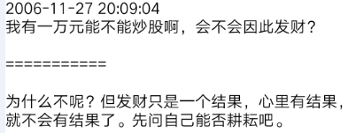

智慧难得，因为偷心不死。整天想着捷径，想着一夜暴富。

要在市场上成功，首先要把这偷心给废了，否则学什么都没用，一到场上就犯糊涂，然后就后悔、自责，然后又继续犯糊涂。

道理是死的，用的是人，人没道理，什么道理都没用。

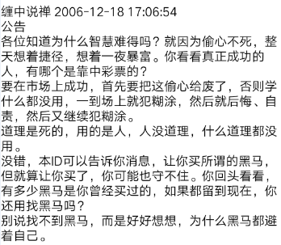

真明白论语的，自然就明白易经。

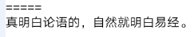

站在纯理论的角度，可以说是低级别走势的积累、叠加构成高级别的走势，但这里没有什么必然的规律，如果有，就可以用这些规律把市场的走势给构造出来了，这显然是不对的。正因为如此，就不能从低级别看起。分析图形，要从高看到低。低级别走势的意义，是在高级别意义的彰显后才能彰显。

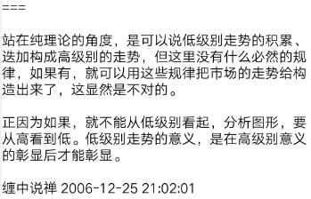

先别谈禅也别谈禅，把论语搞明白了，才有资格谈缠。否则都是盲人摸象。

由儒而缠，对于现代人来说，可能更稳妥一些。

---

为什么？是不是说先学好入世之道，学好如何做人，做圣人。才能去了解生死的出世之道？六祖可懂得儒学？

---

六祖是六祖，现代人还是先学儒学，但不能那些胡扯的儒学。

另外，别用生死的套子来套着自己。无人缚尔，解脱什么？无人将生死给你，出生死什么？求出生死者，正在生死中，不求出生死者，正在生死中。

禅，非求非不求，非了非不了，用做生意的模式来套是没用的。

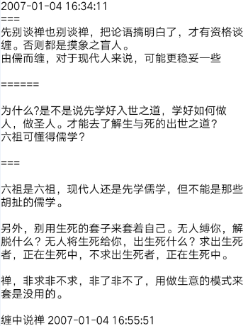

心态与智慧

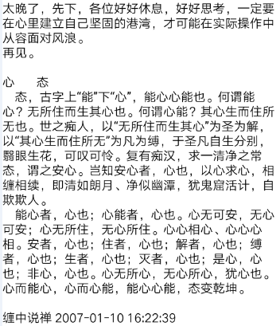

错，要自己立起来，谁都不值得依靠。患得患失，是因为本来就糊涂，本ID的理论，就是要消除这样或然的糊涂，让你对股市一目了然，知道股市在干什么，你自己该干什么。破患得患失，恐惧、贪婪，靠的是智慧。

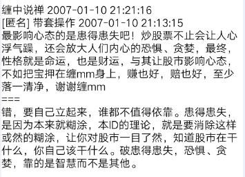

没有技术保证的心态是傻子心态，傻子心态最好，见什么都没反应。智慧指引下的洞察才是心态好的唯一保证，这点可以看看本ID解释的论语。

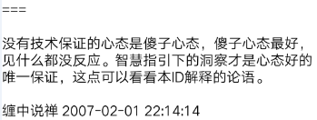

见欲为欲，欲也；见欲不为欲，欲也。烦恼菩提不二，谁欲谁不欲

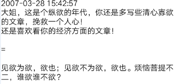

本ID只能教最基本的技术，心态没法教。要学，就要多学本ID说的论语等，然后反复在实际中修炼，那才有提高的可能。

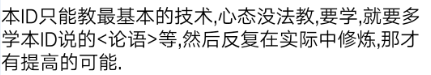

本ID告诉你的是最佳买点如何判断，并不是说除了这两个点就不能买，但要承受更大的风险。而要长期成功，就要尽量学会把风险控制到最低，还有，这只是一招。绝不能光靠这一招，但如果连一招都学不会，后面那些招怎么学？

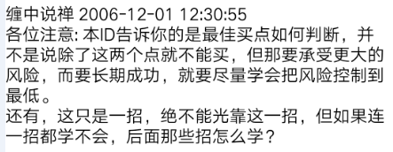

问：可有验方？

答：以此得失之心求之，永无出离之日。知且无知，行其无行，无知而妄知，无行而妄行，还求个验方、求个护身符干啥？可验方的，不离尔，离尔又求何验方？尔求尔之验方，骑驴找驴干啥？

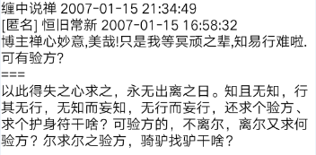

心即见、见即性，乾坤不过尔心之一尘，还内外个什么？

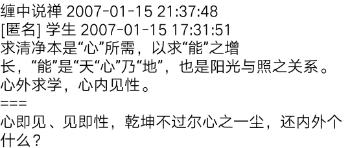

量子力学只知道不患，却不知道不患而患，更不知道患而不患。

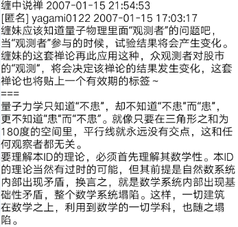

经是经 尔是尔！

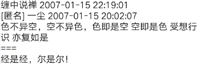

只知道空为空，不知空不空，又岂知空？自古以来，得一空字而休去者，如过江之鲫，可怜可叹。先把空字放下，将有担起来

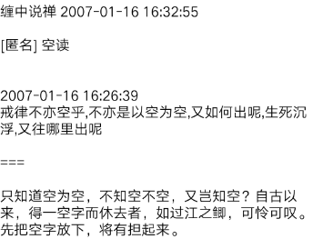

以无见之妄文而论禅宗，何有出期？天地，尔心一尘，万物

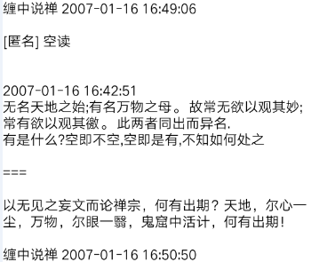

智慧  只从一见缠理论，不看股市糟粕书

正因为万法皆空，才有种种戒律；以空为空，生死沉浮，岂有出期！

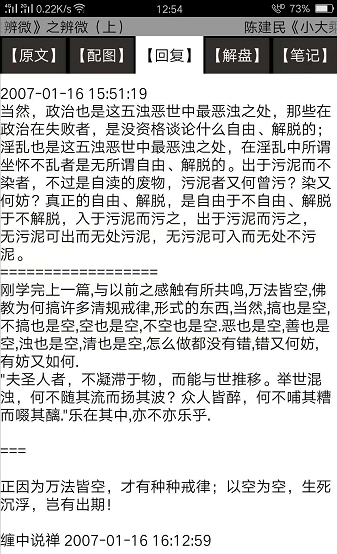

只知道空为空，不知空不空，又岂知空？自古以来，得一空字而休去者，如过江之鲫，可怜可叹。先把空字放下，将有担起来。

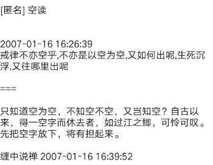

放下、拿起，都是自生分别，本ID这里无如许葛藤。偷心不死，永无出途。

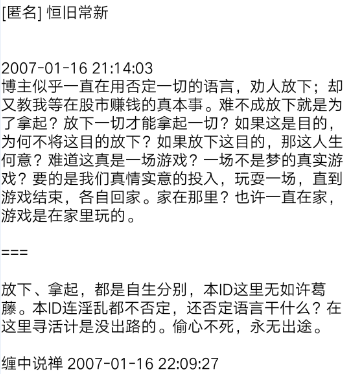

市场的任何事情都是锻炼人的机会，特别是那种痛苦的事情。例外，说过多次了，自己找吃的，本ID提供找吃的方法。

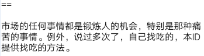

是你炒股票，不是股票炒你，先从自己下手。

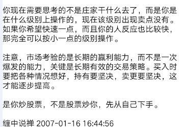

古人不存在断句的困难

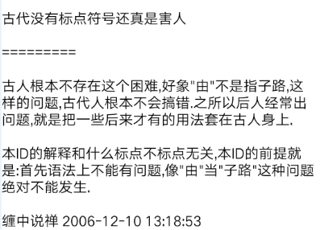

如果你只看到技术，那就先学技术吧。人只能先学他看到的东西。等你看到更多东西了，或者需要更多东西了，那就继续找非技术的。

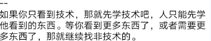

正态分布之类的，都是有其逻辑前提的，要用所谓的正态分布，首先要证明股市是符合这种逻辑前提的，可惜这种证明是不存在的。本ID的理论，是一种独立的公理化系统，和正太不正太无关。记住，数学不是一种先验的逻辑，任何现实的系统都有其现实的逻辑

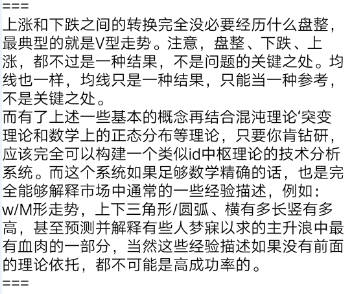

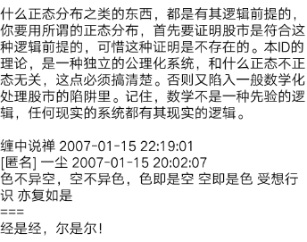

知道，明白，看得懂，和能操作好，这里的差距大了去了。

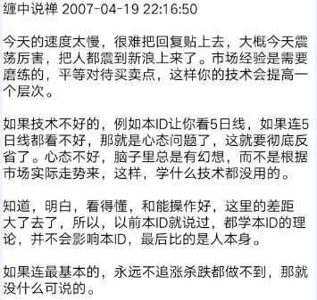

如果心情不好，特恐慌，人已经被恐惧所折磨，那就半仓，肯定不会错，这时候也别说什么技术了，心态先调节好再技术。

所以说人是第一位的，就算你明白了本ID的理论，能否应用成功，最终还是人的修炼。

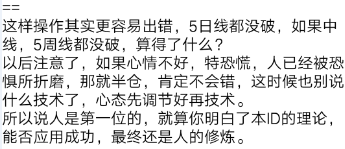

底背弛抓得准，但顶背驰往往错过，仿佛近视。

这不是技术问题，而是心态问题。从来，大多数人都容易买对，永远卖不对，结果就是坐电梯。说白了，就是贪婪所致。

宁愿卖早，不要卖晚，卖早，有钱，有新的机会可以把我。卖晚，不仅坐电梯，还把机会成本给搞起来了。

至于卖点的精度问题，那是一个磨练的过程。卖多了，精度自然高。

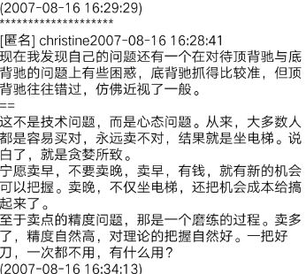

为什么缠论清楚，实际操作不行？

根本原因是理论学得不清楚。

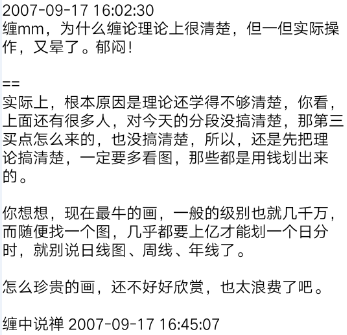

首先要确定你的明明是正确的，事实上，很多所谓明明的背驰，根本就不是。很多人连中枢、走势类型、级别都没搞清楚，就分析背驰，这有可能准确吗？

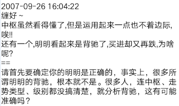

为什么要一致？低级别图用中枢、走势类型。高级别上用分型、线段，等于有两套有用的工具去分析，这是天大的好事。

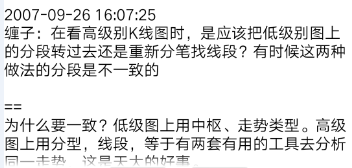

中枢魔力根源是所有人的贪嗔痴。

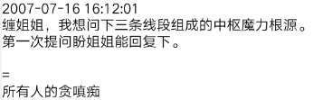

钢铁战士之论

没有人天生就是胜利者，也没有人天生就与失败为伍。人人是佛，无一人可度，无一人需救，人人有明珠一颗，照破山河大地，又何必憋屈了自己？

晚22点 中国经济和股市的未来依然美好

本ID一早说，不于股市自由，就谈不上自由，因为这是世界上的一大炼狱。别以为股市就是股市，这里，有着最多的贪嗔痴疑慢，确实是一个好的修炼场所。所以，所有在股市中被股市的，都是有福慧的。受其灾，消其灾，三生有幸。试想，如果中国股市也如台湾、日本式地醉生梦死一次，然后是十几、二十年的大熊市，最终害的是谁？

大凡物不得其平则鸣。草木之无声，风挠之鸣；水之无声，风荡之鸣。其跃野，或激之；其趋也，或梗之；其沸也，或灸之。金石之无声，或击之鸣；人之于言也亦然

弟子王虎 2007-12-15

如何见得第八识，望禅师开示

---

你又如何不见得第八识？

有点恶心的话就是，资本市场里最好的肥料，就是人。这话恶心，却是真相与事实。

大菩萨，显不同身，在鸡鸭鹅兔，一样有大菩萨在行菩萨行，谁告诉你夜总会里就没有大菩萨？以无聊的分别心去测度无边之佛法，这种人，就让他们去吧，本ID懒得管他们。

如果你只能去天堂而不能下地狱，那就不要谈什么佛法了，没有十地菩萨的修行，你还当不了大魔王，

连魔你都魔不了，还想成佛？磨墙去吧。

这不是人品问题，而是买卖点的问题。

有人能说出这话，也算本ID没浪费功夫了。在市场中，只能存天理，灭人欲。

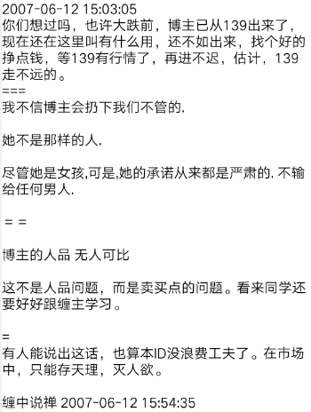

买卖点是合力的结果，买点出来，涨就是天经地义，就是如此简单。

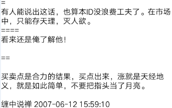

何谓真论语？横古横今而不移寸步，不移寸步而横古横今。无此，于论语又能何语何论哉？！

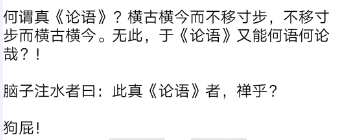

世界不过是你的注脚、文化不过是你的船筏

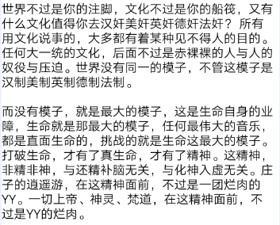

死空头开始转向，风险确实已经开始如一切风险般积聚。一叶知秋，秋天大概也不远了。

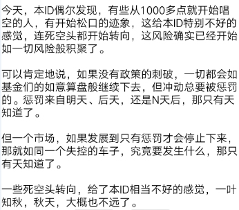

真正的金刚经 本ID天天都在讲

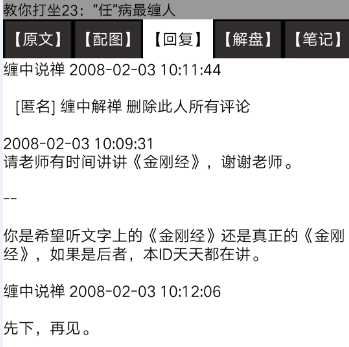

本ID的理论，不是任何原有数学理论的应用，而是市场本身现实逻辑的直接显现。这是一个极为关键的区别。

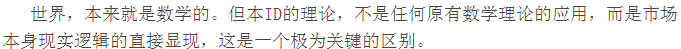

房价没有下跌空间。

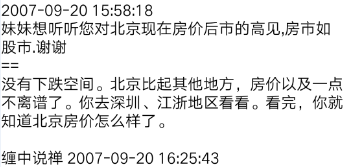

偏则病。

有其身，必有其患，不从身的根源下手，都是没用的。

修其身，必先明其心，心不明，修也妄。

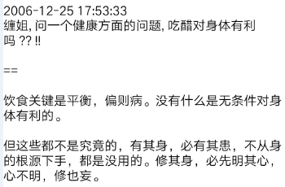

同一性

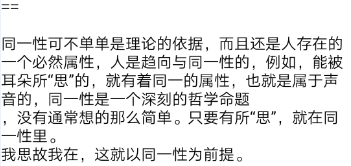

人，只有一种人，君子是从小人中来的，没有小人，哪来君子？

真正的君子，没有所谓的君子之相，君子“不相、不同”，如果自己还有一个君子之相，那是伪君子。友和不友，是不患而有其位次的。

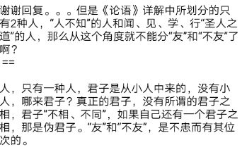

在六识之中谈论命运，都是以盲引盲。人力本来就是命运的一部分，哪里有离开命运的人力？

真想解开命运之迷，就要首先明其心，见其性，否则，在色受想行识中打转，都在命运之中。

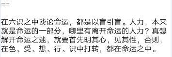

一般说少的，都用三之类，例如，楚虽三户。

古代对数字的用法很仔细，不是随便就用一个十，在古代，数字是有神圣性的。

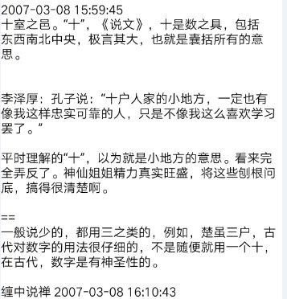

国外的所有技术理论本ID都研究过，和本ID的根本不是一个路子，这是一个公理化系统。

理论是最基础的，关键是实践中的当下，这是另一个层次的东西。

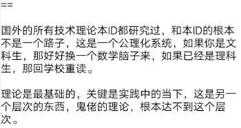

方法的问题无非几种：参与过小级别的操作、没有按买卖点操作，参照过于频繁、对图形判断不熟练、有盲点。

失误的原因永远与市场无关，找原因，只能找自己的原因。

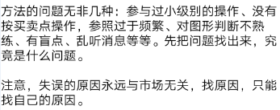

本ID论语有些开玩笑的段落，不适宜20岁以下人群。最好适当把无关紧要的地方删掉。

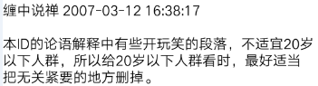

期货趋势的延伸性特别强，如果不熟练，用二买卖比较安全。

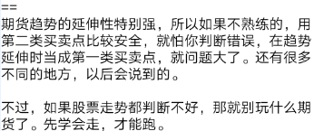

股指期货的推出，会加大走势的延伸性（想到了股灾，日线级别的延伸），必须注意

以后的指数，盘整的延伸将加强，但一旦突破形成趋势，趋势的延伸也会加强。

人人皆佛，不要憋屈自己。就算当本ID的徒弟，也是憋屈自己。天地都是你的，关键是先把自己的眼打开。千里同风，何必开门收什么徒。

不是太近，而是太远。何谓近？何谓远？

