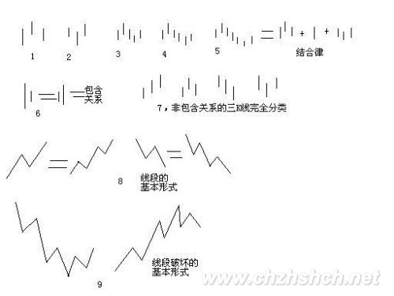

# 缠中说禅《教你炒股票》108课 全文总结

> 基于原书逐课阅读及 154 张配图整理。本文按主题分组总结每课核心内容，并标注关键图片引用。
> 交易系统的可操作框架见 `/knowledge/股票交易系统.md`，本文侧重**课程脉络、概念演进与图解说明**。

---

## 目录

- [第一编 心法与市场观（第1-10课）](#第一编-心法与市场观第1-10课)
- [第二编 均线系统与初步买卖点（第11-16课）](#第二编-均线系统与初步买卖点第11-16课)
- [第三编 中枢、走势类型与三类买卖点（第17-23课）](#第三编-中枢走势类型与三类买卖点第17-23课)
- [第四编 背驰与 MACD 辅助（第24-27课）](#第四编-背驰与-macd-辅助第24-27课)
- [第五编 资金管理与操作系统（第28-52课）](#第五编-资金管理与操作系统第28-52课)
- [第六编 图解分析实战（第53-61课）](#第六编-图解分析实战第53-61课)
- [第七编 分型、笔、线段的严格定义（第62-67课）](#第七编-分型笔线段的严格定义第62-67课)
- [第八编 线段划分深化与走势预测（第68-78课）](#第八编-线段划分深化与走势预测第68-78课)
- [第九编 分型心理、中阴与表里关系（第79-93课）](#第九编-分型心理中阴与表里关系第79-93课)
- [第十编 心理纪律、机械操作与高级课题（第94-108课）](#第十编-心理纪律机械操作与高级课题第94-108课)
- [附录 A：图片索引](#附录-a图片索引)
- [附录 B：核心定理汇总](#附录-b核心定理汇总)
- [附录 C：108课速览表](#附录-c108课速览表)

---

## 第一编 心法与市场观（第1-10课）

这一编建立了参与市场的**心理基础与哲学框架**，尚未涉及具体技术分析体系。

### 第1课 [L190]：不会赢钱的经济人，只是废人
- 资本市场以**赢亏为唯一标准**，进入市场前须有可验证的赢利能力

### 第2课 [L220]：没有庄家，有的只是赢家和输家
- 打破「庄家—散户」二元神话，市场是**多类参与者的博弈**
- 按自身资金与能力选择「猎物」级别

### 第3课 [L238]：你的喜好，你的死亡陷阱
- **喜好（情绪、执念）是操作最大陷阱**
- 买入理由应归结为赢钱逻辑，学会利用多头/空头陷阱

### 第4课 [L255]：什么是理性
- 理性 = 当下实践，须时刻清楚当前介入模式
- 📷 `p009_1.jpg` — 「当下介入/实践理性」语境配图

### 第5课 [L283]：市场无须分析，只要看和干
- 猎手式**观察 + 行动**，信走势结构而非叙事

### 第6课 [L300]：本ID如何在五粮液、包钢权证上提款
- 权证操作中的**安全边际**思维
- 📷 `p010_1.png` ~ `p012_2.png` — 权证条款与正股走势说明图

### 第7课 [L373]：给赚了指数亏了钱的一些忠告
- 牛市节奏：先一线蓝筹再扩散；**年线**（250日均线）的基础用法
- 选股：放量突破上市首日高点的新股、放量突破年线后缩量回踩年线
- 📷 `p013_1.png` / `p014_1.png` — 走势与均线解盘图

### 第8课 [L458]：投资如选面首
- **只搞能搞的**：250日/周线压力突破、新股上市首日最高价等
- 自定「能搞」标准，不满足一律不参与

### 第9课 [L508]：甄别「早泄」男的数学原则
- **三个相互独立程序**联合降低失败率：技术指标、板块资金、基本面
- 独立系统失败率相乘（30%×40%×30% ≈ 3.6%）
- 📷 `p017_1.jpg` — 配图

### 第10课 [L587]：2005年6月
- **4N9** 比喻：每段关系（持仓）有有限期 N，结束则切换
- 📷 `p019_1.png` ~ `p021_1.png` — 大盘与均线解盘图

---

## 第二编 均线系统与初步买卖点（第11-16课）

这一编用**均线语言**首次定义了买卖点，为后续中枢理论做铺垫。

### 第11课 [L693]：不会吻，无以高潮
- **缠中说禅均线体系**：飞吻、唇吻、湿吻
- **女上位**（短均在上）/ **男上位**（短均在下）
- 湿吻多与**转折**相关

### 第12课 [L741]：一吻何能消魂
- **第一类买点（均线版）**：男上位最后一次缠绕 + 背驰空头陷阱后的低点
- **第二类买点（均线版）**：女上位第一次缠绕后的低点
- 📷 `p024_1.png` / `p024_2.png` — 茅台 5/10 日均线案例图

### 第13课 [L816]：不带套的操作不是好操作
- **主动带套** = 分批建仓 + 有退出机制 ≠ 被动深套
- 程序失效须退出，二买跌破前低须反弹清仓

### 第14课 [L857]：喝茅台的高潮程序
- **缠中说禅买点定律**：大级别二买 = 次级别走势的一买
- **缠中说禅短差程序**：大级别买点进，次级别一卖减、一买回补
- 📷 `p026_1.png` — 飞吻示意；`p027_1.png` / `p028_1.png` — 茅台周线/日线分析

### 第15课 [L931]：没有趋势，没有背驰
- **缠中说禅趋势力度** = 两吻间短长期均线围成面积
- 背驰 = 同向两趋势段力度减弱；无趋势则无标准背驰
- 📷 `p031_1.png` ~ `p033_2.png` — 权证与 MACD 示例

### 第16课 [L1078]：中小资金的高效买卖法
- 六种组合中只参与 **「下跌+上涨」**
- 最佳介入：「下跌+盘整+下跌」第二段下跌的一买
- 盘整即退出，用次级别一卖保证不亏
- 📷 `p035_1.png` / `p035_2.png` — 驰宏锌锗案例

---

## 第三编 中枢、走势类型与三类买卖点（第17-23课）

**缠论体系核心**。从第17课起，脱离均线语言，建立基于中枢的完整分析框架。

### 第17课 [L1156]：走势终完美 ⭐
- **缠中说禅走势中枢**：至少三段次级别走势的重叠区间
- **盘整**：含一个中枢的完成走势；**趋势**：含至少两个不重叠中枢
- **走势分解定理一**：任何走势 = 盘整/趋势的连接
- **走势分解定理二**：任何走势类型至少三段次级别走势构成
- **缠中说禅买卖点定律一**：一买 = 下跌完成转折位
- **缠中说禅趋势转折定律**：上涨转折源于某级别一卖，下跌转折源于某级别一买
- 📷 `p038_1.png` — 级别差异说明图

### 第18课 [L1265]：不被面首的雏男是不完美的
- **走势类型的延伸**（不断新生同向中枢或不新生中枢则延伸）
- **中枢定理一**：趋势中连接两中枢的走势为次级别以下
- **中枢定理二**：盘整中离开/返回中枢的走势为次级别以下
- **中枢定理三（破坏）**：次级别离开后次级别回抽不回到中枢内

### 第19课 [L1350]：学习缠中说禅技术分析理论的关键
- 本理论为**公理化/分类体系**，与波浪江恩等「先验模式」本质不同
- 分析的意义在**当下正在发生什么**

### 第20课 [L1399]：走势中枢级别扩张及第三类买卖点 ⭐
- 中枢**延伸** vs **扩张**（波动触及前中枢区间 → 级别扩展）
- **ZG/ZD/GG/DD** 记号体系
- **第三类买点**：次级别上离开中枢后，次级别回试低点不破 ZG
- **第三类卖点**：次级别下离开中枢后，次级别回抽高点不破 ZD
- 📷 `p043_1.png` — 工商银行日线第三类买点示意（含 MACD）
- 📷 `p044_1.png` — 三类买卖点策略说明

### 第21课 [L1470]：缠中说禅买卖点分析的完备性
- **完备性定理**：三类买卖点覆盖所有可操作位置
- **升跌完备性定理**：走势端点为三类买卖点之一
- 二类与三类可重合（一买后凌厉上破最后中枢、回抽不进）
- 📷 `p046_1.png` — 指数缺口与第三类买点讨论

### 第22课 [L1566]：将8亿的大米装到5个庄家的肚里
- 大资金建仓逻辑：低位**第三类买点**阻击较安全
- 最底部中枢产生的三买效率最高
- 📷 `p047_1.png` / `p047_2.png` / `p049_1.png` — 案例走势

### 第23课 [L1682]：市场与人生
- 心性修养与操作统一；牛市常需两个周线中枢后才谈「最后疯狂」

---

## 第四编 背驰与 MACD 辅助（第24-27课）

建立完整的**背驰判断体系**，MACD 作为核心辅助工具。

### 第24课 [L1752]：MACD 对背弛的辅助判断 ⭐
- 标准趋势 a+A+b+B+c：B 中枢把黄白线拉回 0 轴，c 段 MACD 柱面积 < a 段即背驰
- **盘整背驰**：围绕同一中枢的前后离开段力度对比
- **背驰-买卖点定理**：任一背驰必制造某级别买卖点；任一级别买卖点必源自某级别背驰
- 📷 `p053_1.png` / `p053_2.png` — 五分级背驰与盘整背驰
- 📷 `p054_1.png` / `p054_2.png` — 万科15分钟盘整背驰与三买

### 第25课 [L1861]：吻，MACD、背弛、中枢
- **标准两中枢上涨** MACD 形态：0轴下穿上 → 回抽0轴 → 再上冲背驰
- 区分趋势背驰/盘整背驰/三买情形
- 柱子伸长变缓时可按已出面积×2预估
- 📷 `p056_1.png` ~ `p060_1.png` — 均线/MACD 与走势配合说明

### 第26课 [L2036]：市场风险如何回避
- 理论前提：品种可连续交易且成交有效
- **唯一实质风险** = 投入的钱换不回更多钱
- 目标：持仓成本在足够长时间做到**非正**

### 第27课 [L2128]：盘整背驰与历史性底部 ⭐
- 趋势背驰至少出现在**第二个中枢之后**，第一个中枢附近背驰多为盘整背驰
- **区间套定位定理**：大级别转折可通过各级别背驰段逐级收缩界定
- 大级别（周线以上）盘整背驰 → 可对应历史大底
- **类一买、类二买**（大级别不新低而 MACD 如背驰表现）
- 📷 `p067_1.png` — 万科 A 季线多周期精确定位示意
- 📷 `p068_1.png` ~ `p071_3.png` — 走势与 MACD 示例

---

## 第五编 资金管理与操作系统（第28-52课）

从第28课到第50课，系统地展开了**操作方法论**：资金管理、走势的当下与多义性、同级别分解、利润最大模式等。

### 第28课 [L2277]：下一目标：摧毁基金
- **投资第一要点**：自有长期资金、不借贷

### 第29课 [L2340]：转折的力度与级别
- **背驰-转折定理**：趋势背驰后三种可能 → ①最后中枢级别扩展 ②更大级别盘整 ③更高级别反趋势
- 📷 `p075_1.png` ~ `p078_1.png` — 分解与走势示意

### 第30课 [L2461]：缠中说禅理论的绝对性
- 公理化前提：价格充分有效市场、非完全绝对趋同交易
- 当下性：不预测，只分类应对
- 📷 `p081_1.png` ~ `p082_3.png` — 盘中回复配图

### 第31课 [L2607]：资金管理的最稳固基础
- **成本归0路径**：准备充分一次性买足 → 约一倍升幅大级别卖出部分使成本为0 → 0成本股票滚动增股

### 第32课 [L2673]：走势的当下与投资者的思维方式
- a+A+b+B+c 中 B 是否出现由当下背驰与否决定，不预测
- 中枢里做差价用次级别背驰
- 📷 `p087_1.png` / `p087_2.jpg` — 大盘分解示例

### 第33课 [L2787]：走势的多义性
- 多义性源于中枢与级别的不同解读
- 操作原则：底背驰介入、顶背驰离场、三买必回补、三卖必走
- 📷 `p090_1.png` / `p090_2.png` — 指数分解示例

### 第34课 [L2891]：宁当面首，莫成怨男
- 与操作级别走势方向相反 → **最快退出**

### 第35课 [L2939]：给基础差的同学补补课
- **买卖点级别定理**：大级别买卖点必为次级别以下某级买卖点
- 走势分解定理一、二重申

### 第36课 [L3024]：走势类型连接结合性的简单运用
- **结合律** A+B+C = (A+B)+C，可重组走势段以看清结构
- 📷 `p095_1.jpg` — 中枢重组与第三类买点示例

### 第37课 [L3106]：背驰的再分辨
- a+A+b+B+c 中 A、B 须同级别才是趋势背驰
- c 须新高/新低，否则按盘整背驰处理

### 第38课 [L3138]：走势类型连接的同级别分解
- **同级别分解唯一性**；30分钟同级别分解示例
- 📷 `p099_1.png` — 同级别分解操作示意

### 第39课 [L3203]：同级别分解再研究
- Ai 与 Ai+2 盘整背驰定买卖
- 📷 `p101_1.jpg` — 附录大盘配图

### 第40课 [L3259]：同级别分解的多重赋格
- 小级别走势升级为大级别 = **自动换档**
- 📷 `p102_1.jpg` / `p103_1.jpg` — 多重级别示意

### 第41课 [L3294]：没有节奏，只有死
- 节奏 = 买点买、卖点卖；**连错三次停手**
- 初学者 ≥ 30分钟级别

### 第42课 [L3374]：有些人是不适合参与市场的
- 十种不宜类型：耳朵指挥大脑、死不认错、赌徒、偏执等

### 第43课 [L3442]：有关背驰的补习课
- **走势类型分解原则**：某级别走势内不能出现比该级别更大的中枢

### 第44课 [L3501]：小级别背驰引发大级别转折
- **小背驰-大转折定理**（必要条件）：小级别顶背驰引发大级别向下 ⟺ 最后次级别中枢出现三卖
- 📷 `p109_1.jpg` — 走势与卖点示意

### 第45课 [L3553]：持股与持币
- 买卖瞬间完成，**等待**才是操作主体

### 第46课 [L3594]：每日走势的分类
- 一天8根30分钟K线：**一个中枢（平衡市）**、**两个中枢**、**无中枢（最强单边）**
- 📷 `p112_1.jpg` — 无中枢单边示例

### 第47课 [L3643]：一夜情行情分析
- 综合运用三卖、区间套、当日分类进行实战分析
- 📷 `p114_1.jpg` / `p114_2.png` — 深成指与 MACD 力度对比

### 第48课 [L3784]：暴跌，牛市行情的一夜情
- 牛市暴跌 = 降成本增筹码的机会
- 📷 `p116_1.png` ~ `p117_2.png` — 买点与波动关系

### 第49课 [L3833]：利润率最大的操作模式 ⭐
- **第一利润最大定理**（固定品种）：参与上涨+盘整，震荡降成本，三买后持股至新中枢再震荡，背驰清仓
- **第二利润最大定理**（换股模式）：仅三买介入，新中枢即换股 → 单位时间利润率最高
- 📷 `p119_1.jpg` / `p121_1.jpg` — 中枢位置与操作

### 第50课 [L3951]：操作中的一些细节问题
- MACD 须先根据中枢与走势选定比较的两段，再选周期
- 学习路径：静态复盘 → 模拟盘 → 实盘

### 第51课 [L4005]：心态与认知——警惕荐股传销
- 远离股票推荐与传销，独立分析、独立决策

### 第52课 [L4074]：操作级别与形态的不患
- 操作级别 = 不患，形态 = 不患；确定级别后机械执行

---

## 第六编 图解分析实战（第53-61课）

这一编以**大量实战走势图**手把手展示缠论分析过程。

### 第53课 [L4118]：三类买卖点的再分辨
- 中枢递归与级别（显微镜比喻）
- 三买定义：次级别上离开中枢后次级别回试不破 ZG
- 📷 `p129_1.png` — 航天机电1分钟三类买点标注

### 第54课 [L4243]：一个具体走势的分析
- 走势分解多样性与结合律的实战应用

### 第55课 [L4336]：买之前戏，卖之高潮
- 大级别建仓 = 复杂震荡降本「前戏」，拉升 = 「高潮」

### 第56课 [L4384]：530印花税当日行情图解
- 突发利空下操作：第二、三类卖点优先于一卖
- 📷 `p134_1.jpg` — 530当日1分钟走势与二、三卖逻辑

### 第57课 [L4460]：当下图解分析再示范
- 最小分析级别 → 线段 → 次级别走势 → 中枢
- 📷 `p136_1.jpg` — 1分钟线段标记与分解

### 第58课 [L4591]：图解分析示范三
- 线段须上-下-上或下-上-下，相邻同向段不重合
- 📷 `p140_1.jpg` ~ `p143_2.png` — 走势分解系列图

### 第59课 [L4689]：图解分析示范四
- 线段与否**与涨跌点数无关**，看形态
- 📷 `p144_1.png` ~ `p150_2.png` — 线段与幅度、连续分解图

### 第60课 [L4823]：图解分析示范五
- 区间套定位期间遇突发最不利，用第二类卖点应对
- 📷 `p151_1.jpg` — 示范走势

### 第61课 [L4933]：区间套定位标准图解 ⭐
- **区间套**方法论：先假定进入背驰段，逐级找内部背驰
- 多重背驰嵌套精确定位转折点
- 📷 `p154_1.jpg` / `p156_1.jpg` — 区间套与走势分解

---

## 第七编 分型、笔、线段的严格定义（第62-67课）

**缠论几何学基石**。从第62课起给出分型→笔→线段的严格数学定义。

### 第62课 [L5185]：分型、笔与线段 ⭐

这是缠论几何化的核心课程。

- **顶分型**：三根 K 线中间最高、最低也最高
- **底分型**：三根 K 线中间最低、最高也最低
- **包含关系处理**：向上取高高低高，向下取低低高低
- **笔**：相邻顶底分型的连接，之间至少一根独立 K 线
- **线段**：至少三笔，前三笔必有价格重叠

📷 `p162_1.jpg` — **分型与笔的完全分类图**（本书最重要图解之一）：

图中展示了：
1. K 线的五种分型组合（1-5号）
2. 包含关系处理（6号）
3. 非包含关系三根 K 线的完全分类（7号）
4. 线段的基本形式（8号）
5. 线段破坏的基本形式（9号）

📷 `p163_1.jpg` / `p163_2.png` — 线段与破坏示意

### 第63课 [L5237]：替各位理理基本概念
- **图周期 ≠ 走势级别**，图只是显微镜
- 1分钟图可递归到年月级别
- 📷 `p166_1.jpg` — 配图

### 第64课 [L5317]：去机场路上给各位补课
- **缺口**处理：顺原笔的缺口归原笔；逆走势的缺口可单独成段
- **线段必须由线段破坏结束**，单笔不算
- 📷 `p167_1.png` — 分段与背驰说明

### 第65课 [L5374]：再说说分型、笔、线段 ⭐
- 包含关系的**顺序结合、不传递**
- **缠中说禅线段分解定理**：线段被破坏 ⟺ 被另一线段破坏
- 📷 `p170_1.jpg` ~ `p170_3.jpg` — 分型笔线段与复杂图分解

### 第66课 [L5456]：主力资金的食物链
- 散户只需按级别买卖点应对，不必知晓筹码运作

### 第67课 [L5499]：线段的划分标准 ⭐
- **特征序列**与**标准特征序列**
- 线段结束的**两种情形**：①特征序列分型无缺口 ②有缺口需后续确认
- 📷 `p173_1.jpg` / `p173_2.jpg` — 线段划分示意
- 📷 `p174_1.jpg` ~ `p174_3.jpg` — 辅助理解线段划分

---

## 第八编 线段划分深化与走势预测（第68-78课）

### 第68课 [L5558]：走势预测的精确意义
- **完全分类 + 边界条件** = 分段函数思维
- **不测而测**：不预测走哪段，只对每段有预案

### 第69课 [L5642]：月线分段与上海大走势分析
- 月线笔、段用类背驰判大顶大底
- **走势必完美**：未完成走势边界可缩至极小
- 📷 `p177_1.png` / `p178_1.jpg` — 月线分型与走势示意

### 第70课 [L5690]：教科书式走势的示范分析
- 结合律与分解不变性：不同分解结论可互验
- 📷 `p180_1.png` / `p180_2.png` — 1分/5分背驰标注

### 第71课 [L5750]：线段划分标准的再分辨
- 特征序列元素包含须属同一特征序列
- 📷 `p183_1.png` ~ `p184_3.jpg` — 线段划分疑难图

### 第72课 [L5829]：本ID已有课程的再梳理
- **形态学**（几何）与**动力学**（背驰、能量）的统一
- **懒人线路图**：分型 → 笔 → 线段 → 最小中枢 → 各级中枢与走势类型

### 第73课 [L5934]：市场获利机会的绝对分类
- 获利仅两类：**中枢上移**与**中枢震荡**
- 上移过程一般不短差；震荡段向上离开卖、向下背驰买

### 第74课 [L6005]：如何躲避政策性风险
- 政策为**分力**，不能单独改变长期走势方向
- 低估注意利多、泡沫注意调控

### 第75-76课 [L6072/L6140]：逗庄家玩的杂史
- 玩庄两种手法：时间折腾 vs 空间养骄一击（故事性为主）

### 第77课 [L6193]：一些概念的再分辨
- **缺口三分类**：强/平/弱及衰竭性缺口
- **笔划分三步骤**确保唯一性

### 第78课 [L6307]：继续说线段的划分
- **线段标准化**：高低点在端点
- 第二种情形中 C 未出现第二特征序列分型就创新高/低 → 三段合一
- 📷 `p197_1.jpg` ~ `p205_1.jpg` — 线段划分与标准化示例

---

## 第九编 分型心理、中阴与表里关系（第79-93课）

### 第79课 [L6390]：分型的辅助操作
- 分型 + 5日均线辅助判中继/成笔
- **第三类买点买卖法**：只做三买，次级别不新高或盘背卖

### 第80课 [L6544]：市场没有同情、不信眼泪
- **顶分型出现 → 离开是唯一选择**
- 宁卖错不买错

### 第81课 [L6629]：图例、更正及分型、走势类型的哲学本质
- 分型/走势类型的**自相似**与**自同构性结构**
- 定理：有多少不同构自相似结构就有多少种正确分析道路

### 第82课 [L6730]：分型结构的心理因素
- 顶分型三 K 线 = 三次多空较量；第三根弱 = 强顶分型
- 📷 `p213_1.jpg` — 上海日线弱分型示例

### 第83课 [L6796]：笔—线段与线段—最小中枢结构的不同心理意义
- 最小中枢用线段不用笔的原因：稳定性与心理确认
- **中枢复杂度**越高，后市越可能反复

### 第84课 [L6840]：本ID理论一些必须注意的问题
- **自同构性结构**与走势不可复制
- 三大支点：不可重复性、自同构可复制、纯逻辑推导

### 第85、87课 [L6948/L7089]：逗庄家玩的杂史续
- 故事性内容，核心仍回归买卖点不患性

### 第86课 [L7002]：走势分析中必须杜绝一根筋思维
- 第三类买卖点的意义随**大级别情境**而变
- 无固定止蚀概念，用三类卖点替代

### 第88课 [L7138]：图形生长的一个具体案例
- **中阴阶段**：前走势背驰「死亡」后到新走势确立前的模糊段
- 📷 `p224_1.png` — 中阴与中枢震荡案例图

### 第89课 [L7214]：中阴阶段的具体分析
- 1分钟背驰后必先有 5 分钟中枢（100%），再谈后续

### 第90课 [L7280]：中阴阶段结束时间的辅助判断
- **布林通道（BOLL）** 辅助：收口预示中阴结束或扩展
- 📷 `p229_1.png` — BOLL 与通道示例

### 第91课 [L7317]：走势结构的两重表里关系1 ⭐
- **缠中说禅笔定理**：当下任一周期K线走势必落在向上/向下笔中
- **（方向, 状态）四态**：(1,0)分型构造中 / (1,1)笔确认延伸 / (-1,0) / (-1,1)
- **8级病情矩阵**（1/5/30/日/周/月/季/年），类比中医表里未病欲病已病
- 📷 `p232_1.jpg` ~ `p232_3.jpg` — 表里与状态示意

### 第92课 [L7412]：中枢震荡的监视器 ⭐
- 中轴 **Z** 与次级半区 **Zn**
- Zn 必最终超越 A 或 B（第三类买卖点必然性）
- 📷 `p234_1.jpg` — Z、Zn 监视示意（多级别走势类型分解示例）

### 第93课 [L7446]：走势结构的两重表里关系2
- (1,0)/(−1,0) 后的分叉操作：保守/进取两种策略
- 📷 `p235_1.jpg` — 表里关系操作示意

---

## 第十编 心理纪律、机械操作与高级课题（第94-108课）

### 第94课 [L7481]：当机立断
- 机会 = 理论输出的必然分类；每当下列出后续机会，设退出边界
- 初学者可用 **5周/5日 + 分型有效跌破** 作机械纪律
- 📷 `p236_1.png` — 大盘线段类背驰分析

### 第95课 [L7540]：修炼自己
- 0投入心态：第一笔钱赢利后抽本

### 第96课 [L7581]：无处不在的赌徒心理
- 虚拟目标、怕踏空、砍追循环、消息捷径 → 严格程序破除

### 第97-98课 [L7623/L7681]：中医、兵法、诗歌、操作
- 理论输出 = 望闻问切；操作 = 开方 = 用兵
- 先严守格律再求拗变
- 📷 `p242_1.png` — 背驰后分类与线段示例

### 第99课 [L7740]：走势结构的两重表里关系3
- **小级别走势完成必面临更大级别中枢震荡**（级别扩张必然性）
- 回到更前中枢 = 「危险」信号

### 第100课 [L7779]：中医、兵法、诗歌、操作3
- 多层次完全分类立体系统：30/5/1分钟联立状态推演

### 第101课 [L7822]：答疑1
- 第二类买卖点三种强弱
- **走势必完美** = 分型笔线段走势类型的递归**唯一分解**
- 📷 `p247_1.jpg` — 走势必完美与中枢买卖点示意

### 第102课 [L7875]：再说走势必完美
- 走势必完美类似自然数记数法式唯一分解
- 一般 1/5/30 三级足够

### 第103课 [L7918]：学屠龙术前先学好防狼术 ⭐
- **防狼术**：MACD 黄白线在 0 轴下 = 空头主导 → 远离
- 自定最低周期（如30/60分钟），一旦黄白线入 0 轴下离场

### 第104课 [L7941]：几何结构与能量动力结构1
- 背驰等为几何化能量结构；与牛顿机械思维的区别

### 第105课 [L7959]：远离聪明、机械操作
- **目无全牛**、**机械化**合关节节奏
- 📷 `p251_1.jpg` — 分型与机械化操作示意

### 第106课 [L7984]：均线、轮动与缠中说禅板块强弱指标
- **8条均线系统**（5, 13, 21, 34, 55, 89, 144, 233）
- 股票按「未攻克的最小周期均线」分9类
- **板块强弱指标** = 类平均

### 第107课 [L8032]：如何操作短线反弹
- 30分钟反弹必有30分钟中枢 ⇒ 至少三段5分钟上下上
- 出现三买且非背驰强劲拉升可持有

### 第108课 [L8073]：何谓底部 ⭐
- **底部级别化定义**：一类买点到该中枢**首次第三类买卖点**前的区间
- 三卖先出现 → 底部构造失败；三买先出现 → 底部完成
- 📷 `p254_1.png` / `p255_1.png` / `p255_2.png` — 月线/周线分型与区间示意

---

## 附录 A：图片索引

### 关键概念图

| 图片 | 课次 | 说明 |
|------|------|------|
| `p043_1.png` | 20 | 工商银行日线第三类买点 + MACD |
| `p053_1.png` | 24 | 五分钟级背驰示例 |
| `p054_1.png` | 24 | 万科15分钟盘整背驰与三买 |
| `p067_1.png` | 27 | 万科 A 季线：多周期精确定位示意 |
| `p129_1.png` | 53 | 航天机电1分钟三类买点标注 |
| `p134_1.jpg` | 56 | 530当日走势二、三卖逻辑 |
| `p154_1.jpg` | 61 | 区间套与走势分解 |
| `p162_1.jpg` | 62 | **分型、笔、线段完全分类**（核心概念图） |
| `p170_1.jpg` | 65 | 复杂分型笔线段分解 |
| `p173_1.jpg` | 67 | 线段划分标准 |
| `p213_1.jpg` | 82 | 分型心理因素示例 |
| `p224_1.png` | 88 | 中阴与中枢震荡 |
| `p229_1.png` | 90 | BOLL 辅助判断中阴结束 |
| `p232_1.jpg` | 91 | 走势表里关系状态示意 |
| `p234_1.jpg` | 92 | Z/Zn 中枢震荡监视器 |
| `p254_1.png` | 108 | 月线底部定义与区间 |

### 实战案例图

| 图片 | 课次 | 说明 |
|------|------|------|
| `p024_1.png` | 12 | 茅台5/10日均线一买二买 |
| `p035_1.png` | 16 | 驰宏锌锗「下跌+盘整+下跌」 |
| `p038_1.png` | 17 | 走势级别差异 |
| `p075_1.png` | 29 | 转折力度与级别 |
| `p099_1.png` | 38 | 同级别分解操作示意 |
| `p136_1.jpg` | 57 | 1分钟线段标记 |
| `p180_1.png` | 70 | 教科书式走势分析 |
| `p197_1.jpg` | 78 | 线段标准化 |
| `p247_1.jpg` | 101 | 走势必完美买卖点 |
| `p251_1.jpg` | 105 | 机械化操作 |

---

## 附录 B：核心定理汇总

### 走势结构定理

| 定理 | 课次 | 内容 |
|------|------|------|
| 走势终完美 | 17 | 任何级别走势类型终将完成 |
| 分解定理一 | 17 | 任何走势 = 盘整/趋势的连接 |
| 分解定理二 | 17 | 任何走势类型至少三段次级别走势 |
| 中枢定理一 | 18 | 趋势中连接中枢的走势为次级别以下 |
| 中枢定理二 | 18 | 盘整中离开/返回中枢的走势为次级别以下 |
| 中枢定理三 | 18 | 次级别离开后回抽不进中枢 = 中枢破坏 |
| 线段分解定理 | 65 | 线段被破坏 ⟺ 被另一线段破坏 |
| 笔定理 | 91 | 当下走势必落在向上/向下笔中 |

### 买卖点定理

| 定理 | 课次 | 内容 |
|------|------|------|
| 买点定律 | 14 | 大级别二买 = 次级别一买 |
| 趋势转折定律 | 17 | 上涨转折源于某级别一卖 |
| 完备性定理 | 21 | 三类买卖点覆盖所有可操作位置 |
| 买卖点级别定理 | 35 | 大级别买卖点必为次级别某级买卖点 |
| 第三类买卖点定理 | 20/53 | 次级别离开后回试不破 ZG/ZD |

### 背驰定理

| 定理 | 课次 | 内容 |
|------|------|------|
| 背驰-买卖点定理 | 24 | 背驰必制造某级别买卖点，反之亦然 |
| 背驰-转折定理 | 29 | 趋势背驰后三种可能 |
| 小背驰-大转折定理 | 44 | 小级别顶背驰引发大级别向下 ⟺ 最后次级别中枢出现三卖 |
| 区间套定位定理 | 27 | 大级别转折通过各级别背驰段逐级收缩界定 |

### 操作定理

| 定理 | 课次 | 内容 |
|------|------|------|
| 第一利润最大定理 | 49 | 固定品种固定级别下震荡+上移模式利润率最大 |
| 第二利润最大定理 | 49 | 多品种三买介入新中枢换股，单位时间利润率最大 |
| 走势类型分解原则 | 43 | 某级别走势内不能出现更大级别中枢 |

---

## 附录 C：108课速览表

| 课次 | 标题 | 核心主题 | 重要度 |
|------|------|----------|--------|
| 1 | 不会赢钱的经济人 | 市场心态 | ● |
| 2 | 没有庄家 | 博弈观 | ● |
| 3 | 你的喜好 | 情绪陷阱 | ● |
| 4 | 什么是理性 | 当下性 | ● |
| 5 | 市场无须分析 | 行动力 | ● |
| 6 | 权证提款 | 安全边际 | ○ |
| 7 | 赚指数亏钱 | 均线入门 | ●● |
| 8 | 投资如选面首 | 选股标准 | ● |
| 9 | 甄别早泄 | 三独立系统 | ●● |
| 10 | 2005年6月 | 周期切换 | ● |
| 11 | 不会吻 | 均线缠绕 | ●● |
| 12 | 一吻消魂 | 一买二买（均线版） | ●●● |
| 13 | 不带套 | 主动防护 | ●● |
| 14 | 喝茅台 | 买点定律+短差 | ●●● |
| 15 | 没有趋势没有背驰 | 趋势力度 | ●●● |
| 16 | 中小资金高效法 | 参与模式 | ●●● |
| **17** | **走势终完美** | **中枢+走势类型+分解定理** | **★★★** |
| **18** | **不被面首** | **中枢三大定理** | **★★★** |
| 19 | 学习关键 | 公理化体系 | ●● |
| **20** | **级别扩张+三买** | **第三类买卖点** | **★★★** |
| **21** | **完备性** | **三类买卖点完备** | **★★★** |
| 22 | 8亿大米 | 大资金三买 | ●● |
| 23 | 市场与人生 | 心性 | ● |
| **24** | **MACD背弛** | **MACD辅助+背驰定理** | **★★★** |
| **25** | **吻MACD中枢** | **两中枢MACD形态** | **★★★** |
| 26 | 风险回避 | 风险定义 | ●● |
| **27** | **盘整背驰+大底** | **区间套+盘整背驰** | **★★★** |
| 28 | 摧毁基金 | 资金属性 | ● |
| **29** | **转折力度级别** | **背驰-转折定理** | **★★★** |
| 30 | 理论绝对性 | 公理前提 | ●● |
| **31** | **资金管理基础** | **成本归0路径** | **★★★** |
| 32 | 走势的当下 | 当下性操作 | ●● |
| 33 | 走势多义性 | 多义性操作 | ●● |
| 34 | 宁当面首 | 止损纪律 | ●● |
| **35** | **补课** | **买卖点级别定理** | **★★★** |
| 36 | 结合性运用 | 结合律 | ●● |
| **37** | **背驰再分辨** | **背驰严格条件** | **★★★** |
| **38** | **同级别分解** | **唯一分解** | **★★★** |
| 39 | 同级别再研究 | Ai+2盘背 | ●● |
| 40 | 多重赋格 | 自动换档 | ●● |
| 41 | 没有节奏 | 操作纪律 | ●● |
| 42 | 不适合的人 | 心理自检 | ● |
| 43 | 背驰补习 | 走势分解原则 | ●● |
| **44** | **小背驰大转折** | **小背驰-大转折定理** | **★★★** |
| 45 | 持股与持币 | 等待 | ● |
| 46 | 每日走势分类 | 日内三分类 | ●● |
| 47 | 一夜情 | 实战图解 | ●● |
| 48 | 暴跌 | 牛市暴跌 | ●● |
| **49** | **利润最大模式** | **两大利润定理** | **★★★** |
| 50 | 操作细节 | MACD选周期 | ●● |
| 51 | 传销把戏 | 荐股警惕 | ● |
| 52 | 炒股如学佛 | 不患 | ● |
| **53** | **三买再分辨** | **三类点精确定义** | **★★★** |
| 54 | 具体走势 | 分解多样 | ●● |
| 55 | 前戏高潮 | 建仓逻辑 | ● |
| 56 | 530图解 | 突发利空 | ●● |
| 57 | 图解示范 | 线段标记 | ●● |
| 58 | 图解示范三 | 线段规则 | ●● |
| 59 | 图解示范四 | 形态不看点数 | ●● |
| 60 | 图解示范五 | 区间套实战 | ●● |
| **61** | **区间套图解** | **区间套标准图解** | **★★★** |
| **62** | **分型、笔、线段** | **几何基石** | **★★★** |
| 63 | 基本概念 | 图≠级别 | ●● |
| 64 | 补课 | 缺口+线段 | ●● |
| **65** | **分型笔线段再说** | **线段分解定理** | **★★★** |
| 66 | 食物链 | 主力 | ● |
| **67** | **线段划分标准** | **特征序列** | **★★★** |
| 68 | 预测精确意义 | 完全分类 | ●● |
| 69 | 月线分段 | 大级别 | ●● |
| 70 | 教科书走势 | 分解不变 | ●● |
| 71 | 线段标准再分辨 | 特征序列 | ●● |
| **72** | **课程再梳理** | **形态学+动力学** | **★★★** |
| 73 | 获利分类 | 上移+震荡 | ●● |
| 74 | 政策风险 | 分力 | ● |
| 75-76 | 逗庄家 | 故事 | ○ |
| 77 | 概念再分辨 | 缺口+笔唯一 | ●● |
| 78 | 线段划分续 | 标准化 | ●● |
| 79 | 分型辅助 | 三买买卖法 | ●● |
| 80 | 没有同情 | 顶分型纪律 | ●● |
| 81 | 哲学本质 | 自同构性 | ●● |
| 82 | 分型心理 | 三次较量 | ●● |
| 83 | 心理意义 | 中枢复杂度 | ●● |
| 84 | 必须注意 | 自同构结构 | ●● |
| 85-87 | 逗庄家续 | 故事 | ○ |
| 86 | 杜绝一根筋 | 动态理解 | ●● |
| 88 | 图形生长 | 中阴阶段 | ●● |
| 89 | 中阴具体 | 5分中枢必然 | ●● |
| 90 | 中阴结束 | BOLL辅助 | ●● |
| **91** | **表里关系1** | **笔定理+四态** | **★★★** |
| **92** | **震荡监视器** | **Z/Zn监视** | **★★★** |
| 93 | 表里关系2 | 操作分类 | ●● |
| 94 | 当机立断 | 列举机会 | ●● |
| 95 | 修炼自己 | 0投入 | ● |
| 96 | 赌徒心理 | 心理误区 | ●● |
| 97-98 | 中医兵法 | 格律 | ●● |
| 99 | 表里关系3 | 级别扩张 | ●● |
| 100 | 兵法操作3 | 联立系统 | ●● |
| **101** | **答疑** | **走势必完美=唯一分解** | **★★★** |
| **102** | **再说完美** | **记数法分解** | **★★★** |
| **103** | **防狼术** | **MACD 0轴** | **★★★** |
| 104 | 几何与能量 | 结构统一 | ●● |
| 105 | 机械操作 | 目无全牛 | ●● |
| 106 | 均线轮动 | 8均线+板块指标 | ●● |
| 107 | 短线反弹 | 30分中枢 | ●● |
| **108** | **何谓底部** | **底部级别化定义** | **★★★** |

> 重要度标注：★★★ = 核心课（含重要定理或方法）；●●● = 高价值；●● = 有用；● = 了解即可；○ = 可略读

---

> **声明**：本文基于缠中说禅《教你炒股票》108课原文整理，仅供学习研究。图片均引用自原书配图。股市有风险，投资需谨慎。
